# Opinion Poll by Voxmeter for Ritzau, 9–15 December 2019

<a href="#voting-intentions">Voting Intentions</a> | <a href="#seats">Seats</a> | <a href="#coalitions">Coalitions</a> | <a href="#technical-information">Technical Information</a>

## Voting Intentions

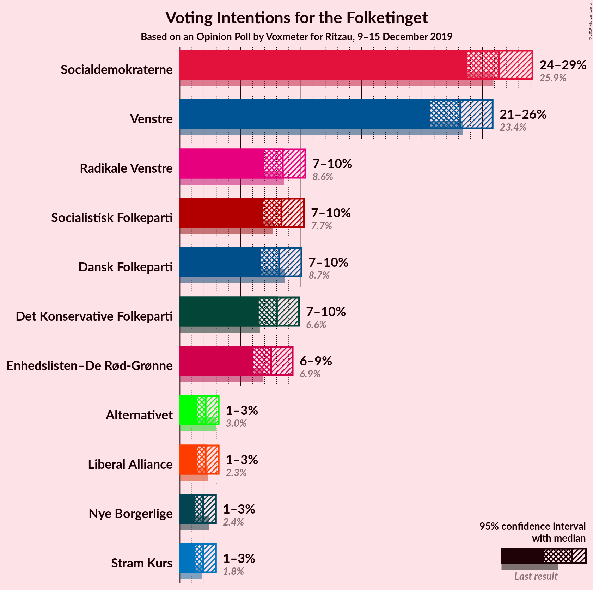

### Confidence Intervals

| Party | Last Result | Poll Result | 80% Confidence Interval | 90% Confidence Interval | 95% Confidence Interval | 99% Confidence Interval |
|:-----:|:-----------:|:-----------:|:-----------------------:|:-----------------------:|:-----------------------:|:-----------------------:|
| Socialdemokraterne | 25.9% | 26.4% | 24.6–28.2% |24.2–28.7% |23.7–29.1% |23.0–30.0% |
| Venstre | 23.4% | 23.2% | 21.5–24.9% |21.1–25.4% |20.7–25.8% |19.9–26.7% |
| Radikale Venstre | 8.6% | 8.5% | 7.5–9.7% |7.2–10.1% |6.9–10.4% |6.5–11.0% |
| Socialistisk Folkeparti | 7.7% | 8.4% | 7.4–9.6% |7.1–10.0% |6.9–10.3% |6.4–10.9% |
| Dansk Folkeparti | 8.7% | 8.2% | 7.2–9.4% |6.9–9.7% |6.7–10.0% |6.2–10.6% |
| Det Konservative Folkeparti | 6.6% | 8.0% | 7.0–9.2% |6.7–9.5% |6.5–9.8% |6.1–10.4% |
| Enhedslisten–De Rød-Grønne | 6.9% | 7.5% | 6.6–8.7% |6.3–9.0% |6.1–9.3% |5.6–9.9% |
| Liberal Alliance | 2.3% | 2.1% | 1.6–2.8% |1.5–3.0% |1.4–3.2% |1.2–3.6% |
| Alternativet | 3.0% | 2.1% | 1.6–2.8% |1.5–3.0% |1.4–3.2% |1.2–3.6% |
| Nye Borgerlige | 2.4% | 1.9% | 1.5–2.6% |1.4–2.8% |1.2–3.0% |1.1–3.3% |
| Stram Kurs | 1.8% | 1.9% | 1.5–2.6% |1.4–2.8% |1.2–3.0% |1.1–3.3% |

*Note:* The poll result column reflects the actual value used in the calculations. Published results may vary slightly, and in addition be rounded to fewer digits.

## Seats

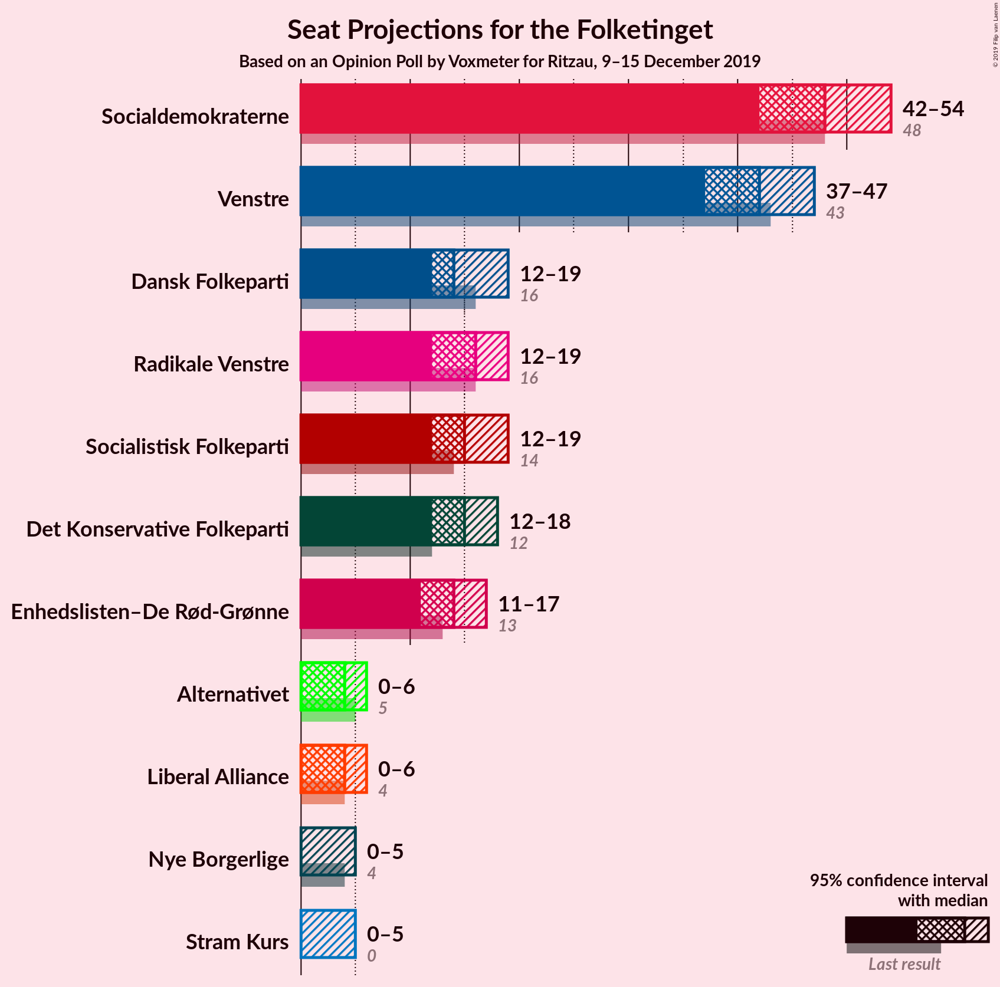

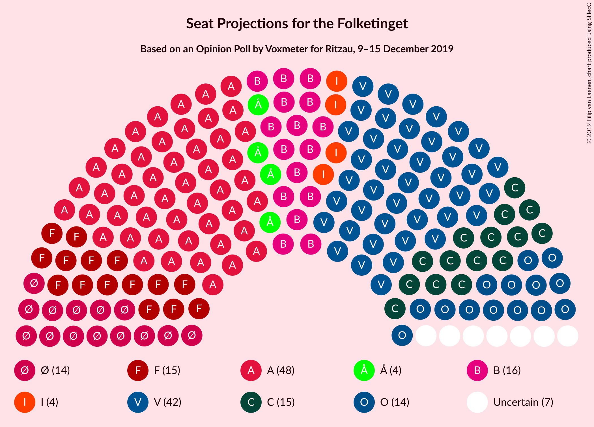

### Confidence Intervals

| Party | Last Result | Median | 80% Confidence Interval | 90% Confidence Interval | 95% Confidence Interval | 99% Confidence Interval |
|:-----:|:-----------:|:------:|:-----------------------:|:-----------------------:|:-----------------------:|:-----------------------:|
| <a href="#socialdemokraterne">Socialdemokraterne</a> | 48 | 48 | 44–53 |44–53 |42–54 |41–55 |
| <a href="#venstre">Venstre</a> | 43 | 42 | 39–45 |38–46 |37–47 |36–49 |
| <a href="#radikale-venstre">Radikale Venstre</a> | 16 | 16 | 13–17 |12–18 |12–19 |12–20 |
| <a href="#socialistisk-folkeparti">Socialistisk Folkeparti</a> | 14 | 15 | 14–17 |13–18 |12–19 |12–20 |
| <a href="#dansk-folkeparti">Dansk Folkeparti</a> | 16 | 14 | 12–17 |12–18 |12–19 |12–19 |
| <a href="#det-konservative-folkeparti">Det Konservative Folkeparti</a> | 12 | 15 | 13–16 |12–17 |12–18 |11–19 |
| <a href="#enhedslisten–de-rød-grønne">Enhedslisten–De Rød-Grønne</a> | 13 | 14 | 12–16 |12–16 |11–17 |11–18 |
| <a href="#liberal-alliance">Liberal Alliance</a> | 4 | 4 | 0–5 |0–5 |0–6 |0–6 |
| <a href="#alternativet">Alternativet</a> | 5 | 4 | 0–5 |0–5 |0–6 |0–6 |
| <a href="#nye-borgerlige">Nye Borgerlige</a> | 4 | 0 | 0–5 |0–5 |0–5 |0–6 |
| <a href="#stram-kurs">Stram Kurs</a> | 0 | 0 | 0–5 |0–5 |0–5 |0–6 |

### Socialdemokraterne

*For a full overview of the results for this party, see the [Socialdemokraterne](party-socialdemokraterne.html) page.*

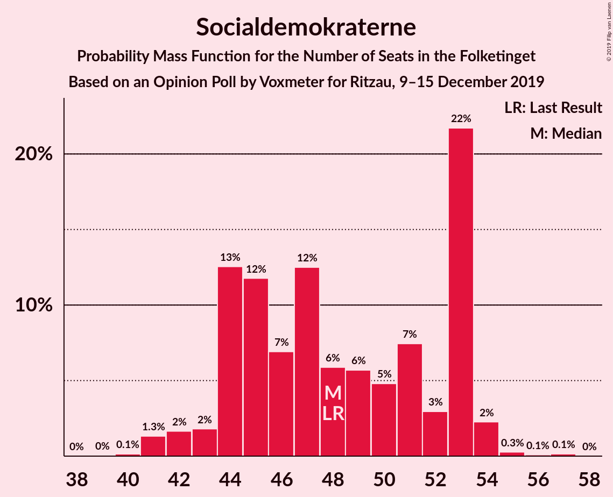

| Number of Seats | Probability | Accumulated | Special Marks |
|:---------------:|:-----------:|:-----------:|:-------------:|
| 40 | 0.1% | 100% |  |
| 41 | 1.3% | 99.8% |  |
| 42 | 2% | 98% |  |
| 43 | 2% | 97% |  |
| 44 | 13% | 95% |  |
| 45 | 12% | 82% |  |
| 46 | 7% | 71% |  |
| 47 | 12% | 64% |  |
| 48 | 6% | 51% | Last Result, Median |
| 49 | 6% | 45% |  |
| 50 | 5% | 40% |  |
| 51 | 7% | 35% |  |
| 52 | 3% | 27% |  |
| 53 | 22% | 25% |  |
| 54 | 2% | 3% |  |
| 55 | 0.3% | 0.5% |  |
| 56 | 0.1% | 0.3% |  |
| 57 | 0.1% | 0.2% |  |
| 58 | 0% | 0% |  |

### Venstre

*For a full overview of the results for this party, see the [Venstre](party-venstre.html) page.*

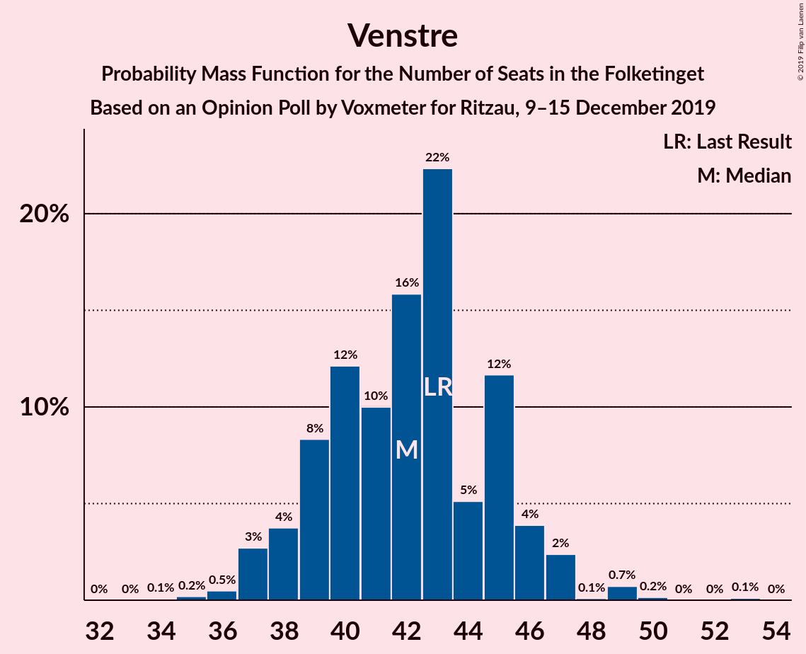

| Number of Seats | Probability | Accumulated | Special Marks |
|:---------------:|:-----------:|:-----------:|:-------------:|
| 34 | 0.1% | 100% |  |
| 35 | 0.2% | 99.9% |  |
| 36 | 0.5% | 99.7% |  |
| 37 | 3% | 99.2% |  |
| 38 | 4% | 97% |  |
| 39 | 8% | 93% |  |
| 40 | 12% | 84% |  |
| 41 | 10% | 72% |  |
| 42 | 16% | 62% | Median |
| 43 | 22% | 46% | Last Result |
| 44 | 5% | 24% |  |
| 45 | 12% | 19% |  |
| 46 | 4% | 7% |  |
| 47 | 2% | 3% |  |
| 48 | 0.1% | 1.1% |  |
| 49 | 0.7% | 1.0% |  |
| 50 | 0.2% | 0.3% |  |
| 51 | 0% | 0.1% |  |
| 52 | 0% | 0.1% |  |
| 53 | 0.1% | 0.1% |  |
| 54 | 0% | 0% |  |

### Radikale Venstre

*For a full overview of the results for this party, see the [Radikale Venstre](party-radikalevenstre.html) page.*

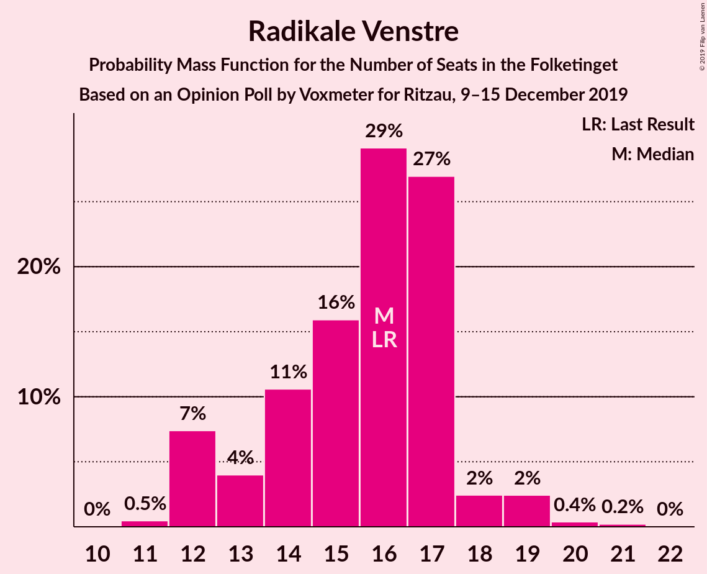

| Number of Seats | Probability | Accumulated | Special Marks |
|:---------------:|:-----------:|:-----------:|:-------------:|
| 11 | 0.5% | 100% |  |
| 12 | 7% | 99.5% |  |
| 13 | 4% | 92% |  |
| 14 | 11% | 88% |  |
| 15 | 16% | 78% |  |
| 16 | 29% | 62% | Last Result, Median |
| 17 | 27% | 32% |  |
| 18 | 2% | 6% |  |
| 19 | 2% | 3% |  |
| 20 | 0.4% | 0.6% |  |
| 21 | 0.2% | 0.2% |  |
| 22 | 0% | 0% |  |

### Socialistisk Folkeparti

*For a full overview of the results for this party, see the [Socialistisk Folkeparti](party-socialistiskfolkeparti.html) page.*

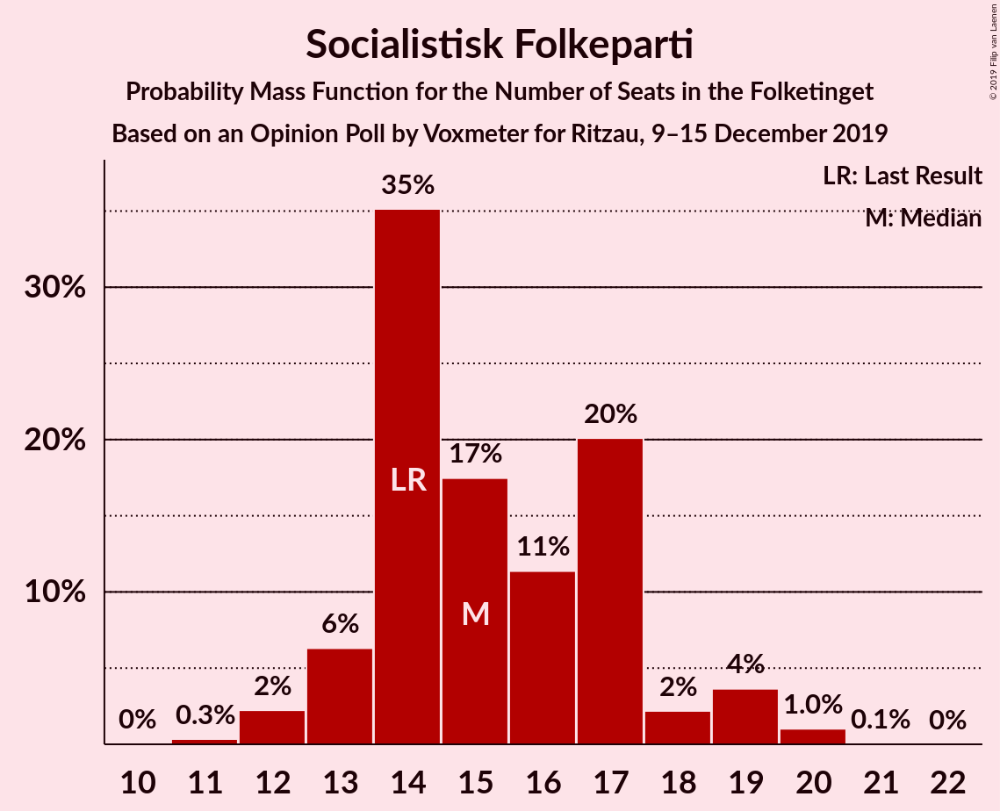

| Number of Seats | Probability | Accumulated | Special Marks |
|:---------------:|:-----------:|:-----------:|:-------------:|
| 11 | 0.3% | 100% |  |
| 12 | 2% | 99.6% |  |
| 13 | 6% | 97% |  |
| 14 | 35% | 91% | Last Result |
| 15 | 17% | 56% | Median |
| 16 | 11% | 38% |  |
| 17 | 20% | 27% |  |
| 18 | 2% | 7% |  |
| 19 | 4% | 5% |  |
| 20 | 1.0% | 1.1% |  |
| 21 | 0.1% | 0.1% |  |
| 22 | 0% | 0% |  |

### Dansk Folkeparti

*For a full overview of the results for this party, see the [Dansk Folkeparti](party-danskfolkeparti.html) page.*

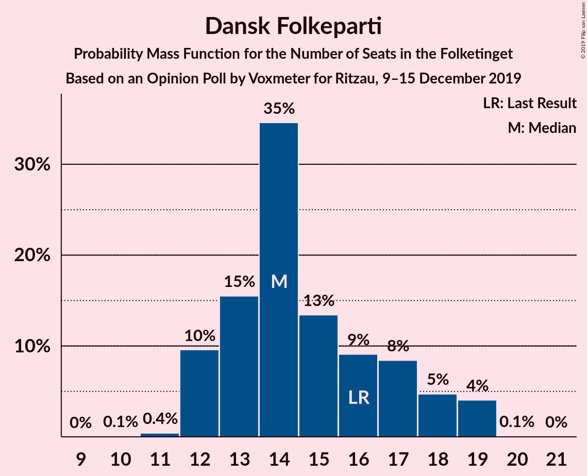

| Number of Seats | Probability | Accumulated | Special Marks |
|:---------------:|:-----------:|:-----------:|:-------------:|
| 10 | 0.1% | 100% |  |
| 11 | 0.4% | 99.9% |  |
| 12 | 10% | 99.5% |  |
| 13 | 15% | 90% |  |
| 14 | 35% | 74% | Median |
| 15 | 13% | 40% |  |
| 16 | 9% | 26% | Last Result |
| 17 | 8% | 17% |  |
| 18 | 5% | 9% |  |
| 19 | 4% | 4% |  |
| 20 | 0.1% | 0.1% |  |
| 21 | 0% | 0% |  |

### Det Konservative Folkeparti

*For a full overview of the results for this party, see the [Det Konservative Folkeparti](party-detkonservativefolkeparti.html) page.*

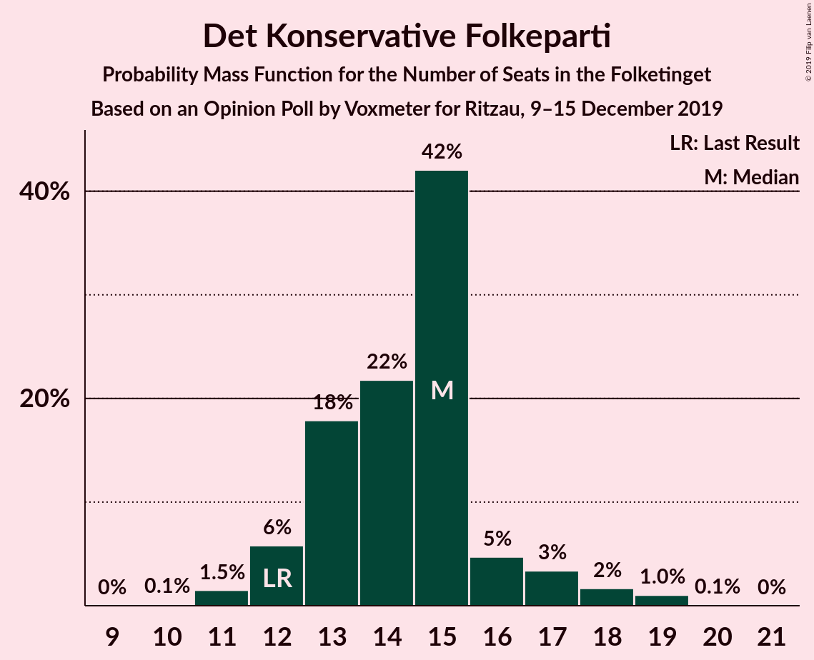

| Number of Seats | Probability | Accumulated | Special Marks |
|:---------------:|:-----------:|:-----------:|:-------------:|
| 10 | 0.1% | 100% |  |
| 11 | 1.5% | 99.9% |  |
| 12 | 6% | 98% | Last Result |
| 13 | 18% | 93% |  |
| 14 | 22% | 75% |  |
| 15 | 42% | 53% | Median |
| 16 | 5% | 11% |  |
| 17 | 3% | 6% |  |
| 18 | 2% | 3% |  |
| 19 | 1.0% | 1.1% |  |
| 20 | 0.1% | 0.1% |  |
| 21 | 0% | 0% |  |

### Enhedslisten–De Rød-Grønne

*For a full overview of the results for this party, see the [Enhedslisten–De Rød-Grønne](party-enhedslisten–derød-grønne.html) page.*

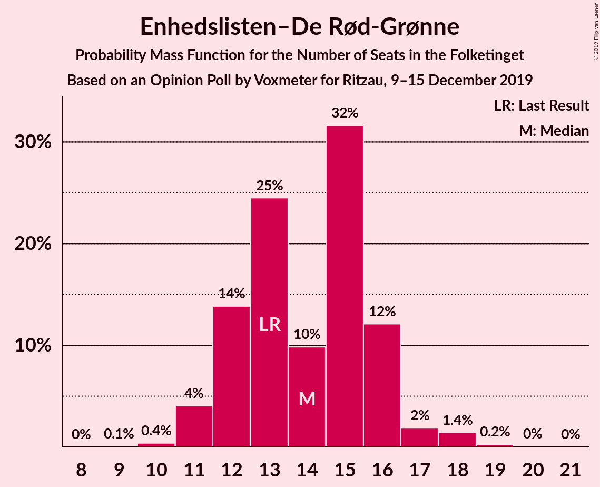

| Number of Seats | Probability | Accumulated | Special Marks |
|:---------------:|:-----------:|:-----------:|:-------------:|
| 9 | 0.1% | 100% |  |
| 10 | 0.4% | 99.9% |  |
| 11 | 4% | 99.5% |  |
| 12 | 14% | 95% |  |
| 13 | 25% | 82% | Last Result |
| 14 | 10% | 57% | Median |
| 15 | 32% | 47% |  |
| 16 | 12% | 16% |  |
| 17 | 2% | 4% |  |
| 18 | 1.4% | 2% |  |
| 19 | 0.2% | 0.3% |  |
| 20 | 0% | 0.1% |  |
| 21 | 0% | 0% |  |

### Liberal Alliance

*For a full overview of the results for this party, see the [Liberal Alliance](party-liberalalliance.html) page.*

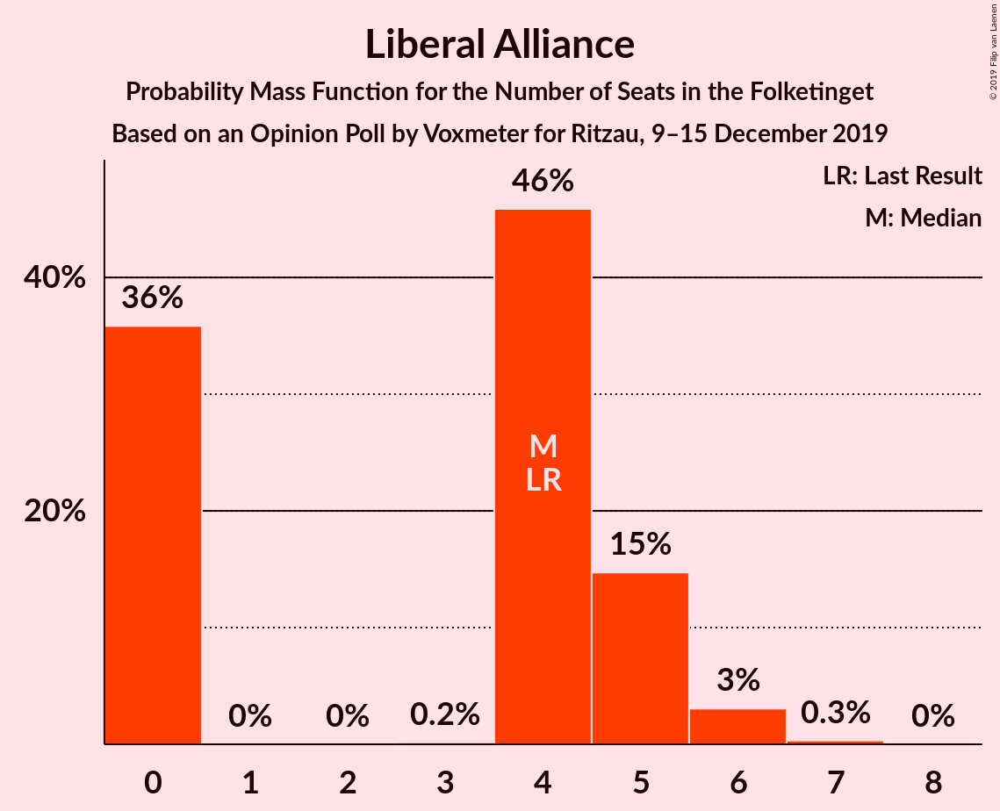

| Number of Seats | Probability | Accumulated | Special Marks |
|:---------------:|:-----------:|:-----------:|:-------------:|
| 0 | 36% | 100% |  |
| 1 | 0% | 64% |  |
| 2 | 0% | 64% |  |
| 3 | 0.2% | 64% |  |
| 4 | 46% | 64% | Last Result, Median |
| 5 | 15% | 18% |  |
| 6 | 3% | 3% |  |
| 7 | 0.3% | 0.3% |  |
| 8 | 0% | 0% |  |

### Alternativet

*For a full overview of the results for this party, see the [Alternativet](party-alternativet.html) page.*

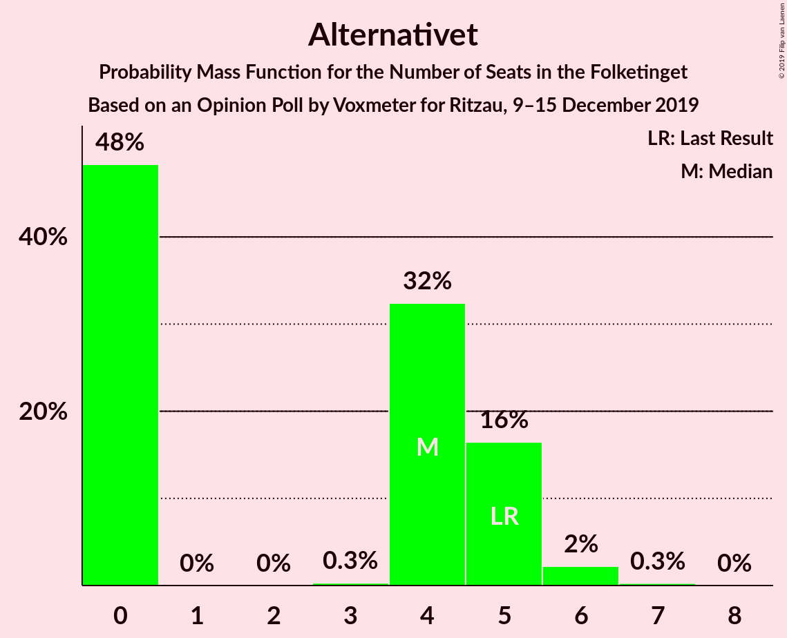

| Number of Seats | Probability | Accumulated | Special Marks |
|:---------------:|:-----------:|:-----------:|:-------------:|
| 0 | 48% | 100% |  |
| 1 | 0% | 52% |  |
| 2 | 0% | 52% |  |
| 3 | 0.3% | 52% |  |
| 4 | 32% | 51% | Median |
| 5 | 16% | 19% | Last Result |
| 6 | 2% | 3% |  |
| 7 | 0.3% | 0.3% |  |
| 8 | 0% | 0% |  |

### Nye Borgerlige

*For a full overview of the results for this party, see the [Nye Borgerlige](party-nyeborgerlige.html) page.*

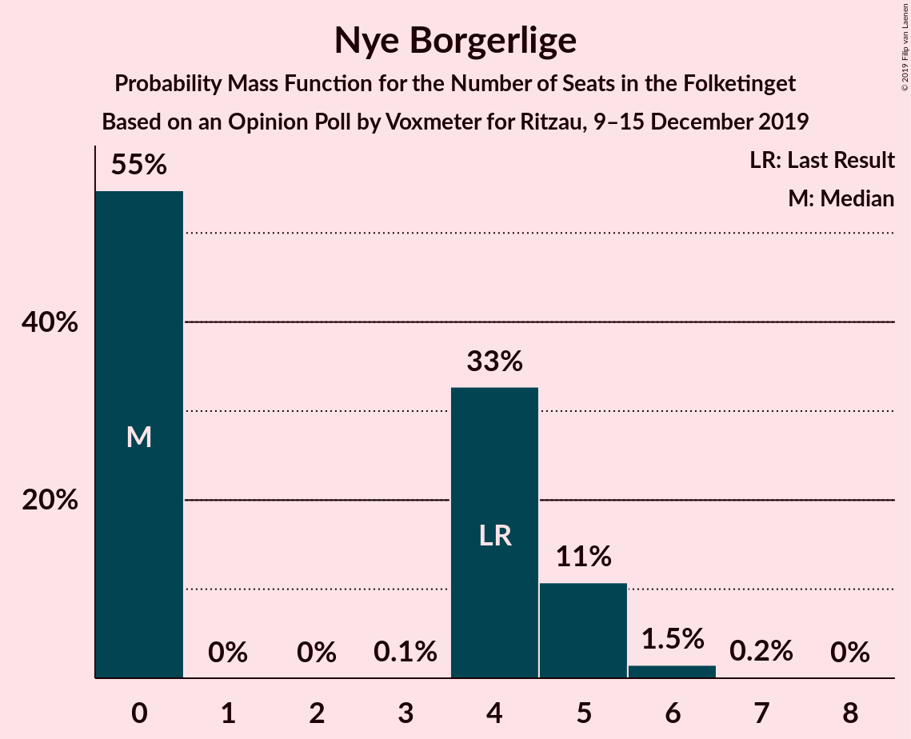

| Number of Seats | Probability | Accumulated | Special Marks |
|:---------------:|:-----------:|:-----------:|:-------------:|
| 0 | 55% | 100% | Median |
| 1 | 0% | 45% |  |
| 2 | 0% | 45% |  |
| 3 | 0.1% | 45% |  |
| 4 | 33% | 45% | Last Result |
| 5 | 11% | 12% |  |
| 6 | 1.5% | 2% |  |
| 7 | 0.2% | 0.2% |  |
| 8 | 0% | 0% |  |

### Stram Kurs

*For a full overview of the results for this party, see the [Stram Kurs](party-stramkurs.html) page.*

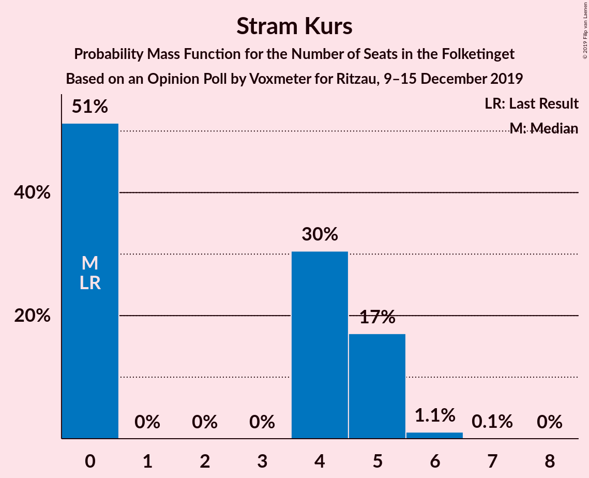

| Number of Seats | Probability | Accumulated | Special Marks |
|:---------------:|:-----------:|:-----------:|:-------------:|
| 0 | 51% | 100% | Last Result, Median |
| 1 | 0% | 49% |  |
| 2 | 0% | 49% |  |
| 3 | 0% | 49% |  |
| 4 | 30% | 49% |  |
| 5 | 17% | 18% |  |
| 6 | 1.1% | 1.1% |  |
| 7 | 0.1% | 0.1% |  |
| 8 | 0% | 0% |  |

## Coalitions

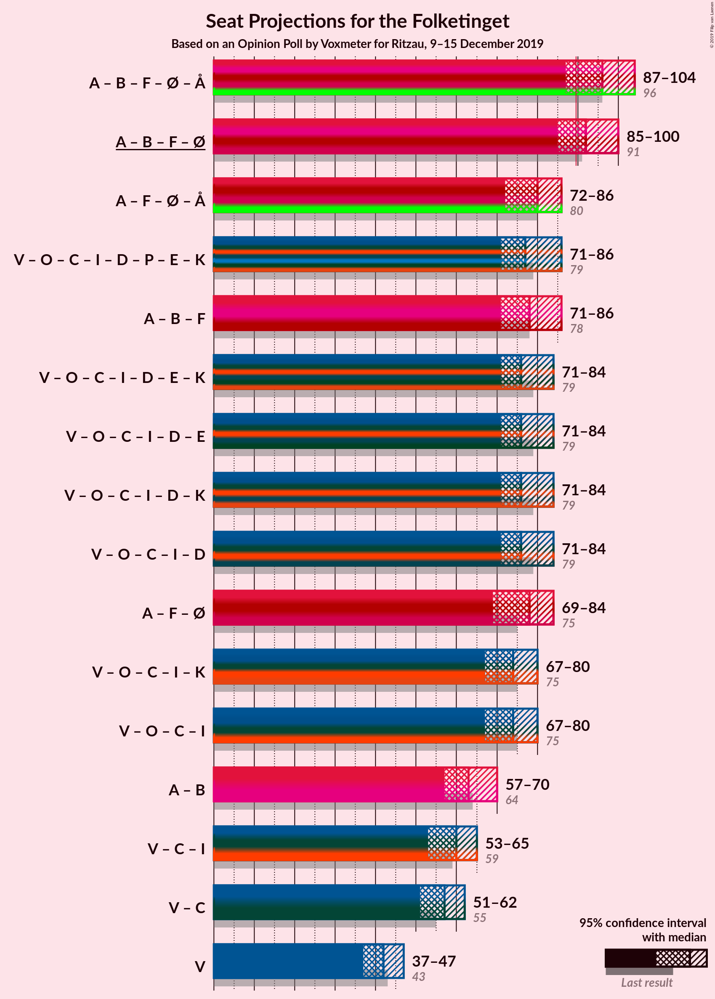

### Confidence Intervals

| Coalition | Last Result | Median | Majority? | 80% Confidence Interval | 90% Confidence Interval | 95% Confidence Interval | 99% Confidence Interval |
|:---------:|:-----------:|:------:|:---------:|:-----------------------:|:-----------------------:|:-----------------------:|:-----------------------:|
| Socialdemokraterne – Radikale Venstre – Socialistisk Folkeparti – Enhedslisten–De Rød-Grønne – Alternativet | 96 | 96 | 94% | 90–99 | 89–101 | 87–104 | 86–104 |
| Socialdemokraterne – Radikale Venstre – Socialistisk Folkeparti – Enhedslisten–De Rød-Grønne | 91 | 92 | 79% | 88–99 | 86–99 | 85–100 | 83–101 |
| Socialdemokraterne – Socialistisk Folkeparti – Enhedslisten–De Rød-Grønne – Alternativet | 80 | 80 | 0.2% | 75–83 | 74–85 | 72–86 | 70–88 |
| Socialdemokraterne – Radikale Venstre – Socialistisk Folkeparti | 78 | 78 | 0.2% | 74–84 | 73–84 | 71–86 | 70–87 |
| Venstre – Dansk Folkeparti – Det Konservative Folkeparti – Liberal Alliance – Nye Borgerlige | 79 | 76 | 0% | 71–81 | 71–82 | 71–84 | 67–85 |
| Socialdemokraterne – Socialistisk Folkeparti – Enhedslisten–De Rød-Grønne | 75 | 78 | 0% | 73–82 | 71–82 | 69–84 | 67–85 |
| Venstre – Dansk Folkeparti – Det Konservative Folkeparti – Liberal Alliance | 75 | 74 | 0% | 68–78 | 67–80 | 67–80 | 66–83 |
| Socialdemokraterne – Radikale Venstre | 64 | 63 | 0% | 59–70 | 58–70 | 57–70 | 56–71 |
| Venstre – Det Konservative Folkeparti – Liberal Alliance | 59 | 60 | 0% | 55–63 | 55–64 | 53–65 | 51–68 |
| Venstre – Det Konservative Folkeparti | 55 | 57 | 0% | 52–60 | 52–60 | 51–62 | 50–63 |
| Venstre | 43 | 42 | 0% | 39–45 | 38–46 | 37–47 | 36–49 |

### Socialdemokraterne – Radikale Venstre – Socialistisk Folkeparti – Enhedslisten–De Rød-Grønne – Alternativet

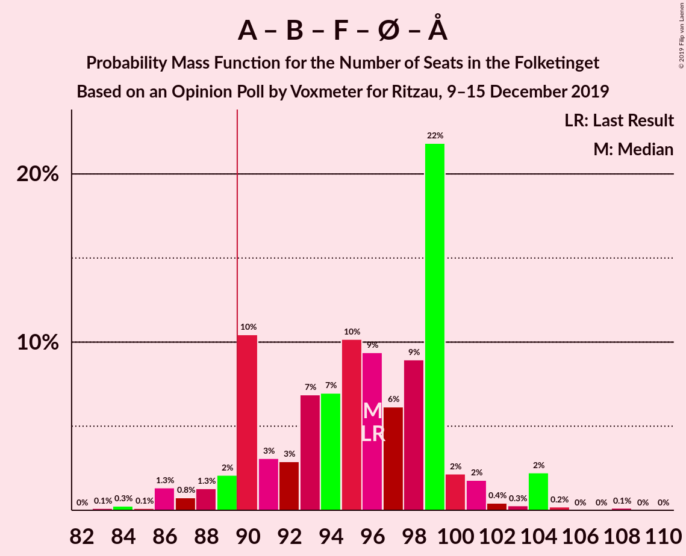

| Number of Seats | Probability | Accumulated | Special Marks |
|:---------------:|:-----------:|:-----------:|:-------------:|
| 83 | 0.1% | 100% |  |
| 84 | 0.3% | 99.9% |  |
| 85 | 0.1% | 99.6% |  |
| 86 | 1.3% | 99.5% |  |
| 87 | 0.8% | 98% |  |
| 88 | 1.3% | 97% |  |
| 89 | 2% | 96% |  |
| 90 | 10% | 94% | Majority |
| 91 | 3% | 84% |  |
| 92 | 3% | 80% |  |
| 93 | 7% | 78% |  |
| 94 | 7% | 71% |  |
| 95 | 10% | 64% |  |
| 96 | 9% | 54% | Last Result |
| 97 | 6% | 44% | Median |
| 98 | 9% | 38% |  |
| 99 | 22% | 29% |  |
| 100 | 2% | 7% |  |
| 101 | 2% | 5% |  |
| 102 | 0.4% | 3% |  |
| 103 | 0.3% | 3% |  |
| 104 | 2% | 3% |  |
| 105 | 0.2% | 0.4% |  |
| 106 | 0% | 0.2% |  |
| 107 | 0% | 0.2% |  |
| 108 | 0.1% | 0.1% |  |
| 109 | 0% | 0% |  |

### Socialdemokraterne – Radikale Venstre – Socialistisk Folkeparti – Enhedslisten–De Rød-Grønne

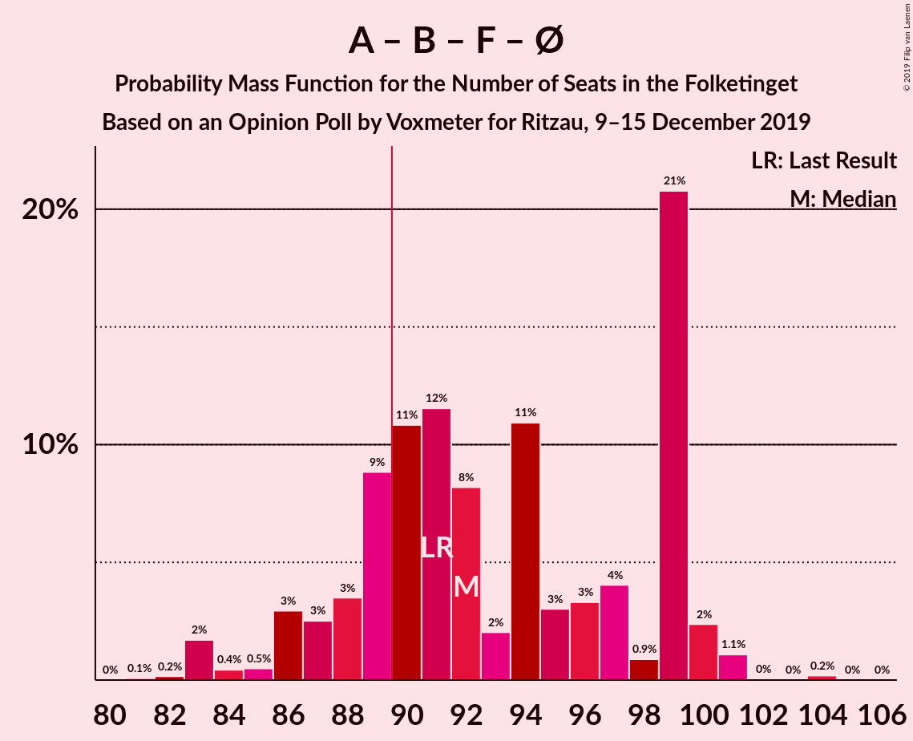

| Number of Seats | Probability | Accumulated | Special Marks |
|:---------------:|:-----------:|:-----------:|:-------------:|
| 81 | 0.1% | 100% |  |
| 82 | 0.2% | 99.9% |  |
| 83 | 2% | 99.7% |  |
| 84 | 0.4% | 98% |  |
| 85 | 0.5% | 98% |  |
| 86 | 3% | 97% |  |
| 87 | 3% | 94% |  |
| 88 | 3% | 92% |  |
| 89 | 9% | 88% |  |
| 90 | 11% | 79% | Majority |
| 91 | 12% | 68% | Last Result |
| 92 | 8% | 57% |  |
| 93 | 2% | 49% | Median |
| 94 | 11% | 47% |  |
| 95 | 3% | 36% |  |
| 96 | 3% | 33% |  |
| 97 | 4% | 29% |  |
| 98 | 0.9% | 25% |  |
| 99 | 21% | 24% |  |
| 100 | 2% | 4% |  |
| 101 | 1.1% | 1.3% |  |
| 102 | 0% | 0.3% |  |
| 103 | 0% | 0.2% |  |
| 104 | 0.2% | 0.2% |  |
| 105 | 0% | 0% |  |

### Socialdemokraterne – Socialistisk Folkeparti – Enhedslisten–De Rød-Grønne – Alternativet

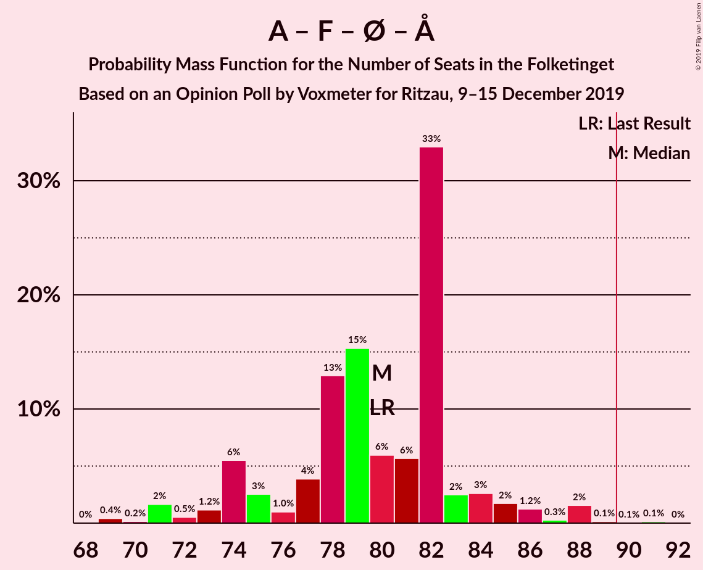

| Number of Seats | Probability | Accumulated | Special Marks |
|:---------------:|:-----------:|:-----------:|:-------------:|
| 68 | 0% | 100% |  |
| 69 | 0.4% | 99.9% |  |
| 70 | 0.2% | 99.5% |  |
| 71 | 2% | 99.4% |  |
| 72 | 0.5% | 98% |  |
| 73 | 1.2% | 97% |  |
| 74 | 6% | 96% |  |
| 75 | 3% | 91% |  |
| 76 | 1.0% | 88% |  |
| 77 | 4% | 87% |  |
| 78 | 13% | 83% |  |
| 79 | 15% | 70% |  |
| 80 | 6% | 55% | Last Result |
| 81 | 6% | 49% | Median |
| 82 | 33% | 43% |  |
| 83 | 2% | 10% |  |
| 84 | 3% | 8% |  |
| 85 | 2% | 5% |  |
| 86 | 1.2% | 3% |  |
| 87 | 0.3% | 2% |  |
| 88 | 2% | 2% |  |
| 89 | 0.1% | 0.4% |  |
| 90 | 0.1% | 0.2% | Majority |
| 91 | 0.1% | 0.2% |  |
| 92 | 0% | 0% |  |

### Socialdemokraterne – Radikale Venstre – Socialistisk Folkeparti

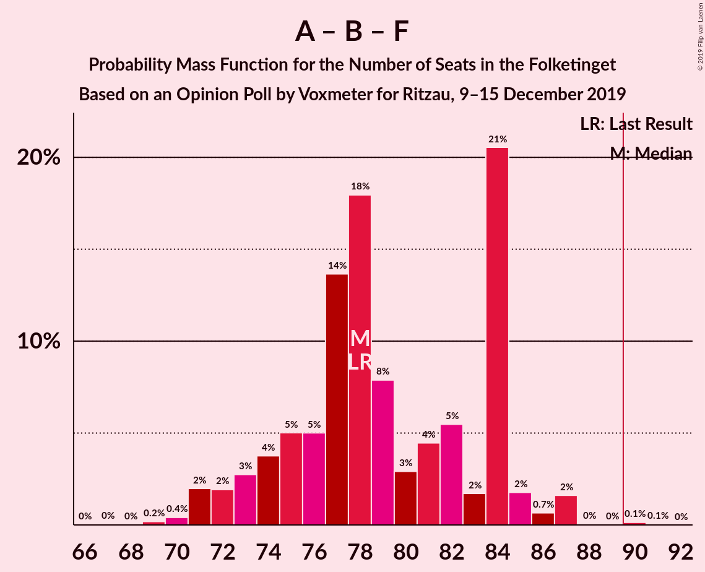

| Number of Seats | Probability | Accumulated | Special Marks |
|:---------------:|:-----------:|:-----------:|:-------------:|
| 67 | 0% | 100% |  |
| 68 | 0% | 99.9% |  |
| 69 | 0.2% | 99.9% |  |
| 70 | 0.4% | 99.7% |  |
| 71 | 2% | 99.3% |  |
| 72 | 2% | 97% |  |
| 73 | 3% | 95% |  |
| 74 | 4% | 93% |  |
| 75 | 5% | 89% |  |
| 76 | 5% | 84% |  |
| 77 | 14% | 79% |  |
| 78 | 18% | 65% | Last Result |
| 79 | 8% | 47% | Median |
| 80 | 3% | 39% |  |
| 81 | 4% | 36% |  |
| 82 | 5% | 32% |  |
| 83 | 2% | 27% |  |
| 84 | 21% | 25% |  |
| 85 | 2% | 4% |  |
| 86 | 0.7% | 3% |  |
| 87 | 2% | 2% |  |
| 88 | 0% | 0.3% |  |
| 89 | 0% | 0.2% |  |
| 90 | 0.1% | 0.2% | Majority |
| 91 | 0.1% | 0.1% |  |
| 92 | 0% | 0% |  |

### Venstre – Dansk Folkeparti – Det Konservative Folkeparti – Liberal Alliance – Nye Borgerlige

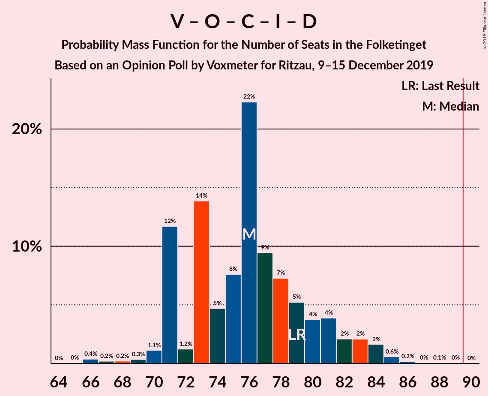

| Number of Seats | Probability | Accumulated | Special Marks |
|:---------------:|:-----------:|:-----------:|:-------------:|
| 65 | 0% | 100% |  |
| 66 | 0.4% | 99.9% |  |
| 67 | 0.2% | 99.6% |  |
| 68 | 0.2% | 99.4% |  |
| 69 | 0.3% | 99.2% |  |
| 70 | 1.1% | 98.8% |  |
| 71 | 12% | 98% |  |
| 72 | 1.2% | 86% |  |
| 73 | 14% | 85% |  |
| 74 | 5% | 71% |  |
| 75 | 8% | 66% | Median |
| 76 | 22% | 59% |  |
| 77 | 9% | 36% |  |
| 78 | 7% | 27% |  |
| 79 | 5% | 20% | Last Result |
| 80 | 4% | 14% |  |
| 81 | 4% | 11% |  |
| 82 | 2% | 7% |  |
| 83 | 2% | 5% |  |
| 84 | 2% | 3% |  |
| 85 | 0.6% | 0.9% |  |
| 86 | 0.2% | 0.3% |  |
| 87 | 0% | 0.2% |  |
| 88 | 0.1% | 0.1% |  |
| 89 | 0% | 0.1% |  |
| 90 | 0% | 0% | Majority |

### Socialdemokraterne – Socialistisk Folkeparti – Enhedslisten–De Rød-Grønne

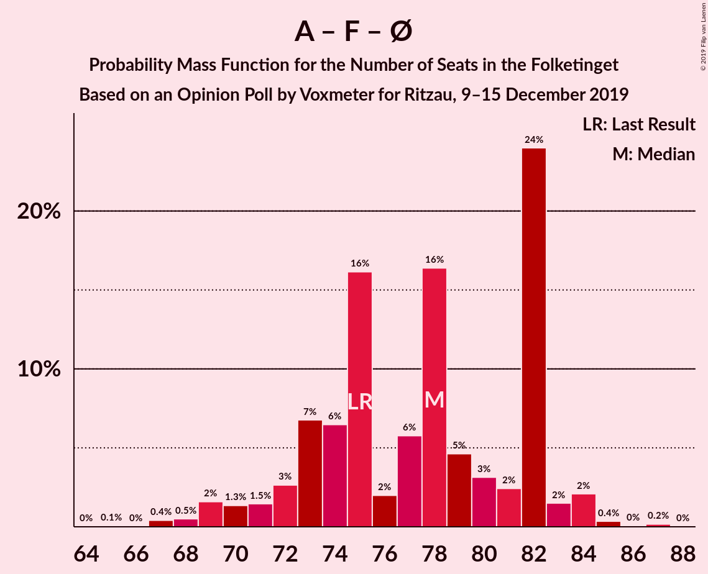

| Number of Seats | Probability | Accumulated | Special Marks |
|:---------------:|:-----------:|:-----------:|:-------------:|
| 65 | 0.1% | 100% |  |
| 66 | 0% | 99.9% |  |
| 67 | 0.4% | 99.9% |  |
| 68 | 0.5% | 99.5% |  |
| 69 | 2% | 99.0% |  |
| 70 | 1.3% | 97% |  |
| 71 | 1.5% | 96% |  |
| 72 | 3% | 95% |  |
| 73 | 7% | 92% |  |
| 74 | 6% | 85% |  |
| 75 | 16% | 79% | Last Result |
| 76 | 2% | 63% |  |
| 77 | 6% | 61% | Median |
| 78 | 16% | 55% |  |
| 79 | 5% | 38% |  |
| 80 | 3% | 34% |  |
| 81 | 2% | 31% |  |
| 82 | 24% | 28% |  |
| 83 | 2% | 4% |  |
| 84 | 2% | 3% |  |
| 85 | 0.4% | 0.6% |  |
| 86 | 0% | 0.3% |  |
| 87 | 0.2% | 0.2% |  |
| 88 | 0% | 0% |  |

### Venstre – Dansk Folkeparti – Det Konservative Folkeparti – Liberal Alliance

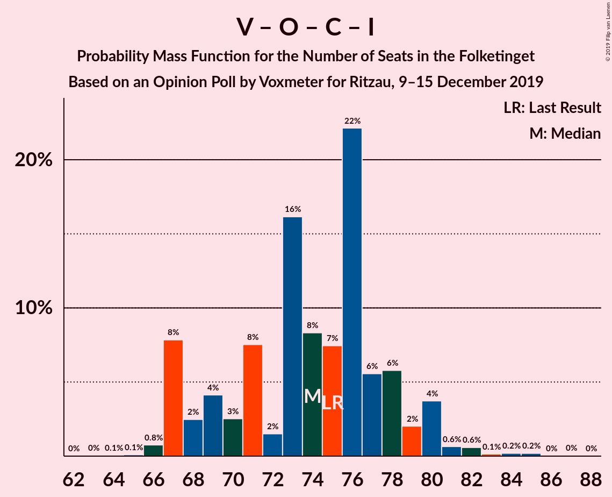

| Number of Seats | Probability | Accumulated | Special Marks |
|:---------------:|:-----------:|:-----------:|:-------------:|
| 63 | 0% | 100% |  |
| 64 | 0.1% | 99.9% |  |
| 65 | 0.1% | 99.9% |  |
| 66 | 0.8% | 99.8% |  |
| 67 | 8% | 99.0% |  |
| 68 | 2% | 91% |  |
| 69 | 4% | 89% |  |
| 70 | 3% | 85% |  |
| 71 | 8% | 82% |  |
| 72 | 2% | 75% |  |
| 73 | 16% | 73% |  |
| 74 | 8% | 57% |  |
| 75 | 7% | 49% | Last Result, Median |
| 76 | 22% | 41% |  |
| 77 | 6% | 19% |  |
| 78 | 6% | 13% |  |
| 79 | 2% | 8% |  |
| 80 | 4% | 6% |  |
| 81 | 0.6% | 2% |  |
| 82 | 0.6% | 1.2% |  |
| 83 | 0.1% | 0.6% |  |
| 84 | 0.2% | 0.4% |  |
| 85 | 0.2% | 0.3% |  |
| 86 | 0% | 0.1% |  |
| 87 | 0% | 0.1% |  |
| 88 | 0% | 0% |  |

### Socialdemokraterne – Radikale Venstre

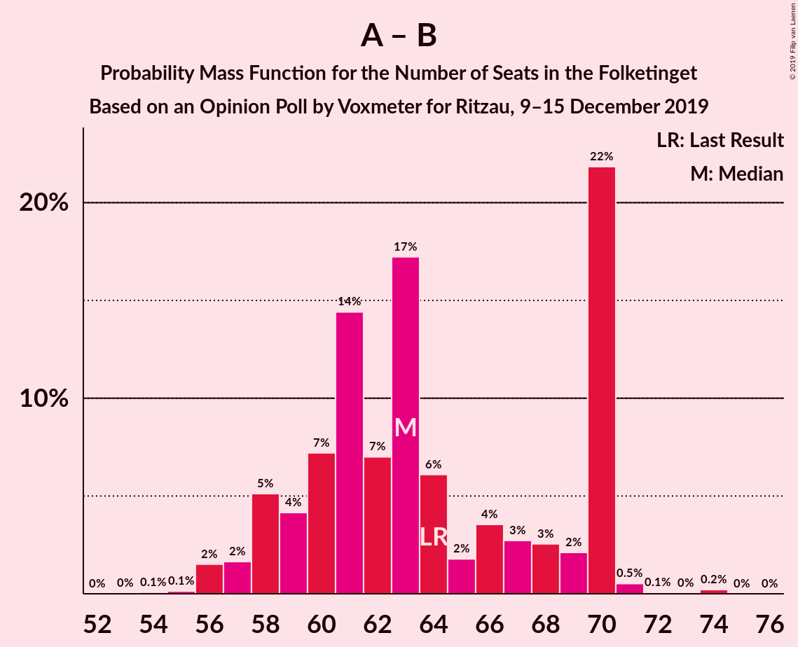

| Number of Seats | Probability | Accumulated | Special Marks |
|:---------------:|:-----------:|:-----------:|:-------------:|
| 54 | 0.1% | 100% |  |
| 55 | 0.1% | 99.9% |  |
| 56 | 2% | 99.8% |  |
| 57 | 2% | 98% |  |
| 58 | 5% | 97% |  |
| 59 | 4% | 91% |  |
| 60 | 7% | 87% |  |
| 61 | 14% | 80% |  |
| 62 | 7% | 66% |  |
| 63 | 17% | 59% |  |
| 64 | 6% | 41% | Last Result, Median |
| 65 | 2% | 35% |  |
| 66 | 4% | 34% |  |
| 67 | 3% | 30% |  |
| 68 | 3% | 27% |  |
| 69 | 2% | 25% |  |
| 70 | 22% | 23% |  |
| 71 | 0.5% | 0.8% |  |
| 72 | 0.1% | 0.3% |  |
| 73 | 0% | 0.3% |  |
| 74 | 0.2% | 0.2% |  |
| 75 | 0% | 0% |  |

### Venstre – Det Konservative Folkeparti – Liberal Alliance

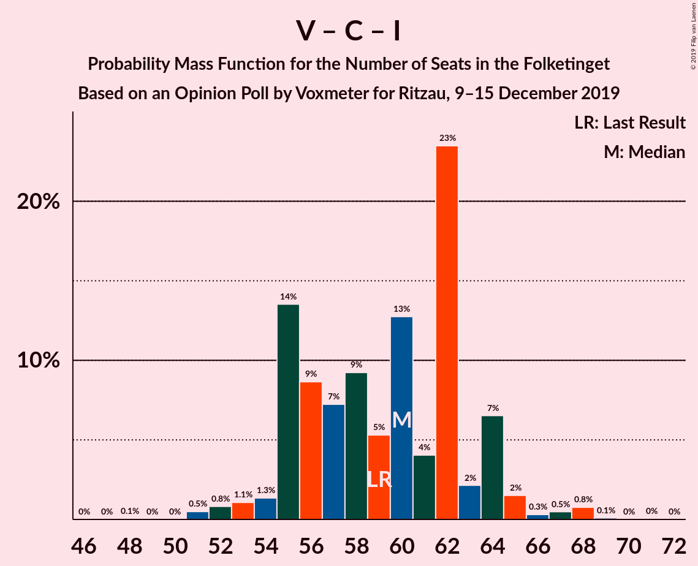

| Number of Seats | Probability | Accumulated | Special Marks |
|:---------------:|:-----------:|:-----------:|:-------------:|
| 48 | 0.1% | 100% |  |
| 49 | 0% | 99.9% |  |
| 50 | 0% | 99.9% |  |
| 51 | 0.5% | 99.9% |  |
| 52 | 0.8% | 99.4% |  |
| 53 | 1.1% | 98.6% |  |
| 54 | 1.3% | 97% |  |
| 55 | 14% | 96% |  |
| 56 | 9% | 83% |  |
| 57 | 7% | 74% |  |
| 58 | 9% | 67% |  |
| 59 | 5% | 57% | Last Result |
| 60 | 13% | 52% |  |
| 61 | 4% | 39% | Median |
| 62 | 23% | 35% |  |
| 63 | 2% | 12% |  |
| 64 | 7% | 10% |  |
| 65 | 2% | 3% |  |
| 66 | 0.3% | 2% |  |
| 67 | 0.5% | 1.4% |  |
| 68 | 0.8% | 0.9% |  |
| 69 | 0.1% | 0.2% |  |
| 70 | 0% | 0.1% |  |
| 71 | 0% | 0% |  |

### Venstre – Det Konservative Folkeparti

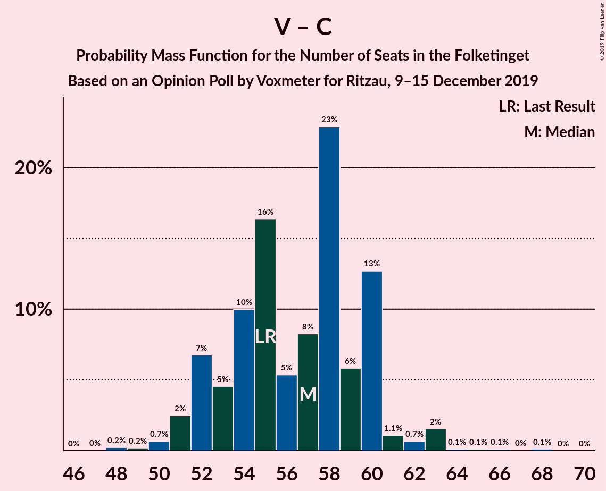

| Number of Seats | Probability | Accumulated | Special Marks |
|:---------------:|:-----------:|:-----------:|:-------------:|
| 48 | 0.2% | 100% |  |
| 49 | 0.2% | 99.7% |  |
| 50 | 0.7% | 99.6% |  |
| 51 | 2% | 98.9% |  |
| 52 | 7% | 96% |  |
| 53 | 5% | 90% |  |
| 54 | 10% | 85% |  |
| 55 | 16% | 75% | Last Result |
| 56 | 5% | 59% |  |
| 57 | 8% | 53% | Median |
| 58 | 23% | 45% |  |
| 59 | 6% | 22% |  |
| 60 | 13% | 16% |  |
| 61 | 1.1% | 4% |  |
| 62 | 0.7% | 3% |  |
| 63 | 2% | 2% |  |
| 64 | 0.1% | 0.4% |  |
| 65 | 0.1% | 0.3% |  |
| 66 | 0.1% | 0.2% |  |
| 67 | 0% | 0.1% |  |
| 68 | 0.1% | 0.1% |  |
| 69 | 0% | 0% |  |

### Venstre

| Number of Seats | Probability | Accumulated | Special Marks |
|:---------------:|:-----------:|:-----------:|:-------------:|
| 34 | 0.1% | 100% |  |
| 35 | 0.2% | 99.9% |  |
| 36 | 0.5% | 99.7% |  |
| 37 | 3% | 99.2% |  |
| 38 | 4% | 97% |  |
| 39 | 8% | 93% |  |
| 40 | 12% | 84% |  |
| 41 | 10% | 72% |  |
| 42 | 16% | 62% | Median |
| 43 | 22% | 46% | Last Result |
| 44 | 5% | 24% |  |
| 45 | 12% | 19% |  |
| 46 | 4% | 7% |  |
| 47 | 2% | 3% |  |
| 48 | 0.1% | 1.1% |  |
| 49 | 0.7% | 1.0% |  |
| 50 | 0.2% | 0.3% |  |
| 51 | 0% | 0.1% |  |
| 52 | 0% | 0.1% |  |
| 53 | 0.1% | 0.1% |  |
| 54 | 0% | 0% |  |

## Technical Information

### Opinion Poll

+ **Polling firm:** Voxmeter
+ **Commissioner(s):** Ritzau
+ **Fieldwork period:** 9–15 December 2019

### Calculations

+ **Sample size:** 1036
+ **Simulations done:** 1,048,576
+ **Error estimate:** 1.60%

