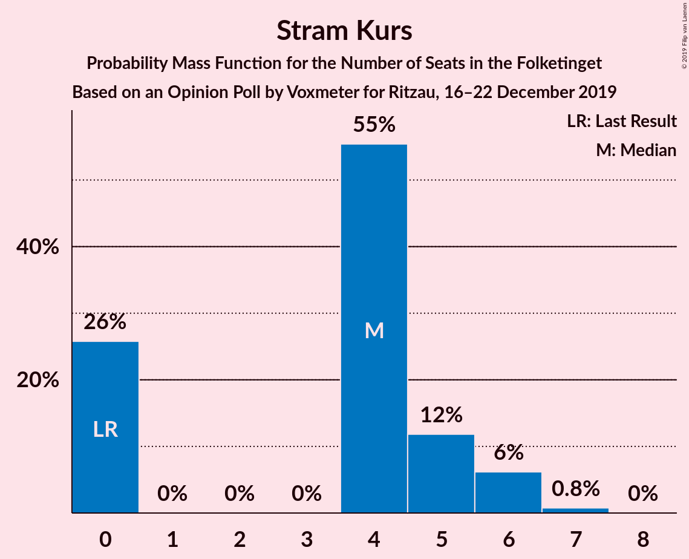
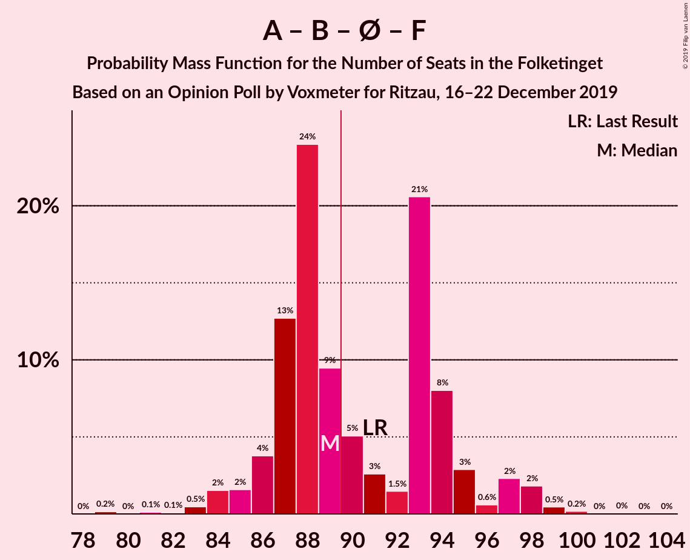

# Opinion Poll by Voxmeter for Ritzau, 16–22 December 2019

<a href="#voting-intentions">Voting Intentions</a> | <a href="#seats">Seats</a> | <a href="#coalitions">Coalitions</a> | <a href="#technical-information">Technical Information</a>

## Voting Intentions

### Confidence Intervals

| Party | Last Result | Poll Result | 80% Confidence Interval | 90% Confidence Interval | 95% Confidence Interval | 99% Confidence Interval |
|:-----:|:-----------:|:-----------:|:-----------------------:|:-----------------------:|:-----------------------:|:-----------------------:|
| Socialdemokraterne | 25.9% | 25.5% | 23.8–27.3% |23.3–27.8% |22.9–28.2% |22.1–29.1% |
| Venstre | 23.4% | 23.8% | 22.2–25.6% |21.7–26.1% |21.3–26.5% |20.6–27.4% |
| Dansk Folkeparti | 8.7% | 8.5% | 7.5–9.8% |7.2–10.1% |7.0–10.4% |6.5–11.0% |
| Radikale Venstre | 8.6% | 8.5% | 7.5–9.8% |7.2–10.1% |7.0–10.4% |6.5–11.0% |
| Det Konservative Folkeparti | 6.6% | 8.0% | 7.0–9.2% |6.8–9.6% |6.5–9.9% |6.1–10.5% |
| Enhedslisten–De Rød-Grønne | 6.9% | 7.8% | 6.8–8.9% |6.5–9.3% |6.3–9.6% |5.8–10.1% |
| Socialistisk Folkeparti | 7.7% | 7.6% | 6.6–8.7% |6.3–9.1% |6.1–9.3% |5.7–9.9% |
| Alternativet | 3.0% | 2.7% | 2.2–3.5% |2.0–3.7% |1.9–3.9% |1.6–4.3% |
| Stram Kurs | 1.8% | 2.1% | 1.6–2.8% |1.5–3.0% |1.4–3.2% |1.2–3.6% |
| Liberal Alliance | 2.3% | 1.6% | 1.2–2.2% |1.0–2.3% |1.0–2.5% |0.8–2.9% |
| Nye Borgerlige | 2.4% | 1.5% | 1.1–2.1% |1.0–2.2% |0.9–2.4% |0.7–2.7% |
| Klaus Riskær Pedersen | 0.8% | 0.9% | 0.6–1.4% |0.5–1.5% |0.5–1.7% |0.4–1.9% |

*Note:* The poll result column reflects the actual value used in the calculations. Published results may vary slightly, and in addition be rounded to fewer digits.

## Seats

### Confidence Intervals

| Party | Last Result | Median | 80% Confidence Interval | 90% Confidence Interval | 95% Confidence Interval | 99% Confidence Interval |
|:-----:|:-----------:|:------:|:-----------------------:|:-----------------------:|:-----------------------:|:-----------------------:|
| <a href="#socialdemokraterne">Socialdemokraterne</a> | 48 | 46 | 43–50 |43–51 |41–52 |41–54 |
| <a href="#venstre">Venstre</a> | 43 | 43 | 40–45 |38–47 |38–48 |37–50 |
| <a href="#dansk-folkeparti">Dansk Folkeparti</a> | 16 | 16 | 14–18 |14–19 |13–19 |12–20 |
| <a href="#radikale-venstre">Radikale Venstre</a> | 16 | 16 | 13–18 |12–19 |12–19 |12–21 |
| <a href="#det-konservative-folkeparti">Det Konservative Folkeparti</a> | 12 | 15 | 13–17 |12–18 |12–18 |11–20 |
| <a href="#enhedslisten–de-rød-grønne">Enhedslisten–De Rød-Grønne</a> | 13 | 14 | 12–16 |12–17 |11–18 |11–19 |
| <a href="#socialistisk-folkeparti">Socialistisk Folkeparti</a> | 14 | 14 | 11–16 |11–16 |11–17 |10–18 |
| <a href="#alternativet">Alternativet</a> | 5 | 5 | 4–6 |4–7 |0–7 |0–8 |
| <a href="#stram-kurs">Stram Kurs</a> | 0 | 4 | 0–5 |0–6 |0–6 |0–7 |
| <a href="#liberal-alliance">Liberal Alliance</a> | 4 | 0 | 0–4 |0–4 |0–5 |0–5 |
| <a href="#nye-borgerlige">Nye Borgerlige</a> | 4 | 0 | 0–4 |0–4 |0–4 |0–5 |
| <a href="#klaus-riskær-pedersen">Klaus Riskær Pedersen</a> | 0 | 0 | 0 |0 |0 |0 |

### Socialdemokraterne

*For a full overview of the results for this party, see the [Socialdemokraterne](party-socialdemokraterne.html) page.*

| Number of Seats | Probability | Accumulated | Special Marks |
|:---------------:|:-----------:|:-----------:|:-------------:|
| 38 | 0% | 100% |  |
| 39 | 0.1% | 99.9% |  |
| 40 | 0.3% | 99.9% |  |
| 41 | 3% | 99.6% |  |
| 42 | 2% | 97% |  |
| 43 | 14% | 95% |  |
| 44 | 18% | 81% |  |
| 45 | 12% | 63% |  |
| 46 | 8% | 51% | Median |
| 47 | 8% | 42% |  |
| 48 | 3% | 35% | Last Result |
| 49 | 4% | 31% |  |
| 50 | 22% | 27% |  |
| 51 | 2% | 5% |  |
| 52 | 0.5% | 3% |  |
| 53 | 2% | 2% |  |
| 54 | 0.3% | 0.8% |  |
| 55 | 0% | 0.4% |  |
| 56 | 0.4% | 0.4% |  |
| 57 | 0% | 0% |  |

### Venstre

*For a full overview of the results for this party, see the [Venstre](party-venstre.html) page.*

| Number of Seats | Probability | Accumulated | Special Marks |
|:---------------:|:-----------:|:-----------:|:-------------:|
| 36 | 0.2% | 100% |  |
| 37 | 0.3% | 99.8% |  |
| 38 | 6% | 99.5% |  |
| 39 | 1.3% | 93% |  |
| 40 | 5% | 92% |  |
| 41 | 18% | 86% |  |
| 42 | 15% | 69% |  |
| 43 | 16% | 54% | Last Result, Median |
| 44 | 8% | 38% |  |
| 45 | 20% | 30% |  |
| 46 | 2% | 10% |  |
| 47 | 3% | 8% |  |
| 48 | 3% | 5% |  |
| 49 | 1.0% | 2% |  |
| 50 | 0.4% | 0.8% |  |
| 51 | 0.3% | 0.4% |  |
| 52 | 0.1% | 0.1% |  |
| 53 | 0% | 0.1% |  |
| 54 | 0% | 0% |  |

### Dansk Folkeparti

*For a full overview of the results for this party, see the [Dansk Folkeparti](party-danskfolkeparti.html) page.*

| Number of Seats | Probability | Accumulated | Special Marks |
|:---------------:|:-----------:|:-----------:|:-------------:|
| 11 | 0.2% | 100% |  |
| 12 | 0.7% | 99.7% |  |
| 13 | 3% | 99.1% |  |
| 14 | 18% | 96% |  |
| 15 | 13% | 78% |  |
| 16 | 34% | 66% | Last Result, Median |
| 17 | 21% | 32% |  |
| 18 | 4% | 10% |  |
| 19 | 6% | 6% |  |
| 20 | 0.5% | 0.6% |  |
| 21 | 0.1% | 0.1% |  |
| 22 | 0% | 0.1% |  |
| 23 | 0% | 0% |  |

### Radikale Venstre

*For a full overview of the results for this party, see the [Radikale Venstre](party-radikalevenstre.html) page.*

| Number of Seats | Probability | Accumulated | Special Marks |
|:---------------:|:-----------:|:-----------:|:-------------:|
| 11 | 0.1% | 100% |  |
| 12 | 8% | 99.8% |  |
| 13 | 4% | 92% |  |
| 14 | 5% | 88% |  |
| 15 | 31% | 83% |  |
| 16 | 21% | 52% | Last Result, Median |
| 17 | 15% | 32% |  |
| 18 | 7% | 16% |  |
| 19 | 7% | 10% |  |
| 20 | 2% | 2% |  |
| 21 | 0.6% | 0.7% |  |
| 22 | 0.1% | 0.1% |  |
| 23 | 0% | 0% |  |

### Det Konservative Folkeparti

*For a full overview of the results for this party, see the [Det Konservative Folkeparti](party-detkonservativefolkeparti.html) page.*

| Number of Seats | Probability | Accumulated | Special Marks |
|:---------------:|:-----------:|:-----------:|:-------------:|
| 10 | 0.1% | 100% |  |
| 11 | 1.1% | 99.9% |  |
| 12 | 8% | 98.8% | Last Result |
| 13 | 8% | 91% |  |
| 14 | 19% | 83% |  |
| 15 | 22% | 64% | Median |
| 16 | 8% | 41% |  |
| 17 | 24% | 33% |  |
| 18 | 7% | 9% |  |
| 19 | 0.6% | 1.5% |  |
| 20 | 0.8% | 0.8% |  |
| 21 | 0.1% | 0.1% |  |
| 22 | 0% | 0% |  |

### Enhedslisten–De Rød-Grønne

*For a full overview of the results for this party, see the [Enhedslisten–De Rød-Grønne](party-enhedslisten–derød-grønne.html) page.*

| Number of Seats | Probability | Accumulated | Special Marks |
|:---------------:|:-----------:|:-----------:|:-------------:|
| 9 | 0.1% | 100% |  |
| 10 | 0.1% | 99.9% |  |
| 11 | 4% | 99.8% |  |
| 12 | 11% | 96% |  |
| 13 | 17% | 85% | Last Result |
| 14 | 22% | 68% | Median |
| 15 | 32% | 46% |  |
| 16 | 7% | 14% |  |
| 17 | 3% | 8% |  |
| 18 | 4% | 5% |  |
| 19 | 0.5% | 0.7% |  |
| 20 | 0.1% | 0.2% |  |
| 21 | 0% | 0% |  |

### Socialistisk Folkeparti

*For a full overview of the results for this party, see the [Socialistisk Folkeparti](party-socialistiskfolkeparti.html) page.*

| Number of Seats | Probability | Accumulated | Special Marks |
|:---------------:|:-----------:|:-----------:|:-------------:|
| 9 | 0.1% | 100% |  |
| 10 | 0.8% | 99.9% |  |
| 11 | 12% | 99.0% |  |
| 12 | 8% | 87% |  |
| 13 | 10% | 79% |  |
| 14 | 32% | 69% | Last Result, Median |
| 15 | 24% | 37% |  |
| 16 | 10% | 13% |  |
| 17 | 2% | 3% |  |
| 18 | 0.7% | 1.0% |  |
| 19 | 0.2% | 0.2% |  |
| 20 | 0% | 0% |  |

### Alternativet

*For a full overview of the results for this party, see the [Alternativet](party-alternativet.html) page.*

| Number of Seats | Probability | Accumulated | Special Marks |
|:---------------:|:-----------:|:-----------:|:-------------:|
| 0 | 4% | 100% |  |
| 1 | 0% | 96% |  |
| 2 | 0% | 96% |  |
| 3 | 0% | 96% |  |
| 4 | 15% | 96% |  |
| 5 | 46% | 81% | Last Result, Median |
| 6 | 28% | 35% |  |
| 7 | 6% | 7% |  |
| 8 | 0.6% | 0.7% |  |
| 9 | 0.1% | 0.1% |  |
| 10 | 0% | 0% |  |

### Stram Kurs

*For a full overview of the results for this party, see the [Stram Kurs](party-stramkurs.html) page.*

| Number of Seats | Probability | Accumulated | Special Marks |
|:---------------:|:-----------:|:-----------:|:-------------:|
| 0 | 26% | 100% | Last Result |
| 1 | 0% | 74% |  |
| 2 | 0% | 74% |  |
| 3 | 0% | 74% |  |
| 4 | 55% | 74% | Median |
| 5 | 12% | 19% |  |
| 6 | 6% | 7% |  |
| 7 | 0.8% | 0.8% |  |
| 8 | 0% | 0% |  |

### Liberal Alliance

*For a full overview of the results for this party, see the [Liberal Alliance](party-liberalalliance.html) page.*

| Number of Seats | Probability | Accumulated | Special Marks |
|:---------------:|:-----------:|:-----------:|:-------------:|
| 0 | 79% | 100% | Median |
| 1 | 0% | 21% |  |
| 2 | 0% | 21% |  |
| 3 | 0% | 21% |  |
| 4 | 18% | 21% | Last Result |
| 5 | 3% | 3% |  |
| 6 | 0.2% | 0.2% |  |
| 7 | 0% | 0% |  |

### Nye Borgerlige

*For a full overview of the results for this party, see the [Nye Borgerlige](party-nyeborgerlige.html) page.*

| Number of Seats | Probability | Accumulated | Special Marks |
|:---------------:|:-----------:|:-----------:|:-------------:|
| 0 | 78% | 100% | Median |
| 1 | 0% | 22% |  |
| 2 | 0% | 22% |  |
| 3 | 0.3% | 22% |  |
| 4 | 20% | 22% | Last Result |
| 5 | 1.1% | 1.1% |  |
| 6 | 0% | 0.1% |  |
| 7 | 0% | 0% |  |

### Klaus Riskær Pedersen

*For a full overview of the results for this party, see the [Klaus Riskær Pedersen](party-klausriskærpedersen.html) page.*

| Number of Seats | Probability | Accumulated | Special Marks |
|:---------------:|:-----------:|:-----------:|:-------------:|
| 0 | 99.8% | 100% | Last Result, Median |
| 1 | 0% | 0.2% |  |
| 2 | 0% | 0.2% |  |
| 3 | 0% | 0.2% |  |
| 4 | 0.2% | 0.2% |  |
| 5 | 0% | 0% |  |

## Coalitions

### Confidence Intervals

| Coalition | Last Result | Median | Majority? | 80% Confidence Interval | 90% Confidence Interval | 95% Confidence Interval | 99% Confidence Interval |
|:---------:|:-----------:|:------:|:---------:|:-----------------------:|:-----------------------:|:-----------------------:|:-----------------------:|
| Socialdemokraterne – Radikale Venstre – Enhedslisten–De Rød-Grønne – Socialistisk Folkeparti – Alternativet | 96 | 94 | 98% | 92–99 | 91–100 | 90–102 | 87–105 |
| Socialdemokraterne – Radikale Venstre – Enhedslisten–De Rød-Grønne – Socialistisk Folkeparti | 91 | 89 | 46% | 87–94 | 86–96 | 85–98 | 83–99 |
| Socialdemokraterne – Enhedslisten–De Rød-Grønne – Socialistisk Folkeparti – Alternativet | 80 | 79 | 0.2% | 76–84 | 75–84 | 73–86 | 72–89 |
| Socialdemokraterne – Radikale Venstre – Socialistisk Folkeparti | 78 | 75 | 0% | 73–81 | 71–82 | 70–83 | 69–84 |
| Venstre – Dansk Folkeparti – Det Konservative Folkeparti – Liberal Alliance – Nye Borgerlige – Klaus Riskær Pedersen | 79 | 76 | 0% | 72–79 | 70–80 | 69–82 | 67–84 |
| Venstre – Dansk Folkeparti – Det Konservative Folkeparti – Liberal Alliance – Nye Borgerlige | 79 | 76 | 0% | 72–79 | 70–80 | 69–82 | 67–84 |
| Venstre – Dansk Folkeparti – Det Konservative Folkeparti – Liberal Alliance | 75 | 74 | 0% | 71–79 | 68–80 | 68–82 | 67–82 |
| Socialdemokraterne – Enhedslisten–De Rød-Grønne – Socialistisk Folkeparti | 75 | 74 | 0% | 71–79 | 70–79 | 68–81 | 68–84 |
| Socialdemokraterne – Radikale Venstre | 64 | 61 | 0% | 58–67 | 58–67 | 57–69 | 56–71 |
| Venstre – Det Konservative Folkeparti – Liberal Alliance | 59 | 59 | 0% | 54–63 | 52–63 | 51–65 | 51–67 |
| Venstre – Det Konservative Folkeparti | 55 | 58 | 0% | 54–63 | 52–63 | 51–63 | 51–66 |
| Venstre | 43 | 43 | 0% | 40–45 | 38–47 | 38–48 | 37–50 |

### Socialdemokraterne – Radikale Venstre – Enhedslisten–De Rød-Grønne – Socialistisk Folkeparti – Alternativet

| Number of Seats | Probability | Accumulated | Special Marks |
|:---------------:|:-----------:|:-----------:|:-------------:|
| 85 | 0.2% | 100% |  |
| 86 | 0.1% | 99.8% |  |
| 87 | 0.3% | 99.7% |  |
| 88 | 0.3% | 99.4% |  |
| 89 | 1.2% | 99.0% |  |
| 90 | 0.7% | 98% | Majority |
| 91 | 4% | 97% |  |
| 92 | 18% | 93% |  |
| 93 | 24% | 75% |  |
| 94 | 6% | 51% |  |
| 95 | 3% | 45% | Median |
| 96 | 4% | 42% | Last Result |
| 97 | 2% | 38% |  |
| 98 | 3% | 36% |  |
| 99 | 27% | 33% |  |
| 100 | 1.5% | 6% |  |
| 101 | 0.5% | 5% |  |
| 102 | 2% | 4% |  |
| 103 | 2% | 2% |  |
| 104 | 0.1% | 0.7% |  |
| 105 | 0.4% | 0.6% |  |
| 106 | 0.1% | 0.2% |  |
| 107 | 0% | 0% |  |

### Socialdemokraterne – Radikale Venstre – Enhedslisten–De Rød-Grønne – Socialistisk Folkeparti

| Number of Seats | Probability | Accumulated | Special Marks |
|:---------------:|:-----------:|:-----------:|:-------------:|
| 79 | 0.2% | 100% |  |
| 80 | 0% | 99.8% |  |
| 81 | 0.1% | 99.8% |  |
| 82 | 0.1% | 99.7% |  |
| 83 | 0.5% | 99.6% |  |
| 84 | 2% | 99.2% |  |
| 85 | 2% | 98% |  |
| 86 | 4% | 96% |  |
| 87 | 13% | 92% |  |
| 88 | 24% | 80% |  |
| 89 | 9% | 56% |  |
| 90 | 5% | 46% | Median, Majority |
| 91 | 3% | 41% | Last Result |
| 92 | 1.5% | 38% |  |
| 93 | 21% | 37% |  |
| 94 | 8% | 16% |  |
| 95 | 3% | 8% |  |
| 96 | 0.6% | 5% |  |
| 97 | 2% | 5% |  |
| 98 | 2% | 3% |  |
| 99 | 0.5% | 0.7% |  |
| 100 | 0.2% | 0.3% |  |
| 101 | 0% | 0.1% |  |
| 102 | 0% | 0.1% |  |
| 103 | 0% | 0% |  |

### Socialdemokraterne – Enhedslisten–De Rød-Grønne – Socialistisk Folkeparti – Alternativet

| Number of Seats | Probability | Accumulated | Special Marks |
|:---------------:|:-----------:|:-----------:|:-------------:|
| 69 | 0.1% | 100% |  |
| 70 | 0% | 99.9% |  |
| 71 | 0.1% | 99.9% |  |
| 72 | 0.6% | 99.8% |  |
| 73 | 2% | 99.2% |  |
| 74 | 0.3% | 97% |  |
| 75 | 4% | 97% |  |
| 76 | 15% | 92% |  |
| 77 | 3% | 77% |  |
| 78 | 19% | 74% |  |
| 79 | 5% | 55% | Median |
| 80 | 13% | 50% | Last Result |
| 81 | 7% | 36% |  |
| 82 | 12% | 29% |  |
| 83 | 2% | 17% |  |
| 84 | 12% | 16% |  |
| 85 | 0.4% | 3% |  |
| 86 | 2% | 3% |  |
| 87 | 0.2% | 1.4% |  |
| 88 | 0.6% | 1.2% |  |
| 89 | 0.4% | 0.6% |  |
| 90 | 0% | 0.2% | Majority |
| 91 | 0.1% | 0.2% |  |
| 92 | 0% | 0% |  |

### Socialdemokraterne – Radikale Venstre – Socialistisk Folkeparti

| Number of Seats | Probability | Accumulated | Special Marks |
|:---------------:|:-----------:|:-----------:|:-------------:|
| 67 | 0.1% | 100% |  |
| 68 | 0.2% | 99.8% |  |
| 69 | 0.2% | 99.6% |  |
| 70 | 2% | 99.4% |  |
| 71 | 2% | 97% |  |
| 72 | 5% | 95% |  |
| 73 | 27% | 90% |  |
| 74 | 7% | 63% |  |
| 75 | 10% | 56% |  |
| 76 | 5% | 46% | Median |
| 77 | 2% | 41% |  |
| 78 | 16% | 38% | Last Result |
| 79 | 1.1% | 22% |  |
| 80 | 4% | 21% |  |
| 81 | 11% | 17% |  |
| 82 | 2% | 6% |  |
| 83 | 3% | 4% |  |
| 84 | 1.1% | 2% |  |
| 85 | 0.4% | 0.5% |  |
| 86 | 0% | 0.1% |  |
| 87 | 0% | 0.1% |  |
| 88 | 0% | 0% |  |

### Venstre – Dansk Folkeparti – Det Konservative Folkeparti – Liberal Alliance – Nye Borgerlige – Klaus Riskær Pedersen

| Number of Seats | Probability | Accumulated | Special Marks |
|:---------------:|:-----------:|:-----------:|:-------------:|
| 65 | 0.1% | 100% |  |
| 66 | 0% | 99.9% |  |
| 67 | 0.6% | 99.9% |  |
| 68 | 1.5% | 99.2% |  |
| 69 | 1.4% | 98% |  |
| 70 | 1.3% | 96% |  |
| 71 | 5% | 95% |  |
| 72 | 16% | 90% |  |
| 73 | 7% | 75% |  |
| 74 | 6% | 68% | Median |
| 75 | 2% | 62% |  |
| 76 | 14% | 60% |  |
| 77 | 5% | 46% |  |
| 78 | 15% | 42% |  |
| 79 | 20% | 27% | Last Result |
| 80 | 3% | 7% |  |
| 81 | 0.9% | 4% |  |
| 82 | 2% | 3% |  |
| 83 | 0.2% | 0.8% |  |
| 84 | 0.3% | 0.6% |  |
| 85 | 0.3% | 0.3% |  |
| 86 | 0% | 0.1% |  |
| 87 | 0% | 0% |  |

### Venstre – Dansk Folkeparti – Det Konservative Folkeparti – Liberal Alliance – Nye Borgerlige

| Number of Seats | Probability | Accumulated | Special Marks |
|:---------------:|:-----------:|:-----------:|:-------------:|
| 65 | 0.1% | 100% |  |
| 66 | 0% | 99.9% |  |
| 67 | 0.6% | 99.9% |  |
| 68 | 2% | 99.2% |  |
| 69 | 1.5% | 98% |  |
| 70 | 1.3% | 96% |  |
| 71 | 5% | 95% |  |
| 72 | 16% | 90% |  |
| 73 | 7% | 75% |  |
| 74 | 6% | 68% | Median |
| 75 | 2% | 62% |  |
| 76 | 14% | 60% |  |
| 77 | 5% | 46% |  |
| 78 | 15% | 41% |  |
| 79 | 20% | 27% | Last Result |
| 80 | 3% | 7% |  |
| 81 | 0.9% | 4% |  |
| 82 | 2% | 3% |  |
| 83 | 0.2% | 0.8% |  |
| 84 | 0.3% | 0.6% |  |
| 85 | 0.3% | 0.3% |  |
| 86 | 0% | 0.1% |  |
| 87 | 0% | 0% |  |

### Venstre – Dansk Folkeparti – Det Konservative Folkeparti – Liberal Alliance

| Number of Seats | Probability | Accumulated | Special Marks |
|:---------------:|:-----------:|:-----------:|:-------------:|
| 65 | 0.1% | 100% |  |
| 66 | 0.1% | 99.9% |  |
| 67 | 1.1% | 99.8% |  |
| 68 | 5% | 98.7% |  |
| 69 | 2% | 94% |  |
| 70 | 1.5% | 92% |  |
| 71 | 5% | 91% |  |
| 72 | 12% | 86% |  |
| 73 | 9% | 73% |  |
| 74 | 17% | 65% | Median |
| 75 | 3% | 47% | Last Result |
| 76 | 14% | 44% |  |
| 77 | 3% | 30% |  |
| 78 | 4% | 28% |  |
| 79 | 18% | 24% |  |
| 80 | 3% | 6% |  |
| 81 | 0.5% | 3% |  |
| 82 | 2% | 3% |  |
| 83 | 0.2% | 0.4% |  |
| 84 | 0.1% | 0.3% |  |
| 85 | 0.1% | 0.2% |  |
| 86 | 0% | 0% |  |

### Socialdemokraterne – Enhedslisten–De Rød-Grønne – Socialistisk Folkeparti

| Number of Seats | Probability | Accumulated | Special Marks |
|:---------------:|:-----------:|:-----------:|:-------------:|
| 65 | 0% | 100% |  |
| 66 | 0.3% | 99.9% |  |
| 67 | 0.2% | 99.7% |  |
| 68 | 3% | 99.5% |  |
| 69 | 0.7% | 96% |  |
| 70 | 3% | 95% |  |
| 71 | 15% | 92% |  |
| 72 | 4% | 78% |  |
| 73 | 15% | 74% |  |
| 74 | 13% | 58% | Median |
| 75 | 3% | 45% | Last Result |
| 76 | 21% | 42% |  |
| 77 | 1.2% | 20% |  |
| 78 | 5% | 19% |  |
| 79 | 9% | 14% |  |
| 80 | 2% | 5% |  |
| 81 | 1.1% | 3% |  |
| 82 | 0.6% | 2% |  |
| 83 | 0.2% | 1.0% |  |
| 84 | 0.6% | 0.8% |  |
| 85 | 0.2% | 0.2% |  |
| 86 | 0% | 0% |  |

### Socialdemokraterne – Radikale Venstre

| Number of Seats | Probability | Accumulated | Special Marks |
|:---------------:|:-----------:|:-----------:|:-------------:|
| 53 | 0.1% | 100% |  |
| 54 | 0.1% | 99.9% |  |
| 55 | 0.1% | 99.8% |  |
| 56 | 0.8% | 99.7% |  |
| 57 | 1.5% | 98.8% |  |
| 58 | 11% | 97% |  |
| 59 | 26% | 86% |  |
| 60 | 9% | 60% |  |
| 61 | 5% | 51% |  |
| 62 | 3% | 46% | Median |
| 63 | 5% | 43% |  |
| 64 | 2% | 38% | Last Result |
| 65 | 10% | 36% |  |
| 66 | 7% | 26% |  |
| 67 | 15% | 19% |  |
| 68 | 0.8% | 4% |  |
| 69 | 2% | 3% |  |
| 70 | 0% | 0.6% |  |
| 71 | 0.2% | 0.6% |  |
| 72 | 0% | 0.4% |  |
| 73 | 0.4% | 0.4% |  |
| 74 | 0% | 0% |  |

### Venstre – Det Konservative Folkeparti – Liberal Alliance

| Number of Seats | Probability | Accumulated | Special Marks |
|:---------------:|:-----------:|:-----------:|:-------------:|
| 50 | 0.1% | 100% |  |
| 51 | 4% | 99.9% |  |
| 52 | 3% | 96% |  |
| 53 | 1.1% | 93% |  |
| 54 | 3% | 92% |  |
| 55 | 2% | 89% |  |
| 56 | 3% | 86% |  |
| 57 | 4% | 83% |  |
| 58 | 26% | 79% | Median |
| 59 | 7% | 52% | Last Result |
| 60 | 14% | 46% |  |
| 61 | 5% | 32% |  |
| 62 | 13% | 27% |  |
| 63 | 9% | 13% |  |
| 64 | 2% | 4% |  |
| 65 | 2% | 3% |  |
| 66 | 0.4% | 1.0% |  |
| 67 | 0.4% | 0.6% |  |
| 68 | 0% | 0.2% |  |
| 69 | 0.1% | 0.2% |  |
| 70 | 0% | 0.1% |  |
| 71 | 0.1% | 0.1% |  |
| 72 | 0% | 0% |  |

### Venstre – Det Konservative Folkeparti

| Number of Seats | Probability | Accumulated | Special Marks |
|:---------------:|:-----------:|:-----------:|:-------------:|
| 50 | 0.1% | 100% |  |
| 51 | 4% | 99.8% |  |
| 52 | 4% | 96% |  |
| 53 | 1.3% | 92% |  |
| 54 | 6% | 91% |  |
| 55 | 5% | 85% | Last Result |
| 56 | 13% | 81% |  |
| 57 | 6% | 68% |  |
| 58 | 25% | 62% | Median |
| 59 | 4% | 37% |  |
| 60 | 6% | 33% |  |
| 61 | 4% | 27% |  |
| 62 | 13% | 23% |  |
| 63 | 9% | 10% |  |
| 64 | 0.3% | 2% |  |
| 65 | 0.7% | 1.5% |  |
| 66 | 0.3% | 0.7% |  |
| 67 | 0.4% | 0.5% |  |
| 68 | 0% | 0% |  |

### Venstre

| Number of Seats | Probability | Accumulated | Special Marks |
|:---------------:|:-----------:|:-----------:|:-------------:|
| 36 | 0.2% | 100% |  |
| 37 | 0.3% | 99.8% |  |
| 38 | 6% | 99.5% |  |
| 39 | 1.3% | 93% |  |
| 40 | 5% | 92% |  |
| 41 | 18% | 86% |  |
| 42 | 15% | 69% |  |
| 43 | 16% | 54% | Last Result, Median |
| 44 | 8% | 38% |  |
| 45 | 20% | 30% |  |
| 46 | 2% | 10% |  |
| 47 | 3% | 8% |  |
| 48 | 3% | 5% |  |
| 49 | 1.0% | 2% |  |
| 50 | 0.4% | 0.8% |  |
| 51 | 0.3% | 0.4% |  |
| 52 | 0.1% | 0.1% |  |
| 53 | 0% | 0.1% |  |
| 54 | 0% | 0% |  |

## Technical Information

### Opinion Poll

+ **Polling firm:** Voxmeter
+ **Commissioner(s):** Ritzau
+ **Fieldwork period:** 16–22 December 2019

### Calculations

+ **Sample size:** 1032
+ **Simulations done:** 1,048,576
+ **Error estimate:** 3.61%

