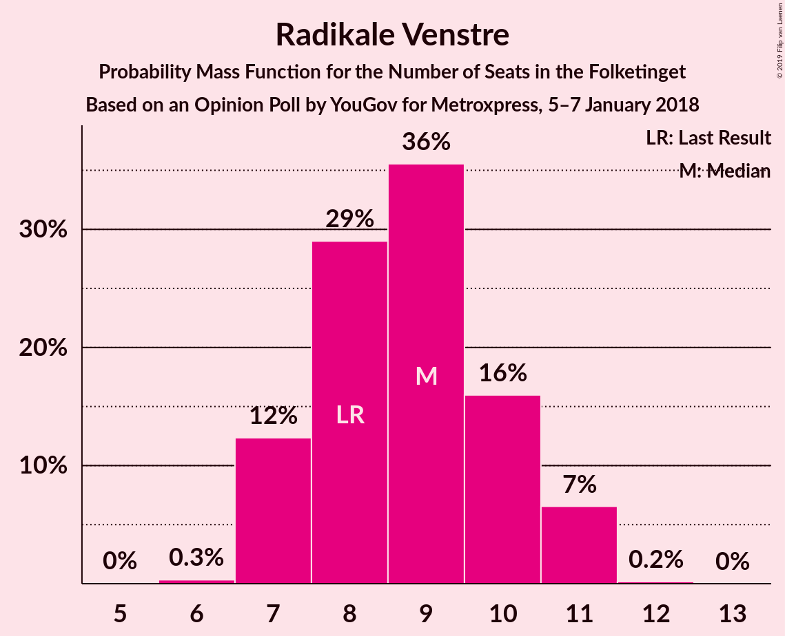
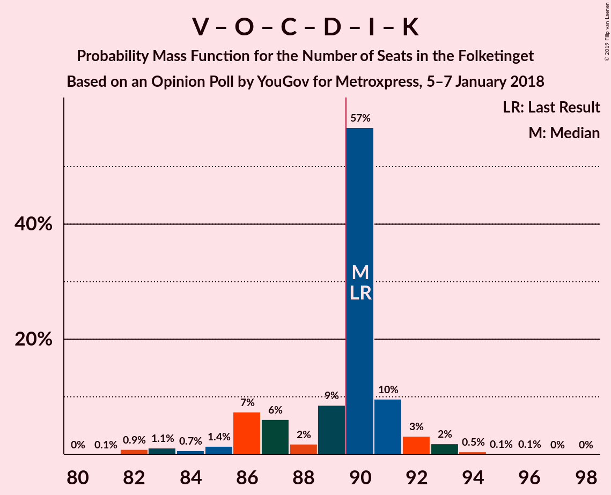
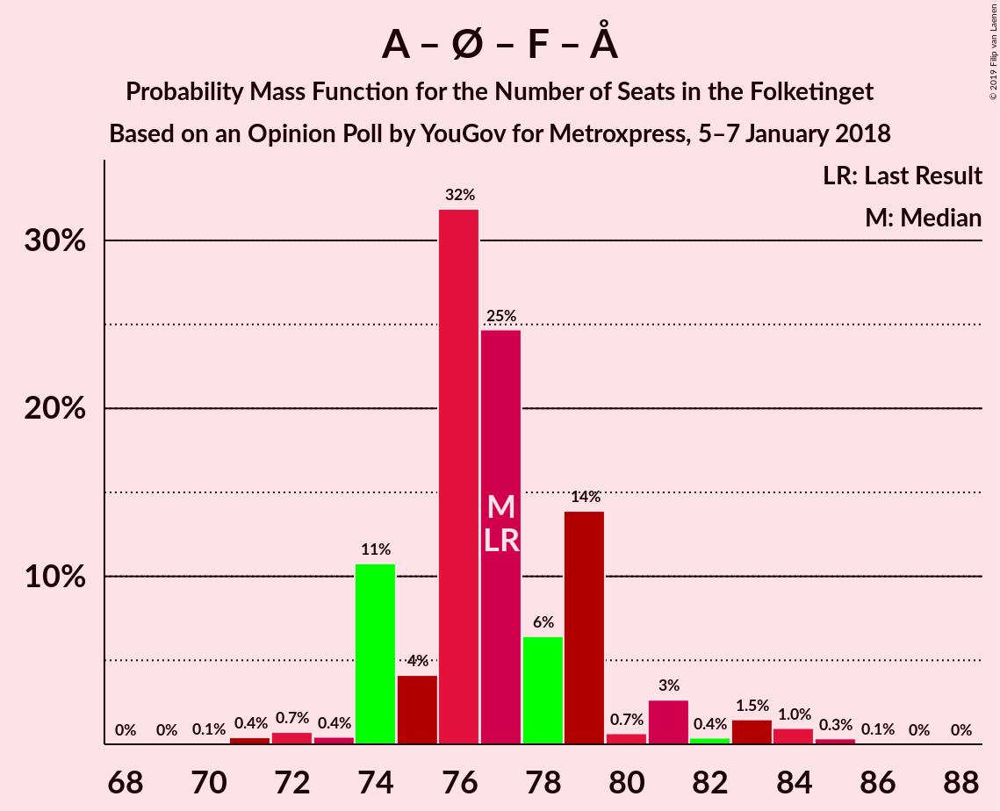
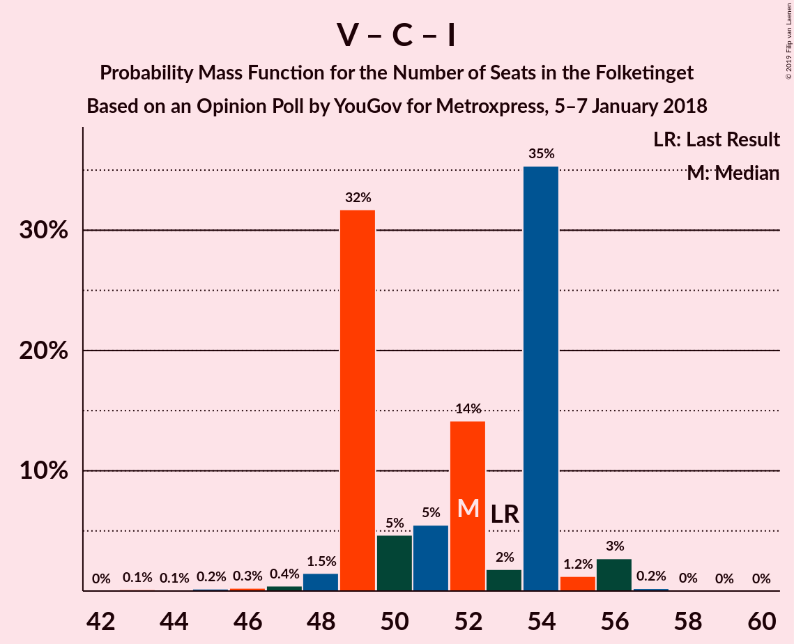

# Opinion Poll by YouGov for Metroxpress, 5–7 January 2018

<a href="#voting-intentions">Voting Intentions</a> | <a href="#seats">Seats</a> | <a href="#coalitions">Coalitions</a> | <a href="#technical-information">Technical Information</a>

## Voting Intentions

### Confidence Intervals

| Party | Last Result | Poll Result | 80% Confidence Interval | 90% Confidence Interval | 95% Confidence Interval | 99% Confidence Interval |
|:-----:|:-----------:|:-----------:|:-----------------------:|:-----------------------:|:-----------------------:|:-----------------------:|
| Socialdemokraterne | 26.3% | 26.2% | 24.7–27.7% |24.3–28.2% |23.9–28.5% |23.2–29.3% |
| Venstre | 19.5% | 18.8% | 17.5–20.2% |17.1–20.6% |16.8–20.9% |16.2–21.6% |
| Dansk Folkeparti | 21.1% | 17.0% | 15.8–18.4% |15.4–18.7% |15.2–19.1% |14.6–19.7% |
| Enhedslisten–De Rød-Grønne | 7.8% | 8.2% | 7.3–9.3% |7.1–9.5% |6.9–9.8% |6.5–10.3% |
| Det Konservative Folkeparti | 3.4% | 6.6% | 5.8–7.5% |5.6–7.8% |5.4–8.0% |5.1–8.5% |
| Socialistisk Folkeparti | 4.2% | 5.2% | 4.5–6.0% |4.3–6.3% |4.1–6.5% |3.8–6.9% |
| Alternativet | 4.8% | 4.7% | 4.0–5.5% |3.8–5.7% |3.7–5.9% |3.4–6.3% |
| Radikale Venstre | 4.6% | 4.7% | 4.0–5.5% |3.8–5.7% |3.7–5.9% |3.4–6.3% |
| Nye Borgerlige | 0.0% | 4.2% | 3.6–5.0% |3.4–5.2% |3.2–5.4% |3.0–5.8% |
| Liberal Alliance | 7.5% | 3.8% | 3.2–4.6% |3.1–4.8% |2.9–5.0% |2.7–5.3% |
| Kristendemokraterne | 0.8% | 0.7% | 0.5–1.1% |0.4–1.2% |0.4–1.3% |0.3–1.5% |

*Note:* The poll result column reflects the actual value used in the calculations. Published results may vary slightly, and in addition be rounded to fewer digits.

## Seats

### Confidence Intervals

| Party | Last Result | Median | 80% Confidence Interval | 90% Confidence Interval | 95% Confidence Interval | 99% Confidence Interval |
|:-----:|:-----------:|:------:|:-----------------------:|:-----------------------:|:-----------------------:|:-----------------------:|
| <a href="#socialdemokraterne">Socialdemokraterne</a> | 47 | 45 | 44–48 |43–49 |42–49 |40–51 |
| <a href="#venstre">Venstre</a> | 34 | 33 | 31–35 |30–35 |29–35 |29–37 |
| <a href="#dansk-folkeparti">Dansk Folkeparti</a> | 37 | 29 | 28–32 |28–32 |27–33 |25–34 |
| <a href="#enhedslisten–de-rød-grønne">Enhedslisten–De Rød-Grønne</a> | 14 | 15 | 12–16 |12–16 |12–17 |12–18 |
| <a href="#det-konservative-folkeparti">Det Konservative Folkeparti</a> | 6 | 12 | 11–13 |10–14 |9–14 |9–15 |
| <a href="#socialistisk-folkeparti">Socialistisk Folkeparti</a> | 7 | 9 | 8–10 |8–11 |8–11 |7–12 |
| <a href="#alternativet">Alternativet</a> | 9 | 8 | 7–10 |7–10 |7–10 |6–11 |
| <a href="#radikale-venstre">Radikale Venstre</a> | 8 | 9 | 7–10 |7–11 |7–11 |7–11 |
| <a href="#nye-borgerlige">Nye Borgerlige</a> | 0 | 8 | 6–9 |6–10 |5–10 |5–10 |
| <a href="#liberal-alliance">Liberal Alliance</a> | 13 | 7 | 7–8 |6–8 |5–9 |5–10 |
| <a href="#kristendemokraterne">Kristendemokraterne</a> | 0 | 0 | 0 |0 |0 |0 |

### Socialdemokraterne

*For a full overview of the results for this party, see the [Socialdemokraterne](party-socialdemokraterne.html) page.*

| Number of Seats | Probability | Accumulated | Special Marks |
|:---------------:|:-----------:|:-----------:|:-------------:|
| 39 | 0.1% | 100% |  |
| 40 | 0.6% | 99.9% |  |
| 41 | 1.0% | 99.3% |  |
| 42 | 2% | 98% |  |
| 43 | 1.2% | 96% |  |
| 44 | 25% | 95% |  |
| 45 | 45% | 70% | Median |
| 46 | 10% | 25% |  |
| 47 | 2% | 15% | Last Result |
| 48 | 4% | 13% |  |
| 49 | 8% | 9% |  |
| 50 | 0.8% | 1.4% |  |
| 51 | 0.5% | 0.6% |  |
| 52 | 0% | 0.1% |  |
| 53 | 0% | 0% |  |

### Venstre

*For a full overview of the results for this party, see the [Venstre](party-venstre.html) page.*

| Number of Seats | Probability | Accumulated | Special Marks |
|:---------------:|:-----------:|:-----------:|:-------------:|
| 27 | 0.1% | 100% |  |
| 28 | 0.3% | 99.9% |  |
| 29 | 3% | 99.6% |  |
| 30 | 3% | 97% |  |
| 31 | 28% | 94% |  |
| 32 | 9% | 66% |  |
| 33 | 13% | 56% | Median |
| 34 | 33% | 44% | Last Result |
| 35 | 9% | 11% |  |
| 36 | 2% | 2% |  |
| 37 | 0.4% | 0.6% |  |
| 38 | 0.1% | 0.2% |  |
| 39 | 0.1% | 0.1% |  |
| 40 | 0% | 0% |  |

### Dansk Folkeparti

*For a full overview of the results for this party, see the [Dansk Folkeparti](party-danskfolkeparti.html) page.*

| Number of Seats | Probability | Accumulated | Special Marks |
|:---------------:|:-----------:|:-----------:|:-------------:|
| 24 | 0.4% | 100% |  |
| 25 | 0.2% | 99.6% |  |
| 26 | 0.7% | 99.4% |  |
| 27 | 3% | 98.6% |  |
| 28 | 37% | 96% |  |
| 29 | 15% | 59% | Median |
| 30 | 12% | 44% |  |
| 31 | 8% | 32% |  |
| 32 | 21% | 24% |  |
| 33 | 3% | 4% |  |
| 34 | 0.3% | 0.5% |  |
| 35 | 0.1% | 0.2% |  |
| 36 | 0% | 0% |  |
| 37 | 0% | 0% | Last Result |

### Enhedslisten–De Rød-Grønne

*For a full overview of the results for this party, see the [Enhedslisten–De Rød-Grønne](party-enhedslisten–derød-grønne.html) page.*

| Number of Seats | Probability | Accumulated | Special Marks |
|:---------------:|:-----------:|:-----------:|:-------------:|
| 11 | 0.2% | 100% |  |
| 12 | 15% | 99.8% |  |
| 13 | 32% | 85% |  |
| 14 | 1.4% | 53% | Last Result |
| 15 | 10% | 51% | Median |
| 16 | 38% | 41% |  |
| 17 | 1.3% | 3% |  |
| 18 | 1.4% | 2% |  |
| 19 | 0.3% | 0.3% |  |
| 20 | 0% | 0% |  |

### Det Konservative Folkeparti

*For a full overview of the results for this party, see the [Det Konservative Folkeparti](party-detkonservativefolkeparti.html) page.*

| Number of Seats | Probability | Accumulated | Special Marks |
|:---------------:|:-----------:|:-----------:|:-------------:|
| 6 | 0% | 100% | Last Result |
| 7 | 0% | 100% |  |
| 8 | 0.1% | 100% |  |
| 9 | 4% | 99.9% |  |
| 10 | 4% | 96% |  |
| 11 | 35% | 92% |  |
| 12 | 21% | 57% | Median |
| 13 | 31% | 36% |  |
| 14 | 4% | 5% |  |
| 15 | 0.9% | 1.0% |  |
| 16 | 0% | 0% |  |

### Socialistisk Folkeparti

*For a full overview of the results for this party, see the [Socialistisk Folkeparti](party-socialistiskfolkeparti.html) page.*

| Number of Seats | Probability | Accumulated | Special Marks |
|:---------------:|:-----------:|:-----------:|:-------------:|
| 6 | 0.1% | 100% |  |
| 7 | 0.8% | 99.9% | Last Result |
| 8 | 33% | 99.1% |  |
| 9 | 25% | 66% | Median |
| 10 | 33% | 41% |  |
| 11 | 6% | 7% |  |
| 12 | 1.4% | 2% |  |
| 13 | 0.3% | 0.3% |  |
| 14 | 0% | 0% |  |

### Alternativet

*For a full overview of the results for this party, see the [Alternativet](party-alternativet.html) page.*

| Number of Seats | Probability | Accumulated | Special Marks |
|:---------------:|:-----------:|:-----------:|:-------------:|
| 5 | 0.1% | 100% |  |
| 6 | 1.3% | 99.9% |  |
| 7 | 47% | 98.6% |  |
| 8 | 13% | 52% | Median |
| 9 | 17% | 39% | Last Result |
| 10 | 21% | 22% |  |
| 11 | 1.1% | 1.3% |  |
| 12 | 0.2% | 0.2% |  |
| 13 | 0% | 0% |  |

### Radikale Venstre

*For a full overview of the results for this party, see the [Radikale Venstre](party-radikalevenstre.html) page.*

| Number of Seats | Probability | Accumulated | Special Marks |
|:---------------:|:-----------:|:-----------:|:-------------:|
| 5 | 0% | 100% |  |
| 6 | 0.3% | 99.9% |  |
| 7 | 12% | 99.6% |  |
| 8 | 29% | 87% | Last Result |
| 9 | 36% | 58% | Median |
| 10 | 16% | 23% |  |
| 11 | 7% | 7% |  |
| 12 | 0.2% | 0.2% |  |
| 13 | 0% | 0% |  |

### Nye Borgerlige

*For a full overview of the results for this party, see the [Nye Borgerlige](party-nyeborgerlige.html) page.*

| Number of Seats | Probability | Accumulated | Special Marks |
|:---------------:|:-----------:|:-----------:|:-------------:|
| 0 | 0% | 100% | Last Result |
| 1 | 0% | 100% |  |
| 2 | 0% | 100% |  |
| 3 | 0% | 100% |  |
| 4 | 0% | 100% |  |
| 5 | 3% | 100% |  |
| 6 | 7% | 97% |  |
| 7 | 2% | 89% |  |
| 8 | 51% | 88% | Median |
| 9 | 30% | 36% |  |
| 10 | 6% | 6% |  |
| 11 | 0.1% | 0.1% |  |
| 12 | 0% | 0% |  |

### Liberal Alliance

*For a full overview of the results for this party, see the [Liberal Alliance](party-liberalalliance.html) page.*

| Number of Seats | Probability | Accumulated | Special Marks |
|:---------------:|:-----------:|:-----------:|:-------------:|
| 4 | 0.2% | 100% |  |
| 5 | 3% | 99.8% |  |
| 6 | 5% | 97% |  |
| 7 | 76% | 92% | Median |
| 8 | 13% | 16% |  |
| 9 | 3% | 3% |  |
| 10 | 0.5% | 0.5% |  |
| 11 | 0% | 0% |  |
| 12 | 0% | 0% |  |
| 13 | 0% | 0% | Last Result |

### Kristendemokraterne

*For a full overview of the results for this party, see the [Kristendemokraterne](party-kristendemokraterne.html) page.*

| Number of Seats | Probability | Accumulated | Special Marks |
|:---------------:|:-----------:|:-----------:|:-------------:|
| 0 | 100% | 100% | Last Result, Median |

## Coalitions

### Confidence Intervals

| Coalition | Last Result | Median | Majority? | 80% Confidence Interval | 90% Confidence Interval | 95% Confidence Interval | 99% Confidence Interval |
|:---------:|:-----------:|:------:|:---------:|:-----------------------:|:-----------------------:|:-----------------------:|:-----------------------:|
| Venstre – Dansk Folkeparti – Det Konservative Folkeparti – Nye Borgerlige – Liberal Alliance – Kristendemokraterne | 90 | 90 | 72% | 86–91 | 86–92 | 84–93 | 82–94 |
| Venstre – Dansk Folkeparti – Det Konservative Folkeparti – Nye Borgerlige – Liberal Alliance | 90 | 90 | 72% | 86–91 | 86–92 | 84–93 | 82–94 |
| Socialdemokraterne – Enhedslisten–De Rød-Grønne – Socialistisk Folkeparti – Alternativet – Radikale Venstre | 85 | 85 | 4% | 84–89 | 83–89 | 82–91 | 81–93 |
| Venstre – Dansk Folkeparti – Det Konservative Folkeparti – Liberal Alliance – Kristendemokraterne | 90 | 82 | 0% | 78–83 | 78–84 | 77–85 | 75–87 |
| Venstre – Dansk Folkeparti – Det Konservative Folkeparti – Liberal Alliance | 90 | 82 | 0% | 78–83 | 78–84 | 77–85 | 75–87 |
| Socialdemokraterne – Enhedslisten–De Rød-Grønne – Socialistisk Folkeparti – Alternativet | 77 | 77 | 0% | 74–79 | 74–81 | 74–83 | 72–84 |
| Socialdemokraterne – Enhedslisten–De Rød-Grønne – Socialistisk Folkeparti – Radikale Venstre | 76 | 78 | 0% | 75–80 | 75–80 | 75–82 | 73–85 |
| Socialdemokraterne – Enhedslisten–De Rød-Grønne – Socialistisk Folkeparti | 68 | 69 | 0% | 67–71 | 67–72 | 66–74 | 64–75 |
| Socialdemokraterne – Socialistisk Folkeparti – Radikale Venstre | 62 | 62 | 0% | 62–66 | 61–68 | 61–68 | 57–69 |
| Socialdemokraterne – Radikale Venstre | 55 | 54 | 0% | 52–57 | 51–59 | 51–59 | 48–59 |
| Venstre – Det Konservative Folkeparti – Liberal Alliance | 53 | 52 | 0% | 49–54 | 49–54 | 48–56 | 46–56 |
| Venstre – Det Konservative Folkeparti | 40 | 45 | 0% | 42–47 | 42–47 | 42–47 | 40–49 |
| Venstre | 34 | 33 | 0% | 31–35 | 30–35 | 29–35 | 29–37 |

### Venstre – Dansk Folkeparti – Det Konservative Folkeparti – Nye Borgerlige – Liberal Alliance – Kristendemokraterne

| Number of Seats | Probability | Accumulated | Special Marks |
|:---------------:|:-----------:|:-----------:|:-------------:|
| 81 | 0.1% | 100% |  |
| 82 | 0.9% | 99.9% |  |
| 83 | 1.1% | 99.1% |  |
| 84 | 0.7% | 98% |  |
| 85 | 1.4% | 97% |  |
| 86 | 7% | 96% |  |
| 87 | 6% | 89% |  |
| 88 | 2% | 82% |  |
| 89 | 9% | 81% | Median |
| 90 | 57% | 72% | Last Result, Majority |
| 91 | 10% | 15% |  |
| 92 | 3% | 6% |  |
| 93 | 2% | 3% |  |
| 94 | 0.5% | 0.7% |  |
| 95 | 0.1% | 0.2% |  |
| 96 | 0.1% | 0.2% |  |
| 97 | 0% | 0% |  |

### Venstre – Dansk Folkeparti – Det Konservative Folkeparti – Nye Borgerlige – Liberal Alliance

| Number of Seats | Probability | Accumulated | Special Marks |
|:---------------:|:-----------:|:-----------:|:-------------:|
| 81 | 0.1% | 100% |  |
| 82 | 0.9% | 99.9% |  |
| 83 | 1.1% | 99.1% |  |
| 84 | 0.7% | 98% |  |
| 85 | 1.4% | 97% |  |
| 86 | 7% | 96% |  |
| 87 | 6% | 89% |  |
| 88 | 2% | 82% |  |
| 89 | 9% | 81% | Median |
| 90 | 57% | 72% | Last Result, Majority |
| 91 | 10% | 15% |  |
| 92 | 3% | 6% |  |
| 93 | 2% | 3% |  |
| 94 | 0.5% | 0.7% |  |
| 95 | 0.1% | 0.2% |  |
| 96 | 0.1% | 0.2% |  |
| 97 | 0% | 0% |  |

### Socialdemokraterne – Enhedslisten–De Rød-Grønne – Socialistisk Folkeparti – Alternativet – Radikale Venstre

| Number of Seats | Probability | Accumulated | Special Marks |
|:---------------:|:-----------:|:-----------:|:-------------:|
| 79 | 0.1% | 100% |  |
| 80 | 0.1% | 99.8% |  |
| 81 | 0.5% | 99.8% |  |
| 82 | 2% | 99.3% |  |
| 83 | 3% | 97% |  |
| 84 | 10% | 94% |  |
| 85 | 57% | 85% | Last Result |
| 86 | 9% | 28% | Median |
| 87 | 2% | 19% |  |
| 88 | 6% | 18% |  |
| 89 | 7% | 11% |  |
| 90 | 1.4% | 4% | Majority |
| 91 | 0.7% | 3% |  |
| 92 | 1.1% | 2% |  |
| 93 | 0.9% | 0.9% |  |
| 94 | 0.1% | 0.1% |  |
| 95 | 0% | 0% |  |

### Venstre – Dansk Folkeparti – Det Konservative Folkeparti – Liberal Alliance – Kristendemokraterne

| Number of Seats | Probability | Accumulated | Special Marks |
|:---------------:|:-----------:|:-----------:|:-------------:|
| 73 | 0.1% | 100% |  |
| 74 | 0.1% | 99.9% |  |
| 75 | 1.3% | 99.8% |  |
| 76 | 1.0% | 98% |  |
| 77 | 1.4% | 98% |  |
| 78 | 8% | 96% |  |
| 79 | 5% | 88% |  |
| 80 | 3% | 83% |  |
| 81 | 27% | 80% | Median |
| 82 | 38% | 53% |  |
| 83 | 8% | 15% |  |
| 84 | 2% | 6% |  |
| 85 | 3% | 4% |  |
| 86 | 0.6% | 1.4% |  |
| 87 | 0.7% | 0.8% |  |
| 88 | 0.1% | 0.1% |  |
| 89 | 0% | 0.1% |  |
| 90 | 0% | 0% | Last Result, Majority |

### Venstre – Dansk Folkeparti – Det Konservative Folkeparti – Liberal Alliance

| Number of Seats | Probability | Accumulated | Special Marks |
|:---------------:|:-----------:|:-----------:|:-------------:|
| 73 | 0.1% | 100% |  |
| 74 | 0.1% | 99.9% |  |
| 75 | 1.3% | 99.8% |  |
| 76 | 1.0% | 98% |  |
| 77 | 1.4% | 98% |  |
| 78 | 8% | 96% |  |
| 79 | 5% | 88% |  |
| 80 | 3% | 83% |  |
| 81 | 27% | 80% | Median |
| 82 | 38% | 53% |  |
| 83 | 8% | 15% |  |
| 84 | 2% | 6% |  |
| 85 | 3% | 4% |  |
| 86 | 0.6% | 1.4% |  |
| 87 | 0.7% | 0.8% |  |
| 88 | 0.1% | 0.1% |  |
| 89 | 0% | 0.1% |  |
| 90 | 0% | 0% | Last Result, Majority |

### Socialdemokraterne – Enhedslisten–De Rød-Grønne – Socialistisk Folkeparti – Alternativet

| Number of Seats | Probability | Accumulated | Special Marks |
|:---------------:|:-----------:|:-----------:|:-------------:|
| 70 | 0.1% | 100% |  |
| 71 | 0.4% | 99.9% |  |
| 72 | 0.7% | 99.5% |  |
| 73 | 0.4% | 98.8% |  |
| 74 | 11% | 98% |  |
| 75 | 4% | 88% |  |
| 76 | 32% | 83% |  |
| 77 | 25% | 52% | Last Result, Median |
| 78 | 6% | 27% |  |
| 79 | 14% | 20% |  |
| 80 | 0.7% | 7% |  |
| 81 | 3% | 6% |  |
| 82 | 0.4% | 3% |  |
| 83 | 1.5% | 3% |  |
| 84 | 1.0% | 1.4% |  |
| 85 | 0.3% | 0.4% |  |
| 86 | 0.1% | 0.1% |  |
| 87 | 0% | 0% |  |

### Socialdemokraterne – Enhedslisten–De Rød-Grønne – Socialistisk Folkeparti – Radikale Venstre

| Number of Seats | Probability | Accumulated | Special Marks |
|:---------------:|:-----------:|:-----------:|:-------------:|
| 71 | 0.1% | 100% |  |
| 72 | 0.2% | 99.9% |  |
| 73 | 0.8% | 99.7% |  |
| 74 | 1.0% | 98.9% |  |
| 75 | 22% | 98% |  |
| 76 | 1.5% | 76% | Last Result |
| 77 | 14% | 74% |  |
| 78 | 42% | 60% | Median |
| 79 | 6% | 18% |  |
| 80 | 7% | 12% |  |
| 81 | 1.3% | 4% |  |
| 82 | 1.5% | 3% |  |
| 83 | 0.2% | 2% |  |
| 84 | 0.4% | 1.5% |  |
| 85 | 1.1% | 1.1% |  |
| 86 | 0% | 0% |  |

### Socialdemokraterne – Enhedslisten–De Rød-Grønne – Socialistisk Folkeparti

| Number of Seats | Probability | Accumulated | Special Marks |
|:---------------:|:-----------:|:-----------:|:-------------:|
| 63 | 0.3% | 100% |  |
| 64 | 0.3% | 99.6% |  |
| 65 | 1.0% | 99.4% |  |
| 66 | 1.5% | 98% |  |
| 67 | 33% | 97% |  |
| 68 | 2% | 64% | Last Result |
| 69 | 34% | 62% | Median |
| 70 | 17% | 28% |  |
| 71 | 5% | 11% |  |
| 72 | 2% | 6% |  |
| 73 | 0.8% | 4% |  |
| 74 | 1.3% | 3% |  |
| 75 | 1.1% | 2% |  |
| 76 | 0.1% | 0.5% |  |
| 77 | 0.4% | 0.4% |  |
| 78 | 0% | 0% |  |

### Socialdemokraterne – Socialistisk Folkeparti – Radikale Venstre

| Number of Seats | Probability | Accumulated | Special Marks |
|:---------------:|:-----------:|:-----------:|:-------------:|
| 56 | 0.4% | 100% |  |
| 57 | 0.2% | 99.6% |  |
| 58 | 0.8% | 99.4% |  |
| 59 | 0.5% | 98.7% |  |
| 60 | 0.5% | 98% |  |
| 61 | 5% | 98% |  |
| 62 | 54% | 92% | Last Result |
| 63 | 6% | 38% | Median |
| 64 | 7% | 32% |  |
| 65 | 11% | 25% |  |
| 66 | 5% | 14% |  |
| 67 | 1.4% | 9% |  |
| 68 | 7% | 8% |  |
| 69 | 0.6% | 0.8% |  |
| 70 | 0.1% | 0.2% |  |
| 71 | 0% | 0.1% |  |
| 72 | 0% | 0% |  |

### Socialdemokraterne – Radikale Venstre

| Number of Seats | Probability | Accumulated | Special Marks |
|:---------------:|:-----------:|:-----------:|:-------------:|
| 47 | 0.4% | 100% |  |
| 48 | 0.3% | 99.6% |  |
| 49 | 1.1% | 99.3% |  |
| 50 | 0.6% | 98% |  |
| 51 | 5% | 98% |  |
| 52 | 23% | 93% |  |
| 53 | 5% | 69% |  |
| 54 | 36% | 64% | Median |
| 55 | 4% | 27% | Last Result |
| 56 | 12% | 23% |  |
| 57 | 2% | 11% |  |
| 58 | 1.4% | 9% |  |
| 59 | 7% | 7% |  |
| 60 | 0.4% | 0.4% |  |
| 61 | 0% | 0.1% |  |
| 62 | 0% | 0.1% |  |
| 63 | 0% | 0% |  |

### Venstre – Det Konservative Folkeparti – Liberal Alliance

| Number of Seats | Probability | Accumulated | Special Marks |
|:---------------:|:-----------:|:-----------:|:-------------:|
| 43 | 0.1% | 100% |  |
| 44 | 0.1% | 99.9% |  |
| 45 | 0.2% | 99.8% |  |
| 46 | 0.3% | 99.6% |  |
| 47 | 0.4% | 99.4% |  |
| 48 | 1.5% | 98.9% |  |
| 49 | 32% | 97% |  |
| 50 | 5% | 66% |  |
| 51 | 5% | 61% |  |
| 52 | 14% | 56% | Median |
| 53 | 2% | 41% | Last Result |
| 54 | 35% | 40% |  |
| 55 | 1.2% | 4% |  |
| 56 | 3% | 3% |  |
| 57 | 0.2% | 0.3% |  |
| 58 | 0% | 0.1% |  |
| 59 | 0% | 0% |  |

### Venstre – Det Konservative Folkeparti

| Number of Seats | Probability | Accumulated | Special Marks |
|:---------------:|:-----------:|:-----------:|:-------------:|
| 37 | 0.2% | 100% |  |
| 38 | 0% | 99.8% |  |
| 39 | 0.2% | 99.8% |  |
| 40 | 0.6% | 99.6% | Last Result |
| 41 | 0.9% | 99.0% |  |
| 42 | 32% | 98% |  |
| 43 | 5% | 66% |  |
| 44 | 8% | 61% |  |
| 45 | 10% | 52% | Median |
| 46 | 6% | 42% |  |
| 47 | 34% | 36% |  |
| 48 | 1.4% | 2% |  |
| 49 | 0.6% | 0.8% |  |
| 50 | 0.1% | 0.2% |  |
| 51 | 0.1% | 0.1% |  |
| 52 | 0% | 0% |  |

### Venstre

| Number of Seats | Probability | Accumulated | Special Marks |
|:---------------:|:-----------:|:-----------:|:-------------:|
| 27 | 0.1% | 100% |  |
| 28 | 0.3% | 99.9% |  |
| 29 | 3% | 99.6% |  |
| 30 | 3% | 97% |  |
| 31 | 28% | 94% |  |
| 32 | 9% | 66% |  |
| 33 | 13% | 56% | Median |
| 34 | 33% | 44% | Last Result |
| 35 | 9% | 11% |  |
| 36 | 2% | 2% |  |
| 37 | 0.4% | 0.6% |  |
| 38 | 0.1% | 0.2% |  |
| 39 | 0.1% | 0.1% |  |
| 40 | 0% | 0% |  |

## Technical Information

### Opinion Poll

+ **Polling firm:** YouGov
+ **Commissioner(s):** Metroxpress
+ **Fieldwork period:** 5–7 January 2018

### Calculations

+ **Sample size:** 1410
+ **Simulations done:** 1,048,576
+ **Error estimate:** 2.21%

