# Opinion Poll by Voxmeter for Ritzau, 15–21 January 2018

<a href="#voting-intentions">Voting Intentions</a> | <a href="#seats">Seats</a> | <a href="#coalitions">Coalitions</a> | <a href="#technical-information">Technical Information</a>

## Voting Intentions

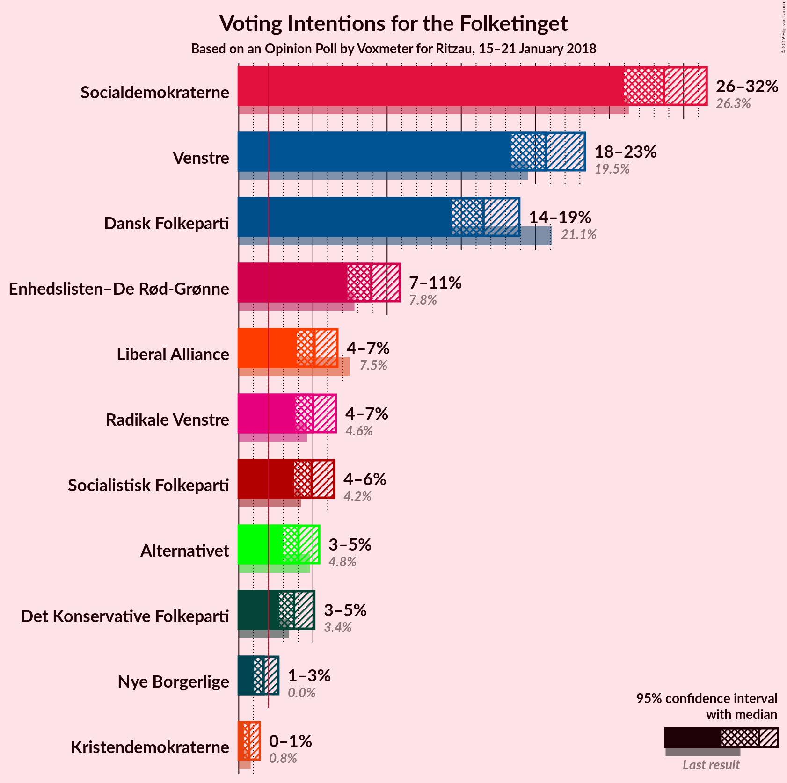

### Confidence Intervals

| Party | Last Result | Poll Result | 80% Confidence Interval | 90% Confidence Interval | 95% Confidence Interval | 99% Confidence Interval |
|:-----:|:-----------:|:-----------:|:-----------------------:|:-----------------------:|:-----------------------:|:-----------------------:|
| Socialdemokraterne | 26.3% | 28.7% | 26.9–30.6% |26.4–31.1% |26.0–31.6% |25.1–32.4% |
| Venstre | 19.5% | 20.7% | 19.2–22.4% |18.7–22.9% |18.4–23.3% |17.6–24.2% |
| Dansk Folkeparti | 21.1% | 16.5% | 15.1–18.1% |14.7–18.5% |14.3–18.9% |13.7–19.7% |
| Enhedslisten–De Rød-Grønne | 7.8% | 8.9% | 7.9–10.2% |7.6–10.5% |7.3–10.9% |6.9–11.5% |
| Liberal Alliance | 7.5% | 5.1% | 4.3–6.1% |4.1–6.4% |3.9–6.6% |3.6–7.1% |
| Radikale Venstre | 4.6% | 5.0% | 4.2–6.0% |4.0–6.3% |3.8–6.5% |3.5–7.0% |
| Socialistisk Folkeparti | 4.2% | 4.9% | 4.1–5.9% |3.9–6.2% |3.7–6.4% |3.4–6.9% |
| Alternativet | 4.8% | 4.0% | 3.3–4.9% |3.1–5.2% |3.0–5.4% |2.7–5.9% |
| Det Konservative Folkeparti | 3.4% | 3.7% | 3.1–4.6% |2.9–4.9% |2.7–5.1% |2.4–5.5% |
| Nye Borgerlige | 0.0% | 1.7% | 1.2–2.3% |1.1–2.5% |1.0–2.7% |0.9–3.0% |
| Kristendemokraterne | 0.8% | 0.7% | 0.5–1.2% |0.4–1.3% |0.3–1.4% |0.2–1.7% |

*Note:* The poll result column reflects the actual value used in the calculations. Published results may vary slightly, and in addition be rounded to fewer digits.

## Seats

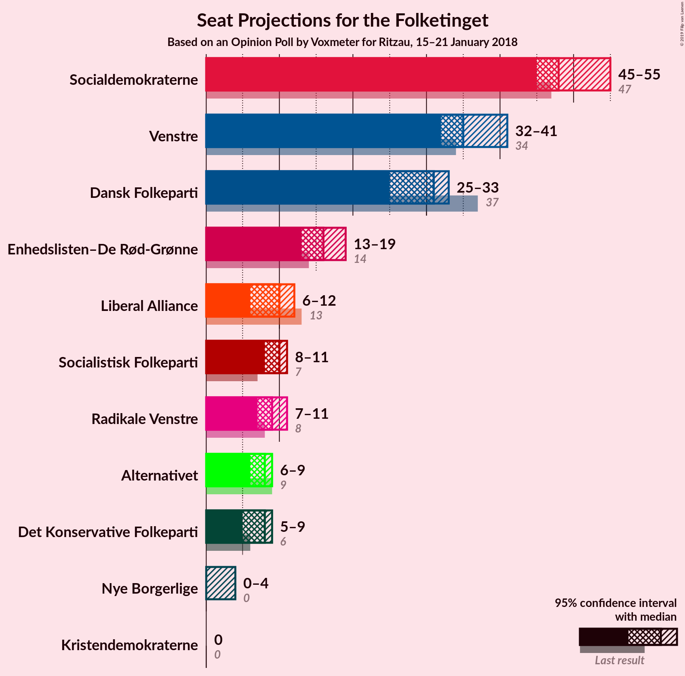

### Confidence Intervals

| Party | Last Result | Median | 80% Confidence Interval | 90% Confidence Interval | 95% Confidence Interval | 99% Confidence Interval |
|:-----:|:-----------:|:------:|:-----------------------:|:-----------------------:|:-----------------------:|:-----------------------:|
| <a href="#socialdemokraterne">Socialdemokraterne</a> | 47 | 48 | 47–53 |46–53 |45–55 |44–56 |
| <a href="#venstre">Venstre</a> | 34 | 35 | 34–40 |33–40 |32–41 |30–43 |
| <a href="#dansk-folkeparti">Dansk Folkeparti</a> | 37 | 31 | 26–32 |26–33 |25–33 |25–35 |
| <a href="#enhedslisten–de-rød-grønne">Enhedslisten–De Rød-Grønne</a> | 14 | 16 | 14–18 |13–19 |13–19 |12–20 |
| <a href="#liberal-alliance">Liberal Alliance</a> | 13 | 10 | 7–11 |7–11 |6–12 |6–12 |
| <a href="#radikale-venstre">Radikale Venstre</a> | 8 | 9 | 7–11 |7–11 |7–11 |7–12 |
| <a href="#socialistisk-folkeparti">Socialistisk Folkeparti</a> | 7 | 10 | 9–10 |8–11 |8–11 |7–11 |
| <a href="#alternativet">Alternativet</a> | 9 | 8 | 6–8 |6–8 |6–9 |5–11 |
| <a href="#det-konservative-folkeparti">Det Konservative Folkeparti</a> | 6 | 8 | 5–9 |5–9 |5–9 |4–10 |
| <a href="#nye-borgerlige">Nye Borgerlige</a> | 0 | 0 | 0 |0–4 |0–4 |0–5 |
| <a href="#kristendemokraterne">Kristendemokraterne</a> | 0 | 0 | 0 |0 |0 |0 |

### Socialdemokraterne

*For a full overview of the results for this party, see the [Socialdemokraterne](party-socialdemokraterne.html) page.*

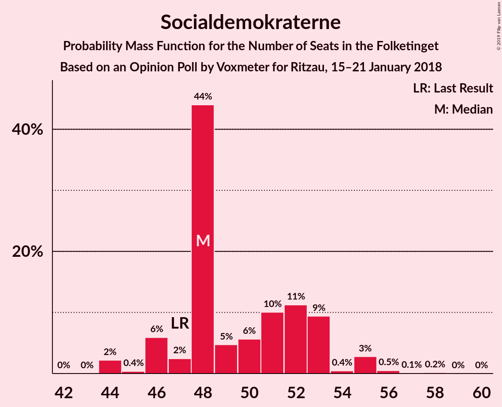

| Number of Seats | Probability | Accumulated | Special Marks |
|:---------------:|:-----------:|:-----------:|:-------------:|
| 43 | 0% | 100% |  |
| 44 | 2% | 99.9% |  |
| 45 | 0.4% | 98% |  |
| 46 | 6% | 97% |  |
| 47 | 2% | 91% | Last Result |
| 48 | 44% | 89% | Median |
| 49 | 5% | 45% |  |
| 50 | 6% | 40% |  |
| 51 | 10% | 35% |  |
| 52 | 11% | 25% |  |
| 53 | 9% | 13% |  |
| 54 | 0.4% | 4% |  |
| 55 | 3% | 4% |  |
| 56 | 0.5% | 0.8% |  |
| 57 | 0.1% | 0.3% |  |
| 58 | 0.2% | 0.2% |  |
| 59 | 0% | 0.1% |  |
| 60 | 0% | 0% |  |

### Venstre

*For a full overview of the results for this party, see the [Venstre](party-venstre.html) page.*

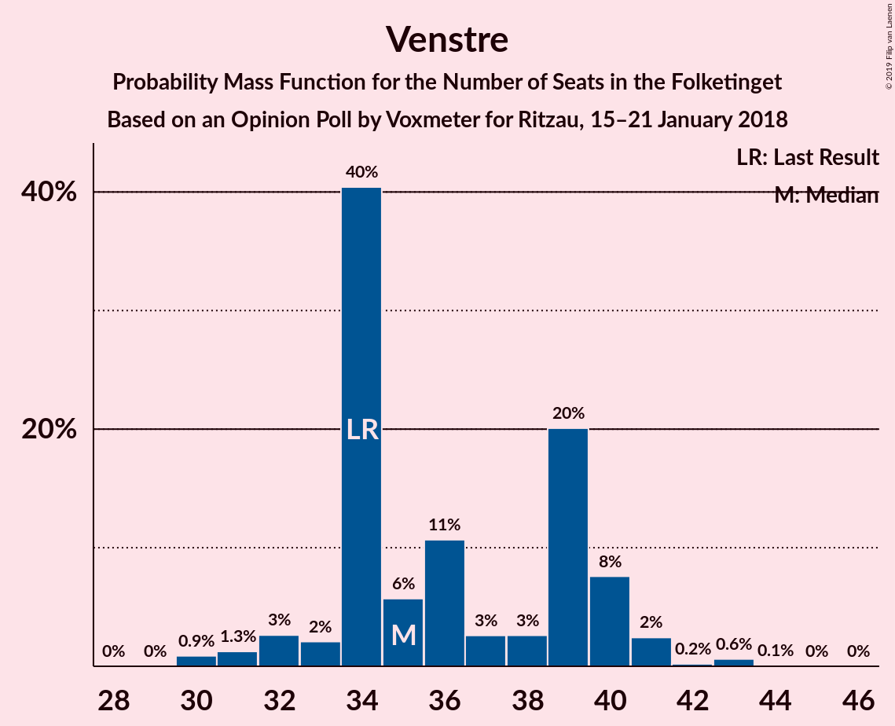

| Number of Seats | Probability | Accumulated | Special Marks |
|:---------------:|:-----------:|:-----------:|:-------------:|
| 30 | 0.9% | 100% |  |
| 31 | 1.3% | 99.1% |  |
| 32 | 3% | 98% |  |
| 33 | 2% | 95% |  |
| 34 | 40% | 93% | Last Result |
| 35 | 6% | 53% | Median |
| 36 | 11% | 47% |  |
| 37 | 3% | 36% |  |
| 38 | 3% | 34% |  |
| 39 | 20% | 31% |  |
| 40 | 8% | 11% |  |
| 41 | 2% | 3% |  |
| 42 | 0.2% | 1.0% |  |
| 43 | 0.6% | 0.8% |  |
| 44 | 0.1% | 0.2% |  |
| 45 | 0% | 0.1% |  |
| 46 | 0% | 0% |  |

### Dansk Folkeparti

*For a full overview of the results for this party, see the [Dansk Folkeparti](party-danskfolkeparti.html) page.*

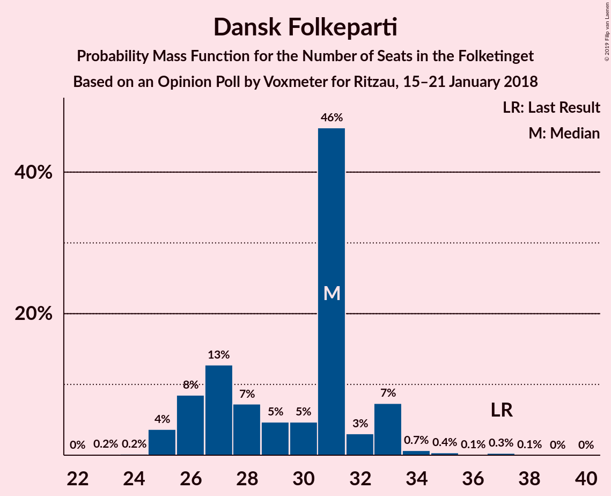

| Number of Seats | Probability | Accumulated | Special Marks |
|:---------------:|:-----------:|:-----------:|:-------------:|
| 23 | 0.2% | 100% |  |
| 24 | 0.2% | 99.8% |  |
| 25 | 4% | 99.6% |  |
| 26 | 8% | 96% |  |
| 27 | 13% | 87% |  |
| 28 | 7% | 75% |  |
| 29 | 5% | 67% |  |
| 30 | 5% | 63% |  |
| 31 | 46% | 58% | Median |
| 32 | 3% | 12% |  |
| 33 | 7% | 9% |  |
| 34 | 0.7% | 1.5% |  |
| 35 | 0.4% | 0.8% |  |
| 36 | 0.1% | 0.4% |  |
| 37 | 0.3% | 0.4% | Last Result |
| 38 | 0.1% | 0.1% |  |
| 39 | 0% | 0% |  |

### Enhedslisten–De Rød-Grønne

*For a full overview of the results for this party, see the [Enhedslisten–De Rød-Grønne](party-enhedslisten–derød-grønne.html) page.*

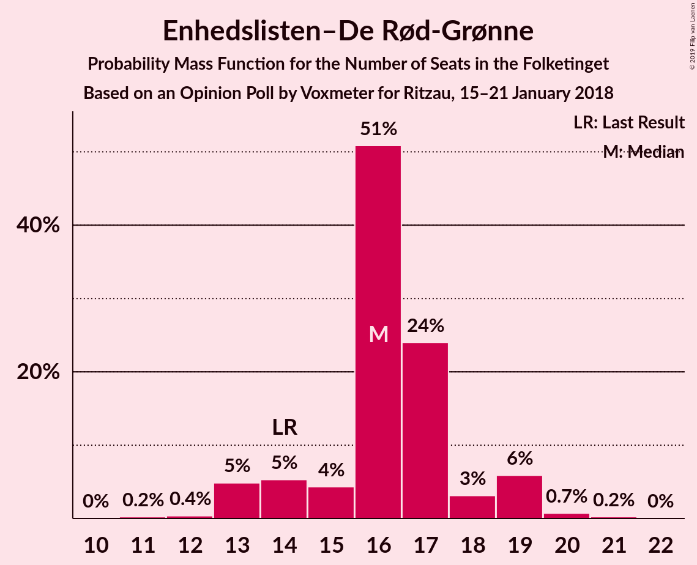

| Number of Seats | Probability | Accumulated | Special Marks |
|:---------------:|:-----------:|:-----------:|:-------------:|
| 11 | 0.2% | 100% |  |
| 12 | 0.4% | 99.7% |  |
| 13 | 5% | 99.4% |  |
| 14 | 5% | 95% | Last Result |
| 15 | 4% | 89% |  |
| 16 | 51% | 85% | Median |
| 17 | 24% | 34% |  |
| 18 | 3% | 10% |  |
| 19 | 6% | 7% |  |
| 20 | 0.7% | 1.0% |  |
| 21 | 0.2% | 0.3% |  |
| 22 | 0% | 0% |  |

### Liberal Alliance

*For a full overview of the results for this party, see the [Liberal Alliance](party-liberalalliance.html) page.*

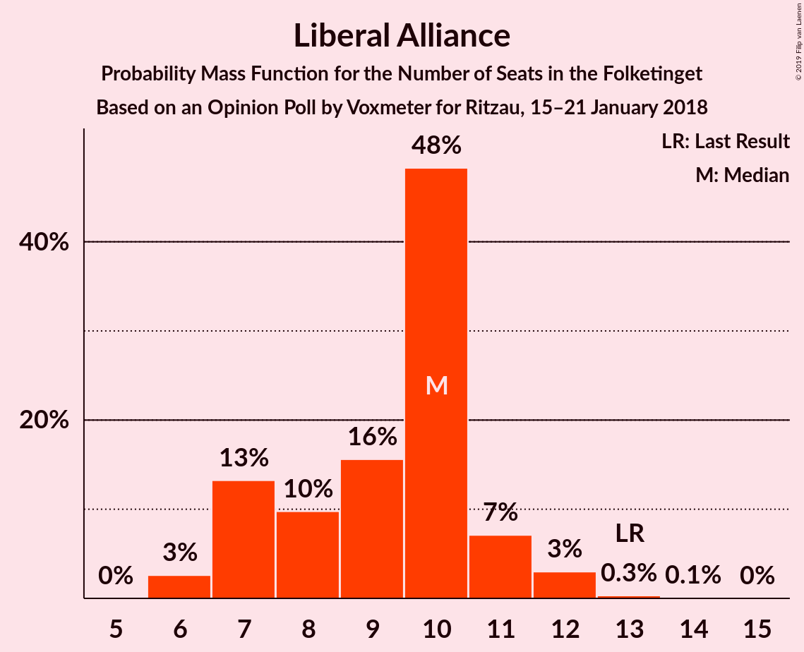

| Number of Seats | Probability | Accumulated | Special Marks |
|:---------------:|:-----------:|:-----------:|:-------------:|
| 6 | 3% | 100% |  |
| 7 | 13% | 97% |  |
| 8 | 10% | 84% |  |
| 9 | 16% | 74% |  |
| 10 | 48% | 59% | Median |
| 11 | 7% | 10% |  |
| 12 | 3% | 3% |  |
| 13 | 0.3% | 0.4% | Last Result |
| 14 | 0.1% | 0.1% |  |
| 15 | 0% | 0% |  |

### Radikale Venstre

*For a full overview of the results for this party, see the [Radikale Venstre](party-radikalevenstre.html) page.*

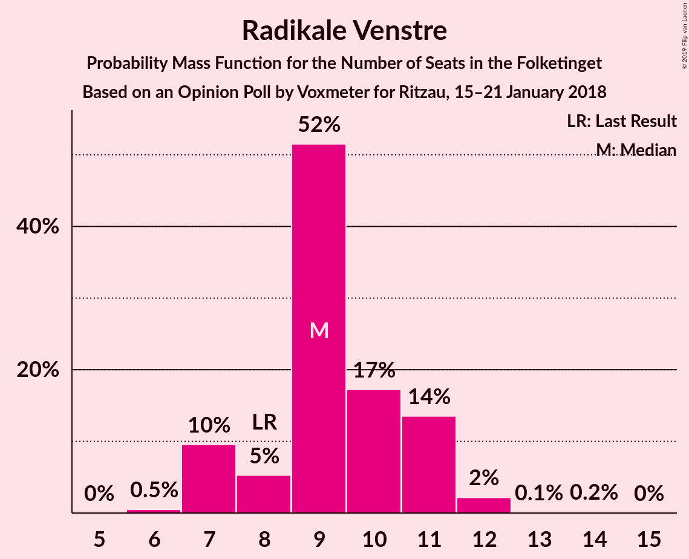

| Number of Seats | Probability | Accumulated | Special Marks |
|:---------------:|:-----------:|:-----------:|:-------------:|
| 6 | 0.5% | 100% |  |
| 7 | 10% | 99.5% |  |
| 8 | 5% | 90% | Last Result |
| 9 | 52% | 85% | Median |
| 10 | 17% | 33% |  |
| 11 | 14% | 16% |  |
| 12 | 2% | 2% |  |
| 13 | 0.1% | 0.2% |  |
| 14 | 0.2% | 0.2% |  |
| 15 | 0% | 0% |  |

### Socialistisk Folkeparti

*For a full overview of the results for this party, see the [Socialistisk Folkeparti](party-socialistiskfolkeparti.html) page.*

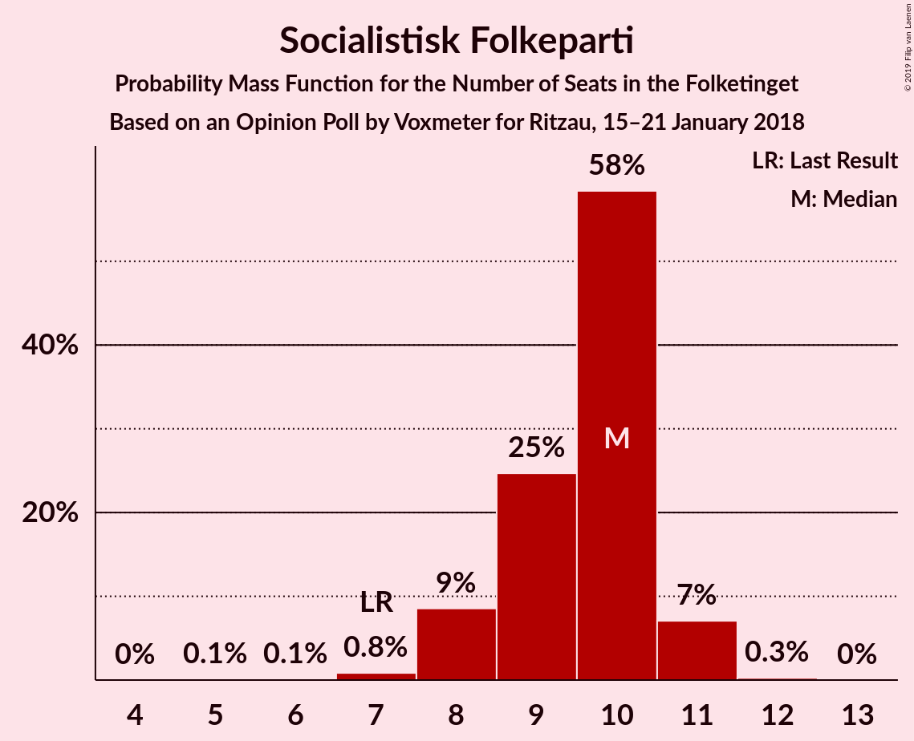

| Number of Seats | Probability | Accumulated | Special Marks |
|:---------------:|:-----------:|:-----------:|:-------------:|
| 5 | 0.1% | 100% |  |
| 6 | 0.1% | 99.9% |  |
| 7 | 0.8% | 99.9% | Last Result |
| 8 | 9% | 99.0% |  |
| 9 | 25% | 90% |  |
| 10 | 58% | 66% | Median |
| 11 | 7% | 7% |  |
| 12 | 0.3% | 0.3% |  |
| 13 | 0% | 0% |  |

### Alternativet

*For a full overview of the results for this party, see the [Alternativet](party-alternativet.html) page.*

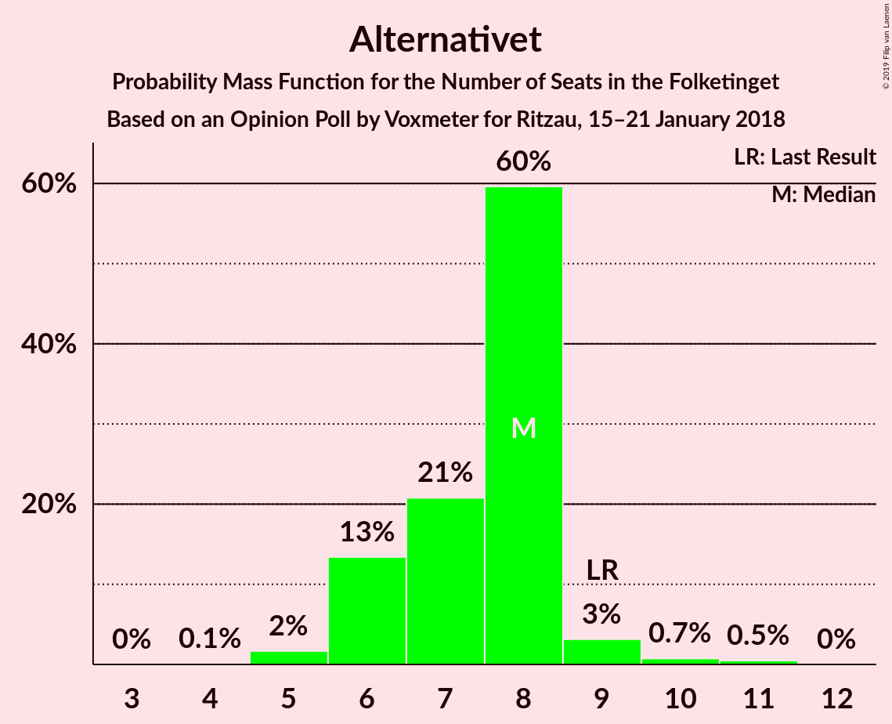

| Number of Seats | Probability | Accumulated | Special Marks |
|:---------------:|:-----------:|:-----------:|:-------------:|
| 4 | 0.1% | 100% |  |
| 5 | 2% | 99.9% |  |
| 6 | 13% | 98% |  |
| 7 | 21% | 85% |  |
| 8 | 60% | 64% | Median |
| 9 | 3% | 4% | Last Result |
| 10 | 0.7% | 1.3% |  |
| 11 | 0.5% | 0.5% |  |
| 12 | 0% | 0% |  |

### Det Konservative Folkeparti

*For a full overview of the results for this party, see the [Det Konservative Folkeparti](party-detkonservativefolkeparti.html) page.*

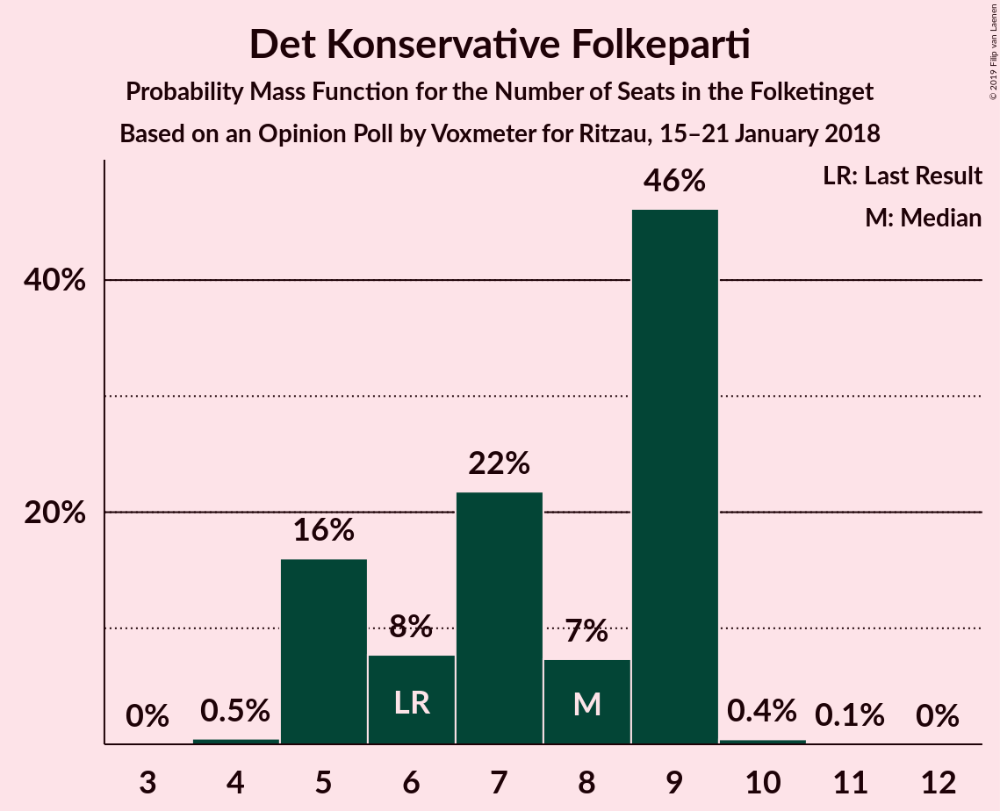

| Number of Seats | Probability | Accumulated | Special Marks |
|:---------------:|:-----------:|:-----------:|:-------------:|
| 4 | 0.5% | 100% |  |
| 5 | 16% | 99.5% |  |
| 6 | 8% | 83% | Last Result |
| 7 | 22% | 76% |  |
| 8 | 7% | 54% | Median |
| 9 | 46% | 47% |  |
| 10 | 0.4% | 0.5% |  |
| 11 | 0.1% | 0.1% |  |
| 12 | 0% | 0% |  |

### Nye Borgerlige

*For a full overview of the results for this party, see the [Nye Borgerlige](party-nyeborgerlige.html) page.*

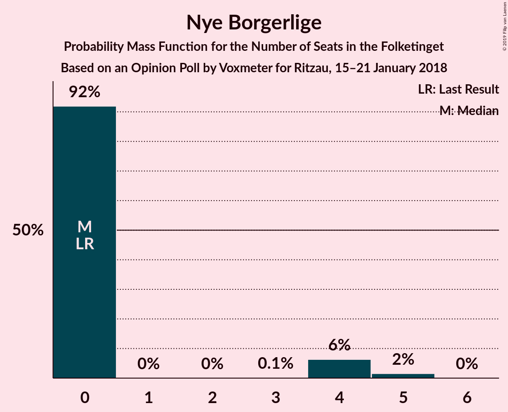

| Number of Seats | Probability | Accumulated | Special Marks |
|:---------------:|:-----------:|:-----------:|:-------------:|
| 0 | 92% | 100% | Last Result, Median |
| 1 | 0% | 8% |  |
| 2 | 0% | 8% |  |
| 3 | 0.1% | 8% |  |
| 4 | 6% | 8% |  |
| 5 | 2% | 2% |  |
| 6 | 0% | 0% |  |

### Kristendemokraterne

*For a full overview of the results for this party, see the [Kristendemokraterne](party-kristendemokraterne.html) page.*

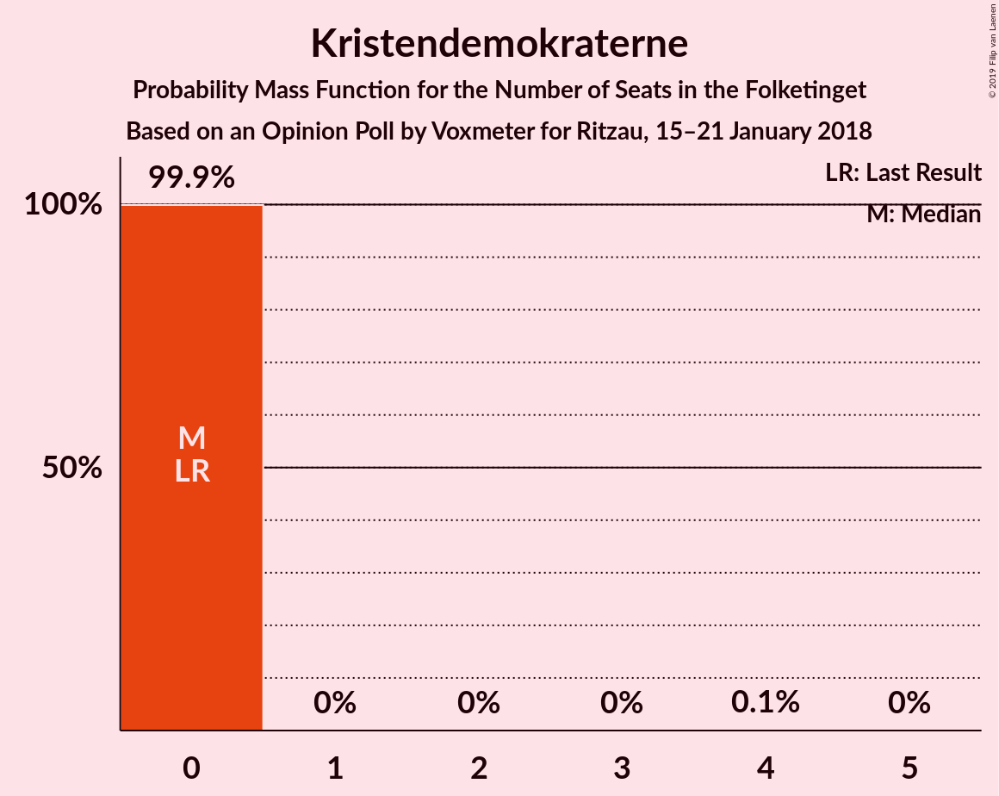

| Number of Seats | Probability | Accumulated | Special Marks |
|:---------------:|:-----------:|:-----------:|:-------------:|
| 0 | 99.9% | 100% | Last Result, Median |
| 1 | 0% | 0.1% |  |
| 2 | 0% | 0.1% |  |
| 3 | 0% | 0.1% |  |
| 4 | 0.1% | 0.1% |  |
| 5 | 0% | 0% |  |

## Coalitions

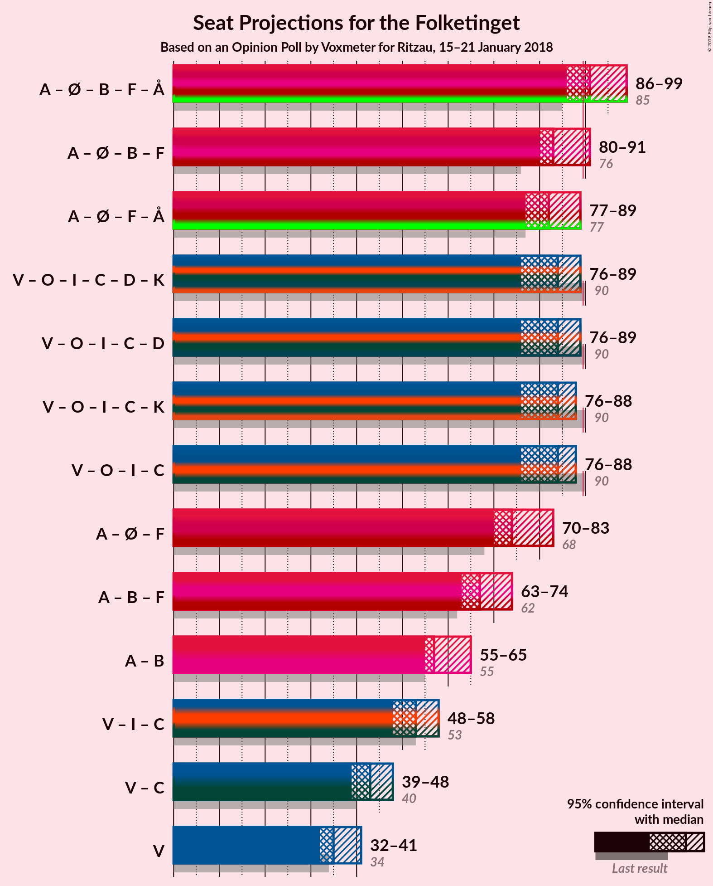

### Confidence Intervals

| Coalition | Last Result | Median | Majority? | 80% Confidence Interval | 90% Confidence Interval | 95% Confidence Interval | 99% Confidence Interval |
|:---------:|:-----------:|:------:|:---------:|:-----------------------:|:-----------------------:|:-----------------------:|:-----------------------:|
| Socialdemokraterne – Enhedslisten–De Rød-Grønne – Radikale Venstre – Socialistisk Folkeparti – Alternativet | 85 | 91 | 87% | 88–96 | 88–97 | 86–99 | 83–100 |
| Socialdemokraterne – Enhedslisten–De Rød-Grønne – Radikale Venstre – Socialistisk Folkeparti | 76 | 83 | 8% | 80–89 | 80–90 | 80–91 | 76–93 |
| Socialdemokraterne – Enhedslisten–De Rød-Grønne – Socialistisk Folkeparti – Alternativet | 77 | 82 | 2% | 79–87 | 78–89 | 77–89 | 75–91 |
| Venstre – Dansk Folkeparti – Liberal Alliance – Det Konservative Folkeparti – Nye Borgerlige – Kristendemokraterne | 90 | 84 | 1.5% | 79–87 | 78–87 | 76–89 | 75–92 |
| Venstre – Dansk Folkeparti – Liberal Alliance – Det Konservative Folkeparti – Nye Borgerlige | 90 | 84 | 1.5% | 79–87 | 78–87 | 76–89 | 75–92 |
| Venstre – Dansk Folkeparti – Liberal Alliance – Det Konservative Folkeparti – Kristendemokraterne | 90 | 84 | 0.2% | 79–87 | 76–87 | 76–88 | 74–89 |
| Venstre – Dansk Folkeparti – Liberal Alliance – Det Konservative Folkeparti | 90 | 84 | 0.2% | 79–87 | 76–87 | 76–88 | 74–89 |
| Socialdemokraterne – Enhedslisten–De Rød-Grønne – Socialistisk Folkeparti | 68 | 74 | 0% | 71–80 | 71–81 | 70–83 | 68–83 |
| Socialdemokraterne – Radikale Venstre – Socialistisk Folkeparti | 62 | 67 | 0% | 65–72 | 63–73 | 63–74 | 61–75 |
| Socialdemokraterne – Radikale Venstre | 55 | 57 | 0% | 56–63 | 55–64 | 55–65 | 52–66 |
| Venstre – Liberal Alliance – Det Konservative Folkeparti | 53 | 53 | 0% | 50–56 | 49–57 | 48–58 | 47–58 |
| Venstre – Det Konservative Folkeparti | 40 | 43 | 0% | 40–46 | 40–48 | 39–48 | 37–48 |
| Venstre | 34 | 35 | 0% | 34–40 | 33–40 | 32–41 | 30–43 |

### Socialdemokraterne – Enhedslisten–De Rød-Grønne – Radikale Venstre – Socialistisk Folkeparti – Alternativet

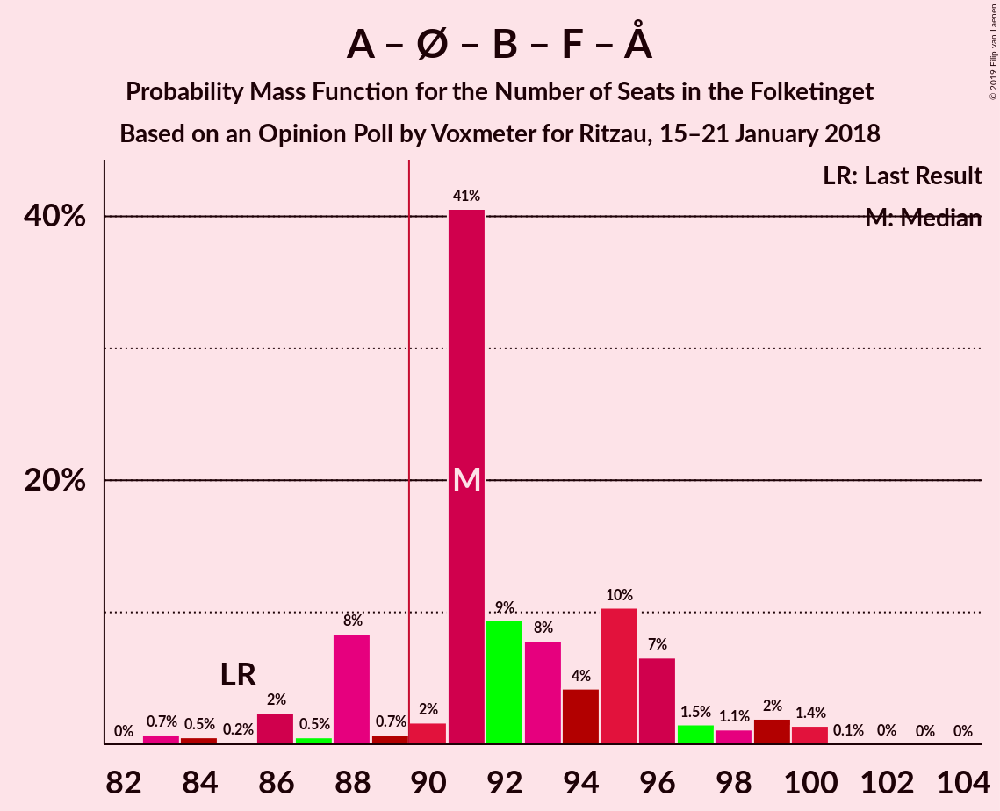

| Number of Seats | Probability | Accumulated | Special Marks |
|:---------------:|:-----------:|:-----------:|:-------------:|
| 83 | 0.7% | 100% |  |
| 84 | 0.5% | 99.2% |  |
| 85 | 0.2% | 98.7% | Last Result |
| 86 | 2% | 98.5% |  |
| 87 | 0.5% | 96% |  |
| 88 | 8% | 96% |  |
| 89 | 0.7% | 87% |  |
| 90 | 2% | 87% | Majority |
| 91 | 41% | 85% | Median |
| 92 | 9% | 44% |  |
| 93 | 8% | 35% |  |
| 94 | 4% | 27% |  |
| 95 | 10% | 23% |  |
| 96 | 7% | 13% |  |
| 97 | 1.5% | 6% |  |
| 98 | 1.1% | 5% |  |
| 99 | 2% | 3% |  |
| 100 | 1.4% | 2% |  |
| 101 | 0.1% | 0.1% |  |
| 102 | 0% | 0.1% |  |
| 103 | 0% | 0% |  |

### Socialdemokraterne – Enhedslisten–De Rød-Grønne – Radikale Venstre – Socialistisk Folkeparti

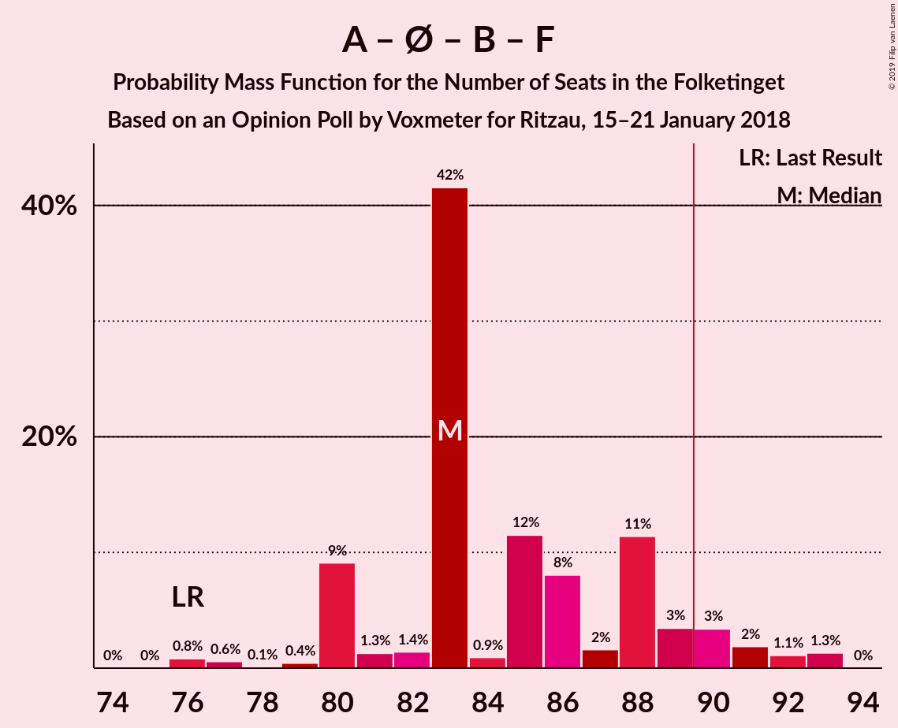

| Number of Seats | Probability | Accumulated | Special Marks |
|:---------------:|:-----------:|:-----------:|:-------------:|
| 75 | 0% | 100% |  |
| 76 | 0.8% | 99.9% | Last Result |
| 77 | 0.6% | 99.1% |  |
| 78 | 0.1% | 98.6% |  |
| 79 | 0.4% | 98% |  |
| 80 | 9% | 98% |  |
| 81 | 1.3% | 89% |  |
| 82 | 1.4% | 88% |  |
| 83 | 42% | 86% | Median |
| 84 | 0.9% | 45% |  |
| 85 | 12% | 44% |  |
| 86 | 8% | 32% |  |
| 87 | 2% | 24% |  |
| 88 | 11% | 23% |  |
| 89 | 3% | 11% |  |
| 90 | 3% | 8% | Majority |
| 91 | 2% | 4% |  |
| 92 | 1.1% | 2% |  |
| 93 | 1.3% | 1.4% |  |
| 94 | 0% | 0% |  |

### Socialdemokraterne – Enhedslisten–De Rød-Grønne – Socialistisk Folkeparti – Alternativet

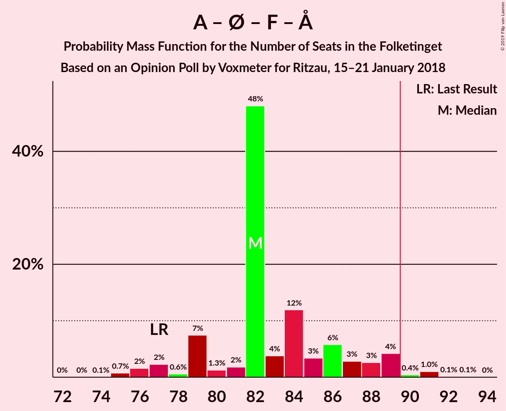

| Number of Seats | Probability | Accumulated | Special Marks |
|:---------------:|:-----------:|:-----------:|:-------------:|
| 74 | 0.1% | 100% |  |
| 75 | 0.7% | 99.9% |  |
| 76 | 2% | 99.2% |  |
| 77 | 2% | 98% | Last Result |
| 78 | 0.6% | 95% |  |
| 79 | 7% | 95% |  |
| 80 | 1.3% | 87% |  |
| 81 | 2% | 86% |  |
| 82 | 48% | 84% | Median |
| 83 | 4% | 36% |  |
| 84 | 12% | 32% |  |
| 85 | 3% | 20% |  |
| 86 | 6% | 17% |  |
| 87 | 3% | 11% |  |
| 88 | 3% | 8% |  |
| 89 | 4% | 6% |  |
| 90 | 0.4% | 2% | Majority |
| 91 | 1.0% | 1.2% |  |
| 92 | 0.1% | 0.2% |  |
| 93 | 0.1% | 0.1% |  |
| 94 | 0% | 0% |  |

### Venstre – Dansk Folkeparti – Liberal Alliance – Det Konservative Folkeparti – Nye Borgerlige – Kristendemokraterne

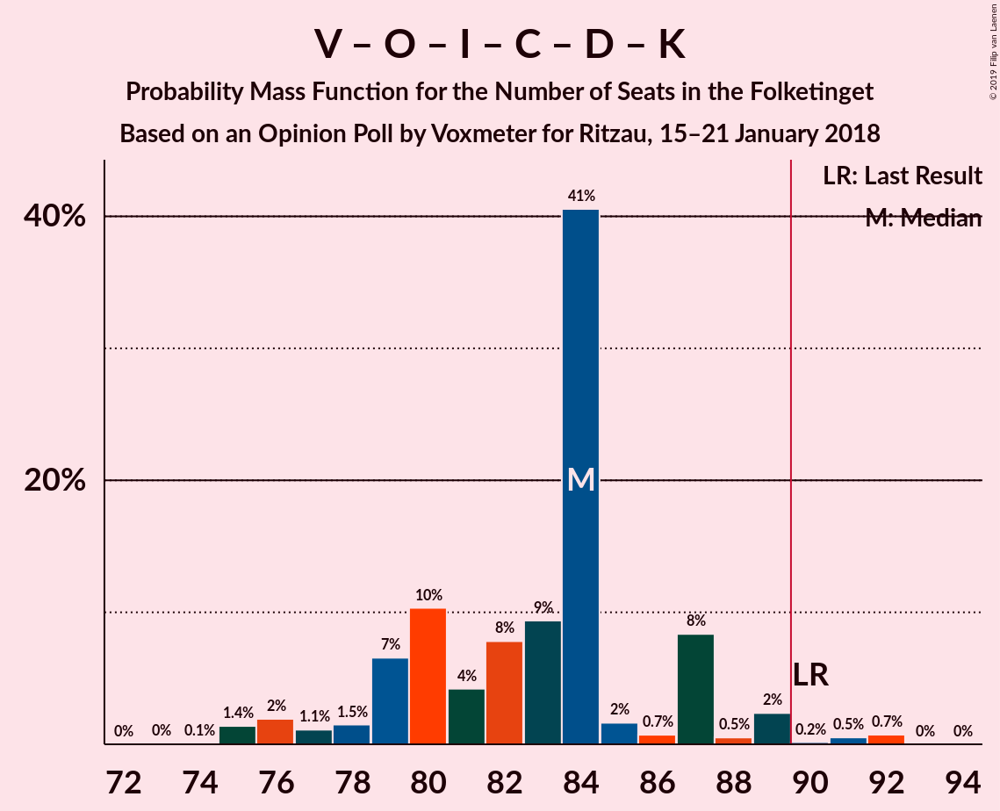

| Number of Seats | Probability | Accumulated | Special Marks |
|:---------------:|:-----------:|:-----------:|:-------------:|
| 73 | 0% | 100% |  |
| 74 | 0.1% | 99.9% |  |
| 75 | 1.4% | 99.9% |  |
| 76 | 2% | 98% |  |
| 77 | 1.1% | 97% |  |
| 78 | 1.5% | 95% |  |
| 79 | 7% | 94% |  |
| 80 | 10% | 87% |  |
| 81 | 4% | 77% |  |
| 82 | 8% | 73% |  |
| 83 | 9% | 65% |  |
| 84 | 41% | 56% | Median |
| 85 | 2% | 15% |  |
| 86 | 0.7% | 13% |  |
| 87 | 8% | 13% |  |
| 88 | 0.5% | 4% |  |
| 89 | 2% | 4% |  |
| 90 | 0.2% | 1.5% | Last Result, Majority |
| 91 | 0.5% | 1.3% |  |
| 92 | 0.7% | 0.8% |  |
| 93 | 0% | 0% |  |

### Venstre – Dansk Folkeparti – Liberal Alliance – Det Konservative Folkeparti – Nye Borgerlige

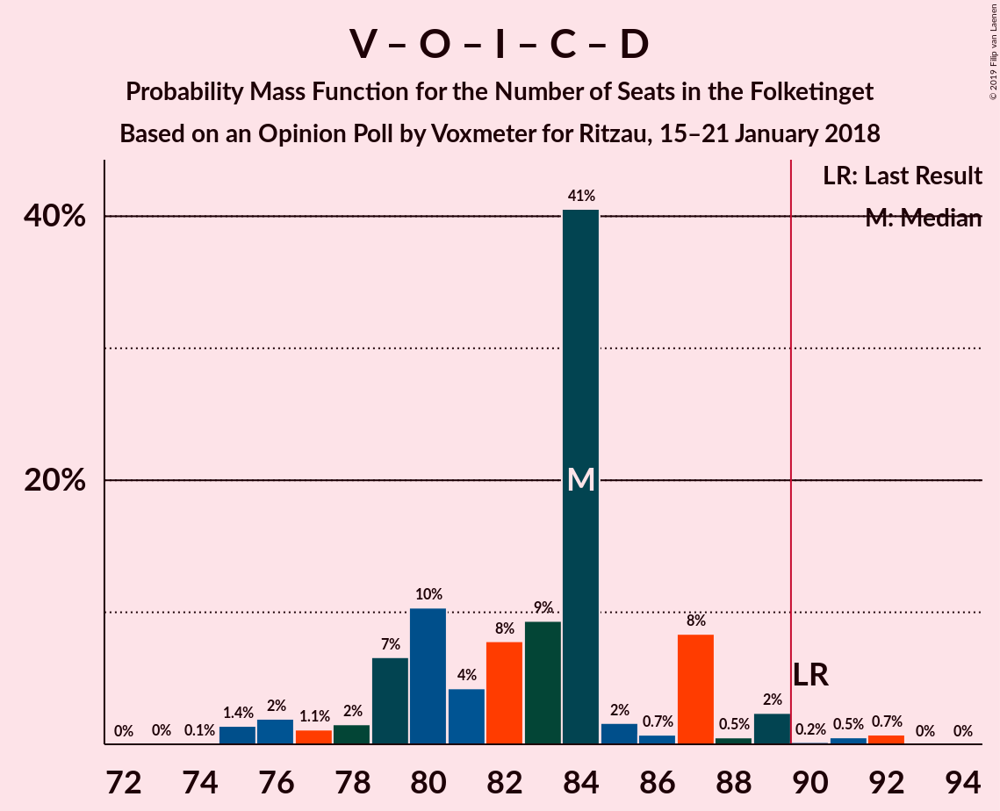

| Number of Seats | Probability | Accumulated | Special Marks |
|:---------------:|:-----------:|:-----------:|:-------------:|
| 73 | 0% | 100% |  |
| 74 | 0.1% | 99.9% |  |
| 75 | 1.4% | 99.9% |  |
| 76 | 2% | 98% |  |
| 77 | 1.1% | 97% |  |
| 78 | 2% | 95% |  |
| 79 | 7% | 94% |  |
| 80 | 10% | 87% |  |
| 81 | 4% | 77% |  |
| 82 | 8% | 73% |  |
| 83 | 9% | 65% |  |
| 84 | 41% | 56% | Median |
| 85 | 2% | 15% |  |
| 86 | 0.7% | 13% |  |
| 87 | 8% | 13% |  |
| 88 | 0.5% | 4% |  |
| 89 | 2% | 4% |  |
| 90 | 0.2% | 1.5% | Last Result, Majority |
| 91 | 0.5% | 1.3% |  |
| 92 | 0.7% | 0.8% |  |
| 93 | 0% | 0% |  |

### Venstre – Dansk Folkeparti – Liberal Alliance – Det Konservative Folkeparti – Kristendemokraterne

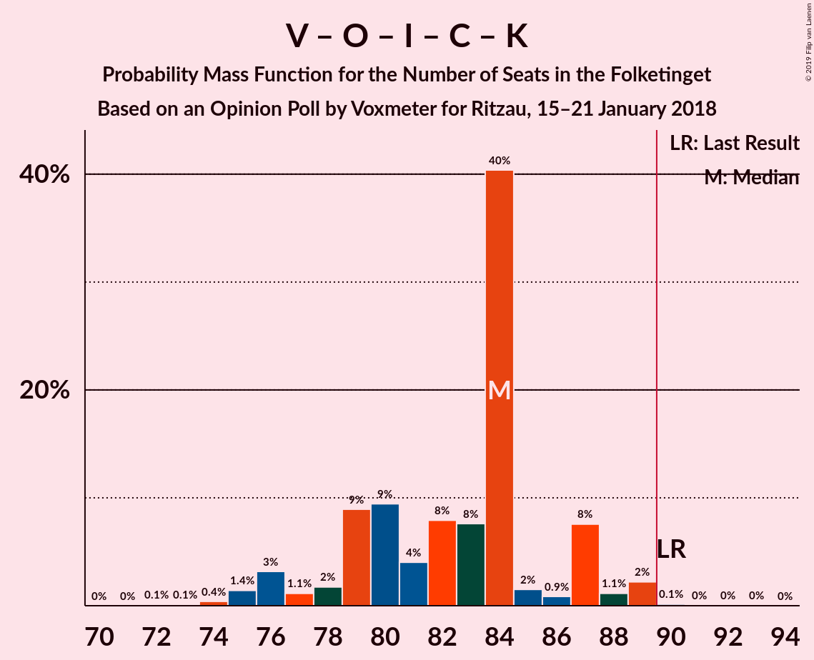

| Number of Seats | Probability | Accumulated | Special Marks |
|:---------------:|:-----------:|:-----------:|:-------------:|
| 72 | 0.1% | 100% |  |
| 73 | 0.1% | 99.9% |  |
| 74 | 0.4% | 99.7% |  |
| 75 | 1.4% | 99.3% |  |
| 76 | 3% | 98% |  |
| 77 | 1.1% | 95% |  |
| 78 | 2% | 94% |  |
| 79 | 9% | 92% |  |
| 80 | 9% | 83% |  |
| 81 | 4% | 73% |  |
| 82 | 8% | 69% |  |
| 83 | 8% | 62% |  |
| 84 | 40% | 54% | Median |
| 85 | 2% | 14% |  |
| 86 | 0.9% | 12% |  |
| 87 | 8% | 11% |  |
| 88 | 1.1% | 4% |  |
| 89 | 2% | 2% |  |
| 90 | 0.1% | 0.2% | Last Result, Majority |
| 91 | 0% | 0.1% |  |
| 92 | 0% | 0.1% |  |
| 93 | 0% | 0% |  |

### Venstre – Dansk Folkeparti – Liberal Alliance – Det Konservative Folkeparti

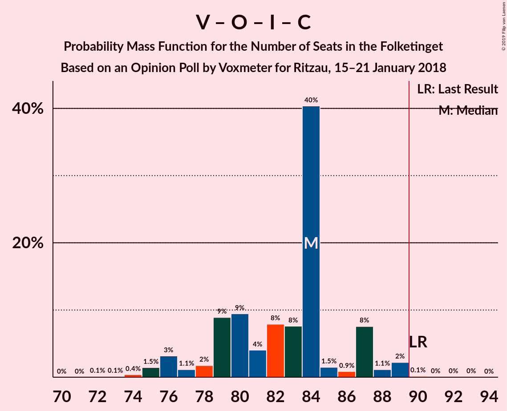

| Number of Seats | Probability | Accumulated | Special Marks |
|:---------------:|:-----------:|:-----------:|:-------------:|
| 72 | 0.1% | 100% |  |
| 73 | 0.1% | 99.9% |  |
| 74 | 0.4% | 99.7% |  |
| 75 | 1.5% | 99.3% |  |
| 76 | 3% | 98% |  |
| 77 | 1.1% | 95% |  |
| 78 | 2% | 94% |  |
| 79 | 9% | 92% |  |
| 80 | 9% | 83% |  |
| 81 | 4% | 73% |  |
| 82 | 8% | 69% |  |
| 83 | 8% | 61% |  |
| 84 | 40% | 54% | Median |
| 85 | 1.5% | 14% |  |
| 86 | 0.9% | 12% |  |
| 87 | 8% | 11% |  |
| 88 | 1.1% | 4% |  |
| 89 | 2% | 2% |  |
| 90 | 0.1% | 0.2% | Last Result, Majority |
| 91 | 0% | 0.1% |  |
| 92 | 0% | 0.1% |  |
| 93 | 0% | 0% |  |

### Socialdemokraterne – Enhedslisten–De Rød-Grønne – Socialistisk Folkeparti

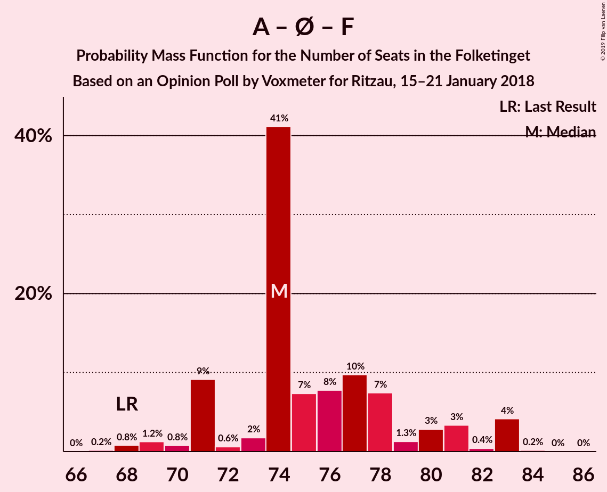

| Number of Seats | Probability | Accumulated | Special Marks |
|:---------------:|:-----------:|:-----------:|:-------------:|
| 67 | 0.2% | 100% |  |
| 68 | 0.8% | 99.8% | Last Result |
| 69 | 1.2% | 99.0% |  |
| 70 | 0.8% | 98% |  |
| 71 | 9% | 97% |  |
| 72 | 0.6% | 88% |  |
| 73 | 2% | 87% |  |
| 74 | 41% | 86% | Median |
| 75 | 7% | 44% |  |
| 76 | 8% | 37% |  |
| 77 | 10% | 29% |  |
| 78 | 7% | 20% |  |
| 79 | 1.3% | 12% |  |
| 80 | 3% | 11% |  |
| 81 | 3% | 8% |  |
| 82 | 0.4% | 5% |  |
| 83 | 4% | 4% |  |
| 84 | 0.2% | 0.2% |  |
| 85 | 0% | 0.1% |  |
| 86 | 0% | 0% |  |

### Socialdemokraterne – Radikale Venstre – Socialistisk Folkeparti

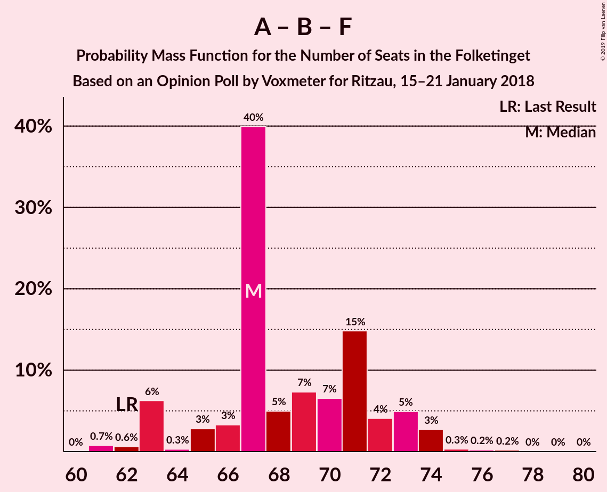

| Number of Seats | Probability | Accumulated | Special Marks |
|:---------------:|:-----------:|:-----------:|:-------------:|
| 61 | 0.7% | 100% |  |
| 62 | 0.6% | 99.2% | Last Result |
| 63 | 6% | 98.6% |  |
| 64 | 0.3% | 92% |  |
| 65 | 3% | 92% |  |
| 66 | 3% | 89% |  |
| 67 | 40% | 86% | Median |
| 68 | 5% | 46% |  |
| 69 | 7% | 41% |  |
| 70 | 7% | 34% |  |
| 71 | 15% | 27% |  |
| 72 | 4% | 12% |  |
| 73 | 5% | 8% |  |
| 74 | 3% | 3% |  |
| 75 | 0.3% | 0.7% |  |
| 76 | 0.2% | 0.4% |  |
| 77 | 0.2% | 0.2% |  |
| 78 | 0% | 0.1% |  |
| 79 | 0% | 0% |  |

### Socialdemokraterne – Radikale Venstre

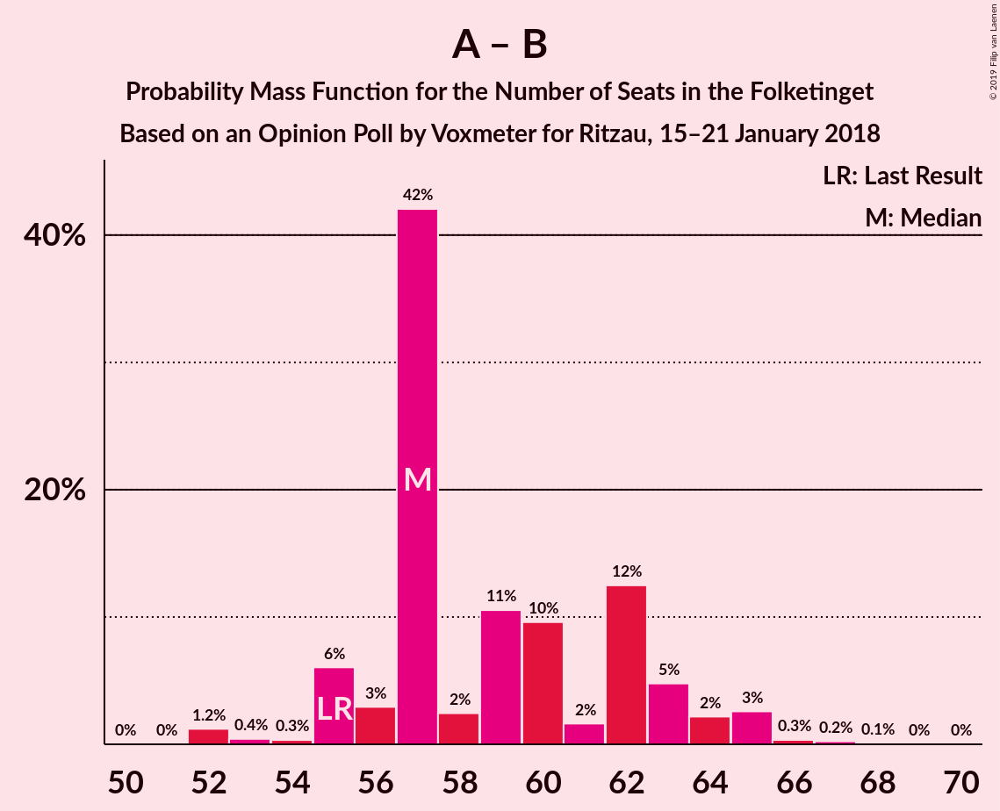

| Number of Seats | Probability | Accumulated | Special Marks |
|:---------------:|:-----------:|:-----------:|:-------------:|
| 52 | 1.2% | 100% |  |
| 53 | 0.4% | 98.8% |  |
| 54 | 0.3% | 98% |  |
| 55 | 6% | 98% | Last Result |
| 56 | 3% | 92% |  |
| 57 | 42% | 89% | Median |
| 58 | 2% | 47% |  |
| 59 | 11% | 45% |  |
| 60 | 10% | 34% |  |
| 61 | 2% | 24% |  |
| 62 | 12% | 23% |  |
| 63 | 5% | 10% |  |
| 64 | 2% | 5% |  |
| 65 | 3% | 3% |  |
| 66 | 0.3% | 0.7% |  |
| 67 | 0.2% | 0.4% |  |
| 68 | 0.1% | 0.1% |  |
| 69 | 0% | 0% |  |

### Venstre – Liberal Alliance – Det Konservative Folkeparti

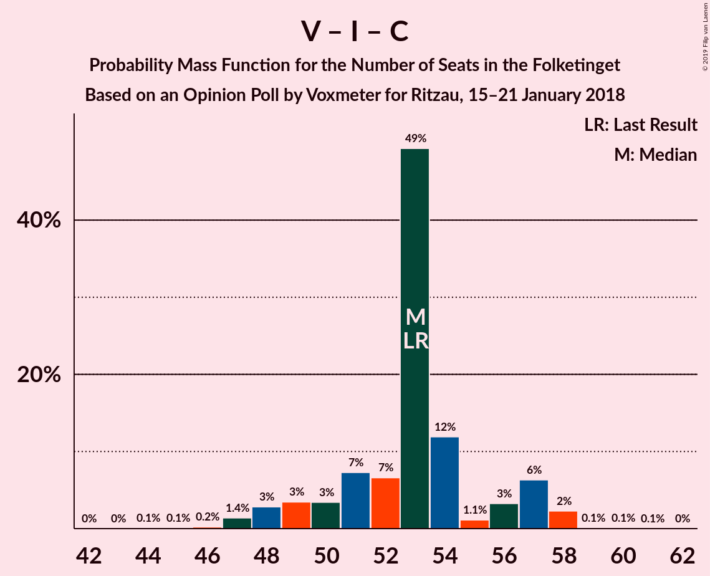

| Number of Seats | Probability | Accumulated | Special Marks |
|:---------------:|:-----------:|:-----------:|:-------------:|
| 44 | 0.1% | 100% |  |
| 45 | 0.1% | 99.9% |  |
| 46 | 0.2% | 99.8% |  |
| 47 | 1.4% | 99.5% |  |
| 48 | 3% | 98% |  |
| 49 | 3% | 95% |  |
| 50 | 3% | 92% |  |
| 51 | 7% | 88% |  |
| 52 | 7% | 81% |  |
| 53 | 49% | 75% | Last Result, Median |
| 54 | 12% | 25% |  |
| 55 | 1.1% | 13% |  |
| 56 | 3% | 12% |  |
| 57 | 6% | 9% |  |
| 58 | 2% | 3% |  |
| 59 | 0.1% | 0.3% |  |
| 60 | 0.1% | 0.2% |  |
| 61 | 0.1% | 0.1% |  |
| 62 | 0% | 0% |  |

### Venstre – Det Konservative Folkeparti

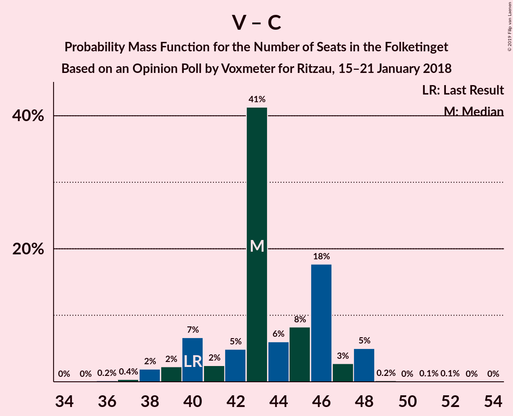

| Number of Seats | Probability | Accumulated | Special Marks |
|:---------------:|:-----------:|:-----------:|:-------------:|
| 36 | 0.2% | 100% |  |
| 37 | 0.4% | 99.8% |  |
| 38 | 2% | 99.5% |  |
| 39 | 2% | 98% |  |
| 40 | 7% | 95% | Last Result |
| 41 | 2% | 89% |  |
| 42 | 5% | 86% |  |
| 43 | 41% | 81% | Median |
| 44 | 6% | 40% |  |
| 45 | 8% | 34% |  |
| 46 | 18% | 26% |  |
| 47 | 3% | 8% |  |
| 48 | 5% | 5% |  |
| 49 | 0.2% | 0.3% |  |
| 50 | 0% | 0.2% |  |
| 51 | 0.1% | 0.1% |  |
| 52 | 0.1% | 0.1% |  |
| 53 | 0% | 0% |  |

### Venstre

| Number of Seats | Probability | Accumulated | Special Marks |
|:---------------:|:-----------:|:-----------:|:-------------:|
| 30 | 0.9% | 100% |  |
| 31 | 1.3% | 99.1% |  |
| 32 | 3% | 98% |  |
| 33 | 2% | 95% |  |
| 34 | 40% | 93% | Last Result |
| 35 | 6% | 53% | Median |
| 36 | 11% | 47% |  |
| 37 | 3% | 36% |  |
| 38 | 3% | 34% |  |
| 39 | 20% | 31% |  |
| 40 | 8% | 11% |  |
| 41 | 2% | 3% |  |
| 42 | 0.2% | 1.0% |  |
| 43 | 0.6% | 0.8% |  |
| 44 | 0.1% | 0.2% |  |
| 45 | 0% | 0.1% |  |
| 46 | 0% | 0% |  |

## Technical Information

### Opinion Poll

+ **Polling firm:** Voxmeter
+ **Commissioner(s):** Ritzau
+ **Fieldwork period:** 15–21 January 2018

### Calculations

+ **Sample size:** 1018
+ **Simulations done:** 1,048,576
+ **Error estimate:** 2.59%

