# Opinion Poll by Voxmeter for Ritzau, 22–28 January 2018

<a href="#voting-intentions">Voting Intentions</a> | <a href="#seats">Seats</a> | <a href="#coalitions">Coalitions</a> | <a href="#technical-information">Technical Information</a>

## Voting Intentions

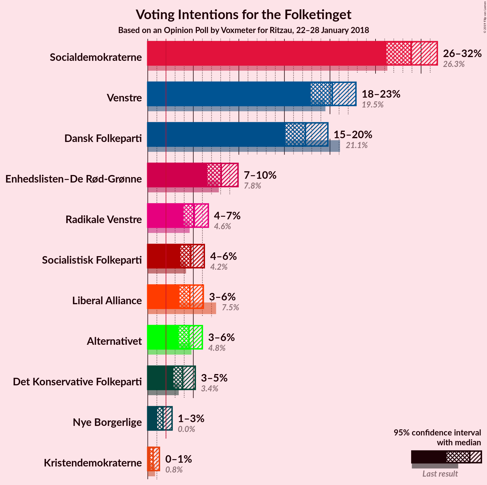

### Confidence Intervals

| Party | Last Result | Poll Result | 80% Confidence Interval | 90% Confidence Interval | 95% Confidence Interval | 99% Confidence Interval |
|:-----:|:-----------:|:-----------:|:-----------------------:|:-----------------------:|:-----------------------:|:-----------------------:|
| Socialdemokraterne | 26.3% | 28.9% | 27.1–30.8% |26.6–31.3% |26.2–31.8% |25.4–32.7% |
| Venstre | 19.5% | 20.3% | 18.7–21.9% |18.3–22.4% |17.9–22.8% |17.2–23.7% |
| Dansk Folkeparti | 21.1% | 17.3% | 15.9–18.9% |15.5–19.4% |15.1–19.8% |14.4–20.5% |
| Enhedslisten–De Rød-Grønne | 7.8% | 8.1% | 7.1–9.3% |6.8–9.6% |6.5–9.9% |6.1–10.5% |
| Radikale Venstre | 4.6% | 5.1% | 4.3–6.1% |4.1–6.4% |3.9–6.6% |3.6–7.2% |
| Socialistisk Folkeparti | 4.2% | 4.7% | 4.0–5.7% |3.7–6.0% |3.6–6.2% |3.2–6.7% |
| Liberal Alliance | 7.5% | 4.6% | 3.9–5.6% |3.7–5.9% |3.5–6.1% |3.2–6.6% |
| Alternativet | 4.8% | 4.5% | 3.8–5.5% |3.6–5.7% |3.4–6.0% |3.1–6.5% |
| Det Konservative Folkeparti | 3.4% | 3.8% | 3.2–4.7% |3.0–5.0% |2.8–5.2% |2.5–5.7% |
| Nye Borgerlige | 0.0% | 1.7% | 1.2–2.3% |1.1–2.5% |1.0–2.7% |0.9–3.0% |
| Kristendemokraterne | 0.8% | 0.6% | 0.4–1.0% |0.3–1.2% |0.3–1.3% |0.2–1.5% |

*Note:* The poll result column reflects the actual value used in the calculations. Published results may vary slightly, and in addition be rounded to fewer digits.

## Seats

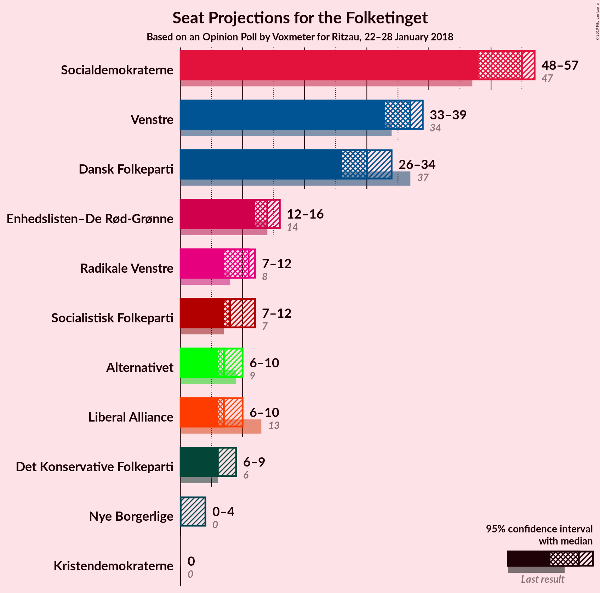

### Confidence Intervals

| Party | Last Result | Median | 80% Confidence Interval | 90% Confidence Interval | 95% Confidence Interval | 99% Confidence Interval |
|:-----:|:-----------:|:------:|:-----------------------:|:-----------------------:|:-----------------------:|:-----------------------:|
| <a href="#socialdemokraterne">Socialdemokraterne</a> | 47 | 55 | 50–55 |49–55 |48–57 |45–59 |
| <a href="#venstre">Venstre</a> | 34 | 37 | 34–37 |33–38 |33–39 |32–41 |
| <a href="#dansk-folkeparti">Dansk Folkeparti</a> | 37 | 30 | 28–33 |27–34 |26–34 |26–36 |
| <a href="#enhedslisten–de-rød-grønne">Enhedslisten–De Rød-Grønne</a> | 14 | 14 | 13–15 |12–16 |12–16 |11–18 |
| <a href="#radikale-venstre">Radikale Venstre</a> | 8 | 11 | 8–11 |7–11 |7–12 |7–13 |
| <a href="#socialistisk-folkeparti">Socialistisk Folkeparti</a> | 7 | 8 | 7–10 |7–11 |7–12 |6–12 |
| <a href="#liberal-alliance">Liberal Alliance</a> | 13 | 7 | 7–9 |7–10 |6–10 |5–11 |
| <a href="#alternativet">Alternativet</a> | 9 | 7 | 6–9 |6–9 |6–10 |5–12 |
| <a href="#det-konservative-folkeparti">Det Konservative Folkeparti</a> | 6 | 6 | 6–8 |6–9 |6–9 |5–10 |
| <a href="#nye-borgerlige">Nye Borgerlige</a> | 0 | 0 | 0–4 |0–4 |0–4 |0–5 |
| <a href="#kristendemokraterne">Kristendemokraterne</a> | 0 | 0 | 0 |0 |0 |0 |

### Socialdemokraterne

*For a full overview of the results for this party, see the [Socialdemokraterne](party-socialdemokraterne.html) page.*

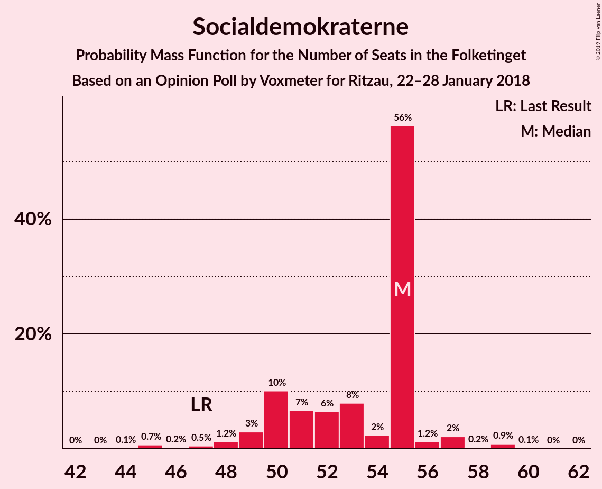

| Number of Seats | Probability | Accumulated | Special Marks |
|:---------------:|:-----------:|:-----------:|:-------------:|
| 43 | 0% | 100% |  |
| 44 | 0.1% | 99.9% |  |
| 45 | 0.7% | 99.8% |  |
| 46 | 0.2% | 99.2% |  |
| 47 | 0.5% | 98.9% | Last Result |
| 48 | 1.2% | 98% |  |
| 49 | 3% | 97% |  |
| 50 | 10% | 94% |  |
| 51 | 7% | 84% |  |
| 52 | 6% | 78% |  |
| 53 | 8% | 71% |  |
| 54 | 2% | 63% |  |
| 55 | 56% | 61% | Median |
| 56 | 1.2% | 5% |  |
| 57 | 2% | 3% |  |
| 58 | 0.2% | 1.2% |  |
| 59 | 0.9% | 0.9% |  |
| 60 | 0.1% | 0.1% |  |
| 61 | 0% | 0% |  |

### Venstre

*For a full overview of the results for this party, see the [Venstre](party-venstre.html) page.*

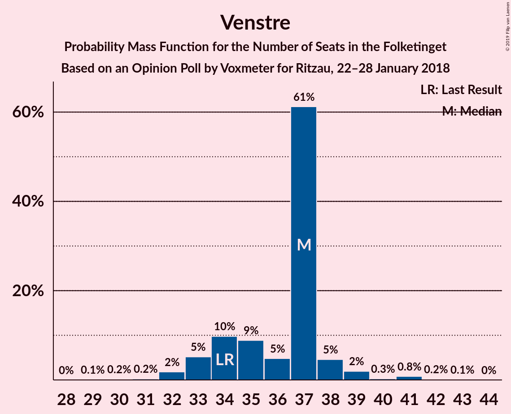

| Number of Seats | Probability | Accumulated | Special Marks |
|:---------------:|:-----------:|:-----------:|:-------------:|
| 29 | 0.1% | 100% |  |
| 30 | 0.2% | 99.9% |  |
| 31 | 0.2% | 99.8% |  |
| 32 | 2% | 99.5% |  |
| 33 | 5% | 98% |  |
| 34 | 10% | 93% | Last Result |
| 35 | 9% | 83% |  |
| 36 | 5% | 74% |  |
| 37 | 61% | 69% | Median |
| 38 | 5% | 8% |  |
| 39 | 2% | 3% |  |
| 40 | 0.3% | 1.3% |  |
| 41 | 0.8% | 1.0% |  |
| 42 | 0.2% | 0.2% |  |
| 43 | 0.1% | 0.1% |  |
| 44 | 0% | 0% |  |

### Dansk Folkeparti

*For a full overview of the results for this party, see the [Dansk Folkeparti](party-danskfolkeparti.html) page.*

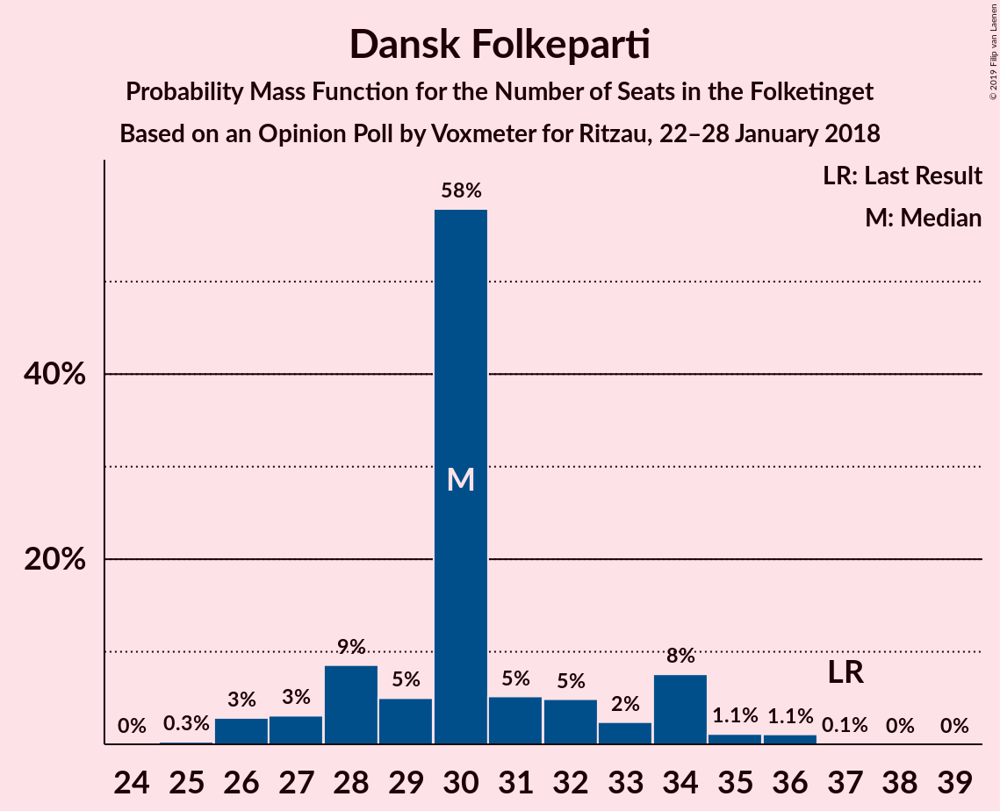

| Number of Seats | Probability | Accumulated | Special Marks |
|:---------------:|:-----------:|:-----------:|:-------------:|
| 25 | 0.3% | 100% |  |
| 26 | 3% | 99.7% |  |
| 27 | 3% | 97% |  |
| 28 | 9% | 94% |  |
| 29 | 5% | 85% |  |
| 30 | 58% | 80% | Median |
| 31 | 5% | 22% |  |
| 32 | 5% | 17% |  |
| 33 | 2% | 12% |  |
| 34 | 8% | 10% |  |
| 35 | 1.1% | 2% |  |
| 36 | 1.1% | 1.2% |  |
| 37 | 0.1% | 0.1% | Last Result |
| 38 | 0% | 0.1% |  |
| 39 | 0% | 0% |  |

### Enhedslisten–De Rød-Grønne

*For a full overview of the results for this party, see the [Enhedslisten–De Rød-Grønne](party-enhedslisten–derød-grønne.html) page.*

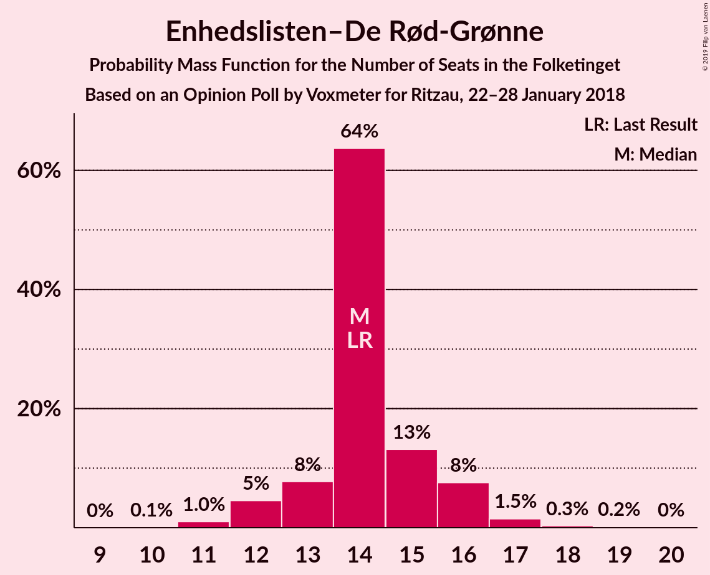

| Number of Seats | Probability | Accumulated | Special Marks |
|:---------------:|:-----------:|:-----------:|:-------------:|
| 10 | 0.1% | 100% |  |
| 11 | 1.0% | 99.9% |  |
| 12 | 5% | 98.8% |  |
| 13 | 8% | 94% |  |
| 14 | 64% | 87% | Last Result, Median |
| 15 | 13% | 23% |  |
| 16 | 8% | 10% |  |
| 17 | 1.5% | 2% |  |
| 18 | 0.3% | 0.6% |  |
| 19 | 0.2% | 0.2% |  |
| 20 | 0% | 0% |  |

### Radikale Venstre

*For a full overview of the results for this party, see the [Radikale Venstre](party-radikalevenstre.html) page.*

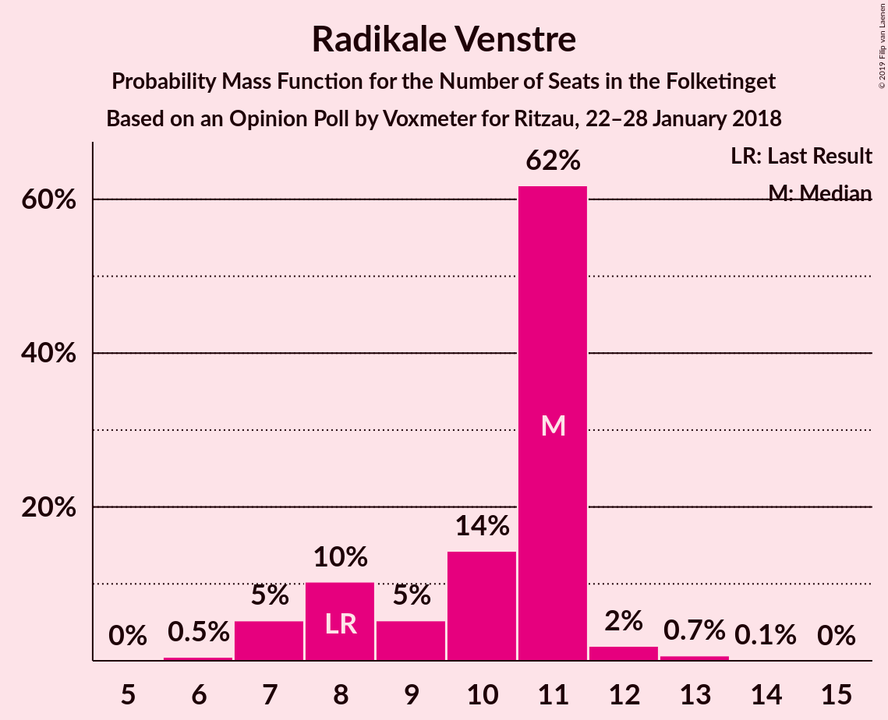

| Number of Seats | Probability | Accumulated | Special Marks |
|:---------------:|:-----------:|:-----------:|:-------------:|
| 6 | 0.5% | 100% |  |
| 7 | 5% | 99.5% |  |
| 8 | 10% | 94% | Last Result |
| 9 | 5% | 84% |  |
| 10 | 14% | 79% |  |
| 11 | 62% | 64% | Median |
| 12 | 2% | 3% |  |
| 13 | 0.7% | 0.8% |  |
| 14 | 0.1% | 0.1% |  |
| 15 | 0% | 0% |  |

### Socialistisk Folkeparti

*For a full overview of the results for this party, see the [Socialistisk Folkeparti](party-socialistiskfolkeparti.html) page.*

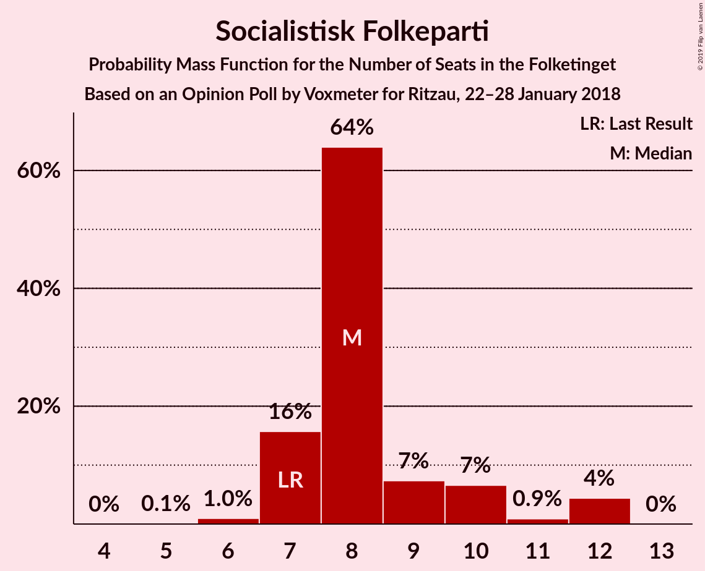

| Number of Seats | Probability | Accumulated | Special Marks |
|:---------------:|:-----------:|:-----------:|:-------------:|
| 5 | 0.1% | 100% |  |
| 6 | 1.0% | 99.9% |  |
| 7 | 16% | 99.0% | Last Result |
| 8 | 64% | 83% | Median |
| 9 | 7% | 19% |  |
| 10 | 7% | 12% |  |
| 11 | 0.9% | 5% |  |
| 12 | 4% | 4% |  |
| 13 | 0% | 0% |  |

### Liberal Alliance

*For a full overview of the results for this party, see the [Liberal Alliance](party-liberalalliance.html) page.*

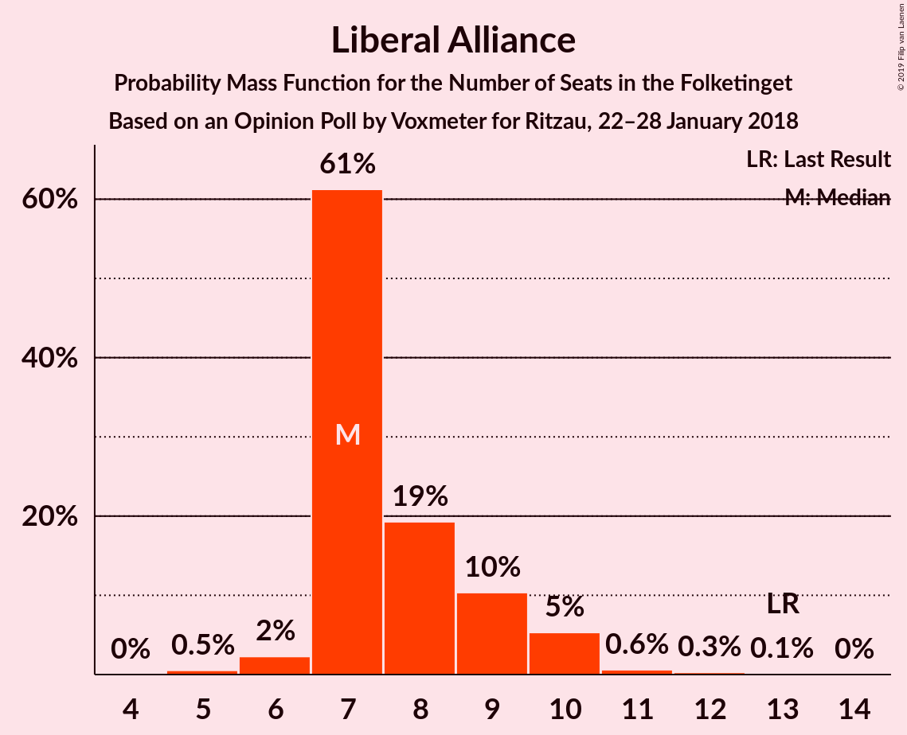

| Number of Seats | Probability | Accumulated | Special Marks |
|:---------------:|:-----------:|:-----------:|:-------------:|
| 5 | 0.5% | 100% |  |
| 6 | 2% | 99.5% |  |
| 7 | 61% | 97% | Median |
| 8 | 19% | 36% |  |
| 9 | 10% | 17% |  |
| 10 | 5% | 6% |  |
| 11 | 0.6% | 1.0% |  |
| 12 | 0.3% | 0.4% |  |
| 13 | 0.1% | 0.1% | Last Result |
| 14 | 0% | 0% |  |

### Alternativet

*For a full overview of the results for this party, see the [Alternativet](party-alternativet.html) page.*

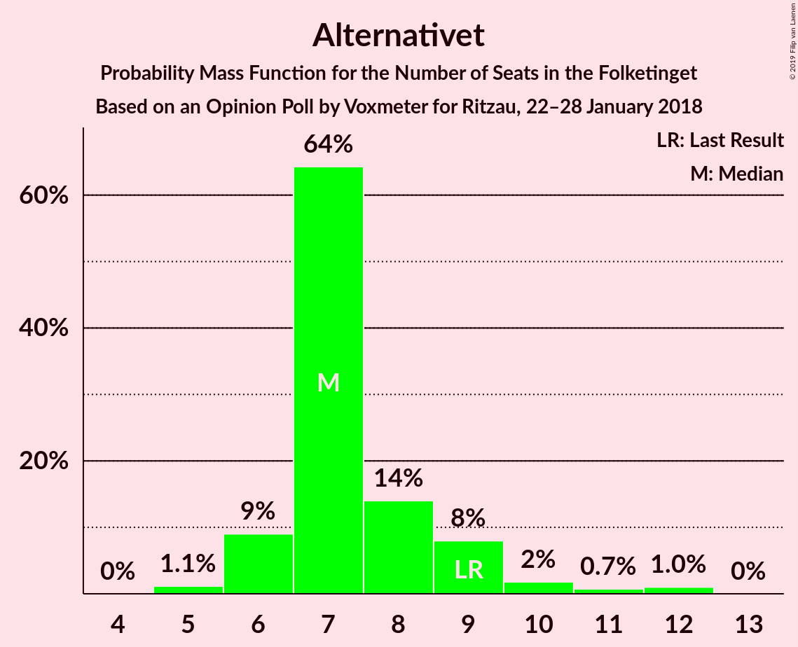

| Number of Seats | Probability | Accumulated | Special Marks |
|:---------------:|:-----------:|:-----------:|:-------------:|
| 5 | 1.1% | 100% |  |
| 6 | 9% | 98.9% |  |
| 7 | 64% | 90% | Median |
| 8 | 14% | 26% |  |
| 9 | 8% | 12% | Last Result |
| 10 | 2% | 4% |  |
| 11 | 0.7% | 2% |  |
| 12 | 1.0% | 1.0% |  |
| 13 | 0% | 0% |  |

### Det Konservative Folkeparti

*For a full overview of the results for this party, see the [Det Konservative Folkeparti](party-detkonservativefolkeparti.html) page.*

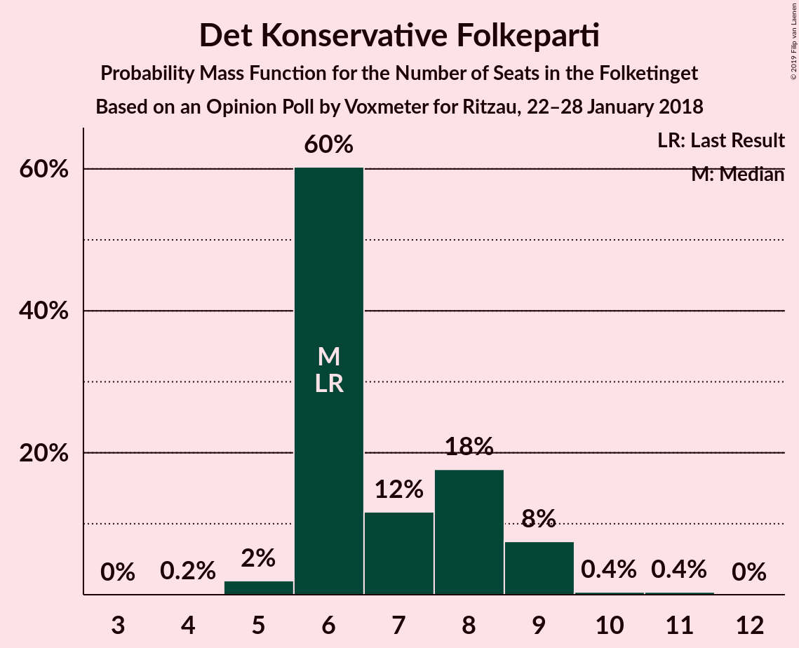

| Number of Seats | Probability | Accumulated | Special Marks |
|:---------------:|:-----------:|:-----------:|:-------------:|
| 4 | 0.2% | 100% |  |
| 5 | 2% | 99.8% |  |
| 6 | 60% | 98% | Last Result, Median |
| 7 | 12% | 38% |  |
| 8 | 18% | 26% |  |
| 9 | 8% | 8% |  |
| 10 | 0.4% | 0.8% |  |
| 11 | 0.4% | 0.4% |  |
| 12 | 0% | 0% |  |

### Nye Borgerlige

*For a full overview of the results for this party, see the [Nye Borgerlige](party-nyeborgerlige.html) page.*

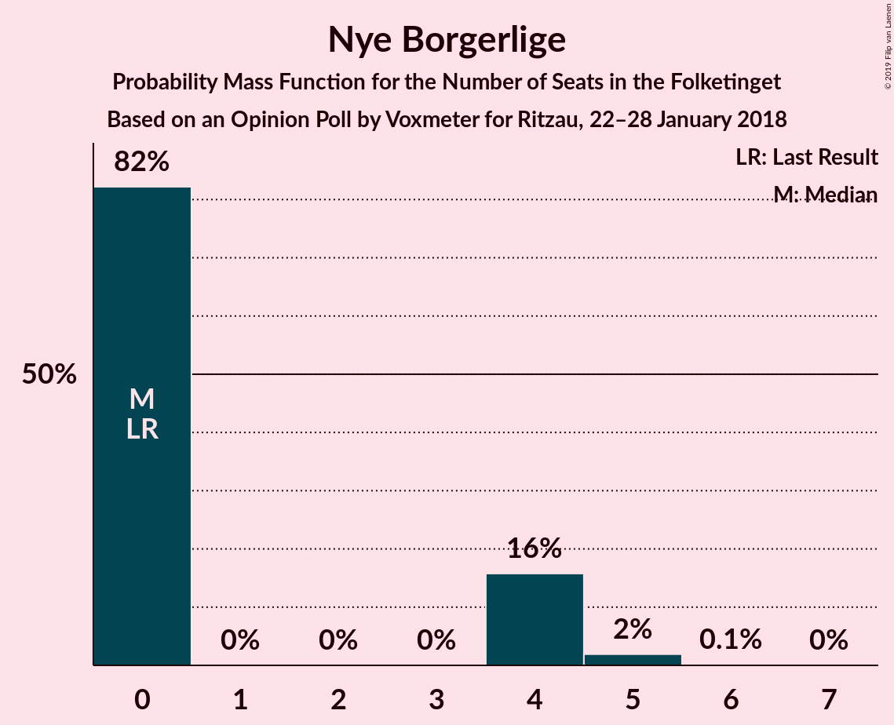

| Number of Seats | Probability | Accumulated | Special Marks |
|:---------------:|:-----------:|:-----------:|:-------------:|
| 0 | 82% | 100% | Last Result, Median |
| 1 | 0% | 18% |  |
| 2 | 0% | 18% |  |
| 3 | 0% | 18% |  |
| 4 | 16% | 18% |  |
| 5 | 2% | 2% |  |
| 6 | 0.1% | 0.1% |  |
| 7 | 0% | 0% |  |

### Kristendemokraterne

*For a full overview of the results for this party, see the [Kristendemokraterne](party-kristendemokraterne.html) page.*

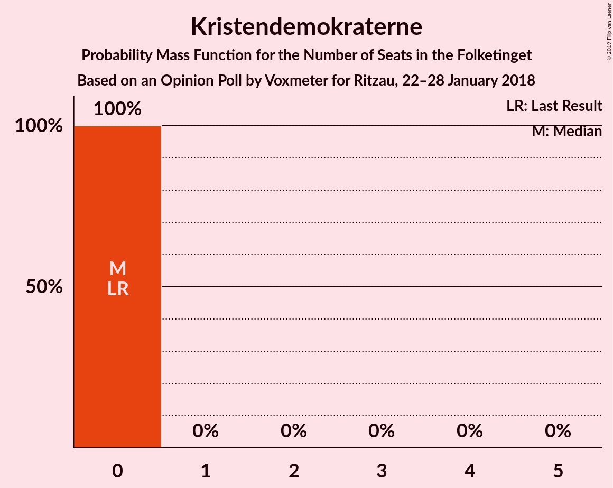

| Number of Seats | Probability | Accumulated | Special Marks |
|:---------------:|:-----------:|:-----------:|:-------------:|
| 0 | 100% | 100% | Last Result, Median |

## Coalitions

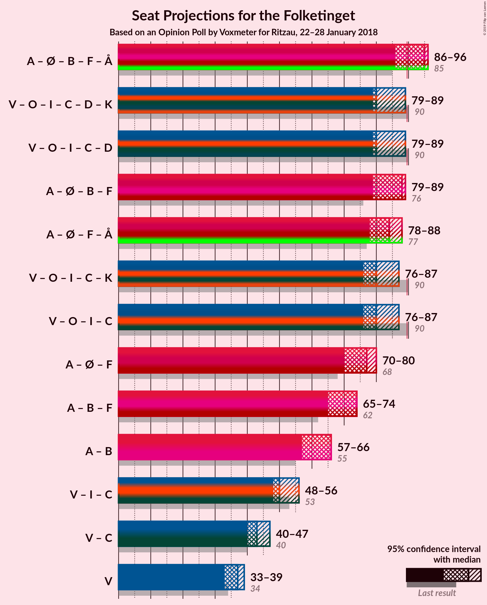

### Confidence Intervals

| Coalition | Last Result | Median | Majority? | 80% Confidence Interval | 90% Confidence Interval | 95% Confidence Interval | 99% Confidence Interval |
|:---------:|:-----------:|:------:|:---------:|:-----------------------:|:-----------------------:|:-----------------------:|:-----------------------:|
| Socialdemokraterne – Enhedslisten–De Rød-Grønne – Radikale Venstre – Socialistisk Folkeparti – Alternativet | 85 | 95 | 85% | 87–96 | 86–96 | 86–96 | 86–99 |
| Venstre – Dansk Folkeparti – Liberal Alliance – Det Konservative Folkeparti – Nye Borgerlige – Kristendemokraterne | 90 | 80 | 0.4% | 79–88 | 79–89 | 79–89 | 76–89 |
| Venstre – Dansk Folkeparti – Liberal Alliance – Det Konservative Folkeparti – Nye Borgerlige | 90 | 80 | 0.4% | 79–88 | 79–89 | 79–89 | 76–89 |
| Socialdemokraterne – Enhedslisten–De Rød-Grønne – Radikale Venstre – Socialistisk Folkeparti | 76 | 88 | 1.3% | 80–88 | 80–89 | 79–89 | 78–90 |
| Socialdemokraterne – Enhedslisten–De Rød-Grønne – Socialistisk Folkeparti – Alternativet | 77 | 84 | 0.2% | 79–86 | 78–86 | 78–88 | 75–89 |
| Venstre – Dansk Folkeparti – Liberal Alliance – Det Konservative Folkeparti – Kristendemokraterne | 90 | 80 | 0.1% | 79–85 | 78–85 | 76–87 | 75–89 |
| Venstre – Dansk Folkeparti – Liberal Alliance – Det Konservative Folkeparti | 90 | 80 | 0.1% | 79–85 | 78–85 | 76–87 | 75–89 |
| Socialdemokraterne – Enhedslisten–De Rød-Grønne – Socialistisk Folkeparti | 68 | 77 | 0% | 72–78 | 71–79 | 70–80 | 68–81 |
| Socialdemokraterne – Radikale Venstre – Socialistisk Folkeparti | 62 | 74 | 0% | 66–74 | 65–74 | 65–74 | 63–77 |
| Socialdemokraterne – Radikale Venstre | 55 | 66 | 0% | 58–66 | 58–66 | 57–66 | 55–69 |
| Venstre – Liberal Alliance – Det Konservative Folkeparti | 53 | 50 | 0% | 49–54 | 48–55 | 48–56 | 46–57 |
| Venstre – Det Konservative Folkeparti | 40 | 43 | 0% | 41–45 | 40–46 | 40–47 | 38–49 |
| Venstre | 34 | 37 | 0% | 34–37 | 33–38 | 33–39 | 32–41 |

### Socialdemokraterne – Enhedslisten–De Rød-Grønne – Radikale Venstre – Socialistisk Folkeparti – Alternativet

| Number of Seats | Probability | Accumulated | Special Marks |
|:---------------:|:-----------:|:-----------:|:-------------:|
| 83 | 0% | 100% |  |
| 84 | 0.1% | 99.9% |  |
| 85 | 0.2% | 99.9% | Last Result |
| 86 | 7% | 99.6% |  |
| 87 | 3% | 92% |  |
| 88 | 2% | 89% |  |
| 89 | 2% | 87% |  |
| 90 | 2% | 85% | Majority |
| 91 | 4% | 83% |  |
| 92 | 0.9% | 79% |  |
| 93 | 5% | 78% |  |
| 94 | 5% | 73% |  |
| 95 | 58% | 69% | Median |
| 96 | 8% | 10% |  |
| 97 | 1.0% | 2% |  |
| 98 | 0.4% | 1.4% |  |
| 99 | 0.9% | 1.0% |  |
| 100 | 0% | 0.2% |  |
| 101 | 0.1% | 0.1% |  |
| 102 | 0% | 0% |  |

### Venstre – Dansk Folkeparti – Liberal Alliance – Det Konservative Folkeparti – Nye Borgerlige – Kristendemokraterne

| Number of Seats | Probability | Accumulated | Special Marks |
|:---------------:|:-----------:|:-----------:|:-------------:|
| 74 | 0.1% | 100% |  |
| 75 | 0% | 99.9% |  |
| 76 | 0.9% | 99.8% |  |
| 77 | 0.4% | 99.0% |  |
| 78 | 1.0% | 98.6% |  |
| 79 | 8% | 98% |  |
| 80 | 58% | 90% | Median |
| 81 | 5% | 31% |  |
| 82 | 5% | 27% |  |
| 83 | 0.9% | 22% |  |
| 84 | 4% | 21% |  |
| 85 | 2% | 17% |  |
| 86 | 2% | 15% |  |
| 87 | 2% | 13% |  |
| 88 | 3% | 11% |  |
| 89 | 7% | 8% |  |
| 90 | 0.2% | 0.4% | Last Result, Majority |
| 91 | 0.1% | 0.1% |  |
| 92 | 0% | 0.1% |  |
| 93 | 0% | 0% |  |

### Venstre – Dansk Folkeparti – Liberal Alliance – Det Konservative Folkeparti – Nye Borgerlige

| Number of Seats | Probability | Accumulated | Special Marks |
|:---------------:|:-----------:|:-----------:|:-------------:|
| 74 | 0.1% | 100% |  |
| 75 | 0% | 99.9% |  |
| 76 | 0.9% | 99.8% |  |
| 77 | 0.4% | 99.0% |  |
| 78 | 1.0% | 98.6% |  |
| 79 | 8% | 98% |  |
| 80 | 58% | 90% | Median |
| 81 | 5% | 31% |  |
| 82 | 5% | 27% |  |
| 83 | 0.9% | 22% |  |
| 84 | 4% | 21% |  |
| 85 | 2% | 17% |  |
| 86 | 2% | 15% |  |
| 87 | 2% | 13% |  |
| 88 | 3% | 11% |  |
| 89 | 7% | 8% |  |
| 90 | 0.2% | 0.4% | Last Result, Majority |
| 91 | 0.1% | 0.1% |  |
| 92 | 0% | 0.1% |  |
| 93 | 0% | 0% |  |

### Socialdemokraterne – Enhedslisten–De Rød-Grønne – Radikale Venstre – Socialistisk Folkeparti

| Number of Seats | Probability | Accumulated | Special Marks |
|:---------------:|:-----------:|:-----------:|:-------------:|
| 74 | 0.1% | 100% |  |
| 75 | 0% | 99.9% |  |
| 76 | 0.2% | 99.9% | Last Result |
| 77 | 0.1% | 99.7% |  |
| 78 | 0.3% | 99.5% |  |
| 79 | 3% | 99.3% |  |
| 80 | 8% | 96% |  |
| 81 | 2% | 88% |  |
| 82 | 3% | 86% |  |
| 83 | 4% | 82% |  |
| 84 | 3% | 78% |  |
| 85 | 6% | 76% |  |
| 86 | 2% | 70% |  |
| 87 | 1.1% | 68% |  |
| 88 | 61% | 67% | Median |
| 89 | 5% | 6% |  |
| 90 | 1.1% | 1.3% | Majority |
| 91 | 0.1% | 0.2% |  |
| 92 | 0.1% | 0.2% |  |
| 93 | 0% | 0.1% |  |
| 94 | 0% | 0% |  |

### Socialdemokraterne – Enhedslisten–De Rød-Grønne – Socialistisk Folkeparti – Alternativet

| Number of Seats | Probability | Accumulated | Special Marks |
|:---------------:|:-----------:|:-----------:|:-------------:|
| 74 | 0% | 100% |  |
| 75 | 0.5% | 99.9% |  |
| 76 | 0.8% | 99.4% |  |
| 77 | 1.0% | 98.6% | Last Result |
| 78 | 7% | 98% |  |
| 79 | 2% | 90% |  |
| 80 | 5% | 88% |  |
| 81 | 4% | 84% |  |
| 82 | 2% | 80% |  |
| 83 | 4% | 78% |  |
| 84 | 61% | 74% | Median |
| 85 | 0.4% | 13% |  |
| 86 | 7% | 12% |  |
| 87 | 2% | 5% |  |
| 88 | 2% | 3% |  |
| 89 | 1.1% | 1.3% |  |
| 90 | 0.1% | 0.2% | Majority |
| 91 | 0% | 0.1% |  |
| 92 | 0% | 0.1% |  |
| 93 | 0.1% | 0.1% |  |
| 94 | 0% | 0% |  |

### Venstre – Dansk Folkeparti – Liberal Alliance – Det Konservative Folkeparti – Kristendemokraterne

| Number of Seats | Probability | Accumulated | Special Marks |
|:---------------:|:-----------:|:-----------:|:-------------:|
| 72 | 0.2% | 100% |  |
| 73 | 0% | 99.8% |  |
| 74 | 0.1% | 99.7% |  |
| 75 | 0.2% | 99.6% |  |
| 76 | 3% | 99.4% |  |
| 77 | 0.6% | 97% |  |
| 78 | 2% | 96% |  |
| 79 | 8% | 95% |  |
| 80 | 60% | 86% | Median |
| 81 | 5% | 27% |  |
| 82 | 5% | 22% |  |
| 83 | 0.9% | 17% |  |
| 84 | 4% | 16% |  |
| 85 | 8% | 12% |  |
| 86 | 2% | 5% |  |
| 87 | 1.3% | 3% |  |
| 88 | 1.3% | 2% |  |
| 89 | 0.4% | 0.5% |  |
| 90 | 0% | 0.1% | Last Result, Majority |
| 91 | 0% | 0% |  |

### Venstre – Dansk Folkeparti – Liberal Alliance – Det Konservative Folkeparti

| Number of Seats | Probability | Accumulated | Special Marks |
|:---------------:|:-----------:|:-----------:|:-------------:|
| 72 | 0.2% | 100% |  |
| 73 | 0% | 99.8% |  |
| 74 | 0.1% | 99.7% |  |
| 75 | 0.2% | 99.6% |  |
| 76 | 3% | 99.4% |  |
| 77 | 0.6% | 97% |  |
| 78 | 2% | 96% |  |
| 79 | 8% | 95% |  |
| 80 | 60% | 86% | Median |
| 81 | 5% | 27% |  |
| 82 | 5% | 22% |  |
| 83 | 0.9% | 17% |  |
| 84 | 4% | 16% |  |
| 85 | 8% | 12% |  |
| 86 | 2% | 5% |  |
| 87 | 1.3% | 3% |  |
| 88 | 1.3% | 2% |  |
| 89 | 0.4% | 0.5% |  |
| 90 | 0% | 0.1% | Last Result, Majority |
| 91 | 0% | 0% |  |

### Socialdemokraterne – Enhedslisten–De Rød-Grønne – Socialistisk Folkeparti

| Number of Seats | Probability | Accumulated | Special Marks |
|:---------------:|:-----------:|:-----------:|:-------------:|
| 66 | 0.1% | 100% |  |
| 67 | 0.1% | 99.9% |  |
| 68 | 1.3% | 99.8% | Last Result |
| 69 | 0.5% | 98.5% |  |
| 70 | 1.4% | 98% |  |
| 71 | 2% | 97% |  |
| 72 | 10% | 95% |  |
| 73 | 4% | 85% |  |
| 74 | 7% | 81% |  |
| 75 | 2% | 75% |  |
| 76 | 4% | 72% |  |
| 77 | 58% | 69% | Median |
| 78 | 2% | 10% |  |
| 79 | 5% | 8% |  |
| 80 | 2% | 3% |  |
| 81 | 0.3% | 0.7% |  |
| 82 | 0.2% | 0.3% |  |
| 83 | 0% | 0.1% |  |
| 84 | 0.1% | 0.1% |  |
| 85 | 0% | 0% |  |

### Socialdemokraterne – Radikale Venstre – Socialistisk Folkeparti

| Number of Seats | Probability | Accumulated | Special Marks |
|:---------------:|:-----------:|:-----------:|:-------------:|
| 60 | 0% | 100% |  |
| 61 | 0.1% | 99.9% |  |
| 62 | 0% | 99.8% | Last Result |
| 63 | 1.0% | 99.8% |  |
| 64 | 0.3% | 98.8% |  |
| 65 | 7% | 98.6% |  |
| 66 | 2% | 91% |  |
| 67 | 3% | 90% |  |
| 68 | 4% | 87% |  |
| 69 | 3% | 83% |  |
| 70 | 7% | 80% |  |
| 71 | 4% | 73% |  |
| 72 | 2% | 69% |  |
| 73 | 6% | 67% |  |
| 74 | 58% | 61% | Median |
| 75 | 1.3% | 2% |  |
| 76 | 0.5% | 1.1% |  |
| 77 | 0.6% | 0.7% |  |
| 78 | 0% | 0.1% |  |
| 79 | 0% | 0% |  |

### Socialdemokraterne – Radikale Venstre

| Number of Seats | Probability | Accumulated | Special Marks |
|:---------------:|:-----------:|:-----------:|:-------------:|
| 52 | 0% | 100% |  |
| 53 | 0.1% | 99.9% |  |
| 54 | 0.1% | 99.8% |  |
| 55 | 0.5% | 99.7% | Last Result |
| 56 | 1.0% | 99.1% |  |
| 57 | 2% | 98% |  |
| 58 | 8% | 96% |  |
| 59 | 2% | 88% |  |
| 60 | 2% | 85% |  |
| 61 | 8% | 83% |  |
| 62 | 6% | 75% |  |
| 63 | 6% | 69% |  |
| 64 | 0.6% | 63% |  |
| 65 | 4% | 62% |  |
| 66 | 56% | 58% | Median |
| 67 | 1.2% | 2% |  |
| 68 | 0% | 0.7% |  |
| 69 | 0.6% | 0.6% |  |
| 70 | 0% | 0% |  |

### Venstre – Liberal Alliance – Det Konservative Folkeparti

| Number of Seats | Probability | Accumulated | Special Marks |
|:---------------:|:-----------:|:-----------:|:-------------:|
| 44 | 0.2% | 100% |  |
| 45 | 0.2% | 99.8% |  |
| 46 | 1.2% | 99.6% |  |
| 47 | 0.8% | 98% |  |
| 48 | 6% | 98% |  |
| 49 | 3% | 91% |  |
| 50 | 60% | 89% | Median |
| 51 | 13% | 29% |  |
| 52 | 3% | 17% |  |
| 53 | 3% | 14% | Last Result |
| 54 | 4% | 11% |  |
| 55 | 4% | 6% |  |
| 56 | 2% | 3% |  |
| 57 | 0.6% | 0.9% |  |
| 58 | 0.1% | 0.3% |  |
| 59 | 0.1% | 0.2% |  |
| 60 | 0.1% | 0.1% |  |
| 61 | 0% | 0% |  |

### Venstre – Det Konservative Folkeparti

| Number of Seats | Probability | Accumulated | Special Marks |
|:---------------:|:-----------:|:-----------:|:-------------:|
| 36 | 0% | 100% |  |
| 37 | 0.1% | 99.9% |  |
| 38 | 1.3% | 99.8% |  |
| 39 | 0.9% | 98% |  |
| 40 | 4% | 98% | Last Result |
| 41 | 6% | 94% |  |
| 42 | 8% | 87% |  |
| 43 | 65% | 80% | Median |
| 44 | 5% | 15% |  |
| 45 | 0.4% | 10% |  |
| 46 | 5% | 10% |  |
| 47 | 3% | 5% |  |
| 48 | 0.7% | 2% |  |
| 49 | 0.6% | 0.8% |  |
| 50 | 0.1% | 0.2% |  |
| 51 | 0% | 0.1% |  |
| 52 | 0% | 0% |  |

### Venstre

| Number of Seats | Probability | Accumulated | Special Marks |
|:---------------:|:-----------:|:-----------:|:-------------:|
| 29 | 0.1% | 100% |  |
| 30 | 0.2% | 99.9% |  |
| 31 | 0.2% | 99.8% |  |
| 32 | 2% | 99.5% |  |
| 33 | 5% | 98% |  |
| 34 | 10% | 93% | Last Result |
| 35 | 9% | 83% |  |
| 36 | 5% | 74% |  |
| 37 | 61% | 69% | Median |
| 38 | 5% | 8% |  |
| 39 | 2% | 3% |  |
| 40 | 0.3% | 1.3% |  |
| 41 | 0.8% | 1.0% |  |
| 42 | 0.2% | 0.2% |  |
| 43 | 0.1% | 0.1% |  |
| 44 | 0% | 0% |  |

## Technical Information

### Opinion Poll

+ **Polling firm:** Voxmeter
+ **Commissioner(s):** Ritzau
+ **Fieldwork period:** 22–28 January 2018

### Calculations

+ **Sample size:** 1017
+ **Simulations done:** 524,288
+ **Error estimate:** 1.51%

