# Opinion Poll by Norstat for Altinget, 24–29 January 2018

<a href="#voting-intentions">Voting Intentions</a> | <a href="#seats">Seats</a> | <a href="#coalitions">Coalitions</a> | <a href="#technical-information">Technical Information</a>

## Voting Intentions

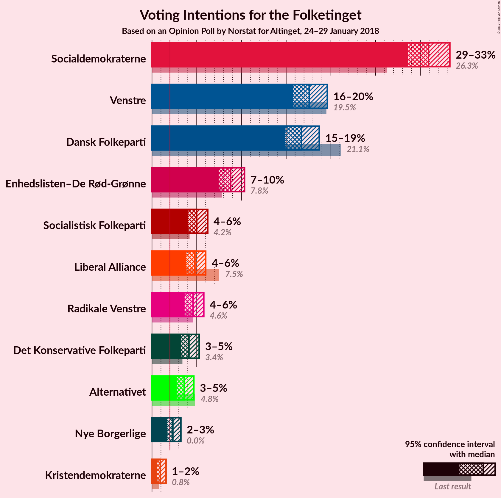

### Confidence Intervals

| Party | Last Result | Poll Result | 80% Confidence Interval | 90% Confidence Interval | 95% Confidence Interval | 99% Confidence Interval |
|:-----:|:-----------:|:-----------:|:-----------------------:|:-----------------------:|:-----------------------:|:-----------------------:|
| Socialdemokraterne | 26.3% | 30.9% | 29.4–32.5% |29.0–32.9% |28.6–33.3% |27.9–34.1% |
| Venstre | 19.5% | 17.6% | 16.4–18.9% |16.0–19.3% |15.7–19.6% |15.2–20.3% |
| Dansk Folkeparti | 21.1% | 16.7% | 15.5–18.0% |15.2–18.4% |14.9–18.7% |14.4–19.3% |
| Enhedslisten–De Rød-Grønne | 7.8% | 8.8% | 7.9–9.8% |7.7–10.1% |7.5–10.3% |7.1–10.8% |
| Socialistisk Folkeparti | 4.2% | 5.0% | 4.3–5.8% |4.2–6.0% |4.0–6.2% |3.7–6.6% |
| Liberal Alliance | 7.5% | 4.8% | 4.1–5.6% |4.0–5.8% |3.8–6.0% |3.5–6.4% |
| Radikale Venstre | 4.6% | 4.6% | 4.0–5.4% |3.8–5.6% |3.6–5.8% |3.4–6.2% |
| Det Konservative Folkeparti | 3.4% | 4.1% | 3.5–4.9% |3.4–5.1% |3.2–5.3% |3.0–5.6% |
| Alternativet | 4.8% | 3.6% | 3.0–4.3% |2.9–4.5% |2.8–4.7% |2.5–5.0% |
| Nye Borgerlige | 0.0% | 2.3% | 1.9–2.9% |1.8–3.1% |1.7–3.2% |1.5–3.5% |
| Kristendemokraterne | 0.8% | 0.9% | 0.7–1.3% |0.6–1.5% |0.5–1.6% |0.5–1.8% |

*Note:* The poll result column reflects the actual value used in the calculations. Published results may vary slightly, and in addition be rounded to fewer digits.

## Seats

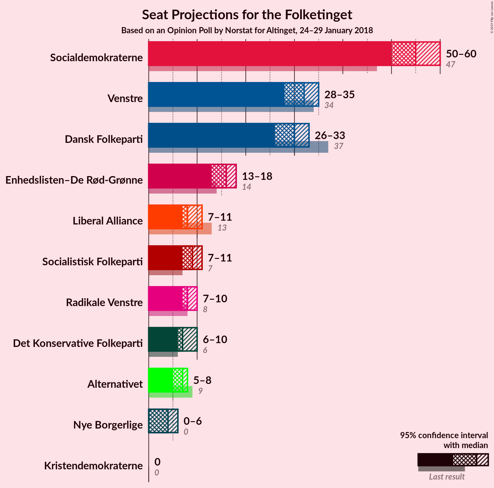

### Confidence Intervals

| Party | Last Result | Median | 80% Confidence Interval | 90% Confidence Interval | 95% Confidence Interval | 99% Confidence Interval |
|:-----:|:-----------:|:------:|:-----------------------:|:-----------------------:|:-----------------------:|:-----------------------:|
| <a href="#socialdemokraterne">Socialdemokraterne</a> | 47 | 55 | 51–58 |50–60 |50–60 |49–60 |
| <a href="#venstre">Venstre</a> | 34 | 32 | 29–34 |29–35 |28–35 |27–36 |
| <a href="#dansk-folkeparti">Dansk Folkeparti</a> | 37 | 30 | 27–31 |27–32 |26–33 |25–34 |
| <a href="#enhedslisten–de-rød-grønne">Enhedslisten–De Rød-Grønne</a> | 14 | 16 | 14–17 |13–17 |13–18 |13–19 |
| <a href="#socialistisk-folkeparti">Socialistisk Folkeparti</a> | 7 | 9 | 8–10 |8–11 |7–11 |7–12 |
| <a href="#liberal-alliance">Liberal Alliance</a> | 13 | 8 | 7–10 |7–10 |7–11 |6–12 |
| <a href="#radikale-venstre">Radikale Venstre</a> | 8 | 8 | 7–10 |7–10 |7–10 |6–11 |
| <a href="#det-konservative-folkeparti">Det Konservative Folkeparti</a> | 6 | 7 | 6–9 |6–9 |6–10 |5–10 |
| <a href="#alternativet">Alternativet</a> | 9 | 7 | 5–7 |5–8 |5–8 |4–9 |
| <a href="#nye-borgerlige">Nye Borgerlige</a> | 0 | 4 | 0–5 |0–5 |0–6 |0–6 |
| <a href="#kristendemokraterne">Kristendemokraterne</a> | 0 | 0 | 0 |0 |0 |0 |

### Socialdemokraterne

*For a full overview of the results for this party, see the [Socialdemokraterne](party-socialdemokraterne.html) page.*

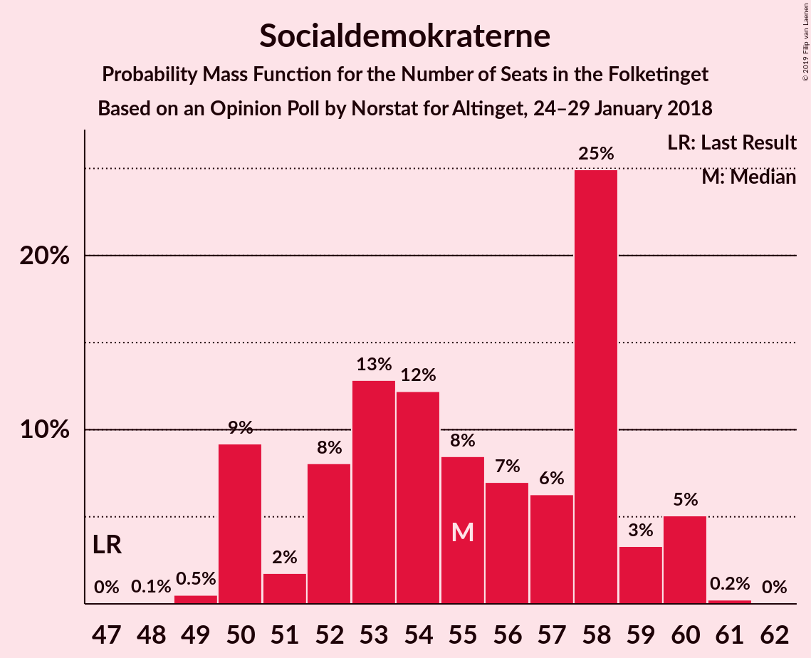

| Number of Seats | Probability | Accumulated | Special Marks |
|:---------------:|:-----------:|:-----------:|:-------------:|
| 47 | 0% | 100% | Last Result |
| 48 | 0.1% | 100% |  |
| 49 | 0.5% | 99.9% |  |
| 50 | 9% | 99.4% |  |
| 51 | 2% | 90% |  |
| 52 | 8% | 88% |  |
| 53 | 13% | 80% |  |
| 54 | 12% | 68% |  |
| 55 | 8% | 55% | Median |
| 56 | 7% | 47% |  |
| 57 | 6% | 40% |  |
| 58 | 25% | 34% |  |
| 59 | 3% | 9% |  |
| 60 | 5% | 5% |  |
| 61 | 0.2% | 0.3% |  |
| 62 | 0% | 0% |  |

### Venstre

*For a full overview of the results for this party, see the [Venstre](party-venstre.html) page.*

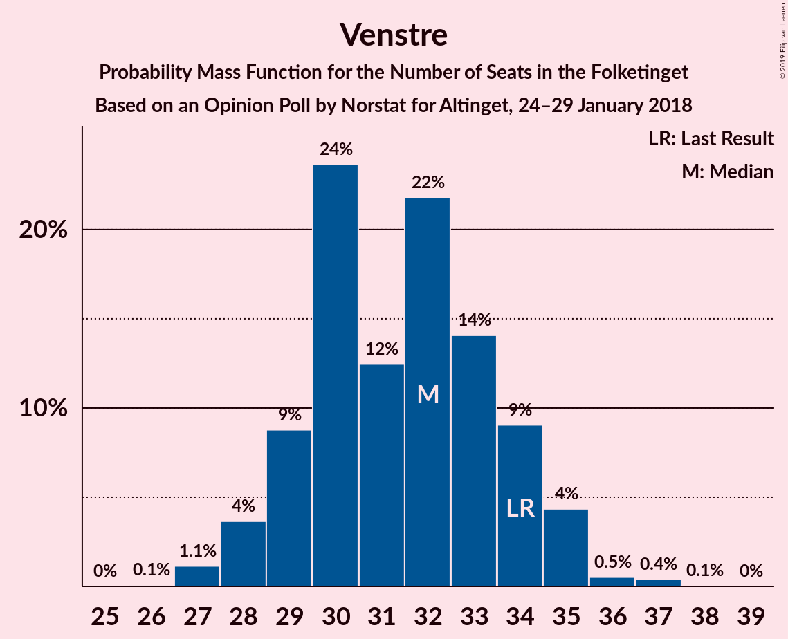

| Number of Seats | Probability | Accumulated | Special Marks |
|:---------------:|:-----------:|:-----------:|:-------------:|
| 26 | 0.1% | 100% |  |
| 27 | 1.1% | 99.9% |  |
| 28 | 4% | 98.8% |  |
| 29 | 9% | 95% |  |
| 30 | 24% | 86% |  |
| 31 | 12% | 63% |  |
| 32 | 22% | 50% | Median |
| 33 | 14% | 28% |  |
| 34 | 9% | 14% | Last Result |
| 35 | 4% | 5% |  |
| 36 | 0.5% | 1.0% |  |
| 37 | 0.4% | 0.5% |  |
| 38 | 0.1% | 0.1% |  |
| 39 | 0% | 0% |  |

### Dansk Folkeparti

*For a full overview of the results for this party, see the [Dansk Folkeparti](party-danskfolkeparti.html) page.*

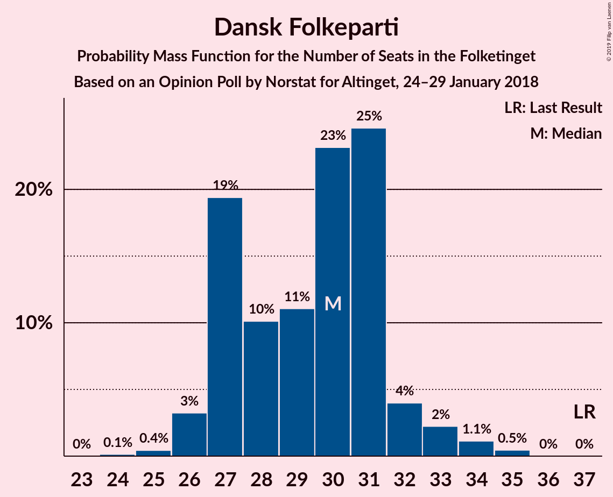

| Number of Seats | Probability | Accumulated | Special Marks |
|:---------------:|:-----------:|:-----------:|:-------------:|
| 24 | 0.1% | 100% |  |
| 25 | 0.4% | 99.9% |  |
| 26 | 3% | 99.4% |  |
| 27 | 19% | 96% |  |
| 28 | 10% | 77% |  |
| 29 | 11% | 67% |  |
| 30 | 23% | 56% | Median |
| 31 | 25% | 32% |  |
| 32 | 4% | 8% |  |
| 33 | 2% | 4% |  |
| 34 | 1.1% | 2% |  |
| 35 | 0.5% | 0.5% |  |
| 36 | 0% | 0% |  |
| 37 | 0% | 0% | Last Result |

### Enhedslisten–De Rød-Grønne

*For a full overview of the results for this party, see the [Enhedslisten–De Rød-Grønne](party-enhedslisten–derød-grønne.html) page.*

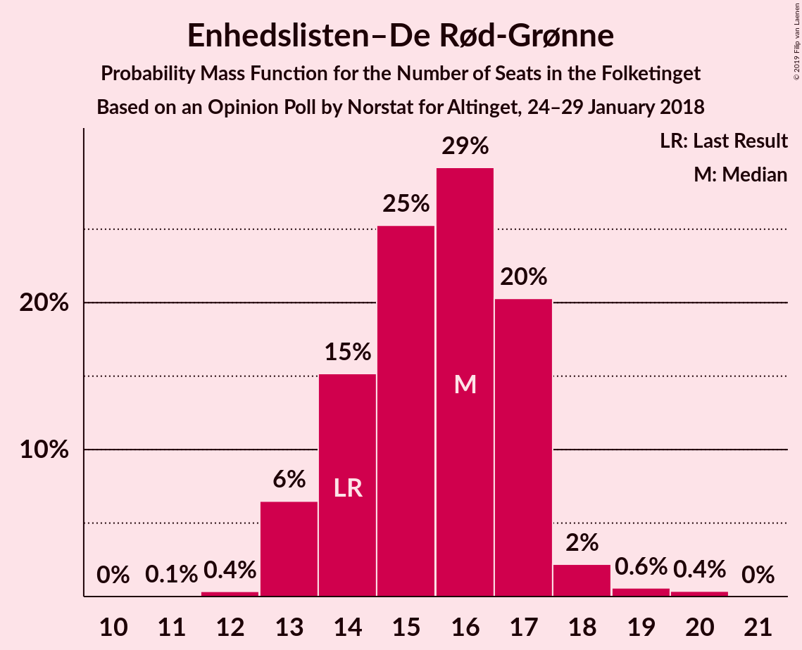

| Number of Seats | Probability | Accumulated | Special Marks |
|:---------------:|:-----------:|:-----------:|:-------------:|
| 11 | 0.1% | 100% |  |
| 12 | 0.4% | 99.9% |  |
| 13 | 6% | 99.6% |  |
| 14 | 15% | 93% | Last Result |
| 15 | 25% | 78% |  |
| 16 | 29% | 53% | Median |
| 17 | 20% | 23% |  |
| 18 | 2% | 3% |  |
| 19 | 0.6% | 1.0% |  |
| 20 | 0.4% | 0.4% |  |
| 21 | 0% | 0% |  |

### Socialistisk Folkeparti

*For a full overview of the results for this party, see the [Socialistisk Folkeparti](party-socialistiskfolkeparti.html) page.*

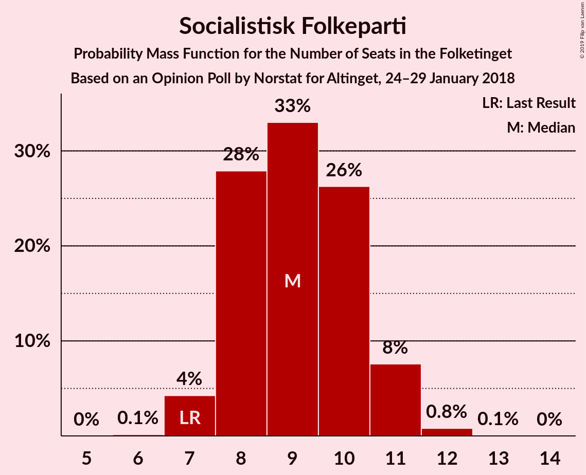

| Number of Seats | Probability | Accumulated | Special Marks |
|:---------------:|:-----------:|:-----------:|:-------------:|
| 6 | 0.1% | 100% |  |
| 7 | 4% | 99.9% | Last Result |
| 8 | 28% | 96% |  |
| 9 | 33% | 68% | Median |
| 10 | 26% | 35% |  |
| 11 | 8% | 8% |  |
| 12 | 0.8% | 0.9% |  |
| 13 | 0.1% | 0.1% |  |
| 14 | 0% | 0% |  |

### Liberal Alliance

*For a full overview of the results for this party, see the [Liberal Alliance](party-liberalalliance.html) page.*

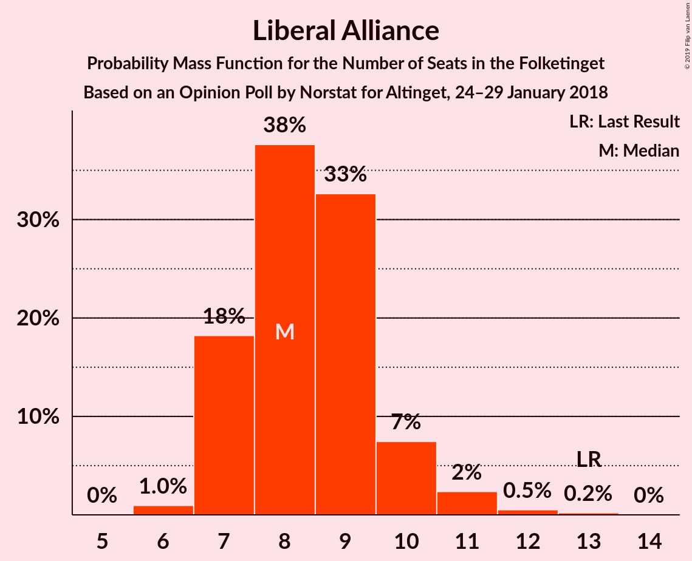

| Number of Seats | Probability | Accumulated | Special Marks |
|:---------------:|:-----------:|:-----------:|:-------------:|
| 6 | 1.0% | 100% |  |
| 7 | 18% | 99.0% |  |
| 8 | 38% | 81% | Median |
| 9 | 33% | 43% |  |
| 10 | 7% | 11% |  |
| 11 | 2% | 3% |  |
| 12 | 0.5% | 0.7% |  |
| 13 | 0.2% | 0.2% | Last Result |
| 14 | 0% | 0% |  |

### Radikale Venstre

*For a full overview of the results for this party, see the [Radikale Venstre](party-radikalevenstre.html) page.*

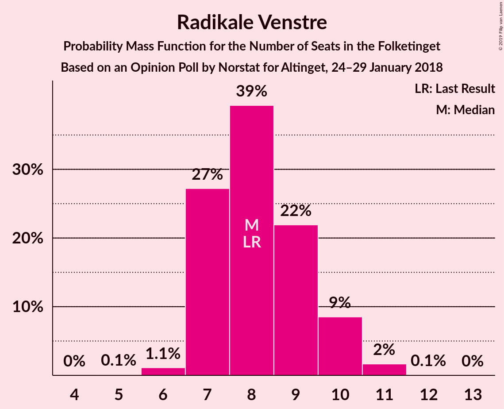

| Number of Seats | Probability | Accumulated | Special Marks |
|:---------------:|:-----------:|:-----------:|:-------------:|
| 5 | 0.1% | 100% |  |
| 6 | 1.1% | 99.9% |  |
| 7 | 27% | 98.7% |  |
| 8 | 39% | 72% | Last Result, Median |
| 9 | 22% | 32% |  |
| 10 | 9% | 10% |  |
| 11 | 2% | 2% |  |
| 12 | 0.1% | 0.1% |  |
| 13 | 0% | 0% |  |

### Det Konservative Folkeparti

*For a full overview of the results for this party, see the [Det Konservative Folkeparti](party-detkonservativefolkeparti.html) page.*

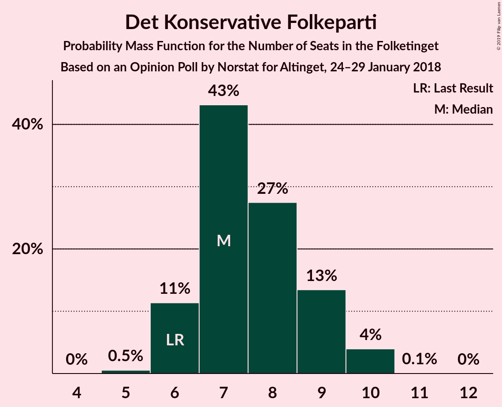

| Number of Seats | Probability | Accumulated | Special Marks |
|:---------------:|:-----------:|:-----------:|:-------------:|
| 5 | 0.5% | 100% |  |
| 6 | 11% | 99.5% | Last Result |
| 7 | 43% | 88% | Median |
| 8 | 27% | 45% |  |
| 9 | 13% | 17% |  |
| 10 | 4% | 4% |  |
| 11 | 0.1% | 0.1% |  |
| 12 | 0% | 0% |  |

### Alternativet

*For a full overview of the results for this party, see the [Alternativet](party-alternativet.html) page.*

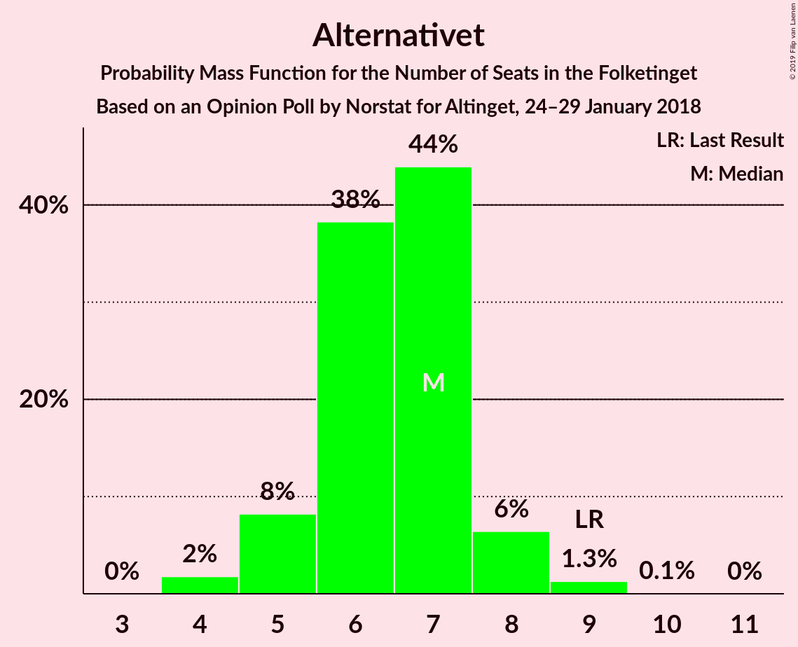

| Number of Seats | Probability | Accumulated | Special Marks |
|:---------------:|:-----------:|:-----------:|:-------------:|
| 4 | 2% | 100% |  |
| 5 | 8% | 98% |  |
| 6 | 38% | 90% |  |
| 7 | 44% | 52% | Median |
| 8 | 6% | 8% |  |
| 9 | 1.3% | 1.3% | Last Result |
| 10 | 0.1% | 0.1% |  |
| 11 | 0% | 0% |  |

### Nye Borgerlige

*For a full overview of the results for this party, see the [Nye Borgerlige](party-nyeborgerlige.html) page.*

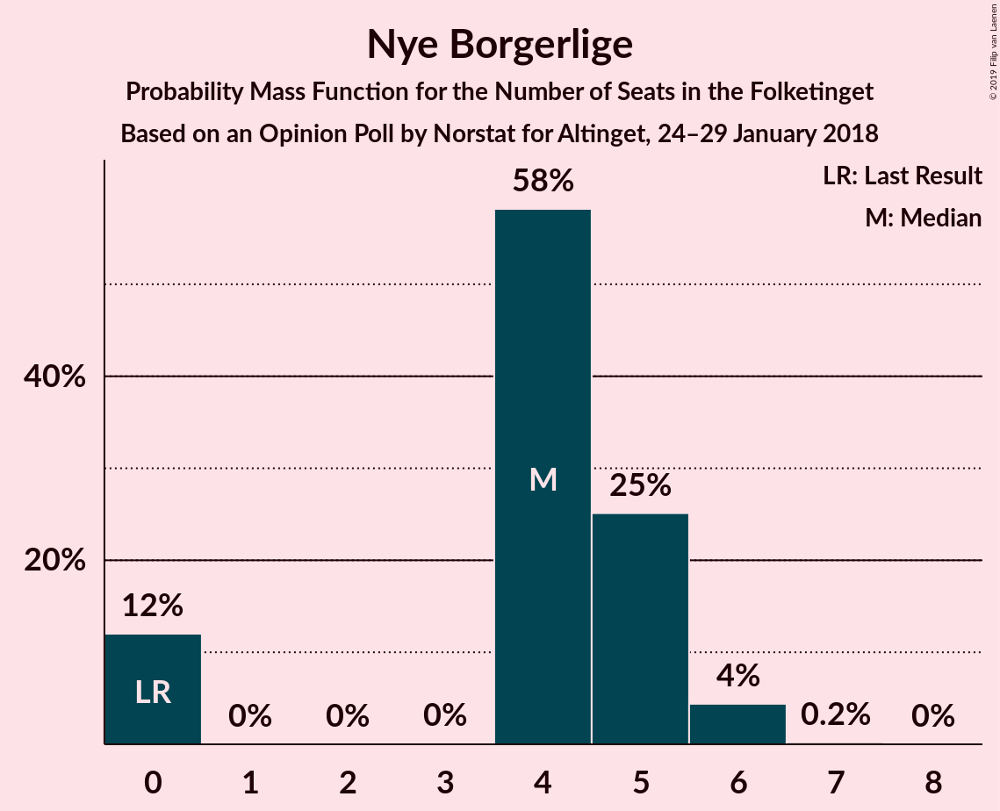

| Number of Seats | Probability | Accumulated | Special Marks |
|:---------------:|:-----------:|:-----------:|:-------------:|
| 0 | 12% | 100% | Last Result |
| 1 | 0% | 88% |  |
| 2 | 0% | 88% |  |
| 3 | 0% | 88% |  |
| 4 | 58% | 88% | Median |
| 5 | 25% | 30% |  |
| 6 | 4% | 5% |  |
| 7 | 0.2% | 0.2% |  |
| 8 | 0% | 0% |  |

### Kristendemokraterne

*For a full overview of the results for this party, see the [Kristendemokraterne](party-kristendemokraterne.html) page.*

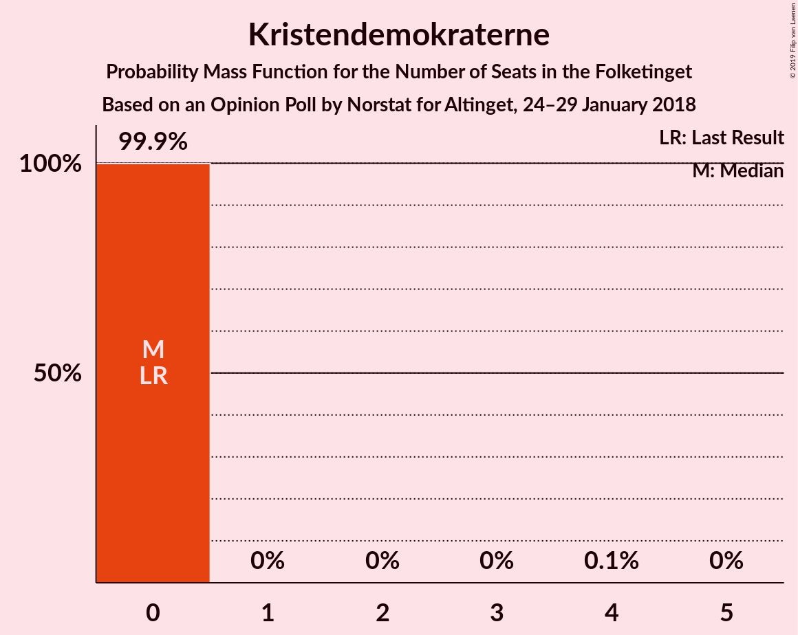

| Number of Seats | Probability | Accumulated | Special Marks |
|:---------------:|:-----------:|:-----------:|:-------------:|
| 0 | 99.9% | 100% | Last Result, Median |
| 1 | 0% | 0.1% |  |
| 2 | 0% | 0.1% |  |
| 3 | 0% | 0.1% |  |
| 4 | 0.1% | 0.1% |  |
| 5 | 0% | 0% |  |

## Coalitions

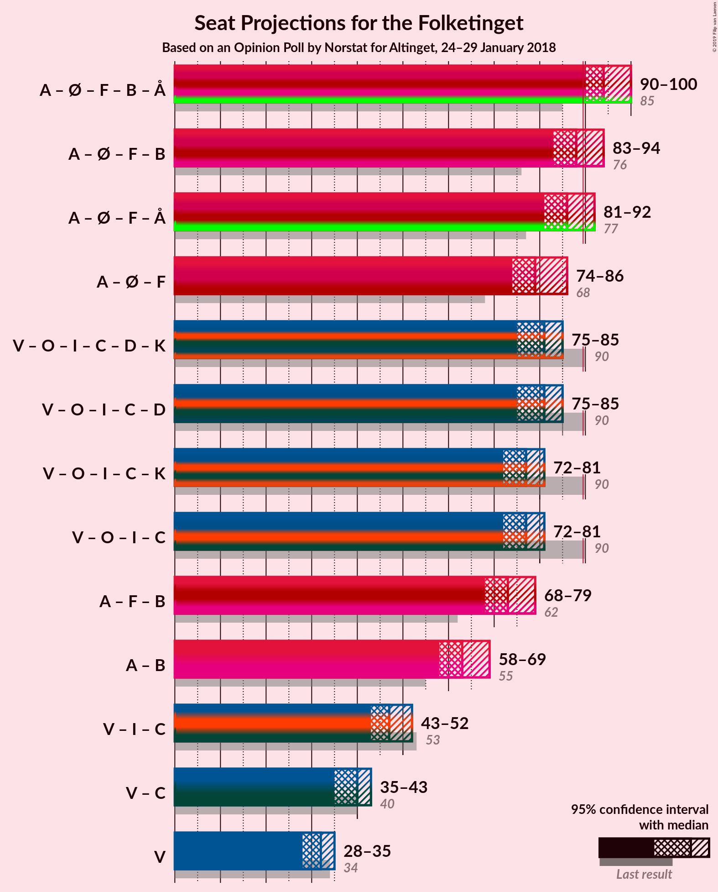

### Confidence Intervals

| Coalition | Last Result | Median | Majority? | 80% Confidence Interval | 90% Confidence Interval | 95% Confidence Interval | 99% Confidence Interval |
|:---------:|:-----------:|:------:|:---------:|:-----------------------:|:-----------------------:|:-----------------------:|:-----------------------:|
| Socialdemokraterne – Enhedslisten–De Rød-Grønne – Socialistisk Folkeparti – Radikale Venstre – Alternativet | 85 | 94 | 98% | 91–98 | 91–99 | 90–100 | 87–101 |
| Socialdemokraterne – Enhedslisten–De Rød-Grønne – Socialistisk Folkeparti – Radikale Venstre | 76 | 88 | 23% | 84–91 | 84–93 | 83–94 | 81–95 |
| Socialdemokraterne – Enhedslisten–De Rød-Grønne – Socialistisk Folkeparti – Alternativet | 77 | 86 | 9% | 83–89 | 82–91 | 81–92 | 80–92 |
| Socialdemokraterne – Enhedslisten–De Rød-Grønne – Socialistisk Folkeparti | 68 | 79 | 0% | 76–83 | 76–85 | 74–86 | 74–86 |
| Venstre – Dansk Folkeparti – Liberal Alliance – Det Konservative Folkeparti – Nye Borgerlige – Kristendemokraterne | 90 | 81 | 0% | 77–84 | 76–84 | 75–85 | 74–88 |
| Venstre – Dansk Folkeparti – Liberal Alliance – Det Konservative Folkeparti – Nye Borgerlige | 90 | 81 | 0% | 77–84 | 76–84 | 75–85 | 74–88 |
| Venstre – Dansk Folkeparti – Liberal Alliance – Det Konservative Folkeparti – Kristendemokraterne | 90 | 77 | 0% | 74–80 | 73–81 | 72–81 | 71–83 |
| Venstre – Dansk Folkeparti – Liberal Alliance – Det Konservative Folkeparti | 90 | 77 | 0% | 74–80 | 73–81 | 72–81 | 71–83 |
| Socialdemokraterne – Socialistisk Folkeparti – Radikale Venstre | 62 | 73 | 0% | 68–77 | 68–77 | 68–79 | 66–79 |
| Socialdemokraterne – Radikale Venstre | 55 | 63 | 0% | 59–67 | 58–68 | 58–69 | 57–70 |
| Venstre – Liberal Alliance – Det Konservative Folkeparti | 53 | 47 | 0% | 44–50 | 43–50 | 43–52 | 42–53 |
| Venstre – Det Konservative Folkeparti | 40 | 40 | 0% | 36–41 | 35–42 | 35–43 | 34–45 |
| Venstre | 34 | 32 | 0% | 29–34 | 29–35 | 28–35 | 27–36 |

### Socialdemokraterne – Enhedslisten–De Rød-Grønne – Socialistisk Folkeparti – Radikale Venstre – Alternativet

| Number of Seats | Probability | Accumulated | Special Marks |
|:---------------:|:-----------:|:-----------:|:-------------:|
| 85 | 0% | 100% | Last Result |
| 86 | 0.1% | 100% |  |
| 87 | 0.5% | 99.9% |  |
| 88 | 0.3% | 99.4% |  |
| 89 | 1.0% | 99.2% |  |
| 90 | 3% | 98% | Majority |
| 91 | 10% | 95% |  |
| 92 | 7% | 86% |  |
| 93 | 20% | 78% |  |
| 94 | 9% | 58% |  |
| 95 | 23% | 49% | Median |
| 96 | 5% | 27% |  |
| 97 | 8% | 22% |  |
| 98 | 6% | 13% |  |
| 99 | 2% | 7% |  |
| 100 | 2% | 4% |  |
| 101 | 2% | 2% |  |
| 102 | 0.1% | 0.1% |  |
| 103 | 0% | 0% |  |

### Socialdemokraterne – Enhedslisten–De Rød-Grønne – Socialistisk Folkeparti – Radikale Venstre

| Number of Seats | Probability | Accumulated | Special Marks |
|:---------------:|:-----------:|:-----------:|:-------------:|
| 76 | 0% | 100% | Last Result |
| 77 | 0% | 100% |  |
| 78 | 0% | 100% |  |
| 79 | 0% | 100% |  |
| 80 | 0.1% | 100% |  |
| 81 | 0.6% | 99.9% |  |
| 82 | 0.3% | 99.3% |  |
| 83 | 3% | 99.0% |  |
| 84 | 10% | 96% |  |
| 85 | 6% | 86% |  |
| 86 | 20% | 81% |  |
| 87 | 8% | 61% |  |
| 88 | 4% | 53% | Median |
| 89 | 26% | 49% |  |
| 90 | 2% | 23% | Majority |
| 91 | 11% | 20% |  |
| 92 | 3% | 10% |  |
| 93 | 4% | 7% |  |
| 94 | 1.2% | 3% |  |
| 95 | 2% | 2% |  |
| 96 | 0% | 0% |  |

### Socialdemokraterne – Enhedslisten–De Rød-Grønne – Socialistisk Folkeparti – Alternativet

| Number of Seats | Probability | Accumulated | Special Marks |
|:---------------:|:-----------:|:-----------:|:-------------:|
| 77 | 0% | 100% | Last Result |
| 78 | 0.1% | 100% |  |
| 79 | 0.2% | 99.9% |  |
| 80 | 0.6% | 99.7% |  |
| 81 | 3% | 99.1% |  |
| 82 | 2% | 96% |  |
| 83 | 13% | 94% |  |
| 84 | 4% | 81% |  |
| 85 | 7% | 77% |  |
| 86 | 23% | 69% |  |
| 87 | 21% | 46% | Median |
| 88 | 7% | 25% |  |
| 89 | 9% | 17% |  |
| 90 | 2% | 9% | Majority |
| 91 | 2% | 6% |  |
| 92 | 4% | 4% |  |
| 93 | 0.2% | 0.3% |  |
| 94 | 0.1% | 0.1% |  |
| 95 | 0% | 0% |  |

### Socialdemokraterne – Enhedslisten–De Rød-Grønne – Socialistisk Folkeparti

| Number of Seats | Probability | Accumulated | Special Marks |
|:---------------:|:-----------:|:-----------:|:-------------:|
| 68 | 0% | 100% | Last Result |
| 69 | 0% | 100% |  |
| 70 | 0% | 100% |  |
| 71 | 0% | 100% |  |
| 72 | 0.1% | 100% |  |
| 73 | 0.3% | 99.8% |  |
| 74 | 2% | 99.5% |  |
| 75 | 2% | 97% |  |
| 76 | 13% | 95% |  |
| 77 | 3% | 83% |  |
| 78 | 5% | 80% |  |
| 79 | 26% | 75% |  |
| 80 | 4% | 49% | Median |
| 81 | 21% | 44% |  |
| 82 | 13% | 23% |  |
| 83 | 2% | 10% |  |
| 84 | 2% | 8% |  |
| 85 | 1.2% | 6% |  |
| 86 | 4% | 4% |  |
| 87 | 0.1% | 0.2% |  |
| 88 | 0% | 0% |  |

### Venstre – Dansk Folkeparti – Liberal Alliance – Det Konservative Folkeparti – Nye Borgerlige – Kristendemokraterne

| Number of Seats | Probability | Accumulated | Special Marks |
|:---------------:|:-----------:|:-----------:|:-------------:|
| 73 | 0.1% | 100% |  |
| 74 | 2% | 99.9% |  |
| 75 | 2% | 98% |  |
| 76 | 2% | 96% |  |
| 77 | 6% | 93% |  |
| 78 | 8% | 87% |  |
| 79 | 5% | 78% |  |
| 80 | 23% | 73% |  |
| 81 | 9% | 51% | Median |
| 82 | 20% | 42% |  |
| 83 | 7% | 22% |  |
| 84 | 10% | 14% |  |
| 85 | 3% | 5% |  |
| 86 | 1.0% | 2% |  |
| 87 | 0.3% | 0.8% |  |
| 88 | 0.5% | 0.6% |  |
| 89 | 0.1% | 0.1% |  |
| 90 | 0% | 0% | Last Result, Majority |

### Venstre – Dansk Folkeparti – Liberal Alliance – Det Konservative Folkeparti – Nye Borgerlige

| Number of Seats | Probability | Accumulated | Special Marks |
|:---------------:|:-----------:|:-----------:|:-------------:|
| 73 | 0.1% | 100% |  |
| 74 | 2% | 99.9% |  |
| 75 | 2% | 98% |  |
| 76 | 2% | 96% |  |
| 77 | 6% | 93% |  |
| 78 | 8% | 87% |  |
| 79 | 5% | 78% |  |
| 80 | 23% | 73% |  |
| 81 | 9% | 51% | Median |
| 82 | 20% | 42% |  |
| 83 | 7% | 22% |  |
| 84 | 10% | 14% |  |
| 85 | 3% | 5% |  |
| 86 | 1.0% | 2% |  |
| 87 | 0.3% | 0.8% |  |
| 88 | 0.5% | 0.6% |  |
| 89 | 0.1% | 0.1% |  |
| 90 | 0% | 0% | Last Result, Majority |

### Venstre – Dansk Folkeparti – Liberal Alliance – Det Konservative Folkeparti – Kristendemokraterne

| Number of Seats | Probability | Accumulated | Special Marks |
|:---------------:|:-----------:|:-----------:|:-------------:|
| 70 | 0.2% | 100% |  |
| 71 | 2% | 99.7% |  |
| 72 | 1.0% | 98% |  |
| 73 | 6% | 97% |  |
| 74 | 11% | 91% |  |
| 75 | 9% | 80% |  |
| 76 | 19% | 70% |  |
| 77 | 13% | 51% | Median |
| 78 | 16% | 38% |  |
| 79 | 5% | 22% |  |
| 80 | 11% | 18% |  |
| 81 | 5% | 7% |  |
| 82 | 0.7% | 2% |  |
| 83 | 0.5% | 1.0% |  |
| 84 | 0.3% | 0.4% |  |
| 85 | 0.1% | 0.1% |  |
| 86 | 0% | 0% |  |
| 87 | 0% | 0% |  |
| 88 | 0% | 0% |  |
| 89 | 0% | 0% |  |
| 90 | 0% | 0% | Last Result, Majority |

### Venstre – Dansk Folkeparti – Liberal Alliance – Det Konservative Folkeparti

| Number of Seats | Probability | Accumulated | Special Marks |
|:---------------:|:-----------:|:-----------:|:-------------:|
| 70 | 0.3% | 100% |  |
| 71 | 2% | 99.7% |  |
| 72 | 1.0% | 98% |  |
| 73 | 6% | 97% |  |
| 74 | 11% | 91% |  |
| 75 | 9% | 80% |  |
| 76 | 19% | 70% |  |
| 77 | 13% | 51% | Median |
| 78 | 16% | 38% |  |
| 79 | 5% | 22% |  |
| 80 | 11% | 18% |  |
| 81 | 5% | 7% |  |
| 82 | 0.7% | 2% |  |
| 83 | 0.5% | 1.0% |  |
| 84 | 0.3% | 0.4% |  |
| 85 | 0.1% | 0.1% |  |
| 86 | 0% | 0% |  |
| 87 | 0% | 0% |  |
| 88 | 0% | 0% |  |
| 89 | 0% | 0% |  |
| 90 | 0% | 0% | Last Result, Majority |

### Socialdemokraterne – Socialistisk Folkeparti – Radikale Venstre

| Number of Seats | Probability | Accumulated | Special Marks |
|:---------------:|:-----------:|:-----------:|:-------------:|
| 62 | 0% | 100% | Last Result |
| 63 | 0% | 100% |  |
| 64 | 0% | 100% |  |
| 65 | 0.2% | 100% |  |
| 66 | 0.4% | 99.7% |  |
| 67 | 1.4% | 99.3% |  |
| 68 | 10% | 98% |  |
| 69 | 10% | 87% |  |
| 70 | 16% | 78% |  |
| 71 | 5% | 62% |  |
| 72 | 4% | 57% | Median |
| 73 | 9% | 54% |  |
| 74 | 23% | 44% |  |
| 75 | 4% | 22% |  |
| 76 | 6% | 18% |  |
| 77 | 8% | 12% |  |
| 78 | 2% | 4% |  |
| 79 | 3% | 3% |  |
| 80 | 0% | 0% |  |

### Socialdemokraterne – Radikale Venstre

| Number of Seats | Probability | Accumulated | Special Marks |
|:---------------:|:-----------:|:-----------:|:-------------:|
| 55 | 0.1% | 100% | Last Result |
| 56 | 0.1% | 99.9% |  |
| 57 | 0.5% | 99.8% |  |
| 58 | 7% | 99.3% |  |
| 59 | 3% | 92% |  |
| 60 | 13% | 89% |  |
| 61 | 14% | 76% |  |
| 62 | 5% | 61% |  |
| 63 | 8% | 56% | Median |
| 64 | 5% | 48% |  |
| 65 | 6% | 44% |  |
| 66 | 23% | 38% |  |
| 67 | 9% | 15% |  |
| 68 | 2% | 6% |  |
| 69 | 3% | 4% |  |
| 70 | 1.0% | 1.0% |  |
| 71 | 0% | 0% |  |

### Venstre – Liberal Alliance – Det Konservative Folkeparti

| Number of Seats | Probability | Accumulated | Special Marks |
|:---------------:|:-----------:|:-----------:|:-------------:|
| 40 | 0% | 100% |  |
| 41 | 0.1% | 99.9% |  |
| 42 | 0.7% | 99.8% |  |
| 43 | 5% | 99.1% |  |
| 44 | 10% | 94% |  |
| 45 | 5% | 84% |  |
| 46 | 10% | 79% |  |
| 47 | 25% | 69% | Median |
| 48 | 3% | 45% |  |
| 49 | 28% | 41% |  |
| 50 | 9% | 13% |  |
| 51 | 1.4% | 5% |  |
| 52 | 2% | 3% |  |
| 53 | 1.1% | 1.4% | Last Result |
| 54 | 0.3% | 0.3% |  |
| 55 | 0% | 0% |  |

### Venstre – Det Konservative Folkeparti

| Number of Seats | Probability | Accumulated | Special Marks |
|:---------------:|:-----------:|:-----------:|:-------------:|
| 33 | 0.1% | 100% |  |
| 34 | 1.1% | 99.9% |  |
| 35 | 4% | 98.7% |  |
| 36 | 13% | 94% |  |
| 37 | 10% | 82% |  |
| 38 | 6% | 72% |  |
| 39 | 13% | 66% | Median |
| 40 | 33% | 53% | Last Result |
| 41 | 13% | 19% |  |
| 42 | 2% | 6% |  |
| 43 | 2% | 4% |  |
| 44 | 0.6% | 1.4% |  |
| 45 | 0.9% | 0.9% |  |
| 46 | 0% | 0% |  |

### Venstre

| Number of Seats | Probability | Accumulated | Special Marks |
|:---------------:|:-----------:|:-----------:|:-------------:|
| 26 | 0.1% | 100% |  |
| 27 | 1.1% | 99.9% |  |
| 28 | 4% | 98.8% |  |
| 29 | 9% | 95% |  |
| 30 | 24% | 86% |  |
| 31 | 12% | 63% |  |
| 32 | 22% | 50% | Median |
| 33 | 14% | 28% |  |
| 34 | 9% | 14% | Last Result |
| 35 | 4% | 5% |  |
| 36 | 0.5% | 1.0% |  |
| 37 | 0.4% | 0.5% |  |
| 38 | 0.1% | 0.1% |  |
| 39 | 0% | 0% |  |

## Technical Information

### Opinion Poll

+ **Polling firm:** Norstat
+ **Commissioner(s):** Altinget
+ **Fieldwork period:** 24–29 January 2018

### Calculations

+ **Sample size:** 1501
+ **Simulations done:** 1,048,576
+ **Error estimate:** 2.39%

