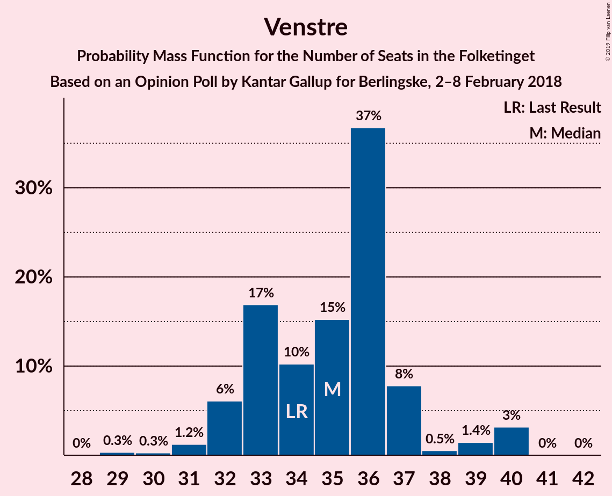
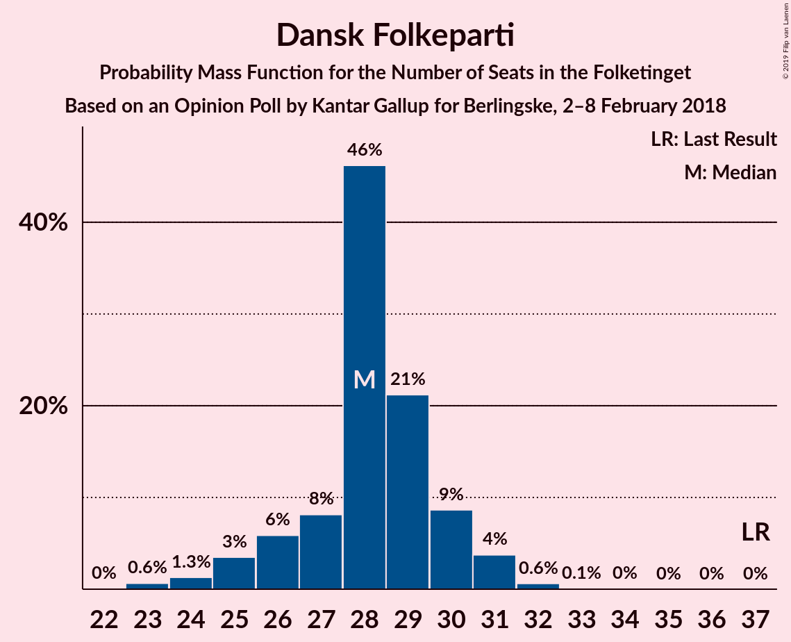
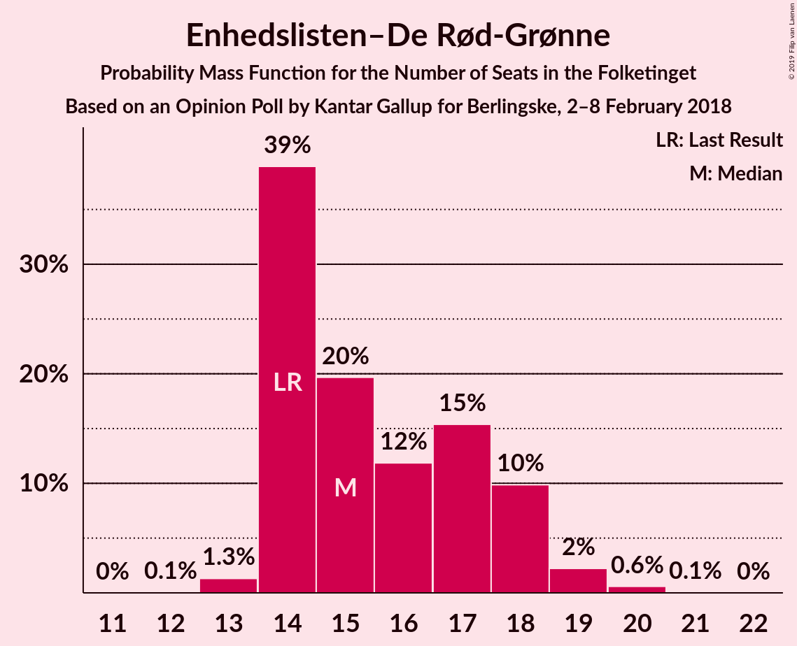
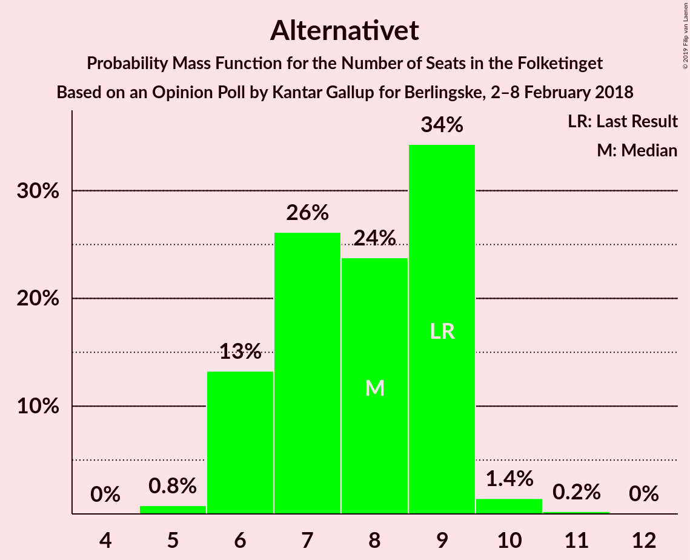

# Opinion Poll by Kantar Gallup for Berlingske, 2–8 February 2018

<a href="#voting-intentions">Voting Intentions</a> | <a href="#seats">Seats</a> | <a href="#coalitions">Coalitions</a> | <a href="#technical-information">Technical Information</a>

## Voting Intentions

### Confidence Intervals

| Party | Last Result | Poll Result | 80% Confidence Interval | 90% Confidence Interval | 95% Confidence Interval | 99% Confidence Interval |
|:-----:|:-----------:|:-----------:|:-----------------------:|:-----------------------:|:-----------------------:|:-----------------------:|
| Socialdemokraterne | 26.3% | 29.0% | 27.5–30.5% |27.1–31.0% |26.7–31.3% |26.1–32.1% |
| Venstre | 19.5% | 19.4% | 18.1–20.7% |17.8–21.1% |17.5–21.4% |16.9–22.1% |
| Dansk Folkeparti | 21.1% | 15.5% | 14.3–16.7% |14.0–17.1% |13.7–17.4% |13.2–18.0% |
| Enhedslisten–De Rød-Grønne | 7.8% | 9.1% | 8.2–10.1% |8.0–10.4% |7.7–10.7% |7.3–11.2% |
| Liberal Alliance | 7.5% | 5.2% | 4.5–6.0% |4.3–6.2% |4.2–6.4% |3.9–6.9% |
| Radikale Venstre | 4.6% | 5.2% | 4.5–6.0% |4.3–6.2% |4.2–6.4% |3.9–6.9% |
| Socialistisk Folkeparti | 4.2% | 4.9% | 4.2–5.7% |4.1–5.9% |3.9–6.1% |3.6–6.5% |
| Det Konservative Folkeparti | 3.4% | 4.8% | 4.2–5.6% |4.0–5.8% |3.8–6.0% |3.6–6.4% |
| Alternativet | 4.8% | 4.3% | 3.7–5.0% |3.5–5.2% |3.4–5.4% |3.1–5.8% |
| Nye Borgerlige | 0.0% | 1.5% | 1.2–2.0% |1.1–2.1% |1.0–2.3% |0.9–2.5% |
| Kristendemokraterne | 0.8% | 0.9% | 0.7–1.3% |0.6–1.4% |0.5–1.6% |0.4–1.8% |

*Note:* The poll result column reflects the actual value used in the calculations. Published results may vary slightly, and in addition be rounded to fewer digits.

## Seats

### Confidence Intervals

| Party | Last Result | Median | 80% Confidence Interval | 90% Confidence Interval | 95% Confidence Interval | 99% Confidence Interval |
|:-----:|:-----------:|:------:|:-----------------------:|:-----------------------:|:-----------------------:|:-----------------------:|
| <a href="#socialdemokraterne">Socialdemokraterne</a> | 47 | 52 | 49–55 |48–55 |47–55 |47–57 |
| <a href="#venstre">Venstre</a> | 34 | 35 | 33–37 |32–38 |32–40 |30–40 |
| <a href="#dansk-folkeparti">Dansk Folkeparti</a> | 37 | 28 | 26–30 |25–30 |25–31 |23–32 |
| <a href="#enhedslisten–de-rød-grønne">Enhedslisten–De Rød-Grønne</a> | 14 | 15 | 14–18 |14–18 |14–19 |13–20 |
| <a href="#liberal-alliance">Liberal Alliance</a> | 13 | 10 | 8–11 |8–11 |7–12 |6–12 |
| <a href="#radikale-venstre">Radikale Venstre</a> | 8 | 10 | 8–10 |8–11 |8–11 |7–12 |
| <a href="#socialistisk-folkeparti">Socialistisk Folkeparti</a> | 7 | 9 | 7–11 |7–11 |7–11 |6–12 |
| <a href="#det-konservative-folkeparti">Det Konservative Folkeparti</a> | 6 | 8 | 7–10 |7–10 |7–11 |6–12 |
| <a href="#alternativet">Alternativet</a> | 9 | 8 | 6–9 |6–9 |6–9 |5–10 |
| <a href="#nye-borgerlige">Nye Borgerlige</a> | 0 | 0 | 0 |0–4 |0–4 |0–4 |
| <a href="#kristendemokraterne">Kristendemokraterne</a> | 0 | 0 | 0 |0 |0 |0 |

### Socialdemokraterne

*For a full overview of the results for this party, see the [Socialdemokraterne](party-socialdemokraterne.html) page.*

| Number of Seats | Probability | Accumulated | Special Marks |
|:---------------:|:-----------:|:-----------:|:-------------:|
| 45 | 0.2% | 100% |  |
| 46 | 0.2% | 99.8% |  |
| 47 | 4% | 99.6% | Last Result |
| 48 | 4% | 95% |  |
| 49 | 6% | 92% |  |
| 50 | 14% | 86% |  |
| 51 | 10% | 72% |  |
| 52 | 35% | 62% | Median |
| 53 | 4% | 27% |  |
| 54 | 10% | 23% |  |
| 55 | 11% | 13% |  |
| 56 | 1.0% | 2% |  |
| 57 | 0.4% | 0.7% |  |
| 58 | 0.2% | 0.4% |  |
| 59 | 0.1% | 0.2% |  |
| 60 | 0.1% | 0.1% |  |
| 61 | 0% | 0% |  |

### Venstre

*For a full overview of the results for this party, see the [Venstre](party-venstre.html) page.*

| Number of Seats | Probability | Accumulated | Special Marks |
|:---------------:|:-----------:|:-----------:|:-------------:|
| 29 | 0.3% | 100% |  |
| 30 | 0.3% | 99.7% |  |
| 31 | 1.2% | 99.4% |  |
| 32 | 6% | 98% |  |
| 33 | 17% | 92% |  |
| 34 | 10% | 75% | Last Result |
| 35 | 15% | 65% | Median |
| 36 | 37% | 50% |  |
| 37 | 8% | 13% |  |
| 38 | 0.5% | 5% |  |
| 39 | 1.4% | 5% |  |
| 40 | 3% | 3% |  |
| 41 | 0% | 0.1% |  |
| 42 | 0% | 0% |  |

### Dansk Folkeparti

*For a full overview of the results for this party, see the [Dansk Folkeparti](party-danskfolkeparti.html) page.*

| Number of Seats | Probability | Accumulated | Special Marks |
|:---------------:|:-----------:|:-----------:|:-------------:|
| 22 | 0% | 100% |  |
| 23 | 0.6% | 99.9% |  |
| 24 | 1.3% | 99.3% |  |
| 25 | 3% | 98% |  |
| 26 | 6% | 95% |  |
| 27 | 8% | 89% |  |
| 28 | 46% | 81% | Median |
| 29 | 21% | 34% |  |
| 30 | 9% | 13% |  |
| 31 | 4% | 4% |  |
| 32 | 0.6% | 0.7% |  |
| 33 | 0.1% | 0.1% |  |
| 34 | 0% | 0% |  |
| 35 | 0% | 0% |  |
| 36 | 0% | 0% |  |
| 37 | 0% | 0% | Last Result |

### Enhedslisten–De Rød-Grønne

*For a full overview of the results for this party, see the [Enhedslisten–De Rød-Grønne](party-enhedslisten–derød-grønne.html) page.*

| Number of Seats | Probability | Accumulated | Special Marks |
|:---------------:|:-----------:|:-----------:|:-------------:|
| 12 | 0.1% | 100% |  |
| 13 | 1.3% | 99.9% |  |
| 14 | 39% | 98.6% | Last Result |
| 15 | 20% | 60% | Median |
| 16 | 12% | 40% |  |
| 17 | 15% | 28% |  |
| 18 | 10% | 13% |  |
| 19 | 2% | 3% |  |
| 20 | 0.6% | 0.7% |  |
| 21 | 0.1% | 0.1% |  |
| 22 | 0% | 0% |  |

### Liberal Alliance

*For a full overview of the results for this party, see the [Liberal Alliance](party-liberalalliance.html) page.*

| Number of Seats | Probability | Accumulated | Special Marks |
|:---------------:|:-----------:|:-----------:|:-------------:|
| 6 | 0.7% | 100% |  |
| 7 | 4% | 99.3% |  |
| 8 | 7% | 96% |  |
| 9 | 20% | 89% |  |
| 10 | 46% | 69% | Median |
| 11 | 19% | 23% |  |
| 12 | 3% | 3% |  |
| 13 | 0.3% | 0.3% | Last Result |
| 14 | 0% | 0% |  |

### Radikale Venstre

*For a full overview of the results for this party, see the [Radikale Venstre](party-radikalevenstre.html) page.*

| Number of Seats | Probability | Accumulated | Special Marks |
|:---------------:|:-----------:|:-----------:|:-------------:|
| 6 | 0.1% | 100% |  |
| 7 | 2% | 99.9% |  |
| 8 | 14% | 98% | Last Result |
| 9 | 29% | 84% |  |
| 10 | 49% | 55% | Median |
| 11 | 4% | 6% |  |
| 12 | 2% | 2% |  |
| 13 | 0.1% | 0.1% |  |
| 14 | 0% | 0% |  |

### Socialistisk Folkeparti

*For a full overview of the results for this party, see the [Socialistisk Folkeparti](party-socialistiskfolkeparti.html) page.*

| Number of Seats | Probability | Accumulated | Special Marks |
|:---------------:|:-----------:|:-----------:|:-------------:|
| 6 | 1.0% | 100% |  |
| 7 | 9% | 99.0% | Last Result |
| 8 | 39% | 90% |  |
| 9 | 20% | 51% | Median |
| 10 | 9% | 31% |  |
| 11 | 20% | 22% |  |
| 12 | 2% | 2% |  |
| 13 | 0.1% | 0.1% |  |
| 14 | 0% | 0% |  |

### Det Konservative Folkeparti

*For a full overview of the results for this party, see the [Det Konservative Folkeparti](party-detkonservativefolkeparti.html) page.*

| Number of Seats | Probability | Accumulated | Special Marks |
|:---------------:|:-----------:|:-----------:|:-------------:|
| 5 | 0.1% | 100% |  |
| 6 | 0.5% | 99.9% | Last Result |
| 7 | 16% | 99.4% |  |
| 8 | 45% | 83% | Median |
| 9 | 26% | 39% |  |
| 10 | 10% | 13% |  |
| 11 | 2% | 3% |  |
| 12 | 1.2% | 1.2% |  |
| 13 | 0% | 0% |  |

### Alternativet

*For a full overview of the results for this party, see the [Alternativet](party-alternativet.html) page.*

| Number of Seats | Probability | Accumulated | Special Marks |
|:---------------:|:-----------:|:-----------:|:-------------:|
| 5 | 0.8% | 100% |  |
| 6 | 13% | 99.2% |  |
| 7 | 26% | 86% |  |
| 8 | 24% | 60% | Median |
| 9 | 34% | 36% | Last Result |
| 10 | 1.4% | 2% |  |
| 11 | 0.2% | 0.3% |  |
| 12 | 0% | 0% |  |

### Nye Borgerlige

*For a full overview of the results for this party, see the [Nye Borgerlige](party-nyeborgerlige.html) page.*

| Number of Seats | Probability | Accumulated | Special Marks |
|:---------------:|:-----------:|:-----------:|:-------------:|
| 0 | 93% | 100% | Last Result, Median |
| 1 | 0% | 7% |  |
| 2 | 0% | 7% |  |
| 3 | 0.1% | 7% |  |
| 4 | 6% | 6% |  |
| 5 | 0.3% | 0.3% |  |
| 6 | 0% | 0% |  |

### Kristendemokraterne

*For a full overview of the results for this party, see the [Kristendemokraterne](party-kristendemokraterne.html) page.*

| Number of Seats | Probability | Accumulated | Special Marks |
|:---------------:|:-----------:|:-----------:|:-------------:|
| 0 | 99.9% | 100% | Last Result, Median |
| 1 | 0% | 0.1% |  |
| 2 | 0% | 0.1% |  |
| 3 | 0% | 0.1% |  |
| 4 | 0.1% | 0.1% |  |
| 5 | 0% | 0% |  |

## Coalitions

### Confidence Intervals

| Coalition | Last Result | Median | Majority? | 80% Confidence Interval | 90% Confidence Interval | 95% Confidence Interval | 99% Confidence Interval |
|:---------:|:-----------:|:------:|:---------:|:-----------------------:|:-----------------------:|:-----------------------:|:-----------------------:|
| Socialdemokraterne – Enhedslisten–De Rød-Grønne – Radikale Venstre – Socialistisk Folkeparti – Alternativet | 85 | 93 | 96% | 91–96 | 90–98 | 89–98 | 87–99 |
| Socialdemokraterne – Enhedslisten–De Rød-Grønne – Radikale Venstre – Socialistisk Folkeparti | 76 | 85 | 7% | 83–89 | 82–91 | 81–91 | 79–92 |
| Socialdemokraterne – Enhedslisten–De Rød-Grønne – Socialistisk Folkeparti – Alternativet | 77 | 83 | 0.9% | 81–88 | 81–88 | 80–88 | 78–90 |
| Venstre – Dansk Folkeparti – Liberal Alliance – Det Konservative Folkeparti – Nye Borgerlige – Kristendemokraterne | 90 | 82 | 0% | 79–84 | 77–85 | 77–86 | 76–88 |
| Venstre – Dansk Folkeparti – Liberal Alliance – Det Konservative Folkeparti – Kristendemokraterne | 90 | 82 | 0% | 79–83 | 77–84 | 77–86 | 75–86 |
| Venstre – Dansk Folkeparti – Liberal Alliance – Det Konservative Folkeparti – Nye Borgerlige | 90 | 82 | 0% | 79–84 | 77–85 | 77–86 | 76–88 |
| Venstre – Dansk Folkeparti – Liberal Alliance – Det Konservative Folkeparti | 90 | 82 | 0% | 79–83 | 77–84 | 77–86 | 75–86 |
| Socialdemokraterne – Enhedslisten–De Rød-Grønne – Socialistisk Folkeparti | 68 | 76 | 0% | 73–80 | 73–81 | 72–81 | 70–82 |
| Socialdemokraterne – Radikale Venstre – Socialistisk Folkeparti | 62 | 70 | 0% | 67–74 | 66–74 | 66–74 | 64–76 |
| Socialdemokraterne – Radikale Venstre | 55 | 62 | 0% | 58–63 | 57–65 | 57–65 | 55–67 |
| Venstre – Liberal Alliance – Det Konservative Folkeparti | 53 | 54 | 0% | 50–55 | 50–57 | 50–58 | 47–58 |
| Venstre – Det Konservative Folkeparti | 40 | 44 | 0% | 41–45 | 40–47 | 40–49 | 38–49 |
| Venstre | 34 | 35 | 0% | 33–37 | 32–38 | 32–40 | 30–40 |

### Socialdemokraterne – Enhedslisten–De Rød-Grønne – Radikale Venstre – Socialistisk Folkeparti – Alternativet

| Number of Seats | Probability | Accumulated | Special Marks |
|:---------------:|:-----------:|:-----------:|:-------------:|
| 85 | 0% | 100% | Last Result |
| 86 | 0% | 100% |  |
| 87 | 0.6% | 99.9% |  |
| 88 | 0.3% | 99.3% |  |
| 89 | 3% | 99.1% |  |
| 90 | 1.3% | 96% | Majority |
| 91 | 6% | 94% |  |
| 92 | 25% | 89% |  |
| 93 | 33% | 64% |  |
| 94 | 4% | 31% | Median |
| 95 | 4% | 26% |  |
| 96 | 14% | 22% |  |
| 97 | 1.2% | 8% |  |
| 98 | 6% | 7% |  |
| 99 | 0.5% | 1.0% |  |
| 100 | 0.3% | 0.5% |  |
| 101 | 0.2% | 0.2% |  |
| 102 | 0% | 0% |  |

### Socialdemokraterne – Enhedslisten–De Rød-Grønne – Radikale Venstre – Socialistisk Folkeparti

| Number of Seats | Probability | Accumulated | Special Marks |
|:---------------:|:-----------:|:-----------:|:-------------:|
| 76 | 0% | 100% | Last Result |
| 77 | 0% | 100% |  |
| 78 | 0.1% | 100% |  |
| 79 | 0.5% | 99.9% |  |
| 80 | 0.2% | 99.4% |  |
| 81 | 3% | 99.2% |  |
| 82 | 2% | 97% |  |
| 83 | 5% | 94% |  |
| 84 | 31% | 89% |  |
| 85 | 17% | 58% |  |
| 86 | 13% | 41% | Median |
| 87 | 6% | 28% |  |
| 88 | 10% | 22% |  |
| 89 | 5% | 12% |  |
| 90 | 2% | 7% | Majority |
| 91 | 5% | 5% |  |
| 92 | 0.3% | 0.6% |  |
| 93 | 0.2% | 0.3% |  |
| 94 | 0.1% | 0.1% |  |
| 95 | 0% | 0% |  |

### Socialdemokraterne – Enhedslisten–De Rød-Grønne – Socialistisk Folkeparti – Alternativet

| Number of Seats | Probability | Accumulated | Special Marks |
|:---------------:|:-----------:|:-----------:|:-------------:|
| 77 | 0% | 100% | Last Result |
| 78 | 0.6% | 99.9% |  |
| 79 | 0.3% | 99.3% |  |
| 80 | 3% | 99.0% |  |
| 81 | 7% | 96% |  |
| 82 | 8% | 89% |  |
| 83 | 48% | 81% |  |
| 84 | 5% | 33% | Median |
| 85 | 4% | 29% |  |
| 86 | 3% | 24% |  |
| 87 | 5% | 21% |  |
| 88 | 15% | 16% |  |
| 89 | 0.6% | 2% |  |
| 90 | 0.6% | 0.9% | Majority |
| 91 | 0.2% | 0.3% |  |
| 92 | 0.1% | 0.1% |  |
| 93 | 0% | 0% |  |

### Venstre – Dansk Folkeparti – Liberal Alliance – Det Konservative Folkeparti – Nye Borgerlige – Kristendemokraterne

| Number of Seats | Probability | Accumulated | Special Marks |
|:---------------:|:-----------:|:-----------:|:-------------:|
| 74 | 0.2% | 100% |  |
| 75 | 0.3% | 99.8% |  |
| 76 | 0.5% | 99.5% |  |
| 77 | 6% | 99.0% |  |
| 78 | 1.2% | 93% |  |
| 79 | 14% | 92% |  |
| 80 | 4% | 78% |  |
| 81 | 4% | 74% | Median |
| 82 | 33% | 69% |  |
| 83 | 25% | 36% |  |
| 84 | 6% | 11% |  |
| 85 | 1.3% | 6% |  |
| 86 | 3% | 4% |  |
| 87 | 0.3% | 0.9% |  |
| 88 | 0.6% | 0.7% |  |
| 89 | 0% | 0.1% |  |
| 90 | 0% | 0% | Last Result, Majority |

### Venstre – Dansk Folkeparti – Liberal Alliance – Det Konservative Folkeparti – Kristendemokraterne

| Number of Seats | Probability | Accumulated | Special Marks |
|:---------------:|:-----------:|:-----------:|:-------------:|
| 73 | 0.1% | 100% |  |
| 74 | 0.3% | 99.9% |  |
| 75 | 0.6% | 99.6% |  |
| 76 | 1.0% | 99.0% |  |
| 77 | 6% | 98% |  |
| 78 | 1.4% | 92% |  |
| 79 | 14% | 90% |  |
| 80 | 6% | 76% |  |
| 81 | 4% | 70% | Median |
| 82 | 33% | 66% |  |
| 83 | 24% | 32% |  |
| 84 | 4% | 8% |  |
| 85 | 0.9% | 4% |  |
| 86 | 3% | 3% |  |
| 87 | 0.1% | 0.3% |  |
| 88 | 0.1% | 0.2% |  |
| 89 | 0% | 0% |  |
| 90 | 0% | 0% | Last Result, Majority |

### Venstre – Dansk Folkeparti – Liberal Alliance – Det Konservative Folkeparti – Nye Borgerlige

| Number of Seats | Probability | Accumulated | Special Marks |
|:---------------:|:-----------:|:-----------:|:-------------:|
| 74 | 0.2% | 100% |  |
| 75 | 0.3% | 99.8% |  |
| 76 | 0.5% | 99.5% |  |
| 77 | 6% | 99.0% |  |
| 78 | 1.3% | 93% |  |
| 79 | 14% | 92% |  |
| 80 | 4% | 78% |  |
| 81 | 4% | 74% | Median |
| 82 | 33% | 69% |  |
| 83 | 25% | 36% |  |
| 84 | 6% | 11% |  |
| 85 | 1.2% | 5% |  |
| 86 | 3% | 4% |  |
| 87 | 0.3% | 0.9% |  |
| 88 | 0.6% | 0.7% |  |
| 89 | 0% | 0.1% |  |
| 90 | 0% | 0% | Last Result, Majority |

### Venstre – Dansk Folkeparti – Liberal Alliance – Det Konservative Folkeparti

| Number of Seats | Probability | Accumulated | Special Marks |
|:---------------:|:-----------:|:-----------:|:-------------:|
| 73 | 0.1% | 100% |  |
| 74 | 0.3% | 99.9% |  |
| 75 | 0.6% | 99.6% |  |
| 76 | 1.1% | 99.0% |  |
| 77 | 6% | 98% |  |
| 78 | 1.4% | 91% |  |
| 79 | 14% | 90% |  |
| 80 | 6% | 76% |  |
| 81 | 5% | 70% | Median |
| 82 | 33% | 65% |  |
| 83 | 24% | 32% |  |
| 84 | 4% | 8% |  |
| 85 | 0.8% | 4% |  |
| 86 | 3% | 3% |  |
| 87 | 0.1% | 0.3% |  |
| 88 | 0.1% | 0.2% |  |
| 89 | 0% | 0% |  |
| 90 | 0% | 0% | Last Result, Majority |

### Socialdemokraterne – Enhedslisten–De Rød-Grønne – Socialistisk Folkeparti

| Number of Seats | Probability | Accumulated | Special Marks |
|:---------------:|:-----------:|:-----------:|:-------------:|
| 68 | 0% | 100% | Last Result |
| 69 | 0% | 100% |  |
| 70 | 0.8% | 100% |  |
| 71 | 0.3% | 99.2% |  |
| 72 | 3% | 98.9% |  |
| 73 | 6% | 96% |  |
| 74 | 30% | 90% |  |
| 75 | 5% | 60% |  |
| 76 | 19% | 55% | Median |
| 77 | 11% | 36% |  |
| 78 | 7% | 26% |  |
| 79 | 3% | 19% |  |
| 80 | 8% | 17% |  |
| 81 | 8% | 9% |  |
| 82 | 0.6% | 1.1% |  |
| 83 | 0.2% | 0.5% |  |
| 84 | 0.2% | 0.3% |  |
| 85 | 0.1% | 0.1% |  |
| 86 | 0% | 0% |  |

### Socialdemokraterne – Radikale Venstre – Socialistisk Folkeparti

| Number of Seats | Probability | Accumulated | Special Marks |
|:---------------:|:-----------:|:-----------:|:-------------:|
| 62 | 0% | 100% | Last Result |
| 63 | 0.2% | 100% |  |
| 64 | 0.6% | 99.8% |  |
| 65 | 0.5% | 99.3% |  |
| 66 | 5% | 98.7% |  |
| 67 | 6% | 93% |  |
| 68 | 7% | 87% |  |
| 69 | 4% | 81% |  |
| 70 | 49% | 76% |  |
| 71 | 11% | 27% | Median |
| 72 | 2% | 17% |  |
| 73 | 1.5% | 15% |  |
| 74 | 12% | 14% |  |
| 75 | 0.9% | 1.5% |  |
| 76 | 0.2% | 0.5% |  |
| 77 | 0.3% | 0.4% |  |
| 78 | 0% | 0.1% |  |
| 79 | 0% | 0% |  |

### Socialdemokraterne – Radikale Venstre

| Number of Seats | Probability | Accumulated | Special Marks |
|:---------------:|:-----------:|:-----------:|:-------------:|
| 54 | 0% | 100% |  |
| 55 | 1.1% | 99.9% | Last Result |
| 56 | 0.9% | 98.9% |  |
| 57 | 5% | 98% |  |
| 58 | 3% | 93% |  |
| 59 | 16% | 90% |  |
| 60 | 4% | 74% |  |
| 61 | 14% | 69% |  |
| 62 | 34% | 55% | Median |
| 63 | 13% | 22% |  |
| 64 | 1.4% | 8% |  |
| 65 | 5% | 7% |  |
| 66 | 0.6% | 2% |  |
| 67 | 0.8% | 0.9% |  |
| 68 | 0.1% | 0.1% |  |
| 69 | 0.1% | 0.1% |  |
| 70 | 0% | 0% |  |

### Venstre – Liberal Alliance – Det Konservative Folkeparti

| Number of Seats | Probability | Accumulated | Special Marks |
|:---------------:|:-----------:|:-----------:|:-------------:|
| 46 | 0.4% | 100% |  |
| 47 | 0.2% | 99.5% |  |
| 48 | 0.4% | 99.3% |  |
| 49 | 0.7% | 99.0% |  |
| 50 | 19% | 98% |  |
| 51 | 4% | 79% |  |
| 52 | 6% | 75% |  |
| 53 | 12% | 69% | Last Result, Median |
| 54 | 29% | 57% |  |
| 55 | 18% | 28% |  |
| 56 | 3% | 10% |  |
| 57 | 3% | 6% |  |
| 58 | 3% | 3% |  |
| 59 | 0.1% | 0.1% |  |
| 60 | 0% | 0% |  |

### Venstre – Det Konservative Folkeparti

| Number of Seats | Probability | Accumulated | Special Marks |
|:---------------:|:-----------:|:-----------:|:-------------:|
| 37 | 0.3% | 100% |  |
| 38 | 0.2% | 99.7% |  |
| 39 | 1.1% | 99.5% |  |
| 40 | 5% | 98% | Last Result |
| 41 | 12% | 93% |  |
| 42 | 6% | 81% |  |
| 43 | 14% | 75% | Median |
| 44 | 46% | 60% |  |
| 45 | 5% | 14% |  |
| 46 | 3% | 10% |  |
| 47 | 2% | 6% |  |
| 48 | 2% | 4% |  |
| 49 | 3% | 3% |  |
| 50 | 0.1% | 0.1% |  |
| 51 | 0% | 0% |  |

### Venstre

| Number of Seats | Probability | Accumulated | Special Marks |
|:---------------:|:-----------:|:-----------:|:-------------:|
| 29 | 0.3% | 100% |  |
| 30 | 0.3% | 99.7% |  |
| 31 | 1.2% | 99.4% |  |
| 32 | 6% | 98% |  |
| 33 | 17% | 92% |  |
| 34 | 10% | 75% | Last Result |
| 35 | 15% | 65% | Median |
| 36 | 37% | 50% |  |
| 37 | 8% | 13% |  |
| 38 | 0.5% | 5% |  |
| 39 | 1.4% | 5% |  |
| 40 | 3% | 3% |  |
| 41 | 0% | 0.1% |  |
| 42 | 0% | 0% |  |

## Technical Information

### Opinion Poll

+ **Polling firm:** Kantar Gallup
+ **Commissioner(s):** Berlingske
+ **Fieldwork period:** 2–8 February 2018

### Calculations

+ **Sample size:** 1518
+ **Simulations done:** 1,048,576
+ **Error estimate:** 2.06%

