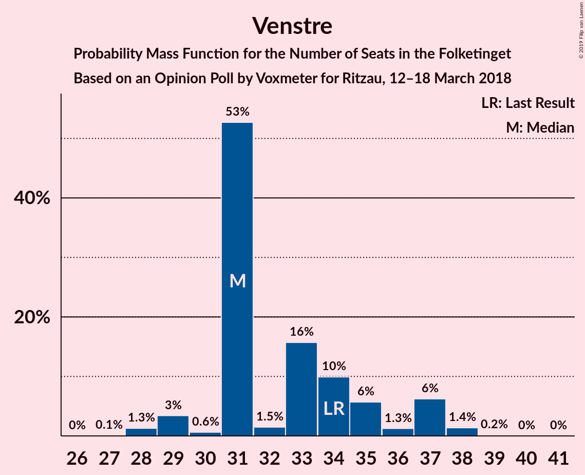
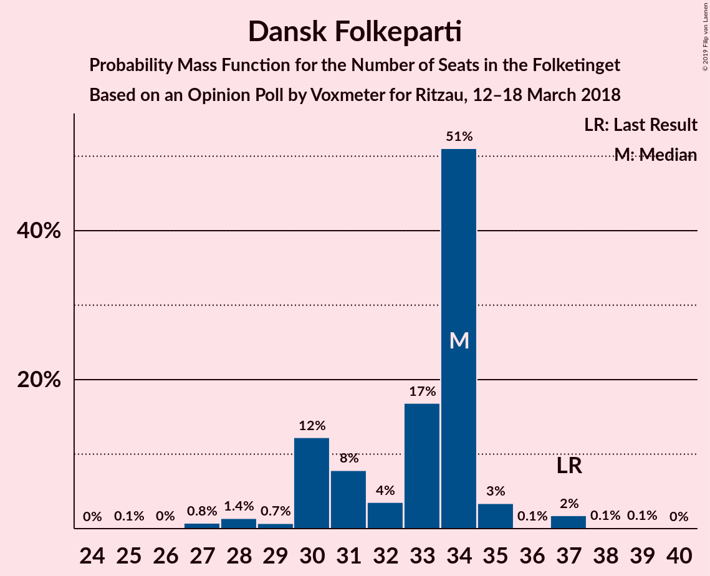
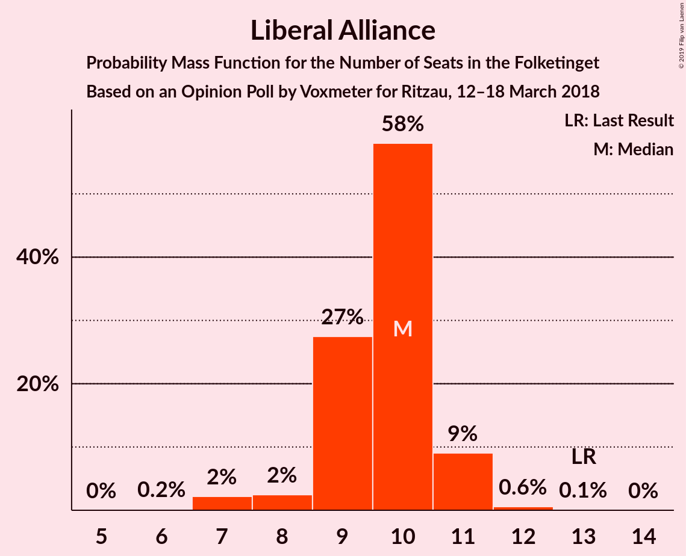
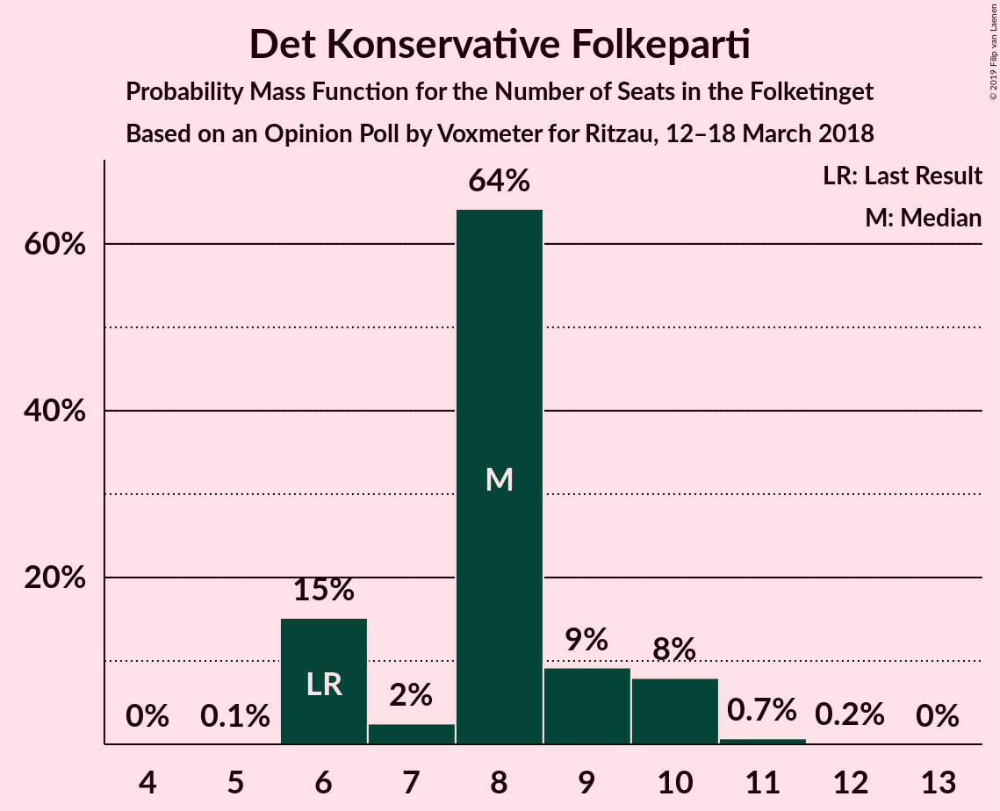
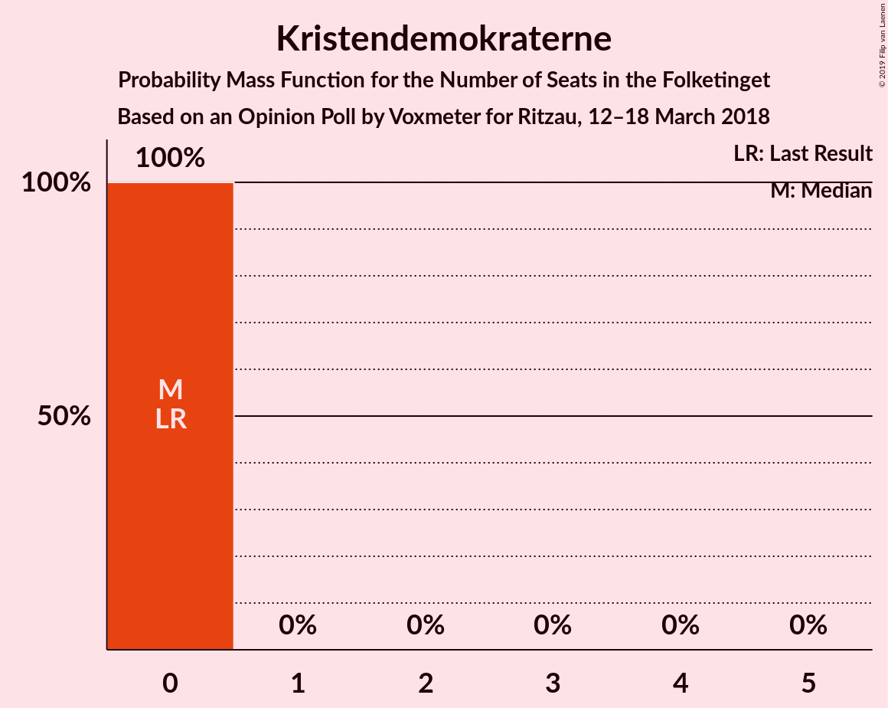

# Opinion Poll by Voxmeter for Ritzau, 12–18 March 2018

<a href="#voting-intentions">Voting Intentions</a> | <a href="#seats">Seats</a> | <a href="#coalitions">Coalitions</a> | <a href="#technical-information">Technical Information</a>

## Voting Intentions

### Confidence Intervals

| Party | Last Result | Poll Result | 80% Confidence Interval | 90% Confidence Interval | 95% Confidence Interval | 99% Confidence Interval |
|:-----:|:-----------:|:-----------:|:-----------------------:|:-----------------------:|:-----------------------:|:-----------------------:|
| Socialdemokraterne | 26.3% | 28.0% | 26.3–29.9% |25.8–30.4% |25.4–30.8% |24.6–31.7% |
| Venstre | 19.5% | 18.9% | 17.4–20.5% |17.0–21.0% |16.7–21.4% |16.0–22.2% |
| Dansk Folkeparti | 21.1% | 18.0% | 16.5–19.6% |16.1–20.0% |15.8–20.4% |15.1–21.2% |
| Enhedslisten–De Rød-Grønne | 7.8% | 9.7% | 8.6–11.0% |8.3–11.3% |8.0–11.6% |7.6–12.3% |
| Liberal Alliance | 7.5% | 5.1% | 4.3–6.1% |4.1–6.3% |3.9–6.6% |3.6–7.1% |
| Socialistisk Folkeparti | 4.2% | 5.0% | 4.2–6.0% |4.0–6.2% |3.8–6.5% |3.5–7.0% |
| Det Konservative Folkeparti | 3.4% | 4.7% | 4.0–5.7% |3.7–5.9% |3.6–6.2% |3.3–6.6% |
| Radikale Venstre | 4.6% | 4.4% | 3.7–5.3% |3.5–5.6% |3.3–5.8% |3.0–6.3% |
| Alternativet | 4.8% | 4.1% | 3.4–5.0% |3.3–5.3% |3.1–5.5% |2.8–6.0% |
| Nye Borgerlige | 0.0% | 1.4% | 1.0–2.0% |0.9–2.2% |0.9–2.3% |0.7–2.6% |
| Kristendemokraterne | 0.8% | 0.7% | 0.4–1.1% |0.4–1.2% |0.3–1.4% |0.2–1.6% |

*Note:* The poll result column reflects the actual value used in the calculations. Published results may vary slightly, and in addition be rounded to fewer digits.

## Seats

### Confidence Intervals

| Party | Last Result | Median | 80% Confidence Interval | 90% Confidence Interval | 95% Confidence Interval | 99% Confidence Interval |
|:-----:|:-----------:|:------:|:-----------------------:|:-----------------------:|:-----------------------:|:-----------------------:|
| <a href="#socialdemokraterne">Socialdemokraterne</a> | 47 | 49 | 47–50 |46–53 |46–53 |44–55 |
| <a href="#venstre">Venstre</a> | 34 | 31 | 31–35 |30–37 |29–37 |28–38 |
| <a href="#dansk-folkeparti">Dansk Folkeparti</a> | 37 | 34 | 30–34 |30–35 |29–35 |27–37 |
| <a href="#enhedslisten–de-rød-grønne">Enhedslisten–De Rød-Grønne</a> | 14 | 16 | 16–18 |16–19 |15–20 |13–21 |
| <a href="#liberal-alliance">Liberal Alliance</a> | 13 | 10 | 9–10 |9–11 |8–11 |7–12 |
| <a href="#socialistisk-folkeparti">Socialistisk Folkeparti</a> | 7 | 10 | 9–10 |8–10 |8–11 |7–11 |
| <a href="#det-konservative-folkeparti">Det Konservative Folkeparti</a> | 6 | 8 | 6–9 |6–10 |6–10 |6–11 |
| <a href="#radikale-venstre">Radikale Venstre</a> | 8 | 8 | 7–9 |6–9 |6–11 |6–11 |
| <a href="#alternativet">Alternativet</a> | 9 | 9 | 7–9 |7–9 |6–9 |5–10 |
| <a href="#nye-borgerlige">Nye Borgerlige</a> | 0 | 0 | 0 |0 |0 |0–4 |
| <a href="#kristendemokraterne">Kristendemokraterne</a> | 0 | 0 | 0 |0 |0 |0 |

### Socialdemokraterne

*For a full overview of the results for this party, see the [Socialdemokraterne](party-socialdemokraterne.html) page.*

| Number of Seats | Probability | Accumulated | Special Marks |
|:---------------:|:-----------:|:-----------:|:-------------:|
| 42 | 0% | 100% |  |
| 43 | 0.4% | 99.9% |  |
| 44 | 0.2% | 99.5% |  |
| 45 | 0.2% | 99.3% |  |
| 46 | 6% | 99.1% |  |
| 47 | 5% | 94% | Last Result |
| 48 | 3% | 89% |  |
| 49 | 59% | 86% | Median |
| 50 | 18% | 27% |  |
| 51 | 3% | 9% |  |
| 52 | 0.7% | 6% |  |
| 53 | 3% | 6% |  |
| 54 | 0.5% | 2% |  |
| 55 | 1.2% | 2% |  |
| 56 | 0.4% | 0.5% |  |
| 57 | 0% | 0.1% |  |
| 58 | 0% | 0% |  |

### Venstre

*For a full overview of the results for this party, see the [Venstre](party-venstre.html) page.*

| Number of Seats | Probability | Accumulated | Special Marks |
|:---------------:|:-----------:|:-----------:|:-------------:|
| 27 | 0.1% | 100% |  |
| 28 | 1.3% | 99.9% |  |
| 29 | 3% | 98.6% |  |
| 30 | 0.6% | 95% |  |
| 31 | 53% | 95% | Median |
| 32 | 1.5% | 42% |  |
| 33 | 16% | 40% |  |
| 34 | 10% | 25% | Last Result |
| 35 | 6% | 15% |  |
| 36 | 1.3% | 9% |  |
| 37 | 6% | 8% |  |
| 38 | 1.4% | 2% |  |
| 39 | 0.2% | 0.2% |  |
| 40 | 0% | 0.1% |  |
| 41 | 0% | 0% |  |

### Dansk Folkeparti

*For a full overview of the results for this party, see the [Dansk Folkeparti](party-danskfolkeparti.html) page.*

| Number of Seats | Probability | Accumulated | Special Marks |
|:---------------:|:-----------:|:-----------:|:-------------:|
| 25 | 0.1% | 100% |  |
| 26 | 0% | 99.9% |  |
| 27 | 0.8% | 99.9% |  |
| 28 | 1.4% | 99.2% |  |
| 29 | 0.7% | 98% |  |
| 30 | 12% | 97% |  |
| 31 | 8% | 85% |  |
| 32 | 4% | 77% |  |
| 33 | 17% | 73% |  |
| 34 | 51% | 57% | Median |
| 35 | 3% | 6% |  |
| 36 | 0.1% | 2% |  |
| 37 | 2% | 2% | Last Result |
| 38 | 0.1% | 0.3% |  |
| 39 | 0.1% | 0.2% |  |
| 40 | 0% | 0% |  |

### Enhedslisten–De Rød-Grønne

*For a full overview of the results for this party, see the [Enhedslisten–De Rød-Grønne](party-enhedslisten–derød-grønne.html) page.*

| Number of Seats | Probability | Accumulated | Special Marks |
|:---------------:|:-----------:|:-----------:|:-------------:|
| 12 | 0.1% | 100% |  |
| 13 | 0.9% | 99.9% |  |
| 14 | 0.1% | 99.0% | Last Result |
| 15 | 4% | 98.9% |  |
| 16 | 54% | 95% | Median |
| 17 | 1.4% | 42% |  |
| 18 | 35% | 40% |  |
| 19 | 2% | 5% |  |
| 20 | 3% | 4% |  |
| 21 | 0.9% | 1.0% |  |
| 22 | 0% | 0.1% |  |
| 23 | 0.1% | 0.1% |  |
| 24 | 0% | 0% |  |

### Liberal Alliance

*For a full overview of the results for this party, see the [Liberal Alliance](party-liberalalliance.html) page.*

| Number of Seats | Probability | Accumulated | Special Marks |
|:---------------:|:-----------:|:-----------:|:-------------:|
| 6 | 0.2% | 100% |  |
| 7 | 2% | 99.8% |  |
| 8 | 2% | 98% |  |
| 9 | 27% | 95% |  |
| 10 | 58% | 68% | Median |
| 11 | 9% | 10% |  |
| 12 | 0.6% | 0.7% |  |
| 13 | 0.1% | 0.1% | Last Result |
| 14 | 0% | 0% |  |

### Socialistisk Folkeparti

*For a full overview of the results for this party, see the [Socialistisk Folkeparti](party-socialistiskfolkeparti.html) page.*

| Number of Seats | Probability | Accumulated | Special Marks |
|:---------------:|:-----------:|:-----------:|:-------------:|
| 6 | 0.4% | 100% |  |
| 7 | 1.4% | 99.6% | Last Result |
| 8 | 7% | 98% |  |
| 9 | 16% | 91% |  |
| 10 | 71% | 75% | Median |
| 11 | 3% | 3% |  |
| 12 | 0.1% | 0.2% |  |
| 13 | 0.1% | 0.1% |  |
| 14 | 0% | 0% |  |

### Det Konservative Folkeparti

*For a full overview of the results for this party, see the [Det Konservative Folkeparti](party-detkonservativefolkeparti.html) page.*

| Number of Seats | Probability | Accumulated | Special Marks |
|:---------------:|:-----------:|:-----------:|:-------------:|
| 5 | 0.1% | 100% |  |
| 6 | 15% | 99.9% | Last Result |
| 7 | 2% | 85% |  |
| 8 | 64% | 82% | Median |
| 9 | 9% | 18% |  |
| 10 | 8% | 9% |  |
| 11 | 0.7% | 1.0% |  |
| 12 | 0.2% | 0.3% |  |
| 13 | 0% | 0% |  |

### Radikale Venstre

*For a full overview of the results for this party, see the [Radikale Venstre](party-radikalevenstre.html) page.*

| Number of Seats | Probability | Accumulated | Special Marks |
|:---------------:|:-----------:|:-----------:|:-------------:|
| 5 | 0.2% | 100% |  |
| 6 | 6% | 99.8% |  |
| 7 | 9% | 93% |  |
| 8 | 57% | 85% | Last Result, Median |
| 9 | 24% | 28% |  |
| 10 | 1.2% | 5% |  |
| 11 | 3% | 3% |  |
| 12 | 0.3% | 0.4% |  |
| 13 | 0.1% | 0.1% |  |
| 14 | 0% | 0% |  |

### Alternativet

*For a full overview of the results for this party, see the [Alternativet](party-alternativet.html) page.*

| Number of Seats | Probability | Accumulated | Special Marks |
|:---------------:|:-----------:|:-----------:|:-------------:|
| 5 | 0.8% | 100% |  |
| 6 | 3% | 99.2% |  |
| 7 | 33% | 96% |  |
| 8 | 5% | 63% |  |
| 9 | 57% | 58% | Last Result, Median |
| 10 | 1.3% | 1.4% |  |
| 11 | 0.1% | 0.1% |  |
| 12 | 0% | 0% |  |

### Nye Borgerlige

*For a full overview of the results for this party, see the [Nye Borgerlige](party-nyeborgerlige.html) page.*

| Number of Seats | Probability | Accumulated | Special Marks |
|:---------------:|:-----------:|:-----------:|:-------------:|
| 0 | 98.8% | 100% | Last Result, Median |
| 1 | 0% | 1.2% |  |
| 2 | 0% | 1.2% |  |
| 3 | 0% | 1.2% |  |
| 4 | 1.1% | 1.2% |  |
| 5 | 0.1% | 0.1% |  |
| 6 | 0% | 0% |  |

### Kristendemokraterne

*For a full overview of the results for this party, see the [Kristendemokraterne](party-kristendemokraterne.html) page.*

| Number of Seats | Probability | Accumulated | Special Marks |
|:---------------:|:-----------:|:-----------:|:-------------:|
| 0 | 100% | 100% | Last Result, Median |

## Coalitions

### Confidence Intervals

| Coalition | Last Result | Median | Majority? | 80% Confidence Interval | 90% Confidence Interval | 95% Confidence Interval | 99% Confidence Interval |
|:---------:|:-----------:|:------:|:---------:|:-----------------------:|:-----------------------:|:-----------------------:|:-----------------------:|
| Socialdemokraterne – Enhedslisten–De Rød-Grønne – Socialistisk Folkeparti – Radikale Venstre – Alternativet | 85 | 92 | 92% | 90–94 | 87–94 | 87–96 | 85–98 |
| Socialdemokraterne – Enhedslisten–De Rød-Grønne – Socialistisk Folkeparti – Alternativet | 77 | 84 | 2% | 80–85 | 80–86 | 80–88 | 78–90 |
| Socialdemokraterne – Enhedslisten–De Rød-Grønne – Socialistisk Folkeparti – Radikale Venstre | 76 | 83 | 0.5% | 82–87 | 80–87 | 80–88 | 78–90 |
| Venstre – Dansk Folkeparti – Liberal Alliance – Det Konservative Folkeparti – Nye Borgerlige – Kristendemokraterne | 90 | 83 | 0.6% | 81–85 | 81–88 | 79–88 | 77–90 |
| Venstre – Dansk Folkeparti – Liberal Alliance – Det Konservative Folkeparti – Nye Borgerlige | 90 | 83 | 0.6% | 81–85 | 81–88 | 79–88 | 77–90 |
| Venstre – Dansk Folkeparti – Liberal Alliance – Det Konservative Folkeparti – Kristendemokraterne | 90 | 83 | 0.4% | 81–85 | 80–88 | 78–88 | 77–89 |
| Venstre – Dansk Folkeparti – Liberal Alliance – Det Konservative Folkeparti | 90 | 83 | 0.4% | 81–85 | 80–88 | 78–88 | 77–89 |
| Socialdemokraterne – Enhedslisten–De Rød-Grønne – Socialistisk Folkeparti | 68 | 75 | 0% | 73–78 | 73–79 | 72–81 | 70–82 |
| Socialdemokraterne – Socialistisk Folkeparti – Radikale Venstre | 62 | 67 | 0% | 65–69 | 62–69 | 62–70 | 61–73 |
| Socialdemokraterne – Radikale Venstre | 55 | 57 | 0% | 56–59 | 53–59 | 53–61 | 53–64 |
| Venstre – Liberal Alliance – Det Konservative Folkeparti | 53 | 49 | 0% | 48–53 | 47–57 | 47–57 | 47–57 |
| Venstre – Det Konservative Folkeparti | 40 | 39 | 0% | 39–44 | 38–47 | 38–47 | 37–47 |
| Venstre | 34 | 31 | 0% | 31–35 | 30–37 | 29–37 | 28–38 |

### Socialdemokraterne – Enhedslisten–De Rød-Grønne – Socialistisk Folkeparti – Radikale Venstre – Alternativet

| Number of Seats | Probability | Accumulated | Special Marks |
|:---------------:|:-----------:|:-----------:|:-------------:|
| 82 | 0.2% | 100% |  |
| 83 | 0.1% | 99.8% |  |
| 84 | 0% | 99.7% |  |
| 85 | 0.3% | 99.7% | Last Result |
| 86 | 0.7% | 99.4% |  |
| 87 | 5% | 98.7% |  |
| 88 | 0.3% | 93% |  |
| 89 | 1.4% | 93% |  |
| 90 | 3% | 92% | Majority |
| 91 | 3% | 89% |  |
| 92 | 61% | 85% | Median |
| 93 | 5% | 24% |  |
| 94 | 15% | 20% |  |
| 95 | 2% | 5% |  |
| 96 | 1.0% | 3% |  |
| 97 | 1.3% | 2% |  |
| 98 | 0.8% | 0.8% |  |
| 99 | 0% | 0.1% |  |
| 100 | 0% | 0% |  |

### Socialdemokraterne – Enhedslisten–De Rød-Grønne – Socialistisk Folkeparti – Alternativet

| Number of Seats | Probability | Accumulated | Special Marks |
|:---------------:|:-----------:|:-----------:|:-------------:|
| 75 | 0.1% | 100% |  |
| 76 | 0.2% | 99.8% |  |
| 77 | 0.1% | 99.6% | Last Result |
| 78 | 0.6% | 99.5% |  |
| 79 | 0.2% | 98.9% |  |
| 80 | 9% | 98.7% |  |
| 81 | 0.4% | 90% |  |
| 82 | 2% | 89% |  |
| 83 | 9% | 88% |  |
| 84 | 53% | 79% | Median |
| 85 | 19% | 26% |  |
| 86 | 3% | 8% |  |
| 87 | 1.2% | 5% |  |
| 88 | 1.1% | 3% |  |
| 89 | 0.1% | 2% |  |
| 90 | 2% | 2% | Majority |
| 91 | 0% | 0% |  |

### Socialdemokraterne – Enhedslisten–De Rød-Grønne – Socialistisk Folkeparti – Radikale Venstre

| Number of Seats | Probability | Accumulated | Special Marks |
|:---------------:|:-----------:|:-----------:|:-------------:|
| 74 | 0.2% | 100% |  |
| 75 | 0% | 99.8% |  |
| 76 | 0.1% | 99.8% | Last Result |
| 77 | 0.2% | 99.7% |  |
| 78 | 0.1% | 99.5% |  |
| 79 | 0.3% | 99.4% |  |
| 80 | 5% | 99.0% |  |
| 81 | 3% | 94% |  |
| 82 | 1.3% | 91% |  |
| 83 | 53% | 90% | Median |
| 84 | 4% | 36% |  |
| 85 | 12% | 33% |  |
| 86 | 0.6% | 20% |  |
| 87 | 15% | 20% |  |
| 88 | 4% | 4% |  |
| 89 | 0.1% | 0.6% |  |
| 90 | 0.4% | 0.5% | Majority |
| 91 | 0.1% | 0.1% |  |
| 92 | 0.1% | 0.1% |  |
| 93 | 0% | 0% |  |

### Venstre – Dansk Folkeparti – Liberal Alliance – Det Konservative Folkeparti – Nye Borgerlige – Kristendemokraterne

| Number of Seats | Probability | Accumulated | Special Marks |
|:---------------:|:-----------:|:-----------:|:-------------:|
| 76 | 0% | 100% |  |
| 77 | 0.8% | 99.9% |  |
| 78 | 1.3% | 99.2% |  |
| 79 | 1.0% | 98% |  |
| 80 | 2% | 97% |  |
| 81 | 15% | 95% |  |
| 82 | 5% | 80% |  |
| 83 | 61% | 76% | Median |
| 84 | 3% | 15% |  |
| 85 | 3% | 11% |  |
| 86 | 1.4% | 8% |  |
| 87 | 0.3% | 7% |  |
| 88 | 5% | 7% |  |
| 89 | 0.7% | 1.3% |  |
| 90 | 0.3% | 0.6% | Last Result, Majority |
| 91 | 0% | 0.3% |  |
| 92 | 0.1% | 0.3% |  |
| 93 | 0.2% | 0.2% |  |
| 94 | 0% | 0% |  |

### Venstre – Dansk Folkeparti – Liberal Alliance – Det Konservative Folkeparti – Nye Borgerlige

| Number of Seats | Probability | Accumulated | Special Marks |
|:---------------:|:-----------:|:-----------:|:-------------:|
| 76 | 0% | 100% |  |
| 77 | 0.8% | 99.9% |  |
| 78 | 1.3% | 99.2% |  |
| 79 | 1.0% | 98% |  |
| 80 | 2% | 97% |  |
| 81 | 15% | 95% |  |
| 82 | 5% | 80% |  |
| 83 | 61% | 76% | Median |
| 84 | 3% | 15% |  |
| 85 | 3% | 11% |  |
| 86 | 1.4% | 8% |  |
| 87 | 0.3% | 7% |  |
| 88 | 5% | 7% |  |
| 89 | 0.7% | 1.3% |  |
| 90 | 0.3% | 0.6% | Last Result, Majority |
| 91 | 0% | 0.3% |  |
| 92 | 0.1% | 0.3% |  |
| 93 | 0.2% | 0.2% |  |
| 94 | 0% | 0% |  |

### Venstre – Dansk Folkeparti – Liberal Alliance – Det Konservative Folkeparti – Kristendemokraterne

| Number of Seats | Probability | Accumulated | Special Marks |
|:---------------:|:-----------:|:-----------:|:-------------:|
| 75 | 0.1% | 100% |  |
| 76 | 0.1% | 99.9% |  |
| 77 | 0.8% | 99.8% |  |
| 78 | 2% | 99.0% |  |
| 79 | 0.9% | 97% |  |
| 80 | 2% | 96% |  |
| 81 | 15% | 95% |  |
| 82 | 5% | 80% |  |
| 83 | 61% | 75% | Median |
| 84 | 4% | 14% |  |
| 85 | 3% | 11% |  |
| 86 | 1.4% | 8% |  |
| 87 | 0.3% | 7% |  |
| 88 | 5% | 6% |  |
| 89 | 0.8% | 1.2% |  |
| 90 | 0.2% | 0.4% | Last Result, Majority |
| 91 | 0% | 0.1% |  |
| 92 | 0.1% | 0.1% |  |
| 93 | 0% | 0% |  |

### Venstre – Dansk Folkeparti – Liberal Alliance – Det Konservative Folkeparti

| Number of Seats | Probability | Accumulated | Special Marks |
|:---------------:|:-----------:|:-----------:|:-------------:|
| 75 | 0.1% | 100% |  |
| 76 | 0.1% | 99.9% |  |
| 77 | 0.8% | 99.8% |  |
| 78 | 2% | 99.0% |  |
| 79 | 0.9% | 97% |  |
| 80 | 2% | 96% |  |
| 81 | 15% | 95% |  |
| 82 | 5% | 80% |  |
| 83 | 61% | 75% | Median |
| 84 | 3% | 14% |  |
| 85 | 3% | 11% |  |
| 86 | 1.4% | 8% |  |
| 87 | 0.3% | 7% |  |
| 88 | 5% | 6% |  |
| 89 | 0.8% | 1.2% |  |
| 90 | 0.2% | 0.4% | Last Result, Majority |
| 91 | 0% | 0.1% |  |
| 92 | 0.1% | 0.1% |  |
| 93 | 0% | 0% |  |

### Socialdemokraterne – Enhedslisten–De Rød-Grønne – Socialistisk Folkeparti

| Number of Seats | Probability | Accumulated | Special Marks |
|:---------------:|:-----------:|:-----------:|:-------------:|
| 68 | 0.3% | 100% | Last Result |
| 69 | 0.1% | 99.6% |  |
| 70 | 0.1% | 99.6% |  |
| 71 | 0.2% | 99.4% |  |
| 72 | 3% | 99.3% |  |
| 73 | 7% | 96% |  |
| 74 | 1.2% | 90% |  |
| 75 | 53% | 89% | Median |
| 76 | 12% | 36% |  |
| 77 | 1.1% | 24% |  |
| 78 | 15% | 23% |  |
| 79 | 4% | 8% |  |
| 80 | 1.1% | 4% |  |
| 81 | 2% | 3% |  |
| 82 | 0.7% | 0.7% |  |
| 83 | 0% | 0.1% |  |
| 84 | 0% | 0% |  |

### Socialdemokraterne – Socialistisk Folkeparti – Radikale Venstre

| Number of Seats | Probability | Accumulated | Special Marks |
|:---------------:|:-----------:|:-----------:|:-------------:|
| 58 | 0.1% | 100% |  |
| 59 | 0.1% | 99.9% |  |
| 60 | 0.2% | 99.8% |  |
| 61 | 0.4% | 99.7% |  |
| 62 | 6% | 99.3% | Last Result |
| 63 | 3% | 93% |  |
| 64 | 0.3% | 91% |  |
| 65 | 1.1% | 90% |  |
| 66 | 5% | 89% |  |
| 67 | 59% | 84% | Median |
| 68 | 4% | 25% |  |
| 69 | 18% | 22% |  |
| 70 | 1.0% | 3% |  |
| 71 | 1.2% | 2% |  |
| 72 | 0.5% | 1.1% |  |
| 73 | 0.1% | 0.6% |  |
| 74 | 0.3% | 0.4% |  |
| 75 | 0% | 0.1% |  |
| 76 | 0% | 0% |  |

### Socialdemokraterne – Radikale Venstre

| Number of Seats | Probability | Accumulated | Special Marks |
|:---------------:|:-----------:|:-----------:|:-------------:|
| 50 | 0.1% | 100% |  |
| 51 | 0.1% | 99.9% |  |
| 52 | 0.3% | 99.8% |  |
| 53 | 6% | 99.5% |  |
| 54 | 3% | 94% |  |
| 55 | 0.8% | 91% | Last Result |
| 56 | 1.4% | 90% |  |
| 57 | 52% | 89% | Median |
| 58 | 15% | 37% |  |
| 59 | 18% | 22% |  |
| 60 | 1.3% | 4% |  |
| 61 | 0.7% | 3% |  |
| 62 | 0.2% | 2% |  |
| 63 | 1.2% | 2% |  |
| 64 | 0.5% | 0.6% |  |
| 65 | 0.1% | 0.1% |  |
| 66 | 0% | 0% |  |

### Venstre – Liberal Alliance – Det Konservative Folkeparti

| Number of Seats | Probability | Accumulated | Special Marks |
|:---------------:|:-----------:|:-----------:|:-------------:|
| 44 | 0.2% | 100% |  |
| 45 | 0.1% | 99.8% |  |
| 46 | 0.1% | 99.7% |  |
| 47 | 5% | 99.5% |  |
| 48 | 16% | 95% |  |
| 49 | 52% | 79% | Median |
| 50 | 1.3% | 27% |  |
| 51 | 3% | 26% |  |
| 52 | 3% | 23% |  |
| 53 | 13% | 20% | Last Result |
| 54 | 0.6% | 8% |  |
| 55 | 0.5% | 7% |  |
| 56 | 1.0% | 6% |  |
| 57 | 5% | 5% |  |
| 58 | 0.1% | 0.2% |  |
| 59 | 0% | 0.1% |  |
| 60 | 0% | 0% |  |

### Venstre – Det Konservative Folkeparti

| Number of Seats | Probability | Accumulated | Special Marks |
|:---------------:|:-----------:|:-----------:|:-------------:|
| 36 | 0.1% | 100% |  |
| 37 | 0.5% | 99.9% |  |
| 38 | 5% | 99.3% |  |
| 39 | 66% | 95% | Median |
| 40 | 2% | 29% | Last Result |
| 41 | 1.0% | 27% |  |
| 42 | 10% | 26% |  |
| 43 | 5% | 16% |  |
| 44 | 3% | 11% |  |
| 45 | 0.9% | 8% |  |
| 46 | 1.3% | 7% |  |
| 47 | 6% | 6% |  |
| 48 | 0.1% | 0.2% |  |
| 49 | 0% | 0.1% |  |
| 50 | 0% | 0% |  |

### Venstre

| Number of Seats | Probability | Accumulated | Special Marks |
|:---------------:|:-----------:|:-----------:|:-------------:|
| 27 | 0.1% | 100% |  |
| 28 | 1.3% | 99.9% |  |
| 29 | 3% | 98.6% |  |
| 30 | 0.6% | 95% |  |
| 31 | 53% | 95% | Median |
| 32 | 1.5% | 42% |  |
| 33 | 16% | 40% |  |
| 34 | 10% | 25% | Last Result |
| 35 | 6% | 15% |  |
| 36 | 1.3% | 9% |  |
| 37 | 6% | 8% |  |
| 38 | 1.4% | 2% |  |
| 39 | 0.2% | 0.2% |  |
| 40 | 0% | 0.1% |  |
| 41 | 0% | 0% |  |

## Technical Information

### Opinion Poll

+ **Polling firm:** Voxmeter
+ **Commissioner(s):** Ritzau
+ **Fieldwork period:** 12–18 March 2018

### Calculations

+ **Sample size:** 1063
+ **Simulations done:** 1,048,576
+ **Error estimate:** 1.51%

