# Opinion Poll by Epinion for DR, 14–20 March 2018

<a href="#voting-intentions">Voting Intentions</a> | <a href="#seats">Seats</a> | <a href="#coalitions">Coalitions</a> | <a href="#technical-information">Technical Information</a>

## Voting Intentions

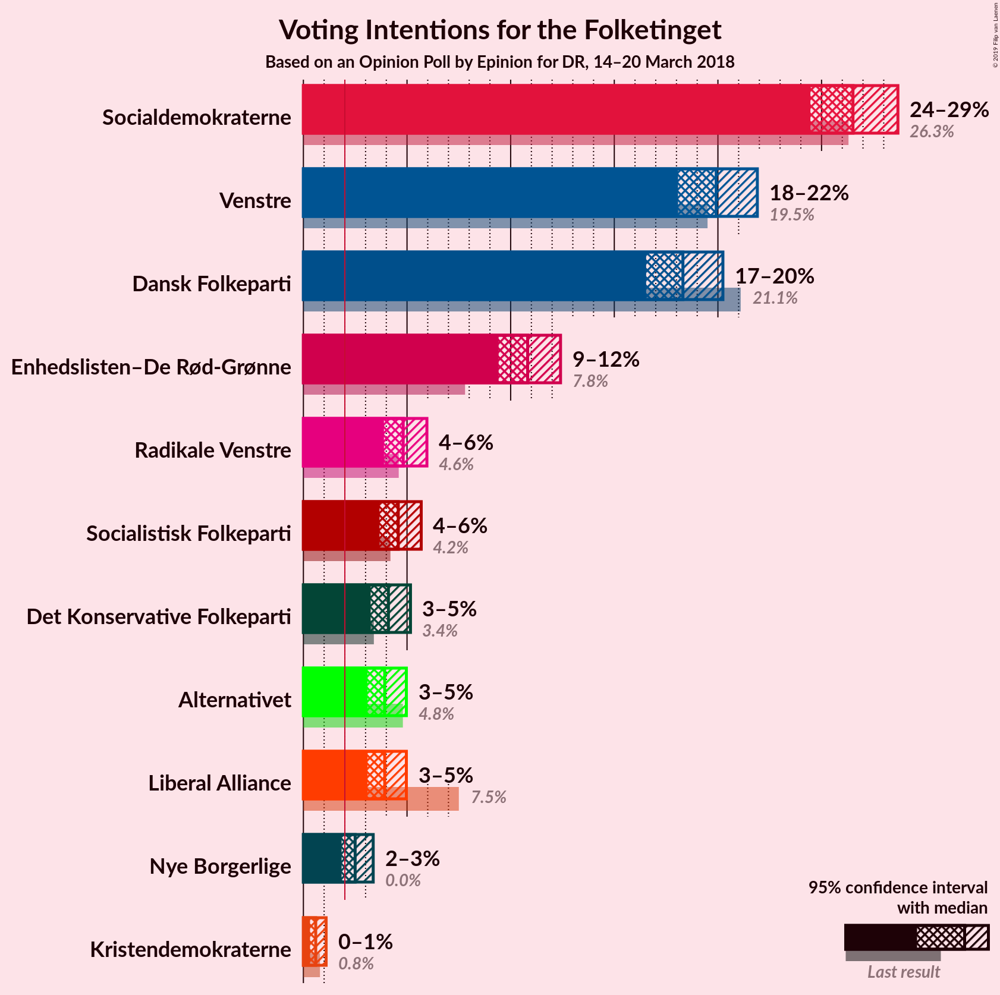

### Confidence Intervals

| Party | Last Result | Poll Result | 80% Confidence Interval | 90% Confidence Interval | 95% Confidence Interval | 99% Confidence Interval |
|:-----:|:-----------:|:-----------:|:-----------------------:|:-----------------------:|:-----------------------:|:-----------------------:|
| Socialdemokraterne | 26.3% | 26.5% | 25.2–27.9% |24.8–28.3% |24.5–28.7% |23.8–29.4% |
| Venstre | 19.5% | 19.9% | 18.7–21.2% |18.4–21.6% |18.1–21.9% |17.5–22.5% |
| Dansk Folkeparti | 21.1% | 18.3% | 17.1–19.6% |16.8–19.9% |16.5–20.2% |16.0–20.9% |
| Enhedslisten–De Rød-Grønne | 7.8% | 10.8% | 9.9–11.9% |9.6–12.1% |9.4–12.4% |9.0–12.9% |
| Radikale Venstre | 4.6% | 4.8% | 4.2–5.6% |4.0–5.8% |3.9–6.0% |3.6–6.3% |
| Socialistisk Folkeparti | 4.2% | 4.6% | 4.0–5.3% |3.8–5.5% |3.7–5.7% |3.4–6.1% |
| Det Konservative Folkeparti | 3.4% | 4.1% | 3.5–4.8% |3.4–5.0% |3.2–5.2% |3.0–5.5% |
| Liberal Alliance | 7.5% | 3.9% | 3.4–4.6% |3.2–4.8% |3.1–5.0% |2.9–5.3% |
| Alternativet | 4.8% | 3.9% | 3.4–4.6% |3.2–4.8% |3.1–5.0% |2.9–5.3% |
| Nye Borgerlige | 0.0% | 2.5% | 2.1–3.1% |2.0–3.2% |1.8–3.4% |1.7–3.7% |
| Kristendemokraterne | 0.8% | 0.6% | 0.4–0.9% |0.4–1.0% |0.3–1.1% |0.2–1.3% |

*Note:* The poll result column reflects the actual value used in the calculations. Published results may vary slightly, and in addition be rounded to fewer digits.

## Seats

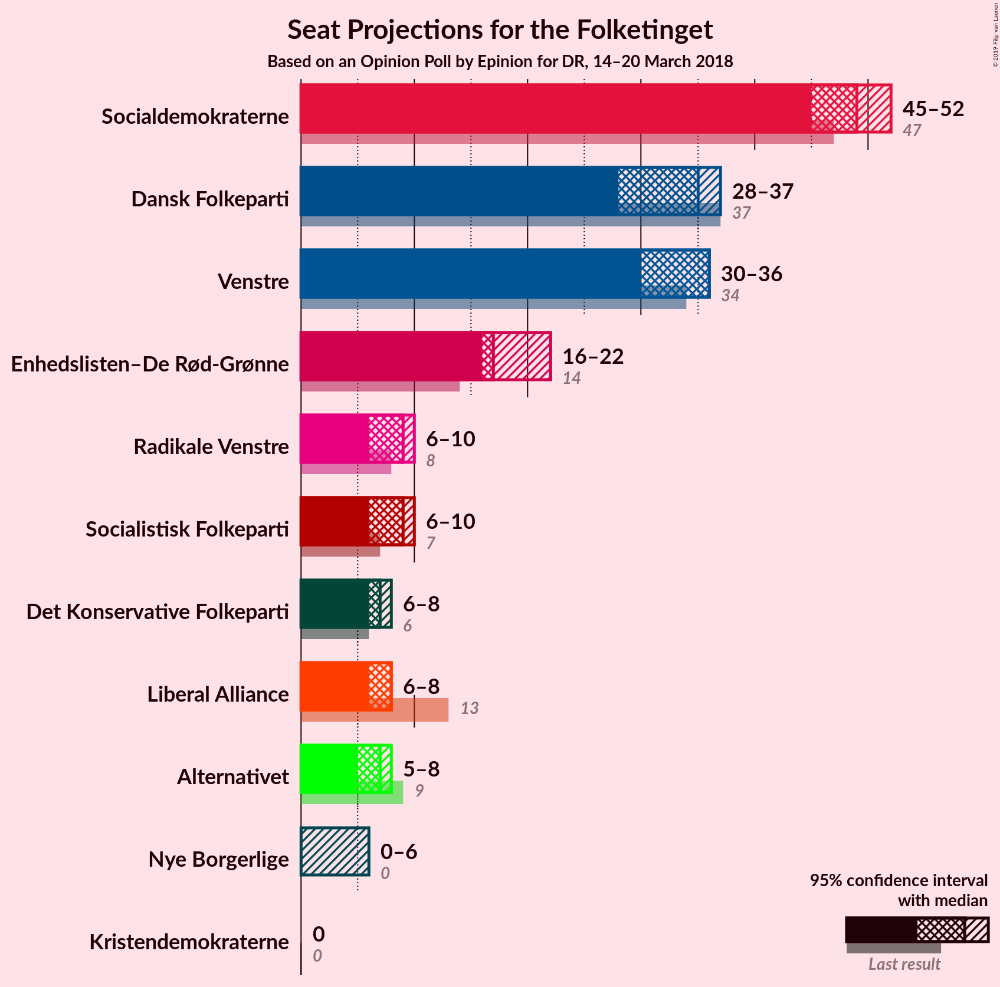

### Confidence Intervals

| Party | Last Result | Median | 80% Confidence Interval | 90% Confidence Interval | 95% Confidence Interval | 99% Confidence Interval |
|:-----:|:-----------:|:------:|:-----------------------:|:-----------------------:|:-----------------------:|:-----------------------:|
| <a href="#socialdemokraterne">Socialdemokraterne</a> | 47 | 49 | 45–49 |45–50 |45–52 |43–52 |
| <a href="#venstre">Venstre</a> | 34 | 36 | 34–36 |33–36 |30–36 |30–38 |
| <a href="#dansk-folkeparti">Dansk Folkeparti</a> | 37 | 35 | 30–37 |28–37 |28–37 |27–37 |
| <a href="#enhedslisten–de-rød-grønne">Enhedslisten–De Rød-Grønne</a> | 14 | 17 | 17–20 |16–21 |16–22 |16–22 |
| <a href="#radikale-venstre">Radikale Venstre</a> | 8 | 9 | 8–10 |6–10 |6–10 |6–10 |
| <a href="#socialistisk-folkeparti">Socialistisk Folkeparti</a> | 7 | 9 | 6–9 |6–9 |6–10 |6–10 |
| <a href="#det-konservative-folkeparti">Det Konservative Folkeparti</a> | 6 | 7 | 6–8 |6–8 |6–8 |6–9 |
| <a href="#liberal-alliance">Liberal Alliance</a> | 13 | 8 | 6–8 |6–8 |6–8 |6–8 |
| <a href="#alternativet">Alternativet</a> | 9 | 7 | 6–8 |6–8 |5–8 |5–9 |
| <a href="#nye-borgerlige">Nye Borgerlige</a> | 0 | 0 | 0–6 |0–6 |0–6 |0–6 |
| <a href="#kristendemokraterne">Kristendemokraterne</a> | 0 | 0 | 0 |0 |0 |0 |

### Socialdemokraterne

*For a full overview of the results for this party, see the [Socialdemokraterne](party-socialdemokraterne.html) page.*

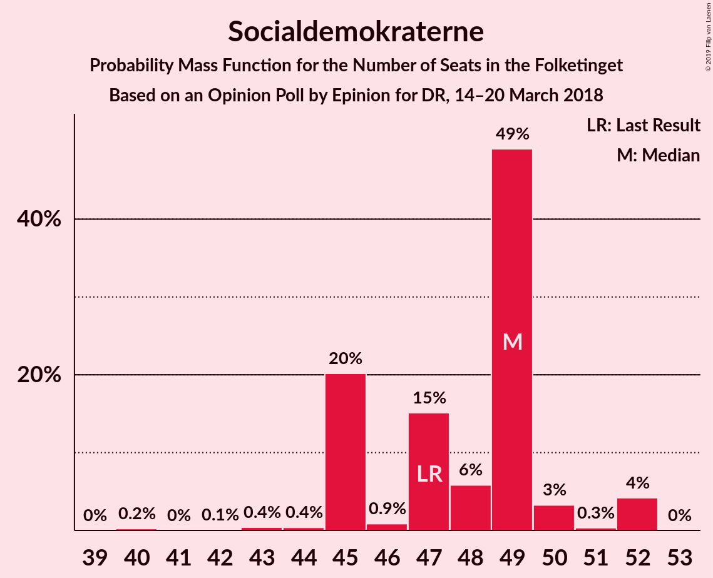

| Number of Seats | Probability | Accumulated | Special Marks |
|:---------------:|:-----------:|:-----------:|:-------------:|
| 40 | 0.2% | 100% |  |
| 41 | 0% | 99.8% |  |
| 42 | 0.1% | 99.8% |  |
| 43 | 0.4% | 99.6% |  |
| 44 | 0.4% | 99.2% |  |
| 45 | 20% | 98.9% |  |
| 46 | 0.9% | 79% |  |
| 47 | 15% | 78% | Last Result |
| 48 | 6% | 63% |  |
| 49 | 49% | 57% | Median |
| 50 | 3% | 8% |  |
| 51 | 0.3% | 5% |  |
| 52 | 4% | 4% |  |
| 53 | 0% | 0% |  |

### Venstre

*For a full overview of the results for this party, see the [Venstre](party-venstre.html) page.*

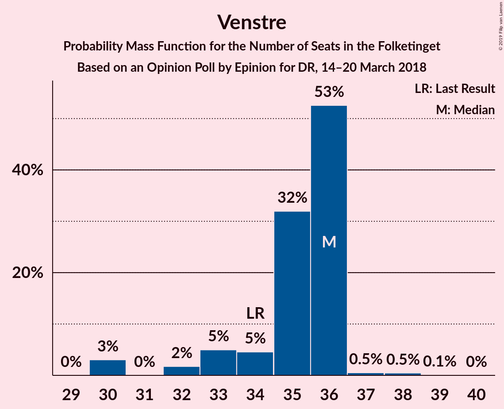

| Number of Seats | Probability | Accumulated | Special Marks |
|:---------------:|:-----------:|:-----------:|:-------------:|
| 30 | 3% | 100% |  |
| 31 | 0% | 97% |  |
| 32 | 2% | 97% |  |
| 33 | 5% | 95% |  |
| 34 | 5% | 90% | Last Result |
| 35 | 32% | 86% |  |
| 36 | 53% | 54% | Median |
| 37 | 0.5% | 1.1% |  |
| 38 | 0.5% | 0.6% |  |
| 39 | 0.1% | 0.1% |  |
| 40 | 0% | 0% |  |

### Dansk Folkeparti

*For a full overview of the results for this party, see the [Dansk Folkeparti](party-danskfolkeparti.html) page.*

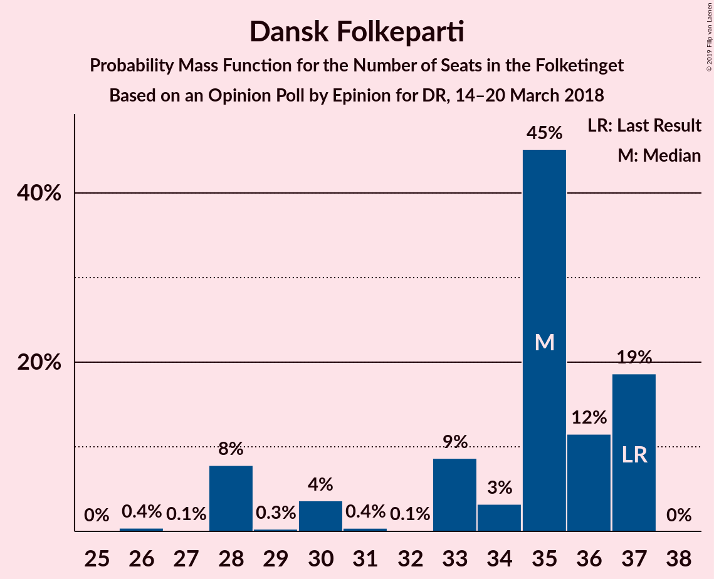

| Number of Seats | Probability | Accumulated | Special Marks |
|:---------------:|:-----------:|:-----------:|:-------------:|
| 26 | 0.4% | 100% |  |
| 27 | 0.1% | 99.6% |  |
| 28 | 8% | 99.5% |  |
| 29 | 0.3% | 92% |  |
| 30 | 4% | 91% |  |
| 31 | 0.4% | 88% |  |
| 32 | 0.1% | 87% |  |
| 33 | 9% | 87% |  |
| 34 | 3% | 79% |  |
| 35 | 45% | 75% | Median |
| 36 | 12% | 30% |  |
| 37 | 19% | 19% | Last Result |
| 38 | 0% | 0% |  |

### Enhedslisten–De Rød-Grønne

*For a full overview of the results for this party, see the [Enhedslisten–De Rød-Grønne](party-enhedslisten–derød-grønne.html) page.*

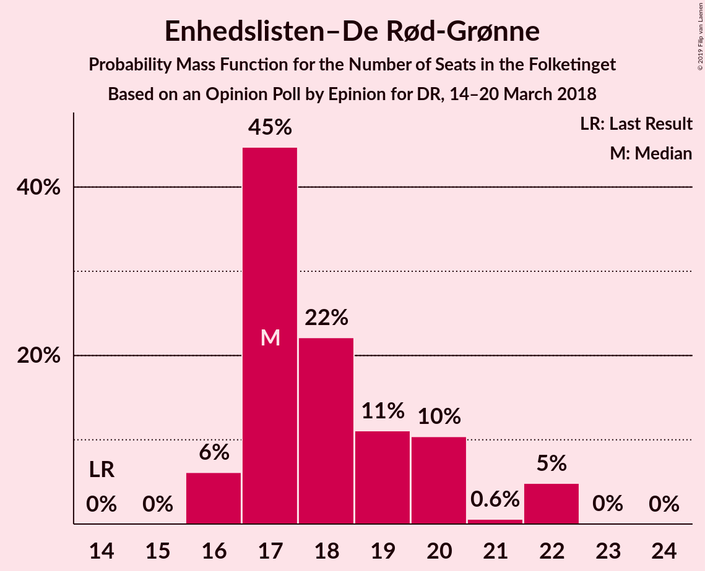

| Number of Seats | Probability | Accumulated | Special Marks |
|:---------------:|:-----------:|:-----------:|:-------------:|
| 14 | 0% | 100% | Last Result |
| 15 | 0% | 100% |  |
| 16 | 6% | 100% |  |
| 17 | 45% | 94% | Median |
| 18 | 22% | 49% |  |
| 19 | 11% | 27% |  |
| 20 | 10% | 16% |  |
| 21 | 0.6% | 5% |  |
| 22 | 5% | 5% |  |
| 23 | 0% | 0.1% |  |
| 24 | 0% | 0% |  |

### Radikale Venstre

*For a full overview of the results for this party, see the [Radikale Venstre](party-radikalevenstre.html) page.*

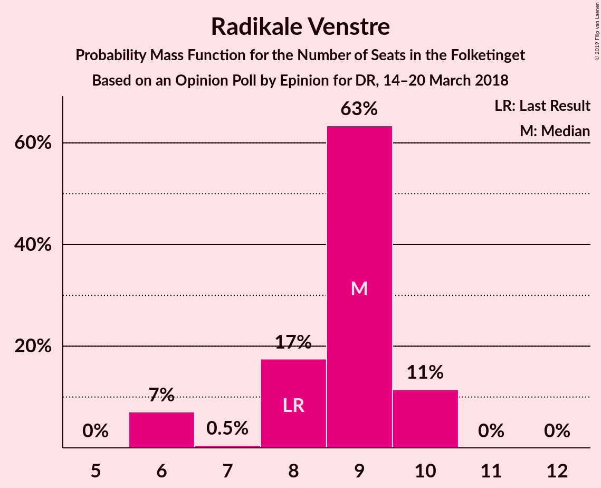

| Number of Seats | Probability | Accumulated | Special Marks |
|:---------------:|:-----------:|:-----------:|:-------------:|
| 6 | 7% | 100% |  |
| 7 | 0.5% | 93% |  |
| 8 | 17% | 92% | Last Result |
| 9 | 63% | 75% | Median |
| 10 | 11% | 12% |  |
| 11 | 0% | 0.1% |  |
| 12 | 0% | 0% |  |

### Socialistisk Folkeparti

*For a full overview of the results for this party, see the [Socialistisk Folkeparti](party-socialistiskfolkeparti.html) page.*

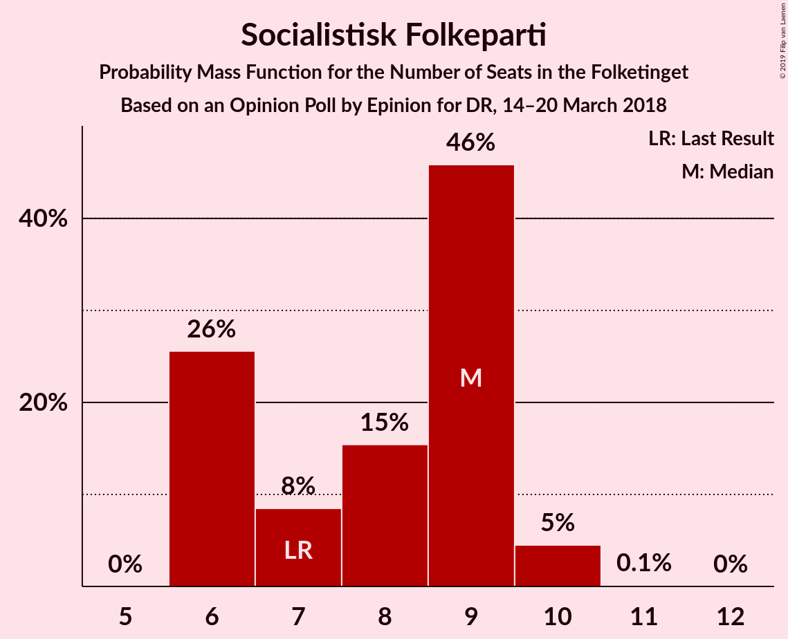

| Number of Seats | Probability | Accumulated | Special Marks |
|:---------------:|:-----------:|:-----------:|:-------------:|
| 6 | 26% | 100% |  |
| 7 | 8% | 74% | Last Result |
| 8 | 15% | 66% |  |
| 9 | 46% | 51% | Median |
| 10 | 5% | 5% |  |
| 11 | 0.1% | 0.2% |  |
| 12 | 0% | 0% |  |

### Det Konservative Folkeparti

*For a full overview of the results for this party, see the [Det Konservative Folkeparti](party-detkonservativefolkeparti.html) page.*

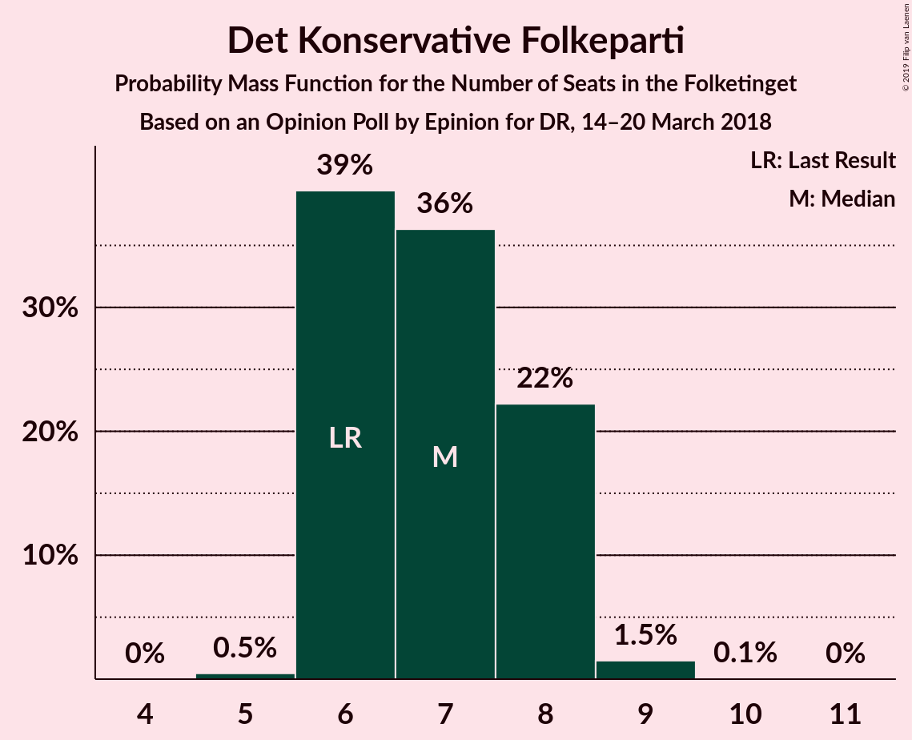

| Number of Seats | Probability | Accumulated | Special Marks |
|:---------------:|:-----------:|:-----------:|:-------------:|
| 5 | 0.5% | 100% |  |
| 6 | 39% | 99.5% | Last Result |
| 7 | 36% | 60% | Median |
| 8 | 22% | 24% |  |
| 9 | 1.5% | 2% |  |
| 10 | 0.1% | 0.1% |  |
| 11 | 0% | 0% |  |

### Liberal Alliance

*For a full overview of the results for this party, see the [Liberal Alliance](party-liberalalliance.html) page.*

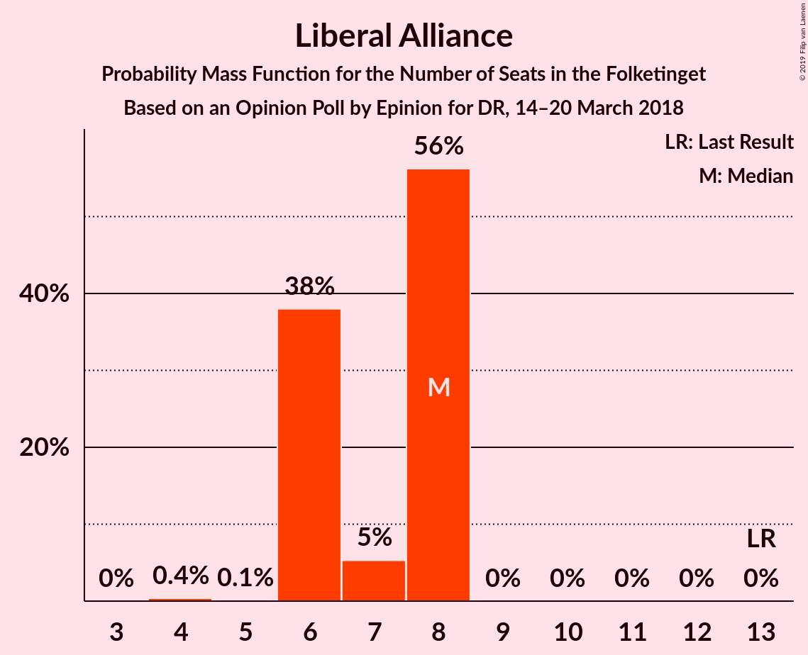

| Number of Seats | Probability | Accumulated | Special Marks |
|:---------------:|:-----------:|:-----------:|:-------------:|
| 4 | 0.4% | 100% |  |
| 5 | 0.1% | 99.6% |  |
| 6 | 38% | 99.6% |  |
| 7 | 5% | 62% |  |
| 8 | 56% | 56% | Median |
| 9 | 0% | 0% |  |
| 10 | 0% | 0% |  |
| 11 | 0% | 0% |  |
| 12 | 0% | 0% |  |
| 13 | 0% | 0% | Last Result |

### Alternativet

*For a full overview of the results for this party, see the [Alternativet](party-alternativet.html) page.*

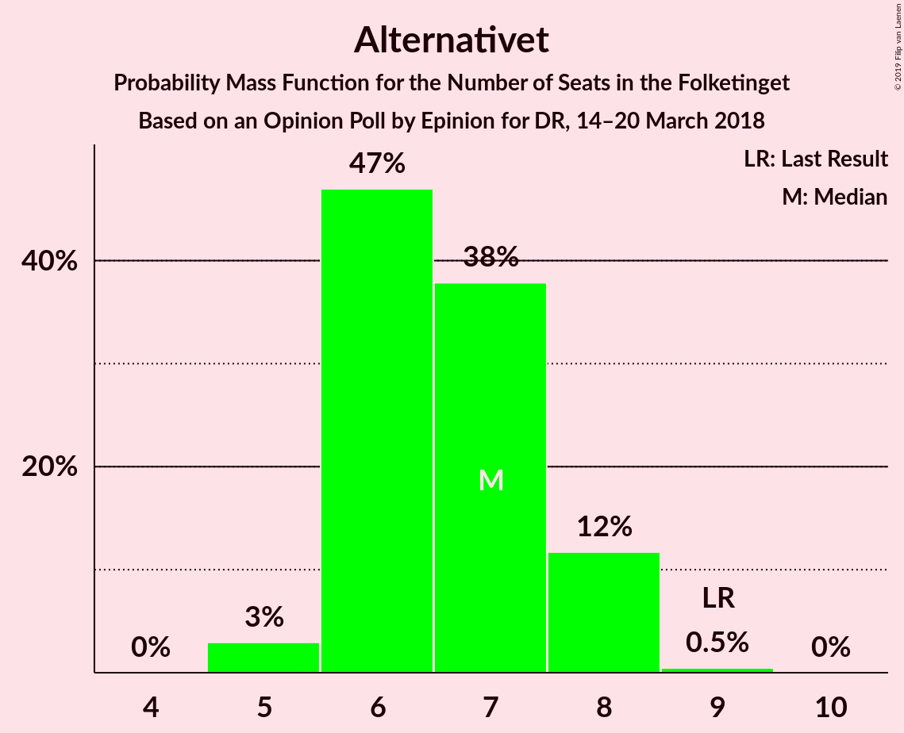

| Number of Seats | Probability | Accumulated | Special Marks |
|:---------------:|:-----------:|:-----------:|:-------------:|
| 5 | 3% | 100% |  |
| 6 | 47% | 97% |  |
| 7 | 38% | 50% | Median |
| 8 | 12% | 12% |  |
| 9 | 0.5% | 0.5% | Last Result |
| 10 | 0% | 0% |  |

### Nye Borgerlige

*For a full overview of the results for this party, see the [Nye Borgerlige](party-nyeborgerlige.html) page.*

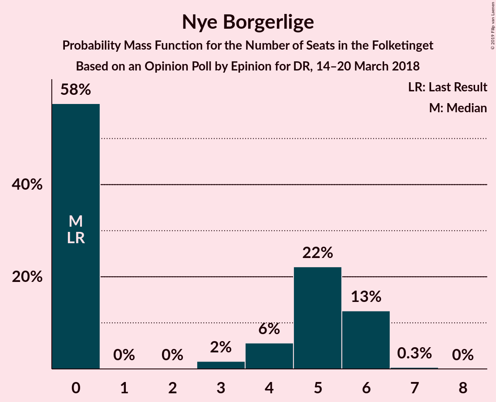

| Number of Seats | Probability | Accumulated | Special Marks |
|:---------------:|:-----------:|:-----------:|:-------------:|
| 0 | 58% | 100% | Last Result, Median |
| 1 | 0% | 42% |  |
| 2 | 0% | 42% |  |
| 3 | 2% | 42% |  |
| 4 | 6% | 41% |  |
| 5 | 22% | 35% |  |
| 6 | 13% | 13% |  |
| 7 | 0.3% | 0.3% |  |
| 8 | 0% | 0% |  |

### Kristendemokraterne

*For a full overview of the results for this party, see the [Kristendemokraterne](party-kristendemokraterne.html) page.*

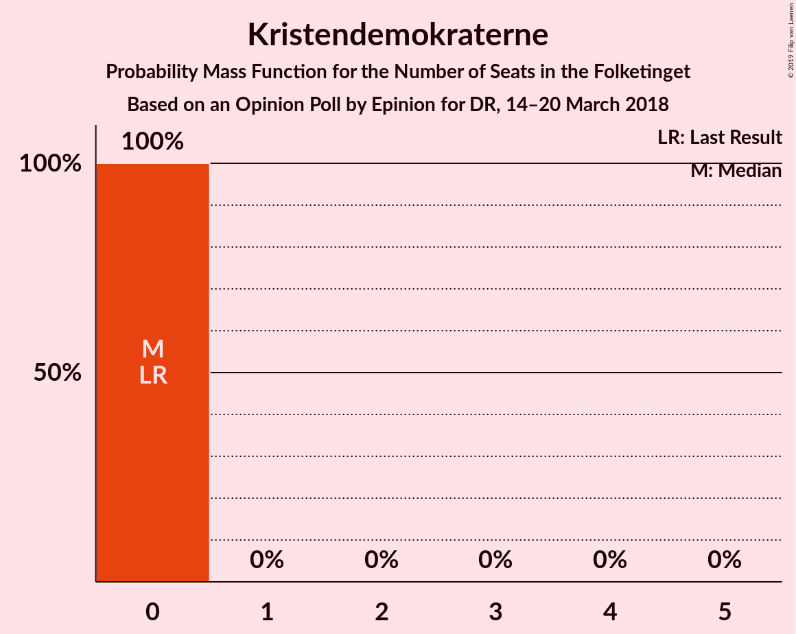

| Number of Seats | Probability | Accumulated | Special Marks |
|:---------------:|:-----------:|:-----------:|:-------------:|
| 0 | 100% | 100% | Last Result, Median |

## Coalitions

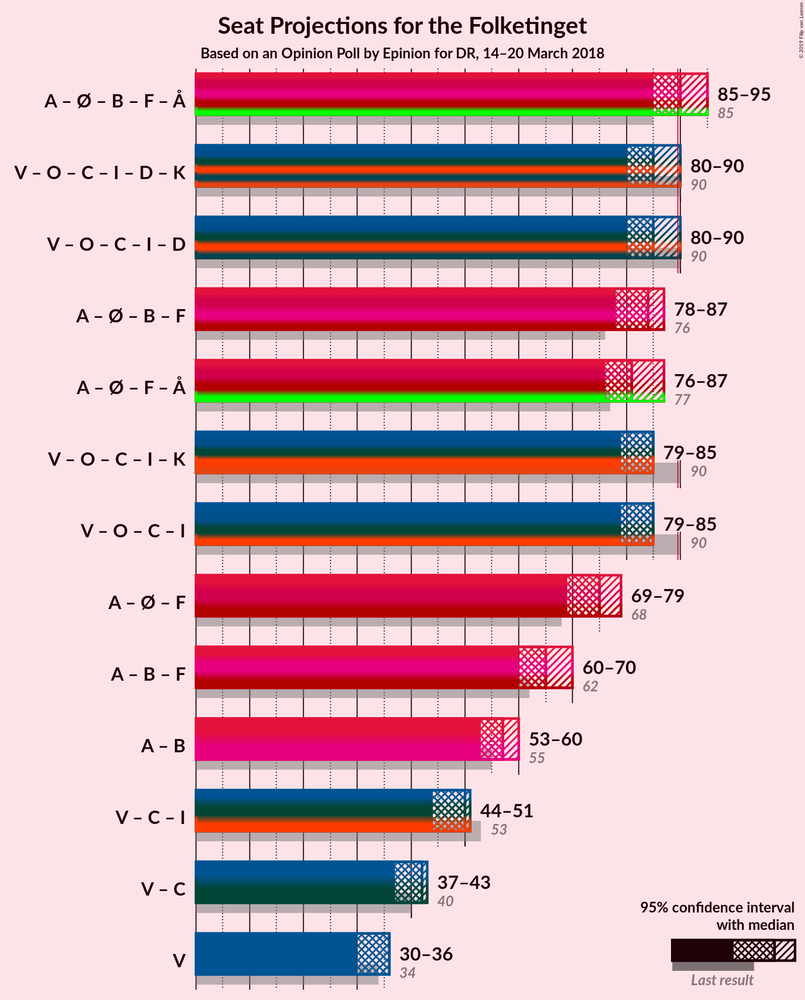

### Confidence Intervals

| Coalition | Last Result | Median | Majority? | 80% Confidence Interval | 90% Confidence Interval | 95% Confidence Interval | 99% Confidence Interval |
|:---------:|:-----------:|:------:|:---------:|:-----------------------:|:-----------------------:|:-----------------------:|:-----------------------:|
| Socialdemokraterne – Enhedslisten–De Rød-Grønne – Radikale Venstre – Socialistisk Folkeparti – Alternativet | 85 | 90 | 67% | 85–91 | 85–95 | 85–95 | 85–95 |
| Venstre – Dansk Folkeparti – Det Konservative Folkeparti – Liberal Alliance – Nye Borgerlige – Kristendemokraterne | 90 | 85 | 19% | 84–90 | 80–90 | 80–90 | 80–90 |
| Venstre – Dansk Folkeparti – Det Konservative Folkeparti – Liberal Alliance – Nye Borgerlige | 90 | 85 | 19% | 84–90 | 80–90 | 80–90 | 80–90 |
| Socialdemokraterne – Enhedslisten–De Rød-Grønne – Radikale Venstre – Socialistisk Folkeparti | 76 | 84 | 0% | 78–84 | 78–87 | 78–87 | 78–87 |
| Socialdemokraterne – Enhedslisten–De Rød-Grønne – Socialistisk Folkeparti – Alternativet | 77 | 81 | 0% | 76–85 | 76–85 | 76–87 | 76–87 |
| Venstre – Dansk Folkeparti – Det Konservative Folkeparti – Liberal Alliance – Kristendemokraterne | 90 | 85 | 0% | 80–85 | 79–85 | 79–85 | 77–86 |
| Venstre – Dansk Folkeparti – Det Konservative Folkeparti – Liberal Alliance | 90 | 85 | 0% | 80–85 | 79–85 | 79–85 | 77–86 |
| Socialdemokraterne – Enhedslisten–De Rød-Grønne – Socialistisk Folkeparti | 68 | 75 | 0% | 69–77 | 69–77 | 69–79 | 69–79 |
| Socialdemokraterne – Radikale Venstre – Socialistisk Folkeparti | 62 | 65 | 0% | 60–67 | 60–67 | 60–70 | 60–70 |
| Socialdemokraterne – Radikale Venstre | 55 | 57 | 0% | 54–58 | 53–59 | 53–60 | 52–60 |
| Venstre – Det Konservative Folkeparti – Liberal Alliance | 53 | 50 | 0% | 48–51 | 47–51 | 44–51 | 44–53 |
| Venstre – Det Konservative Folkeparti | 40 | 42 | 0% | 42–43 | 41–43 | 37–43 | 37–46 |
| Venstre | 34 | 36 | 0% | 34–36 | 33–36 | 30–36 | 30–38 |

### Socialdemokraterne – Enhedslisten–De Rød-Grønne – Radikale Venstre – Socialistisk Folkeparti – Alternativet

| Number of Seats | Probability | Accumulated | Special Marks |
|:---------------:|:-----------:|:-----------:|:-------------:|
| 84 | 0.2% | 100% |  |
| 85 | 18% | 99.7% | Last Result |
| 86 | 6% | 81% |  |
| 87 | 0.3% | 75% |  |
| 88 | 3% | 75% |  |
| 89 | 4% | 72% |  |
| 90 | 54% | 67% | Majority |
| 91 | 5% | 13% | Median |
| 92 | 0.4% | 9% |  |
| 93 | 0.8% | 8% |  |
| 94 | 0.4% | 7% |  |
| 95 | 7% | 7% |  |
| 96 | 0% | 0% |  |

### Venstre – Dansk Folkeparti – Det Konservative Folkeparti – Liberal Alliance – Nye Borgerlige – Kristendemokraterne

| Number of Seats | Probability | Accumulated | Special Marks |
|:---------------:|:-----------:|:-----------:|:-------------:|
| 80 | 7% | 100% |  |
| 81 | 0.4% | 93% |  |
| 82 | 0.8% | 93% |  |
| 83 | 0.4% | 92% |  |
| 84 | 5% | 91% |  |
| 85 | 54% | 87% |  |
| 86 | 4% | 33% | Median |
| 87 | 3% | 28% |  |
| 88 | 0.3% | 25% |  |
| 89 | 6% | 25% |  |
| 90 | 18% | 19% | Last Result, Majority |
| 91 | 0.2% | 0.3% |  |
| 92 | 0% | 0% |  |

### Venstre – Dansk Folkeparti – Det Konservative Folkeparti – Liberal Alliance – Nye Borgerlige

| Number of Seats | Probability | Accumulated | Special Marks |
|:---------------:|:-----------:|:-----------:|:-------------:|
| 80 | 7% | 100% |  |
| 81 | 0.4% | 93% |  |
| 82 | 0.8% | 93% |  |
| 83 | 0.4% | 92% |  |
| 84 | 5% | 91% |  |
| 85 | 54% | 87% |  |
| 86 | 4% | 33% | Median |
| 87 | 3% | 28% |  |
| 88 | 0.3% | 25% |  |
| 89 | 6% | 25% |  |
| 90 | 18% | 19% | Last Result, Majority |
| 91 | 0.2% | 0.3% |  |
| 92 | 0% | 0% |  |

### Socialdemokraterne – Enhedslisten–De Rød-Grønne – Radikale Venstre – Socialistisk Folkeparti

| Number of Seats | Probability | Accumulated | Special Marks |
|:---------------:|:-----------:|:-----------:|:-------------:|
| 76 | 0.2% | 100% | Last Result |
| 77 | 0% | 99.7% |  |
| 78 | 18% | 99.7% |  |
| 79 | 2% | 81% |  |
| 80 | 4% | 79% |  |
| 81 | 0.4% | 75% |  |
| 82 | 4% | 74% |  |
| 83 | 19% | 70% |  |
| 84 | 43% | 51% | Median |
| 85 | 0.1% | 8% |  |
| 86 | 0.9% | 8% |  |
| 87 | 7% | 7% |  |
| 88 | 0.1% | 0.1% |  |
| 89 | 0% | 0% |  |

### Socialdemokraterne – Enhedslisten–De Rød-Grønne – Socialistisk Folkeparti – Alternativet

| Number of Seats | Probability | Accumulated | Special Marks |
|:---------------:|:-----------:|:-----------:|:-------------:|
| 75 | 0.2% | 100% |  |
| 76 | 18% | 99.7% |  |
| 77 | 2% | 81% | Last Result |
| 78 | 4% | 79% |  |
| 79 | 0.3% | 75% |  |
| 80 | 11% | 75% |  |
| 81 | 41% | 64% |  |
| 82 | 10% | 23% | Median |
| 83 | 0.9% | 13% |  |
| 84 | 0.2% | 12% |  |
| 85 | 7% | 12% |  |
| 86 | 0.4% | 5% |  |
| 87 | 4% | 4% |  |
| 88 | 0% | 0% |  |

### Venstre – Dansk Folkeparti – Det Konservative Folkeparti – Liberal Alliance – Kristendemokraterne

| Number of Seats | Probability | Accumulated | Special Marks |
|:---------------:|:-----------:|:-----------:|:-------------:|
| 76 | 0.3% | 100% |  |
| 77 | 0.5% | 99.6% |  |
| 78 | 0.7% | 99.1% |  |
| 79 | 8% | 98% |  |
| 80 | 7% | 90% |  |
| 81 | 3% | 83% |  |
| 82 | 2% | 80% |  |
| 83 | 7% | 79% |  |
| 84 | 5% | 71% |  |
| 85 | 65% | 67% |  |
| 86 | 2% | 2% | Median |
| 87 | 0.3% | 0.3% |  |
| 88 | 0% | 0% |  |
| 89 | 0% | 0% |  |
| 90 | 0% | 0% | Last Result, Majority |

### Venstre – Dansk Folkeparti – Det Konservative Folkeparti – Liberal Alliance

| Number of Seats | Probability | Accumulated | Special Marks |
|:---------------:|:-----------:|:-----------:|:-------------:|
| 76 | 0.3% | 100% |  |
| 77 | 0.5% | 99.6% |  |
| 78 | 0.7% | 99.1% |  |
| 79 | 8% | 98% |  |
| 80 | 7% | 90% |  |
| 81 | 3% | 83% |  |
| 82 | 2% | 80% |  |
| 83 | 7% | 79% |  |
| 84 | 5% | 71% |  |
| 85 | 65% | 67% |  |
| 86 | 2% | 2% | Median |
| 87 | 0.3% | 0.3% |  |
| 88 | 0% | 0% |  |
| 89 | 0% | 0% |  |
| 90 | 0% | 0% | Last Result, Majority |

### Socialdemokraterne – Enhedslisten–De Rød-Grønne – Socialistisk Folkeparti

| Number of Seats | Probability | Accumulated | Special Marks |
|:---------------:|:-----------:|:-----------:|:-------------:|
| 67 | 0.2% | 100% |  |
| 68 | 0% | 99.8% | Last Result |
| 69 | 18% | 99.7% |  |
| 70 | 2% | 81% |  |
| 71 | 0% | 79% |  |
| 72 | 4% | 79% |  |
| 73 | 8% | 75% |  |
| 74 | 2% | 66% |  |
| 75 | 49% | 65% | Median |
| 76 | 4% | 16% |  |
| 77 | 7% | 12% |  |
| 78 | 0.1% | 5% |  |
| 79 | 5% | 5% |  |
| 80 | 0.1% | 0.1% |  |
| 81 | 0% | 0% |  |

### Socialdemokraterne – Radikale Venstre – Socialistisk Folkeparti

| Number of Seats | Probability | Accumulated | Special Marks |
|:---------------:|:-----------:|:-----------:|:-------------:|
| 57 | 0.2% | 100% |  |
| 58 | 0% | 99.8% |  |
| 59 | 0.1% | 99.7% |  |
| 60 | 19% | 99.6% |  |
| 61 | 5% | 81% |  |
| 62 | 0.1% | 76% | Last Result |
| 63 | 9% | 76% |  |
| 64 | 16% | 68% |  |
| 65 | 4% | 51% |  |
| 66 | 0.4% | 47% |  |
| 67 | 42% | 46% | Median |
| 68 | 0.1% | 4% |  |
| 69 | 0% | 4% |  |
| 70 | 4% | 4% |  |
| 71 | 0% | 0% |  |

### Socialdemokraterne – Radikale Venstre

| Number of Seats | Probability | Accumulated | Special Marks |
|:---------------:|:-----------:|:-----------:|:-------------:|
| 49 | 0.2% | 100% |  |
| 50 | 0% | 99.8% |  |
| 51 | 0.1% | 99.7% |  |
| 52 | 0.6% | 99.6% |  |
| 53 | 4% | 99.0% |  |
| 54 | 21% | 95% |  |
| 55 | 0.1% | 74% | Last Result |
| 56 | 12% | 74% |  |
| 57 | 15% | 62% |  |
| 58 | 40% | 47% | Median |
| 59 | 3% | 7% |  |
| 60 | 4% | 4% |  |
| 61 | 0.1% | 0.2% |  |
| 62 | 0% | 0.1% |  |
| 63 | 0% | 0% |  |

### Venstre – Det Konservative Folkeparti – Liberal Alliance

| Number of Seats | Probability | Accumulated | Special Marks |
|:---------------:|:-----------:|:-----------:|:-------------:|
| 43 | 0.3% | 100% |  |
| 44 | 3% | 99.7% |  |
| 45 | 0.3% | 97% |  |
| 46 | 0.2% | 97% |  |
| 47 | 6% | 96% |  |
| 48 | 24% | 91% |  |
| 49 | 10% | 67% |  |
| 50 | 41% | 57% |  |
| 51 | 15% | 16% | Median |
| 52 | 0.2% | 0.9% |  |
| 53 | 0.6% | 0.7% | Last Result |
| 54 | 0.1% | 0.1% |  |
| 55 | 0% | 0% |  |

### Venstre – Det Konservative Folkeparti

| Number of Seats | Probability | Accumulated | Special Marks |
|:---------------:|:-----------:|:-----------:|:-------------:|
| 37 | 3% | 100% |  |
| 38 | 0.2% | 97% |  |
| 39 | 1.5% | 97% |  |
| 40 | 0.1% | 95% | Last Result |
| 41 | 5% | 95% |  |
| 42 | 63% | 91% |  |
| 43 | 27% | 28% | Median |
| 44 | 0.1% | 1.1% |  |
| 45 | 0.1% | 1.0% |  |
| 46 | 0.7% | 0.9% |  |
| 47 | 0.1% | 0.2% |  |
| 48 | 0% | 0% |  |

### Venstre

| Number of Seats | Probability | Accumulated | Special Marks |
|:---------------:|:-----------:|:-----------:|:-------------:|
| 30 | 3% | 100% |  |
| 31 | 0% | 97% |  |
| 32 | 2% | 97% |  |
| 33 | 5% | 95% |  |
| 34 | 5% | 90% | Last Result |
| 35 | 32% | 86% |  |
| 36 | 53% | 54% | Median |
| 37 | 0.5% | 1.1% |  |
| 38 | 0.5% | 0.6% |  |
| 39 | 0.1% | 0.1% |  |
| 40 | 0% | 0% |  |

## Technical Information

### Opinion Poll

+ **Polling firm:** Epinion
+ **Commissioner(s):** DR
+ **Fieldwork period:** 14–20 March 2018

### Calculations

+ **Sample size:** 1682
+ **Simulations done:** 131,072
+ **Error estimate:** 1.46%

