# Opinion Poll by Norstat for Altinget, 14–20 March 2018

<a href="#voting-intentions">Voting Intentions</a> | <a href="#seats">Seats</a> | <a href="#coalitions">Coalitions</a> | <a href="#technical-information">Technical Information</a>

## Voting Intentions

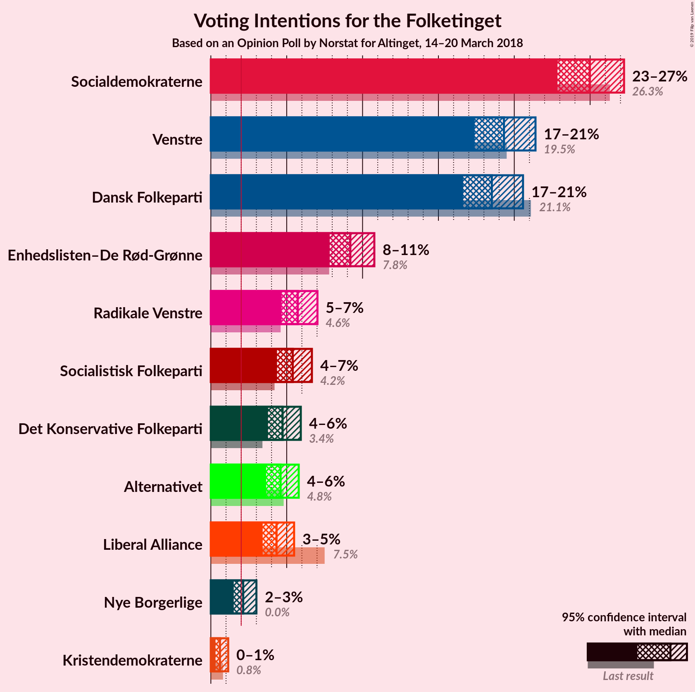

### Confidence Intervals

| Party | Last Result | Poll Result | 80% Confidence Interval | 90% Confidence Interval | 95% Confidence Interval | 99% Confidence Interval |
|:-----:|:-----------:|:-----------:|:-----------------------:|:-----------------------:|:-----------------------:|:-----------------------:|
| Socialdemokraterne | 26.3% | 25.0% | 23.6–26.5% |23.2–26.9% |22.8–27.2% |22.2–28.0% |
| Venstre | 19.5% | 19.3% | 18.1–20.7% |17.7–21.1% |17.4–21.4% |16.8–22.1% |
| Dansk Folkeparti | 21.1% | 18.5% | 17.3–19.9% |16.9–20.2% |16.6–20.6% |16.0–21.2% |
| Enhedslisten–De Rød-Grønne | 7.8% | 9.2% | 8.3–10.2% |8.0–10.5% |7.8–10.8% |7.4–11.3% |
| Radikale Venstre | 4.6% | 5.7% | 5.0–6.6% |4.8–6.8% |4.7–7.0% |4.3–7.5% |
| Socialistisk Folkeparti | 4.2% | 5.4% | 4.7–6.2% |4.5–6.5% |4.4–6.7% |4.1–7.1% |
| Det Konservative Folkeparti | 3.4% | 4.7% | 4.1–5.5% |3.9–5.7% |3.8–5.9% |3.5–6.3% |
| Alternativet | 4.8% | 4.6% | 4.0–5.4% |3.8–5.6% |3.6–5.8% |3.4–6.2% |
| Liberal Alliance | 7.5% | 4.3% | 3.7–5.1% |3.6–5.3% |3.4–5.5% |3.1–5.9% |
| Nye Borgerlige | 0.0% | 2.1% | 1.7–2.7% |1.6–2.9% |1.5–3.0% |1.3–3.3% |
| Kristendemokraterne | 0.8% | 0.6% | 0.4–0.9% |0.4–1.1% |0.3–1.1% |0.2–1.3% |

*Note:* The poll result column reflects the actual value used in the calculations. Published results may vary slightly, and in addition be rounded to fewer digits.

## Seats

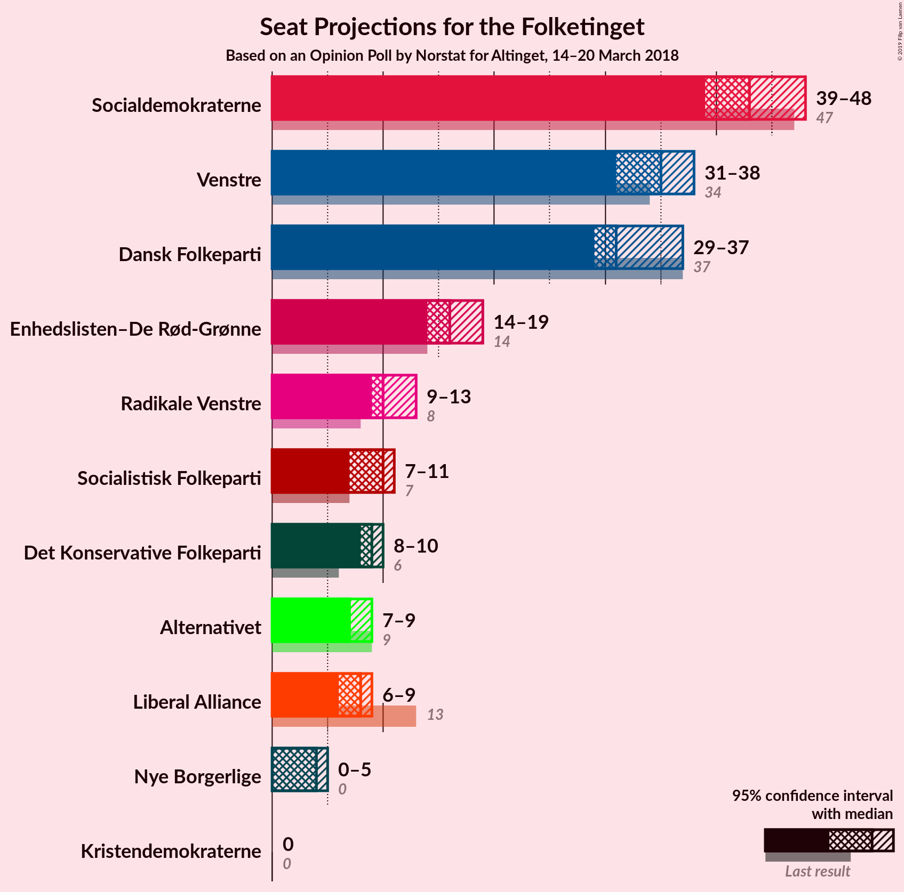

### Confidence Intervals

| Party | Last Result | Median | 80% Confidence Interval | 90% Confidence Interval | 95% Confidence Interval | 99% Confidence Interval |
|:-----:|:-----------:|:------:|:-----------------------:|:-----------------------:|:-----------------------:|:-----------------------:|
| <a href="#socialdemokraterne">Socialdemokraterne</a> | 47 | 43 | 42–48 |41–48 |39–48 |39–48 |
| <a href="#venstre">Venstre</a> | 34 | 35 | 33–37 |33–37 |31–38 |29–38 |
| <a href="#dansk-folkeparti">Dansk Folkeparti</a> | 37 | 31 | 29–34 |29–36 |29–37 |28–38 |
| <a href="#enhedslisten–de-rød-grønne">Enhedslisten–De Rød-Grønne</a> | 14 | 16 | 16–19 |15–19 |14–19 |13–20 |
| <a href="#radikale-venstre">Radikale Venstre</a> | 8 | 10 | 9–11 |9–12 |9–13 |9–13 |
| <a href="#socialistisk-folkeparti">Socialistisk Folkeparti</a> | 7 | 10 | 9–11 |9–11 |7–11 |7–12 |
| <a href="#det-konservative-folkeparti">Det Konservative Folkeparti</a> | 6 | 9 | 9–10 |8–10 |8–10 |7–11 |
| <a href="#alternativet">Alternativet</a> | 9 | 7 | 7–9 |7–9 |7–9 |6–10 |
| <a href="#liberal-alliance">Liberal Alliance</a> | 13 | 8 | 7–9 |7–9 |6–9 |6–10 |
| <a href="#nye-borgerlige">Nye Borgerlige</a> | 0 | 4 | 0–5 |0–5 |0–5 |0–5 |
| <a href="#kristendemokraterne">Kristendemokraterne</a> | 0 | 0 | 0 |0 |0 |0 |

### Socialdemokraterne

*For a full overview of the results for this party, see the [Socialdemokraterne](party-socialdemokraterne.html) page.*

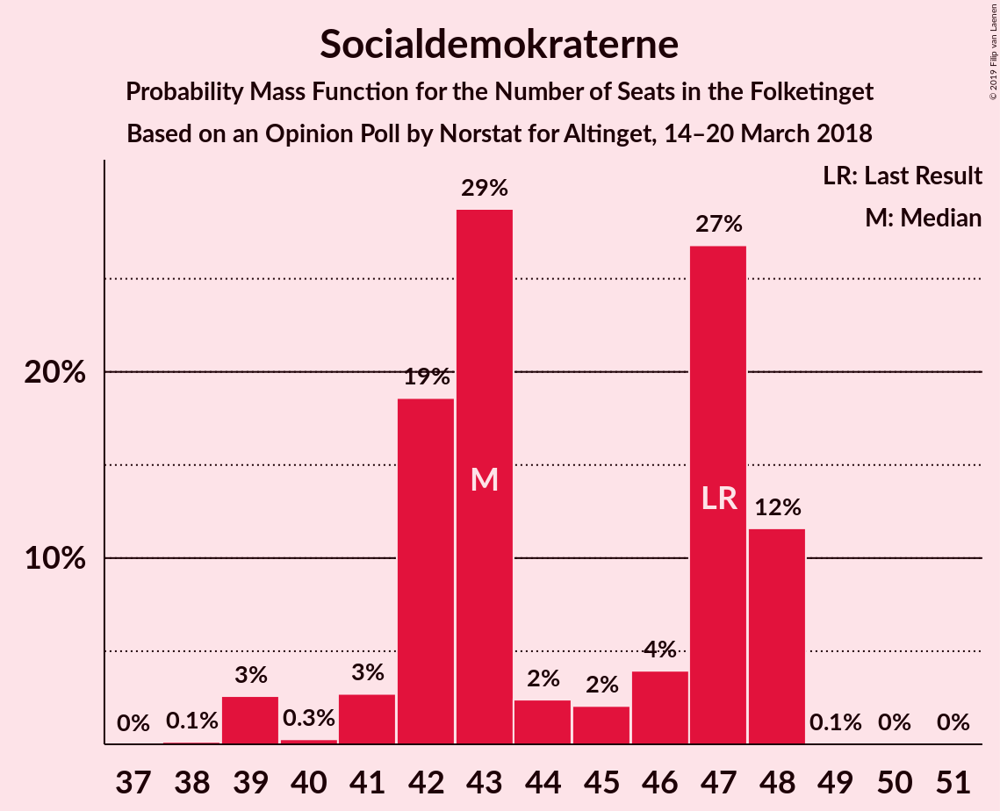

| Number of Seats | Probability | Accumulated | Special Marks |
|:---------------:|:-----------:|:-----------:|:-------------:|
| 38 | 0.1% | 100% |  |
| 39 | 3% | 99.9% |  |
| 40 | 0.3% | 97% |  |
| 41 | 3% | 97% |  |
| 42 | 19% | 94% |  |
| 43 | 29% | 76% | Median |
| 44 | 2% | 47% |  |
| 45 | 2% | 45% |  |
| 46 | 4% | 42% |  |
| 47 | 27% | 39% | Last Result |
| 48 | 12% | 12% |  |
| 49 | 0.1% | 0.1% |  |
| 50 | 0% | 0.1% |  |
| 51 | 0% | 0% |  |

### Venstre

*For a full overview of the results for this party, see the [Venstre](party-venstre.html) page.*

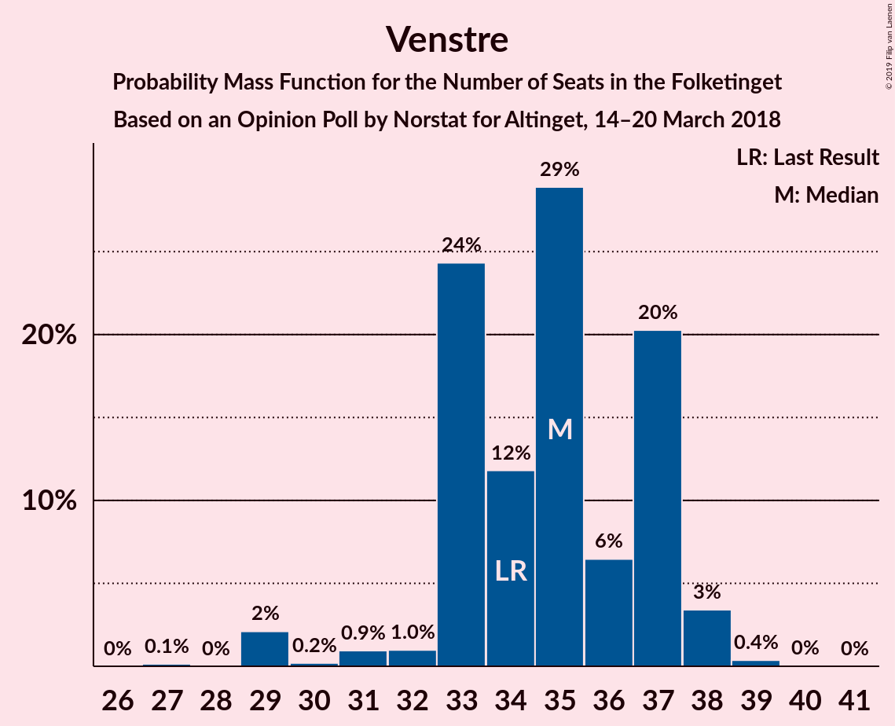

| Number of Seats | Probability | Accumulated | Special Marks |
|:---------------:|:-----------:|:-----------:|:-------------:|
| 27 | 0.1% | 100% |  |
| 28 | 0% | 99.9% |  |
| 29 | 2% | 99.8% |  |
| 30 | 0.2% | 98% |  |
| 31 | 0.9% | 98% |  |
| 32 | 1.0% | 97% |  |
| 33 | 24% | 96% |  |
| 34 | 12% | 71% | Last Result |
| 35 | 29% | 59% | Median |
| 36 | 6% | 31% |  |
| 37 | 20% | 24% |  |
| 38 | 3% | 4% |  |
| 39 | 0.4% | 0.4% |  |
| 40 | 0% | 0.1% |  |
| 41 | 0% | 0% |  |

### Dansk Folkeparti

*For a full overview of the results for this party, see the [Dansk Folkeparti](party-danskfolkeparti.html) page.*

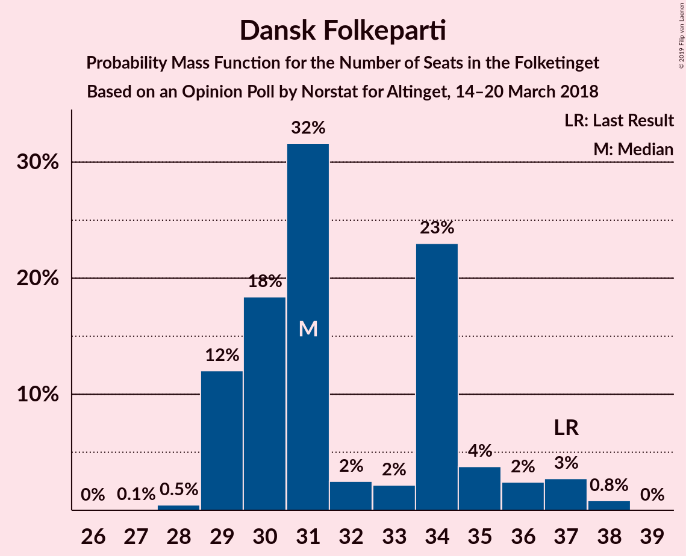

| Number of Seats | Probability | Accumulated | Special Marks |
|:---------------:|:-----------:|:-----------:|:-------------:|
| 27 | 0.1% | 100% |  |
| 28 | 0.5% | 99.9% |  |
| 29 | 12% | 99.5% |  |
| 30 | 18% | 87% |  |
| 31 | 32% | 69% | Median |
| 32 | 2% | 37% |  |
| 33 | 2% | 35% |  |
| 34 | 23% | 33% |  |
| 35 | 4% | 10% |  |
| 36 | 2% | 6% |  |
| 37 | 3% | 4% | Last Result |
| 38 | 0.8% | 0.8% |  |
| 39 | 0% | 0% |  |

### Enhedslisten–De Rød-Grønne

*For a full overview of the results for this party, see the [Enhedslisten–De Rød-Grønne](party-enhedslisten–derød-grønne.html) page.*

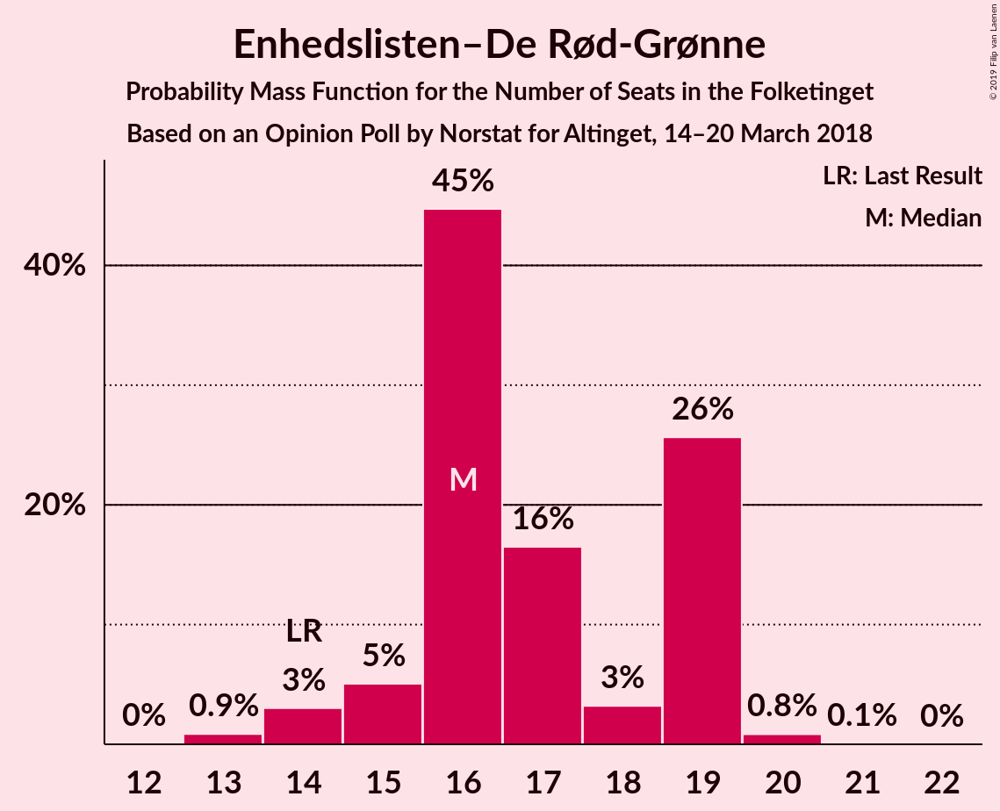

| Number of Seats | Probability | Accumulated | Special Marks |
|:---------------:|:-----------:|:-----------:|:-------------:|
| 13 | 0.9% | 100% |  |
| 14 | 3% | 99.1% | Last Result |
| 15 | 5% | 96% |  |
| 16 | 45% | 91% | Median |
| 17 | 16% | 46% |  |
| 18 | 3% | 30% |  |
| 19 | 26% | 27% |  |
| 20 | 0.8% | 0.9% |  |
| 21 | 0.1% | 0.1% |  |
| 22 | 0% | 0% |  |

### Radikale Venstre

*For a full overview of the results for this party, see the [Radikale Venstre](party-radikalevenstre.html) page.*

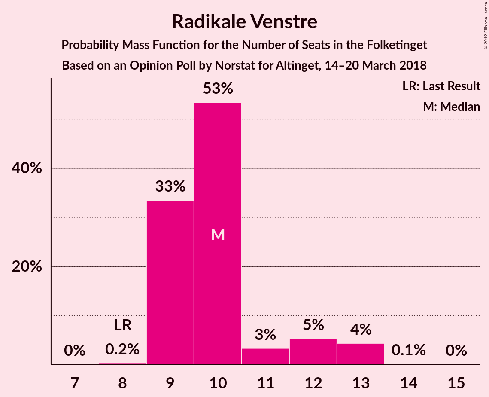

| Number of Seats | Probability | Accumulated | Special Marks |
|:---------------:|:-----------:|:-----------:|:-------------:|
| 8 | 0.2% | 100% | Last Result |
| 9 | 33% | 99.7% |  |
| 10 | 53% | 66% | Median |
| 11 | 3% | 13% |  |
| 12 | 5% | 10% |  |
| 13 | 4% | 4% |  |
| 14 | 0.1% | 0.1% |  |
| 15 | 0% | 0% |  |

### Socialistisk Folkeparti

*For a full overview of the results for this party, see the [Socialistisk Folkeparti](party-socialistiskfolkeparti.html) page.*

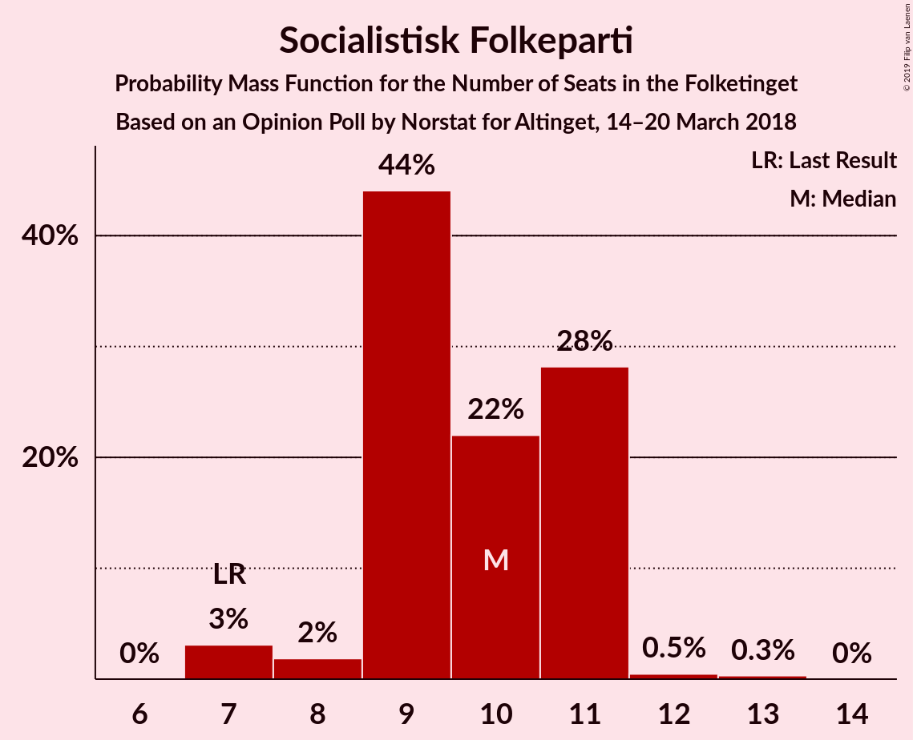

| Number of Seats | Probability | Accumulated | Special Marks |
|:---------------:|:-----------:|:-----------:|:-------------:|
| 7 | 3% | 100% | Last Result |
| 8 | 2% | 97% |  |
| 9 | 44% | 95% |  |
| 10 | 22% | 51% | Median |
| 11 | 28% | 29% |  |
| 12 | 0.5% | 0.8% |  |
| 13 | 0.3% | 0.3% |  |
| 14 | 0% | 0% |  |

### Det Konservative Folkeparti

*For a full overview of the results for this party, see the [Det Konservative Folkeparti](party-detkonservativefolkeparti.html) page.*

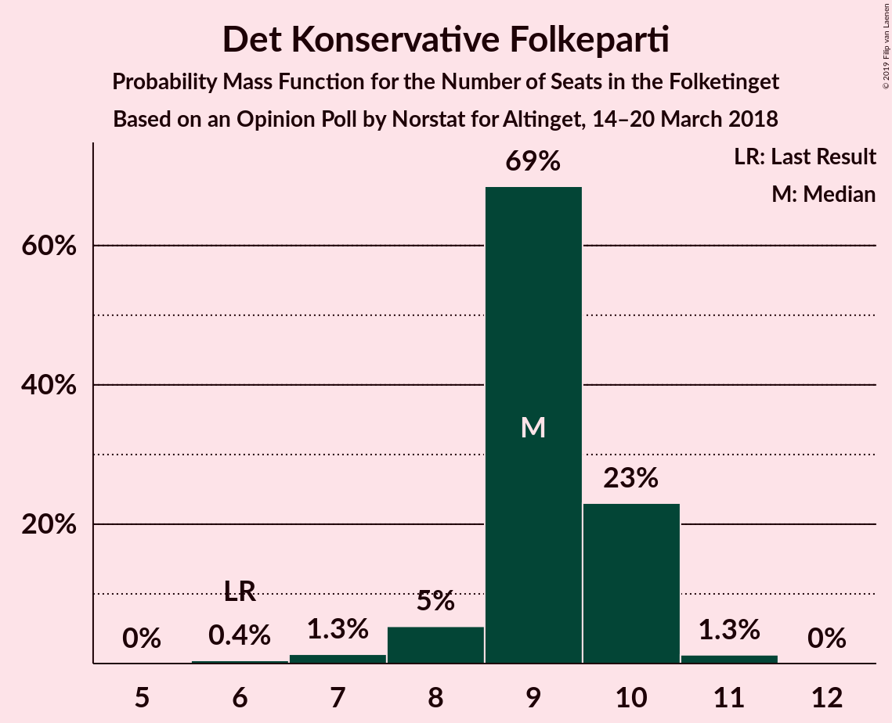

| Number of Seats | Probability | Accumulated | Special Marks |
|:---------------:|:-----------:|:-----------:|:-------------:|
| 6 | 0.4% | 100% | Last Result |
| 7 | 1.3% | 99.5% |  |
| 8 | 5% | 98% |  |
| 9 | 69% | 93% | Median |
| 10 | 23% | 24% |  |
| 11 | 1.3% | 1.3% |  |
| 12 | 0% | 0% |  |

### Alternativet

*For a full overview of the results for this party, see the [Alternativet](party-alternativet.html) page.*

| Number of Seats | Probability | Accumulated | Special Marks |
|:---------------:|:-----------:|:-----------:|:-------------:|
| 6 | 2% | 100% |  |
| 7 | 66% | 98% | Median |
| 8 | 10% | 32% |  |
| 9 | 21% | 22% | Last Result |
| 10 | 1.4% | 1.4% |  |
| 11 | 0.1% | 0.1% |  |
| 12 | 0% | 0% |  |

### Liberal Alliance

*For a full overview of the results for this party, see the [Liberal Alliance](party-liberalalliance.html) page.*

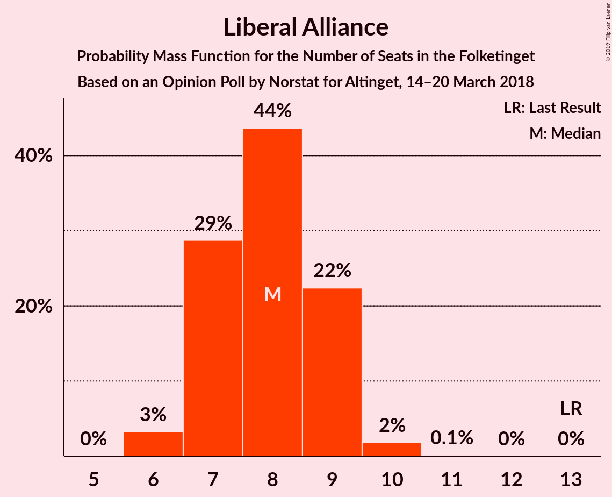

| Number of Seats | Probability | Accumulated | Special Marks |
|:---------------:|:-----------:|:-----------:|:-------------:|
| 6 | 3% | 100% |  |
| 7 | 29% | 97% |  |
| 8 | 44% | 68% | Median |
| 9 | 22% | 24% |  |
| 10 | 2% | 2% |  |
| 11 | 0.1% | 0.1% |  |
| 12 | 0% | 0% |  |
| 13 | 0% | 0% | Last Result |

### Nye Borgerlige

*For a full overview of the results for this party, see the [Nye Borgerlige](party-nyeborgerlige.html) page.*

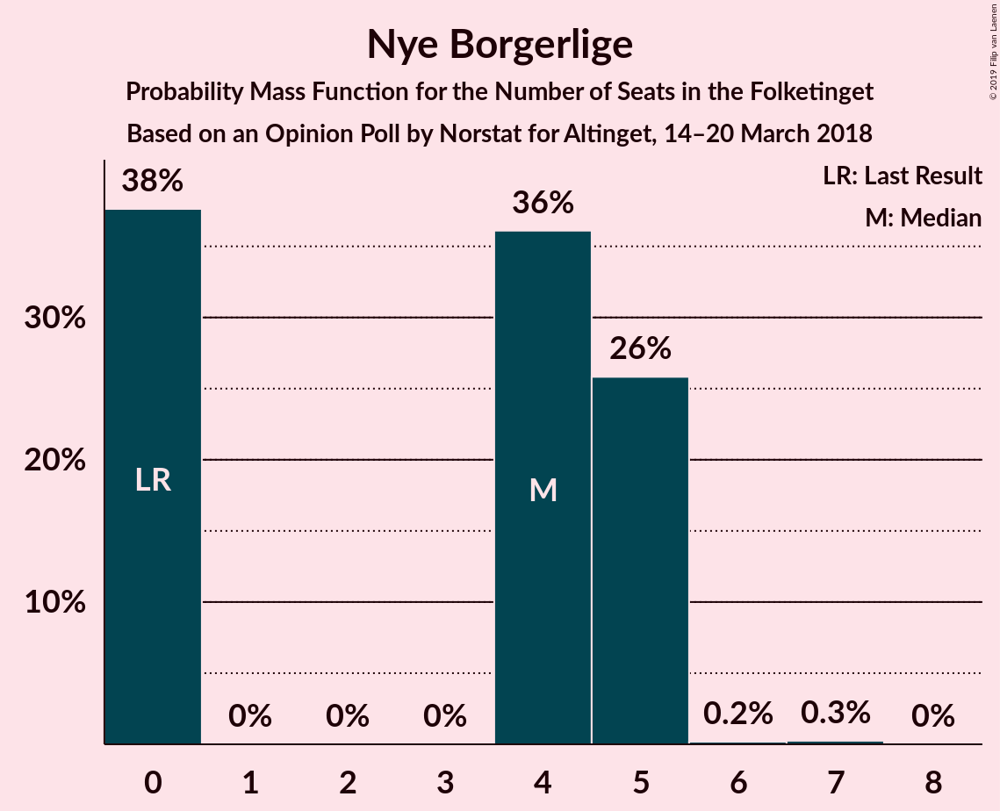

| Number of Seats | Probability | Accumulated | Special Marks |
|:---------------:|:-----------:|:-----------:|:-------------:|
| 0 | 38% | 100% | Last Result |
| 1 | 0% | 62% |  |
| 2 | 0% | 62% |  |
| 3 | 0% | 62% |  |
| 4 | 36% | 62% | Median |
| 5 | 26% | 26% |  |
| 6 | 0.2% | 0.4% |  |
| 7 | 0.3% | 0.3% |  |
| 8 | 0% | 0% |  |

### Kristendemokraterne

*For a full overview of the results for this party, see the [Kristendemokraterne](party-kristendemokraterne.html) page.*

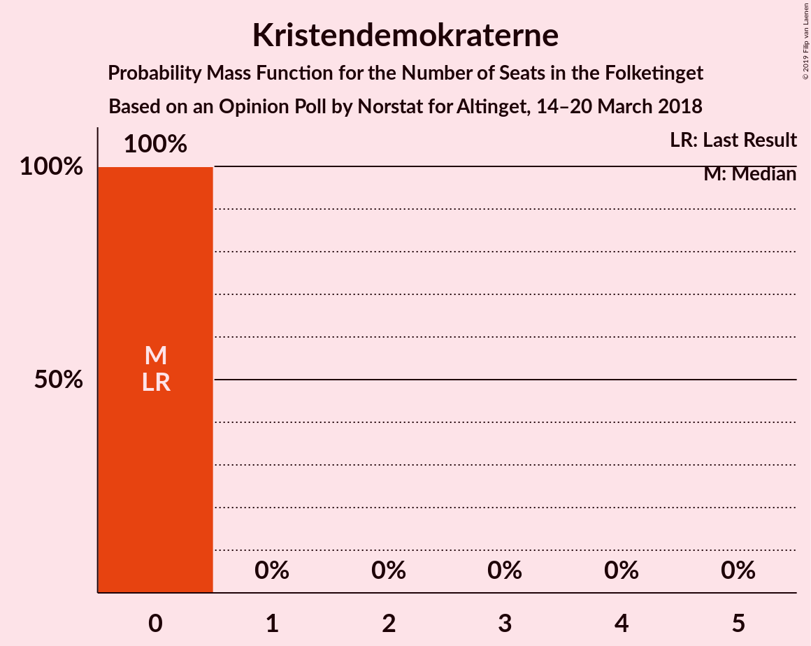

| Number of Seats | Probability | Accumulated | Special Marks |
|:---------------:|:-----------:|:-----------:|:-------------:|
| 0 | 100% | 100% | Last Result, Median |

## Coalitions

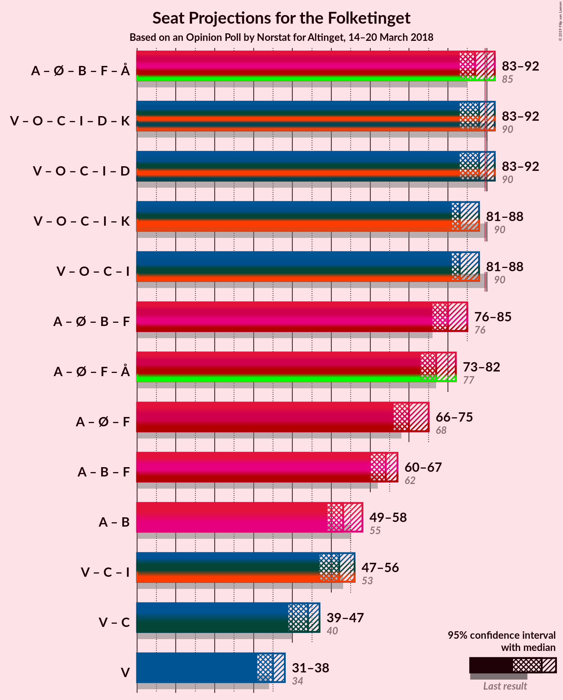

### Confidence Intervals

| Coalition | Last Result | Median | Majority? | 80% Confidence Interval | 90% Confidence Interval | 95% Confidence Interval | 99% Confidence Interval |
|:---------:|:-----------:|:------:|:---------:|:-----------------------:|:-----------------------:|:-----------------------:|:-----------------------:|
| Socialdemokraterne – Enhedslisten–De Rød-Grønne – Radikale Venstre – Socialistisk Folkeparti – Alternativet | 85 | 87 | 43% | 86–92 | 86–92 | 83–92 | 83–94 |
| Venstre – Dansk Folkeparti – Det Konservative Folkeparti – Liberal Alliance – Nye Borgerlige – Kristendemokraterne | 90 | 88 | 4% | 83–89 | 83–89 | 83–92 | 81–92 |
| Venstre – Dansk Folkeparti – Det Konservative Folkeparti – Liberal Alliance – Nye Borgerlige | 90 | 88 | 4% | 83–89 | 83–89 | 83–92 | 81–92 |
| Venstre – Dansk Folkeparti – Det Konservative Folkeparti – Liberal Alliance – Kristendemokraterne | 90 | 83 | 0.1% | 81–87 | 81–88 | 81–88 | 77–89 |
| Venstre – Dansk Folkeparti – Det Konservative Folkeparti – Liberal Alliance | 90 | 83 | 0.1% | 81–87 | 81–88 | 81–88 | 77–89 |
| Socialdemokraterne – Enhedslisten–De Rød-Grønne – Radikale Venstre – Socialistisk Folkeparti | 76 | 80 | 0% | 77–85 | 77–85 | 76–85 | 76–86 |
| Socialdemokraterne – Enhedslisten–De Rød-Grønne – Socialistisk Folkeparti – Alternativet | 77 | 77 | 0% | 76–82 | 75–82 | 73–82 | 72–83 |
| Socialdemokraterne – Enhedslisten–De Rød-Grønne – Socialistisk Folkeparti | 68 | 70 | 0% | 68–75 | 67–75 | 66–75 | 64–75 |
| Socialdemokraterne – Radikale Venstre – Socialistisk Folkeparti | 62 | 64 | 0% | 61–66 | 61–66 | 60–67 | 59–68 |
| Socialdemokraterne – Radikale Venstre | 55 | 53 | 0% | 51–57 | 51–57 | 49–58 | 49–59 |
| Venstre – Det Konservative Folkeparti – Liberal Alliance | 53 | 52 | 0% | 49–55 | 49–55 | 47–56 | 46–56 |
| Venstre – Det Konservative Folkeparti | 40 | 44 | 0% | 42–47 | 42–47 | 39–47 | 38–47 |
| Venstre | 34 | 35 | 0% | 33–37 | 33–37 | 31–38 | 29–38 |

### Socialdemokraterne – Enhedslisten–De Rød-Grønne – Radikale Venstre – Socialistisk Folkeparti – Alternativet

| Number of Seats | Probability | Accumulated | Special Marks |
|:---------------:|:-----------:|:-----------:|:-------------:|
| 81 | 0% | 100% |  |
| 82 | 0% | 99.9% |  |
| 83 | 3% | 99.9% |  |
| 84 | 0.5% | 97% |  |
| 85 | 0.2% | 96% | Last Result |
| 86 | 22% | 96% | Median |
| 87 | 27% | 75% |  |
| 88 | 4% | 47% |  |
| 89 | 0.9% | 43% |  |
| 90 | 12% | 43% | Majority |
| 91 | 3% | 31% |  |
| 92 | 26% | 27% |  |
| 93 | 0.5% | 1.5% |  |
| 94 | 0.7% | 1.0% |  |
| 95 | 0.3% | 0.3% |  |
| 96 | 0% | 0.1% |  |
| 97 | 0% | 0% |  |

### Venstre – Dansk Folkeparti – Det Konservative Folkeparti – Liberal Alliance – Nye Borgerlige – Kristendemokraterne

| Number of Seats | Probability | Accumulated | Special Marks |
|:---------------:|:-----------:|:-----------:|:-------------:|
| 79 | 0% | 100% |  |
| 80 | 0.3% | 99.9% |  |
| 81 | 0.7% | 99.7% |  |
| 82 | 0.5% | 99.0% |  |
| 83 | 26% | 98.5% |  |
| 84 | 3% | 73% |  |
| 85 | 12% | 69% |  |
| 86 | 0.9% | 57% |  |
| 87 | 4% | 57% | Median |
| 88 | 27% | 53% |  |
| 89 | 22% | 25% |  |
| 90 | 0.2% | 4% | Last Result, Majority |
| 91 | 0.5% | 4% |  |
| 92 | 3% | 3% |  |
| 93 | 0% | 0.1% |  |
| 94 | 0% | 0.1% |  |
| 95 | 0% | 0% |  |

### Venstre – Dansk Folkeparti – Det Konservative Folkeparti – Liberal Alliance – Nye Borgerlige

| Number of Seats | Probability | Accumulated | Special Marks |
|:---------------:|:-----------:|:-----------:|:-------------:|
| 79 | 0% | 100% |  |
| 80 | 0.3% | 99.9% |  |
| 81 | 0.7% | 99.7% |  |
| 82 | 0.5% | 99.0% |  |
| 83 | 26% | 98.5% |  |
| 84 | 3% | 73% |  |
| 85 | 12% | 69% |  |
| 86 | 0.9% | 57% |  |
| 87 | 4% | 57% | Median |
| 88 | 27% | 53% |  |
| 89 | 22% | 25% |  |
| 90 | 0.2% | 4% | Last Result, Majority |
| 91 | 0.5% | 4% |  |
| 92 | 3% | 3% |  |
| 93 | 0% | 0.1% |  |
| 94 | 0% | 0.1% |  |
| 95 | 0% | 0% |  |

### Venstre – Dansk Folkeparti – Det Konservative Folkeparti – Liberal Alliance – Kristendemokraterne

| Number of Seats | Probability | Accumulated | Special Marks |
|:---------------:|:-----------:|:-----------:|:-------------:|
| 76 | 0.1% | 100% |  |
| 77 | 0.4% | 99.8% |  |
| 78 | 0.1% | 99.4% |  |
| 79 | 0.1% | 99.3% |  |
| 80 | 0.6% | 99.2% |  |
| 81 | 13% | 98.6% |  |
| 82 | 0.8% | 86% |  |
| 83 | 49% | 85% | Median |
| 84 | 5% | 36% |  |
| 85 | 19% | 31% |  |
| 86 | 0.7% | 12% |  |
| 87 | 4% | 11% |  |
| 88 | 6% | 7% |  |
| 89 | 1.2% | 1.3% |  |
| 90 | 0% | 0.1% | Last Result, Majority |
| 91 | 0% | 0.1% |  |
| 92 | 0.1% | 0.1% |  |
| 93 | 0% | 0% |  |

### Venstre – Dansk Folkeparti – Det Konservative Folkeparti – Liberal Alliance

| Number of Seats | Probability | Accumulated | Special Marks |
|:---------------:|:-----------:|:-----------:|:-------------:|
| 76 | 0.1% | 100% |  |
| 77 | 0.4% | 99.8% |  |
| 78 | 0.1% | 99.4% |  |
| 79 | 0.1% | 99.3% |  |
| 80 | 0.6% | 99.2% |  |
| 81 | 13% | 98.6% |  |
| 82 | 0.8% | 86% |  |
| 83 | 49% | 85% | Median |
| 84 | 5% | 36% |  |
| 85 | 19% | 31% |  |
| 86 | 0.7% | 12% |  |
| 87 | 4% | 11% |  |
| 88 | 6% | 7% |  |
| 89 | 1.2% | 1.3% |  |
| 90 | 0% | 0.1% | Last Result, Majority |
| 91 | 0% | 0.1% |  |
| 92 | 0.1% | 0.1% |  |
| 93 | 0% | 0% |  |

### Socialdemokraterne – Enhedslisten–De Rød-Grønne – Radikale Venstre – Socialistisk Folkeparti

| Number of Seats | Probability | Accumulated | Special Marks |
|:---------------:|:-----------:|:-----------:|:-------------:|
| 74 | 0.1% | 100% |  |
| 75 | 0.1% | 99.8% |  |
| 76 | 4% | 99.7% | Last Result |
| 77 | 19% | 96% |  |
| 78 | 1.1% | 77% |  |
| 79 | 4% | 76% | Median |
| 80 | 28% | 73% |  |
| 81 | 2% | 44% |  |
| 82 | 0.9% | 42% |  |
| 83 | 15% | 42% |  |
| 84 | 0.2% | 27% |  |
| 85 | 26% | 27% |  |
| 86 | 0.8% | 0.9% |  |
| 87 | 0.1% | 0.1% |  |
| 88 | 0% | 0% |  |

### Socialdemokraterne – Enhedslisten–De Rød-Grønne – Socialistisk Folkeparti – Alternativet

| Number of Seats | Probability | Accumulated | Special Marks |
|:---------------:|:-----------:|:-----------:|:-------------:|
| 71 | 0.5% | 100% |  |
| 72 | 0% | 99.5% |  |
| 73 | 3% | 99.5% |  |
| 74 | 0.9% | 97% |  |
| 75 | 3% | 96% |  |
| 76 | 4% | 93% | Median |
| 77 | 44% | 89% | Last Result |
| 78 | 5% | 46% |  |
| 79 | 2% | 41% |  |
| 80 | 0.5% | 39% |  |
| 81 | 12% | 38% |  |
| 82 | 25% | 26% |  |
| 83 | 0.2% | 0.5% |  |
| 84 | 0% | 0.3% |  |
| 85 | 0.2% | 0.3% |  |
| 86 | 0% | 0% |  |

### Socialdemokraterne – Enhedslisten–De Rød-Grønne – Socialistisk Folkeparti

| Number of Seats | Probability | Accumulated | Special Marks |
|:---------------:|:-----------:|:-----------:|:-------------:|
| 64 | 0.5% | 100% |  |
| 65 | 0.6% | 99.5% |  |
| 66 | 3% | 98.8% |  |
| 67 | 1.3% | 96% |  |
| 68 | 22% | 95% | Last Result |
| 69 | 4% | 73% | Median |
| 70 | 29% | 69% |  |
| 71 | 0.4% | 40% |  |
| 72 | 0.7% | 39% |  |
| 73 | 1.3% | 39% |  |
| 74 | 12% | 37% |  |
| 75 | 25% | 26% |  |
| 76 | 0.2% | 0.2% |  |
| 77 | 0% | 0.1% |  |
| 78 | 0% | 0% |  |

### Socialdemokraterne – Radikale Venstre – Socialistisk Folkeparti

| Number of Seats | Probability | Accumulated | Special Marks |
|:---------------:|:-----------:|:-----------:|:-------------:|
| 57 | 0.1% | 100% |  |
| 58 | 0% | 99.9% |  |
| 59 | 0.4% | 99.9% |  |
| 60 | 4% | 99.5% |  |
| 61 | 18% | 96% |  |
| 62 | 6% | 78% | Last Result |
| 63 | 0.8% | 72% | Median |
| 64 | 22% | 71% |  |
| 65 | 4% | 49% |  |
| 66 | 40% | 45% |  |
| 67 | 4% | 5% |  |
| 68 | 0.8% | 1.0% |  |
| 69 | 0.1% | 0.2% |  |
| 70 | 0.1% | 0.1% |  |
| 71 | 0% | 0.1% |  |
| 72 | 0% | 0% |  |

### Socialdemokraterne – Radikale Venstre

| Number of Seats | Probability | Accumulated | Special Marks |
|:---------------:|:-----------:|:-----------:|:-------------:|
| 48 | 0.1% | 100% |  |
| 49 | 3% | 99.9% |  |
| 50 | 1.0% | 97% |  |
| 51 | 18% | 96% |  |
| 52 | 1.1% | 78% |  |
| 53 | 27% | 77% | Median |
| 54 | 1.2% | 50% |  |
| 55 | 0.5% | 49% | Last Result |
| 56 | 6% | 48% |  |
| 57 | 38% | 42% |  |
| 58 | 3% | 4% |  |
| 59 | 0.5% | 0.6% |  |
| 60 | 0.1% | 0.1% |  |
| 61 | 0% | 0.1% |  |
| 62 | 0% | 0% |  |

### Venstre – Det Konservative Folkeparti – Liberal Alliance

| Number of Seats | Probability | Accumulated | Special Marks |
|:---------------:|:-----------:|:-----------:|:-------------:|
| 42 | 0.1% | 100% |  |
| 43 | 0% | 99.9% |  |
| 44 | 0% | 99.8% |  |
| 45 | 0% | 99.8% |  |
| 46 | 0.4% | 99.8% |  |
| 47 | 2% | 99.3% |  |
| 48 | 0.4% | 97% |  |
| 49 | 23% | 97% |  |
| 50 | 0.8% | 74% |  |
| 51 | 5% | 73% |  |
| 52 | 38% | 68% | Median |
| 53 | 8% | 30% | Last Result |
| 54 | 0.8% | 22% |  |
| 55 | 18% | 21% |  |
| 56 | 3% | 3% |  |
| 57 | 0.1% | 0.1% |  |
| 58 | 0% | 0% |  |

### Venstre – Det Konservative Folkeparti

| Number of Seats | Probability | Accumulated | Special Marks |
|:---------------:|:-----------:|:-----------:|:-------------:|
| 35 | 0.1% | 100% |  |
| 36 | 0.1% | 99.9% |  |
| 37 | 0% | 99.8% |  |
| 38 | 2% | 99.8% |  |
| 39 | 0.7% | 98% |  |
| 40 | 1.1% | 97% | Last Result |
| 41 | 0.8% | 96% |  |
| 42 | 24% | 96% |  |
| 43 | 13% | 71% |  |
| 44 | 28% | 58% | Median |
| 45 | 4% | 30% |  |
| 46 | 5% | 26% |  |
| 47 | 20% | 21% |  |
| 48 | 0.1% | 0.3% |  |
| 49 | 0.2% | 0.2% |  |
| 50 | 0% | 0% |  |

### Venstre

| Number of Seats | Probability | Accumulated | Special Marks |
|:---------------:|:-----------:|:-----------:|:-------------:|
| 27 | 0.1% | 100% |  |
| 28 | 0% | 99.9% |  |
| 29 | 2% | 99.8% |  |
| 30 | 0.2% | 98% |  |
| 31 | 0.9% | 98% |  |
| 32 | 1.0% | 97% |  |
| 33 | 24% | 96% |  |
| 34 | 12% | 71% | Last Result |
| 35 | 29% | 59% | Median |
| 36 | 6% | 31% |  |
| 37 | 20% | 24% |  |
| 38 | 3% | 4% |  |
| 39 | 0.4% | 0.4% |  |
| 40 | 0% | 0.1% |  |
| 41 | 0% | 0% |  |

## Technical Information

### Opinion Poll

+ **Polling firm:** Norstat
+ **Commissioner(s):** Altinget
+ **Fieldwork period:** 14–20 March 2018

### Calculations

+ **Sample size:** 1501
+ **Simulations done:** 131,072
+ **Error estimate:** 1.63%

