# Opinion Poll by Voxmeter for Ritzau, 19–25 March 2018

<a href="#voting-intentions">Voting Intentions</a> | <a href="#seats">Seats</a> | <a href="#coalitions">Coalitions</a> | <a href="#technical-information">Technical Information</a>

## Voting Intentions

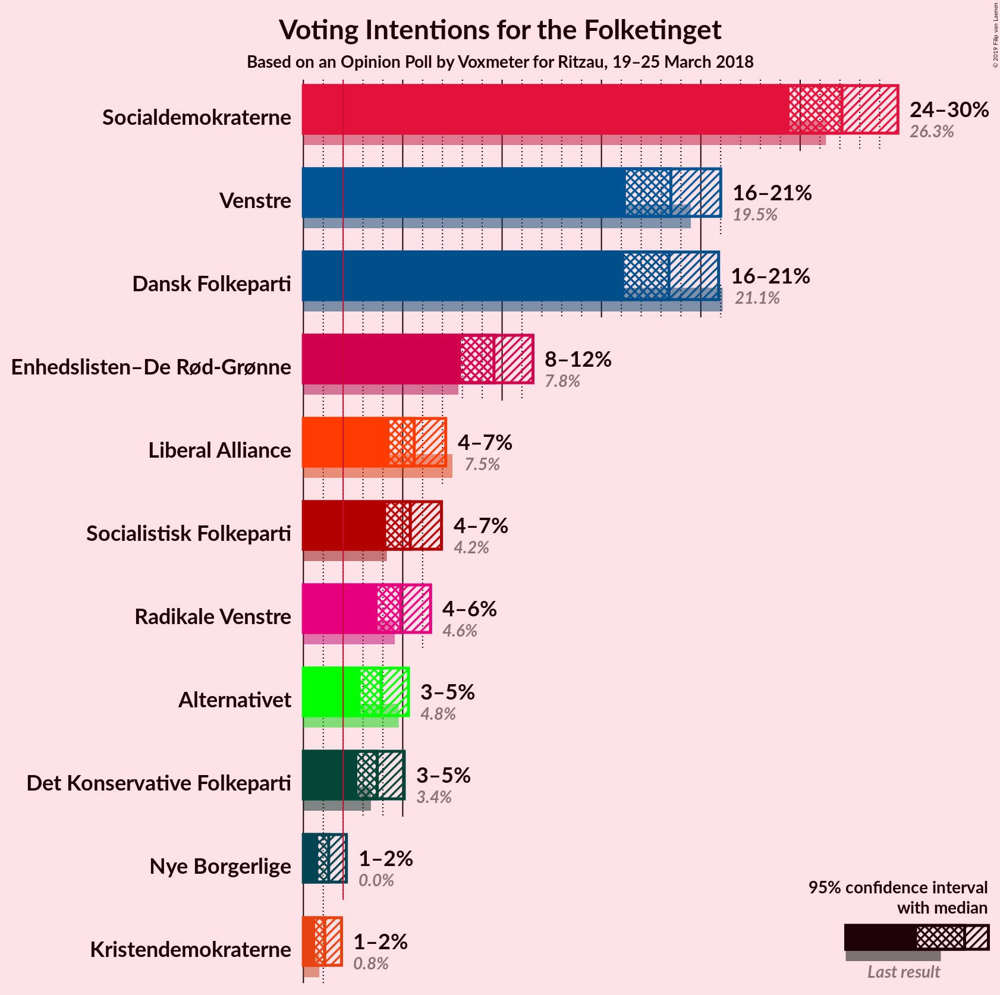

### Confidence Intervals

| Party | Last Result | Poll Result | 80% Confidence Interval | 90% Confidence Interval | 95% Confidence Interval | 99% Confidence Interval |
|:-----:|:-----------:|:-----------:|:-----------------------:|:-----------------------:|:-----------------------:|:-----------------------:|
| Socialdemokraterne | 26.3% | 27.1% | 25.4–28.9% |24.9–29.5% |24.5–29.9% |23.7–30.8% |
| Venstre | 19.5% | 18.5% | 17.0–20.1% |16.6–20.6% |16.2–21.0% |15.5–21.8% |
| Dansk Folkeparti | 21.1% | 18.4% | 16.9–20.0% |16.5–20.5% |16.1–20.9% |15.4–21.7% |
| Enhedslisten–De Rød-Grønne | 7.8% | 9.6% | 8.5–10.9% |8.2–11.2% |7.9–11.6% |7.4–12.2% |
| Liberal Alliance | 7.5% | 5.6% | 4.8–6.6% |4.5–6.9% |4.3–7.2% |4.0–7.7% |
| Socialistisk Folkeparti | 4.2% | 5.4% | 4.6–6.4% |4.3–6.7% |4.2–7.0% |3.8–7.5% |
| Radikale Venstre | 4.6% | 4.9% | 4.1–5.9% |3.9–6.2% |3.7–6.4% |3.4–6.9% |
| Alternativet | 4.8% | 3.9% | 3.2–4.8% |3.0–5.1% |2.9–5.3% |2.6–5.8% |
| Det Konservative Folkeparti | 3.4% | 3.7% | 3.1–4.6% |2.9–4.8% |2.7–5.1% |2.4–5.5% |
| Nye Borgerlige | 0.0% | 1.3% | 0.9–1.9% |0.8–2.0% |0.7–2.2% |0.6–2.5% |
| Kristendemokraterne | 0.8% | 1.1% | 0.8–1.6% |0.7–1.8% |0.6–1.9% |0.5–2.2% |

*Note:* The poll result column reflects the actual value used in the calculations. Published results may vary slightly, and in addition be rounded to fewer digits.

## Seats

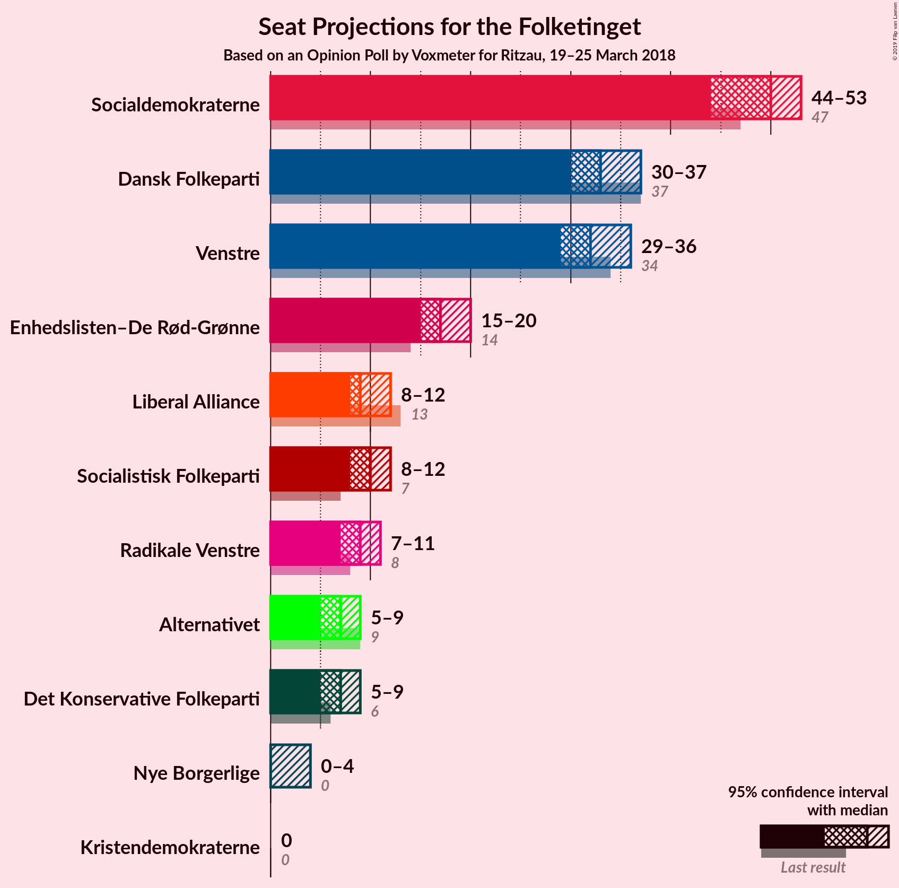

### Confidence Intervals

| Party | Last Result | Median | 80% Confidence Interval | 90% Confidence Interval | 95% Confidence Interval | 99% Confidence Interval |
|:-----:|:-----------:|:------:|:-----------------------:|:-----------------------:|:-----------------------:|:-----------------------:|
| <a href="#socialdemokraterne">Socialdemokraterne</a> | 47 | 50 | 45–52 |45–52 |44–53 |43–55 |
| <a href="#venstre">Venstre</a> | 34 | 32 | 30–34 |29–35 |29–36 |28–38 |
| <a href="#dansk-folkeparti">Dansk Folkeparti</a> | 37 | 33 | 31–35 |31–35 |30–37 |28–38 |
| <a href="#enhedslisten–de-rød-grønne">Enhedslisten–De Rød-Grønne</a> | 14 | 17 | 16–19 |15–19 |15–20 |13–22 |
| <a href="#liberal-alliance">Liberal Alliance</a> | 13 | 9 | 9–12 |9–12 |8–12 |7–14 |
| <a href="#socialistisk-folkeparti">Socialistisk Folkeparti</a> | 7 | 10 | 8–11 |8–11 |8–12 |7–13 |
| <a href="#radikale-venstre">Radikale Venstre</a> | 8 | 9 | 8–10 |7–11 |7–11 |6–13 |
| <a href="#alternativet">Alternativet</a> | 9 | 7 | 7–8 |6–9 |5–9 |5–11 |
| <a href="#det-konservative-folkeparti">Det Konservative Folkeparti</a> | 6 | 7 | 6–8 |5–8 |5–9 |5–10 |
| <a href="#nye-borgerlige">Nye Borgerlige</a> | 0 | 0 | 0 |0 |0–4 |0–4 |
| <a href="#kristendemokraterne">Kristendemokraterne</a> | 0 | 0 | 0 |0 |0 |0–4 |

### Socialdemokraterne

*For a full overview of the results for this party, see the [Socialdemokraterne](party-socialdemokraterne.html) page.*

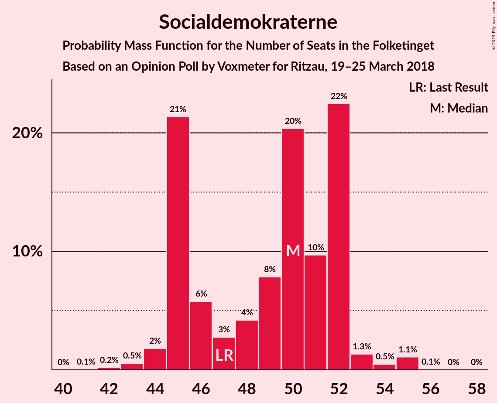

| Number of Seats | Probability | Accumulated | Special Marks |
|:---------------:|:-----------:|:-----------:|:-------------:|
| 41 | 0.1% | 100% |  |
| 42 | 0.2% | 99.9% |  |
| 43 | 0.5% | 99.7% |  |
| 44 | 2% | 99.2% |  |
| 45 | 21% | 97% |  |
| 46 | 6% | 76% |  |
| 47 | 3% | 70% | Last Result |
| 48 | 4% | 68% |  |
| 49 | 8% | 63% |  |
| 50 | 20% | 55% | Median |
| 51 | 10% | 35% |  |
| 52 | 22% | 25% |  |
| 53 | 1.3% | 3% |  |
| 54 | 0.5% | 2% |  |
| 55 | 1.1% | 1.2% |  |
| 56 | 0.1% | 0.1% |  |
| 57 | 0% | 0% |  |

### Venstre

*For a full overview of the results for this party, see the [Venstre](party-venstre.html) page.*

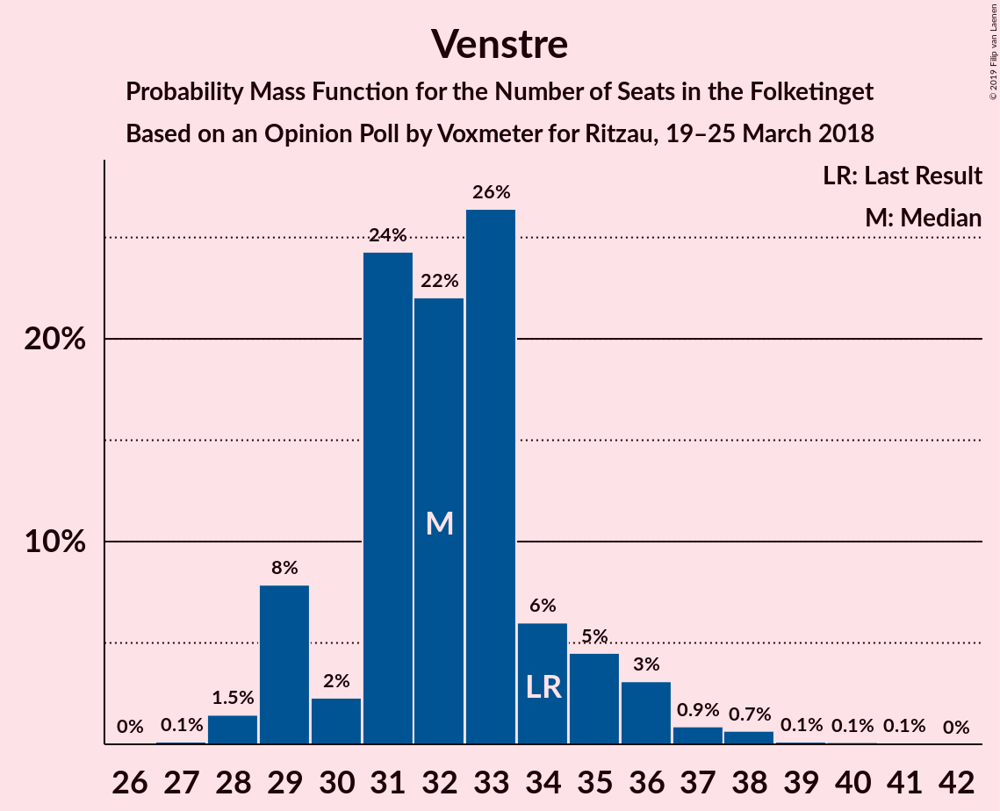

| Number of Seats | Probability | Accumulated | Special Marks |
|:---------------:|:-----------:|:-----------:|:-------------:|
| 27 | 0.1% | 100% |  |
| 28 | 1.5% | 99.8% |  |
| 29 | 8% | 98% |  |
| 30 | 2% | 91% |  |
| 31 | 24% | 88% |  |
| 32 | 22% | 64% | Median |
| 33 | 26% | 42% |  |
| 34 | 6% | 15% | Last Result |
| 35 | 5% | 9% |  |
| 36 | 3% | 5% |  |
| 37 | 0.9% | 2% |  |
| 38 | 0.7% | 1.0% |  |
| 39 | 0.1% | 0.3% |  |
| 40 | 0.1% | 0.2% |  |
| 41 | 0.1% | 0.1% |  |
| 42 | 0% | 0% |  |

### Dansk Folkeparti

*For a full overview of the results for this party, see the [Dansk Folkeparti](party-danskfolkeparti.html) page.*

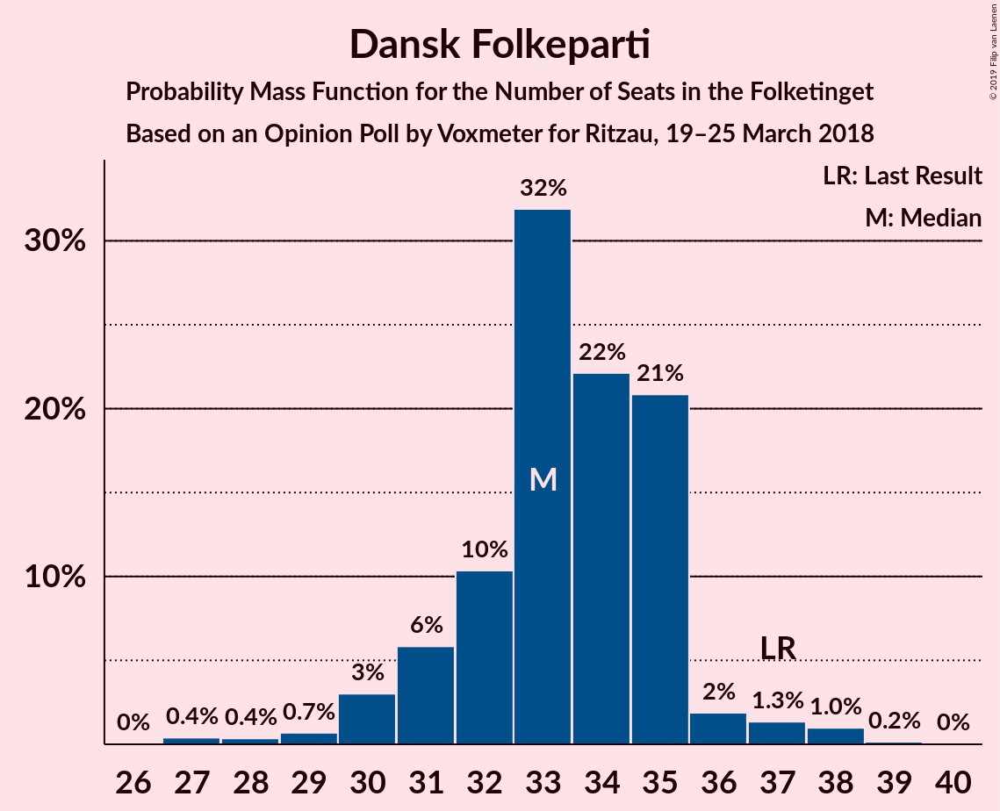

| Number of Seats | Probability | Accumulated | Special Marks |
|:---------------:|:-----------:|:-----------:|:-------------:|
| 27 | 0.4% | 100% |  |
| 28 | 0.4% | 99.6% |  |
| 29 | 0.7% | 99.2% |  |
| 30 | 3% | 98.5% |  |
| 31 | 6% | 96% |  |
| 32 | 10% | 90% |  |
| 33 | 32% | 79% | Median |
| 34 | 22% | 47% |  |
| 35 | 21% | 25% |  |
| 36 | 2% | 4% |  |
| 37 | 1.3% | 3% | Last Result |
| 38 | 1.0% | 1.2% |  |
| 39 | 0.2% | 0.2% |  |
| 40 | 0% | 0% |  |

### Enhedslisten–De Rød-Grønne

*For a full overview of the results for this party, see the [Enhedslisten–De Rød-Grønne](party-enhedslisten–derød-grønne.html) page.*

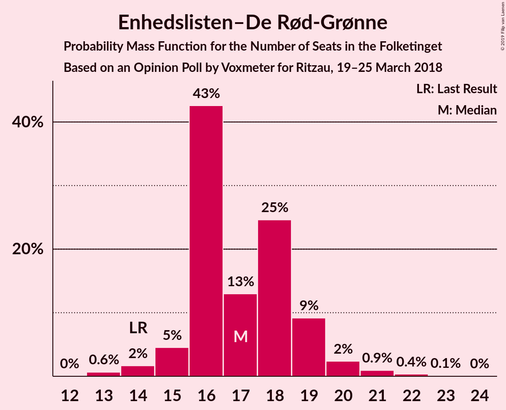

| Number of Seats | Probability | Accumulated | Special Marks |
|:---------------:|:-----------:|:-----------:|:-------------:|
| 13 | 0.6% | 100% |  |
| 14 | 2% | 99.3% | Last Result |
| 15 | 5% | 98% |  |
| 16 | 43% | 93% |  |
| 17 | 13% | 51% | Median |
| 18 | 25% | 38% |  |
| 19 | 9% | 13% |  |
| 20 | 2% | 4% |  |
| 21 | 0.9% | 1.4% |  |
| 22 | 0.4% | 0.5% |  |
| 23 | 0.1% | 0.1% |  |
| 24 | 0% | 0% |  |

### Liberal Alliance

*For a full overview of the results for this party, see the [Liberal Alliance](party-liberalalliance.html) page.*

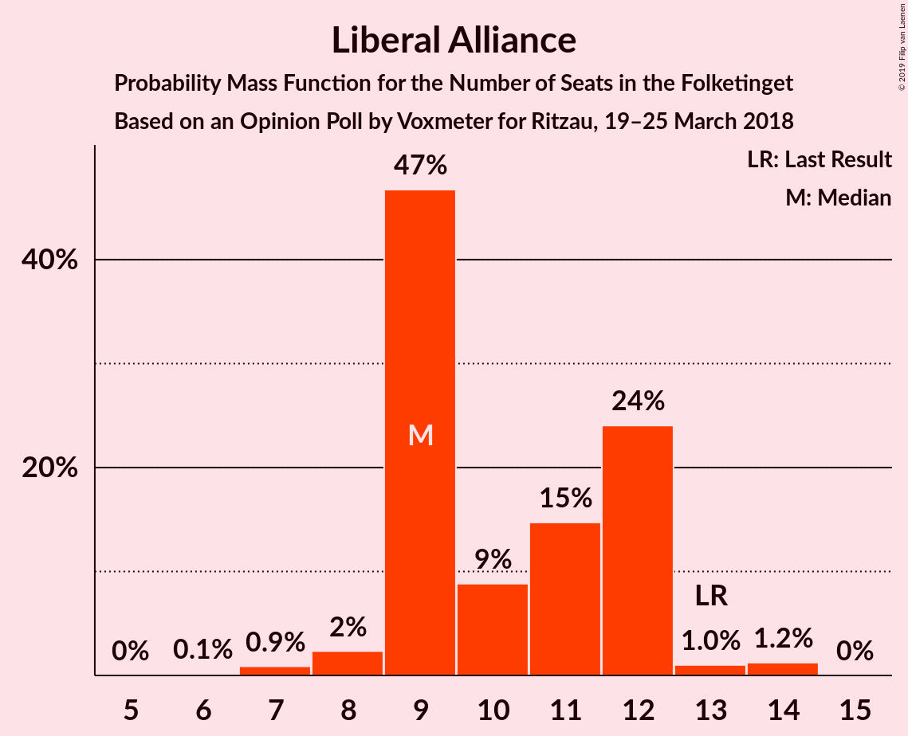

| Number of Seats | Probability | Accumulated | Special Marks |
|:---------------:|:-----------:|:-----------:|:-------------:|
| 6 | 0.1% | 100% |  |
| 7 | 0.9% | 99.9% |  |
| 8 | 2% | 99.0% |  |
| 9 | 47% | 97% | Median |
| 10 | 9% | 50% |  |
| 11 | 15% | 41% |  |
| 12 | 24% | 26% |  |
| 13 | 1.0% | 2% | Last Result |
| 14 | 1.2% | 1.3% |  |
| 15 | 0% | 0% |  |

### Socialistisk Folkeparti

*For a full overview of the results for this party, see the [Socialistisk Folkeparti](party-socialistiskfolkeparti.html) page.*

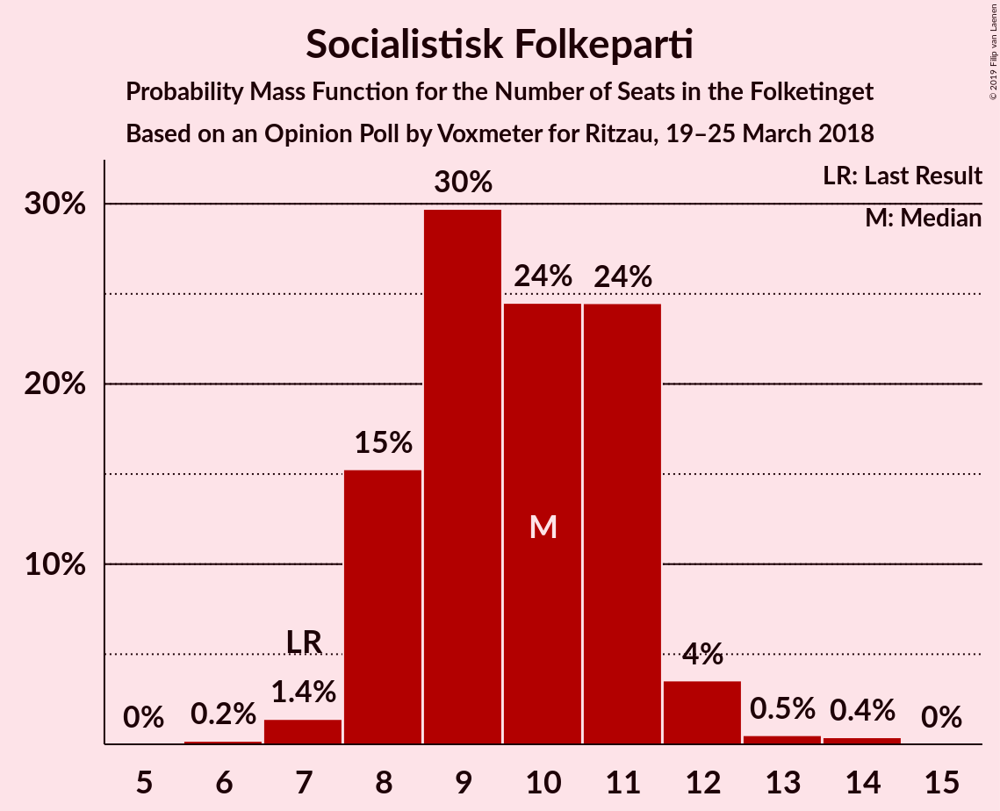

| Number of Seats | Probability | Accumulated | Special Marks |
|:---------------:|:-----------:|:-----------:|:-------------:|
| 6 | 0.2% | 100% |  |
| 7 | 1.4% | 99.8% | Last Result |
| 8 | 15% | 98% |  |
| 9 | 30% | 83% |  |
| 10 | 24% | 53% | Median |
| 11 | 24% | 29% |  |
| 12 | 4% | 4% |  |
| 13 | 0.5% | 0.9% |  |
| 14 | 0.4% | 0.4% |  |
| 15 | 0% | 0% |  |

### Radikale Venstre

*For a full overview of the results for this party, see the [Radikale Venstre](party-radikalevenstre.html) page.*

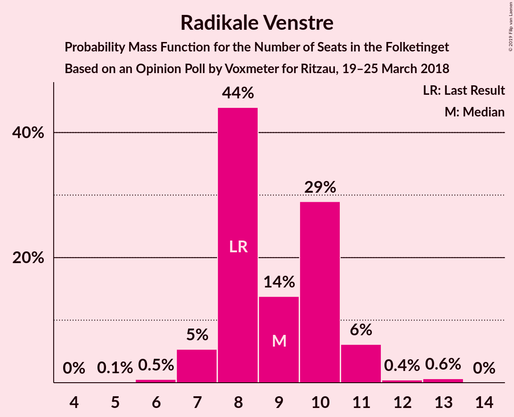

| Number of Seats | Probability | Accumulated | Special Marks |
|:---------------:|:-----------:|:-----------:|:-------------:|
| 5 | 0.1% | 100% |  |
| 6 | 0.5% | 99.9% |  |
| 7 | 5% | 99.4% |  |
| 8 | 44% | 94% | Last Result |
| 9 | 14% | 50% | Median |
| 10 | 29% | 36% |  |
| 11 | 6% | 7% |  |
| 12 | 0.4% | 1.1% |  |
| 13 | 0.6% | 0.7% |  |
| 14 | 0% | 0% |  |

### Alternativet

*For a full overview of the results for this party, see the [Alternativet](party-alternativet.html) page.*

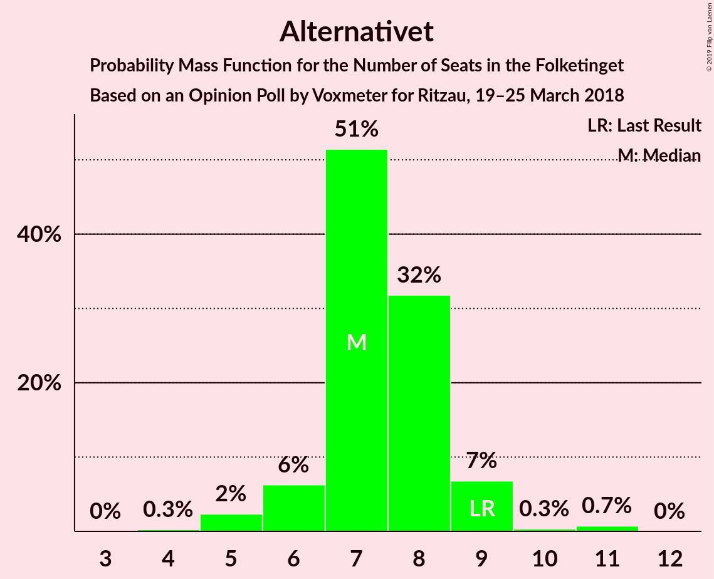

| Number of Seats | Probability | Accumulated | Special Marks |
|:---------------:|:-----------:|:-----------:|:-------------:|
| 4 | 0.3% | 100% |  |
| 5 | 2% | 99.7% |  |
| 6 | 6% | 97% |  |
| 7 | 51% | 91% | Median |
| 8 | 32% | 40% |  |
| 9 | 7% | 8% | Last Result |
| 10 | 0.3% | 1.1% |  |
| 11 | 0.7% | 0.8% |  |
| 12 | 0% | 0% |  |

### Det Konservative Folkeparti

*For a full overview of the results for this party, see the [Det Konservative Folkeparti](party-detkonservativefolkeparti.html) page.*

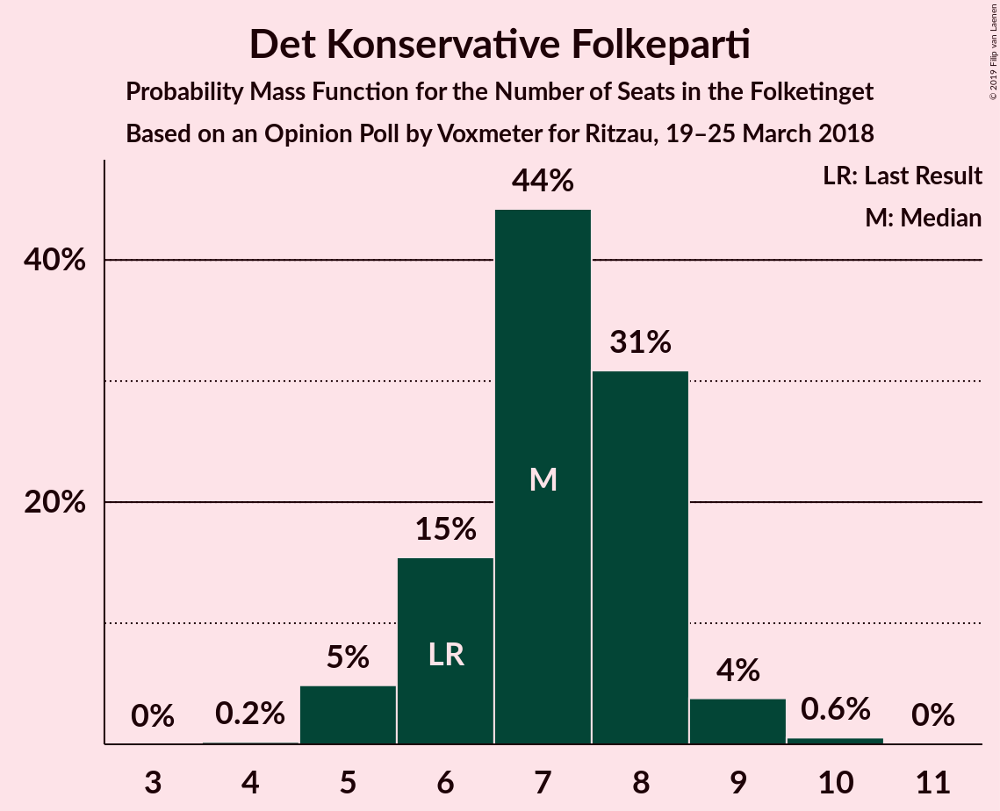

| Number of Seats | Probability | Accumulated | Special Marks |
|:---------------:|:-----------:|:-----------:|:-------------:|
| 4 | 0.2% | 100% |  |
| 5 | 5% | 99.8% |  |
| 6 | 15% | 95% | Last Result |
| 7 | 44% | 79% | Median |
| 8 | 31% | 35% |  |
| 9 | 4% | 4% |  |
| 10 | 0.6% | 0.6% |  |
| 11 | 0% | 0% |  |

### Nye Borgerlige

*For a full overview of the results for this party, see the [Nye Borgerlige](party-nyeborgerlige.html) page.*

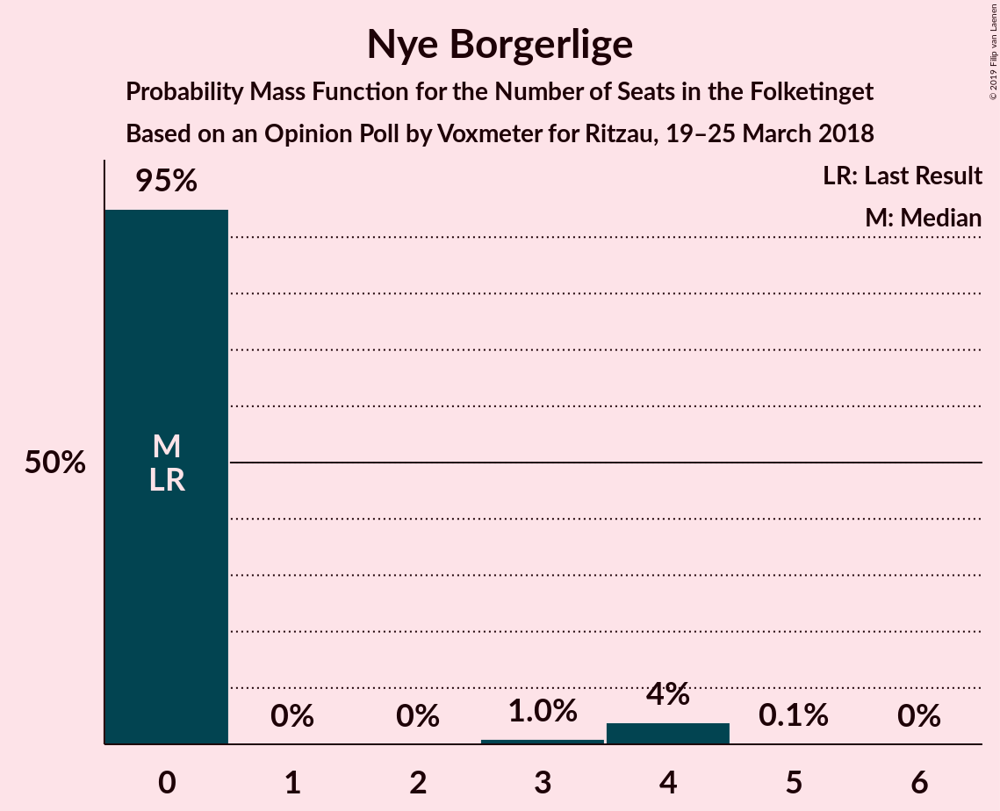

| Number of Seats | Probability | Accumulated | Special Marks |
|:---------------:|:-----------:|:-----------:|:-------------:|
| 0 | 95% | 100% | Last Result, Median |
| 1 | 0% | 5% |  |
| 2 | 0% | 5% |  |
| 3 | 1.0% | 5% |  |
| 4 | 4% | 4% |  |
| 5 | 0.1% | 0.1% |  |
| 6 | 0% | 0% |  |

### Kristendemokraterne

*For a full overview of the results for this party, see the [Kristendemokraterne](party-kristendemokraterne.html) page.*

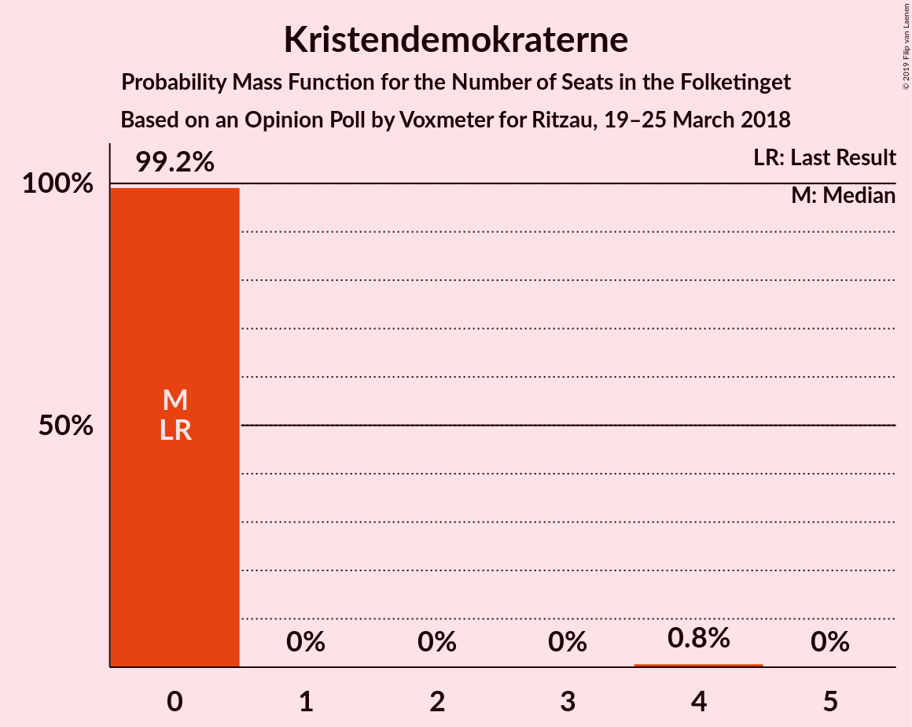

| Number of Seats | Probability | Accumulated | Special Marks |
|:---------------:|:-----------:|:-----------:|:-------------:|
| 0 | 99.2% | 100% | Last Result, Median |
| 1 | 0% | 0.8% |  |
| 2 | 0% | 0.8% |  |
| 3 | 0% | 0.8% |  |
| 4 | 0.8% | 0.8% |  |
| 5 | 0% | 0% |  |

## Coalitions

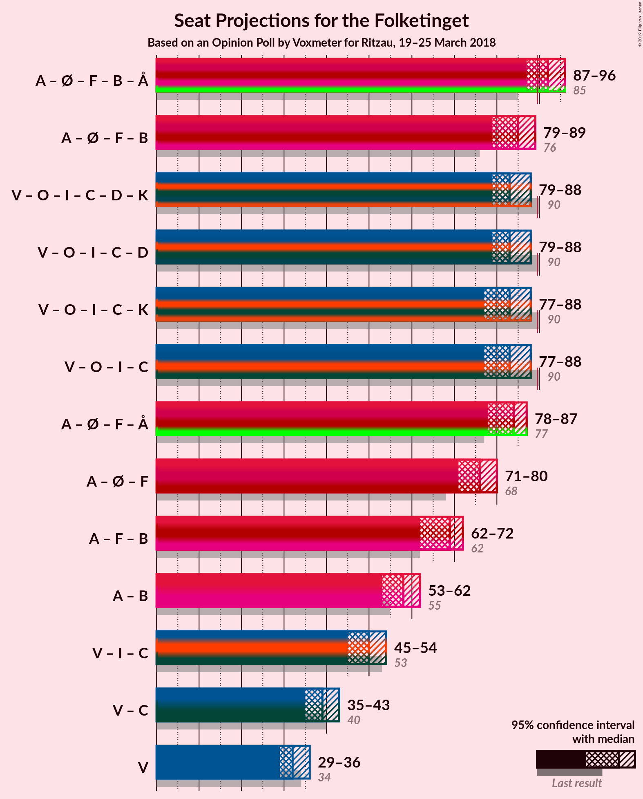

### Confidence Intervals

| Coalition | Last Result | Median | Majority? | 80% Confidence Interval | 90% Confidence Interval | 95% Confidence Interval | 99% Confidence Interval |
|:---------:|:-----------:|:------:|:---------:|:-----------------------:|:-----------------------:|:-----------------------:|:-----------------------:|
| Socialdemokraterne – Enhedslisten–De Rød-Grønne – Socialistisk Folkeparti – Radikale Venstre – Alternativet | 85 | 92 | 88% | 89–94 | 88–95 | 87–96 | 85–98 |
| Socialdemokraterne – Enhedslisten–De Rød-Grønne – Socialistisk Folkeparti – Radikale Venstre | 76 | 85 | 2% | 81–87 | 81–88 | 79–89 | 77–91 |
| Venstre – Dansk Folkeparti – Liberal Alliance – Det Konservative Folkeparti – Nye Borgerlige – Kristendemokraterne | 90 | 83 | 1.0% | 81–86 | 80–87 | 79–88 | 77–90 |
| Venstre – Dansk Folkeparti – Liberal Alliance – Det Konservative Folkeparti – Nye Borgerlige | 90 | 83 | 1.0% | 81–86 | 80–86 | 79–88 | 77–90 |
| Venstre – Dansk Folkeparti – Liberal Alliance – Det Konservative Folkeparti – Kristendemokraterne | 90 | 83 | 0.9% | 81–86 | 79–86 | 77–88 | 76–90 |
| Venstre – Dansk Folkeparti – Liberal Alliance – Det Konservative Folkeparti | 90 | 83 | 0.9% | 81–86 | 79–86 | 77–88 | 76–90 |
| Socialdemokraterne – Enhedslisten–De Rød-Grønne – Socialistisk Folkeparti – Alternativet | 77 | 84 | 0.9% | 81–85 | 80–86 | 78–87 | 77–90 |
| Socialdemokraterne – Enhedslisten–De Rød-Grønne – Socialistisk Folkeparti | 68 | 76 | 0% | 73–78 | 72–79 | 71–80 | 69–82 |
| Socialdemokraterne – Socialistisk Folkeparti – Radikale Venstre | 62 | 69 | 0% | 64–70 | 63–71 | 62–72 | 61–73 |
| Socialdemokraterne – Radikale Venstre | 55 | 58 | 0% | 55–60 | 53–61 | 53–62 | 52–63 |
| Venstre – Liberal Alliance – Det Konservative Folkeparti | 53 | 50 | 0% | 47–52 | 46–53 | 45–54 | 43–56 |
| Venstre – Det Konservative Folkeparti | 40 | 39 | 0% | 36–42 | 36–43 | 35–43 | 34–45 |
| Venstre | 34 | 32 | 0% | 30–34 | 29–35 | 29–36 | 28–38 |

### Socialdemokraterne – Enhedslisten–De Rød-Grønne – Socialistisk Folkeparti – Radikale Venstre – Alternativet

| Number of Seats | Probability | Accumulated | Special Marks |
|:---------------:|:-----------:|:-----------:|:-------------:|
| 83 | 0.1% | 100% |  |
| 84 | 0.1% | 99.9% |  |
| 85 | 0.7% | 99.8% | Last Result |
| 86 | 0.5% | 99.0% |  |
| 87 | 2% | 98% |  |
| 88 | 2% | 97% |  |
| 89 | 7% | 95% |  |
| 90 | 3% | 88% | Majority |
| 91 | 22% | 85% |  |
| 92 | 35% | 63% |  |
| 93 | 7% | 28% | Median |
| 94 | 12% | 20% |  |
| 95 | 4% | 8% |  |
| 96 | 3% | 4% |  |
| 97 | 0.4% | 2% |  |
| 98 | 1.1% | 1.3% |  |
| 99 | 0.1% | 0.2% |  |
| 100 | 0.1% | 0.1% |  |
| 101 | 0% | 0% |  |

### Socialdemokraterne – Enhedslisten–De Rød-Grønne – Socialistisk Folkeparti – Radikale Venstre

| Number of Seats | Probability | Accumulated | Special Marks |
|:---------------:|:-----------:|:-----------:|:-------------:|
| 76 | 0.1% | 100% | Last Result |
| 77 | 0.6% | 99.9% |  |
| 78 | 0.7% | 99.3% |  |
| 79 | 1.1% | 98.6% |  |
| 80 | 2% | 97% |  |
| 81 | 6% | 95% |  |
| 82 | 3% | 89% |  |
| 83 | 20% | 87% |  |
| 84 | 5% | 67% |  |
| 85 | 37% | 62% |  |
| 86 | 10% | 25% | Median |
| 87 | 8% | 15% |  |
| 88 | 3% | 7% |  |
| 89 | 2% | 5% |  |
| 90 | 2% | 2% | Majority |
| 91 | 0.5% | 0.7% |  |
| 92 | 0.1% | 0.2% |  |
| 93 | 0.1% | 0.1% |  |
| 94 | 0% | 0% |  |

### Venstre – Dansk Folkeparti – Liberal Alliance – Det Konservative Folkeparti – Nye Borgerlige – Kristendemokraterne

| Number of Seats | Probability | Accumulated | Special Marks |
|:---------------:|:-----------:|:-----------:|:-------------:|
| 75 | 0.1% | 100% |  |
| 76 | 0.1% | 99.9% |  |
| 77 | 1.1% | 99.8% |  |
| 78 | 0.4% | 98.7% |  |
| 79 | 3% | 98% |  |
| 80 | 4% | 96% |  |
| 81 | 12% | 92% | Median |
| 82 | 7% | 80% |  |
| 83 | 35% | 72% |  |
| 84 | 22% | 37% |  |
| 85 | 3% | 15% |  |
| 86 | 7% | 12% |  |
| 87 | 2% | 5% |  |
| 88 | 2% | 3% |  |
| 89 | 0.5% | 2% |  |
| 90 | 0.7% | 1.0% | Last Result, Majority |
| 91 | 0.1% | 0.2% |  |
| 92 | 0.1% | 0.1% |  |
| 93 | 0% | 0% |  |

### Venstre – Dansk Folkeparti – Liberal Alliance – Det Konservative Folkeparti – Nye Borgerlige

| Number of Seats | Probability | Accumulated | Special Marks |
|:---------------:|:-----------:|:-----------:|:-------------:|
| 74 | 0% | 100% |  |
| 75 | 0.1% | 99.9% |  |
| 76 | 0.1% | 99.9% |  |
| 77 | 1.1% | 99.8% |  |
| 78 | 0.5% | 98.7% |  |
| 79 | 3% | 98% |  |
| 80 | 4% | 96% |  |
| 81 | 12% | 92% | Median |
| 82 | 7% | 79% |  |
| 83 | 35% | 72% |  |
| 84 | 23% | 37% |  |
| 85 | 2% | 14% |  |
| 86 | 7% | 12% |  |
| 87 | 2% | 5% |  |
| 88 | 1.3% | 3% |  |
| 89 | 0.5% | 1.5% |  |
| 90 | 0.7% | 1.0% | Last Result, Majority |
| 91 | 0.1% | 0.2% |  |
| 92 | 0.1% | 0.1% |  |
| 93 | 0% | 0% |  |

### Venstre – Dansk Folkeparti – Liberal Alliance – Det Konservative Folkeparti – Kristendemokraterne

| Number of Seats | Probability | Accumulated | Special Marks |
|:---------------:|:-----------:|:-----------:|:-------------:|
| 74 | 0% | 100% |  |
| 75 | 0.1% | 99.9% |  |
| 76 | 2% | 99.9% |  |
| 77 | 1.1% | 98% |  |
| 78 | 0.6% | 97% |  |
| 79 | 3% | 96% |  |
| 80 | 3% | 93% |  |
| 81 | 12% | 90% | Median |
| 82 | 7% | 78% |  |
| 83 | 36% | 71% |  |
| 84 | 22% | 35% |  |
| 85 | 3% | 13% |  |
| 86 | 6% | 11% |  |
| 87 | 2% | 5% |  |
| 88 | 2% | 3% |  |
| 89 | 0.5% | 1.4% |  |
| 90 | 0.7% | 0.9% | Last Result, Majority |
| 91 | 0.1% | 0.2% |  |
| 92 | 0% | 0.1% |  |
| 93 | 0% | 0% |  |

### Venstre – Dansk Folkeparti – Liberal Alliance – Det Konservative Folkeparti

| Number of Seats | Probability | Accumulated | Special Marks |
|:---------------:|:-----------:|:-----------:|:-------------:|
| 74 | 0.1% | 100% |  |
| 75 | 0.1% | 99.9% |  |
| 76 | 2% | 99.9% |  |
| 77 | 1.1% | 98% |  |
| 78 | 0.6% | 97% |  |
| 79 | 3% | 96% |  |
| 80 | 3% | 93% |  |
| 81 | 12% | 90% | Median |
| 82 | 7% | 78% |  |
| 83 | 36% | 71% |  |
| 84 | 22% | 35% |  |
| 85 | 2% | 13% |  |
| 86 | 6% | 10% |  |
| 87 | 2% | 5% |  |
| 88 | 1.3% | 3% |  |
| 89 | 0.5% | 1.4% |  |
| 90 | 0.7% | 0.9% | Last Result, Majority |
| 91 | 0.1% | 0.1% |  |
| 92 | 0% | 0.1% |  |
| 93 | 0% | 0% |  |

### Socialdemokraterne – Enhedslisten–De Rød-Grønne – Socialistisk Folkeparti – Alternativet

| Number of Seats | Probability | Accumulated | Special Marks |
|:---------------:|:-----------:|:-----------:|:-------------:|
| 74 | 0.1% | 100% |  |
| 75 | 0.1% | 99.9% |  |
| 76 | 0.2% | 99.8% |  |
| 77 | 0.9% | 99.6% | Last Result |
| 78 | 2% | 98.7% |  |
| 79 | 2% | 97% |  |
| 80 | 3% | 95% |  |
| 81 | 22% | 92% |  |
| 82 | 10% | 70% |  |
| 83 | 4% | 60% |  |
| 84 | 40% | 56% | Median |
| 85 | 9% | 16% |  |
| 86 | 3% | 7% |  |
| 87 | 2% | 4% |  |
| 88 | 1.1% | 2% |  |
| 89 | 0.2% | 1.0% |  |
| 90 | 0.8% | 0.9% | Majority |
| 91 | 0.1% | 0.1% |  |
| 92 | 0% | 0% |  |

### Socialdemokraterne – Enhedslisten–De Rød-Grønne – Socialistisk Folkeparti

| Number of Seats | Probability | Accumulated | Special Marks |
|:---------------:|:-----------:|:-----------:|:-------------:|
| 67 | 0.1% | 100% |  |
| 68 | 0.1% | 99.9% | Last Result |
| 69 | 1.2% | 99.8% |  |
| 70 | 0.5% | 98.6% |  |
| 71 | 1.2% | 98% |  |
| 72 | 4% | 97% |  |
| 73 | 21% | 93% |  |
| 74 | 5% | 71% |  |
| 75 | 7% | 66% |  |
| 76 | 10% | 59% |  |
| 77 | 35% | 50% | Median |
| 78 | 8% | 15% |  |
| 79 | 2% | 6% |  |
| 80 | 3% | 5% |  |
| 81 | 0.7% | 2% |  |
| 82 | 1.3% | 1.5% |  |
| 83 | 0.1% | 0.2% |  |
| 84 | 0.1% | 0.1% |  |
| 85 | 0% | 0% |  |

### Socialdemokraterne – Socialistisk Folkeparti – Radikale Venstre

| Number of Seats | Probability | Accumulated | Special Marks |
|:---------------:|:-----------:|:-----------:|:-------------:|
| 59 | 0.1% | 100% |  |
| 60 | 0.1% | 99.9% |  |
| 61 | 0.8% | 99.7% |  |
| 62 | 2% | 98.9% | Last Result |
| 63 | 2% | 97% |  |
| 64 | 5% | 95% |  |
| 65 | 20% | 90% |  |
| 66 | 6% | 70% |  |
| 67 | 3% | 64% |  |
| 68 | 9% | 61% |  |
| 69 | 40% | 53% | Median |
| 70 | 7% | 13% |  |
| 71 | 2% | 6% |  |
| 72 | 1.2% | 4% |  |
| 73 | 2% | 2% |  |
| 74 | 0.2% | 0.4% |  |
| 75 | 0.1% | 0.1% |  |
| 76 | 0% | 0.1% |  |
| 77 | 0% | 0% |  |

### Socialdemokraterne – Radikale Venstre

| Number of Seats | Probability | Accumulated | Special Marks |
|:---------------:|:-----------:|:-----------:|:-------------:|
| 50 | 0.1% | 100% |  |
| 51 | 0.2% | 99.8% |  |
| 52 | 1.1% | 99.6% |  |
| 53 | 6% | 98.6% |  |
| 54 | 3% | 93% |  |
| 55 | 21% | 90% | Last Result |
| 56 | 3% | 69% |  |
| 57 | 3% | 67% |  |
| 58 | 16% | 64% |  |
| 59 | 8% | 48% | Median |
| 60 | 30% | 40% |  |
| 61 | 6% | 9% |  |
| 62 | 1.3% | 3% |  |
| 63 | 1.2% | 2% |  |
| 64 | 0.1% | 0.5% |  |
| 65 | 0.3% | 0.4% |  |
| 66 | 0% | 0.1% |  |
| 67 | 0% | 0% |  |

### Venstre – Liberal Alliance – Det Konservative Folkeparti

| Number of Seats | Probability | Accumulated | Special Marks |
|:---------------:|:-----------:|:-----------:|:-------------:|
| 42 | 0% | 100% |  |
| 43 | 0.5% | 99.9% |  |
| 44 | 0.6% | 99.5% |  |
| 45 | 2% | 98.9% |  |
| 46 | 3% | 97% |  |
| 47 | 5% | 93% |  |
| 48 | 20% | 88% | Median |
| 49 | 10% | 68% |  |
| 50 | 42% | 59% |  |
| 51 | 6% | 17% |  |
| 52 | 3% | 11% |  |
| 53 | 4% | 8% | Last Result |
| 54 | 2% | 4% |  |
| 55 | 0.7% | 1.4% |  |
| 56 | 0.6% | 0.8% |  |
| 57 | 0.1% | 0.2% |  |
| 58 | 0.1% | 0.1% |  |
| 59 | 0% | 0% |  |

### Venstre – Det Konservative Folkeparti

| Number of Seats | Probability | Accumulated | Special Marks |
|:---------------:|:-----------:|:-----------:|:-------------:|
| 33 | 0.1% | 100% |  |
| 34 | 1.1% | 99.9% |  |
| 35 | 2% | 98.8% |  |
| 36 | 7% | 97% |  |
| 37 | 3% | 90% |  |
| 38 | 24% | 87% |  |
| 39 | 22% | 63% | Median |
| 40 | 9% | 41% | Last Result |
| 41 | 22% | 33% |  |
| 42 | 4% | 11% |  |
| 43 | 5% | 7% |  |
| 44 | 1.0% | 2% |  |
| 45 | 0.4% | 0.8% |  |
| 46 | 0.2% | 0.4% |  |
| 47 | 0.1% | 0.1% |  |
| 48 | 0% | 0% |  |

### Venstre

| Number of Seats | Probability | Accumulated | Special Marks |
|:---------------:|:-----------:|:-----------:|:-------------:|
| 27 | 0.1% | 100% |  |
| 28 | 1.5% | 99.8% |  |
| 29 | 8% | 98% |  |
| 30 | 2% | 91% |  |
| 31 | 24% | 88% |  |
| 32 | 22% | 64% | Median |
| 33 | 26% | 42% |  |
| 34 | 6% | 15% | Last Result |
| 35 | 5% | 9% |  |
| 36 | 3% | 5% |  |
| 37 | 0.9% | 2% |  |
| 38 | 0.7% | 1.0% |  |
| 39 | 0.1% | 0.3% |  |
| 40 | 0.1% | 0.2% |  |
| 41 | 0.1% | 0.1% |  |
| 42 | 0% | 0% |  |

## Technical Information

### Opinion Poll

+ **Polling firm:** Voxmeter
+ **Commissioner(s):** Ritzau
+ **Fieldwork period:** 19–25 March 2018

### Calculations

+ **Sample size:** 1022
+ **Simulations done:** 1,048,576
+ **Error estimate:** 4.08%

