# Opinion Poll by Voxmeter for Ritzau, 26–31 March 2018

<a href="#voting-intentions">Voting Intentions</a> | <a href="#seats">Seats</a> | <a href="#coalitions">Coalitions</a> | <a href="#technical-information">Technical Information</a>

## Voting Intentions

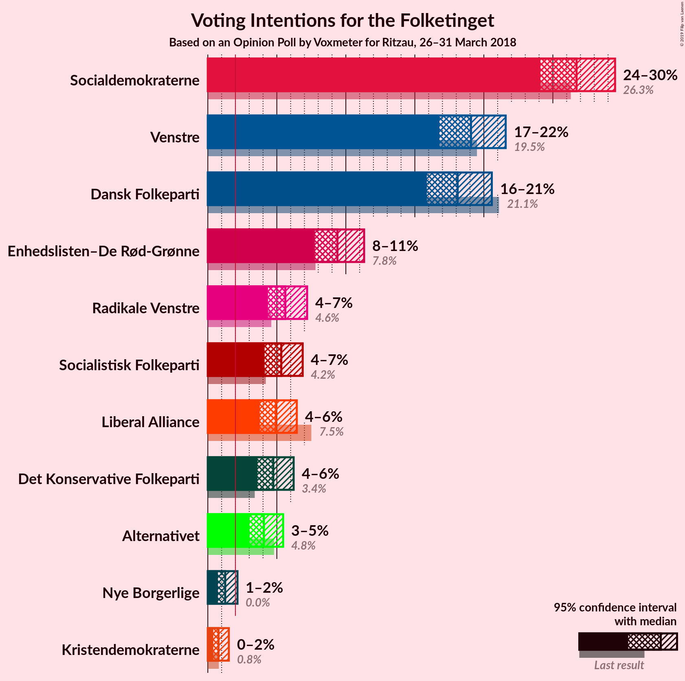

### Confidence Intervals

| Party | Last Result | Poll Result | 80% Confidence Interval | 90% Confidence Interval | 95% Confidence Interval | 99% Confidence Interval |
|:-----:|:-----------:|:-----------:|:-----------------------:|:-----------------------:|:-----------------------:|:-----------------------:|
| Socialdemokraterne | 26.3% | 26.7% | 25.0–28.5% |24.5–29.1% |24.1–29.5% |23.3–30.4% |
| Venstre | 19.5% | 19.1% | 17.6–20.7% |17.1–21.2% |16.8–21.6% |16.1–22.4% |
| Dansk Folkeparti | 21.1% | 18.1% | 16.6–19.7% |16.2–20.2% |15.9–20.6% |15.2–21.4% |
| Enhedslisten–De Rød-Grønne | 7.8% | 9.4% | 8.3–10.7% |8.0–11.0% |7.8–11.3% |7.3–12.0% |
| Radikale Venstre | 4.6% | 5.6% | 4.8–6.6% |4.6–6.9% |4.4–7.2% |4.0–7.7% |
| Socialistisk Folkeparti | 4.2% | 5.3% | 4.5–6.3% |4.3–6.6% |4.1–6.9% |3.7–7.4% |
| Liberal Alliance | 7.5% | 4.9% | 4.2–5.9% |3.9–6.2% |3.8–6.4% |3.4–6.9% |
| Det Konservative Folkeparti | 3.4% | 4.7% | 4.0–5.7% |3.8–6.0% |3.6–6.2% |3.3–6.7% |
| Alternativet | 4.8% | 4.1% | 3.4–5.0% |3.2–5.2% |3.0–5.5% |2.7–5.9% |
| Nye Borgerlige | 0.0% | 1.3% | 0.9–1.8% |0.8–2.0% |0.7–2.1% |0.6–2.5% |
| Kristendemokraterne | 0.8% | 0.8% | 0.5–1.3% |0.4–1.4% |0.4–1.5% |0.3–1.8% |

*Note:* The poll result column reflects the actual value used in the calculations. Published results may vary slightly, and in addition be rounded to fewer digits.

## Seats

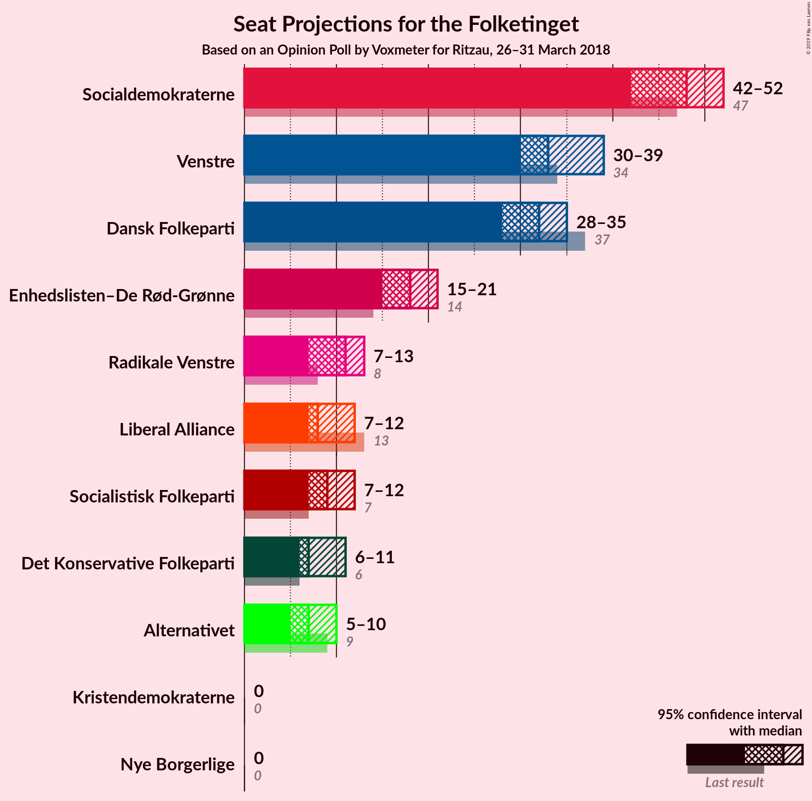

### Confidence Intervals

| Party | Last Result | Median | 80% Confidence Interval | 90% Confidence Interval | 95% Confidence Interval | 99% Confidence Interval |
|:-----:|:-----------:|:------:|:-----------------------:|:-----------------------:|:-----------------------:|:-----------------------:|
| <a href="#socialdemokraterne">Socialdemokraterne</a> | 47 | 48 | 44–51 |42–52 |42–52 |42–52 |
| <a href="#venstre">Venstre</a> | 34 | 33 | 31–38 |31–38 |30–39 |29–39 |
| <a href="#dansk-folkeparti">Dansk Folkeparti</a> | 37 | 32 | 31–34 |29–35 |28–35 |27–36 |
| <a href="#enhedslisten–de-rød-grønne">Enhedslisten–De Rød-Grønne</a> | 14 | 18 | 15–19 |15–20 |15–21 |14–21 |
| <a href="#radikale-venstre">Radikale Venstre</a> | 8 | 11 | 8–13 |8–13 |7–13 |7–14 |
| <a href="#socialistisk-folkeparti">Socialistisk Folkeparti</a> | 7 | 9 | 8–12 |8–12 |7–12 |7–13 |
| <a href="#liberal-alliance">Liberal Alliance</a> | 13 | 8 | 7–10 |7–12 |7–12 |6–13 |
| <a href="#det-konservative-folkeparti">Det Konservative Folkeparti</a> | 6 | 7 | 6–10 |6–11 |6–11 |6–12 |
| <a href="#alternativet">Alternativet</a> | 9 | 7 | 6–9 |6–9 |5–10 |5–10 |
| <a href="#nye-borgerlige">Nye Borgerlige</a> | 0 | 0 | 0 |0 |0 |0–4 |
| <a href="#kristendemokraterne">Kristendemokraterne</a> | 0 | 0 | 0 |0 |0 |0 |

### Socialdemokraterne

*For a full overview of the results for this party, see the [Socialdemokraterne](party-socialdemokraterne.html) page.*

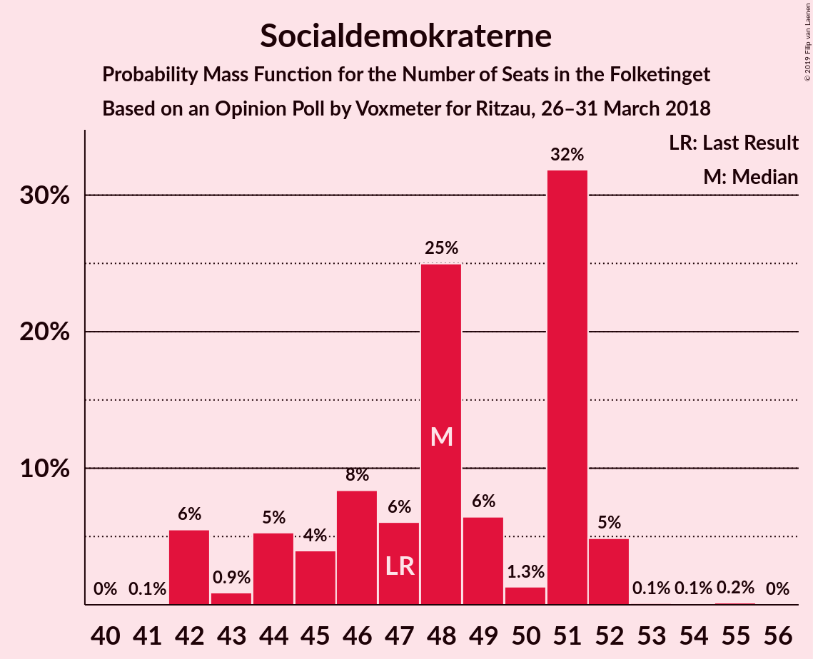

| Number of Seats | Probability | Accumulated | Special Marks |
|:---------------:|:-----------:|:-----------:|:-------------:|
| 41 | 0.1% | 100% |  |
| 42 | 6% | 99.9% |  |
| 43 | 0.9% | 94% |  |
| 44 | 5% | 94% |  |
| 45 | 4% | 88% |  |
| 46 | 8% | 84% |  |
| 47 | 6% | 76% | Last Result |
| 48 | 25% | 70% | Median |
| 49 | 6% | 45% |  |
| 50 | 1.3% | 38% |  |
| 51 | 32% | 37% |  |
| 52 | 5% | 5% |  |
| 53 | 0.1% | 0.3% |  |
| 54 | 0.1% | 0.2% |  |
| 55 | 0.2% | 0.2% |  |
| 56 | 0% | 0% |  |

### Venstre

*For a full overview of the results for this party, see the [Venstre](party-venstre.html) page.*

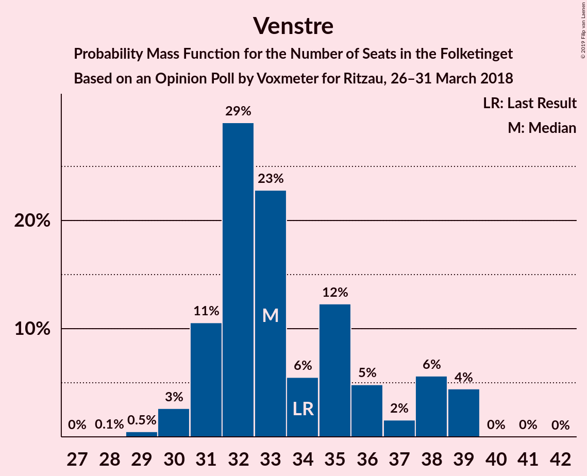

| Number of Seats | Probability | Accumulated | Special Marks |
|:---------------:|:-----------:|:-----------:|:-------------:|
| 27 | 0% | 100% |  |
| 28 | 0.1% | 99.9% |  |
| 29 | 0.5% | 99.9% |  |
| 30 | 3% | 99.4% |  |
| 31 | 11% | 97% |  |
| 32 | 29% | 86% |  |
| 33 | 23% | 57% | Median |
| 34 | 6% | 34% | Last Result |
| 35 | 12% | 29% |  |
| 36 | 5% | 17% |  |
| 37 | 2% | 12% |  |
| 38 | 6% | 10% |  |
| 39 | 4% | 5% |  |
| 40 | 0% | 0.1% |  |
| 41 | 0% | 0.1% |  |
| 42 | 0% | 0% |  |

### Dansk Folkeparti

*For a full overview of the results for this party, see the [Dansk Folkeparti](party-danskfolkeparti.html) page.*

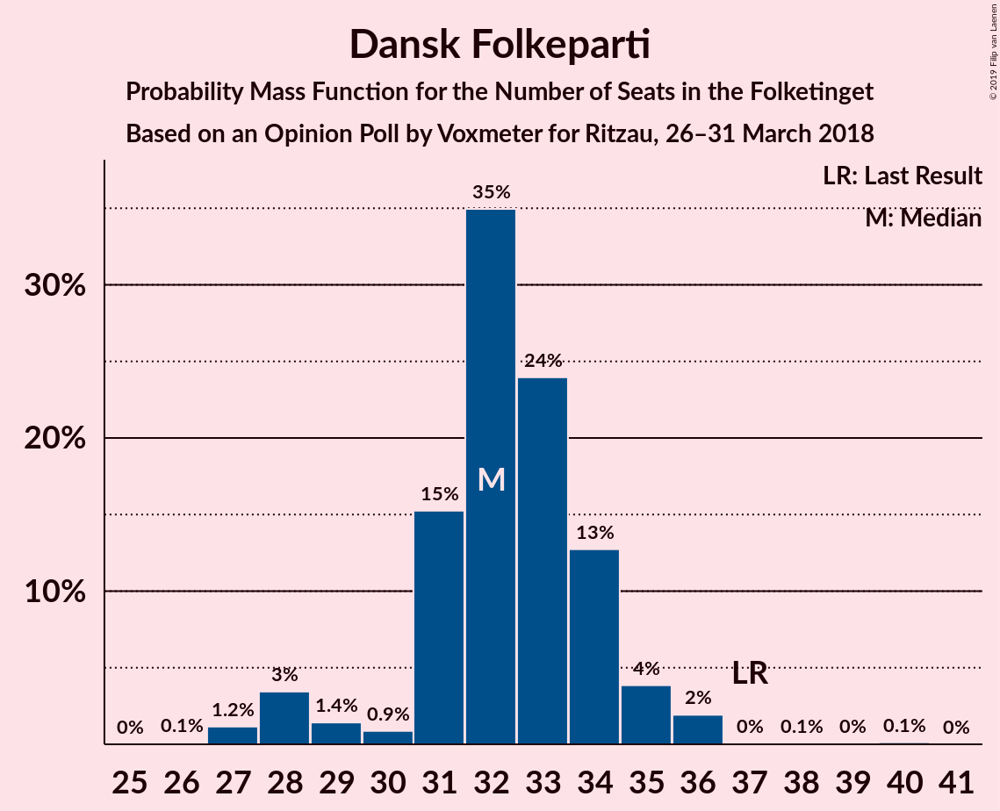

| Number of Seats | Probability | Accumulated | Special Marks |
|:---------------:|:-----------:|:-----------:|:-------------:|
| 26 | 0.1% | 100% |  |
| 27 | 1.2% | 99.9% |  |
| 28 | 3% | 98.7% |  |
| 29 | 1.4% | 95% |  |
| 30 | 0.9% | 94% |  |
| 31 | 15% | 93% |  |
| 32 | 35% | 78% | Median |
| 33 | 24% | 43% |  |
| 34 | 13% | 19% |  |
| 35 | 4% | 6% |  |
| 36 | 2% | 2% |  |
| 37 | 0% | 0.3% | Last Result |
| 38 | 0.1% | 0.2% |  |
| 39 | 0% | 0.2% |  |
| 40 | 0.1% | 0.1% |  |
| 41 | 0% | 0% |  |

### Enhedslisten–De Rød-Grønne

*For a full overview of the results for this party, see the [Enhedslisten–De Rød-Grønne](party-enhedslisten–derød-grønne.html) page.*

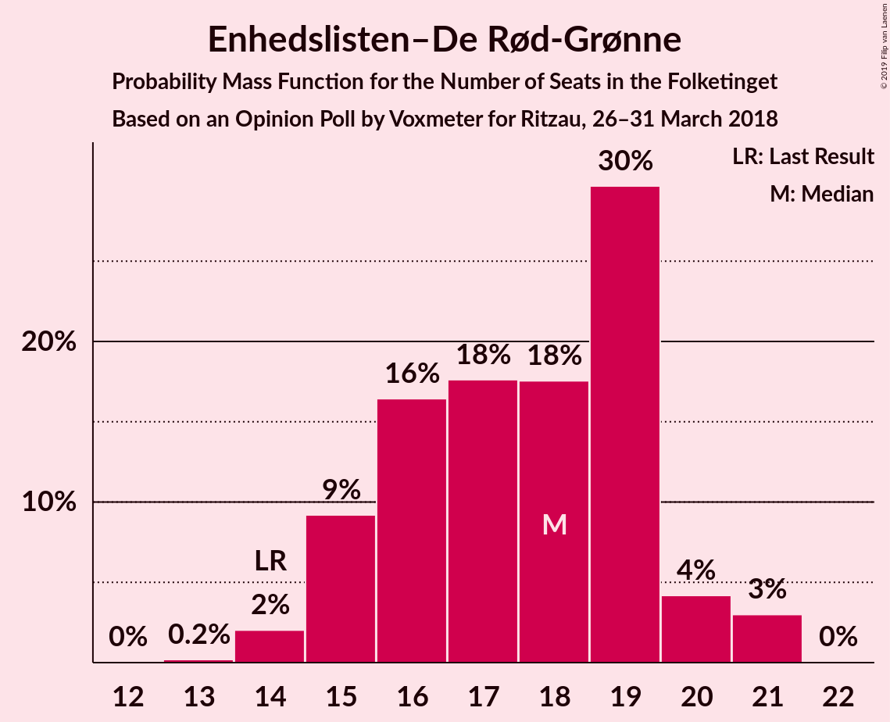

| Number of Seats | Probability | Accumulated | Special Marks |
|:---------------:|:-----------:|:-----------:|:-------------:|
| 12 | 0% | 100% |  |
| 13 | 0.2% | 99.9% |  |
| 14 | 2% | 99.7% | Last Result |
| 15 | 9% | 98% |  |
| 16 | 16% | 89% |  |
| 17 | 18% | 72% |  |
| 18 | 18% | 54% | Median |
| 19 | 30% | 37% |  |
| 20 | 4% | 7% |  |
| 21 | 3% | 3% |  |
| 22 | 0% | 0% |  |

### Radikale Venstre

*For a full overview of the results for this party, see the [Radikale Venstre](party-radikalevenstre.html) page.*

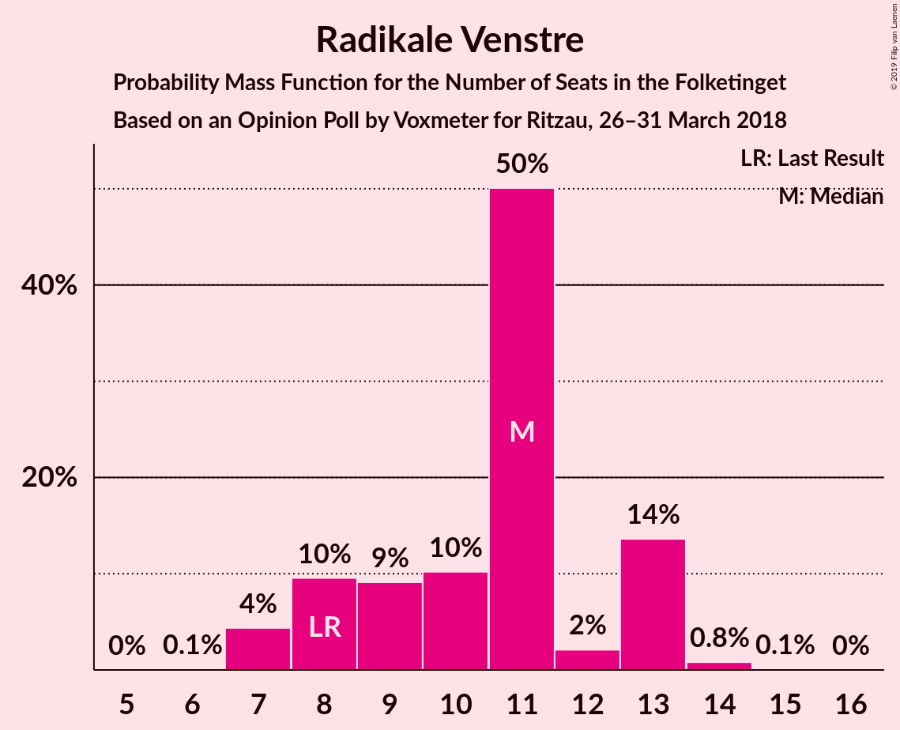

| Number of Seats | Probability | Accumulated | Special Marks |
|:---------------:|:-----------:|:-----------:|:-------------:|
| 6 | 0.1% | 100% |  |
| 7 | 4% | 99.9% |  |
| 8 | 10% | 96% | Last Result |
| 9 | 9% | 86% |  |
| 10 | 10% | 77% |  |
| 11 | 50% | 67% | Median |
| 12 | 2% | 17% |  |
| 13 | 14% | 15% |  |
| 14 | 0.8% | 0.9% |  |
| 15 | 0.1% | 0.1% |  |
| 16 | 0% | 0% |  |

### Socialistisk Folkeparti

*For a full overview of the results for this party, see the [Socialistisk Folkeparti](party-socialistiskfolkeparti.html) page.*

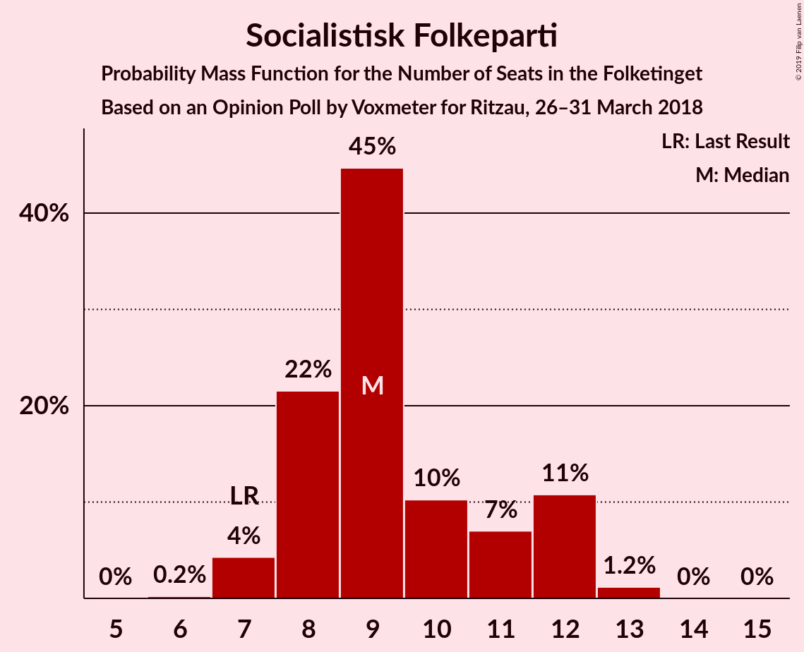

| Number of Seats | Probability | Accumulated | Special Marks |
|:---------------:|:-----------:|:-----------:|:-------------:|
| 6 | 0.2% | 100% |  |
| 7 | 4% | 99.8% | Last Result |
| 8 | 22% | 96% |  |
| 9 | 45% | 74% | Median |
| 10 | 10% | 29% |  |
| 11 | 7% | 19% |  |
| 12 | 11% | 12% |  |
| 13 | 1.2% | 1.2% |  |
| 14 | 0% | 0.1% |  |
| 15 | 0% | 0% |  |

### Liberal Alliance

*For a full overview of the results for this party, see the [Liberal Alliance](party-liberalalliance.html) page.*

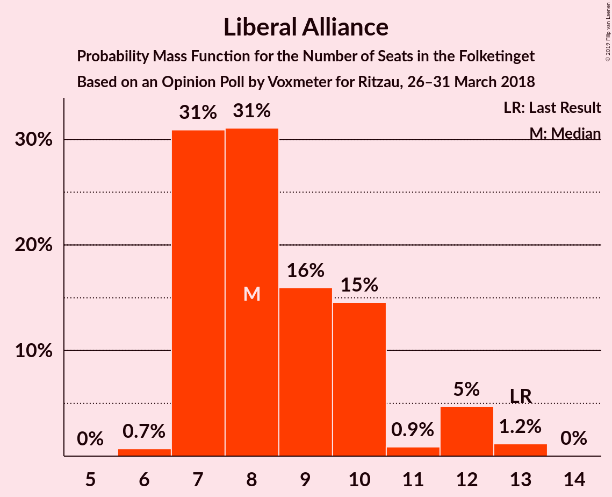

| Number of Seats | Probability | Accumulated | Special Marks |
|:---------------:|:-----------:|:-----------:|:-------------:|
| 6 | 0.7% | 100% |  |
| 7 | 31% | 99.3% |  |
| 8 | 31% | 68% | Median |
| 9 | 16% | 37% |  |
| 10 | 15% | 21% |  |
| 11 | 0.9% | 7% |  |
| 12 | 5% | 6% |  |
| 13 | 1.2% | 1.2% | Last Result |
| 14 | 0% | 0% |  |

### Det Konservative Folkeparti

*For a full overview of the results for this party, see the [Det Konservative Folkeparti](party-detkonservativefolkeparti.html) page.*

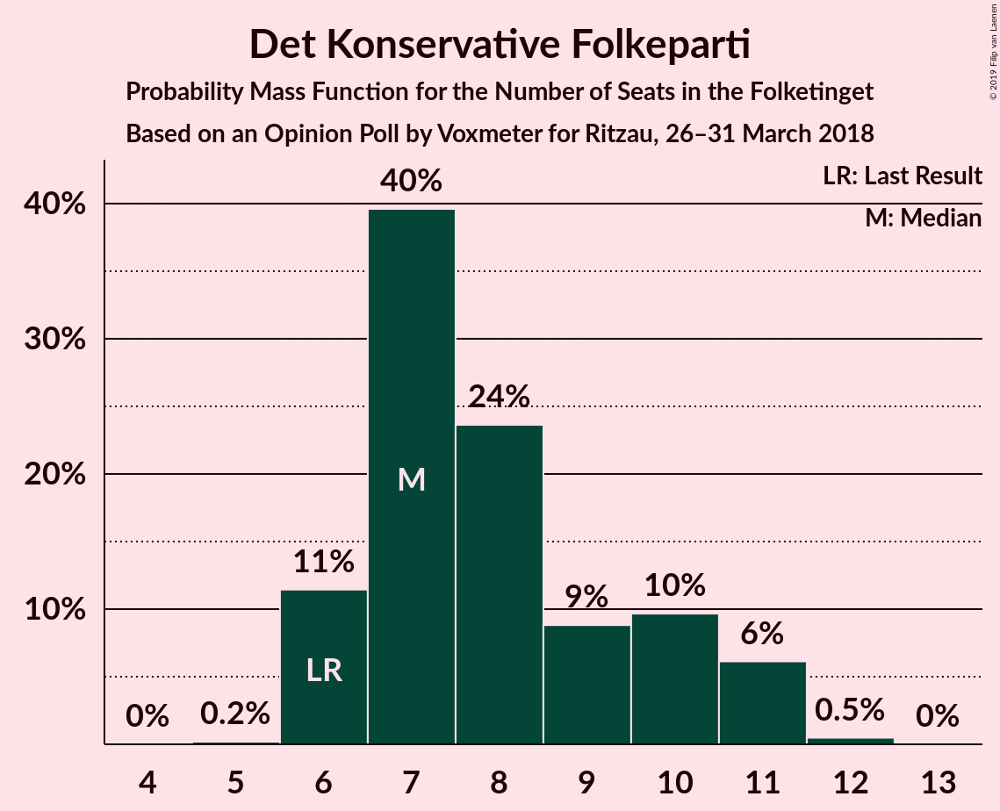

| Number of Seats | Probability | Accumulated | Special Marks |
|:---------------:|:-----------:|:-----------:|:-------------:|
| 5 | 0.2% | 100% |  |
| 6 | 11% | 99.8% | Last Result |
| 7 | 40% | 88% | Median |
| 8 | 24% | 49% |  |
| 9 | 9% | 25% |  |
| 10 | 10% | 16% |  |
| 11 | 6% | 7% |  |
| 12 | 0.5% | 0.5% |  |
| 13 | 0% | 0% |  |

### Alternativet

*For a full overview of the results for this party, see the [Alternativet](party-alternativet.html) page.*

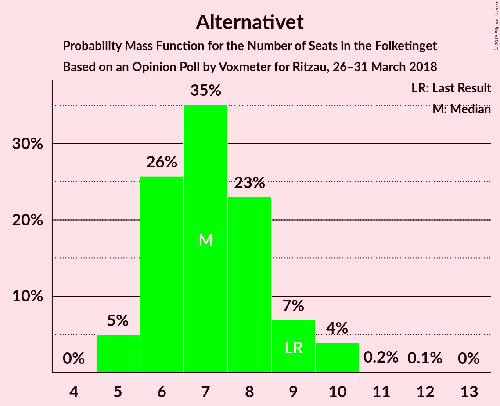

| Number of Seats | Probability | Accumulated | Special Marks |
|:---------------:|:-----------:|:-----------:|:-------------:|
| 5 | 5% | 100% |  |
| 6 | 26% | 95% |  |
| 7 | 35% | 69% | Median |
| 8 | 23% | 34% |  |
| 9 | 7% | 11% | Last Result |
| 10 | 4% | 4% |  |
| 11 | 0.2% | 0.2% |  |
| 12 | 0.1% | 0.1% |  |
| 13 | 0% | 0% |  |

### Nye Borgerlige

*For a full overview of the results for this party, see the [Nye Borgerlige](party-nyeborgerlige.html) page.*

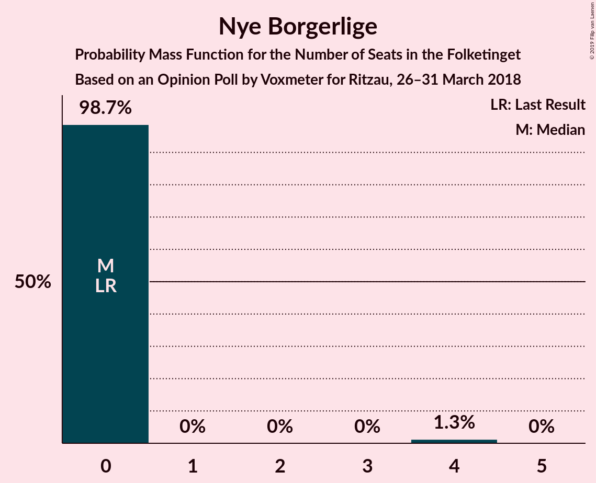

| Number of Seats | Probability | Accumulated | Special Marks |
|:---------------:|:-----------:|:-----------:|:-------------:|
| 0 | 98.7% | 100% | Last Result, Median |
| 1 | 0% | 1.3% |  |
| 2 | 0% | 1.3% |  |
| 3 | 0% | 1.3% |  |
| 4 | 1.3% | 1.3% |  |
| 5 | 0% | 0% |  |

### Kristendemokraterne

*For a full overview of the results for this party, see the [Kristendemokraterne](party-kristendemokraterne.html) page.*

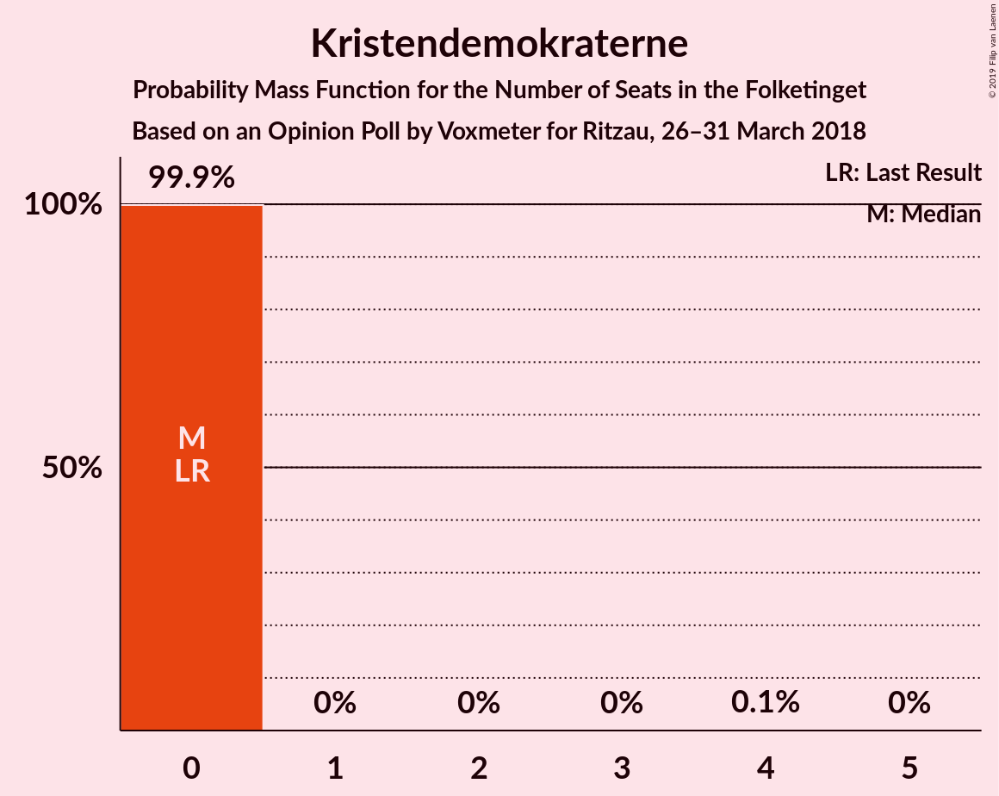

| Number of Seats | Probability | Accumulated | Special Marks |
|:---------------:|:-----------:|:-----------:|:-------------:|
| 0 | 99.9% | 100% | Last Result, Median |
| 1 | 0% | 0.1% |  |
| 2 | 0% | 0.1% |  |
| 3 | 0% | 0.1% |  |
| 4 | 0.1% | 0.1% |  |
| 5 | 0% | 0% |  |

## Coalitions

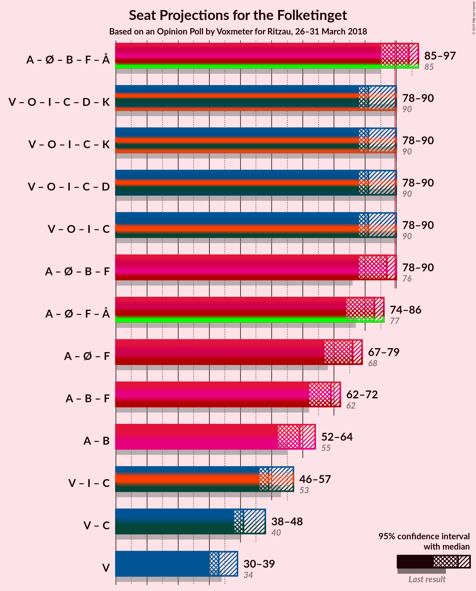

### Confidence Intervals

| Coalition | Last Result | Median | Majority? | 80% Confidence Interval | 90% Confidence Interval | 95% Confidence Interval | 99% Confidence Interval |
|:---------:|:-----------:|:------:|:---------:|:-----------------------:|:-----------------------:|:-----------------------:|:-----------------------:|
| Socialdemokraterne – Enhedslisten–De Rød-Grønne – Radikale Venstre – Socialistisk Folkeparti – Alternativet | 85 | 94 | 84% | 87–97 | 85–97 | 85–97 | 83–98 |
| Venstre – Dansk Folkeparti – Liberal Alliance – Det Konservative Folkeparti – Nye Borgerlige – Kristendemokraterne | 90 | 81 | 7% | 78–88 | 78–90 | 78–90 | 77–92 |
| Venstre – Dansk Folkeparti – Liberal Alliance – Det Konservative Folkeparti – Kristendemokraterne | 90 | 81 | 7% | 78–88 | 78–90 | 78–90 | 77–92 |
| Venstre – Dansk Folkeparti – Liberal Alliance – Det Konservative Folkeparti – Nye Borgerlige | 90 | 81 | 7% | 78–88 | 78–90 | 78–90 | 77–92 |
| Venstre – Dansk Folkeparti – Liberal Alliance – Det Konservative Folkeparti | 90 | 81 | 7% | 78–87 | 78–90 | 78–90 | 77–92 |
| Socialdemokraterne – Enhedslisten–De Rød-Grønne – Radikale Venstre – Socialistisk Folkeparti | 76 | 87 | 28% | 80–90 | 79–90 | 78–90 | 77–90 |
| Socialdemokraterne – Enhedslisten–De Rød-Grønne – Socialistisk Folkeparti – Alternativet | 77 | 83 | 0.1% | 77–86 | 75–86 | 74–86 | 72–87 |
| Socialdemokraterne – Enhedslisten–De Rød-Grønne – Socialistisk Folkeparti | 68 | 76 | 0% | 71–79 | 69–79 | 67–79 | 66–80 |
| Socialdemokraterne – Radikale Venstre – Socialistisk Folkeparti | 62 | 69 | 0% | 63–71 | 62–72 | 62–72 | 61–73 |
| Socialdemokraterne – Radikale Venstre | 55 | 59 | 0% | 54–62 | 53–64 | 52–64 | 51–64 |
| Venstre – Liberal Alliance – Det Konservative Folkeparti | 53 | 49 | 0% | 46–56 | 46–56 | 46–57 | 45–58 |
| Venstre – Det Konservative Folkeparti | 40 | 41 | 0% | 39–46 | 38–46 | 38–48 | 36–49 |
| Venstre | 34 | 33 | 0% | 31–38 | 31–38 | 30–39 | 29–39 |

### Socialdemokraterne – Enhedslisten–De Rød-Grønne – Radikale Venstre – Socialistisk Folkeparti – Alternativet

| Number of Seats | Probability | Accumulated | Special Marks |
|:---------------:|:-----------:|:-----------:|:-------------:|
| 83 | 0.7% | 100% |  |
| 84 | 0.1% | 99.3% |  |
| 85 | 7% | 99.2% | Last Result |
| 86 | 3% | 93% |  |
| 87 | 0.2% | 90% |  |
| 88 | 3% | 90% |  |
| 89 | 4% | 87% |  |
| 90 | 11% | 84% | Majority |
| 91 | 10% | 73% |  |
| 92 | 5% | 63% |  |
| 93 | 5% | 57% | Median |
| 94 | 9% | 52% |  |
| 95 | 9% | 43% |  |
| 96 | 6% | 34% |  |
| 97 | 27% | 28% |  |
| 98 | 1.0% | 1.1% |  |
| 99 | 0% | 0.1% |  |
| 100 | 0.1% | 0.1% |  |
| 101 | 0% | 0% |  |

### Venstre – Dansk Folkeparti – Liberal Alliance – Det Konservative Folkeparti – Nye Borgerlige – Kristendemokraterne

| Number of Seats | Probability | Accumulated | Special Marks |
|:---------------:|:-----------:|:-----------:|:-------------:|
| 75 | 0.1% | 100% |  |
| 76 | 0% | 99.9% |  |
| 77 | 1.0% | 99.9% |  |
| 78 | 27% | 98.9% |  |
| 79 | 6% | 72% |  |
| 80 | 9% | 66% | Median |
| 81 | 9% | 57% |  |
| 82 | 5% | 48% |  |
| 83 | 5% | 43% |  |
| 84 | 10% | 37% |  |
| 85 | 11% | 27% |  |
| 86 | 4% | 16% |  |
| 87 | 3% | 13% |  |
| 88 | 0.2% | 10% |  |
| 89 | 3% | 10% |  |
| 90 | 7% | 7% | Last Result, Majority |
| 91 | 0.1% | 0.8% |  |
| 92 | 0.7% | 0.7% |  |
| 93 | 0% | 0% |  |

### Venstre – Dansk Folkeparti – Liberal Alliance – Det Konservative Folkeparti – Kristendemokraterne

| Number of Seats | Probability | Accumulated | Special Marks |
|:---------------:|:-----------:|:-----------:|:-------------:|
| 75 | 0.1% | 100% |  |
| 76 | 0.1% | 99.9% |  |
| 77 | 1.0% | 99.8% |  |
| 78 | 27% | 98.8% |  |
| 79 | 6% | 72% |  |
| 80 | 9% | 66% | Median |
| 81 | 10% | 57% |  |
| 82 | 5% | 47% |  |
| 83 | 6% | 42% |  |
| 84 | 10% | 36% |  |
| 85 | 11% | 26% |  |
| 86 | 4% | 16% |  |
| 87 | 2% | 12% |  |
| 88 | 0.1% | 10% |  |
| 89 | 2% | 10% |  |
| 90 | 7% | 7% | Last Result, Majority |
| 91 | 0.1% | 0.8% |  |
| 92 | 0.7% | 0.7% |  |
| 93 | 0% | 0% |  |

### Venstre – Dansk Folkeparti – Liberal Alliance – Det Konservative Folkeparti – Nye Borgerlige

| Number of Seats | Probability | Accumulated | Special Marks |
|:---------------:|:-----------:|:-----------:|:-------------:|
| 75 | 0.1% | 100% |  |
| 76 | 0% | 99.9% |  |
| 77 | 1.0% | 99.9% |  |
| 78 | 27% | 98.9% |  |
| 79 | 6% | 72% |  |
| 80 | 9% | 66% | Median |
| 81 | 9% | 57% |  |
| 82 | 5% | 48% |  |
| 83 | 5% | 43% |  |
| 84 | 10% | 37% |  |
| 85 | 11% | 27% |  |
| 86 | 4% | 16% |  |
| 87 | 3% | 13% |  |
| 88 | 0.2% | 10% |  |
| 89 | 2% | 10% |  |
| 90 | 7% | 7% | Last Result, Majority |
| 91 | 0.1% | 0.8% |  |
| 92 | 0.7% | 0.7% |  |
| 93 | 0% | 0% |  |

### Venstre – Dansk Folkeparti – Liberal Alliance – Det Konservative Folkeparti

| Number of Seats | Probability | Accumulated | Special Marks |
|:---------------:|:-----------:|:-----------:|:-------------:|
| 75 | 0.1% | 100% |  |
| 76 | 0.1% | 99.9% |  |
| 77 | 1.0% | 99.8% |  |
| 78 | 27% | 98.8% |  |
| 79 | 6% | 72% |  |
| 80 | 9% | 66% | Median |
| 81 | 10% | 57% |  |
| 82 | 5% | 47% |  |
| 83 | 6% | 42% |  |
| 84 | 10% | 36% |  |
| 85 | 11% | 26% |  |
| 86 | 4% | 15% |  |
| 87 | 2% | 12% |  |
| 88 | 0.1% | 10% |  |
| 89 | 2% | 10% |  |
| 90 | 7% | 7% | Last Result, Majority |
| 91 | 0.1% | 0.8% |  |
| 92 | 0.7% | 0.7% |  |
| 93 | 0% | 0% |  |

### Socialdemokraterne – Enhedslisten–De Rød-Grønne – Radikale Venstre – Socialistisk Folkeparti

| Number of Seats | Probability | Accumulated | Special Marks |
|:---------------:|:-----------:|:-----------:|:-------------:|
| 76 | 0% | 100% | Last Result |
| 77 | 0.8% | 99.9% |  |
| 78 | 4% | 99.1% |  |
| 79 | 0.1% | 95% |  |
| 80 | 6% | 95% |  |
| 81 | 8% | 89% |  |
| 82 | 3% | 81% |  |
| 83 | 7% | 78% |  |
| 84 | 11% | 71% |  |
| 85 | 1.5% | 60% |  |
| 86 | 4% | 58% | Median |
| 87 | 12% | 55% |  |
| 88 | 12% | 43% |  |
| 89 | 2% | 30% |  |
| 90 | 27% | 28% | Majority |
| 91 | 0.3% | 0.3% |  |
| 92 | 0% | 0% |  |

### Socialdemokraterne – Enhedslisten–De Rød-Grønne – Socialistisk Folkeparti – Alternativet

| Number of Seats | Probability | Accumulated | Special Marks |
|:---------------:|:-----------:|:-----------:|:-------------:|
| 72 | 0.7% | 100% |  |
| 73 | 0% | 99.3% |  |
| 74 | 4% | 99.3% |  |
| 75 | 0.4% | 95% |  |
| 76 | 3% | 95% |  |
| 77 | 3% | 92% | Last Result |
| 78 | 3% | 90% |  |
| 79 | 5% | 87% |  |
| 80 | 2% | 82% |  |
| 81 | 7% | 79% |  |
| 82 | 22% | 72% | Median |
| 83 | 15% | 50% |  |
| 84 | 3% | 35% |  |
| 85 | 3% | 31% |  |
| 86 | 27% | 28% |  |
| 87 | 1.1% | 1.3% |  |
| 88 | 0.1% | 0.2% |  |
| 89 | 0% | 0.1% |  |
| 90 | 0% | 0.1% | Majority |
| 91 | 0% | 0% |  |

### Socialdemokraterne – Enhedslisten–De Rød-Grønne – Socialistisk Folkeparti

| Number of Seats | Probability | Accumulated | Special Marks |
|:---------------:|:-----------:|:-----------:|:-------------:|
| 65 | 0% | 100% |  |
| 66 | 0.7% | 99.9% |  |
| 67 | 4% | 99.2% |  |
| 68 | 0.1% | 95% | Last Result |
| 69 | 0.4% | 95% |  |
| 70 | 2% | 95% |  |
| 71 | 7% | 93% |  |
| 72 | 7% | 86% |  |
| 73 | 7% | 79% |  |
| 74 | 12% | 72% |  |
| 75 | 9% | 60% | Median |
| 76 | 13% | 51% |  |
| 77 | 9% | 38% |  |
| 78 | 0.2% | 29% |  |
| 79 | 28% | 29% |  |
| 80 | 1.1% | 1.4% |  |
| 81 | 0.1% | 0.2% |  |
| 82 | 0.2% | 0.2% |  |
| 83 | 0% | 0% |  |

### Socialdemokraterne – Radikale Venstre – Socialistisk Folkeparti

| Number of Seats | Probability | Accumulated | Special Marks |
|:---------------:|:-----------:|:-----------:|:-------------:|
| 60 | 0.1% | 100% |  |
| 61 | 1.5% | 99.9% |  |
| 62 | 6% | 98% | Last Result |
| 63 | 8% | 92% |  |
| 64 | 2% | 84% |  |
| 65 | 4% | 81% |  |
| 66 | 11% | 78% |  |
| 67 | 4% | 67% |  |
| 68 | 2% | 63% | Median |
| 69 | 16% | 61% |  |
| 70 | 0.5% | 44% |  |
| 71 | 37% | 44% |  |
| 72 | 6% | 7% |  |
| 73 | 0.8% | 1.3% |  |
| 74 | 0.3% | 0.5% |  |
| 75 | 0.2% | 0.2% |  |
| 76 | 0% | 0% |  |

### Socialdemokraterne – Radikale Venstre

| Number of Seats | Probability | Accumulated | Special Marks |
|:---------------:|:-----------:|:-----------:|:-------------:|
| 50 | 0.1% | 100% |  |
| 51 | 1.4% | 99.9% |  |
| 52 | 3% | 98% |  |
| 53 | 5% | 96% |  |
| 54 | 4% | 91% |  |
| 55 | 9% | 87% | Last Result |
| 56 | 7% | 78% |  |
| 57 | 6% | 71% |  |
| 58 | 3% | 65% |  |
| 59 | 12% | 62% | Median |
| 60 | 5% | 50% |  |
| 61 | 10% | 44% |  |
| 62 | 27% | 35% |  |
| 63 | 3% | 8% |  |
| 64 | 5% | 5% |  |
| 65 | 0.3% | 0.3% |  |
| 66 | 0% | 0% |  |

### Venstre – Liberal Alliance – Det Konservative Folkeparti

| Number of Seats | Probability | Accumulated | Special Marks |
|:---------------:|:-----------:|:-----------:|:-------------:|
| 44 | 0% | 100% |  |
| 45 | 2% | 99.9% |  |
| 46 | 32% | 98% |  |
| 47 | 0.3% | 67% |  |
| 48 | 8% | 67% | Median |
| 49 | 11% | 58% |  |
| 50 | 8% | 47% |  |
| 51 | 14% | 39% |  |
| 52 | 3% | 25% |  |
| 53 | 3% | 22% | Last Result |
| 54 | 7% | 19% |  |
| 55 | 2% | 13% |  |
| 56 | 7% | 11% |  |
| 57 | 2% | 4% |  |
| 58 | 1.0% | 1.0% |  |
| 59 | 0% | 0% |  |

### Venstre – Det Konservative Folkeparti

| Number of Seats | Probability | Accumulated | Special Marks |
|:---------------:|:-----------:|:-----------:|:-------------:|
| 36 | 0.7% | 100% |  |
| 37 | 0.3% | 99.3% |  |
| 38 | 6% | 99.0% |  |
| 39 | 37% | 93% |  |
| 40 | 2% | 56% | Last Result, Median |
| 41 | 17% | 54% |  |
| 42 | 5% | 37% |  |
| 43 | 9% | 32% |  |
| 44 | 7% | 23% |  |
| 45 | 5% | 16% |  |
| 46 | 6% | 11% |  |
| 47 | 0.1% | 5% |  |
| 48 | 2% | 4% |  |
| 49 | 2% | 2% |  |
| 50 | 0% | 0% |  |

### Venstre

| Number of Seats | Probability | Accumulated | Special Marks |
|:---------------:|:-----------:|:-----------:|:-------------:|
| 27 | 0% | 100% |  |
| 28 | 0.1% | 99.9% |  |
| 29 | 0.5% | 99.9% |  |
| 30 | 3% | 99.4% |  |
| 31 | 11% | 97% |  |
| 32 | 29% | 86% |  |
| 33 | 23% | 57% | Median |
| 34 | 6% | 34% | Last Result |
| 35 | 12% | 29% |  |
| 36 | 5% | 17% |  |
| 37 | 2% | 12% |  |
| 38 | 6% | 10% |  |
| 39 | 4% | 5% |  |
| 40 | 0% | 0.1% |  |
| 41 | 0% | 0.1% |  |
| 42 | 0% | 0% |  |

## Technical Information

### Opinion Poll

+ **Polling firm:** Voxmeter
+ **Commissioner(s):** Ritzau
+ **Fieldwork period:** 26–31 March 2018

### Calculations

+ **Sample size:** 1033
+ **Simulations done:** 1,048,576
+ **Error estimate:** 1.40%

