# Opinion Poll by Voxmeter for Ritzau, 2–7 April 2018

<a href="#voting-intentions">Voting Intentions</a> | <a href="#seats">Seats</a> | <a href="#coalitions">Coalitions</a> | <a href="#technical-information">Technical Information</a>

## Voting Intentions

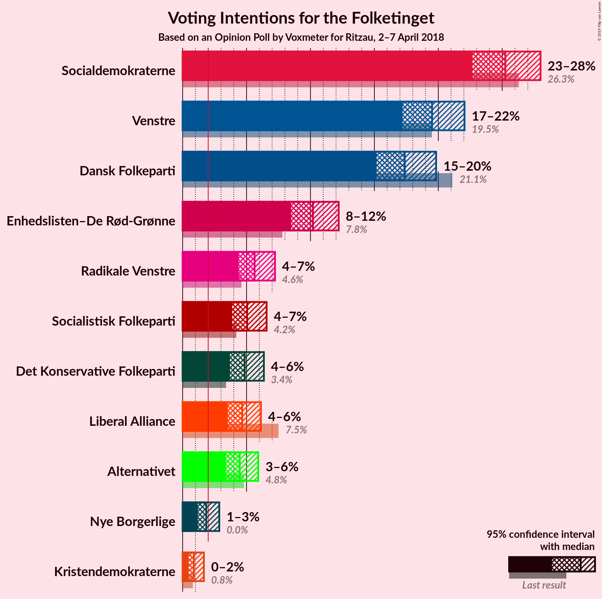

### Confidence Intervals

| Party | Last Result | Poll Result | 80% Confidence Interval | 90% Confidence Interval | 95% Confidence Interval | 99% Confidence Interval |
|:-----:|:-----------:|:-----------:|:-----------------------:|:-----------------------:|:-----------------------:|:-----------------------:|
| Socialdemokraterne | 26.3% | 25.2% | 23.6–27.0% |23.1–27.6% |22.7–28.0% |21.9–28.9% |
| Venstre | 19.5% | 19.5% | 18.0–21.2% |17.6–21.6% |17.2–22.1% |16.5–22.9% |
| Dansk Folkeparti | 21.1% | 17.4% | 15.9–19.0% |15.5–19.4% |15.2–19.8% |14.5–20.6% |
| Enhedslisten–De Rød-Grønne | 7.8% | 10.2% | 9.1–11.5% |8.7–11.9% |8.5–12.2% |8.0–12.8% |
| Radikale Venstre | 4.6% | 5.6% | 4.8–6.7% |4.6–7.0% |4.4–7.2% |4.0–7.7% |
| Socialistisk Folkeparti | 4.2% | 5.0% | 4.3–6.0% |4.1–6.3% |3.9–6.6% |3.5–7.1% |
| Det Konservative Folkeparti | 3.4% | 4.9% | 4.1–5.8% |3.9–6.1% |3.7–6.4% |3.4–6.8% |
| Liberal Alliance | 7.5% | 4.7% | 3.9–5.6% |3.7–5.9% |3.5–6.1% |3.2–6.6% |
| Alternativet | 4.8% | 4.5% | 3.7–5.4% |3.5–5.7% |3.4–5.9% |3.0–6.4% |
| Nye Borgerlige | 0.0% | 1.8% | 1.4–2.5% |1.3–2.7% |1.2–2.9% |1.0–3.2% |
| Kristendemokraterne | 0.8% | 0.9% | 0.6–1.4% |0.5–1.5% |0.5–1.7% |0.4–1.9% |

*Note:* The poll result column reflects the actual value used in the calculations. Published results may vary slightly, and in addition be rounded to fewer digits.

## Seats

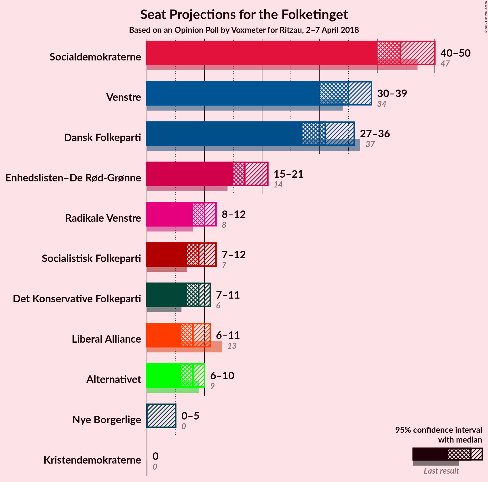

### Confidence Intervals

| Party | Last Result | Median | 80% Confidence Interval | 90% Confidence Interval | 95% Confidence Interval | 99% Confidence Interval |
|:-----:|:-----------:|:------:|:-----------------------:|:-----------------------:|:-----------------------:|:-----------------------:|
| <a href="#socialdemokraterne">Socialdemokraterne</a> | 47 | 44 | 42–48 |41–49 |40–50 |39–51 |
| <a href="#venstre">Venstre</a> | 34 | 35 | 32–37 |30–38 |30–39 |30–40 |
| <a href="#dansk-folkeparti">Dansk Folkeparti</a> | 37 | 31 | 29–33 |27–34 |27–36 |26–36 |
| <a href="#enhedslisten–de-rød-grønne">Enhedslisten–De Rød-Grønne</a> | 14 | 17 | 17–21 |16–21 |15–21 |13–23 |
| <a href="#radikale-venstre">Radikale Venstre</a> | 8 | 10 | 9–12 |8–12 |8–12 |7–14 |
| <a href="#socialistisk-folkeparti">Socialistisk Folkeparti</a> | 7 | 9 | 8–12 |7–12 |7–12 |6–13 |
| <a href="#det-konservative-folkeparti">Det Konservative Folkeparti</a> | 6 | 9 | 7–10 |7–11 |7–11 |6–12 |
| <a href="#liberal-alliance">Liberal Alliance</a> | 13 | 8 | 7–9 |6–10 |6–11 |6–12 |
| <a href="#alternativet">Alternativet</a> | 9 | 8 | 7–9 |7–10 |6–10 |5–11 |
| <a href="#nye-borgerlige">Nye Borgerlige</a> | 0 | 0 | 0–4 |0–5 |0–5 |0–5 |
| <a href="#kristendemokraterne">Kristendemokraterne</a> | 0 | 0 | 0 |0 |0 |0 |

### Socialdemokraterne

*For a full overview of the results for this party, see the [Socialdemokraterne](party-socialdemokraterne.html) page.*

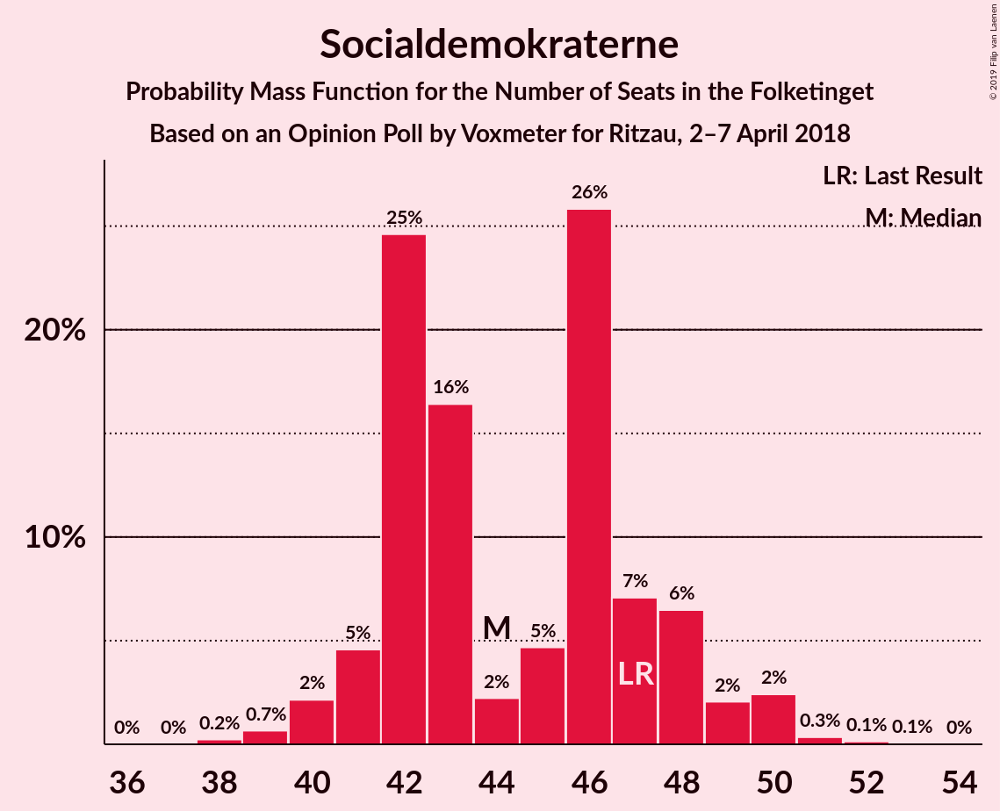

| Number of Seats | Probability | Accumulated | Special Marks |
|:---------------:|:-----------:|:-----------:|:-------------:|
| 38 | 0.2% | 100% |  |
| 39 | 0.7% | 99.7% |  |
| 40 | 2% | 99.1% |  |
| 41 | 5% | 97% |  |
| 42 | 25% | 92% |  |
| 43 | 16% | 68% |  |
| 44 | 2% | 51% | Median |
| 45 | 5% | 49% |  |
| 46 | 26% | 44% |  |
| 47 | 7% | 19% | Last Result |
| 48 | 6% | 12% |  |
| 49 | 2% | 5% |  |
| 50 | 2% | 3% |  |
| 51 | 0.3% | 0.6% |  |
| 52 | 0.1% | 0.2% |  |
| 53 | 0.1% | 0.1% |  |
| 54 | 0% | 0% |  |

### Venstre

*For a full overview of the results for this party, see the [Venstre](party-venstre.html) page.*

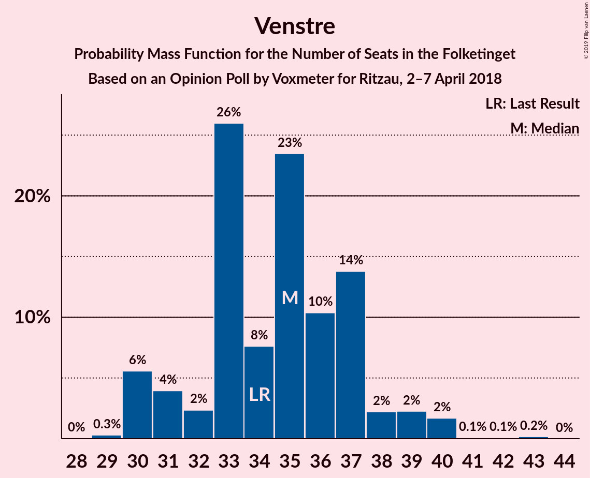

| Number of Seats | Probability | Accumulated | Special Marks |
|:---------------:|:-----------:|:-----------:|:-------------:|
| 28 | 0% | 100% |  |
| 29 | 0.3% | 99.9% |  |
| 30 | 6% | 99.6% |  |
| 31 | 4% | 94% |  |
| 32 | 2% | 90% |  |
| 33 | 26% | 88% |  |
| 34 | 8% | 62% | Last Result |
| 35 | 23% | 54% | Median |
| 36 | 10% | 31% |  |
| 37 | 14% | 20% |  |
| 38 | 2% | 6% |  |
| 39 | 2% | 4% |  |
| 40 | 2% | 2% |  |
| 41 | 0.1% | 0.3% |  |
| 42 | 0.1% | 0.2% |  |
| 43 | 0.2% | 0.2% |  |
| 44 | 0% | 0% |  |

### Dansk Folkeparti

*For a full overview of the results for this party, see the [Dansk Folkeparti](party-danskfolkeparti.html) page.*

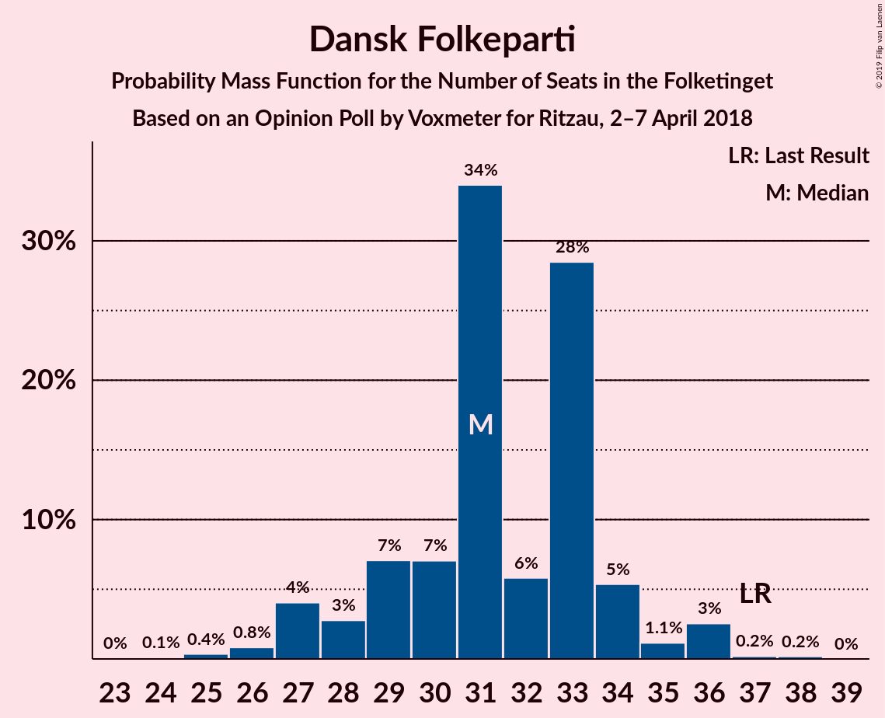

| Number of Seats | Probability | Accumulated | Special Marks |
|:---------------:|:-----------:|:-----------:|:-------------:|
| 24 | 0.1% | 100% |  |
| 25 | 0.4% | 99.9% |  |
| 26 | 0.8% | 99.5% |  |
| 27 | 4% | 98.7% |  |
| 28 | 3% | 95% |  |
| 29 | 7% | 92% |  |
| 30 | 7% | 85% |  |
| 31 | 34% | 78% | Median |
| 32 | 6% | 44% |  |
| 33 | 28% | 38% |  |
| 34 | 5% | 9% |  |
| 35 | 1.1% | 4% |  |
| 36 | 3% | 3% |  |
| 37 | 0.2% | 0.4% | Last Result |
| 38 | 0.2% | 0.2% |  |
| 39 | 0% | 0% |  |

### Enhedslisten–De Rød-Grønne

*For a full overview of the results for this party, see the [Enhedslisten–De Rød-Grønne](party-enhedslisten–derød-grønne.html) page.*

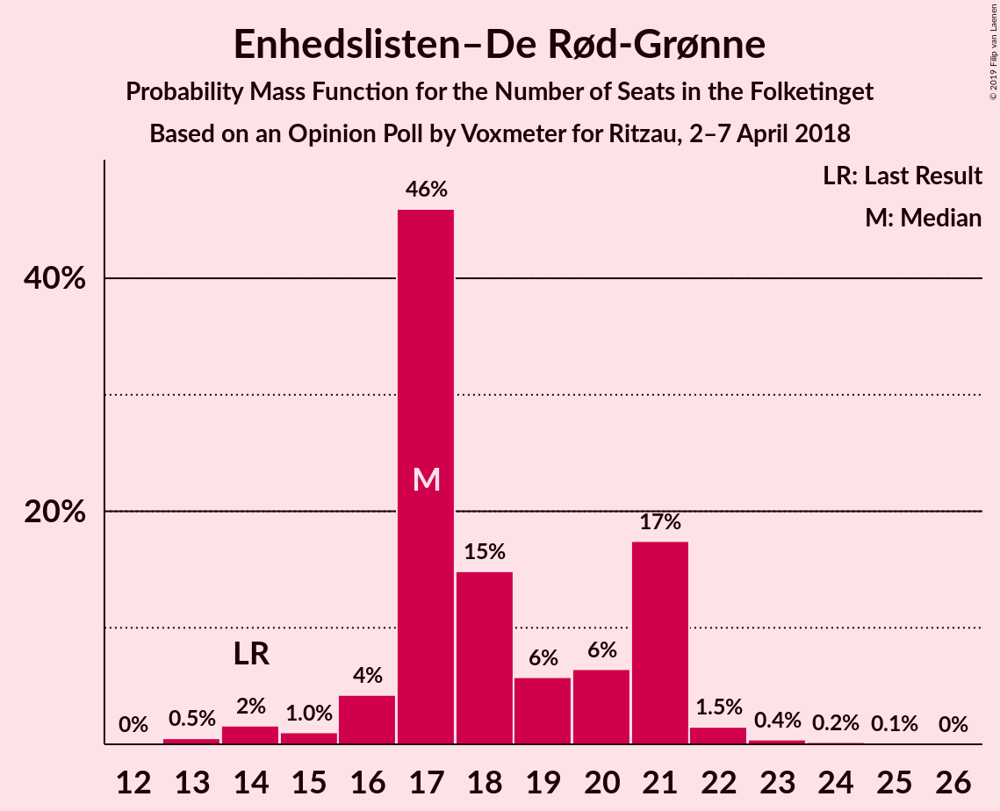

| Number of Seats | Probability | Accumulated | Special Marks |
|:---------------:|:-----------:|:-----------:|:-------------:|
| 13 | 0.5% | 100% |  |
| 14 | 2% | 99.5% | Last Result |
| 15 | 1.0% | 98% |  |
| 16 | 4% | 97% |  |
| 17 | 46% | 93% | Median |
| 18 | 15% | 47% |  |
| 19 | 6% | 32% |  |
| 20 | 6% | 26% |  |
| 21 | 17% | 20% |  |
| 22 | 1.5% | 2% |  |
| 23 | 0.4% | 0.7% |  |
| 24 | 0.2% | 0.3% |  |
| 25 | 0.1% | 0.1% |  |
| 26 | 0% | 0% |  |

### Radikale Venstre

*For a full overview of the results for this party, see the [Radikale Venstre](party-radikalevenstre.html) page.*

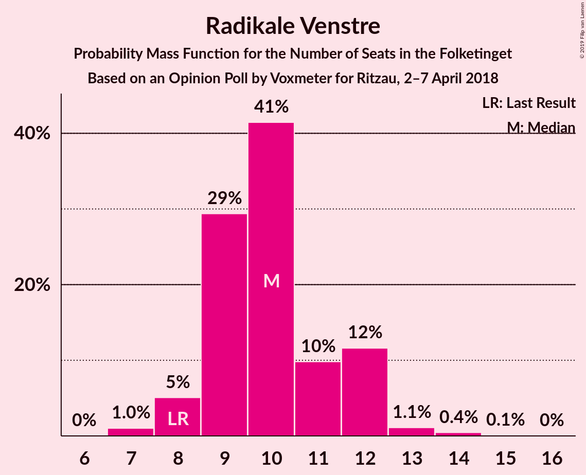

| Number of Seats | Probability | Accumulated | Special Marks |
|:---------------:|:-----------:|:-----------:|:-------------:|
| 7 | 1.0% | 100% |  |
| 8 | 5% | 98.9% | Last Result |
| 9 | 29% | 94% |  |
| 10 | 41% | 64% | Median |
| 11 | 10% | 23% |  |
| 12 | 12% | 13% |  |
| 13 | 1.1% | 2% |  |
| 14 | 0.4% | 0.5% |  |
| 15 | 0.1% | 0.1% |  |
| 16 | 0% | 0% |  |

### Socialistisk Folkeparti

*For a full overview of the results for this party, see the [Socialistisk Folkeparti](party-socialistiskfolkeparti.html) page.*

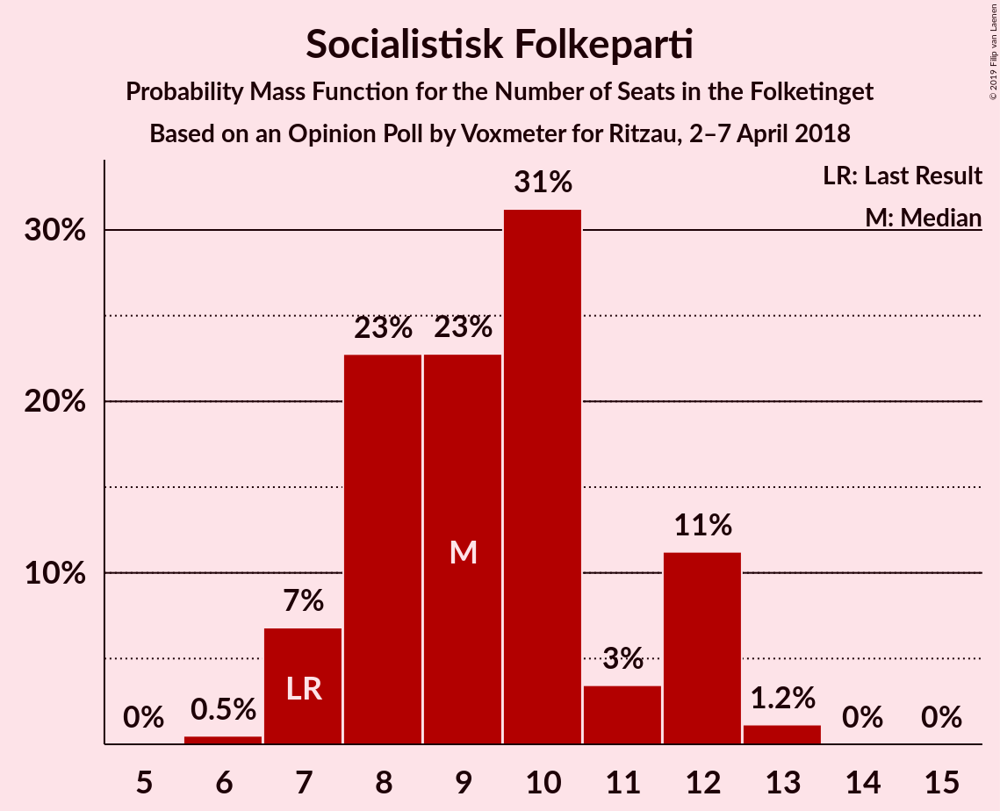

| Number of Seats | Probability | Accumulated | Special Marks |
|:---------------:|:-----------:|:-----------:|:-------------:|
| 6 | 0.5% | 100% |  |
| 7 | 7% | 99.5% | Last Result |
| 8 | 23% | 93% |  |
| 9 | 23% | 70% | Median |
| 10 | 31% | 47% |  |
| 11 | 3% | 16% |  |
| 12 | 11% | 12% |  |
| 13 | 1.2% | 1.2% |  |
| 14 | 0% | 0.1% |  |
| 15 | 0% | 0% |  |

### Det Konservative Folkeparti

*For a full overview of the results for this party, see the [Det Konservative Folkeparti](party-detkonservativefolkeparti.html) page.*

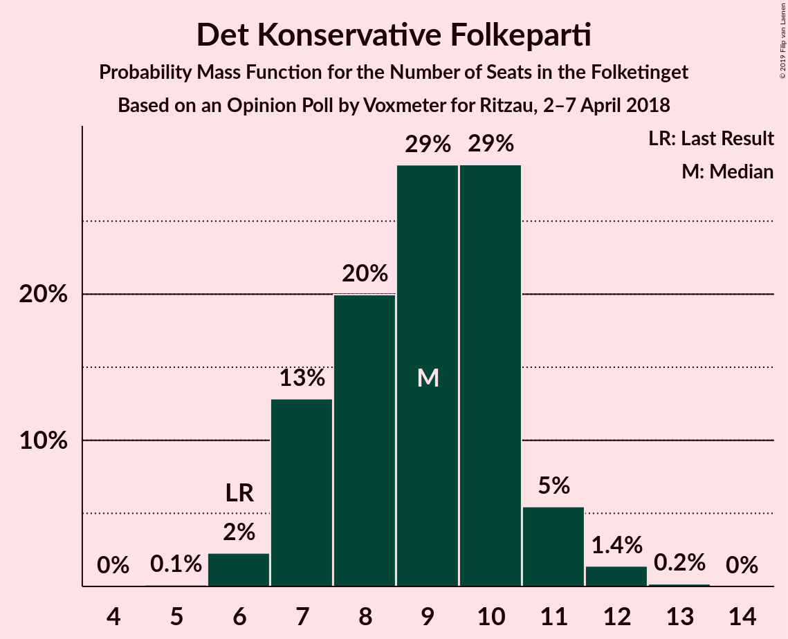

| Number of Seats | Probability | Accumulated | Special Marks |
|:---------------:|:-----------:|:-----------:|:-------------:|
| 5 | 0.1% | 100% |  |
| 6 | 2% | 99.9% | Last Result |
| 7 | 13% | 98% |  |
| 8 | 20% | 85% |  |
| 9 | 29% | 65% | Median |
| 10 | 29% | 36% |  |
| 11 | 5% | 7% |  |
| 12 | 1.4% | 2% |  |
| 13 | 0.2% | 0.2% |  |
| 14 | 0% | 0% |  |

### Liberal Alliance

*For a full overview of the results for this party, see the [Liberal Alliance](party-liberalalliance.html) page.*

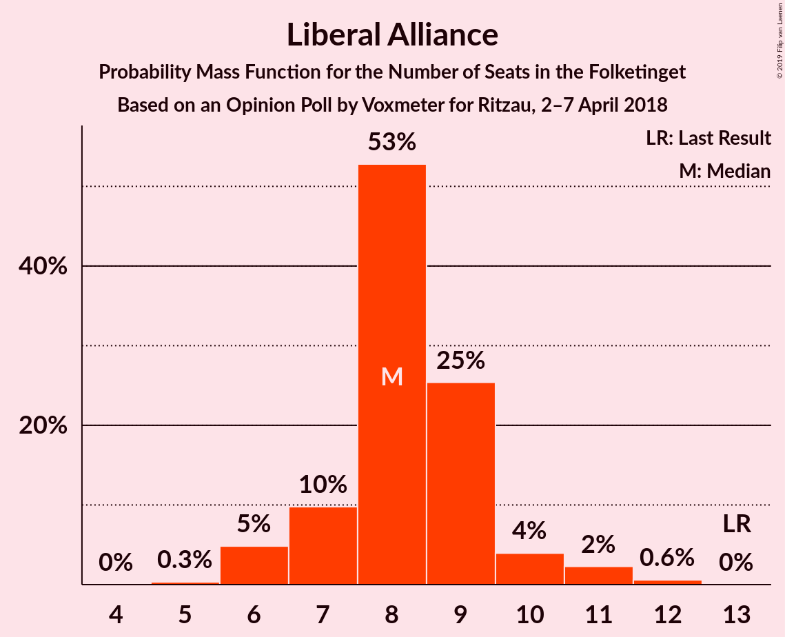

| Number of Seats | Probability | Accumulated | Special Marks |
|:---------------:|:-----------:|:-----------:|:-------------:|
| 5 | 0.3% | 100% |  |
| 6 | 5% | 99.7% |  |
| 7 | 10% | 95% |  |
| 8 | 53% | 85% | Median |
| 9 | 25% | 32% |  |
| 10 | 4% | 7% |  |
| 11 | 2% | 3% |  |
| 12 | 0.6% | 0.6% |  |
| 13 | 0% | 0% | Last Result |

### Alternativet

*For a full overview of the results for this party, see the [Alternativet](party-alternativet.html) page.*

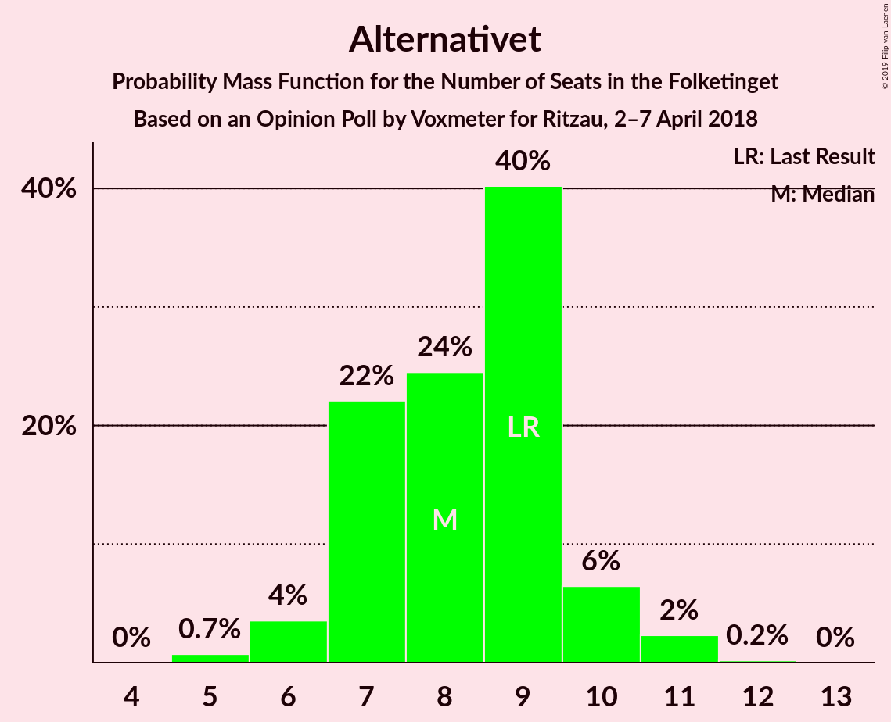

| Number of Seats | Probability | Accumulated | Special Marks |
|:---------------:|:-----------:|:-----------:|:-------------:|
| 5 | 0.7% | 100% |  |
| 6 | 4% | 99.3% |  |
| 7 | 22% | 96% |  |
| 8 | 24% | 74% | Median |
| 9 | 40% | 49% | Last Result |
| 10 | 6% | 9% |  |
| 11 | 2% | 2% |  |
| 12 | 0.2% | 0.2% |  |
| 13 | 0% | 0% |  |

### Nye Borgerlige

*For a full overview of the results for this party, see the [Nye Borgerlige](party-nyeborgerlige.html) page.*

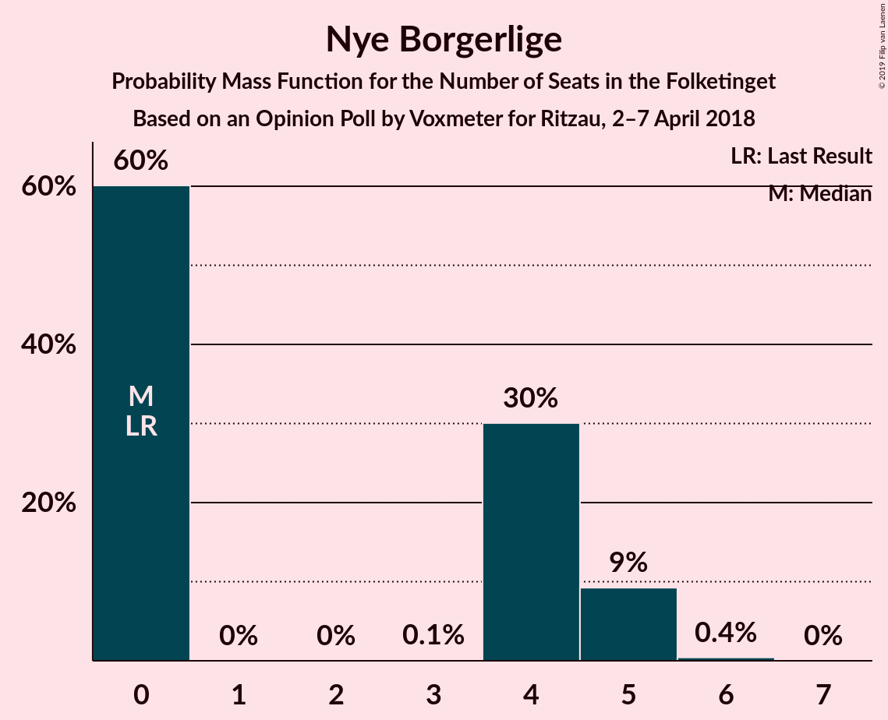

| Number of Seats | Probability | Accumulated | Special Marks |
|:---------------:|:-----------:|:-----------:|:-------------:|
| 0 | 60% | 100% | Last Result, Median |
| 1 | 0% | 40% |  |
| 2 | 0% | 40% |  |
| 3 | 0.1% | 40% |  |
| 4 | 30% | 40% |  |
| 5 | 9% | 10% |  |
| 6 | 0.4% | 0.5% |  |
| 7 | 0% | 0% |  |

### Kristendemokraterne

*For a full overview of the results for this party, see the [Kristendemokraterne](party-kristendemokraterne.html) page.*

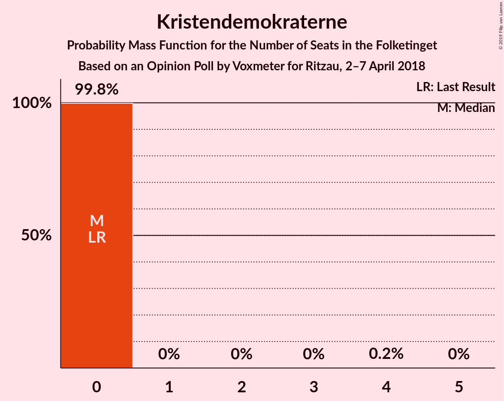

| Number of Seats | Probability | Accumulated | Special Marks |
|:---------------:|:-----------:|:-----------:|:-------------:|
| 0 | 99.8% | 100% | Last Result, Median |
| 1 | 0% | 0.2% |  |
| 2 | 0% | 0.2% |  |
| 3 | 0% | 0.2% |  |
| 4 | 0.2% | 0.2% |  |
| 5 | 0% | 0% |  |

## Coalitions

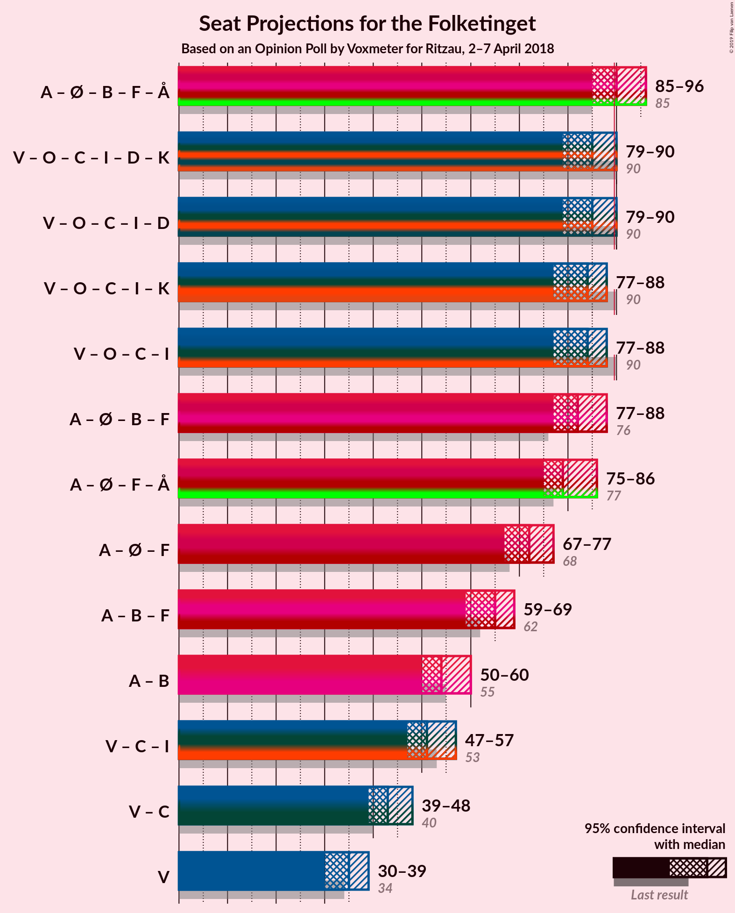

### Confidence Intervals

| Coalition | Last Result | Median | Majority? | 80% Confidence Interval | 90% Confidence Interval | 95% Confidence Interval | 99% Confidence Interval |
|:---------:|:-----------:|:------:|:---------:|:-----------------------:|:-----------------------:|:-----------------------:|:-----------------------:|
| Socialdemokraterne – Enhedslisten–De Rød-Grønne – Radikale Venstre – Socialistisk Folkeparti – Alternativet | 85 | 90 | 50% | 87–94 | 87–95 | 85–96 | 83–98 |
| Venstre – Dansk Folkeparti – Det Konservative Folkeparti – Liberal Alliance – Nye Borgerlige – Kristendemokraterne | 90 | 85 | 3% | 81–88 | 80–88 | 79–90 | 77–92 |
| Venstre – Dansk Folkeparti – Det Konservative Folkeparti – Liberal Alliance – Nye Borgerlige | 90 | 85 | 3% | 81–88 | 80–88 | 79–90 | 77–92 |
| Venstre – Dansk Folkeparti – Det Konservative Folkeparti – Liberal Alliance – Kristendemokraterne | 90 | 84 | 0.8% | 79–86 | 78–87 | 77–88 | 74–90 |
| Venstre – Dansk Folkeparti – Det Konservative Folkeparti – Liberal Alliance | 90 | 84 | 0.8% | 79–86 | 78–87 | 77–88 | 74–90 |
| Socialdemokraterne – Enhedslisten–De Rød-Grønne – Radikale Venstre – Socialistisk Folkeparti | 76 | 82 | 0.5% | 79–85 | 78–87 | 77–88 | 76–89 |
| Socialdemokraterne – Enhedslisten–De Rød-Grønne – Socialistisk Folkeparti – Alternativet | 77 | 79 | 0% | 77–84 | 77–85 | 75–86 | 73–87 |
| Socialdemokraterne – Enhedslisten–De Rød-Grønne – Socialistisk Folkeparti | 68 | 72 | 0% | 68–75 | 68–77 | 67–77 | 65–79 |
| Socialdemokraterne – Radikale Venstre – Socialistisk Folkeparti | 62 | 65 | 0% | 60–67 | 60–68 | 59–69 | 56–71 |
| Socialdemokraterne – Radikale Venstre | 55 | 54 | 0% | 52–58 | 51–59 | 50–60 | 48–62 |
| Venstre – Det Konservative Folkeparti – Liberal Alliance | 53 | 51 | 0% | 48–55 | 47–56 | 47–57 | 44–59 |
| Venstre – Det Konservative Folkeparti | 40 | 43 | 0% | 40–46 | 39–47 | 39–48 | 37–50 |
| Venstre | 34 | 35 | 0% | 32–37 | 30–38 | 30–39 | 30–40 |

### Socialdemokraterne – Enhedslisten–De Rød-Grønne – Radikale Venstre – Socialistisk Folkeparti – Alternativet

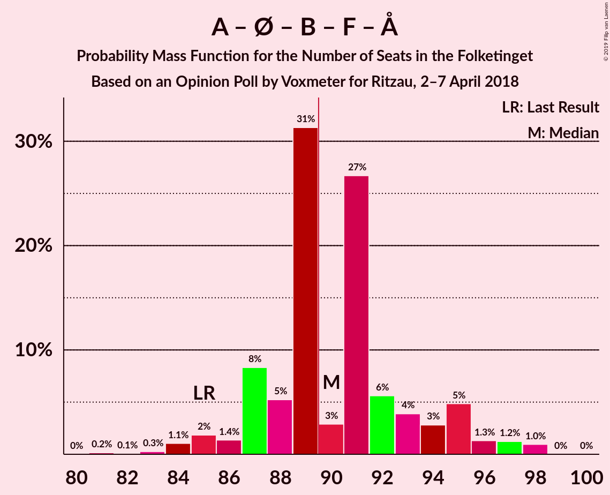

| Number of Seats | Probability | Accumulated | Special Marks |
|:---------------:|:-----------:|:-----------:|:-------------:|
| 81 | 0.2% | 100% |  |
| 82 | 0.1% | 99.8% |  |
| 83 | 0.3% | 99.7% |  |
| 84 | 1.1% | 99.5% |  |
| 85 | 2% | 98% | Last Result |
| 86 | 1.4% | 97% |  |
| 87 | 8% | 95% |  |
| 88 | 5% | 87% | Median |
| 89 | 31% | 82% |  |
| 90 | 3% | 50% | Majority |
| 91 | 27% | 47% |  |
| 92 | 6% | 21% |  |
| 93 | 4% | 15% |  |
| 94 | 3% | 11% |  |
| 95 | 5% | 8% |  |
| 96 | 1.3% | 4% |  |
| 97 | 1.2% | 2% |  |
| 98 | 1.0% | 1.0% |  |
| 99 | 0% | 0.1% |  |
| 100 | 0% | 0% |  |

### Venstre – Dansk Folkeparti – Det Konservative Folkeparti – Liberal Alliance – Nye Borgerlige – Kristendemokraterne

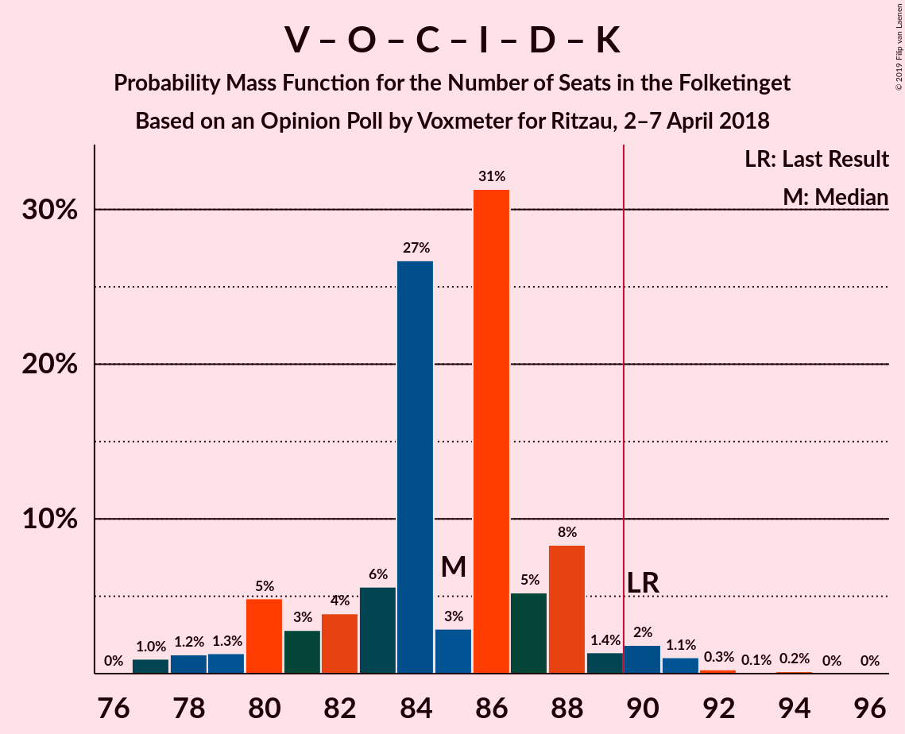

| Number of Seats | Probability | Accumulated | Special Marks |
|:---------------:|:-----------:|:-----------:|:-------------:|
| 76 | 0% | 100% |  |
| 77 | 1.0% | 99.9% |  |
| 78 | 1.2% | 99.0% |  |
| 79 | 1.3% | 98% |  |
| 80 | 5% | 96% |  |
| 81 | 3% | 92% |  |
| 82 | 4% | 89% |  |
| 83 | 6% | 85% | Median |
| 84 | 27% | 79% |  |
| 85 | 3% | 53% |  |
| 86 | 31% | 50% |  |
| 87 | 5% | 18% |  |
| 88 | 8% | 13% |  |
| 89 | 1.4% | 5% |  |
| 90 | 2% | 3% | Last Result, Majority |
| 91 | 1.1% | 2% |  |
| 92 | 0.3% | 0.5% |  |
| 93 | 0.1% | 0.3% |  |
| 94 | 0.2% | 0.2% |  |
| 95 | 0% | 0% |  |

### Venstre – Dansk Folkeparti – Det Konservative Folkeparti – Liberal Alliance – Nye Borgerlige

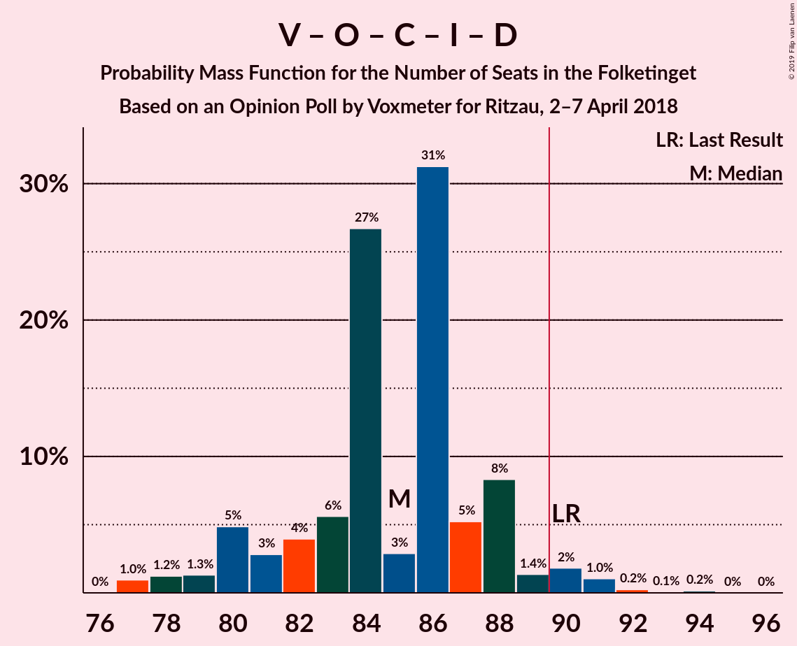

| Number of Seats | Probability | Accumulated | Special Marks |
|:---------------:|:-----------:|:-----------:|:-------------:|
| 76 | 0% | 100% |  |
| 77 | 1.0% | 99.9% |  |
| 78 | 1.2% | 99.0% |  |
| 79 | 1.3% | 98% |  |
| 80 | 5% | 96% |  |
| 81 | 3% | 92% |  |
| 82 | 4% | 89% |  |
| 83 | 6% | 85% | Median |
| 84 | 27% | 79% |  |
| 85 | 3% | 52% |  |
| 86 | 31% | 50% |  |
| 87 | 5% | 18% |  |
| 88 | 8% | 13% |  |
| 89 | 1.4% | 5% |  |
| 90 | 2% | 3% | Last Result, Majority |
| 91 | 1.0% | 2% |  |
| 92 | 0.2% | 0.5% |  |
| 93 | 0.1% | 0.3% |  |
| 94 | 0.2% | 0.2% |  |
| 95 | 0% | 0% |  |

### Venstre – Dansk Folkeparti – Det Konservative Folkeparti – Liberal Alliance – Kristendemokraterne

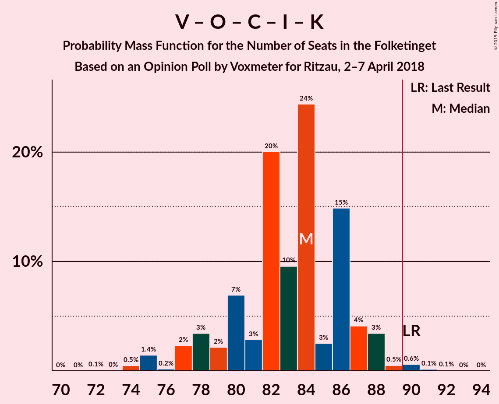

| Number of Seats | Probability | Accumulated | Special Marks |
|:---------------:|:-----------:|:-----------:|:-------------:|
| 72 | 0.1% | 100% |  |
| 73 | 0% | 99.9% |  |
| 74 | 0.5% | 99.9% |  |
| 75 | 1.4% | 99.4% |  |
| 76 | 0.2% | 98% |  |
| 77 | 2% | 98% |  |
| 78 | 3% | 96% |  |
| 79 | 2% | 92% |  |
| 80 | 7% | 90% |  |
| 81 | 3% | 83% |  |
| 82 | 20% | 80% |  |
| 83 | 10% | 60% | Median |
| 84 | 24% | 51% |  |
| 85 | 3% | 26% |  |
| 86 | 15% | 24% |  |
| 87 | 4% | 9% |  |
| 88 | 3% | 5% |  |
| 89 | 0.5% | 1.3% |  |
| 90 | 0.6% | 0.8% | Last Result, Majority |
| 91 | 0.1% | 0.2% |  |
| 92 | 0.1% | 0.1% |  |
| 93 | 0% | 0% |  |

### Venstre – Dansk Folkeparti – Det Konservative Folkeparti – Liberal Alliance

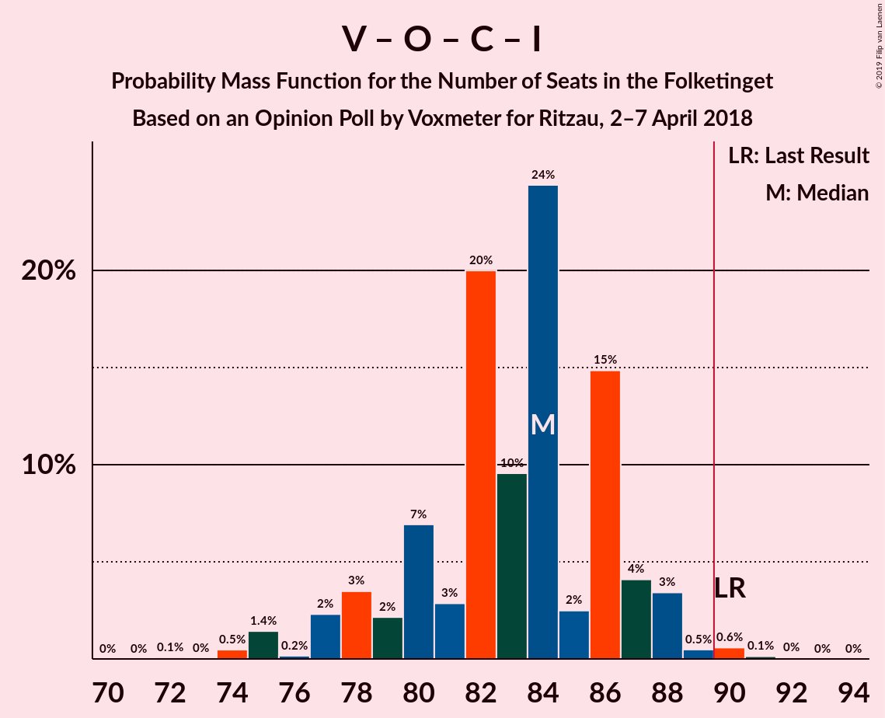

| Number of Seats | Probability | Accumulated | Special Marks |
|:---------------:|:-----------:|:-----------:|:-------------:|
| 72 | 0.1% | 100% |  |
| 73 | 0% | 99.9% |  |
| 74 | 0.5% | 99.9% |  |
| 75 | 1.4% | 99.4% |  |
| 76 | 0.2% | 98% |  |
| 77 | 2% | 98% |  |
| 78 | 3% | 96% |  |
| 79 | 2% | 92% |  |
| 80 | 7% | 90% |  |
| 81 | 3% | 83% |  |
| 82 | 20% | 80% |  |
| 83 | 10% | 60% | Median |
| 84 | 24% | 51% |  |
| 85 | 2% | 26% |  |
| 86 | 15% | 24% |  |
| 87 | 4% | 9% |  |
| 88 | 3% | 5% |  |
| 89 | 0.5% | 1.3% |  |
| 90 | 0.6% | 0.8% | Last Result, Majority |
| 91 | 0.1% | 0.2% |  |
| 92 | 0% | 0.1% |  |
| 93 | 0% | 0% |  |

### Socialdemokraterne – Enhedslisten–De Rød-Grønne – Radikale Venstre – Socialistisk Folkeparti

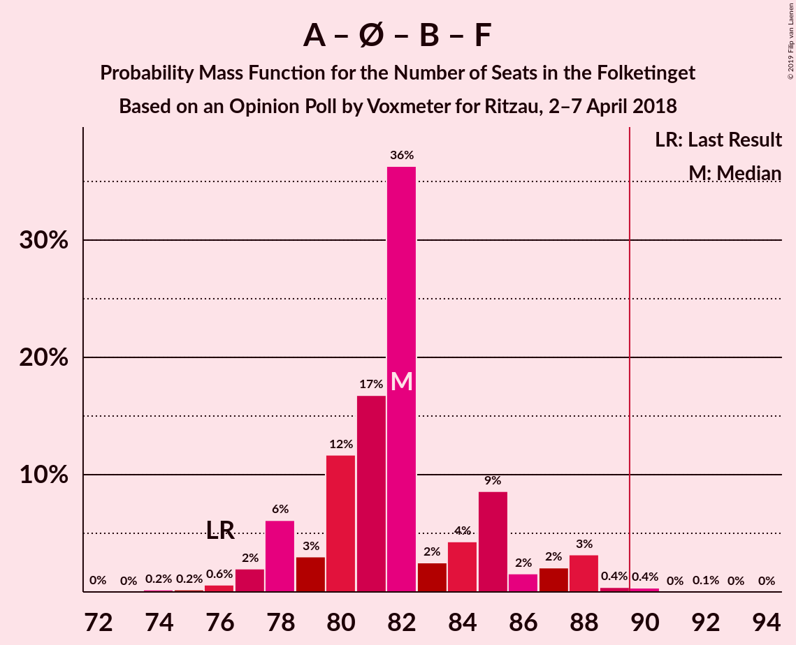

| Number of Seats | Probability | Accumulated | Special Marks |
|:---------------:|:-----------:|:-----------:|:-------------:|
| 72 | 0% | 100% |  |
| 73 | 0% | 99.9% |  |
| 74 | 0.2% | 99.9% |  |
| 75 | 0.2% | 99.7% |  |
| 76 | 0.6% | 99.5% | Last Result |
| 77 | 2% | 98.9% |  |
| 78 | 6% | 97% |  |
| 79 | 3% | 91% |  |
| 80 | 12% | 88% | Median |
| 81 | 17% | 76% |  |
| 82 | 36% | 59% |  |
| 83 | 2% | 23% |  |
| 84 | 4% | 21% |  |
| 85 | 9% | 16% |  |
| 86 | 2% | 8% |  |
| 87 | 2% | 6% |  |
| 88 | 3% | 4% |  |
| 89 | 0.4% | 0.9% |  |
| 90 | 0.4% | 0.5% | Majority |
| 91 | 0% | 0.1% |  |
| 92 | 0.1% | 0.1% |  |
| 93 | 0% | 0% |  |

### Socialdemokraterne – Enhedslisten–De Rød-Grønne – Socialistisk Folkeparti – Alternativet

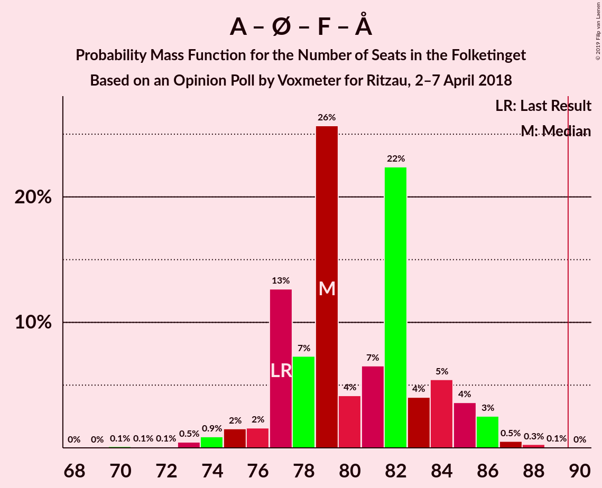

| Number of Seats | Probability | Accumulated | Special Marks |
|:---------------:|:-----------:|:-----------:|:-------------:|
| 70 | 0.1% | 100% |  |
| 71 | 0.1% | 99.9% |  |
| 72 | 0.1% | 99.8% |  |
| 73 | 0.5% | 99.7% |  |
| 74 | 0.9% | 99.3% |  |
| 75 | 2% | 98% |  |
| 76 | 2% | 97% |  |
| 77 | 13% | 95% | Last Result |
| 78 | 7% | 83% | Median |
| 79 | 26% | 75% |  |
| 80 | 4% | 50% |  |
| 81 | 7% | 45% |  |
| 82 | 22% | 39% |  |
| 83 | 4% | 17% |  |
| 84 | 5% | 12% |  |
| 85 | 4% | 7% |  |
| 86 | 3% | 3% |  |
| 87 | 0.5% | 0.9% |  |
| 88 | 0.3% | 0.4% |  |
| 89 | 0.1% | 0.1% |  |
| 90 | 0% | 0% | Majority |

### Socialdemokraterne – Enhedslisten–De Rød-Grønne – Socialistisk Folkeparti

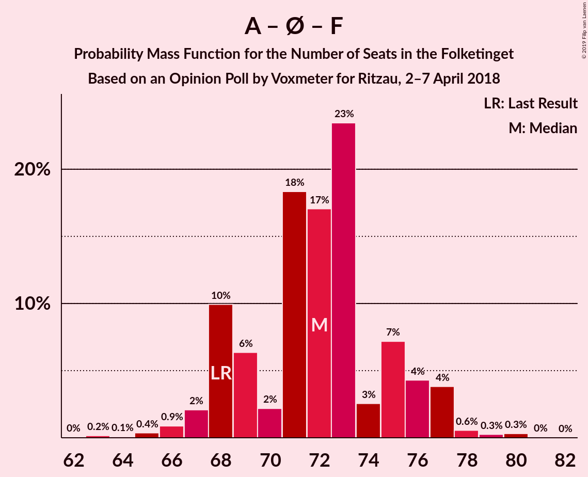

| Number of Seats | Probability | Accumulated | Special Marks |
|:---------------:|:-----------:|:-----------:|:-------------:|
| 63 | 0.2% | 100% |  |
| 64 | 0.1% | 99.8% |  |
| 65 | 0.4% | 99.7% |  |
| 66 | 0.9% | 99.4% |  |
| 67 | 2% | 98% |  |
| 68 | 10% | 96% | Last Result |
| 69 | 6% | 86% |  |
| 70 | 2% | 80% | Median |
| 71 | 18% | 78% |  |
| 72 | 17% | 60% |  |
| 73 | 23% | 43% |  |
| 74 | 3% | 19% |  |
| 75 | 7% | 17% |  |
| 76 | 4% | 9% |  |
| 77 | 4% | 5% |  |
| 78 | 0.6% | 1.2% |  |
| 79 | 0.3% | 0.7% |  |
| 80 | 0.3% | 0.4% |  |
| 81 | 0% | 0.1% |  |
| 82 | 0% | 0% |  |

### Socialdemokraterne – Radikale Venstre – Socialistisk Folkeparti

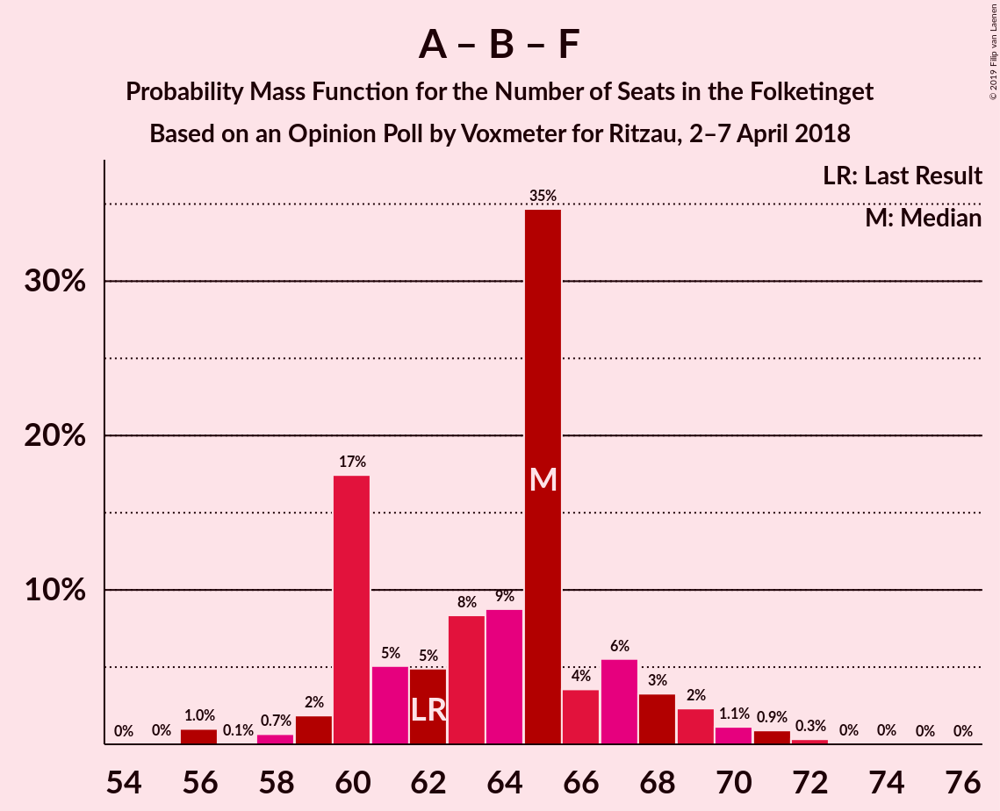

| Number of Seats | Probability | Accumulated | Special Marks |
|:---------------:|:-----------:|:-----------:|:-------------:|
| 55 | 0% | 100% |  |
| 56 | 1.0% | 99.9% |  |
| 57 | 0.1% | 98.9% |  |
| 58 | 0.7% | 98.9% |  |
| 59 | 2% | 98% |  |
| 60 | 17% | 96% |  |
| 61 | 5% | 79% |  |
| 62 | 5% | 74% | Last Result |
| 63 | 8% | 69% | Median |
| 64 | 9% | 61% |  |
| 65 | 35% | 52% |  |
| 66 | 4% | 17% |  |
| 67 | 6% | 14% |  |
| 68 | 3% | 8% |  |
| 69 | 2% | 5% |  |
| 70 | 1.1% | 2% |  |
| 71 | 0.9% | 1.3% |  |
| 72 | 0.3% | 0.4% |  |
| 73 | 0% | 0.1% |  |
| 74 | 0% | 0.1% |  |
| 75 | 0% | 0% |  |

### Socialdemokraterne – Radikale Venstre

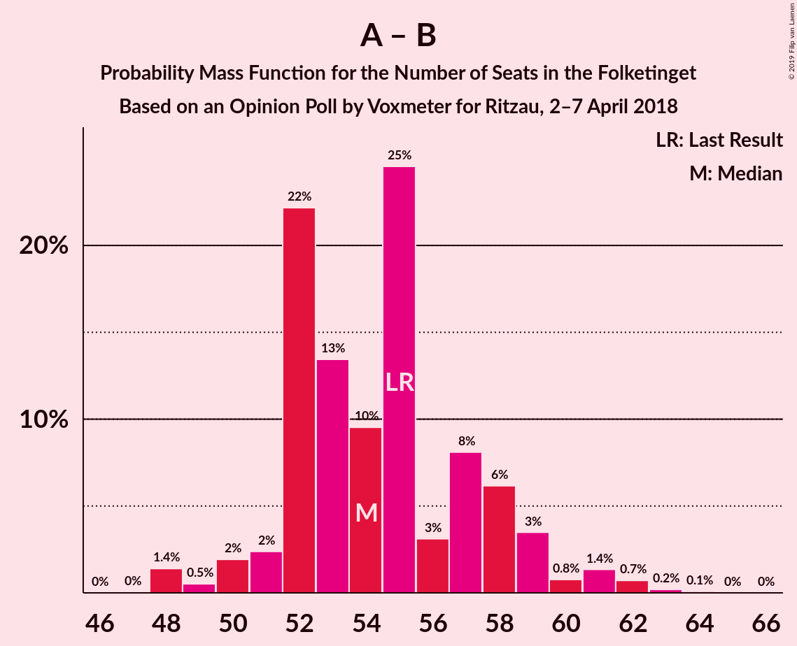

| Number of Seats | Probability | Accumulated | Special Marks |
|:---------------:|:-----------:|:-----------:|:-------------:|
| 47 | 0% | 100% |  |
| 48 | 1.4% | 99.9% |  |
| 49 | 0.5% | 98.5% |  |
| 50 | 2% | 98% |  |
| 51 | 2% | 96% |  |
| 52 | 22% | 94% |  |
| 53 | 13% | 72% |  |
| 54 | 10% | 58% | Median |
| 55 | 25% | 49% | Last Result |
| 56 | 3% | 24% |  |
| 57 | 8% | 21% |  |
| 58 | 6% | 13% |  |
| 59 | 3% | 7% |  |
| 60 | 0.8% | 3% |  |
| 61 | 1.4% | 2% |  |
| 62 | 0.7% | 1.0% |  |
| 63 | 0.2% | 0.3% |  |
| 64 | 0.1% | 0.1% |  |
| 65 | 0% | 0% |  |

### Venstre – Det Konservative Folkeparti – Liberal Alliance

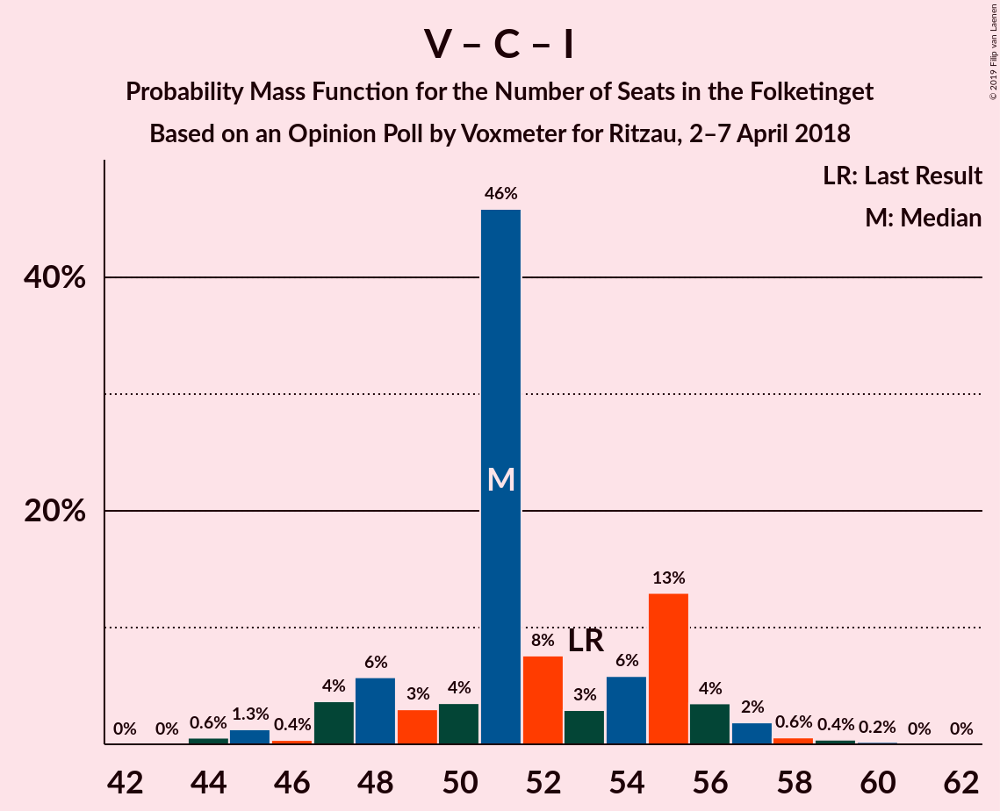

| Number of Seats | Probability | Accumulated | Special Marks |
|:---------------:|:-----------:|:-----------:|:-------------:|
| 44 | 0.6% | 100% |  |
| 45 | 1.3% | 99.4% |  |
| 46 | 0.4% | 98% |  |
| 47 | 4% | 98% |  |
| 48 | 6% | 94% |  |
| 49 | 3% | 88% |  |
| 50 | 4% | 85% |  |
| 51 | 46% | 82% |  |
| 52 | 8% | 36% | Median |
| 53 | 3% | 28% | Last Result |
| 54 | 6% | 25% |  |
| 55 | 13% | 20% |  |
| 56 | 4% | 7% |  |
| 57 | 2% | 3% |  |
| 58 | 0.6% | 1.2% |  |
| 59 | 0.4% | 0.6% |  |
| 60 | 0.2% | 0.2% |  |
| 61 | 0% | 0% |  |

### Venstre – Det Konservative Folkeparti

| Number of Seats | Probability | Accumulated | Special Marks |
|:---------------:|:-----------:|:-----------:|:-------------:|
| 36 | 0.1% | 100% |  |
| 37 | 0.8% | 99.9% |  |
| 38 | 2% | 99.0% |  |
| 39 | 6% | 98% |  |
| 40 | 2% | 92% | Last Result |
| 41 | 4% | 89% |  |
| 42 | 5% | 85% |  |
| 43 | 43% | 80% |  |
| 44 | 6% | 36% | Median |
| 45 | 10% | 30% |  |
| 46 | 14% | 21% |  |
| 47 | 2% | 7% |  |
| 48 | 4% | 5% |  |
| 49 | 0.4% | 1.2% |  |
| 50 | 0.5% | 0.8% |  |
| 51 | 0.3% | 0.3% |  |
| 52 | 0.1% | 0.1% |  |
| 53 | 0% | 0% |  |

### Venstre

| Number of Seats | Probability | Accumulated | Special Marks |
|:---------------:|:-----------:|:-----------:|:-------------:|
| 28 | 0% | 100% |  |
| 29 | 0.3% | 99.9% |  |
| 30 | 6% | 99.6% |  |
| 31 | 4% | 94% |  |
| 32 | 2% | 90% |  |
| 33 | 26% | 88% |  |
| 34 | 8% | 62% | Last Result |
| 35 | 23% | 54% | Median |
| 36 | 10% | 31% |  |
| 37 | 14% | 20% |  |
| 38 | 2% | 6% |  |
| 39 | 2% | 4% |  |
| 40 | 2% | 2% |  |
| 41 | 0.1% | 0.3% |  |
| 42 | 0.1% | 0.2% |  |
| 43 | 0.2% | 0.2% |  |
| 44 | 0% | 0% |  |

## Technical Information

### Opinion Poll

+ **Polling firm:** Voxmeter
+ **Commissioner(s):** Ritzau
+ **Fieldwork period:** 2–7 April 2018

### Calculations

+ **Sample size:** 1030
+ **Simulations done:** 1,048,576
+ **Error estimate:** 1.27%

