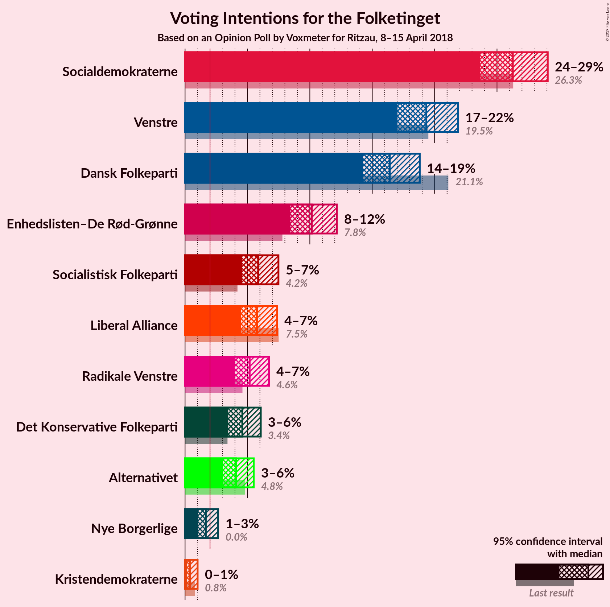
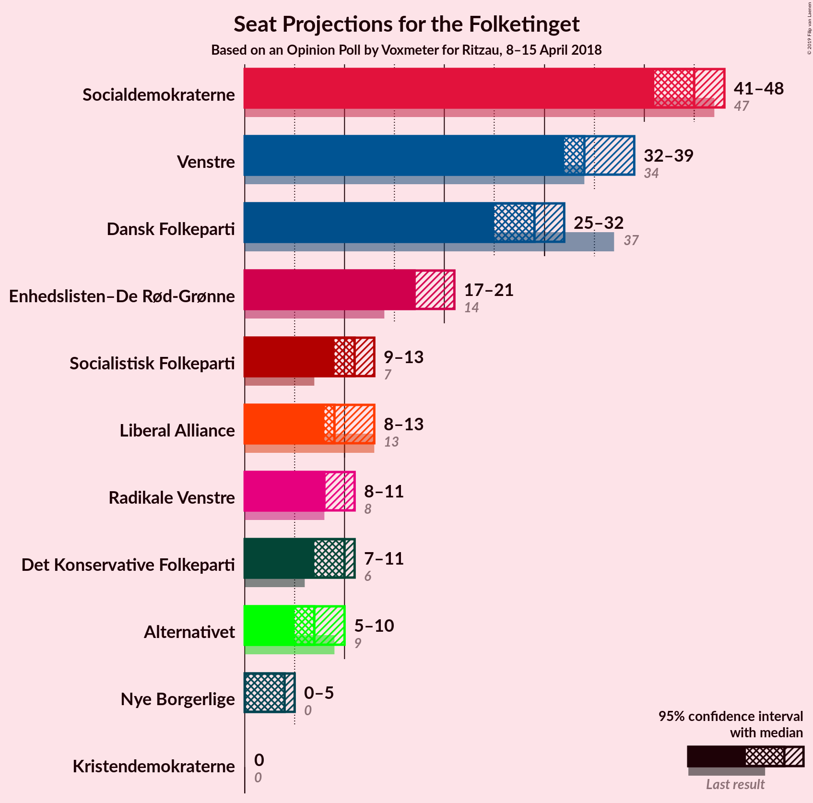
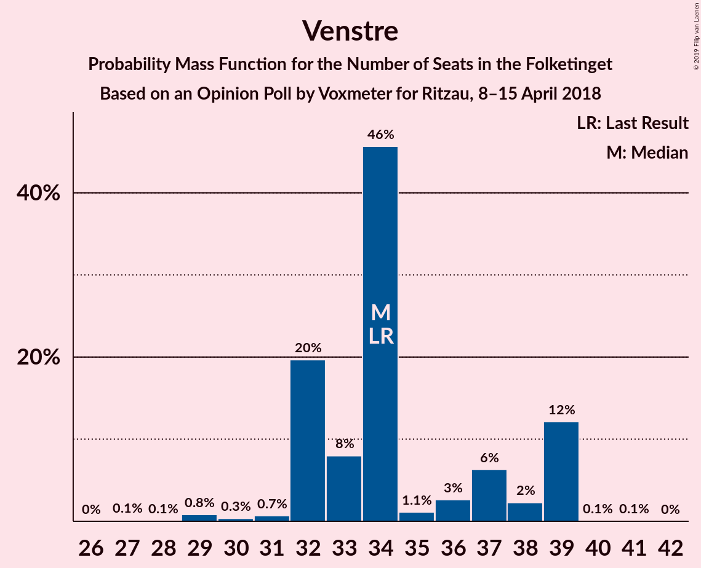
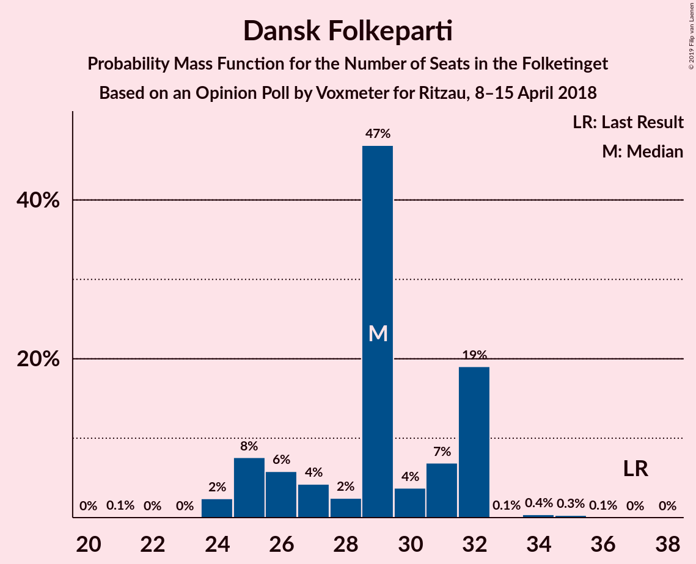
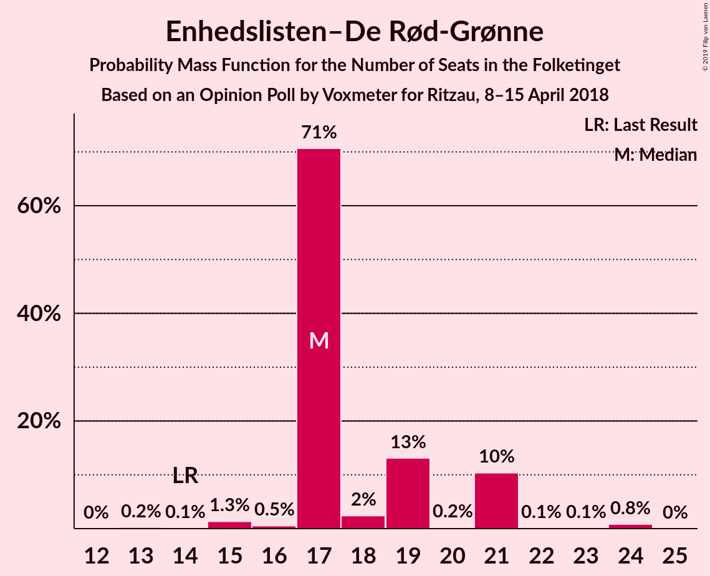
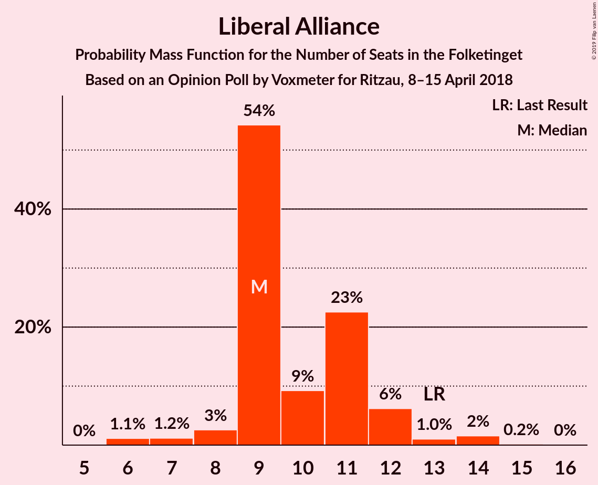
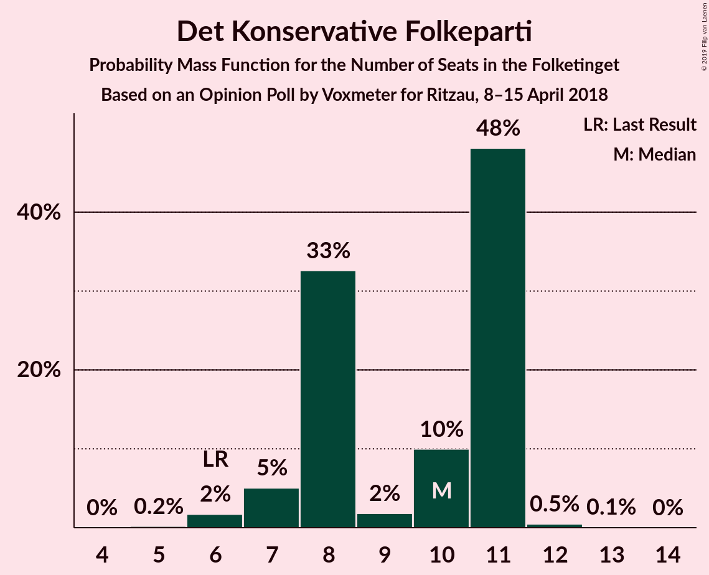

# Opinion Poll by Voxmeter for Ritzau, 8–15 April 2018

<a href="#voting-intentions">Voting Intentions</a> | <a href="#seats">Seats</a> | <a href="#coalitions">Coalitions</a> | <a href="#technical-information">Technical Information</a>

## Voting Intentions

### Confidence Intervals

| Party | Last Result | Poll Result | 80% Confidence Interval | 90% Confidence Interval | 95% Confidence Interval | 99% Confidence Interval |
|:-----:|:-----------:|:-----------:|:-----------------------:|:-----------------------:|:-----------------------:|:-----------------------:|
| Socialdemokraterne | 26.3% | 26.3% | 24.6–28.1% |24.1–28.6% |23.7–29.1% |22.9–29.9% |
| Venstre | 19.5% | 19.3% | 17.8–21.0% |17.4–21.5% |17.0–21.9% |16.3–22.7% |
| Dansk Folkeparti | 21.1% | 16.4% | 15.0–18.0% |14.6–18.4% |14.3–18.8% |13.6–19.6% |
| Enhedslisten–De Rød-Grønne | 7.8% | 10.2% | 9.0–11.5% |8.7–11.8% |8.4–12.2% |7.9–12.8% |
| Socialistisk Folkeparti | 4.2% | 5.9% | 5.0–6.9% |4.8–7.2% |4.6–7.5% |4.2–8.0% |
| Liberal Alliance | 7.5% | 5.8% | 4.9–6.8% |4.7–7.1% |4.5–7.4% |4.1–7.9% |
| Radikale Venstre | 4.6% | 5.2% | 4.4–6.2% |4.2–6.5% |4.0–6.7% |3.6–7.2% |
| Det Konservative Folkeparti | 3.4% | 4.6% | 3.8–5.5% |3.6–5.8% |3.5–6.1% |3.1–6.6% |
| Alternativet | 4.8% | 4.1% | 3.4–5.0% |3.2–5.3% |3.0–5.5% |2.7–6.0% |
| Nye Borgerlige | 0.0% | 1.7% | 1.2–2.3% |1.1–2.5% |1.0–2.7% |0.9–3.0% |
| Kristendemokraterne | 0.8% | 0.4% | 0.2–0.8% |0.2–0.9% |0.2–1.0% |0.1–1.2% |

*Note:* The poll result column reflects the actual value used in the calculations. Published results may vary slightly, and in addition be rounded to fewer digits.

## Seats

### Confidence Intervals

| Party | Last Result | Median | 80% Confidence Interval | 90% Confidence Interval | 95% Confidence Interval | 99% Confidence Interval |
|:-----:|:-----------:|:------:|:-----------------------:|:-----------------------:|:-----------------------:|:-----------------------:|
| <a href="#socialdemokraterne">Socialdemokraterne</a> | 47 | 45 | 43–48 |43–48 |41–48 |41–54 |
| <a href="#venstre">Venstre</a> | 34 | 34 | 32–39 |32–39 |32–39 |29–39 |
| <a href="#dansk-folkeparti">Dansk Folkeparti</a> | 37 | 29 | 25–32 |25–32 |25–32 |24–34 |
| <a href="#enhedslisten–de-rød-grønne">Enhedslisten–De Rød-Grønne</a> | 14 | 17 | 17–21 |17–21 |17–21 |15–24 |
| <a href="#socialistisk-folkeparti">Socialistisk Folkeparti</a> | 7 | 11 | 9–11 |9–12 |9–13 |8–14 |
| <a href="#liberal-alliance">Liberal Alliance</a> | 13 | 9 | 9–11 |9–12 |8–13 |6–14 |
| <a href="#radikale-venstre">Radikale Venstre</a> | 8 | 8 | 8–11 |8–11 |8–11 |6–12 |
| <a href="#det-konservative-folkeparti">Det Konservative Folkeparti</a> | 6 | 10 | 8–11 |7–11 |7–11 |6–12 |
| <a href="#alternativet">Alternativet</a> | 9 | 7 | 6–8 |6–10 |5–10 |4–10 |
| <a href="#nye-borgerlige">Nye Borgerlige</a> | 0 | 4 | 0–5 |0–5 |0–5 |0–5 |
| <a href="#kristendemokraterne">Kristendemokraterne</a> | 0 | 0 | 0 |0 |0 |0 |

### Socialdemokraterne

*For a full overview of the results for this party, see the [Socialdemokraterne](party-socialdemokraterne.html) page.*

| Number of Seats | Probability | Accumulated | Special Marks |
|:---------------:|:-----------:|:-----------:|:-------------:|
| 40 | 0.2% | 100% |  |
| 41 | 3% | 99.7% |  |
| 42 | 0.6% | 97% |  |
| 43 | 7% | 96% |  |
| 44 | 23% | 89% |  |
| 45 | 49% | 66% | Median |
| 46 | 3% | 17% |  |
| 47 | 4% | 14% | Last Result |
| 48 | 8% | 10% |  |
| 49 | 1.1% | 2% |  |
| 50 | 0.4% | 1.3% |  |
| 51 | 0.2% | 0.9% |  |
| 52 | 0.1% | 0.7% |  |
| 53 | 0.1% | 0.6% |  |
| 54 | 0.3% | 0.5% |  |
| 55 | 0.2% | 0.2% |  |
| 56 | 0% | 0% |  |

### Venstre

*For a full overview of the results for this party, see the [Venstre](party-venstre.html) page.*

| Number of Seats | Probability | Accumulated | Special Marks |
|:---------------:|:-----------:|:-----------:|:-------------:|
| 27 | 0.1% | 100% |  |
| 28 | 0.1% | 99.9% |  |
| 29 | 0.8% | 99.8% |  |
| 30 | 0.3% | 99.0% |  |
| 31 | 0.7% | 98.7% |  |
| 32 | 20% | 98% |  |
| 33 | 8% | 78% |  |
| 34 | 46% | 70% | Last Result, Median |
| 35 | 1.1% | 25% |  |
| 36 | 3% | 24% |  |
| 37 | 6% | 21% |  |
| 38 | 2% | 15% |  |
| 39 | 12% | 12% |  |
| 40 | 0.1% | 0.2% |  |
| 41 | 0.1% | 0.1% |  |
| 42 | 0% | 0% |  |

### Dansk Folkeparti

*For a full overview of the results for this party, see the [Dansk Folkeparti](party-danskfolkeparti.html) page.*

| Number of Seats | Probability | Accumulated | Special Marks |
|:---------------:|:-----------:|:-----------:|:-------------:|
| 21 | 0.1% | 100% |  |
| 22 | 0% | 99.9% |  |
| 23 | 0% | 99.9% |  |
| 24 | 2% | 99.9% |  |
| 25 | 8% | 98% |  |
| 26 | 6% | 90% |  |
| 27 | 4% | 84% |  |
| 28 | 2% | 80% |  |
| 29 | 47% | 77% | Median |
| 30 | 4% | 31% |  |
| 31 | 7% | 27% |  |
| 32 | 19% | 20% |  |
| 33 | 0.1% | 0.9% |  |
| 34 | 0.4% | 0.8% |  |
| 35 | 0.3% | 0.4% |  |
| 36 | 0.1% | 0.1% |  |
| 37 | 0% | 0% | Last Result |

### Enhedslisten–De Rød-Grønne

*For a full overview of the results for this party, see the [Enhedslisten–De Rød-Grønne](party-enhedslisten–derød-grønne.html) page.*

| Number of Seats | Probability | Accumulated | Special Marks |
|:---------------:|:-----------:|:-----------:|:-------------:|
| 13 | 0.2% | 100% |  |
| 14 | 0.1% | 99.7% | Last Result |
| 15 | 1.3% | 99.6% |  |
| 16 | 0.5% | 98% |  |
| 17 | 71% | 98% | Median |
| 18 | 2% | 27% |  |
| 19 | 13% | 25% |  |
| 20 | 0.2% | 12% |  |
| 21 | 10% | 11% |  |
| 22 | 0.1% | 1.0% |  |
| 23 | 0.1% | 0.9% |  |
| 24 | 0.8% | 0.8% |  |
| 25 | 0% | 0% |  |

### Socialistisk Folkeparti

*For a full overview of the results for this party, see the [Socialistisk Folkeparti](party-socialistiskfolkeparti.html) page.*

| Number of Seats | Probability | Accumulated | Special Marks |
|:---------------:|:-----------:|:-----------:|:-------------:|
| 7 | 0.3% | 100% | Last Result |
| 8 | 0.7% | 99.7% |  |
| 9 | 20% | 99.0% |  |
| 10 | 22% | 79% |  |
| 11 | 50% | 58% | Median |
| 12 | 3% | 8% |  |
| 13 | 3% | 4% |  |
| 14 | 2% | 2% |  |
| 15 | 0% | 0.1% |  |
| 16 | 0.1% | 0.1% |  |
| 17 | 0% | 0% |  |

### Liberal Alliance

*For a full overview of the results for this party, see the [Liberal Alliance](party-liberalalliance.html) page.*

| Number of Seats | Probability | Accumulated | Special Marks |
|:---------------:|:-----------:|:-----------:|:-------------:|
| 6 | 1.1% | 100% |  |
| 7 | 1.2% | 98.9% |  |
| 8 | 3% | 98% |  |
| 9 | 54% | 95% | Median |
| 10 | 9% | 41% |  |
| 11 | 23% | 32% |  |
| 12 | 6% | 9% |  |
| 13 | 1.0% | 3% | Last Result |
| 14 | 2% | 2% |  |
| 15 | 0.2% | 0.2% |  |
| 16 | 0% | 0% |  |

### Radikale Venstre

*For a full overview of the results for this party, see the [Radikale Venstre](party-radikalevenstre.html) page.*

| Number of Seats | Probability | Accumulated | Special Marks |
|:---------------:|:-----------:|:-----------:|:-------------:|
| 5 | 0.1% | 100% |  |
| 6 | 0.8% | 99.9% |  |
| 7 | 0.6% | 99.2% |  |
| 8 | 50% | 98.6% | Last Result, Median |
| 9 | 30% | 49% |  |
| 10 | 5% | 18% |  |
| 11 | 12% | 14% |  |
| 12 | 2% | 2% |  |
| 13 | 0.3% | 0.4% |  |
| 14 | 0.1% | 0.1% |  |
| 15 | 0% | 0% |  |

### Det Konservative Folkeparti

*For a full overview of the results for this party, see the [Det Konservative Folkeparti](party-detkonservativefolkeparti.html) page.*

| Number of Seats | Probability | Accumulated | Special Marks |
|:---------------:|:-----------:|:-----------:|:-------------:|
| 5 | 0.2% | 100% |  |
| 6 | 2% | 99.8% | Last Result |
| 7 | 5% | 98% |  |
| 8 | 33% | 93% |  |
| 9 | 2% | 60% |  |
| 10 | 10% | 59% | Median |
| 11 | 48% | 49% |  |
| 12 | 0.5% | 0.6% |  |
| 13 | 0.1% | 0.1% |  |
| 14 | 0% | 0% |  |

### Alternativet

*For a full overview of the results for this party, see the [Alternativet](party-alternativet.html) page.*

| Number of Seats | Probability | Accumulated | Special Marks |
|:---------------:|:-----------:|:-----------:|:-------------:|
| 4 | 0.5% | 100% |  |
| 5 | 4% | 99.5% |  |
| 6 | 13% | 96% |  |
| 7 | 68% | 82% | Median |
| 8 | 5% | 15% |  |
| 9 | 1.4% | 10% | Last Result |
| 10 | 8% | 8% |  |
| 11 | 0.3% | 0.4% |  |
| 12 | 0.1% | 0.1% |  |
| 13 | 0% | 0% |  |

### Nye Borgerlige

*For a full overview of the results for this party, see the [Nye Borgerlige](party-nyeborgerlige.html) page.*

| Number of Seats | Probability | Accumulated | Special Marks |
|:---------------:|:-----------:|:-----------:|:-------------:|
| 0 | 29% | 100% | Last Result |
| 1 | 0% | 71% |  |
| 2 | 0% | 71% |  |
| 3 | 3% | 71% |  |
| 4 | 48% | 69% | Median |
| 5 | 21% | 21% |  |
| 6 | 0.1% | 0.1% |  |
| 7 | 0% | 0% |  |

### Kristendemokraterne

*For a full overview of the results for this party, see the [Kristendemokraterne](party-kristendemokraterne.html) page.*

| Number of Seats | Probability | Accumulated | Special Marks |
|:---------------:|:-----------:|:-----------:|:-------------:|
| 0 | 100% | 100% | Last Result, Median |

## Coalitions

### Confidence Intervals

| Coalition | Last Result | Median | Majority? | 80% Confidence Interval | 90% Confidence Interval | 95% Confidence Interval | 99% Confidence Interval |
|:---------:|:-----------:|:------:|:---------:|:-----------------------:|:-----------------------:|:-----------------------:|:-----------------------:|
| Socialdemokraterne – Enhedslisten–De Rød-Grønne – Socialistisk Folkeparti – Radikale Venstre – Alternativet | 85 | 88 | 27% | 87–93 | 87–93 | 86–96 | 85–98 |
| Venstre – Dansk Folkeparti – Liberal Alliance – Det Konservative Folkeparti – Nye Borgerlige – Kristendemokraterne | 90 | 87 | 0.6% | 82–88 | 82–88 | 79–89 | 77–90 |
| Venstre – Dansk Folkeparti – Liberal Alliance – Det Konservative Folkeparti – Nye Borgerlige | 90 | 87 | 0.6% | 82–88 | 82–88 | 79–89 | 77–90 |
| Socialdemokraterne – Enhedslisten–De Rød-Grønne – Socialistisk Folkeparti – Radikale Venstre | 76 | 81 | 2% | 80–87 | 80–87 | 80–87 | 78–92 |
| Venstre – Dansk Folkeparti – Liberal Alliance – Det Konservative Folkeparti – Kristendemokraterne | 90 | 83 | 0.4% | 82–83 | 80–86 | 79–87 | 74–89 |
| Venstre – Dansk Folkeparti – Liberal Alliance – Det Konservative Folkeparti | 90 | 83 | 0.4% | 82–83 | 80–86 | 79–87 | 74–89 |
| Socialdemokraterne – Enhedslisten–De Rød-Grønne – Socialistisk Folkeparti – Alternativet | 77 | 80 | 0.8% | 78–84 | 78–84 | 75–86 | 75–90 |
| Socialdemokraterne – Enhedslisten–De Rød-Grønne – Socialistisk Folkeparti | 68 | 73 | 0% | 71–78 | 71–78 | 70–79 | 69–81 |
| Socialdemokraterne – Socialistisk Folkeparti – Radikale Venstre | 62 | 64 | 0% | 63–66 | 63–68 | 62–69 | 61–74 |
| Venstre – Liberal Alliance – Det Konservative Folkeparti | 53 | 54 | 0% | 51–57 | 51–59 | 50–61 | 47–61 |
| Socialdemokraterne – Radikale Venstre | 55 | 53 | 0% | 53–57 | 53–57 | 52–57 | 51–63 |
| Venstre – Det Konservative Folkeparti | 40 | 45 | 0% | 40–47 | 40–48 | 40–48 | 37–49 |
| Venstre | 34 | 34 | 0% | 32–39 | 32–39 | 32–39 | 29–39 |

### Socialdemokraterne – Enhedslisten–De Rød-Grønne – Socialistisk Folkeparti – Radikale Venstre – Alternativet

| Number of Seats | Probability | Accumulated | Special Marks |
|:---------------:|:-----------:|:-----------:|:-------------:|
| 83 | 0.1% | 100% |  |
| 84 | 0.2% | 99.9% |  |
| 85 | 0.3% | 99.7% | Last Result |
| 86 | 3% | 99.4% |  |
| 87 | 19% | 97% |  |
| 88 | 48% | 78% | Median |
| 89 | 2% | 30% |  |
| 90 | 2% | 27% | Majority |
| 91 | 1.4% | 25% |  |
| 92 | 7% | 24% |  |
| 93 | 12% | 17% |  |
| 94 | 2% | 5% |  |
| 95 | 0.3% | 3% |  |
| 96 | 0.9% | 3% |  |
| 97 | 0.9% | 2% |  |
| 98 | 0.3% | 0.7% |  |
| 99 | 0.1% | 0.4% |  |
| 100 | 0.1% | 0.3% |  |
| 101 | 0.2% | 0.3% |  |
| 102 | 0% | 0% |  |

### Venstre – Dansk Folkeparti – Liberal Alliance – Det Konservative Folkeparti – Nye Borgerlige – Kristendemokraterne

| Number of Seats | Probability | Accumulated | Special Marks |
|:---------------:|:-----------:|:-----------:|:-------------:|
| 74 | 0.2% | 100% |  |
| 75 | 0.1% | 99.7% |  |
| 76 | 0.1% | 99.7% |  |
| 77 | 0.3% | 99.6% |  |
| 78 | 0.9% | 99.3% |  |
| 79 | 0.9% | 98% |  |
| 80 | 0.3% | 97% |  |
| 81 | 2% | 97% |  |
| 82 | 12% | 95% |  |
| 83 | 7% | 83% |  |
| 84 | 1.4% | 76% |  |
| 85 | 2% | 75% |  |
| 86 | 2% | 73% | Median |
| 87 | 48% | 70% |  |
| 88 | 19% | 22% |  |
| 89 | 3% | 3% |  |
| 90 | 0.3% | 0.6% | Last Result, Majority |
| 91 | 0.2% | 0.3% |  |
| 92 | 0.1% | 0.1% |  |
| 93 | 0% | 0% |  |

### Venstre – Dansk Folkeparti – Liberal Alliance – Det Konservative Folkeparti – Nye Borgerlige

| Number of Seats | Probability | Accumulated | Special Marks |
|:---------------:|:-----------:|:-----------:|:-------------:|
| 74 | 0.2% | 100% |  |
| 75 | 0.1% | 99.7% |  |
| 76 | 0.1% | 99.7% |  |
| 77 | 0.3% | 99.6% |  |
| 78 | 0.9% | 99.3% |  |
| 79 | 0.9% | 98% |  |
| 80 | 0.3% | 97% |  |
| 81 | 2% | 97% |  |
| 82 | 12% | 95% |  |
| 83 | 7% | 83% |  |
| 84 | 1.4% | 76% |  |
| 85 | 2% | 75% |  |
| 86 | 2% | 73% | Median |
| 87 | 48% | 70% |  |
| 88 | 19% | 22% |  |
| 89 | 3% | 3% |  |
| 90 | 0.3% | 0.6% | Last Result, Majority |
| 91 | 0.2% | 0.3% |  |
| 92 | 0.1% | 0.1% |  |
| 93 | 0% | 0% |  |

### Socialdemokraterne – Enhedslisten–De Rød-Grønne – Socialistisk Folkeparti – Radikale Venstre

| Number of Seats | Probability | Accumulated | Special Marks |
|:---------------:|:-----------:|:-----------:|:-------------:|
| 76 | 0% | 100% | Last Result |
| 77 | 0.2% | 99.9% |  |
| 78 | 0.4% | 99.7% |  |
| 79 | 0.2% | 99.3% |  |
| 80 | 20% | 99.1% |  |
| 81 | 48% | 79% | Median |
| 82 | 10% | 31% |  |
| 83 | 3% | 22% |  |
| 84 | 0.9% | 19% |  |
| 85 | 5% | 18% |  |
| 86 | 1.2% | 13% |  |
| 87 | 9% | 12% |  |
| 88 | 0.4% | 2% |  |
| 89 | 0.2% | 2% |  |
| 90 | 0.9% | 2% | Majority |
| 91 | 0% | 0.8% |  |
| 92 | 0.6% | 0.7% |  |
| 93 | 0.1% | 0.1% |  |
| 94 | 0% | 0% |  |

### Venstre – Dansk Folkeparti – Liberal Alliance – Det Konservative Folkeparti – Kristendemokraterne

| Number of Seats | Probability | Accumulated | Special Marks |
|:---------------:|:-----------:|:-----------:|:-------------:|
| 73 | 0.2% | 100% |  |
| 74 | 0.3% | 99.8% |  |
| 75 | 0.1% | 99.4% |  |
| 76 | 0.2% | 99.4% |  |
| 77 | 0.2% | 99.2% |  |
| 78 | 1.4% | 99.0% |  |
| 79 | 1.0% | 98% |  |
| 80 | 2% | 97% |  |
| 81 | 2% | 94% |  |
| 82 | 13% | 92% | Median |
| 83 | 71% | 79% |  |
| 84 | 1.3% | 9% |  |
| 85 | 0.2% | 7% |  |
| 86 | 4% | 7% |  |
| 87 | 2% | 4% |  |
| 88 | 0.4% | 1.1% |  |
| 89 | 0.3% | 0.7% |  |
| 90 | 0.2% | 0.4% | Last Result, Majority |
| 91 | 0.1% | 0.2% |  |
| 92 | 0% | 0% |  |

### Venstre – Dansk Folkeparti – Liberal Alliance – Det Konservative Folkeparti

| Number of Seats | Probability | Accumulated | Special Marks |
|:---------------:|:-----------:|:-----------:|:-------------:|
| 73 | 0.2% | 100% |  |
| 74 | 0.3% | 99.8% |  |
| 75 | 0.1% | 99.4% |  |
| 76 | 0.2% | 99.4% |  |
| 77 | 0.2% | 99.2% |  |
| 78 | 1.4% | 99.0% |  |
| 79 | 1.0% | 98% |  |
| 80 | 2% | 96% |  |
| 81 | 2% | 94% |  |
| 82 | 13% | 92% | Median |
| 83 | 71% | 79% |  |
| 84 | 1.3% | 9% |  |
| 85 | 0.2% | 7% |  |
| 86 | 4% | 7% |  |
| 87 | 2% | 4% |  |
| 88 | 0.4% | 1.1% |  |
| 89 | 0.3% | 0.7% |  |
| 90 | 0.2% | 0.4% | Last Result, Majority |
| 91 | 0.1% | 0.2% |  |
| 92 | 0% | 0% |  |

### Socialdemokraterne – Enhedslisten–De Rød-Grønne – Socialistisk Folkeparti – Alternativet

| Number of Seats | Probability | Accumulated | Special Marks |
|:---------------:|:-----------:|:-----------:|:-------------:|
| 74 | 0.1% | 100% |  |
| 75 | 3% | 99.9% |  |
| 76 | 0.1% | 97% |  |
| 77 | 1.4% | 97% | Last Result |
| 78 | 22% | 96% |  |
| 79 | 0.4% | 73% |  |
| 80 | 46% | 73% | Median |
| 81 | 8% | 27% |  |
| 82 | 3% | 19% |  |
| 83 | 1.0% | 16% |  |
| 84 | 10% | 15% |  |
| 85 | 2% | 5% |  |
| 86 | 0.8% | 3% |  |
| 87 | 0.1% | 2% |  |
| 88 | 1.3% | 2% |  |
| 89 | 0.1% | 0.8% |  |
| 90 | 0.7% | 0.8% | Majority |
| 91 | 0% | 0.1% |  |
| 92 | 0% | 0.1% |  |
| 93 | 0% | 0% |  |

### Socialdemokraterne – Enhedslisten–De Rød-Grønne – Socialistisk Folkeparti

| Number of Seats | Probability | Accumulated | Special Marks |
|:---------------:|:-----------:|:-----------:|:-------------:|
| 67 | 0.1% | 100% |  |
| 68 | 0.3% | 99.9% | Last Result |
| 69 | 0.2% | 99.6% |  |
| 70 | 3% | 99.4% |  |
| 71 | 26% | 97% |  |
| 72 | 6% | 71% |  |
| 73 | 46% | 65% | Median |
| 74 | 0.3% | 19% |  |
| 75 | 2% | 19% |  |
| 76 | 4% | 17% |  |
| 77 | 2% | 12% |  |
| 78 | 8% | 11% |  |
| 79 | 0.9% | 3% |  |
| 80 | 0.5% | 2% |  |
| 81 | 1.4% | 2% |  |
| 82 | 0% | 0.3% |  |
| 83 | 0.1% | 0.3% |  |
| 84 | 0.1% | 0.1% |  |
| 85 | 0% | 0.1% |  |
| 86 | 0% | 0% |  |

### Socialdemokraterne – Socialistisk Folkeparti – Radikale Venstre

| Number of Seats | Probability | Accumulated | Special Marks |
|:---------------:|:-----------:|:-----------:|:-------------:|
| 58 | 0.1% | 100% |  |
| 59 | 0% | 99.9% |  |
| 60 | 0% | 99.9% |  |
| 61 | 2% | 99.9% |  |
| 62 | 3% | 98% | Last Result |
| 63 | 25% | 95% |  |
| 64 | 49% | 70% | Median |
| 65 | 3% | 21% |  |
| 66 | 11% | 18% |  |
| 67 | 2% | 8% |  |
| 68 | 3% | 6% |  |
| 69 | 1.2% | 3% |  |
| 70 | 0.1% | 2% |  |
| 71 | 0.3% | 1.4% |  |
| 72 | 0.1% | 1.1% |  |
| 73 | 0.3% | 1.0% |  |
| 74 | 0.5% | 0.7% |  |
| 75 | 0.2% | 0.2% |  |
| 76 | 0% | 0% |  |

### Venstre – Liberal Alliance – Det Konservative Folkeparti

| Number of Seats | Probability | Accumulated | Special Marks |
|:---------------:|:-----------:|:-----------:|:-------------:|
| 45 | 0.1% | 100% |  |
| 46 | 0% | 99.9% |  |
| 47 | 0.4% | 99.8% |  |
| 48 | 1.1% | 99.5% |  |
| 49 | 0.9% | 98% |  |
| 50 | 0.5% | 98% |  |
| 51 | 19% | 97% |  |
| 52 | 7% | 78% |  |
| 53 | 2% | 70% | Last Result, Median |
| 54 | 50% | 69% |  |
| 55 | 2% | 18% |  |
| 56 | 1.3% | 17% |  |
| 57 | 8% | 15% |  |
| 58 | 2% | 8% |  |
| 59 | 3% | 5% |  |
| 60 | 0.1% | 3% |  |
| 61 | 3% | 3% |  |
| 62 | 0% | 0% |  |

### Socialdemokraterne – Radikale Venstre

| Number of Seats | Probability | Accumulated | Special Marks |
|:---------------:|:-----------:|:-----------:|:-------------:|
| 47 | 0.1% | 100% |  |
| 48 | 0% | 99.9% |  |
| 49 | 0% | 99.9% |  |
| 50 | 0.1% | 99.9% |  |
| 51 | 0.4% | 99.8% |  |
| 52 | 4% | 99.4% |  |
| 53 | 67% | 95% | Median |
| 54 | 8% | 28% |  |
| 55 | 6% | 20% | Last Result |
| 56 | 4% | 14% |  |
| 57 | 9% | 11% |  |
| 58 | 0% | 2% |  |
| 59 | 0.1% | 2% |  |
| 60 | 0.4% | 2% |  |
| 61 | 0.2% | 1.2% |  |
| 62 | 0.5% | 1.0% |  |
| 63 | 0.4% | 0.6% |  |
| 64 | 0.2% | 0.2% |  |
| 65 | 0% | 0% |  |

### Venstre – Det Konservative Folkeparti

| Number of Seats | Probability | Accumulated | Special Marks |
|:---------------:|:-----------:|:-----------:|:-------------:|
| 35 | 0% | 100% |  |
| 36 | 0.1% | 99.9% |  |
| 37 | 0.9% | 99.9% |  |
| 38 | 0.2% | 99.0% |  |
| 39 | 0.2% | 98.8% |  |
| 40 | 21% | 98.5% | Last Result |
| 41 | 0.6% | 78% |  |
| 42 | 0.6% | 77% |  |
| 43 | 9% | 76% |  |
| 44 | 2% | 68% | Median |
| 45 | 49% | 66% |  |
| 46 | 4% | 17% |  |
| 47 | 8% | 14% |  |
| 48 | 3% | 5% |  |
| 49 | 2% | 2% |  |
| 50 | 0% | 0.1% |  |
| 51 | 0% | 0.1% |  |
| 52 | 0% | 0% |  |

### Venstre

| Number of Seats | Probability | Accumulated | Special Marks |
|:---------------:|:-----------:|:-----------:|:-------------:|
| 27 | 0.1% | 100% |  |
| 28 | 0.1% | 99.9% |  |
| 29 | 0.8% | 99.8% |  |
| 30 | 0.3% | 99.0% |  |
| 31 | 0.7% | 98.7% |  |
| 32 | 20% | 98% |  |
| 33 | 8% | 78% |  |
| 34 | 46% | 70% | Last Result, Median |
| 35 | 1.1% | 25% |  |
| 36 | 3% | 24% |  |
| 37 | 6% | 21% |  |
| 38 | 2% | 15% |  |
| 39 | 12% | 12% |  |
| 40 | 0.1% | 0.2% |  |
| 41 | 0.1% | 0.1% |  |
| 42 | 0% | 0% |  |

## Technical Information

### Opinion Poll

+ **Polling firm:** Voxmeter
+ **Commissioner(s):** Ritzau
+ **Fieldwork period:** 8–15 April 2018

### Calculations

+ **Sample size:** 1024
+ **Simulations done:** 131,072
+ **Error estimate:** 1.68%

