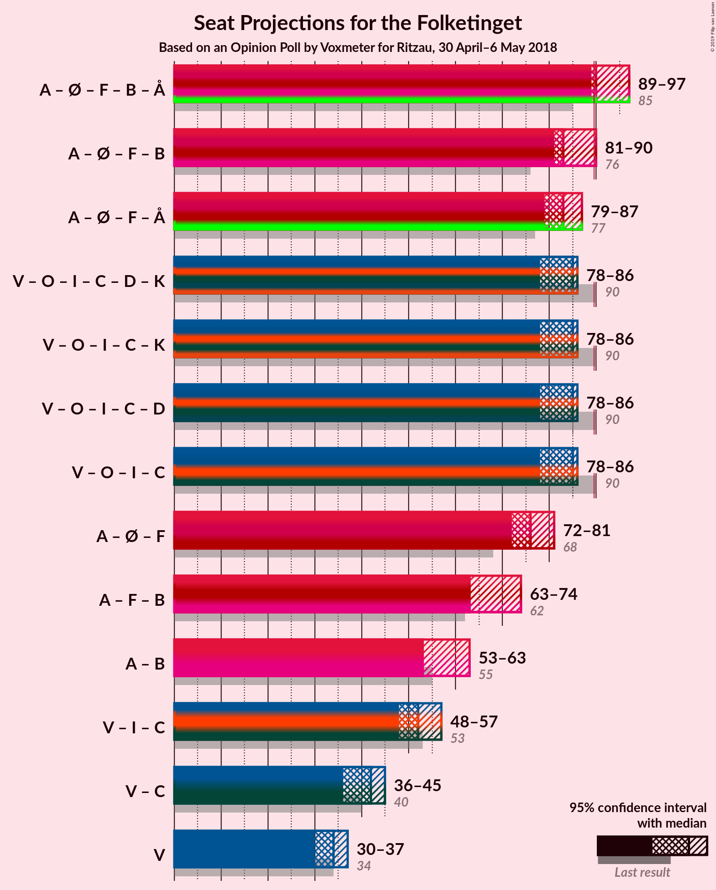

# Opinion Poll by Voxmeter for Ritzau, 30 April–6 May 2018

<a href="#voting-intentions">Voting Intentions</a> | <a href="#seats">Seats</a> | <a href="#coalitions">Coalitions</a> | <a href="#technical-information">Technical Information</a>

## Voting Intentions

### Confidence Intervals

| Party | Last Result | Poll Result | 80% Confidence Interval | 90% Confidence Interval | 95% Confidence Interval | 99% Confidence Interval |
|:-----:|:-----------:|:-----------:|:-----------------------:|:-----------------------:|:-----------------------:|:-----------------------:|
| Socialdemokraterne | 26.3% | 27.7% | 26.0–29.6% |25.5–30.1% |25.1–30.6% |24.2–31.5% |
| Venstre | 19.5% | 18.8% | 17.3–20.4% |16.8–20.9% |16.5–21.3% |15.8–22.1% |
| Dansk Folkeparti | 21.1% | 17.0% | 15.5–18.6% |15.1–19.0% |14.8–19.4% |14.1–20.2% |
| Enhedslisten–De Rød-Grønne | 7.8% | 9.6% | 8.5–10.9% |8.2–11.2% |7.9–11.6% |7.4–12.2% |
| Liberal Alliance | 7.5% | 6.2% | 5.3–7.3% |5.1–7.6% |4.8–7.9% |4.5–8.4% |
| Socialistisk Folkeparti | 4.2% | 5.7% | 4.8–6.8% |4.6–7.0% |4.4–7.3% |4.0–7.8% |
| Radikale Venstre | 4.6% | 5.4% | 4.6–6.4% |4.3–6.7% |4.1–7.0% |3.8–7.5% |
| Det Konservative Folkeparti | 3.4% | 4.1% | 3.4–5.0% |3.2–5.3% |3.0–5.5% |2.7–6.0% |
| Alternativet | 4.8% | 3.8% | 3.1–4.7% |2.9–4.9% |2.8–5.2% |2.5–5.6% |
| Nye Borgerlige | 0.0% | 0.9% | 0.6–1.4% |0.5–1.6% |0.5–1.7% |0.4–2.0% |
| Kristendemokraterne | 0.8% | 0.7% | 0.5–1.2% |0.4–1.3% |0.3–1.4% |0.2–1.7% |

*Note:* The poll result column reflects the actual value used in the calculations. Published results may vary slightly, and in addition be rounded to fewer digits.

## Seats

### Confidence Intervals

| Party | Last Result | Median | 80% Confidence Interval | 90% Confidence Interval | 95% Confidence Interval | 99% Confidence Interval |
|:-----:|:-----------:|:------:|:-----------------------:|:-----------------------:|:-----------------------:|:-----------------------:|
| <a href="#socialdemokraterne">Socialdemokraterne</a> | 47 | 46 | 46–50 |46–51 |46–54 |43–55 |
| <a href="#venstre">Venstre</a> | 34 | 34 | 31–34 |31–35 |30–37 |28–40 |
| <a href="#dansk-folkeparti">Dansk Folkeparti</a> | 37 | 33 | 29–33 |27–33 |26–33 |25–35 |
| <a href="#enhedslisten–de-rød-grønne">Enhedslisten–De Rød-Grønne</a> | 14 | 20 | 17–20 |16–20 |15–20 |13–21 |
| <a href="#liberal-alliance">Liberal Alliance</a> | 13 | 10 | 10–13 |10–13 |9–14 |8–15 |
| <a href="#socialistisk-folkeparti">Socialistisk Folkeparti</a> | 7 | 10 | 9–11 |8–11 |8–13 |8–15 |
| <a href="#radikale-venstre">Radikale Venstre</a> | 8 | 7 | 7–10 |7–11 |7–12 |7–13 |
| <a href="#det-konservative-folkeparti">Det Konservative Folkeparti</a> | 6 | 8 | 8 |6–10 |5–10 |5–10 |
| <a href="#alternativet">Alternativet</a> | 9 | 7 | 6–7 |6–9 |5–9 |4–11 |
| <a href="#nye-borgerlige">Nye Borgerlige</a> | 0 | 0 | 0 |0 |0 |0–4 |
| <a href="#kristendemokraterne">Kristendemokraterne</a> | 0 | 0 | 0 |0 |0 |0 |

### Socialdemokraterne

*For a full overview of the results for this party, see the [Socialdemokraterne](party-socialdemokraterne.html) page.*

| Number of Seats | Probability | Accumulated | Special Marks |
|:---------------:|:-----------:|:-----------:|:-------------:|
| 41 | 0% | 100% |  |
| 42 | 0.1% | 99.9% |  |
| 43 | 1.2% | 99.9% |  |
| 44 | 0.6% | 98.7% |  |
| 45 | 0.3% | 98% |  |
| 46 | 67% | 98% | Median |
| 47 | 15% | 31% | Last Result |
| 48 | 1.5% | 16% |  |
| 49 | 2% | 15% |  |
| 50 | 4% | 13% |  |
| 51 | 5% | 9% |  |
| 52 | 1.3% | 4% |  |
| 53 | 0.1% | 3% |  |
| 54 | 2% | 3% |  |
| 55 | 0.3% | 0.7% |  |
| 56 | 0.4% | 0.5% |  |
| 57 | 0% | 0% |  |

### Venstre

*For a full overview of the results for this party, see the [Venstre](party-venstre.html) page.*

| Number of Seats | Probability | Accumulated | Special Marks |
|:---------------:|:-----------:|:-----------:|:-------------:|
| 27 | 0.1% | 100% |  |
| 28 | 0.5% | 99.9% |  |
| 29 | 0.2% | 99.4% |  |
| 30 | 3% | 99.2% |  |
| 31 | 7% | 96% |  |
| 32 | 1.1% | 89% |  |
| 33 | 17% | 88% |  |
| 34 | 63% | 71% | Last Result, Median |
| 35 | 3% | 8% |  |
| 36 | 0.5% | 4% |  |
| 37 | 2% | 4% |  |
| 38 | 1.1% | 2% |  |
| 39 | 0.1% | 0.7% |  |
| 40 | 0.7% | 0.7% |  |
| 41 | 0% | 0% |  |

### Dansk Folkeparti

*For a full overview of the results for this party, see the [Dansk Folkeparti](party-danskfolkeparti.html) page.*

| Number of Seats | Probability | Accumulated | Special Marks |
|:---------------:|:-----------:|:-----------:|:-------------:|
| 25 | 2% | 100% |  |
| 26 | 2% | 98% |  |
| 27 | 1.5% | 96% |  |
| 28 | 4% | 94% |  |
| 29 | 15% | 90% |  |
| 30 | 3% | 75% |  |
| 31 | 6% | 72% |  |
| 32 | 2% | 67% |  |
| 33 | 64% | 65% | Median |
| 34 | 0.9% | 2% |  |
| 35 | 0.6% | 0.8% |  |
| 36 | 0.1% | 0.2% |  |
| 37 | 0.1% | 0.1% | Last Result |
| 38 | 0% | 0% |  |

### Enhedslisten–De Rød-Grønne

*For a full overview of the results for this party, see the [Enhedslisten–De Rød-Grønne](party-enhedslisten–derød-grønne.html) page.*

| Number of Seats | Probability | Accumulated | Special Marks |
|:---------------:|:-----------:|:-----------:|:-------------:|
| 12 | 0.4% | 100% |  |
| 13 | 0.8% | 99.6% |  |
| 14 | 0.5% | 98.8% | Last Result |
| 15 | 1.5% | 98% |  |
| 16 | 7% | 97% |  |
| 17 | 7% | 90% |  |
| 18 | 16% | 83% |  |
| 19 | 2% | 68% |  |
| 20 | 64% | 66% | Median |
| 21 | 2% | 2% |  |
| 22 | 0.1% | 0.2% |  |
| 23 | 0.1% | 0.1% |  |
| 24 | 0% | 0% |  |

### Liberal Alliance

*For a full overview of the results for this party, see the [Liberal Alliance](party-liberalalliance.html) page.*

| Number of Seats | Probability | Accumulated | Special Marks |
|:---------------:|:-----------:|:-----------:|:-------------:|
| 7 | 0.3% | 100% |  |
| 8 | 0.7% | 99.7% |  |
| 9 | 3% | 99.1% |  |
| 10 | 65% | 96% | Median |
| 11 | 4% | 30% |  |
| 12 | 5% | 26% |  |
| 13 | 16% | 21% | Last Result |
| 14 | 3% | 5% |  |
| 15 | 2% | 2% |  |
| 16 | 0.1% | 0.1% |  |
| 17 | 0% | 0% |  |

### Socialistisk Folkeparti

*For a full overview of the results for this party, see the [Socialistisk Folkeparti](party-socialistiskfolkeparti.html) page.*

| Number of Seats | Probability | Accumulated | Special Marks |
|:---------------:|:-----------:|:-----------:|:-------------:|
| 6 | 0.1% | 100% |  |
| 7 | 0.2% | 99.9% | Last Result |
| 8 | 6% | 99.7% |  |
| 9 | 8% | 94% |  |
| 10 | 63% | 86% | Median |
| 11 | 18% | 22% |  |
| 12 | 2% | 4% |  |
| 13 | 0.3% | 3% |  |
| 14 | 0.3% | 2% |  |
| 15 | 2% | 2% |  |
| 16 | 0% | 0% |  |

### Radikale Venstre

*For a full overview of the results for this party, see the [Radikale Venstre](party-radikalevenstre.html) page.*

| Number of Seats | Probability | Accumulated | Special Marks |
|:---------------:|:-----------:|:-----------:|:-------------:|
| 6 | 0.1% | 100% |  |
| 7 | 64% | 99.9% | Median |
| 8 | 4% | 36% | Last Result |
| 9 | 6% | 32% |  |
| 10 | 20% | 26% |  |
| 11 | 2% | 5% |  |
| 12 | 3% | 4% |  |
| 13 | 0.8% | 0.9% |  |
| 14 | 0.1% | 0.1% |  |
| 15 | 0% | 0% |  |

### Det Konservative Folkeparti

*For a full overview of the results for this party, see the [Det Konservative Folkeparti](party-detkonservativefolkeparti.html) page.*

| Number of Seats | Probability | Accumulated | Special Marks |
|:---------------:|:-----------:|:-----------:|:-------------:|
| 4 | 0.2% | 100% |  |
| 5 | 2% | 99.8% |  |
| 6 | 3% | 97% | Last Result |
| 7 | 4% | 94% |  |
| 8 | 81% | 91% | Median |
| 9 | 3% | 10% |  |
| 10 | 6% | 6% |  |
| 11 | 0.3% | 0.4% |  |
| 12 | 0% | 0% |  |

### Alternativet

*For a full overview of the results for this party, see the [Alternativet](party-alternativet.html) page.*

| Number of Seats | Probability | Accumulated | Special Marks |
|:---------------:|:-----------:|:-----------:|:-------------:|
| 0 | 0.2% | 100% |  |
| 1 | 0% | 99.8% |  |
| 2 | 0% | 99.8% |  |
| 3 | 0% | 99.8% |  |
| 4 | 1.2% | 99.8% |  |
| 5 | 3% | 98.6% |  |
| 6 | 20% | 95% |  |
| 7 | 66% | 76% | Median |
| 8 | 4% | 10% |  |
| 9 | 4% | 5% | Last Result |
| 10 | 0.8% | 1.5% |  |
| 11 | 0.6% | 0.7% |  |
| 12 | 0% | 0% |  |

### Nye Borgerlige

*For a full overview of the results for this party, see the [Nye Borgerlige](party-nyeborgerlige.html) page.*

| Number of Seats | Probability | Accumulated | Special Marks |
|:---------------:|:-----------:|:-----------:|:-------------:|
| 0 | 99.2% | 100% | Last Result, Median |
| 1 | 0% | 0.8% |  |
| 2 | 0% | 0.8% |  |
| 3 | 0% | 0.8% |  |
| 4 | 0.8% | 0.8% |  |
| 5 | 0% | 0% |  |

### Kristendemokraterne

*For a full overview of the results for this party, see the [Kristendemokraterne](party-kristendemokraterne.html) page.*

| Number of Seats | Probability | Accumulated | Special Marks |
|:---------------:|:-----------:|:-----------:|:-------------:|
| 0 | 99.8% | 100% | Last Result, Median |
| 1 | 0% | 0.2% |  |
| 2 | 0% | 0.2% |  |
| 3 | 0% | 0.2% |  |
| 4 | 0.2% | 0.2% |  |
| 5 | 0% | 0% |  |

## Coalitions

### Confidence Intervals

| Coalition | Last Result | Median | Majority? | 80% Confidence Interval | 90% Confidence Interval | 95% Confidence Interval | 99% Confidence Interval |
|:---------:|:-----------:|:------:|:---------:|:-----------------------:|:-----------------------:|:-----------------------:|:-----------------------:|
| Socialdemokraterne – Enhedslisten–De Rød-Grønne – Socialistisk Folkeparti – Radikale Venstre – Alternativet | 85 | 90 | 96% | 90–94 | 90–96 | 89–97 | 86–100 |
| Socialdemokraterne – Enhedslisten–De Rød-Grønne – Socialistisk Folkeparti – Radikale Venstre | 76 | 83 | 5% | 83–87 | 82–89 | 81–90 | 80–93 |
| Socialdemokraterne – Enhedslisten–De Rød-Grønne – Socialistisk Folkeparti – Alternativet | 77 | 83 | 1.1% | 81–84 | 80–86 | 79–87 | 75–91 |
| Venstre – Dansk Folkeparti – Liberal Alliance – Det Konservative Folkeparti – Nye Borgerlige – Kristendemokraterne | 90 | 85 | 0.4% | 81–85 | 79–85 | 78–86 | 75–89 |
| Venstre – Dansk Folkeparti – Liberal Alliance – Det Konservative Folkeparti – Kristendemokraterne | 90 | 85 | 0.4% | 81–85 | 79–85 | 78–86 | 75–89 |
| Venstre – Dansk Folkeparti – Liberal Alliance – Det Konservative Folkeparti – Nye Borgerlige | 90 | 85 | 0.4% | 81–85 | 79–85 | 78–86 | 75–89 |
| Venstre – Dansk Folkeparti – Liberal Alliance – Det Konservative Folkeparti | 90 | 85 | 0.4% | 81–85 | 79–85 | 78–86 | 75–89 |
| Socialdemokraterne – Enhedslisten–De Rød-Grønne – Socialistisk Folkeparti | 68 | 76 | 0% | 75–78 | 72–79 | 72–81 | 69–84 |
| Socialdemokraterne – Socialistisk Folkeparti – Radikale Venstre | 62 | 63 | 0% | 63–71 | 63–72 | 63–74 | 62–76 |
| Socialdemokraterne – Radikale Venstre | 55 | 53 | 0% | 53–60 | 53–62 | 53–63 | 52–65 |
| Venstre – Liberal Alliance – Det Konservative Folkeparti | 53 | 52 | 0% | 51–54 | 50–56 | 48–57 | 46–59 |
| Venstre – Det Konservative Folkeparti | 40 | 42 | 0% | 41–42 | 38–43 | 36–45 | 35–48 |
| Venstre | 34 | 34 | 0% | 31–34 | 31–35 | 30–37 | 28–40 |

### Socialdemokraterne – Enhedslisten–De Rød-Grønne – Socialistisk Folkeparti – Radikale Venstre – Alternativet

| Number of Seats | Probability | Accumulated | Special Marks |
|:---------------:|:-----------:|:-----------:|:-------------:|
| 83 | 0.1% | 100% |  |
| 84 | 0% | 99.9% |  |
| 85 | 0.3% | 99.9% | Last Result |
| 86 | 0.8% | 99.6% |  |
| 87 | 0.2% | 98.8% |  |
| 88 | 1.0% | 98.6% |  |
| 89 | 1.2% | 98% |  |
| 90 | 64% | 96% | Median, Majority |
| 91 | 5% | 32% |  |
| 92 | 13% | 27% |  |
| 93 | 3% | 14% |  |
| 94 | 2% | 10% |  |
| 95 | 2% | 8% |  |
| 96 | 3% | 6% |  |
| 97 | 0.8% | 3% |  |
| 98 | 0.3% | 2% |  |
| 99 | 0.4% | 2% |  |
| 100 | 1.3% | 1.3% |  |
| 101 | 0% | 0% |  |

### Socialdemokraterne – Enhedslisten–De Rød-Grønne – Socialistisk Folkeparti – Radikale Venstre

| Number of Seats | Probability | Accumulated | Special Marks |
|:---------------:|:-----------:|:-----------:|:-------------:|
| 76 | 0% | 100% | Last Result |
| 77 | 0% | 100% |  |
| 78 | 0% | 99.9% |  |
| 79 | 0.3% | 99.9% |  |
| 80 | 0.4% | 99.6% |  |
| 81 | 2% | 99.2% |  |
| 82 | 5% | 97% |  |
| 83 | 63% | 93% | Median |
| 84 | 0.7% | 30% |  |
| 85 | 4% | 29% |  |
| 86 | 13% | 25% |  |
| 87 | 4% | 12% |  |
| 88 | 0.6% | 8% |  |
| 89 | 2% | 7% |  |
| 90 | 3% | 5% | Majority |
| 91 | 0.4% | 2% |  |
| 92 | 0.8% | 1.5% |  |
| 93 | 0.2% | 0.7% |  |
| 94 | 0.4% | 0.5% |  |
| 95 | 0% | 0.1% |  |
| 96 | 0% | 0% |  |

### Socialdemokraterne – Enhedslisten–De Rød-Grønne – Socialistisk Folkeparti – Alternativet

| Number of Seats | Probability | Accumulated | Special Marks |
|:---------------:|:-----------:|:-----------:|:-------------:|
| 75 | 0.5% | 100% |  |
| 76 | 0.3% | 99.4% |  |
| 77 | 0.2% | 99.1% | Last Result |
| 78 | 0.4% | 98.9% |  |
| 79 | 2% | 98.5% |  |
| 80 | 3% | 97% |  |
| 81 | 5% | 94% |  |
| 82 | 13% | 89% |  |
| 83 | 63% | 76% | Median |
| 84 | 4% | 13% |  |
| 85 | 0.2% | 9% |  |
| 86 | 4% | 8% |  |
| 87 | 2% | 4% |  |
| 88 | 0.6% | 2% |  |
| 89 | 0.3% | 1.5% |  |
| 90 | 0% | 1.1% | Majority |
| 91 | 1.1% | 1.1% |  |
| 92 | 0% | 0.1% |  |
| 93 | 0% | 0% |  |

### Venstre – Dansk Folkeparti – Liberal Alliance – Det Konservative Folkeparti – Nye Borgerlige – Kristendemokraterne

| Number of Seats | Probability | Accumulated | Special Marks |
|:---------------:|:-----------:|:-----------:|:-------------:|
| 75 | 1.3% | 100% |  |
| 76 | 0.4% | 98.7% |  |
| 77 | 0.3% | 98% |  |
| 78 | 0.8% | 98% |  |
| 79 | 3% | 97% |  |
| 80 | 2% | 94% |  |
| 81 | 2% | 92% |  |
| 82 | 3% | 90% |  |
| 83 | 13% | 86% |  |
| 84 | 5% | 73% |  |
| 85 | 64% | 68% | Median |
| 86 | 1.2% | 4% |  |
| 87 | 1.0% | 2% |  |
| 88 | 0.2% | 1.4% |  |
| 89 | 0.8% | 1.2% |  |
| 90 | 0.3% | 0.4% | Last Result, Majority |
| 91 | 0% | 0.1% |  |
| 92 | 0.1% | 0.1% |  |
| 93 | 0% | 0% |  |

### Venstre – Dansk Folkeparti – Liberal Alliance – Det Konservative Folkeparti – Kristendemokraterne

| Number of Seats | Probability | Accumulated | Special Marks |
|:---------------:|:-----------:|:-----------:|:-------------:|
| 75 | 1.3% | 100% |  |
| 76 | 0.5% | 98.7% |  |
| 77 | 0.5% | 98% |  |
| 78 | 0.8% | 98% |  |
| 79 | 3% | 97% |  |
| 80 | 2% | 94% |  |
| 81 | 2% | 92% |  |
| 82 | 4% | 90% |  |
| 83 | 13% | 86% |  |
| 84 | 5% | 73% |  |
| 85 | 64% | 67% | Median |
| 86 | 0.7% | 3% |  |
| 87 | 1.0% | 2% |  |
| 88 | 0.2% | 1.4% |  |
| 89 | 0.8% | 1.2% |  |
| 90 | 0.3% | 0.4% | Last Result, Majority |
| 91 | 0% | 0.1% |  |
| 92 | 0.1% | 0.1% |  |
| 93 | 0% | 0% |  |

### Venstre – Dansk Folkeparti – Liberal Alliance – Det Konservative Folkeparti – Nye Borgerlige

| Number of Seats | Probability | Accumulated | Special Marks |
|:---------------:|:-----------:|:-----------:|:-------------:|
| 75 | 1.3% | 100% |  |
| 76 | 0.4% | 98.7% |  |
| 77 | 0.4% | 98% |  |
| 78 | 0.8% | 98% |  |
| 79 | 3% | 97% |  |
| 80 | 2% | 94% |  |
| 81 | 2% | 92% |  |
| 82 | 3% | 90% |  |
| 83 | 13% | 86% |  |
| 84 | 5% | 73% |  |
| 85 | 64% | 68% | Median |
| 86 | 1.2% | 4% |  |
| 87 | 1.0% | 2% |  |
| 88 | 0.2% | 1.4% |  |
| 89 | 0.8% | 1.2% |  |
| 90 | 0.3% | 0.4% | Last Result, Majority |
| 91 | 0% | 0.1% |  |
| 92 | 0.1% | 0.1% |  |
| 93 | 0% | 0% |  |

### Venstre – Dansk Folkeparti – Liberal Alliance – Det Konservative Folkeparti

| Number of Seats | Probability | Accumulated | Special Marks |
|:---------------:|:-----------:|:-----------:|:-------------:|
| 75 | 1.3% | 100% |  |
| 76 | 0.5% | 98.7% |  |
| 77 | 0.6% | 98% |  |
| 78 | 0.8% | 98% |  |
| 79 | 3% | 97% |  |
| 80 | 2% | 94% |  |
| 81 | 2% | 92% |  |
| 82 | 4% | 90% |  |
| 83 | 13% | 86% |  |
| 84 | 5% | 73% |  |
| 85 | 64% | 67% | Median |
| 86 | 0.7% | 3% |  |
| 87 | 1.0% | 2% |  |
| 88 | 0.2% | 1.4% |  |
| 89 | 0.8% | 1.2% |  |
| 90 | 0.3% | 0.4% | Last Result, Majority |
| 91 | 0% | 0.1% |  |
| 92 | 0.1% | 0.1% |  |
| 93 | 0% | 0% |  |

### Socialdemokraterne – Enhedslisten–De Rød-Grønne – Socialistisk Folkeparti

| Number of Seats | Probability | Accumulated | Special Marks |
|:---------------:|:-----------:|:-----------:|:-------------:|
| 68 | 0% | 100% | Last Result |
| 69 | 0.5% | 99.9% |  |
| 70 | 0.5% | 99.5% |  |
| 71 | 0.7% | 99.0% |  |
| 72 | 5% | 98% |  |
| 73 | 0.5% | 93% |  |
| 74 | 1.0% | 93% |  |
| 75 | 3% | 92% |  |
| 76 | 78% | 89% | Median |
| 77 | 0.2% | 11% |  |
| 78 | 3% | 11% |  |
| 79 | 3% | 7% |  |
| 80 | 2% | 5% |  |
| 81 | 2% | 3% |  |
| 82 | 0.1% | 1.3% |  |
| 83 | 0.7% | 1.2% |  |
| 84 | 0.1% | 0.6% |  |
| 85 | 0.5% | 0.5% |  |
| 86 | 0% | 0% |  |

### Socialdemokraterne – Socialistisk Folkeparti – Radikale Venstre

| Number of Seats | Probability | Accumulated | Special Marks |
|:---------------:|:-----------:|:-----------:|:-------------:|
| 61 | 0% | 100% |  |
| 62 | 0.4% | 99.9% | Last Result |
| 63 | 63% | 99.5% | Median |
| 64 | 2% | 37% |  |
| 65 | 4% | 35% |  |
| 66 | 1.4% | 31% |  |
| 67 | 3% | 29% |  |
| 68 | 14% | 26% |  |
| 69 | 2% | 12% |  |
| 70 | 0% | 10% |  |
| 71 | 3% | 10% |  |
| 72 | 2% | 7% |  |
| 73 | 0.7% | 5% |  |
| 74 | 3% | 4% |  |
| 75 | 0.5% | 1.0% |  |
| 76 | 0.5% | 0.5% |  |
| 77 | 0% | 0% |  |

### Socialdemokraterne – Radikale Venstre

| Number of Seats | Probability | Accumulated | Special Marks |
|:---------------:|:-----------:|:-----------:|:-------------:|
| 50 | 0% | 100% |  |
| 51 | 0% | 99.9% |  |
| 52 | 0.7% | 99.9% |  |
| 53 | 62% | 99.2% | Median |
| 54 | 1.4% | 37% |  |
| 55 | 0.7% | 36% | Last Result |
| 56 | 5% | 35% |  |
| 57 | 16% | 30% |  |
| 58 | 0.6% | 13% |  |
| 59 | 2% | 13% |  |
| 60 | 2% | 11% |  |
| 61 | 2% | 9% |  |
| 62 | 3% | 6% |  |
| 63 | 2% | 3% |  |
| 64 | 0.6% | 1.3% |  |
| 65 | 0.6% | 0.7% |  |
| 66 | 0% | 0.1% |  |
| 67 | 0% | 0% |  |

### Venstre – Liberal Alliance – Det Konservative Folkeparti

| Number of Seats | Probability | Accumulated | Special Marks |
|:---------------:|:-----------:|:-----------:|:-------------:|
| 45 | 0.1% | 100% |  |
| 46 | 0.9% | 99.9% |  |
| 47 | 1.0% | 98.9% |  |
| 48 | 2% | 98% |  |
| 49 | 1.3% | 96% |  |
| 50 | 0.8% | 95% |  |
| 51 | 5% | 94% |  |
| 52 | 63% | 89% | Median |
| 53 | 5% | 27% | Last Result |
| 54 | 14% | 22% |  |
| 55 | 1.1% | 8% |  |
| 56 | 4% | 7% |  |
| 57 | 3% | 3% |  |
| 58 | 0% | 0.7% |  |
| 59 | 0.7% | 0.7% |  |
| 60 | 0% | 0% |  |

### Venstre – Det Konservative Folkeparti

| Number of Seats | Probability | Accumulated | Special Marks |
|:---------------:|:-----------:|:-----------:|:-------------:|
| 34 | 0% | 100% |  |
| 35 | 0.5% | 99.9% |  |
| 36 | 3% | 99.4% |  |
| 37 | 1.1% | 96% |  |
| 38 | 1.2% | 95% |  |
| 39 | 2% | 94% |  |
| 40 | 1.3% | 92% | Last Result |
| 41 | 17% | 91% |  |
| 42 | 64% | 74% | Median |
| 43 | 5% | 9% |  |
| 44 | 0.4% | 4% |  |
| 45 | 3% | 4% |  |
| 46 | 0% | 0.8% |  |
| 47 | 0.1% | 0.7% |  |
| 48 | 0.6% | 0.6% |  |
| 49 | 0% | 0% |  |

### Venstre

| Number of Seats | Probability | Accumulated | Special Marks |
|:---------------:|:-----------:|:-----------:|:-------------:|
| 27 | 0.1% | 100% |  |
| 28 | 0.5% | 99.9% |  |
| 29 | 0.2% | 99.4% |  |
| 30 | 3% | 99.2% |  |
| 31 | 7% | 96% |  |
| 32 | 1.1% | 89% |  |
| 33 | 17% | 88% |  |
| 34 | 63% | 71% | Last Result, Median |
| 35 | 3% | 8% |  |
| 36 | 0.5% | 4% |  |
| 37 | 2% | 4% |  |
| 38 | 1.1% | 2% |  |
| 39 | 0.1% | 0.7% |  |
| 40 | 0.7% | 0.7% |  |
| 41 | 0% | 0% |  |

## Technical Information

### Opinion Poll

+ **Polling firm:** Voxmeter
+ **Commissioner(s):** Ritzau
+ **Fieldwork period:** 30 April–6 May 2018

### Calculations

+ **Sample size:** 1002
+ **Simulations done:** 131,072
+ **Error estimate:** 1.71%

