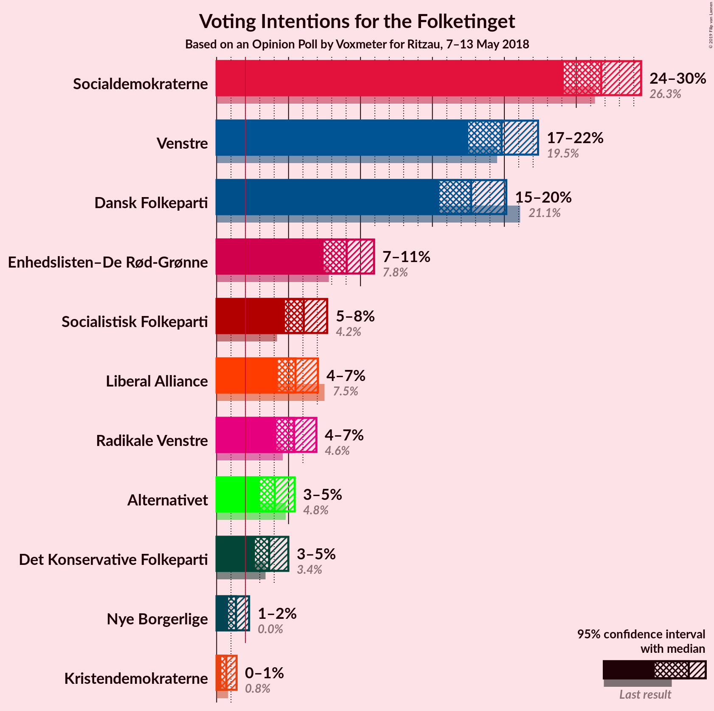
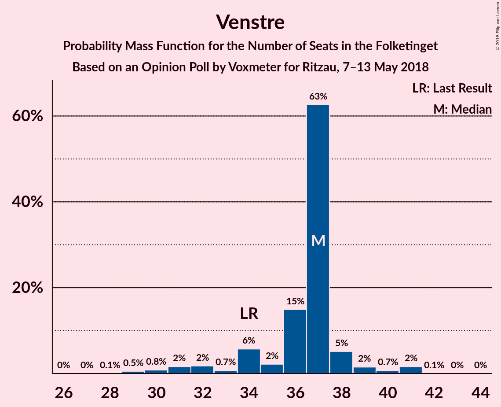
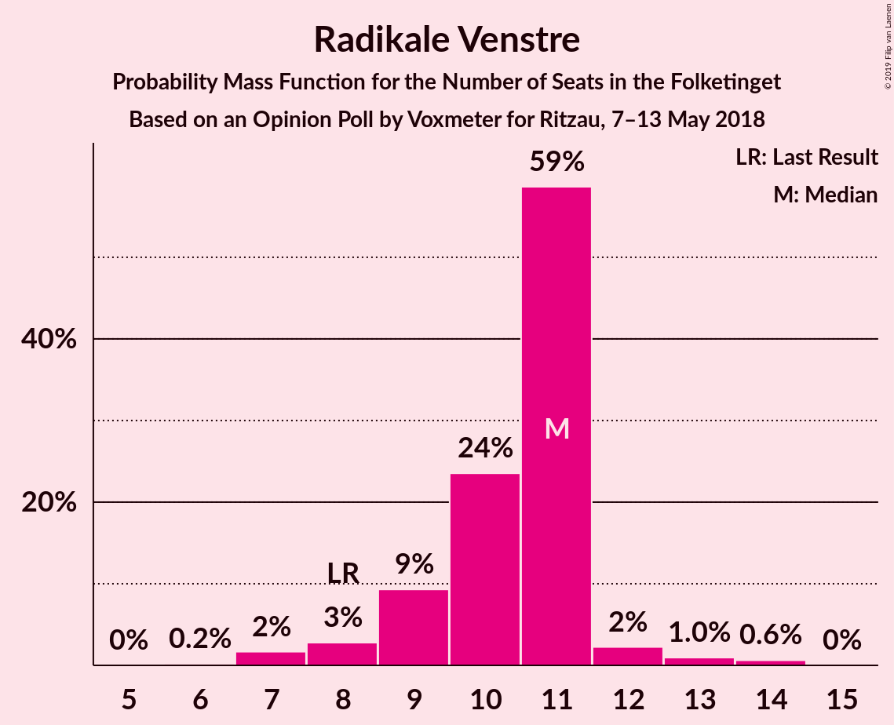
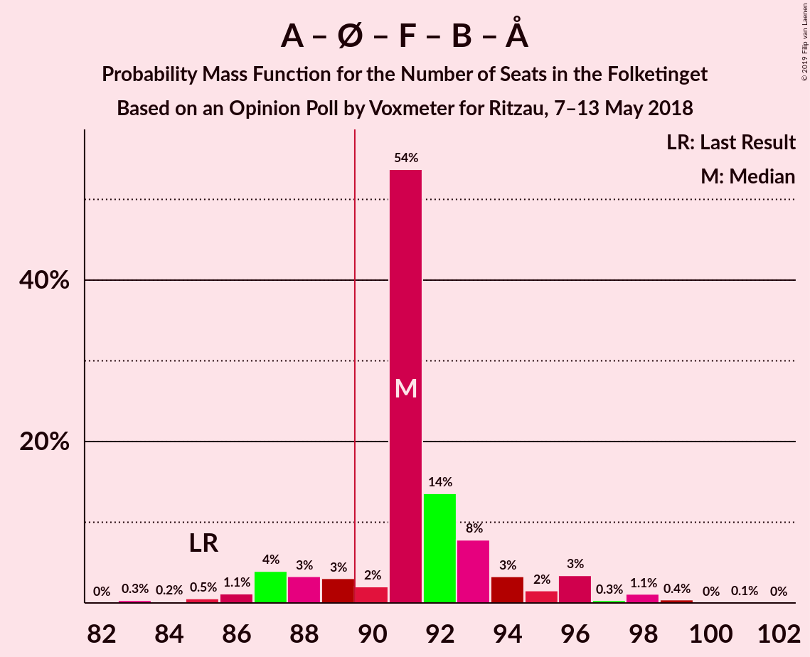
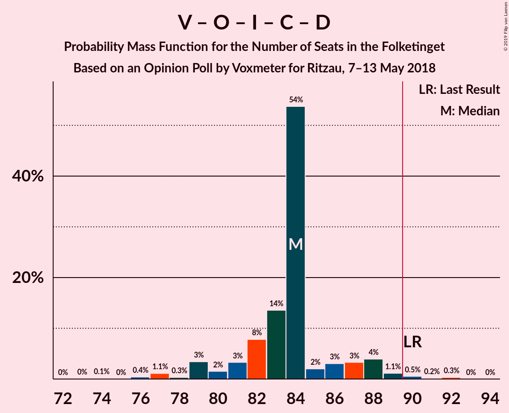
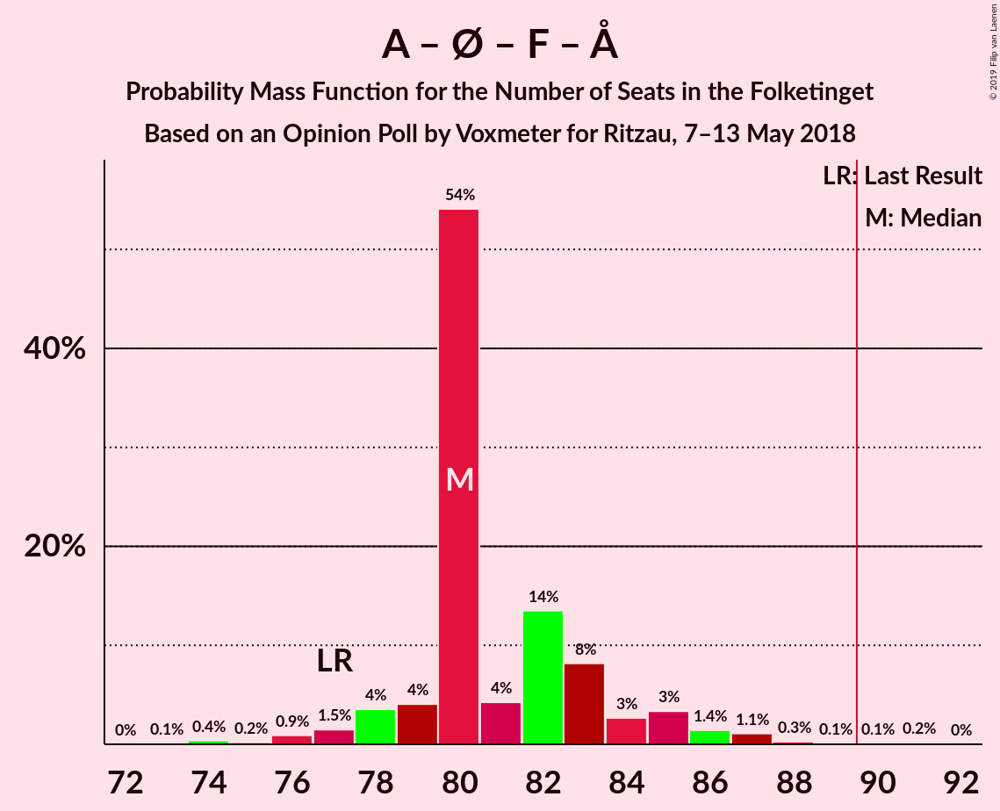
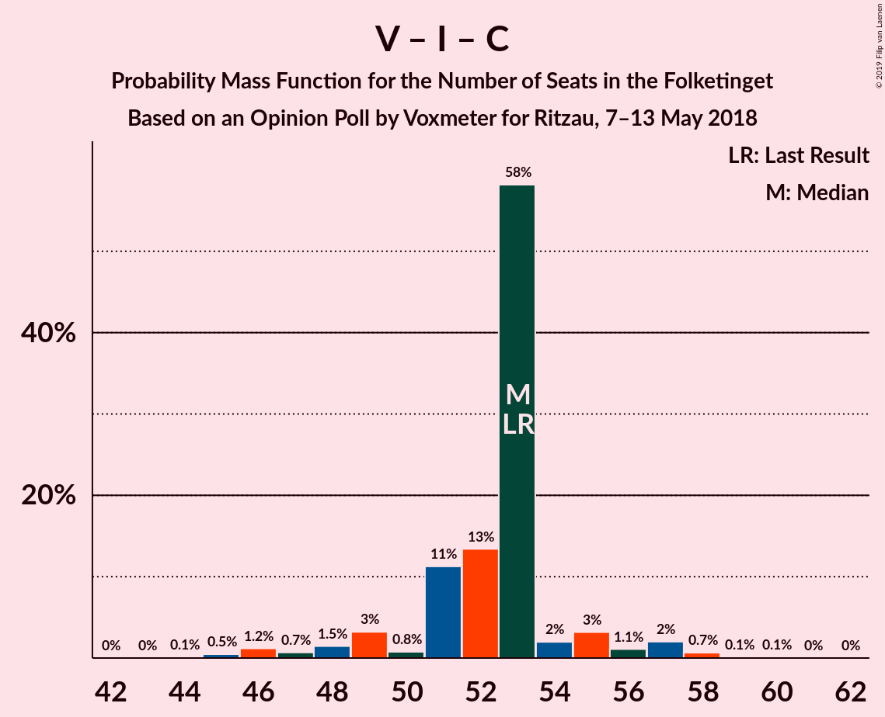
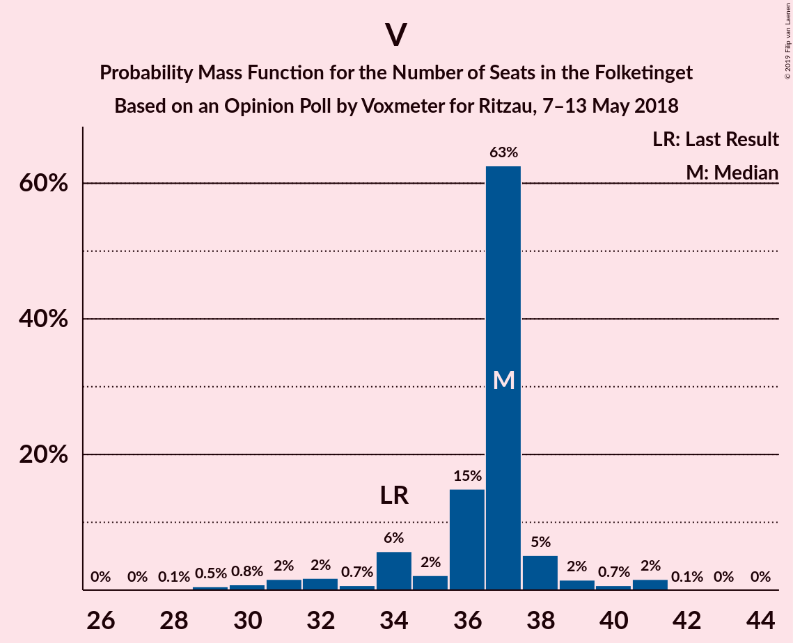

# Opinion Poll by Voxmeter for Ritzau, 7–13 May 2018

<a href="#voting-intentions">Voting Intentions</a> | <a href="#seats">Seats</a> | <a href="#coalitions">Coalitions</a> | <a href="#technical-information">Technical Information</a>

## Voting Intentions

### Confidence Intervals

| Party | Last Result | Poll Result | 80% Confidence Interval | 90% Confidence Interval | 95% Confidence Interval | 99% Confidence Interval |
|:-----:|:-----------:|:-----------:|:-----------------------:|:-----------------------:|:-----------------------:|:-----------------------:|
| Socialdemokraterne | 26.3% | 26.7% | 25.0–28.5% |24.5–29.1% |24.1–29.5% |23.3–30.4% |
| Venstre | 19.5% | 19.8% | 18.3–21.5% |17.9–21.9% |17.5–22.3% |16.8–23.2% |
| Dansk Folkeparti | 21.1% | 17.7% | 16.2–19.3% |15.8–19.7% |15.5–20.1% |14.8–20.9% |
| Enhedslisten–De Rød-Grønne | 7.8% | 9.0% | 8.0–10.3% |7.7–10.6% |7.4–10.9% |7.0–11.6% |
| Socialistisk Folkeparti | 4.2% | 6.1% | 5.2–7.1% |5.0–7.4% |4.8–7.7% |4.4–8.2% |
| Liberal Alliance | 7.5% | 5.5% | 4.7–6.5% |4.4–6.8% |4.3–7.0% |3.9–7.6% |
| Radikale Venstre | 4.6% | 5.4% | 4.6–6.4% |4.4–6.7% |4.2–6.9% |3.8–7.5% |
| Alternativet | 4.8% | 4.0% | 3.4–4.9% |3.2–5.2% |3.0–5.4% |2.7–5.9% |
| Det Konservative Folkeparti | 3.4% | 3.7% | 3.0–4.5% |2.8–4.8% |2.7–5.0% |2.4–5.4% |
| Nye Borgerlige | 0.0% | 1.3% | 1.0–1.9% |0.9–2.1% |0.8–2.3% |0.7–2.6% |
| Kristendemokraterne | 0.8% | 0.7% | 0.4–1.1% |0.4–1.3% |0.3–1.4% |0.2–1.6% |

*Note:* The poll result column reflects the actual value used in the calculations. Published results may vary slightly, and in addition be rounded to fewer digits.

## Seats

### Confidence Intervals

| Party | Last Result | Median | 80% Confidence Interval | 90% Confidence Interval | 95% Confidence Interval | 99% Confidence Interval |
|:-----:|:-----------:|:------:|:-----------------------:|:-----------------------:|:-----------------------:|:-----------------------:|
| <a href="#socialdemokraterne">Socialdemokraterne</a> | 47 | 49 | 45–49 |43–50 |43–51 |42–53 |
| <a href="#venstre">Venstre</a> | 34 | 37 | 34–37 |33–38 |31–39 |29–41 |
| <a href="#dansk-folkeparti">Dansk Folkeparti</a> | 37 | 31 | 30–32 |28–33 |28–34 |26–37 |
| <a href="#enhedslisten–de-rød-grønne">Enhedslisten–De Rød-Grønne</a> | 14 | 14 | 14–17 |14–19 |14–19 |13–20 |
| <a href="#socialistisk-folkeparti">Socialistisk Folkeparti</a> | 7 | 11 | 9–11 |9–12 |9–13 |8–15 |
| <a href="#liberal-alliance">Liberal Alliance</a> | 13 | 10 | 8–10 |8–11 |8–12 |7–13 |
| <a href="#radikale-venstre">Radikale Venstre</a> | 8 | 11 | 9–11 |9–11 |8–12 |7–14 |
| <a href="#alternativet">Alternativet</a> | 9 | 6 | 6–9 |6–9 |6–9 |5–10 |
| <a href="#det-konservative-folkeparti">Det Konservative Folkeparti</a> | 6 | 6 | 6–7 |5–8 |5–8 |5–10 |
| <a href="#nye-borgerlige">Nye Borgerlige</a> | 0 | 0 | 0 |0–4 |0–4 |0–5 |
| <a href="#kristendemokraterne">Kristendemokraterne</a> | 0 | 0 | 0 |0 |0 |0 |

### Socialdemokraterne

*For a full overview of the results for this party, see the [Socialdemokraterne](party-socialdemokraterne.html) page.*

| Number of Seats | Probability | Accumulated | Special Marks |
|:---------------:|:-----------:|:-----------:|:-------------:|
| 40 | 0.1% | 100% |  |
| 41 | 0.2% | 99.8% |  |
| 42 | 0.5% | 99.6% |  |
| 43 | 4% | 99.1% |  |
| 44 | 2% | 95% |  |
| 45 | 4% | 93% |  |
| 46 | 2% | 88% |  |
| 47 | 20% | 86% | Last Result |
| 48 | 3% | 66% |  |
| 49 | 58% | 64% | Median |
| 50 | 2% | 6% |  |
| 51 | 1.3% | 4% |  |
| 52 | 2% | 2% |  |
| 53 | 0.5% | 0.7% |  |
| 54 | 0.1% | 0.2% |  |
| 55 | 0% | 0.1% |  |
| 56 | 0.1% | 0.1% |  |
| 57 | 0% | 0% |  |

### Venstre

*For a full overview of the results for this party, see the [Venstre](party-venstre.html) page.*

| Number of Seats | Probability | Accumulated | Special Marks |
|:---------------:|:-----------:|:-----------:|:-------------:|
| 28 | 0.1% | 100% |  |
| 29 | 0.5% | 99.9% |  |
| 30 | 0.8% | 99.4% |  |
| 31 | 2% | 98.6% |  |
| 32 | 2% | 97% |  |
| 33 | 0.7% | 95% |  |
| 34 | 6% | 94% | Last Result |
| 35 | 2% | 89% |  |
| 36 | 15% | 87% |  |
| 37 | 63% | 72% | Median |
| 38 | 5% | 9% |  |
| 39 | 2% | 4% |  |
| 40 | 0.7% | 2% |  |
| 41 | 2% | 2% |  |
| 42 | 0.1% | 0.1% |  |
| 43 | 0% | 0.1% |  |
| 44 | 0% | 0% |  |

### Dansk Folkeparti

*For a full overview of the results for this party, see the [Dansk Folkeparti](party-danskfolkeparti.html) page.*

| Number of Seats | Probability | Accumulated | Special Marks |
|:---------------:|:-----------:|:-----------:|:-------------:|
| 26 | 0.9% | 100% |  |
| 27 | 1.0% | 99.0% |  |
| 28 | 5% | 98% |  |
| 29 | 2% | 93% |  |
| 30 | 4% | 90% |  |
| 31 | 76% | 87% | Median |
| 32 | 3% | 11% |  |
| 33 | 5% | 9% |  |
| 34 | 2% | 4% |  |
| 35 | 1.1% | 2% |  |
| 36 | 0.3% | 0.9% |  |
| 37 | 0% | 0.5% | Last Result |
| 38 | 0.1% | 0.5% |  |
| 39 | 0.4% | 0.4% |  |
| 40 | 0% | 0% |  |

### Enhedslisten–De Rød-Grønne

*For a full overview of the results for this party, see the [Enhedslisten–De Rød-Grønne](party-enhedslisten–derød-grønne.html) page.*

| Number of Seats | Probability | Accumulated | Special Marks |
|:---------------:|:-----------:|:-----------:|:-------------:|
| 12 | 0.3% | 100% |  |
| 13 | 2% | 99.7% |  |
| 14 | 57% | 98% | Last Result, Median |
| 15 | 3% | 41% |  |
| 16 | 7% | 38% |  |
| 17 | 21% | 30% |  |
| 18 | 4% | 9% |  |
| 19 | 4% | 5% |  |
| 20 | 1.2% | 2% |  |
| 21 | 0.3% | 0.4% |  |
| 22 | 0% | 0.1% |  |
| 23 | 0% | 0% |  |

### Socialistisk Folkeparti

*For a full overview of the results for this party, see the [Socialistisk Folkeparti](party-socialistiskfolkeparti.html) page.*

| Number of Seats | Probability | Accumulated | Special Marks |
|:---------------:|:-----------:|:-----------:|:-------------:|
| 7 | 0.1% | 100% | Last Result |
| 8 | 0.9% | 99.9% |  |
| 9 | 18% | 99.0% |  |
| 10 | 11% | 81% |  |
| 11 | 61% | 70% | Median |
| 12 | 5% | 9% |  |
| 13 | 2% | 4% |  |
| 14 | 1.4% | 2% |  |
| 15 | 0.5% | 0.5% |  |
| 16 | 0% | 0% |  |

### Liberal Alliance

*For a full overview of the results for this party, see the [Liberal Alliance](party-liberalalliance.html) page.*

| Number of Seats | Probability | Accumulated | Special Marks |
|:---------------:|:-----------:|:-----------:|:-------------:|
| 6 | 0.1% | 100% |  |
| 7 | 2% | 99.9% |  |
| 8 | 8% | 98% |  |
| 9 | 8% | 90% |  |
| 10 | 74% | 82% | Median |
| 11 | 5% | 9% |  |
| 12 | 2% | 4% |  |
| 13 | 2% | 2% | Last Result |
| 14 | 0.1% | 0.1% |  |
| 15 | 0.1% | 0.1% |  |
| 16 | 0% | 0% |  |

### Radikale Venstre

*For a full overview of the results for this party, see the [Radikale Venstre](party-radikalevenstre.html) page.*

| Number of Seats | Probability | Accumulated | Special Marks |
|:---------------:|:-----------:|:-----------:|:-------------:|
| 6 | 0.2% | 100% |  |
| 7 | 2% | 99.8% |  |
| 8 | 3% | 98% | Last Result |
| 9 | 9% | 95% |  |
| 10 | 24% | 86% |  |
| 11 | 59% | 62% | Median |
| 12 | 2% | 4% |  |
| 13 | 1.0% | 2% |  |
| 14 | 0.6% | 0.6% |  |
| 15 | 0% | 0% |  |

### Alternativet

*For a full overview of the results for this party, see the [Alternativet](party-alternativet.html) page.*

| Number of Seats | Probability | Accumulated | Special Marks |
|:---------------:|:-----------:|:-----------:|:-------------:|
| 4 | 0.3% | 100% |  |
| 5 | 2% | 99.7% |  |
| 6 | 60% | 98% | Median |
| 7 | 4% | 38% |  |
| 8 | 13% | 33% |  |
| 9 | 20% | 21% | Last Result |
| 10 | 0.7% | 0.9% |  |
| 11 | 0.1% | 0.2% |  |
| 12 | 0% | 0% |  |

### Det Konservative Folkeparti

*For a full overview of the results for this party, see the [Det Konservative Folkeparti](party-detkonservativefolkeparti.html) page.*

| Number of Seats | Probability | Accumulated | Special Marks |
|:---------------:|:-----------:|:-----------:|:-------------:|
| 4 | 0.3% | 100% |  |
| 5 | 7% | 99.7% |  |
| 6 | 80% | 93% | Last Result, Median |
| 7 | 5% | 13% |  |
| 8 | 6% | 8% |  |
| 9 | 1.1% | 2% |  |
| 10 | 0.6% | 0.6% |  |
| 11 | 0% | 0% |  |

### Nye Borgerlige

*For a full overview of the results for this party, see the [Nye Borgerlige](party-nyeborgerlige.html) page.*

| Number of Seats | Probability | Accumulated | Special Marks |
|:---------------:|:-----------:|:-----------:|:-------------:|
| 0 | 94% | 100% | Last Result, Median |
| 1 | 0% | 6% |  |
| 2 | 0% | 6% |  |
| 3 | 0.2% | 6% |  |
| 4 | 5% | 6% |  |
| 5 | 1.1% | 1.1% |  |
| 6 | 0% | 0% |  |

### Kristendemokraterne

*For a full overview of the results for this party, see the [Kristendemokraterne](party-kristendemokraterne.html) page.*

| Number of Seats | Probability | Accumulated | Special Marks |
|:---------------:|:-----------:|:-----------:|:-------------:|
| 0 | 100% | 100% | Last Result, Median |

## Coalitions

### Confidence Intervals

| Coalition | Last Result | Median | Majority? | 80% Confidence Interval | 90% Confidence Interval | 95% Confidence Interval | 99% Confidence Interval |
|:---------:|:-----------:|:------:|:---------:|:-----------------------:|:-----------------------:|:-----------------------:|:-----------------------:|
| Socialdemokraterne – Enhedslisten–De Rød-Grønne – Socialistisk Folkeparti – Radikale Venstre – Alternativet | 85 | 91 | 87% | 89–94 | 87–96 | 87–96 | 84–99 |
| Socialdemokraterne – Enhedslisten–De Rød-Grønne – Socialistisk Folkeparti – Radikale Venstre | 76 | 85 | 2% | 81–86 | 80–88 | 80–89 | 77–92 |
| Venstre – Dansk Folkeparti – Liberal Alliance – Det Konservative Folkeparti – Nye Borgerlige – Kristendemokraterne | 90 | 84 | 1.1% | 81–86 | 79–88 | 79–88 | 76–91 |
| Venstre – Dansk Folkeparti – Liberal Alliance – Det Konservative Folkeparti – Nye Borgerlige | 90 | 84 | 1.1% | 81–86 | 79–88 | 79–88 | 76–91 |
| Venstre – Dansk Folkeparti – Liberal Alliance – Det Konservative Folkeparti – Kristendemokraterne | 90 | 84 | 0.7% | 81–85 | 79–87 | 79–87 | 76–90 |
| Venstre – Dansk Folkeparti – Liberal Alliance – Det Konservative Folkeparti | 90 | 84 | 0.7% | 81–85 | 79–87 | 79–87 | 76–90 |
| Socialdemokraterne – Enhedslisten–De Rød-Grønne – Socialistisk Folkeparti – Alternativet | 77 | 80 | 0.3% | 79–83 | 78–85 | 77–86 | 74–88 |
| Socialdemokraterne – Enhedslisten–De Rød-Grønne – Socialistisk Folkeparti | 68 | 74 | 0% | 72–76 | 71–78 | 70–79 | 67–80 |
| Socialdemokraterne – Socialistisk Folkeparti – Radikale Venstre | 62 | 71 | 0% | 66–71 | 64–71 | 63–74 | 61–74 |
| Socialdemokraterne – Radikale Venstre | 55 | 60 | 0% | 55–60 | 53–60 | 52–62 | 51–63 |
| Venstre – Liberal Alliance – Det Konservative Folkeparti | 53 | 53 | 0% | 51–53 | 49–55 | 48–57 | 45–58 |
| Venstre – Det Konservative Folkeparti | 40 | 43 | 0% | 42–43 | 39–45 | 38–46 | 36–47 |
| Venstre | 34 | 37 | 0% | 34–37 | 33–38 | 31–39 | 29–41 |

### Socialdemokraterne – Enhedslisten–De Rød-Grønne – Socialistisk Folkeparti – Radikale Venstre – Alternativet

| Number of Seats | Probability | Accumulated | Special Marks |
|:---------------:|:-----------:|:-----------:|:-------------:|
| 82 | 0% | 100% |  |
| 83 | 0.3% | 99.9% |  |
| 84 | 0.2% | 99.6% |  |
| 85 | 0.5% | 99.4% | Last Result |
| 86 | 1.1% | 98.9% |  |
| 87 | 4% | 98% |  |
| 88 | 3% | 94% |  |
| 89 | 3% | 91% |  |
| 90 | 2% | 87% | Majority |
| 91 | 54% | 85% | Median |
| 92 | 14% | 32% |  |
| 93 | 8% | 18% |  |
| 94 | 3% | 10% |  |
| 95 | 2% | 7% |  |
| 96 | 3% | 5% |  |
| 97 | 0.3% | 2% |  |
| 98 | 1.1% | 2% |  |
| 99 | 0.4% | 0.6% |  |
| 100 | 0% | 0.2% |  |
| 101 | 0.1% | 0.2% |  |
| 102 | 0% | 0% |  |

### Socialdemokraterne – Enhedslisten–De Rød-Grønne – Socialistisk Folkeparti – Radikale Venstre

| Number of Seats | Probability | Accumulated | Special Marks |
|:---------------:|:-----------:|:-----------:|:-------------:|
| 75 | 0.4% | 100% |  |
| 76 | 0.1% | 99.6% | Last Result |
| 77 | 0.5% | 99.5% |  |
| 78 | 0.5% | 99.1% |  |
| 79 | 0.4% | 98.6% |  |
| 80 | 4% | 98% |  |
| 81 | 6% | 94% |  |
| 82 | 1.4% | 88% |  |
| 83 | 14% | 87% |  |
| 84 | 8% | 73% |  |
| 85 | 54% | 66% | Median |
| 86 | 2% | 12% |  |
| 87 | 3% | 10% |  |
| 88 | 4% | 7% |  |
| 89 | 1.1% | 3% |  |
| 90 | 1.3% | 2% | Majority |
| 91 | 0.4% | 0.9% |  |
| 92 | 0.3% | 0.5% |  |
| 93 | 0.2% | 0.2% |  |
| 94 | 0% | 0% |  |

### Venstre – Dansk Folkeparti – Liberal Alliance – Det Konservative Folkeparti – Nye Borgerlige – Kristendemokraterne

| Number of Seats | Probability | Accumulated | Special Marks |
|:---------------:|:-----------:|:-----------:|:-------------:|
| 74 | 0.1% | 100% |  |
| 75 | 0% | 99.8% |  |
| 76 | 0.4% | 99.8% |  |
| 77 | 1.1% | 99.4% |  |
| 78 | 0.3% | 98% |  |
| 79 | 3% | 98% |  |
| 80 | 2% | 95% |  |
| 81 | 3% | 93% |  |
| 82 | 8% | 90% |  |
| 83 | 14% | 82% |  |
| 84 | 54% | 68% | Median |
| 85 | 2% | 15% |  |
| 86 | 3% | 13% |  |
| 87 | 3% | 9% |  |
| 88 | 4% | 6% |  |
| 89 | 1.1% | 2% |  |
| 90 | 0.5% | 1.1% | Last Result, Majority |
| 91 | 0.2% | 0.6% |  |
| 92 | 0.3% | 0.4% |  |
| 93 | 0% | 0.1% |  |
| 94 | 0% | 0% |  |

### Venstre – Dansk Folkeparti – Liberal Alliance – Det Konservative Folkeparti – Nye Borgerlige

| Number of Seats | Probability | Accumulated | Special Marks |
|:---------------:|:-----------:|:-----------:|:-------------:|
| 74 | 0.1% | 100% |  |
| 75 | 0% | 99.8% |  |
| 76 | 0.4% | 99.8% |  |
| 77 | 1.1% | 99.4% |  |
| 78 | 0.3% | 98% |  |
| 79 | 3% | 98% |  |
| 80 | 2% | 95% |  |
| 81 | 3% | 93% |  |
| 82 | 8% | 90% |  |
| 83 | 14% | 82% |  |
| 84 | 54% | 68% | Median |
| 85 | 2% | 15% |  |
| 86 | 3% | 13% |  |
| 87 | 3% | 9% |  |
| 88 | 4% | 6% |  |
| 89 | 1.1% | 2% |  |
| 90 | 0.5% | 1.1% | Last Result, Majority |
| 91 | 0.2% | 0.6% |  |
| 92 | 0.3% | 0.4% |  |
| 93 | 0% | 0.1% |  |
| 94 | 0% | 0% |  |

### Venstre – Dansk Folkeparti – Liberal Alliance – Det Konservative Folkeparti – Kristendemokraterne

| Number of Seats | Probability | Accumulated | Special Marks |
|:---------------:|:-----------:|:-----------:|:-------------:|
| 73 | 0.1% | 100% |  |
| 74 | 0.2% | 99.9% |  |
| 75 | 0.1% | 99.8% |  |
| 76 | 0.4% | 99.7% |  |
| 77 | 1.2% | 99.3% |  |
| 78 | 0.4% | 98% |  |
| 79 | 4% | 98% |  |
| 80 | 2% | 93% |  |
| 81 | 4% | 92% |  |
| 82 | 8% | 88% |  |
| 83 | 14% | 80% |  |
| 84 | 56% | 66% | Median |
| 85 | 2% | 10% |  |
| 86 | 3% | 8% |  |
| 87 | 3% | 6% |  |
| 88 | 1.0% | 2% |  |
| 89 | 0.8% | 1.5% |  |
| 90 | 0.5% | 0.7% | Last Result, Majority |
| 91 | 0.1% | 0.1% |  |
| 92 | 0% | 0.1% |  |
| 93 | 0% | 0.1% |  |
| 94 | 0% | 0% |  |

### Venstre – Dansk Folkeparti – Liberal Alliance – Det Konservative Folkeparti

| Number of Seats | Probability | Accumulated | Special Marks |
|:---------------:|:-----------:|:-----------:|:-------------:|
| 73 | 0.1% | 100% |  |
| 74 | 0.2% | 99.9% |  |
| 75 | 0.1% | 99.8% |  |
| 76 | 0.4% | 99.7% |  |
| 77 | 1.2% | 99.3% |  |
| 78 | 0.4% | 98% |  |
| 79 | 4% | 98% |  |
| 80 | 2% | 93% |  |
| 81 | 4% | 92% |  |
| 82 | 8% | 88% |  |
| 83 | 14% | 80% |  |
| 84 | 56% | 66% | Median |
| 85 | 2% | 10% |  |
| 86 | 3% | 8% |  |
| 87 | 3% | 6% |  |
| 88 | 1.0% | 2% |  |
| 89 | 0.8% | 1.5% |  |
| 90 | 0.5% | 0.7% | Last Result, Majority |
| 91 | 0.1% | 0.1% |  |
| 92 | 0% | 0.1% |  |
| 93 | 0% | 0.1% |  |
| 94 | 0% | 0% |  |

### Socialdemokraterne – Enhedslisten–De Rød-Grønne – Socialistisk Folkeparti – Alternativet

| Number of Seats | Probability | Accumulated | Special Marks |
|:---------------:|:-----------:|:-----------:|:-------------:|
| 72 | 0% | 100% |  |
| 73 | 0.1% | 99.9% |  |
| 74 | 0.4% | 99.8% |  |
| 75 | 0.2% | 99.5% |  |
| 76 | 0.9% | 99.3% |  |
| 77 | 1.5% | 98% | Last Result |
| 78 | 4% | 97% |  |
| 79 | 4% | 93% |  |
| 80 | 54% | 89% | Median |
| 81 | 4% | 35% |  |
| 82 | 14% | 31% |  |
| 83 | 8% | 17% |  |
| 84 | 3% | 9% |  |
| 85 | 3% | 7% |  |
| 86 | 1.4% | 3% |  |
| 87 | 1.1% | 2% |  |
| 88 | 0.3% | 0.7% |  |
| 89 | 0.1% | 0.4% |  |
| 90 | 0.1% | 0.3% | Majority |
| 91 | 0.2% | 0.2% |  |
| 92 | 0% | 0% |  |

### Socialdemokraterne – Enhedslisten–De Rød-Grønne – Socialistisk Folkeparti

| Number of Seats | Probability | Accumulated | Special Marks |
|:---------------:|:-----------:|:-----------:|:-------------:|
| 66 | 0.5% | 100% |  |
| 67 | 0.1% | 99.5% |  |
| 68 | 0.7% | 99.4% | Last Result |
| 69 | 0.9% | 98.7% |  |
| 70 | 0.5% | 98% |  |
| 71 | 4% | 97% |  |
| 72 | 4% | 94% |  |
| 73 | 16% | 89% |  |
| 74 | 62% | 73% | Median |
| 75 | 1.3% | 11% |  |
| 76 | 0.5% | 10% |  |
| 77 | 4% | 10% |  |
| 78 | 3% | 6% |  |
| 79 | 2% | 3% |  |
| 80 | 0.5% | 0.8% |  |
| 81 | 0% | 0.4% |  |
| 82 | 0.1% | 0.3% |  |
| 83 | 0.2% | 0.3% |  |
| 84 | 0.1% | 0.1% |  |
| 85 | 0% | 0% |  |

### Socialdemokraterne – Socialistisk Folkeparti – Radikale Venstre

| Number of Seats | Probability | Accumulated | Special Marks |
|:---------------:|:-----------:|:-----------:|:-------------:|
| 60 | 0.4% | 100% |  |
| 61 | 0.5% | 99.6% |  |
| 62 | 0.5% | 99.1% | Last Result |
| 63 | 3% | 98.6% |  |
| 64 | 3% | 96% |  |
| 65 | 2% | 93% |  |
| 66 | 15% | 91% |  |
| 67 | 10% | 77% |  |
| 68 | 2% | 67% |  |
| 69 | 4% | 65% |  |
| 70 | 2% | 61% |  |
| 71 | 54% | 59% | Median |
| 72 | 1.4% | 5% |  |
| 73 | 0.6% | 3% |  |
| 74 | 2% | 3% |  |
| 75 | 0.1% | 0.5% |  |
| 76 | 0.3% | 0.3% |  |
| 77 | 0.1% | 0.1% |  |
| 78 | 0% | 0% |  |

### Socialdemokraterne – Radikale Venstre

| Number of Seats | Probability | Accumulated | Special Marks |
|:---------------:|:-----------:|:-----------:|:-------------:|
| 50 | 0.4% | 100% |  |
| 51 | 0.7% | 99.6% |  |
| 52 | 4% | 98.9% |  |
| 53 | 2% | 95% |  |
| 54 | 2% | 93% |  |
| 55 | 3% | 91% | Last Result |
| 56 | 3% | 89% |  |
| 57 | 20% | 86% |  |
| 58 | 3% | 66% |  |
| 59 | 3% | 63% |  |
| 60 | 57% | 61% | Median |
| 61 | 1.0% | 4% |  |
| 62 | 0.7% | 3% |  |
| 63 | 2% | 2% |  |
| 64 | 0.3% | 0.4% |  |
| 65 | 0.1% | 0.1% |  |
| 66 | 0% | 0% |  |

### Venstre – Liberal Alliance – Det Konservative Folkeparti

| Number of Seats | Probability | Accumulated | Special Marks |
|:---------------:|:-----------:|:-----------:|:-------------:|
| 44 | 0.1% | 100% |  |
| 45 | 0.5% | 99.9% |  |
| 46 | 1.2% | 99.4% |  |
| 47 | 0.7% | 98% |  |
| 48 | 1.5% | 98% |  |
| 49 | 3% | 96% |  |
| 50 | 0.8% | 93% |  |
| 51 | 11% | 92% |  |
| 52 | 13% | 81% |  |
| 53 | 58% | 67% | Last Result, Median |
| 54 | 2% | 9% |  |
| 55 | 3% | 7% |  |
| 56 | 1.1% | 4% |  |
| 57 | 2% | 3% |  |
| 58 | 0.7% | 0.9% |  |
| 59 | 0.1% | 0.3% |  |
| 60 | 0.1% | 0.2% |  |
| 61 | 0% | 0.1% |  |
| 62 | 0% | 0% |  |

### Venstre – Det Konservative Folkeparti

| Number of Seats | Probability | Accumulated | Special Marks |
|:---------------:|:-----------:|:-----------:|:-------------:|
| 34 | 0.4% | 100% |  |
| 35 | 0% | 99.6% |  |
| 36 | 0.2% | 99.6% |  |
| 37 | 1.5% | 99.4% |  |
| 38 | 2% | 98% |  |
| 39 | 0.8% | 95% |  |
| 40 | 2% | 95% | Last Result |
| 41 | 2% | 93% |  |
| 42 | 17% | 91% |  |
| 43 | 66% | 74% | Median |
| 44 | 3% | 8% |  |
| 45 | 2% | 6% |  |
| 46 | 2% | 4% |  |
| 47 | 2% | 2% |  |
| 48 | 0.2% | 0.3% |  |
| 49 | 0.1% | 0.2% |  |
| 50 | 0.1% | 0.1% |  |
| 51 | 0% | 0% |  |

### Venstre

| Number of Seats | Probability | Accumulated | Special Marks |
|:---------------:|:-----------:|:-----------:|:-------------:|
| 28 | 0.1% | 100% |  |
| 29 | 0.5% | 99.9% |  |
| 30 | 0.8% | 99.4% |  |
| 31 | 2% | 98.6% |  |
| 32 | 2% | 97% |  |
| 33 | 0.7% | 95% |  |
| 34 | 6% | 94% | Last Result |
| 35 | 2% | 89% |  |
| 36 | 15% | 87% |  |
| 37 | 63% | 72% | Median |
| 38 | 5% | 9% |  |
| 39 | 2% | 4% |  |
| 40 | 0.7% | 2% |  |
| 41 | 2% | 2% |  |
| 42 | 0.1% | 0.1% |  |
| 43 | 0% | 0.1% |  |
| 44 | 0% | 0% |  |

## Technical Information

### Opinion Poll

+ **Polling firm:** Voxmeter
+ **Commissioner(s):** Ritzau
+ **Fieldwork period:** 7–13 May 2018

### Calculations

+ **Sample size:** 1040
+ **Simulations done:** 1,048,576
+ **Error estimate:** 1.71%

