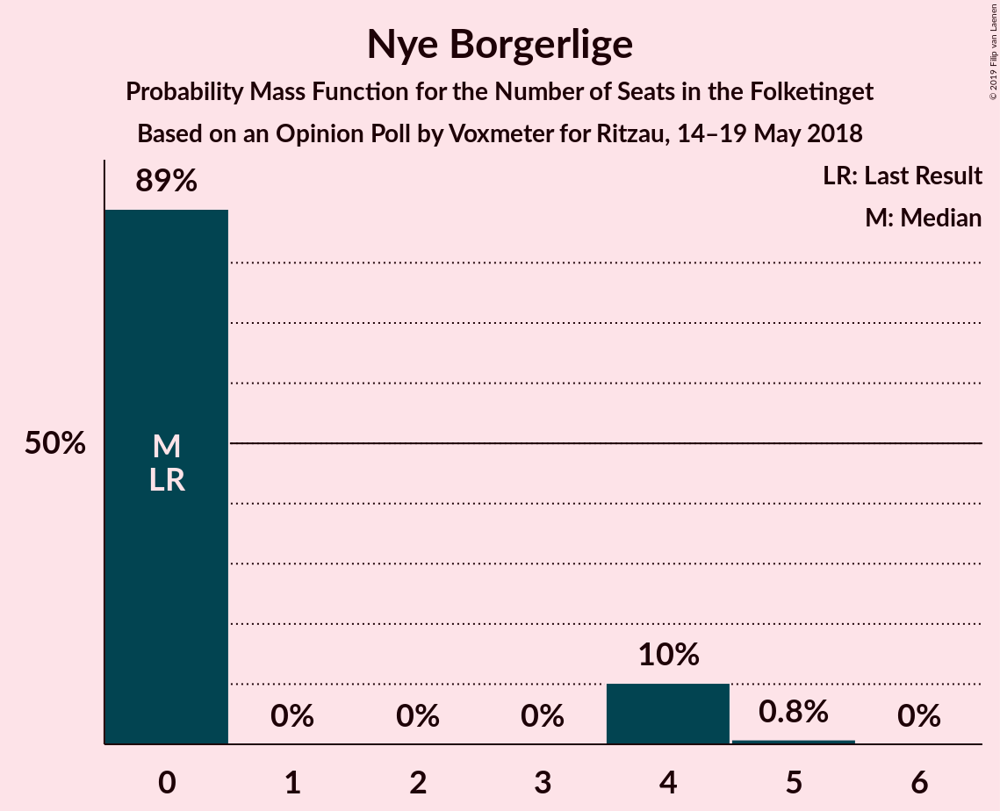

# Opinion Poll by Voxmeter for Ritzau, 14–19 May 2018

<a href="#voting-intentions">Voting Intentions</a> | <a href="#seats">Seats</a> | <a href="#coalitions">Coalitions</a> | <a href="#technical-information">Technical Information</a>

## Voting Intentions

### Confidence Intervals

| Party | Last Result | Poll Result | 80% Confidence Interval | 90% Confidence Interval | 95% Confidence Interval | 99% Confidence Interval |
|:-----:|:-----------:|:-----------:|:-----------------------:|:-----------------------:|:-----------------------:|:-----------------------:|
| Socialdemokraterne | 26.3% | 25.3% | 23.6–27.1% |23.2–27.6% |22.8–28.1% |22.0–28.9% |
| Venstre | 19.5% | 20.0% | 18.4–21.7% |18.0–22.1% |17.6–22.5% |16.9–23.4% |
| Dansk Folkeparti | 21.1% | 18.3% | 16.9–20.0% |16.4–20.4% |16.1–20.8% |15.4–21.6% |
| Enhedslisten–De Rød-Grønne | 7.8% | 9.4% | 8.3–10.7% |8.0–11.0% |7.8–11.4% |7.3–12.0% |
| Radikale Venstre | 4.6% | 6.0% | 5.2–7.1% |4.9–7.4% |4.7–7.6% |4.3–8.2% |
| Socialistisk Folkeparti | 4.2% | 5.8% | 5.0–6.9% |4.7–7.2% |4.5–7.4% |4.2–8.0% |
| Liberal Alliance | 7.5% | 5.2% | 4.4–6.2% |4.2–6.5% |4.0–6.8% |3.7–7.3% |
| Det Konservative Folkeparti | 3.4% | 4.0% | 3.3–4.9% |3.1–5.1% |2.9–5.4% |2.7–5.8% |
| Alternativet | 4.8% | 3.3% | 2.7–4.1% |2.5–4.4% |2.4–4.6% |2.1–5.0% |
| Nye Borgerlige | 0.0% | 1.5% | 1.1–2.1% |1.0–2.2% |0.9–2.4% |0.7–2.7% |
| Kristendemokraterne | 0.8% | 1.1% | 0.7–1.6% |0.7–1.8% |0.6–1.9% |0.5–2.2% |

*Note:* The poll result column reflects the actual value used in the calculations. Published results may vary slightly, and in addition be rounded to fewer digits.

## Seats

### Confidence Intervals

| Party | Last Result | Median | 80% Confidence Interval | 90% Confidence Interval | 95% Confidence Interval | 99% Confidence Interval |
|:-----:|:-----------:|:------:|:-----------------------:|:-----------------------:|:-----------------------:|:-----------------------:|
| <a href="#socialdemokraterne">Socialdemokraterne</a> | 47 | 48 | 43–49 |42–50 |42–50 |39–52 |
| <a href="#venstre">Venstre</a> | 34 | 34 | 33–38 |33–38 |32–39 |30–41 |
| <a href="#dansk-folkeparti">Dansk Folkeparti</a> | 37 | 34 | 30–34 |30–35 |29–36 |27–37 |
| <a href="#enhedslisten–de-rød-grønne">Enhedslisten–De Rød-Grønne</a> | 14 | 17 | 15–19 |15–20 |15–20 |14–21 |
| <a href="#radikale-venstre">Radikale Venstre</a> | 8 | 9 | 9–12 |9–12 |9–13 |8–15 |
| <a href="#socialistisk-folkeparti">Socialistisk Folkeparti</a> | 7 | 9 | 9–12 |8–12 |8–13 |8–14 |
| <a href="#liberal-alliance">Liberal Alliance</a> | 13 | 10 | 9–11 |8–11 |8–11 |7–13 |
| <a href="#det-konservative-folkeparti">Det Konservative Folkeparti</a> | 6 | 7 | 6–8 |6–9 |4–9 |4–10 |
| <a href="#alternativet">Alternativet</a> | 9 | 7 | 5–7 |5–7 |4–8 |0–9 |
| <a href="#nye-borgerlige">Nye Borgerlige</a> | 0 | 0 | 0–4 |0–4 |0–4 |0–5 |
| <a href="#kristendemokraterne">Kristendemokraterne</a> | 0 | 0 | 0 |0 |0 |0–4 |

### Socialdemokraterne

*For a full overview of the results for this party, see the [Socialdemokraterne](party-socialdemokraterne.html) page.*

| Number of Seats | Probability | Accumulated | Special Marks |
|:---------------:|:-----------:|:-----------:|:-------------:|
| 37 | 0% | 100% |  |
| 38 | 0.1% | 99.9% |  |
| 39 | 0.6% | 99.9% |  |
| 40 | 0.4% | 99.2% |  |
| 41 | 0.5% | 98.8% |  |
| 42 | 8% | 98% |  |
| 43 | 8% | 90% |  |
| 44 | 3% | 82% |  |
| 45 | 8% | 80% |  |
| 46 | 7% | 72% |  |
| 47 | 4% | 65% | Last Result |
| 48 | 51% | 61% | Median |
| 49 | 0.6% | 10% |  |
| 50 | 9% | 9% |  |
| 51 | 0.2% | 0.7% |  |
| 52 | 0.1% | 0.5% |  |
| 53 | 0% | 0.5% |  |
| 54 | 0.5% | 0.5% |  |
| 55 | 0% | 0% |  |

### Venstre

*For a full overview of the results for this party, see the [Venstre](party-venstre.html) page.*

| Number of Seats | Probability | Accumulated | Special Marks |
|:---------------:|:-----------:|:-----------:|:-------------:|
| 30 | 0.7% | 100% |  |
| 31 | 0.5% | 99.3% |  |
| 32 | 3% | 98.8% |  |
| 33 | 7% | 96% |  |
| 34 | 56% | 89% | Last Result, Median |
| 35 | 9% | 33% |  |
| 36 | 3% | 24% |  |
| 37 | 11% | 21% |  |
| 38 | 7% | 11% |  |
| 39 | 2% | 4% |  |
| 40 | 0.2% | 2% |  |
| 41 | 2% | 2% |  |
| 42 | 0.1% | 0.3% |  |
| 43 | 0.1% | 0.2% |  |
| 44 | 0% | 0% |  |

### Dansk Folkeparti

*For a full overview of the results for this party, see the [Dansk Folkeparti](party-danskfolkeparti.html) page.*

| Number of Seats | Probability | Accumulated | Special Marks |
|:---------------:|:-----------:|:-----------:|:-------------:|
| 26 | 0.1% | 100% |  |
| 27 | 0.5% | 99.9% |  |
| 28 | 2% | 99.4% |  |
| 29 | 2% | 98% |  |
| 30 | 14% | 96% |  |
| 31 | 2% | 82% |  |
| 32 | 7% | 80% |  |
| 33 | 9% | 72% |  |
| 34 | 53% | 63% | Median |
| 35 | 5% | 10% |  |
| 36 | 3% | 4% |  |
| 37 | 0.7% | 1.2% | Last Result |
| 38 | 0.2% | 0.5% |  |
| 39 | 0.2% | 0.3% |  |
| 40 | 0% | 0.1% |  |
| 41 | 0.1% | 0.1% |  |
| 42 | 0% | 0% |  |

### Enhedslisten–De Rød-Grønne

*For a full overview of the results for this party, see the [Enhedslisten–De Rød-Grønne](party-enhedslisten–derød-grønne.html) page.*

| Number of Seats | Probability | Accumulated | Special Marks |
|:---------------:|:-----------:|:-----------:|:-------------:|
| 11 | 0.1% | 100% |  |
| 12 | 0.1% | 99.9% |  |
| 13 | 0.3% | 99.9% |  |
| 14 | 2% | 99.5% | Last Result |
| 15 | 17% | 98% |  |
| 16 | 4% | 81% |  |
| 17 | 53% | 77% | Median |
| 18 | 6% | 24% |  |
| 19 | 11% | 17% |  |
| 20 | 5% | 6% |  |
| 21 | 0.5% | 0.7% |  |
| 22 | 0.2% | 0.2% |  |
| 23 | 0% | 0% |  |

### Radikale Venstre

*For a full overview of the results for this party, see the [Radikale Venstre](party-radikalevenstre.html) page.*

| Number of Seats | Probability | Accumulated | Special Marks |
|:---------------:|:-----------:|:-----------:|:-------------:|
| 7 | 0.1% | 100% |  |
| 8 | 2% | 99.9% | Last Result |
| 9 | 53% | 98% | Median |
| 10 | 7% | 44% |  |
| 11 | 24% | 37% |  |
| 12 | 8% | 13% |  |
| 13 | 3% | 5% |  |
| 14 | 0.4% | 1.4% |  |
| 15 | 1.0% | 1.0% |  |
| 16 | 0.1% | 0.1% |  |
| 17 | 0% | 0% |  |

### Socialistisk Folkeparti

*For a full overview of the results for this party, see the [Socialistisk Folkeparti](party-socialistiskfolkeparti.html) page.*

| Number of Seats | Probability | Accumulated | Special Marks |
|:---------------:|:-----------:|:-----------:|:-------------:|
| 7 | 0.2% | 100% | Last Result |
| 8 | 8% | 99.8% |  |
| 9 | 64% | 92% | Median |
| 10 | 7% | 27% |  |
| 11 | 7% | 20% |  |
| 12 | 10% | 13% |  |
| 13 | 2% | 4% |  |
| 14 | 2% | 2% |  |
| 15 | 0.1% | 0.1% |  |
| 16 | 0% | 0% |  |

### Liberal Alliance

*For a full overview of the results for this party, see the [Liberal Alliance](party-liberalalliance.html) page.*

| Number of Seats | Probability | Accumulated | Special Marks |
|:---------------:|:-----------:|:-----------:|:-------------:|
| 6 | 0.2% | 100% |  |
| 7 | 1.2% | 99.8% |  |
| 8 | 5% | 98.6% |  |
| 9 | 13% | 94% |  |
| 10 | 64% | 81% | Median |
| 11 | 16% | 17% |  |
| 12 | 0.5% | 1.0% |  |
| 13 | 0.5% | 0.5% | Last Result |
| 14 | 0% | 0.1% |  |
| 15 | 0% | 0% |  |

### Det Konservative Folkeparti

*For a full overview of the results for this party, see the [Det Konservative Folkeparti](party-detkonservativefolkeparti.html) page.*

| Number of Seats | Probability | Accumulated | Special Marks |
|:---------------:|:-----------:|:-----------:|:-------------:|
| 4 | 3% | 100% |  |
| 5 | 2% | 97% |  |
| 6 | 11% | 95% | Last Result |
| 7 | 65% | 84% | Median |
| 8 | 12% | 18% |  |
| 9 | 5% | 6% |  |
| 10 | 0.7% | 0.9% |  |
| 11 | 0.2% | 0.2% |  |
| 12 | 0% | 0% |  |

### Alternativet

*For a full overview of the results for this party, see the [Alternativet](party-alternativet.html) page.*

| Number of Seats | Probability | Accumulated | Special Marks |
|:---------------:|:-----------:|:-----------:|:-------------:|
| 0 | 0.7% | 100% |  |
| 1 | 0% | 99.3% |  |
| 2 | 0% | 99.3% |  |
| 3 | 0% | 99.3% |  |
| 4 | 2% | 99.2% |  |
| 5 | 13% | 97% |  |
| 6 | 25% | 84% |  |
| 7 | 56% | 60% | Median |
| 8 | 2% | 4% |  |
| 9 | 1.3% | 1.4% | Last Result |
| 10 | 0.2% | 0.2% |  |
| 11 | 0% | 0% |  |

### Nye Borgerlige

*For a full overview of the results for this party, see the [Nye Borgerlige](party-nyeborgerlige.html) page.*

| Number of Seats | Probability | Accumulated | Special Marks |
|:---------------:|:-----------:|:-----------:|:-------------:|
| 0 | 89% | 100% | Last Result, Median |
| 1 | 0% | 11% |  |
| 2 | 0% | 11% |  |
| 3 | 0% | 11% |  |
| 4 | 10% | 11% |  |
| 5 | 0.8% | 0.8% |  |
| 6 | 0% | 0% |  |

### Kristendemokraterne

*For a full overview of the results for this party, see the [Kristendemokraterne](party-kristendemokraterne.html) page.*

| Number of Seats | Probability | Accumulated | Special Marks |
|:---------------:|:-----------:|:-----------:|:-------------:|
| 0 | 99.1% | 100% | Last Result, Median |
| 1 | 0% | 0.9% |  |
| 2 | 0% | 0.9% |  |
| 3 | 0% | 0.9% |  |
| 4 | 0.7% | 0.9% |  |
| 5 | 0.2% | 0.2% |  |
| 6 | 0% | 0% |  |

## Coalitions

### Confidence Intervals

| Coalition | Last Result | Median | Majority? | 80% Confidence Interval | 90% Confidence Interval | 95% Confidence Interval | 99% Confidence Interval |
|:---------:|:-----------:|:------:|:---------:|:-----------------------:|:-----------------------:|:-----------------------:|:-----------------------:|
| Socialdemokraterne – Enhedslisten–De Rød-Grønne – Radikale Venstre – Socialistisk Folkeparti – Alternativet | 85 | 90 | 78% | 87–92 | 83–94 | 83–95 | 83–97 |
| Venstre – Dansk Folkeparti – Liberal Alliance – Det Konservative Folkeparti – Nye Borgerlige – Kristendemokraterne | 90 | 85 | 7% | 83–88 | 81–92 | 80–92 | 78–92 |
| Venstre – Dansk Folkeparti – Liberal Alliance – Det Konservative Folkeparti – Nye Borgerlige | 90 | 85 | 7% | 83–88 | 81–92 | 80–92 | 78–92 |
| Socialdemokraterne – Enhedslisten–De Rød-Grønne – Radikale Venstre – Socialistisk Folkeparti | 76 | 83 | 2% | 81–86 | 77–88 | 77–89 | 77–91 |
| Venstre – Dansk Folkeparti – Liberal Alliance – Det Konservative Folkeparti – Kristendemokraterne | 90 | 85 | 1.1% | 81–88 | 80–88 | 80–88 | 78–91 |
| Venstre – Dansk Folkeparti – Liberal Alliance – Det Konservative Folkeparti | 90 | 85 | 0.9% | 81–88 | 80–88 | 80–88 | 78–91 |
| Socialdemokraterne – Enhedslisten–De Rød-Grønne – Socialistisk Folkeparti – Alternativet | 77 | 81 | 0% | 77–82 | 72–83 | 72–84 | 72–85 |
| Socialdemokraterne – Enhedslisten–De Rød-Grønne – Socialistisk Folkeparti | 68 | 74 | 0% | 71–75 | 66–78 | 66–78 | 66–79 |
| Socialdemokraterne – Radikale Venstre – Socialistisk Folkeparti | 62 | 66 | 0% | 63–69 | 62–71 | 61–71 | 60–76 |
| Socialdemokraterne – Radikale Venstre | 55 | 57 | 0% | 53–60 | 53–61 | 51–61 | 50–64 |
| Venstre – Liberal Alliance – Det Konservative Folkeparti | 53 | 51 | 0% | 50–55 | 48–55 | 48–57 | 46–58 |
| Venstre – Det Konservative Folkeparti | 40 | 41 | 0% | 40–44 | 39–46 | 39–47 | 37–49 |
| Venstre | 34 | 34 | 0% | 33–38 | 33–38 | 32–39 | 30–41 |

### Socialdemokraterne – Enhedslisten–De Rød-Grønne – Radikale Venstre – Socialistisk Folkeparti – Alternativet

| Number of Seats | Probability | Accumulated | Special Marks |
|:---------------:|:-----------:|:-----------:|:-------------:|
| 80 | 0% | 100% |  |
| 81 | 0.2% | 99.9% |  |
| 82 | 0.2% | 99.7% |  |
| 83 | 5% | 99.5% |  |
| 84 | 0.8% | 94% |  |
| 85 | 0.5% | 93% | Last Result |
| 86 | 1.0% | 93% |  |
| 87 | 3% | 92% |  |
| 88 | 9% | 89% |  |
| 89 | 2% | 80% |  |
| 90 | 60% | 78% | Median, Majority |
| 91 | 5% | 19% |  |
| 92 | 6% | 13% |  |
| 93 | 0.9% | 7% |  |
| 94 | 2% | 6% |  |
| 95 | 3% | 5% |  |
| 96 | 1.0% | 2% |  |
| 97 | 0.6% | 0.6% |  |
| 98 | 0% | 0% |  |

### Venstre – Dansk Folkeparti – Liberal Alliance – Det Konservative Folkeparti – Nye Borgerlige – Kristendemokraterne

| Number of Seats | Probability | Accumulated | Special Marks |
|:---------------:|:-----------:|:-----------:|:-------------:|
| 78 | 0.6% | 100% |  |
| 79 | 1.0% | 99.4% |  |
| 80 | 3% | 98% |  |
| 81 | 2% | 95% |  |
| 82 | 0.9% | 94% |  |
| 83 | 6% | 93% |  |
| 84 | 5% | 87% |  |
| 85 | 60% | 81% | Median |
| 86 | 2% | 22% |  |
| 87 | 9% | 20% |  |
| 88 | 3% | 11% |  |
| 89 | 1.0% | 8% |  |
| 90 | 0.5% | 7% | Last Result, Majority |
| 91 | 0.8% | 7% |  |
| 92 | 5% | 6% |  |
| 93 | 0.2% | 0.5% |  |
| 94 | 0.2% | 0.3% |  |
| 95 | 0% | 0.1% |  |
| 96 | 0% | 0% |  |

### Venstre – Dansk Folkeparti – Liberal Alliance – Det Konservative Folkeparti – Nye Borgerlige

| Number of Seats | Probability | Accumulated | Special Marks |
|:---------------:|:-----------:|:-----------:|:-------------:|
| 78 | 0.6% | 100% |  |
| 79 | 1.0% | 99.4% |  |
| 80 | 3% | 98% |  |
| 81 | 2% | 95% |  |
| 82 | 1.0% | 93% |  |
| 83 | 6% | 92% |  |
| 84 | 5% | 86% |  |
| 85 | 60% | 81% | Median |
| 86 | 2% | 21% |  |
| 87 | 8% | 20% |  |
| 88 | 3% | 11% |  |
| 89 | 1.1% | 8% |  |
| 90 | 0.6% | 7% | Last Result, Majority |
| 91 | 0.8% | 6% |  |
| 92 | 5% | 6% |  |
| 93 | 0.1% | 0.3% |  |
| 94 | 0.1% | 0.2% |  |
| 95 | 0% | 0.1% |  |
| 96 | 0% | 0% |  |

### Socialdemokraterne – Enhedslisten–De Rød-Grønne – Radikale Venstre – Socialistisk Folkeparti

| Number of Seats | Probability | Accumulated | Special Marks |
|:---------------:|:-----------:|:-----------:|:-------------:|
| 75 | 0.1% | 100% |  |
| 76 | 0.3% | 99.8% | Last Result |
| 77 | 5% | 99.6% |  |
| 78 | 0.3% | 94% |  |
| 79 | 0.4% | 94% |  |
| 80 | 1.2% | 94% |  |
| 81 | 3% | 93% |  |
| 82 | 8% | 89% |  |
| 83 | 52% | 81% | Median |
| 84 | 11% | 29% |  |
| 85 | 3% | 18% |  |
| 86 | 7% | 15% |  |
| 87 | 1.1% | 8% |  |
| 88 | 2% | 7% |  |
| 89 | 3% | 4% |  |
| 90 | 0.3% | 2% | Majority |
| 91 | 1.4% | 2% |  |
| 92 | 0.1% | 0.1% |  |
| 93 | 0% | 0% |  |

### Venstre – Dansk Folkeparti – Liberal Alliance – Det Konservative Folkeparti – Kristendemokraterne

| Number of Seats | Probability | Accumulated | Special Marks |
|:---------------:|:-----------:|:-----------:|:-------------:|
| 77 | 0.2% | 100% |  |
| 78 | 0.6% | 99.7% |  |
| 79 | 1.2% | 99.1% |  |
| 80 | 6% | 98% |  |
| 81 | 2% | 92% |  |
| 82 | 1.2% | 90% |  |
| 83 | 6% | 88% |  |
| 84 | 2% | 83% |  |
| 85 | 59% | 80% | Median |
| 86 | 2% | 21% |  |
| 87 | 9% | 19% |  |
| 88 | 8% | 10% |  |
| 89 | 0.9% | 2% |  |
| 90 | 0.3% | 1.1% | Last Result, Majority |
| 91 | 0.4% | 0.8% |  |
| 92 | 0.1% | 0.3% |  |
| 93 | 0.2% | 0.3% |  |
| 94 | 0.1% | 0.1% |  |
| 95 | 0% | 0% |  |

### Venstre – Dansk Folkeparti – Liberal Alliance – Det Konservative Folkeparti

| Number of Seats | Probability | Accumulated | Special Marks |
|:---------------:|:-----------:|:-----------:|:-------------:|
| 77 | 0.2% | 100% |  |
| 78 | 0.6% | 99.7% |  |
| 79 | 1.2% | 99.1% |  |
| 80 | 6% | 98% |  |
| 81 | 2% | 92% |  |
| 82 | 1.4% | 90% |  |
| 83 | 6% | 88% |  |
| 84 | 2% | 82% |  |
| 85 | 59% | 79% | Median |
| 86 | 2% | 20% |  |
| 87 | 8% | 18% |  |
| 88 | 8% | 10% |  |
| 89 | 0.9% | 2% |  |
| 90 | 0.2% | 0.9% | Last Result, Majority |
| 91 | 0.4% | 0.7% |  |
| 92 | 0.1% | 0.3% |  |
| 93 | 0.1% | 0.2% |  |
| 94 | 0.1% | 0.1% |  |
| 95 | 0% | 0% |  |

### Socialdemokraterne – Enhedslisten–De Rød-Grønne – Socialistisk Folkeparti – Alternativet

| Number of Seats | Probability | Accumulated | Special Marks |
|:---------------:|:-----------:|:-----------:|:-------------:|
| 68 | 0% | 100% |  |
| 69 | 0% | 99.9% |  |
| 70 | 0.2% | 99.9% |  |
| 71 | 0.1% | 99.7% |  |
| 72 | 6% | 99.6% |  |
| 73 | 0.3% | 94% |  |
| 74 | 1.0% | 94% |  |
| 75 | 1.3% | 93% |  |
| 76 | 0.6% | 91% |  |
| 77 | 9% | 91% | Last Result |
| 78 | 4% | 82% |  |
| 79 | 13% | 78% |  |
| 80 | 2% | 65% |  |
| 81 | 53% | 63% | Median |
| 82 | 4% | 11% |  |
| 83 | 3% | 7% |  |
| 84 | 3% | 4% |  |
| 85 | 0.9% | 1.0% |  |
| 86 | 0% | 0.1% |  |
| 87 | 0% | 0.1% |  |
| 88 | 0% | 0% |  |

### Socialdemokraterne – Enhedslisten–De Rød-Grønne – Socialistisk Folkeparti

| Number of Seats | Probability | Accumulated | Special Marks |
|:---------------:|:-----------:|:-----------:|:-------------:|
| 63 | 0% | 100% |  |
| 64 | 0% | 99.9% |  |
| 65 | 0.3% | 99.9% |  |
| 66 | 5% | 99.6% |  |
| 67 | 0.7% | 95% |  |
| 68 | 0.9% | 94% | Last Result |
| 69 | 0.9% | 93% |  |
| 70 | 1.2% | 92% |  |
| 71 | 7% | 91% |  |
| 72 | 8% | 84% |  |
| 73 | 10% | 76% |  |
| 74 | 54% | 67% | Median |
| 75 | 3% | 13% |  |
| 76 | 3% | 10% |  |
| 77 | 0.5% | 7% |  |
| 78 | 5% | 6% |  |
| 79 | 0.7% | 0.8% |  |
| 80 | 0% | 0.1% |  |
| 81 | 0% | 0.1% |  |
| 82 | 0% | 0% |  |

### Socialdemokraterne – Radikale Venstre – Socialistisk Folkeparti

| Number of Seats | Probability | Accumulated | Special Marks |
|:---------------:|:-----------:|:-----------:|:-------------:|
| 57 | 0% | 100% |  |
| 58 | 0.1% | 99.9% |  |
| 59 | 0.1% | 99.8% |  |
| 60 | 0.2% | 99.7% |  |
| 61 | 3% | 99.5% |  |
| 62 | 5% | 97% | Last Result |
| 63 | 7% | 92% |  |
| 64 | 0.8% | 85% |  |
| 65 | 1.4% | 84% |  |
| 66 | 58% | 83% | Median |
| 67 | 4% | 25% |  |
| 68 | 4% | 21% |  |
| 69 | 9% | 18% |  |
| 70 | 3% | 9% |  |
| 71 | 3% | 6% |  |
| 72 | 0.5% | 2% |  |
| 73 | 1.3% | 2% |  |
| 74 | 0.1% | 0.6% |  |
| 75 | 0% | 0.5% |  |
| 76 | 0.5% | 0.5% |  |
| 77 | 0% | 0% |  |

### Socialdemokraterne – Radikale Venstre

| Number of Seats | Probability | Accumulated | Special Marks |
|:---------------:|:-----------:|:-----------:|:-------------:|
| 48 | 0.1% | 100% |  |
| 49 | 0.3% | 99.9% |  |
| 50 | 0.3% | 99.6% |  |
| 51 | 2% | 99.3% |  |
| 52 | 0.7% | 97% |  |
| 53 | 7% | 96% |  |
| 54 | 8% | 89% |  |
| 55 | 4% | 81% | Last Result |
| 56 | 3% | 77% |  |
| 57 | 57% | 74% | Median |
| 58 | 3% | 17% |  |
| 59 | 3% | 13% |  |
| 60 | 2% | 11% |  |
| 61 | 8% | 9% |  |
| 62 | 0.5% | 1.1% |  |
| 63 | 0.1% | 0.6% |  |
| 64 | 0% | 0.5% |  |
| 65 | 0% | 0.5% |  |
| 66 | 0.5% | 0.5% |  |
| 67 | 0% | 0% |  |

### Venstre – Liberal Alliance – Det Konservative Folkeparti

| Number of Seats | Probability | Accumulated | Special Marks |
|:---------------:|:-----------:|:-----------:|:-------------:|
| 44 | 0.2% | 100% |  |
| 45 | 0.3% | 99.8% |  |
| 46 | 0.2% | 99.5% |  |
| 47 | 0.7% | 99.3% |  |
| 48 | 5% | 98.6% |  |
| 49 | 2% | 94% |  |
| 50 | 5% | 92% |  |
| 51 | 56% | 86% | Median |
| 52 | 1.3% | 30% |  |
| 53 | 7% | 29% | Last Result |
| 54 | 10% | 22% |  |
| 55 | 8% | 13% |  |
| 56 | 0.4% | 5% |  |
| 57 | 2% | 4% |  |
| 58 | 2% | 2% |  |
| 59 | 0.1% | 0.1% |  |
| 60 | 0% | 0.1% |  |
| 61 | 0% | 0.1% |  |
| 62 | 0% | 0% |  |

### Venstre – Det Konservative Folkeparti

| Number of Seats | Probability | Accumulated | Special Marks |
|:---------------:|:-----------:|:-----------:|:-------------:|
| 36 | 0.4% | 100% |  |
| 37 | 0.5% | 99.6% |  |
| 38 | 0.7% | 99.1% |  |
| 39 | 5% | 98% |  |
| 40 | 5% | 93% | Last Result |
| 41 | 54% | 88% | Median |
| 42 | 7% | 34% |  |
| 43 | 5% | 27% |  |
| 44 | 13% | 21% |  |
| 45 | 3% | 8% |  |
| 46 | 1.3% | 5% |  |
| 47 | 1.3% | 4% |  |
| 48 | 0.8% | 2% |  |
| 49 | 1.4% | 2% |  |
| 50 | 0% | 0.3% |  |
| 51 | 0.2% | 0.2% |  |
| 52 | 0% | 0% |  |

### Venstre

| Number of Seats | Probability | Accumulated | Special Marks |
|:---------------:|:-----------:|:-----------:|:-------------:|
| 30 | 0.7% | 100% |  |
| 31 | 0.5% | 99.3% |  |
| 32 | 3% | 98.8% |  |
| 33 | 7% | 96% |  |
| 34 | 56% | 89% | Last Result, Median |
| 35 | 9% | 33% |  |
| 36 | 3% | 24% |  |
| 37 | 11% | 21% |  |
| 38 | 7% | 11% |  |
| 39 | 2% | 4% |  |
| 40 | 0.2% | 2% |  |
| 41 | 2% | 2% |  |
| 42 | 0.1% | 0.3% |  |
| 43 | 0.1% | 0.2% |  |
| 44 | 0% | 0% |  |

## Technical Information

### Opinion Poll

+ **Polling firm:** Voxmeter
+ **Commissioner(s):** Ritzau
+ **Fieldwork period:** 14–19 May 2018

### Calculations

+ **Sample size:** 1031
+ **Simulations done:** 1,048,576
+ **Error estimate:** 1.75%

