# Opinion Poll by Voxmeter for Ritzau, 21–27 May 2018

<a href="#voting-intentions">Voting Intentions</a> | <a href="#seats">Seats</a> | <a href="#coalitions">Coalitions</a> | <a href="#technical-information">Technical Information</a>

## Voting Intentions

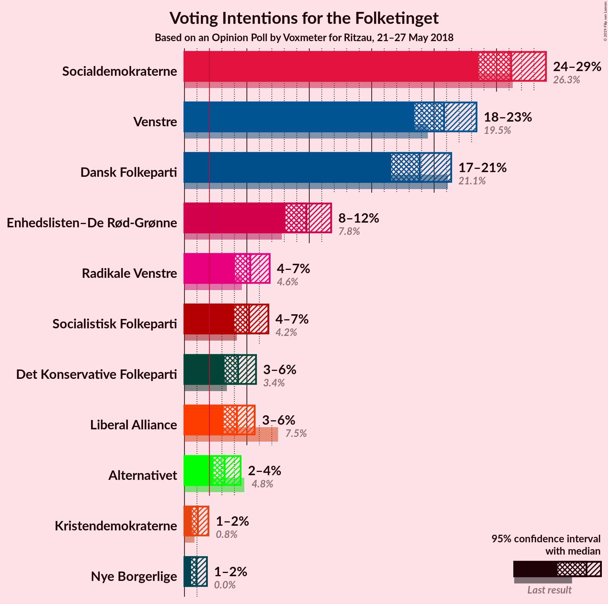

### Confidence Intervals

| Party | Last Result | Poll Result | 80% Confidence Interval | 90% Confidence Interval | 95% Confidence Interval | 99% Confidence Interval |
|:-----:|:-----------:|:-----------:|:-----------------------:|:-----------------------:|:-----------------------:|:-----------------------:|
| Socialdemokraterne | 26.3% | 26.2% | 24.5–28.0% |24.0–28.5% |23.6–29.0% |22.8–29.8% |
| Venstre | 19.5% | 20.8% | 19.2–22.5% |18.8–23.0% |18.4–23.4% |17.7–24.2% |
| Dansk Folkeparti | 21.1% | 18.8% | 17.3–20.5% |16.9–21.0% |16.6–21.4% |15.9–22.2% |
| Enhedslisten–De Rød-Grønne | 7.8% | 9.8% | 8.7–11.1% |8.4–11.4% |8.1–11.8% |7.6–12.4% |
| Radikale Venstre | 4.6% | 5.3% | 4.5–6.3% |4.3–6.6% |4.1–6.8% |3.7–7.3% |
| Socialistisk Folkeparti | 4.2% | 5.2% | 4.4–6.2% |4.2–6.5% |4.0–6.7% |3.6–7.2% |
| Det Konservative Folkeparti | 3.4% | 4.3% | 3.6–5.2% |3.4–5.5% |3.2–5.7% |2.9–6.2% |
| Liberal Alliance | 7.5% | 4.2% | 3.5–5.1% |3.3–5.4% |3.1–5.6% |2.8–6.1% |
| Alternativet | 4.8% | 3.2% | 2.6–4.1% |2.4–4.3% |2.3–4.5% |2.0–4.9% |
| Kristendemokraterne | 0.8% | 1.1% | 0.8–1.6% |0.7–1.8% |0.6–1.9% |0.5–2.2% |
| Nye Borgerlige | 0.0% | 1.0% | 0.7–1.5% |0.6–1.7% |0.5–1.8% |0.4–2.1% |

*Note:* The poll result column reflects the actual value used in the calculations. Published results may vary slightly, and in addition be rounded to fewer digits.

## Seats

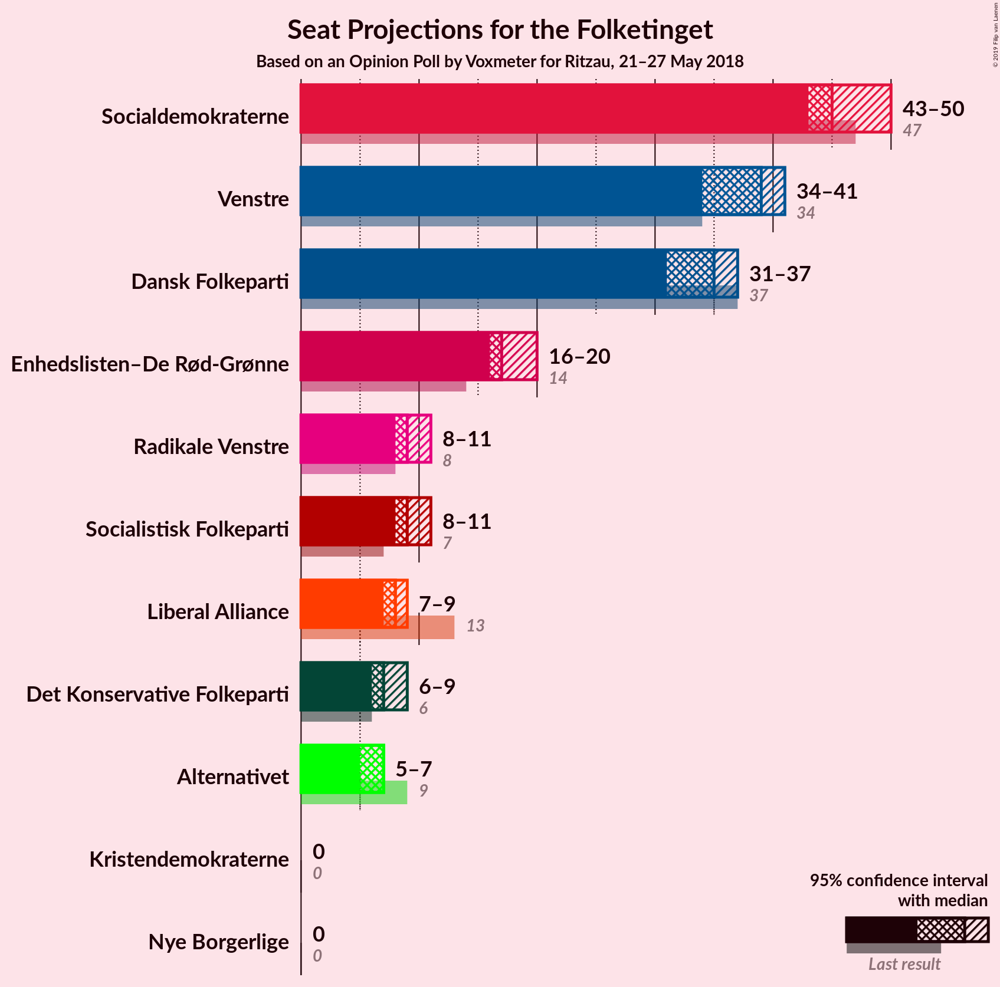

### Confidence Intervals

| Party | Last Result | Median | 80% Confidence Interval | 90% Confidence Interval | 95% Confidence Interval | 99% Confidence Interval |
|:-----:|:-----------:|:------:|:-----------------------:|:-----------------------:|:-----------------------:|:-----------------------:|
| <a href="#socialdemokraterne">Socialdemokraterne</a> | 47 | 45 | 45–50 |44–50 |43–50 |42–52 |
| <a href="#venstre">Venstre</a> | 34 | 39 | 36–39 |36–39 |34–41 |33–43 |
| <a href="#dansk-folkeparti">Dansk Folkeparti</a> | 37 | 35 | 31–36 |31–36 |31–37 |29–40 |
| <a href="#enhedslisten–de-rød-grønne">Enhedslisten–De Rød-Grønne</a> | 14 | 17 | 16–18 |16–19 |16–20 |14–20 |
| <a href="#radikale-venstre">Radikale Venstre</a> | 8 | 9 | 9 |8–10 |8–11 |7–12 |
| <a href="#socialistisk-folkeparti">Socialistisk Folkeparti</a> | 7 | 9 | 9–10 |8–10 |8–11 |7–12 |
| <a href="#det-konservative-folkeparti">Det Konservative Folkeparti</a> | 6 | 7 | 6–7 |6–8 |6–9 |6–10 |
| <a href="#liberal-alliance">Liberal Alliance</a> | 13 | 8 | 7–8 |7–8 |7–9 |5–10 |
| <a href="#alternativet">Alternativet</a> | 9 | 7 | 6–7 |5–7 |5–7 |4–8 |
| <a href="#kristendemokraterne">Kristendemokraterne</a> | 0 | 0 | 0 |0 |0 |0 |
| <a href="#nye-borgerlige">Nye Borgerlige</a> | 0 | 0 | 0 |0 |0 |0 |

### Socialdemokraterne

*For a full overview of the results for this party, see the [Socialdemokraterne](party-socialdemokraterne.html) page.*

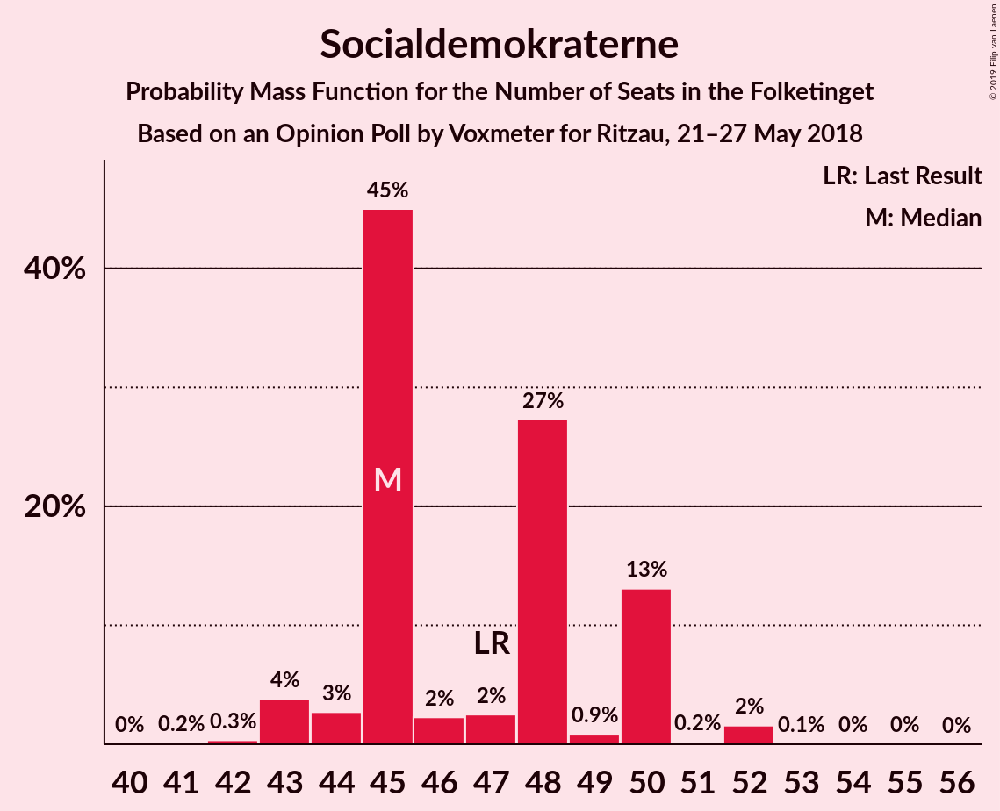

| Number of Seats | Probability | Accumulated | Special Marks |
|:---------------:|:-----------:|:-----------:|:-------------:|
| 40 | 0% | 100% |  |
| 41 | 0.2% | 99.9% |  |
| 42 | 0.3% | 99.8% |  |
| 43 | 4% | 99.5% |  |
| 44 | 3% | 96% |  |
| 45 | 45% | 93% | Median |
| 46 | 2% | 48% |  |
| 47 | 2% | 46% | Last Result |
| 48 | 27% | 43% |  |
| 49 | 0.9% | 16% |  |
| 50 | 13% | 15% |  |
| 51 | 0.2% | 2% |  |
| 52 | 2% | 2% |  |
| 53 | 0.1% | 0.2% |  |
| 54 | 0% | 0.1% |  |
| 55 | 0% | 0.1% |  |
| 56 | 0% | 0% |  |

### Venstre

*For a full overview of the results for this party, see the [Venstre](party-venstre.html) page.*

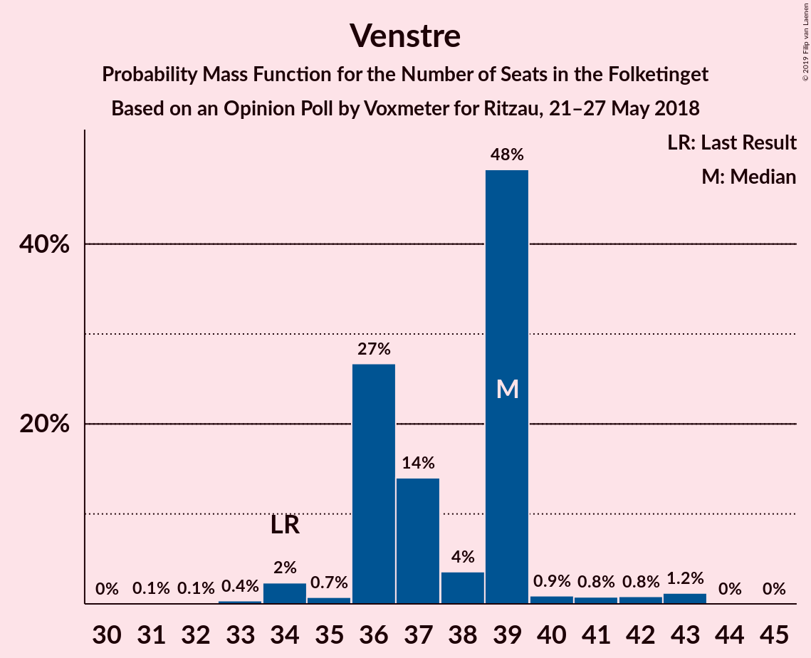

| Number of Seats | Probability | Accumulated | Special Marks |
|:---------------:|:-----------:|:-----------:|:-------------:|
| 31 | 0.1% | 100% |  |
| 32 | 0.1% | 99.9% |  |
| 33 | 0.4% | 99.8% |  |
| 34 | 2% | 99.4% | Last Result |
| 35 | 0.7% | 97% |  |
| 36 | 27% | 96% |  |
| 37 | 14% | 70% |  |
| 38 | 4% | 56% |  |
| 39 | 48% | 52% | Median |
| 40 | 0.9% | 4% |  |
| 41 | 0.8% | 3% |  |
| 42 | 0.8% | 2% |  |
| 43 | 1.2% | 1.3% |  |
| 44 | 0% | 0.1% |  |
| 45 | 0% | 0% |  |

### Dansk Folkeparti

*For a full overview of the results for this party, see the [Dansk Folkeparti](party-danskfolkeparti.html) page.*

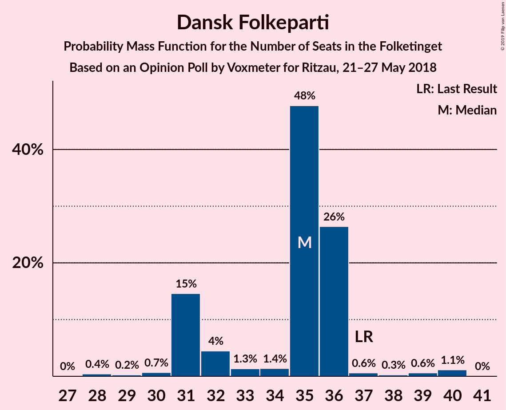

| Number of Seats | Probability | Accumulated | Special Marks |
|:---------------:|:-----------:|:-----------:|:-------------:|
| 28 | 0.4% | 100% |  |
| 29 | 0.2% | 99.5% |  |
| 30 | 0.7% | 99.3% |  |
| 31 | 15% | 98.6% |  |
| 32 | 4% | 84% |  |
| 33 | 1.3% | 80% |  |
| 34 | 1.4% | 78% |  |
| 35 | 48% | 77% | Median |
| 36 | 26% | 29% |  |
| 37 | 0.6% | 3% | Last Result |
| 38 | 0.3% | 2% |  |
| 39 | 0.6% | 2% |  |
| 40 | 1.1% | 1.2% |  |
| 41 | 0% | 0% |  |

### Enhedslisten–De Rød-Grønne

*For a full overview of the results for this party, see the [Enhedslisten–De Rød-Grønne](party-enhedslisten–derød-grønne.html) page.*

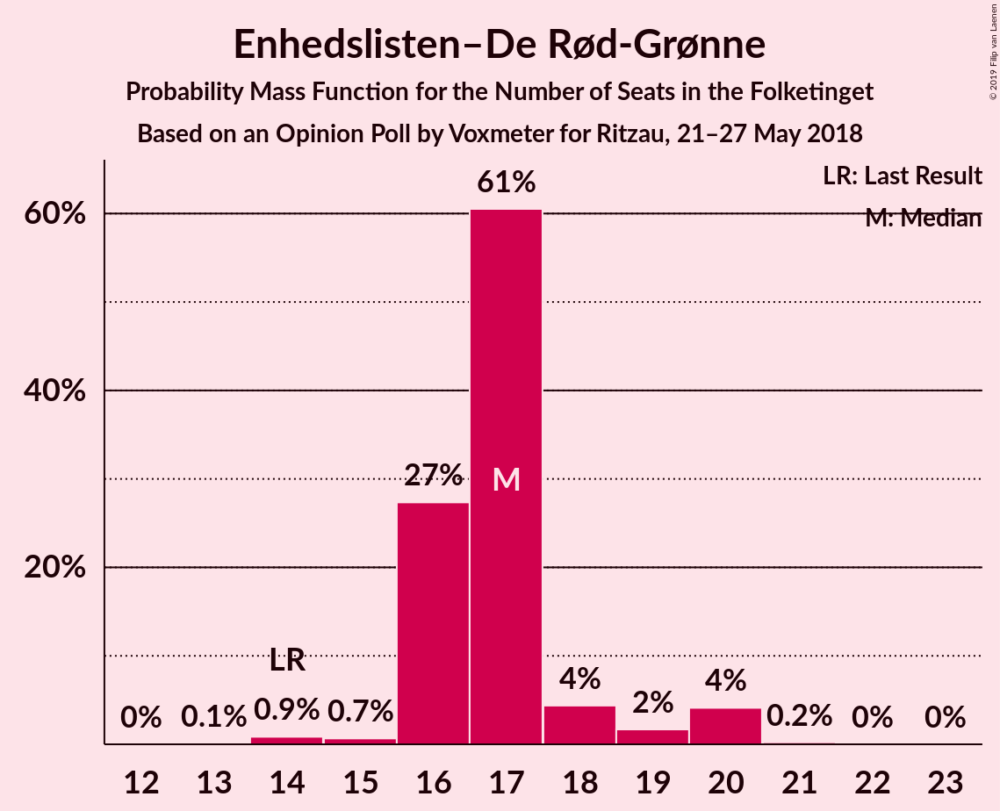

| Number of Seats | Probability | Accumulated | Special Marks |
|:---------------:|:-----------:|:-----------:|:-------------:|
| 13 | 0.1% | 100% |  |
| 14 | 0.9% | 99.9% | Last Result |
| 15 | 0.7% | 99.0% |  |
| 16 | 27% | 98% |  |
| 17 | 61% | 71% | Median |
| 18 | 4% | 10% |  |
| 19 | 2% | 6% |  |
| 20 | 4% | 4% |  |
| 21 | 0.2% | 0.3% |  |
| 22 | 0% | 0.1% |  |
| 23 | 0% | 0% |  |

### Radikale Venstre

*For a full overview of the results for this party, see the [Radikale Venstre](party-radikalevenstre.html) page.*

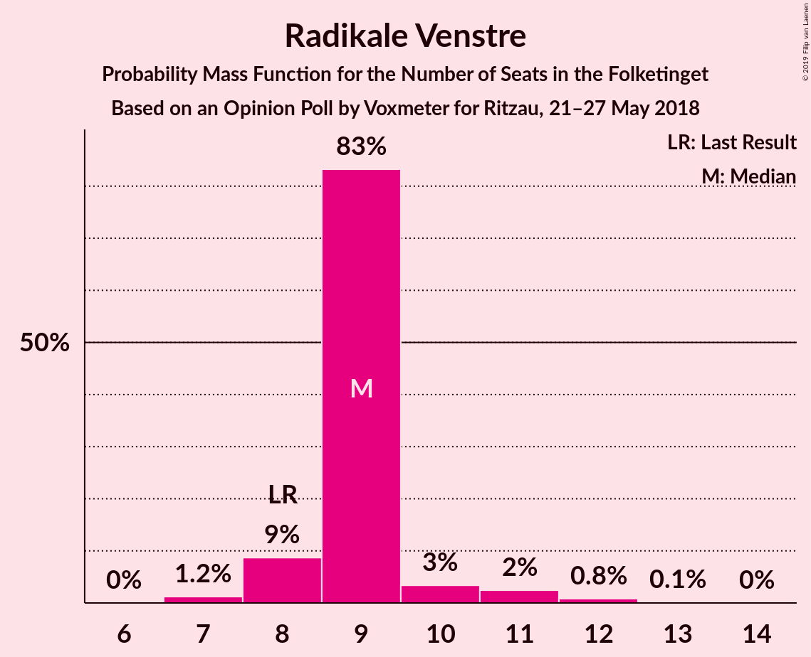

| Number of Seats | Probability | Accumulated | Special Marks |
|:---------------:|:-----------:|:-----------:|:-------------:|
| 7 | 1.2% | 100% |  |
| 8 | 9% | 98.8% | Last Result |
| 9 | 83% | 90% | Median |
| 10 | 3% | 7% |  |
| 11 | 2% | 3% |  |
| 12 | 0.8% | 1.0% |  |
| 13 | 0.1% | 0.2% |  |
| 14 | 0% | 0% |  |

### Socialistisk Folkeparti

*For a full overview of the results for this party, see the [Socialistisk Folkeparti](party-socialistiskfolkeparti.html) page.*

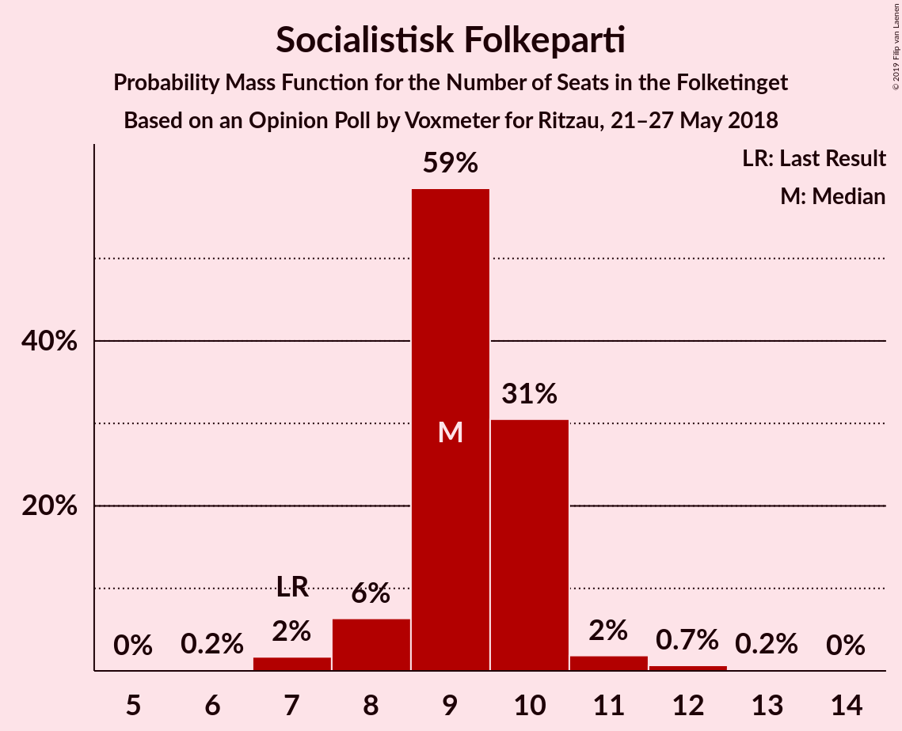

| Number of Seats | Probability | Accumulated | Special Marks |
|:---------------:|:-----------:|:-----------:|:-------------:|
| 6 | 0.2% | 100% |  |
| 7 | 2% | 99.8% | Last Result |
| 8 | 6% | 98% |  |
| 9 | 59% | 92% | Median |
| 10 | 31% | 33% |  |
| 11 | 2% | 3% |  |
| 12 | 0.7% | 0.9% |  |
| 13 | 0.2% | 0.2% |  |
| 14 | 0% | 0% |  |

### Det Konservative Folkeparti

*For a full overview of the results for this party, see the [Det Konservative Folkeparti](party-detkonservativefolkeparti.html) page.*

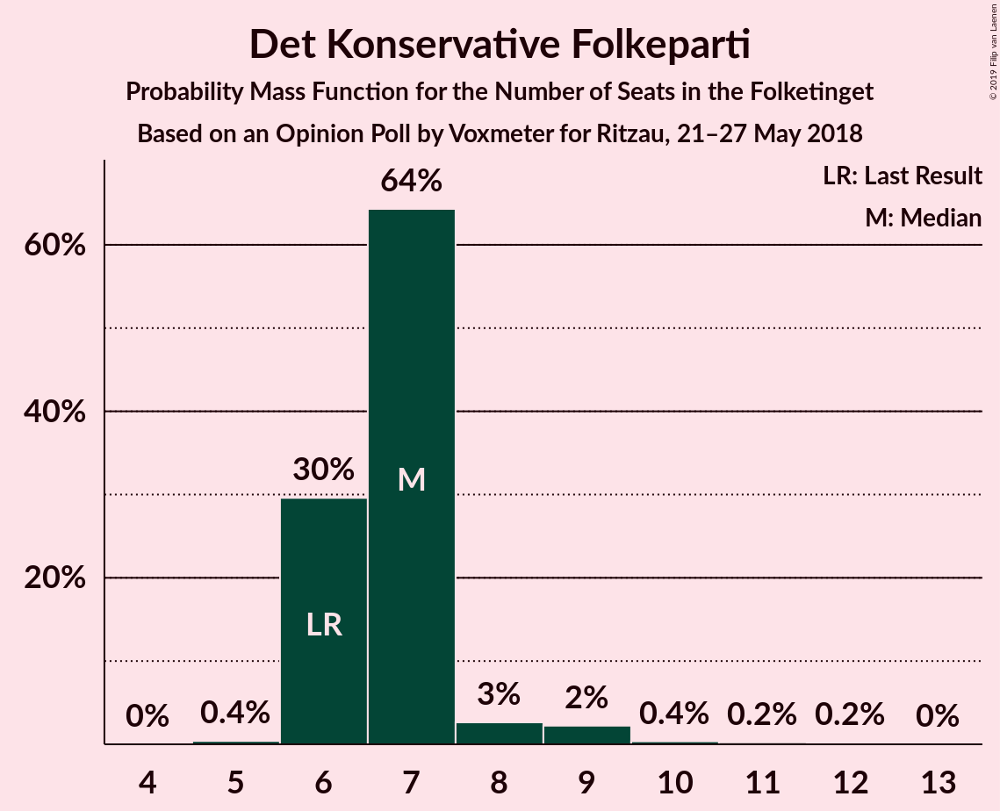

| Number of Seats | Probability | Accumulated | Special Marks |
|:---------------:|:-----------:|:-----------:|:-------------:|
| 5 | 0.4% | 100% |  |
| 6 | 30% | 99.6% | Last Result |
| 7 | 64% | 70% | Median |
| 8 | 3% | 6% |  |
| 9 | 2% | 3% |  |
| 10 | 0.4% | 0.8% |  |
| 11 | 0.2% | 0.4% |  |
| 12 | 0.2% | 0.2% |  |
| 13 | 0% | 0% |  |

### Liberal Alliance

*For a full overview of the results for this party, see the [Liberal Alliance](party-liberalalliance.html) page.*

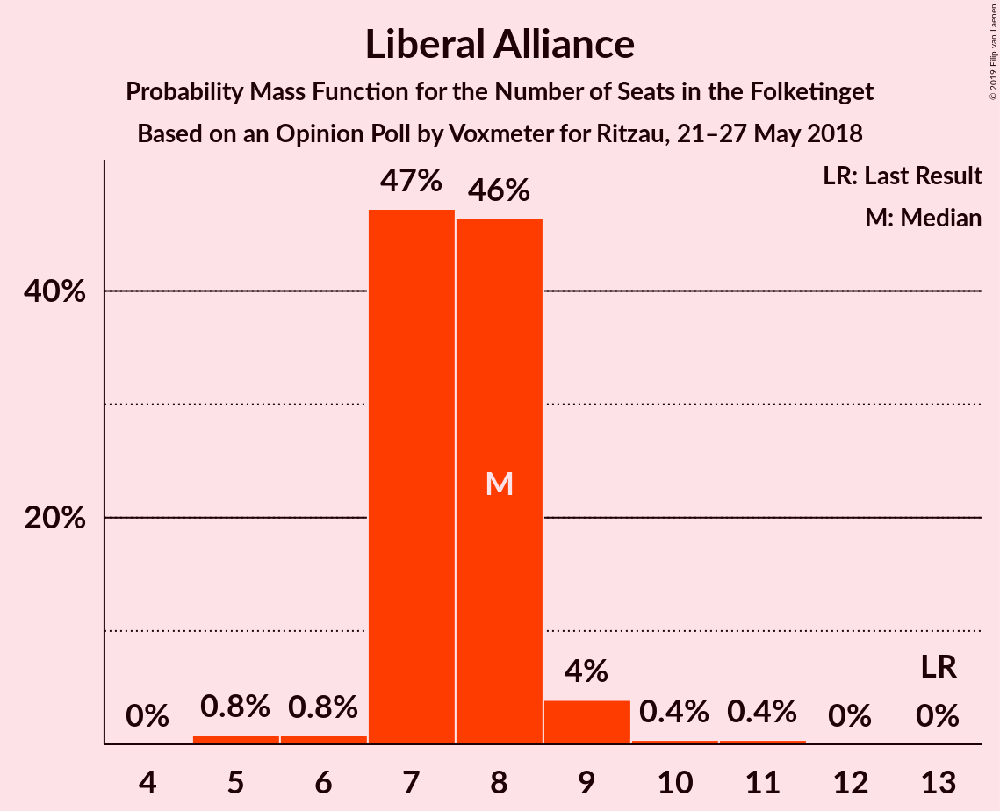

| Number of Seats | Probability | Accumulated | Special Marks |
|:---------------:|:-----------:|:-----------:|:-------------:|
| 5 | 0.8% | 100% |  |
| 6 | 0.8% | 99.2% |  |
| 7 | 47% | 98% |  |
| 8 | 46% | 51% | Median |
| 9 | 4% | 5% |  |
| 10 | 0.4% | 0.8% |  |
| 11 | 0.4% | 0.4% |  |
| 12 | 0% | 0% |  |
| 13 | 0% | 0% | Last Result |

### Alternativet

*For a full overview of the results for this party, see the [Alternativet](party-alternativet.html) page.*

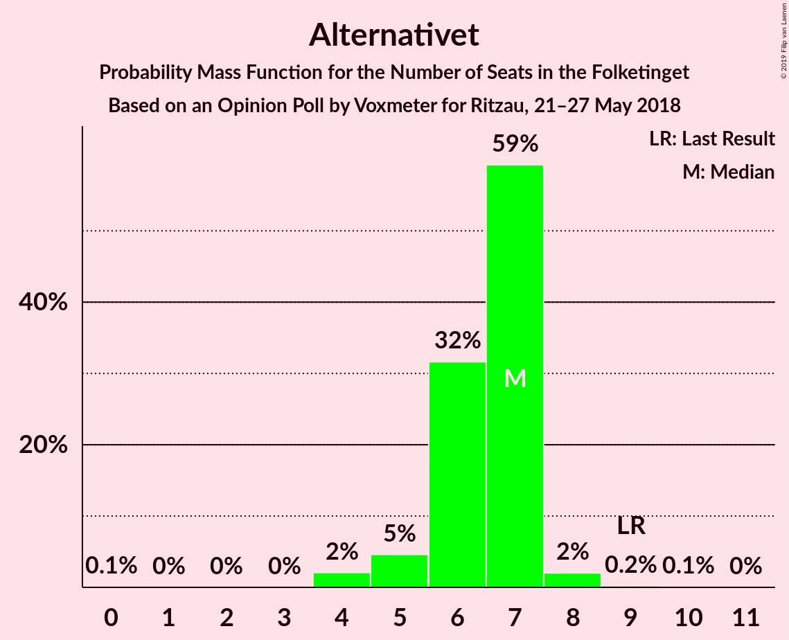

| Number of Seats | Probability | Accumulated | Special Marks |
|:---------------:|:-----------:|:-----------:|:-------------:|
| 0 | 0.1% | 100% |  |
| 1 | 0% | 99.9% |  |
| 2 | 0% | 99.9% |  |
| 3 | 0% | 99.9% |  |
| 4 | 2% | 99.9% |  |
| 5 | 5% | 98% |  |
| 6 | 32% | 93% |  |
| 7 | 59% | 62% | Median |
| 8 | 2% | 2% |  |
| 9 | 0.2% | 0.4% | Last Result |
| 10 | 0.1% | 0.1% |  |
| 11 | 0% | 0% |  |

### Kristendemokraterne

*For a full overview of the results for this party, see the [Kristendemokraterne](party-kristendemokraterne.html) page.*

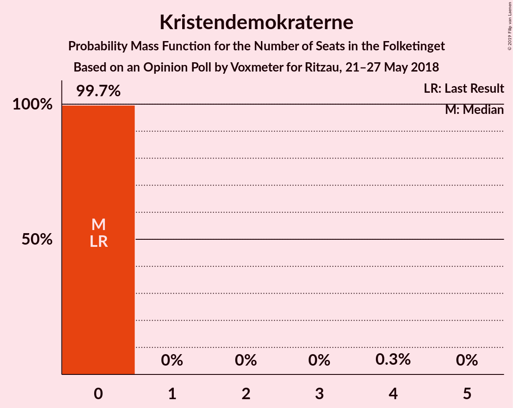

| Number of Seats | Probability | Accumulated | Special Marks |
|:---------------:|:-----------:|:-----------:|:-------------:|
| 0 | 99.7% | 100% | Last Result, Median |
| 1 | 0% | 0.3% |  |
| 2 | 0% | 0.3% |  |
| 3 | 0% | 0.3% |  |
| 4 | 0.3% | 0.3% |  |
| 5 | 0% | 0% |  |

### Nye Borgerlige

*For a full overview of the results for this party, see the [Nye Borgerlige](party-nyeborgerlige.html) page.*

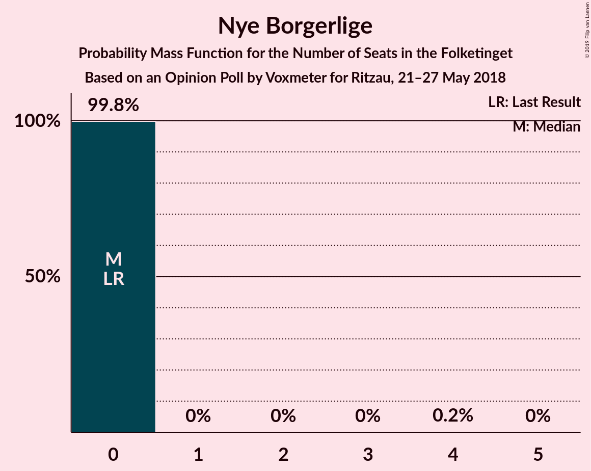

| Number of Seats | Probability | Accumulated | Special Marks |
|:---------------:|:-----------:|:-----------:|:-------------:|
| 0 | 99.8% | 100% | Last Result, Median |
| 1 | 0% | 0.2% |  |
| 2 | 0% | 0.2% |  |
| 3 | 0% | 0.2% |  |
| 4 | 0.2% | 0.2% |  |
| 5 | 0% | 0% |  |

## Coalitions

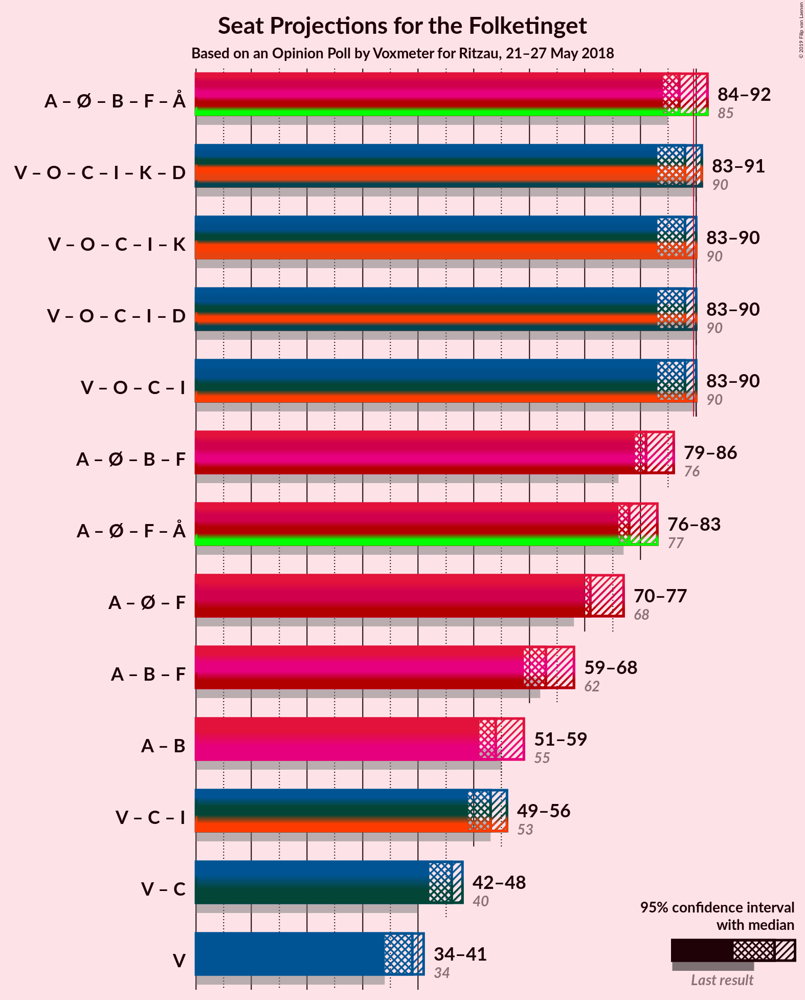

### Confidence Intervals

| Coalition | Last Result | Median | Majority? | 80% Confidence Interval | 90% Confidence Interval | 95% Confidence Interval | 99% Confidence Interval |
|:---------:|:-----------:|:------:|:---------:|:-----------------------:|:-----------------------:|:-----------------------:|:-----------------------:|
| Socialdemokraterne – Enhedslisten–De Rød-Grønne – Radikale Venstre – Socialistisk Folkeparti – Alternativet | 85 | 87 | 18% | 87–92 | 86–92 | 84–92 | 83–94 |
| Venstre – Dansk Folkeparti – Det Konservative Folkeparti – Liberal Alliance – Kristendemokraterne – Nye Borgerlige | 90 | 88 | 3% | 83–88 | 83–89 | 83–91 | 81–92 |
| Venstre – Dansk Folkeparti – Det Konservative Folkeparti – Liberal Alliance – Kristendemokraterne | 90 | 88 | 3% | 83–88 | 83–89 | 83–90 | 81–92 |
| Venstre – Dansk Folkeparti – Det Konservative Folkeparti – Liberal Alliance – Nye Borgerlige | 90 | 88 | 3% | 83–88 | 83–89 | 83–90 | 81–91 |
| Venstre – Dansk Folkeparti – Det Konservative Folkeparti – Liberal Alliance | 90 | 88 | 3% | 83–88 | 83–89 | 83–90 | 81–91 |
| Socialdemokraterne – Enhedslisten–De Rød-Grønne – Radikale Venstre – Socialistisk Folkeparti | 76 | 81 | 0.2% | 80–85 | 79–85 | 79–86 | 78–88 |
| Socialdemokraterne – Enhedslisten–De Rød-Grønne – Socialistisk Folkeparti – Alternativet | 77 | 78 | 0% | 78–83 | 77–83 | 76–83 | 73–85 |
| Socialdemokraterne – Enhedslisten–De Rød-Grønne – Socialistisk Folkeparti | 68 | 71 | 0% | 71–76 | 71–76 | 70–77 | 67–79 |
| Socialdemokraterne – Radikale Venstre – Socialistisk Folkeparti | 62 | 63 | 0% | 63–68 | 62–68 | 59–68 | 59–71 |
| Socialdemokraterne – Radikale Venstre | 55 | 54 | 0% | 54–59 | 52–59 | 51–59 | 51–61 |
| Venstre – Det Konservative Folkeparti – Liberal Alliance | 53 | 53 | 0% | 50–54 | 50–55 | 49–56 | 48–57 |
| Venstre – Det Konservative Folkeparti | 40 | 46 | 0% | 42–46 | 42–47 | 42–48 | 40–50 |
| Venstre | 34 | 39 | 0% | 36–39 | 36–39 | 34–41 | 33–43 |

### Socialdemokraterne – Enhedslisten–De Rød-Grønne – Radikale Venstre – Socialistisk Folkeparti – Alternativet

| Number of Seats | Probability | Accumulated | Special Marks |
|:---------------:|:-----------:|:-----------:|:-------------:|
| 81 | 0% | 100% |  |
| 82 | 0.2% | 99.9% |  |
| 83 | 0.3% | 99.8% |  |
| 84 | 2% | 99.4% |  |
| 85 | 0.8% | 97% | Last Result |
| 86 | 6% | 97% |  |
| 87 | 45% | 91% | Median |
| 88 | 3% | 46% |  |
| 89 | 25% | 44% |  |
| 90 | 0.7% | 18% | Majority |
| 91 | 0.8% | 17% |  |
| 92 | 14% | 17% |  |
| 93 | 0.7% | 2% |  |
| 94 | 1.4% | 2% |  |
| 95 | 0.2% | 0.3% |  |
| 96 | 0% | 0.1% |  |
| 97 | 0.1% | 0.1% |  |
| 98 | 0% | 0% |  |

### Venstre – Dansk Folkeparti – Det Konservative Folkeparti – Liberal Alliance – Kristendemokraterne – Nye Borgerlige

| Number of Seats | Probability | Accumulated | Special Marks |
|:---------------:|:-----------:|:-----------:|:-------------:|
| 78 | 0.1% | 100% |  |
| 79 | 0% | 99.9% |  |
| 80 | 0.2% | 99.9% |  |
| 81 | 1.4% | 99.7% |  |
| 82 | 0.7% | 98% |  |
| 83 | 14% | 98% |  |
| 84 | 0.8% | 83% |  |
| 85 | 0.7% | 83% |  |
| 86 | 25% | 82% |  |
| 87 | 3% | 56% |  |
| 88 | 45% | 54% |  |
| 89 | 6% | 9% | Median |
| 90 | 0.8% | 3% | Last Result, Majority |
| 91 | 2% | 3% |  |
| 92 | 0.3% | 0.6% |  |
| 93 | 0.2% | 0.2% |  |
| 94 | 0% | 0.1% |  |
| 95 | 0% | 0% |  |

### Venstre – Dansk Folkeparti – Det Konservative Folkeparti – Liberal Alliance – Kristendemokraterne

| Number of Seats | Probability | Accumulated | Special Marks |
|:---------------:|:-----------:|:-----------:|:-------------:|
| 78 | 0.1% | 100% |  |
| 79 | 0% | 99.9% |  |
| 80 | 0.2% | 99.9% |  |
| 81 | 1.4% | 99.7% |  |
| 82 | 0.7% | 98% |  |
| 83 | 14% | 98% |  |
| 84 | 0.8% | 83% |  |
| 85 | 0.7% | 82% |  |
| 86 | 25% | 82% |  |
| 87 | 3% | 56% |  |
| 88 | 45% | 53% |  |
| 89 | 6% | 9% | Median |
| 90 | 0.7% | 3% | Last Result, Majority |
| 91 | 2% | 2% |  |
| 92 | 0.3% | 0.5% |  |
| 93 | 0.2% | 0.2% |  |
| 94 | 0% | 0% |  |

### Venstre – Dansk Folkeparti – Det Konservative Folkeparti – Liberal Alliance – Nye Borgerlige

| Number of Seats | Probability | Accumulated | Special Marks |
|:---------------:|:-----------:|:-----------:|:-------------:|
| 78 | 0.1% | 100% |  |
| 79 | 0% | 99.9% |  |
| 80 | 0.2% | 99.9% |  |
| 81 | 1.4% | 99.7% |  |
| 82 | 0.7% | 98% |  |
| 83 | 14% | 98% |  |
| 84 | 0.8% | 83% |  |
| 85 | 0.7% | 82% |  |
| 86 | 25% | 82% |  |
| 87 | 3% | 56% |  |
| 88 | 45% | 53% |  |
| 89 | 6% | 9% | Median |
| 90 | 0.8% | 3% | Last Result, Majority |
| 91 | 2% | 2% |  |
| 92 | 0.2% | 0.4% |  |
| 93 | 0.2% | 0.2% |  |
| 94 | 0% | 0% |  |

### Venstre – Dansk Folkeparti – Det Konservative Folkeparti – Liberal Alliance

| Number of Seats | Probability | Accumulated | Special Marks |
|:---------------:|:-----------:|:-----------:|:-------------:|
| 78 | 0.1% | 100% |  |
| 79 | 0% | 99.9% |  |
| 80 | 0.2% | 99.8% |  |
| 81 | 1.4% | 99.7% |  |
| 82 | 0.7% | 98% |  |
| 83 | 14% | 98% |  |
| 84 | 0.8% | 83% |  |
| 85 | 0.7% | 82% |  |
| 86 | 25% | 82% |  |
| 87 | 3% | 56% |  |
| 88 | 45% | 53% |  |
| 89 | 6% | 9% | Median |
| 90 | 0.7% | 3% | Last Result, Majority |
| 91 | 2% | 2% |  |
| 92 | 0.1% | 0.3% |  |
| 93 | 0.2% | 0.2% |  |
| 94 | 0% | 0% |  |

### Socialdemokraterne – Enhedslisten–De Rød-Grønne – Radikale Venstre – Socialistisk Folkeparti

| Number of Seats | Probability | Accumulated | Special Marks |
|:---------------:|:-----------:|:-----------:|:-------------:|
| 76 | 0% | 100% | Last Result |
| 77 | 0.2% | 99.9% |  |
| 78 | 1.0% | 99.7% |  |
| 79 | 5% | 98.6% |  |
| 80 | 43% | 94% | Median |
| 81 | 3% | 50% |  |
| 82 | 3% | 47% |  |
| 83 | 25% | 44% |  |
| 84 | 2% | 19% |  |
| 85 | 13% | 16% |  |
| 86 | 2% | 4% |  |
| 87 | 0.4% | 2% |  |
| 88 | 1.3% | 2% |  |
| 89 | 0.2% | 0.3% |  |
| 90 | 0.1% | 0.2% | Majority |
| 91 | 0% | 0.1% |  |
| 92 | 0% | 0% |  |

### Socialdemokraterne – Enhedslisten–De Rød-Grønne – Socialistisk Folkeparti – Alternativet

| Number of Seats | Probability | Accumulated | Special Marks |
|:---------------:|:-----------:|:-----------:|:-------------:|
| 72 | 0.1% | 100% |  |
| 73 | 0.6% | 99.8% |  |
| 74 | 0.4% | 99.2% |  |
| 75 | 0.8% | 98.8% |  |
| 76 | 2% | 98% |  |
| 77 | 2% | 96% | Last Result |
| 78 | 49% | 95% | Median |
| 79 | 2% | 46% |  |
| 80 | 26% | 44% |  |
| 81 | 0.6% | 18% |  |
| 82 | 2% | 17% |  |
| 83 | 13% | 15% |  |
| 84 | 0.4% | 2% |  |
| 85 | 1.5% | 2% |  |
| 86 | 0.2% | 0.3% |  |
| 87 | 0.1% | 0.2% |  |
| 88 | 0% | 0.1% |  |
| 89 | 0% | 0% |  |

### Socialdemokraterne – Enhedslisten–De Rød-Grønne – Socialistisk Folkeparti

| Number of Seats | Probability | Accumulated | Special Marks |
|:---------------:|:-----------:|:-----------:|:-------------:|
| 66 | 0.1% | 100% |  |
| 67 | 0.7% | 99.9% |  |
| 68 | 0.1% | 99.2% | Last Result |
| 69 | 1.1% | 99.1% |  |
| 70 | 0.6% | 98% |  |
| 71 | 49% | 97% | Median |
| 72 | 0.7% | 49% |  |
| 73 | 4% | 48% |  |
| 74 | 26% | 44% |  |
| 75 | 1.3% | 18% |  |
| 76 | 14% | 16% |  |
| 77 | 0.7% | 3% |  |
| 78 | 0.2% | 2% |  |
| 79 | 2% | 2% |  |
| 80 | 0.1% | 0.2% |  |
| 81 | 0.1% | 0.1% |  |
| 82 | 0% | 0% |  |

### Socialdemokraterne – Radikale Venstre – Socialistisk Folkeparti

| Number of Seats | Probability | Accumulated | Special Marks |
|:---------------:|:-----------:|:-----------:|:-------------:|
| 59 | 3% | 100% |  |
| 60 | 0.3% | 97% |  |
| 61 | 0.1% | 97% |  |
| 62 | 2% | 96% | Last Result |
| 63 | 47% | 94% | Median |
| 64 | 2% | 48% |  |
| 65 | 2% | 46% |  |
| 66 | 1.2% | 44% |  |
| 67 | 26% | 43% |  |
| 68 | 14% | 17% |  |
| 69 | 0.4% | 2% |  |
| 70 | 0.3% | 2% |  |
| 71 | 1.4% | 2% |  |
| 72 | 0.1% | 0.2% |  |
| 73 | 0% | 0.1% |  |
| 74 | 0% | 0% |  |

### Socialdemokraterne – Radikale Venstre

| Number of Seats | Probability | Accumulated | Special Marks |
|:---------------:|:-----------:|:-----------:|:-------------:|
| 50 | 0.2% | 100% |  |
| 51 | 3% | 99.7% |  |
| 52 | 2% | 97% |  |
| 53 | 2% | 95% |  |
| 54 | 43% | 93% | Median |
| 55 | 4% | 50% | Last Result |
| 56 | 1.4% | 45% |  |
| 57 | 26% | 44% |  |
| 58 | 3% | 18% |  |
| 59 | 13% | 15% |  |
| 60 | 0.2% | 2% |  |
| 61 | 1.4% | 2% |  |
| 62 | 0.3% | 0.5% |  |
| 63 | 0.1% | 0.1% |  |
| 64 | 0% | 0.1% |  |
| 65 | 0% | 0% |  |

### Venstre – Det Konservative Folkeparti – Liberal Alliance

| Number of Seats | Probability | Accumulated | Special Marks |
|:---------------:|:-----------:|:-----------:|:-------------:|
| 46 | 0.2% | 100% |  |
| 47 | 0.2% | 99.8% |  |
| 48 | 0.6% | 99.6% |  |
| 49 | 2% | 99.1% |  |
| 50 | 25% | 97% |  |
| 51 | 3% | 72% |  |
| 52 | 14% | 69% |  |
| 53 | 43% | 54% | Last Result |
| 54 | 5% | 11% | Median |
| 55 | 3% | 6% |  |
| 56 | 1.0% | 3% |  |
| 57 | 2% | 2% |  |
| 58 | 0.4% | 0.5% |  |
| 59 | 0% | 0.1% |  |
| 60 | 0.1% | 0.1% |  |
| 61 | 0% | 0% |  |

### Venstre – Det Konservative Folkeparti

| Number of Seats | Probability | Accumulated | Special Marks |
|:---------------:|:-----------:|:-----------:|:-------------:|
| 39 | 0.2% | 100% |  |
| 40 | 1.4% | 99.8% | Last Result |
| 41 | 0.7% | 98% |  |
| 42 | 26% | 98% |  |
| 43 | 2% | 72% |  |
| 44 | 13% | 69% |  |
| 45 | 3% | 56% |  |
| 46 | 48% | 54% | Median |
| 47 | 2% | 5% |  |
| 48 | 1.4% | 3% |  |
| 49 | 0.7% | 2% |  |
| 50 | 1.3% | 1.4% |  |
| 51 | 0.1% | 0.1% |  |
| 52 | 0% | 0% |  |

### Venstre

| Number of Seats | Probability | Accumulated | Special Marks |
|:---------------:|:-----------:|:-----------:|:-------------:|
| 31 | 0.1% | 100% |  |
| 32 | 0.1% | 99.9% |  |
| 33 | 0.4% | 99.8% |  |
| 34 | 2% | 99.4% | Last Result |
| 35 | 0.7% | 97% |  |
| 36 | 27% | 96% |  |
| 37 | 14% | 70% |  |
| 38 | 4% | 56% |  |
| 39 | 48% | 52% | Median |
| 40 | 0.9% | 4% |  |
| 41 | 0.8% | 3% |  |
| 42 | 0.8% | 2% |  |
| 43 | 1.2% | 1.3% |  |
| 44 | 0% | 0.1% |  |
| 45 | 0% | 0% |  |

## Technical Information

### Opinion Poll

+ **Polling firm:** Voxmeter
+ **Commissioner(s):** Ritzau
+ **Fieldwork period:** 21–27 May 2018

### Calculations

+ **Sample size:** 1024
+ **Simulations done:** 1,048,576
+ **Error estimate:** 1.94%

