# Opinion Poll by Voxmeter for Ritzau, 4–10 June 2018

<a href="#voting-intentions">Voting Intentions</a> | <a href="#seats">Seats</a> | <a href="#coalitions">Coalitions</a> | <a href="#technical-information">Technical Information</a>

## Voting Intentions

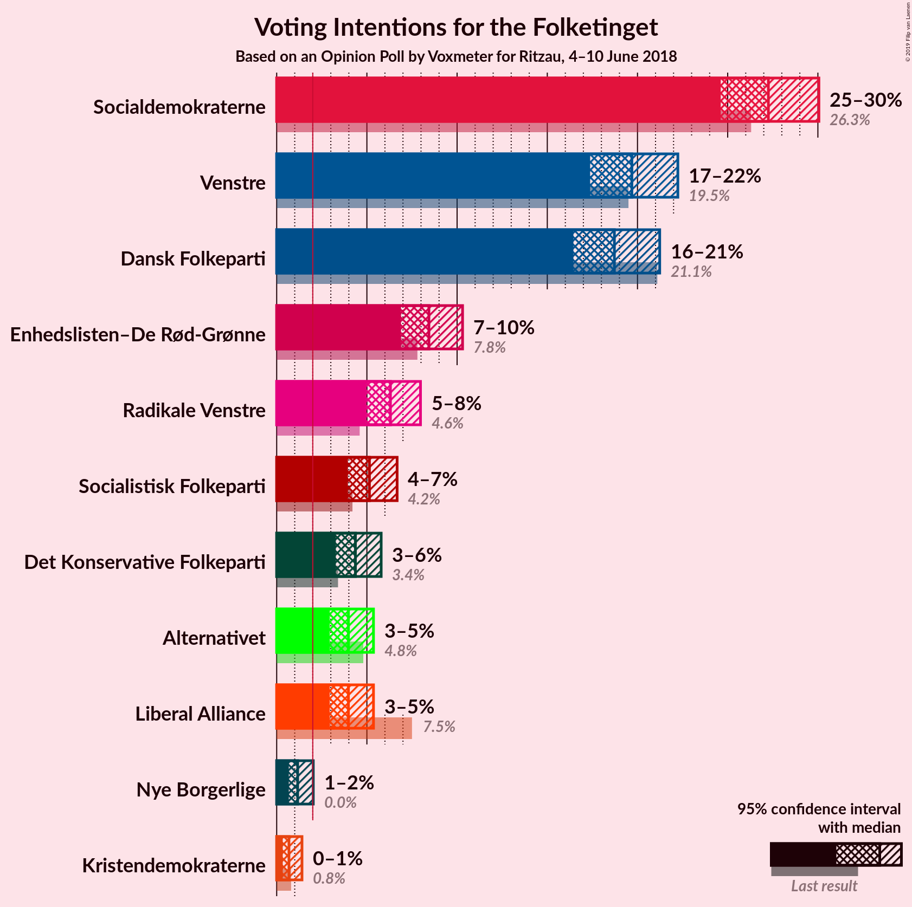

### Confidence Intervals

| Party | Last Result | Poll Result | 80% Confidence Interval | 90% Confidence Interval | 95% Confidence Interval | 99% Confidence Interval |
|:-----:|:-----------:|:-----------:|:-----------------------:|:-----------------------:|:-----------------------:|:-----------------------:|
| Socialdemokraterne | 26.3% | 27.3% | 25.5–29.1% |25.0–29.6% |24.6–30.1% |23.8–31.0% |
| Venstre | 19.5% | 19.7% | 18.2–21.4% |17.7–21.8% |17.4–22.2% |16.7–23.0% |
| Dansk Folkeparti | 21.1% | 18.7% | 17.2–20.4% |16.8–20.8% |16.4–21.2% |15.8–22.0% |
| Enhedslisten–De Rød-Grønne | 7.8% | 8.4% | 7.4–9.6% |7.1–10.0% |6.9–10.3% |6.4–10.9% |
| Radikale Venstre | 4.6% | 6.3% | 5.4–7.4% |5.2–7.7% |5.0–8.0% |4.6–8.5% |
| Socialistisk Folkeparti | 4.2% | 5.1% | 4.4–6.1% |4.1–6.4% |3.9–6.7% |3.6–7.2% |
| Det Konservative Folkeparti | 3.4% | 4.4% | 3.6–5.3% |3.4–5.6% |3.3–5.8% |3.0–6.3% |
| Liberal Alliance | 7.5% | 4.0% | 3.3–4.9% |3.1–5.1% |2.9–5.4% |2.7–5.8% |
| Alternativet | 4.8% | 4.0% | 3.3–4.9% |3.1–5.1% |2.9–5.4% |2.7–5.8% |
| Nye Borgerlige | 0.0% | 1.2% | 0.8–1.7% |0.7–1.9% |0.7–2.0% |0.5–2.3% |
| Kristendemokraterne | 0.8% | 0.7% | 0.4–1.1% |0.4–1.3% |0.3–1.4% |0.2–1.7% |

*Note:* The poll result column reflects the actual value used in the calculations. Published results may vary slightly, and in addition be rounded to fewer digits.

## Seats

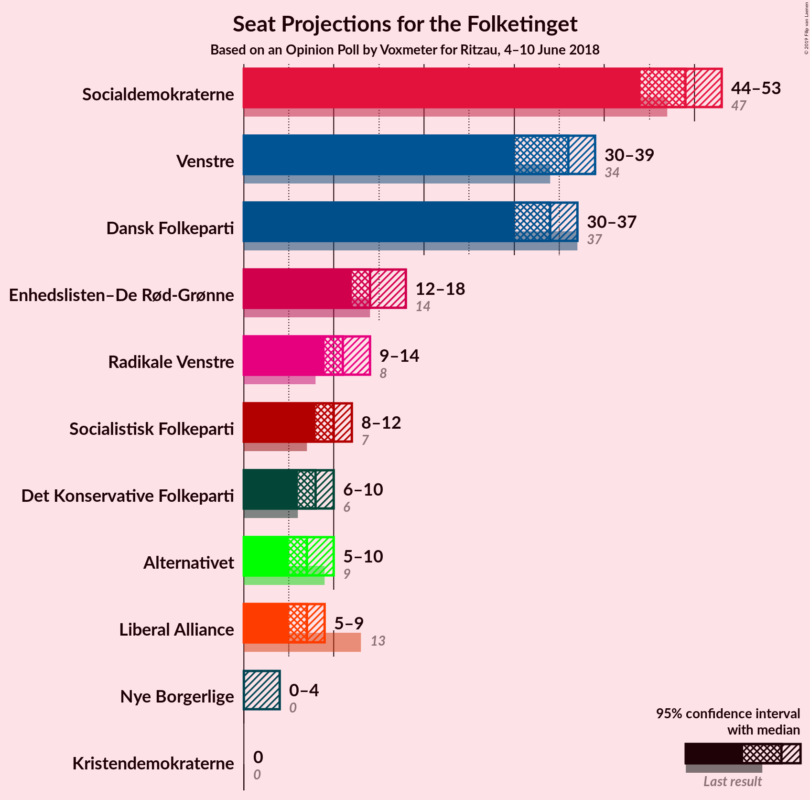

### Confidence Intervals

| Party | Last Result | Median | 80% Confidence Interval | 90% Confidence Interval | 95% Confidence Interval | 99% Confidence Interval |
|:-----:|:-----------:|:------:|:-----------------------:|:-----------------------:|:-----------------------:|:-----------------------:|
| <a href="#socialdemokraterne">Socialdemokraterne</a> | 47 | 49 | 46–52 |44–52 |44–53 |41–54 |
| <a href="#venstre">Venstre</a> | 34 | 36 | 32–39 |32–39 |30–39 |30–40 |
| <a href="#dansk-folkeparti">Dansk Folkeparti</a> | 37 | 34 | 31–36 |30–36 |30–37 |28–38 |
| <a href="#enhedslisten–de-rød-grønne">Enhedslisten–De Rød-Grønne</a> | 14 | 14 | 13–17 |13–18 |12–18 |12–19 |
| <a href="#radikale-venstre">Radikale Venstre</a> | 8 | 11 | 9–13 |9–13 |9–14 |8–15 |
| <a href="#socialistisk-folkeparti">Socialistisk Folkeparti</a> | 7 | 10 | 8–10 |8–11 |8–12 |6–13 |
| <a href="#det-konservative-folkeparti">Det Konservative Folkeparti</a> | 6 | 8 | 7–10 |6–10 |6–10 |5–11 |
| <a href="#liberal-alliance">Liberal Alliance</a> | 13 | 7 | 6–8 |5–9 |5–9 |4–10 |
| <a href="#alternativet">Alternativet</a> | 9 | 7 | 6–8 |6–9 |5–10 |5–11 |
| <a href="#nye-borgerlige">Nye Borgerlige</a> | 0 | 0 | 0 |0 |0–4 |0–4 |
| <a href="#kristendemokraterne">Kristendemokraterne</a> | 0 | 0 | 0 |0 |0 |0 |

### Socialdemokraterne

*For a full overview of the results for this party, see the [Socialdemokraterne](party-socialdemokraterne.html) page.*

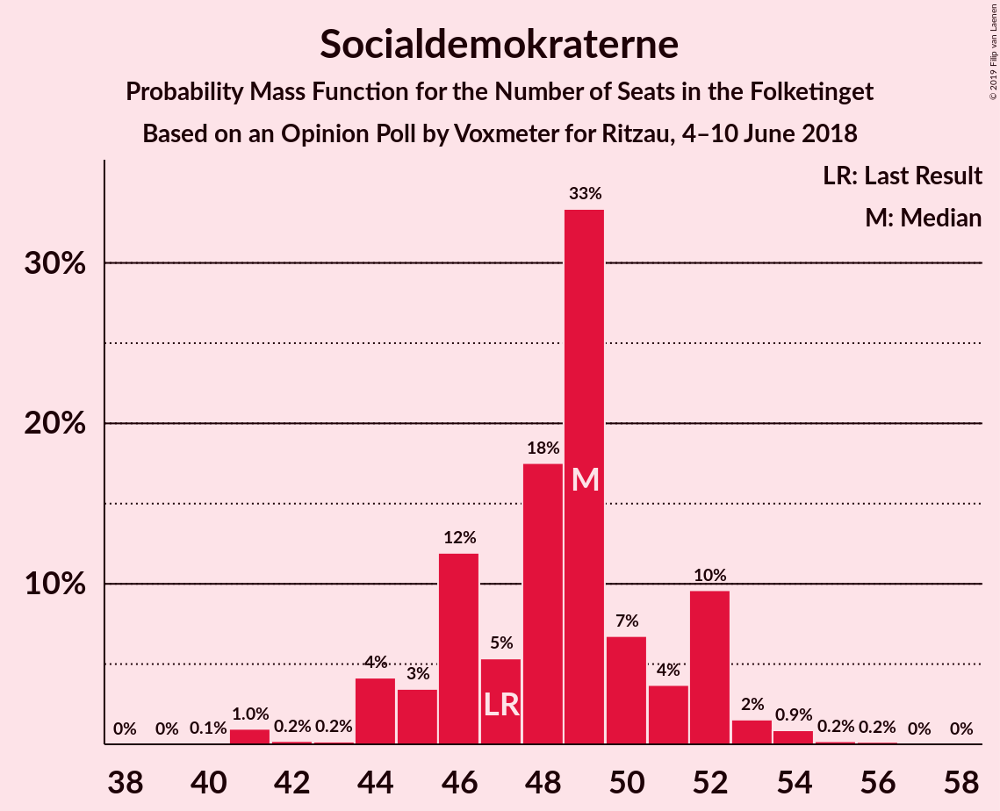

| Number of Seats | Probability | Accumulated | Special Marks |
|:---------------:|:-----------:|:-----------:|:-------------:|
| 40 | 0.1% | 100% |  |
| 41 | 1.0% | 99.9% |  |
| 42 | 0.2% | 99.0% |  |
| 43 | 0.2% | 98.8% |  |
| 44 | 4% | 98.6% |  |
| 45 | 3% | 94% |  |
| 46 | 12% | 91% |  |
| 47 | 5% | 79% | Last Result |
| 48 | 18% | 74% |  |
| 49 | 33% | 56% | Median |
| 50 | 7% | 23% |  |
| 51 | 4% | 16% |  |
| 52 | 10% | 12% |  |
| 53 | 2% | 3% |  |
| 54 | 0.9% | 1.2% |  |
| 55 | 0.2% | 0.4% |  |
| 56 | 0.2% | 0.2% |  |
| 57 | 0% | 0% |  |

### Venstre

*For a full overview of the results for this party, see the [Venstre](party-venstre.html) page.*

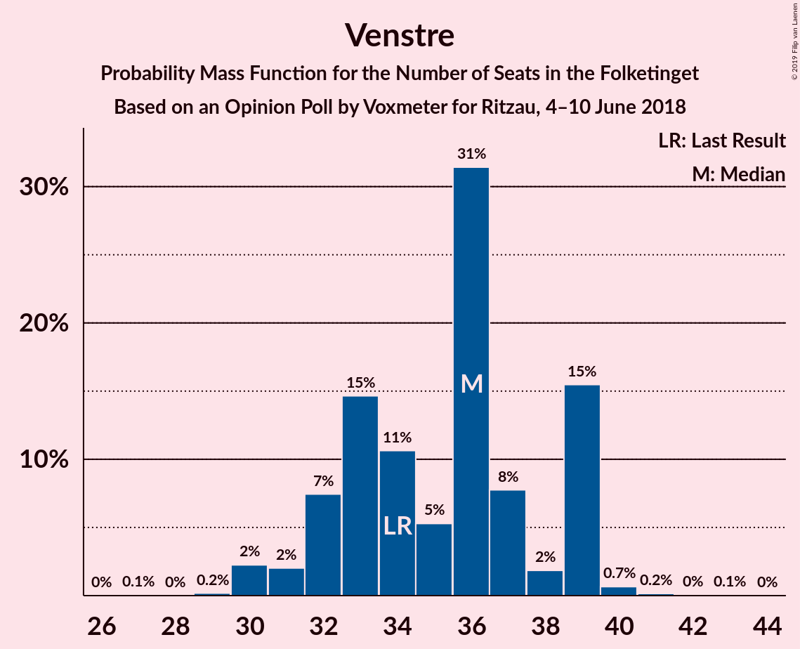

| Number of Seats | Probability | Accumulated | Special Marks |
|:---------------:|:-----------:|:-----------:|:-------------:|
| 27 | 0.1% | 100% |  |
| 28 | 0% | 99.9% |  |
| 29 | 0.2% | 99.9% |  |
| 30 | 2% | 99.7% |  |
| 31 | 2% | 97% |  |
| 32 | 7% | 95% |  |
| 33 | 15% | 88% |  |
| 34 | 11% | 73% | Last Result |
| 35 | 5% | 63% |  |
| 36 | 31% | 57% | Median |
| 37 | 8% | 26% |  |
| 38 | 2% | 18% |  |
| 39 | 15% | 16% |  |
| 40 | 0.7% | 0.9% |  |
| 41 | 0.2% | 0.3% |  |
| 42 | 0% | 0.1% |  |
| 43 | 0.1% | 0.1% |  |
| 44 | 0% | 0% |  |

### Dansk Folkeparti

*For a full overview of the results for this party, see the [Dansk Folkeparti](party-danskfolkeparti.html) page.*

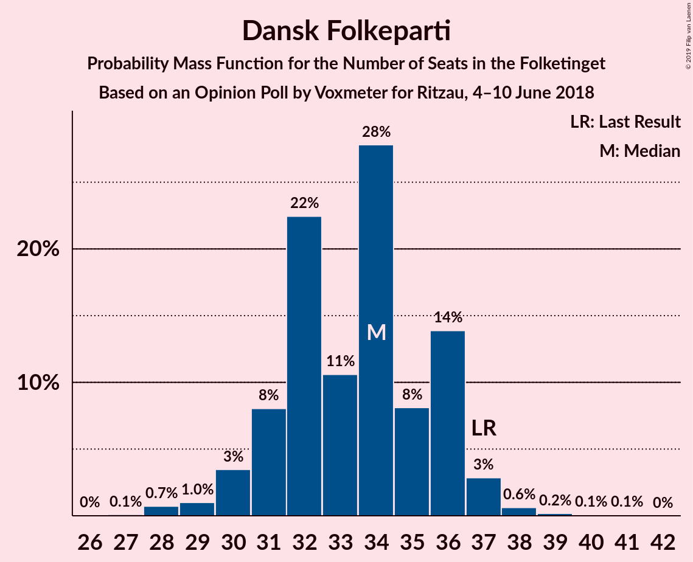

| Number of Seats | Probability | Accumulated | Special Marks |
|:---------------:|:-----------:|:-----------:|:-------------:|
| 27 | 0.1% | 100% |  |
| 28 | 0.7% | 99.9% |  |
| 29 | 1.0% | 99.1% |  |
| 30 | 3% | 98% |  |
| 31 | 8% | 95% |  |
| 32 | 22% | 87% |  |
| 33 | 11% | 64% |  |
| 34 | 28% | 54% | Median |
| 35 | 8% | 26% |  |
| 36 | 14% | 18% |  |
| 37 | 3% | 4% | Last Result |
| 38 | 0.6% | 0.9% |  |
| 39 | 0.2% | 0.3% |  |
| 40 | 0.1% | 0.1% |  |
| 41 | 0.1% | 0.1% |  |
| 42 | 0% | 0% |  |

### Enhedslisten–De Rød-Grønne

*For a full overview of the results for this party, see the [Enhedslisten–De Rød-Grønne](party-enhedslisten–derød-grønne.html) page.*

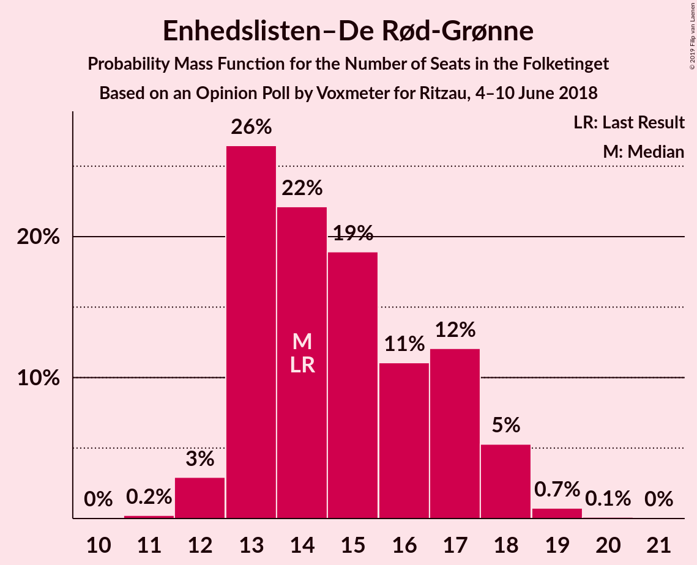

| Number of Seats | Probability | Accumulated | Special Marks |
|:---------------:|:-----------:|:-----------:|:-------------:|
| 11 | 0.2% | 100% |  |
| 12 | 3% | 99.7% |  |
| 13 | 26% | 97% |  |
| 14 | 22% | 70% | Last Result, Median |
| 15 | 19% | 48% |  |
| 16 | 11% | 29% |  |
| 17 | 12% | 18% |  |
| 18 | 5% | 6% |  |
| 19 | 0.7% | 0.9% |  |
| 20 | 0.1% | 0.1% |  |
| 21 | 0% | 0% |  |

### Radikale Venstre

*For a full overview of the results for this party, see the [Radikale Venstre](party-radikalevenstre.html) page.*

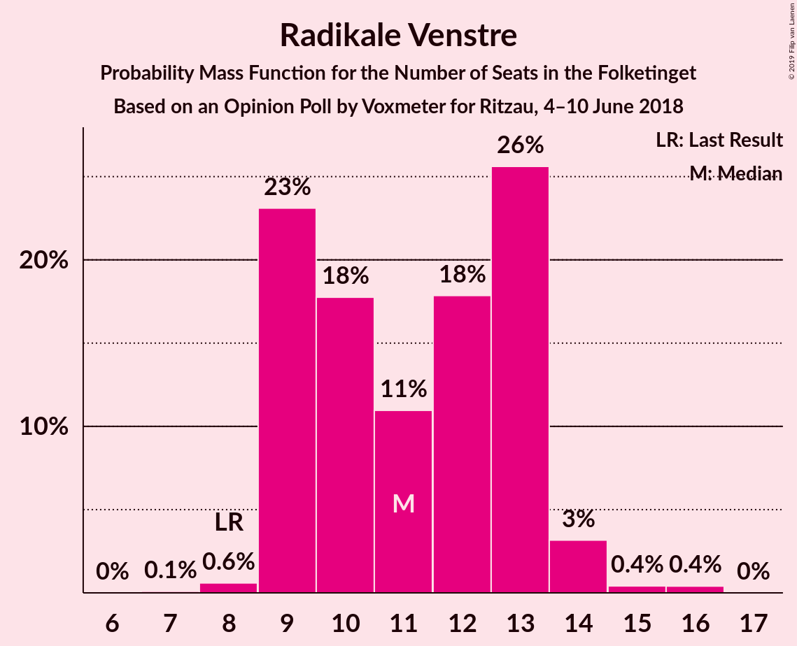

| Number of Seats | Probability | Accumulated | Special Marks |
|:---------------:|:-----------:|:-----------:|:-------------:|
| 7 | 0.1% | 100% |  |
| 8 | 0.6% | 99.9% | Last Result |
| 9 | 23% | 99.3% |  |
| 10 | 18% | 76% |  |
| 11 | 11% | 58% | Median |
| 12 | 18% | 47% |  |
| 13 | 26% | 30% |  |
| 14 | 3% | 4% |  |
| 15 | 0.4% | 0.8% |  |
| 16 | 0.4% | 0.4% |  |
| 17 | 0% | 0% |  |

### Socialistisk Folkeparti

*For a full overview of the results for this party, see the [Socialistisk Folkeparti](party-socialistiskfolkeparti.html) page.*

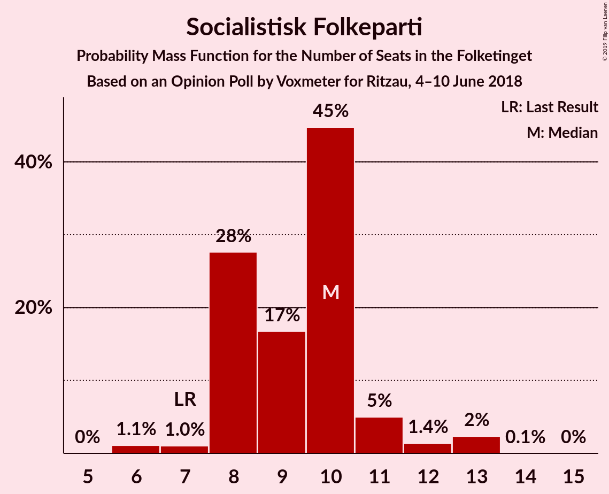

| Number of Seats | Probability | Accumulated | Special Marks |
|:---------------:|:-----------:|:-----------:|:-------------:|
| 6 | 1.1% | 100% |  |
| 7 | 1.0% | 98.9% | Last Result |
| 8 | 28% | 98% |  |
| 9 | 17% | 70% |  |
| 10 | 45% | 54% | Median |
| 11 | 5% | 9% |  |
| 12 | 1.4% | 4% |  |
| 13 | 2% | 2% |  |
| 14 | 0.1% | 0.1% |  |
| 15 | 0% | 0% |  |

### Det Konservative Folkeparti

*For a full overview of the results for this party, see the [Det Konservative Folkeparti](party-detkonservativefolkeparti.html) page.*

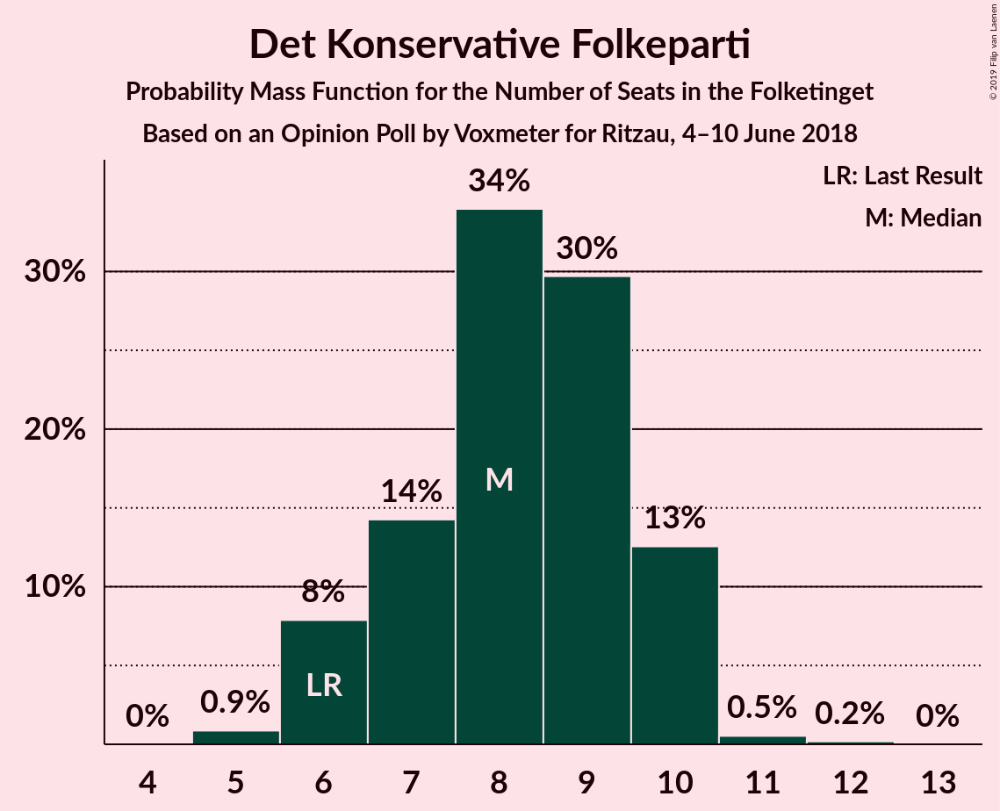

| Number of Seats | Probability | Accumulated | Special Marks |
|:---------------:|:-----------:|:-----------:|:-------------:|
| 5 | 0.9% | 100% |  |
| 6 | 8% | 99.1% | Last Result |
| 7 | 14% | 91% |  |
| 8 | 34% | 77% | Median |
| 9 | 30% | 43% |  |
| 10 | 13% | 13% |  |
| 11 | 0.5% | 0.7% |  |
| 12 | 0.2% | 0.2% |  |
| 13 | 0% | 0% |  |

### Liberal Alliance

*For a full overview of the results for this party, see the [Liberal Alliance](party-liberalalliance.html) page.*

| Number of Seats | Probability | Accumulated | Special Marks |
|:---------------:|:-----------:|:-----------:|:-------------:|
| 4 | 1.2% | 100% |  |
| 5 | 5% | 98.8% |  |
| 6 | 35% | 93% |  |
| 7 | 20% | 59% | Median |
| 8 | 32% | 39% |  |
| 9 | 6% | 7% |  |
| 10 | 0.9% | 1.1% |  |
| 11 | 0.2% | 0.2% |  |
| 12 | 0% | 0% |  |
| 13 | 0% | 0% | Last Result |

### Alternativet

*For a full overview of the results for this party, see the [Alternativet](party-alternativet.html) page.*

| Number of Seats | Probability | Accumulated | Special Marks |
|:---------------:|:-----------:|:-----------:|:-------------:|
| 4 | 0.2% | 100% |  |
| 5 | 3% | 99.8% |  |
| 6 | 18% | 97% |  |
| 7 | 51% | 79% | Median |
| 8 | 21% | 28% |  |
| 9 | 3% | 7% | Last Result |
| 10 | 3% | 4% |  |
| 11 | 0.8% | 0.8% |  |
| 12 | 0% | 0% |  |

### Nye Borgerlige

*For a full overview of the results for this party, see the [Nye Borgerlige](party-nyeborgerlige.html) page.*

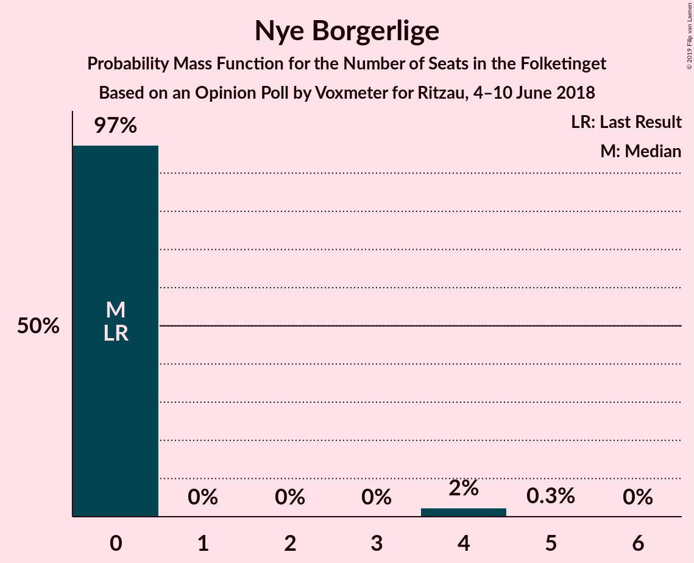

| Number of Seats | Probability | Accumulated | Special Marks |
|:---------------:|:-----------:|:-----------:|:-------------:|
| 0 | 97% | 100% | Last Result, Median |
| 1 | 0% | 3% |  |
| 2 | 0% | 3% |  |
| 3 | 0% | 3% |  |
| 4 | 2% | 3% |  |
| 5 | 0.3% | 0.3% |  |
| 6 | 0% | 0% |  |

### Kristendemokraterne

*For a full overview of the results for this party, see the [Kristendemokraterne](party-kristendemokraterne.html) page.*

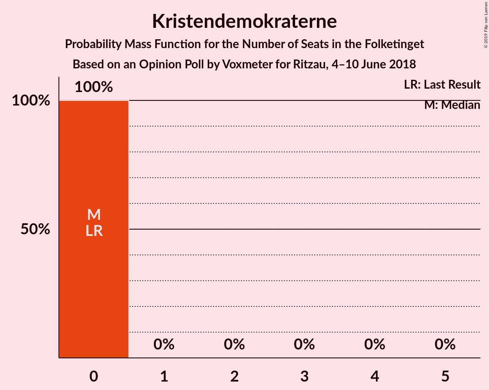

| Number of Seats | Probability | Accumulated | Special Marks |
|:---------------:|:-----------:|:-----------:|:-------------:|
| 0 | 100% | 100% | Last Result, Median |

## Coalitions

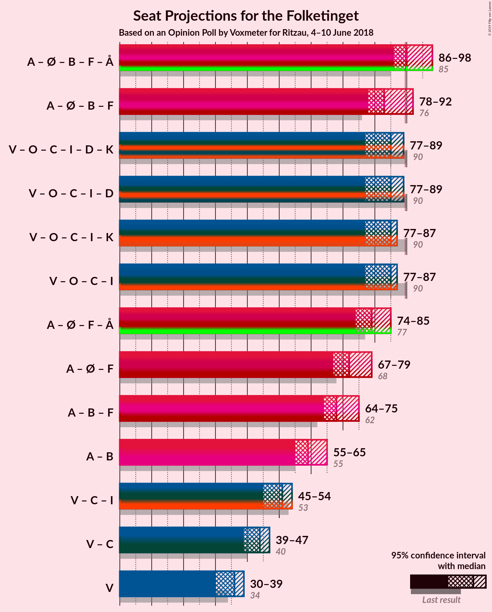

### Confidence Intervals

| Coalition | Last Result | Median | Majority? | 80% Confidence Interval | 90% Confidence Interval | 95% Confidence Interval | 99% Confidence Interval |
|:---------:|:-----------:|:------:|:---------:|:-----------------------:|:-----------------------:|:-----------------------:|:-----------------------:|
| Socialdemokraterne – Enhedslisten–De Rød-Grønne – Radikale Venstre – Socialistisk Folkeparti – Alternativet | 85 | 90 | 70% | 88–96 | 88–98 | 86–98 | 84–98 |
| Socialdemokraterne – Enhedslisten–De Rød-Grønne – Radikale Venstre – Socialistisk Folkeparti | 76 | 83 | 6% | 81–88 | 81–92 | 78–92 | 76–92 |
| Venstre – Dansk Folkeparti – Det Konservative Folkeparti – Liberal Alliance – Nye Borgerlige – Kristendemokraterne | 90 | 85 | 2% | 79–87 | 77–87 | 77–89 | 77–91 |
| Venstre – Dansk Folkeparti – Det Konservative Folkeparti – Liberal Alliance – Nye Borgerlige | 90 | 85 | 2% | 79–87 | 77–87 | 77–89 | 77–91 |
| Venstre – Dansk Folkeparti – Det Konservative Folkeparti – Liberal Alliance – Kristendemokraterne | 90 | 85 | 1.0% | 79–87 | 77–87 | 77–87 | 77–90 |
| Venstre – Dansk Folkeparti – Det Konservative Folkeparti – Liberal Alliance | 90 | 85 | 1.0% | 79–87 | 77–87 | 77–87 | 77–90 |
| Socialdemokraterne – Enhedslisten–De Rød-Grønne – Socialistisk Folkeparti – Alternativet | 77 | 79 | 0% | 77–84 | 76–85 | 74–85 | 73–86 |
| Socialdemokraterne – Enhedslisten–De Rød-Grønne – Socialistisk Folkeparti | 68 | 72 | 0% | 70–76 | 69–79 | 67–79 | 65–79 |
| Socialdemokraterne – Radikale Venstre – Socialistisk Folkeparti | 62 | 68 | 0% | 67–73 | 65–75 | 64–75 | 62–75 |
| Socialdemokraterne – Radikale Venstre | 55 | 59 | 0% | 57–63 | 55–65 | 55–65 | 53–66 |
| Venstre – Det Konservative Folkeparti – Liberal Alliance | 53 | 51 | 0% | 47–53 | 45–53 | 45–54 | 45–57 |
| Venstre – Det Konservative Folkeparti | 40 | 44 | 0% | 40–47 | 39–47 | 39–47 | 38–49 |
| Venstre | 34 | 36 | 0% | 32–39 | 32–39 | 30–39 | 30–40 |

### Socialdemokraterne – Enhedslisten–De Rød-Grønne – Radikale Venstre – Socialistisk Folkeparti – Alternativet

| Number of Seats | Probability | Accumulated | Special Marks |
|:---------------:|:-----------:|:-----------:|:-------------:|
| 83 | 0% | 100% |  |
| 84 | 1.1% | 99.9% |  |
| 85 | 1.1% | 98.8% | Last Result |
| 86 | 0.6% | 98% |  |
| 87 | 0.9% | 97% |  |
| 88 | 23% | 96% |  |
| 89 | 3% | 73% |  |
| 90 | 21% | 70% | Majority |
| 91 | 19% | 48% | Median |
| 92 | 8% | 29% |  |
| 93 | 5% | 22% |  |
| 94 | 4% | 17% |  |
| 95 | 3% | 13% |  |
| 96 | 4% | 10% |  |
| 97 | 1.0% | 6% |  |
| 98 | 5% | 5% |  |
| 99 | 0% | 0.2% |  |
| 100 | 0.1% | 0.2% |  |
| 101 | 0% | 0% |  |

### Socialdemokraterne – Enhedslisten–De Rød-Grønne – Radikale Venstre – Socialistisk Folkeparti

| Number of Seats | Probability | Accumulated | Special Marks |
|:---------------:|:-----------:|:-----------:|:-------------:|
| 75 | 0% | 100% |  |
| 76 | 1.1% | 99.9% | Last Result |
| 77 | 0.8% | 98.9% |  |
| 78 | 1.1% | 98% |  |
| 79 | 0.5% | 97% |  |
| 80 | 1.1% | 96% |  |
| 81 | 24% | 95% |  |
| 82 | 5% | 71% |  |
| 83 | 29% | 67% |  |
| 84 | 6% | 38% | Median |
| 85 | 8% | 32% |  |
| 86 | 9% | 24% |  |
| 87 | 4% | 15% |  |
| 88 | 2% | 11% |  |
| 89 | 4% | 9% |  |
| 90 | 0.3% | 6% | Majority |
| 91 | 0.2% | 5% |  |
| 92 | 5% | 5% |  |
| 93 | 0% | 0.1% |  |
| 94 | 0.1% | 0.1% |  |
| 95 | 0% | 0% |  |

### Venstre – Dansk Folkeparti – Det Konservative Folkeparti – Liberal Alliance – Nye Borgerlige – Kristendemokraterne

| Number of Seats | Probability | Accumulated | Special Marks |
|:---------------:|:-----------:|:-----------:|:-------------:|
| 75 | 0.1% | 100% |  |
| 76 | 0% | 99.8% |  |
| 77 | 5% | 99.8% |  |
| 78 | 1.0% | 95% |  |
| 79 | 4% | 94% |  |
| 80 | 3% | 90% |  |
| 81 | 4% | 87% |  |
| 82 | 5% | 83% |  |
| 83 | 8% | 78% |  |
| 84 | 19% | 71% |  |
| 85 | 21% | 52% | Median |
| 86 | 3% | 30% |  |
| 87 | 23% | 27% |  |
| 88 | 0.9% | 4% |  |
| 89 | 0.6% | 3% |  |
| 90 | 1.1% | 2% | Last Result, Majority |
| 91 | 1.1% | 1.2% |  |
| 92 | 0% | 0.1% |  |
| 93 | 0% | 0% |  |

### Venstre – Dansk Folkeparti – Det Konservative Folkeparti – Liberal Alliance – Nye Borgerlige

| Number of Seats | Probability | Accumulated | Special Marks |
|:---------------:|:-----------:|:-----------:|:-------------:|
| 75 | 0.1% | 100% |  |
| 76 | 0% | 99.8% |  |
| 77 | 5% | 99.8% |  |
| 78 | 1.0% | 95% |  |
| 79 | 4% | 94% |  |
| 80 | 3% | 90% |  |
| 81 | 4% | 87% |  |
| 82 | 5% | 83% |  |
| 83 | 8% | 78% |  |
| 84 | 19% | 71% |  |
| 85 | 21% | 52% | Median |
| 86 | 3% | 30% |  |
| 87 | 23% | 27% |  |
| 88 | 0.9% | 4% |  |
| 89 | 0.6% | 3% |  |
| 90 | 1.1% | 2% | Last Result, Majority |
| 91 | 1.1% | 1.2% |  |
| 92 | 0% | 0.1% |  |
| 93 | 0% | 0% |  |

### Venstre – Dansk Folkeparti – Det Konservative Folkeparti – Liberal Alliance – Kristendemokraterne

| Number of Seats | Probability | Accumulated | Special Marks |
|:---------------:|:-----------:|:-----------:|:-------------:|
| 75 | 0.1% | 100% |  |
| 76 | 0.1% | 99.8% |  |
| 77 | 5% | 99.8% |  |
| 78 | 1.0% | 95% |  |
| 79 | 4% | 94% |  |
| 80 | 3% | 89% |  |
| 81 | 4% | 86% |  |
| 82 | 5% | 82% |  |
| 83 | 8% | 77% |  |
| 84 | 19% | 69% |  |
| 85 | 21% | 51% | Median |
| 86 | 3% | 30% |  |
| 87 | 24% | 26% |  |
| 88 | 0.9% | 2% |  |
| 89 | 0.6% | 2% |  |
| 90 | 0.9% | 1.0% | Last Result, Majority |
| 91 | 0.1% | 0.2% |  |
| 92 | 0% | 0.1% |  |
| 93 | 0% | 0% |  |

### Venstre – Dansk Folkeparti – Det Konservative Folkeparti – Liberal Alliance

| Number of Seats | Probability | Accumulated | Special Marks |
|:---------------:|:-----------:|:-----------:|:-------------:|
| 75 | 0.1% | 100% |  |
| 76 | 0.1% | 99.8% |  |
| 77 | 5% | 99.8% |  |
| 78 | 1.0% | 95% |  |
| 79 | 4% | 94% |  |
| 80 | 3% | 89% |  |
| 81 | 4% | 86% |  |
| 82 | 5% | 82% |  |
| 83 | 8% | 77% |  |
| 84 | 19% | 69% |  |
| 85 | 21% | 51% | Median |
| 86 | 3% | 30% |  |
| 87 | 24% | 26% |  |
| 88 | 0.9% | 2% |  |
| 89 | 0.6% | 2% |  |
| 90 | 0.9% | 1.0% | Last Result, Majority |
| 91 | 0.1% | 0.2% |  |
| 92 | 0% | 0.1% |  |
| 93 | 0% | 0% |  |

### Socialdemokraterne – Enhedslisten–De Rød-Grønne – Socialistisk Folkeparti – Alternativet

| Number of Seats | Probability | Accumulated | Special Marks |
|:---------------:|:-----------:|:-----------:|:-------------:|
| 72 | 0% | 100% |  |
| 73 | 1.0% | 99.9% |  |
| 74 | 2% | 98.9% |  |
| 75 | 0.4% | 97% |  |
| 76 | 2% | 97% |  |
| 77 | 15% | 95% | Last Result |
| 78 | 6% | 80% |  |
| 79 | 30% | 73% |  |
| 80 | 14% | 43% | Median |
| 81 | 8% | 29% |  |
| 82 | 6% | 21% |  |
| 83 | 5% | 15% |  |
| 84 | 3% | 10% |  |
| 85 | 6% | 7% |  |
| 86 | 0.9% | 1.3% |  |
| 87 | 0.3% | 0.5% |  |
| 88 | 0.1% | 0.2% |  |
| 89 | 0% | 0.1% |  |
| 90 | 0% | 0% | Majority |

### Socialdemokraterne – Enhedslisten–De Rød-Grønne – Socialistisk Folkeparti

| Number of Seats | Probability | Accumulated | Special Marks |
|:---------------:|:-----------:|:-----------:|:-------------:|
| 65 | 0.9% | 100% |  |
| 66 | 1.3% | 99.1% |  |
| 67 | 0.5% | 98% |  |
| 68 | 1.1% | 97% | Last Result |
| 69 | 2% | 96% |  |
| 70 | 17% | 94% |  |
| 71 | 10% | 77% |  |
| 72 | 29% | 67% |  |
| 73 | 10% | 38% | Median |
| 74 | 5% | 27% |  |
| 75 | 7% | 22% |  |
| 76 | 6% | 15% |  |
| 77 | 3% | 9% |  |
| 78 | 0.6% | 6% |  |
| 79 | 5% | 6% |  |
| 80 | 0.1% | 0.3% |  |
| 81 | 0.2% | 0.2% |  |
| 82 | 0% | 0.1% |  |
| 83 | 0% | 0% |  |

### Socialdemokraterne – Radikale Venstre – Socialistisk Folkeparti

| Number of Seats | Probability | Accumulated | Special Marks |
|:---------------:|:-----------:|:-----------:|:-------------:|
| 61 | 0.1% | 100% |  |
| 62 | 1.0% | 99.9% | Last Result |
| 63 | 0.5% | 98.9% |  |
| 64 | 2% | 98% |  |
| 65 | 3% | 97% |  |
| 66 | 2% | 93% |  |
| 67 | 5% | 91% |  |
| 68 | 38% | 86% |  |
| 69 | 23% | 48% |  |
| 70 | 8% | 25% | Median |
| 71 | 3% | 18% |  |
| 72 | 2% | 14% |  |
| 73 | 3% | 12% |  |
| 74 | 2% | 9% |  |
| 75 | 7% | 7% |  |
| 76 | 0.1% | 0.3% |  |
| 77 | 0.1% | 0.2% |  |
| 78 | 0.1% | 0.1% |  |
| 79 | 0% | 0% |  |

### Socialdemokraterne – Radikale Venstre

| Number of Seats | Probability | Accumulated | Special Marks |
|:---------------:|:-----------:|:-----------:|:-------------:|
| 52 | 0.1% | 100% |  |
| 53 | 1.1% | 99.9% |  |
| 54 | 0.7% | 98.8% |  |
| 55 | 4% | 98% | Last Result |
| 56 | 2% | 94% |  |
| 57 | 4% | 92% |  |
| 58 | 31% | 88% |  |
| 59 | 13% | 57% |  |
| 60 | 7% | 44% | Median |
| 61 | 18% | 37% |  |
| 62 | 4% | 20% |  |
| 63 | 5% | 15% |  |
| 64 | 3% | 10% |  |
| 65 | 6% | 7% |  |
| 66 | 1.1% | 1.4% |  |
| 67 | 0.1% | 0.2% |  |
| 68 | 0% | 0.1% |  |
| 69 | 0% | 0% |  |

### Venstre – Det Konservative Folkeparti – Liberal Alliance

| Number of Seats | Probability | Accumulated | Special Marks |
|:---------------:|:-----------:|:-----------:|:-------------:|
| 42 | 0.1% | 100% |  |
| 43 | 0.2% | 99.9% |  |
| 44 | 0.1% | 99.7% |  |
| 45 | 5% | 99.6% |  |
| 46 | 3% | 94% |  |
| 47 | 5% | 91% |  |
| 48 | 12% | 86% |  |
| 49 | 12% | 74% |  |
| 50 | 8% | 62% |  |
| 51 | 7% | 54% | Median |
| 52 | 4% | 47% |  |
| 53 | 40% | 43% | Last Result |
| 54 | 1.0% | 3% |  |
| 55 | 1.3% | 2% |  |
| 56 | 0.2% | 1.1% |  |
| 57 | 0.8% | 0.9% |  |
| 58 | 0.1% | 0.1% |  |
| 59 | 0% | 0% |  |

### Venstre – Det Konservative Folkeparti

| Number of Seats | Probability | Accumulated | Special Marks |
|:---------------:|:-----------:|:-----------:|:-------------:|
| 35 | 0.1% | 100% |  |
| 36 | 0.1% | 99.9% |  |
| 37 | 0.2% | 99.8% |  |
| 38 | 0.5% | 99.6% |  |
| 39 | 8% | 99.1% |  |
| 40 | 8% | 91% | Last Result |
| 41 | 6% | 83% |  |
| 42 | 11% | 77% |  |
| 43 | 9% | 66% |  |
| 44 | 10% | 57% | Median |
| 45 | 26% | 47% |  |
| 46 | 5% | 21% |  |
| 47 | 14% | 16% |  |
| 48 | 1.0% | 2% |  |
| 49 | 0.7% | 1.1% |  |
| 50 | 0.3% | 0.4% |  |
| 51 | 0.1% | 0.1% |  |
| 52 | 0% | 0% |  |

### Venstre

| Number of Seats | Probability | Accumulated | Special Marks |
|:---------------:|:-----------:|:-----------:|:-------------:|
| 27 | 0.1% | 100% |  |
| 28 | 0% | 99.9% |  |
| 29 | 0.2% | 99.9% |  |
| 30 | 2% | 99.7% |  |
| 31 | 2% | 97% |  |
| 32 | 7% | 95% |  |
| 33 | 15% | 88% |  |
| 34 | 11% | 73% | Last Result |
| 35 | 5% | 63% |  |
| 36 | 31% | 57% | Median |
| 37 | 8% | 26% |  |
| 38 | 2% | 18% |  |
| 39 | 15% | 16% |  |
| 40 | 0.7% | 0.9% |  |
| 41 | 0.2% | 0.3% |  |
| 42 | 0% | 0.1% |  |
| 43 | 0.1% | 0.1% |  |
| 44 | 0% | 0% |  |

## Technical Information

### Opinion Poll

+ **Polling firm:** Voxmeter
+ **Commissioner(s):** Ritzau
+ **Fieldwork period:** 4–10 June 2018

### Calculations

+ **Sample size:** 1031
+ **Simulations done:** 1,048,576
+ **Error estimate:** 1.92%

