# Opinion Poll by Voxmeter for Ritzau, 18–24 June 2018

<a href="#voting-intentions">Voting Intentions</a> | <a href="#seats">Seats</a> | <a href="#coalitions">Coalitions</a> | <a href="#technical-information">Technical Information</a>

## Voting Intentions

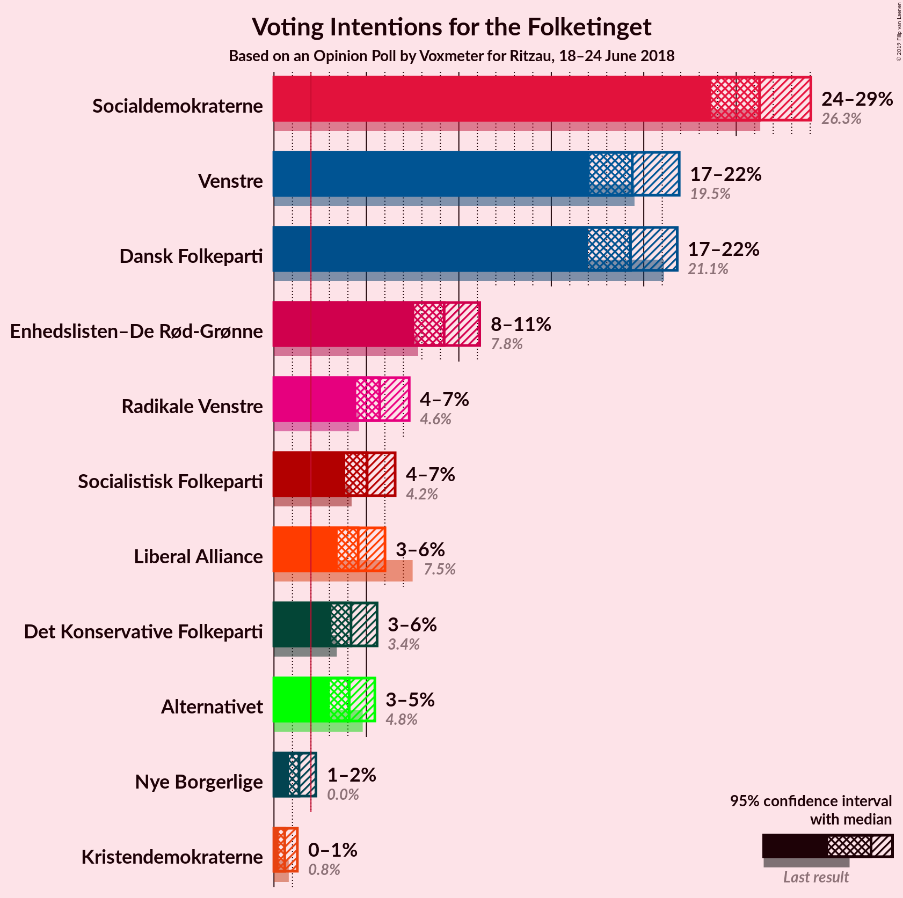

### Confidence Intervals

| Party | Last Result | Poll Result | 80% Confidence Interval | 90% Confidence Interval | 95% Confidence Interval | 99% Confidence Interval |
|:-----:|:-----------:|:-----------:|:-----------------------:|:-----------------------:|:-----------------------:|:-----------------------:|
| Socialdemokraterne | 26.3% | 26.3% | 24.6–28.1% |24.1–28.6% |23.7–29.0% |22.9–29.9% |
| Venstre | 19.5% | 19.4% | 17.9–21.0% |17.4–21.5% |17.1–21.9% |16.4–22.7% |
| Dansk Folkeparti | 21.1% | 19.3% | 17.8–20.9% |17.3–21.4% |17.0–21.8% |16.3–22.6% |
| Enhedslisten–De Rød-Grønne | 7.8% | 9.2% | 8.1–10.5% |7.8–10.8% |7.6–11.1% |7.1–11.8% |
| Radikale Venstre | 4.6% | 5.7% | 4.9–6.8% |4.6–7.1% |4.5–7.3% |4.1–7.8% |
| Socialistisk Folkeparti | 4.2% | 5.0% | 4.3–6.0% |4.0–6.3% |3.9–6.6% |3.5–7.1% |
| Liberal Alliance | 7.5% | 4.6% | 3.8–5.5% |3.6–5.8% |3.4–6.0% |3.1–6.5% |
| Det Konservative Folkeparti | 3.4% | 4.2% | 3.5–5.1% |3.3–5.3% |3.1–5.6% |2.8–6.0% |
| Alternativet | 4.8% | 4.1% | 3.4–5.0% |3.2–5.2% |3.0–5.5% |2.7–5.9% |
| Nye Borgerlige | 0.0% | 1.4% | 1.0–2.0% |0.9–2.1% |0.8–2.3% |0.7–2.6% |
| Kristendemokraterne | 0.8% | 0.6% | 0.4–1.0% |0.3–1.1% |0.3–1.3% |0.2–1.5% |

*Note:* The poll result column reflects the actual value used in the calculations. Published results may vary slightly, and in addition be rounded to fewer digits.

## Seats

### Confidence Intervals

| Party | Last Result | Median | 80% Confidence Interval | 90% Confidence Interval | 95% Confidence Interval | 99% Confidence Interval |
|:-----:|:-----------:|:------:|:-----------------------:|:-----------------------:|:-----------------------:|:-----------------------:|
| <a href="#socialdemokraterne">Socialdemokraterne</a> | 47 | 49 | 45–49 |43–50 |42–51 |41–54 |
| <a href="#venstre">Venstre</a> | 34 | 35 | 33–37 |31–37 |31–39 |29–41 |
| <a href="#dansk-folkeparti">Dansk Folkeparti</a> | 37 | 33 | 32–36 |31–37 |31–38 |30–40 |
| <a href="#enhedslisten–de-rød-grønne">Enhedslisten–De Rød-Grønne</a> | 14 | 15 | 15–18 |14–18 |13–19 |13–21 |
| <a href="#radikale-venstre">Radikale Venstre</a> | 8 | 10 | 9–12 |9–13 |8–13 |8–14 |
| <a href="#socialistisk-folkeparti">Socialistisk Folkeparti</a> | 7 | 10 | 8–10 |7–11 |7–11 |7–13 |
| <a href="#liberal-alliance">Liberal Alliance</a> | 13 | 10 | 6–10 |6–10 |6–11 |5–12 |
| <a href="#det-konservative-folkeparti">Det Konservative Folkeparti</a> | 6 | 7 | 7–9 |6–9 |6–9 |5–10 |
| <a href="#alternativet">Alternativet</a> | 9 | 6 | 6–8 |6–9 |5–9 |5–10 |
| <a href="#nye-borgerlige">Nye Borgerlige</a> | 0 | 0 | 0 |0–4 |0–4 |0–4 |
| <a href="#kristendemokraterne">Kristendemokraterne</a> | 0 | 0 | 0 |0 |0 |0 |

### Socialdemokraterne

*For a full overview of the results for this party, see the [Socialdemokraterne](party-socialdemokraterne.html) page.*

| Number of Seats | Probability | Accumulated | Special Marks |
|:---------------:|:-----------:|:-----------:|:-------------:|
| 39 | 0.2% | 100% |  |
| 40 | 0.2% | 99.8% |  |
| 41 | 1.2% | 99.6% |  |
| 42 | 2% | 98% |  |
| 43 | 2% | 96% |  |
| 44 | 3% | 94% |  |
| 45 | 4% | 91% |  |
| 46 | 14% | 87% |  |
| 47 | 16% | 73% | Last Result |
| 48 | 2% | 57% |  |
| 49 | 50% | 55% | Median |
| 50 | 2% | 5% |  |
| 51 | 1.4% | 3% |  |
| 52 | 0.3% | 2% |  |
| 53 | 0.6% | 2% |  |
| 54 | 0.6% | 0.9% |  |
| 55 | 0.3% | 0.3% |  |
| 56 | 0% | 0% |  |

### Venstre

*For a full overview of the results for this party, see the [Venstre](party-venstre.html) page.*

| Number of Seats | Probability | Accumulated | Special Marks |
|:---------------:|:-----------:|:-----------:|:-------------:|
| 28 | 0.1% | 100% |  |
| 29 | 0.6% | 99.9% |  |
| 30 | 2% | 99.3% |  |
| 31 | 4% | 98% |  |
| 32 | 4% | 94% |  |
| 33 | 8% | 90% |  |
| 34 | 3% | 82% | Last Result |
| 35 | 49% | 79% | Median |
| 36 | 14% | 30% |  |
| 37 | 12% | 16% |  |
| 38 | 1.0% | 4% |  |
| 39 | 0.8% | 3% |  |
| 40 | 0.3% | 2% |  |
| 41 | 1.4% | 2% |  |
| 42 | 0.1% | 0.2% |  |
| 43 | 0.1% | 0.1% |  |
| 44 | 0% | 0% |  |

### Dansk Folkeparti

*For a full overview of the results for this party, see the [Dansk Folkeparti](party-danskfolkeparti.html) page.*

| Number of Seats | Probability | Accumulated | Special Marks |
|:---------------:|:-----------:|:-----------:|:-------------:|
| 28 | 0.2% | 100% |  |
| 29 | 0.3% | 99.8% |  |
| 30 | 0.9% | 99.5% |  |
| 31 | 4% | 98.6% |  |
| 32 | 17% | 95% |  |
| 33 | 50% | 78% | Median |
| 34 | 4% | 28% |  |
| 35 | 12% | 24% |  |
| 36 | 5% | 12% |  |
| 37 | 3% | 7% | Last Result |
| 38 | 2% | 3% |  |
| 39 | 0.6% | 1.4% |  |
| 40 | 0.5% | 0.8% |  |
| 41 | 0.1% | 0.2% |  |
| 42 | 0.2% | 0.2% |  |
| 43 | 0% | 0% |  |

### Enhedslisten–De Rød-Grønne

*For a full overview of the results for this party, see the [Enhedslisten–De Rød-Grønne](party-enhedslisten–derød-grønne.html) page.*

| Number of Seats | Probability | Accumulated | Special Marks |
|:---------------:|:-----------:|:-----------:|:-------------:|
| 12 | 0.3% | 100% |  |
| 13 | 3% | 99.7% |  |
| 14 | 3% | 97% | Last Result |
| 15 | 52% | 94% | Median |
| 16 | 5% | 42% |  |
| 17 | 19% | 37% |  |
| 18 | 14% | 18% |  |
| 19 | 3% | 4% |  |
| 20 | 0.8% | 1.3% |  |
| 21 | 0.4% | 0.5% |  |
| 22 | 0.1% | 0.1% |  |
| 23 | 0% | 0% |  |

### Radikale Venstre

*For a full overview of the results for this party, see the [Radikale Venstre](party-radikalevenstre.html) page.*

| Number of Seats | Probability | Accumulated | Special Marks |
|:---------------:|:-----------:|:-----------:|:-------------:|
| 7 | 0.4% | 100% |  |
| 8 | 3% | 99.5% | Last Result |
| 9 | 13% | 96% |  |
| 10 | 51% | 83% | Median |
| 11 | 20% | 32% |  |
| 12 | 7% | 12% |  |
| 13 | 4% | 6% |  |
| 14 | 2% | 2% |  |
| 15 | 0.1% | 0.1% |  |
| 16 | 0% | 0% |  |

### Socialistisk Folkeparti

*For a full overview of the results for this party, see the [Socialistisk Folkeparti](party-socialistiskfolkeparti.html) page.*

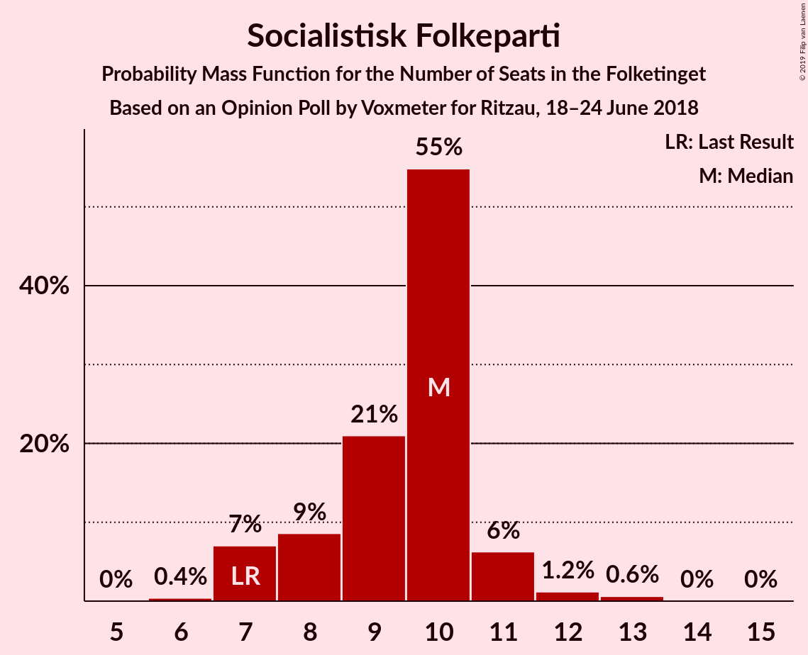

| Number of Seats | Probability | Accumulated | Special Marks |
|:---------------:|:-----------:|:-----------:|:-------------:|
| 6 | 0.4% | 100% |  |
| 7 | 7% | 99.6% | Last Result |
| 8 | 9% | 93% |  |
| 9 | 21% | 84% |  |
| 10 | 55% | 63% | Median |
| 11 | 6% | 8% |  |
| 12 | 1.2% | 2% |  |
| 13 | 0.6% | 0.7% |  |
| 14 | 0% | 0.1% |  |
| 15 | 0% | 0% |  |

### Liberal Alliance

*For a full overview of the results for this party, see the [Liberal Alliance](party-liberalalliance.html) page.*

| Number of Seats | Probability | Accumulated | Special Marks |
|:---------------:|:-----------:|:-----------:|:-------------:|
| 5 | 0.6% | 100% |  |
| 6 | 9% | 99.4% |  |
| 7 | 8% | 90% |  |
| 8 | 20% | 82% |  |
| 9 | 9% | 62% |  |
| 10 | 50% | 53% | Median |
| 11 | 2% | 3% |  |
| 12 | 0.6% | 0.7% |  |
| 13 | 0% | 0% | Last Result |

### Det Konservative Folkeparti

*For a full overview of the results for this party, see the [Det Konservative Folkeparti](party-detkonservativefolkeparti.html) page.*

| Number of Seats | Probability | Accumulated | Special Marks |
|:---------------:|:-----------:|:-----------:|:-------------:|
| 4 | 0.1% | 100% |  |
| 5 | 1.4% | 99.9% |  |
| 6 | 8% | 98.5% | Last Result |
| 7 | 53% | 91% | Median |
| 8 | 15% | 38% |  |
| 9 | 21% | 23% |  |
| 10 | 1.3% | 2% |  |
| 11 | 0.4% | 0.5% |  |
| 12 | 0.1% | 0.1% |  |
| 13 | 0% | 0% |  |

### Alternativet

*For a full overview of the results for this party, see the [Alternativet](party-alternativet.html) page.*

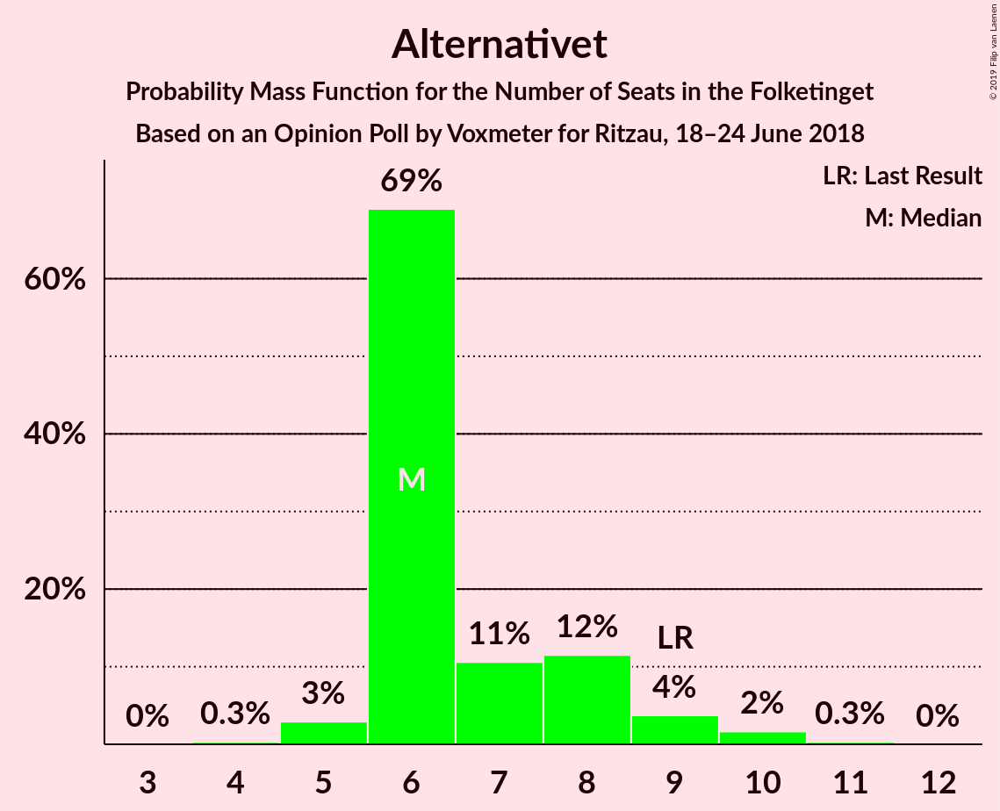

| Number of Seats | Probability | Accumulated | Special Marks |
|:---------------:|:-----------:|:-----------:|:-------------:|
| 4 | 0.3% | 100% |  |
| 5 | 3% | 99.7% |  |
| 6 | 69% | 97% | Median |
| 7 | 11% | 28% |  |
| 8 | 12% | 17% |  |
| 9 | 4% | 6% | Last Result |
| 10 | 2% | 2% |  |
| 11 | 0.3% | 0.3% |  |
| 12 | 0% | 0% |  |

### Nye Borgerlige

*For a full overview of the results for this party, see the [Nye Borgerlige](party-nyeborgerlige.html) page.*

| Number of Seats | Probability | Accumulated | Special Marks |
|:---------------:|:-----------:|:-----------:|:-------------:|
| 0 | 94% | 100% | Last Result, Median |
| 1 | 0% | 6% |  |
| 2 | 0% | 6% |  |
| 3 | 0% | 6% |  |
| 4 | 6% | 6% |  |
| 5 | 0.4% | 0.4% |  |
| 6 | 0% | 0% |  |

### Kristendemokraterne

*For a full overview of the results for this party, see the [Kristendemokraterne](party-kristendemokraterne.html) page.*

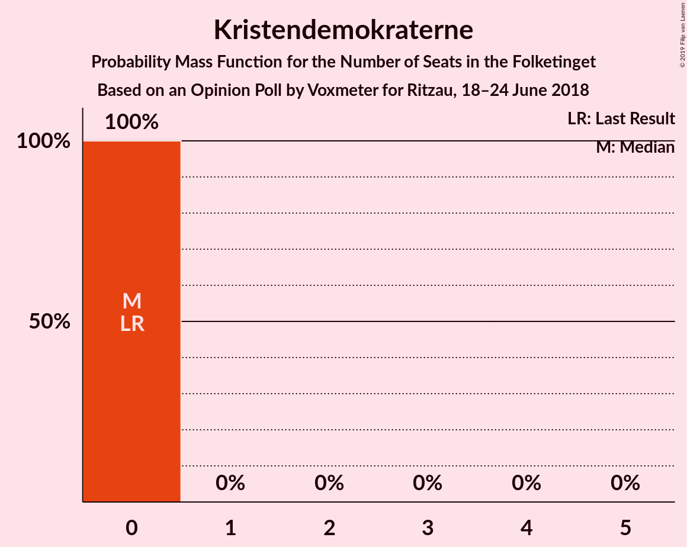

| Number of Seats | Probability | Accumulated | Special Marks |
|:---------------:|:-----------:|:-----------:|:-------------:|
| 0 | 100% | 100% | Last Result, Median |

## Coalitions

### Confidence Intervals

| Coalition | Last Result | Median | Majority? | 80% Confidence Interval | 90% Confidence Interval | 95% Confidence Interval | 99% Confidence Interval |
|:---------:|:-----------:|:------:|:---------:|:-----------------------:|:-----------------------:|:-----------------------:|:-----------------------:|
| Socialdemokraterne – Enhedslisten–De Rød-Grønne – Radikale Venstre – Socialistisk Folkeparti – Alternativet | 85 | 90 | 76% | 88–92 | 86–93 | 85–95 | 83–97 |
| Venstre – Dansk Folkeparti – Liberal Alliance – Det Konservative Folkeparti – Nye Borgerlige – Kristendemokraterne | 90 | 85 | 3% | 83–87 | 82–89 | 80–90 | 78–92 |
| Venstre – Dansk Folkeparti – Liberal Alliance – Det Konservative Folkeparti – Nye Borgerlige | 90 | 85 | 3% | 83–87 | 82–89 | 80–90 | 78–92 |
| Venstre – Dansk Folkeparti – Liberal Alliance – Det Konservative Folkeparti – Kristendemokraterne | 90 | 85 | 2% | 83–86 | 81–88 | 79–89 | 78–92 |
| Venstre – Dansk Folkeparti – Liberal Alliance – Det Konservative Folkeparti | 90 | 85 | 2% | 83–86 | 81–88 | 79–89 | 78–92 |
| Socialdemokraterne – Enhedslisten–De Rød-Grønne – Radikale Venstre – Socialistisk Folkeparti | 76 | 84 | 0.5% | 80–85 | 79–86 | 78–87 | 76–90 |
| Socialdemokraterne – Enhedslisten–De Rød-Grønne – Socialistisk Folkeparti – Alternativet | 77 | 80 | 0% | 77–81 | 76–84 | 74–85 | 73–86 |
| Socialdemokraterne – Enhedslisten–De Rød-Grønne – Socialistisk Folkeparti | 68 | 74 | 0% | 70–74 | 69–76 | 67–78 | 66–79 |
| Socialdemokraterne – Radikale Venstre – Socialistisk Folkeparti | 62 | 69 | 0% | 64–69 | 62–70 | 62–71 | 60–73 |
| Socialdemokraterne – Radikale Venstre | 55 | 59 | 0% | 55–60 | 53–61 | 53–62 | 51–64 |
| Venstre – Liberal Alliance – Det Konservative Folkeparti | 53 | 52 | 0% | 48–53 | 47–54 | 46–56 | 44–57 |
| Venstre – Det Konservative Folkeparti | 40 | 42 | 0% | 40–45 | 39–45 | 37–46 | 36–48 |
| Venstre | 34 | 35 | 0% | 33–37 | 31–37 | 31–39 | 29–41 |

### Socialdemokraterne – Enhedslisten–De Rød-Grønne – Radikale Venstre – Socialistisk Folkeparti – Alternativet

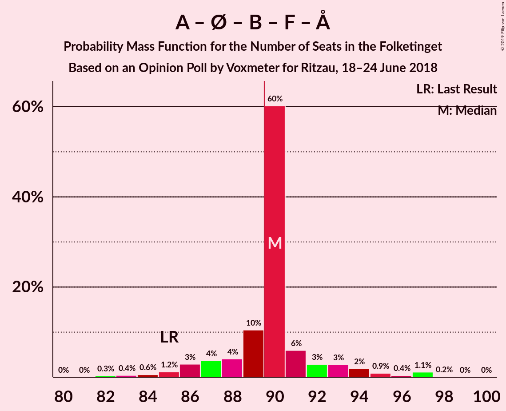

| Number of Seats | Probability | Accumulated | Special Marks |
|:---------------:|:-----------:|:-----------:|:-------------:|
| 81 | 0% | 100% |  |
| 82 | 0.3% | 99.9% |  |
| 83 | 0.4% | 99.6% |  |
| 84 | 0.6% | 99.2% |  |
| 85 | 1.2% | 98.6% | Last Result |
| 86 | 3% | 97% |  |
| 87 | 4% | 95% |  |
| 88 | 4% | 91% |  |
| 89 | 10% | 87% |  |
| 90 | 60% | 76% | Median, Majority |
| 91 | 6% | 16% |  |
| 92 | 3% | 10% |  |
| 93 | 3% | 7% |  |
| 94 | 2% | 5% |  |
| 95 | 0.9% | 3% |  |
| 96 | 0.4% | 2% |  |
| 97 | 1.1% | 1.3% |  |
| 98 | 0.2% | 0.2% |  |
| 99 | 0% | 0% |  |

### Venstre – Dansk Folkeparti – Liberal Alliance – Det Konservative Folkeparti – Nye Borgerlige – Kristendemokraterne

| Number of Seats | Probability | Accumulated | Special Marks |
|:---------------:|:-----------:|:-----------:|:-------------:|
| 77 | 0.2% | 100% |  |
| 78 | 1.1% | 99.8% |  |
| 79 | 0.4% | 98.7% |  |
| 80 | 0.9% | 98% |  |
| 81 | 2% | 97% |  |
| 82 | 3% | 95% |  |
| 83 | 3% | 93% |  |
| 84 | 6% | 90% |  |
| 85 | 60% | 84% | Median |
| 86 | 10% | 24% |  |
| 87 | 4% | 13% |  |
| 88 | 4% | 9% |  |
| 89 | 3% | 5% |  |
| 90 | 1.2% | 3% | Last Result, Majority |
| 91 | 0.6% | 1.4% |  |
| 92 | 0.4% | 0.8% |  |
| 93 | 0.3% | 0.4% |  |
| 94 | 0% | 0.1% |  |
| 95 | 0% | 0% |  |

### Venstre – Dansk Folkeparti – Liberal Alliance – Det Konservative Folkeparti – Nye Borgerlige

| Number of Seats | Probability | Accumulated | Special Marks |
|:---------------:|:-----------:|:-----------:|:-------------:|
| 77 | 0.2% | 100% |  |
| 78 | 1.1% | 99.8% |  |
| 79 | 0.4% | 98.7% |  |
| 80 | 0.9% | 98% |  |
| 81 | 2% | 97% |  |
| 82 | 3% | 95% |  |
| 83 | 3% | 93% |  |
| 84 | 6% | 90% |  |
| 85 | 60% | 84% | Median |
| 86 | 10% | 24% |  |
| 87 | 4% | 13% |  |
| 88 | 4% | 9% |  |
| 89 | 3% | 5% |  |
| 90 | 1.2% | 3% | Last Result, Majority |
| 91 | 0.6% | 1.4% |  |
| 92 | 0.4% | 0.8% |  |
| 93 | 0.3% | 0.4% |  |
| 94 | 0% | 0.1% |  |
| 95 | 0% | 0% |  |

### Venstre – Dansk Folkeparti – Liberal Alliance – Det Konservative Folkeparti – Kristendemokraterne

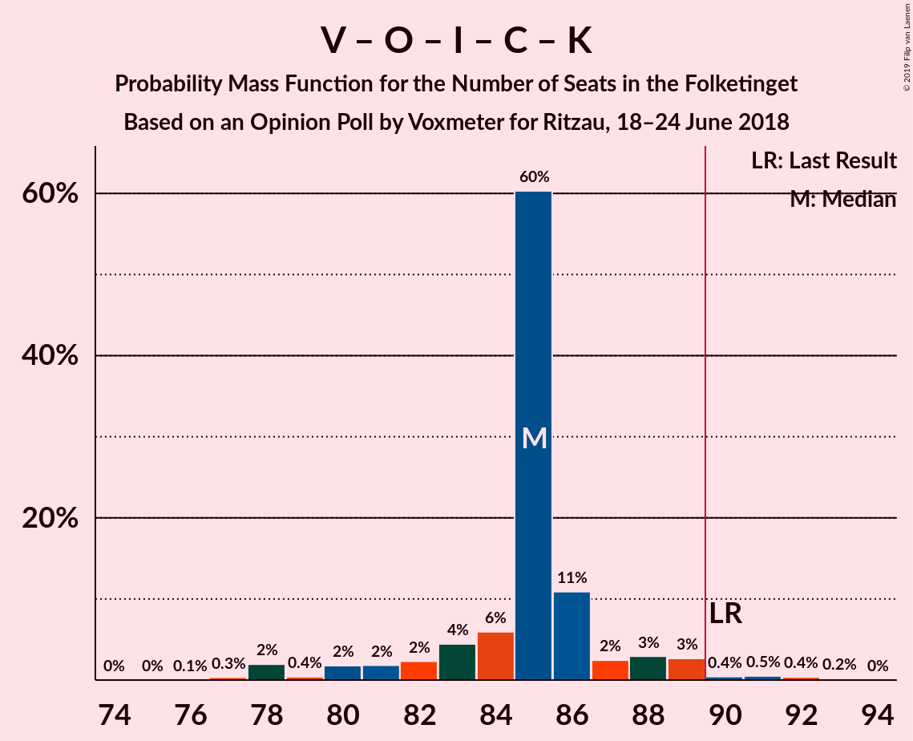

| Number of Seats | Probability | Accumulated | Special Marks |
|:---------------:|:-----------:|:-----------:|:-------------:|
| 76 | 0.1% | 100% |  |
| 77 | 0.3% | 99.9% |  |
| 78 | 2% | 99.6% |  |
| 79 | 0.4% | 98% |  |
| 80 | 2% | 97% |  |
| 81 | 2% | 95% |  |
| 82 | 2% | 94% |  |
| 83 | 4% | 91% |  |
| 84 | 6% | 87% |  |
| 85 | 60% | 81% | Median |
| 86 | 11% | 21% |  |
| 87 | 2% | 10% |  |
| 88 | 3% | 7% |  |
| 89 | 3% | 4% |  |
| 90 | 0.4% | 2% | Last Result, Majority |
| 91 | 0.5% | 1.1% |  |
| 92 | 0.4% | 0.6% |  |
| 93 | 0.2% | 0.2% |  |
| 94 | 0% | 0% |  |

### Venstre – Dansk Folkeparti – Liberal Alliance – Det Konservative Folkeparti

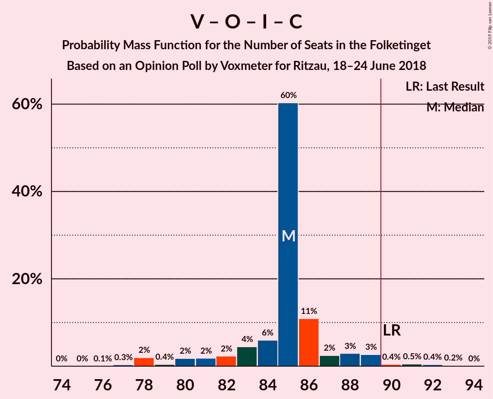

| Number of Seats | Probability | Accumulated | Special Marks |
|:---------------:|:-----------:|:-----------:|:-------------:|
| 76 | 0.1% | 100% |  |
| 77 | 0.3% | 99.9% |  |
| 78 | 2% | 99.6% |  |
| 79 | 0.4% | 98% |  |
| 80 | 2% | 97% |  |
| 81 | 2% | 95% |  |
| 82 | 2% | 94% |  |
| 83 | 4% | 91% |  |
| 84 | 6% | 87% |  |
| 85 | 60% | 81% | Median |
| 86 | 11% | 21% |  |
| 87 | 2% | 10% |  |
| 88 | 3% | 7% |  |
| 89 | 3% | 4% |  |
| 90 | 0.4% | 2% | Last Result, Majority |
| 91 | 0.5% | 1.1% |  |
| 92 | 0.4% | 0.6% |  |
| 93 | 0.2% | 0.2% |  |
| 94 | 0% | 0% |  |

### Socialdemokraterne – Enhedslisten–De Rød-Grønne – Radikale Venstre – Socialistisk Folkeparti

| Number of Seats | Probability | Accumulated | Special Marks |
|:---------------:|:-----------:|:-----------:|:-------------:|
| 74 | 0.1% | 100% |  |
| 75 | 0.2% | 99.9% |  |
| 76 | 0.4% | 99.7% | Last Result |
| 77 | 0.7% | 99.2% |  |
| 78 | 2% | 98.5% |  |
| 79 | 3% | 96% |  |
| 80 | 6% | 94% |  |
| 81 | 3% | 87% |  |
| 82 | 4% | 84% |  |
| 83 | 9% | 79% |  |
| 84 | 58% | 70% | Median |
| 85 | 2% | 12% |  |
| 86 | 5% | 9% |  |
| 87 | 2% | 4% |  |
| 88 | 0.8% | 2% |  |
| 89 | 1.1% | 2% |  |
| 90 | 0.3% | 0.5% | Majority |
| 91 | 0.1% | 0.2% |  |
| 92 | 0.1% | 0.1% |  |
| 93 | 0% | 0% |  |

### Socialdemokraterne – Enhedslisten–De Rød-Grønne – Socialistisk Folkeparti – Alternativet

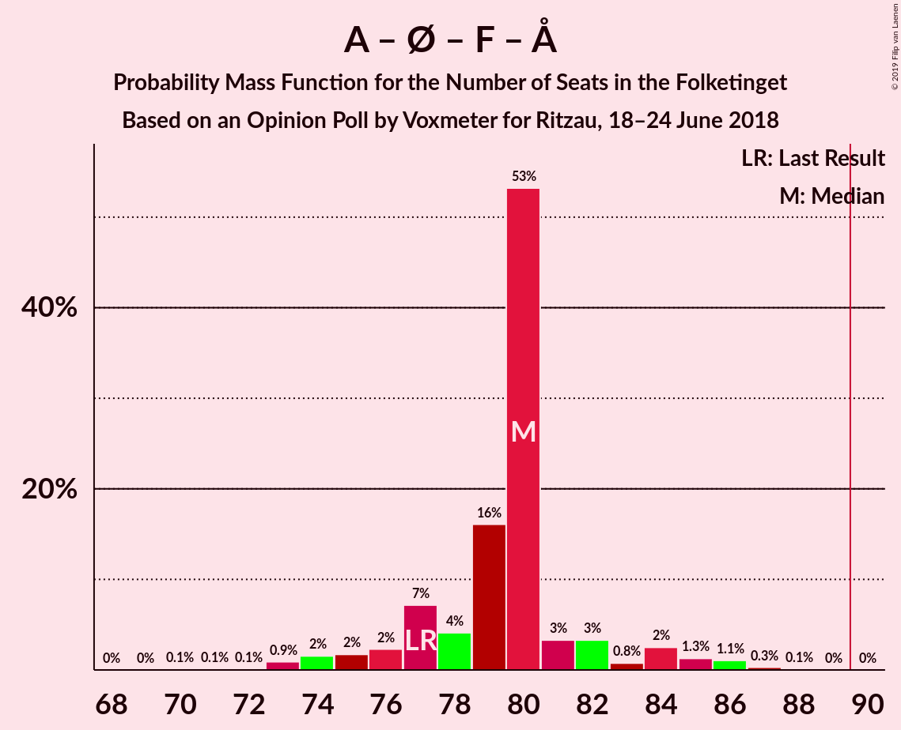

| Number of Seats | Probability | Accumulated | Special Marks |
|:---------------:|:-----------:|:-----------:|:-------------:|
| 70 | 0.1% | 100% |  |
| 71 | 0.1% | 99.9% |  |
| 72 | 0.1% | 99.8% |  |
| 73 | 0.9% | 99.7% |  |
| 74 | 2% | 98.8% |  |
| 75 | 2% | 97% |  |
| 76 | 2% | 96% |  |
| 77 | 7% | 93% | Last Result |
| 78 | 4% | 86% |  |
| 79 | 16% | 82% |  |
| 80 | 53% | 66% | Median |
| 81 | 3% | 13% |  |
| 82 | 3% | 9% |  |
| 83 | 0.8% | 6% |  |
| 84 | 2% | 5% |  |
| 85 | 1.3% | 3% |  |
| 86 | 1.1% | 2% |  |
| 87 | 0.3% | 0.4% |  |
| 88 | 0.1% | 0.1% |  |
| 89 | 0% | 0% |  |

### Socialdemokraterne – Enhedslisten–De Rød-Grønne – Socialistisk Folkeparti

| Number of Seats | Probability | Accumulated | Special Marks |
|:---------------:|:-----------:|:-----------:|:-------------:|
| 64 | 0.2% | 100% |  |
| 65 | 0.1% | 99.8% |  |
| 66 | 1.2% | 99.7% |  |
| 67 | 2% | 98% |  |
| 68 | 1.4% | 96% | Last Result |
| 69 | 4% | 95% |  |
| 70 | 7% | 91% |  |
| 71 | 4% | 84% |  |
| 72 | 3% | 80% |  |
| 73 | 14% | 77% |  |
| 74 | 54% | 63% | Median |
| 75 | 2% | 8% |  |
| 76 | 3% | 6% |  |
| 77 | 0.7% | 3% |  |
| 78 | 2% | 3% |  |
| 79 | 0.6% | 0.7% |  |
| 80 | 0% | 0.2% |  |
| 81 | 0.1% | 0.1% |  |
| 82 | 0.1% | 0.1% |  |
| 83 | 0% | 0% |  |

### Socialdemokraterne – Radikale Venstre – Socialistisk Folkeparti

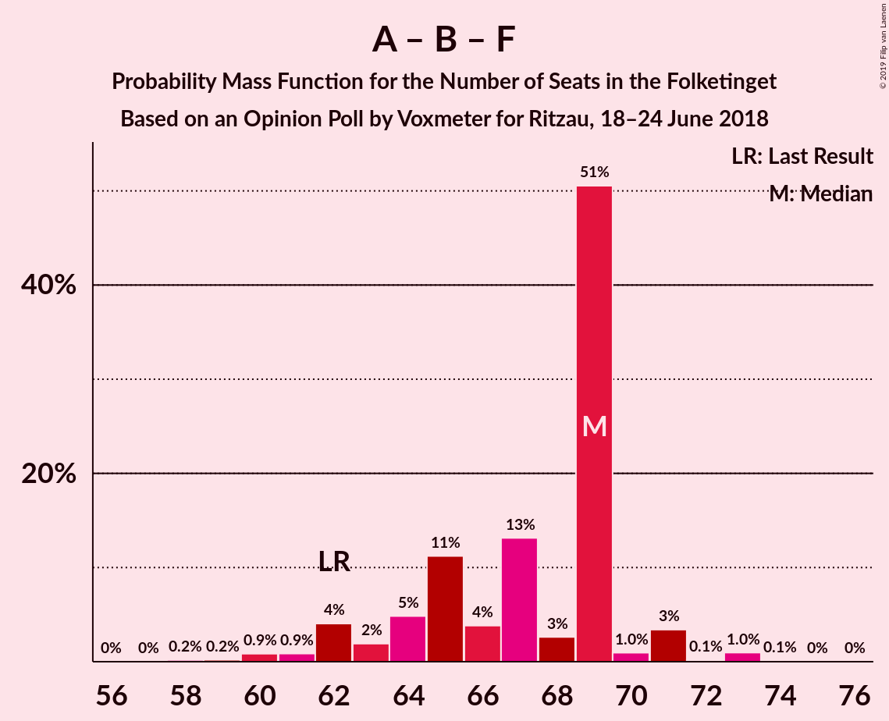

| Number of Seats | Probability | Accumulated | Special Marks |
|:---------------:|:-----------:|:-----------:|:-------------:|
| 58 | 0.2% | 100% |  |
| 59 | 0.2% | 99.8% |  |
| 60 | 0.9% | 99.6% |  |
| 61 | 0.9% | 98.7% |  |
| 62 | 4% | 98% | Last Result |
| 63 | 2% | 94% |  |
| 64 | 5% | 92% |  |
| 65 | 11% | 87% |  |
| 66 | 4% | 76% |  |
| 67 | 13% | 72% |  |
| 68 | 3% | 59% |  |
| 69 | 51% | 56% | Median |
| 70 | 1.0% | 6% |  |
| 71 | 3% | 5% |  |
| 72 | 0.1% | 1.3% |  |
| 73 | 1.0% | 1.1% |  |
| 74 | 0.1% | 0.2% |  |
| 75 | 0% | 0% |  |

### Socialdemokraterne – Radikale Venstre

| Number of Seats | Probability | Accumulated | Special Marks |
|:---------------:|:-----------:|:-----------:|:-------------:|
| 49 | 0.3% | 100% |  |
| 50 | 0.1% | 99.7% |  |
| 51 | 0.5% | 99.6% |  |
| 52 | 1.0% | 99.0% |  |
| 53 | 4% | 98% |  |
| 54 | 3% | 94% |  |
| 55 | 9% | 91% | Last Result |
| 56 | 6% | 82% |  |
| 57 | 3% | 76% |  |
| 58 | 16% | 73% |  |
| 59 | 46% | 57% | Median |
| 60 | 2% | 10% |  |
| 61 | 4% | 8% |  |
| 62 | 3% | 5% |  |
| 63 | 0.9% | 2% |  |
| 64 | 0.5% | 0.8% |  |
| 65 | 0.3% | 0.3% |  |
| 66 | 0% | 0.1% |  |
| 67 | 0% | 0% |  |

### Venstre – Liberal Alliance – Det Konservative Folkeparti

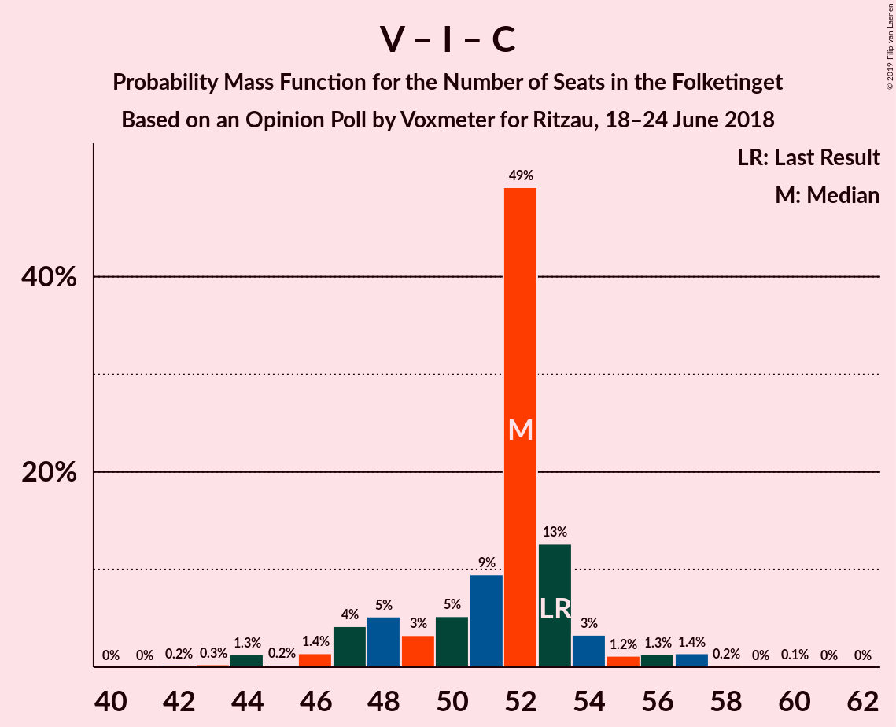

| Number of Seats | Probability | Accumulated | Special Marks |
|:---------------:|:-----------:|:-----------:|:-------------:|
| 42 | 0.2% | 100% |  |
| 43 | 0.3% | 99.8% |  |
| 44 | 1.3% | 99.5% |  |
| 45 | 0.2% | 98% |  |
| 46 | 1.4% | 98% |  |
| 47 | 4% | 97% |  |
| 48 | 5% | 92% |  |
| 49 | 3% | 87% |  |
| 50 | 5% | 84% |  |
| 51 | 9% | 79% |  |
| 52 | 49% | 69% | Median |
| 53 | 13% | 20% | Last Result |
| 54 | 3% | 7% |  |
| 55 | 1.2% | 4% |  |
| 56 | 1.3% | 3% |  |
| 57 | 1.4% | 2% |  |
| 58 | 0.2% | 0.3% |  |
| 59 | 0% | 0.1% |  |
| 60 | 0.1% | 0.1% |  |
| 61 | 0% | 0% |  |

### Venstre – Det Konservative Folkeparti

| Number of Seats | Probability | Accumulated | Special Marks |
|:---------------:|:-----------:|:-----------:|:-------------:|
| 35 | 0.5% | 100% |  |
| 36 | 0.2% | 99.5% |  |
| 37 | 2% | 99.3% |  |
| 38 | 2% | 97% |  |
| 39 | 4% | 95% |  |
| 40 | 2% | 91% | Last Result |
| 41 | 6% | 89% |  |
| 42 | 51% | 84% | Median |
| 43 | 5% | 33% |  |
| 44 | 4% | 28% |  |
| 45 | 21% | 24% |  |
| 46 | 1.0% | 3% |  |
| 47 | 0.3% | 2% |  |
| 48 | 2% | 2% |  |
| 49 | 0.1% | 0.3% |  |
| 50 | 0.1% | 0.2% |  |
| 51 | 0.1% | 0.1% |  |
| 52 | 0% | 0% |  |

### Venstre

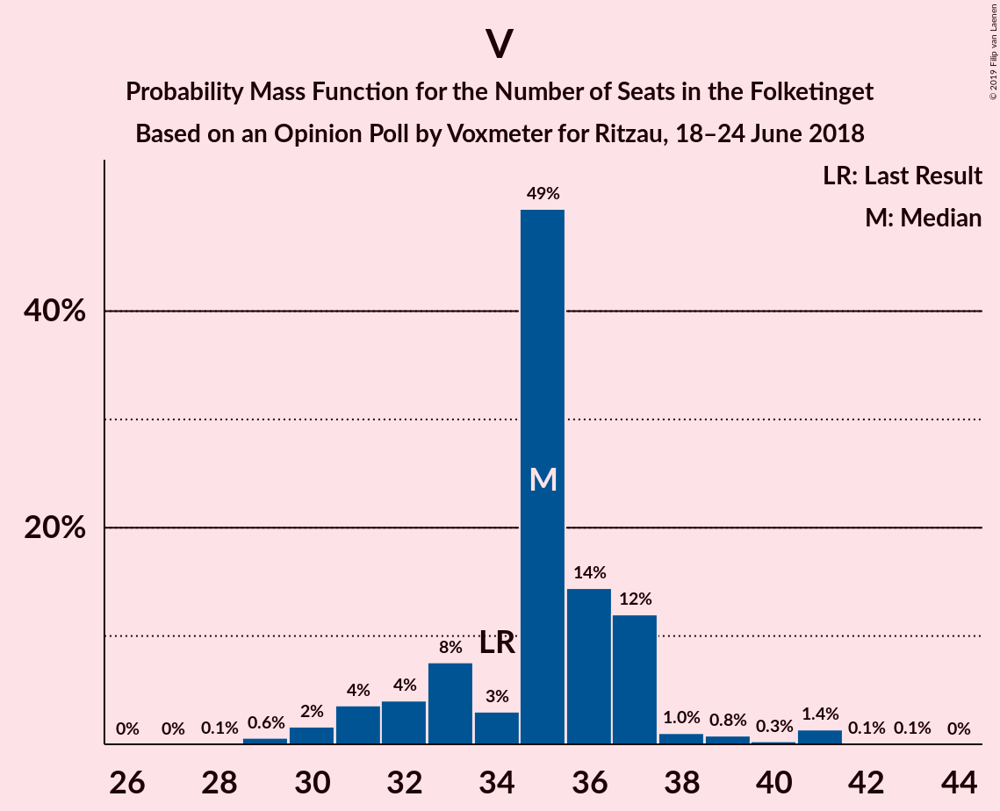

| Number of Seats | Probability | Accumulated | Special Marks |
|:---------------:|:-----------:|:-----------:|:-------------:|
| 28 | 0.1% | 100% |  |
| 29 | 0.6% | 99.9% |  |
| 30 | 2% | 99.3% |  |
| 31 | 4% | 98% |  |
| 32 | 4% | 94% |  |
| 33 | 8% | 90% |  |
| 34 | 3% | 82% | Last Result |
| 35 | 49% | 79% | Median |
| 36 | 14% | 30% |  |
| 37 | 12% | 16% |  |
| 38 | 1.0% | 4% |  |
| 39 | 0.8% | 3% |  |
| 40 | 0.3% | 2% |  |
| 41 | 1.4% | 2% |  |
| 42 | 0.1% | 0.2% |  |
| 43 | 0.1% | 0.1% |  |
| 44 | 0% | 0% |  |

## Technical Information

### Opinion Poll

+ **Polling firm:** Voxmeter
+ **Commissioner(s):** Ritzau
+ **Fieldwork period:** 18–24 June 2018

### Calculations

+ **Sample size:** 1032
+ **Simulations done:** 1,048,576
+ **Error estimate:** 1.20%

