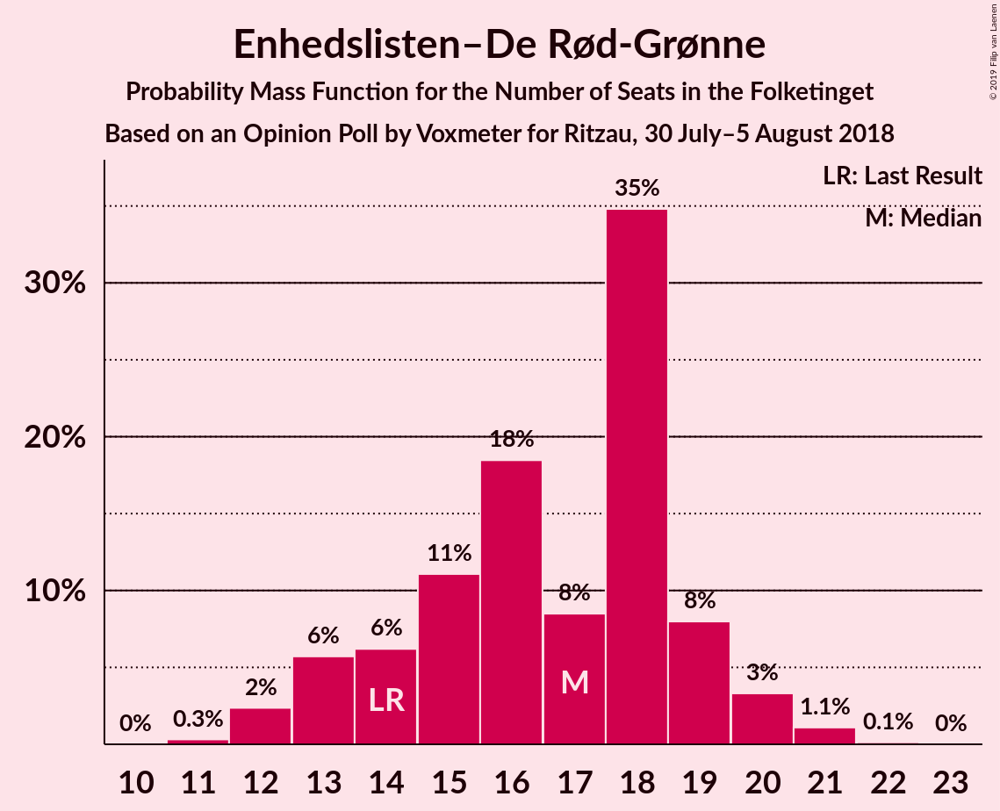
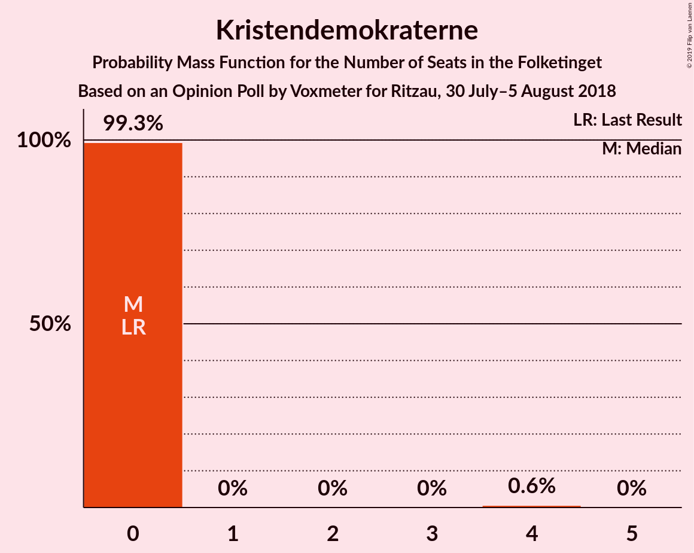
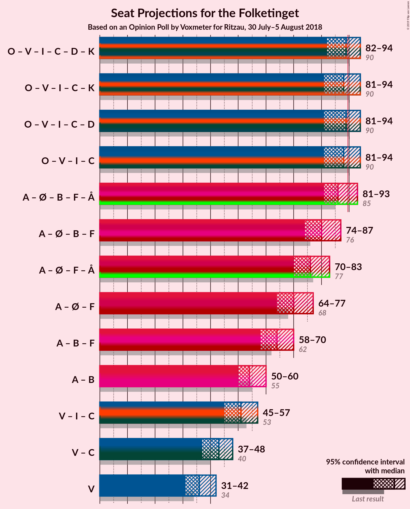

# Opinion Poll by Voxmeter for Ritzau, 30 July–5 August 2018

<a href="#voting-intentions">Voting Intentions</a> | <a href="#seats">Seats</a> | <a href="#coalitions">Coalitions</a> | <a href="#technical-information">Technical Information</a>

## Voting Intentions

### Confidence Intervals

| Party | Last Result | Poll Result | 80% Confidence Interval | 90% Confidence Interval | 95% Confidence Interval | 99% Confidence Interval |
|:-----:|:-----------:|:-----------:|:-----------------------:|:-----------------------:|:-----------------------:|:-----------------------:|
| Socialdemokraterne | 26.3% | 25.2% | 23.5–27.0% |23.1–27.5% |22.6–28.0% |21.9–28.9% |
| Dansk Folkeparti | 21.1% | 20.7% | 19.2–22.4% |18.7–22.9% |18.4–23.3% |17.6–24.2% |
| Venstre | 19.5% | 19.9% | 18.4–21.6% |18.0–22.1% |17.6–22.5% |16.9–23.3% |
| Enhedslisten–De Rød-Grønne | 7.8% | 9.1% | 8.0–10.3% |7.7–10.7% |7.5–11.0% |7.0–11.6% |
| Radikale Venstre | 4.6% | 6.0% | 5.1–7.0% |4.9–7.3% |4.7–7.6% |4.3–8.1% |
| Socialistisk Folkeparti | 4.2% | 5.1% | 4.3–6.1% |4.1–6.4% |3.9–6.6% |3.6–7.1% |
| Liberal Alliance | 7.5% | 4.8% | 4.0–5.8% |3.8–6.0% |3.6–6.3% |3.3–6.8% |
| Alternativet | 4.8% | 3.6% | 3.0–4.5% |2.8–4.7% |2.6–5.0% |2.3–5.4% |
| Det Konservative Folkeparti | 3.4% | 3.4% | 2.8–4.3% |2.6–4.5% |2.5–4.7% |2.2–5.2% |
| Nye Borgerlige | 0.0% | 1.0% | 0.7–1.5% |0.6–1.7% |0.5–1.8% |0.4–2.1% |
| Kristendemokraterne | 0.8% | 0.9% | 0.6–1.4% |0.5–1.5% |0.5–1.7% |0.4–2.0% |

*Note:* The poll result column reflects the actual value used in the calculations. Published results may vary slightly, and in addition be rounded to fewer digits.

## Seats

### Confidence Intervals

| Party | Last Result | Median | 80% Confidence Interval | 90% Confidence Interval | 95% Confidence Interval | 99% Confidence Interval |
|:-----:|:-----------:|:------:|:-----------------------:|:-----------------------:|:-----------------------:|:-----------------------:|
| <a href="#socialdemokraterne">Socialdemokraterne</a> | 47 | 44 | 42–48 |41–49 |40–51 |39–53 |
| <a href="#dansk-folkeparti">Dansk Folkeparti</a> | 37 | 37 | 34–39 |33–40 |33–41 |31–43 |
| <a href="#venstre">Venstre</a> | 34 | 36 | 33–39 |32–41 |31–42 |29–43 |
| <a href="#enhedslisten–de-rød-grønne">Enhedslisten–De Rød-Grønne</a> | 14 | 17 | 14–19 |13–19 |12–20 |12–21 |
| <a href="#radikale-venstre">Radikale Venstre</a> | 8 | 10 | 9–12 |9–12 |8–13 |7–14 |
| <a href="#socialistisk-folkeparti">Socialistisk Folkeparti</a> | 7 | 10 | 8–11 |7–12 |7–12 |6–13 |
| <a href="#liberal-alliance">Liberal Alliance</a> | 13 | 9 | 7–11 |7–11 |7–12 |6–13 |
| <a href="#alternativet">Alternativet</a> | 9 | 6 | 5–8 |5–8 |4–9 |4–10 |
| <a href="#det-konservative-folkeparti">Det Konservative Folkeparti</a> | 6 | 6 | 5–8 |4–9 |4–9 |0–9 |
| <a href="#nye-borgerlige">Nye Borgerlige</a> | 0 | 0 | 0 |0 |0 |0–4 |
| <a href="#kristendemokraterne">Kristendemokraterne</a> | 0 | 0 | 0 |0 |0 |0–4 |

### Socialdemokraterne

*For a full overview of the results for this party, see the [Socialdemokraterne](party-socialdemokraterne.html) page.*

| Number of Seats | Probability | Accumulated | Special Marks |
|:---------------:|:-----------:|:-----------:|:-------------:|
| 37 | 0.2% | 100% |  |
| 38 | 0.2% | 99.8% |  |
| 39 | 0.5% | 99.6% |  |
| 40 | 4% | 99.0% |  |
| 41 | 5% | 95% |  |
| 42 | 25% | 90% |  |
| 43 | 8% | 65% |  |
| 44 | 8% | 57% | Median |
| 45 | 21% | 49% |  |
| 46 | 13% | 28% |  |
| 47 | 4% | 15% | Last Result |
| 48 | 3% | 11% |  |
| 49 | 3% | 8% |  |
| 50 | 2% | 5% |  |
| 51 | 2% | 3% |  |
| 52 | 0.3% | 1.0% |  |
| 53 | 0.5% | 0.6% |  |
| 54 | 0.1% | 0.1% |  |
| 55 | 0% | 0% |  |

### Dansk Folkeparti

*For a full overview of the results for this party, see the [Dansk Folkeparti](party-danskfolkeparti.html) page.*

| Number of Seats | Probability | Accumulated | Special Marks |
|:---------------:|:-----------:|:-----------:|:-------------:|
| 30 | 0.4% | 100% |  |
| 31 | 0.6% | 99.6% |  |
| 32 | 1.3% | 99.0% |  |
| 33 | 6% | 98% |  |
| 34 | 15% | 92% |  |
| 35 | 8% | 77% |  |
| 36 | 16% | 69% |  |
| 37 | 8% | 53% | Last Result, Median |
| 38 | 29% | 45% |  |
| 39 | 6% | 16% |  |
| 40 | 6% | 9% |  |
| 41 | 2% | 4% |  |
| 42 | 1.2% | 2% |  |
| 43 | 0.5% | 0.8% |  |
| 44 | 0.1% | 0.4% |  |
| 45 | 0.3% | 0.3% |  |
| 46 | 0% | 0% |  |

### Venstre

*For a full overview of the results for this party, see the [Venstre](party-venstre.html) page.*

| Number of Seats | Probability | Accumulated | Special Marks |
|:---------------:|:-----------:|:-----------:|:-------------:|
| 29 | 0.5% | 100% |  |
| 30 | 0.8% | 99.4% |  |
| 31 | 2% | 98.6% |  |
| 32 | 5% | 96% |  |
| 33 | 5% | 92% |  |
| 34 | 10% | 86% | Last Result |
| 35 | 15% | 77% |  |
| 36 | 33% | 62% | Median |
| 37 | 10% | 28% |  |
| 38 | 5% | 18% |  |
| 39 | 4% | 13% |  |
| 40 | 2% | 9% |  |
| 41 | 3% | 7% |  |
| 42 | 3% | 4% |  |
| 43 | 0.3% | 0.6% |  |
| 44 | 0.3% | 0.3% |  |
| 45 | 0% | 0% |  |

### Enhedslisten–De Rød-Grønne

*For a full overview of the results for this party, see the [Enhedslisten–De Rød-Grønne](party-enhedslisten–derød-grønne.html) page.*

| Number of Seats | Probability | Accumulated | Special Marks |
|:---------------:|:-----------:|:-----------:|:-------------:|
| 11 | 0.3% | 100% |  |
| 12 | 2% | 99.7% |  |
| 13 | 6% | 97% |  |
| 14 | 6% | 92% | Last Result |
| 15 | 11% | 85% |  |
| 16 | 18% | 74% |  |
| 17 | 8% | 56% | Median |
| 18 | 35% | 47% |  |
| 19 | 8% | 13% |  |
| 20 | 3% | 5% |  |
| 21 | 1.1% | 1.2% |  |
| 22 | 0.1% | 0.1% |  |
| 23 | 0% | 0% |  |

### Radikale Venstre

*For a full overview of the results for this party, see the [Radikale Venstre](party-radikalevenstre.html) page.*

| Number of Seats | Probability | Accumulated | Special Marks |
|:---------------:|:-----------:|:-----------:|:-------------:|
| 7 | 1.1% | 100% |  |
| 8 | 3% | 98.8% | Last Result |
| 9 | 21% | 95% |  |
| 10 | 38% | 74% | Median |
| 11 | 16% | 36% |  |
| 12 | 16% | 21% |  |
| 13 | 2% | 5% |  |
| 14 | 2% | 2% |  |
| 15 | 0.4% | 0.5% |  |
| 16 | 0.1% | 0.1% |  |
| 17 | 0% | 0% |  |

### Socialistisk Folkeparti

*For a full overview of the results for this party, see the [Socialistisk Folkeparti](party-socialistiskfolkeparti.html) page.*

| Number of Seats | Probability | Accumulated | Special Marks |
|:---------------:|:-----------:|:-----------:|:-------------:|
| 5 | 0.1% | 100% |  |
| 6 | 0.9% | 99.9% |  |
| 7 | 8% | 99.0% | Last Result |
| 8 | 14% | 91% |  |
| 9 | 25% | 77% |  |
| 10 | 37% | 52% | Median |
| 11 | 10% | 15% |  |
| 12 | 5% | 6% |  |
| 13 | 0.5% | 0.6% |  |
| 14 | 0.1% | 0.1% |  |
| 15 | 0% | 0% |  |

### Liberal Alliance

*For a full overview of the results for this party, see the [Liberal Alliance](party-liberalalliance.html) page.*

| Number of Seats | Probability | Accumulated | Special Marks |
|:---------------:|:-----------:|:-----------:|:-------------:|
| 5 | 0.1% | 100% |  |
| 6 | 2% | 99.9% |  |
| 7 | 12% | 98% |  |
| 8 | 35% | 87% |  |
| 9 | 24% | 51% | Median |
| 10 | 12% | 28% |  |
| 11 | 12% | 15% |  |
| 12 | 3% | 4% |  |
| 13 | 0.6% | 0.7% | Last Result |
| 14 | 0.1% | 0.1% |  |
| 15 | 0% | 0% |  |

### Alternativet

*For a full overview of the results for this party, see the [Alternativet](party-alternativet.html) page.*

| Number of Seats | Probability | Accumulated | Special Marks |
|:---------------:|:-----------:|:-----------:|:-------------:|
| 4 | 4% | 100% |  |
| 5 | 10% | 96% |  |
| 6 | 46% | 86% | Median |
| 7 | 20% | 40% |  |
| 8 | 15% | 20% |  |
| 9 | 4% | 5% | Last Result |
| 10 | 1.2% | 1.3% |  |
| 11 | 0.1% | 0.1% |  |
| 12 | 0% | 0% |  |

### Det Konservative Folkeparti

*For a full overview of the results for this party, see the [Det Konservative Folkeparti](party-detkonservativefolkeparti.html) page.*

| Number of Seats | Probability | Accumulated | Special Marks |
|:---------------:|:-----------:|:-----------:|:-------------:|
| 0 | 0.6% | 100% |  |
| 1 | 0% | 99.4% |  |
| 2 | 0% | 99.4% |  |
| 3 | 0% | 99.4% |  |
| 4 | 8% | 99.4% |  |
| 5 | 16% | 91% |  |
| 6 | 27% | 75% | Last Result, Median |
| 7 | 30% | 48% |  |
| 8 | 12% | 18% |  |
| 9 | 6% | 6% |  |
| 10 | 0.4% | 0.5% |  |
| 11 | 0.1% | 0.1% |  |
| 12 | 0% | 0% |  |

### Nye Borgerlige

*For a full overview of the results for this party, see the [Nye Borgerlige](party-nyeborgerlige.html) page.*

| Number of Seats | Probability | Accumulated | Special Marks |
|:---------------:|:-----------:|:-----------:|:-------------:|
| 0 | 99.2% | 100% | Last Result, Median |
| 1 | 0% | 0.8% |  |
| 2 | 0% | 0.8% |  |
| 3 | 0% | 0.8% |  |
| 4 | 0.8% | 0.8% |  |
| 5 | 0.1% | 0.1% |  |
| 6 | 0% | 0% |  |

### Kristendemokraterne

*For a full overview of the results for this party, see the [Kristendemokraterne](party-kristendemokraterne.html) page.*

| Number of Seats | Probability | Accumulated | Special Marks |
|:---------------:|:-----------:|:-----------:|:-------------:|
| 0 | 99.3% | 100% | Last Result, Median |
| 1 | 0% | 0.7% |  |
| 2 | 0% | 0.7% |  |
| 3 | 0% | 0.7% |  |
| 4 | 0.6% | 0.7% |  |
| 5 | 0% | 0% |  |

## Coalitions

### Confidence Intervals

| Coalition | Last Result | Median | Majority? | 80% Confidence Interval | 90% Confidence Interval | 95% Confidence Interval | 99% Confidence Interval |
|:---------:|:-----------:|:------:|:---------:|:-----------------------:|:-----------------------:|:-----------------------:|:-----------------------:|
| Dansk Folkeparti – Venstre – Liberal Alliance – Det Konservative Folkeparti – Nye Borgerlige – Kristendemokraterne | 90 | 89 | 24% | 83–92 | 82–93 | 82–94 | 80–96 |
| Dansk Folkeparti – Venstre – Liberal Alliance – Det Konservative Folkeparti – Kristendemokraterne | 90 | 88 | 24% | 83–92 | 82–93 | 81–94 | 80–96 |
| Dansk Folkeparti – Venstre – Liberal Alliance – Det Konservative Folkeparti – Nye Borgerlige | 90 | 89 | 24% | 83–92 | 82–93 | 81–94 | 80–96 |
| Dansk Folkeparti – Venstre – Liberal Alliance – Det Konservative Folkeparti | 90 | 88 | 23% | 83–92 | 82–93 | 81–94 | 80–95 |
| Socialdemokraterne – Enhedslisten–De Rød-Grønne – Radikale Venstre – Socialistisk Folkeparti – Alternativet | 85 | 86 | 22% | 83–92 | 82–93 | 81–93 | 79–95 |
| Socialdemokraterne – Enhedslisten–De Rød-Grønne – Radikale Venstre – Socialistisk Folkeparti | 76 | 80 | 0.1% | 76–85 | 75–86 | 74–87 | 73–89 |
| Socialdemokraterne – Enhedslisten–De Rød-Grønne – Socialistisk Folkeparti – Alternativet | 77 | 76 | 0% | 72–81 | 71–83 | 70–83 | 70–86 |
| Socialdemokraterne – Enhedslisten–De Rød-Grønne – Socialistisk Folkeparti | 68 | 70 | 0% | 66–75 | 65–76 | 64–77 | 64–80 |
| Socialdemokraterne – Radikale Venstre – Socialistisk Folkeparti | 62 | 64 | 0% | 60–68 | 59–69 | 58–70 | 57–72 |
| Socialdemokraterne – Radikale Venstre | 55 | 54 | 0% | 52–58 | 51–60 | 50–60 | 49–62 |
| Venstre – Liberal Alliance – Det Konservative Folkeparti | 53 | 51 | 0% | 47–55 | 46–56 | 45–57 | 44–59 |
| Venstre – Det Konservative Folkeparti | 40 | 43 | 0% | 38–46 | 38–47 | 37–48 | 36–49 |
| Venstre | 34 | 36 | 0% | 33–39 | 32–41 | 31–42 | 29–43 |

### Dansk Folkeparti – Venstre – Liberal Alliance – Det Konservative Folkeparti – Nye Borgerlige – Kristendemokraterne

| Number of Seats | Probability | Accumulated | Special Marks |
|:---------------:|:-----------:|:-----------:|:-------------:|
| 78 | 0.1% | 100% |  |
| 79 | 0.2% | 99.9% |  |
| 80 | 2% | 99.7% |  |
| 81 | 0.4% | 98% |  |
| 82 | 4% | 98% |  |
| 83 | 4% | 93% |  |
| 84 | 4% | 89% |  |
| 85 | 7% | 85% |  |
| 86 | 10% | 78% |  |
| 87 | 8% | 68% |  |
| 88 | 11% | 61% | Median |
| 89 | 26% | 50% |  |
| 90 | 10% | 24% | Last Result, Majority |
| 91 | 3% | 14% |  |
| 92 | 2% | 11% |  |
| 93 | 4% | 9% |  |
| 94 | 2% | 4% |  |
| 95 | 1.3% | 2% |  |
| 96 | 0.5% | 0.6% |  |
| 97 | 0.1% | 0.1% |  |
| 98 | 0% | 0% |  |

### Dansk Folkeparti – Venstre – Liberal Alliance – Det Konservative Folkeparti – Kristendemokraterne

| Number of Seats | Probability | Accumulated | Special Marks |
|:---------------:|:-----------:|:-----------:|:-------------:|
| 78 | 0.1% | 100% |  |
| 79 | 0.2% | 99.9% |  |
| 80 | 2% | 99.7% |  |
| 81 | 0.5% | 98% |  |
| 82 | 4% | 97% |  |
| 83 | 4% | 93% |  |
| 84 | 4% | 89% |  |
| 85 | 7% | 85% |  |
| 86 | 10% | 78% |  |
| 87 | 7% | 68% |  |
| 88 | 11% | 60% | Median |
| 89 | 26% | 50% |  |
| 90 | 10% | 24% | Last Result, Majority |
| 91 | 3% | 13% |  |
| 92 | 2% | 10% |  |
| 93 | 4% | 9% |  |
| 94 | 2% | 4% |  |
| 95 | 1.2% | 2% |  |
| 96 | 0.5% | 0.6% |  |
| 97 | 0% | 0% |  |

### Dansk Folkeparti – Venstre – Liberal Alliance – Det Konservative Folkeparti – Nye Borgerlige

| Number of Seats | Probability | Accumulated | Special Marks |
|:---------------:|:-----------:|:-----------:|:-------------:|
| 78 | 0.1% | 100% |  |
| 79 | 0.2% | 99.9% |  |
| 80 | 2% | 99.7% |  |
| 81 | 0.5% | 98% |  |
| 82 | 5% | 97% |  |
| 83 | 4% | 93% |  |
| 84 | 4% | 88% |  |
| 85 | 7% | 85% |  |
| 86 | 9% | 77% |  |
| 87 | 8% | 68% |  |
| 88 | 11% | 61% | Median |
| 89 | 26% | 50% |  |
| 90 | 10% | 24% | Last Result, Majority |
| 91 | 3% | 14% |  |
| 92 | 2% | 10% |  |
| 93 | 4% | 9% |  |
| 94 | 2% | 4% |  |
| 95 | 1.2% | 2% |  |
| 96 | 0.5% | 0.5% |  |
| 97 | 0.1% | 0.1% |  |
| 98 | 0% | 0% |  |

### Dansk Folkeparti – Venstre – Liberal Alliance – Det Konservative Folkeparti

| Number of Seats | Probability | Accumulated | Special Marks |
|:---------------:|:-----------:|:-----------:|:-------------:|
| 78 | 0.1% | 100% |  |
| 79 | 0.2% | 99.9% |  |
| 80 | 2% | 99.7% |  |
| 81 | 0.5% | 98% |  |
| 82 | 5% | 97% |  |
| 83 | 5% | 93% |  |
| 84 | 4% | 88% |  |
| 85 | 7% | 84% |  |
| 86 | 9% | 77% |  |
| 87 | 8% | 68% |  |
| 88 | 11% | 60% | Median |
| 89 | 26% | 50% |  |
| 90 | 10% | 23% | Last Result, Majority |
| 91 | 3% | 13% |  |
| 92 | 2% | 10% |  |
| 93 | 4% | 8% |  |
| 94 | 2% | 4% |  |
| 95 | 1.2% | 2% |  |
| 96 | 0.5% | 0.5% |  |
| 97 | 0% | 0% |  |

### Socialdemokraterne – Enhedslisten–De Rød-Grønne – Radikale Venstre – Socialistisk Folkeparti – Alternativet

| Number of Seats | Probability | Accumulated | Special Marks |
|:---------------:|:-----------:|:-----------:|:-------------:|
| 78 | 0.1% | 100% |  |
| 79 | 0.5% | 99.9% |  |
| 80 | 1.3% | 99.4% |  |
| 81 | 2% | 98% |  |
| 82 | 4% | 96% |  |
| 83 | 2% | 91% |  |
| 84 | 3% | 89% |  |
| 85 | 10% | 86% | Last Result |
| 86 | 26% | 76% |  |
| 87 | 11% | 50% | Median |
| 88 | 8% | 39% |  |
| 89 | 10% | 32% |  |
| 90 | 7% | 22% | Majority |
| 91 | 4% | 15% |  |
| 92 | 4% | 11% |  |
| 93 | 4% | 7% |  |
| 94 | 0.4% | 2% |  |
| 95 | 2% | 2% |  |
| 96 | 0.2% | 0.3% |  |
| 97 | 0.1% | 0.1% |  |
| 98 | 0% | 0% |  |

### Socialdemokraterne – Enhedslisten–De Rød-Grønne – Radikale Venstre – Socialistisk Folkeparti

| Number of Seats | Probability | Accumulated | Special Marks |
|:---------------:|:-----------:|:-----------:|:-------------:|
| 72 | 0.2% | 100% |  |
| 73 | 0.5% | 99.8% |  |
| 74 | 3% | 99.3% |  |
| 75 | 2% | 97% |  |
| 76 | 5% | 95% | Last Result |
| 77 | 2% | 90% |  |
| 78 | 7% | 88% |  |
| 79 | 14% | 81% |  |
| 80 | 25% | 67% |  |
| 81 | 10% | 42% | Median |
| 82 | 8% | 32% |  |
| 83 | 3% | 25% |  |
| 84 | 10% | 22% |  |
| 85 | 3% | 12% |  |
| 86 | 6% | 10% |  |
| 87 | 2% | 4% |  |
| 88 | 0.6% | 2% |  |
| 89 | 2% | 2% |  |
| 90 | 0% | 0.1% | Majority |
| 91 | 0.1% | 0.1% |  |
| 92 | 0% | 0% |  |

### Socialdemokraterne – Enhedslisten–De Rød-Grønne – Socialistisk Folkeparti – Alternativet

| Number of Seats | Probability | Accumulated | Special Marks |
|:---------------:|:-----------:|:-----------:|:-------------:|
| 68 | 0.1% | 100% |  |
| 69 | 0.2% | 99.9% |  |
| 70 | 3% | 99.7% |  |
| 71 | 2% | 97% |  |
| 72 | 6% | 95% |  |
| 73 | 3% | 89% |  |
| 74 | 7% | 86% |  |
| 75 | 9% | 79% |  |
| 76 | 22% | 71% |  |
| 77 | 11% | 49% | Last Result, Median |
| 78 | 13% | 38% |  |
| 79 | 4% | 25% |  |
| 80 | 8% | 21% |  |
| 81 | 6% | 14% |  |
| 82 | 2% | 8% |  |
| 83 | 5% | 6% |  |
| 84 | 0.2% | 2% |  |
| 85 | 0.2% | 2% |  |
| 86 | 1.3% | 1.3% |  |
| 87 | 0% | 0% |  |

### Socialdemokraterne – Enhedslisten–De Rød-Grønne – Socialistisk Folkeparti

| Number of Seats | Probability | Accumulated | Special Marks |
|:---------------:|:-----------:|:-----------:|:-------------:|
| 61 | 0.1% | 100% |  |
| 62 | 0.1% | 99.9% |  |
| 63 | 0.3% | 99.8% |  |
| 64 | 3% | 99.6% |  |
| 65 | 5% | 96% |  |
| 66 | 4% | 91% |  |
| 67 | 3% | 88% |  |
| 68 | 9% | 85% | Last Result |
| 69 | 4% | 76% |  |
| 70 | 36% | 72% |  |
| 71 | 7% | 35% | Median |
| 72 | 8% | 29% |  |
| 73 | 3% | 21% |  |
| 74 | 6% | 18% |  |
| 75 | 6% | 11% |  |
| 76 | 2% | 6% |  |
| 77 | 2% | 4% |  |
| 78 | 0.5% | 2% |  |
| 79 | 0.1% | 1.3% |  |
| 80 | 1.2% | 1.2% |  |
| 81 | 0% | 0% |  |

### Socialdemokraterne – Radikale Venstre – Socialistisk Folkeparti

| Number of Seats | Probability | Accumulated | Special Marks |
|:---------------:|:-----------:|:-----------:|:-------------:|
| 55 | 0.1% | 100% |  |
| 56 | 0.1% | 99.9% |  |
| 57 | 1.1% | 99.9% |  |
| 58 | 4% | 98.8% |  |
| 59 | 0.8% | 95% |  |
| 60 | 6% | 94% |  |
| 61 | 3% | 88% |  |
| 62 | 23% | 85% | Last Result |
| 63 | 12% | 62% |  |
| 64 | 10% | 50% | Median |
| 65 | 4% | 40% |  |
| 66 | 15% | 37% |  |
| 67 | 9% | 21% |  |
| 68 | 7% | 12% |  |
| 69 | 2% | 5% |  |
| 70 | 2% | 4% |  |
| 71 | 0.7% | 2% |  |
| 72 | 0.9% | 1.4% |  |
| 73 | 0.3% | 0.5% |  |
| 74 | 0.1% | 0.2% |  |
| 75 | 0% | 0.1% |  |
| 76 | 0% | 0% |  |

### Socialdemokraterne – Radikale Venstre

| Number of Seats | Probability | Accumulated | Special Marks |
|:---------------:|:-----------:|:-----------:|:-------------:|
| 47 | 0.1% | 100% |  |
| 48 | 0.2% | 99.9% |  |
| 49 | 1.3% | 99.7% |  |
| 50 | 3% | 98% |  |
| 51 | 3% | 95% |  |
| 52 | 27% | 93% |  |
| 53 | 5% | 66% |  |
| 54 | 13% | 61% | Median |
| 55 | 11% | 48% | Last Result |
| 56 | 10% | 37% |  |
| 57 | 13% | 27% |  |
| 58 | 6% | 15% |  |
| 59 | 2% | 8% |  |
| 60 | 4% | 6% |  |
| 61 | 0.6% | 2% |  |
| 62 | 1.2% | 2% |  |
| 63 | 0.1% | 0.3% |  |
| 64 | 0.1% | 0.2% |  |
| 65 | 0.1% | 0.1% |  |
| 66 | 0% | 0% |  |

### Venstre – Liberal Alliance – Det Konservative Folkeparti

| Number of Seats | Probability | Accumulated | Special Marks |
|:---------------:|:-----------:|:-----------:|:-------------:|
| 42 | 0.1% | 100% |  |
| 43 | 0.1% | 99.8% |  |
| 44 | 1.1% | 99.7% |  |
| 45 | 1.3% | 98.6% |  |
| 46 | 4% | 97% |  |
| 47 | 6% | 93% |  |
| 48 | 4% | 87% |  |
| 49 | 4% | 82% |  |
| 50 | 12% | 78% |  |
| 51 | 27% | 67% | Median |
| 52 | 12% | 40% |  |
| 53 | 10% | 28% | Last Result |
| 54 | 8% | 18% |  |
| 55 | 3% | 10% |  |
| 56 | 4% | 8% |  |
| 57 | 2% | 4% |  |
| 58 | 1.2% | 2% |  |
| 59 | 0% | 0.5% |  |
| 60 | 0.5% | 0.5% |  |
| 61 | 0% | 0% |  |

### Venstre – Det Konservative Folkeparti

| Number of Seats | Probability | Accumulated | Special Marks |
|:---------------:|:-----------:|:-----------:|:-------------:|
| 34 | 0.1% | 100% |  |
| 35 | 0.2% | 99.9% |  |
| 36 | 0.9% | 99.6% |  |
| 37 | 2% | 98.7% |  |
| 38 | 7% | 96% |  |
| 39 | 6% | 89% |  |
| 40 | 6% | 83% | Last Result |
| 41 | 13% | 77% |  |
| 42 | 10% | 65% | Median |
| 43 | 30% | 55% |  |
| 44 | 10% | 25% |  |
| 45 | 4% | 15% |  |
| 46 | 4% | 12% |  |
| 47 | 3% | 8% |  |
| 48 | 4% | 4% |  |
| 49 | 0.4% | 0.8% |  |
| 50 | 0.3% | 0.4% |  |
| 51 | 0% | 0% |  |

### Venstre

| Number of Seats | Probability | Accumulated | Special Marks |
|:---------------:|:-----------:|:-----------:|:-------------:|
| 29 | 0.5% | 100% |  |
| 30 | 0.8% | 99.4% |  |
| 31 | 2% | 98.6% |  |
| 32 | 5% | 96% |  |
| 33 | 5% | 92% |  |
| 34 | 10% | 86% | Last Result |
| 35 | 15% | 77% |  |
| 36 | 33% | 62% | Median |
| 37 | 10% | 28% |  |
| 38 | 5% | 18% |  |
| 39 | 4% | 13% |  |
| 40 | 2% | 9% |  |
| 41 | 3% | 7% |  |
| 42 | 3% | 4% |  |
| 43 | 0.3% | 0.6% |  |
| 44 | 0.3% | 0.3% |  |
| 45 | 0% | 0% |  |

## Technical Information

### Opinion Poll

+ **Polling firm:** Voxmeter
+ **Commissioner(s):** Ritzau
+ **Fieldwork period:** 30 July–5 August 2018

### Calculations

+ **Sample size:** 1023
+ **Simulations done:** 1,048,576
+ **Error estimate:** 1.62%

