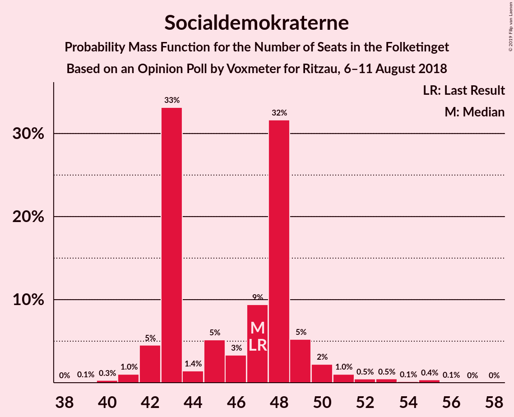
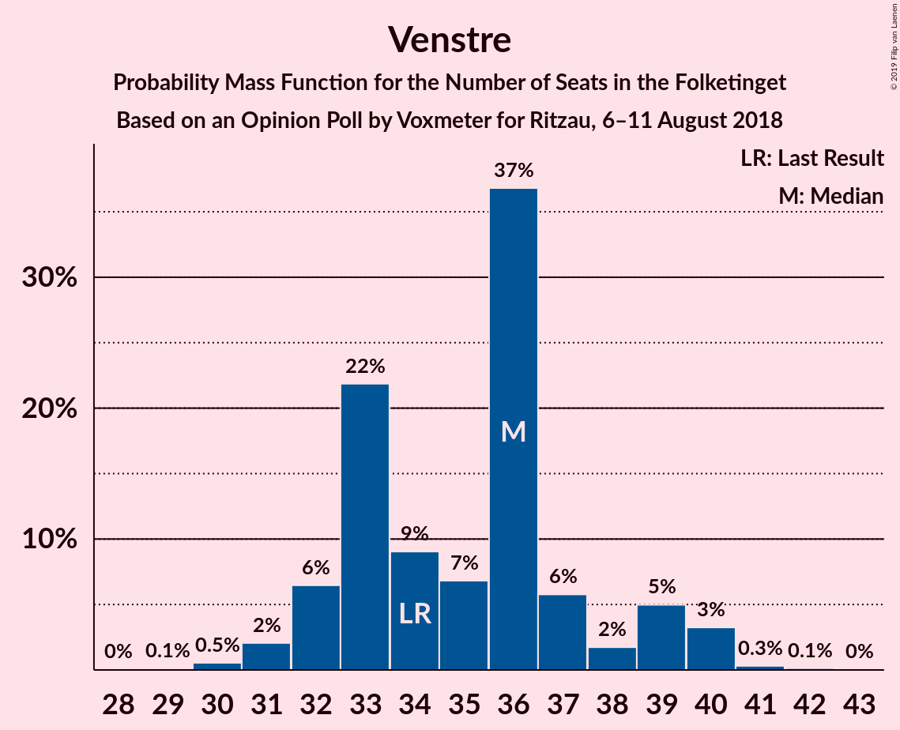
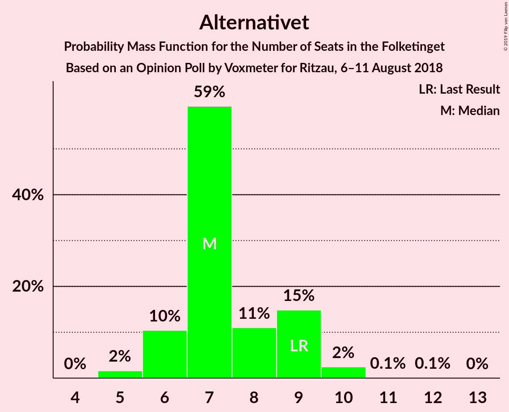
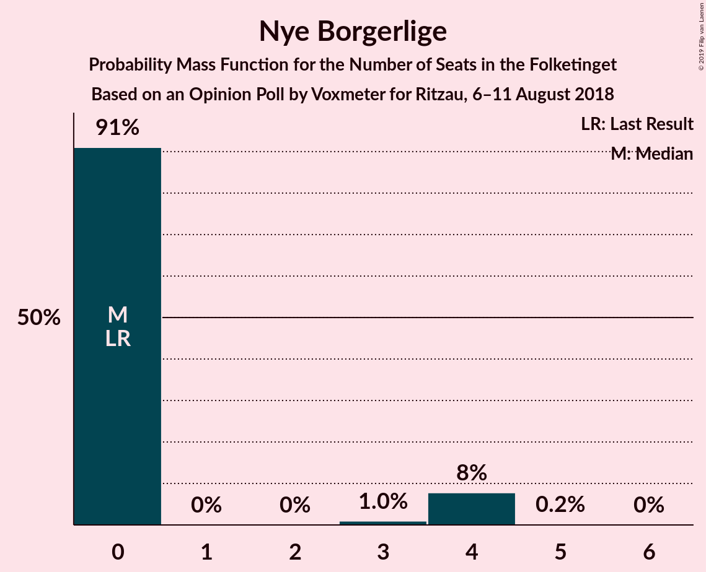
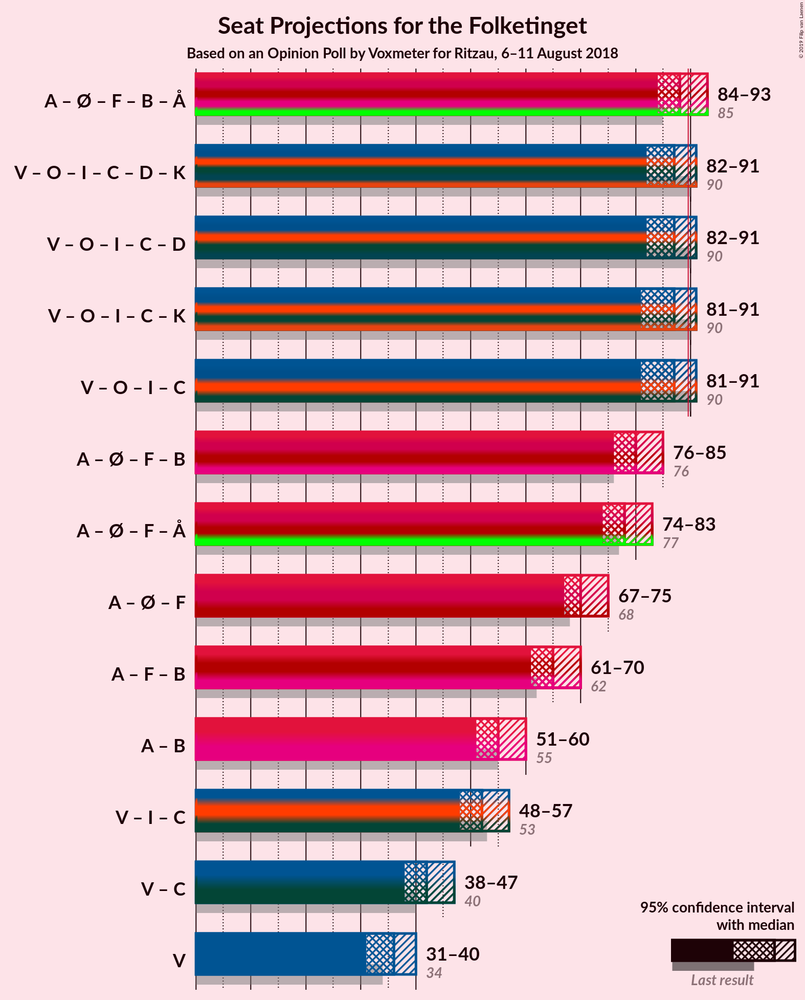

# Opinion Poll by Voxmeter for Ritzau, 6–11 August 2018

<a href="#voting-intentions">Voting Intentions</a> | <a href="#seats">Seats</a> | <a href="#coalitions">Coalitions</a> | <a href="#technical-information">Technical Information</a>

## Voting Intentions

### Confidence Intervals

| Party | Last Result | Poll Result | 80% Confidence Interval | 90% Confidence Interval | 95% Confidence Interval | 99% Confidence Interval |
|:-----:|:-----------:|:-----------:|:-----------------------:|:-----------------------:|:-----------------------:|:-----------------------:|
| Socialdemokraterne | 26.3% | 26.0% | 24.3–27.8% |23.8–28.3% |23.4–28.8% |22.6–29.6% |
| Venstre | 19.5% | 19.8% | 18.3–21.5% |17.9–22.0% |17.5–22.4% |16.8–23.2% |
| Dansk Folkeparti | 21.1% | 19.4% | 17.9–21.0% |17.4–21.5% |17.1–21.9% |16.4–22.7% |
| Enhedslisten–De Rød-Grønne | 7.8% | 8.6% | 7.5–9.8% |7.3–10.1% |7.0–10.4% |6.6–11.1% |
| Socialistisk Folkeparti | 4.2% | 5.3% | 4.5–6.3% |4.3–6.6% |4.1–6.8% |3.7–7.3% |
| Liberal Alliance | 7.5% | 5.2% | 4.4–6.2% |4.2–6.5% |4.0–6.7% |3.7–7.2% |
| Radikale Venstre | 4.6% | 5.2% | 4.4–6.2% |4.2–6.5% |4.0–6.7% |3.7–7.2% |
| Alternativet | 4.8% | 4.2% | 3.5–5.2% |3.3–5.4% |3.2–5.7% |2.9–6.1% |
| Det Konservative Folkeparti | 3.4% | 3.8% | 3.1–4.6% |2.9–4.9% |2.8–5.1% |2.5–5.5% |
| Nye Borgerlige | 0.0% | 1.4% | 1.1–2.1% |1.0–2.2% |0.9–2.4% |0.7–2.7% |
| Kristendemokraterne | 0.8% | 0.8% | 0.5–1.2% |0.4–1.4% |0.4–1.5% |0.3–1.8% |

*Note:* The poll result column reflects the actual value used in the calculations. Published results may vary slightly, and in addition be rounded to fewer digits.

## Seats

### Confidence Intervals

| Party | Last Result | Median | 80% Confidence Interval | 90% Confidence Interval | 95% Confidence Interval | 99% Confidence Interval |
|:-----:|:-----------:|:------:|:-----------------------:|:-----------------------:|:-----------------------:|:-----------------------:|
| <a href="#socialdemokraterne">Socialdemokraterne</a> | 47 | 47 | 43–48 |42–49 |42–50 |41–54 |
| <a href="#venstre">Venstre</a> | 34 | 36 | 33–38 |32–39 |31–40 |30–40 |
| <a href="#dansk-folkeparti">Dansk Folkeparti</a> | 37 | 36 | 32–37 |31–38 |31–39 |30–40 |
| <a href="#enhedslisten–de-rød-grønne">Enhedslisten–De Rød-Grønne</a> | 14 | 16 | 13–17 |13–17 |13–17 |12–19 |
| <a href="#socialistisk-folkeparti">Socialistisk Folkeparti</a> | 7 | 9 | 8–11 |8–11 |8–12 |7–12 |
| <a href="#liberal-alliance">Liberal Alliance</a> | 13 | 11 | 8–11 |8–12 |7–12 |6–12 |
| <a href="#radikale-venstre">Radikale Venstre</a> | 8 | 9 | 8–11 |8–11 |7–12 |6–13 |
| <a href="#alternativet">Alternativet</a> | 9 | 7 | 6–9 |6–9 |6–10 |5–10 |
| <a href="#det-konservative-folkeparti">Det Konservative Folkeparti</a> | 6 | 6 | 5–8 |5–8 |5–8 |4–10 |
| <a href="#nye-borgerlige">Nye Borgerlige</a> | 0 | 0 | 0 |0–4 |0–4 |0–4 |
| <a href="#kristendemokraterne">Kristendemokraterne</a> | 0 | 0 | 0 |0 |0 |0 |

### Socialdemokraterne

*For a full overview of the results for this party, see the [Socialdemokraterne](party-socialdemokraterne.html) page.*

| Number of Seats | Probability | Accumulated | Special Marks |
|:---------------:|:-----------:|:-----------:|:-------------:|
| 39 | 0.1% | 100% |  |
| 40 | 0.3% | 99.9% |  |
| 41 | 1.0% | 99.6% |  |
| 42 | 5% | 98.6% |  |
| 43 | 33% | 94% |  |
| 44 | 1.4% | 61% |  |
| 45 | 5% | 59% |  |
| 46 | 3% | 54% |  |
| 47 | 9% | 51% | Last Result, Median |
| 48 | 32% | 42% |  |
| 49 | 5% | 10% |  |
| 50 | 2% | 5% |  |
| 51 | 1.0% | 2% |  |
| 52 | 0.5% | 1.5% |  |
| 53 | 0.5% | 1.0% |  |
| 54 | 0.1% | 0.5% |  |
| 55 | 0.4% | 0.4% |  |
| 56 | 0.1% | 0.1% |  |
| 57 | 0% | 0% |  |

### Venstre

*For a full overview of the results for this party, see the [Venstre](party-venstre.html) page.*

| Number of Seats | Probability | Accumulated | Special Marks |
|:---------------:|:-----------:|:-----------:|:-------------:|
| 28 | 0% | 100% |  |
| 29 | 0.1% | 99.9% |  |
| 30 | 0.5% | 99.8% |  |
| 31 | 2% | 99.3% |  |
| 32 | 6% | 97% |  |
| 33 | 22% | 91% |  |
| 34 | 9% | 69% | Last Result |
| 35 | 7% | 60% |  |
| 36 | 37% | 53% | Median |
| 37 | 6% | 16% |  |
| 38 | 2% | 10% |  |
| 39 | 5% | 9% |  |
| 40 | 3% | 4% |  |
| 41 | 0.3% | 0.5% |  |
| 42 | 0.1% | 0.2% |  |
| 43 | 0% | 0% |  |

### Dansk Folkeparti

*For a full overview of the results for this party, see the [Dansk Folkeparti](party-danskfolkeparti.html) page.*

| Number of Seats | Probability | Accumulated | Special Marks |
|:---------------:|:-----------:|:-----------:|:-------------:|
| 28 | 0.1% | 100% |  |
| 29 | 0.2% | 99.9% |  |
| 30 | 0.7% | 99.7% |  |
| 31 | 5% | 99.0% |  |
| 32 | 9% | 94% |  |
| 33 | 10% | 85% |  |
| 34 | 4% | 75% |  |
| 35 | 7% | 71% |  |
| 36 | 23% | 64% | Median |
| 37 | 36% | 42% | Last Result |
| 38 | 3% | 5% |  |
| 39 | 0.3% | 3% |  |
| 40 | 2% | 2% |  |
| 41 | 0.3% | 0.3% |  |
| 42 | 0% | 0% |  |

### Enhedslisten–De Rød-Grønne

*For a full overview of the results for this party, see the [Enhedslisten–De Rød-Grønne](party-enhedslisten–derød-grønne.html) page.*

| Number of Seats | Probability | Accumulated | Special Marks |
|:---------------:|:-----------:|:-----------:|:-------------:|
| 11 | 0.2% | 100% |  |
| 12 | 1.1% | 99.8% |  |
| 13 | 13% | 98.6% |  |
| 14 | 9% | 86% | Last Result |
| 15 | 12% | 77% |  |
| 16 | 24% | 65% | Median |
| 17 | 39% | 41% |  |
| 18 | 1.1% | 2% |  |
| 19 | 1.0% | 1.3% |  |
| 20 | 0.2% | 0.3% |  |
| 21 | 0.1% | 0.1% |  |
| 22 | 0% | 0% |  |

### Socialistisk Folkeparti

*For a full overview of the results for this party, see the [Socialistisk Folkeparti](party-socialistiskfolkeparti.html) page.*

| Number of Seats | Probability | Accumulated | Special Marks |
|:---------------:|:-----------:|:-----------:|:-------------:|
| 6 | 0.2% | 100% |  |
| 7 | 2% | 99.8% | Last Result |
| 8 | 23% | 98% |  |
| 9 | 47% | 75% | Median |
| 10 | 12% | 28% |  |
| 11 | 13% | 16% |  |
| 12 | 2% | 3% |  |
| 13 | 0.3% | 0.4% |  |
| 14 | 0.1% | 0.1% |  |
| 15 | 0% | 0% |  |

### Liberal Alliance

*For a full overview of the results for this party, see the [Liberal Alliance](party-liberalalliance.html) page.*

| Number of Seats | Probability | Accumulated | Special Marks |
|:---------------:|:-----------:|:-----------:|:-------------:|
| 6 | 0.8% | 100% |  |
| 7 | 2% | 99.2% |  |
| 8 | 10% | 97% |  |
| 9 | 13% | 88% |  |
| 10 | 10% | 75% |  |
| 11 | 59% | 65% | Median |
| 12 | 6% | 6% |  |
| 13 | 0.2% | 0.3% | Last Result |
| 14 | 0.2% | 0.2% |  |
| 15 | 0% | 0% |  |

### Radikale Venstre

*For a full overview of the results for this party, see the [Radikale Venstre](party-radikalevenstre.html) page.*

| Number of Seats | Probability | Accumulated | Special Marks |
|:---------------:|:-----------:|:-----------:|:-------------:|
| 6 | 1.1% | 100% |  |
| 7 | 3% | 98.9% |  |
| 8 | 9% | 96% | Last Result |
| 9 | 54% | 87% | Median |
| 10 | 21% | 33% |  |
| 11 | 9% | 12% |  |
| 12 | 3% | 3% |  |
| 13 | 0.5% | 0.7% |  |
| 14 | 0.1% | 0.1% |  |
| 15 | 0% | 0% |  |

### Alternativet

*For a full overview of the results for this party, see the [Alternativet](party-alternativet.html) page.*

| Number of Seats | Probability | Accumulated | Special Marks |
|:---------------:|:-----------:|:-----------:|:-------------:|
| 5 | 2% | 100% |  |
| 6 | 10% | 98% |  |
| 7 | 59% | 88% | Median |
| 8 | 11% | 29% |  |
| 9 | 15% | 18% | Last Result |
| 10 | 2% | 3% |  |
| 11 | 0.1% | 0.3% |  |
| 12 | 0.1% | 0.1% |  |
| 13 | 0% | 0% |  |

### Det Konservative Folkeparti

*For a full overview of the results for this party, see the [Det Konservative Folkeparti](party-detkonservativefolkeparti.html) page.*

| Number of Seats | Probability | Accumulated | Special Marks |
|:---------------:|:-----------:|:-----------:|:-------------:|
| 4 | 0.6% | 100% |  |
| 5 | 9% | 99.3% |  |
| 6 | 48% | 90% | Last Result, Median |
| 7 | 29% | 42% |  |
| 8 | 11% | 13% |  |
| 9 | 1.0% | 2% |  |
| 10 | 0.7% | 0.7% |  |
| 11 | 0.1% | 0.1% |  |
| 12 | 0% | 0% |  |

### Nye Borgerlige

*For a full overview of the results for this party, see the [Nye Borgerlige](party-nyeborgerlige.html) page.*

| Number of Seats | Probability | Accumulated | Special Marks |
|:---------------:|:-----------:|:-----------:|:-------------:|
| 0 | 91% | 100% | Last Result, Median |
| 1 | 0% | 9% |  |
| 2 | 0% | 9% |  |
| 3 | 1.0% | 9% |  |
| 4 | 8% | 8% |  |
| 5 | 0.2% | 0.2% |  |
| 6 | 0% | 0% |  |

### Kristendemokraterne

*For a full overview of the results for this party, see the [Kristendemokraterne](party-kristendemokraterne.html) page.*

| Number of Seats | Probability | Accumulated | Special Marks |
|:---------------:|:-----------:|:-----------:|:-------------:|
| 0 | 99.9% | 100% | Last Result, Median |
| 1 | 0% | 0.1% |  |
| 2 | 0% | 0.1% |  |
| 3 | 0% | 0.1% |  |
| 4 | 0.1% | 0.1% |  |
| 5 | 0% | 0% |  |

## Coalitions

### Confidence Intervals

| Coalition | Last Result | Median | Majority? | 80% Confidence Interval | 90% Confidence Interval | 95% Confidence Interval | 99% Confidence Interval |
|:---------:|:-----------:|:------:|:---------:|:-----------------------:|:-----------------------:|:-----------------------:|:-----------------------:|
| Socialdemokraterne – Enhedslisten–De Rød-Grønne – Socialistisk Folkeparti – Radikale Venstre – Alternativet | 85 | 88 | 15% | 85–90 | 85–92 | 84–93 | 81–95 |
| Venstre – Dansk Folkeparti – Liberal Alliance – Det Konservative Folkeparti – Nye Borgerlige – Kristendemokraterne | 90 | 87 | 34% | 85–90 | 83–90 | 82–91 | 80–94 |
| Venstre – Dansk Folkeparti – Liberal Alliance – Det Konservative Folkeparti – Nye Borgerlige | 90 | 87 | 34% | 85–90 | 83–90 | 82–91 | 80–94 |
| Venstre – Dansk Folkeparti – Liberal Alliance – Det Konservative Folkeparti – Kristendemokraterne | 90 | 87 | 33% | 83–90 | 82–90 | 81–91 | 79–94 |
| Venstre – Dansk Folkeparti – Liberal Alliance – Det Konservative Folkeparti | 90 | 87 | 32% | 83–90 | 82–90 | 81–91 | 79–94 |
| Socialdemokraterne – Enhedslisten–De Rød-Grønne – Socialistisk Folkeparti – Radikale Venstre | 76 | 80 | 0.1% | 78–83 | 77–84 | 76–85 | 74–87 |
| Socialdemokraterne – Enhedslisten–De Rød-Grønne – Socialistisk Folkeparti – Alternativet | 77 | 78 | 0% | 76–81 | 76–82 | 74–83 | 71–87 |
| Socialdemokraterne – Enhedslisten–De Rød-Grønne – Socialistisk Folkeparti | 68 | 70 | 0% | 69–74 | 68–74 | 67–75 | 65–79 |
| Socialdemokraterne – Socialistisk Folkeparti – Radikale Venstre | 62 | 65 | 0% | 61–68 | 61–69 | 61–70 | 59–71 |
| Socialdemokraterne – Radikale Venstre | 55 | 55 | 0% | 52–59 | 52–59 | 51–60 | 50–63 |
| Venstre – Liberal Alliance – Det Konservative Folkeparti | 53 | 52 | 0% | 49–55 | 48–55 | 48–57 | 46–58 |
| Venstre – Det Konservative Folkeparti | 40 | 42 | 0% | 39–45 | 38–46 | 38–47 | 36–48 |
| Venstre | 34 | 36 | 0% | 33–38 | 32–39 | 31–40 | 30–40 |

### Socialdemokraterne – Enhedslisten–De Rød-Grønne – Socialistisk Folkeparti – Radikale Venstre – Alternativet

| Number of Seats | Probability | Accumulated | Special Marks |
|:---------------:|:-----------:|:-----------:|:-------------:|
| 79 | 0.1% | 100% |  |
| 80 | 0.1% | 99.9% |  |
| 81 | 0.8% | 99.8% |  |
| 82 | 0.3% | 99.0% |  |
| 83 | 1.0% | 98.7% |  |
| 84 | 2% | 98% |  |
| 85 | 30% | 96% | Last Result |
| 86 | 6% | 66% |  |
| 87 | 7% | 60% |  |
| 88 | 23% | 53% | Median |
| 89 | 15% | 30% |  |
| 90 | 6% | 15% | Majority |
| 91 | 4% | 9% |  |
| 92 | 2% | 6% |  |
| 93 | 2% | 4% |  |
| 94 | 1.3% | 2% |  |
| 95 | 0.6% | 0.8% |  |
| 96 | 0.2% | 0.2% |  |
| 97 | 0.1% | 0.1% |  |
| 98 | 0% | 0% |  |

### Venstre – Dansk Folkeparti – Liberal Alliance – Det Konservative Folkeparti – Nye Borgerlige – Kristendemokraterne

| Number of Seats | Probability | Accumulated | Special Marks |
|:---------------:|:-----------:|:-----------:|:-------------:|
| 78 | 0.1% | 100% |  |
| 79 | 0.2% | 99.9% |  |
| 80 | 0.6% | 99.8% |  |
| 81 | 1.3% | 99.2% |  |
| 82 | 2% | 98% |  |
| 83 | 2% | 96% |  |
| 84 | 4% | 94% |  |
| 85 | 6% | 91% |  |
| 86 | 15% | 85% |  |
| 87 | 23% | 70% |  |
| 88 | 7% | 47% |  |
| 89 | 6% | 40% | Median |
| 90 | 30% | 34% | Last Result, Majority |
| 91 | 2% | 4% |  |
| 92 | 1.0% | 2% |  |
| 93 | 0.3% | 1.3% |  |
| 94 | 0.8% | 1.0% |  |
| 95 | 0.1% | 0.2% |  |
| 96 | 0.1% | 0.1% |  |
| 97 | 0% | 0% |  |

### Venstre – Dansk Folkeparti – Liberal Alliance – Det Konservative Folkeparti – Nye Borgerlige

| Number of Seats | Probability | Accumulated | Special Marks |
|:---------------:|:-----------:|:-----------:|:-------------:|
| 78 | 0.1% | 100% |  |
| 79 | 0.2% | 99.9% |  |
| 80 | 0.6% | 99.8% |  |
| 81 | 1.3% | 99.2% |  |
| 82 | 2% | 98% |  |
| 83 | 2% | 96% |  |
| 84 | 4% | 94% |  |
| 85 | 6% | 91% |  |
| 86 | 15% | 85% |  |
| 87 | 23% | 70% |  |
| 88 | 7% | 47% |  |
| 89 | 6% | 40% | Median |
| 90 | 30% | 34% | Last Result, Majority |
| 91 | 2% | 4% |  |
| 92 | 1.0% | 2% |  |
| 93 | 0.3% | 1.3% |  |
| 94 | 0.8% | 1.0% |  |
| 95 | 0.1% | 0.2% |  |
| 96 | 0.1% | 0.1% |  |
| 97 | 0% | 0% |  |

### Venstre – Dansk Folkeparti – Liberal Alliance – Det Konservative Folkeparti – Kristendemokraterne

| Number of Seats | Probability | Accumulated | Special Marks |
|:---------------:|:-----------:|:-----------:|:-------------:|
| 78 | 0.1% | 100% |  |
| 79 | 0.6% | 99.9% |  |
| 80 | 0.7% | 99.3% |  |
| 81 | 3% | 98.6% |  |
| 82 | 2% | 95% |  |
| 83 | 5% | 93% |  |
| 84 | 3% | 88% |  |
| 85 | 4% | 84% |  |
| 86 | 14% | 80% |  |
| 87 | 22% | 67% |  |
| 88 | 7% | 45% |  |
| 89 | 6% | 38% | Median |
| 90 | 30% | 33% | Last Result, Majority |
| 91 | 0.6% | 3% |  |
| 92 | 1.0% | 2% |  |
| 93 | 0.2% | 1.0% |  |
| 94 | 0.6% | 0.8% |  |
| 95 | 0.1% | 0.1% |  |
| 96 | 0% | 0% |  |

### Venstre – Dansk Folkeparti – Liberal Alliance – Det Konservative Folkeparti

| Number of Seats | Probability | Accumulated | Special Marks |
|:---------------:|:-----------:|:-----------:|:-------------:|
| 78 | 0.1% | 100% |  |
| 79 | 0.6% | 99.9% |  |
| 80 | 0.7% | 99.3% |  |
| 81 | 3% | 98.6% |  |
| 82 | 2% | 95% |  |
| 83 | 5% | 93% |  |
| 84 | 3% | 88% |  |
| 85 | 4% | 84% |  |
| 86 | 14% | 80% |  |
| 87 | 22% | 67% |  |
| 88 | 7% | 45% |  |
| 89 | 6% | 38% | Median |
| 90 | 30% | 32% | Last Result, Majority |
| 91 | 0.6% | 3% |  |
| 92 | 1.0% | 2% |  |
| 93 | 0.2% | 1.0% |  |
| 94 | 0.6% | 0.8% |  |
| 95 | 0.1% | 0.1% |  |
| 96 | 0% | 0% |  |

### Socialdemokraterne – Enhedslisten–De Rød-Grønne – Socialistisk Folkeparti – Radikale Venstre

| Number of Seats | Probability | Accumulated | Special Marks |
|:---------------:|:-----------:|:-----------:|:-------------:|
| 72 | 0.1% | 100% |  |
| 73 | 0.2% | 99.9% |  |
| 74 | 0.3% | 99.7% |  |
| 75 | 0.4% | 99.4% |  |
| 76 | 3% | 99.0% | Last Result |
| 77 | 3% | 96% |  |
| 78 | 34% | 93% |  |
| 79 | 5% | 59% |  |
| 80 | 9% | 54% |  |
| 81 | 22% | 45% | Median |
| 82 | 8% | 23% |  |
| 83 | 5% | 15% |  |
| 84 | 6% | 9% |  |
| 85 | 1.0% | 3% |  |
| 86 | 0.9% | 2% |  |
| 87 | 1.3% | 2% |  |
| 88 | 0.1% | 0.3% |  |
| 89 | 0.1% | 0.2% |  |
| 90 | 0% | 0.1% | Majority |
| 91 | 0% | 0% |  |

### Socialdemokraterne – Enhedslisten–De Rød-Grønne – Socialistisk Folkeparti – Alternativet

| Number of Seats | Probability | Accumulated | Special Marks |
|:---------------:|:-----------:|:-----------:|:-------------:|
| 69 | 0.1% | 100% |  |
| 70 | 0% | 99.9% |  |
| 71 | 0.9% | 99.9% |  |
| 72 | 0.1% | 99.0% |  |
| 73 | 1.1% | 98.9% |  |
| 74 | 0.8% | 98% |  |
| 75 | 1.5% | 97% |  |
| 76 | 31% | 96% |  |
| 77 | 9% | 64% | Last Result |
| 78 | 9% | 55% |  |
| 79 | 25% | 47% | Median |
| 80 | 9% | 22% |  |
| 81 | 5% | 13% |  |
| 82 | 3% | 8% |  |
| 83 | 3% | 4% |  |
| 84 | 0.2% | 2% |  |
| 85 | 0.3% | 1.5% |  |
| 86 | 0.4% | 1.2% |  |
| 87 | 0.7% | 0.7% |  |
| 88 | 0% | 0% |  |

### Socialdemokraterne – Enhedslisten–De Rød-Grønne – Socialistisk Folkeparti

| Number of Seats | Probability | Accumulated | Special Marks |
|:---------------:|:-----------:|:-----------:|:-------------:|
| 62 | 0% | 100% |  |
| 63 | 0.1% | 99.9% |  |
| 64 | 0.3% | 99.8% |  |
| 65 | 0.6% | 99.5% |  |
| 66 | 1.1% | 98.9% |  |
| 67 | 2% | 98% |  |
| 68 | 5% | 96% | Last Result |
| 69 | 34% | 92% |  |
| 70 | 9% | 57% |  |
| 71 | 8% | 48% |  |
| 72 | 22% | 41% | Median |
| 73 | 6% | 18% |  |
| 74 | 9% | 12% |  |
| 75 | 1.0% | 3% |  |
| 76 | 0.7% | 2% |  |
| 77 | 0.4% | 2% |  |
| 78 | 0.2% | 1.1% |  |
| 79 | 0.5% | 0.9% |  |
| 80 | 0.3% | 0.4% |  |
| 81 | 0% | 0% |  |

### Socialdemokraterne – Socialistisk Folkeparti – Radikale Venstre

| Number of Seats | Probability | Accumulated | Special Marks |
|:---------------:|:-----------:|:-----------:|:-------------:|
| 57 | 0.1% | 100% |  |
| 58 | 0.2% | 99.9% |  |
| 59 | 0.8% | 99.7% |  |
| 60 | 0.4% | 99.0% |  |
| 61 | 30% | 98.6% |  |
| 62 | 4% | 68% | Last Result |
| 63 | 1.4% | 64% |  |
| 64 | 10% | 63% |  |
| 65 | 19% | 53% | Median |
| 66 | 11% | 34% |  |
| 67 | 10% | 23% |  |
| 68 | 5% | 13% |  |
| 69 | 3% | 8% |  |
| 70 | 4% | 5% |  |
| 71 | 0.8% | 1.2% |  |
| 72 | 0.2% | 0.4% |  |
| 73 | 0.1% | 0.2% |  |
| 74 | 0.1% | 0.1% |  |
| 75 | 0% | 0.1% |  |
| 76 | 0% | 0% |  |

### Socialdemokraterne – Radikale Venstre

| Number of Seats | Probability | Accumulated | Special Marks |
|:---------------:|:-----------:|:-----------:|:-------------:|
| 47 | 0% | 100% |  |
| 48 | 0.1% | 99.9% |  |
| 49 | 0.2% | 99.8% |  |
| 50 | 0.2% | 99.6% |  |
| 51 | 2% | 99.4% |  |
| 52 | 30% | 97% |  |
| 53 | 9% | 67% |  |
| 54 | 4% | 58% |  |
| 55 | 6% | 54% | Last Result |
| 56 | 4% | 48% | Median |
| 57 | 22% | 44% |  |
| 58 | 10% | 22% |  |
| 59 | 7% | 12% |  |
| 60 | 3% | 5% |  |
| 61 | 0.8% | 2% |  |
| 62 | 0.3% | 1.0% |  |
| 63 | 0.5% | 0.7% |  |
| 64 | 0.1% | 0.2% |  |
| 65 | 0.1% | 0.1% |  |
| 66 | 0% | 0% |  |

### Venstre – Liberal Alliance – Det Konservative Folkeparti

| Number of Seats | Probability | Accumulated | Special Marks |
|:---------------:|:-----------:|:-----------:|:-------------:|
| 43 | 0% | 100% |  |
| 44 | 0.1% | 99.9% |  |
| 45 | 0.1% | 99.9% |  |
| 46 | 1.0% | 99.8% |  |
| 47 | 0.7% | 98.8% |  |
| 48 | 4% | 98% |  |
| 49 | 10% | 94% |  |
| 50 | 10% | 84% |  |
| 51 | 20% | 74% |  |
| 52 | 5% | 54% |  |
| 53 | 34% | 49% | Last Result, Median |
| 54 | 3% | 15% |  |
| 55 | 8% | 12% |  |
| 56 | 1.0% | 4% |  |
| 57 | 3% | 3% |  |
| 58 | 0.5% | 0.7% |  |
| 59 | 0.1% | 0.1% |  |
| 60 | 0% | 0% |  |

### Venstre – Det Konservative Folkeparti

| Number of Seats | Probability | Accumulated | Special Marks |
|:---------------:|:-----------:|:-----------:|:-------------:|
| 34 | 0.1% | 100% |  |
| 35 | 0.3% | 99.9% |  |
| 36 | 0.2% | 99.6% |  |
| 37 | 0.3% | 99.4% |  |
| 38 | 8% | 99.1% |  |
| 39 | 4% | 91% |  |
| 40 | 28% | 87% | Last Result |
| 41 | 6% | 59% |  |
| 42 | 30% | 53% | Median |
| 43 | 3% | 23% |  |
| 44 | 9% | 20% |  |
| 45 | 2% | 11% |  |
| 46 | 5% | 9% |  |
| 47 | 3% | 4% |  |
| 48 | 0.2% | 0.6% |  |
| 49 | 0.2% | 0.3% |  |
| 50 | 0.1% | 0.1% |  |
| 51 | 0% | 0% |  |

### Venstre

| Number of Seats | Probability | Accumulated | Special Marks |
|:---------------:|:-----------:|:-----------:|:-------------:|
| 28 | 0% | 100% |  |
| 29 | 0.1% | 99.9% |  |
| 30 | 0.5% | 99.8% |  |
| 31 | 2% | 99.3% |  |
| 32 | 6% | 97% |  |
| 33 | 22% | 91% |  |
| 34 | 9% | 69% | Last Result |
| 35 | 7% | 60% |  |
| 36 | 37% | 53% | Median |
| 37 | 6% | 16% |  |
| 38 | 2% | 10% |  |
| 39 | 5% | 9% |  |
| 40 | 3% | 4% |  |
| 41 | 0.3% | 0.5% |  |
| 42 | 0.1% | 0.2% |  |
| 43 | 0% | 0% |  |

## Technical Information

### Opinion Poll

+ **Polling firm:** Voxmeter
+ **Commissioner(s):** Ritzau
+ **Fieldwork period:** 6–11 August 2018

### Calculations

+ **Sample size:** 1038
+ **Simulations done:** 1,048,576
+ **Error estimate:** 3.57%

