# Opinion Poll by Epinion for DR, 10–17 August 2018

<a href="#voting-intentions">Voting Intentions</a> | <a href="#seats">Seats</a> | <a href="#coalitions">Coalitions</a> | <a href="#technical-information">Technical Information</a>

## Voting Intentions

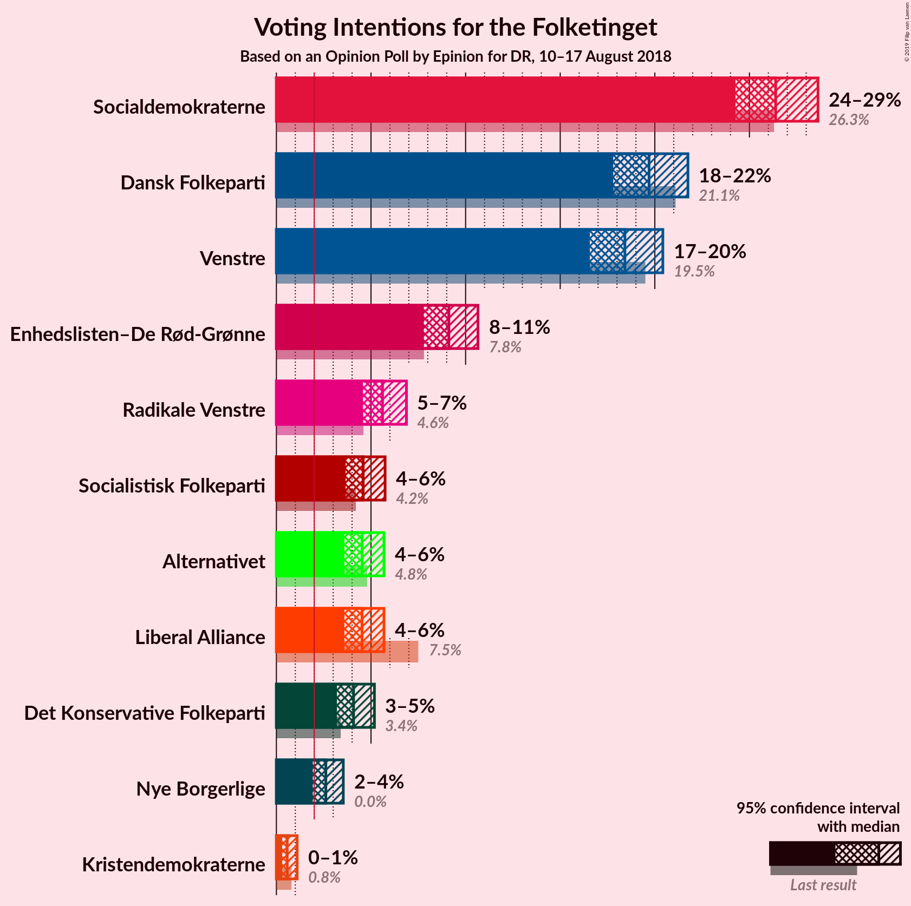

### Confidence Intervals

| Party | Last Result | Poll Result | 80% Confidence Interval | 90% Confidence Interval | 95% Confidence Interval | 99% Confidence Interval |
|:-----:|:-----------:|:-----------:|:-----------------------:|:-----------------------:|:-----------------------:|:-----------------------:|
| Socialdemokraterne | 26.3% | 26.4% | 25.0–27.9% |24.6–28.3% |24.3–28.6% |23.6–29.3% |
| Dansk Folkeparti | 21.1% | 19.7% | 18.4–21.0% |18.1–21.4% |17.8–21.7% |17.2–22.4% |
| Venstre | 19.5% | 18.4% | 17.2–19.7% |16.9–20.1% |16.6–20.4% |16.0–21.1% |
| Enhedslisten–De Rød-Grønne | 7.8% | 9.1% | 8.2–10.1% |8.0–10.4% |7.8–10.7% |7.4–11.1% |
| Radikale Venstre | 4.6% | 5.6% | 4.9–6.4% |4.7–6.7% |4.6–6.9% |4.3–7.3% |
| Socialistisk Folkeparti | 4.2% | 4.6% | 4.0–5.3% |3.8–5.6% |3.7–5.7% |3.4–6.1% |
| Liberal Alliance | 7.5% | 4.5% | 3.9–5.3% |3.7–5.5% |3.6–5.7% |3.3–6.1% |
| Alternativet | 4.8% | 4.5% | 3.9–5.3% |3.7–5.5% |3.6–5.7% |3.3–6.1% |
| Det Konservative Folkeparti | 3.4% | 4.1% | 3.5–4.8% |3.3–5.0% |3.2–5.2% |2.9–5.5% |
| Nye Borgerlige | 0.0% | 2.6% | 2.2–3.2% |2.0–3.4% |1.9–3.5% |1.7–3.8% |
| Kristendemokraterne | 0.8% | 0.6% | 0.4–0.9% |0.3–1.0% |0.3–1.1% |0.2–1.3% |

*Note:* The poll result column reflects the actual value used in the calculations. Published results may vary slightly, and in addition be rounded to fewer digits.

## Seats

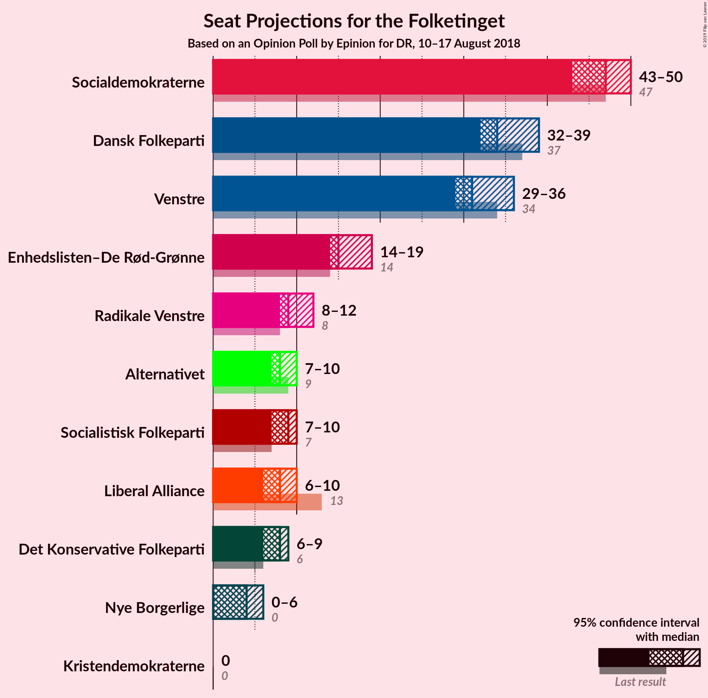

### Confidence Intervals

| Party | Last Result | Median | 80% Confidence Interval | 90% Confidence Interval | 95% Confidence Interval | 99% Confidence Interval |
|:-----:|:-----------:|:------:|:-----------------------:|:-----------------------:|:-----------------------:|:-----------------------:|
| <a href="#socialdemokraterne">Socialdemokraterne</a> | 47 | 47 | 43–50 |43–50 |43–50 |42–53 |
| <a href="#dansk-folkeparti">Dansk Folkeparti</a> | 37 | 34 | 32–36 |32–39 |32–39 |31–39 |
| <a href="#venstre">Venstre</a> | 34 | 31 | 30–36 |29–36 |29–36 |28–37 |
| <a href="#enhedslisten–de-rød-grønne">Enhedslisten–De Rød-Grønne</a> | 14 | 15 | 15–18 |14–18 |14–19 |13–19 |
| <a href="#radikale-venstre">Radikale Venstre</a> | 8 | 9 | 9–11 |8–11 |8–12 |8–13 |
| <a href="#socialistisk-folkeparti">Socialistisk Folkeparti</a> | 7 | 9 | 7–10 |7–10 |7–10 |6–11 |
| <a href="#liberal-alliance">Liberal Alliance</a> | 13 | 8 | 7–9 |7–9 |6–10 |6–10 |
| <a href="#alternativet">Alternativet</a> | 9 | 8 | 7–9 |7–10 |7–10 |6–10 |
| <a href="#det-konservative-folkeparti">Det Konservative Folkeparti</a> | 6 | 8 | 6–9 |6–9 |6–9 |5–10 |
| <a href="#nye-borgerlige">Nye Borgerlige</a> | 0 | 4 | 4–6 |4–6 |0–6 |0–6 |
| <a href="#kristendemokraterne">Kristendemokraterne</a> | 0 | 0 | 0 |0 |0 |0 |

### Socialdemokraterne

*For a full overview of the results for this party, see the [Socialdemokraterne](party-socialdemokraterne.html) page.*

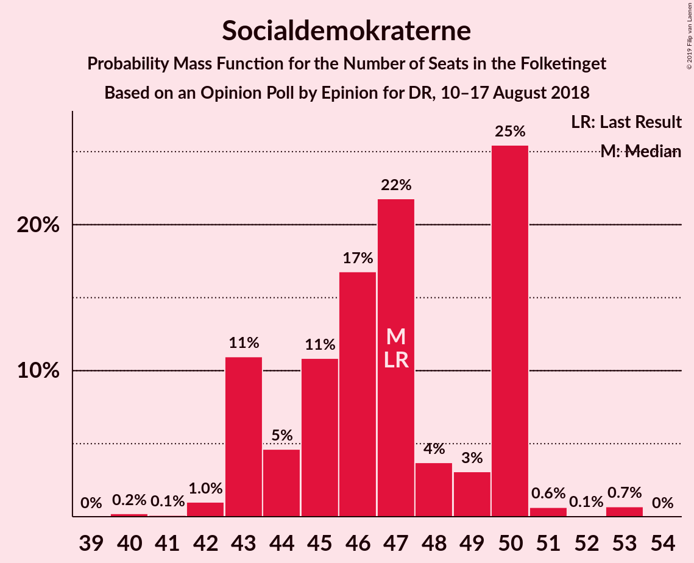

| Number of Seats | Probability | Accumulated | Special Marks |
|:---------------:|:-----------:|:-----------:|:-------------:|
| 40 | 0.2% | 100% |  |
| 41 | 0.1% | 99.8% |  |
| 42 | 1.0% | 99.7% |  |
| 43 | 11% | 98.7% |  |
| 44 | 5% | 88% |  |
| 45 | 11% | 83% |  |
| 46 | 17% | 72% |  |
| 47 | 22% | 55% | Last Result, Median |
| 48 | 4% | 34% |  |
| 49 | 3% | 30% |  |
| 50 | 25% | 27% |  |
| 51 | 0.6% | 1.4% |  |
| 52 | 0.1% | 0.8% |  |
| 53 | 0.7% | 0.7% |  |
| 54 | 0% | 0% |  |

### Dansk Folkeparti

*For a full overview of the results for this party, see the [Dansk Folkeparti](party-danskfolkeparti.html) page.*

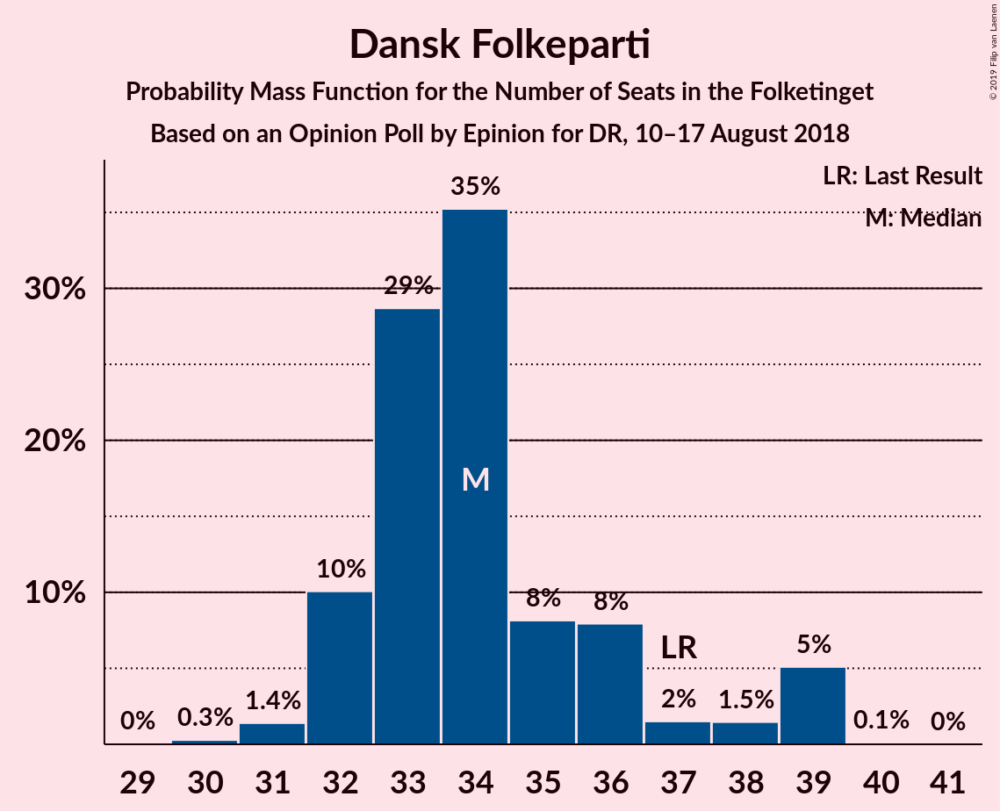

| Number of Seats | Probability | Accumulated | Special Marks |
|:---------------:|:-----------:|:-----------:|:-------------:|
| 29 | 0% | 100% |  |
| 30 | 0.3% | 99.9% |  |
| 31 | 1.4% | 99.7% |  |
| 32 | 10% | 98% |  |
| 33 | 29% | 88% |  |
| 34 | 35% | 60% | Median |
| 35 | 8% | 24% |  |
| 36 | 8% | 16% |  |
| 37 | 2% | 8% | Last Result |
| 38 | 1.5% | 7% |  |
| 39 | 5% | 5% |  |
| 40 | 0.1% | 0.1% |  |
| 41 | 0% | 0% |  |

### Venstre

*For a full overview of the results for this party, see the [Venstre](party-venstre.html) page.*

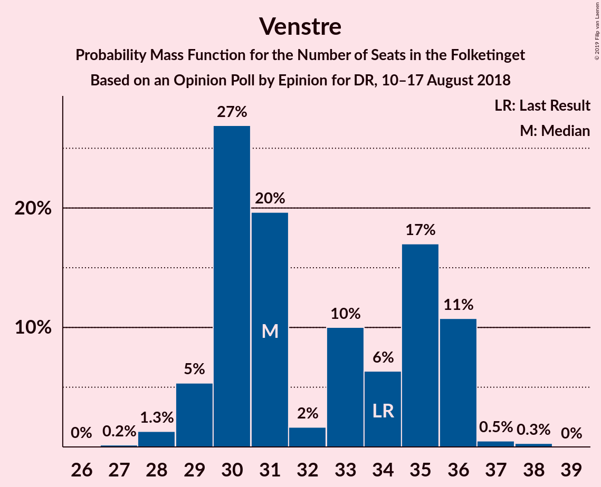

| Number of Seats | Probability | Accumulated | Special Marks |
|:---------------:|:-----------:|:-----------:|:-------------:|
| 27 | 0.2% | 100% |  |
| 28 | 1.3% | 99.8% |  |
| 29 | 5% | 98% |  |
| 30 | 27% | 93% |  |
| 31 | 20% | 66% | Median |
| 32 | 2% | 47% |  |
| 33 | 10% | 45% |  |
| 34 | 6% | 35% | Last Result |
| 35 | 17% | 29% |  |
| 36 | 11% | 12% |  |
| 37 | 0.5% | 0.8% |  |
| 38 | 0.3% | 0.3% |  |
| 39 | 0% | 0% |  |

### Enhedslisten–De Rød-Grønne

*For a full overview of the results for this party, see the [Enhedslisten–De Rød-Grønne](party-enhedslisten–derød-grønne.html) page.*

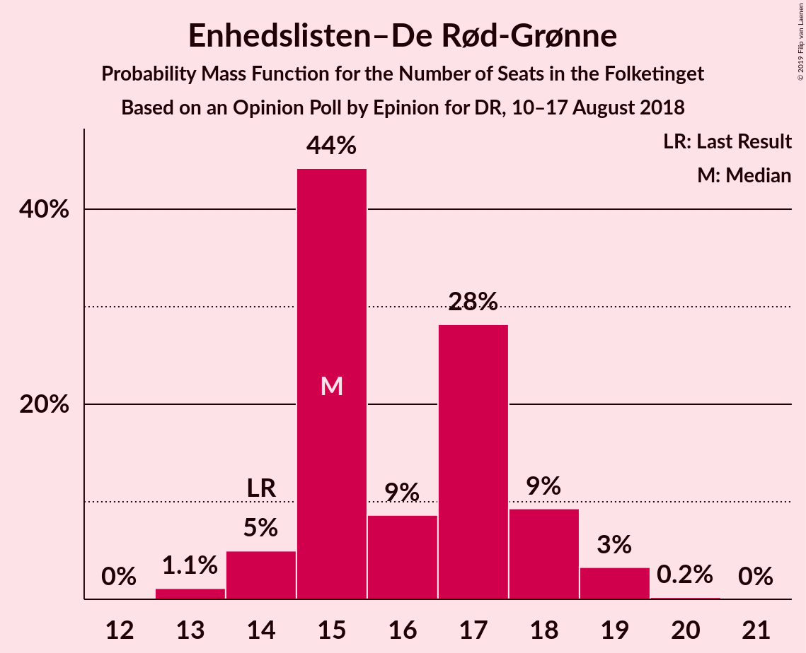

| Number of Seats | Probability | Accumulated | Special Marks |
|:---------------:|:-----------:|:-----------:|:-------------:|
| 13 | 1.1% | 100% |  |
| 14 | 5% | 98.8% | Last Result |
| 15 | 44% | 94% | Median |
| 16 | 9% | 50% |  |
| 17 | 28% | 41% |  |
| 18 | 9% | 13% |  |
| 19 | 3% | 4% |  |
| 20 | 0.2% | 0.2% |  |
| 21 | 0% | 0% |  |

### Radikale Venstre

*For a full overview of the results for this party, see the [Radikale Venstre](party-radikalevenstre.html) page.*

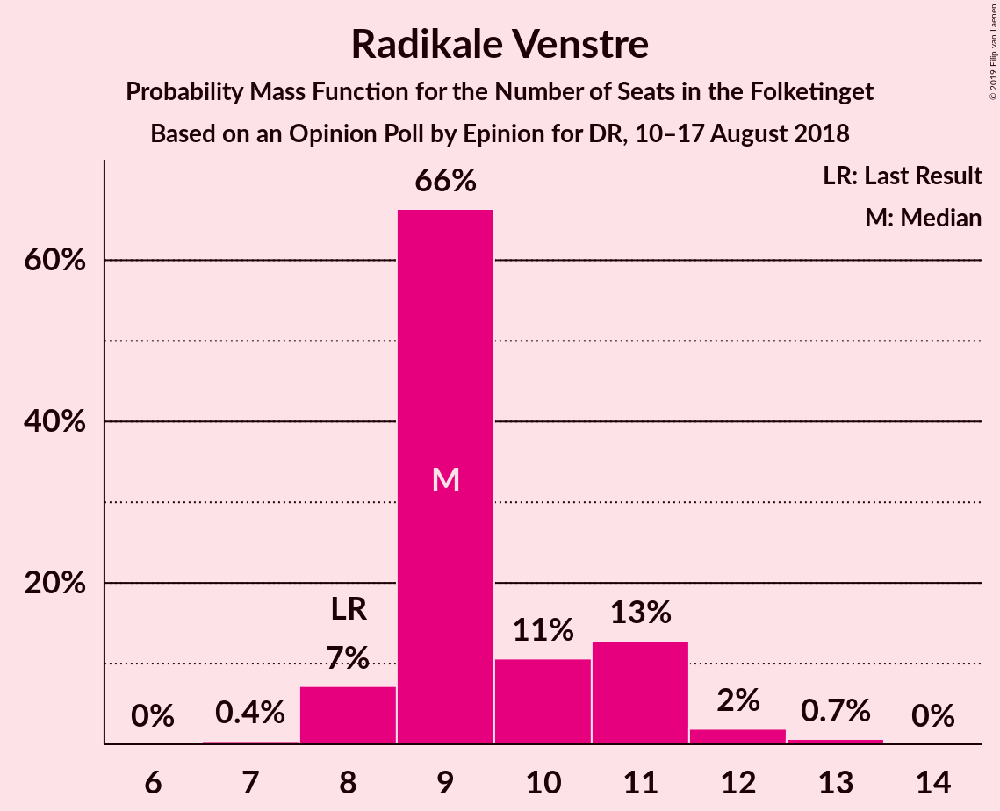

| Number of Seats | Probability | Accumulated | Special Marks |
|:---------------:|:-----------:|:-----------:|:-------------:|
| 7 | 0.4% | 100% |  |
| 8 | 7% | 99.6% | Last Result |
| 9 | 66% | 92% | Median |
| 10 | 11% | 26% |  |
| 11 | 13% | 15% |  |
| 12 | 2% | 3% |  |
| 13 | 0.7% | 0.7% |  |
| 14 | 0% | 0% |  |

### Socialistisk Folkeparti

*For a full overview of the results for this party, see the [Socialistisk Folkeparti](party-socialistiskfolkeparti.html) page.*

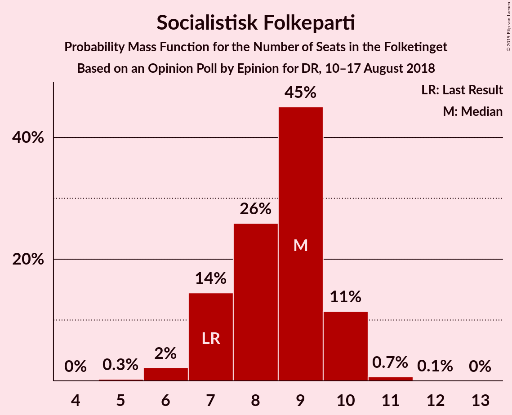

| Number of Seats | Probability | Accumulated | Special Marks |
|:---------------:|:-----------:|:-----------:|:-------------:|
| 5 | 0.3% | 100% |  |
| 6 | 2% | 99.7% |  |
| 7 | 14% | 98% | Last Result |
| 8 | 26% | 83% |  |
| 9 | 45% | 57% | Median |
| 10 | 11% | 12% |  |
| 11 | 0.7% | 0.7% |  |
| 12 | 0.1% | 0.1% |  |
| 13 | 0% | 0% |  |

### Liberal Alliance

*For a full overview of the results for this party, see the [Liberal Alliance](party-liberalalliance.html) page.*

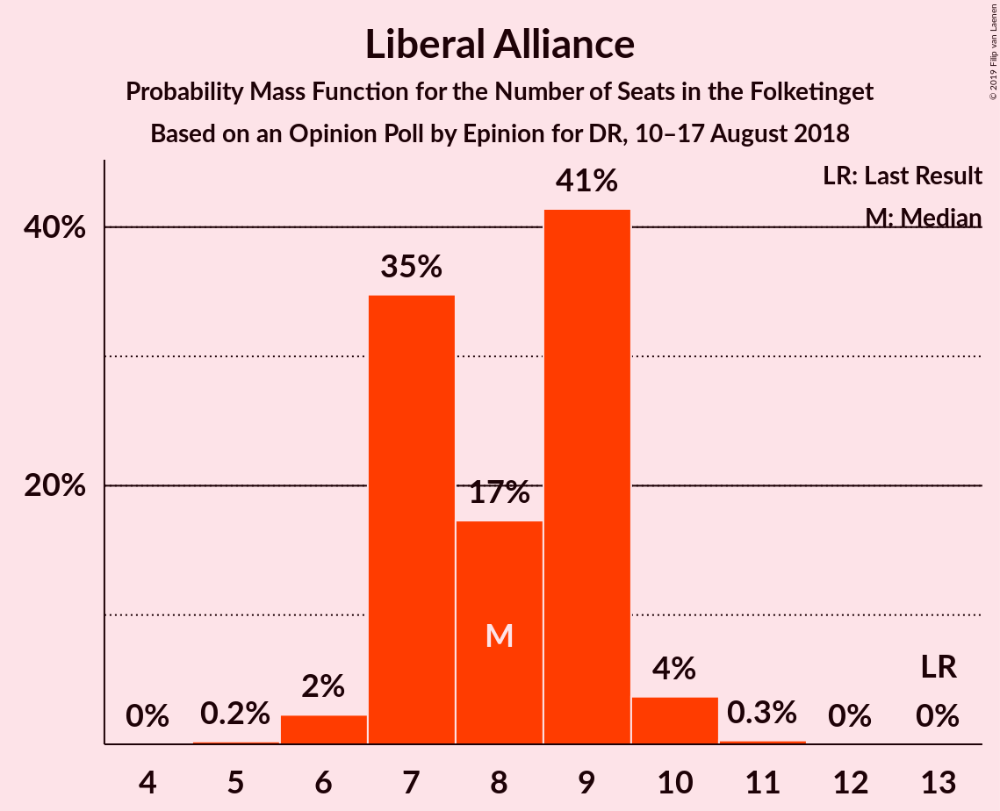

| Number of Seats | Probability | Accumulated | Special Marks |
|:---------------:|:-----------:|:-----------:|:-------------:|
| 5 | 0.2% | 100% |  |
| 6 | 2% | 99.8% |  |
| 7 | 35% | 97% |  |
| 8 | 17% | 63% | Median |
| 9 | 41% | 45% |  |
| 10 | 4% | 4% |  |
| 11 | 0.3% | 0.3% |  |
| 12 | 0% | 0% |  |
| 13 | 0% | 0% | Last Result |

### Alternativet

*For a full overview of the results for this party, see the [Alternativet](party-alternativet.html) page.*

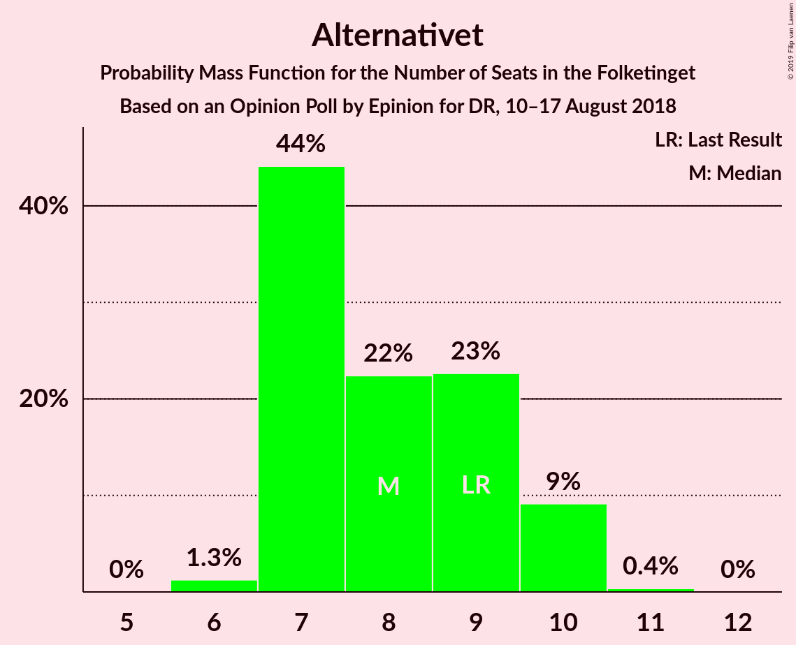

| Number of Seats | Probability | Accumulated | Special Marks |
|:---------------:|:-----------:|:-----------:|:-------------:|
| 6 | 1.3% | 100% |  |
| 7 | 44% | 98.7% |  |
| 8 | 22% | 55% | Median |
| 9 | 23% | 32% | Last Result |
| 10 | 9% | 10% |  |
| 11 | 0.4% | 0.4% |  |
| 12 | 0% | 0% |  |

### Det Konservative Folkeparti

*For a full overview of the results for this party, see the [Det Konservative Folkeparti](party-detkonservativefolkeparti.html) page.*

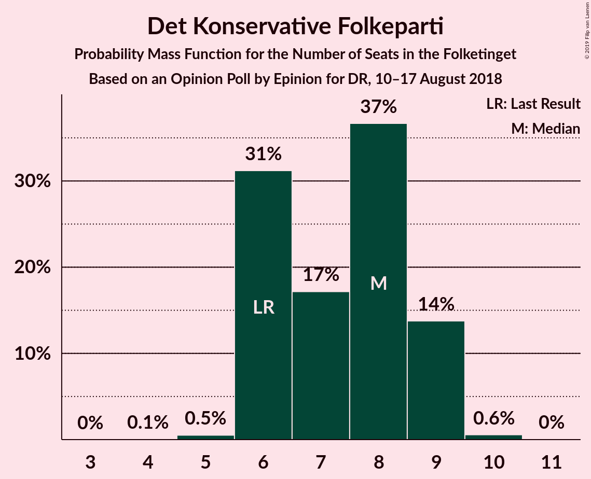

| Number of Seats | Probability | Accumulated | Special Marks |
|:---------------:|:-----------:|:-----------:|:-------------:|
| 4 | 0.1% | 100% |  |
| 5 | 0.5% | 99.9% |  |
| 6 | 31% | 99.4% | Last Result |
| 7 | 17% | 68% |  |
| 8 | 37% | 51% | Median |
| 9 | 14% | 14% |  |
| 10 | 0.6% | 0.6% |  |
| 11 | 0% | 0% |  |

### Nye Borgerlige

*For a full overview of the results for this party, see the [Nye Borgerlige](party-nyeborgerlige.html) page.*

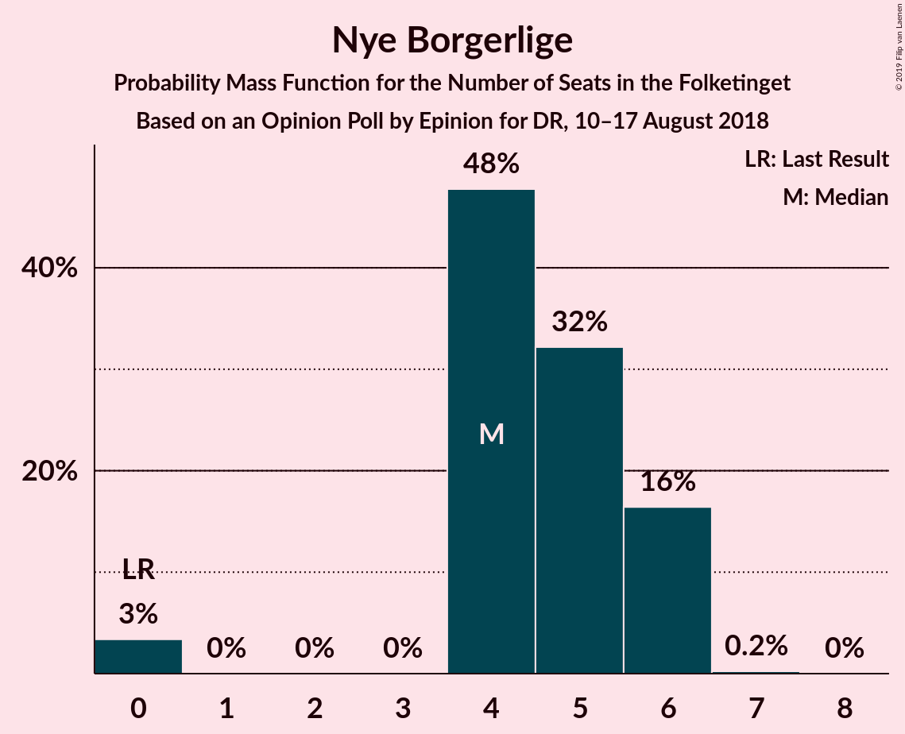

| Number of Seats | Probability | Accumulated | Special Marks |
|:---------------:|:-----------:|:-----------:|:-------------:|
| 0 | 3% | 100% | Last Result |
| 1 | 0% | 97% |  |
| 2 | 0% | 97% |  |
| 3 | 0% | 97% |  |
| 4 | 48% | 97% | Median |
| 5 | 32% | 49% |  |
| 6 | 16% | 17% |  |
| 7 | 0.2% | 0.2% |  |
| 8 | 0% | 0% |  |

### Kristendemokraterne

*For a full overview of the results for this party, see the [Kristendemokraterne](party-kristendemokraterne.html) page.*

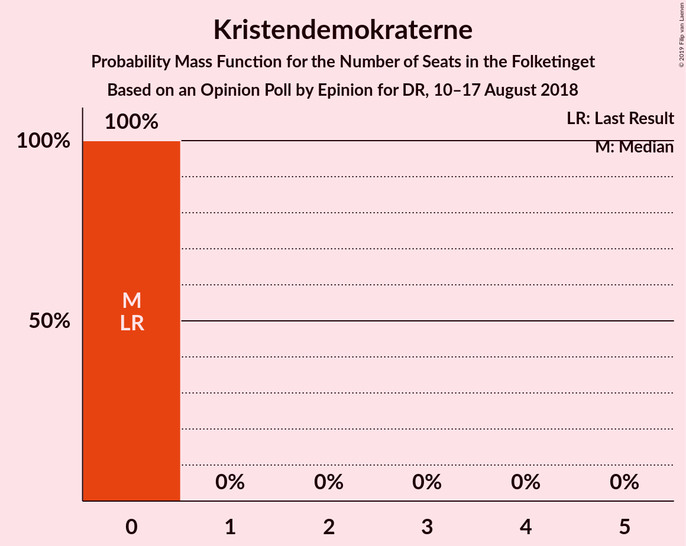

| Number of Seats | Probability | Accumulated | Special Marks |
|:---------------:|:-----------:|:-----------:|:-------------:|
| 0 | 100% | 100% | Last Result, Median |

## Coalitions

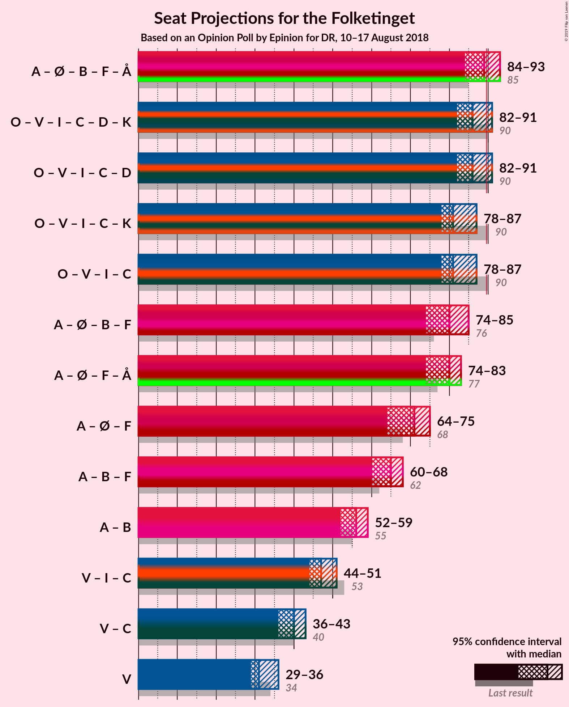

### Confidence Intervals

| Coalition | Last Result | Median | Majority? | 80% Confidence Interval | 90% Confidence Interval | 95% Confidence Interval | 99% Confidence Interval |
|:---------:|:-----------:|:------:|:---------:|:-----------------------:|:-----------------------:|:-----------------------:|:-----------------------:|
| Socialdemokraterne – Enhedslisten–De Rød-Grønne – Radikale Venstre – Socialistisk Folkeparti – Alternativet | 85 | 89 | 39% | 86–90 | 85–90 | 84–93 | 83–94 |
| Dansk Folkeparti – Venstre – Liberal Alliance – Det Konservative Folkeparti – Nye Borgerlige – Kristendemokraterne | 90 | 86 | 7% | 85–89 | 85–90 | 82–91 | 81–92 |
| Dansk Folkeparti – Venstre – Liberal Alliance – Det Konservative Folkeparti – Nye Borgerlige | 90 | 86 | 7% | 85–89 | 85–90 | 82–91 | 81–92 |
| Dansk Folkeparti – Venstre – Liberal Alliance – Det Konservative Folkeparti – Kristendemokraterne | 90 | 81 | 0% | 81–84 | 80–86 | 78–87 | 76–88 |
| Dansk Folkeparti – Venstre – Liberal Alliance – Det Konservative Folkeparti | 90 | 81 | 0% | 81–84 | 80–86 | 78–87 | 76–88 |
| Socialdemokraterne – Enhedslisten–De Rød-Grønne – Radikale Venstre – Socialistisk Folkeparti | 76 | 80 | 0.1% | 78–83 | 76–83 | 74–85 | 74–87 |
| Socialdemokraterne – Enhedslisten–De Rød-Grønne – Socialistisk Folkeparti – Alternativet | 77 | 80 | 0% | 76–81 | 75–81 | 74–83 | 72–84 |
| Socialdemokraterne – Enhedslisten–De Rød-Grønne – Socialistisk Folkeparti | 68 | 71 | 0% | 68–74 | 66–74 | 64–75 | 64–77 |
| Socialdemokraterne – Radikale Venstre – Socialistisk Folkeparti | 62 | 65 | 0% | 61–68 | 60–68 | 60–68 | 59–71 |
| Socialdemokraterne – Radikale Venstre | 55 | 56 | 0% | 54–59 | 52–59 | 52–59 | 52–63 |
| Venstre – Liberal Alliance – Det Konservative Folkeparti | 53 | 47 | 0% | 46–50 | 45–50 | 44–51 | 43–54 |
| Venstre – Det Konservative Folkeparti | 40 | 40 | 0% | 38–42 | 37–43 | 36–43 | 35–45 |
| Venstre | 34 | 31 | 0% | 30–36 | 29–36 | 29–36 | 28–37 |

### Socialdemokraterne – Enhedslisten–De Rød-Grønne – Radikale Venstre – Socialistisk Folkeparti – Alternativet

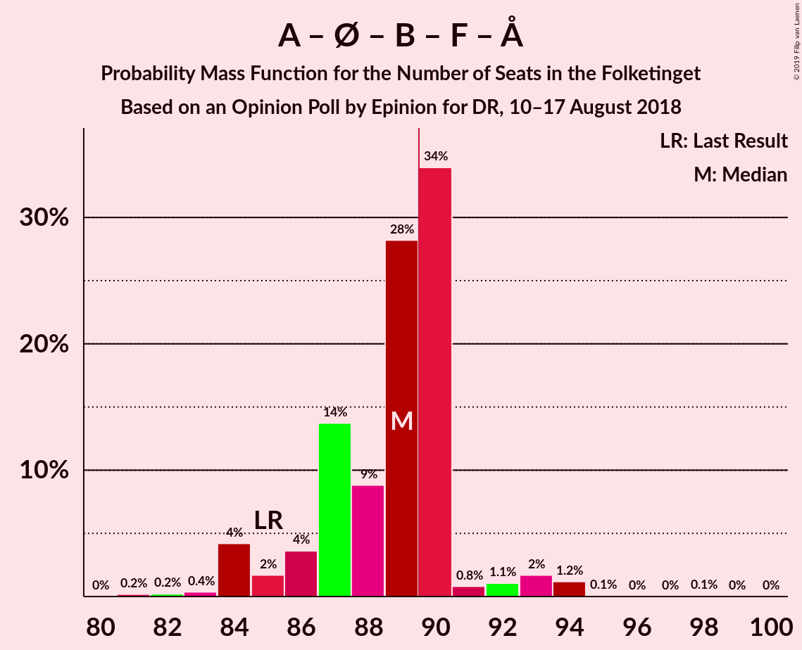

| Number of Seats | Probability | Accumulated | Special Marks |
|:---------------:|:-----------:|:-----------:|:-------------:|
| 81 | 0.2% | 100% |  |
| 82 | 0.2% | 99.8% |  |
| 83 | 0.4% | 99.6% |  |
| 84 | 4% | 99.2% |  |
| 85 | 2% | 95% | Last Result |
| 86 | 4% | 93% |  |
| 87 | 14% | 90% |  |
| 88 | 9% | 76% | Median |
| 89 | 28% | 67% |  |
| 90 | 34% | 39% | Majority |
| 91 | 0.8% | 5% |  |
| 92 | 1.1% | 4% |  |
| 93 | 2% | 3% |  |
| 94 | 1.2% | 1.4% |  |
| 95 | 0.1% | 0.2% |  |
| 96 | 0% | 0.1% |  |
| 97 | 0% | 0.1% |  |
| 98 | 0.1% | 0.1% |  |
| 99 | 0% | 0% |  |

### Dansk Folkeparti – Venstre – Liberal Alliance – Det Konservative Folkeparti – Nye Borgerlige – Kristendemokraterne

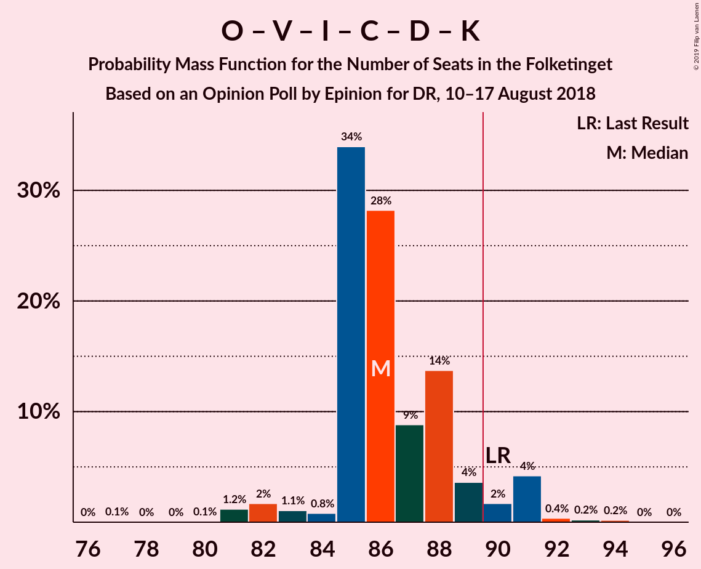

| Number of Seats | Probability | Accumulated | Special Marks |
|:---------------:|:-----------:|:-----------:|:-------------:|
| 77 | 0.1% | 100% |  |
| 78 | 0% | 99.9% |  |
| 79 | 0% | 99.9% |  |
| 80 | 0.1% | 99.9% |  |
| 81 | 1.2% | 99.8% |  |
| 82 | 2% | 98.6% |  |
| 83 | 1.1% | 97% |  |
| 84 | 0.8% | 96% |  |
| 85 | 34% | 95% | Median |
| 86 | 28% | 61% |  |
| 87 | 9% | 33% |  |
| 88 | 14% | 24% |  |
| 89 | 4% | 10% |  |
| 90 | 2% | 7% | Last Result, Majority |
| 91 | 4% | 5% |  |
| 92 | 0.4% | 0.8% |  |
| 93 | 0.2% | 0.4% |  |
| 94 | 0.2% | 0.2% |  |
| 95 | 0% | 0% |  |

### Dansk Folkeparti – Venstre – Liberal Alliance – Det Konservative Folkeparti – Nye Borgerlige

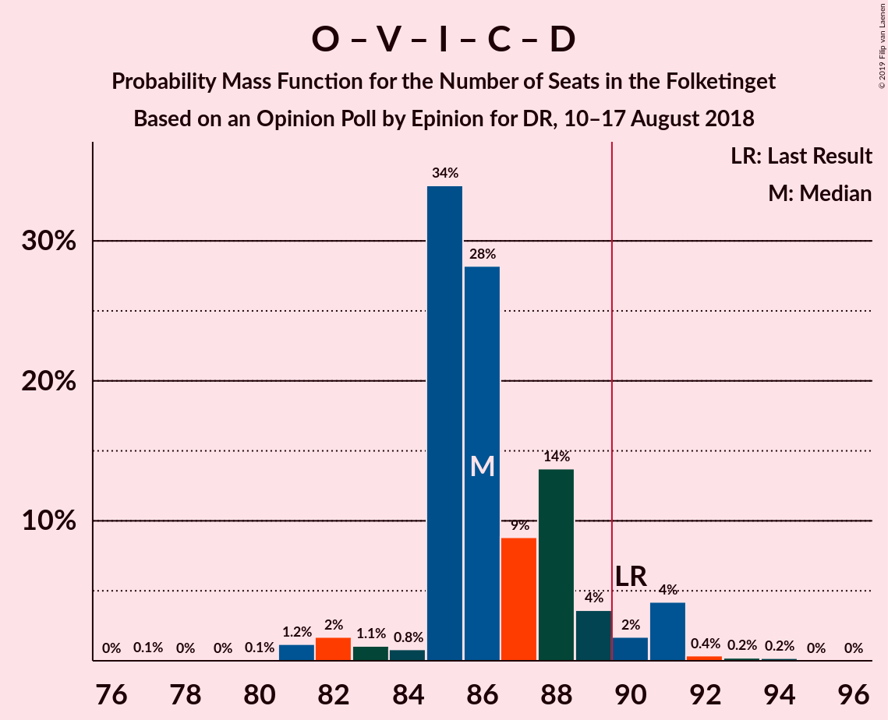

| Number of Seats | Probability | Accumulated | Special Marks |
|:---------------:|:-----------:|:-----------:|:-------------:|
| 77 | 0.1% | 100% |  |
| 78 | 0% | 99.9% |  |
| 79 | 0% | 99.9% |  |
| 80 | 0.1% | 99.9% |  |
| 81 | 1.2% | 99.8% |  |
| 82 | 2% | 98.6% |  |
| 83 | 1.1% | 97% |  |
| 84 | 0.8% | 96% |  |
| 85 | 34% | 95% | Median |
| 86 | 28% | 61% |  |
| 87 | 9% | 33% |  |
| 88 | 14% | 24% |  |
| 89 | 4% | 10% |  |
| 90 | 2% | 7% | Last Result, Majority |
| 91 | 4% | 5% |  |
| 92 | 0.4% | 0.8% |  |
| 93 | 0.2% | 0.4% |  |
| 94 | 0.2% | 0.2% |  |
| 95 | 0% | 0% |  |

### Dansk Folkeparti – Venstre – Liberal Alliance – Det Konservative Folkeparti – Kristendemokraterne

| Number of Seats | Probability | Accumulated | Special Marks |
|:---------------:|:-----------:|:-----------:|:-------------:|
| 75 | 0.1% | 100% |  |
| 76 | 0.5% | 99.8% |  |
| 77 | 2% | 99.3% |  |
| 78 | 1.2% | 98% |  |
| 79 | 1.1% | 96% |  |
| 80 | 4% | 95% |  |
| 81 | 46% | 91% | Median |
| 82 | 30% | 46% |  |
| 83 | 2% | 15% |  |
| 84 | 5% | 14% |  |
| 85 | 1.0% | 9% |  |
| 86 | 4% | 8% |  |
| 87 | 3% | 4% |  |
| 88 | 0.5% | 0.6% |  |
| 89 | 0.1% | 0.1% |  |
| 90 | 0% | 0% | Last Result, Majority |

### Dansk Folkeparti – Venstre – Liberal Alliance – Det Konservative Folkeparti

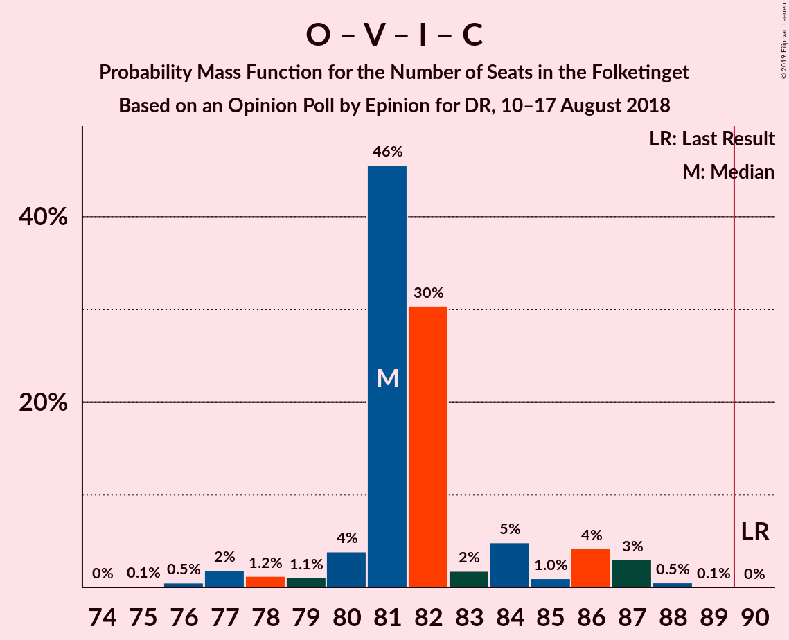

| Number of Seats | Probability | Accumulated | Special Marks |
|:---------------:|:-----------:|:-----------:|:-------------:|
| 75 | 0.1% | 100% |  |
| 76 | 0.5% | 99.8% |  |
| 77 | 2% | 99.3% |  |
| 78 | 1.2% | 98% |  |
| 79 | 1.1% | 96% |  |
| 80 | 4% | 95% |  |
| 81 | 46% | 91% | Median |
| 82 | 30% | 46% |  |
| 83 | 2% | 15% |  |
| 84 | 5% | 14% |  |
| 85 | 1.0% | 9% |  |
| 86 | 4% | 8% |  |
| 87 | 3% | 4% |  |
| 88 | 0.5% | 0.6% |  |
| 89 | 0.1% | 0.1% |  |
| 90 | 0% | 0% | Last Result, Majority |

### Socialdemokraterne – Enhedslisten–De Rød-Grønne – Radikale Venstre – Socialistisk Folkeparti

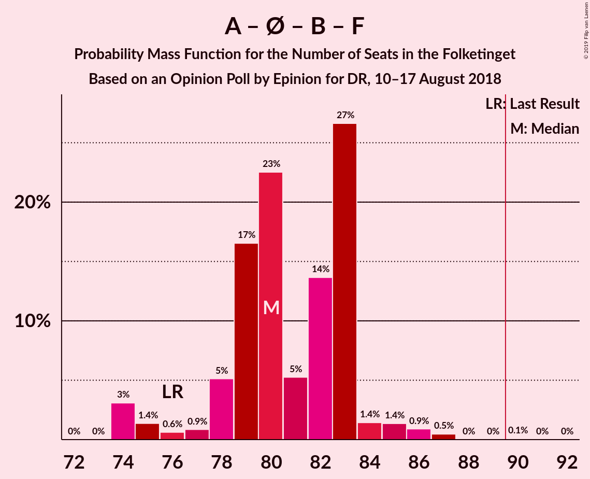

| Number of Seats | Probability | Accumulated | Special Marks |
|:---------------:|:-----------:|:-----------:|:-------------:|
| 74 | 3% | 100% |  |
| 75 | 1.4% | 97% |  |
| 76 | 0.6% | 96% | Last Result |
| 77 | 0.9% | 95% |  |
| 78 | 5% | 94% |  |
| 79 | 17% | 89% |  |
| 80 | 23% | 72% | Median |
| 81 | 5% | 50% |  |
| 82 | 14% | 45% |  |
| 83 | 27% | 31% |  |
| 84 | 1.4% | 4% |  |
| 85 | 1.4% | 3% |  |
| 86 | 0.9% | 1.5% |  |
| 87 | 0.5% | 0.6% |  |
| 88 | 0% | 0.1% |  |
| 89 | 0% | 0.1% |  |
| 90 | 0.1% | 0.1% | Majority |
| 91 | 0% | 0% |  |

### Socialdemokraterne – Enhedslisten–De Rød-Grønne – Socialistisk Folkeparti – Alternativet

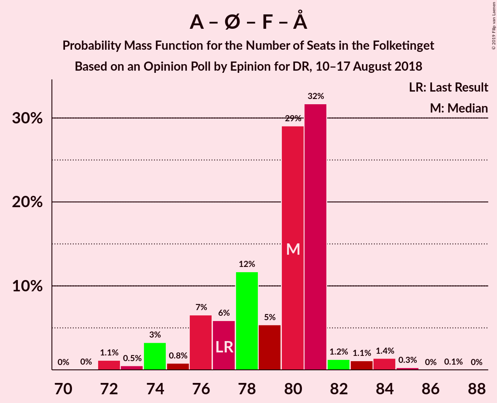

| Number of Seats | Probability | Accumulated | Special Marks |
|:---------------:|:-----------:|:-----------:|:-------------:|
| 72 | 1.1% | 100% |  |
| 73 | 0.5% | 98.8% |  |
| 74 | 3% | 98% |  |
| 75 | 0.8% | 95% |  |
| 76 | 7% | 94% |  |
| 77 | 6% | 88% | Last Result |
| 78 | 12% | 82% |  |
| 79 | 5% | 70% | Median |
| 80 | 29% | 65% |  |
| 81 | 32% | 36% |  |
| 82 | 1.2% | 4% |  |
| 83 | 1.1% | 3% |  |
| 84 | 1.4% | 2% |  |
| 85 | 0.3% | 0.4% |  |
| 86 | 0% | 0.1% |  |
| 87 | 0.1% | 0.1% |  |
| 88 | 0% | 0% |  |

### Socialdemokraterne – Enhedslisten–De Rød-Grønne – Socialistisk Folkeparti

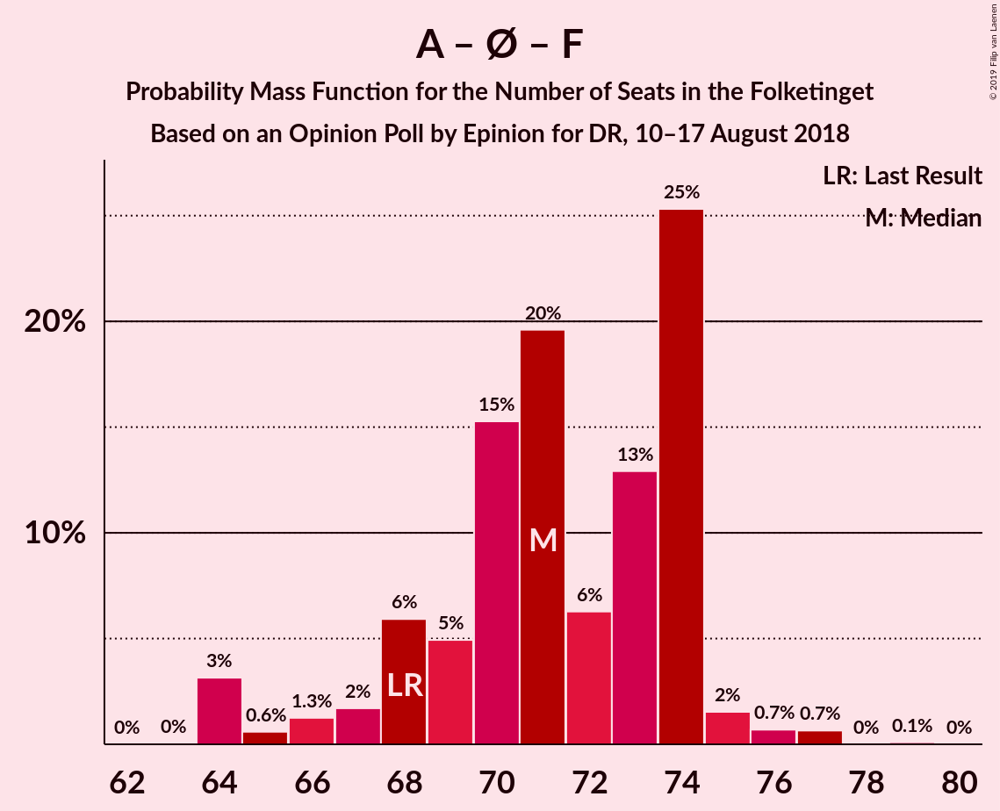

| Number of Seats | Probability | Accumulated | Special Marks |
|:---------------:|:-----------:|:-----------:|:-------------:|
| 64 | 3% | 100% |  |
| 65 | 0.6% | 97% |  |
| 66 | 1.3% | 96% |  |
| 67 | 2% | 95% |  |
| 68 | 6% | 93% | Last Result |
| 69 | 5% | 87% |  |
| 70 | 15% | 82% |  |
| 71 | 20% | 67% | Median |
| 72 | 6% | 48% |  |
| 73 | 13% | 41% |  |
| 74 | 25% | 28% |  |
| 75 | 2% | 3% |  |
| 76 | 0.7% | 1.5% |  |
| 77 | 0.7% | 0.8% |  |
| 78 | 0% | 0.1% |  |
| 79 | 0.1% | 0.1% |  |
| 80 | 0% | 0% |  |

### Socialdemokraterne – Radikale Venstre – Socialistisk Folkeparti

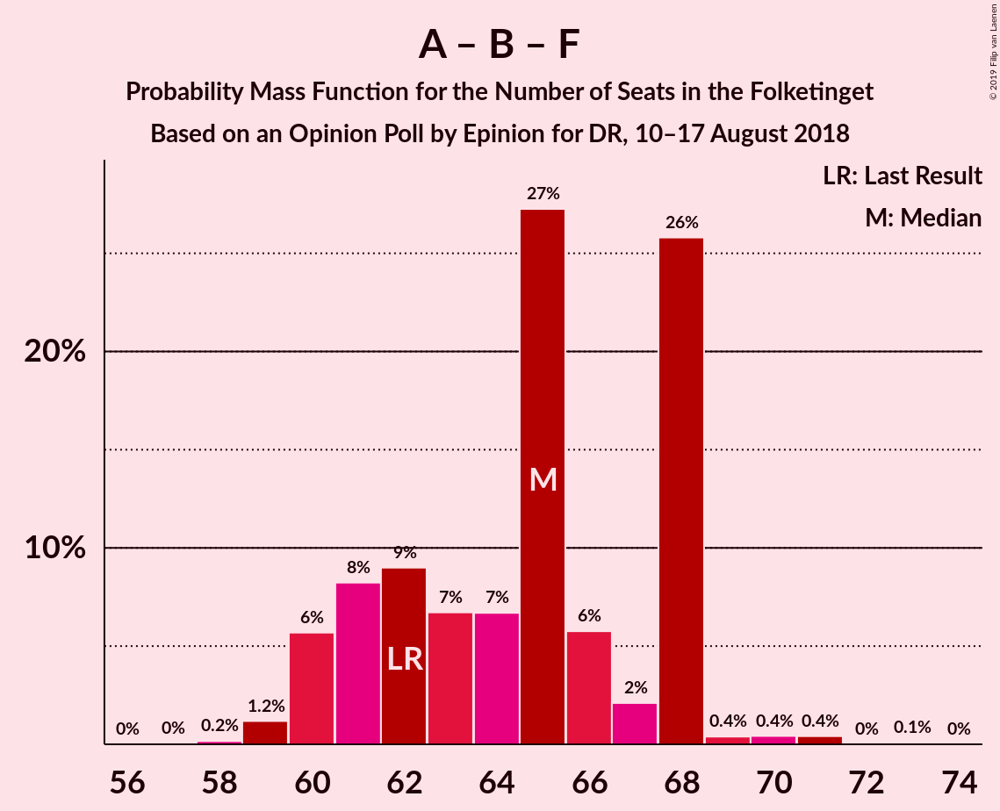

| Number of Seats | Probability | Accumulated | Special Marks |
|:---------------:|:-----------:|:-----------:|:-------------:|
| 58 | 0.2% | 100% |  |
| 59 | 1.2% | 99.8% |  |
| 60 | 6% | 98.6% |  |
| 61 | 8% | 93% |  |
| 62 | 9% | 85% | Last Result |
| 63 | 7% | 76% |  |
| 64 | 7% | 69% |  |
| 65 | 27% | 62% | Median |
| 66 | 6% | 35% |  |
| 67 | 2% | 29% |  |
| 68 | 26% | 27% |  |
| 69 | 0.4% | 1.3% |  |
| 70 | 0.4% | 1.0% |  |
| 71 | 0.4% | 0.5% |  |
| 72 | 0% | 0.1% |  |
| 73 | 0.1% | 0.1% |  |
| 74 | 0% | 0% |  |

### Socialdemokraterne – Radikale Venstre

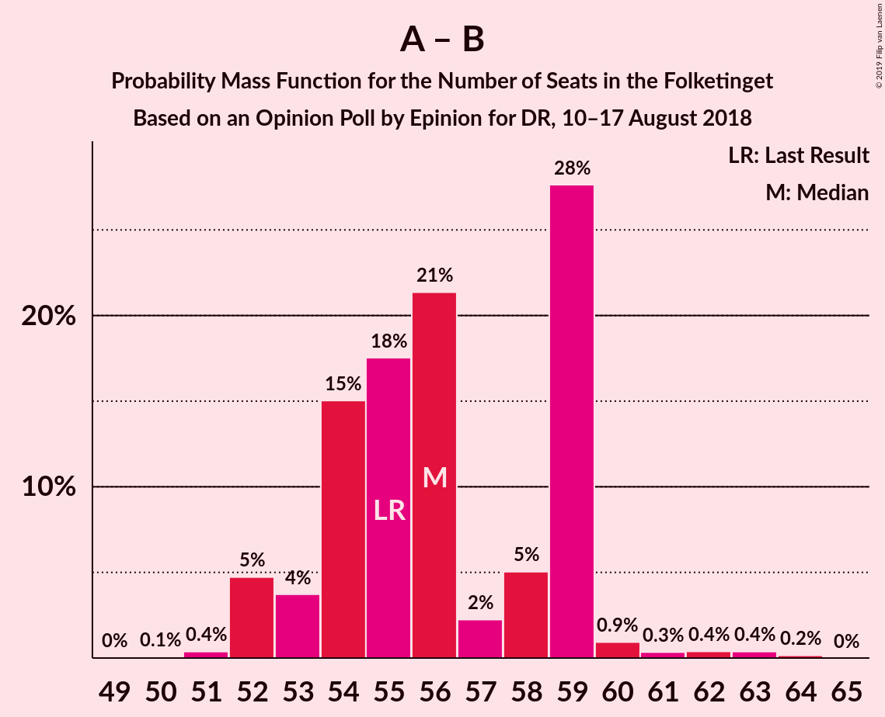

| Number of Seats | Probability | Accumulated | Special Marks |
|:---------------:|:-----------:|:-----------:|:-------------:|
| 50 | 0.1% | 100% |  |
| 51 | 0.4% | 99.9% |  |
| 52 | 5% | 99.5% |  |
| 53 | 4% | 95% |  |
| 54 | 15% | 91% |  |
| 55 | 18% | 76% | Last Result |
| 56 | 21% | 58% | Median |
| 57 | 2% | 37% |  |
| 58 | 5% | 35% |  |
| 59 | 28% | 30% |  |
| 60 | 0.9% | 2% |  |
| 61 | 0.3% | 1.3% |  |
| 62 | 0.4% | 0.9% |  |
| 63 | 0.4% | 0.5% |  |
| 64 | 0.2% | 0.2% |  |
| 65 | 0% | 0% |  |

### Venstre – Liberal Alliance – Det Konservative Folkeparti

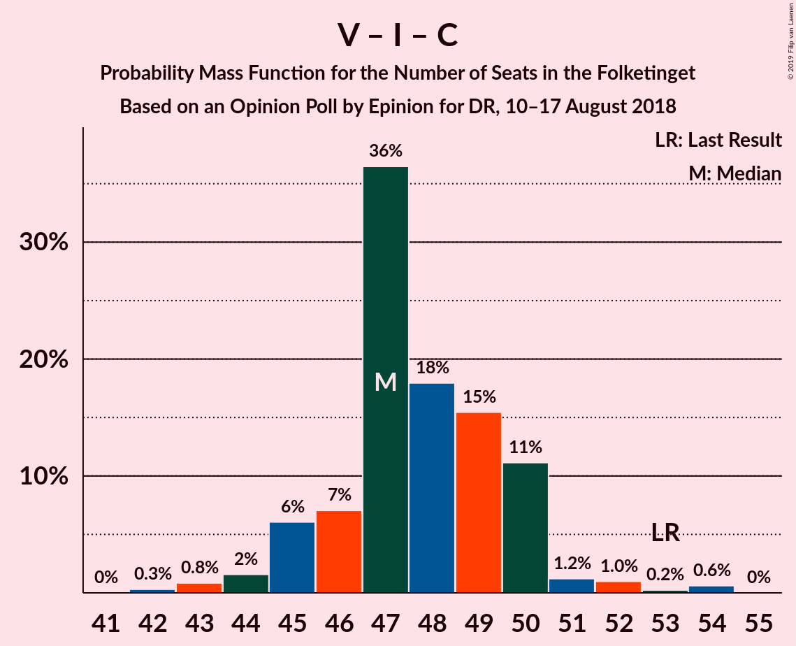

| Number of Seats | Probability | Accumulated | Special Marks |
|:---------------:|:-----------:|:-----------:|:-------------:|
| 41 | 0% | 100% |  |
| 42 | 0.3% | 99.9% |  |
| 43 | 0.8% | 99.6% |  |
| 44 | 2% | 98.8% |  |
| 45 | 6% | 97% |  |
| 46 | 7% | 91% |  |
| 47 | 36% | 84% | Median |
| 48 | 18% | 48% |  |
| 49 | 15% | 30% |  |
| 50 | 11% | 14% |  |
| 51 | 1.2% | 3% |  |
| 52 | 1.0% | 2% |  |
| 53 | 0.2% | 0.9% | Last Result |
| 54 | 0.6% | 0.6% |  |
| 55 | 0% | 0% |  |

### Venstre – Det Konservative Folkeparti

| Number of Seats | Probability | Accumulated | Special Marks |
|:---------------:|:-----------:|:-----------:|:-------------:|
| 34 | 0.2% | 100% |  |
| 35 | 2% | 99.7% |  |
| 36 | 3% | 98% |  |
| 37 | 5% | 96% |  |
| 38 | 26% | 90% |  |
| 39 | 11% | 64% | Median |
| 40 | 21% | 52% | Last Result |
| 41 | 17% | 31% |  |
| 42 | 5% | 15% |  |
| 43 | 8% | 10% |  |
| 44 | 0.8% | 2% |  |
| 45 | 1.1% | 1.2% |  |
| 46 | 0.1% | 0.1% |  |
| 47 | 0% | 0% |  |

### Venstre

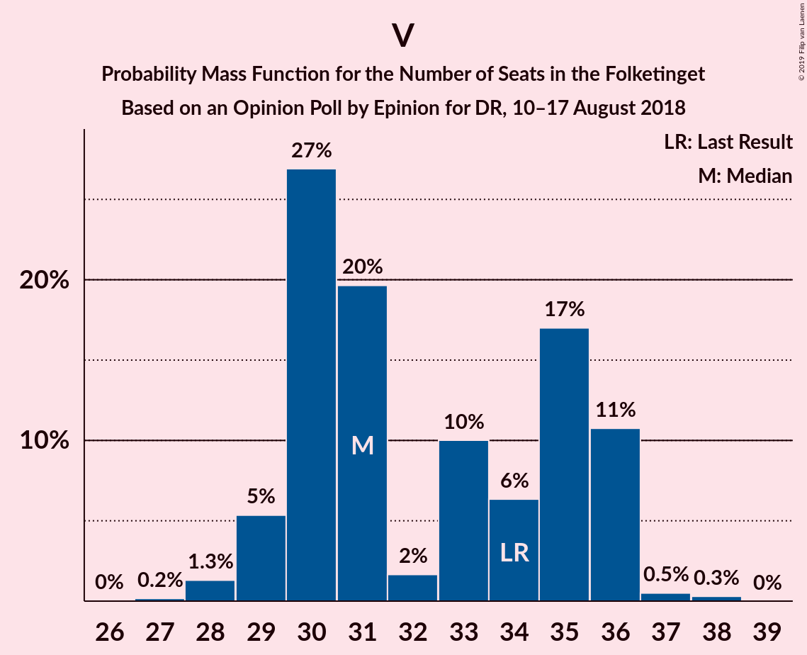

| Number of Seats | Probability | Accumulated | Special Marks |
|:---------------:|:-----------:|:-----------:|:-------------:|
| 27 | 0.2% | 100% |  |
| 28 | 1.3% | 99.8% |  |
| 29 | 5% | 98% |  |
| 30 | 27% | 93% |  |
| 31 | 20% | 66% | Median |
| 32 | 2% | 47% |  |
| 33 | 10% | 45% |  |
| 34 | 6% | 35% | Last Result |
| 35 | 17% | 29% |  |
| 36 | 11% | 12% |  |
| 37 | 0.5% | 0.8% |  |
| 38 | 0.3% | 0.3% |  |
| 39 | 0% | 0% |  |

## Technical Information

### Opinion Poll

+ **Polling firm:** Epinion
+ **Commissioner(s):** DR
+ **Fieldwork period:** 10–17 August 2018

### Calculations

+ **Sample size:** 1569
+ **Simulations done:** 1,048,576
+ **Error estimate:** 3.06%

