# Opinion Poll by Voxmeter for Ritzau, 3–9 September 2018

<a href="#voting-intentions">Voting Intentions</a> | <a href="#seats">Seats</a> | <a href="#coalitions">Coalitions</a> | <a href="#technical-information">Technical Information</a>

## Voting Intentions

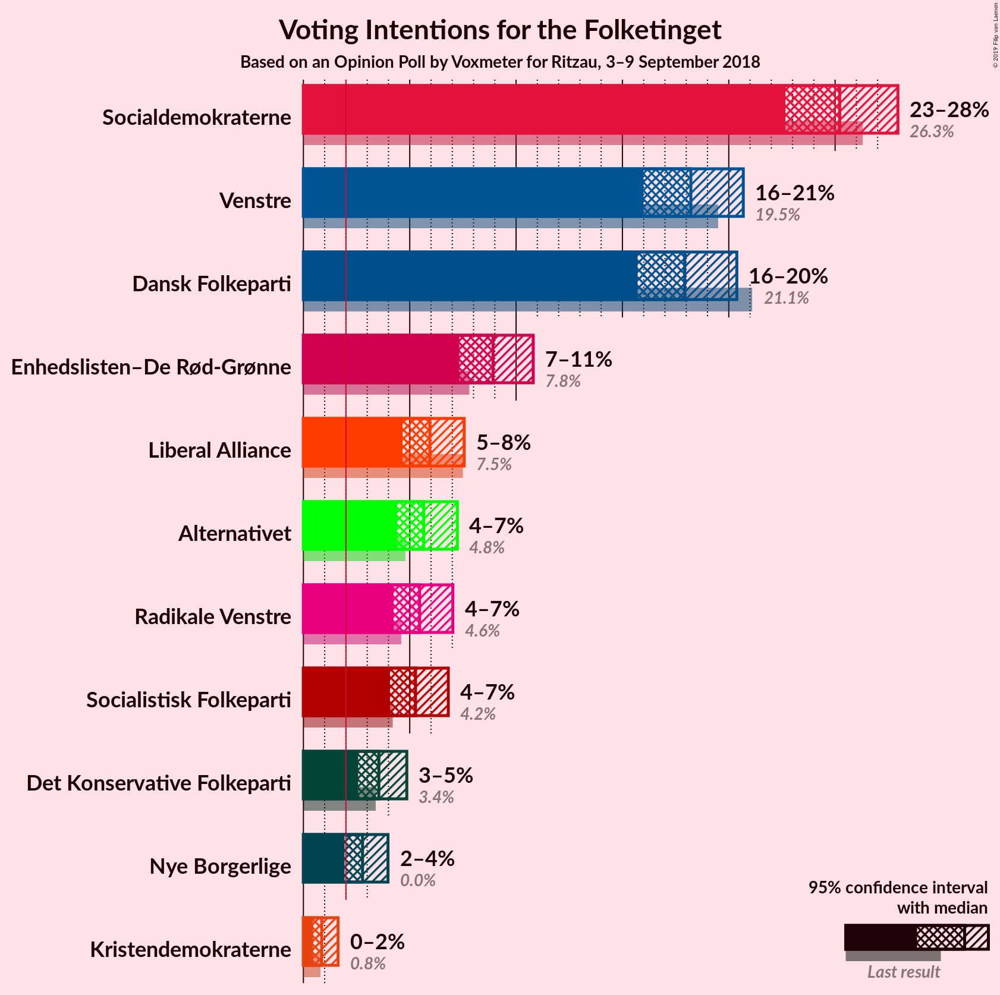

### Confidence Intervals

| Party | Last Result | Poll Result | 80% Confidence Interval | 90% Confidence Interval | 95% Confidence Interval | 99% Confidence Interval |
|:-----:|:-----------:|:-----------:|:-----------------------:|:-----------------------:|:-----------------------:|:-----------------------:|
| Socialdemokraterne | 26.3% | 25.2% | 23.5–27.0% |23.1–27.5% |22.7–28.0% |21.9–28.8% |
| Venstre | 19.5% | 18.2% | 16.8–19.8% |16.3–20.3% |16.0–20.7% |15.3–21.5% |
| Dansk Folkeparti | 21.1% | 17.9% | 16.5–19.5% |16.1–20.0% |15.7–20.4% |15.0–21.2% |
| Enhedslisten–De Rød-Grønne | 7.8% | 8.9% | 7.9–10.2% |7.6–10.5% |7.3–10.8% |6.9–11.4% |
| Liberal Alliance | 7.5% | 5.9% | 5.1–7.0% |4.9–7.3% |4.7–7.6% |4.3–8.1% |
| Alternativet | 4.8% | 5.7% | 4.8–6.7% |4.6–7.0% |4.4–7.2% |4.0–7.8% |
| Radikale Venstre | 4.6% | 5.5% | 4.6–6.5% |4.4–6.8% |4.2–7.0% |3.9–7.5% |
| Socialistisk Folkeparti | 4.2% | 5.3% | 4.5–6.3% |4.3–6.6% |4.1–6.8% |3.7–7.3% |
| Det Konservative Folkeparti | 3.4% | 3.5% | 2.9–4.4% |2.7–4.6% |2.6–4.9% |2.3–5.3% |
| Nye Borgerlige | 0.0% | 2.8% | 2.2–3.6% |2.1–3.8% |1.9–4.0% |1.7–4.4% |
| Kristendemokraterne | 0.8% | 0.9% | 0.6–1.4% |0.5–1.5% |0.5–1.6% |0.4–1.9% |

*Note:* The poll result column reflects the actual value used in the calculations. Published results may vary slightly, and in addition be rounded to fewer digits.

## Seats

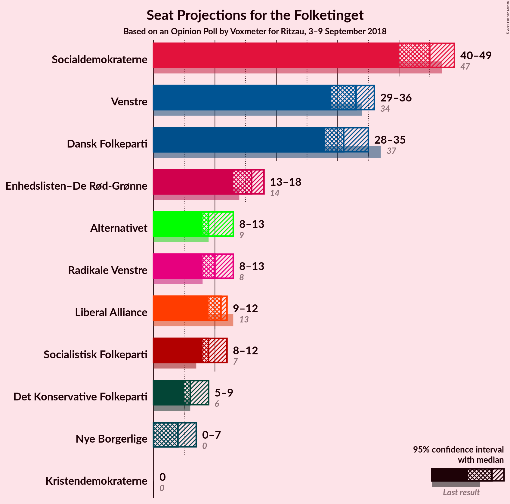

### Confidence Intervals

| Party | Last Result | Median | 80% Confidence Interval | 90% Confidence Interval | 95% Confidence Interval | 99% Confidence Interval |
|:-----:|:-----------:|:------:|:-----------------------:|:-----------------------:|:-----------------------:|:-----------------------:|
| <a href="#socialdemokraterne">Socialdemokraterne</a> | 47 | 45 | 43–47 |42–47 |40–49 |38–50 |
| <a href="#venstre">Venstre</a> | 34 | 33 | 31–34 |29–35 |29–36 |27–37 |
| <a href="#dansk-folkeparti">Dansk Folkeparti</a> | 37 | 31 | 30–33 |28–34 |28–35 |27–37 |
| <a href="#enhedslisten–de-rød-grønne">Enhedslisten–De Rød-Grønne</a> | 14 | 16 | 14–17 |13–17 |13–18 |12–20 |
| <a href="#liberal-alliance">Liberal Alliance</a> | 13 | 11 | 10–12 |9–12 |9–12 |8–14 |
| <a href="#alternativet">Alternativet</a> | 9 | 9 | 9–11 |8–13 |8–13 |7–13 |
| <a href="#radikale-venstre">Radikale Venstre</a> | 8 | 10 | 9–11 |8–12 |8–13 |7–13 |
| <a href="#socialistisk-folkeparti">Socialistisk Folkeparti</a> | 7 | 9 | 8–11 |8–12 |8–12 |7–12 |
| <a href="#det-konservative-folkeparti">Det Konservative Folkeparti</a> | 6 | 6 | 6–9 |5–9 |5–9 |4–9 |
| <a href="#nye-borgerlige">Nye Borgerlige</a> | 0 | 4 | 4–6 |4–6 |0–7 |0–8 |
| <a href="#kristendemokraterne">Kristendemokraterne</a> | 0 | 0 | 0 |0 |0 |0 |

### Socialdemokraterne

*For a full overview of the results for this party, see the [Socialdemokraterne](party-socialdemokraterne.html) page.*

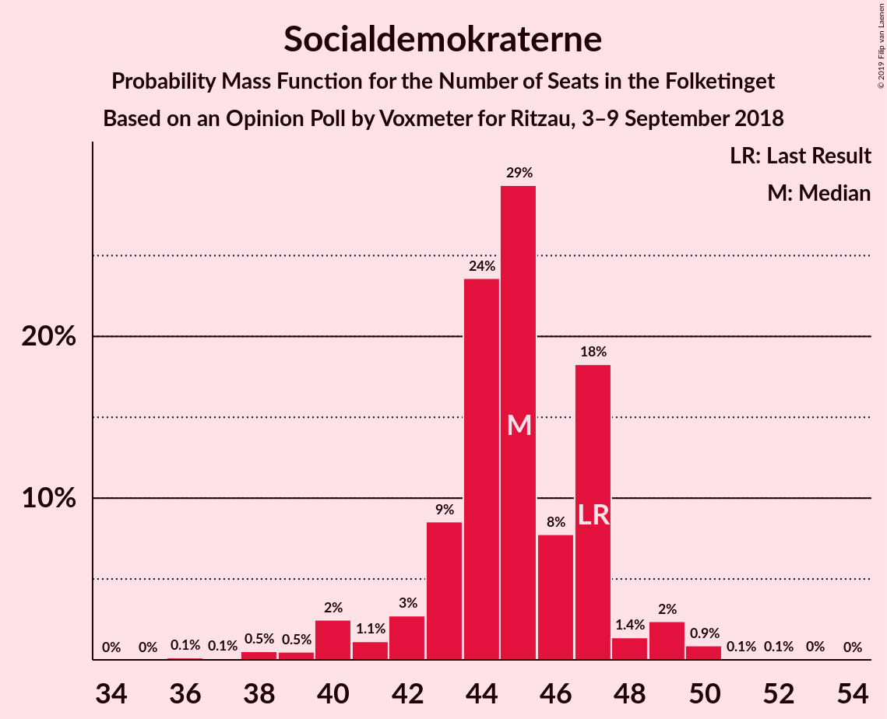

| Number of Seats | Probability | Accumulated | Special Marks |
|:---------------:|:-----------:|:-----------:|:-------------:|
| 36 | 0.1% | 100% |  |
| 37 | 0.1% | 99.9% |  |
| 38 | 0.5% | 99.8% |  |
| 39 | 0.5% | 99.2% |  |
| 40 | 2% | 98.7% |  |
| 41 | 1.1% | 96% |  |
| 42 | 3% | 95% |  |
| 43 | 9% | 92% |  |
| 44 | 24% | 84% |  |
| 45 | 29% | 60% | Median |
| 46 | 8% | 31% |  |
| 47 | 18% | 23% | Last Result |
| 48 | 1.4% | 5% |  |
| 49 | 2% | 3% |  |
| 50 | 0.9% | 1.1% |  |
| 51 | 0.1% | 0.2% |  |
| 52 | 0.1% | 0.1% |  |
| 53 | 0% | 0.1% |  |
| 54 | 0% | 0% |  |

### Venstre

*For a full overview of the results for this party, see the [Venstre](party-venstre.html) page.*

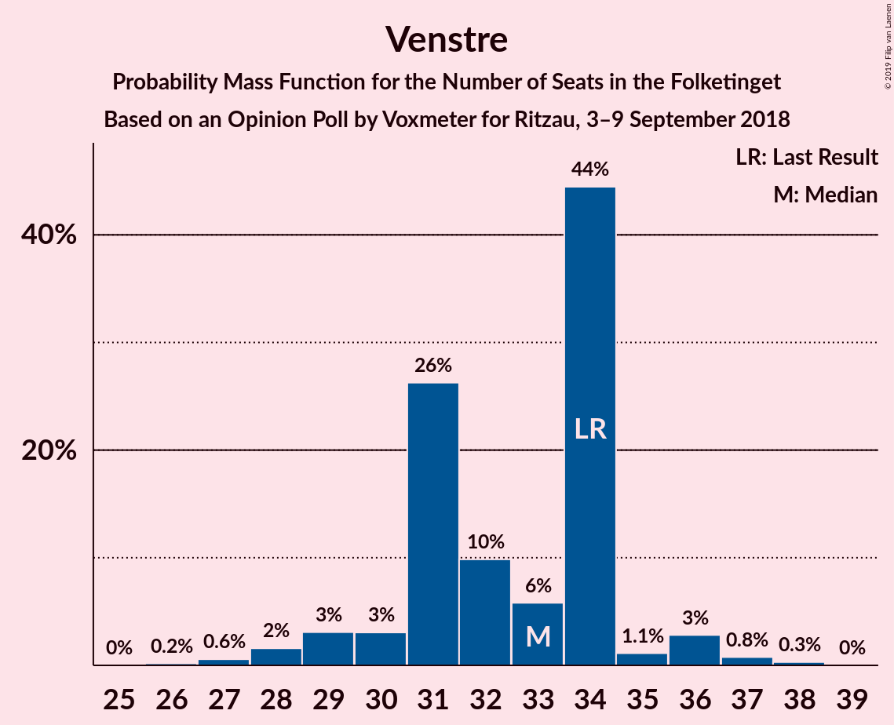

| Number of Seats | Probability | Accumulated | Special Marks |
|:---------------:|:-----------:|:-----------:|:-------------:|
| 26 | 0.2% | 100% |  |
| 27 | 0.6% | 99.8% |  |
| 28 | 2% | 99.2% |  |
| 29 | 3% | 98% |  |
| 30 | 3% | 95% |  |
| 31 | 26% | 91% |  |
| 32 | 10% | 65% |  |
| 33 | 6% | 55% | Median |
| 34 | 44% | 50% | Last Result |
| 35 | 1.1% | 5% |  |
| 36 | 3% | 4% |  |
| 37 | 0.8% | 1.1% |  |
| 38 | 0.3% | 0.4% |  |
| 39 | 0% | 0% |  |

### Dansk Folkeparti

*For a full overview of the results for this party, see the [Dansk Folkeparti](party-danskfolkeparti.html) page.*

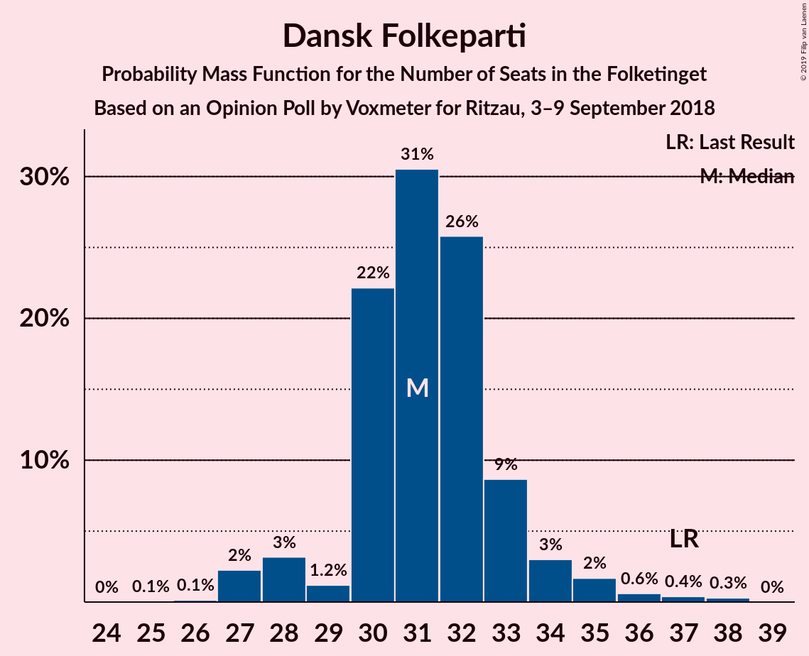

| Number of Seats | Probability | Accumulated | Special Marks |
|:---------------:|:-----------:|:-----------:|:-------------:|
| 25 | 0.1% | 100% |  |
| 26 | 0.1% | 99.9% |  |
| 27 | 2% | 99.8% |  |
| 28 | 3% | 98% |  |
| 29 | 1.2% | 94% |  |
| 30 | 22% | 93% |  |
| 31 | 31% | 71% | Median |
| 32 | 26% | 40% |  |
| 33 | 9% | 15% |  |
| 34 | 3% | 6% |  |
| 35 | 2% | 3% |  |
| 36 | 0.6% | 1.3% |  |
| 37 | 0.4% | 0.7% | Last Result |
| 38 | 0.3% | 0.3% |  |
| 39 | 0% | 0% |  |

### Enhedslisten–De Rød-Grønne

*For a full overview of the results for this party, see the [Enhedslisten–De Rød-Grønne](party-enhedslisten–derød-grønne.html) page.*

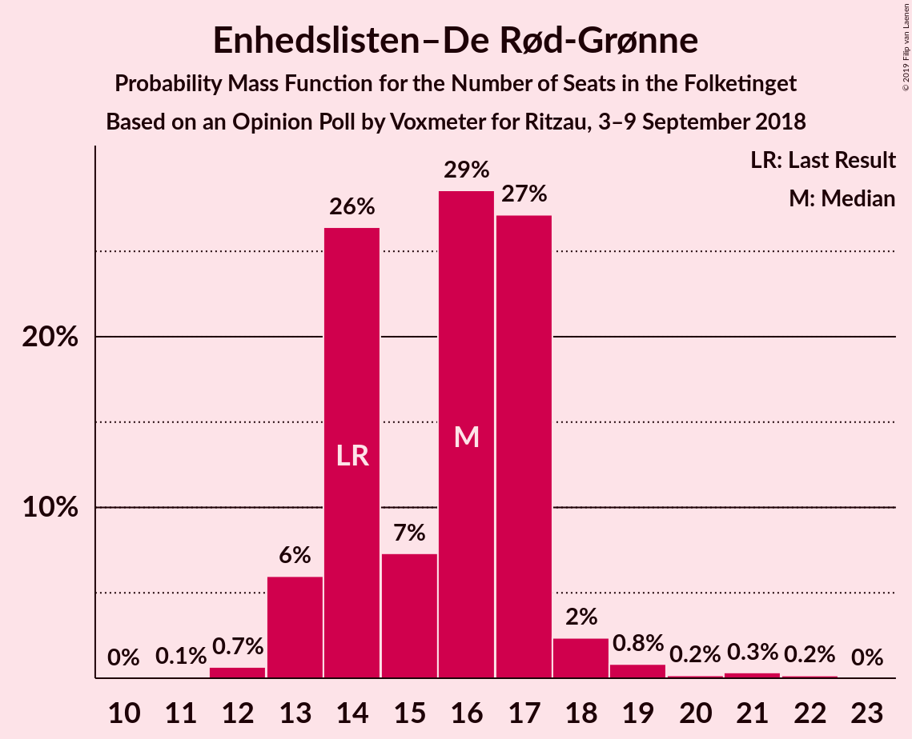

| Number of Seats | Probability | Accumulated | Special Marks |
|:---------------:|:-----------:|:-----------:|:-------------:|
| 11 | 0.1% | 100% |  |
| 12 | 0.7% | 99.9% |  |
| 13 | 6% | 99.3% |  |
| 14 | 26% | 93% | Last Result |
| 15 | 7% | 67% |  |
| 16 | 29% | 60% | Median |
| 17 | 27% | 31% |  |
| 18 | 2% | 4% |  |
| 19 | 0.8% | 1.5% |  |
| 20 | 0.2% | 0.7% |  |
| 21 | 0.3% | 0.5% |  |
| 22 | 0.2% | 0.2% |  |
| 23 | 0% | 0% |  |

### Liberal Alliance

*For a full overview of the results for this party, see the [Liberal Alliance](party-liberalalliance.html) page.*

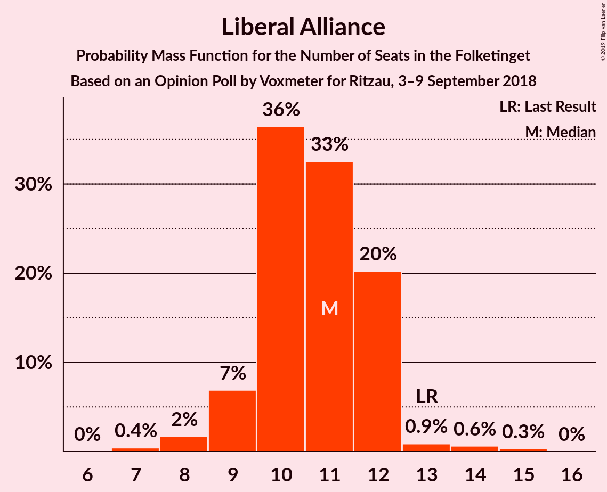

| Number of Seats | Probability | Accumulated | Special Marks |
|:---------------:|:-----------:|:-----------:|:-------------:|
| 7 | 0.4% | 100% |  |
| 8 | 2% | 99.6% |  |
| 9 | 7% | 98% |  |
| 10 | 36% | 91% |  |
| 11 | 33% | 55% | Median |
| 12 | 20% | 22% |  |
| 13 | 0.9% | 2% | Last Result |
| 14 | 0.6% | 1.0% |  |
| 15 | 0.3% | 0.3% |  |
| 16 | 0% | 0% |  |

### Alternativet

*For a full overview of the results for this party, see the [Alternativet](party-alternativet.html) page.*

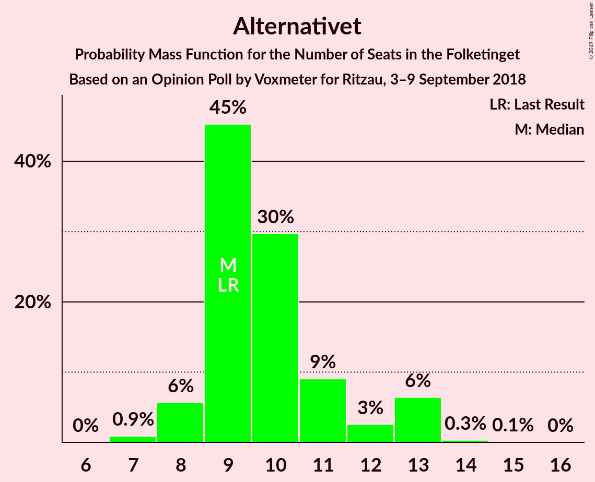

| Number of Seats | Probability | Accumulated | Special Marks |
|:---------------:|:-----------:|:-----------:|:-------------:|
| 7 | 0.9% | 100% |  |
| 8 | 6% | 99.1% |  |
| 9 | 45% | 93% | Last Result, Median |
| 10 | 30% | 48% |  |
| 11 | 9% | 18% |  |
| 12 | 3% | 9% |  |
| 13 | 6% | 7% |  |
| 14 | 0.3% | 0.4% |  |
| 15 | 0.1% | 0.1% |  |
| 16 | 0% | 0% |  |

### Radikale Venstre

*For a full overview of the results for this party, see the [Radikale Venstre](party-radikalevenstre.html) page.*

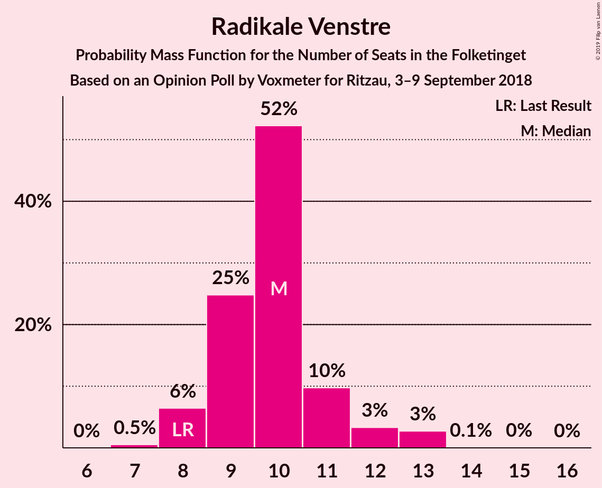

| Number of Seats | Probability | Accumulated | Special Marks |
|:---------------:|:-----------:|:-----------:|:-------------:|
| 7 | 0.5% | 100% |  |
| 8 | 6% | 99.4% | Last Result |
| 9 | 25% | 93% |  |
| 10 | 52% | 68% | Median |
| 11 | 10% | 16% |  |
| 12 | 3% | 6% |  |
| 13 | 3% | 3% |  |
| 14 | 0.1% | 0.2% |  |
| 15 | 0% | 0.1% |  |
| 16 | 0% | 0% |  |

### Socialistisk Folkeparti

*For a full overview of the results for this party, see the [Socialistisk Folkeparti](party-socialistiskfolkeparti.html) page.*

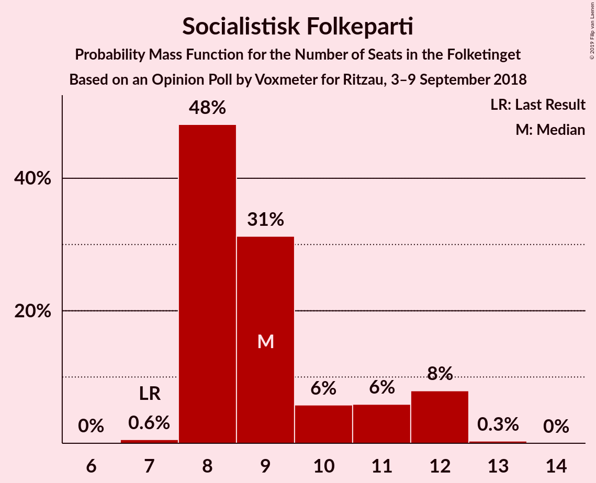

| Number of Seats | Probability | Accumulated | Special Marks |
|:---------------:|:-----------:|:-----------:|:-------------:|
| 6 | 0% | 100% |  |
| 7 | 0.6% | 99.9% | Last Result |
| 8 | 48% | 99.4% |  |
| 9 | 31% | 51% | Median |
| 10 | 6% | 20% |  |
| 11 | 6% | 14% |  |
| 12 | 8% | 8% |  |
| 13 | 0.3% | 0.4% |  |
| 14 | 0% | 0% |  |

### Det Konservative Folkeparti

*For a full overview of the results for this party, see the [Det Konservative Folkeparti](party-detkonservativefolkeparti.html) page.*

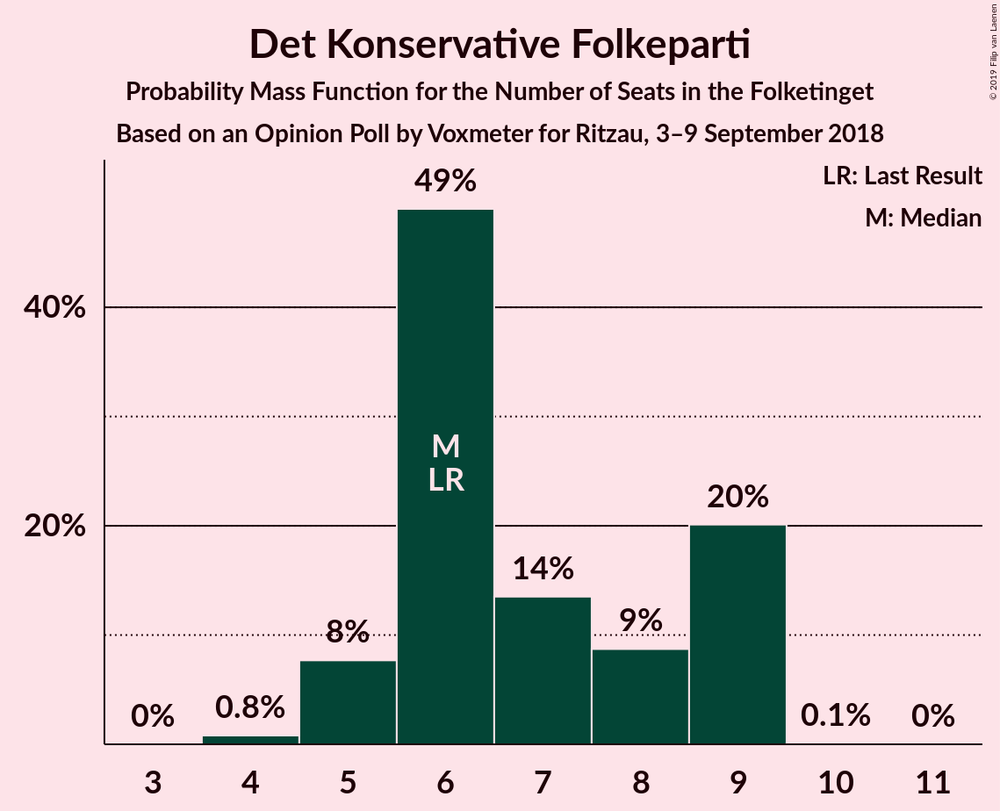

| Number of Seats | Probability | Accumulated | Special Marks |
|:---------------:|:-----------:|:-----------:|:-------------:|
| 4 | 0.8% | 100% |  |
| 5 | 8% | 99.2% |  |
| 6 | 49% | 91% | Last Result, Median |
| 7 | 14% | 42% |  |
| 8 | 9% | 29% |  |
| 9 | 20% | 20% |  |
| 10 | 0.1% | 0.1% |  |
| 11 | 0% | 0% |  |

### Nye Borgerlige

*For a full overview of the results for this party, see the [Nye Borgerlige](party-nyeborgerlige.html) page.*

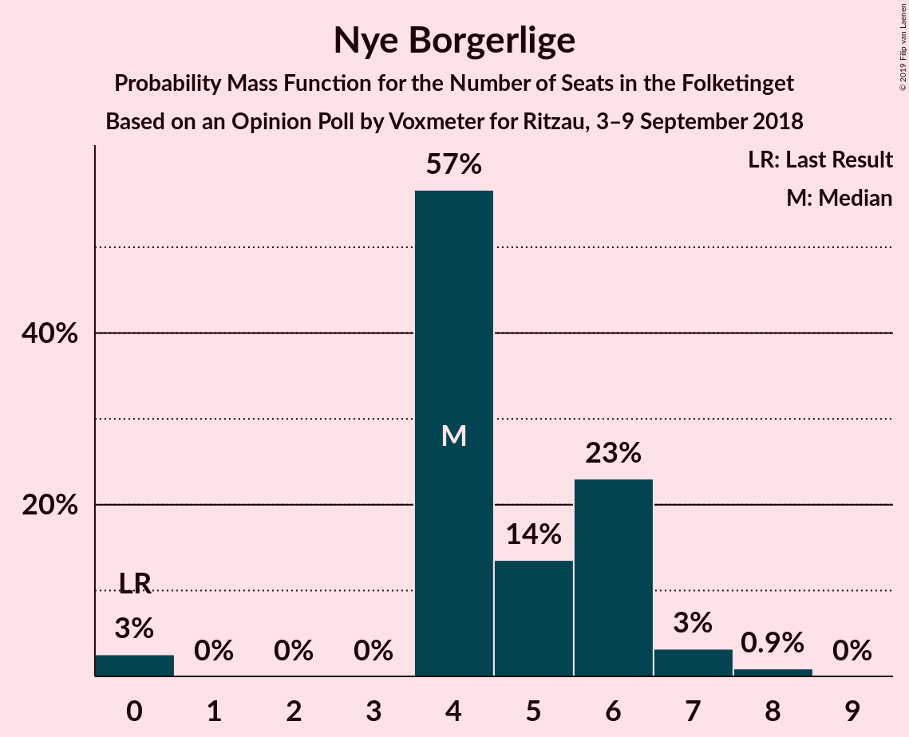

| Number of Seats | Probability | Accumulated | Special Marks |
|:---------------:|:-----------:|:-----------:|:-------------:|
| 0 | 3% | 100% | Last Result |
| 1 | 0% | 97% |  |
| 2 | 0% | 97% |  |
| 3 | 0% | 97% |  |
| 4 | 57% | 97% | Median |
| 5 | 14% | 41% |  |
| 6 | 23% | 27% |  |
| 7 | 3% | 4% |  |
| 8 | 0.9% | 0.9% |  |
| 9 | 0% | 0% |  |

### Kristendemokraterne

*For a full overview of the results for this party, see the [Kristendemokraterne](party-kristendemokraterne.html) page.*

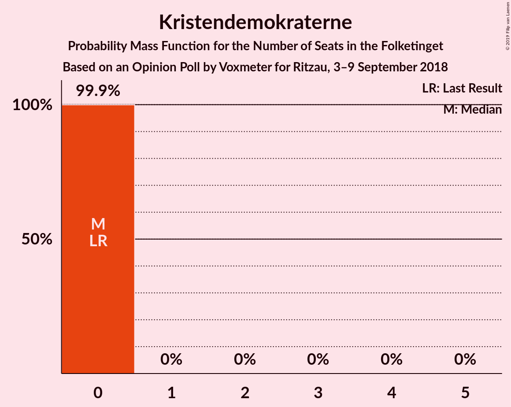

| Number of Seats | Probability | Accumulated | Special Marks |
|:---------------:|:-----------:|:-----------:|:-------------:|
| 0 | 99.9% | 100% | Last Result, Median |
| 1 | 0% | 0.1% |  |
| 2 | 0% | 0.1% |  |
| 3 | 0% | 0.1% |  |
| 4 | 0% | 0% |  |

## Coalitions

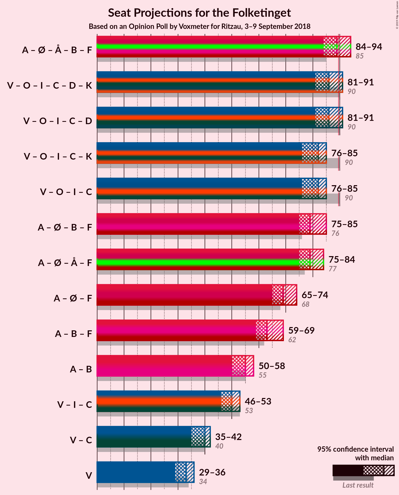

### Confidence Intervals

| Coalition | Last Result | Median | Majority? | 80% Confidence Interval | 90% Confidence Interval | 95% Confidence Interval | 99% Confidence Interval |
|:---------:|:-----------:|:------:|:---------:|:-----------------------:|:-----------------------:|:-----------------------:|:-----------------------:|
| Socialdemokraterne – Enhedslisten–De Rød-Grønne – Alternativet – Radikale Venstre – Socialistisk Folkeparti | 85 | 89 | 22% | 87–92 | 86–93 | 84–94 | 83–97 |
| Venstre – Dansk Folkeparti – Liberal Alliance – Det Konservative Folkeparti – Nye Borgerlige – Kristendemokraterne | 90 | 86 | 3% | 83–88 | 82–89 | 81–91 | 78–92 |
| Venstre – Dansk Folkeparti – Liberal Alliance – Det Konservative Folkeparti – Nye Borgerlige | 90 | 86 | 3% | 83–88 | 82–89 | 81–91 | 78–92 |
| Venstre – Dansk Folkeparti – Liberal Alliance – Det Konservative Folkeparti – Kristendemokraterne | 90 | 82 | 0.1% | 78–83 | 77–84 | 76–85 | 74–87 |
| Venstre – Dansk Folkeparti – Liberal Alliance – Det Konservative Folkeparti | 90 | 82 | 0.1% | 78–83 | 77–84 | 76–85 | 74–87 |
| Socialdemokraterne – Enhedslisten–De Rød-Grønne – Radikale Venstre – Socialistisk Folkeparti | 76 | 79 | 0% | 77–81 | 76–84 | 75–85 | 71–86 |
| Socialdemokraterne – Enhedslisten–De Rød-Grønne – Alternativet – Socialistisk Folkeparti | 77 | 79 | 0% | 78–82 | 76–83 | 75–84 | 73–86 |
| Socialdemokraterne – Enhedslisten–De Rød-Grønne – Socialistisk Folkeparti | 68 | 69 | 0% | 68–71 | 67–73 | 65–74 | 62–76 |
| Socialdemokraterne – Radikale Venstre – Socialistisk Folkeparti | 62 | 63 | 0% | 63–66 | 61–68 | 59–69 | 57–69 |
| Socialdemokraterne – Radikale Venstre | 55 | 55 | 0% | 52–57 | 51–58 | 50–58 | 48–60 |
| Venstre – Liberal Alliance – Det Konservative Folkeparti | 53 | 50 | 0% | 48–52 | 46–52 | 46–53 | 43–54 |
| Venstre – Det Konservative Folkeparti | 40 | 40 | 0% | 37–41 | 36–41 | 35–42 | 33–45 |
| Venstre | 34 | 33 | 0% | 31–34 | 29–35 | 29–36 | 27–37 |

### Socialdemokraterne – Enhedslisten–De Rød-Grønne – Alternativet – Radikale Venstre – Socialistisk Folkeparti

| Number of Seats | Probability | Accumulated | Special Marks |
|:---------------:|:-----------:|:-----------:|:-------------:|
| 80 | 0% | 100% |  |
| 81 | 0% | 99.9% |  |
| 82 | 0.2% | 99.9% |  |
| 83 | 2% | 99.7% |  |
| 84 | 2% | 98% |  |
| 85 | 0.2% | 97% | Last Result |
| 86 | 4% | 97% |  |
| 87 | 20% | 93% |  |
| 88 | 1.2% | 73% |  |
| 89 | 49% | 72% | Median |
| 90 | 4% | 22% | Majority |
| 91 | 2% | 18% |  |
| 92 | 8% | 16% |  |
| 93 | 5% | 8% |  |
| 94 | 0.7% | 3% |  |
| 95 | 0.5% | 2% |  |
| 96 | 0.5% | 2% |  |
| 97 | 1.2% | 1.3% |  |
| 98 | 0% | 0.1% |  |
| 99 | 0% | 0% |  |

### Venstre – Dansk Folkeparti – Liberal Alliance – Det Konservative Folkeparti – Nye Borgerlige – Kristendemokraterne

| Number of Seats | Probability | Accumulated | Special Marks |
|:---------------:|:-----------:|:-----------:|:-------------:|
| 77 | 0% | 100% |  |
| 78 | 1.2% | 99.9% |  |
| 79 | 0.5% | 98.7% |  |
| 80 | 0.5% | 98% |  |
| 81 | 0.7% | 98% |  |
| 82 | 5% | 97% |  |
| 83 | 8% | 92% |  |
| 84 | 2% | 84% |  |
| 85 | 4% | 82% | Median |
| 86 | 49% | 78% |  |
| 87 | 1.2% | 28% |  |
| 88 | 20% | 27% |  |
| 89 | 4% | 7% |  |
| 90 | 0.2% | 3% | Last Result, Majority |
| 91 | 2% | 3% |  |
| 92 | 2% | 2% |  |
| 93 | 0.2% | 0.3% |  |
| 94 | 0% | 0.1% |  |
| 95 | 0% | 0.1% |  |
| 96 | 0% | 0% |  |

### Venstre – Dansk Folkeparti – Liberal Alliance – Det Konservative Folkeparti – Nye Borgerlige

| Number of Seats | Probability | Accumulated | Special Marks |
|:---------------:|:-----------:|:-----------:|:-------------:|
| 77 | 0.1% | 100% |  |
| 78 | 1.2% | 99.9% |  |
| 79 | 0.5% | 98.7% |  |
| 80 | 0.5% | 98% |  |
| 81 | 0.7% | 98% |  |
| 82 | 5% | 97% |  |
| 83 | 8% | 92% |  |
| 84 | 2% | 84% |  |
| 85 | 4% | 82% | Median |
| 86 | 49% | 78% |  |
| 87 | 1.2% | 28% |  |
| 88 | 20% | 27% |  |
| 89 | 4% | 7% |  |
| 90 | 0.2% | 3% | Last Result, Majority |
| 91 | 2% | 3% |  |
| 92 | 1.5% | 2% |  |
| 93 | 0.2% | 0.3% |  |
| 94 | 0% | 0.1% |  |
| 95 | 0% | 0.1% |  |
| 96 | 0% | 0% |  |

### Venstre – Dansk Folkeparti – Liberal Alliance – Det Konservative Folkeparti – Kristendemokraterne

| Number of Seats | Probability | Accumulated | Special Marks |
|:---------------:|:-----------:|:-----------:|:-------------:|
| 73 | 0.1% | 100% |  |
| 74 | 2% | 99.9% |  |
| 75 | 0.2% | 98% |  |
| 76 | 1.0% | 98% |  |
| 77 | 3% | 97% |  |
| 78 | 6% | 94% |  |
| 79 | 7% | 88% |  |
| 80 | 3% | 81% |  |
| 81 | 4% | 78% | Median |
| 82 | 64% | 74% |  |
| 83 | 2% | 11% |  |
| 84 | 5% | 8% |  |
| 85 | 2% | 4% |  |
| 86 | 0.4% | 2% |  |
| 87 | 1.1% | 2% |  |
| 88 | 0.4% | 0.5% |  |
| 89 | 0% | 0.1% |  |
| 90 | 0% | 0.1% | Last Result, Majority |
| 91 | 0% | 0% |  |

### Venstre – Dansk Folkeparti – Liberal Alliance – Det Konservative Folkeparti

| Number of Seats | Probability | Accumulated | Special Marks |
|:---------------:|:-----------:|:-----------:|:-------------:|
| 73 | 0.1% | 100% |  |
| 74 | 2% | 99.9% |  |
| 75 | 0.2% | 98% |  |
| 76 | 1.0% | 98% |  |
| 77 | 3% | 97% |  |
| 78 | 6% | 94% |  |
| 79 | 7% | 88% |  |
| 80 | 3% | 81% |  |
| 81 | 4% | 78% | Median |
| 82 | 64% | 74% |  |
| 83 | 2% | 11% |  |
| 84 | 5% | 8% |  |
| 85 | 2% | 4% |  |
| 86 | 0.4% | 2% |  |
| 87 | 1.1% | 2% |  |
| 88 | 0.4% | 0.5% |  |
| 89 | 0% | 0.1% |  |
| 90 | 0% | 0.1% | Last Result, Majority |
| 91 | 0% | 0% |  |

### Socialdemokraterne – Enhedslisten–De Rød-Grønne – Radikale Venstre – Socialistisk Folkeparti

| Number of Seats | Probability | Accumulated | Special Marks |
|:---------------:|:-----------:|:-----------:|:-------------:|
| 70 | 0.1% | 100% |  |
| 71 | 0.4% | 99.8% |  |
| 72 | 0.1% | 99.5% |  |
| 73 | 1.0% | 99.4% |  |
| 74 | 0.6% | 98% |  |
| 75 | 2% | 98% |  |
| 76 | 1.0% | 96% | Last Result |
| 77 | 5% | 95% |  |
| 78 | 16% | 90% |  |
| 79 | 36% | 74% |  |
| 80 | 27% | 38% | Median |
| 81 | 2% | 11% |  |
| 82 | 3% | 10% |  |
| 83 | 0.5% | 6% |  |
| 84 | 3% | 6% |  |
| 85 | 1.4% | 3% |  |
| 86 | 1.5% | 2% |  |
| 87 | 0.1% | 0.2% |  |
| 88 | 0% | 0% |  |

### Socialdemokraterne – Enhedslisten–De Rød-Grønne – Alternativet – Socialistisk Folkeparti

| Number of Seats | Probability | Accumulated | Special Marks |
|:---------------:|:-----------:|:-----------:|:-------------:|
| 71 | 0.1% | 100% |  |
| 72 | 0.1% | 99.9% |  |
| 73 | 0.9% | 99.8% |  |
| 74 | 1.2% | 98.9% |  |
| 75 | 1.2% | 98% |  |
| 76 | 4% | 96% |  |
| 77 | 2% | 93% | Last Result |
| 78 | 26% | 91% |  |
| 79 | 45% | 66% | Median |
| 80 | 3% | 21% |  |
| 81 | 2% | 18% |  |
| 82 | 7% | 16% |  |
| 83 | 4% | 9% |  |
| 84 | 3% | 5% |  |
| 85 | 0.8% | 2% |  |
| 86 | 0.3% | 0.8% |  |
| 87 | 0.3% | 0.5% |  |
| 88 | 0.1% | 0.1% |  |
| 89 | 0.1% | 0.1% |  |
| 90 | 0% | 0% | Majority |

### Socialdemokraterne – Enhedslisten–De Rød-Grønne – Socialistisk Folkeparti

| Number of Seats | Probability | Accumulated | Special Marks |
|:---------------:|:-----------:|:-----------:|:-------------:|
| 61 | 0.5% | 100% |  |
| 62 | 0.1% | 99.5% |  |
| 63 | 0.1% | 99.4% |  |
| 64 | 0.7% | 99.3% |  |
| 65 | 2% | 98.6% |  |
| 66 | 0.8% | 96% |  |
| 67 | 4% | 95% |  |
| 68 | 10% | 92% | Last Result |
| 69 | 40% | 82% |  |
| 70 | 30% | 41% | Median |
| 71 | 3% | 12% |  |
| 72 | 0.8% | 9% |  |
| 73 | 4% | 8% |  |
| 74 | 3% | 5% |  |
| 75 | 0.6% | 1.4% |  |
| 76 | 0.6% | 0.9% |  |
| 77 | 0.2% | 0.3% |  |
| 78 | 0.1% | 0.1% |  |
| 79 | 0% | 0% |  |

### Socialdemokraterne – Radikale Venstre – Socialistisk Folkeparti

| Number of Seats | Probability | Accumulated | Special Marks |
|:---------------:|:-----------:|:-----------:|:-------------:|
| 55 | 0.2% | 100% |  |
| 56 | 0.1% | 99.8% |  |
| 57 | 0.4% | 99.7% |  |
| 58 | 2% | 99.3% |  |
| 59 | 0.9% | 98% |  |
| 60 | 2% | 97% |  |
| 61 | 0.9% | 95% |  |
| 62 | 4% | 94% | Last Result |
| 63 | 49% | 91% |  |
| 64 | 18% | 42% | Median |
| 65 | 11% | 24% |  |
| 66 | 6% | 13% |  |
| 67 | 1.1% | 7% |  |
| 68 | 3% | 6% |  |
| 69 | 2% | 3% |  |
| 70 | 0.1% | 0.4% |  |
| 71 | 0.2% | 0.3% |  |
| 72 | 0.1% | 0.2% |  |
| 73 | 0.1% | 0.1% |  |
| 74 | 0% | 0% |  |

### Socialdemokraterne – Radikale Venstre

| Number of Seats | Probability | Accumulated | Special Marks |
|:---------------:|:-----------:|:-----------:|:-------------:|
| 45 | 0.1% | 100% |  |
| 46 | 0% | 99.9% |  |
| 47 | 0.2% | 99.8% |  |
| 48 | 0.7% | 99.6% |  |
| 49 | 0.6% | 98.9% |  |
| 50 | 2% | 98% |  |
| 51 | 4% | 97% |  |
| 52 | 4% | 93% |  |
| 53 | 7% | 89% |  |
| 54 | 22% | 83% |  |
| 55 | 25% | 60% | Last Result, Median |
| 56 | 25% | 36% |  |
| 57 | 4% | 11% |  |
| 58 | 4% | 6% |  |
| 59 | 0.7% | 2% |  |
| 60 | 1.4% | 2% |  |
| 61 | 0.2% | 0.3% |  |
| 62 | 0.1% | 0.2% |  |
| 63 | 0% | 0% |  |

### Venstre – Liberal Alliance – Det Konservative Folkeparti

| Number of Seats | Probability | Accumulated | Special Marks |
|:---------------:|:-----------:|:-----------:|:-------------:|
| 42 | 0.2% | 100% |  |
| 43 | 0.4% | 99.8% |  |
| 44 | 0.9% | 99.4% |  |
| 45 | 0.9% | 98% |  |
| 46 | 3% | 98% |  |
| 47 | 2% | 94% |  |
| 48 | 9% | 92% |  |
| 49 | 6% | 83% |  |
| 50 | 28% | 76% | Median |
| 51 | 29% | 49% |  |
| 52 | 16% | 19% |  |
| 53 | 2% | 4% | Last Result |
| 54 | 1.5% | 2% |  |
| 55 | 0.3% | 0.4% |  |
| 56 | 0.1% | 0.1% |  |
| 57 | 0% | 0.1% |  |
| 58 | 0% | 0% |  |

### Venstre – Det Konservative Folkeparti

| Number of Seats | Probability | Accumulated | Special Marks |
|:---------------:|:-----------:|:-----------:|:-------------:|
| 31 | 0% | 100% |  |
| 32 | 0.1% | 99.9% |  |
| 33 | 0.5% | 99.9% |  |
| 34 | 1.2% | 99.4% |  |
| 35 | 1.3% | 98% |  |
| 36 | 3% | 97% |  |
| 37 | 9% | 94% |  |
| 38 | 8% | 85% |  |
| 39 | 4% | 77% | Median |
| 40 | 58% | 72% | Last Result |
| 41 | 10% | 15% |  |
| 42 | 3% | 5% |  |
| 43 | 0.6% | 2% |  |
| 44 | 0.3% | 1.2% |  |
| 45 | 0.7% | 0.9% |  |
| 46 | 0.1% | 0.1% |  |
| 47 | 0% | 0% |  |

### Venstre

| Number of Seats | Probability | Accumulated | Special Marks |
|:---------------:|:-----------:|:-----------:|:-------------:|
| 26 | 0.2% | 100% |  |
| 27 | 0.6% | 99.8% |  |
| 28 | 2% | 99.2% |  |
| 29 | 3% | 98% |  |
| 30 | 3% | 95% |  |
| 31 | 26% | 91% |  |
| 32 | 10% | 65% |  |
| 33 | 6% | 55% | Median |
| 34 | 44% | 50% | Last Result |
| 35 | 1.1% | 5% |  |
| 36 | 3% | 4% |  |
| 37 | 0.8% | 1.1% |  |
| 38 | 0.3% | 0.4% |  |
| 39 | 0% | 0% |  |

## Technical Information

### Opinion Poll

+ **Polling firm:** Voxmeter
+ **Commissioner(s):** Ritzau
+ **Fieldwork period:** 3–9 September 2018

### Calculations

+ **Sample size:** 1043
+ **Simulations done:** 1,048,576
+ **Error estimate:** 1.68%

