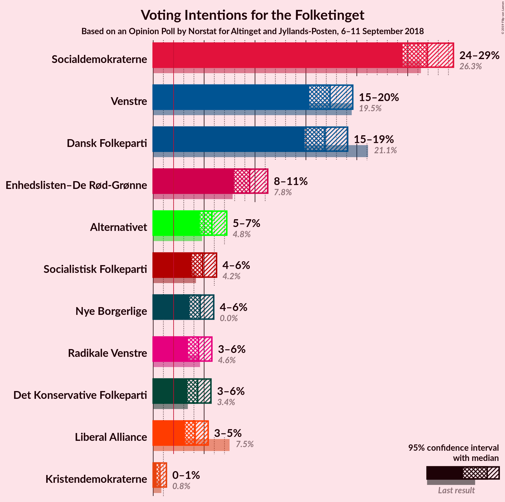
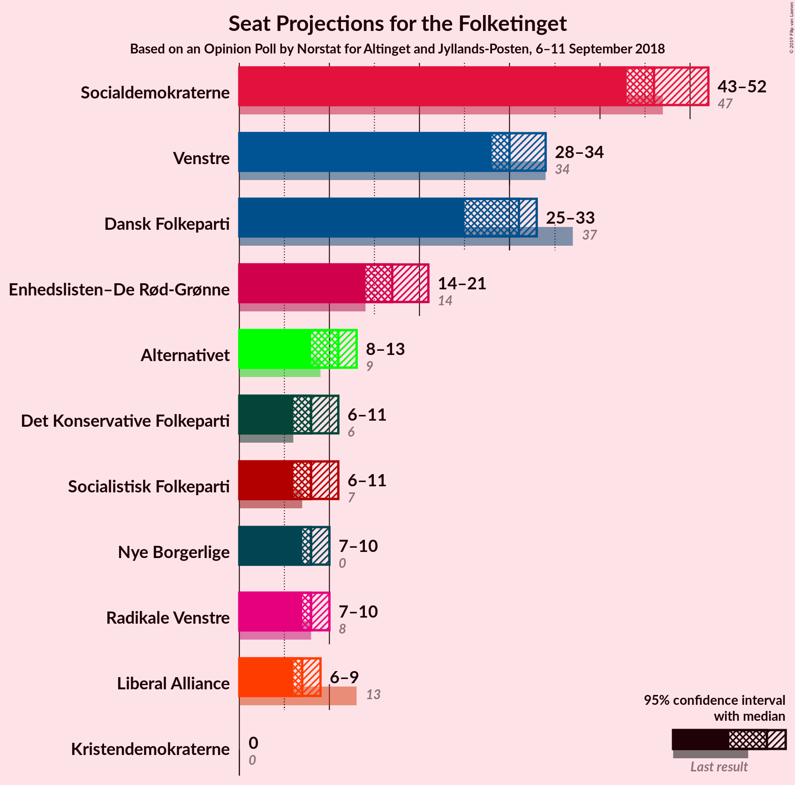
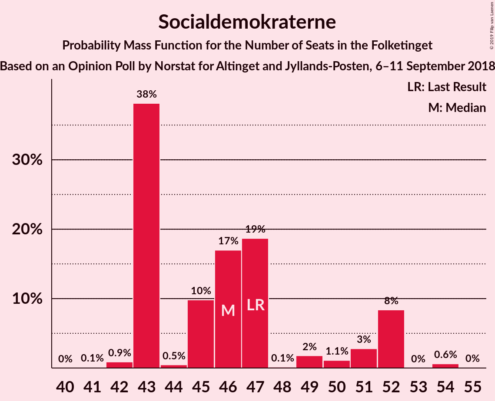
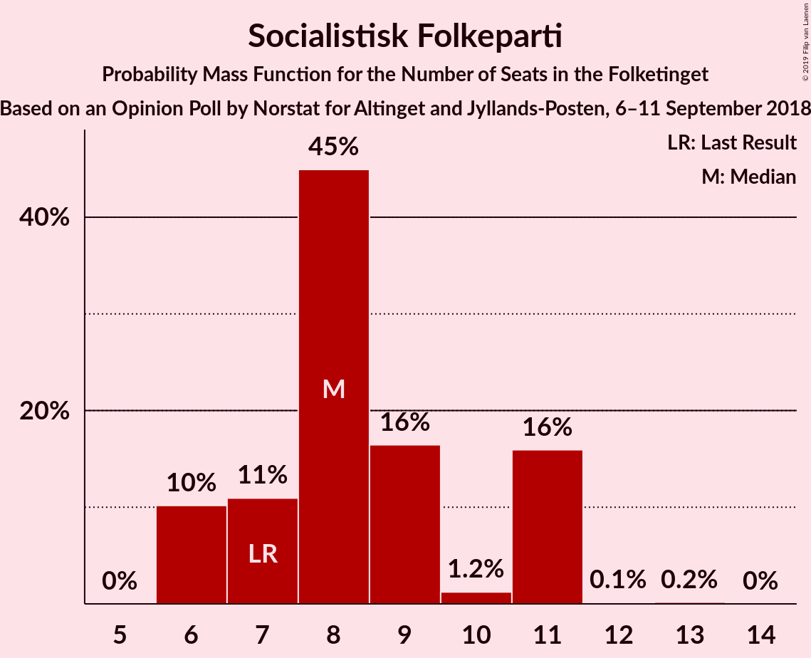
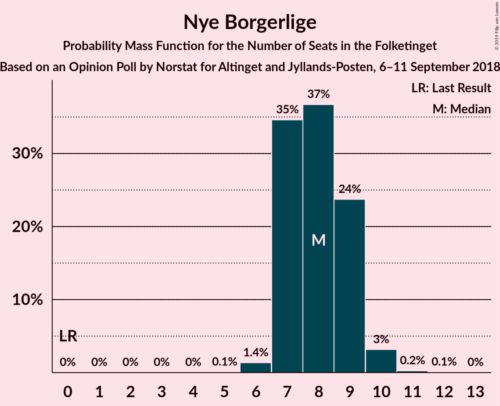
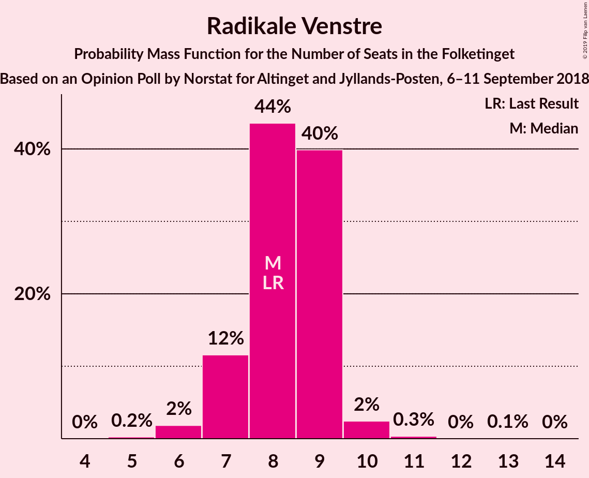
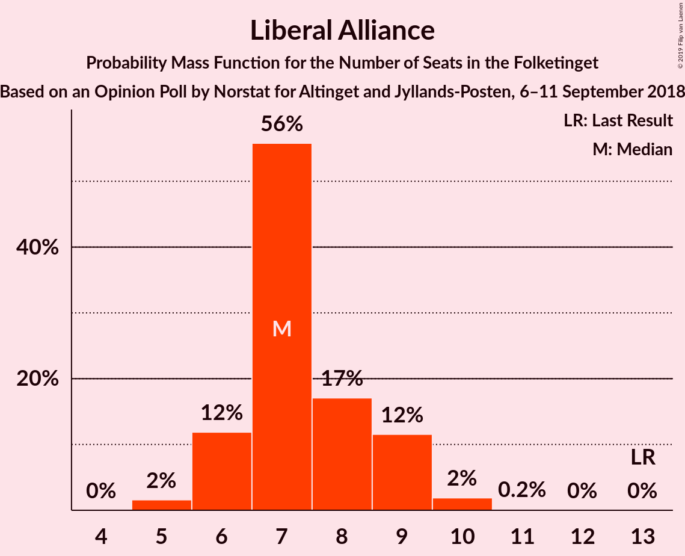
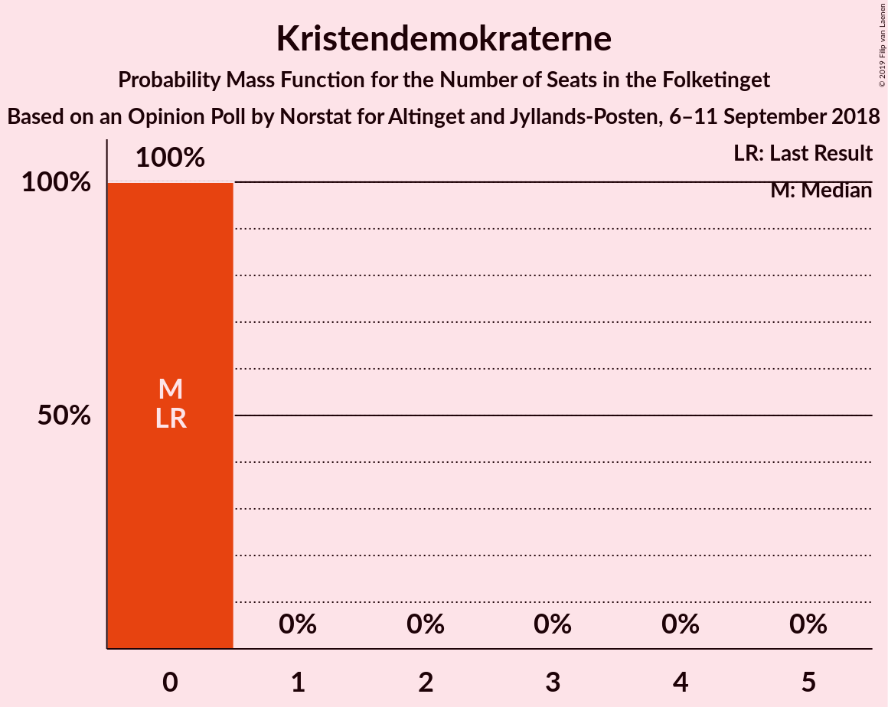

# Opinion Poll by Norstat for Altinget and Jyllands-Posten, 6–11 September 2018

<a href="#voting-intentions">Voting Intentions</a> | <a href="#seats">Seats</a> | <a href="#coalitions">Coalitions</a> | <a href="#technical-information">Technical Information</a>

## Voting Intentions

### Confidence Intervals

| Party | Last Result | Poll Result | 80% Confidence Interval | 90% Confidence Interval | 95% Confidence Interval | 99% Confidence Interval |
|:-----:|:-----------:|:-----------:|:-----------------------:|:-----------------------:|:-----------------------:|:-----------------------:|
| Socialdemokraterne | 26.3% | 26.9% | 25.3–28.6% |24.9–29.1% |24.5–29.5% |23.7–30.3% |
| Venstre | 19.5% | 17.4% | 16.0–18.8% |15.7–19.3% |15.3–19.6% |14.7–20.3% |
| Dansk Folkeparti | 21.1% | 16.9% | 15.6–18.3% |15.2–18.7% |14.9–19.1% |14.3–19.8% |
| Enhedslisten–De Rød-Grønne | 7.8% | 9.5% | 8.5–10.6% |8.2–11.0% |7.9–11.2% |7.5–11.8% |
| Alternativet | 4.8% | 5.8% | 5.0–6.7% |4.8–7.0% |4.6–7.2% |4.2–7.7% |
| Socialistisk Folkeparti | 4.2% | 4.9% | 4.1–5.7% |3.9–6.0% |3.8–6.2% |3.5–6.7% |
| Nye Borgerlige | 0.0% | 4.6% | 3.9–5.5% |3.7–5.7% |3.6–5.9% |3.3–6.4% |
| Radikale Venstre | 4.6% | 4.4% | 3.8–5.3% |3.6–5.5% |3.4–5.8% |3.1–6.2% |
| Det Konservative Folkeparti | 3.4% | 4.4% | 3.7–5.2% |3.5–5.5% |3.4–5.7% |3.0–6.1% |
| Liberal Alliance | 7.5% | 4.1% | 3.5–5.0% |3.3–5.2% |3.1–5.4% |2.9–5.8% |
| Kristendemokraterne | 0.8% | 0.7% | 0.4–1.1% |0.4–1.2% |0.3–1.3% |0.2–1.5% |

*Note:* The poll result column reflects the actual value used in the calculations. Published results may vary slightly, and in addition be rounded to fewer digits.

## Seats

### Confidence Intervals

| Party | Last Result | Median | 80% Confidence Interval | 90% Confidence Interval | 95% Confidence Interval | 99% Confidence Interval |
|:-----:|:-----------:|:------:|:-----------------------:|:-----------------------:|:-----------------------:|:-----------------------:|
| <a href="#socialdemokraterne">Socialdemokraterne</a> | 47 | 46 | 43–51 |43–52 |43–52 |42–54 |
| <a href="#venstre">Venstre</a> | 34 | 30 | 28–34 |28–34 |28–34 |27–36 |
| <a href="#dansk-folkeparti">Dansk Folkeparti</a> | 37 | 31 | 28–33 |26–33 |25–33 |25–35 |
| <a href="#enhedslisten–de-rød-grønne">Enhedslisten–De Rød-Grønne</a> | 14 | 17 | 14–20 |14–20 |14–21 |14–22 |
| <a href="#alternativet">Alternativet</a> | 9 | 11 | 8–13 |8–13 |8–13 |8–14 |
| <a href="#socialistisk-folkeparti">Socialistisk Folkeparti</a> | 7 | 8 | 6–11 |6–11 |6–11 |6–11 |
| <a href="#nye-borgerlige">Nye Borgerlige</a> | 0 | 8 | 7–9 |7–9 |7–10 |6–10 |
| <a href="#radikale-venstre">Radikale Venstre</a> | 8 | 8 | 7–9 |7–9 |7–10 |6–10 |
| <a href="#det-konservative-folkeparti">Det Konservative Folkeparti</a> | 6 | 8 | 7–9 |7–9 |6–11 |5–11 |
| <a href="#liberal-alliance">Liberal Alliance</a> | 13 | 7 | 6–9 |6–9 |6–9 |5–10 |
| <a href="#kristendemokraterne">Kristendemokraterne</a> | 0 | 0 | 0 |0 |0 |0 |

### Socialdemokraterne

*For a full overview of the results for this party, see the [Socialdemokraterne](party-socialdemokraterne.html) page.*

| Number of Seats | Probability | Accumulated | Special Marks |
|:---------------:|:-----------:|:-----------:|:-------------:|
| 41 | 0.1% | 100% |  |
| 42 | 0.9% | 99.9% |  |
| 43 | 38% | 99.0% |  |
| 44 | 0.5% | 61% |  |
| 45 | 10% | 60% |  |
| 46 | 17% | 51% | Median |
| 47 | 19% | 34% | Last Result |
| 48 | 0.1% | 15% |  |
| 49 | 2% | 15% |  |
| 50 | 1.1% | 13% |  |
| 51 | 3% | 12% |  |
| 52 | 8% | 9% |  |
| 53 | 0% | 0.7% |  |
| 54 | 0.6% | 0.7% |  |
| 55 | 0% | 0% |  |

### Venstre

*For a full overview of the results for this party, see the [Venstre](party-venstre.html) page.*

| Number of Seats | Probability | Accumulated | Special Marks |
|:---------------:|:-----------:|:-----------:|:-------------:|
| 25 | 0.1% | 100% |  |
| 26 | 0.2% | 99.9% |  |
| 27 | 2% | 99.7% |  |
| 28 | 9% | 98% |  |
| 29 | 0.5% | 89% |  |
| 30 | 44% | 88% | Median |
| 31 | 10% | 44% |  |
| 32 | 2% | 34% |  |
| 33 | 11% | 32% |  |
| 34 | 19% | 21% | Last Result |
| 35 | 0.9% | 2% |  |
| 36 | 1.1% | 1.3% |  |
| 37 | 0% | 0.2% |  |
| 38 | 0.2% | 0.2% |  |
| 39 | 0% | 0% |  |

### Dansk Folkeparti

*For a full overview of the results for this party, see the [Dansk Folkeparti](party-danskfolkeparti.html) page.*

| Number of Seats | Probability | Accumulated | Special Marks |
|:---------------:|:-----------:|:-----------:|:-------------:|
| 23 | 0.1% | 100% |  |
| 24 | 0.2% | 99.9% |  |
| 25 | 3% | 99.8% |  |
| 26 | 4% | 97% |  |
| 27 | 1.2% | 93% |  |
| 28 | 4% | 92% |  |
| 29 | 21% | 88% |  |
| 30 | 1.4% | 67% |  |
| 31 | 43% | 66% | Median |
| 32 | 6% | 23% |  |
| 33 | 16% | 17% |  |
| 34 | 0.2% | 0.8% |  |
| 35 | 0.6% | 0.6% |  |
| 36 | 0% | 0% |  |
| 37 | 0% | 0% | Last Result |

### Enhedslisten–De Rød-Grønne

*For a full overview of the results for this party, see the [Enhedslisten–De Rød-Grønne](party-enhedslisten–derød-grønne.html) page.*

| Number of Seats | Probability | Accumulated | Special Marks |
|:---------------:|:-----------:|:-----------:|:-------------:|
| 13 | 0.3% | 100% |  |
| 14 | 11% | 99.6% | Last Result |
| 15 | 18% | 89% |  |
| 16 | 13% | 71% |  |
| 17 | 16% | 58% | Median |
| 18 | 14% | 42% |  |
| 19 | 2% | 28% |  |
| 20 | 23% | 26% |  |
| 21 | 0.7% | 3% |  |
| 22 | 2% | 2% |  |
| 23 | 0% | 0% |  |

### Alternativet

*For a full overview of the results for this party, see the [Alternativet](party-alternativet.html) page.*

| Number of Seats | Probability | Accumulated | Special Marks |
|:---------------:|:-----------:|:-----------:|:-------------:|
| 7 | 0.1% | 100% |  |
| 8 | 27% | 99.9% |  |
| 9 | 2% | 73% | Last Result |
| 10 | 15% | 71% |  |
| 11 | 10% | 55% | Median |
| 12 | 34% | 45% |  |
| 13 | 9% | 12% |  |
| 14 | 2% | 2% |  |
| 15 | 0% | 0% |  |

### Socialistisk Folkeparti

*For a full overview of the results for this party, see the [Socialistisk Folkeparti](party-socialistiskfolkeparti.html) page.*

| Number of Seats | Probability | Accumulated | Special Marks |
|:---------------:|:-----------:|:-----------:|:-------------:|
| 6 | 10% | 100% |  |
| 7 | 11% | 90% | Last Result |
| 8 | 45% | 79% | Median |
| 9 | 16% | 34% |  |
| 10 | 1.2% | 17% |  |
| 11 | 16% | 16% |  |
| 12 | 0.1% | 0.3% |  |
| 13 | 0.2% | 0.2% |  |
| 14 | 0% | 0% |  |

### Nye Borgerlige

*For a full overview of the results for this party, see the [Nye Borgerlige](party-nyeborgerlige.html) page.*

| Number of Seats | Probability | Accumulated | Special Marks |
|:---------------:|:-----------:|:-----------:|:-------------:|
| 0 | 0% | 100% | Last Result |
| 1 | 0% | 100% |  |
| 2 | 0% | 100% |  |
| 3 | 0% | 100% |  |
| 4 | 0% | 100% |  |
| 5 | 0.1% | 100% |  |
| 6 | 1.4% | 99.9% |  |
| 7 | 35% | 98.6% |  |
| 8 | 37% | 64% | Median |
| 9 | 24% | 27% |  |
| 10 | 3% | 4% |  |
| 11 | 0.2% | 0.4% |  |
| 12 | 0.1% | 0.1% |  |
| 13 | 0% | 0% |  |

### Radikale Venstre

*For a full overview of the results for this party, see the [Radikale Venstre](party-radikalevenstre.html) page.*

| Number of Seats | Probability | Accumulated | Special Marks |
|:---------------:|:-----------:|:-----------:|:-------------:|
| 5 | 0.2% | 100% |  |
| 6 | 2% | 99.7% |  |
| 7 | 12% | 98% |  |
| 8 | 44% | 86% | Last Result, Median |
| 9 | 40% | 43% |  |
| 10 | 2% | 3% |  |
| 11 | 0.3% | 0.4% |  |
| 12 | 0% | 0.1% |  |
| 13 | 0.1% | 0.1% |  |
| 14 | 0% | 0% |  |

### Det Konservative Folkeparti

*For a full overview of the results for this party, see the [Det Konservative Folkeparti](party-detkonservativefolkeparti.html) page.*

| Number of Seats | Probability | Accumulated | Special Marks |
|:---------------:|:-----------:|:-----------:|:-------------:|
| 5 | 2% | 100% |  |
| 6 | 1.3% | 98% | Last Result |
| 7 | 13% | 97% |  |
| 8 | 61% | 84% | Median |
| 9 | 18% | 23% |  |
| 10 | 1.3% | 5% |  |
| 11 | 3% | 3% |  |
| 12 | 0.1% | 0.1% |  |
| 13 | 0% | 0% |  |

### Liberal Alliance

*For a full overview of the results for this party, see the [Liberal Alliance](party-liberalalliance.html) page.*

| Number of Seats | Probability | Accumulated | Special Marks |
|:---------------:|:-----------:|:-----------:|:-------------:|
| 5 | 2% | 100% |  |
| 6 | 12% | 98% |  |
| 7 | 56% | 87% | Median |
| 8 | 17% | 31% |  |
| 9 | 12% | 14% |  |
| 10 | 2% | 2% |  |
| 11 | 0.2% | 0.2% |  |
| 12 | 0% | 0% |  |
| 13 | 0% | 0% | Last Result |

### Kristendemokraterne

*For a full overview of the results for this party, see the [Kristendemokraterne](party-kristendemokraterne.html) page.*

| Number of Seats | Probability | Accumulated | Special Marks |
|:---------------:|:-----------:|:-----------:|:-------------:|
| 0 | 100% | 100% | Last Result, Median |

## Coalitions

### Confidence Intervals

| Coalition | Last Result | Median | Majority? | 80% Confidence Interval | 90% Confidence Interval | 95% Confidence Interval | 99% Confidence Interval |
|:---------:|:-----------:|:------:|:---------:|:-----------------------:|:-----------------------:|:-----------------------:|:-----------------------:|
| Socialdemokraterne – Enhedslisten–De Rød-Grønne – Alternativet – Socialistisk Folkeparti – Radikale Venstre | 85 | 90 | 62% | 87–92 | 87–94 | 87–95 | 85–99 |
| Venstre – Dansk Folkeparti – Nye Borgerlige – Det Konservative Folkeparti – Liberal Alliance – Kristendemokraterne | 90 | 85 | 2% | 83–88 | 81–88 | 80–88 | 76–90 |
| Venstre – Dansk Folkeparti – Nye Borgerlige – Det Konservative Folkeparti – Liberal Alliance | 90 | 85 | 2% | 83–88 | 81–88 | 80–88 | 76–90 |
| Socialdemokraterne – Enhedslisten–De Rød-Grønne – Alternativet – Socialistisk Folkeparti | 77 | 82 | 0.9% | 78–83 | 78–86 | 78–87 | 77–91 |
| Socialdemokraterne – Enhedslisten–De Rød-Grønne – Socialistisk Folkeparti – Radikale Venstre | 76 | 79 | 0% | 77–82 | 76–84 | 76–84 | 75–85 |
| Venstre – Dansk Folkeparti – Det Konservative Folkeparti – Liberal Alliance – Kristendemokraterne | 90 | 78 | 0% | 74–81 | 72–81 | 71–81 | 69–81 |
| Venstre – Dansk Folkeparti – Det Konservative Folkeparti – Liberal Alliance | 90 | 78 | 0% | 74–81 | 72–81 | 71–81 | 69–81 |
| Socialdemokraterne – Enhedslisten–De Rød-Grønne – Socialistisk Folkeparti | 68 | 71 | 0% | 68–74 | 67–76 | 67–76 | 67–78 |
| Socialdemokraterne – Socialistisk Folkeparti – Radikale Venstre | 62 | 62 | 0% | 59–67 | 59–67 | 59–67 | 58–70 |
| Socialdemokraterne – Radikale Venstre | 55 | 54 | 0% | 51–59 | 51–61 | 51–61 | 50–63 |
| Venstre – Det Konservative Folkeparti – Liberal Alliance | 53 | 46 | 0% | 43–50 | 43–50 | 42–50 | 41–51 |
| Venstre – Det Konservative Folkeparti | 40 | 39 | 0% | 37–42 | 37–42 | 35–43 | 34–44 |
| Venstre | 34 | 30 | 0% | 28–34 | 28–34 | 28–34 | 27–36 |

### Socialdemokraterne – Enhedslisten–De Rød-Grønne – Alternativet – Socialistisk Folkeparti – Radikale Venstre

| Number of Seats | Probability | Accumulated | Special Marks |
|:---------------:|:-----------:|:-----------:|:-------------:|
| 84 | 0.4% | 100% |  |
| 85 | 1.2% | 99.6% | Last Result |
| 86 | 0.5% | 98% |  |
| 87 | 10% | 98% |  |
| 88 | 10% | 88% |  |
| 89 | 16% | 78% |  |
| 90 | 15% | 62% | Median, Majority |
| 91 | 28% | 47% |  |
| 92 | 11% | 19% |  |
| 93 | 0.4% | 8% |  |
| 94 | 3% | 8% |  |
| 95 | 3% | 5% |  |
| 96 | 0.3% | 1.3% |  |
| 97 | 0.3% | 1.0% |  |
| 98 | 0.1% | 0.7% |  |
| 99 | 0.6% | 0.6% |  |
| 100 | 0% | 0% |  |

### Venstre – Dansk Folkeparti – Nye Borgerlige – Det Konservative Folkeparti – Liberal Alliance – Kristendemokraterne

| Number of Seats | Probability | Accumulated | Special Marks |
|:---------------:|:-----------:|:-----------:|:-------------:|
| 76 | 0.6% | 100% |  |
| 77 | 0.1% | 99.4% |  |
| 78 | 0.3% | 99.3% |  |
| 79 | 0.3% | 99.0% |  |
| 80 | 3% | 98.7% |  |
| 81 | 3% | 95% |  |
| 82 | 0.4% | 92% |  |
| 83 | 11% | 92% |  |
| 84 | 28% | 81% | Median |
| 85 | 15% | 53% |  |
| 86 | 16% | 38% |  |
| 87 | 10% | 22% |  |
| 88 | 10% | 12% |  |
| 89 | 0.5% | 2% |  |
| 90 | 1.2% | 2% | Last Result, Majority |
| 91 | 0.4% | 0.4% |  |
| 92 | 0% | 0% |  |

### Venstre – Dansk Folkeparti – Nye Borgerlige – Det Konservative Folkeparti – Liberal Alliance

| Number of Seats | Probability | Accumulated | Special Marks |
|:---------------:|:-----------:|:-----------:|:-------------:|
| 76 | 0.6% | 100% |  |
| 77 | 0.1% | 99.4% |  |
| 78 | 0.3% | 99.3% |  |
| 79 | 0.3% | 99.0% |  |
| 80 | 3% | 98.7% |  |
| 81 | 3% | 95% |  |
| 82 | 0.4% | 92% |  |
| 83 | 11% | 92% |  |
| 84 | 28% | 81% | Median |
| 85 | 15% | 53% |  |
| 86 | 16% | 38% |  |
| 87 | 10% | 22% |  |
| 88 | 10% | 12% |  |
| 89 | 0.5% | 2% |  |
| 90 | 1.2% | 2% | Last Result, Majority |
| 91 | 0.4% | 0.4% |  |
| 92 | 0% | 0% |  |

### Socialdemokraterne – Enhedslisten–De Rød-Grønne – Alternativet – Socialistisk Folkeparti

| Number of Seats | Probability | Accumulated | Special Marks |
|:---------------:|:-----------:|:-----------:|:-------------:|
| 76 | 0.2% | 100% |  |
| 77 | 0.3% | 99.7% | Last Result |
| 78 | 12% | 99.4% |  |
| 79 | 10% | 88% |  |
| 80 | 6% | 77% |  |
| 81 | 0.9% | 71% |  |
| 82 | 28% | 71% | Median |
| 83 | 33% | 43% |  |
| 84 | 0.8% | 9% |  |
| 85 | 2% | 9% |  |
| 86 | 3% | 7% |  |
| 87 | 2% | 4% |  |
| 88 | 0.5% | 2% |  |
| 89 | 0.4% | 1.3% |  |
| 90 | 0.3% | 0.9% | Majority |
| 91 | 0.6% | 0.6% |  |
| 92 | 0% | 0% |  |

### Socialdemokraterne – Enhedslisten–De Rød-Grønne – Socialistisk Folkeparti – Radikale Venstre

| Number of Seats | Probability | Accumulated | Special Marks |
|:---------------:|:-----------:|:-----------:|:-------------:|
| 72 | 0.3% | 100% |  |
| 73 | 0% | 99.7% |  |
| 74 | 0% | 99.7% |  |
| 75 | 0.3% | 99.6% |  |
| 76 | 7% | 99.4% | Last Result |
| 77 | 16% | 92% |  |
| 78 | 5% | 76% |  |
| 79 | 36% | 71% | Median |
| 80 | 1.3% | 35% |  |
| 81 | 2% | 34% |  |
| 82 | 24% | 32% |  |
| 83 | 3% | 8% |  |
| 84 | 3% | 5% |  |
| 85 | 2% | 2% |  |
| 86 | 0.2% | 0.4% |  |
| 87 | 0.2% | 0.3% |  |
| 88 | 0.1% | 0.1% |  |
| 89 | 0% | 0% |  |

### Venstre – Dansk Folkeparti – Det Konservative Folkeparti – Liberal Alliance – Kristendemokraterne

| Number of Seats | Probability | Accumulated | Special Marks |
|:---------------:|:-----------:|:-----------:|:-------------:|
| 68 | 0.1% | 100% |  |
| 69 | 0.6% | 99.9% |  |
| 70 | 0.3% | 99.3% |  |
| 71 | 3% | 99.0% |  |
| 72 | 2% | 96% |  |
| 73 | 2% | 94% |  |
| 74 | 9% | 92% |  |
| 75 | 1.5% | 83% |  |
| 76 | 28% | 81% | Median |
| 77 | 1.4% | 53% |  |
| 78 | 32% | 52% |  |
| 79 | 7% | 20% |  |
| 80 | 0.8% | 12% |  |
| 81 | 11% | 11% |  |
| 82 | 0.1% | 0.5% |  |
| 83 | 0.3% | 0.4% |  |
| 84 | 0.1% | 0.1% |  |
| 85 | 0% | 0% |  |
| 86 | 0% | 0% |  |
| 87 | 0% | 0% |  |
| 88 | 0% | 0% |  |
| 89 | 0% | 0% |  |
| 90 | 0% | 0% | Last Result, Majority |

### Venstre – Dansk Folkeparti – Det Konservative Folkeparti – Liberal Alliance

| Number of Seats | Probability | Accumulated | Special Marks |
|:---------------:|:-----------:|:-----------:|:-------------:|
| 68 | 0.1% | 100% |  |
| 69 | 0.6% | 99.9% |  |
| 70 | 0.3% | 99.3% |  |
| 71 | 3% | 99.0% |  |
| 72 | 2% | 96% |  |
| 73 | 2% | 94% |  |
| 74 | 9% | 92% |  |
| 75 | 1.5% | 83% |  |
| 76 | 28% | 81% | Median |
| 77 | 1.4% | 53% |  |
| 78 | 32% | 52% |  |
| 79 | 7% | 20% |  |
| 80 | 0.8% | 12% |  |
| 81 | 11% | 11% |  |
| 82 | 0.1% | 0.5% |  |
| 83 | 0.3% | 0.4% |  |
| 84 | 0.1% | 0.1% |  |
| 85 | 0% | 0% |  |
| 86 | 0% | 0% |  |
| 87 | 0% | 0% |  |
| 88 | 0% | 0% |  |
| 89 | 0% | 0% |  |
| 90 | 0% | 0% | Last Result, Majority |

### Socialdemokraterne – Enhedslisten–De Rød-Grønne – Socialistisk Folkeparti

| Number of Seats | Probability | Accumulated | Special Marks |
|:---------------:|:-----------:|:-----------:|:-------------:|
| 65 | 0.3% | 100% |  |
| 66 | 0.1% | 99.7% |  |
| 67 | 6% | 99.6% |  |
| 68 | 10% | 94% | Last Result |
| 69 | 5% | 84% |  |
| 70 | 17% | 79% |  |
| 71 | 25% | 61% | Median |
| 72 | 3% | 36% |  |
| 73 | 10% | 32% |  |
| 74 | 15% | 23% |  |
| 75 | 3% | 8% |  |
| 76 | 3% | 5% |  |
| 77 | 0.7% | 2% |  |
| 78 | 0.6% | 1.0% |  |
| 79 | 0.3% | 0.4% |  |
| 80 | 0% | 0.1% |  |
| 81 | 0% | 0% |  |

### Socialdemokraterne – Socialistisk Folkeparti – Radikale Venstre

| Number of Seats | Probability | Accumulated | Special Marks |
|:---------------:|:-----------:|:-----------:|:-------------:|
| 56 | 0.3% | 100% |  |
| 57 | 0.1% | 99.7% |  |
| 58 | 0.4% | 99.6% |  |
| 59 | 32% | 99.2% |  |
| 60 | 8% | 67% |  |
| 61 | 2% | 59% |  |
| 62 | 13% | 56% | Last Result, Median |
| 63 | 2% | 43% |  |
| 64 | 0.7% | 41% |  |
| 65 | 26% | 40% |  |
| 66 | 0.5% | 14% |  |
| 67 | 11% | 13% |  |
| 68 | 0.4% | 2% |  |
| 69 | 0.8% | 2% |  |
| 70 | 0.5% | 0.7% |  |
| 71 | 0.2% | 0.2% |  |
| 72 | 0% | 0% |  |

### Socialdemokraterne – Radikale Venstre

| Number of Seats | Probability | Accumulated | Special Marks |
|:---------------:|:-----------:|:-----------:|:-------------:|
| 48 | 0.1% | 100% |  |
| 49 | 0.1% | 99.9% |  |
| 50 | 0.5% | 99.8% |  |
| 51 | 24% | 99.3% |  |
| 52 | 18% | 75% |  |
| 53 | 3% | 57% |  |
| 54 | 25% | 54% | Median |
| 55 | 2% | 29% | Last Result |
| 56 | 12% | 26% |  |
| 57 | 0.7% | 14% |  |
| 58 | 0.5% | 13% |  |
| 59 | 3% | 13% |  |
| 60 | 0.4% | 9% |  |
| 61 | 8% | 9% |  |
| 62 | 0.1% | 0.7% |  |
| 63 | 0.6% | 0.6% |  |
| 64 | 0% | 0% |  |

### Venstre – Det Konservative Folkeparti – Liberal Alliance

| Number of Seats | Probability | Accumulated | Special Marks |
|:---------------:|:-----------:|:-----------:|:-------------:|
| 38 | 0% | 100% |  |
| 39 | 0.1% | 99.9% |  |
| 40 | 0% | 99.8% |  |
| 41 | 0.7% | 99.8% |  |
| 42 | 2% | 99.1% |  |
| 43 | 9% | 97% |  |
| 44 | 2% | 88% |  |
| 45 | 33% | 86% | Median |
| 46 | 14% | 53% |  |
| 47 | 3% | 40% |  |
| 48 | 3% | 37% |  |
| 49 | 18% | 34% |  |
| 50 | 14% | 15% |  |
| 51 | 2% | 2% |  |
| 52 | 0.1% | 0.1% |  |
| 53 | 0% | 0% | Last Result |

### Venstre – Det Konservative Folkeparti

| Number of Seats | Probability | Accumulated | Special Marks |
|:---------------:|:-----------:|:-----------:|:-------------:|
| 32 | 0.1% | 100% |  |
| 33 | 0.2% | 99.9% |  |
| 34 | 0.9% | 99.7% |  |
| 35 | 2% | 98.8% |  |
| 36 | 1.1% | 97% |  |
| 37 | 18% | 96% |  |
| 38 | 24% | 77% | Median |
| 39 | 17% | 53% |  |
| 40 | 1.0% | 36% | Last Result |
| 41 | 13% | 35% |  |
| 42 | 19% | 22% |  |
| 43 | 1.3% | 3% |  |
| 44 | 1.4% | 1.5% |  |
| 45 | 0% | 0% |  |

### Venstre

| Number of Seats | Probability | Accumulated | Special Marks |
|:---------------:|:-----------:|:-----------:|:-------------:|
| 25 | 0.1% | 100% |  |
| 26 | 0.2% | 99.9% |  |
| 27 | 2% | 99.7% |  |
| 28 | 9% | 98% |  |
| 29 | 0.5% | 89% |  |
| 30 | 44% | 88% | Median |
| 31 | 10% | 44% |  |
| 32 | 2% | 34% |  |
| 33 | 11% | 32% |  |
| 34 | 19% | 21% | Last Result |
| 35 | 0.9% | 2% |  |
| 36 | 1.1% | 1.3% |  |
| 37 | 0% | 0.2% |  |
| 38 | 0.2% | 0.2% |  |
| 39 | 0% | 0% |  |

## Technical Information

### Opinion Poll

+ **Polling firm:** Norstat
+ **Commissioner(s):** Altinget and Jyllands-Posten
+ **Fieldwork period:** 6–11 September 2018

### Calculations

+ **Sample size:** 1215
+ **Simulations done:** 131,072
+ **Error estimate:** 1.23%

