# Opinion Poll by Voxmeter for Ritzau, 10–16 September 2018

<a href="#voting-intentions">Voting Intentions</a> | <a href="#seats">Seats</a> | <a href="#coalitions">Coalitions</a> | <a href="#technical-information">Technical Information</a>

## Voting Intentions

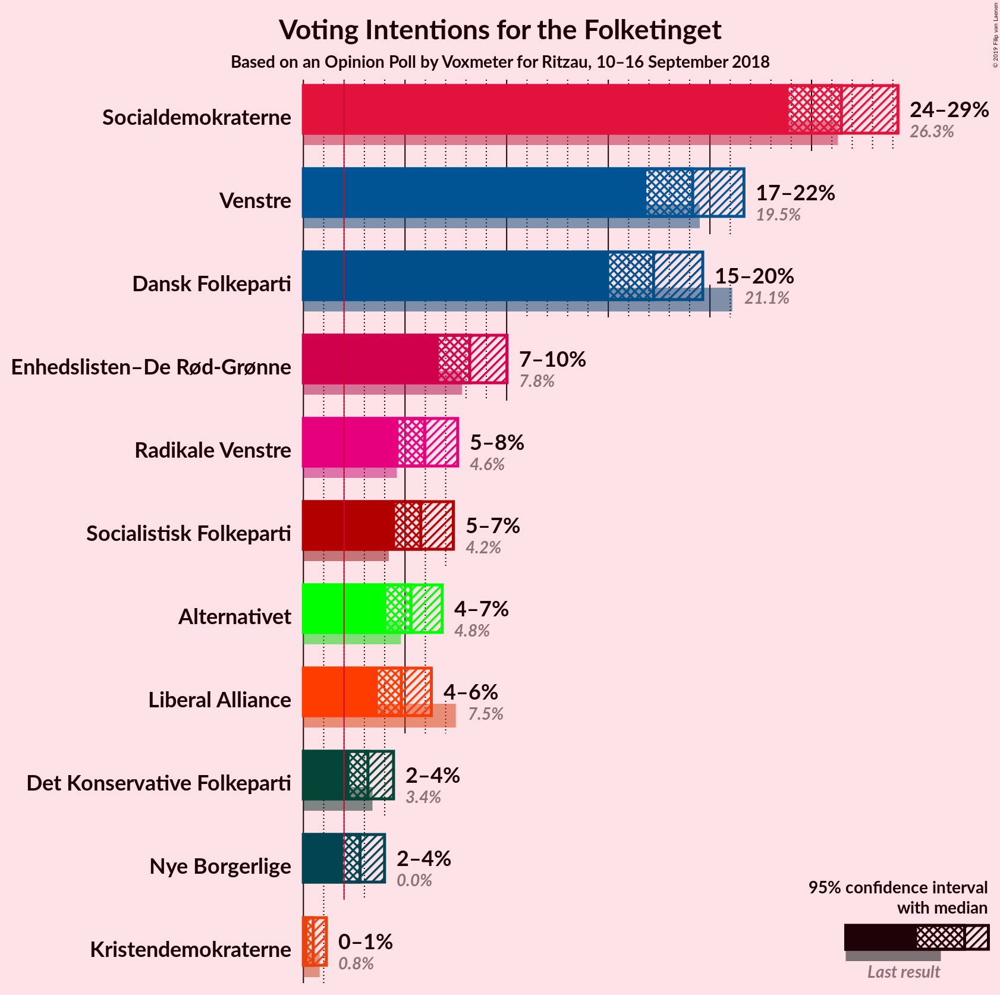

### Confidence Intervals

| Party | Last Result | Poll Result | 80% Confidence Interval | 90% Confidence Interval | 95% Confidence Interval | 99% Confidence Interval |
|:-----:|:-----------:|:-----------:|:-----------------------:|:-----------------------:|:-----------------------:|:-----------------------:|
| Socialdemokraterne | 26.3% | 26.5% | 24.8–28.3% |24.3–28.8% |23.9–29.2% |23.1–30.1% |
| Venstre | 19.5% | 19.2% | 17.6–20.8% |17.2–21.3% |16.9–21.7% |16.2–22.5% |
| Dansk Folkeparti | 21.1% | 17.2% | 15.8–18.8% |15.4–19.3% |15.0–19.6% |14.4–20.4% |
| Enhedslisten–De Rød-Grønne | 7.8% | 8.2% | 7.2–9.4% |6.9–9.7% |6.7–10.0% |6.2–10.6% |
| Radikale Venstre | 4.6% | 6.0% | 5.1–7.0% |4.9–7.3% |4.7–7.6% |4.3–8.1% |
| Socialistisk Folkeparti | 4.2% | 5.8% | 4.9–6.8% |4.7–7.1% |4.5–7.4% |4.1–7.9% |
| Alternativet | 4.8% | 5.3% | 4.5–6.3% |4.3–6.6% |4.1–6.8% |3.7–7.3% |
| Liberal Alliance | 7.5% | 4.8% | 4.1–5.8% |3.8–6.1% |3.7–6.3% |3.3–6.8% |
| Det Konservative Folkeparti | 3.4% | 3.2% | 2.6–4.0% |2.4–4.2% |2.3–4.4% |2.0–4.9% |
| Nye Borgerlige | 0.0% | 2.8% | 2.2–3.6% |2.1–3.8% |2.0–4.0% |1.7–4.4% |
| Kristendemokraterne | 0.8% | 0.5% | 0.3–0.9% |0.2–1.0% |0.2–1.1% |0.1–1.4% |

*Note:* The poll result column reflects the actual value used in the calculations. Published results may vary slightly, and in addition be rounded to fewer digits.

## Seats

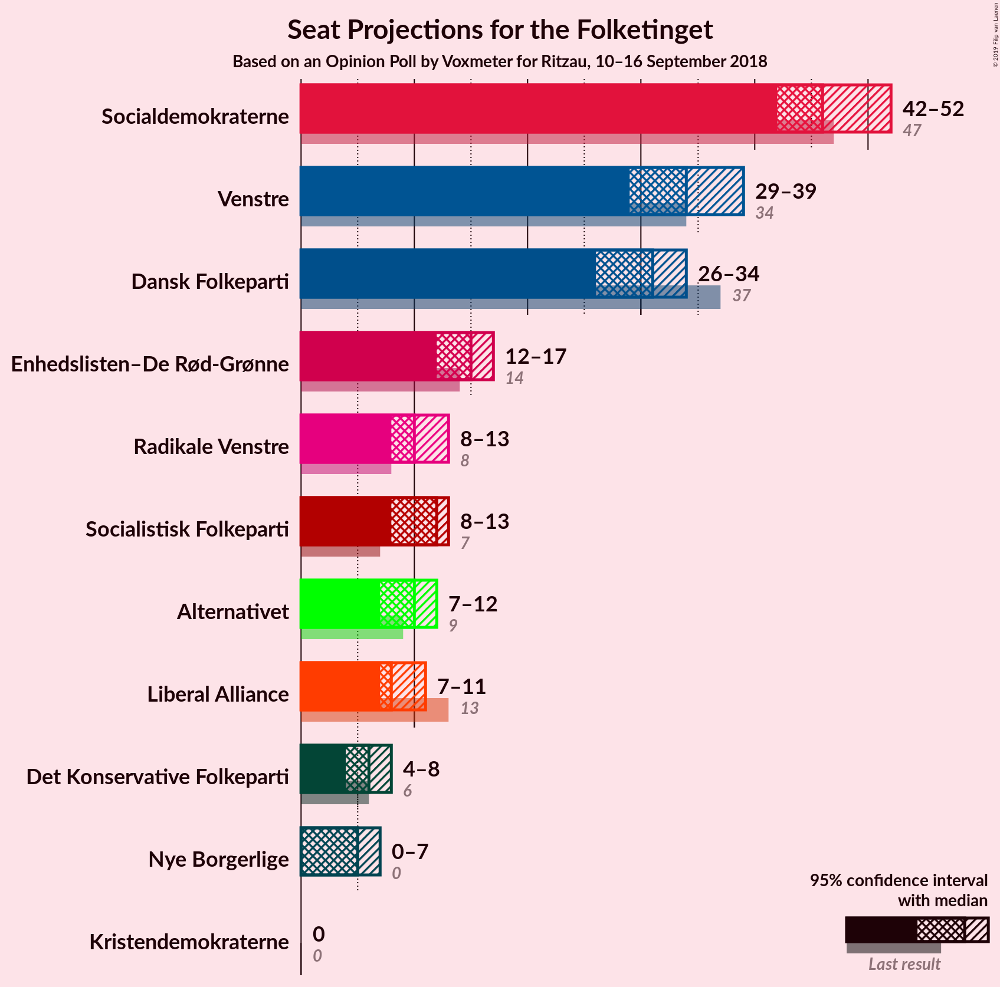

### Confidence Intervals

| Party | Last Result | Median | 80% Confidence Interval | 90% Confidence Interval | 95% Confidence Interval | 99% Confidence Interval |
|:-----:|:-----------:|:------:|:-----------------------:|:-----------------------:|:-----------------------:|:-----------------------:|
| <a href="#socialdemokraterne">Socialdemokraterne</a> | 47 | 46 | 43–49 |43–50 |42–52 |40–54 |
| <a href="#venstre">Venstre</a> | 34 | 34 | 31–38 |30–38 |29–39 |29–40 |
| <a href="#dansk-folkeparti">Dansk Folkeparti</a> | 37 | 31 | 28–33 |27–34 |26–34 |25–36 |
| <a href="#enhedslisten–de-rød-grønne">Enhedslisten–De Rød-Grønne</a> | 14 | 15 | 14–17 |13–17 |12–17 |11–19 |
| <a href="#radikale-venstre">Radikale Venstre</a> | 8 | 10 | 9–12 |9–13 |8–13 |7–14 |
| <a href="#socialistisk-folkeparti">Socialistisk Folkeparti</a> | 7 | 12 | 9–12 |8–12 |8–13 |7–14 |
| <a href="#alternativet">Alternativet</a> | 9 | 10 | 8–11 |7–11 |7–12 |6–13 |
| <a href="#liberal-alliance">Liberal Alliance</a> | 13 | 8 | 7–10 |7–10 |7–11 |6–12 |
| <a href="#det-konservative-folkeparti">Det Konservative Folkeparti</a> | 6 | 6 | 4–7 |4–7 |4–8 |4–8 |
| <a href="#nye-borgerlige">Nye Borgerlige</a> | 0 | 5 | 4–6 |3–7 |0–7 |0–7 |
| <a href="#kristendemokraterne">Kristendemokraterne</a> | 0 | 0 | 0 |0 |0 |0 |

### Socialdemokraterne

*For a full overview of the results for this party, see the [Socialdemokraterne](party-socialdemokraterne.html) page.*

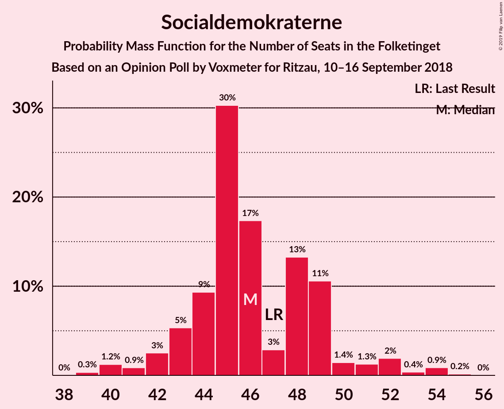

| Number of Seats | Probability | Accumulated | Special Marks |
|:---------------:|:-----------:|:-----------:|:-------------:|
| 39 | 0.3% | 100% |  |
| 40 | 1.2% | 99.6% |  |
| 41 | 0.9% | 98% |  |
| 42 | 3% | 98% |  |
| 43 | 5% | 95% |  |
| 44 | 9% | 90% |  |
| 45 | 30% | 80% |  |
| 46 | 17% | 50% | Median |
| 47 | 3% | 33% | Last Result |
| 48 | 13% | 30% |  |
| 49 | 11% | 17% |  |
| 50 | 1.4% | 6% |  |
| 51 | 1.3% | 5% |  |
| 52 | 2% | 3% |  |
| 53 | 0.4% | 1.4% |  |
| 54 | 0.9% | 1.0% |  |
| 55 | 0.2% | 0.2% |  |
| 56 | 0% | 0% |  |

### Venstre

*For a full overview of the results for this party, see the [Venstre](party-venstre.html) page.*

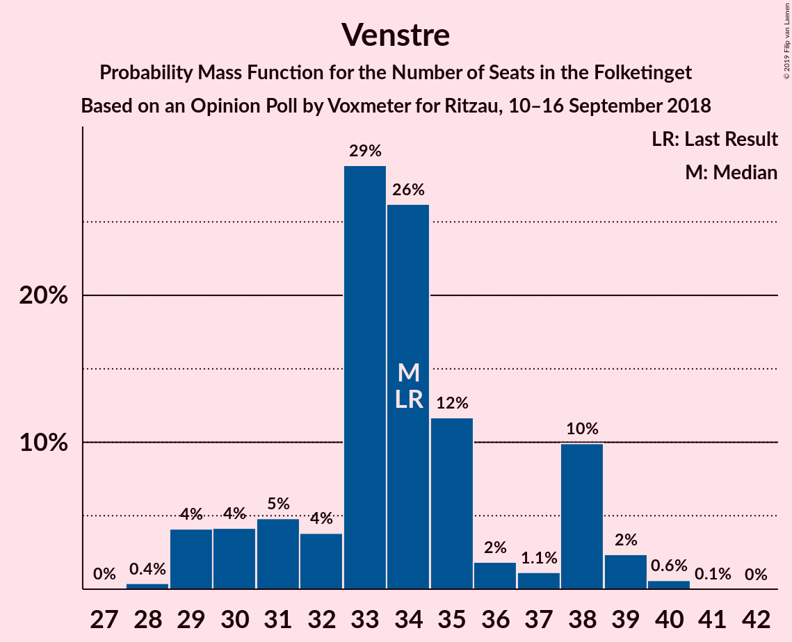

| Number of Seats | Probability | Accumulated | Special Marks |
|:---------------:|:-----------:|:-----------:|:-------------:|
| 28 | 0.4% | 100% |  |
| 29 | 4% | 99.6% |  |
| 30 | 4% | 95% |  |
| 31 | 5% | 91% |  |
| 32 | 4% | 86% |  |
| 33 | 29% | 83% |  |
| 34 | 26% | 54% | Last Result, Median |
| 35 | 12% | 28% |  |
| 36 | 2% | 16% |  |
| 37 | 1.1% | 14% |  |
| 38 | 10% | 13% |  |
| 39 | 2% | 3% |  |
| 40 | 0.6% | 0.7% |  |
| 41 | 0.1% | 0.1% |  |
| 42 | 0% | 0% |  |

### Dansk Folkeparti

*For a full overview of the results for this party, see the [Dansk Folkeparti](party-danskfolkeparti.html) page.*

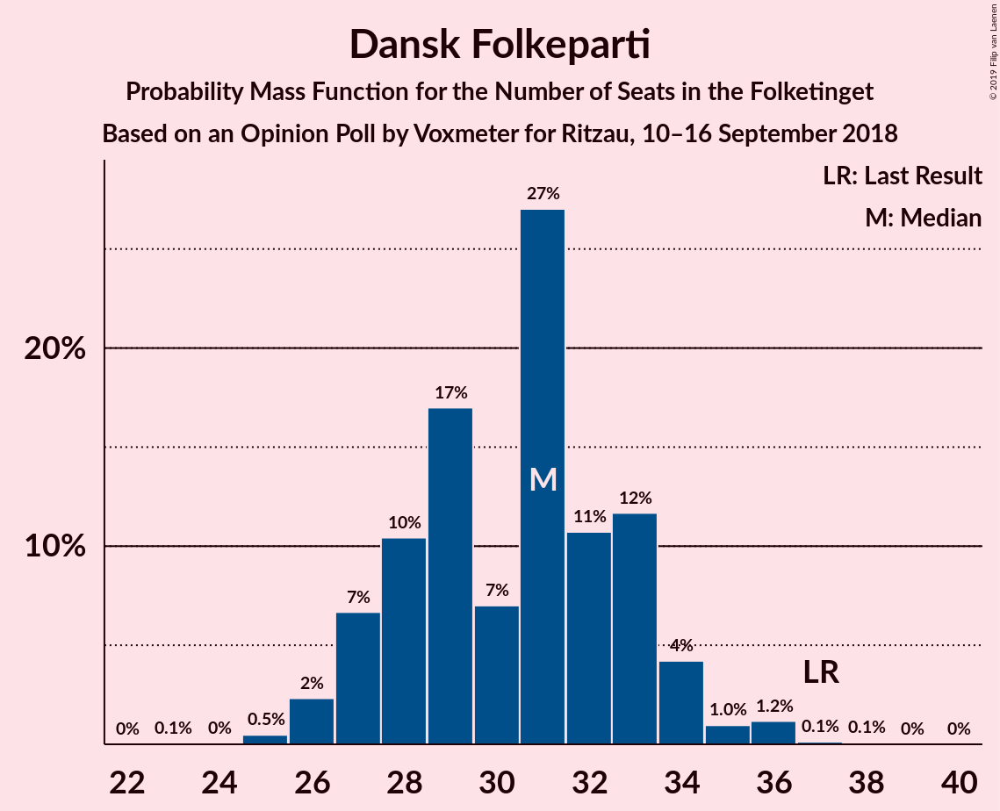

| Number of Seats | Probability | Accumulated | Special Marks |
|:---------------:|:-----------:|:-----------:|:-------------:|
| 23 | 0.1% | 100% |  |
| 24 | 0% | 99.9% |  |
| 25 | 0.5% | 99.9% |  |
| 26 | 2% | 99.4% |  |
| 27 | 7% | 97% |  |
| 28 | 10% | 90% |  |
| 29 | 17% | 80% |  |
| 30 | 7% | 63% |  |
| 31 | 27% | 56% | Median |
| 32 | 11% | 29% |  |
| 33 | 12% | 18% |  |
| 34 | 4% | 7% |  |
| 35 | 1.0% | 2% |  |
| 36 | 1.2% | 1.4% |  |
| 37 | 0.1% | 0.2% | Last Result |
| 38 | 0.1% | 0.1% |  |
| 39 | 0% | 0% |  |

### Enhedslisten–De Rød-Grønne

*For a full overview of the results for this party, see the [Enhedslisten–De Rød-Grønne](party-enhedslisten–derød-grønne.html) page.*

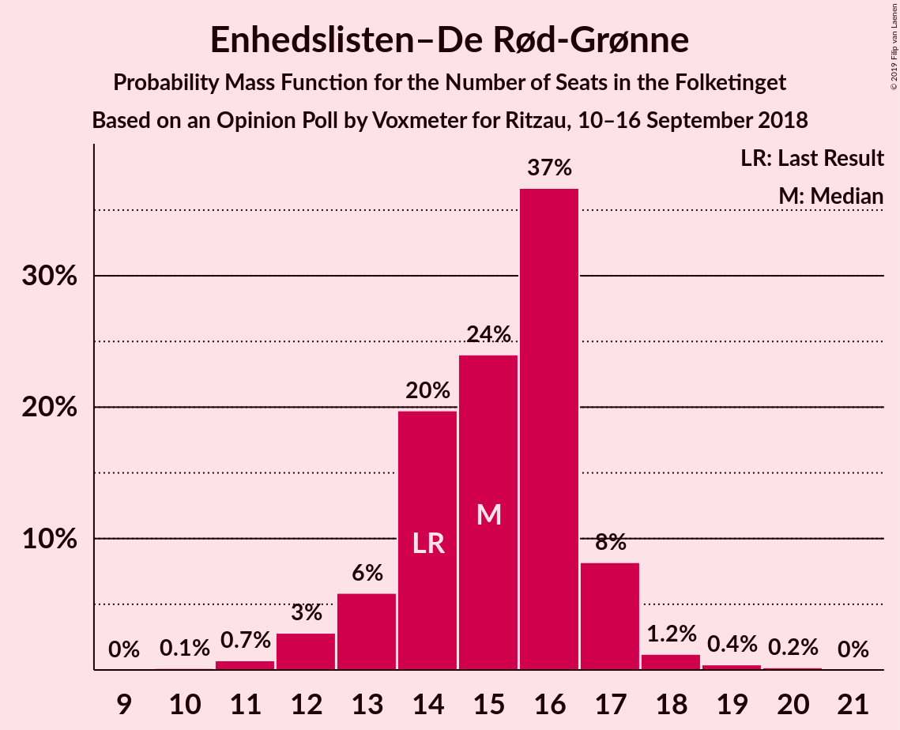

| Number of Seats | Probability | Accumulated | Special Marks |
|:---------------:|:-----------:|:-----------:|:-------------:|
| 10 | 0.1% | 100% |  |
| 11 | 0.7% | 99.9% |  |
| 12 | 3% | 99.1% |  |
| 13 | 6% | 96% |  |
| 14 | 20% | 90% | Last Result |
| 15 | 24% | 71% | Median |
| 16 | 37% | 47% |  |
| 17 | 8% | 10% |  |
| 18 | 1.2% | 2% |  |
| 19 | 0.4% | 0.6% |  |
| 20 | 0.2% | 0.2% |  |
| 21 | 0% | 0% |  |

### Radikale Venstre

*For a full overview of the results for this party, see the [Radikale Venstre](party-radikalevenstre.html) page.*

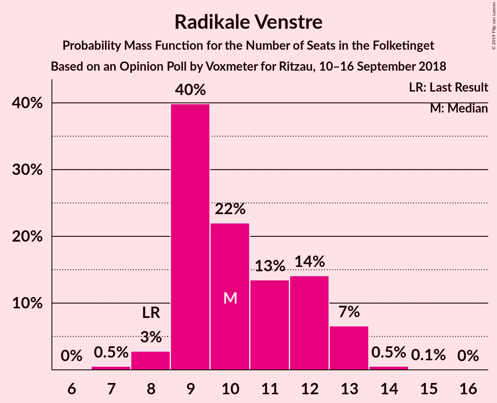

| Number of Seats | Probability | Accumulated | Special Marks |
|:---------------:|:-----------:|:-----------:|:-------------:|
| 7 | 0.5% | 100% |  |
| 8 | 3% | 99.5% | Last Result |
| 9 | 40% | 97% |  |
| 10 | 22% | 57% | Median |
| 11 | 13% | 35% |  |
| 12 | 14% | 21% |  |
| 13 | 7% | 7% |  |
| 14 | 0.5% | 0.7% |  |
| 15 | 0.1% | 0.1% |  |
| 16 | 0% | 0% |  |

### Socialistisk Folkeparti

*For a full overview of the results for this party, see the [Socialistisk Folkeparti](party-socialistiskfolkeparti.html) page.*

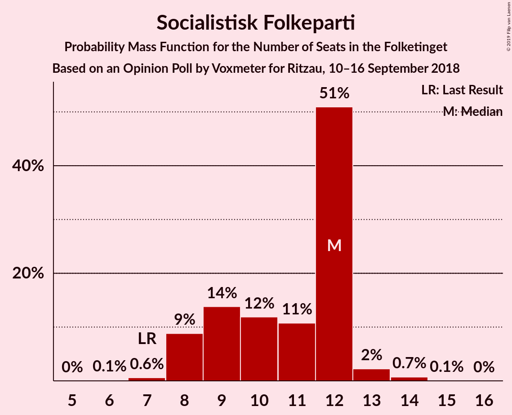

| Number of Seats | Probability | Accumulated | Special Marks |
|:---------------:|:-----------:|:-----------:|:-------------:|
| 6 | 0.1% | 100% |  |
| 7 | 0.6% | 99.9% | Last Result |
| 8 | 9% | 99.3% |  |
| 9 | 14% | 90% |  |
| 10 | 12% | 77% |  |
| 11 | 11% | 65% |  |
| 12 | 51% | 54% | Median |
| 13 | 2% | 3% |  |
| 14 | 0.7% | 0.8% |  |
| 15 | 0.1% | 0.1% |  |
| 16 | 0% | 0% |  |

### Alternativet

*For a full overview of the results for this party, see the [Alternativet](party-alternativet.html) page.*

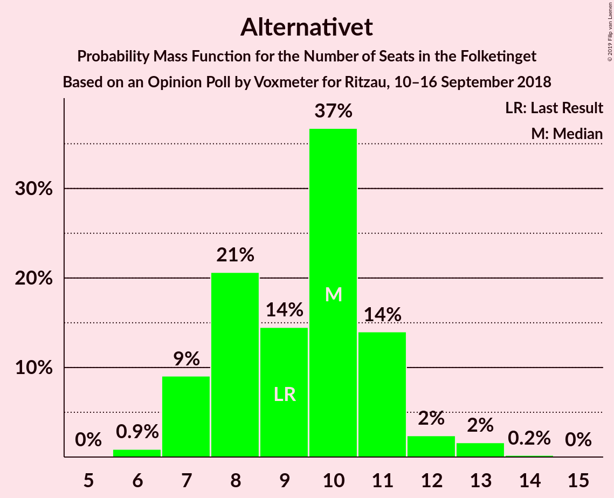

| Number of Seats | Probability | Accumulated | Special Marks |
|:---------------:|:-----------:|:-----------:|:-------------:|
| 6 | 0.9% | 100% |  |
| 7 | 9% | 99.1% |  |
| 8 | 21% | 90% |  |
| 9 | 14% | 69% | Last Result |
| 10 | 37% | 55% | Median |
| 11 | 14% | 18% |  |
| 12 | 2% | 4% |  |
| 13 | 2% | 2% |  |
| 14 | 0.2% | 0.2% |  |
| 15 | 0% | 0% |  |

### Liberal Alliance

*For a full overview of the results for this party, see the [Liberal Alliance](party-liberalalliance.html) page.*

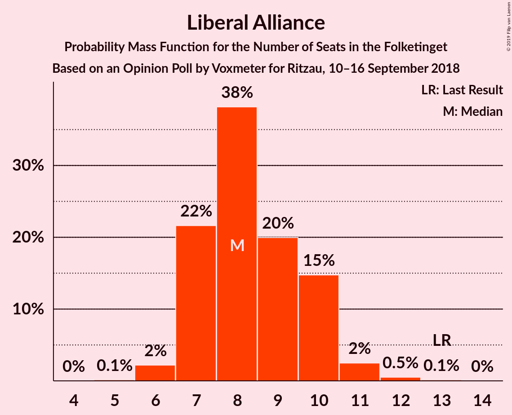

| Number of Seats | Probability | Accumulated | Special Marks |
|:---------------:|:-----------:|:-----------:|:-------------:|
| 5 | 0.1% | 100% |  |
| 6 | 2% | 99.8% |  |
| 7 | 22% | 98% |  |
| 8 | 38% | 76% | Median |
| 9 | 20% | 38% |  |
| 10 | 15% | 18% |  |
| 11 | 2% | 3% |  |
| 12 | 0.5% | 0.7% |  |
| 13 | 0.1% | 0.2% | Last Result |
| 14 | 0% | 0% |  |

### Det Konservative Folkeparti

*For a full overview of the results for this party, see the [Det Konservative Folkeparti](party-detkonservativefolkeparti.html) page.*

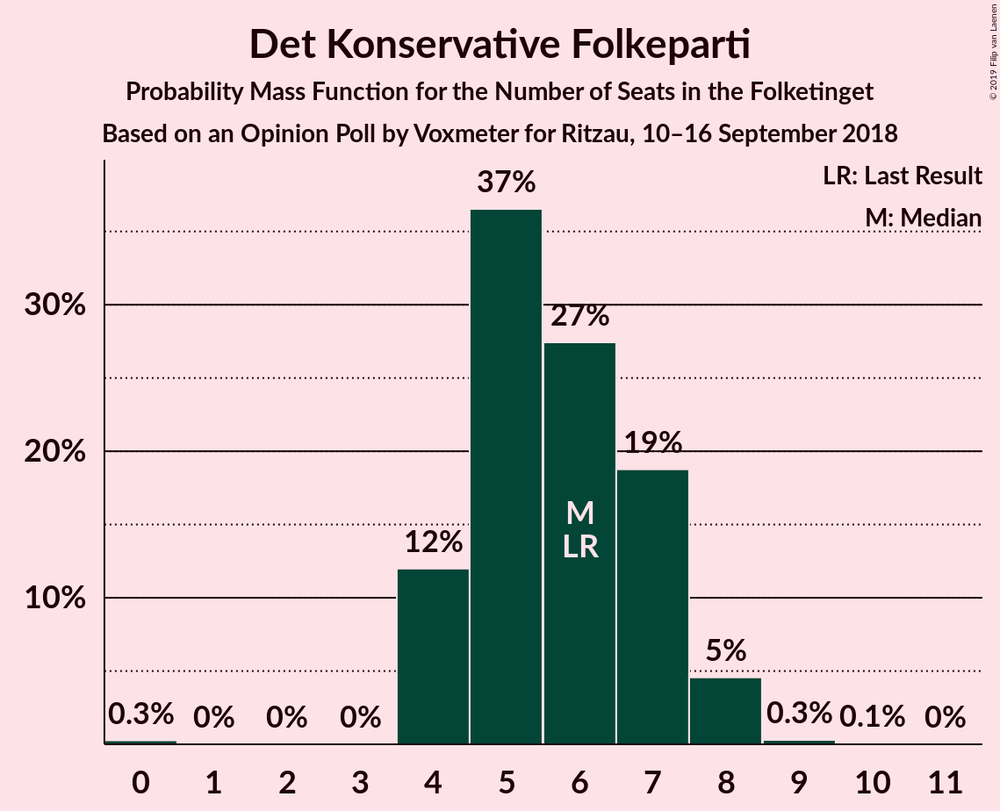

| Number of Seats | Probability | Accumulated | Special Marks |
|:---------------:|:-----------:|:-----------:|:-------------:|
| 0 | 0.3% | 100% |  |
| 1 | 0% | 99.7% |  |
| 2 | 0% | 99.7% |  |
| 3 | 0% | 99.7% |  |
| 4 | 12% | 99.7% |  |
| 5 | 37% | 88% |  |
| 6 | 27% | 51% | Last Result, Median |
| 7 | 19% | 24% |  |
| 8 | 5% | 5% |  |
| 9 | 0.3% | 0.4% |  |
| 10 | 0.1% | 0.1% |  |
| 11 | 0% | 0% |  |

### Nye Borgerlige

*For a full overview of the results for this party, see the [Nye Borgerlige](party-nyeborgerlige.html) page.*

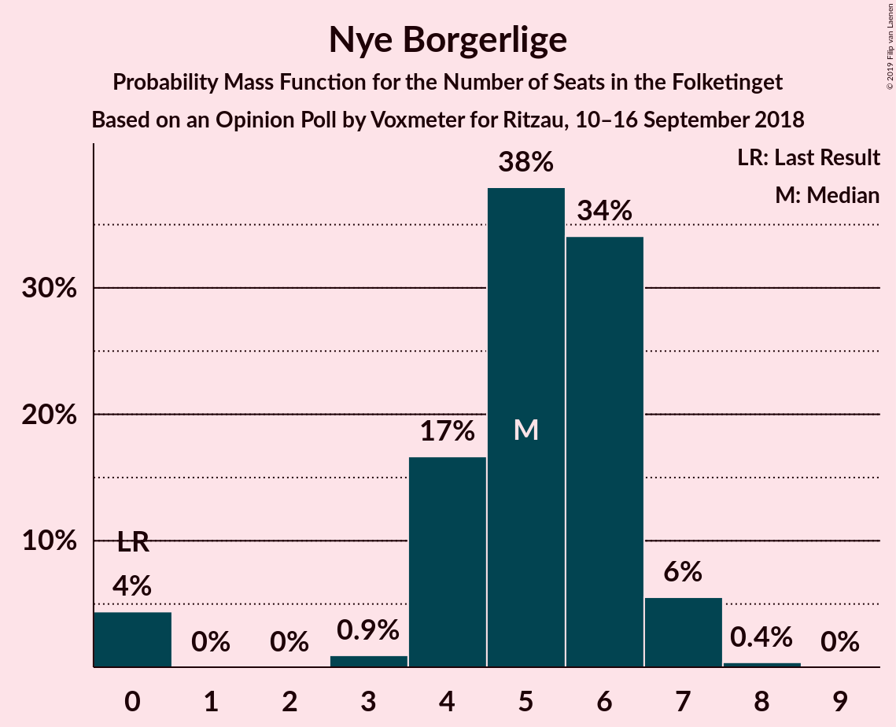

| Number of Seats | Probability | Accumulated | Special Marks |
|:---------------:|:-----------:|:-----------:|:-------------:|
| 0 | 4% | 100% | Last Result |
| 1 | 0% | 96% |  |
| 2 | 0% | 96% |  |
| 3 | 0.9% | 96% |  |
| 4 | 17% | 95% |  |
| 5 | 38% | 78% | Median |
| 6 | 34% | 40% |  |
| 7 | 6% | 6% |  |
| 8 | 0.4% | 0.4% |  |
| 9 | 0% | 0% |  |

### Kristendemokraterne

*For a full overview of the results for this party, see the [Kristendemokraterne](party-kristendemokraterne.html) page.*

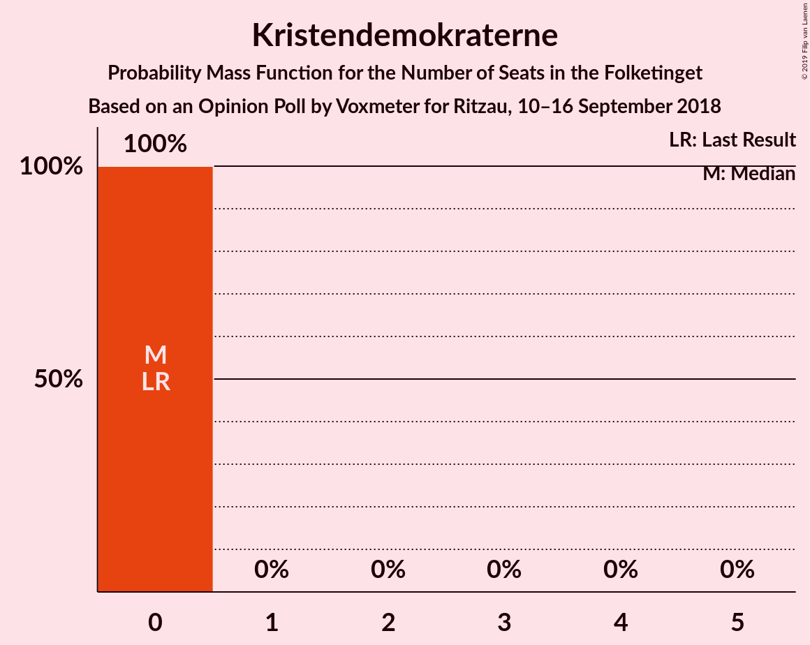

| Number of Seats | Probability | Accumulated | Special Marks |
|:---------------:|:-----------:|:-----------:|:-------------:|
| 0 | 100% | 100% | Last Result, Median |

## Coalitions

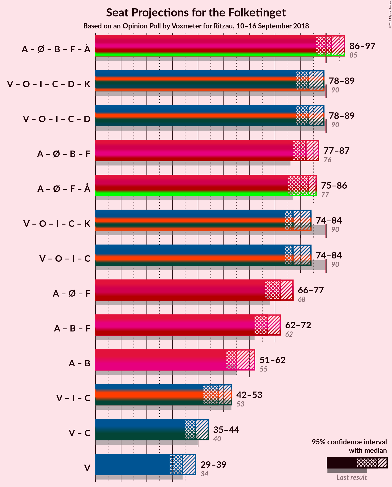

### Confidence Intervals

| Coalition | Last Result | Median | Majority? | 80% Confidence Interval | 90% Confidence Interval | 95% Confidence Interval | 99% Confidence Interval |
|:---------:|:-----------:|:------:|:---------:|:-----------------------:|:-----------------------:|:-----------------------:|:-----------------------:|
| Socialdemokraterne – Enhedslisten–De Rød-Grønne – Radikale Venstre – Socialistisk Folkeparti – Alternativet | 85 | 92 | 86% | 89–95 | 87–95 | 86–97 | 85–98 |
| Venstre – Dansk Folkeparti – Liberal Alliance – Det Konservative Folkeparti – Nye Borgerlige – Kristendemokraterne | 90 | 83 | 1.5% | 80–86 | 80–88 | 78–89 | 77–90 |
| Venstre – Dansk Folkeparti – Liberal Alliance – Det Konservative Folkeparti – Nye Borgerlige | 90 | 83 | 1.5% | 80–86 | 80–88 | 78–89 | 77–90 |
| Socialdemokraterne – Enhedslisten–De Rød-Grønne – Radikale Venstre – Socialistisk Folkeparti | 76 | 82 | 0.2% | 79–85 | 78–86 | 77–87 | 75–89 |
| Socialdemokraterne – Enhedslisten–De Rød-Grønne – Socialistisk Folkeparti – Alternativet | 77 | 83 | 0.1% | 78–84 | 77–85 | 75–86 | 74–87 |
| Venstre – Dansk Folkeparti – Liberal Alliance – Det Konservative Folkeparti – Kristendemokraterne | 90 | 77 | 0% | 75–82 | 74–83 | 74–84 | 72–86 |
| Venstre – Dansk Folkeparti – Liberal Alliance – Det Konservative Folkeparti | 90 | 77 | 0% | 75–82 | 74–83 | 74–84 | 72–86 |
| Socialdemokraterne – Enhedslisten–De Rød-Grønne – Socialistisk Folkeparti | 68 | 72 | 0% | 68–75 | 67–77 | 66–77 | 65–79 |
| Socialdemokraterne – Radikale Venstre – Socialistisk Folkeparti | 62 | 67 | 0% | 65–70 | 63–71 | 62–72 | 61–73 |
| Socialdemokraterne – Radikale Venstre | 55 | 55 | 0% | 54–60 | 53–61 | 51–62 | 50–64 |
| Venstre – Liberal Alliance – Det Konservative Folkeparti | 53 | 48 | 0% | 45–52 | 44–52 | 42–53 | 42–54 |
| Venstre – Det Konservative Folkeparti | 40 | 39 | 0% | 37–44 | 36–44 | 35–44 | 34–46 |
| Venstre | 34 | 34 | 0% | 31–38 | 30–38 | 29–39 | 29–40 |

### Socialdemokraterne – Enhedslisten–De Rød-Grønne – Radikale Venstre – Socialistisk Folkeparti – Alternativet

| Number of Seats | Probability | Accumulated | Special Marks |
|:---------------:|:-----------:|:-----------:|:-------------:|
| 83 | 0% | 100% |  |
| 84 | 0.4% | 99.9% |  |
| 85 | 1.0% | 99.5% | Last Result |
| 86 | 3% | 98.5% |  |
| 87 | 1.5% | 96% |  |
| 88 | 4% | 94% |  |
| 89 | 4% | 90% |  |
| 90 | 17% | 86% | Majority |
| 91 | 6% | 69% |  |
| 92 | 26% | 63% |  |
| 93 | 20% | 36% | Median |
| 94 | 5% | 16% |  |
| 95 | 7% | 11% |  |
| 96 | 1.2% | 4% |  |
| 97 | 2% | 3% |  |
| 98 | 0.6% | 0.9% |  |
| 99 | 0.1% | 0.3% |  |
| 100 | 0.1% | 0.1% |  |
| 101 | 0% | 0.1% |  |
| 102 | 0% | 0% |  |

### Venstre – Dansk Folkeparti – Liberal Alliance – Det Konservative Folkeparti – Nye Borgerlige – Kristendemokraterne

| Number of Seats | Probability | Accumulated | Special Marks |
|:---------------:|:-----------:|:-----------:|:-------------:|
| 74 | 0% | 100% |  |
| 75 | 0.1% | 99.9% |  |
| 76 | 0.1% | 99.9% |  |
| 77 | 0.6% | 99.7% |  |
| 78 | 2% | 99.1% |  |
| 79 | 1.2% | 97% |  |
| 80 | 7% | 96% |  |
| 81 | 5% | 89% |  |
| 82 | 20% | 84% |  |
| 83 | 26% | 64% |  |
| 84 | 6% | 37% | Median |
| 85 | 17% | 31% |  |
| 86 | 4% | 14% |  |
| 87 | 4% | 10% |  |
| 88 | 1.5% | 6% |  |
| 89 | 3% | 4% |  |
| 90 | 1.0% | 1.5% | Last Result, Majority |
| 91 | 0.4% | 0.5% |  |
| 92 | 0% | 0.1% |  |
| 93 | 0% | 0% |  |

### Venstre – Dansk Folkeparti – Liberal Alliance – Det Konservative Folkeparti – Nye Borgerlige

| Number of Seats | Probability | Accumulated | Special Marks |
|:---------------:|:-----------:|:-----------:|:-------------:|
| 74 | 0% | 100% |  |
| 75 | 0.1% | 99.9% |  |
| 76 | 0.1% | 99.9% |  |
| 77 | 0.6% | 99.7% |  |
| 78 | 2% | 99.1% |  |
| 79 | 1.2% | 97% |  |
| 80 | 7% | 96% |  |
| 81 | 5% | 89% |  |
| 82 | 20% | 84% |  |
| 83 | 26% | 64% |  |
| 84 | 6% | 37% | Median |
| 85 | 17% | 31% |  |
| 86 | 4% | 14% |  |
| 87 | 4% | 10% |  |
| 88 | 1.5% | 6% |  |
| 89 | 3% | 4% |  |
| 90 | 1.0% | 1.5% | Last Result, Majority |
| 91 | 0.4% | 0.5% |  |
| 92 | 0% | 0.1% |  |
| 93 | 0% | 0% |  |

### Socialdemokraterne – Enhedslisten–De Rød-Grønne – Radikale Venstre – Socialistisk Folkeparti

| Number of Seats | Probability | Accumulated | Special Marks |
|:---------------:|:-----------:|:-----------:|:-------------:|
| 73 | 0% | 100% |  |
| 74 | 0.3% | 99.9% |  |
| 75 | 0.2% | 99.7% |  |
| 76 | 1.4% | 99.5% | Last Result |
| 77 | 3% | 98% |  |
| 78 | 2% | 95% |  |
| 79 | 6% | 93% |  |
| 80 | 7% | 87% |  |
| 81 | 4% | 81% |  |
| 82 | 32% | 77% |  |
| 83 | 24% | 45% | Median |
| 84 | 4% | 21% |  |
| 85 | 6% | 16% |  |
| 86 | 6% | 10% |  |
| 87 | 1.3% | 4% |  |
| 88 | 1.1% | 2% |  |
| 89 | 1.1% | 1.3% |  |
| 90 | 0.1% | 0.2% | Majority |
| 91 | 0.1% | 0.1% |  |
| 92 | 0% | 0% |  |

### Socialdemokraterne – Enhedslisten–De Rød-Grønne – Socialistisk Folkeparti – Alternativet

| Number of Seats | Probability | Accumulated | Special Marks |
|:---------------:|:-----------:|:-----------:|:-------------:|
| 73 | 0.1% | 100% |  |
| 74 | 0.4% | 99.9% |  |
| 75 | 2% | 99.5% |  |
| 76 | 1.2% | 97% |  |
| 77 | 4% | 96% | Last Result |
| 78 | 13% | 92% |  |
| 79 | 4% | 79% |  |
| 80 | 12% | 75% |  |
| 81 | 7% | 63% |  |
| 82 | 4% | 56% |  |
| 83 | 27% | 52% | Median |
| 84 | 15% | 25% |  |
| 85 | 7% | 10% |  |
| 86 | 0.9% | 3% |  |
| 87 | 2% | 2% |  |
| 88 | 0.2% | 0.5% |  |
| 89 | 0.2% | 0.3% |  |
| 90 | 0% | 0.1% | Majority |
| 91 | 0% | 0.1% |  |
| 92 | 0% | 0% |  |

### Venstre – Dansk Folkeparti – Liberal Alliance – Det Konservative Folkeparti – Kristendemokraterne

| Number of Seats | Probability | Accumulated | Special Marks |
|:---------------:|:-----------:|:-----------:|:-------------:|
| 69 | 0% | 100% |  |
| 70 | 0% | 99.9% |  |
| 71 | 0.3% | 99.9% |  |
| 72 | 1.0% | 99.6% |  |
| 73 | 0.5% | 98.7% |  |
| 74 | 6% | 98% |  |
| 75 | 5% | 92% |  |
| 76 | 3% | 86% |  |
| 77 | 36% | 83% |  |
| 78 | 8% | 47% |  |
| 79 | 5% | 39% | Median |
| 80 | 11% | 35% |  |
| 81 | 12% | 24% |  |
| 82 | 5% | 12% |  |
| 83 | 4% | 7% |  |
| 84 | 1.4% | 3% |  |
| 85 | 0.6% | 2% |  |
| 86 | 1.1% | 1.2% |  |
| 87 | 0.1% | 0.1% |  |
| 88 | 0% | 0% |  |
| 89 | 0% | 0% |  |
| 90 | 0% | 0% | Last Result, Majority |

### Venstre – Dansk Folkeparti – Liberal Alliance – Det Konservative Folkeparti

| Number of Seats | Probability | Accumulated | Special Marks |
|:---------------:|:-----------:|:-----------:|:-------------:|
| 69 | 0% | 100% |  |
| 70 | 0% | 99.9% |  |
| 71 | 0.3% | 99.9% |  |
| 72 | 1.0% | 99.6% |  |
| 73 | 0.5% | 98.7% |  |
| 74 | 6% | 98% |  |
| 75 | 5% | 92% |  |
| 76 | 3% | 86% |  |
| 77 | 36% | 83% |  |
| 78 | 8% | 47% |  |
| 79 | 5% | 39% | Median |
| 80 | 11% | 35% |  |
| 81 | 12% | 24% |  |
| 82 | 5% | 12% |  |
| 83 | 4% | 7% |  |
| 84 | 1.4% | 3% |  |
| 85 | 0.6% | 2% |  |
| 86 | 1.1% | 1.2% |  |
| 87 | 0.1% | 0.1% |  |
| 88 | 0% | 0% |  |
| 89 | 0% | 0% |  |
| 90 | 0% | 0% | Last Result, Majority |

### Socialdemokraterne – Enhedslisten–De Rød-Grønne – Socialistisk Folkeparti

| Number of Seats | Probability | Accumulated | Special Marks |
|:---------------:|:-----------:|:-----------:|:-------------:|
| 63 | 0% | 100% |  |
| 64 | 0.3% | 99.9% |  |
| 65 | 1.0% | 99.6% |  |
| 66 | 2% | 98.6% |  |
| 67 | 4% | 97% |  |
| 68 | 3% | 92% | Last Result |
| 69 | 5% | 90% |  |
| 70 | 6% | 84% |  |
| 71 | 11% | 79% |  |
| 72 | 19% | 68% |  |
| 73 | 23% | 49% | Median |
| 74 | 12% | 25% |  |
| 75 | 4% | 13% |  |
| 76 | 4% | 9% |  |
| 77 | 3% | 5% |  |
| 78 | 0.8% | 2% |  |
| 79 | 1.1% | 1.2% |  |
| 80 | 0.1% | 0.1% |  |
| 81 | 0% | 0% |  |

### Socialdemokraterne – Radikale Venstre – Socialistisk Folkeparti

| Number of Seats | Probability | Accumulated | Special Marks |
|:---------------:|:-----------:|:-----------:|:-------------:|
| 59 | 0.1% | 100% |  |
| 60 | 0.3% | 99.9% |  |
| 61 | 1.2% | 99.6% |  |
| 62 | 2% | 98% | Last Result |
| 63 | 2% | 97% |  |
| 64 | 4% | 94% |  |
| 65 | 5% | 90% |  |
| 66 | 27% | 85% |  |
| 67 | 19% | 58% |  |
| 68 | 13% | 39% | Median |
| 69 | 14% | 26% |  |
| 70 | 6% | 12% |  |
| 71 | 3% | 6% |  |
| 72 | 1.4% | 3% |  |
| 73 | 1.5% | 2% |  |
| 74 | 0.1% | 0.5% |  |
| 75 | 0.3% | 0.4% |  |
| 76 | 0% | 0.1% |  |
| 77 | 0% | 0% |  |

### Socialdemokraterne – Radikale Venstre

| Number of Seats | Probability | Accumulated | Special Marks |
|:---------------:|:-----------:|:-----------:|:-------------:|
| 49 | 0.1% | 100% |  |
| 50 | 1.3% | 99.9% |  |
| 51 | 2% | 98.6% |  |
| 52 | 1.4% | 97% |  |
| 53 | 2% | 95% |  |
| 54 | 24% | 94% |  |
| 55 | 22% | 70% | Last Result |
| 56 | 10% | 48% | Median |
| 57 | 6% | 38% |  |
| 58 | 11% | 32% |  |
| 59 | 4% | 21% |  |
| 60 | 11% | 17% |  |
| 61 | 1.1% | 5% |  |
| 62 | 2% | 4% |  |
| 63 | 0.7% | 2% |  |
| 64 | 1.2% | 2% |  |
| 65 | 0.1% | 0.3% |  |
| 66 | 0.3% | 0.3% |  |
| 67 | 0% | 0% |  |

### Venstre – Liberal Alliance – Det Konservative Folkeparti

| Number of Seats | Probability | Accumulated | Special Marks |
|:---------------:|:-----------:|:-----------:|:-------------:|
| 40 | 0.1% | 100% |  |
| 41 | 0.2% | 99.9% |  |
| 42 | 3% | 99.8% |  |
| 43 | 0.6% | 97% |  |
| 44 | 5% | 96% |  |
| 45 | 7% | 91% |  |
| 46 | 22% | 84% |  |
| 47 | 9% | 62% |  |
| 48 | 21% | 54% | Median |
| 49 | 7% | 32% |  |
| 50 | 4% | 26% |  |
| 51 | 9% | 22% |  |
| 52 | 9% | 13% |  |
| 53 | 2% | 4% | Last Result |
| 54 | 2% | 2% |  |
| 55 | 0.2% | 0.4% |  |
| 56 | 0.1% | 0.1% |  |
| 57 | 0% | 0% |  |

### Venstre – Det Konservative Folkeparti

| Number of Seats | Probability | Accumulated | Special Marks |
|:---------------:|:-----------:|:-----------:|:-------------:|
| 32 | 0.1% | 100% |  |
| 33 | 0.2% | 99.9% |  |
| 34 | 0.9% | 99.7% |  |
| 35 | 4% | 98.8% |  |
| 36 | 5% | 95% |  |
| 37 | 4% | 90% |  |
| 38 | 33% | 86% |  |
| 39 | 11% | 53% |  |
| 40 | 8% | 42% | Last Result, Median |
| 41 | 13% | 34% |  |
| 42 | 7% | 21% |  |
| 43 | 2% | 14% |  |
| 44 | 11% | 13% |  |
| 45 | 0.4% | 2% |  |
| 46 | 1.1% | 1.2% |  |
| 47 | 0.1% | 0.1% |  |
| 48 | 0% | 0% |  |

### Venstre

| Number of Seats | Probability | Accumulated | Special Marks |
|:---------------:|:-----------:|:-----------:|:-------------:|
| 28 | 0.4% | 100% |  |
| 29 | 4% | 99.6% |  |
| 30 | 4% | 95% |  |
| 31 | 5% | 91% |  |
| 32 | 4% | 86% |  |
| 33 | 29% | 83% |  |
| 34 | 26% | 54% | Last Result, Median |
| 35 | 12% | 28% |  |
| 36 | 2% | 16% |  |
| 37 | 1.1% | 14% |  |
| 38 | 10% | 13% |  |
| 39 | 2% | 3% |  |
| 40 | 0.6% | 0.7% |  |
| 41 | 0.1% | 0.1% |  |
| 42 | 0% | 0% |  |

## Technical Information

### Opinion Poll

+ **Polling firm:** Voxmeter
+ **Commissioner(s):** Ritzau
+ **Fieldwork period:** 10–16 September 2018

### Calculations

+ **Sample size:** 1039
+ **Simulations done:** 1,048,576
+ **Error estimate:** 1.33%

