# Opinion Poll by Epinion for DR, 11–18 September 2018

<a href="#voting-intentions">Voting Intentions</a> | <a href="#seats">Seats</a> | <a href="#coalitions">Coalitions</a> | <a href="#technical-information">Technical Information</a>

## Voting Intentions

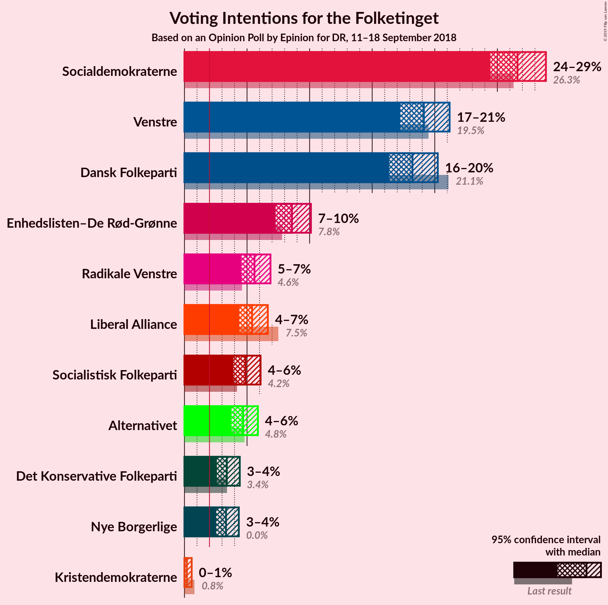

### Confidence Intervals

| Party | Last Result | Poll Result | 80% Confidence Interval | 90% Confidence Interval | 95% Confidence Interval | 99% Confidence Interval |
|:-----:|:-----------:|:-----------:|:-----------------------:|:-----------------------:|:-----------------------:|:-----------------------:|
| Socialdemokraterne | 26.3% | 26.6% | 25.2–28.1% |24.8–28.5% |24.4–28.9% |23.8–29.6% |
| Venstre | 19.5% | 19.1% | 17.9–20.5% |17.5–20.9% |17.2–21.2% |16.7–21.8% |
| Dansk Folkeparti | 21.1% | 18.2% | 17.0–19.5% |16.7–19.9% |16.4–20.2% |15.8–20.9% |
| Enhedslisten–De Rød-Grønne | 7.8% | 8.6% | 7.7–9.6% |7.5–9.9% |7.3–10.1% |6.9–10.6% |
| Radikale Venstre | 4.6% | 5.6% | 4.9–6.4% |4.7–6.7% |4.5–6.9% |4.2–7.3% |
| Liberal Alliance | 7.5% | 5.4% | 4.7–6.2% |4.5–6.4% |4.4–6.7% |4.1–7.1% |
| Socialistisk Folkeparti | 4.2% | 4.9% | 4.2–5.7% |4.1–5.9% |3.9–6.1% |3.6–6.5% |
| Alternativet | 4.8% | 4.7% | 4.1–5.5% |3.9–5.7% |3.7–5.9% |3.4–6.2% |
| Det Konservative Folkeparti | 3.4% | 3.4% | 2.9–4.1% |2.7–4.3% |2.6–4.4% |2.3–4.8% |
| Nye Borgerlige | 0.0% | 3.3% | 2.8–4.0% |2.7–4.2% |2.5–4.3% |2.3–4.7% |
| Kristendemokraterne | 0.8% | 0.2% | 0.1–0.4% |0.1–0.5% |0.1–0.6% |0.0–0.7% |

*Note:* The poll result column reflects the actual value used in the calculations. Published results may vary slightly, and in addition be rounded to fewer digits.

## Seats

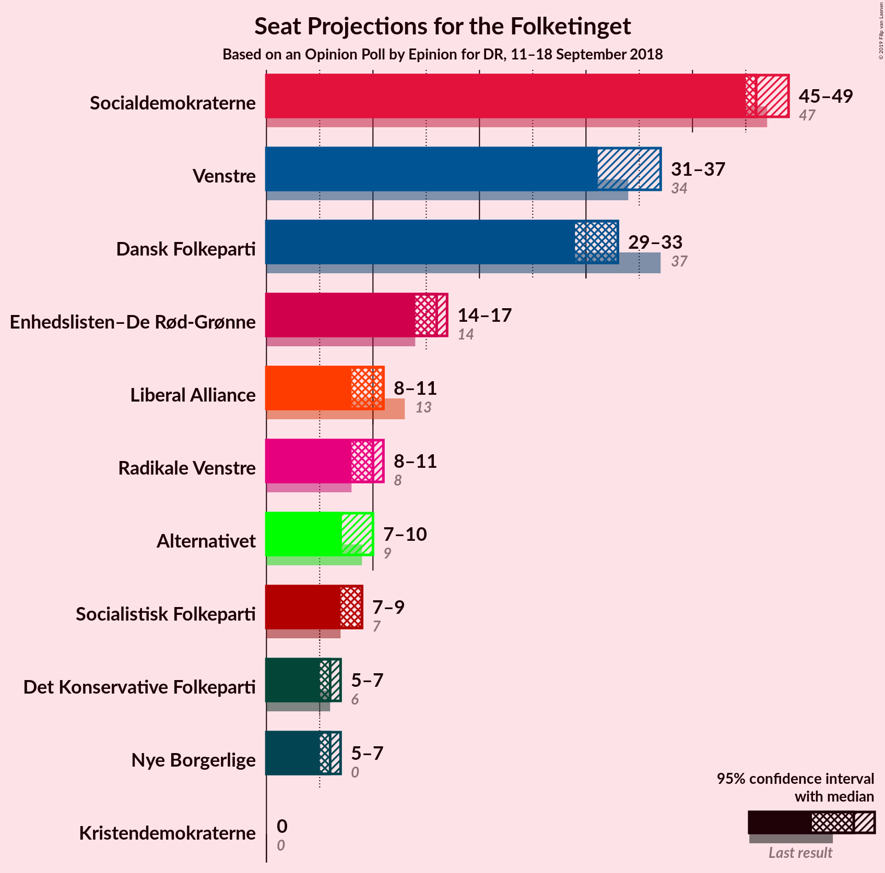

### Confidence Intervals

| Party | Last Result | Median | 80% Confidence Interval | 90% Confidence Interval | 95% Confidence Interval | 99% Confidence Interval |
|:-----:|:-----------:|:------:|:-----------------------:|:-----------------------:|:-----------------------:|:-----------------------:|
| <a href="#socialdemokraterne">Socialdemokraterne</a> | 47 | 46 | 46 |46–49 |45–49 |41–54 |
| <a href="#venstre">Venstre</a> | 34 | 31 | 31–35 |31–36 |31–37 |30–38 |
| <a href="#dansk-folkeparti">Dansk Folkeparti</a> | 37 | 33 | 30–33 |29–33 |29–33 |29–35 |
| <a href="#enhedslisten–de-rød-grønne">Enhedslisten–De Rød-Grønne</a> | 14 | 16 | 14–16 |14–16 |14–17 |12–18 |
| <a href="#radikale-venstre">Radikale Venstre</a> | 8 | 10 | 9–10 |8–10 |8–11 |8–11 |
| <a href="#liberal-alliance">Liberal Alliance</a> | 13 | 11 | 9–11 |9–11 |8–11 |7–12 |
| <a href="#socialistisk-folkeparti">Socialistisk Folkeparti</a> | 7 | 9 | 7–9 |7–9 |7–9 |7–11 |
| <a href="#alternativet">Alternativet</a> | 9 | 7 | 7–10 |7–10 |7–10 |7–11 |
| <a href="#det-konservative-folkeparti">Det Konservative Folkeparti</a> | 6 | 6 | 5–7 |5–7 |5–7 |4–7 |
| <a href="#nye-borgerlige">Nye Borgerlige</a> | 0 | 6 | 6–7 |6–7 |5–7 |4–9 |
| <a href="#kristendemokraterne">Kristendemokraterne</a> | 0 | 0 | 0 |0 |0 |0 |

### Socialdemokraterne

*For a full overview of the results for this party, see the [Socialdemokraterne](party-socialdemokraterne.html) page.*

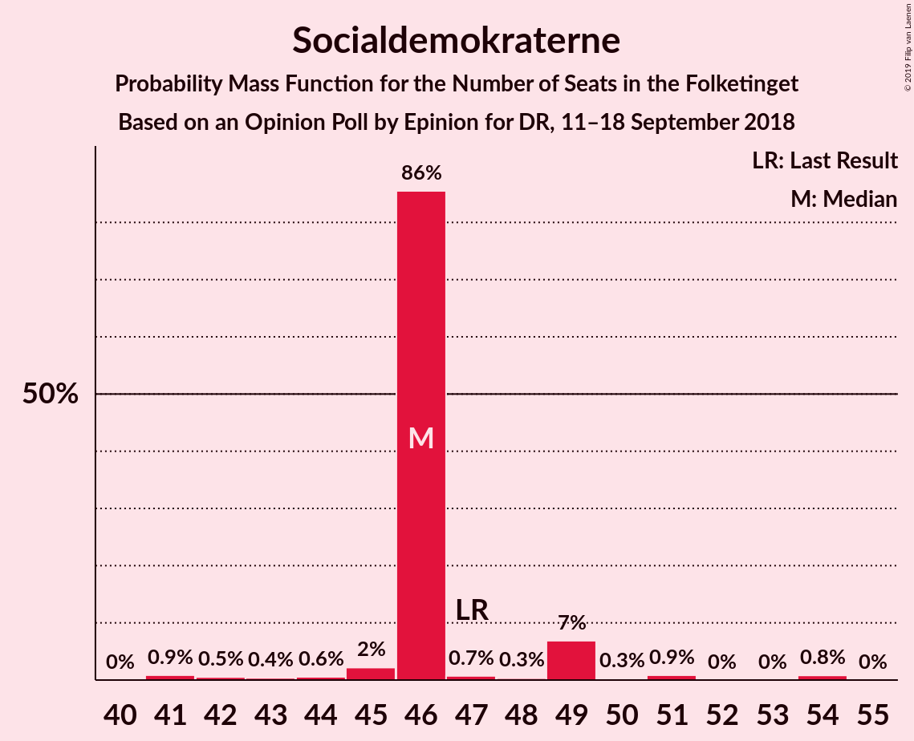

| Number of Seats | Probability | Accumulated | Special Marks |
|:---------------:|:-----------:|:-----------:|:-------------:|
| 41 | 0.9% | 100% |  |
| 42 | 0.5% | 99.1% |  |
| 43 | 0.4% | 98.6% |  |
| 44 | 0.6% | 98% |  |
| 45 | 2% | 98% |  |
| 46 | 86% | 95% | Median |
| 47 | 0.7% | 10% | Last Result |
| 48 | 0.3% | 9% |  |
| 49 | 7% | 9% |  |
| 50 | 0.3% | 2% |  |
| 51 | 0.9% | 2% |  |
| 52 | 0% | 0.9% |  |
| 53 | 0% | 0.9% |  |
| 54 | 0.8% | 0.8% |  |
| 55 | 0% | 0% |  |

### Venstre

*For a full overview of the results for this party, see the [Venstre](party-venstre.html) page.*

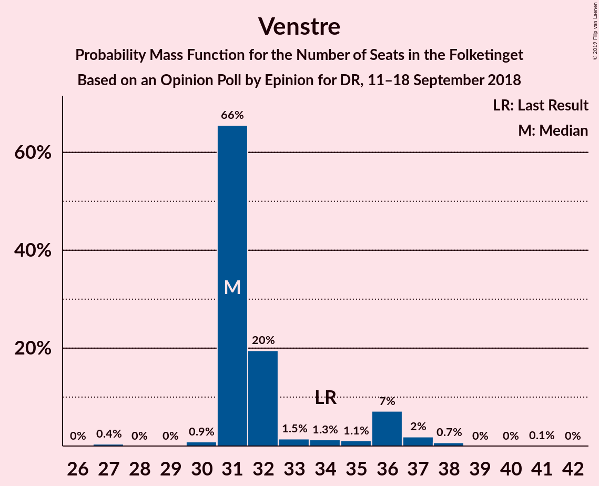

| Number of Seats | Probability | Accumulated | Special Marks |
|:---------------:|:-----------:|:-----------:|:-------------:|
| 27 | 0.4% | 100% |  |
| 28 | 0% | 99.6% |  |
| 29 | 0% | 99.6% |  |
| 30 | 0.9% | 99.6% |  |
| 31 | 66% | 98.7% | Median |
| 32 | 20% | 33% |  |
| 33 | 1.5% | 14% |  |
| 34 | 1.3% | 12% | Last Result |
| 35 | 1.1% | 11% |  |
| 36 | 7% | 10% |  |
| 37 | 2% | 3% |  |
| 38 | 0.7% | 0.8% |  |
| 39 | 0% | 0.1% |  |
| 40 | 0% | 0.1% |  |
| 41 | 0.1% | 0.1% |  |
| 42 | 0% | 0% |  |

### Dansk Folkeparti

*For a full overview of the results for this party, see the [Dansk Folkeparti](party-danskfolkeparti.html) page.*

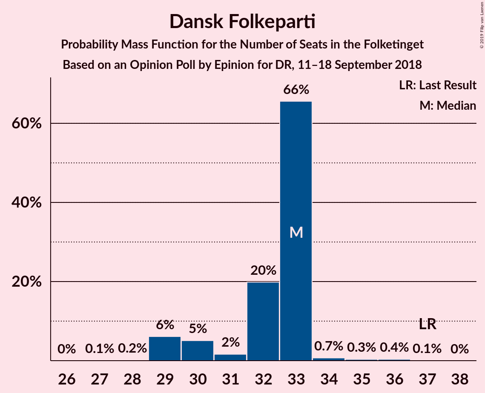

| Number of Seats | Probability | Accumulated | Special Marks |
|:---------------:|:-----------:|:-----------:|:-------------:|
| 27 | 0.1% | 100% |  |
| 28 | 0.2% | 99.9% |  |
| 29 | 6% | 99.8% |  |
| 30 | 5% | 94% |  |
| 31 | 2% | 89% |  |
| 32 | 20% | 87% |  |
| 33 | 66% | 67% | Median |
| 34 | 0.7% | 2% |  |
| 35 | 0.3% | 0.8% |  |
| 36 | 0.4% | 0.5% |  |
| 37 | 0.1% | 0.1% | Last Result |
| 38 | 0% | 0% |  |

### Enhedslisten–De Rød-Grønne

*For a full overview of the results for this party, see the [Enhedslisten–De Rød-Grønne](party-enhedslisten–derød-grønne.html) page.*

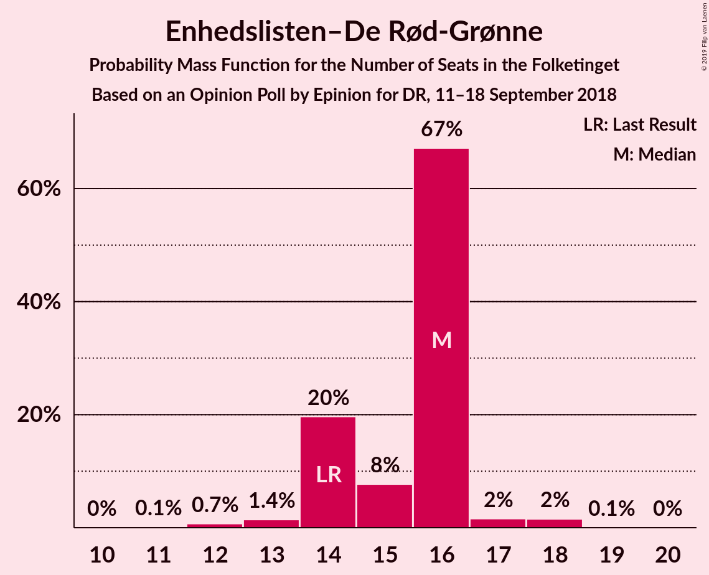

| Number of Seats | Probability | Accumulated | Special Marks |
|:---------------:|:-----------:|:-----------:|:-------------:|
| 11 | 0.1% | 100% |  |
| 12 | 0.7% | 99.9% |  |
| 13 | 1.4% | 99.2% |  |
| 14 | 20% | 98% | Last Result |
| 15 | 8% | 78% |  |
| 16 | 67% | 70% | Median |
| 17 | 2% | 3% |  |
| 18 | 2% | 2% |  |
| 19 | 0.1% | 0.1% |  |
| 20 | 0% | 0% |  |

### Radikale Venstre

*For a full overview of the results for this party, see the [Radikale Venstre](party-radikalevenstre.html) page.*

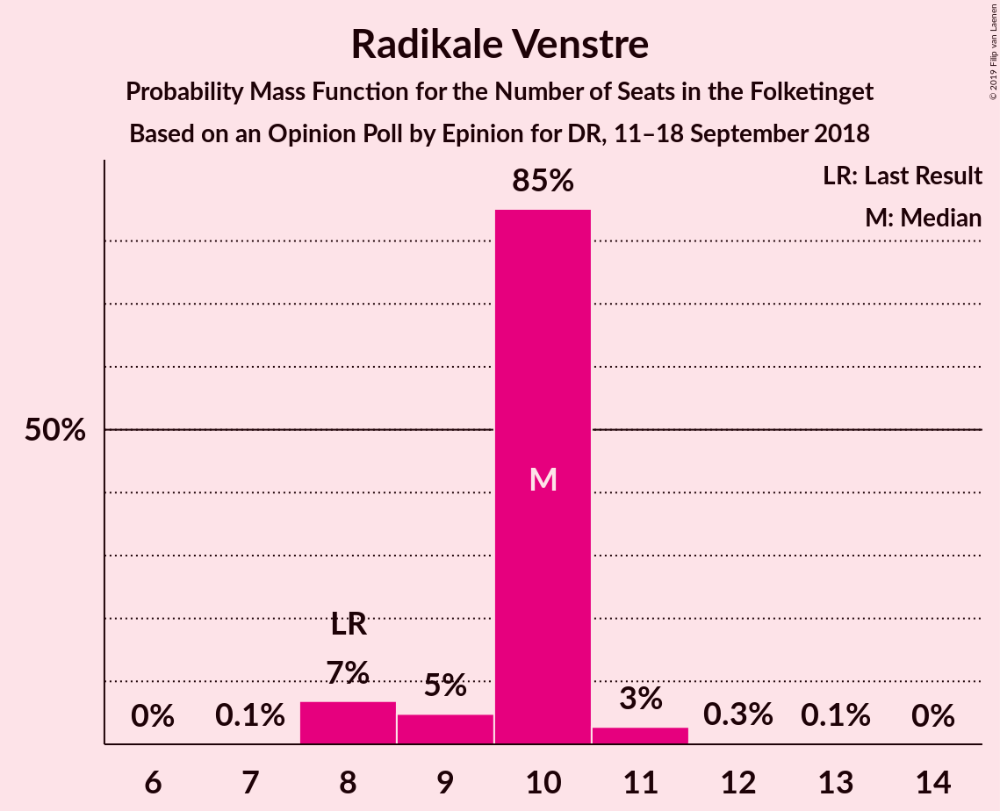

| Number of Seats | Probability | Accumulated | Special Marks |
|:---------------:|:-----------:|:-----------:|:-------------:|
| 7 | 0.1% | 100% |  |
| 8 | 7% | 99.9% | Last Result |
| 9 | 5% | 93% |  |
| 10 | 85% | 88% | Median |
| 11 | 3% | 3% |  |
| 12 | 0.3% | 0.4% |  |
| 13 | 0.1% | 0.1% |  |
| 14 | 0% | 0% |  |

### Liberal Alliance

*For a full overview of the results for this party, see the [Liberal Alliance](party-liberalalliance.html) page.*

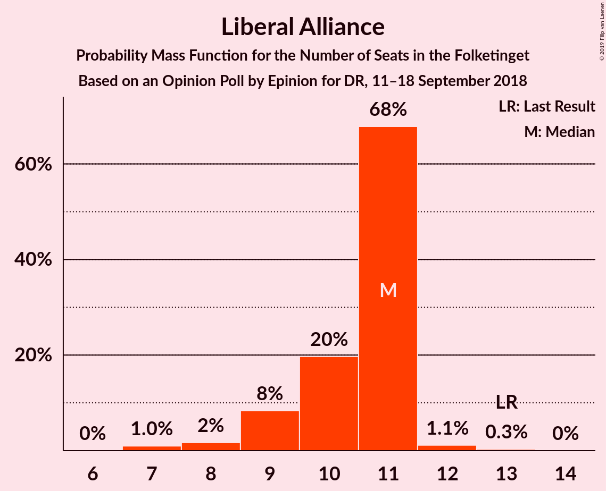

| Number of Seats | Probability | Accumulated | Special Marks |
|:---------------:|:-----------:|:-----------:|:-------------:|
| 7 | 1.0% | 100% |  |
| 8 | 2% | 99.0% |  |
| 9 | 8% | 97% |  |
| 10 | 20% | 89% |  |
| 11 | 68% | 69% | Median |
| 12 | 1.1% | 1.4% |  |
| 13 | 0.3% | 0.3% | Last Result |
| 14 | 0% | 0% |  |

### Socialistisk Folkeparti

*For a full overview of the results for this party, see the [Socialistisk Folkeparti](party-socialistiskfolkeparti.html) page.*

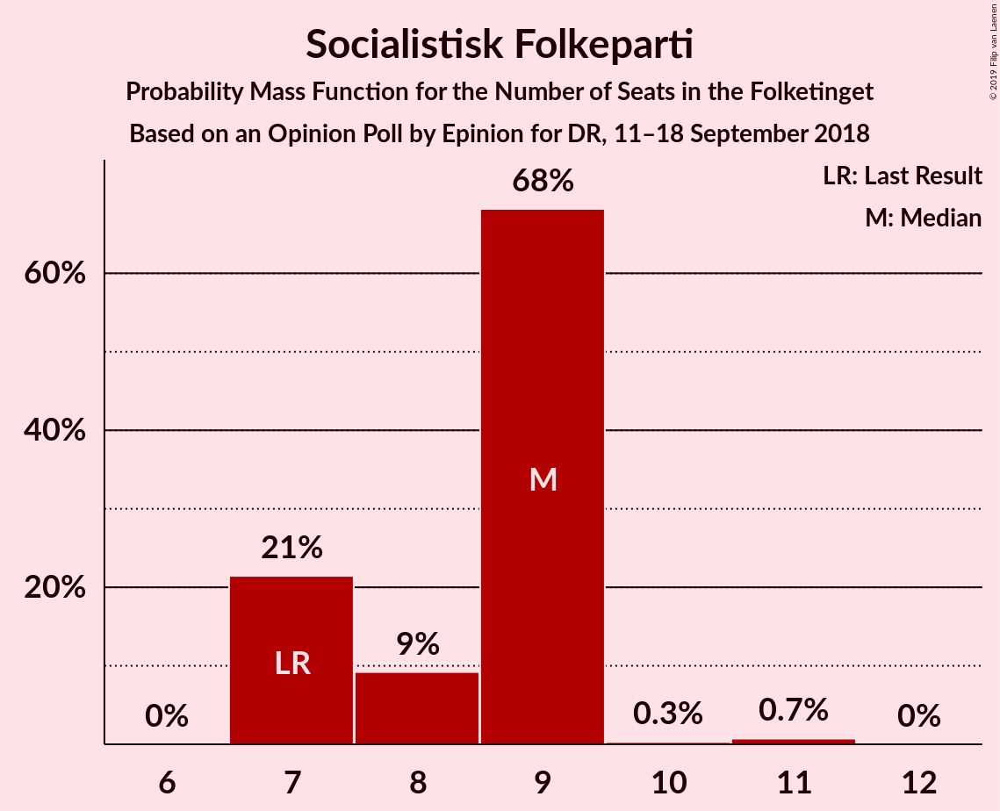

| Number of Seats | Probability | Accumulated | Special Marks |
|:---------------:|:-----------:|:-----------:|:-------------:|
| 6 | 0% | 100% |  |
| 7 | 21% | 99.9% | Last Result |
| 8 | 9% | 78% |  |
| 9 | 68% | 69% | Median |
| 10 | 0.3% | 1.1% |  |
| 11 | 0.7% | 0.8% |  |
| 12 | 0% | 0% |  |

### Alternativet

*For a full overview of the results for this party, see the [Alternativet](party-alternativet.html) page.*

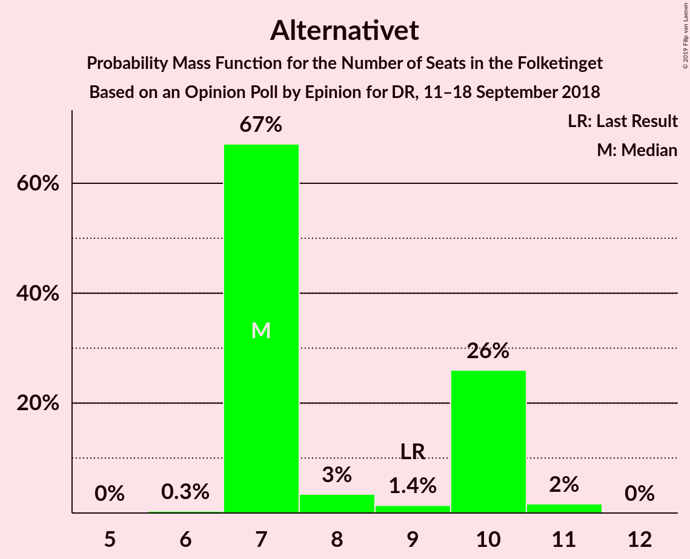

| Number of Seats | Probability | Accumulated | Special Marks |
|:---------------:|:-----------:|:-----------:|:-------------:|
| 6 | 0.3% | 100% |  |
| 7 | 67% | 99.6% | Median |
| 8 | 3% | 32% |  |
| 9 | 1.4% | 29% | Last Result |
| 10 | 26% | 28% |  |
| 11 | 2% | 2% |  |
| 12 | 0% | 0% |  |

### Det Konservative Folkeparti

*For a full overview of the results for this party, see the [Det Konservative Folkeparti](party-detkonservativefolkeparti.html) page.*

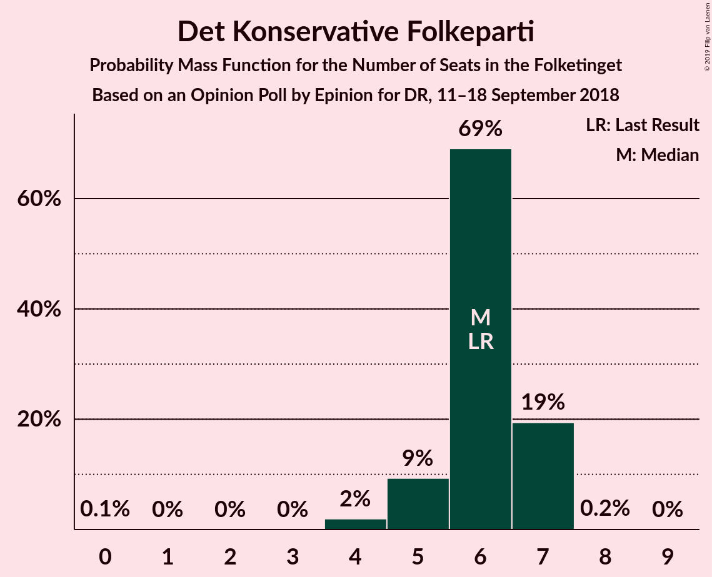

| Number of Seats | Probability | Accumulated | Special Marks |
|:---------------:|:-----------:|:-----------:|:-------------:|
| 0 | 0.1% | 100% |  |
| 1 | 0% | 99.9% |  |
| 2 | 0% | 99.9% |  |
| 3 | 0% | 99.9% |  |
| 4 | 2% | 99.9% |  |
| 5 | 9% | 98% |  |
| 6 | 69% | 89% | Last Result, Median |
| 7 | 19% | 20% |  |
| 8 | 0.2% | 0.2% |  |
| 9 | 0% | 0% |  |

### Nye Borgerlige

*For a full overview of the results for this party, see the [Nye Borgerlige](party-nyeborgerlige.html) page.*

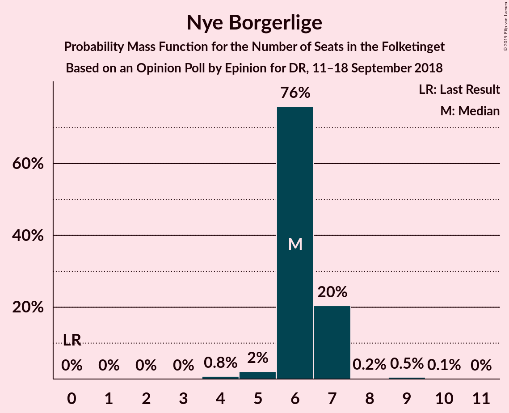

| Number of Seats | Probability | Accumulated | Special Marks |
|:---------------:|:-----------:|:-----------:|:-------------:|
| 0 | 0% | 100% | Last Result |
| 1 | 0% | 100% |  |
| 2 | 0% | 100% |  |
| 3 | 0% | 100% |  |
| 4 | 0.8% | 100% |  |
| 5 | 2% | 99.2% |  |
| 6 | 76% | 97% | Median |
| 7 | 20% | 21% |  |
| 8 | 0.2% | 0.8% |  |
| 9 | 0.5% | 0.6% |  |
| 10 | 0.1% | 0.1% |  |
| 11 | 0% | 0% |  |

### Kristendemokraterne

*For a full overview of the results for this party, see the [Kristendemokraterne](party-kristendemokraterne.html) page.*

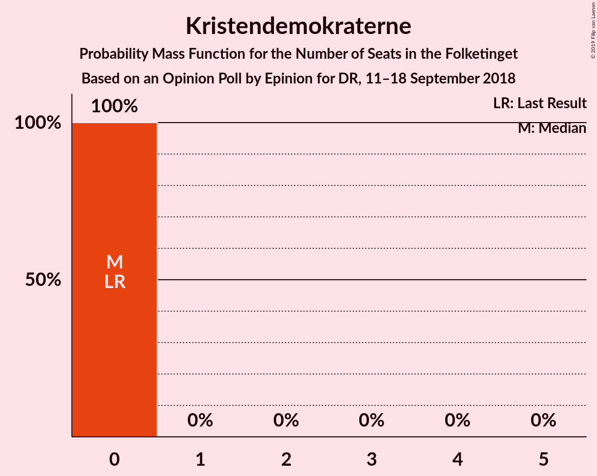

| Number of Seats | Probability | Accumulated | Special Marks |
|:---------------:|:-----------:|:-----------:|:-------------:|
| 0 | 100% | 100% | Last Result, Median |

## Coalitions

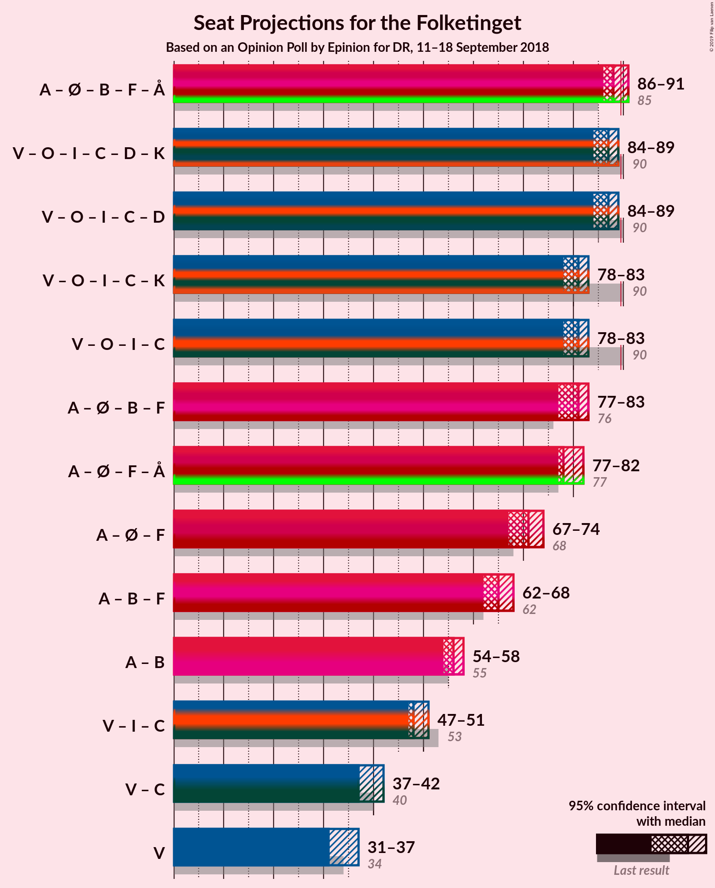

### Confidence Intervals

| Coalition | Last Result | Median | Majority? | 80% Confidence Interval | 90% Confidence Interval | 95% Confidence Interval | 99% Confidence Interval |
|:---------:|:-----------:|:------:|:---------:|:-----------------------:|:-----------------------:|:-----------------------:|:-----------------------:|
| Socialdemokraterne – Enhedslisten–De Rød-Grønne – Radikale Venstre – Socialistisk Folkeparti – Alternativet | 85 | 88 | 11% | 87–90 | 87–90 | 86–91 | 83–92 |
| Venstre – Dansk Folkeparti – Liberal Alliance – Det Konservative Folkeparti – Nye Borgerlige – Kristendemokraterne | 90 | 87 | 2% | 85–88 | 85–88 | 84–89 | 83–92 |
| Venstre – Dansk Folkeparti – Liberal Alliance – Det Konservative Folkeparti – Nye Borgerlige | 90 | 87 | 2% | 85–88 | 85–88 | 84–89 | 83–92 |
| Venstre – Dansk Folkeparti – Liberal Alliance – Det Konservative Folkeparti – Kristendemokraterne | 90 | 81 | 0% | 79–81 | 79–81 | 78–83 | 77–84 |
| Venstre – Dansk Folkeparti – Liberal Alliance – Det Konservative Folkeparti | 90 | 81 | 0% | 79–81 | 79–81 | 78–83 | 77–84 |
| Socialdemokraterne – Enhedslisten–De Rød-Grønne – Radikale Venstre – Socialistisk Folkeparti | 76 | 81 | 0% | 77–81 | 77–81 | 77–83 | 75–85 |
| Socialdemokraterne – Enhedslisten–De Rød-Grønne – Socialistisk Folkeparti – Alternativet | 77 | 78 | 0% | 77–79 | 77–82 | 77–82 | 73–84 |
| Socialdemokraterne – Enhedslisten–De Rød-Grønne – Socialistisk Folkeparti | 68 | 71 | 0% | 67–71 | 67–72 | 67–74 | 64–76 |
| Socialdemokraterne – Radikale Venstre – Socialistisk Folkeparti | 62 | 65 | 0% | 63–65 | 63–65 | 62–68 | 59–71 |
| Socialdemokraterne – Radikale Venstre | 55 | 56 | 0% | 56–57 | 56–57 | 54–58 | 50–63 |
| Venstre – Liberal Alliance – Det Konservative Folkeparti | 53 | 48 | 0% | 48–50 | 48–50 | 47–51 | 44–54 |
| Venstre – Det Konservative Folkeparti | 40 | 37 | 0% | 37–41 | 37–41 | 37–42 | 35–43 |
| Venstre | 34 | 31 | 0% | 31–35 | 31–36 | 31–37 | 30–38 |

### Socialdemokraterne – Enhedslisten–De Rød-Grønne – Radikale Venstre – Socialistisk Folkeparti – Alternativet

| Number of Seats | Probability | Accumulated | Special Marks |
|:---------------:|:-----------:|:-----------:|:-------------:|
| 81 | 0.1% | 100% |  |
| 82 | 0.3% | 99.9% |  |
| 83 | 0.2% | 99.6% |  |
| 84 | 0.7% | 99.4% |  |
| 85 | 0.2% | 98.6% | Last Result |
| 86 | 1.1% | 98% |  |
| 87 | 20% | 97% |  |
| 88 | 66% | 78% | Median |
| 89 | 0.4% | 11% |  |
| 90 | 8% | 11% | Majority |
| 91 | 1.1% | 3% |  |
| 92 | 1.3% | 2% |  |
| 93 | 0.2% | 0.3% |  |
| 94 | 0% | 0.2% |  |
| 95 | 0.1% | 0.1% |  |
| 96 | 0% | 0% |  |

### Venstre – Dansk Folkeparti – Liberal Alliance – Det Konservative Folkeparti – Nye Borgerlige – Kristendemokraterne

| Number of Seats | Probability | Accumulated | Special Marks |
|:---------------:|:-----------:|:-----------:|:-------------:|
| 80 | 0.1% | 100% |  |
| 81 | 0% | 99.9% |  |
| 82 | 0.2% | 99.8% |  |
| 83 | 1.3% | 99.7% |  |
| 84 | 1.1% | 98% |  |
| 85 | 8% | 97% |  |
| 86 | 0.4% | 89% |  |
| 87 | 66% | 89% | Median |
| 88 | 20% | 22% |  |
| 89 | 1.1% | 3% |  |
| 90 | 0.2% | 2% | Last Result, Majority |
| 91 | 0.7% | 1.4% |  |
| 92 | 0.2% | 0.6% |  |
| 93 | 0.3% | 0.4% |  |
| 94 | 0.1% | 0.1% |  |
| 95 | 0% | 0% |  |

### Venstre – Dansk Folkeparti – Liberal Alliance – Det Konservative Folkeparti – Nye Borgerlige

| Number of Seats | Probability | Accumulated | Special Marks |
|:---------------:|:-----------:|:-----------:|:-------------:|
| 80 | 0.1% | 100% |  |
| 81 | 0% | 99.9% |  |
| 82 | 0.2% | 99.8% |  |
| 83 | 1.3% | 99.7% |  |
| 84 | 1.1% | 98% |  |
| 85 | 8% | 97% |  |
| 86 | 0.4% | 89% |  |
| 87 | 66% | 89% | Median |
| 88 | 20% | 22% |  |
| 89 | 1.1% | 3% |  |
| 90 | 0.2% | 2% | Last Result, Majority |
| 91 | 0.7% | 1.4% |  |
| 92 | 0.2% | 0.6% |  |
| 93 | 0.3% | 0.4% |  |
| 94 | 0.1% | 0.1% |  |
| 95 | 0% | 0% |  |

### Venstre – Dansk Folkeparti – Liberal Alliance – Det Konservative Folkeparti – Kristendemokraterne

| Number of Seats | Probability | Accumulated | Special Marks |
|:---------------:|:-----------:|:-----------:|:-------------:|
| 74 | 0.1% | 100% |  |
| 75 | 0.1% | 99.9% |  |
| 76 | 0.1% | 99.8% |  |
| 77 | 2% | 99.6% |  |
| 78 | 0.8% | 98% |  |
| 79 | 7% | 97% |  |
| 80 | 1.5% | 90% |  |
| 81 | 85% | 88% | Median |
| 82 | 0.3% | 4% |  |
| 83 | 1.3% | 3% |  |
| 84 | 2% | 2% |  |
| 85 | 0.4% | 0.5% |  |
| 86 | 0.1% | 0.1% |  |
| 87 | 0% | 0% |  |
| 88 | 0% | 0% |  |
| 89 | 0% | 0% |  |
| 90 | 0% | 0% | Last Result, Majority |

### Venstre – Dansk Folkeparti – Liberal Alliance – Det Konservative Folkeparti

| Number of Seats | Probability | Accumulated | Special Marks |
|:---------------:|:-----------:|:-----------:|:-------------:|
| 74 | 0.1% | 100% |  |
| 75 | 0.1% | 99.9% |  |
| 76 | 0.1% | 99.8% |  |
| 77 | 2% | 99.6% |  |
| 78 | 0.8% | 98% |  |
| 79 | 7% | 97% |  |
| 80 | 1.5% | 90% |  |
| 81 | 85% | 88% | Median |
| 82 | 0.3% | 4% |  |
| 83 | 1.3% | 3% |  |
| 84 | 2% | 2% |  |
| 85 | 0.4% | 0.5% |  |
| 86 | 0.1% | 0.1% |  |
| 87 | 0% | 0% |  |
| 88 | 0% | 0% |  |
| 89 | 0% | 0% |  |
| 90 | 0% | 0% | Last Result, Majority |

### Socialdemokraterne – Enhedslisten–De Rød-Grønne – Radikale Venstre – Socialistisk Folkeparti

| Number of Seats | Probability | Accumulated | Special Marks |
|:---------------:|:-----------:|:-----------:|:-------------:|
| 74 | 0.4% | 100% |  |
| 75 | 0.9% | 99.5% |  |
| 76 | 1.0% | 98.6% | Last Result |
| 77 | 20% | 98% |  |
| 78 | 0.2% | 78% |  |
| 79 | 1.3% | 78% |  |
| 80 | 7% | 76% |  |
| 81 | 66% | 70% | Median |
| 82 | 1.2% | 4% |  |
| 83 | 1.3% | 3% |  |
| 84 | 0.2% | 2% |  |
| 85 | 1.2% | 1.4% |  |
| 86 | 0.1% | 0.2% |  |
| 87 | 0.1% | 0.1% |  |
| 88 | 0% | 0% |  |

### Socialdemokraterne – Enhedslisten–De Rød-Grønne – Socialistisk Folkeparti – Alternativet

| Number of Seats | Probability | Accumulated | Special Marks |
|:---------------:|:-----------:|:-----------:|:-------------:|
| 71 | 0.1% | 100% |  |
| 72 | 0.3% | 99.9% |  |
| 73 | 0.9% | 99.6% |  |
| 74 | 0.1% | 98.7% |  |
| 75 | 0.3% | 98.7% |  |
| 76 | 0.5% | 98% |  |
| 77 | 20% | 98% | Last Result |
| 78 | 66% | 78% | Median |
| 79 | 2% | 12% |  |
| 80 | 0.3% | 10% |  |
| 81 | 0.9% | 10% |  |
| 82 | 7% | 9% |  |
| 83 | 1.0% | 1.5% |  |
| 84 | 0.4% | 0.5% |  |
| 85 | 0% | 0.1% |  |
| 86 | 0% | 0.1% |  |
| 87 | 0.1% | 0.1% |  |
| 88 | 0% | 0% |  |

### Socialdemokraterne – Enhedslisten–De Rød-Grønne – Socialistisk Folkeparti

| Number of Seats | Probability | Accumulated | Special Marks |
|:---------------:|:-----------:|:-----------:|:-------------:|
| 64 | 1.0% | 100% |  |
| 65 | 0.3% | 99.0% |  |
| 66 | 0% | 98.6% |  |
| 67 | 20% | 98.6% |  |
| 68 | 2% | 79% | Last Result |
| 69 | 0.2% | 77% |  |
| 70 | 2% | 77% |  |
| 71 | 66% | 75% | Median |
| 72 | 6% | 9% |  |
| 73 | 0.2% | 3% |  |
| 74 | 1.2% | 3% |  |
| 75 | 0.2% | 1.5% |  |
| 76 | 0.8% | 1.3% |  |
| 77 | 0.4% | 0.5% |  |
| 78 | 0% | 0.1% |  |
| 79 | 0% | 0% |  |

### Socialdemokraterne – Radikale Venstre – Socialistisk Folkeparti

| Number of Seats | Probability | Accumulated | Special Marks |
|:---------------:|:-----------:|:-----------:|:-------------:|
| 59 | 0.8% | 100% |  |
| 60 | 0.3% | 99.1% |  |
| 61 | 1.2% | 98.8% |  |
| 62 | 0.3% | 98% | Last Result |
| 63 | 20% | 97% |  |
| 64 | 2% | 78% |  |
| 65 | 72% | 75% | Median |
| 66 | 0.7% | 3% |  |
| 67 | 0.2% | 3% |  |
| 68 | 2% | 3% |  |
| 69 | 0.1% | 1.0% |  |
| 70 | 0% | 0.9% |  |
| 71 | 0.8% | 0.9% |  |
| 72 | 0% | 0.1% |  |
| 73 | 0.1% | 0.1% |  |
| 74 | 0% | 0% |  |

### Socialdemokraterne – Radikale Venstre

| Number of Seats | Probability | Accumulated | Special Marks |
|:---------------:|:-----------:|:-----------:|:-------------:|
| 50 | 0.8% | 100% |  |
| 51 | 0% | 99.1% |  |
| 52 | 0.5% | 99.1% |  |
| 53 | 0.6% | 98.6% |  |
| 54 | 2% | 98% |  |
| 55 | 0.1% | 96% | Last Result |
| 56 | 85% | 96% | Median |
| 57 | 8% | 11% |  |
| 58 | 0.5% | 3% |  |
| 59 | 0.4% | 2% |  |
| 60 | 0.9% | 2% |  |
| 61 | 0.2% | 1.1% |  |
| 62 | 0% | 0.9% |  |
| 63 | 0.8% | 0.9% |  |
| 64 | 0.1% | 0.1% |  |
| 65 | 0% | 0% |  |

### Venstre – Liberal Alliance – Det Konservative Folkeparti

| Number of Seats | Probability | Accumulated | Special Marks |
|:---------------:|:-----------:|:-----------:|:-------------:|
| 41 | 0.1% | 100% |  |
| 42 | 0.1% | 99.9% |  |
| 43 | 0.1% | 99.8% |  |
| 44 | 0.3% | 99.7% |  |
| 45 | 0.2% | 99.4% |  |
| 46 | 0.3% | 99.2% |  |
| 47 | 2% | 99.0% |  |
| 48 | 67% | 97% | Median |
| 49 | 19% | 30% |  |
| 50 | 8% | 11% |  |
| 51 | 1.1% | 3% |  |
| 52 | 0% | 2% |  |
| 53 | 0.1% | 2% | Last Result |
| 54 | 1.3% | 2% |  |
| 55 | 0.3% | 0.3% |  |
| 56 | 0% | 0% |  |

### Venstre – Det Konservative Folkeparti

| Number of Seats | Probability | Accumulated | Special Marks |
|:---------------:|:-----------:|:-----------:|:-------------:|
| 33 | 0.1% | 100% |  |
| 34 | 0.4% | 99.9% |  |
| 35 | 0.1% | 99.5% |  |
| 36 | 0.9% | 99.4% |  |
| 37 | 65% | 98% | Median |
| 38 | 3% | 33% |  |
| 39 | 19% | 30% |  |
| 40 | 0.3% | 11% | Last Result |
| 41 | 7% | 10% |  |
| 42 | 2% | 4% |  |
| 43 | 1.3% | 2% |  |
| 44 | 0% | 0.2% |  |
| 45 | 0% | 0.1% |  |
| 46 | 0.1% | 0.1% |  |
| 47 | 0% | 0% |  |

### Venstre

| Number of Seats | Probability | Accumulated | Special Marks |
|:---------------:|:-----------:|:-----------:|:-------------:|
| 27 | 0.4% | 100% |  |
| 28 | 0% | 99.6% |  |
| 29 | 0% | 99.6% |  |
| 30 | 0.9% | 99.6% |  |
| 31 | 66% | 98.7% | Median |
| 32 | 20% | 33% |  |
| 33 | 1.5% | 14% |  |
| 34 | 1.3% | 12% | Last Result |
| 35 | 1.1% | 11% |  |
| 36 | 7% | 10% |  |
| 37 | 2% | 3% |  |
| 38 | 0.7% | 0.8% |  |
| 39 | 0% | 0.1% |  |
| 40 | 0% | 0.1% |  |
| 41 | 0.1% | 0.1% |  |
| 42 | 0% | 0% |  |

## Technical Information

### Opinion Poll

+ **Polling firm:** Epinion
+ **Commissioner(s):** DR
+ **Fieldwork period:** 11–18 September 2018

### Calculations

+ **Sample size:** 1537
+ **Simulations done:** 131,072
+ **Error estimate:** 1.77%

