# Opinion Poll by Megafon for Politiken and TV 2, 27 September 2018

<a href="#voting-intentions">Voting Intentions</a> | <a href="#seats">Seats</a> | <a href="#coalitions">Coalitions</a> | <a href="#technical-information">Technical Information</a>

## Voting Intentions

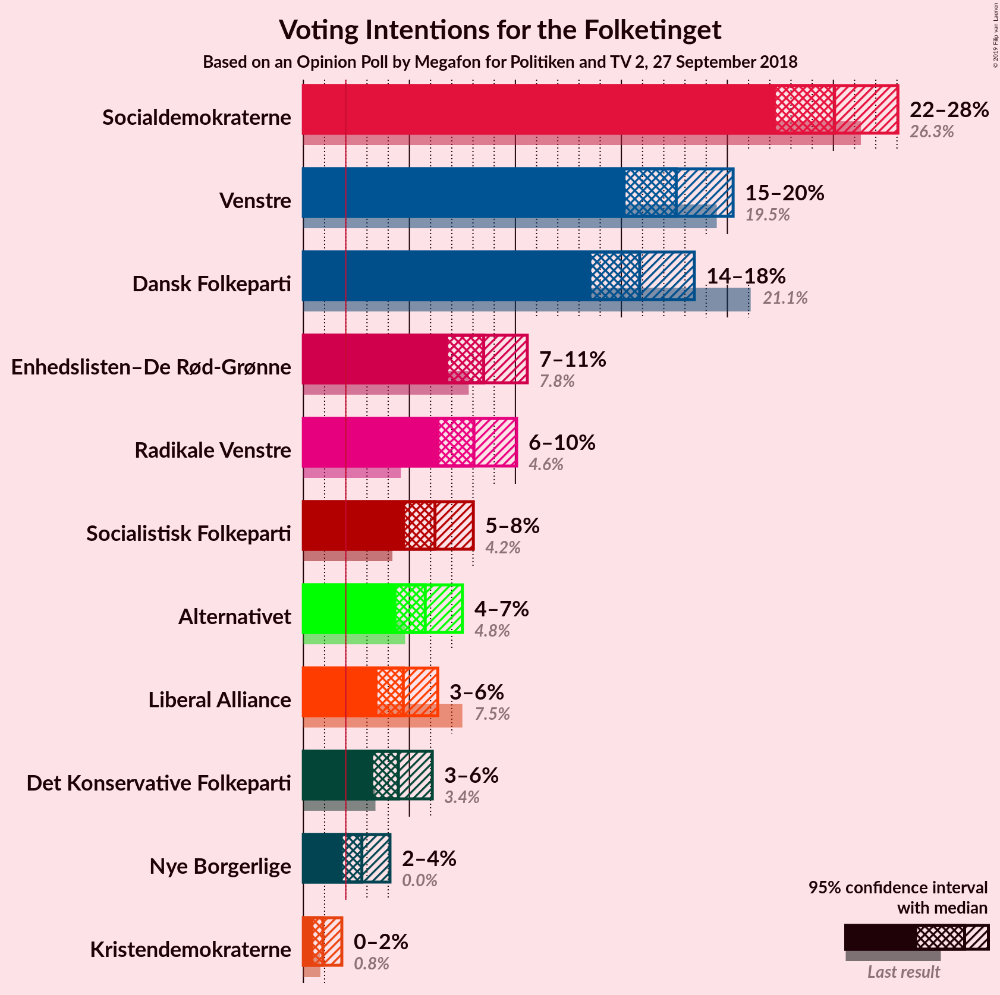

### Confidence Intervals

| Party | Last Result | Poll Result | 80% Confidence Interval | 90% Confidence Interval | 95% Confidence Interval | 99% Confidence Interval |
|:-----:|:-----------:|:-----------:|:-----------------------:|:-----------------------:|:-----------------------:|:-----------------------:|
| Socialdemokraterne | 26.3% | 25.1% | 23.2–27.0% |22.7–27.6% |22.3–28.0% |21.4–29.0% |
| Venstre | 19.5% | 17.6% | 16.0–19.3% |15.6–19.8% |15.2–20.3% |14.5–21.1% |
| Dansk Folkeparti | 21.1% | 15.9% | 14.4–17.6% |13.9–18.0% |13.6–18.4% |12.9–19.3% |
| Enhedslisten–De Rød-Grønne | 7.8% | 8.5% | 7.4–9.8% |7.1–10.2% |6.8–10.6% |6.3–11.2% |
| Radikale Venstre | 4.6% | 8.0% | 7.0–9.4% |6.7–9.7% |6.4–10.1% |5.9–10.7% |
| Socialistisk Folkeparti | 4.2% | 6.2% | 5.3–7.4% |5.0–7.7% |4.8–8.0% |4.4–8.6% |
| Alternativet | 4.8% | 5.7% | 4.8–6.9% |4.6–7.2% |4.4–7.5% |4.0–8.1% |
| Liberal Alliance | 7.5% | 4.7% | 3.9–5.8% |3.7–6.1% |3.5–6.3% |3.1–6.9% |
| Det Konservative Folkeparti | 3.4% | 4.5% | 3.7–5.5% |3.5–5.8% |3.3–6.1% |3.0–6.6% |
| Nye Borgerlige | 0.0% | 2.8% | 2.2–3.6% |2.0–3.9% |1.9–4.1% |1.6–4.5% |
| Kristendemokraterne | 0.8% | 0.9% | 0.6–1.5% |0.5–1.7% |0.5–1.8% |0.4–2.1% |

*Note:* The poll result column reflects the actual value used in the calculations. Published results may vary slightly, and in addition be rounded to fewer digits.

## Seats

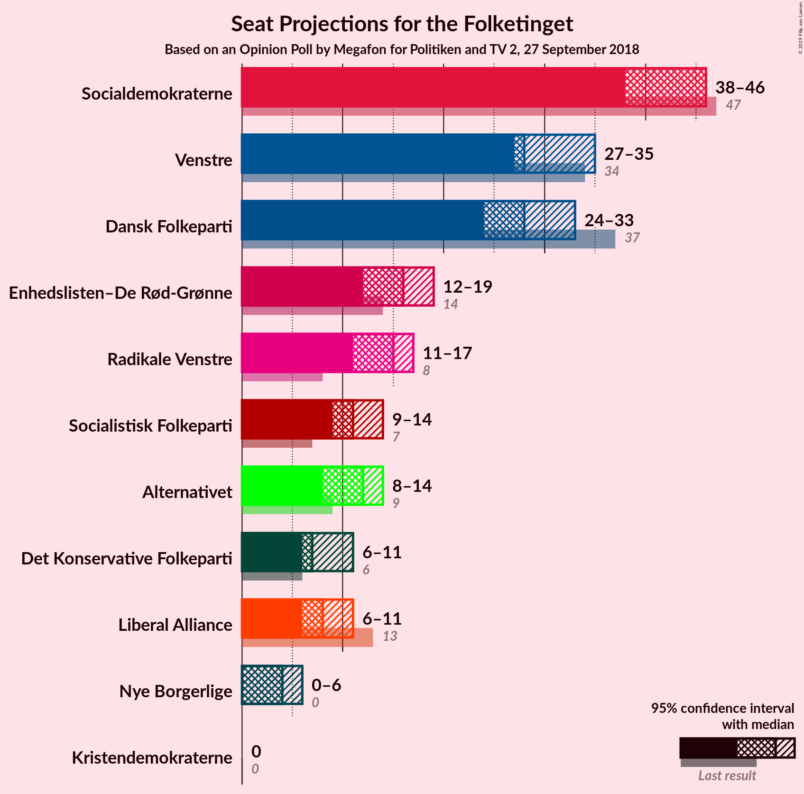

### Confidence Intervals

| Party | Last Result | Median | 80% Confidence Interval | 90% Confidence Interval | 95% Confidence Interval | 99% Confidence Interval |
|:-----:|:-----------:|:------:|:-----------------------:|:-----------------------:|:-----------------------:|:-----------------------:|
| <a href="#socialdemokraterne">Socialdemokraterne</a> | 47 | 46 | 42–46 |38–46 |38–46 |38–49 |
| <a href="#venstre">Venstre</a> | 34 | 28 | 28–33 |27–35 |27–35 |26–37 |
| <a href="#dansk-folkeparti">Dansk Folkeparti</a> | 37 | 28 | 26–30 |24–31 |24–33 |22–35 |
| <a href="#enhedslisten–de-rød-grønne">Enhedslisten–De Rød-Grønne</a> | 14 | 16 | 14–17 |13–18 |12–19 |11–20 |
| <a href="#radikale-venstre">Radikale Venstre</a> | 8 | 15 | 11–15 |11–16 |11–17 |11–18 |
| <a href="#socialistisk-folkeparti">Socialistisk Folkeparti</a> | 7 | 11 | 10–13 |9–13 |9–14 |8–15 |
| <a href="#alternativet">Alternativet</a> | 9 | 12 | 9–12 |9–13 |8–14 |7–15 |
| <a href="#liberal-alliance">Liberal Alliance</a> | 13 | 8 | 7–10 |6–10 |6–11 |6–12 |
| <a href="#det-konservative-folkeparti">Det Konservative Folkeparti</a> | 6 | 7 | 7–9 |6–10 |6–11 |5–11 |
| <a href="#nye-borgerlige">Nye Borgerlige</a> | 0 | 4 | 4–5 |4–6 |0–6 |0–8 |
| <a href="#kristendemokraterne">Kristendemokraterne</a> | 0 | 0 | 0 |0 |0 |0 |

### Socialdemokraterne

*For a full overview of the results for this party, see the [Socialdemokraterne](party-socialdemokraterne.html) page.*

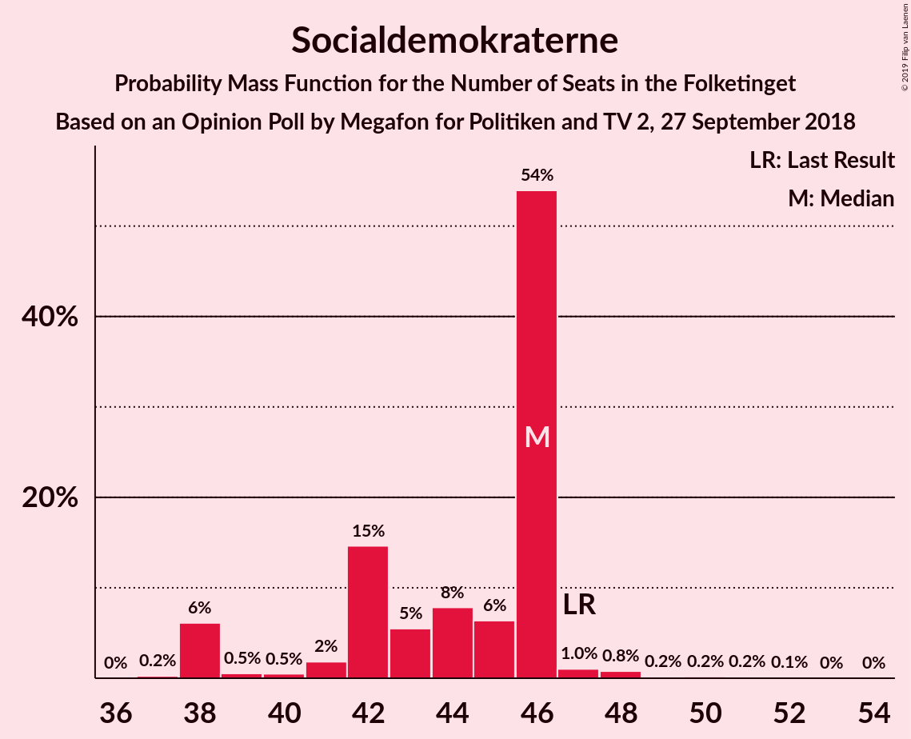

| Number of Seats | Probability | Accumulated | Special Marks |
|:---------------:|:-----------:|:-----------:|:-------------:|
| 36 | 0% | 100% |  |
| 37 | 0.2% | 99.9% |  |
| 38 | 6% | 99.7% |  |
| 39 | 0.5% | 94% |  |
| 40 | 0.5% | 93% |  |
| 41 | 2% | 93% |  |
| 42 | 15% | 91% |  |
| 43 | 5% | 76% |  |
| 44 | 8% | 71% |  |
| 45 | 6% | 63% |  |
| 46 | 54% | 56% | Median |
| 47 | 1.0% | 2% | Last Result |
| 48 | 0.8% | 1.4% |  |
| 49 | 0.2% | 0.6% |  |
| 50 | 0.2% | 0.4% |  |
| 51 | 0.2% | 0.3% |  |
| 52 | 0.1% | 0.1% |  |
| 53 | 0% | 0% |  |

### Venstre

*For a full overview of the results for this party, see the [Venstre](party-venstre.html) page.*

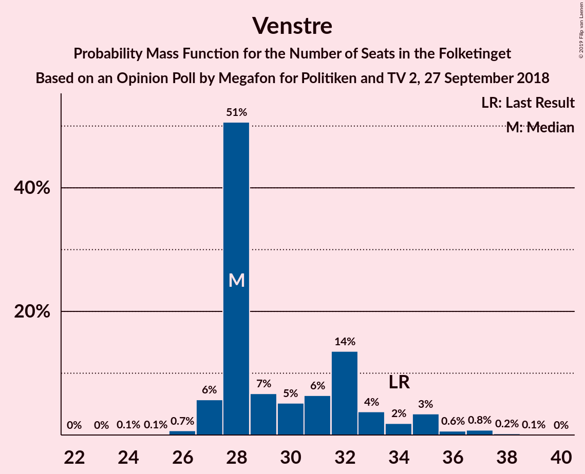

| Number of Seats | Probability | Accumulated | Special Marks |
|:---------------:|:-----------:|:-----------:|:-------------:|
| 24 | 0.1% | 100% |  |
| 25 | 0.1% | 99.9% |  |
| 26 | 0.7% | 99.7% |  |
| 27 | 6% | 99.0% |  |
| 28 | 51% | 93% | Median |
| 29 | 7% | 43% |  |
| 30 | 5% | 36% |  |
| 31 | 6% | 31% |  |
| 32 | 14% | 24% |  |
| 33 | 4% | 11% |  |
| 34 | 2% | 7% | Last Result |
| 35 | 3% | 5% |  |
| 36 | 0.6% | 2% |  |
| 37 | 0.8% | 1.1% |  |
| 38 | 0.2% | 0.3% |  |
| 39 | 0.1% | 0.1% |  |
| 40 | 0% | 0% |  |

### Dansk Folkeparti

*For a full overview of the results for this party, see the [Dansk Folkeparti](party-danskfolkeparti.html) page.*

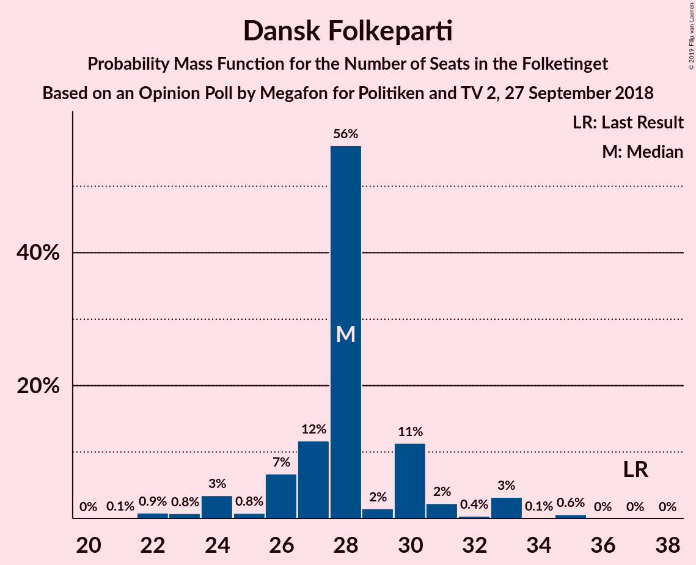

| Number of Seats | Probability | Accumulated | Special Marks |
|:---------------:|:-----------:|:-----------:|:-------------:|
| 21 | 0.1% | 100% |  |
| 22 | 0.9% | 99.9% |  |
| 23 | 0.8% | 99.1% |  |
| 24 | 3% | 98% |  |
| 25 | 0.8% | 95% |  |
| 26 | 7% | 94% |  |
| 27 | 12% | 87% |  |
| 28 | 56% | 76% | Median |
| 29 | 2% | 19% |  |
| 30 | 11% | 18% |  |
| 31 | 2% | 7% |  |
| 32 | 0.4% | 4% |  |
| 33 | 3% | 4% |  |
| 34 | 0.1% | 0.7% |  |
| 35 | 0.6% | 0.6% |  |
| 36 | 0% | 0% |  |
| 37 | 0% | 0% | Last Result |

### Enhedslisten–De Rød-Grønne

*For a full overview of the results for this party, see the [Enhedslisten–De Rød-Grønne](party-enhedslisten–derød-grønne.html) page.*

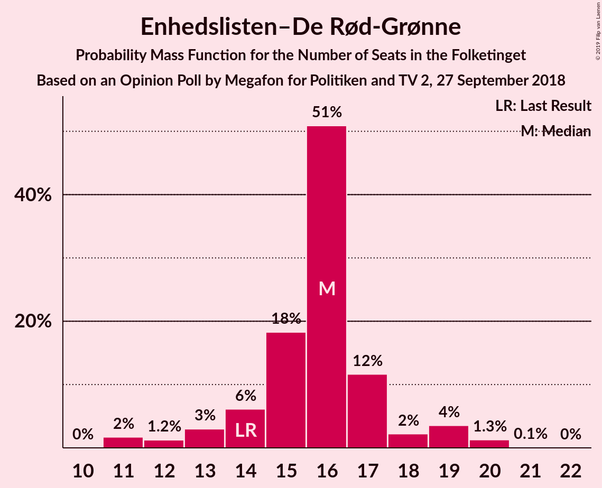

| Number of Seats | Probability | Accumulated | Special Marks |
|:---------------:|:-----------:|:-----------:|:-------------:|
| 11 | 2% | 100% |  |
| 12 | 1.2% | 98% |  |
| 13 | 3% | 97% |  |
| 14 | 6% | 94% | Last Result |
| 15 | 18% | 88% |  |
| 16 | 51% | 70% | Median |
| 17 | 12% | 19% |  |
| 18 | 2% | 7% |  |
| 19 | 4% | 5% |  |
| 20 | 1.3% | 1.3% |  |
| 21 | 0.1% | 0.1% |  |
| 22 | 0% | 0% |  |

### Radikale Venstre

*For a full overview of the results for this party, see the [Radikale Venstre](party-radikalevenstre.html) page.*

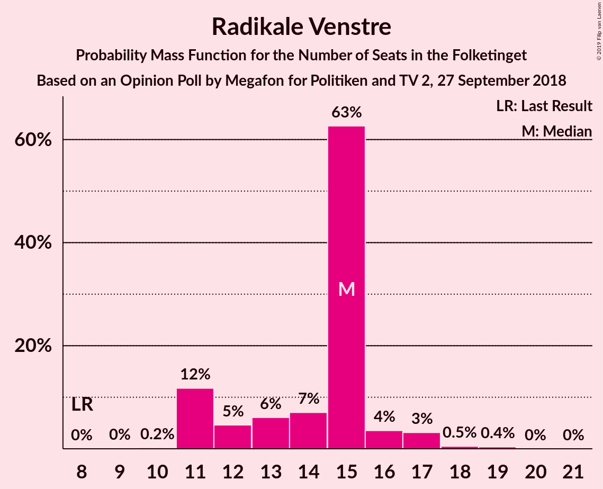

| Number of Seats | Probability | Accumulated | Special Marks |
|:---------------:|:-----------:|:-----------:|:-------------:|
| 8 | 0% | 100% | Last Result |
| 9 | 0% | 100% |  |
| 10 | 0.2% | 100% |  |
| 11 | 12% | 99.7% |  |
| 12 | 5% | 88% |  |
| 13 | 6% | 83% |  |
| 14 | 7% | 77% |  |
| 15 | 63% | 70% | Median |
| 16 | 4% | 8% |  |
| 17 | 3% | 4% |  |
| 18 | 0.5% | 0.9% |  |
| 19 | 0.4% | 0.4% |  |
| 20 | 0% | 0.1% |  |
| 21 | 0% | 0% |  |

### Socialistisk Folkeparti

*For a full overview of the results for this party, see the [Socialistisk Folkeparti](party-socialistiskfolkeparti.html) page.*

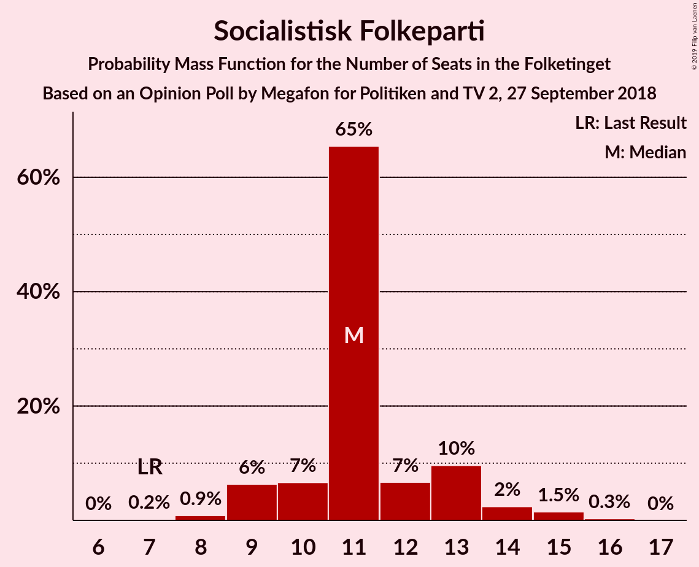

| Number of Seats | Probability | Accumulated | Special Marks |
|:---------------:|:-----------:|:-----------:|:-------------:|
| 7 | 0.2% | 100% | Last Result |
| 8 | 0.9% | 99.8% |  |
| 9 | 6% | 98.9% |  |
| 10 | 7% | 93% |  |
| 11 | 65% | 86% | Median |
| 12 | 7% | 21% |  |
| 13 | 10% | 14% |  |
| 14 | 2% | 4% |  |
| 15 | 1.5% | 2% |  |
| 16 | 0.3% | 0.3% |  |
| 17 | 0% | 0% |  |

### Alternativet

*For a full overview of the results for this party, see the [Alternativet](party-alternativet.html) page.*

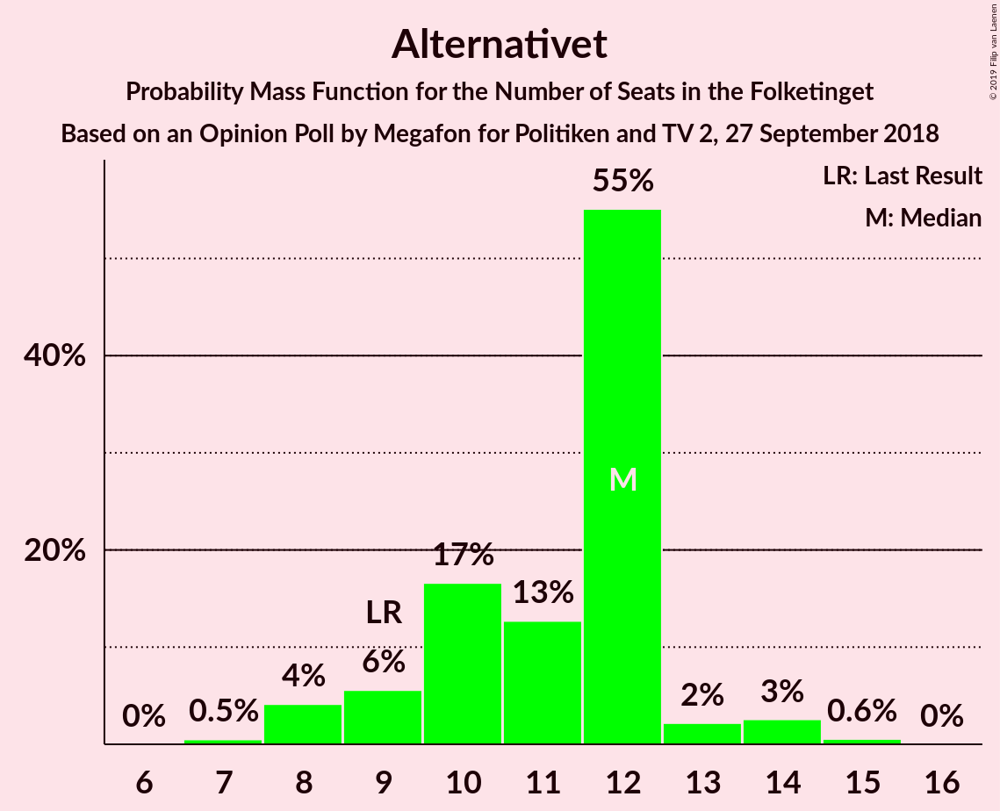

| Number of Seats | Probability | Accumulated | Special Marks |
|:---------------:|:-----------:|:-----------:|:-------------:|
| 7 | 0.5% | 100% |  |
| 8 | 4% | 99.5% |  |
| 9 | 6% | 95% | Last Result |
| 10 | 17% | 90% |  |
| 11 | 13% | 73% |  |
| 12 | 55% | 60% | Median |
| 13 | 2% | 5% |  |
| 14 | 3% | 3% |  |
| 15 | 0.6% | 0.6% |  |
| 16 | 0% | 0% |  |

### Liberal Alliance

*For a full overview of the results for this party, see the [Liberal Alliance](party-liberalalliance.html) page.*

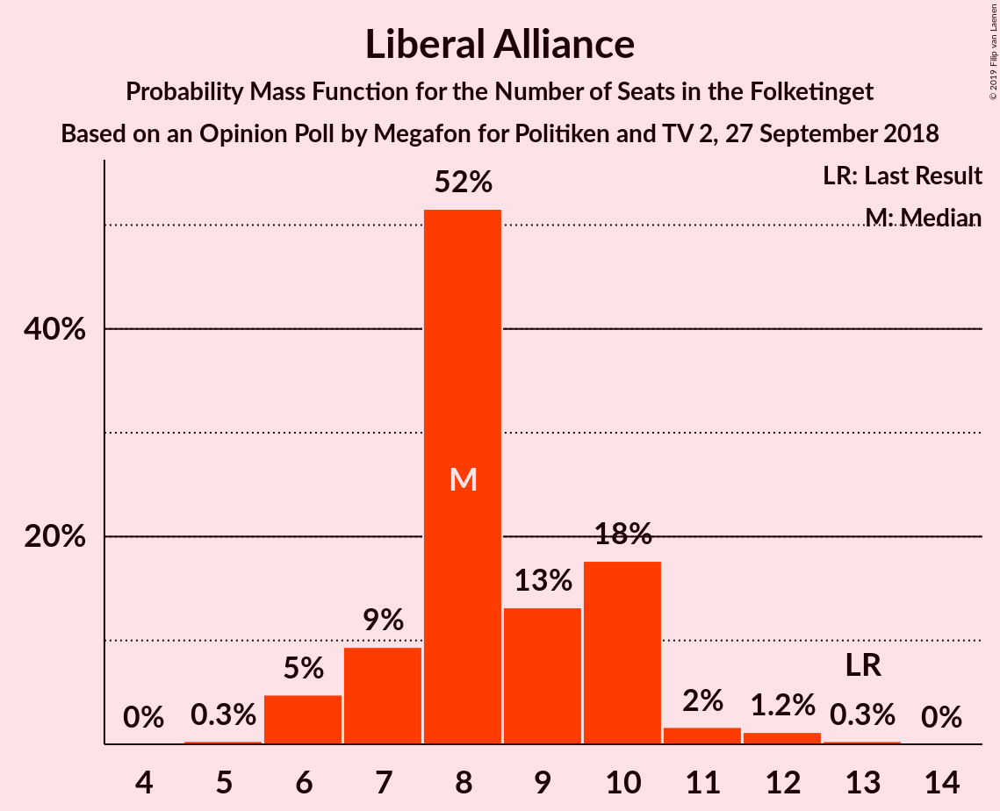

| Number of Seats | Probability | Accumulated | Special Marks |
|:---------------:|:-----------:|:-----------:|:-------------:|
| 5 | 0.3% | 100% |  |
| 6 | 5% | 99.7% |  |
| 7 | 9% | 95% |  |
| 8 | 52% | 86% | Median |
| 9 | 13% | 34% |  |
| 10 | 18% | 21% |  |
| 11 | 2% | 3% |  |
| 12 | 1.2% | 1.5% |  |
| 13 | 0.3% | 0.3% | Last Result |
| 14 | 0% | 0% |  |

### Det Konservative Folkeparti

*For a full overview of the results for this party, see the [Det Konservative Folkeparti](party-detkonservativefolkeparti.html) page.*

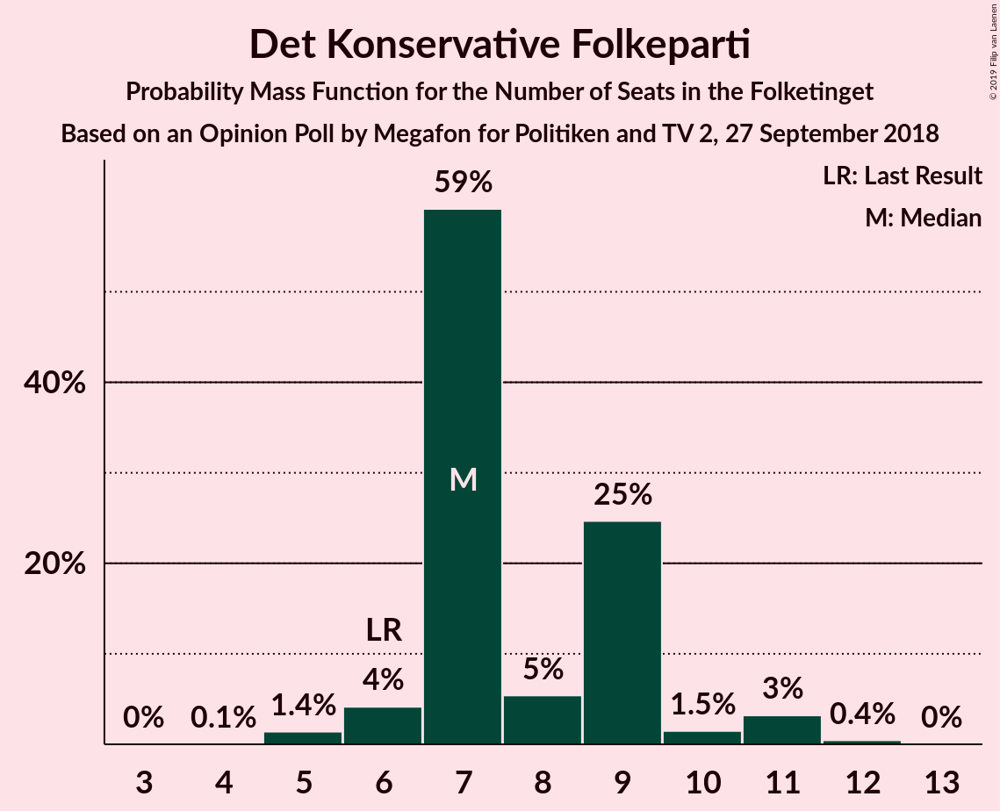

| Number of Seats | Probability | Accumulated | Special Marks |
|:---------------:|:-----------:|:-----------:|:-------------:|
| 4 | 0.1% | 100% |  |
| 5 | 1.4% | 99.9% |  |
| 6 | 4% | 98.5% | Last Result |
| 7 | 59% | 94% | Median |
| 8 | 5% | 35% |  |
| 9 | 25% | 30% |  |
| 10 | 1.5% | 5% |  |
| 11 | 3% | 4% |  |
| 12 | 0.4% | 0.5% |  |
| 13 | 0% | 0% |  |

### Nye Borgerlige

*For a full overview of the results for this party, see the [Nye Borgerlige](party-nyeborgerlige.html) page.*

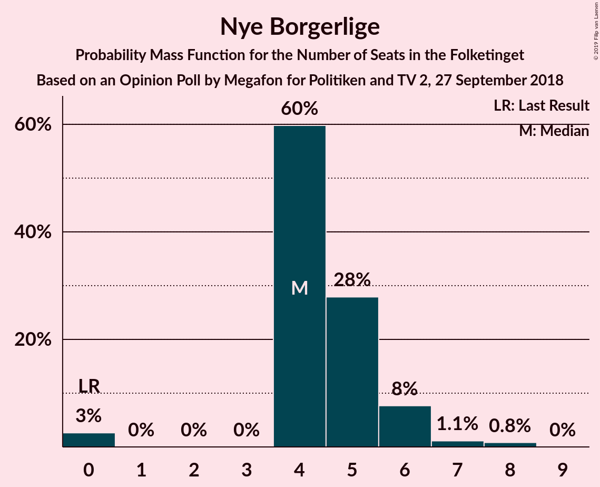

| Number of Seats | Probability | Accumulated | Special Marks |
|:---------------:|:-----------:|:-----------:|:-------------:|
| 0 | 3% | 100% | Last Result |
| 1 | 0% | 97% |  |
| 2 | 0% | 97% |  |
| 3 | 0% | 97% |  |
| 4 | 60% | 97% | Median |
| 5 | 28% | 38% |  |
| 6 | 8% | 10% |  |
| 7 | 1.1% | 2% |  |
| 8 | 0.8% | 0.9% |  |
| 9 | 0% | 0% |  |

### Kristendemokraterne

*For a full overview of the results for this party, see the [Kristendemokraterne](party-kristendemokraterne.html) page.*

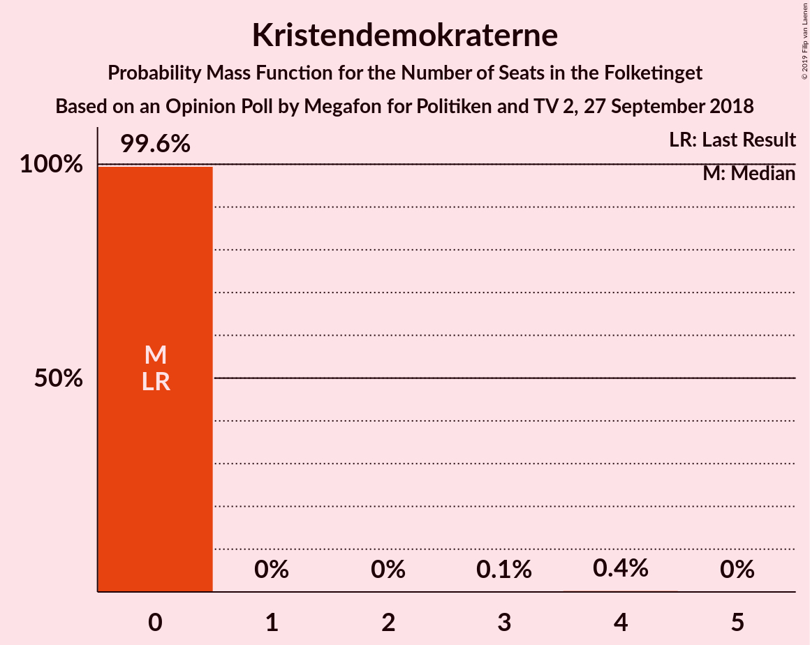

| Number of Seats | Probability | Accumulated | Special Marks |
|:---------------:|:-----------:|:-----------:|:-------------:|
| 0 | 99.6% | 100% | Last Result, Median |
| 1 | 0% | 0.4% |  |
| 2 | 0% | 0.4% |  |
| 3 | 0.1% | 0.4% |  |
| 4 | 0.4% | 0.4% |  |
| 5 | 0% | 0% |  |

## Coalitions

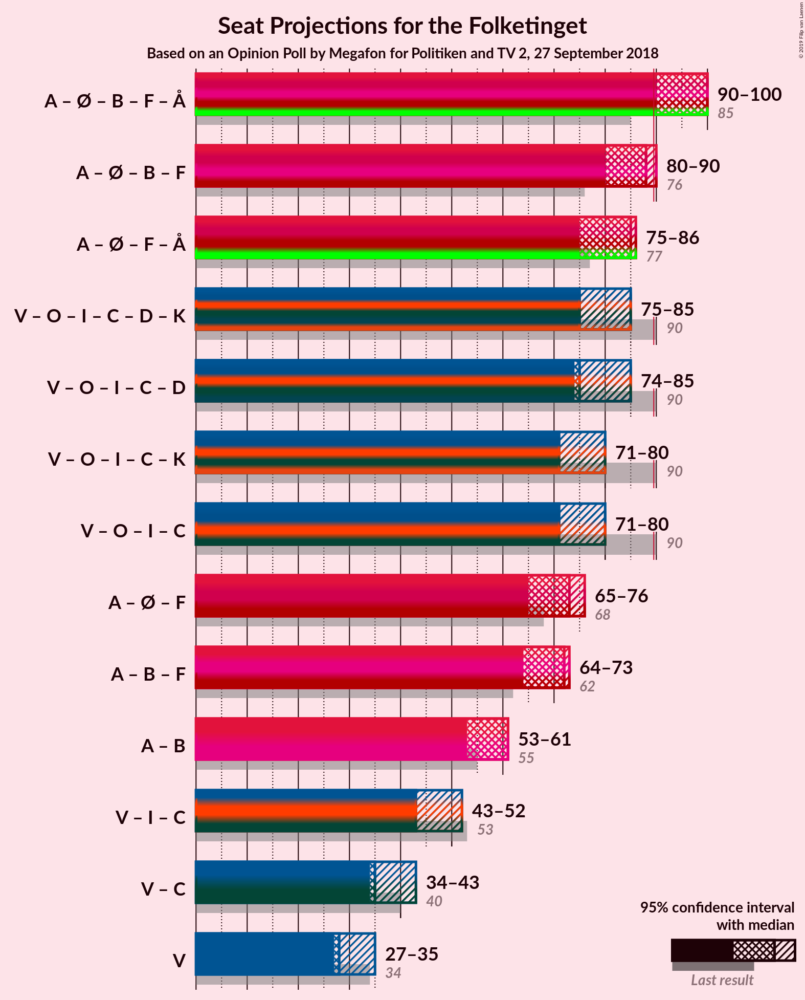

### Confidence Intervals

| Coalition | Last Result | Median | Majority? | 80% Confidence Interval | 90% Confidence Interval | 95% Confidence Interval | 99% Confidence Interval |
|:---------:|:-----------:|:------:|:---------:|:-----------------------:|:-----------------------:|:-----------------------:|:-----------------------:|
| Socialdemokraterne – Enhedslisten–De Rød-Grønne – Radikale Venstre – Socialistisk Folkeparti – Alternativet | 85 | 100 | 98.7% | 91–100 | 91–100 | 90–100 | 88–101 |
| Socialdemokraterne – Enhedslisten–De Rød-Grønne – Radikale Venstre – Socialistisk Folkeparti | 76 | 88 | 3% | 81–88 | 80–89 | 80–90 | 77–91 |
| Socialdemokraterne – Enhedslisten–De Rød-Grønne – Socialistisk Folkeparti – Alternativet | 77 | 85 | 0.1% | 76–85 | 76–85 | 75–86 | 74–87 |
| Venstre – Dansk Folkeparti – Liberal Alliance – Det Konservative Folkeparti – Nye Borgerlige – Kristendemokraterne | 90 | 75 | 0.1% | 75–84 | 75–84 | 75–85 | 74–87 |
| Venstre – Dansk Folkeparti – Liberal Alliance – Det Konservative Folkeparti – Nye Borgerlige | 90 | 75 | 0.1% | 75–84 | 75–84 | 74–85 | 74–86 |
| Venstre – Dansk Folkeparti – Liberal Alliance – Det Konservative Folkeparti – Kristendemokraterne | 90 | 71 | 0% | 71–79 | 71–80 | 71–80 | 69–82 |
| Venstre – Dansk Folkeparti – Liberal Alliance – Det Konservative Folkeparti | 90 | 71 | 0% | 71–79 | 71–80 | 71–80 | 69–82 |
| Socialdemokraterne – Enhedslisten–De Rød-Grønne – Socialistisk Folkeparti | 68 | 73 | 0% | 66–73 | 66–75 | 65–76 | 63–77 |
| Socialdemokraterne – Radikale Venstre – Socialistisk Folkeparti | 62 | 72 | 0% | 65–72 | 64–72 | 64–73 | 63–76 |
| Socialdemokraterne – Radikale Venstre | 55 | 61 | 0% | 53–61 | 53–61 | 53–61 | 52–65 |
| Venstre – Liberal Alliance – Det Konservative Folkeparti | 53 | 43 | 0% | 43–51 | 43–52 | 43–52 | 41–54 |
| Venstre – Det Konservative Folkeparti | 40 | 35 | 0% | 35–41 | 35–42 | 34–43 | 33–45 |
| Venstre | 34 | 28 | 0% | 28–33 | 27–35 | 27–35 | 26–37 |

### Socialdemokraterne – Enhedslisten–De Rød-Grønne – Radikale Venstre – Socialistisk Folkeparti – Alternativet

| Number of Seats | Probability | Accumulated | Special Marks |
|:---------------:|:-----------:|:-----------:|:-------------:|
| 85 | 0.1% | 100% | Last Result |
| 86 | 0% | 99.9% |  |
| 87 | 0.2% | 99.8% |  |
| 88 | 0.2% | 99.7% |  |
| 89 | 0.8% | 99.5% |  |
| 90 | 3% | 98.7% | Majority |
| 91 | 6% | 95% |  |
| 92 | 13% | 90% |  |
| 93 | 6% | 76% |  |
| 94 | 3% | 71% |  |
| 95 | 2% | 67% |  |
| 96 | 1.3% | 66% |  |
| 97 | 3% | 64% |  |
| 98 | 6% | 61% |  |
| 99 | 4% | 55% |  |
| 100 | 48% | 51% | Median |
| 101 | 2% | 2% |  |
| 102 | 0.1% | 0.3% |  |
| 103 | 0.1% | 0.2% |  |
| 104 | 0% | 0.1% |  |
| 105 | 0% | 0.1% |  |
| 106 | 0% | 0% |  |

### Socialdemokraterne – Enhedslisten–De Rød-Grønne – Radikale Venstre – Socialistisk Folkeparti

| Number of Seats | Probability | Accumulated | Special Marks |
|:---------------:|:-----------:|:-----------:|:-------------:|
| 74 | 0.1% | 100% |  |
| 75 | 0.1% | 99.9% |  |
| 76 | 0.1% | 99.8% | Last Result |
| 77 | 0.2% | 99.7% |  |
| 78 | 0.2% | 99.5% |  |
| 79 | 0.6% | 99.3% |  |
| 80 | 4% | 98.7% |  |
| 81 | 17% | 94% |  |
| 82 | 4% | 77% |  |
| 83 | 4% | 73% |  |
| 84 | 3% | 69% |  |
| 85 | 2% | 66% |  |
| 86 | 5% | 64% |  |
| 87 | 2% | 59% |  |
| 88 | 51% | 57% | Median |
| 89 | 4% | 7% |  |
| 90 | 2% | 3% | Majority |
| 91 | 0.4% | 0.8% |  |
| 92 | 0.1% | 0.4% |  |
| 93 | 0.2% | 0.3% |  |
| 94 | 0% | 0.1% |  |
| 95 | 0% | 0.1% |  |
| 96 | 0.1% | 0.1% |  |
| 97 | 0% | 0% |  |

### Socialdemokraterne – Enhedslisten–De Rød-Grønne – Socialistisk Folkeparti – Alternativet

| Number of Seats | Probability | Accumulated | Special Marks |
|:---------------:|:-----------:|:-----------:|:-------------:|
| 71 | 0.1% | 100% |  |
| 72 | 0.1% | 99.9% |  |
| 73 | 0.1% | 99.7% |  |
| 74 | 0.4% | 99.6% |  |
| 75 | 4% | 99.2% |  |
| 76 | 6% | 95% |  |
| 77 | 1.0% | 89% | Last Result |
| 78 | 5% | 88% |  |
| 79 | 2% | 84% |  |
| 80 | 4% | 82% |  |
| 81 | 11% | 78% |  |
| 82 | 3% | 67% |  |
| 83 | 4% | 63% |  |
| 84 | 3% | 59% |  |
| 85 | 54% | 56% | Median |
| 86 | 2% | 3% |  |
| 87 | 1.0% | 1.2% |  |
| 88 | 0.1% | 0.3% |  |
| 89 | 0.1% | 0.2% |  |
| 90 | 0.1% | 0.1% | Majority |
| 91 | 0% | 0% |  |

### Venstre – Dansk Folkeparti – Liberal Alliance – Det Konservative Folkeparti – Nye Borgerlige – Kristendemokraterne

| Number of Seats | Probability | Accumulated | Special Marks |
|:---------------:|:-----------:|:-----------:|:-------------:|
| 70 | 0% | 100% |  |
| 71 | 0% | 99.9% |  |
| 72 | 0.1% | 99.9% |  |
| 73 | 0.1% | 99.8% |  |
| 74 | 2% | 99.7% |  |
| 75 | 48% | 98% | Median |
| 76 | 4% | 49% |  |
| 77 | 6% | 45% |  |
| 78 | 3% | 39% |  |
| 79 | 1.3% | 36% |  |
| 80 | 2% | 34% |  |
| 81 | 3% | 33% |  |
| 82 | 6% | 29% |  |
| 83 | 13% | 24% |  |
| 84 | 6% | 10% |  |
| 85 | 3% | 5% |  |
| 86 | 0.8% | 1.3% |  |
| 87 | 0.2% | 0.5% |  |
| 88 | 0.2% | 0.3% |  |
| 89 | 0% | 0.2% |  |
| 90 | 0.1% | 0.1% | Last Result, Majority |
| 91 | 0% | 0% |  |

### Venstre – Dansk Folkeparti – Liberal Alliance – Det Konservative Folkeparti – Nye Borgerlige

| Number of Seats | Probability | Accumulated | Special Marks |
|:---------------:|:-----------:|:-----------:|:-------------:|
| 70 | 0% | 100% |  |
| 71 | 0% | 99.9% |  |
| 72 | 0.2% | 99.9% |  |
| 73 | 0.1% | 99.7% |  |
| 74 | 2% | 99.6% |  |
| 75 | 48% | 97% | Median |
| 76 | 4% | 49% |  |
| 77 | 6% | 45% |  |
| 78 | 3% | 39% |  |
| 79 | 1.4% | 36% |  |
| 80 | 2% | 34% |  |
| 81 | 3% | 32% |  |
| 82 | 6% | 29% |  |
| 83 | 13% | 24% |  |
| 84 | 5% | 10% |  |
| 85 | 3% | 5% |  |
| 86 | 0.8% | 1.2% |  |
| 87 | 0.1% | 0.4% |  |
| 88 | 0.2% | 0.3% |  |
| 89 | 0% | 0.1% |  |
| 90 | 0.1% | 0.1% | Last Result, Majority |
| 91 | 0% | 0% |  |

### Venstre – Dansk Folkeparti – Liberal Alliance – Det Konservative Folkeparti – Kristendemokraterne

| Number of Seats | Probability | Accumulated | Special Marks |
|:---------------:|:-----------:|:-----------:|:-------------:|
| 67 | 0% | 100% |  |
| 68 | 0.3% | 99.9% |  |
| 69 | 1.1% | 99.6% |  |
| 70 | 0.8% | 98% |  |
| 71 | 53% | 98% | Median |
| 72 | 4% | 45% |  |
| 73 | 2% | 41% |  |
| 74 | 3% | 38% |  |
| 75 | 2% | 35% |  |
| 76 | 4% | 33% |  |
| 77 | 6% | 29% |  |
| 78 | 12% | 23% |  |
| 79 | 2% | 11% |  |
| 80 | 8% | 9% |  |
| 81 | 0.5% | 1.5% |  |
| 82 | 0.6% | 1.0% |  |
| 83 | 0.2% | 0.4% |  |
| 84 | 0.1% | 0.2% |  |
| 85 | 0% | 0.1% |  |
| 86 | 0.1% | 0.1% |  |
| 87 | 0% | 0% |  |
| 88 | 0% | 0% |  |
| 89 | 0% | 0% |  |
| 90 | 0% | 0% | Last Result, Majority |

### Venstre – Dansk Folkeparti – Liberal Alliance – Det Konservative Folkeparti

| Number of Seats | Probability | Accumulated | Special Marks |
|:---------------:|:-----------:|:-----------:|:-------------:|
| 67 | 0.1% | 100% |  |
| 68 | 0.3% | 99.8% |  |
| 69 | 1.2% | 99.5% |  |
| 70 | 0.8% | 98% |  |
| 71 | 53% | 98% | Median |
| 72 | 4% | 45% |  |
| 73 | 2% | 41% |  |
| 74 | 3% | 38% |  |
| 75 | 2% | 35% |  |
| 76 | 5% | 33% |  |
| 77 | 6% | 29% |  |
| 78 | 12% | 23% |  |
| 79 | 2% | 11% |  |
| 80 | 8% | 9% |  |
| 81 | 0.5% | 1.3% |  |
| 82 | 0.6% | 0.9% |  |
| 83 | 0.1% | 0.3% |  |
| 84 | 0.1% | 0.2% |  |
| 85 | 0% | 0.1% |  |
| 86 | 0.1% | 0.1% |  |
| 87 | 0% | 0% |  |
| 88 | 0% | 0% |  |
| 89 | 0% | 0% |  |
| 90 | 0% | 0% | Last Result, Majority |

### Socialdemokraterne – Enhedslisten–De Rød-Grønne – Socialistisk Folkeparti

| Number of Seats | Probability | Accumulated | Special Marks |
|:---------------:|:-----------:|:-----------:|:-------------:|
| 61 | 0.1% | 100% |  |
| 62 | 0.2% | 99.8% |  |
| 63 | 0.2% | 99.6% |  |
| 64 | 2% | 99.4% |  |
| 65 | 0.3% | 98% |  |
| 66 | 9% | 97% |  |
| 67 | 1.4% | 88% |  |
| 68 | 7% | 87% | Last Result |
| 69 | 2% | 80% |  |
| 70 | 10% | 78% |  |
| 71 | 5% | 68% |  |
| 72 | 2% | 62% |  |
| 73 | 50% | 60% | Median |
| 74 | 3% | 9% |  |
| 75 | 4% | 6% |  |
| 76 | 0.9% | 3% |  |
| 77 | 2% | 2% |  |
| 78 | 0.1% | 0.2% |  |
| 79 | 0.1% | 0.1% |  |
| 80 | 0% | 0% |  |

### Socialdemokraterne – Radikale Venstre – Socialistisk Folkeparti

| Number of Seats | Probability | Accumulated | Special Marks |
|:---------------:|:-----------:|:-----------:|:-------------:|
| 60 | 0.1% | 100% |  |
| 61 | 0% | 99.9% |  |
| 62 | 0.2% | 99.9% | Last Result |
| 63 | 1.2% | 99.7% |  |
| 64 | 8% | 98.5% |  |
| 65 | 2% | 90% |  |
| 66 | 9% | 88% |  |
| 67 | 2% | 79% |  |
| 68 | 5% | 77% |  |
| 69 | 5% | 72% |  |
| 70 | 9% | 67% |  |
| 71 | 4% | 58% |  |
| 72 | 50% | 54% | Median |
| 73 | 3% | 4% |  |
| 74 | 0.6% | 2% |  |
| 75 | 0.2% | 1.0% |  |
| 76 | 0.3% | 0.8% |  |
| 77 | 0.3% | 0.5% |  |
| 78 | 0.1% | 0.1% |  |
| 79 | 0% | 0.1% |  |
| 80 | 0% | 0% |  |

### Socialdemokraterne – Radikale Venstre

| Number of Seats | Probability | Accumulated | Special Marks |
|:---------------:|:-----------:|:-----------:|:-------------:|
| 50 | 0.1% | 100% |  |
| 51 | 0.3% | 99.9% |  |
| 52 | 2% | 99.6% |  |
| 53 | 13% | 98% |  |
| 54 | 2% | 85% |  |
| 55 | 4% | 84% | Last Result |
| 56 | 4% | 80% |  |
| 57 | 7% | 76% |  |
| 58 | 3% | 69% |  |
| 59 | 9% | 66% |  |
| 60 | 3% | 57% |  |
| 61 | 51% | 53% | Median |
| 62 | 0.3% | 2% |  |
| 63 | 0.4% | 2% |  |
| 64 | 0.6% | 1.1% |  |
| 65 | 0.3% | 0.5% |  |
| 66 | 0.1% | 0.3% |  |
| 67 | 0.1% | 0.1% |  |
| 68 | 0.1% | 0.1% |  |
| 69 | 0% | 0% |  |

### Venstre – Liberal Alliance – Det Konservative Folkeparti

| Number of Seats | Probability | Accumulated | Special Marks |
|:---------------:|:-----------:|:-----------:|:-------------:|
| 40 | 0% | 100% |  |
| 41 | 0.5% | 99.9% |  |
| 42 | 2% | 99.4% |  |
| 43 | 53% | 98% | Median |
| 44 | 2% | 45% |  |
| 45 | 4% | 43% |  |
| 46 | 6% | 40% |  |
| 47 | 5% | 34% |  |
| 48 | 5% | 28% |  |
| 49 | 2% | 24% |  |
| 50 | 5% | 22% |  |
| 51 | 10% | 17% |  |
| 52 | 5% | 7% |  |
| 53 | 1.3% | 2% | Last Result |
| 54 | 0.3% | 0.5% |  |
| 55 | 0.1% | 0.2% |  |
| 56 | 0% | 0% |  |

### Venstre – Det Konservative Folkeparti

| Number of Seats | Probability | Accumulated | Special Marks |
|:---------------:|:-----------:|:-----------:|:-------------:|
| 31 | 0.1% | 100% |  |
| 32 | 0.2% | 99.9% |  |
| 33 | 0.4% | 99.7% |  |
| 34 | 4% | 99.3% |  |
| 35 | 49% | 95% | Median |
| 36 | 4% | 46% |  |
| 37 | 4% | 42% |  |
| 38 | 4% | 38% |  |
| 39 | 4% | 34% |  |
| 40 | 8% | 30% | Last Result |
| 41 | 13% | 21% |  |
| 42 | 5% | 9% |  |
| 43 | 2% | 3% |  |
| 44 | 1.0% | 2% |  |
| 45 | 0.5% | 0.6% |  |
| 46 | 0% | 0.1% |  |
| 47 | 0.1% | 0.1% |  |
| 48 | 0% | 0% |  |

### Venstre

| Number of Seats | Probability | Accumulated | Special Marks |
|:---------------:|:-----------:|:-----------:|:-------------:|
| 24 | 0.1% | 100% |  |
| 25 | 0.1% | 99.9% |  |
| 26 | 0.7% | 99.7% |  |
| 27 | 6% | 99.0% |  |
| 28 | 51% | 93% | Median |
| 29 | 7% | 43% |  |
| 30 | 5% | 36% |  |
| 31 | 6% | 31% |  |
| 32 | 14% | 24% |  |
| 33 | 4% | 11% |  |
| 34 | 2% | 7% | Last Result |
| 35 | 3% | 5% |  |
| 36 | 0.6% | 2% |  |
| 37 | 0.8% | 1.1% |  |
| 38 | 0.2% | 0.3% |  |
| 39 | 0.1% | 0.1% |  |
| 40 | 0% | 0% |  |

## Technical Information

### Opinion Poll

+ **Polling firm:** Megafon
+ **Commissioner(s):** Politiken and TV 2
+ **Fieldwork period:** 27 September 2018

### Calculations

+ **Sample size:** 870
+ **Simulations done:** 1,048,576
+ **Error estimate:** 1.14%

