# Opinion Poll by Voxmeter for Ritzau, 24–30 September 2018

<a href="#voting-intentions">Voting Intentions</a> | <a href="#seats">Seats</a> | <a href="#coalitions">Coalitions</a> | <a href="#technical-information">Technical Information</a>

## Voting Intentions

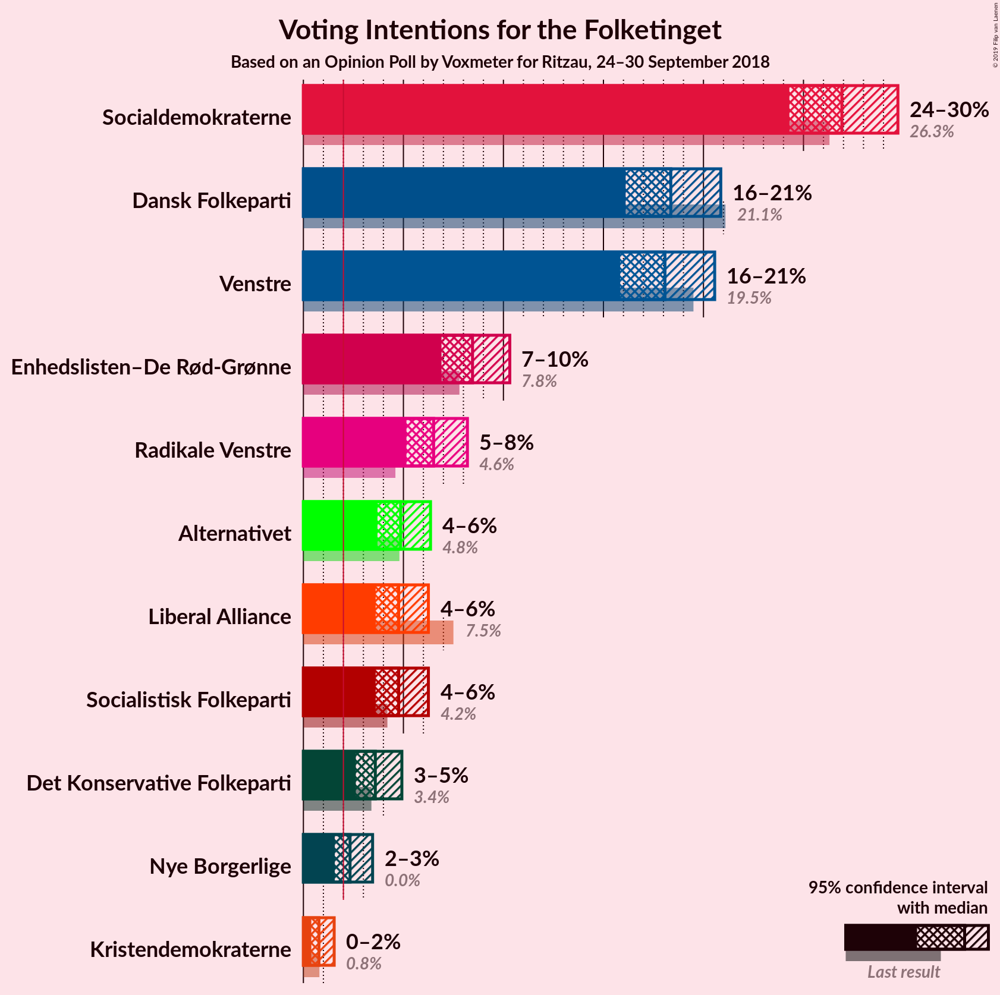

### Confidence Intervals

| Party | Last Result | Poll Result | 80% Confidence Interval | 90% Confidence Interval | 95% Confidence Interval | 99% Confidence Interval |
|:-----:|:-----------:|:-----------:|:-----------------------:|:-----------------------:|:-----------------------:|:-----------------------:|
| Socialdemokraterne | 26.3% | 26.9% | 25.2–28.7% |24.7–29.3% |24.3–29.7% |23.5–30.6% |
| Dansk Folkeparti | 21.1% | 18.4% | 16.9–20.0% |16.5–20.5% |16.1–20.9% |15.4–21.7% |
| Venstre | 19.5% | 18.1% | 16.6–19.7% |16.2–20.1% |15.8–20.6% |15.2–21.4% |
| Enhedslisten–De Rød-Grønne | 7.8% | 8.5% | 7.4–9.7% |7.1–10.0% |6.9–10.3% |6.4–10.9% |
| Radikale Venstre | 4.6% | 6.5% | 5.6–7.6% |5.4–7.9% |5.2–8.2% |4.8–8.7% |
| Alternativet | 4.8% | 4.9% | 4.1–5.8% |3.9–6.1% |3.7–6.4% |3.4–6.9% |
| Liberal Alliance | 7.5% | 4.8% | 4.0–5.7% |3.8–6.0% |3.6–6.2% |3.3–6.7% |
| Socialistisk Folkeparti | 4.2% | 4.8% | 4.0–5.7% |3.8–6.0% |3.6–6.2% |3.3–6.7% |
| Det Konservative Folkeparti | 3.4% | 3.6% | 2.9–4.5% |2.8–4.7% |2.6–4.9% |2.3–5.4% |
| Nye Borgerlige | 0.0% | 2.3% | 1.8–3.1% |1.7–3.3% |1.6–3.5% |1.4–3.8% |
| Kristendemokraterne | 0.8% | 0.8% | 0.5–1.3% |0.4–1.4% |0.4–1.5% |0.3–1.8% |

*Note:* The poll result column reflects the actual value used in the calculations. Published results may vary slightly, and in addition be rounded to fewer digits.

## Seats

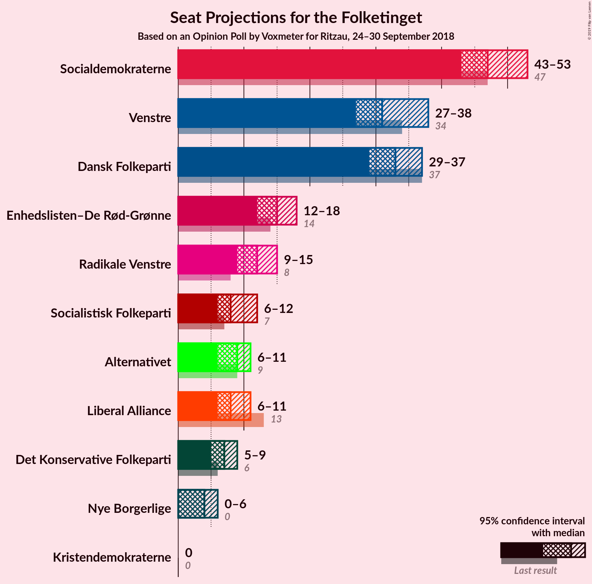

### Confidence Intervals

| Party | Last Result | Median | 80% Confidence Interval | 90% Confidence Interval | 95% Confidence Interval | 99% Confidence Interval |
|:-----:|:-----------:|:------:|:-----------------------:|:-----------------------:|:-----------------------:|:-----------------------:|
| <a href="#socialdemokraterne">Socialdemokraterne</a> | 47 | 47 | 44–52 |43–52 |43–53 |41–55 |
| <a href="#dansk-folkeparti">Dansk Folkeparti</a> | 37 | 33 | 30–36 |29–36 |29–37 |27–39 |
| <a href="#venstre">Venstre</a> | 34 | 31 | 28–35 |28–36 |27–38 |27–38 |
| <a href="#enhedslisten–de-rød-grønne">Enhedslisten–De Rød-Grønne</a> | 14 | 15 | 13–17 |12–18 |12–18 |11–20 |
| <a href="#radikale-venstre">Radikale Venstre</a> | 8 | 12 | 10–15 |10–15 |9–15 |8–16 |
| <a href="#alternativet">Alternativet</a> | 9 | 9 | 7–11 |7–11 |6–11 |6–12 |
| <a href="#liberal-alliance">Liberal Alliance</a> | 13 | 8 | 7–10 |7–11 |6–11 |6–12 |
| <a href="#socialistisk-folkeparti">Socialistisk Folkeparti</a> | 7 | 8 | 7–10 |7–11 |6–12 |6–12 |
| <a href="#det-konservative-folkeparti">Det Konservative Folkeparti</a> | 6 | 7 | 5–8 |5–8 |5–9 |4–9 |
| <a href="#nye-borgerlige">Nye Borgerlige</a> | 0 | 4 | 0–5 |0–6 |0–6 |0–7 |
| <a href="#kristendemokraterne">Kristendemokraterne</a> | 0 | 0 | 0 |0 |0 |0 |

### Socialdemokraterne

*For a full overview of the results for this party, see the [Socialdemokraterne](party-socialdemokraterne.html) page.*

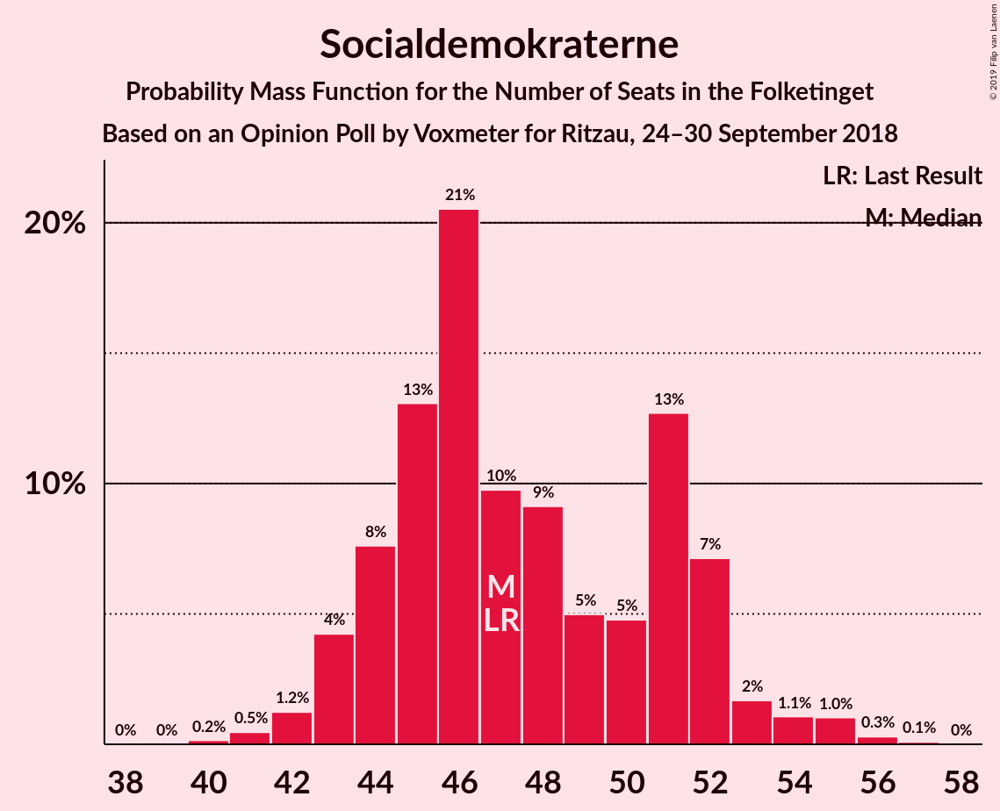

| Number of Seats | Probability | Accumulated | Special Marks |
|:---------------:|:-----------:|:-----------:|:-------------:|
| 40 | 0.2% | 100% |  |
| 41 | 0.5% | 99.8% |  |
| 42 | 1.2% | 99.4% |  |
| 43 | 4% | 98% |  |
| 44 | 8% | 94% |  |
| 45 | 13% | 86% |  |
| 46 | 21% | 73% |  |
| 47 | 10% | 53% | Last Result, Median |
| 48 | 9% | 43% |  |
| 49 | 5% | 34% |  |
| 50 | 5% | 29% |  |
| 51 | 13% | 24% |  |
| 52 | 7% | 11% |  |
| 53 | 2% | 4% |  |
| 54 | 1.1% | 2% |  |
| 55 | 1.0% | 1.4% |  |
| 56 | 0.3% | 0.4% |  |
| 57 | 0.1% | 0.1% |  |
| 58 | 0% | 0% |  |

### Dansk Folkeparti

*For a full overview of the results for this party, see the [Dansk Folkeparti](party-danskfolkeparti.html) page.*

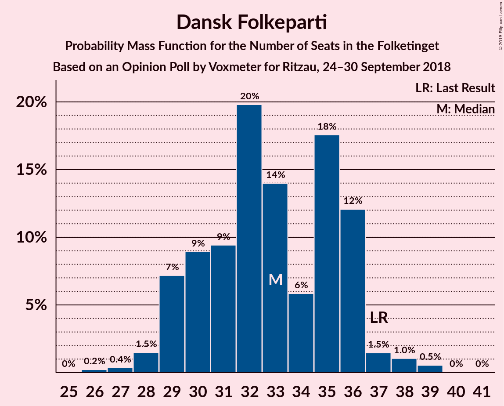

| Number of Seats | Probability | Accumulated | Special Marks |
|:---------------:|:-----------:|:-----------:|:-------------:|
| 26 | 0.2% | 100% |  |
| 27 | 0.4% | 99.7% |  |
| 28 | 1.5% | 99.4% |  |
| 29 | 7% | 98% |  |
| 30 | 9% | 91% |  |
| 31 | 9% | 82% |  |
| 32 | 20% | 72% |  |
| 33 | 14% | 53% | Median |
| 34 | 6% | 39% |  |
| 35 | 18% | 33% |  |
| 36 | 12% | 15% |  |
| 37 | 1.5% | 3% | Last Result |
| 38 | 1.0% | 2% |  |
| 39 | 0.5% | 0.6% |  |
| 40 | 0% | 0.1% |  |
| 41 | 0% | 0% |  |

### Venstre

*For a full overview of the results for this party, see the [Venstre](party-venstre.html) page.*

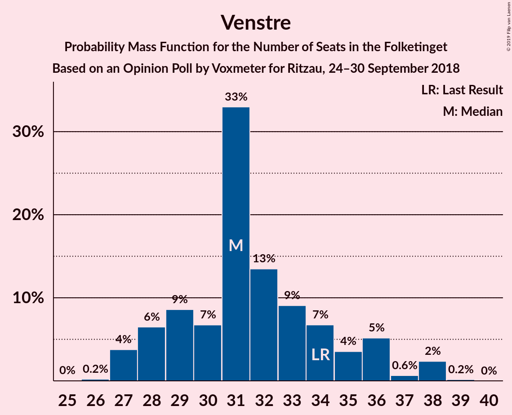

| Number of Seats | Probability | Accumulated | Special Marks |
|:---------------:|:-----------:|:-----------:|:-------------:|
| 25 | 0% | 100% |  |
| 26 | 0.2% | 99.9% |  |
| 27 | 4% | 99.7% |  |
| 28 | 6% | 96% |  |
| 29 | 9% | 89% |  |
| 30 | 7% | 81% |  |
| 31 | 33% | 74% | Median |
| 32 | 13% | 41% |  |
| 33 | 9% | 28% |  |
| 34 | 7% | 19% | Last Result |
| 35 | 4% | 12% |  |
| 36 | 5% | 8% |  |
| 37 | 0.6% | 3% |  |
| 38 | 2% | 3% |  |
| 39 | 0.2% | 0.2% |  |
| 40 | 0% | 0% |  |

### Enhedslisten–De Rød-Grønne

*For a full overview of the results for this party, see the [Enhedslisten–De Rød-Grønne](party-enhedslisten–derød-grønne.html) page.*

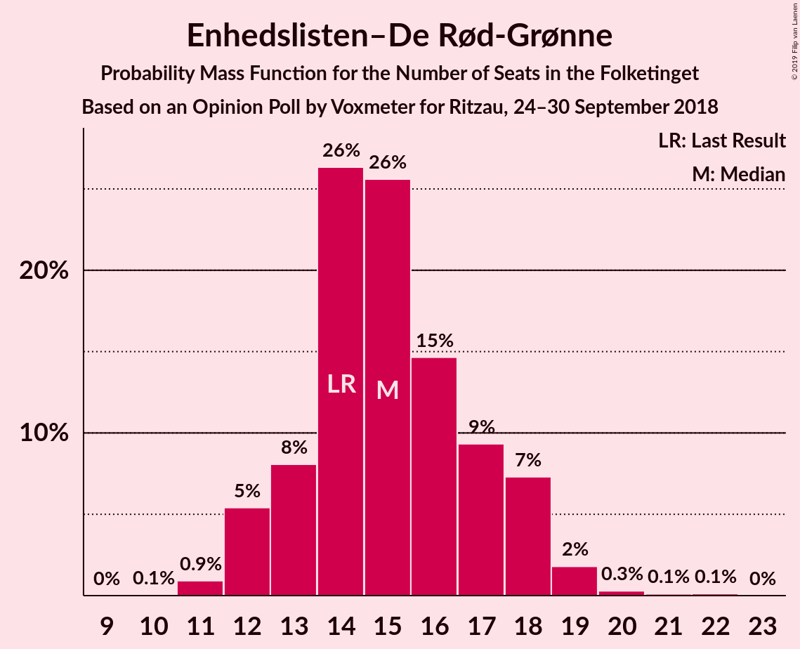

| Number of Seats | Probability | Accumulated | Special Marks |
|:---------------:|:-----------:|:-----------:|:-------------:|
| 10 | 0.1% | 100% |  |
| 11 | 0.9% | 99.9% |  |
| 12 | 5% | 99.0% |  |
| 13 | 8% | 94% |  |
| 14 | 26% | 86% | Last Result |
| 15 | 26% | 59% | Median |
| 16 | 15% | 34% |  |
| 17 | 9% | 19% |  |
| 18 | 7% | 10% |  |
| 19 | 2% | 2% |  |
| 20 | 0.3% | 0.5% |  |
| 21 | 0.1% | 0.2% |  |
| 22 | 0.1% | 0.1% |  |
| 23 | 0% | 0% |  |

### Radikale Venstre

*For a full overview of the results for this party, see the [Radikale Venstre](party-radikalevenstre.html) page.*

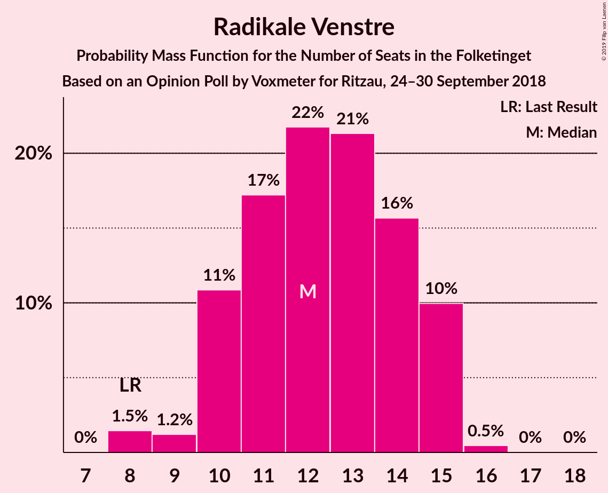

| Number of Seats | Probability | Accumulated | Special Marks |
|:---------------:|:-----------:|:-----------:|:-------------:|
| 8 | 1.5% | 100% | Last Result |
| 9 | 1.2% | 98.5% |  |
| 10 | 11% | 97% |  |
| 11 | 17% | 86% |  |
| 12 | 22% | 69% | Median |
| 13 | 21% | 47% |  |
| 14 | 16% | 26% |  |
| 15 | 10% | 10% |  |
| 16 | 0.5% | 0.5% |  |
| 17 | 0% | 0.1% |  |
| 18 | 0% | 0% |  |

### Alternativet

*For a full overview of the results for this party, see the [Alternativet](party-alternativet.html) page.*

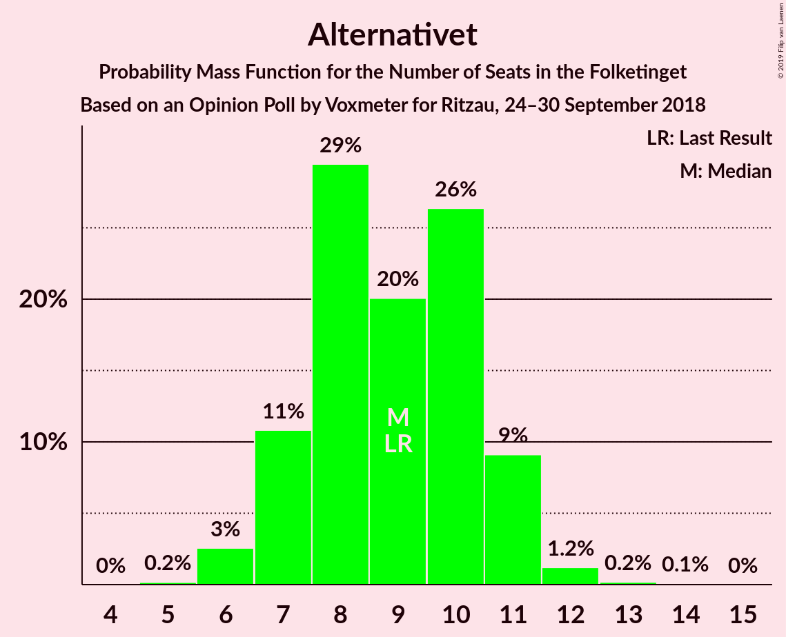

| Number of Seats | Probability | Accumulated | Special Marks |
|:---------------:|:-----------:|:-----------:|:-------------:|
| 5 | 0.2% | 100% |  |
| 6 | 3% | 99.8% |  |
| 7 | 11% | 97% |  |
| 8 | 29% | 86% |  |
| 9 | 20% | 57% | Last Result, Median |
| 10 | 26% | 37% |  |
| 11 | 9% | 11% |  |
| 12 | 1.2% | 1.4% |  |
| 13 | 0.2% | 0.2% |  |
| 14 | 0.1% | 0.1% |  |
| 15 | 0% | 0% |  |

### Liberal Alliance

*For a full overview of the results for this party, see the [Liberal Alliance](party-liberalalliance.html) page.*

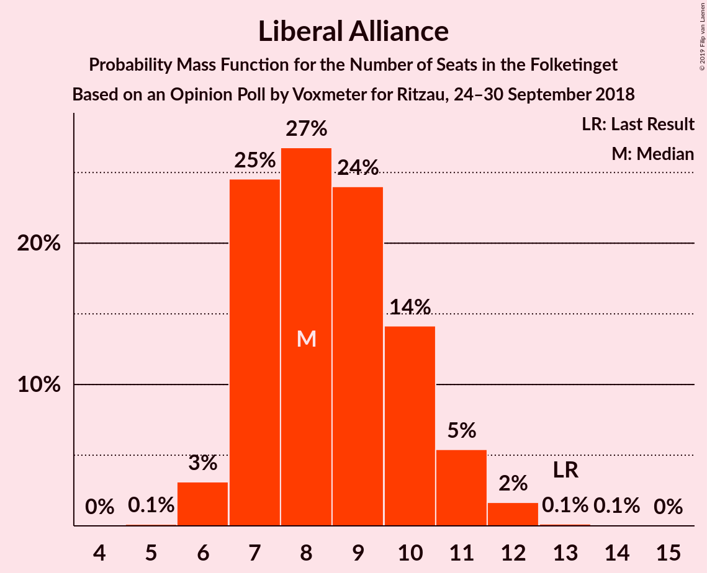

| Number of Seats | Probability | Accumulated | Special Marks |
|:---------------:|:-----------:|:-----------:|:-------------:|
| 5 | 0.1% | 100% |  |
| 6 | 3% | 99.9% |  |
| 7 | 25% | 97% |  |
| 8 | 27% | 72% | Median |
| 9 | 24% | 45% |  |
| 10 | 14% | 21% |  |
| 11 | 5% | 7% |  |
| 12 | 2% | 2% |  |
| 13 | 0.1% | 0.2% | Last Result |
| 14 | 0.1% | 0.1% |  |
| 15 | 0% | 0% |  |

### Socialistisk Folkeparti

*For a full overview of the results for this party, see the [Socialistisk Folkeparti](party-socialistiskfolkeparti.html) page.*

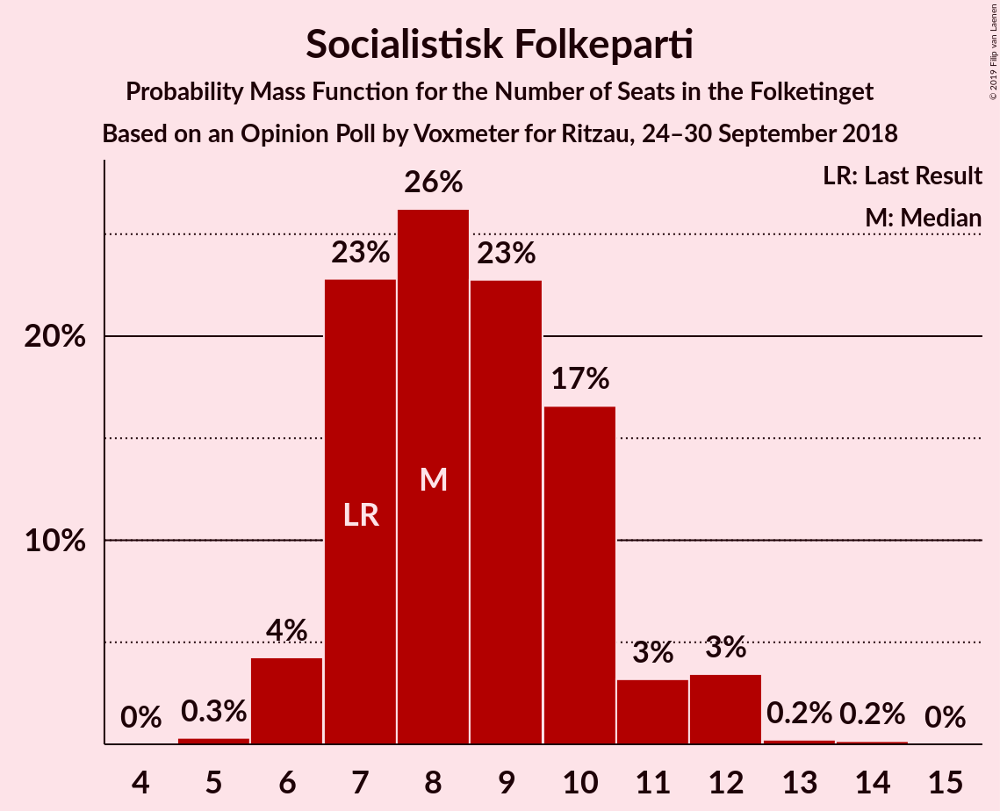

| Number of Seats | Probability | Accumulated | Special Marks |
|:---------------:|:-----------:|:-----------:|:-------------:|
| 5 | 0.3% | 100% |  |
| 6 | 4% | 99.7% |  |
| 7 | 23% | 95% | Last Result |
| 8 | 26% | 73% | Median |
| 9 | 23% | 46% |  |
| 10 | 17% | 24% |  |
| 11 | 3% | 7% |  |
| 12 | 3% | 4% |  |
| 13 | 0.2% | 0.4% |  |
| 14 | 0.2% | 0.2% |  |
| 15 | 0% | 0% |  |

### Det Konservative Folkeparti

*For a full overview of the results for this party, see the [Det Konservative Folkeparti](party-detkonservativefolkeparti.html) page.*

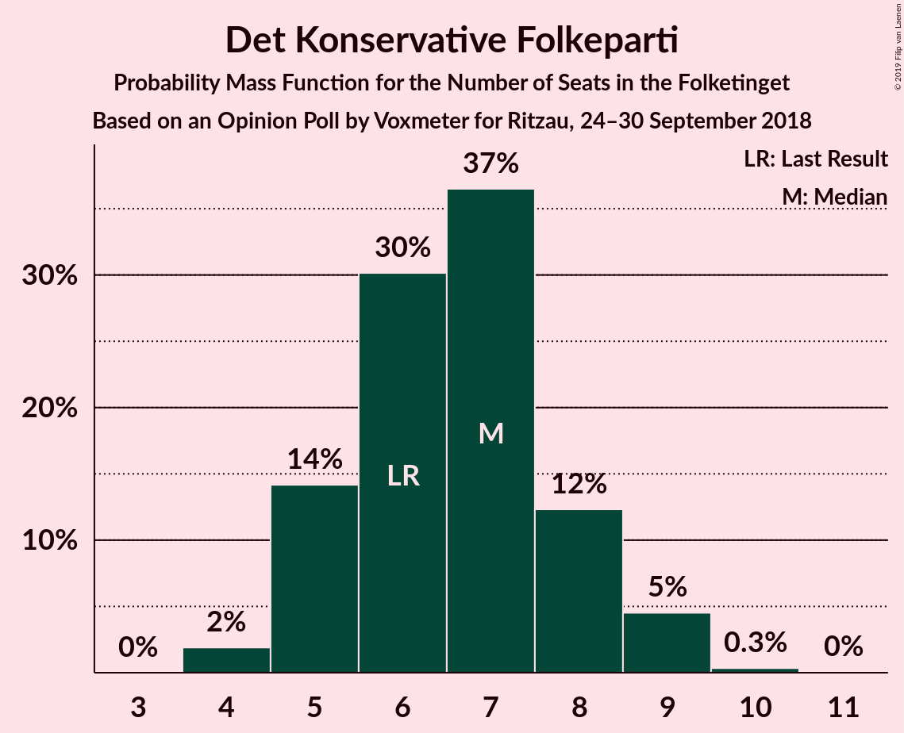

| Number of Seats | Probability | Accumulated | Special Marks |
|:---------------:|:-----------:|:-----------:|:-------------:|
| 4 | 2% | 100% |  |
| 5 | 14% | 98% |  |
| 6 | 30% | 84% | Last Result |
| 7 | 37% | 54% | Median |
| 8 | 12% | 17% |  |
| 9 | 5% | 5% |  |
| 10 | 0.3% | 0.4% |  |
| 11 | 0% | 0% |  |

### Nye Borgerlige

*For a full overview of the results for this party, see the [Nye Borgerlige](party-nyeborgerlige.html) page.*

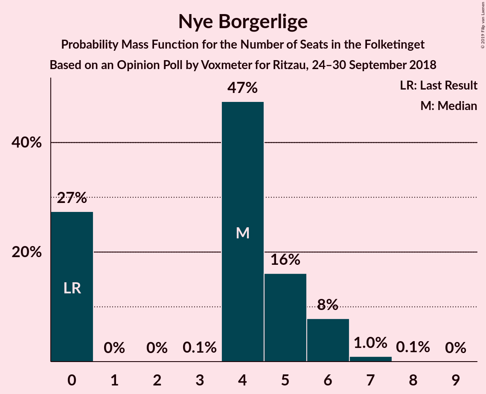

| Number of Seats | Probability | Accumulated | Special Marks |
|:---------------:|:-----------:|:-----------:|:-------------:|
| 0 | 27% | 100% | Last Result |
| 1 | 0% | 73% |  |
| 2 | 0% | 73% |  |
| 3 | 0.1% | 73% |  |
| 4 | 47% | 73% | Median |
| 5 | 16% | 25% |  |
| 6 | 8% | 9% |  |
| 7 | 1.0% | 1.1% |  |
| 8 | 0.1% | 0.1% |  |
| 9 | 0% | 0% |  |

### Kristendemokraterne

*For a full overview of the results for this party, see the [Kristendemokraterne](party-kristendemokraterne.html) page.*

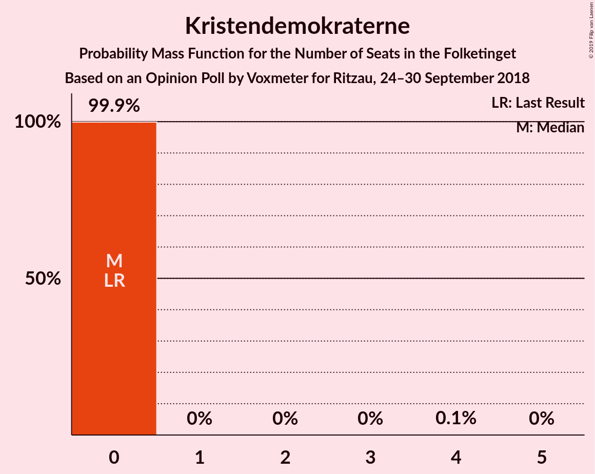

| Number of Seats | Probability | Accumulated | Special Marks |
|:---------------:|:-----------:|:-----------:|:-------------:|
| 0 | 99.9% | 100% | Last Result, Median |
| 1 | 0% | 0.1% |  |
| 2 | 0% | 0.1% |  |
| 3 | 0% | 0.1% |  |
| 4 | 0.1% | 0.1% |  |
| 5 | 0% | 0% |  |

## Coalitions

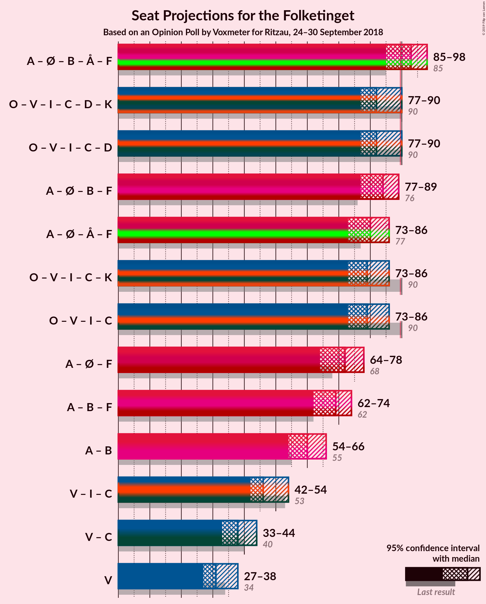

### Confidence Intervals

| Coalition | Last Result | Median | Majority? | 80% Confidence Interval | 90% Confidence Interval | 95% Confidence Interval | 99% Confidence Interval |
|:---------:|:-----------:|:------:|:---------:|:-----------------------:|:-----------------------:|:-----------------------:|:-----------------------:|
| Socialdemokraterne – Enhedslisten–De Rød-Grønne – Radikale Venstre – Alternativet – Socialistisk Folkeparti | 85 | 93 | 78% | 88–97 | 87–97 | 85–98 | 85–100 |
| Dansk Folkeparti – Venstre – Liberal Alliance – Det Konservative Folkeparti – Nye Borgerlige – Kristendemokraterne | 90 | 82 | 3% | 78–87 | 78–88 | 77–90 | 75–90 |
| Dansk Folkeparti – Venstre – Liberal Alliance – Det Konservative Folkeparti – Nye Borgerlige | 90 | 82 | 3% | 78–87 | 78–88 | 77–90 | 75–90 |
| Socialdemokraterne – Enhedslisten–De Rød-Grønne – Radikale Venstre – Socialistisk Folkeparti | 76 | 84 | 2% | 79–88 | 78–89 | 77–89 | 75–90 |
| Socialdemokraterne – Enhedslisten–De Rød-Grønne – Alternativet – Socialistisk Folkeparti | 77 | 80 | 0.2% | 75–84 | 75–85 | 73–86 | 72–88 |
| Dansk Folkeparti – Venstre – Liberal Alliance – Det Konservative Folkeparti – Kristendemokraterne | 90 | 79 | 0.2% | 75–83 | 74–85 | 73–86 | 72–87 |
| Dansk Folkeparti – Venstre – Liberal Alliance – Det Konservative Folkeparti | 90 | 79 | 0.2% | 75–83 | 74–85 | 73–86 | 72–87 |
| Socialdemokraterne – Enhedslisten–De Rød-Grønne – Socialistisk Folkeparti | 68 | 72 | 0% | 67–75 | 66–76 | 64–78 | 64–79 |
| Socialdemokraterne – Radikale Venstre – Socialistisk Folkeparti | 62 | 69 | 0% | 65–72 | 64–73 | 62–74 | 60–76 |
| Socialdemokraterne – Radikale Venstre | 55 | 60 | 0% | 56–64 | 54–65 | 54–66 | 52–67 |
| Venstre – Liberal Alliance – Det Konservative Folkeparti | 53 | 46 | 0% | 44–52 | 43–52 | 42–54 | 41–54 |
| Venstre – Det Konservative Folkeparti | 40 | 38 | 0% | 35–42 | 34–44 | 33–44 | 33–45 |
| Venstre | 34 | 31 | 0% | 28–35 | 28–36 | 27–38 | 27–38 |

### Socialdemokraterne – Enhedslisten–De Rød-Grønne – Radikale Venstre – Alternativet – Socialistisk Folkeparti

| Number of Seats | Probability | Accumulated | Special Marks |
|:---------------:|:-----------:|:-----------:|:-------------:|
| 81 | 0.1% | 100% |  |
| 82 | 0.1% | 99.9% |  |
| 83 | 0% | 99.7% |  |
| 84 | 0.1% | 99.7% |  |
| 85 | 2% | 99.6% | Last Result |
| 86 | 2% | 97% |  |
| 87 | 2% | 95% |  |
| 88 | 5% | 93% |  |
| 89 | 10% | 88% |  |
| 90 | 10% | 78% | Majority |
| 91 | 6% | 68% | Median |
| 92 | 9% | 62% |  |
| 93 | 14% | 53% |  |
| 94 | 15% | 39% |  |
| 95 | 7% | 24% |  |
| 96 | 6% | 17% |  |
| 97 | 6% | 10% |  |
| 98 | 3% | 4% |  |
| 99 | 0.7% | 1.3% |  |
| 100 | 0.4% | 0.5% |  |
| 101 | 0% | 0.1% |  |
| 102 | 0.1% | 0.1% |  |
| 103 | 0% | 0% |  |

### Dansk Folkeparti – Venstre – Liberal Alliance – Det Konservative Folkeparti – Nye Borgerlige – Kristendemokraterne

| Number of Seats | Probability | Accumulated | Special Marks |
|:---------------:|:-----------:|:-----------:|:-------------:|
| 73 | 0.1% | 100% |  |
| 74 | 0% | 99.9% |  |
| 75 | 0.4% | 99.9% |  |
| 76 | 0.7% | 99.5% |  |
| 77 | 3% | 98.7% |  |
| 78 | 6% | 96% |  |
| 79 | 6% | 90% |  |
| 80 | 7% | 83% |  |
| 81 | 15% | 76% |  |
| 82 | 14% | 61% |  |
| 83 | 9% | 47% | Median |
| 84 | 6% | 38% |  |
| 85 | 10% | 32% |  |
| 86 | 10% | 22% |  |
| 87 | 5% | 12% |  |
| 88 | 2% | 7% |  |
| 89 | 2% | 5% |  |
| 90 | 2% | 3% | Last Result, Majority |
| 91 | 0.1% | 0.4% |  |
| 92 | 0% | 0.3% |  |
| 93 | 0.1% | 0.3% |  |
| 94 | 0.1% | 0.1% |  |
| 95 | 0% | 0% |  |

### Dansk Folkeparti – Venstre – Liberal Alliance – Det Konservative Folkeparti – Nye Borgerlige

| Number of Seats | Probability | Accumulated | Special Marks |
|:---------------:|:-----------:|:-----------:|:-------------:|
| 73 | 0.1% | 100% |  |
| 74 | 0.1% | 99.9% |  |
| 75 | 0.4% | 99.9% |  |
| 76 | 0.7% | 99.4% |  |
| 77 | 3% | 98.7% |  |
| 78 | 6% | 96% |  |
| 79 | 6% | 90% |  |
| 80 | 7% | 83% |  |
| 81 | 15% | 76% |  |
| 82 | 14% | 61% |  |
| 83 | 9% | 47% | Median |
| 84 | 6% | 38% |  |
| 85 | 10% | 32% |  |
| 86 | 10% | 22% |  |
| 87 | 5% | 12% |  |
| 88 | 2% | 7% |  |
| 89 | 2% | 5% |  |
| 90 | 2% | 3% | Last Result, Majority |
| 91 | 0.1% | 0.4% |  |
| 92 | 0% | 0.3% |  |
| 93 | 0.1% | 0.3% |  |
| 94 | 0.1% | 0.1% |  |
| 95 | 0% | 0% |  |

### Socialdemokraterne – Enhedslisten–De Rød-Grønne – Radikale Venstre – Socialistisk Folkeparti

| Number of Seats | Probability | Accumulated | Special Marks |
|:---------------:|:-----------:|:-----------:|:-------------:|
| 73 | 0.2% | 100% |  |
| 74 | 0.2% | 99.8% |  |
| 75 | 0.7% | 99.6% |  |
| 76 | 0.6% | 99.0% | Last Result |
| 77 | 3% | 98% |  |
| 78 | 3% | 96% |  |
| 79 | 4% | 92% |  |
| 80 | 3% | 88% |  |
| 81 | 14% | 86% |  |
| 82 | 8% | 72% | Median |
| 83 | 8% | 64% |  |
| 84 | 19% | 56% |  |
| 85 | 13% | 37% |  |
| 86 | 11% | 23% |  |
| 87 | 2% | 12% |  |
| 88 | 4% | 10% |  |
| 89 | 4% | 6% |  |
| 90 | 2% | 2% | Majority |
| 91 | 0.1% | 0.3% |  |
| 92 | 0.1% | 0.2% |  |
| 93 | 0.1% | 0.1% |  |
| 94 | 0% | 0% |  |

### Socialdemokraterne – Enhedslisten–De Rød-Grønne – Alternativet – Socialistisk Folkeparti

| Number of Seats | Probability | Accumulated | Special Marks |
|:---------------:|:-----------:|:-----------:|:-------------:|
| 69 | 0.1% | 100% |  |
| 70 | 0% | 99.9% |  |
| 71 | 0.2% | 99.8% |  |
| 72 | 2% | 99.6% |  |
| 73 | 0.8% | 98% |  |
| 74 | 1.5% | 97% |  |
| 75 | 9% | 96% |  |
| 76 | 3% | 86% |  |
| 77 | 4% | 83% | Last Result |
| 78 | 13% | 80% |  |
| 79 | 13% | 67% | Median |
| 80 | 8% | 54% |  |
| 81 | 6% | 46% |  |
| 82 | 22% | 40% |  |
| 83 | 4% | 18% |  |
| 84 | 5% | 14% |  |
| 85 | 4% | 8% |  |
| 86 | 2% | 4% |  |
| 87 | 1.2% | 2% |  |
| 88 | 0.8% | 1.1% |  |
| 89 | 0.1% | 0.3% |  |
| 90 | 0.2% | 0.2% | Majority |
| 91 | 0.1% | 0.1% |  |
| 92 | 0% | 0% |  |

### Dansk Folkeparti – Venstre – Liberal Alliance – Det Konservative Folkeparti – Kristendemokraterne

| Number of Seats | Probability | Accumulated | Special Marks |
|:---------------:|:-----------:|:-----------:|:-------------:|
| 69 | 0.1% | 100% |  |
| 70 | 0% | 99.9% |  |
| 71 | 0.1% | 99.9% |  |
| 72 | 0.7% | 99.8% |  |
| 73 | 2% | 99.1% |  |
| 74 | 7% | 97% |  |
| 75 | 3% | 90% |  |
| 76 | 4% | 87% |  |
| 77 | 18% | 83% |  |
| 78 | 7% | 65% |  |
| 79 | 10% | 58% | Median |
| 80 | 3% | 48% |  |
| 81 | 9% | 45% |  |
| 82 | 20% | 36% |  |
| 83 | 7% | 16% |  |
| 84 | 3% | 9% |  |
| 85 | 4% | 6% |  |
| 86 | 2% | 3% |  |
| 87 | 0.4% | 0.8% |  |
| 88 | 0.2% | 0.4% |  |
| 89 | 0% | 0.2% |  |
| 90 | 0.1% | 0.2% | Last Result, Majority |
| 91 | 0% | 0% |  |

### Dansk Folkeparti – Venstre – Liberal Alliance – Det Konservative Folkeparti

| Number of Seats | Probability | Accumulated | Special Marks |
|:---------------:|:-----------:|:-----------:|:-------------:|
| 69 | 0.1% | 100% |  |
| 70 | 0% | 99.9% |  |
| 71 | 0.1% | 99.9% |  |
| 72 | 0.7% | 99.8% |  |
| 73 | 2% | 99.1% |  |
| 74 | 7% | 97% |  |
| 75 | 3% | 90% |  |
| 76 | 4% | 87% |  |
| 77 | 18% | 83% |  |
| 78 | 7% | 65% |  |
| 79 | 10% | 58% | Median |
| 80 | 3% | 48% |  |
| 81 | 9% | 45% |  |
| 82 | 20% | 36% |  |
| 83 | 7% | 16% |  |
| 84 | 3% | 9% |  |
| 85 | 4% | 6% |  |
| 86 | 2% | 3% |  |
| 87 | 0.4% | 0.8% |  |
| 88 | 0.2% | 0.4% |  |
| 89 | 0% | 0.2% |  |
| 90 | 0.1% | 0.2% | Last Result, Majority |
| 91 | 0% | 0% |  |

### Socialdemokraterne – Enhedslisten–De Rød-Grønne – Socialistisk Folkeparti

| Number of Seats | Probability | Accumulated | Special Marks |
|:---------------:|:-----------:|:-----------:|:-------------:|
| 61 | 0.1% | 100% |  |
| 62 | 0.1% | 99.9% |  |
| 63 | 0.3% | 99.8% |  |
| 64 | 3% | 99.6% |  |
| 65 | 1.4% | 97% |  |
| 66 | 1.2% | 96% |  |
| 67 | 12% | 94% |  |
| 68 | 3% | 83% | Last Result |
| 69 | 8% | 79% |  |
| 70 | 15% | 71% | Median |
| 71 | 4% | 56% |  |
| 72 | 24% | 52% |  |
| 73 | 9% | 27% |  |
| 74 | 5% | 19% |  |
| 75 | 6% | 13% |  |
| 76 | 3% | 7% |  |
| 77 | 0.7% | 5% |  |
| 78 | 2% | 4% |  |
| 79 | 1.1% | 1.5% |  |
| 80 | 0.2% | 0.4% |  |
| 81 | 0.1% | 0.1% |  |
| 82 | 0.1% | 0.1% |  |
| 83 | 0% | 0% |  |

### Socialdemokraterne – Radikale Venstre – Socialistisk Folkeparti

| Number of Seats | Probability | Accumulated | Special Marks |
|:---------------:|:-----------:|:-----------:|:-------------:|
| 58 | 0.1% | 100% |  |
| 59 | 0.1% | 99.9% |  |
| 60 | 0.8% | 99.8% |  |
| 61 | 0.4% | 98.9% |  |
| 62 | 1.2% | 98.6% | Last Result |
| 63 | 1.0% | 97% |  |
| 64 | 5% | 96% |  |
| 65 | 9% | 92% |  |
| 66 | 10% | 83% |  |
| 67 | 15% | 73% | Median |
| 68 | 6% | 58% |  |
| 69 | 9% | 52% |  |
| 70 | 23% | 43% |  |
| 71 | 7% | 21% |  |
| 72 | 7% | 14% |  |
| 73 | 3% | 7% |  |
| 74 | 3% | 4% |  |
| 75 | 0.2% | 0.8% |  |
| 76 | 0.4% | 0.6% |  |
| 77 | 0.2% | 0.2% |  |
| 78 | 0.1% | 0.1% |  |
| 79 | 0% | 0% |  |

### Socialdemokraterne – Radikale Venstre

| Number of Seats | Probability | Accumulated | Special Marks |
|:---------------:|:-----------:|:-----------:|:-------------:|
| 51 | 0.2% | 100% |  |
| 52 | 0.3% | 99.7% |  |
| 53 | 0.9% | 99.5% |  |
| 54 | 4% | 98.5% |  |
| 55 | 2% | 95% | Last Result |
| 56 | 6% | 93% |  |
| 57 | 12% | 87% |  |
| 58 | 8% | 75% |  |
| 59 | 11% | 67% | Median |
| 60 | 9% | 56% |  |
| 61 | 20% | 47% |  |
| 62 | 5% | 27% |  |
| 63 | 12% | 22% |  |
| 64 | 2% | 10% |  |
| 65 | 5% | 8% |  |
| 66 | 2% | 3% |  |
| 67 | 1.0% | 1.1% |  |
| 68 | 0.1% | 0.2% |  |
| 69 | 0.1% | 0.1% |  |
| 70 | 0% | 0% |  |

### Venstre – Liberal Alliance – Det Konservative Folkeparti

| Number of Seats | Probability | Accumulated | Special Marks |
|:---------------:|:-----------:|:-----------:|:-------------:|
| 39 | 0% | 100% |  |
| 40 | 0% | 99.9% |  |
| 41 | 0.6% | 99.9% |  |
| 42 | 2% | 99.4% |  |
| 43 | 6% | 97% |  |
| 44 | 13% | 92% |  |
| 45 | 21% | 78% |  |
| 46 | 21% | 57% | Median |
| 47 | 12% | 36% |  |
| 48 | 2% | 24% |  |
| 49 | 4% | 22% |  |
| 50 | 3% | 18% |  |
| 51 | 5% | 15% |  |
| 52 | 6% | 10% |  |
| 53 | 1.0% | 4% | Last Result |
| 54 | 3% | 3% |  |
| 55 | 0.1% | 0.2% |  |
| 56 | 0% | 0% |  |

### Venstre – Det Konservative Folkeparti

| Number of Seats | Probability | Accumulated | Special Marks |
|:---------------:|:-----------:|:-----------:|:-------------:|
| 31 | 0.1% | 100% |  |
| 32 | 0.3% | 99.9% |  |
| 33 | 4% | 99.7% |  |
| 34 | 5% | 96% |  |
| 35 | 8% | 91% |  |
| 36 | 8% | 83% |  |
| 37 | 8% | 76% |  |
| 38 | 36% | 68% | Median |
| 39 | 9% | 31% |  |
| 40 | 8% | 22% | Last Result |
| 41 | 3% | 15% |  |
| 42 | 3% | 12% |  |
| 43 | 3% | 9% |  |
| 44 | 4% | 6% |  |
| 45 | 2% | 2% |  |
| 46 | 0.1% | 0.2% |  |
| 47 | 0% | 0% |  |

### Venstre

| Number of Seats | Probability | Accumulated | Special Marks |
|:---------------:|:-----------:|:-----------:|:-------------:|
| 25 | 0% | 100% |  |
| 26 | 0.2% | 99.9% |  |
| 27 | 4% | 99.7% |  |
| 28 | 6% | 96% |  |
| 29 | 9% | 89% |  |
| 30 | 7% | 81% |  |
| 31 | 33% | 74% | Median |
| 32 | 13% | 41% |  |
| 33 | 9% | 28% |  |
| 34 | 7% | 19% | Last Result |
| 35 | 4% | 12% |  |
| 36 | 5% | 8% |  |
| 37 | 0.6% | 3% |  |
| 38 | 2% | 3% |  |
| 39 | 0.2% | 0.2% |  |
| 40 | 0% | 0% |  |

## Technical Information

### Opinion Poll

+ **Polling firm:** Voxmeter
+ **Commissioner(s):** Ritzau
+ **Fieldwork period:** 24–30 September 2018

### Calculations

+ **Sample size:** 1029
+ **Simulations done:** 1,048,576
+ **Error estimate:** 3.44%

