# Opinion Poll by Greens Analyseinstitut for Børsen, 1 October 2018

<a href="#voting-intentions">Voting Intentions</a> | <a href="#seats">Seats</a> | <a href="#coalitions">Coalitions</a> | <a href="#technical-information">Technical Information</a>

## Voting Intentions

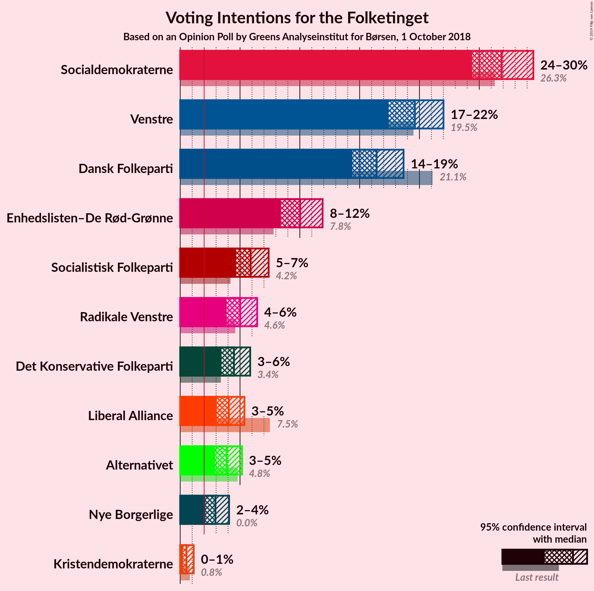

### Confidence Intervals

| Party | Last Result | Poll Result | 80% Confidence Interval | 90% Confidence Interval | 95% Confidence Interval | 99% Confidence Interval |
|:-----:|:-----------:|:-----------:|:-----------------------:|:-----------------------:|:-----------------------:|:-----------------------:|
| Socialdemokraterne | 26.3% | 26.9% | 25.3–28.6% |24.8–29.1% |24.4–29.5% |23.6–30.3% |
| Venstre | 19.5% | 19.6% | 18.2–21.2% |17.8–21.6% |17.4–22.0% |16.8–22.8% |
| Dansk Folkeparti | 21.1% | 16.4% | 15.1–17.9% |14.7–18.3% |14.4–18.7% |13.8–19.4% |
| Enhedslisten–De Rød-Grønne | 7.8% | 10.0% | 9.0–11.2% |8.7–11.6% |8.4–11.9% |7.9–12.5% |
| Socialistisk Folkeparti | 4.2% | 5.9% | 5.1–6.9% |4.8–7.1% |4.7–7.4% |4.3–7.9% |
| Radikale Venstre | 4.6% | 5.0% | 4.3–5.9% |4.1–6.2% |3.9–6.4% |3.6–6.9% |
| Det Konservative Folkeparti | 3.4% | 4.5% | 3.8–5.4% |3.6–5.6% |3.4–5.9% |3.1–6.3% |
| Liberal Alliance | 7.5% | 4.1% | 3.4–4.9% |3.2–5.2% |3.1–5.4% |2.8–5.8% |
| Alternativet | 4.8% | 3.9% | 3.2–4.7% |3.1–5.0% |2.9–5.2% |2.6–5.6% |
| Nye Borgerlige | 0.0% | 2.9% | 2.4–3.7% |2.2–3.9% |2.1–4.1% |1.9–4.5% |
| Kristendemokraterne | 0.8% | 0.5% | 0.3–0.9% |0.3–1.0% |0.2–1.1% |0.2–1.4% |

*Note:* The poll result column reflects the actual value used in the calculations. Published results may vary slightly, and in addition be rounded to fewer digits.

## Seats

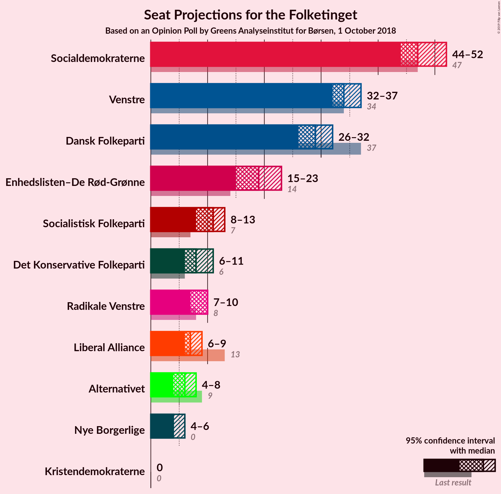

### Confidence Intervals

| Party | Last Result | Median | 80% Confidence Interval | 90% Confidence Interval | 95% Confidence Interval | 99% Confidence Interval |
|:-----:|:-----------:|:------:|:-----------------------:|:-----------------------:|:-----------------------:|:-----------------------:|
| <a href="#socialdemokraterne">Socialdemokraterne</a> | 47 | 47 | 45–48 |44–50 |44–52 |42–52 |
| <a href="#venstre">Venstre</a> | 34 | 34 | 34–36 |32–37 |32–37 |30–39 |
| <a href="#dansk-folkeparti">Dansk Folkeparti</a> | 37 | 29 | 28–31 |26–31 |26–32 |24–33 |
| <a href="#enhedslisten–de-rød-grønne">Enhedslisten–De Rød-Grønne</a> | 14 | 19 | 16–19 |16–19 |15–23 |15–23 |
| <a href="#socialistisk-folkeparti">Socialistisk Folkeparti</a> | 7 | 11 | 10–12 |9–13 |8–13 |7–14 |
| <a href="#radikale-venstre">Radikale Venstre</a> | 8 | 10 | 8–10 |8–10 |7–10 |7–12 |
| <a href="#det-konservative-folkeparti">Det Konservative Folkeparti</a> | 6 | 8 | 7–9 |6–9 |6–11 |5–11 |
| <a href="#liberal-alliance">Liberal Alliance</a> | 13 | 7 | 7–8 |6–9 |6–9 |5–10 |
| <a href="#alternativet">Alternativet</a> | 9 | 6 | 5–8 |4–8 |4–8 |4–9 |
| <a href="#nye-borgerlige">Nye Borgerlige</a> | 0 | 4 | 4–6 |4–6 |4–6 |0–7 |
| <a href="#kristendemokraterne">Kristendemokraterne</a> | 0 | 0 | 0 |0 |0 |0 |

### Socialdemokraterne

*For a full overview of the results for this party, see the [Socialdemokraterne](party-socialdemokraterne.html) page.*

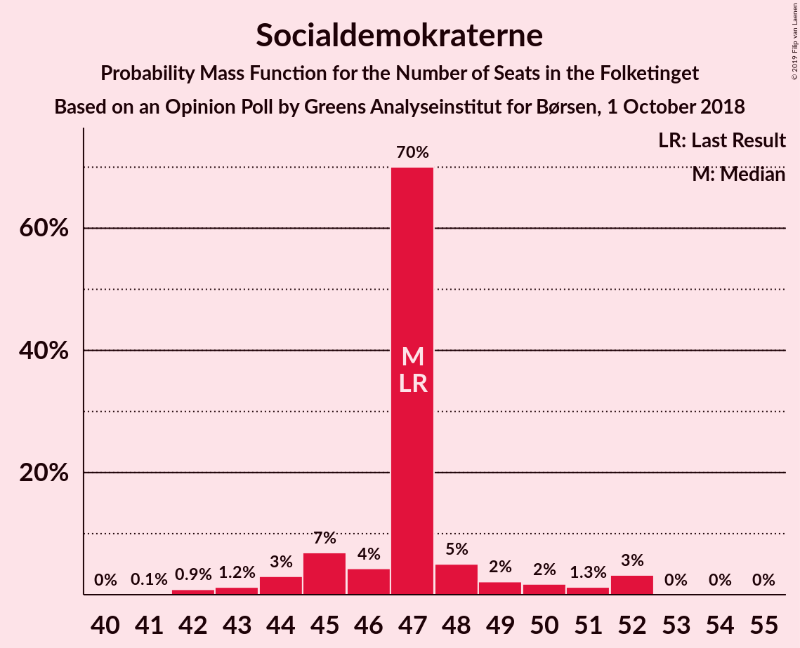

| Number of Seats | Probability | Accumulated | Special Marks |
|:---------------:|:-----------:|:-----------:|:-------------:|
| 40 | 0% | 100% |  |
| 41 | 0.1% | 99.9% |  |
| 42 | 0.9% | 99.8% |  |
| 43 | 1.2% | 99.0% |  |
| 44 | 3% | 98% |  |
| 45 | 7% | 95% |  |
| 46 | 4% | 88% |  |
| 47 | 70% | 84% | Last Result, Median |
| 48 | 5% | 13% |  |
| 49 | 2% | 8% |  |
| 50 | 2% | 6% |  |
| 51 | 1.3% | 5% |  |
| 52 | 3% | 3% |  |
| 53 | 0% | 0.1% |  |
| 54 | 0% | 0.1% |  |
| 55 | 0% | 0% |  |

### Venstre

*For a full overview of the results for this party, see the [Venstre](party-venstre.html) page.*

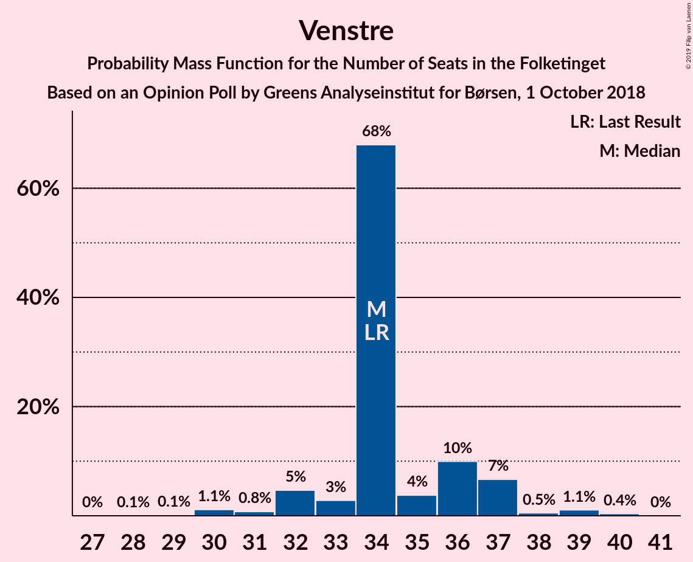

| Number of Seats | Probability | Accumulated | Special Marks |
|:---------------:|:-----------:|:-----------:|:-------------:|
| 28 | 0.1% | 100% |  |
| 29 | 0.1% | 99.9% |  |
| 30 | 1.1% | 99.8% |  |
| 31 | 0.8% | 98.6% |  |
| 32 | 5% | 98% |  |
| 33 | 3% | 93% |  |
| 34 | 68% | 90% | Last Result, Median |
| 35 | 4% | 22% |  |
| 36 | 10% | 19% |  |
| 37 | 7% | 9% |  |
| 38 | 0.5% | 2% |  |
| 39 | 1.1% | 1.5% |  |
| 40 | 0.4% | 0.4% |  |
| 41 | 0% | 0% |  |

### Dansk Folkeparti

*For a full overview of the results for this party, see the [Dansk Folkeparti](party-danskfolkeparti.html) page.*

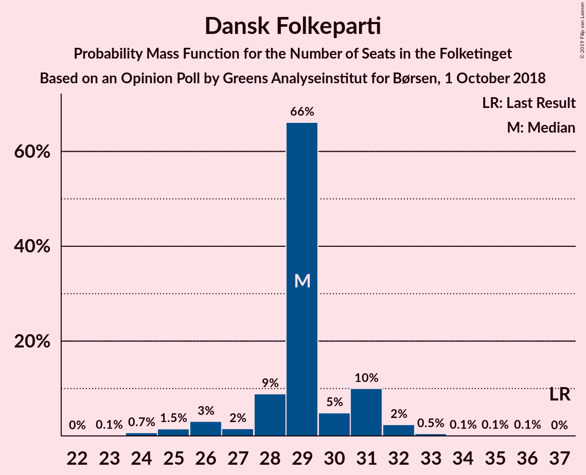

| Number of Seats | Probability | Accumulated | Special Marks |
|:---------------:|:-----------:|:-----------:|:-------------:|
| 23 | 0.1% | 100% |  |
| 24 | 0.7% | 99.9% |  |
| 25 | 1.5% | 99.2% |  |
| 26 | 3% | 98% |  |
| 27 | 2% | 95% |  |
| 28 | 9% | 93% |  |
| 29 | 66% | 84% | Median |
| 30 | 5% | 18% |  |
| 31 | 10% | 13% |  |
| 32 | 2% | 3% |  |
| 33 | 0.5% | 0.8% |  |
| 34 | 0.1% | 0.3% |  |
| 35 | 0.1% | 0.2% |  |
| 36 | 0.1% | 0.1% |  |
| 37 | 0% | 0% | Last Result |

### Enhedslisten–De Rød-Grønne

*For a full overview of the results for this party, see the [Enhedslisten–De Rød-Grønne](party-enhedslisten–derød-grønne.html) page.*

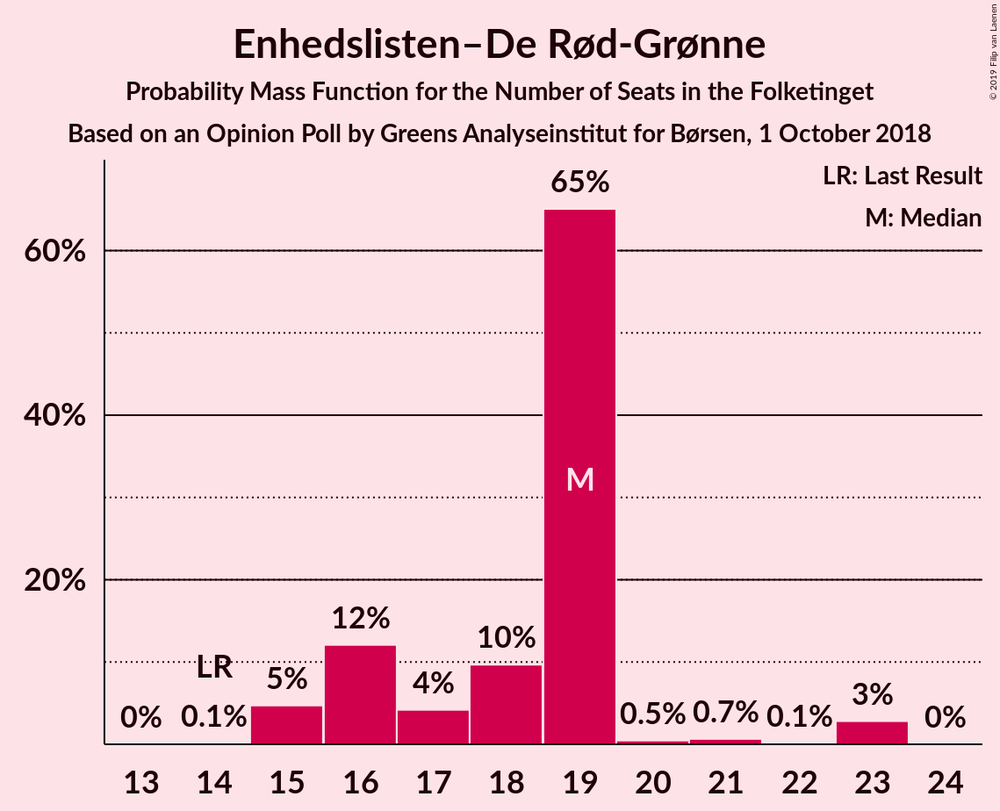

| Number of Seats | Probability | Accumulated | Special Marks |
|:---------------:|:-----------:|:-----------:|:-------------:|
| 14 | 0.1% | 100% | Last Result |
| 15 | 5% | 99.9% |  |
| 16 | 12% | 95% |  |
| 17 | 4% | 83% |  |
| 18 | 10% | 79% |  |
| 19 | 65% | 69% | Median |
| 20 | 0.5% | 4% |  |
| 21 | 0.7% | 4% |  |
| 22 | 0.1% | 3% |  |
| 23 | 3% | 3% |  |
| 24 | 0% | 0% |  |

### Socialistisk Folkeparti

*For a full overview of the results for this party, see the [Socialistisk Folkeparti](party-socialistiskfolkeparti.html) page.*

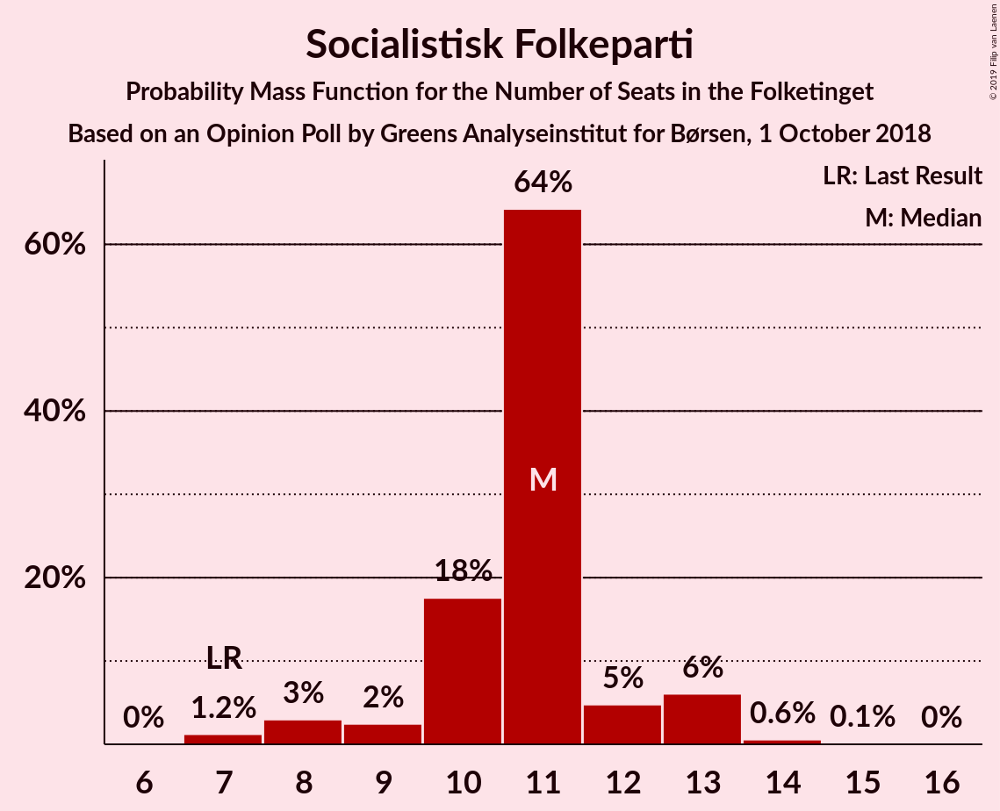

| Number of Seats | Probability | Accumulated | Special Marks |
|:---------------:|:-----------:|:-----------:|:-------------:|
| 7 | 1.2% | 100% | Last Result |
| 8 | 3% | 98.8% |  |
| 9 | 2% | 96% |  |
| 10 | 18% | 93% |  |
| 11 | 64% | 76% | Median |
| 12 | 5% | 12% |  |
| 13 | 6% | 7% |  |
| 14 | 0.6% | 0.7% |  |
| 15 | 0.1% | 0.1% |  |
| 16 | 0% | 0% |  |

### Radikale Venstre

*For a full overview of the results for this party, see the [Radikale Venstre](party-radikalevenstre.html) page.*

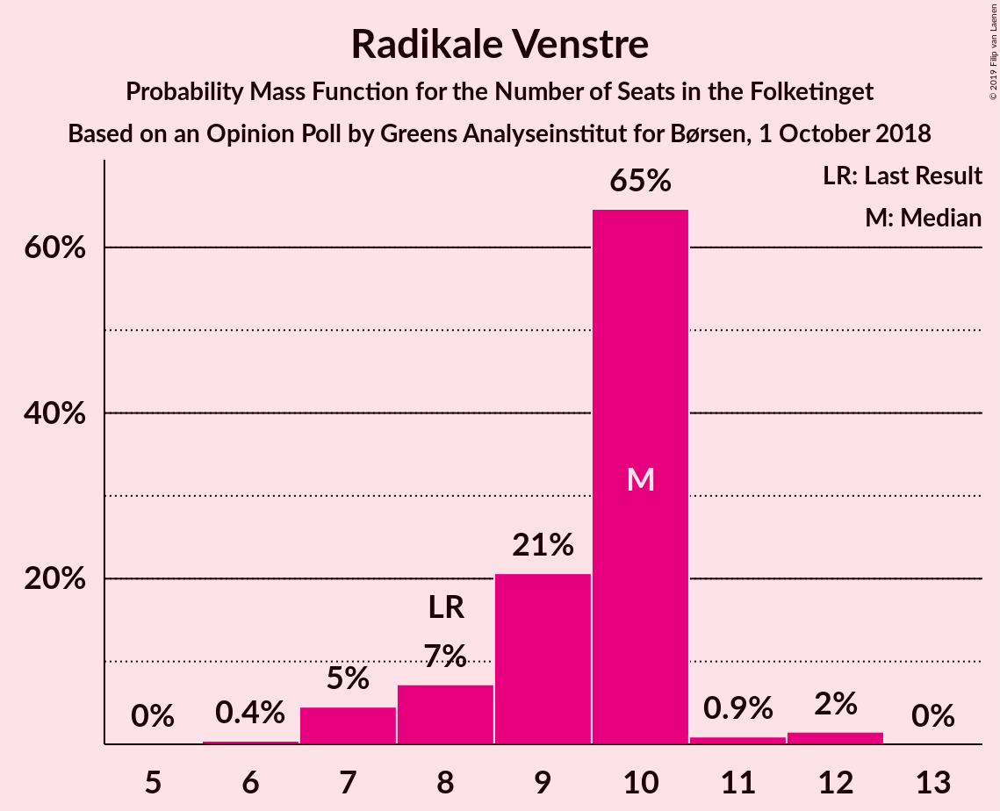

| Number of Seats | Probability | Accumulated | Special Marks |
|:---------------:|:-----------:|:-----------:|:-------------:|
| 6 | 0.4% | 100% |  |
| 7 | 5% | 99.6% |  |
| 8 | 7% | 95% | Last Result |
| 9 | 21% | 88% |  |
| 10 | 65% | 67% | Median |
| 11 | 0.9% | 2% |  |
| 12 | 2% | 2% |  |
| 13 | 0% | 0% |  |

### Det Konservative Folkeparti

*For a full overview of the results for this party, see the [Det Konservative Folkeparti](party-detkonservativefolkeparti.html) page.*

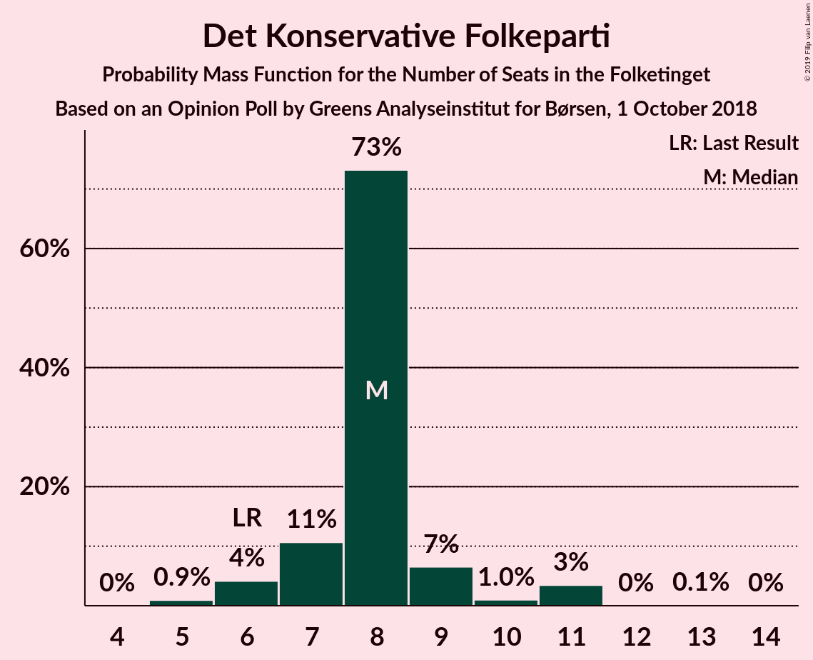

| Number of Seats | Probability | Accumulated | Special Marks |
|:---------------:|:-----------:|:-----------:|:-------------:|
| 5 | 0.9% | 100% |  |
| 6 | 4% | 99.0% | Last Result |
| 7 | 11% | 95% |  |
| 8 | 73% | 84% | Median |
| 9 | 7% | 11% |  |
| 10 | 1.0% | 5% |  |
| 11 | 3% | 4% |  |
| 12 | 0% | 0.1% |  |
| 13 | 0.1% | 0.1% |  |
| 14 | 0% | 0% |  |

### Liberal Alliance

*For a full overview of the results for this party, see the [Liberal Alliance](party-liberalalliance.html) page.*

| Number of Seats | Probability | Accumulated | Special Marks |
|:---------------:|:-----------:|:-----------:|:-------------:|
| 5 | 0.7% | 100% |  |
| 6 | 6% | 99.2% |  |
| 7 | 72% | 94% | Median |
| 8 | 17% | 22% |  |
| 9 | 4% | 5% |  |
| 10 | 1.0% | 1.1% |  |
| 11 | 0% | 0% |  |
| 12 | 0% | 0% |  |
| 13 | 0% | 0% | Last Result |

### Alternativet

*For a full overview of the results for this party, see the [Alternativet](party-alternativet.html) page.*

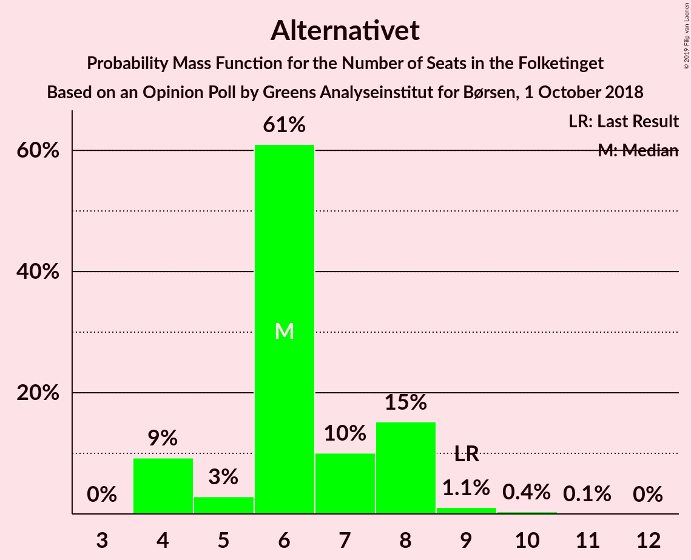

| Number of Seats | Probability | Accumulated | Special Marks |
|:---------------:|:-----------:|:-----------:|:-------------:|
| 4 | 9% | 100% |  |
| 5 | 3% | 91% |  |
| 6 | 61% | 88% | Median |
| 7 | 10% | 27% |  |
| 8 | 15% | 17% |  |
| 9 | 1.1% | 2% | Last Result |
| 10 | 0.4% | 0.5% |  |
| 11 | 0.1% | 0.1% |  |
| 12 | 0% | 0% |  |

### Nye Borgerlige

*For a full overview of the results for this party, see the [Nye Borgerlige](party-nyeborgerlige.html) page.*

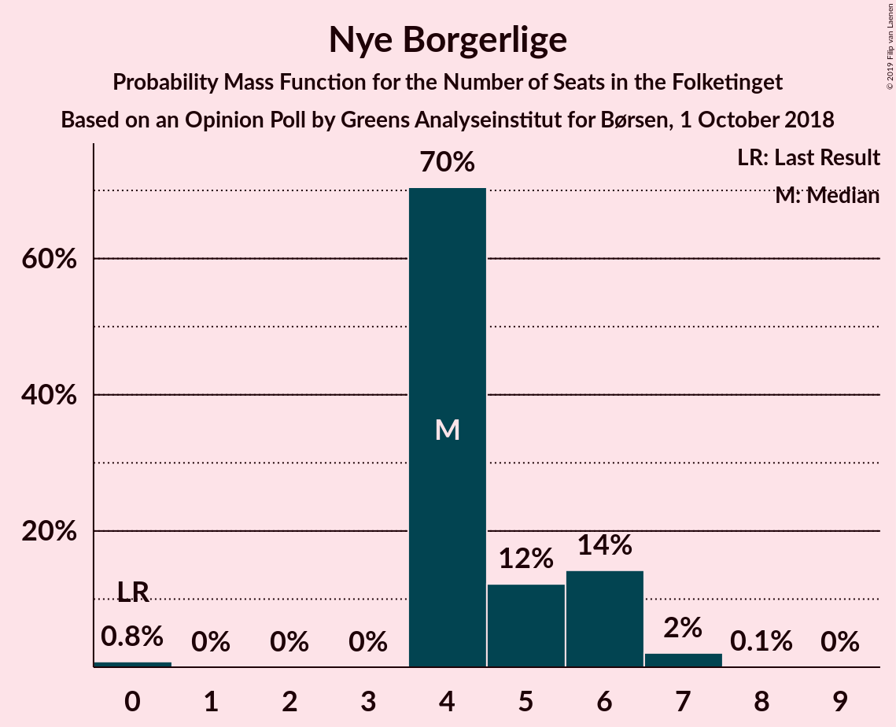

| Number of Seats | Probability | Accumulated | Special Marks |
|:---------------:|:-----------:|:-----------:|:-------------:|
| 0 | 0.8% | 100% | Last Result |
| 1 | 0% | 99.2% |  |
| 2 | 0% | 99.2% |  |
| 3 | 0% | 99.2% |  |
| 4 | 70% | 99.2% | Median |
| 5 | 12% | 29% |  |
| 6 | 14% | 16% |  |
| 7 | 2% | 2% |  |
| 8 | 0.1% | 0.1% |  |
| 9 | 0% | 0% |  |

### Kristendemokraterne

*For a full overview of the results for this party, see the [Kristendemokraterne](party-kristendemokraterne.html) page.*

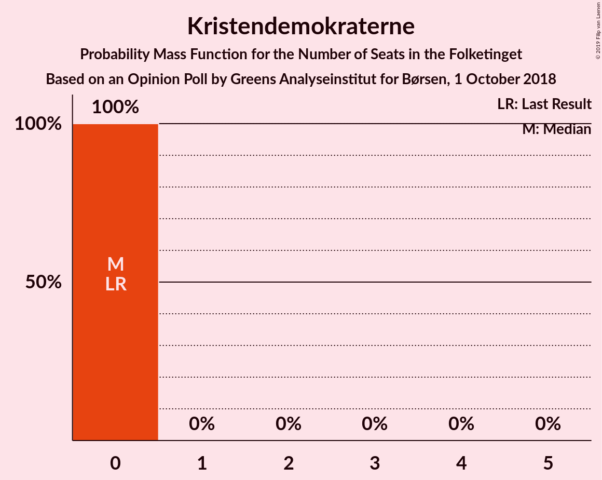

| Number of Seats | Probability | Accumulated | Special Marks |
|:---------------:|:-----------:|:-----------:|:-------------:|
| 0 | 100% | 100% | Last Result, Median |

## Coalitions

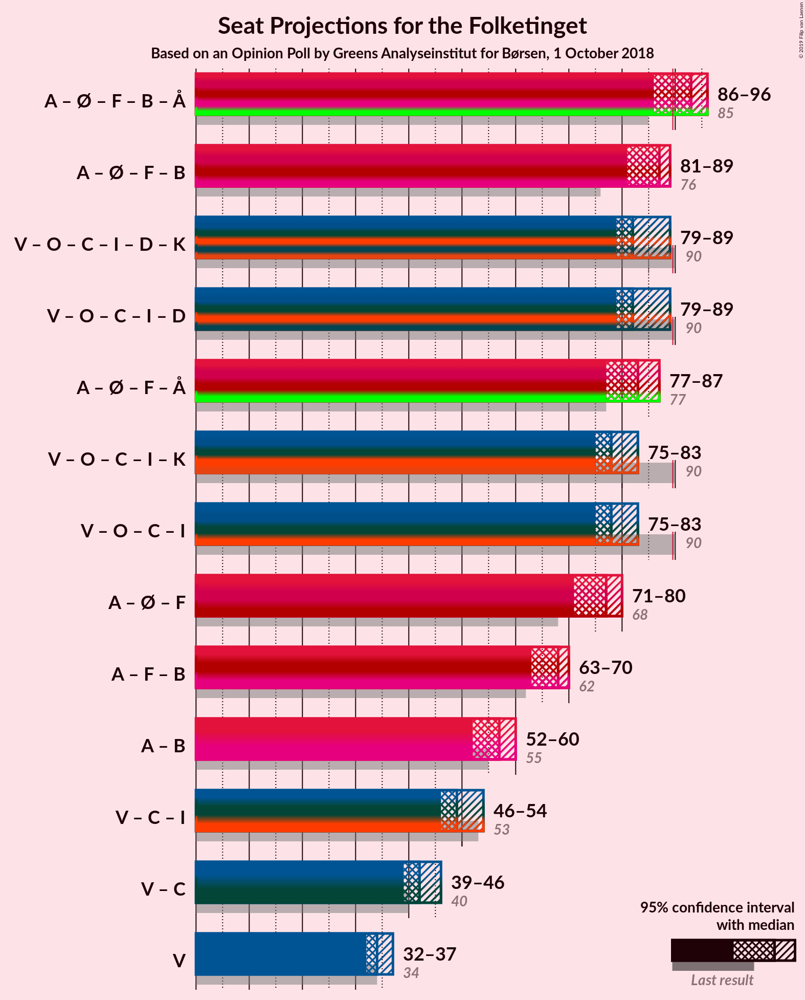

### Confidence Intervals

| Coalition | Last Result | Median | Majority? | 80% Confidence Interval | 90% Confidence Interval | 95% Confidence Interval | 99% Confidence Interval |
|:---------:|:-----------:|:------:|:---------:|:-----------------------:|:-----------------------:|:-----------------------:|:-----------------------:|
| Socialdemokraterne – Enhedslisten–De Rød-Grønne – Socialistisk Folkeparti – Radikale Venstre – Alternativet | 85 | 93 | 81% | 87–93 | 86–94 | 86–96 | 86–97 |
| Socialdemokraterne – Enhedslisten–De Rød-Grønne – Socialistisk Folkeparti – Radikale Venstre | 76 | 87 | 1.3% | 82–87 | 81–87 | 81–89 | 79–90 |
| Venstre – Dansk Folkeparti – Det Konservative Folkeparti – Liberal Alliance – Nye Borgerlige – Kristendemokraterne | 90 | 82 | 0.3% | 82–88 | 81–89 | 79–89 | 78–89 |
| Venstre – Dansk Folkeparti – Det Konservative Folkeparti – Liberal Alliance – Nye Borgerlige | 90 | 82 | 0.3% | 82–88 | 81–89 | 79–89 | 78–89 |
| Socialdemokraterne – Enhedslisten–De Rød-Grønne – Socialistisk Folkeparti – Alternativet | 77 | 83 | 0.1% | 77–84 | 77–85 | 77–87 | 76–89 |
| Venstre – Dansk Folkeparti – Det Konservative Folkeparti – Liberal Alliance – Kristendemokraterne | 90 | 78 | 0% | 77–83 | 76–83 | 75–83 | 72–84 |
| Venstre – Dansk Folkeparti – Det Konservative Folkeparti – Liberal Alliance | 90 | 78 | 0% | 77–83 | 76–83 | 75–83 | 72–84 |
| Socialdemokraterne – Enhedslisten–De Rød-Grønne – Socialistisk Folkeparti | 68 | 77 | 0% | 73–77 | 72–79 | 71–80 | 70–81 |
| Socialdemokraterne – Socialistisk Folkeparti – Radikale Venstre | 62 | 68 | 0% | 65–68 | 63–70 | 63–70 | 61–73 |
| Socialdemokraterne – Radikale Venstre | 55 | 57 | 0% | 54–58 | 53–59 | 52–60 | 51–61 |
| Venstre – Det Konservative Folkeparti – Liberal Alliance | 53 | 49 | 0% | 48–52 | 47–54 | 46–54 | 44–57 |
| Venstre – Det Konservative Folkeparti | 40 | 42 | 0% | 41–44 | 39–46 | 39–46 | 37–48 |
| Venstre | 34 | 34 | 0% | 34–36 | 32–37 | 32–37 | 30–39 |

### Socialdemokraterne – Enhedslisten–De Rød-Grønne – Socialistisk Folkeparti – Radikale Venstre – Alternativet

| Number of Seats | Probability | Accumulated | Special Marks |
|:---------------:|:-----------:|:-----------:|:-------------:|
| 83 | 0.1% | 100% |  |
| 84 | 0% | 99.9% |  |
| 85 | 0.1% | 99.9% | Last Result |
| 86 | 9% | 99.7% |  |
| 87 | 1.0% | 90% |  |
| 88 | 3% | 89% |  |
| 89 | 5% | 86% |  |
| 90 | 0.6% | 81% | Majority |
| 91 | 0.4% | 80% |  |
| 92 | 2% | 80% |  |
| 93 | 71% | 78% | Median |
| 94 | 3% | 6% |  |
| 95 | 1.0% | 4% |  |
| 96 | 0.7% | 3% |  |
| 97 | 2% | 2% |  |
| 98 | 0% | 0.3% |  |
| 99 | 0.2% | 0.3% |  |
| 100 | 0% | 0.1% |  |
| 101 | 0% | 0.1% |  |
| 102 | 0.1% | 0.1% |  |
| 103 | 0% | 0% |  |

### Socialdemokraterne – Enhedslisten–De Rød-Grønne – Socialistisk Folkeparti – Radikale Venstre

| Number of Seats | Probability | Accumulated | Special Marks |
|:---------------:|:-----------:|:-----------:|:-------------:|
| 75 | 0.2% | 100% |  |
| 76 | 0% | 99.8% | Last Result |
| 77 | 0% | 99.8% |  |
| 78 | 0.1% | 99.7% |  |
| 79 | 0.2% | 99.7% |  |
| 80 | 0.9% | 99.5% |  |
| 81 | 7% | 98.6% |  |
| 82 | 10% | 92% |  |
| 83 | 2% | 82% |  |
| 84 | 0.8% | 80% |  |
| 85 | 9% | 79% |  |
| 86 | 3% | 70% |  |
| 87 | 64% | 67% | Median |
| 88 | 0.4% | 3% |  |
| 89 | 1.5% | 3% |  |
| 90 | 0.9% | 1.3% | Majority |
| 91 | 0.2% | 0.4% |  |
| 92 | 0.1% | 0.2% |  |
| 93 | 0.1% | 0.1% |  |
| 94 | 0% | 0% |  |

### Venstre – Dansk Folkeparti – Det Konservative Folkeparti – Liberal Alliance – Nye Borgerlige – Kristendemokraterne

| Number of Seats | Probability | Accumulated | Special Marks |
|:---------------:|:-----------:|:-----------:|:-------------:|
| 73 | 0.1% | 100% |  |
| 74 | 0% | 99.9% |  |
| 75 | 0% | 99.9% |  |
| 76 | 0.2% | 99.9% |  |
| 77 | 0% | 99.7% |  |
| 78 | 2% | 99.7% |  |
| 79 | 0.7% | 98% |  |
| 80 | 1.0% | 97% |  |
| 81 | 3% | 96% |  |
| 82 | 71% | 94% | Median |
| 83 | 2% | 22% |  |
| 84 | 0.4% | 20% |  |
| 85 | 0.6% | 20% |  |
| 86 | 5% | 19% |  |
| 87 | 3% | 14% |  |
| 88 | 1.0% | 11% |  |
| 89 | 9% | 10% |  |
| 90 | 0.1% | 0.3% | Last Result, Majority |
| 91 | 0% | 0.1% |  |
| 92 | 0.1% | 0.1% |  |
| 93 | 0% | 0% |  |

### Venstre – Dansk Folkeparti – Det Konservative Folkeparti – Liberal Alliance – Nye Borgerlige

| Number of Seats | Probability | Accumulated | Special Marks |
|:---------------:|:-----------:|:-----------:|:-------------:|
| 73 | 0.1% | 100% |  |
| 74 | 0% | 99.9% |  |
| 75 | 0% | 99.9% |  |
| 76 | 0.2% | 99.9% |  |
| 77 | 0% | 99.7% |  |
| 78 | 2% | 99.7% |  |
| 79 | 0.7% | 98% |  |
| 80 | 1.0% | 97% |  |
| 81 | 3% | 96% |  |
| 82 | 71% | 94% | Median |
| 83 | 2% | 22% |  |
| 84 | 0.4% | 20% |  |
| 85 | 0.6% | 20% |  |
| 86 | 5% | 19% |  |
| 87 | 3% | 14% |  |
| 88 | 1.0% | 11% |  |
| 89 | 9% | 10% |  |
| 90 | 0.1% | 0.3% | Last Result, Majority |
| 91 | 0% | 0.1% |  |
| 92 | 0.1% | 0.1% |  |
| 93 | 0% | 0% |  |

### Socialdemokraterne – Enhedslisten–De Rød-Grønne – Socialistisk Folkeparti – Alternativet

| Number of Seats | Probability | Accumulated | Special Marks |
|:---------------:|:-----------:|:-----------:|:-------------:|
| 75 | 0% | 100% |  |
| 76 | 0.7% | 99.9% |  |
| 77 | 10% | 99.3% | Last Result |
| 78 | 3% | 90% |  |
| 79 | 1.1% | 87% |  |
| 80 | 0.6% | 86% |  |
| 81 | 0.7% | 85% |  |
| 82 | 5% | 84% |  |
| 83 | 63% | 80% | Median |
| 84 | 9% | 17% |  |
| 85 | 3% | 8% |  |
| 86 | 2% | 5% |  |
| 87 | 0.1% | 3% |  |
| 88 | 1.3% | 2% |  |
| 89 | 1.0% | 1.1% |  |
| 90 | 0.1% | 0.1% | Majority |
| 91 | 0% | 0% |  |

### Venstre – Dansk Folkeparti – Det Konservative Folkeparti – Liberal Alliance – Kristendemokraterne

| Number of Seats | Probability | Accumulated | Special Marks |
|:---------------:|:-----------:|:-----------:|:-------------:|
| 71 | 0.2% | 100% |  |
| 72 | 0.9% | 99.8% |  |
| 73 | 0.2% | 98.8% |  |
| 74 | 0.9% | 98.6% |  |
| 75 | 0.9% | 98% |  |
| 76 | 5% | 97% |  |
| 77 | 8% | 92% |  |
| 78 | 63% | 84% | Median |
| 79 | 0.7% | 21% |  |
| 80 | 2% | 20% |  |
| 81 | 1.3% | 18% |  |
| 82 | 5% | 17% |  |
| 83 | 11% | 12% |  |
| 84 | 0.7% | 0.9% |  |
| 85 | 0% | 0.1% |  |
| 86 | 0% | 0.1% |  |
| 87 | 0.1% | 0.1% |  |
| 88 | 0% | 0% |  |
| 89 | 0% | 0% |  |
| 90 | 0% | 0% | Last Result, Majority |

### Venstre – Dansk Folkeparti – Det Konservative Folkeparti – Liberal Alliance

| Number of Seats | Probability | Accumulated | Special Marks |
|:---------------:|:-----------:|:-----------:|:-------------:|
| 71 | 0.2% | 100% |  |
| 72 | 0.9% | 99.8% |  |
| 73 | 0.2% | 98.8% |  |
| 74 | 0.9% | 98.6% |  |
| 75 | 0.9% | 98% |  |
| 76 | 5% | 97% |  |
| 77 | 8% | 92% |  |
| 78 | 63% | 84% | Median |
| 79 | 0.7% | 21% |  |
| 80 | 2% | 20% |  |
| 81 | 1.3% | 18% |  |
| 82 | 5% | 17% |  |
| 83 | 11% | 12% |  |
| 84 | 0.7% | 0.9% |  |
| 85 | 0% | 0.1% |  |
| 86 | 0% | 0.1% |  |
| 87 | 0.1% | 0.1% |  |
| 88 | 0% | 0% |  |
| 89 | 0% | 0% |  |
| 90 | 0% | 0% | Last Result, Majority |

### Socialdemokraterne – Enhedslisten–De Rød-Grønne – Socialistisk Folkeparti

| Number of Seats | Probability | Accumulated | Special Marks |
|:---------------:|:-----------:|:-----------:|:-------------:|
| 67 | 0.1% | 100% |  |
| 68 | 0.1% | 99.9% | Last Result |
| 69 | 0.2% | 99.8% |  |
| 70 | 0.5% | 99.6% |  |
| 71 | 4% | 99.1% |  |
| 72 | 0.7% | 95% |  |
| 73 | 10% | 95% |  |
| 74 | 5% | 85% |  |
| 75 | 0.5% | 80% |  |
| 76 | 10% | 79% |  |
| 77 | 60% | 69% | Median |
| 78 | 4% | 9% |  |
| 79 | 2% | 5% |  |
| 80 | 0.6% | 3% |  |
| 81 | 2% | 2% |  |
| 82 | 0.2% | 0.2% |  |
| 83 | 0% | 0% |  |

### Socialdemokraterne – Socialistisk Folkeparti – Radikale Venstre

| Number of Seats | Probability | Accumulated | Special Marks |
|:---------------:|:-----------:|:-----------:|:-------------:|
| 58 | 0.1% | 100% |  |
| 59 | 0% | 99.9% |  |
| 60 | 0.1% | 99.8% |  |
| 61 | 0.3% | 99.7% |  |
| 62 | 0.5% | 99.4% | Last Result |
| 63 | 5% | 98.9% |  |
| 64 | 3% | 94% |  |
| 65 | 1.4% | 91% |  |
| 66 | 13% | 90% |  |
| 67 | 6% | 76% |  |
| 68 | 65% | 71% | Median |
| 69 | 0.1% | 5% |  |
| 70 | 3% | 5% |  |
| 71 | 1.0% | 2% |  |
| 72 | 0.1% | 1.0% |  |
| 73 | 0.5% | 0.8% |  |
| 74 | 0% | 0.4% |  |
| 75 | 0.3% | 0.3% |  |
| 76 | 0% | 0% |  |

### Socialdemokraterne – Radikale Venstre

| Number of Seats | Probability | Accumulated | Special Marks |
|:---------------:|:-----------:|:-----------:|:-------------:|
| 48 | 0.2% | 100% |  |
| 49 | 0% | 99.8% |  |
| 50 | 0.2% | 99.8% |  |
| 51 | 0.3% | 99.6% |  |
| 52 | 3% | 99.3% |  |
| 53 | 5% | 96% |  |
| 54 | 7% | 92% |  |
| 55 | 0.4% | 85% | Last Result |
| 56 | 10% | 85% |  |
| 57 | 64% | 75% | Median |
| 58 | 4% | 10% |  |
| 59 | 2% | 6% |  |
| 60 | 3% | 4% |  |
| 61 | 0.8% | 1.2% |  |
| 62 | 0.3% | 0.4% |  |
| 63 | 0% | 0.1% |  |
| 64 | 0% | 0% |  |

### Venstre – Det Konservative Folkeparti – Liberal Alliance

| Number of Seats | Probability | Accumulated | Special Marks |
|:---------------:|:-----------:|:-----------:|:-------------:|
| 43 | 0% | 100% |  |
| 44 | 1.1% | 99.9% |  |
| 45 | 0.4% | 98.9% |  |
| 46 | 2% | 98% |  |
| 47 | 4% | 96% |  |
| 48 | 5% | 92% |  |
| 49 | 61% | 87% | Median |
| 50 | 5% | 26% |  |
| 51 | 2% | 20% |  |
| 52 | 10% | 18% |  |
| 53 | 2% | 8% | Last Result |
| 54 | 4% | 5% |  |
| 55 | 0.3% | 1.3% |  |
| 56 | 0.4% | 1.0% |  |
| 57 | 0.5% | 0.5% |  |
| 58 | 0% | 0% |  |

### Venstre – Det Konservative Folkeparti

| Number of Seats | Probability | Accumulated | Special Marks |
|:---------------:|:-----------:|:-----------:|:-------------:|
| 37 | 0.9% | 100% |  |
| 38 | 1.0% | 99.1% |  |
| 39 | 3% | 98% |  |
| 40 | 0.5% | 95% | Last Result |
| 41 | 10% | 94% |  |
| 42 | 62% | 85% | Median |
| 43 | 4% | 23% |  |
| 44 | 10% | 19% |  |
| 45 | 2% | 9% |  |
| 46 | 5% | 7% |  |
| 47 | 0.3% | 1.3% |  |
| 48 | 1.0% | 1.0% |  |
| 49 | 0% | 0% |  |

### Venstre

| Number of Seats | Probability | Accumulated | Special Marks |
|:---------------:|:-----------:|:-----------:|:-------------:|
| 28 | 0.1% | 100% |  |
| 29 | 0.1% | 99.9% |  |
| 30 | 1.1% | 99.8% |  |
| 31 | 0.8% | 98.6% |  |
| 32 | 5% | 98% |  |
| 33 | 3% | 93% |  |
| 34 | 68% | 90% | Last Result, Median |
| 35 | 4% | 22% |  |
| 36 | 10% | 19% |  |
| 37 | 7% | 9% |  |
| 38 | 0.5% | 2% |  |
| 39 | 1.1% | 1.5% |  |
| 40 | 0.4% | 0.4% |  |
| 41 | 0% | 0% |  |

## Technical Information

### Opinion Poll

+ **Polling firm:** Greens Analyseinstitut
+ **Commissioner(s):** Børsen
+ **Fieldwork period:** 1 October 2018

### Calculations

+ **Sample size:** 1157
+ **Simulations done:** 131,072
+ **Error estimate:** 1.59%

