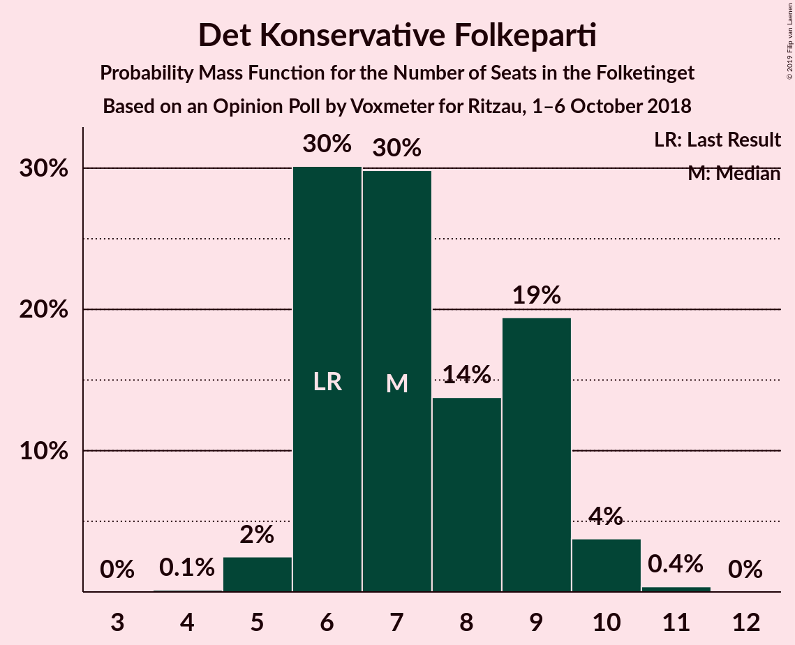

# Opinion Poll by Voxmeter for Ritzau, 1–6 October 2018

<a href="#voting-intentions">Voting Intentions</a> | <a href="#seats">Seats</a> | <a href="#coalitions">Coalitions</a> | <a href="#technical-information">Technical Information</a>

## Voting Intentions

### Confidence Intervals

| Party | Last Result | Poll Result | 80% Confidence Interval | 90% Confidence Interval | 95% Confidence Interval | 99% Confidence Interval |
|:-----:|:-----------:|:-----------:|:-----------------------:|:-----------------------:|:-----------------------:|:-----------------------:|
| Socialdemokraterne | 26.3% | 27.5% | 25.8–29.4% |25.3–29.9% |24.9–30.3% |24.1–31.2% |
| Venstre | 19.5% | 18.3% | 16.9–20.0% |16.4–20.4% |16.1–20.8% |15.4–21.6% |
| Dansk Folkeparti | 21.1% | 17.6% | 16.1–19.2% |15.7–19.6% |15.3–20.0% |14.7–20.8% |
| Enhedslisten–De Rød-Grønne | 7.8% | 8.3% | 7.3–9.5% |7.0–9.8% |6.8–10.2% |6.3–10.8% |
| Radikale Venstre | 4.6% | 5.7% | 4.8–6.7% |4.6–7.0% |4.4–7.3% |4.0–7.8% |
| Liberal Alliance | 7.5% | 5.2% | 4.4–6.2% |4.2–6.5% |4.0–6.7% |3.6–7.2% |
| Socialistisk Folkeparti | 4.2% | 5.1% | 4.3–6.1% |4.1–6.4% |3.9–6.6% |3.5–7.1% |
| Alternativet | 4.8% | 4.7% | 3.9–5.7% |3.7–5.9% |3.6–6.2% |3.2–6.7% |
| Det Konservative Folkeparti | 3.4% | 4.0% | 3.3–4.9% |3.1–5.2% |3.0–5.4% |2.7–5.9% |
| Nye Borgerlige | 0.0% | 2.3% | 1.8–3.1% |1.7–3.3% |1.6–3.5% |1.4–3.9% |
| Kristendemokraterne | 0.8% | 0.9% | 0.6–1.4% |0.5–1.5% |0.5–1.7% |0.4–2.0% |

*Note:* The poll result column reflects the actual value used in the calculations. Published results may vary slightly, and in addition be rounded to fewer digits.

## Seats

### Confidence Intervals

| Party | Last Result | Median | 80% Confidence Interval | 90% Confidence Interval | 95% Confidence Interval | 99% Confidence Interval |
|:-----:|:-----------:|:------:|:-----------------------:|:-----------------------:|:-----------------------:|:-----------------------:|
| <a href="#socialdemokraterne">Socialdemokraterne</a> | 47 | 49 | 46–52 |45–54 |44–55 |42–55 |
| <a href="#venstre">Venstre</a> | 34 | 32 | 30–35 |30–35 |29–36 |27–37 |
| <a href="#dansk-folkeparti">Dansk Folkeparti</a> | 37 | 31 | 29–33 |28–34 |27–35 |25–37 |
| <a href="#enhedslisten–de-rød-grønne">Enhedslisten–De Rød-Grønne</a> | 14 | 14 | 13–16 |13–17 |12–18 |11–19 |
| <a href="#radikale-venstre">Radikale Venstre</a> | 8 | 10 | 8–12 |8–12 |8–13 |7–13 |
| <a href="#liberal-alliance">Liberal Alliance</a> | 13 | 9 | 8–11 |7–11 |7–12 |7–13 |
| <a href="#socialistisk-folkeparti">Socialistisk Folkeparti</a> | 7 | 9 | 7–10 |7–11 |7–11 |6–12 |
| <a href="#alternativet">Alternativet</a> | 9 | 8 | 7–10 |7–10 |7–11 |6–11 |
| <a href="#det-konservative-folkeparti">Det Konservative Folkeparti</a> | 6 | 7 | 6–9 |6–9 |5–10 |5–10 |
| <a href="#nye-borgerlige">Nye Borgerlige</a> | 0 | 4 | 0–6 |0–6 |0–6 |0–6 |
| <a href="#kristendemokraterne">Kristendemokraterne</a> | 0 | 0 | 0 |0 |0 |0 |

### Socialdemokraterne

*For a full overview of the results for this party, see the [Socialdemokraterne](party-socialdemokraterne.html) page.*

| Number of Seats | Probability | Accumulated | Special Marks |
|:---------------:|:-----------:|:-----------:|:-------------:|
| 41 | 0.1% | 100% |  |
| 42 | 0.5% | 99.9% |  |
| 43 | 0.3% | 99.5% |  |
| 44 | 4% | 99.1% |  |
| 45 | 3% | 96% |  |
| 46 | 4% | 92% |  |
| 47 | 15% | 88% | Last Result |
| 48 | 6% | 73% |  |
| 49 | 24% | 68% | Median |
| 50 | 15% | 44% |  |
| 51 | 15% | 29% |  |
| 52 | 6% | 14% |  |
| 53 | 1.3% | 8% |  |
| 54 | 4% | 7% |  |
| 55 | 2% | 3% |  |
| 56 | 0.3% | 0.3% |  |
| 57 | 0% | 0% |  |

### Venstre

*For a full overview of the results for this party, see the [Venstre](party-venstre.html) page.*

| Number of Seats | Probability | Accumulated | Special Marks |
|:---------------:|:-----------:|:-----------:|:-------------:|
| 26 | 0.1% | 100% |  |
| 27 | 0.6% | 99.8% |  |
| 28 | 1.1% | 99.2% |  |
| 29 | 2% | 98% |  |
| 30 | 26% | 96% |  |
| 31 | 16% | 70% |  |
| 32 | 7% | 54% | Median |
| 33 | 13% | 46% |  |
| 34 | 4% | 34% | Last Result |
| 35 | 27% | 30% |  |
| 36 | 2% | 4% |  |
| 37 | 1.3% | 2% |  |
| 38 | 0.1% | 0.3% |  |
| 39 | 0.1% | 0.2% |  |
| 40 | 0% | 0.1% |  |
| 41 | 0% | 0.1% |  |
| 42 | 0% | 0% |  |

### Dansk Folkeparti

*For a full overview of the results for this party, see the [Dansk Folkeparti](party-danskfolkeparti.html) page.*

| Number of Seats | Probability | Accumulated | Special Marks |
|:---------------:|:-----------:|:-----------:|:-------------:|
| 25 | 0.7% | 100% |  |
| 26 | 1.1% | 99.3% |  |
| 27 | 1.3% | 98% |  |
| 28 | 4% | 97% |  |
| 29 | 11% | 93% |  |
| 30 | 27% | 82% |  |
| 31 | 18% | 55% | Median |
| 32 | 20% | 37% |  |
| 33 | 12% | 17% |  |
| 34 | 2% | 5% |  |
| 35 | 1.3% | 3% |  |
| 36 | 0.6% | 2% |  |
| 37 | 0.9% | 1.4% | Last Result |
| 38 | 0.5% | 0.5% |  |
| 39 | 0% | 0% |  |

### Enhedslisten–De Rød-Grønne

*For a full overview of the results for this party, see the [Enhedslisten–De Rød-Grønne](party-enhedslisten–derød-grønne.html) page.*

| Number of Seats | Probability | Accumulated | Special Marks |
|:---------------:|:-----------:|:-----------:|:-------------:|
| 10 | 0.1% | 100% |  |
| 11 | 0.9% | 99.9% |  |
| 12 | 2% | 99.0% |  |
| 13 | 7% | 97% |  |
| 14 | 50% | 90% | Last Result, Median |
| 15 | 18% | 40% |  |
| 16 | 14% | 21% |  |
| 17 | 4% | 8% |  |
| 18 | 3% | 4% |  |
| 19 | 0.6% | 0.7% |  |
| 20 | 0.1% | 0.1% |  |
| 21 | 0% | 0% |  |

### Radikale Venstre

*For a full overview of the results for this party, see the [Radikale Venstre](party-radikalevenstre.html) page.*

| Number of Seats | Probability | Accumulated | Special Marks |
|:---------------:|:-----------:|:-----------:|:-------------:|
| 7 | 0.7% | 100% |  |
| 8 | 12% | 99.2% | Last Result |
| 9 | 6% | 87% |  |
| 10 | 39% | 81% | Median |
| 11 | 24% | 42% |  |
| 12 | 14% | 18% |  |
| 13 | 4% | 4% |  |
| 14 | 0.2% | 0.2% |  |
| 15 | 0.1% | 0.1% |  |
| 16 | 0% | 0% |  |

### Liberal Alliance

*For a full overview of the results for this party, see the [Liberal Alliance](party-liberalalliance.html) page.*

| Number of Seats | Probability | Accumulated | Special Marks |
|:---------------:|:-----------:|:-----------:|:-------------:|
| 6 | 0.3% | 100% |  |
| 7 | 5% | 99.7% |  |
| 8 | 40% | 95% |  |
| 9 | 12% | 54% | Median |
| 10 | 31% | 42% |  |
| 11 | 8% | 11% |  |
| 12 | 2% | 3% |  |
| 13 | 0.8% | 0.8% | Last Result |
| 14 | 0% | 0% |  |

### Socialistisk Folkeparti

*For a full overview of the results for this party, see the [Socialistisk Folkeparti](party-socialistiskfolkeparti.html) page.*

| Number of Seats | Probability | Accumulated | Special Marks |
|:---------------:|:-----------:|:-----------:|:-------------:|
| 5 | 0.1% | 100% |  |
| 6 | 0.4% | 99.9% |  |
| 7 | 14% | 99.5% | Last Result |
| 8 | 29% | 85% |  |
| 9 | 42% | 56% | Median |
| 10 | 7% | 14% |  |
| 11 | 5% | 6% |  |
| 12 | 0.9% | 1.3% |  |
| 13 | 0.4% | 0.4% |  |
| 14 | 0% | 0% |  |

### Alternativet

*For a full overview of the results for this party, see the [Alternativet](party-alternativet.html) page.*

| Number of Seats | Probability | Accumulated | Special Marks |
|:---------------:|:-----------:|:-----------:|:-------------:|
| 5 | 0.1% | 100% |  |
| 6 | 0.8% | 99.9% |  |
| 7 | 15% | 99.1% |  |
| 8 | 44% | 84% | Median |
| 9 | 24% | 40% | Last Result |
| 10 | 13% | 16% |  |
| 11 | 2% | 3% |  |
| 12 | 0.3% | 0.4% |  |
| 13 | 0.1% | 0.1% |  |
| 14 | 0% | 0% |  |

### Det Konservative Folkeparti

*For a full overview of the results for this party, see the [Det Konservative Folkeparti](party-detkonservativefolkeparti.html) page.*

| Number of Seats | Probability | Accumulated | Special Marks |
|:---------------:|:-----------:|:-----------:|:-------------:|
| 4 | 0.1% | 100% |  |
| 5 | 2% | 99.9% |  |
| 6 | 30% | 97% | Last Result |
| 7 | 30% | 67% | Median |
| 8 | 14% | 37% |  |
| 9 | 19% | 24% |  |
| 10 | 4% | 4% |  |
| 11 | 0.4% | 0.4% |  |
| 12 | 0% | 0% |  |

### Nye Borgerlige

*For a full overview of the results for this party, see the [Nye Borgerlige](party-nyeborgerlige.html) page.*

| Number of Seats | Probability | Accumulated | Special Marks |
|:---------------:|:-----------:|:-----------:|:-------------:|
| 0 | 14% | 100% | Last Result |
| 1 | 0% | 86% |  |
| 2 | 0% | 86% |  |
| 3 | 0.3% | 86% |  |
| 4 | 38% | 86% | Median |
| 5 | 17% | 48% |  |
| 6 | 31% | 31% |  |
| 7 | 0.3% | 0.4% |  |
| 8 | 0.1% | 0.1% |  |
| 9 | 0% | 0% |  |

### Kristendemokraterne

*For a full overview of the results for this party, see the [Kristendemokraterne](party-kristendemokraterne.html) page.*

| Number of Seats | Probability | Accumulated | Special Marks |
|:---------------:|:-----------:|:-----------:|:-------------:|
| 0 | 99.7% | 100% | Last Result, Median |
| 1 | 0% | 0.3% |  |
| 2 | 0% | 0.3% |  |
| 3 | 0.2% | 0.3% |  |
| 4 | 0.1% | 0.1% |  |
| 5 | 0% | 0% |  |

## Coalitions

### Confidence Intervals

| Coalition | Last Result | Median | Majority? | 80% Confidence Interval | 90% Confidence Interval | 95% Confidence Interval | 99% Confidence Interval |
|:---------:|:-----------:|:------:|:---------:|:-----------------------:|:-----------------------:|:-----------------------:|:-----------------------:|
| Socialdemokraterne – Enhedslisten–De Rød-Grønne – Radikale Venstre – Socialistisk Folkeparti – Alternativet | 85 | 91 | 74% | 88–95 | 87–97 | 86–97 | 84–98 |
| Venstre – Dansk Folkeparti – Liberal Alliance – Det Konservative Folkeparti – Nye Borgerlige – Kristendemokraterne | 90 | 84 | 2% | 80–87 | 78–88 | 78–89 | 77–91 |
| Venstre – Dansk Folkeparti – Liberal Alliance – Det Konservative Folkeparti – Nye Borgerlige | 90 | 84 | 2% | 80–87 | 78–88 | 78–89 | 77–91 |
| Socialdemokraterne – Enhedslisten–De Rød-Grønne – Radikale Venstre – Socialistisk Folkeparti | 76 | 82 | 0.2% | 79–86 | 79–87 | 77–89 | 76–89 |
| Socialdemokraterne – Enhedslisten–De Rød-Grønne – Socialistisk Folkeparti – Alternativet | 77 | 80 | 0% | 78–86 | 77–86 | 75–87 | 73–87 |
| Venstre – Dansk Folkeparti – Liberal Alliance – Det Konservative Folkeparti – Kristendemokraterne | 90 | 79 | 0% | 78–83 | 76–84 | 74–85 | 73–87 |
| Venstre – Dansk Folkeparti – Liberal Alliance – Det Konservative Folkeparti | 90 | 79 | 0% | 78–83 | 76–84 | 74–85 | 73–87 |
| Socialdemokraterne – Enhedslisten–De Rød-Grønne – Socialistisk Folkeparti | 68 | 72 | 0% | 69–76 | 68–77 | 68–79 | 65–79 |
| Socialdemokraterne – Radikale Venstre – Socialistisk Folkeparti | 62 | 68 | 0% | 65–71 | 64–73 | 63–74 | 60–74 |
| Socialdemokraterne – Radikale Venstre | 55 | 59 | 0% | 56–63 | 55–65 | 55–65 | 52–66 |
| Venstre – Liberal Alliance – Det Konservative Folkeparti | 53 | 49 | 0% | 46–51 | 46–53 | 45–54 | 43–55 |
| Venstre – Det Konservative Folkeparti | 40 | 39 | 0% | 37–42 | 37–43 | 36–43 | 33–45 |
| Venstre | 34 | 32 | 0% | 30–35 | 30–35 | 29–36 | 27–37 |

### Socialdemokraterne – Enhedslisten–De Rød-Grønne – Radikale Venstre – Socialistisk Folkeparti – Alternativet

| Number of Seats | Probability | Accumulated | Special Marks |
|:---------------:|:-----------:|:-----------:|:-------------:|
| 82 | 0% | 100% |  |
| 83 | 0.4% | 99.9% |  |
| 84 | 0.2% | 99.5% |  |
| 85 | 1.2% | 99.4% | Last Result |
| 86 | 3% | 98% |  |
| 87 | 5% | 96% |  |
| 88 | 2% | 91% |  |
| 89 | 15% | 89% |  |
| 90 | 19% | 74% | Median, Majority |
| 91 | 16% | 55% |  |
| 92 | 6% | 39% |  |
| 93 | 17% | 33% |  |
| 94 | 4% | 16% |  |
| 95 | 3% | 12% |  |
| 96 | 3% | 9% |  |
| 97 | 5% | 5% |  |
| 98 | 0.6% | 0.8% |  |
| 99 | 0.1% | 0.2% |  |
| 100 | 0% | 0.1% |  |
| 101 | 0% | 0.1% |  |
| 102 | 0% | 0% |  |

### Venstre – Dansk Folkeparti – Liberal Alliance – Det Konservative Folkeparti – Nye Borgerlige – Kristendemokraterne

| Number of Seats | Probability | Accumulated | Special Marks |
|:---------------:|:-----------:|:-----------:|:-------------:|
| 74 | 0% | 100% |  |
| 75 | 0% | 99.9% |  |
| 76 | 0.1% | 99.9% |  |
| 77 | 0.6% | 99.8% |  |
| 78 | 5% | 99.2% |  |
| 79 | 3% | 95% |  |
| 80 | 3% | 91% |  |
| 81 | 4% | 88% |  |
| 82 | 17% | 84% |  |
| 83 | 6% | 67% | Median |
| 84 | 16% | 61% |  |
| 85 | 19% | 45% |  |
| 86 | 15% | 26% |  |
| 87 | 2% | 11% |  |
| 88 | 5% | 9% |  |
| 89 | 3% | 4% |  |
| 90 | 1.2% | 2% | Last Result, Majority |
| 91 | 0.2% | 0.6% |  |
| 92 | 0.4% | 0.5% |  |
| 93 | 0% | 0.1% |  |
| 94 | 0% | 0% |  |

### Venstre – Dansk Folkeparti – Liberal Alliance – Det Konservative Folkeparti – Nye Borgerlige

| Number of Seats | Probability | Accumulated | Special Marks |
|:---------------:|:-----------:|:-----------:|:-------------:|
| 74 | 0% | 100% |  |
| 75 | 0% | 99.9% |  |
| 76 | 0.1% | 99.9% |  |
| 77 | 0.6% | 99.8% |  |
| 78 | 5% | 99.2% |  |
| 79 | 4% | 95% |  |
| 80 | 3% | 91% |  |
| 81 | 4% | 88% |  |
| 82 | 17% | 84% |  |
| 83 | 6% | 67% | Median |
| 84 | 16% | 61% |  |
| 85 | 19% | 45% |  |
| 86 | 15% | 26% |  |
| 87 | 2% | 11% |  |
| 88 | 5% | 9% |  |
| 89 | 3% | 4% |  |
| 90 | 1.0% | 2% | Last Result, Majority |
| 91 | 0.2% | 0.6% |  |
| 92 | 0.4% | 0.5% |  |
| 93 | 0% | 0.1% |  |
| 94 | 0% | 0% |  |

### Socialdemokraterne – Enhedslisten–De Rød-Grønne – Radikale Venstre – Socialistisk Folkeparti

| Number of Seats | Probability | Accumulated | Special Marks |
|:---------------:|:-----------:|:-----------:|:-------------:|
| 74 | 0.1% | 100% |  |
| 75 | 0.1% | 99.8% |  |
| 76 | 1.1% | 99.7% | Last Result |
| 77 | 1.2% | 98.6% |  |
| 78 | 1.4% | 97% |  |
| 79 | 7% | 96% |  |
| 80 | 6% | 89% |  |
| 81 | 2% | 83% |  |
| 82 | 33% | 80% | Median |
| 83 | 16% | 48% |  |
| 84 | 12% | 31% |  |
| 85 | 2% | 19% |  |
| 86 | 8% | 17% |  |
| 87 | 5% | 9% |  |
| 88 | 1.3% | 4% |  |
| 89 | 2% | 3% |  |
| 90 | 0.1% | 0.2% | Majority |
| 91 | 0.1% | 0.2% |  |
| 92 | 0.1% | 0.1% |  |
| 93 | 0% | 0% |  |

### Socialdemokraterne – Enhedslisten–De Rød-Grønne – Socialistisk Folkeparti – Alternativet

| Number of Seats | Probability | Accumulated | Special Marks |
|:---------------:|:-----------:|:-----------:|:-------------:|
| 72 | 0.4% | 100% |  |
| 73 | 0.3% | 99.6% |  |
| 74 | 0.2% | 99.3% |  |
| 75 | 2% | 99.1% |  |
| 76 | 2% | 97% |  |
| 77 | 4% | 95% | Last Result |
| 78 | 4% | 91% |  |
| 79 | 13% | 88% |  |
| 80 | 33% | 75% | Median |
| 81 | 15% | 41% |  |
| 82 | 5% | 27% |  |
| 83 | 2% | 22% |  |
| 84 | 6% | 20% |  |
| 85 | 4% | 15% |  |
| 86 | 7% | 10% |  |
| 87 | 3% | 3% |  |
| 88 | 0.2% | 0.4% |  |
| 89 | 0.2% | 0.2% |  |
| 90 | 0% | 0% | Majority |

### Venstre – Dansk Folkeparti – Liberal Alliance – Det Konservative Folkeparti – Kristendemokraterne

| Number of Seats | Probability | Accumulated | Special Marks |
|:---------------:|:-----------:|:-----------:|:-------------:|
| 71 | 0% | 100% |  |
| 72 | 0% | 99.9% |  |
| 73 | 0.8% | 99.9% |  |
| 74 | 2% | 99.1% |  |
| 75 | 0.7% | 97% |  |
| 76 | 4% | 97% |  |
| 77 | 2% | 92% |  |
| 78 | 16% | 90% |  |
| 79 | 27% | 74% | Median |
| 80 | 25% | 47% |  |
| 81 | 4% | 22% |  |
| 82 | 7% | 18% |  |
| 83 | 5% | 11% |  |
| 84 | 2% | 6% |  |
| 85 | 1.1% | 4% |  |
| 86 | 2% | 2% |  |
| 87 | 0.6% | 0.9% |  |
| 88 | 0.2% | 0.3% |  |
| 89 | 0% | 0.1% |  |
| 90 | 0% | 0% | Last Result, Majority |

### Venstre – Dansk Folkeparti – Liberal Alliance – Det Konservative Folkeparti

| Number of Seats | Probability | Accumulated | Special Marks |
|:---------------:|:-----------:|:-----------:|:-------------:|
| 71 | 0% | 100% |  |
| 72 | 0% | 99.9% |  |
| 73 | 0.8% | 99.9% |  |
| 74 | 2% | 99.1% |  |
| 75 | 0.7% | 97% |  |
| 76 | 4% | 97% |  |
| 77 | 2% | 92% |  |
| 78 | 16% | 90% |  |
| 79 | 27% | 74% | Median |
| 80 | 25% | 47% |  |
| 81 | 4% | 22% |  |
| 82 | 7% | 18% |  |
| 83 | 5% | 11% |  |
| 84 | 2% | 6% |  |
| 85 | 0.9% | 3% |  |
| 86 | 2% | 2% |  |
| 87 | 0.6% | 0.9% |  |
| 88 | 0.2% | 0.3% |  |
| 89 | 0% | 0.1% |  |
| 90 | 0% | 0% | Last Result, Majority |

### Socialdemokraterne – Enhedslisten–De Rød-Grønne – Socialistisk Folkeparti

| Number of Seats | Probability | Accumulated | Special Marks |
|:---------------:|:-----------:|:-----------:|:-------------:|
| 64 | 0.1% | 100% |  |
| 65 | 0.6% | 99.9% |  |
| 66 | 0.5% | 99.3% |  |
| 67 | 0.8% | 98.7% |  |
| 68 | 5% | 98% | Last Result |
| 69 | 5% | 93% |  |
| 70 | 5% | 88% |  |
| 71 | 2% | 83% |  |
| 72 | 50% | 81% | Median |
| 73 | 5% | 31% |  |
| 74 | 6% | 26% |  |
| 75 | 8% | 19% |  |
| 76 | 2% | 11% |  |
| 77 | 6% | 9% |  |
| 78 | 0.7% | 3% |  |
| 79 | 2% | 3% |  |
| 80 | 0.2% | 0.3% |  |
| 81 | 0% | 0.1% |  |
| 82 | 0% | 0% |  |

### Socialdemokraterne – Radikale Venstre – Socialistisk Folkeparti

| Number of Seats | Probability | Accumulated | Special Marks |
|:---------------:|:-----------:|:-----------:|:-------------:|
| 59 | 0.1% | 100% |  |
| 60 | 0.4% | 99.8% |  |
| 61 | 0.3% | 99.4% |  |
| 62 | 0.7% | 99.1% | Last Result |
| 63 | 2% | 98% |  |
| 64 | 3% | 97% |  |
| 65 | 6% | 93% |  |
| 66 | 15% | 88% |  |
| 67 | 8% | 73% |  |
| 68 | 21% | 65% | Median |
| 69 | 15% | 44% |  |
| 70 | 15% | 28% |  |
| 71 | 4% | 13% |  |
| 72 | 4% | 9% |  |
| 73 | 2% | 5% |  |
| 74 | 3% | 3% |  |
| 75 | 0.3% | 0.5% |  |
| 76 | 0.1% | 0.1% |  |
| 77 | 0% | 0.1% |  |
| 78 | 0% | 0% |  |

### Socialdemokraterne – Radikale Venstre

| Number of Seats | Probability | Accumulated | Special Marks |
|:---------------:|:-----------:|:-----------:|:-------------:|
| 50 | 0.1% | 100% |  |
| 51 | 0.1% | 99.9% |  |
| 52 | 0.6% | 99.8% |  |
| 53 | 0.8% | 99.1% |  |
| 54 | 0.8% | 98% |  |
| 55 | 5% | 98% | Last Result |
| 56 | 3% | 93% |  |
| 57 | 19% | 90% |  |
| 58 | 3% | 71% |  |
| 59 | 24% | 67% | Median |
| 60 | 3% | 43% |  |
| 61 | 19% | 41% |  |
| 62 | 4% | 22% |  |
| 63 | 11% | 18% |  |
| 64 | 0.9% | 7% |  |
| 65 | 6% | 6% |  |
| 66 | 0.5% | 0.6% |  |
| 67 | 0.1% | 0.1% |  |
| 68 | 0% | 0.1% |  |
| 69 | 0% | 0% |  |

### Venstre – Liberal Alliance – Det Konservative Folkeparti

| Number of Seats | Probability | Accumulated | Special Marks |
|:---------------:|:-----------:|:-----------:|:-------------:|
| 42 | 0.2% | 100% |  |
| 43 | 0.5% | 99.8% |  |
| 44 | 2% | 99.3% |  |
| 45 | 2% | 98% |  |
| 46 | 11% | 96% |  |
| 47 | 16% | 85% |  |
| 48 | 5% | 69% | Median |
| 49 | 34% | 63% |  |
| 50 | 17% | 30% |  |
| 51 | 6% | 13% |  |
| 52 | 1.0% | 7% |  |
| 53 | 3% | 6% | Last Result |
| 54 | 3% | 3% |  |
| 55 | 0.3% | 0.8% |  |
| 56 | 0.2% | 0.5% |  |
| 57 | 0.2% | 0.2% |  |
| 58 | 0% | 0% |  |

### Venstre – Det Konservative Folkeparti

| Number of Seats | Probability | Accumulated | Special Marks |
|:---------------:|:-----------:|:-----------:|:-------------:|
| 32 | 0.1% | 100% |  |
| 33 | 0.5% | 99.9% |  |
| 34 | 0.6% | 99.4% |  |
| 35 | 0.6% | 98.8% |  |
| 36 | 2% | 98% |  |
| 37 | 11% | 96% |  |
| 38 | 14% | 85% |  |
| 39 | 21% | 71% | Median |
| 40 | 8% | 50% | Last Result |
| 41 | 27% | 42% |  |
| 42 | 7% | 14% |  |
| 43 | 6% | 8% |  |
| 44 | 1.4% | 2% |  |
| 45 | 0.3% | 0.7% |  |
| 46 | 0.3% | 0.4% |  |
| 47 | 0% | 0.1% |  |
| 48 | 0.1% | 0.1% |  |
| 49 | 0% | 0% |  |

### Venstre

| Number of Seats | Probability | Accumulated | Special Marks |
|:---------------:|:-----------:|:-----------:|:-------------:|
| 26 | 0.1% | 100% |  |
| 27 | 0.6% | 99.8% |  |
| 28 | 1.1% | 99.2% |  |
| 29 | 2% | 98% |  |
| 30 | 26% | 96% |  |
| 31 | 16% | 70% |  |
| 32 | 7% | 54% | Median |
| 33 | 13% | 46% |  |
| 34 | 4% | 34% | Last Result |
| 35 | 27% | 30% |  |
| 36 | 2% | 4% |  |
| 37 | 1.3% | 2% |  |
| 38 | 0.1% | 0.3% |  |
| 39 | 0.1% | 0.2% |  |
| 40 | 0% | 0.1% |  |
| 41 | 0% | 0.1% |  |
| 42 | 0% | 0% |  |

## Technical Information

### Opinion Poll

+ **Polling firm:** Voxmeter
+ **Commissioner(s):** Ritzau
+ **Fieldwork period:** 1–6 October 2018

### Calculations

+ **Sample size:** 1025
+ **Simulations done:** 1,048,576
+ **Error estimate:** 2.70%

