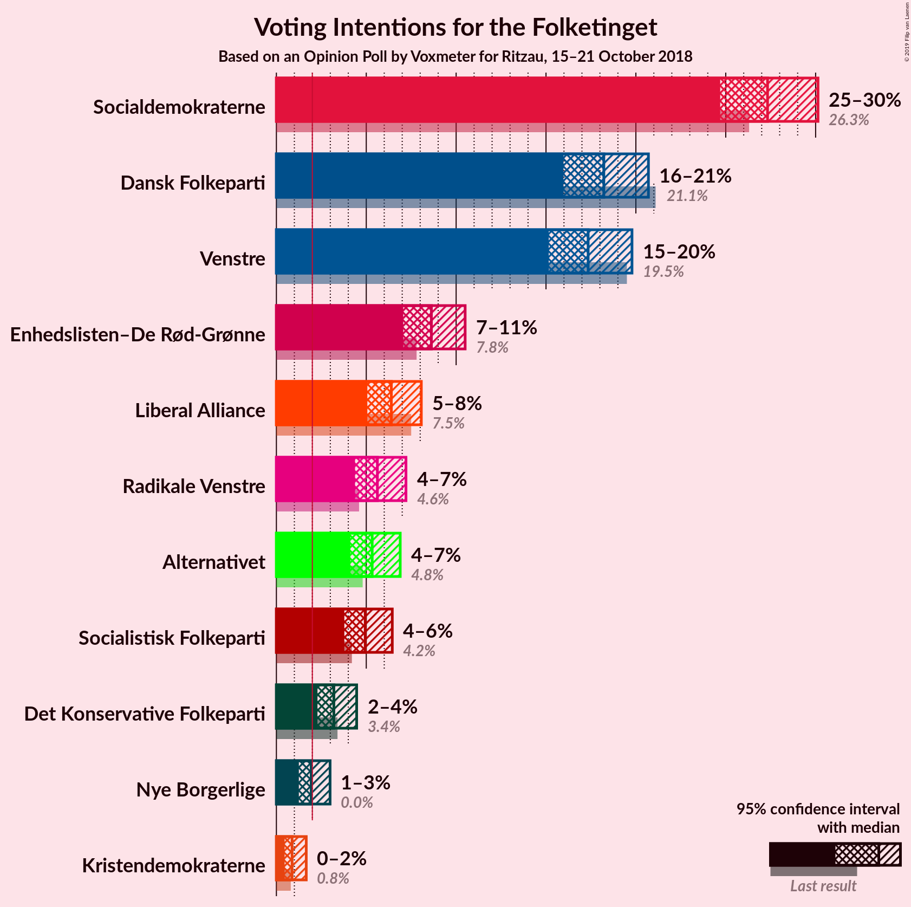
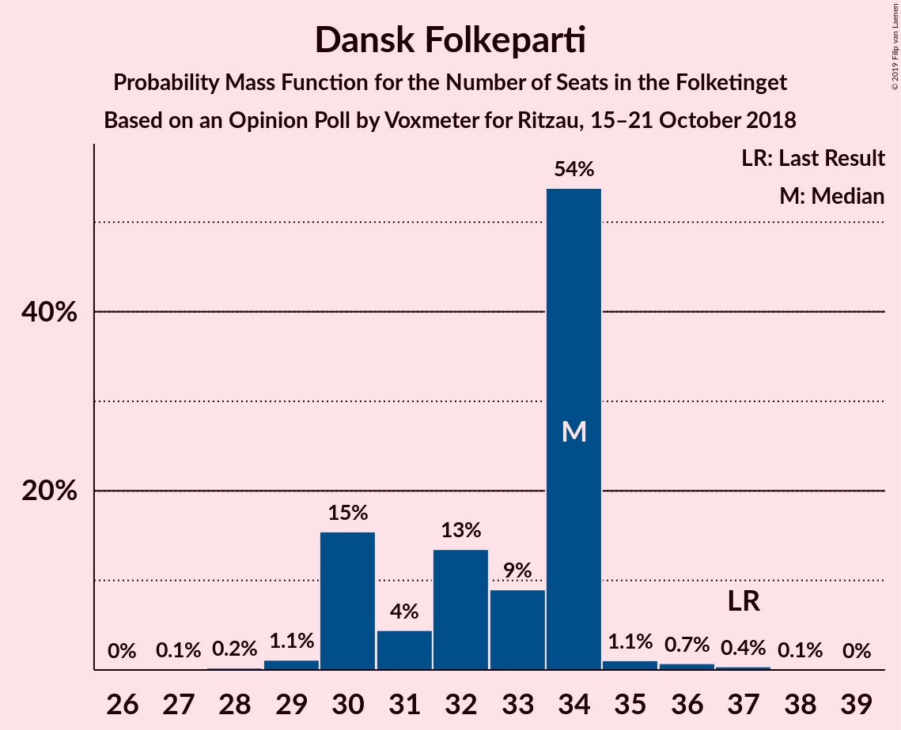
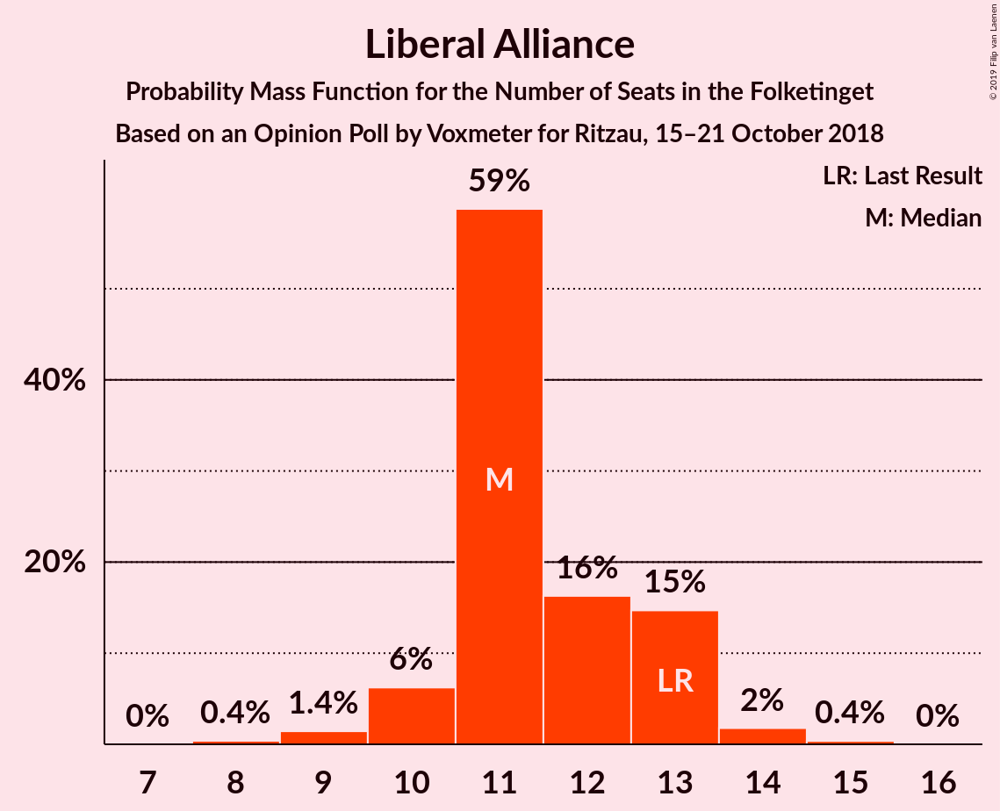
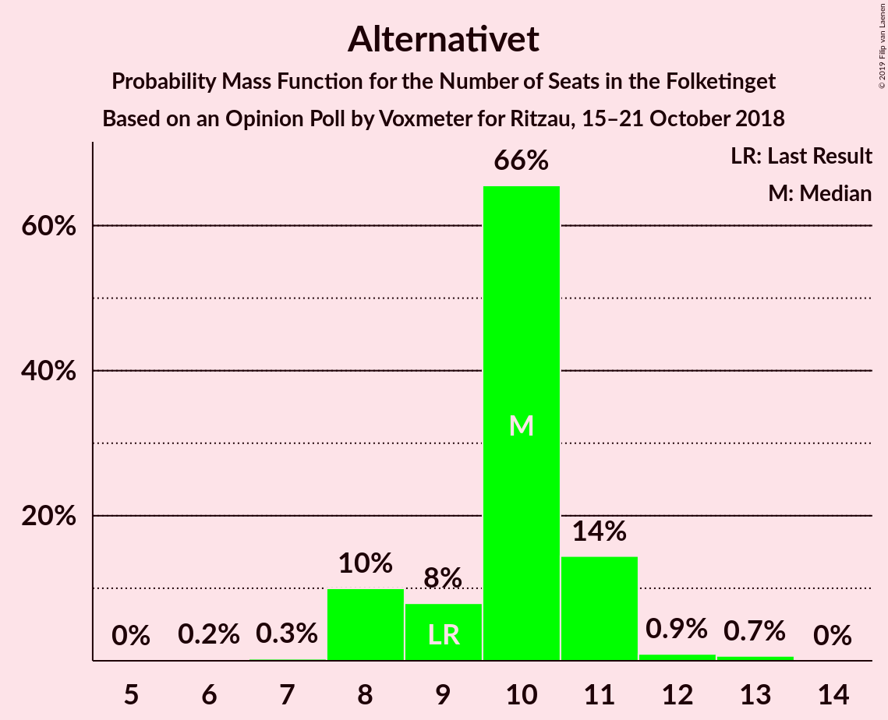
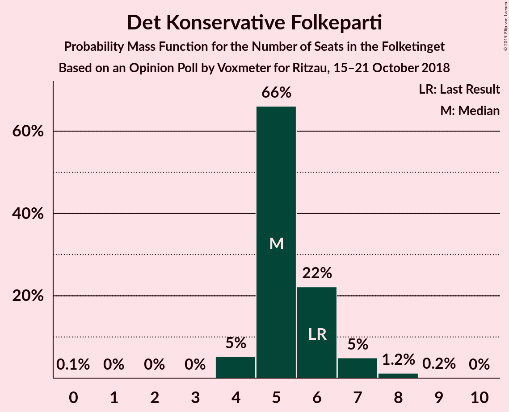
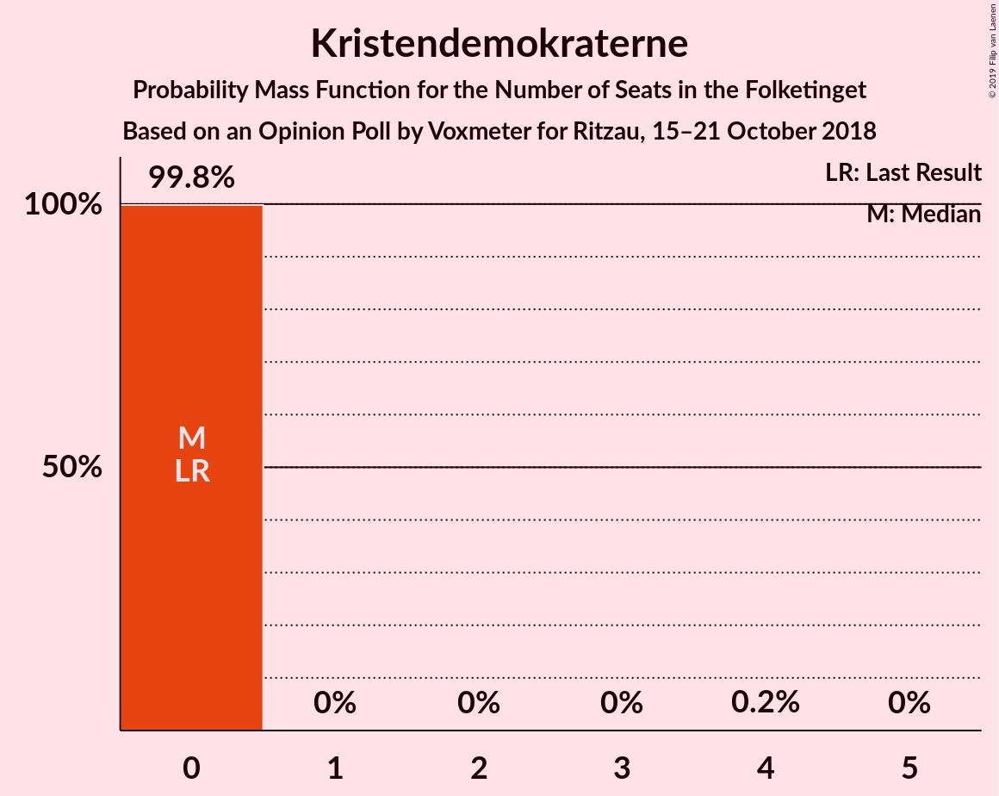

# Opinion Poll by Voxmeter for Ritzau, 15–21 October 2018

<a href="#voting-intentions">Voting Intentions</a> | <a href="#seats">Seats</a> | <a href="#coalitions">Coalitions</a> | <a href="#technical-information">Technical Information</a>

## Voting Intentions

### Confidence Intervals

| Party | Last Result | Poll Result | 80% Confidence Interval | 90% Confidence Interval | 95% Confidence Interval | 99% Confidence Interval |
|:-----:|:-----------:|:-----------:|:-----------------------:|:-----------------------:|:-----------------------:|:-----------------------:|
| Socialdemokraterne | 26.3% | 27.3% | 25.6–29.2% |25.1–29.7% |24.7–30.1% |23.9–31.0% |
| Dansk Folkeparti | 21.1% | 18.2% | 16.8–19.8% |16.3–20.3% |16.0–20.7% |15.3–21.5% |
| Venstre | 19.5% | 17.3% | 15.9–18.9% |15.5–19.4% |15.2–19.8% |14.5–20.6% |
| Enhedslisten–De Rød-Grønne | 7.8% | 8.6% | 7.6–9.8% |7.3–10.2% |7.1–10.5% |6.6–11.1% |
| Liberal Alliance | 7.5% | 6.4% | 5.5–7.5% |5.3–7.8% |5.1–8.1% |4.7–8.6% |
| Radikale Venstre | 4.6% | 5.6% | 4.8–6.7% |4.6–7.0% |4.4–7.2% |4.0–7.7% |
| Alternativet | 4.8% | 5.3% | 4.5–6.3% |4.3–6.6% |4.1–6.9% |3.8–7.4% |
| Socialistisk Folkeparti | 4.2% | 4.9% | 4.2–5.9% |4.0–6.2% |3.8–6.4% |3.4–7.0% |
| Det Konservative Folkeparti | 3.4% | 3.2% | 2.6–4.0% |2.4–4.3% |2.3–4.5% |2.0–4.9% |
| Nye Borgerlige | 0.0% | 1.9% | 1.5–2.6% |1.4–2.8% |1.2–3.0% |1.1–3.3% |
| Kristendemokraterne | 0.8% | 0.9% | 0.6–1.4% |0.5–1.5% |0.5–1.7% |0.4–1.9% |

*Note:* The poll result column reflects the actual value used in the calculations. Published results may vary slightly, and in addition be rounded to fewer digits.

## Seats

### Confidence Intervals

| Party | Last Result | Median | 80% Confidence Interval | 90% Confidence Interval | 95% Confidence Interval | 99% Confidence Interval |
|:-----:|:-----------:|:------:|:-----------------------:|:-----------------------:|:-----------------------:|:-----------------------:|
| <a href="#socialdemokraterne">Socialdemokraterne</a> | 47 | 46 | 46–51 |46–51 |46–51 |44–54 |
| <a href="#dansk-folkeparti">Dansk Folkeparti</a> | 37 | 34 | 30–34 |30–34 |30–34 |29–36 |
| <a href="#venstre">Venstre</a> | 34 | 31 | 27–32 |27–35 |27–35 |26–37 |
| <a href="#enhedslisten–de-rød-grønne">Enhedslisten–De Rød-Grønne</a> | 14 | 14 | 14–18 |14–18 |13–18 |12–19 |
| <a href="#liberal-alliance">Liberal Alliance</a> | 13 | 11 | 11–13 |10–13 |10–13 |9–14 |
| <a href="#radikale-venstre">Radikale Venstre</a> | 8 | 10 | 9–11 |9–12 |9–12 |7–13 |
| <a href="#alternativet">Alternativet</a> | 9 | 10 | 8–11 |8–11 |8–11 |8–13 |
| <a href="#socialistisk-folkeparti">Socialistisk Folkeparti</a> | 7 | 10 | 8–10 |7–10 |7–11 |6–12 |
| <a href="#det-konservative-folkeparti">Det Konservative Folkeparti</a> | 6 | 5 | 5–6 |4–7 |4–7 |4–8 |
| <a href="#nye-borgerlige">Nye Borgerlige</a> | 0 | 4 | 0–4 |0–4 |0–5 |0–5 |
| <a href="#kristendemokraterne">Kristendemokraterne</a> | 0 | 0 | 0 |0 |0 |0 |

### Socialdemokraterne

*For a full overview of the results for this party, see the [Socialdemokraterne](party-socialdemokraterne.html) page.*

| Number of Seats | Probability | Accumulated | Special Marks |
|:---------------:|:-----------:|:-----------:|:-------------:|
| 41 | 0.1% | 100% |  |
| 42 | 0.1% | 99.9% |  |
| 43 | 0.1% | 99.8% |  |
| 44 | 0.8% | 99.6% |  |
| 45 | 0.8% | 98.8% |  |
| 46 | 58% | 98% | Median |
| 47 | 1.1% | 40% | Last Result |
| 48 | 15% | 39% |  |
| 49 | 2% | 23% |  |
| 50 | 6% | 22% |  |
| 51 | 13% | 15% |  |
| 52 | 0.5% | 2% |  |
| 53 | 1.2% | 2% |  |
| 54 | 0.5% | 0.7% |  |
| 55 | 0.1% | 0.2% |  |
| 56 | 0% | 0% |  |

### Dansk Folkeparti

*For a full overview of the results for this party, see the [Dansk Folkeparti](party-danskfolkeparti.html) page.*

| Number of Seats | Probability | Accumulated | Special Marks |
|:---------------:|:-----------:|:-----------:|:-------------:|
| 26 | 0% | 100% |  |
| 27 | 0.1% | 99.9% |  |
| 28 | 0.2% | 99.8% |  |
| 29 | 1.1% | 99.6% |  |
| 30 | 15% | 98% |  |
| 31 | 4% | 83% |  |
| 32 | 13% | 79% |  |
| 33 | 9% | 65% |  |
| 34 | 54% | 56% | Median |
| 35 | 1.1% | 2% |  |
| 36 | 0.7% | 1.2% |  |
| 37 | 0.4% | 0.5% | Last Result |
| 38 | 0.1% | 0.1% |  |
| 39 | 0% | 0% |  |

### Venstre

*For a full overview of the results for this party, see the [Venstre](party-venstre.html) page.*

| Number of Seats | Probability | Accumulated | Special Marks |
|:---------------:|:-----------:|:-----------:|:-------------:|
| 25 | 0.3% | 100% |  |
| 26 | 1.1% | 99.6% |  |
| 27 | 11% | 98.6% |  |
| 28 | 4% | 87% |  |
| 29 | 3% | 83% |  |
| 30 | 2% | 81% |  |
| 31 | 68% | 79% | Median |
| 32 | 2% | 12% |  |
| 33 | 4% | 9% |  |
| 34 | 0.5% | 6% | Last Result |
| 35 | 4% | 5% |  |
| 36 | 0.3% | 1.1% |  |
| 37 | 0.8% | 0.8% |  |
| 38 | 0% | 0% |  |

### Enhedslisten–De Rød-Grønne

*For a full overview of the results for this party, see the [Enhedslisten–De Rød-Grønne](party-enhedslisten–derød-grønne.html) page.*

| Number of Seats | Probability | Accumulated | Special Marks |
|:---------------:|:-----------:|:-----------:|:-------------:|
| 11 | 0.3% | 100% |  |
| 12 | 0.3% | 99.7% |  |
| 13 | 3% | 99.3% |  |
| 14 | 56% | 97% | Last Result, Median |
| 15 | 16% | 41% |  |
| 16 | 7% | 25% |  |
| 17 | 5% | 17% |  |
| 18 | 12% | 13% |  |
| 19 | 0.6% | 0.8% |  |
| 20 | 0.1% | 0.2% |  |
| 21 | 0.1% | 0.1% |  |
| 22 | 0% | 0% |  |

### Liberal Alliance

*For a full overview of the results for this party, see the [Liberal Alliance](party-liberalalliance.html) page.*

| Number of Seats | Probability | Accumulated | Special Marks |
|:---------------:|:-----------:|:-----------:|:-------------:|
| 8 | 0.4% | 100% |  |
| 9 | 1.4% | 99.6% |  |
| 10 | 6% | 98% |  |
| 11 | 59% | 92% | Median |
| 12 | 16% | 33% |  |
| 13 | 15% | 17% | Last Result |
| 14 | 2% | 2% |  |
| 15 | 0.4% | 0.4% |  |
| 16 | 0% | 0% |  |

### Radikale Venstre

*For a full overview of the results for this party, see the [Radikale Venstre](party-radikalevenstre.html) page.*

| Number of Seats | Probability | Accumulated | Special Marks |
|:---------------:|:-----------:|:-----------:|:-------------:|
| 7 | 0.7% | 100% |  |
| 8 | 0.9% | 99.3% | Last Result |
| 9 | 19% | 98% |  |
| 10 | 58% | 79% | Median |
| 11 | 15% | 21% |  |
| 12 | 5% | 6% |  |
| 13 | 0.4% | 0.6% |  |
| 14 | 0.2% | 0.2% |  |
| 15 | 0% | 0% |  |

### Alternativet

*For a full overview of the results for this party, see the [Alternativet](party-alternativet.html) page.*

| Number of Seats | Probability | Accumulated | Special Marks |
|:---------------:|:-----------:|:-----------:|:-------------:|
| 6 | 0.2% | 100% |  |
| 7 | 0.3% | 99.8% |  |
| 8 | 10% | 99.5% |  |
| 9 | 8% | 90% | Last Result |
| 10 | 66% | 82% | Median |
| 11 | 14% | 16% |  |
| 12 | 0.9% | 2% |  |
| 13 | 0.7% | 0.7% |  |
| 14 | 0% | 0% |  |

### Socialistisk Folkeparti

*For a full overview of the results for this party, see the [Socialistisk Folkeparti](party-socialistiskfolkeparti.html) page.*

| Number of Seats | Probability | Accumulated | Special Marks |
|:---------------:|:-----------:|:-----------:|:-------------:|
| 6 | 0.6% | 100% |  |
| 7 | 6% | 99.4% | Last Result |
| 8 | 20% | 93% |  |
| 9 | 15% | 74% |  |
| 10 | 56% | 59% | Median |
| 11 | 2% | 3% |  |
| 12 | 0.7% | 0.8% |  |
| 13 | 0.1% | 0.1% |  |
| 14 | 0% | 0% |  |

### Det Konservative Folkeparti

*For a full overview of the results for this party, see the [Det Konservative Folkeparti](party-detkonservativefolkeparti.html) page.*

| Number of Seats | Probability | Accumulated | Special Marks |
|:---------------:|:-----------:|:-----------:|:-------------:|
| 0 | 0.1% | 100% |  |
| 1 | 0% | 99.9% |  |
| 2 | 0% | 99.9% |  |
| 3 | 0% | 99.9% |  |
| 4 | 5% | 99.9% |  |
| 5 | 66% | 95% | Median |
| 6 | 22% | 29% | Last Result |
| 7 | 5% | 6% |  |
| 8 | 1.2% | 1.4% |  |
| 9 | 0.2% | 0.2% |  |
| 10 | 0% | 0% |  |

### Nye Borgerlige

*For a full overview of the results for this party, see the [Nye Borgerlige](party-nyeborgerlige.html) page.*

| Number of Seats | Probability | Accumulated | Special Marks |
|:---------------:|:-----------:|:-----------:|:-------------:|
| 0 | 20% | 100% | Last Result |
| 1 | 0% | 80% |  |
| 2 | 0% | 80% |  |
| 3 | 0.2% | 80% |  |
| 4 | 77% | 80% | Median |
| 5 | 3% | 3% |  |
| 6 | 0.2% | 0.2% |  |
| 7 | 0% | 0% |  |

### Kristendemokraterne

*For a full overview of the results for this party, see the [Kristendemokraterne](party-kristendemokraterne.html) page.*

| Number of Seats | Probability | Accumulated | Special Marks |
|:---------------:|:-----------:|:-----------:|:-------------:|
| 0 | 99.8% | 100% | Last Result, Median |
| 1 | 0% | 0.2% |  |
| 2 | 0% | 0.2% |  |
| 3 | 0% | 0.2% |  |
| 4 | 0.2% | 0.2% |  |
| 5 | 0% | 0% |  |

## Coalitions

### Confidence Intervals

| Coalition | Last Result | Median | Majority? | 80% Confidence Interval | 90% Confidence Interval | 95% Confidence Interval | 99% Confidence Interval |
|:---------:|:-----------:|:------:|:---------:|:-----------------------:|:-----------------------:|:-----------------------:|:-----------------------:|
| Socialdemokraterne – Enhedslisten–De Rød-Grønne – Radikale Venstre – Alternativet – Socialistisk Folkeparti | 85 | 90 | 92% | 90–96 | 87–96 | 87–96 | 86–99 |
| Dansk Folkeparti – Venstre – Liberal Alliance – Det Konservative Folkeparti – Nye Borgerlige – Kristendemokraterne | 90 | 85 | 0.2% | 79–85 | 79–88 | 79–88 | 76–89 |
| Dansk Folkeparti – Venstre – Liberal Alliance – Det Konservative Folkeparti – Nye Borgerlige | 90 | 85 | 0.2% | 79–85 | 79–88 | 79–88 | 76–89 |
| Socialdemokraterne – Enhedslisten–De Rød-Grønne – Radikale Venstre – Socialistisk Folkeparti | 76 | 80 | 0.9% | 80–85 | 78–85 | 78–87 | 78–90 |
| Socialdemokraterne – Enhedslisten–De Rød-Grønne – Alternativet – Socialistisk Folkeparti | 77 | 80 | 0.4% | 80–85 | 78–85 | 78–86 | 76–89 |
| Dansk Folkeparti – Venstre – Liberal Alliance – Det Konservative Folkeparti – Kristendemokraterne | 90 | 81 | 0% | 77–81 | 77–84 | 77–84 | 74–88 |
| Dansk Folkeparti – Venstre – Liberal Alliance – Det Konservative Folkeparti | 90 | 81 | 0% | 77–81 | 77–84 | 77–84 | 74–88 |
| Socialdemokraterne – Enhedslisten–De Rød-Grønne – Socialistisk Folkeparti | 68 | 70 | 0% | 70–75 | 69–75 | 69–77 | 68–80 |
| Socialdemokraterne – Radikale Venstre – Socialistisk Folkeparti | 62 | 66 | 0% | 65–70 | 64–70 | 62–72 | 62–74 |
| Socialdemokraterne – Radikale Venstre | 55 | 56 | 0% | 56–62 | 55–62 | 55–62 | 54–65 |
| Venstre – Liberal Alliance – Det Konservative Folkeparti | 53 | 47 | 0% | 45–49 | 45–51 | 45–52 | 42–54 |
| Venstre – Det Konservative Folkeparti | 40 | 36 | 0% | 33–38 | 33–39 | 33–40 | 32–43 |
| Venstre | 34 | 31 | 0% | 27–32 | 27–35 | 27–35 | 26–37 |

### Socialdemokraterne – Enhedslisten–De Rød-Grønne – Radikale Venstre – Alternativet – Socialistisk Folkeparti

| Number of Seats | Probability | Accumulated | Special Marks |
|:---------------:|:-----------:|:-----------:|:-------------:|
| 84 | 0.1% | 100% |  |
| 85 | 0.1% | 99.9% | Last Result |
| 86 | 0.9% | 99.8% |  |
| 87 | 4% | 98.9% |  |
| 88 | 1.0% | 95% |  |
| 89 | 2% | 94% |  |
| 90 | 52% | 92% | Median, Majority |
| 91 | 2% | 40% |  |
| 92 | 5% | 37% |  |
| 93 | 3% | 32% |  |
| 94 | 12% | 28% |  |
| 95 | 0.9% | 16% |  |
| 96 | 13% | 15% |  |
| 97 | 0.3% | 2% |  |
| 98 | 0.6% | 2% |  |
| 99 | 0.7% | 1.2% |  |
| 100 | 0.2% | 0.5% |  |
| 101 | 0.3% | 0.3% |  |
| 102 | 0% | 0% |  |

### Dansk Folkeparti – Venstre – Liberal Alliance – Det Konservative Folkeparti – Nye Borgerlige – Kristendemokraterne

| Number of Seats | Probability | Accumulated | Special Marks |
|:---------------:|:-----------:|:-----------:|:-------------:|
| 74 | 0.3% | 100% |  |
| 75 | 0.2% | 99.7% |  |
| 76 | 0.7% | 99.5% |  |
| 77 | 0.6% | 98.8% |  |
| 78 | 0.3% | 98% |  |
| 79 | 13% | 98% |  |
| 80 | 0.9% | 85% |  |
| 81 | 12% | 84% |  |
| 82 | 3% | 72% |  |
| 83 | 5% | 68% |  |
| 84 | 2% | 63% |  |
| 85 | 52% | 60% | Median |
| 86 | 2% | 8% |  |
| 87 | 1.0% | 6% |  |
| 88 | 4% | 5% |  |
| 89 | 0.9% | 1.1% |  |
| 90 | 0.1% | 0.2% | Last Result, Majority |
| 91 | 0.1% | 0.1% |  |
| 92 | 0% | 0% |  |

### Dansk Folkeparti – Venstre – Liberal Alliance – Det Konservative Folkeparti – Nye Borgerlige

| Number of Seats | Probability | Accumulated | Special Marks |
|:---------------:|:-----------:|:-----------:|:-------------:|
| 74 | 0.3% | 100% |  |
| 75 | 0.2% | 99.7% |  |
| 76 | 0.7% | 99.5% |  |
| 77 | 0.6% | 98.8% |  |
| 78 | 0.4% | 98% |  |
| 79 | 13% | 98% |  |
| 80 | 0.9% | 85% |  |
| 81 | 12% | 84% |  |
| 82 | 3% | 71% |  |
| 83 | 5% | 68% |  |
| 84 | 2% | 63% |  |
| 85 | 52% | 60% | Median |
| 86 | 2% | 8% |  |
| 87 | 1.0% | 6% |  |
| 88 | 4% | 5% |  |
| 89 | 0.9% | 1.1% |  |
| 90 | 0.1% | 0.2% | Last Result, Majority |
| 91 | 0.1% | 0.1% |  |
| 92 | 0% | 0% |  |

### Socialdemokraterne – Enhedslisten–De Rød-Grønne – Radikale Venstre – Socialistisk Folkeparti

| Number of Seats | Probability | Accumulated | Special Marks |
|:---------------:|:-----------:|:-----------:|:-------------:|
| 74 | 0.1% | 100% |  |
| 75 | 0.1% | 99.9% |  |
| 76 | 0.1% | 99.8% | Last Result |
| 77 | 0.1% | 99.7% |  |
| 78 | 5% | 99.6% |  |
| 79 | 2% | 95% |  |
| 80 | 53% | 93% | Median |
| 81 | 1.0% | 39% |  |
| 82 | 2% | 38% |  |
| 83 | 1.3% | 36% |  |
| 84 | 16% | 35% |  |
| 85 | 15% | 19% |  |
| 86 | 1.0% | 4% |  |
| 87 | 0.5% | 3% |  |
| 88 | 1.0% | 2% |  |
| 89 | 0.4% | 1.3% |  |
| 90 | 0.5% | 0.9% | Majority |
| 91 | 0.4% | 0.4% |  |
| 92 | 0% | 0% |  |

### Socialdemokraterne – Enhedslisten–De Rød-Grønne – Alternativet – Socialistisk Folkeparti

| Number of Seats | Probability | Accumulated | Special Marks |
|:---------------:|:-----------:|:-----------:|:-------------:|
| 74 | 0.1% | 100% |  |
| 75 | 0.1% | 99.9% |  |
| 76 | 0.4% | 99.8% |  |
| 77 | 0.9% | 99.4% | Last Result |
| 78 | 6% | 98% |  |
| 79 | 0.9% | 93% |  |
| 80 | 55% | 92% | Median |
| 81 | 2% | 37% |  |
| 82 | 2% | 35% |  |
| 83 | 4% | 32% |  |
| 84 | 1.2% | 29% |  |
| 85 | 24% | 27% |  |
| 86 | 1.1% | 3% |  |
| 87 | 0.9% | 2% |  |
| 88 | 0.7% | 1.3% |  |
| 89 | 0.3% | 0.6% |  |
| 90 | 0.1% | 0.4% | Majority |
| 91 | 0.3% | 0.3% |  |
| 92 | 0% | 0% |  |

### Dansk Folkeparti – Venstre – Liberal Alliance – Det Konservative Folkeparti – Kristendemokraterne

| Number of Seats | Probability | Accumulated | Special Marks |
|:---------------:|:-----------:|:-----------:|:-------------:|
| 72 | 0% | 100% |  |
| 73 | 0.1% | 99.9% |  |
| 74 | 0.5% | 99.8% |  |
| 75 | 0.6% | 99.3% |  |
| 76 | 1.1% | 98.8% |  |
| 77 | 11% | 98% |  |
| 78 | 4% | 86% |  |
| 79 | 17% | 82% |  |
| 80 | 2% | 65% |  |
| 81 | 54% | 63% | Median |
| 82 | 2% | 10% |  |
| 83 | 0.9% | 7% |  |
| 84 | 4% | 7% |  |
| 85 | 0.9% | 2% |  |
| 86 | 0.4% | 1.4% |  |
| 87 | 0.2% | 0.9% |  |
| 88 | 0.7% | 0.8% |  |
| 89 | 0% | 0.1% |  |
| 90 | 0% | 0% | Last Result, Majority |

### Dansk Folkeparti – Venstre – Liberal Alliance – Det Konservative Folkeparti

| Number of Seats | Probability | Accumulated | Special Marks |
|:---------------:|:-----------:|:-----------:|:-------------:|
| 72 | 0% | 100% |  |
| 73 | 0.1% | 99.9% |  |
| 74 | 0.6% | 99.8% |  |
| 75 | 0.6% | 99.2% |  |
| 76 | 1.1% | 98.7% |  |
| 77 | 11% | 98% |  |
| 78 | 4% | 86% |  |
| 79 | 17% | 82% |  |
| 80 | 2% | 65% |  |
| 81 | 54% | 63% | Median |
| 82 | 2% | 10% |  |
| 83 | 0.9% | 7% |  |
| 84 | 4% | 6% |  |
| 85 | 0.9% | 2% |  |
| 86 | 0.4% | 1.4% |  |
| 87 | 0.1% | 0.9% |  |
| 88 | 0.7% | 0.8% |  |
| 89 | 0% | 0.1% |  |
| 90 | 0% | 0% | Last Result, Majority |

### Socialdemokraterne – Enhedslisten–De Rød-Grønne – Socialistisk Folkeparti

| Number of Seats | Probability | Accumulated | Special Marks |
|:---------------:|:-----------:|:-----------:|:-------------:|
| 65 | 0% | 100% |  |
| 66 | 0.2% | 99.9% |  |
| 67 | 0.1% | 99.7% |  |
| 68 | 2% | 99.6% | Last Result |
| 69 | 6% | 98% |  |
| 70 | 53% | 92% | Median |
| 71 | 1.3% | 39% |  |
| 72 | 4% | 38% |  |
| 73 | 2% | 34% |  |
| 74 | 13% | 32% |  |
| 75 | 15% | 19% |  |
| 76 | 1.0% | 4% |  |
| 77 | 0.7% | 3% |  |
| 78 | 1.2% | 2% |  |
| 79 | 0% | 0.8% |  |
| 80 | 0.6% | 0.7% |  |
| 81 | 0.1% | 0.1% |  |
| 82 | 0% | 0% |  |

### Socialdemokraterne – Radikale Venstre – Socialistisk Folkeparti

| Number of Seats | Probability | Accumulated | Special Marks |
|:---------------:|:-----------:|:-----------:|:-------------:|
| 59 | 0.2% | 100% |  |
| 60 | 0.1% | 99.8% |  |
| 61 | 0.1% | 99.7% |  |
| 62 | 3% | 99.6% | Last Result |
| 63 | 0.9% | 96% |  |
| 64 | 3% | 95% |  |
| 65 | 3% | 92% |  |
| 66 | 63% | 89% | Median |
| 67 | 1.1% | 26% |  |
| 68 | 4% | 25% |  |
| 69 | 1.4% | 21% |  |
| 70 | 16% | 20% |  |
| 71 | 1.0% | 4% |  |
| 72 | 1.3% | 3% |  |
| 73 | 0.5% | 1.3% |  |
| 74 | 0.3% | 0.7% |  |
| 75 | 0.4% | 0.4% |  |
| 76 | 0% | 0% |  |

### Socialdemokraterne – Radikale Venstre

| Number of Seats | Probability | Accumulated | Special Marks |
|:---------------:|:-----------:|:-----------:|:-------------:|
| 51 | 0.2% | 100% |  |
| 52 | 0.1% | 99.8% |  |
| 53 | 0.1% | 99.7% |  |
| 54 | 0.4% | 99.6% |  |
| 55 | 5% | 99.2% | Last Result |
| 56 | 53% | 94% | Median |
| 57 | 14% | 40% |  |
| 58 | 4% | 27% |  |
| 59 | 2% | 23% |  |
| 60 | 2% | 21% |  |
| 61 | 0.8% | 19% |  |
| 62 | 16% | 18% |  |
| 63 | 1.3% | 2% |  |
| 64 | 0.5% | 1.1% |  |
| 65 | 0.5% | 0.7% |  |
| 66 | 0.1% | 0.2% |  |
| 67 | 0% | 0% |  |

### Venstre – Liberal Alliance – Det Konservative Folkeparti

| Number of Seats | Probability | Accumulated | Special Marks |
|:---------------:|:-----------:|:-----------:|:-------------:|
| 40 | 0% | 100% |  |
| 41 | 0.1% | 99.9% |  |
| 42 | 0.7% | 99.9% |  |
| 43 | 0.5% | 99.2% |  |
| 44 | 0.6% | 98.6% |  |
| 45 | 16% | 98% |  |
| 46 | 2% | 82% |  |
| 47 | 52% | 81% | Median |
| 48 | 6% | 29% |  |
| 49 | 13% | 23% |  |
| 50 | 1.3% | 9% |  |
| 51 | 4% | 8% |  |
| 52 | 2% | 4% |  |
| 53 | 1.0% | 2% | Last Result |
| 54 | 1.3% | 1.4% |  |
| 55 | 0.1% | 0.1% |  |
| 56 | 0% | 0.1% |  |
| 57 | 0% | 0% |  |

### Venstre – Det Konservative Folkeparti

| Number of Seats | Probability | Accumulated | Special Marks |
|:---------------:|:-----------:|:-----------:|:-------------:|
| 30 | 0.3% | 100% |  |
| 31 | 0.1% | 99.6% |  |
| 32 | 1.2% | 99.5% |  |
| 33 | 12% | 98% |  |
| 34 | 1.1% | 87% |  |
| 35 | 4% | 86% |  |
| 36 | 65% | 81% | Median |
| 37 | 6% | 16% |  |
| 38 | 2% | 11% |  |
| 39 | 6% | 9% |  |
| 40 | 0.8% | 3% | Last Result |
| 41 | 1.0% | 2% |  |
| 42 | 0.2% | 1.0% |  |
| 43 | 0.7% | 0.8% |  |
| 44 | 0% | 0% |  |

### Venstre

| Number of Seats | Probability | Accumulated | Special Marks |
|:---------------:|:-----------:|:-----------:|:-------------:|
| 25 | 0.3% | 100% |  |
| 26 | 1.1% | 99.6% |  |
| 27 | 11% | 98.6% |  |
| 28 | 4% | 87% |  |
| 29 | 3% | 83% |  |
| 30 | 2% | 81% |  |
| 31 | 68% | 79% | Median |
| 32 | 2% | 12% |  |
| 33 | 4% | 9% |  |
| 34 | 0.5% | 6% | Last Result |
| 35 | 4% | 5% |  |
| 36 | 0.3% | 1.1% |  |
| 37 | 0.8% | 0.8% |  |
| 38 | 0% | 0% |  |

## Technical Information

### Opinion Poll

+ **Polling firm:** Voxmeter
+ **Commissioner(s):** Ritzau
+ **Fieldwork period:** 15–21 October 2018

### Calculations

+ **Sample size:** 1032
+ **Simulations done:** 1,048,576
+ **Error estimate:** 2.61%

