# Opinion Poll by Voxmeter for Ritzau, 22–28 October 2018

<a href="#voting-intentions">Voting Intentions</a> | <a href="#seats">Seats</a> | <a href="#coalitions">Coalitions</a> | <a href="#technical-information">Technical Information</a>

## Voting Intentions

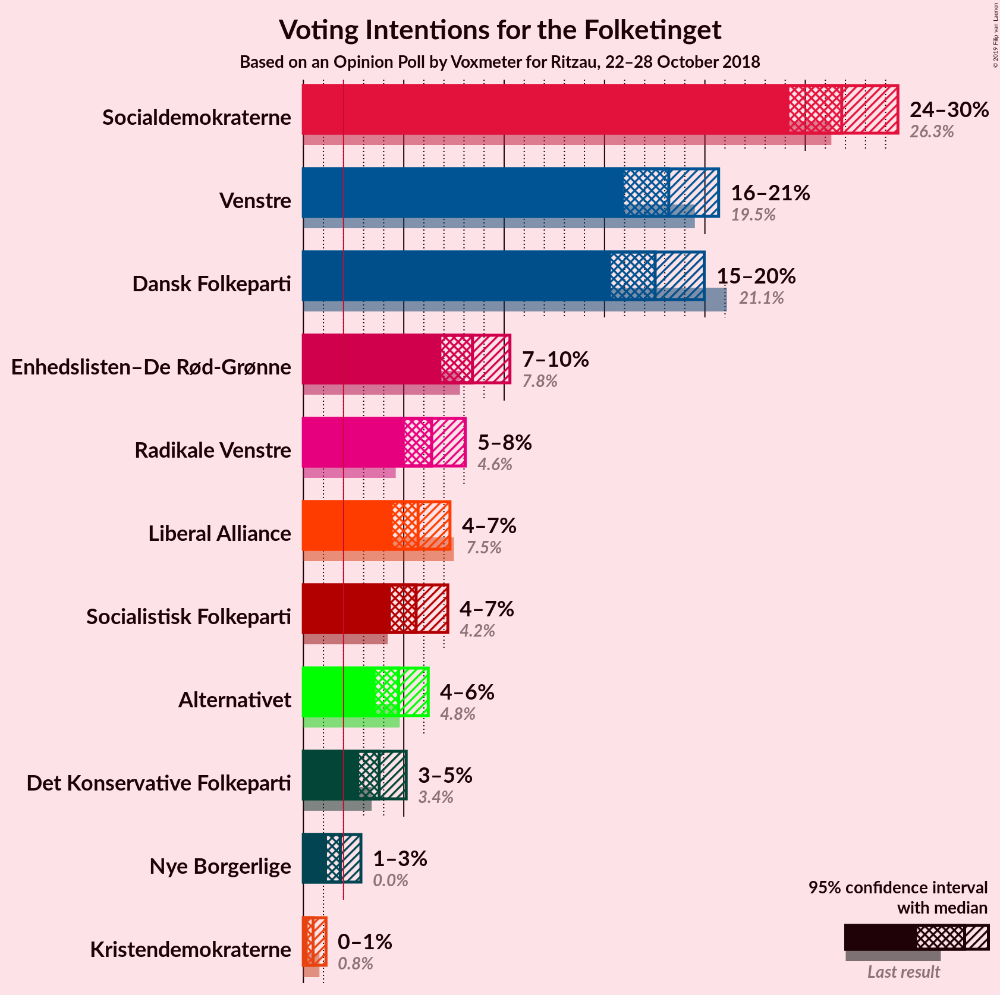

### Confidence Intervals

| Party | Last Result | Poll Result | 80% Confidence Interval | 90% Confidence Interval | 95% Confidence Interval | 99% Confidence Interval |
|:-----:|:-----------:|:-----------:|:-----------------------:|:-----------------------:|:-----------------------:|:-----------------------:|
| Socialdemokraterne | 26.3% | 26.8% | 25.1–28.6% |24.6–29.2% |24.2–29.6% |23.4–30.5% |
| Venstre | 19.5% | 18.2% | 16.7–19.8% |16.3–20.3% |16.0–20.7% |15.3–21.5% |
| Dansk Folkeparti | 21.1% | 17.5% | 16.1–19.1% |15.7–19.6% |15.3–20.0% |14.6–20.8% |
| Enhedslisten–De Rød-Grønne | 7.8% | 8.4% | 7.4–9.6% |7.1–10.0% |6.9–10.3% |6.4–10.9% |
| Radikale Venstre | 4.6% | 6.4% | 5.5–7.5% |5.3–7.8% |5.0–8.1% |4.7–8.6% |
| Liberal Alliance | 7.5% | 5.7% | 4.9–6.8% |4.6–7.0% |4.5–7.3% |4.1–7.8% |
| Socialistisk Folkeparti | 4.2% | 5.6% | 4.8–6.6% |4.6–6.9% |4.4–7.2% |4.0–7.7% |
| Alternativet | 4.8% | 4.7% | 4.0–5.7% |3.8–6.0% |3.6–6.2% |3.3–6.7% |
| Det Konservative Folkeparti | 3.4% | 3.8% | 3.1–4.7% |2.9–4.9% |2.8–5.1% |2.5–5.6% |
| Nye Borgerlige | 0.0% | 1.8% | 1.4–2.5% |1.3–2.7% |1.2–2.9% |1.0–3.2% |
| Kristendemokraterne | 0.8% | 0.5% | 0.3–0.9% |0.2–1.0% |0.2–1.1% |0.1–1.4% |

*Note:* The poll result column reflects the actual value used in the calculations. Published results may vary slightly, and in addition be rounded to fewer digits.

## Seats

### Confidence Intervals

| Party | Last Result | Median | 80% Confidence Interval | 90% Confidence Interval | 95% Confidence Interval | 99% Confidence Interval |
|:-----:|:-----------:|:------:|:-----------------------:|:-----------------------:|:-----------------------:|:-----------------------:|
| <a href="#socialdemokraterne">Socialdemokraterne</a> | 47 | 48 | 46–51 |45–51 |44–52 |42–54 |
| <a href="#venstre">Venstre</a> | 34 | 32 | 30–35 |30–35 |28–36 |27–38 |
| <a href="#dansk-folkeparti">Dansk Folkeparti</a> | 37 | 31 | 29–33 |28–34 |27–35 |26–37 |
| <a href="#enhedslisten–de-rød-grønne">Enhedslisten–De Rød-Grønne</a> | 14 | 14 | 13–16 |12–17 |12–18 |11–19 |
| <a href="#radikale-venstre">Radikale Venstre</a> | 8 | 12 | 10–13 |9–13 |9–14 |8–15 |
| <a href="#liberal-alliance">Liberal Alliance</a> | 13 | 10 | 8–12 |8–13 |8–13 |7–14 |
| <a href="#socialistisk-folkeparti">Socialistisk Folkeparti</a> | 7 | 9 | 9–12 |8–12 |8–13 |7–14 |
| <a href="#alternativet">Alternativet</a> | 9 | 9 | 8–10 |7–11 |7–11 |6–12 |
| <a href="#det-konservative-folkeparti">Det Konservative Folkeparti</a> | 6 | 8 | 5–9 |5–9 |4–9 |4–11 |
| <a href="#nye-borgerlige">Nye Borgerlige</a> | 0 | 0 | 0–5 |0–5 |0–5 |0–6 |
| <a href="#kristendemokraterne">Kristendemokraterne</a> | 0 | 0 | 0 |0 |0 |0 |

### Socialdemokraterne

*For a full overview of the results for this party, see the [Socialdemokraterne](party-socialdemokraterne.html) page.*

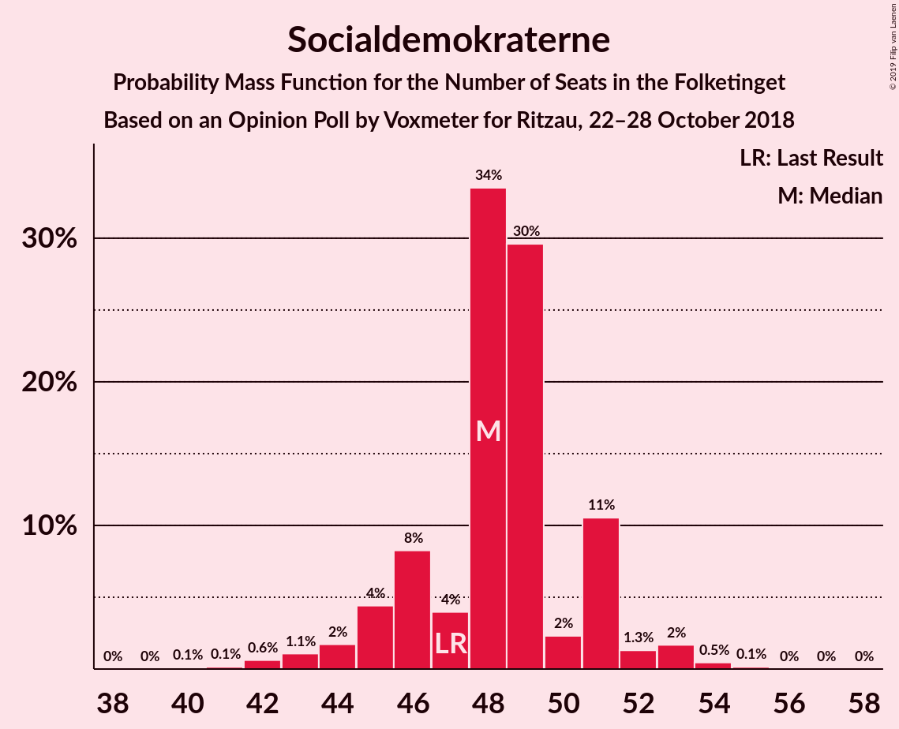

| Number of Seats | Probability | Accumulated | Special Marks |
|:---------------:|:-----------:|:-----------:|:-------------:|
| 40 | 0.1% | 100% |  |
| 41 | 0.1% | 99.8% |  |
| 42 | 0.6% | 99.7% |  |
| 43 | 1.1% | 99.1% |  |
| 44 | 2% | 98% |  |
| 45 | 4% | 96% |  |
| 46 | 8% | 92% |  |
| 47 | 4% | 84% | Last Result |
| 48 | 34% | 80% | Median |
| 49 | 30% | 46% |  |
| 50 | 2% | 16% |  |
| 51 | 11% | 14% |  |
| 52 | 1.3% | 4% |  |
| 53 | 2% | 2% |  |
| 54 | 0.5% | 0.7% |  |
| 55 | 0.1% | 0.2% |  |
| 56 | 0% | 0.1% |  |
| 57 | 0% | 0% |  |

### Venstre

*For a full overview of the results for this party, see the [Venstre](party-venstre.html) page.*

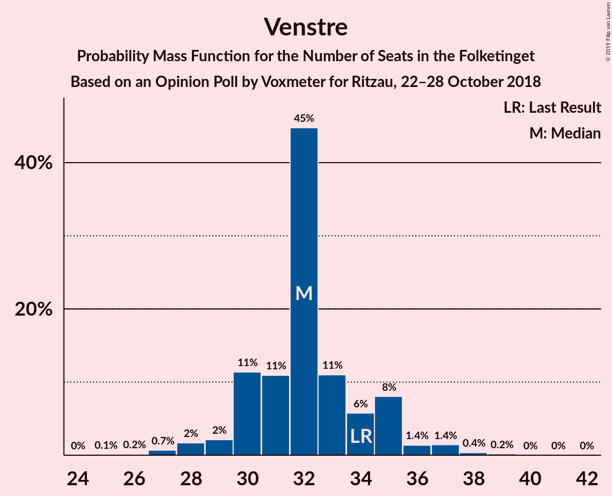

| Number of Seats | Probability | Accumulated | Special Marks |
|:---------------:|:-----------:|:-----------:|:-------------:|
| 25 | 0.1% | 100% |  |
| 26 | 0.2% | 99.9% |  |
| 27 | 0.7% | 99.8% |  |
| 28 | 2% | 99.1% |  |
| 29 | 2% | 97% |  |
| 30 | 11% | 95% |  |
| 31 | 11% | 84% |  |
| 32 | 45% | 73% | Median |
| 33 | 11% | 28% |  |
| 34 | 6% | 17% | Last Result |
| 35 | 8% | 11% |  |
| 36 | 1.4% | 3% |  |
| 37 | 1.4% | 2% |  |
| 38 | 0.4% | 0.6% |  |
| 39 | 0.2% | 0.2% |  |
| 40 | 0% | 0.1% |  |
| 41 | 0% | 0% |  |

### Dansk Folkeparti

*For a full overview of the results for this party, see the [Dansk Folkeparti](party-danskfolkeparti.html) page.*

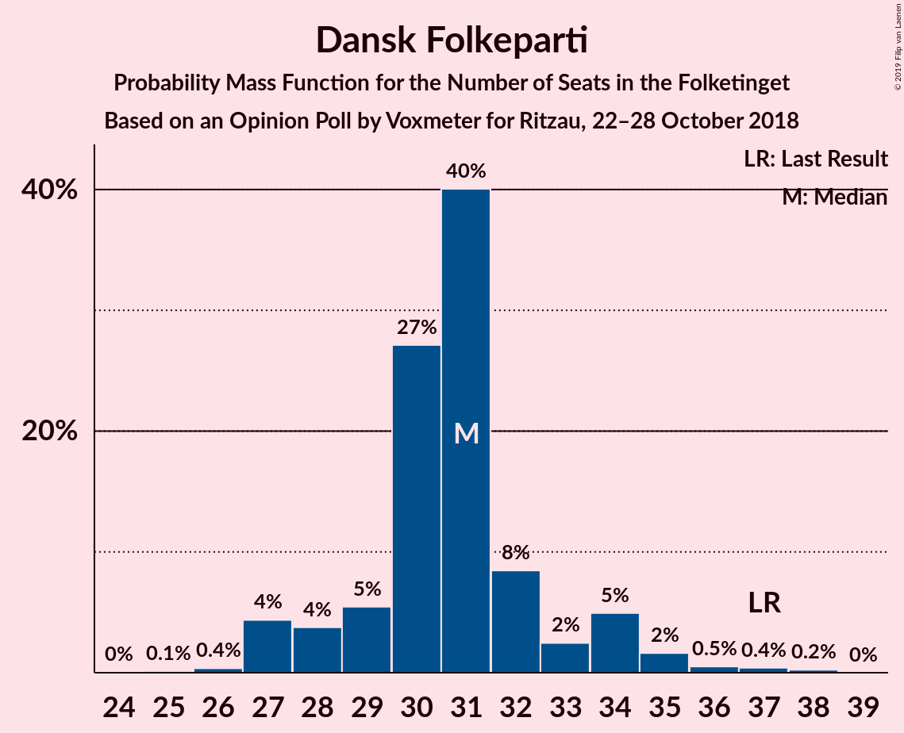

| Number of Seats | Probability | Accumulated | Special Marks |
|:---------------:|:-----------:|:-----------:|:-------------:|
| 25 | 0.1% | 100% |  |
| 26 | 0.4% | 99.8% |  |
| 27 | 4% | 99.5% |  |
| 28 | 4% | 95% |  |
| 29 | 5% | 91% |  |
| 30 | 27% | 86% |  |
| 31 | 40% | 59% | Median |
| 32 | 8% | 19% |  |
| 33 | 2% | 10% |  |
| 34 | 5% | 8% |  |
| 35 | 2% | 3% |  |
| 36 | 0.5% | 1.2% |  |
| 37 | 0.4% | 0.7% | Last Result |
| 38 | 0.2% | 0.3% |  |
| 39 | 0% | 0% |  |

### Enhedslisten–De Rød-Grønne

*For a full overview of the results for this party, see the [Enhedslisten–De Rød-Grønne](party-enhedslisten–derød-grønne.html) page.*

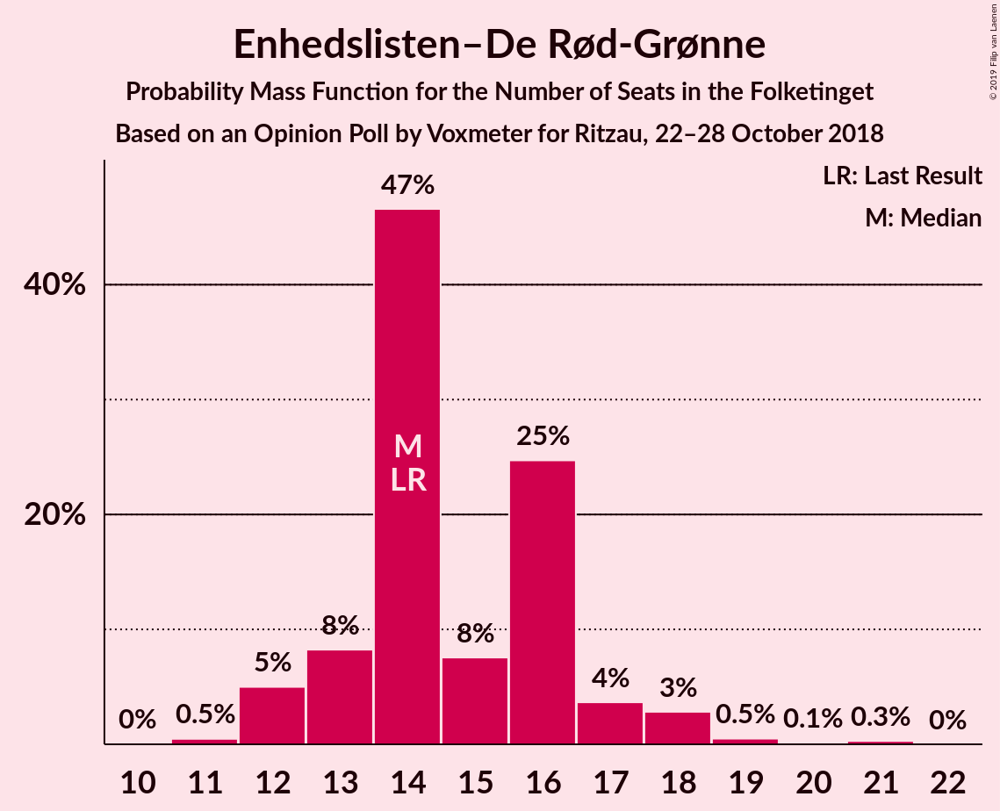

| Number of Seats | Probability | Accumulated | Special Marks |
|:---------------:|:-----------:|:-----------:|:-------------:|
| 11 | 0.5% | 100% |  |
| 12 | 5% | 99.5% |  |
| 13 | 8% | 94% |  |
| 14 | 47% | 86% | Last Result, Median |
| 15 | 8% | 40% |  |
| 16 | 25% | 32% |  |
| 17 | 4% | 7% |  |
| 18 | 3% | 4% |  |
| 19 | 0.5% | 0.9% |  |
| 20 | 0.1% | 0.4% |  |
| 21 | 0.3% | 0.3% |  |
| 22 | 0% | 0% |  |

### Radikale Venstre

*For a full overview of the results for this party, see the [Radikale Venstre](party-radikalevenstre.html) page.*

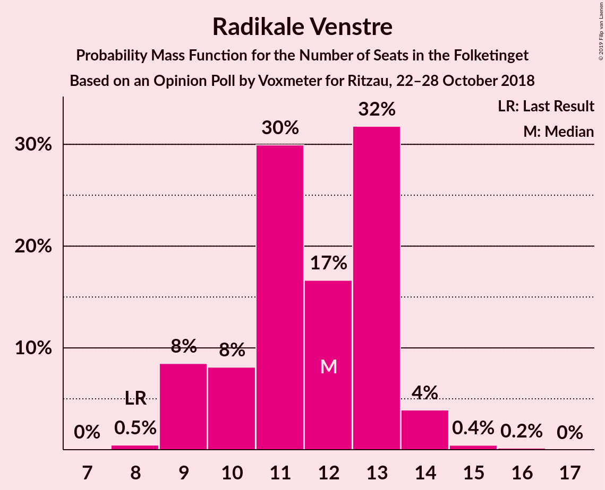

| Number of Seats | Probability | Accumulated | Special Marks |
|:---------------:|:-----------:|:-----------:|:-------------:|
| 8 | 0.5% | 100% | Last Result |
| 9 | 8% | 99.5% |  |
| 10 | 8% | 91% |  |
| 11 | 30% | 83% |  |
| 12 | 17% | 53% | Median |
| 13 | 32% | 36% |  |
| 14 | 4% | 5% |  |
| 15 | 0.4% | 0.6% |  |
| 16 | 0.2% | 0.2% |  |
| 17 | 0% | 0% |  |

### Liberal Alliance

*For a full overview of the results for this party, see the [Liberal Alliance](party-liberalalliance.html) page.*

| Number of Seats | Probability | Accumulated | Special Marks |
|:---------------:|:-----------:|:-----------:|:-------------:|
| 6 | 0.1% | 100% |  |
| 7 | 1.3% | 99.9% |  |
| 8 | 12% | 98.7% |  |
| 9 | 9% | 87% |  |
| 10 | 34% | 78% | Median |
| 11 | 31% | 44% |  |
| 12 | 6% | 13% |  |
| 13 | 6% | 7% | Last Result |
| 14 | 0.5% | 0.8% |  |
| 15 | 0.3% | 0.3% |  |
| 16 | 0% | 0% |  |

### Socialistisk Folkeparti

*For a full overview of the results for this party, see the [Socialistisk Folkeparti](party-socialistiskfolkeparti.html) page.*

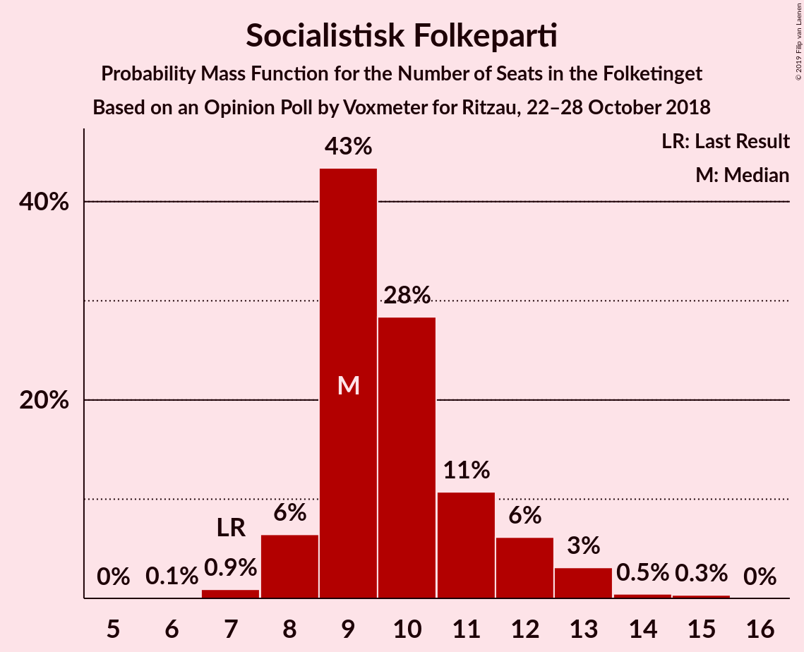

| Number of Seats | Probability | Accumulated | Special Marks |
|:---------------:|:-----------:|:-----------:|:-------------:|
| 6 | 0.1% | 100% |  |
| 7 | 0.9% | 99.9% | Last Result |
| 8 | 6% | 99.0% |  |
| 9 | 43% | 93% | Median |
| 10 | 28% | 49% |  |
| 11 | 11% | 21% |  |
| 12 | 6% | 10% |  |
| 13 | 3% | 4% |  |
| 14 | 0.5% | 0.8% |  |
| 15 | 0.3% | 0.4% |  |
| 16 | 0% | 0% |  |

### Alternativet

*For a full overview of the results for this party, see the [Alternativet](party-alternativet.html) page.*

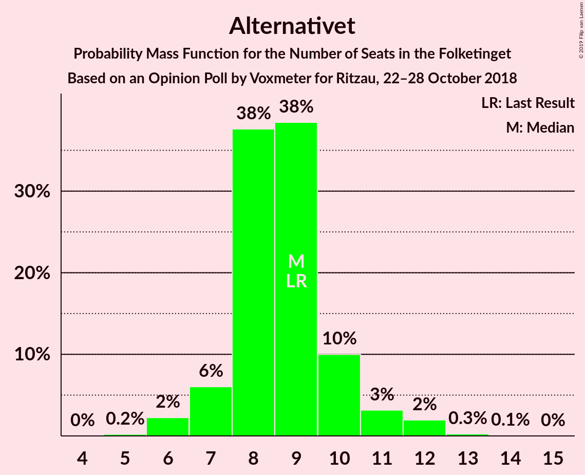

| Number of Seats | Probability | Accumulated | Special Marks |
|:---------------:|:-----------:|:-----------:|:-------------:|
| 5 | 0.2% | 100% |  |
| 6 | 2% | 99.8% |  |
| 7 | 6% | 98% |  |
| 8 | 38% | 92% |  |
| 9 | 38% | 54% | Last Result, Median |
| 10 | 10% | 15% |  |
| 11 | 3% | 5% |  |
| 12 | 2% | 2% |  |
| 13 | 0.3% | 0.3% |  |
| 14 | 0.1% | 0.1% |  |
| 15 | 0% | 0% |  |

### Det Konservative Folkeparti

*For a full overview of the results for this party, see the [Det Konservative Folkeparti](party-detkonservativefolkeparti.html) page.*

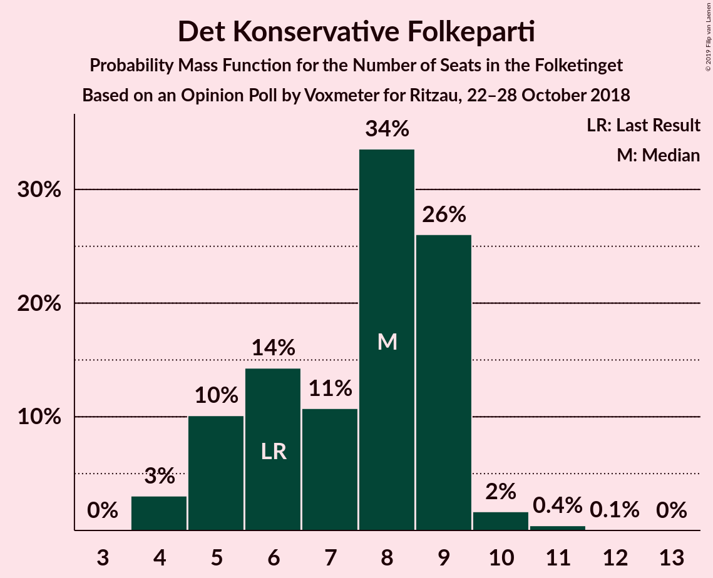

| Number of Seats | Probability | Accumulated | Special Marks |
|:---------------:|:-----------:|:-----------:|:-------------:|
| 4 | 3% | 100% |  |
| 5 | 10% | 97% |  |
| 6 | 14% | 87% | Last Result |
| 7 | 11% | 73% |  |
| 8 | 34% | 62% | Median |
| 9 | 26% | 28% |  |
| 10 | 2% | 2% |  |
| 11 | 0.4% | 0.5% |  |
| 12 | 0.1% | 0.1% |  |
| 13 | 0% | 0% |  |

### Nye Borgerlige

*For a full overview of the results for this party, see the [Nye Borgerlige](party-nyeborgerlige.html) page.*

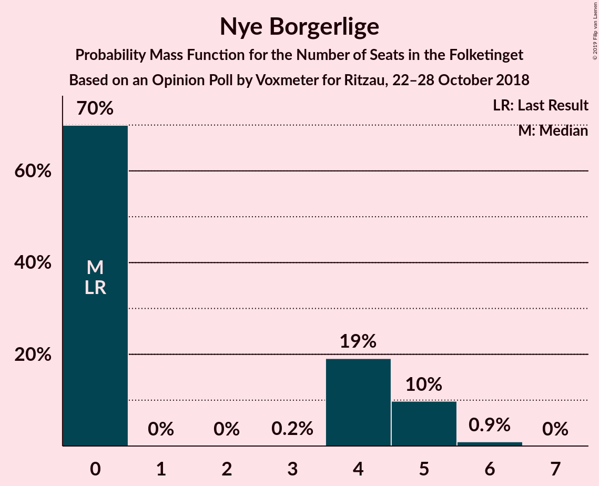

| Number of Seats | Probability | Accumulated | Special Marks |
|:---------------:|:-----------:|:-----------:|:-------------:|
| 0 | 70% | 100% | Last Result, Median |
| 1 | 0% | 30% |  |
| 2 | 0% | 30% |  |
| 3 | 0.2% | 30% |  |
| 4 | 19% | 30% |  |
| 5 | 10% | 11% |  |
| 6 | 0.9% | 1.0% |  |
| 7 | 0% | 0% |  |

### Kristendemokraterne

*For a full overview of the results for this party, see the [Kristendemokraterne](party-kristendemokraterne.html) page.*

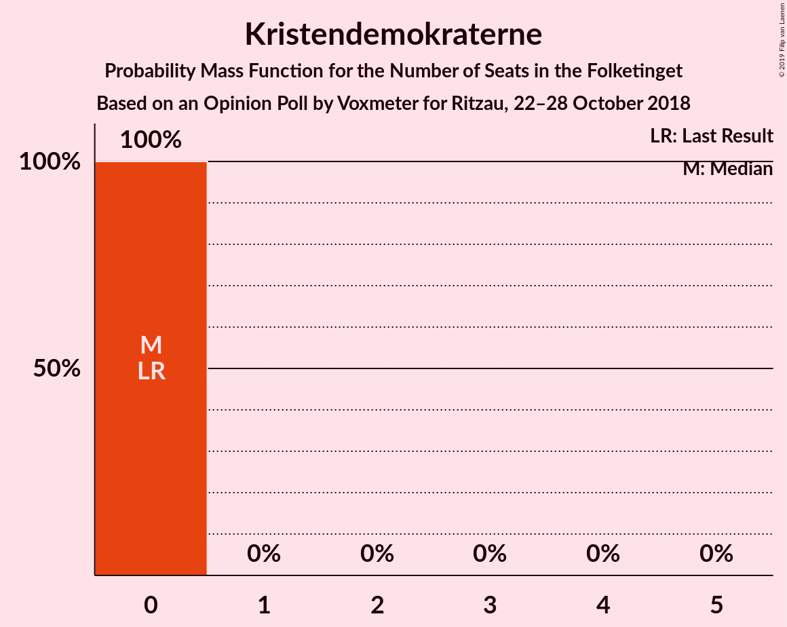

| Number of Seats | Probability | Accumulated | Special Marks |
|:---------------:|:-----------:|:-----------:|:-------------:|
| 0 | 100% | 100% | Last Result, Median |

## Coalitions

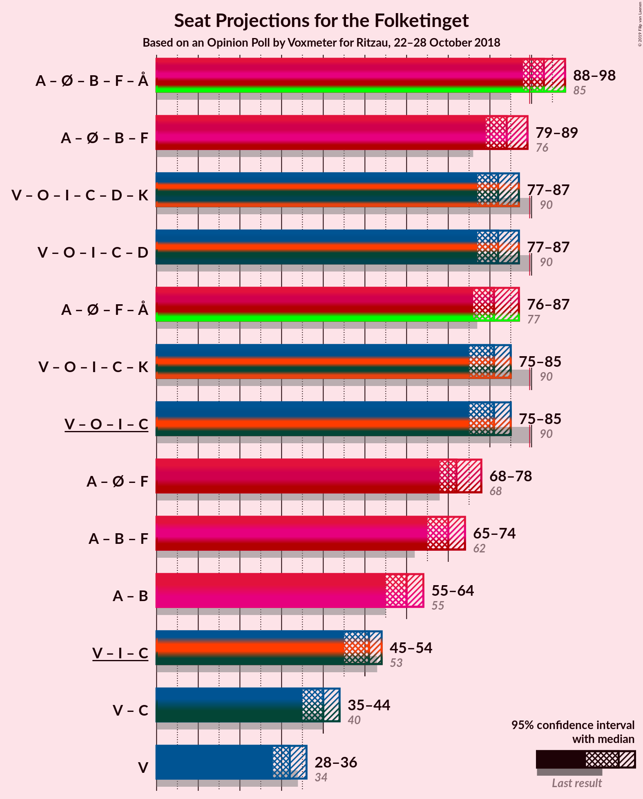

### Confidence Intervals

| Coalition | Last Result | Median | Majority? | 80% Confidence Interval | 90% Confidence Interval | 95% Confidence Interval | 99% Confidence Interval |
|:---------:|:-----------:|:------:|:---------:|:-----------------------:|:-----------------------:|:-----------------------:|:-----------------------:|
| Socialdemokraterne – Enhedslisten–De Rød-Grønne – Radikale Venstre – Socialistisk Folkeparti – Alternativet | 85 | 93 | 94% | 91–95 | 89–97 | 88–98 | 86–100 |
| Socialdemokraterne – Enhedslisten–De Rød-Grønne – Radikale Venstre – Socialistisk Folkeparti | 76 | 84 | 2% | 82–87 | 80–88 | 79–89 | 78–91 |
| Venstre – Dansk Folkeparti – Liberal Alliance – Det Konservative Folkeparti – Nye Borgerlige – Kristendemokraterne | 90 | 82 | 0.2% | 80–84 | 78–86 | 77–87 | 75–89 |
| Venstre – Dansk Folkeparti – Liberal Alliance – Det Konservative Folkeparti – Nye Borgerlige | 90 | 82 | 0.2% | 80–84 | 78–86 | 77–87 | 75–89 |
| Socialdemokraterne – Enhedslisten–De Rød-Grønne – Socialistisk Folkeparti – Alternativet | 77 | 81 | 0.2% | 79–84 | 78–86 | 76–87 | 75–89 |
| Venstre – Dansk Folkeparti – Liberal Alliance – Det Konservative Folkeparti – Kristendemokraterne | 90 | 81 | 0% | 77–83 | 76–84 | 75–85 | 73–88 |
| Venstre – Dansk Folkeparti – Liberal Alliance – Det Konservative Folkeparti | 90 | 81 | 0% | 77–83 | 76–84 | 75–85 | 73–88 |
| Socialdemokraterne – Enhedslisten–De Rød-Grønne – Socialistisk Folkeparti | 68 | 72 | 0% | 70–75 | 69–77 | 68–78 | 66–80 |
| Socialdemokraterne – Radikale Venstre – Socialistisk Folkeparti | 62 | 70 | 0% | 67–72 | 66–73 | 65–74 | 63–75 |
| Socialdemokraterne – Radikale Venstre | 55 | 60 | 0% | 57–62 | 56–63 | 55–64 | 53–65 |
| Venstre – Liberal Alliance – Det Konservative Folkeparti | 53 | 51 | 0% | 47–53 | 46–54 | 45–54 | 43–57 |
| Venstre – Det Konservative Folkeparti | 40 | 40 | 0% | 37–43 | 36–43 | 35–44 | 34–47 |
| Venstre | 34 | 32 | 0% | 30–35 | 30–35 | 28–36 | 27–38 |

### Socialdemokraterne – Enhedslisten–De Rød-Grønne – Radikale Venstre – Socialistisk Folkeparti – Alternativet

| Number of Seats | Probability | Accumulated | Special Marks |
|:---------------:|:-----------:|:-----------:|:-------------:|
| 83 | 0.1% | 100% |  |
| 84 | 0% | 99.9% |  |
| 85 | 0.1% | 99.9% | Last Result |
| 86 | 0.3% | 99.8% |  |
| 87 | 1.4% | 99.4% |  |
| 88 | 2% | 98% |  |
| 89 | 2% | 96% |  |
| 90 | 2% | 94% | Majority |
| 91 | 10% | 92% |  |
| 92 | 14% | 82% | Median |
| 93 | 27% | 68% |  |
| 94 | 27% | 41% |  |
| 95 | 4% | 14% |  |
| 96 | 3% | 9% |  |
| 97 | 3% | 6% |  |
| 98 | 1.3% | 4% |  |
| 99 | 0.6% | 2% |  |
| 100 | 1.2% | 2% |  |
| 101 | 0.2% | 0.3% |  |
| 102 | 0.2% | 0.2% |  |
| 103 | 0% | 0% |  |

### Socialdemokraterne – Enhedslisten–De Rød-Grønne – Radikale Venstre – Socialistisk Folkeparti

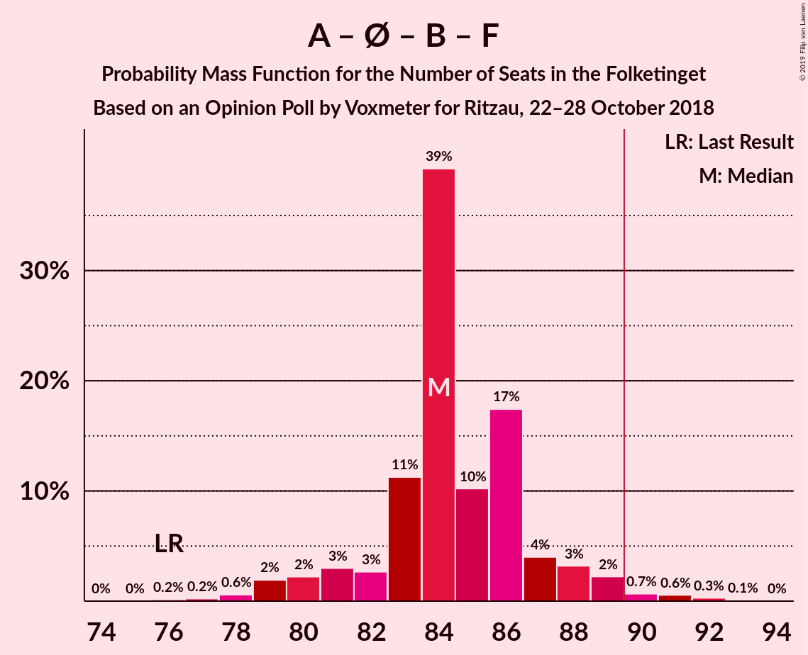

| Number of Seats | Probability | Accumulated | Special Marks |
|:---------------:|:-----------:|:-----------:|:-------------:|
| 75 | 0% | 100% |  |
| 76 | 0.2% | 99.9% | Last Result |
| 77 | 0.2% | 99.8% |  |
| 78 | 0.6% | 99.6% |  |
| 79 | 2% | 99.0% |  |
| 80 | 2% | 97% |  |
| 81 | 3% | 95% |  |
| 82 | 3% | 92% |  |
| 83 | 11% | 89% | Median |
| 84 | 39% | 78% |  |
| 85 | 10% | 39% |  |
| 86 | 17% | 28% |  |
| 87 | 4% | 11% |  |
| 88 | 3% | 7% |  |
| 89 | 2% | 4% |  |
| 90 | 0.7% | 2% | Majority |
| 91 | 0.6% | 0.9% |  |
| 92 | 0.3% | 0.4% |  |
| 93 | 0.1% | 0.1% |  |
| 94 | 0% | 0% |  |

### Venstre – Dansk Folkeparti – Liberal Alliance – Det Konservative Folkeparti – Nye Borgerlige – Kristendemokraterne

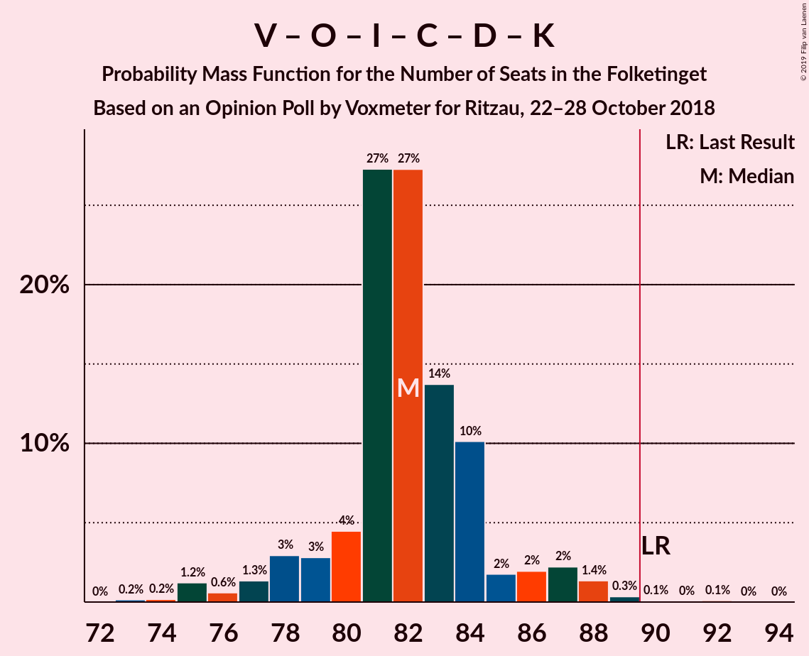

| Number of Seats | Probability | Accumulated | Special Marks |
|:---------------:|:-----------:|:-----------:|:-------------:|
| 73 | 0.2% | 100% |  |
| 74 | 0.2% | 99.8% |  |
| 75 | 1.2% | 99.7% |  |
| 76 | 0.6% | 98% |  |
| 77 | 1.3% | 98% |  |
| 78 | 3% | 96% |  |
| 79 | 3% | 94% |  |
| 80 | 4% | 91% |  |
| 81 | 27% | 86% | Median |
| 82 | 27% | 59% |  |
| 83 | 14% | 32% |  |
| 84 | 10% | 18% |  |
| 85 | 2% | 8% |  |
| 86 | 2% | 6% |  |
| 87 | 2% | 4% |  |
| 88 | 1.4% | 2% |  |
| 89 | 0.3% | 0.6% |  |
| 90 | 0.1% | 0.2% | Last Result, Majority |
| 91 | 0% | 0.1% |  |
| 92 | 0.1% | 0.1% |  |
| 93 | 0% | 0% |  |

### Venstre – Dansk Folkeparti – Liberal Alliance – Det Konservative Folkeparti – Nye Borgerlige

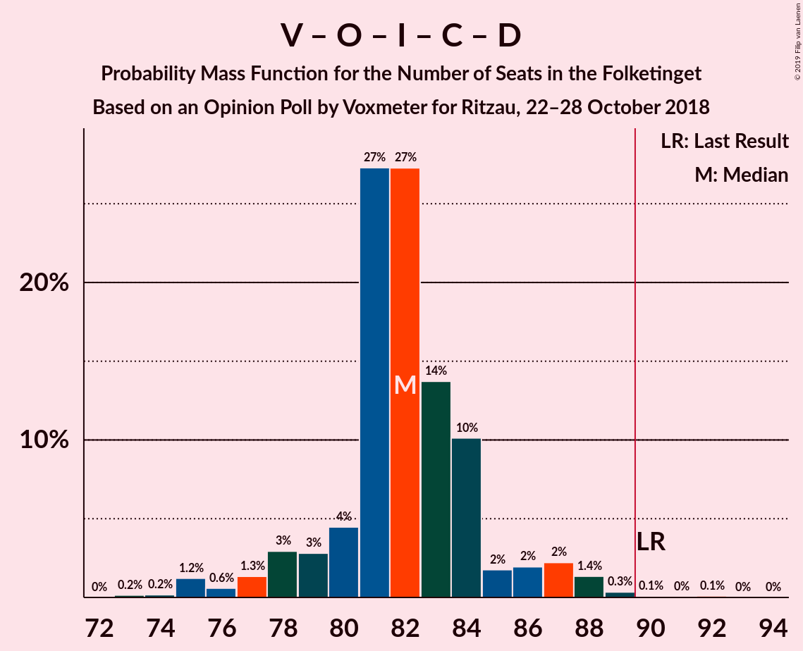

| Number of Seats | Probability | Accumulated | Special Marks |
|:---------------:|:-----------:|:-----------:|:-------------:|
| 73 | 0.2% | 100% |  |
| 74 | 0.2% | 99.8% |  |
| 75 | 1.2% | 99.6% |  |
| 76 | 0.6% | 98% |  |
| 77 | 1.3% | 98% |  |
| 78 | 3% | 96% |  |
| 79 | 3% | 94% |  |
| 80 | 4% | 91% |  |
| 81 | 27% | 86% | Median |
| 82 | 27% | 59% |  |
| 83 | 14% | 32% |  |
| 84 | 10% | 18% |  |
| 85 | 2% | 8% |  |
| 86 | 2% | 6% |  |
| 87 | 2% | 4% |  |
| 88 | 1.4% | 2% |  |
| 89 | 0.3% | 0.6% |  |
| 90 | 0.1% | 0.2% | Last Result, Majority |
| 91 | 0% | 0.1% |  |
| 92 | 0.1% | 0.1% |  |
| 93 | 0% | 0% |  |

### Socialdemokraterne – Enhedslisten–De Rød-Grønne – Socialistisk Folkeparti – Alternativet

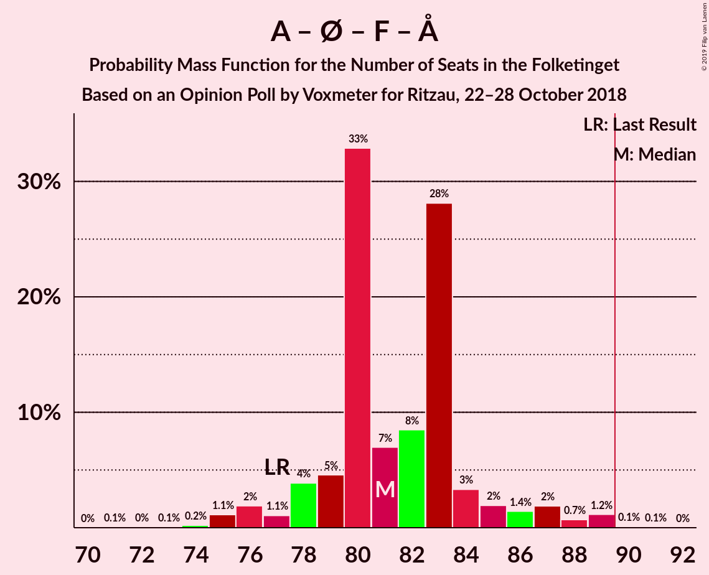

| Number of Seats | Probability | Accumulated | Special Marks |
|:---------------:|:-----------:|:-----------:|:-------------:|
| 71 | 0.1% | 100% |  |
| 72 | 0% | 99.9% |  |
| 73 | 0.1% | 99.9% |  |
| 74 | 0.2% | 99.8% |  |
| 75 | 1.1% | 99.6% |  |
| 76 | 2% | 98% |  |
| 77 | 1.1% | 97% | Last Result |
| 78 | 4% | 96% |  |
| 79 | 5% | 92% |  |
| 80 | 33% | 87% | Median |
| 81 | 7% | 54% |  |
| 82 | 8% | 47% |  |
| 83 | 28% | 39% |  |
| 84 | 3% | 11% |  |
| 85 | 2% | 7% |  |
| 86 | 1.4% | 5% |  |
| 87 | 2% | 4% |  |
| 88 | 0.7% | 2% |  |
| 89 | 1.2% | 1.3% |  |
| 90 | 0.1% | 0.2% | Majority |
| 91 | 0.1% | 0.1% |  |
| 92 | 0% | 0% |  |

### Venstre – Dansk Folkeparti – Liberal Alliance – Det Konservative Folkeparti – Kristendemokraterne

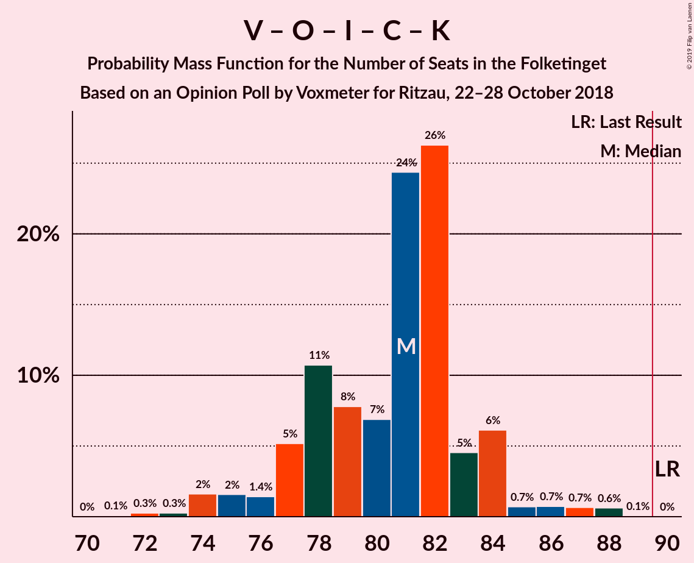

| Number of Seats | Probability | Accumulated | Special Marks |
|:---------------:|:-----------:|:-----------:|:-------------:|
| 71 | 0.1% | 100% |  |
| 72 | 0.3% | 99.9% |  |
| 73 | 0.3% | 99.6% |  |
| 74 | 2% | 99.4% |  |
| 75 | 2% | 98% |  |
| 76 | 1.4% | 96% |  |
| 77 | 5% | 95% |  |
| 78 | 11% | 90% |  |
| 79 | 8% | 79% |  |
| 80 | 7% | 71% |  |
| 81 | 24% | 64% | Median |
| 82 | 26% | 40% |  |
| 83 | 5% | 14% |  |
| 84 | 6% | 9% |  |
| 85 | 0.7% | 3% |  |
| 86 | 0.7% | 2% |  |
| 87 | 0.7% | 1.4% |  |
| 88 | 0.6% | 0.7% |  |
| 89 | 0.1% | 0.1% |  |
| 90 | 0% | 0% | Last Result, Majority |

### Venstre – Dansk Folkeparti – Liberal Alliance – Det Konservative Folkeparti

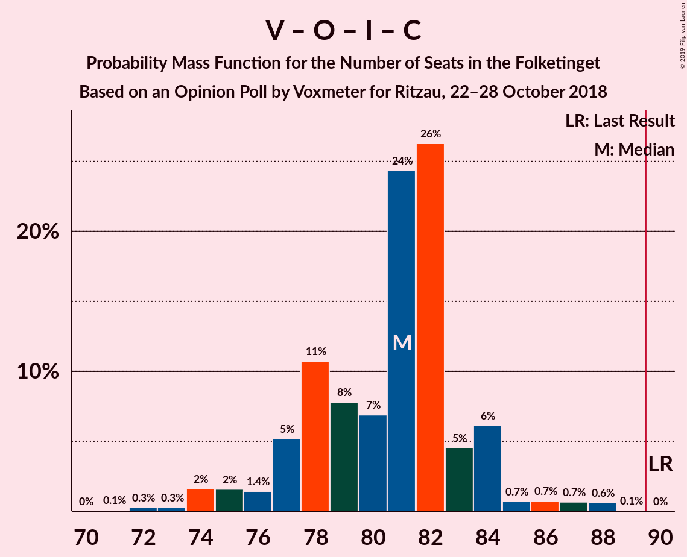

| Number of Seats | Probability | Accumulated | Special Marks |
|:---------------:|:-----------:|:-----------:|:-------------:|
| 71 | 0.1% | 100% |  |
| 72 | 0.3% | 99.9% |  |
| 73 | 0.3% | 99.6% |  |
| 74 | 2% | 99.4% |  |
| 75 | 2% | 98% |  |
| 76 | 1.4% | 96% |  |
| 77 | 5% | 95% |  |
| 78 | 11% | 90% |  |
| 79 | 8% | 79% |  |
| 80 | 7% | 71% |  |
| 81 | 24% | 64% | Median |
| 82 | 26% | 40% |  |
| 83 | 5% | 14% |  |
| 84 | 6% | 9% |  |
| 85 | 0.7% | 3% |  |
| 86 | 0.7% | 2% |  |
| 87 | 0.7% | 1.4% |  |
| 88 | 0.6% | 0.7% |  |
| 89 | 0.1% | 0.1% |  |
| 90 | 0% | 0% | Last Result, Majority |

### Socialdemokraterne – Enhedslisten–De Rød-Grønne – Socialistisk Folkeparti

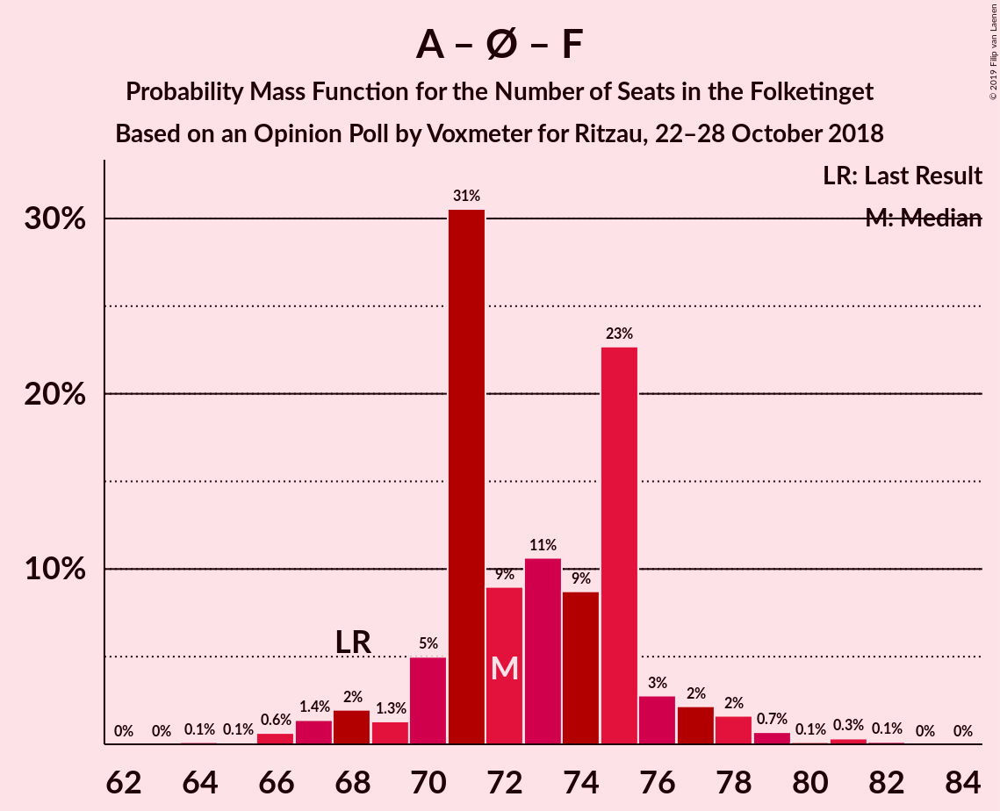

| Number of Seats | Probability | Accumulated | Special Marks |
|:---------------:|:-----------:|:-----------:|:-------------:|
| 64 | 0.1% | 100% |  |
| 65 | 0.1% | 99.9% |  |
| 66 | 0.6% | 99.8% |  |
| 67 | 1.4% | 99.1% |  |
| 68 | 2% | 98% | Last Result |
| 69 | 1.3% | 96% |  |
| 70 | 5% | 94% |  |
| 71 | 31% | 89% | Median |
| 72 | 9% | 59% |  |
| 73 | 11% | 50% |  |
| 74 | 9% | 39% |  |
| 75 | 23% | 31% |  |
| 76 | 3% | 8% |  |
| 77 | 2% | 5% |  |
| 78 | 2% | 3% |  |
| 79 | 0.7% | 1.3% |  |
| 80 | 0.1% | 0.6% |  |
| 81 | 0.3% | 0.5% |  |
| 82 | 0.1% | 0.1% |  |
| 83 | 0% | 0% |  |

### Socialdemokraterne – Radikale Venstre – Socialistisk Folkeparti

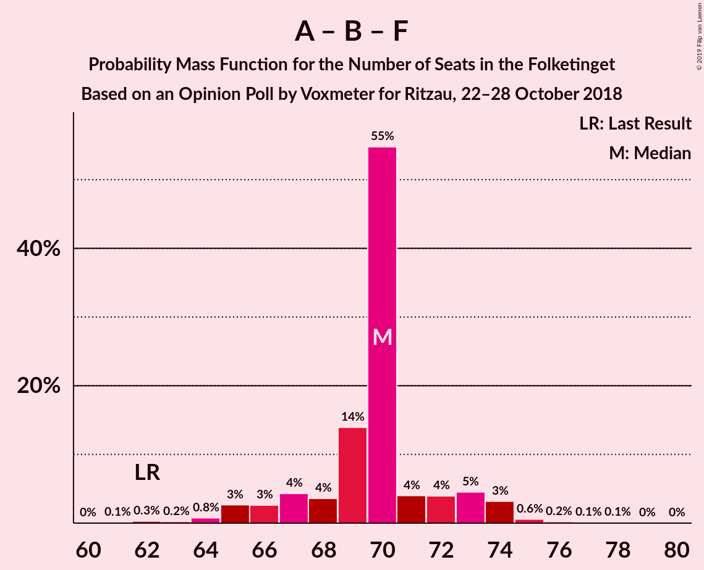

| Number of Seats | Probability | Accumulated | Special Marks |
|:---------------:|:-----------:|:-----------:|:-------------:|
| 60 | 0% | 100% |  |
| 61 | 0.1% | 99.9% |  |
| 62 | 0.3% | 99.9% | Last Result |
| 63 | 0.2% | 99.6% |  |
| 64 | 0.8% | 99.4% |  |
| 65 | 3% | 98.6% |  |
| 66 | 3% | 96% |  |
| 67 | 4% | 93% |  |
| 68 | 4% | 89% |  |
| 69 | 14% | 85% | Median |
| 70 | 55% | 71% |  |
| 71 | 4% | 17% |  |
| 72 | 4% | 13% |  |
| 73 | 5% | 9% |  |
| 74 | 3% | 4% |  |
| 75 | 0.6% | 1.0% |  |
| 76 | 0.2% | 0.4% |  |
| 77 | 0.1% | 0.2% |  |
| 78 | 0.1% | 0.1% |  |
| 79 | 0% | 0% |  |

### Socialdemokraterne – Radikale Venstre

| Number of Seats | Probability | Accumulated | Special Marks |
|:---------------:|:-----------:|:-----------:|:-------------:|
| 50 | 0.1% | 100% |  |
| 51 | 0% | 99.9% |  |
| 52 | 0.1% | 99.9% |  |
| 53 | 0.9% | 99.8% |  |
| 54 | 1.4% | 99.0% |  |
| 55 | 1.3% | 98% | Last Result |
| 56 | 3% | 96% |  |
| 57 | 4% | 94% |  |
| 58 | 7% | 89% |  |
| 59 | 8% | 82% |  |
| 60 | 30% | 74% | Median |
| 61 | 32% | 44% |  |
| 62 | 4% | 12% |  |
| 63 | 5% | 8% |  |
| 64 | 2% | 3% |  |
| 65 | 0.8% | 1.2% |  |
| 66 | 0.3% | 0.4% |  |
| 67 | 0.1% | 0.1% |  |
| 68 | 0% | 0.1% |  |
| 69 | 0% | 0% |  |

### Venstre – Liberal Alliance – Det Konservative Folkeparti

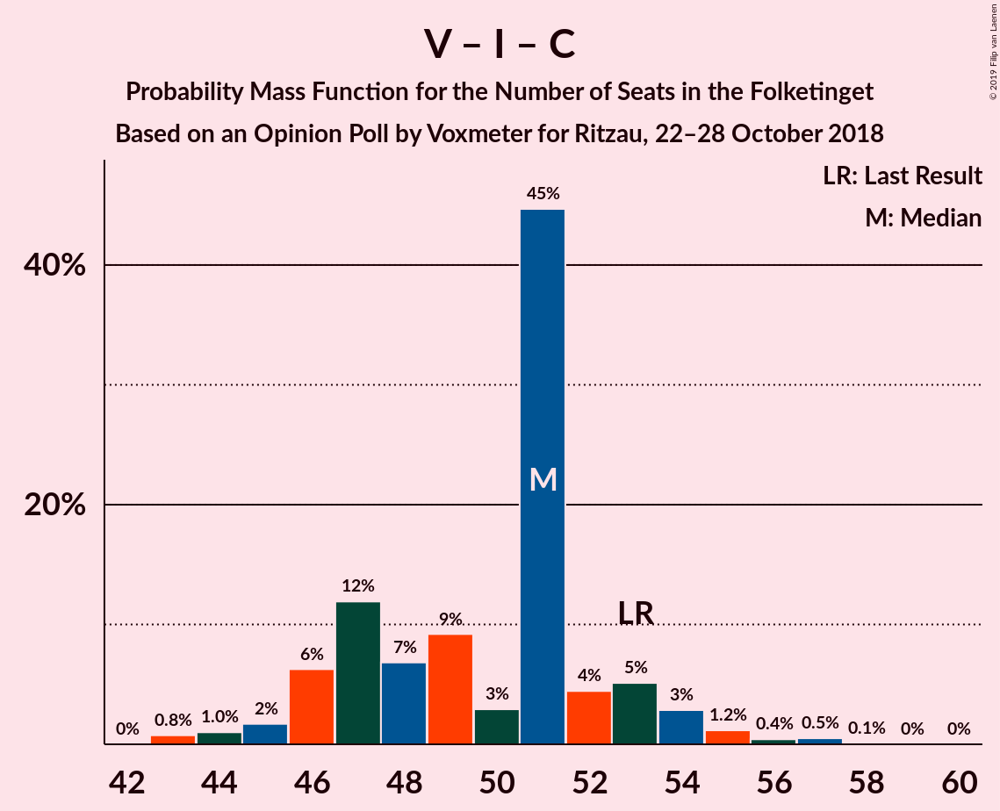

| Number of Seats | Probability | Accumulated | Special Marks |
|:---------------:|:-----------:|:-----------:|:-------------:|
| 42 | 0% | 100% |  |
| 43 | 0.8% | 99.9% |  |
| 44 | 1.0% | 99.2% |  |
| 45 | 2% | 98% |  |
| 46 | 6% | 96% |  |
| 47 | 12% | 90% |  |
| 48 | 7% | 78% |  |
| 49 | 9% | 71% |  |
| 50 | 3% | 62% | Median |
| 51 | 45% | 59% |  |
| 52 | 4% | 15% |  |
| 53 | 5% | 10% | Last Result |
| 54 | 3% | 5% |  |
| 55 | 1.2% | 2% |  |
| 56 | 0.4% | 1.0% |  |
| 57 | 0.5% | 0.6% |  |
| 58 | 0.1% | 0.1% |  |
| 59 | 0% | 0% |  |

### Venstre – Det Konservative Folkeparti

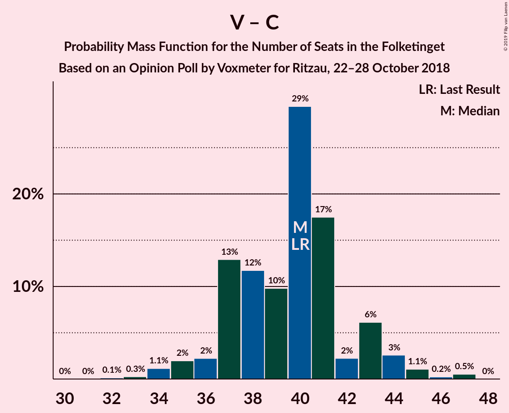

| Number of Seats | Probability | Accumulated | Special Marks |
|:---------------:|:-----------:|:-----------:|:-------------:|
| 32 | 0.1% | 100% |  |
| 33 | 0.3% | 99.9% |  |
| 34 | 1.1% | 99.6% |  |
| 35 | 2% | 98% |  |
| 36 | 2% | 96% |  |
| 37 | 13% | 94% |  |
| 38 | 12% | 81% |  |
| 39 | 10% | 70% |  |
| 40 | 29% | 60% | Last Result, Median |
| 41 | 17% | 30% |  |
| 42 | 2% | 13% |  |
| 43 | 6% | 11% |  |
| 44 | 3% | 4% |  |
| 45 | 1.1% | 2% |  |
| 46 | 0.2% | 0.8% |  |
| 47 | 0.5% | 0.5% |  |
| 48 | 0% | 0% |  |

### Venstre

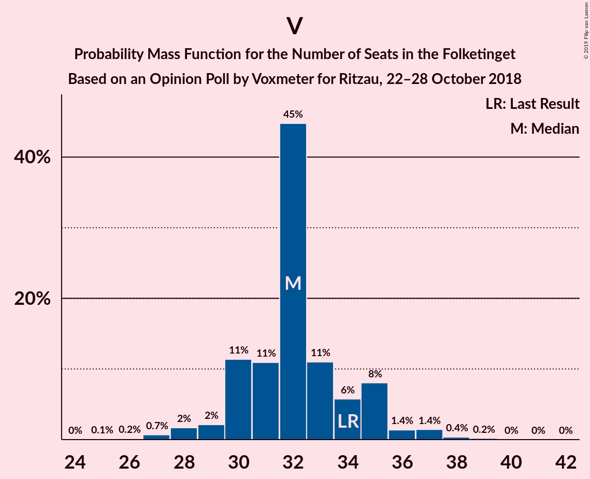

| Number of Seats | Probability | Accumulated | Special Marks |
|:---------------:|:-----------:|:-----------:|:-------------:|
| 25 | 0.1% | 100% |  |
| 26 | 0.2% | 99.9% |  |
| 27 | 0.7% | 99.8% |  |
| 28 | 2% | 99.1% |  |
| 29 | 2% | 97% |  |
| 30 | 11% | 95% |  |
| 31 | 11% | 84% |  |
| 32 | 45% | 73% | Median |
| 33 | 11% | 28% |  |
| 34 | 6% | 17% | Last Result |
| 35 | 8% | 11% |  |
| 36 | 1.4% | 3% |  |
| 37 | 1.4% | 2% |  |
| 38 | 0.4% | 0.6% |  |
| 39 | 0.2% | 0.2% |  |
| 40 | 0% | 0.1% |  |
| 41 | 0% | 0% |  |

## Technical Information

### Opinion Poll

+ **Polling firm:** Voxmeter
+ **Commissioner(s):** Ritzau
+ **Fieldwork period:** 22–28 October 2018

### Calculations

+ **Sample size:** 1033
+ **Simulations done:** 1,048,576
+ **Error estimate:** 2.12%

