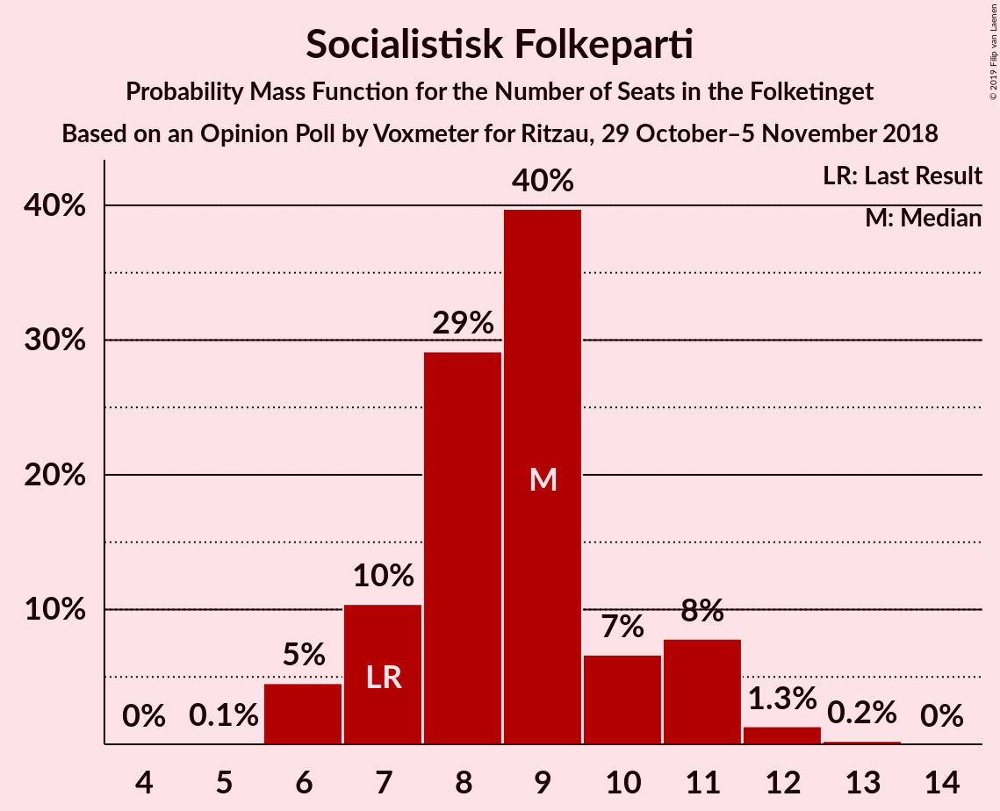
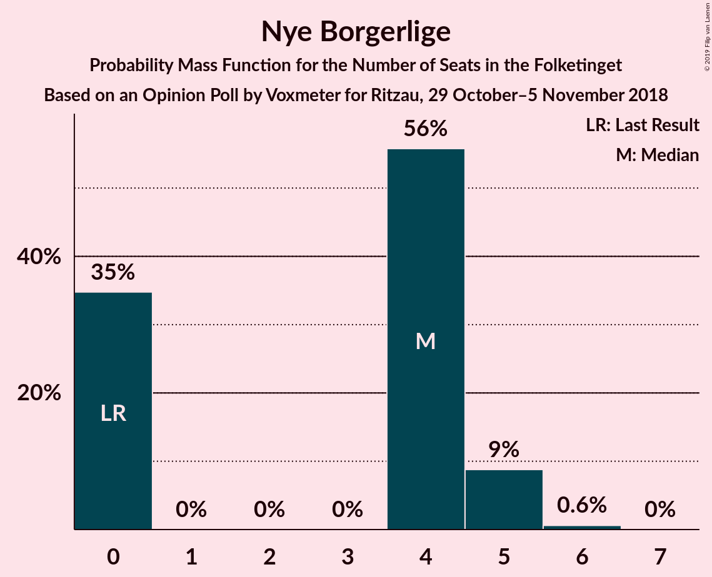

# Opinion Poll by Voxmeter for Ritzau, 29 October–5 November 2018

<a href="#voting-intentions">Voting Intentions</a> | <a href="#seats">Seats</a> | <a href="#coalitions">Coalitions</a> | <a href="#technical-information">Technical Information</a>

## Voting Intentions

### Confidence Intervals

| Party | Last Result | Poll Result | 80% Confidence Interval | 90% Confidence Interval | 95% Confidence Interval | 99% Confidence Interval |
|:-----:|:-----------:|:-----------:|:-----------------------:|:-----------------------:|:-----------------------:|:-----------------------:|
| Socialdemokraterne | 26.3% | 27.8% | 26.0–29.6% |25.6–30.2% |25.1–30.6% |24.3–31.5% |
| Venstre | 19.5% | 18.8% | 17.3–20.4% |16.8–20.9% |16.5–21.3% |15.8–22.1% |
| Dansk Folkeparti | 21.1% | 18.1% | 16.6–19.7% |16.2–20.1% |15.8–20.6% |15.2–21.4% |
| Enhedslisten–De Rød-Grønne | 7.8% | 8.9% | 7.9–10.2% |7.6–10.5% |7.3–10.9% |6.9–11.5% |
| Radikale Venstre | 4.6% | 6.0% | 5.2–7.1% |4.9–7.4% |4.7–7.7% |4.3–8.2% |
| Socialistisk Folkeparti | 4.2% | 4.9% | 4.1–5.8% |3.9–6.1% |3.7–6.4% |3.4–6.9% |
| Liberal Alliance | 7.5% | 4.8% | 4.0–5.7% |3.8–6.0% |3.6–6.2% |3.3–6.7% |
| Alternativet | 4.8% | 4.2% | 3.5–5.1% |3.3–5.4% |3.1–5.6% |2.8–6.1% |
| Det Konservative Folkeparti | 3.4% | 3.9% | 3.2–4.8% |3.0–5.0% |2.9–5.3% |2.6–5.7% |
| Nye Borgerlige | 0.0% | 1.8% | 1.4–2.5% |1.3–2.7% |1.2–2.9% |1.0–3.2% |
| Kristendemokraterne | 0.8% | 0.5% | 0.3–0.9% |0.2–1.0% |0.2–1.1% |0.1–1.4% |

*Note:* The poll result column reflects the actual value used in the calculations. Published results may vary slightly, and in addition be rounded to fewer digits.

## Seats

### Confidence Intervals

| Party | Last Result | Median | 80% Confidence Interval | 90% Confidence Interval | 95% Confidence Interval | 99% Confidence Interval |
|:-----:|:-----------:|:------:|:-----------------------:|:-----------------------:|:-----------------------:|:-----------------------:|
| <a href="#socialdemokraterne">Socialdemokraterne</a> | 47 | 49 | 47–53 |46–54 |45–56 |43–56 |
| <a href="#venstre">Venstre</a> | 34 | 33 | 30–37 |30–37 |29–39 |28–40 |
| <a href="#dansk-folkeparti">Dansk Folkeparti</a> | 37 | 32 | 27–35 |27–36 |27–38 |26–39 |
| <a href="#enhedslisten–de-rød-grønne">Enhedslisten–De Rød-Grønne</a> | 14 | 16 | 14–19 |14–19 |13–19 |12–20 |
| <a href="#radikale-venstre">Radikale Venstre</a> | 8 | 10 | 9–12 |8–12 |8–13 |8–15 |
| <a href="#socialistisk-folkeparti">Socialistisk Folkeparti</a> | 7 | 9 | 7–10 |7–11 |6–11 |6–12 |
| <a href="#liberal-alliance">Liberal Alliance</a> | 13 | 9 | 7–10 |6–11 |6–11 |6–12 |
| <a href="#alternativet">Alternativet</a> | 9 | 7 | 5–9 |5–9 |5–10 |5–11 |
| <a href="#det-konservative-folkeparti">Det Konservative Folkeparti</a> | 6 | 7 | 6–8 |6–9 |5–9 |5–10 |
| <a href="#nye-borgerlige">Nye Borgerlige</a> | 0 | 4 | 0–4 |0–5 |0–5 |0–6 |
| <a href="#kristendemokraterne">Kristendemokraterne</a> | 0 | 0 | 0 |0 |0 |0 |

### Socialdemokraterne

*For a full overview of the results for this party, see the [Socialdemokraterne](party-socialdemokraterne.html) page.*

| Number of Seats | Probability | Accumulated | Special Marks |
|:---------------:|:-----------:|:-----------:|:-------------:|
| 41 | 0.1% | 100% |  |
| 42 | 0.1% | 99.9% |  |
| 43 | 0.7% | 99.8% |  |
| 44 | 0.8% | 99.1% |  |
| 45 | 2% | 98% |  |
| 46 | 5% | 97% |  |
| 47 | 4% | 92% | Last Result |
| 48 | 23% | 88% |  |
| 49 | 21% | 65% | Median |
| 50 | 17% | 44% |  |
| 51 | 12% | 27% |  |
| 52 | 4% | 15% |  |
| 53 | 2% | 11% |  |
| 54 | 5% | 10% |  |
| 55 | 2% | 4% |  |
| 56 | 2% | 3% |  |
| 57 | 0.1% | 0.2% |  |
| 58 | 0% | 0.1% |  |
| 59 | 0% | 0% |  |

### Venstre

*For a full overview of the results for this party, see the [Venstre](party-venstre.html) page.*

| Number of Seats | Probability | Accumulated | Special Marks |
|:---------------:|:-----------:|:-----------:|:-------------:|
| 27 | 0.3% | 100% |  |
| 28 | 0.4% | 99.7% |  |
| 29 | 3% | 99.3% |  |
| 30 | 11% | 97% |  |
| 31 | 10% | 86% |  |
| 32 | 9% | 76% |  |
| 33 | 25% | 66% | Median |
| 34 | 18% | 41% | Last Result |
| 35 | 4% | 23% |  |
| 36 | 2% | 18% |  |
| 37 | 13% | 16% |  |
| 38 | 1.0% | 4% |  |
| 39 | 2% | 3% |  |
| 40 | 0.6% | 0.7% |  |
| 41 | 0.1% | 0.1% |  |
| 42 | 0% | 0% |  |

### Dansk Folkeparti

*For a full overview of the results for this party, see the [Dansk Folkeparti](party-danskfolkeparti.html) page.*

| Number of Seats | Probability | Accumulated | Special Marks |
|:---------------:|:-----------:|:-----------:|:-------------:|
| 26 | 0.7% | 100% |  |
| 27 | 13% | 99.3% |  |
| 28 | 3% | 86% |  |
| 29 | 7% | 83% |  |
| 30 | 16% | 76% |  |
| 31 | 6% | 60% |  |
| 32 | 7% | 54% | Median |
| 33 | 25% | 47% |  |
| 34 | 9% | 23% |  |
| 35 | 5% | 14% |  |
| 36 | 5% | 9% |  |
| 37 | 0.9% | 4% | Last Result |
| 38 | 0.2% | 3% |  |
| 39 | 2% | 2% |  |
| 40 | 0% | 0.1% |  |
| 41 | 0% | 0% |  |

### Enhedslisten–De Rød-Grønne

*For a full overview of the results for this party, see the [Enhedslisten–De Rød-Grønne](party-enhedslisten–derød-grønne.html) page.*

| Number of Seats | Probability | Accumulated | Special Marks |
|:---------------:|:-----------:|:-----------:|:-------------:|
| 12 | 0.8% | 100% |  |
| 13 | 3% | 99.2% |  |
| 14 | 10% | 97% | Last Result |
| 15 | 18% | 86% |  |
| 16 | 25% | 69% | Median |
| 17 | 29% | 44% |  |
| 18 | 3% | 14% |  |
| 19 | 9% | 11% |  |
| 20 | 2% | 2% |  |
| 21 | 0.2% | 0.3% |  |
| 22 | 0.1% | 0.1% |  |
| 23 | 0% | 0% |  |

### Radikale Venstre

*For a full overview of the results for this party, see the [Radikale Venstre](party-radikalevenstre.html) page.*

| Number of Seats | Probability | Accumulated | Special Marks |
|:---------------:|:-----------:|:-----------:|:-------------:|
| 7 | 0.1% | 100% |  |
| 8 | 6% | 99.9% | Last Result |
| 9 | 4% | 94% |  |
| 10 | 51% | 90% | Median |
| 11 | 16% | 39% |  |
| 12 | 18% | 23% |  |
| 13 | 3% | 5% |  |
| 14 | 1.2% | 2% |  |
| 15 | 0.5% | 0.5% |  |
| 16 | 0% | 0.1% |  |
| 17 | 0% | 0% |  |

### Socialistisk Folkeparti

*For a full overview of the results for this party, see the [Socialistisk Folkeparti](party-socialistiskfolkeparti.html) page.*

| Number of Seats | Probability | Accumulated | Special Marks |
|:---------------:|:-----------:|:-----------:|:-------------:|
| 5 | 0.1% | 100% |  |
| 6 | 5% | 99.9% |  |
| 7 | 10% | 95% | Last Result |
| 8 | 29% | 85% |  |
| 9 | 40% | 56% | Median |
| 10 | 7% | 16% |  |
| 11 | 8% | 9% |  |
| 12 | 1.3% | 2% |  |
| 13 | 0.2% | 0.3% |  |
| 14 | 0% | 0% |  |

### Liberal Alliance

*For a full overview of the results for this party, see the [Liberal Alliance](party-liberalalliance.html) page.*

| Number of Seats | Probability | Accumulated | Special Marks |
|:---------------:|:-----------:|:-----------:|:-------------:|
| 5 | 0.1% | 100% |  |
| 6 | 6% | 99.9% |  |
| 7 | 17% | 94% |  |
| 8 | 20% | 78% |  |
| 9 | 39% | 58% | Median |
| 10 | 13% | 19% |  |
| 11 | 5% | 6% |  |
| 12 | 0.8% | 1.0% |  |
| 13 | 0.2% | 0.2% | Last Result |
| 14 | 0% | 0% |  |

### Alternativet

*For a full overview of the results for this party, see the [Alternativet](party-alternativet.html) page.*

| Number of Seats | Probability | Accumulated | Special Marks |
|:---------------:|:-----------:|:-----------:|:-------------:|
| 5 | 18% | 100% |  |
| 6 | 19% | 82% |  |
| 7 | 18% | 63% | Median |
| 8 | 34% | 45% |  |
| 9 | 8% | 11% | Last Result |
| 10 | 3% | 3% |  |
| 11 | 0.7% | 0.7% |  |
| 12 | 0% | 0% |  |

### Det Konservative Folkeparti

*For a full overview of the results for this party, see the [Det Konservative Folkeparti](party-detkonservativefolkeparti.html) page.*

| Number of Seats | Probability | Accumulated | Special Marks |
|:---------------:|:-----------:|:-----------:|:-------------:|
| 4 | 0.4% | 100% |  |
| 5 | 4% | 99.6% |  |
| 6 | 41% | 96% | Last Result |
| 7 | 28% | 55% | Median |
| 8 | 19% | 26% |  |
| 9 | 6% | 7% |  |
| 10 | 0.9% | 1.2% |  |
| 11 | 0.3% | 0.3% |  |
| 12 | 0% | 0% |  |

### Nye Borgerlige

*For a full overview of the results for this party, see the [Nye Borgerlige](party-nyeborgerlige.html) page.*

| Number of Seats | Probability | Accumulated | Special Marks |
|:---------------:|:-----------:|:-----------:|:-------------:|
| 0 | 35% | 100% | Last Result |
| 1 | 0% | 65% |  |
| 2 | 0% | 65% |  |
| 3 | 0% | 65% |  |
| 4 | 56% | 65% | Median |
| 5 | 9% | 9% |  |
| 6 | 0.6% | 0.6% |  |
| 7 | 0% | 0% |  |

### Kristendemokraterne

*For a full overview of the results for this party, see the [Kristendemokraterne](party-kristendemokraterne.html) page.*

| Number of Seats | Probability | Accumulated | Special Marks |
|:---------------:|:-----------:|:-----------:|:-------------:|
| 0 | 100% | 100% | Last Result, Median |

## Coalitions

### Confidence Intervals

| Coalition | Last Result | Median | Majority? | 80% Confidence Interval | 90% Confidence Interval | 95% Confidence Interval | 99% Confidence Interval |
|:---------:|:-----------:|:------:|:---------:|:-----------------------:|:-----------------------:|:-----------------------:|:-----------------------:|
| Socialdemokraterne – Enhedslisten–De Rød-Grønne – Radikale Venstre – Socialistisk Folkeparti – Alternativet | 85 | 92 | 65% | 89–96 | 88–97 | 88–98 | 85–101 |
| Socialdemokraterne – Enhedslisten–De Rød-Grønne – Radikale Venstre – Socialistisk Folkeparti | 76 | 84 | 5% | 81–88 | 80–89 | 80–90 | 77–93 |
| Venstre – Dansk Folkeparti – Liberal Alliance – Det Konservative Folkeparti – Nye Borgerlige – Kristendemokraterne | 90 | 83 | 0.7% | 79–86 | 78–87 | 77–87 | 74–90 |
| Venstre – Dansk Folkeparti – Liberal Alliance – Det Konservative Folkeparti – Nye Borgerlige | 90 | 83 | 0.7% | 79–86 | 78–87 | 77–87 | 74–90 |
| Venstre – Dansk Folkeparti – Liberal Alliance – Det Konservative Folkeparti – Kristendemokraterne | 90 | 82 | 0.1% | 75–84 | 75–86 | 75–87 | 74–87 |
| Venstre – Dansk Folkeparti – Liberal Alliance – Det Konservative Folkeparti | 90 | 82 | 0.1% | 75–84 | 75–86 | 75–87 | 74–87 |
| Socialdemokraterne – Enhedslisten–De Rød-Grønne – Socialistisk Folkeparti – Alternativet | 77 | 81 | 0.2% | 79–86 | 77–86 | 77–86 | 74–89 |
| Socialdemokraterne – Enhedslisten–De Rød-Grønne – Socialistisk Folkeparti | 68 | 74 | 0% | 71–78 | 69–78 | 69–79 | 66–82 |
| Socialdemokraterne – Radikale Venstre – Socialistisk Folkeparti | 62 | 68 | 0% | 66–73 | 65–73 | 64–75 | 61–76 |
| Socialdemokraterne – Radikale Venstre | 55 | 60 | 0% | 57–64 | 57–64 | 55–67 | 54–68 |
| Venstre – Liberal Alliance – Det Konservative Folkeparti | 53 | 49 | 0% | 45–52 | 45–53 | 44–54 | 43–55 |
| Venstre – Det Konservative Folkeparti | 40 | 40 | 0% | 36–43 | 36–45 | 36–45 | 35–46 |
| Venstre | 34 | 33 | 0% | 30–37 | 30–37 | 29–39 | 28–40 |

### Socialdemokraterne – Enhedslisten–De Rød-Grønne – Radikale Venstre – Socialistisk Folkeparti – Alternativet

| Number of Seats | Probability | Accumulated | Special Marks |
|:---------------:|:-----------:|:-----------:|:-------------:|
| 82 | 0% | 100% |  |
| 83 | 0% | 99.9% |  |
| 84 | 0.1% | 99.9% |  |
| 85 | 0.5% | 99.8% | Last Result |
| 86 | 0.5% | 99.3% |  |
| 87 | 1.1% | 98.8% |  |
| 88 | 5% | 98% |  |
| 89 | 28% | 93% |  |
| 90 | 3% | 65% | Majority |
| 91 | 9% | 62% | Median |
| 92 | 11% | 52% |  |
| 93 | 10% | 41% |  |
| 94 | 4% | 31% |  |
| 95 | 10% | 27% |  |
| 96 | 11% | 17% |  |
| 97 | 2% | 6% |  |
| 98 | 3% | 5% |  |
| 99 | 0.7% | 1.5% |  |
| 100 | 0.2% | 0.8% |  |
| 101 | 0.4% | 0.5% |  |
| 102 | 0% | 0.1% |  |
| 103 | 0.1% | 0.1% |  |
| 104 | 0% | 0% |  |

### Socialdemokraterne – Enhedslisten–De Rød-Grønne – Radikale Venstre – Socialistisk Folkeparti

| Number of Seats | Probability | Accumulated | Special Marks |
|:---------------:|:-----------:|:-----------:|:-------------:|
| 75 | 0% | 100% |  |
| 76 | 0.1% | 99.9% | Last Result |
| 77 | 0.4% | 99.8% |  |
| 78 | 0.3% | 99.4% |  |
| 79 | 1.3% | 99.1% |  |
| 80 | 5% | 98% |  |
| 81 | 3% | 92% |  |
| 82 | 3% | 90% |  |
| 83 | 16% | 87% |  |
| 84 | 22% | 71% | Median |
| 85 | 11% | 48% |  |
| 86 | 8% | 38% |  |
| 87 | 4% | 30% |  |
| 88 | 19% | 26% |  |
| 89 | 2% | 7% |  |
| 90 | 3% | 5% | Majority |
| 91 | 0.9% | 2% |  |
| 92 | 0.2% | 0.9% |  |
| 93 | 0.2% | 0.7% |  |
| 94 | 0.5% | 0.5% |  |
| 95 | 0% | 0% |  |

### Venstre – Dansk Folkeparti – Liberal Alliance – Det Konservative Folkeparti – Nye Borgerlige – Kristendemokraterne

| Number of Seats | Probability | Accumulated | Special Marks |
|:---------------:|:-----------:|:-----------:|:-------------:|
| 72 | 0.1% | 100% |  |
| 73 | 0% | 99.9% |  |
| 74 | 0.4% | 99.9% |  |
| 75 | 0.2% | 99.5% |  |
| 76 | 0.7% | 99.2% |  |
| 77 | 3% | 98.5% |  |
| 78 | 2% | 95% |  |
| 79 | 11% | 93% |  |
| 80 | 10% | 83% |  |
| 81 | 4% | 73% |  |
| 82 | 10% | 69% |  |
| 83 | 11% | 59% |  |
| 84 | 9% | 48% |  |
| 85 | 3% | 38% | Median |
| 86 | 28% | 35% |  |
| 87 | 5% | 7% |  |
| 88 | 1.1% | 2% |  |
| 89 | 0.5% | 1.2% |  |
| 90 | 0.5% | 0.7% | Last Result, Majority |
| 91 | 0.1% | 0.2% |  |
| 92 | 0% | 0.1% |  |
| 93 | 0% | 0.1% |  |
| 94 | 0% | 0% |  |

### Venstre – Dansk Folkeparti – Liberal Alliance – Det Konservative Folkeparti – Nye Borgerlige

| Number of Seats | Probability | Accumulated | Special Marks |
|:---------------:|:-----------:|:-----------:|:-------------:|
| 72 | 0.1% | 100% |  |
| 73 | 0% | 99.9% |  |
| 74 | 0.4% | 99.9% |  |
| 75 | 0.2% | 99.5% |  |
| 76 | 0.7% | 99.2% |  |
| 77 | 3% | 98.5% |  |
| 78 | 2% | 95% |  |
| 79 | 11% | 93% |  |
| 80 | 10% | 83% |  |
| 81 | 4% | 73% |  |
| 82 | 10% | 69% |  |
| 83 | 11% | 59% |  |
| 84 | 9% | 48% |  |
| 85 | 3% | 38% | Median |
| 86 | 28% | 35% |  |
| 87 | 5% | 7% |  |
| 88 | 1.1% | 2% |  |
| 89 | 0.5% | 1.2% |  |
| 90 | 0.5% | 0.7% | Last Result, Majority |
| 91 | 0.1% | 0.2% |  |
| 92 | 0% | 0.1% |  |
| 93 | 0% | 0.1% |  |
| 94 | 0% | 0% |  |

### Venstre – Dansk Folkeparti – Liberal Alliance – Det Konservative Folkeparti – Kristendemokraterne

| Number of Seats | Probability | Accumulated | Special Marks |
|:---------------:|:-----------:|:-----------:|:-------------:|
| 72 | 0.1% | 100% |  |
| 73 | 0.2% | 99.9% |  |
| 74 | 0.8% | 99.6% |  |
| 75 | 9% | 98.8% |  |
| 76 | 9% | 90% |  |
| 77 | 6% | 81% |  |
| 78 | 10% | 75% |  |
| 79 | 5% | 65% |  |
| 80 | 5% | 60% |  |
| 81 | 5% | 55% | Median |
| 82 | 31% | 50% |  |
| 83 | 4% | 20% |  |
| 84 | 6% | 15% |  |
| 85 | 0.9% | 9% |  |
| 86 | 4% | 8% |  |
| 87 | 4% | 4% |  |
| 88 | 0.1% | 0.5% |  |
| 89 | 0.2% | 0.3% |  |
| 90 | 0.1% | 0.1% | Last Result, Majority |
| 91 | 0% | 0.1% |  |
| 92 | 0% | 0% |  |

### Venstre – Dansk Folkeparti – Liberal Alliance – Det Konservative Folkeparti

| Number of Seats | Probability | Accumulated | Special Marks |
|:---------------:|:-----------:|:-----------:|:-------------:|
| 72 | 0.1% | 100% |  |
| 73 | 0.2% | 99.9% |  |
| 74 | 0.8% | 99.6% |  |
| 75 | 9% | 98.8% |  |
| 76 | 9% | 90% |  |
| 77 | 6% | 81% |  |
| 78 | 10% | 75% |  |
| 79 | 5% | 65% |  |
| 80 | 5% | 60% |  |
| 81 | 5% | 55% | Median |
| 82 | 31% | 50% |  |
| 83 | 4% | 20% |  |
| 84 | 6% | 15% |  |
| 85 | 0.9% | 9% |  |
| 86 | 4% | 8% |  |
| 87 | 4% | 4% |  |
| 88 | 0.1% | 0.5% |  |
| 89 | 0.2% | 0.3% |  |
| 90 | 0.1% | 0.1% | Last Result, Majority |
| 91 | 0% | 0.1% |  |
| 92 | 0% | 0% |  |

### Socialdemokraterne – Enhedslisten–De Rød-Grønne – Socialistisk Folkeparti – Alternativet

| Number of Seats | Probability | Accumulated | Special Marks |
|:---------------:|:-----------:|:-----------:|:-------------:|
| 72 | 0.1% | 100% |  |
| 73 | 0.1% | 99.9% |  |
| 74 | 0.5% | 99.8% |  |
| 75 | 0.4% | 99.3% |  |
| 76 | 0.6% | 98.9% |  |
| 77 | 5% | 98% | Last Result |
| 78 | 3% | 94% |  |
| 79 | 29% | 90% |  |
| 80 | 7% | 61% |  |
| 81 | 7% | 54% | Median |
| 82 | 12% | 47% |  |
| 83 | 6% | 35% |  |
| 84 | 6% | 29% |  |
| 85 | 12% | 23% |  |
| 86 | 10% | 12% |  |
| 87 | 0.3% | 2% |  |
| 88 | 0.1% | 1.3% |  |
| 89 | 1.0% | 1.2% |  |
| 90 | 0.1% | 0.2% | Majority |
| 91 | 0.1% | 0.2% |  |
| 92 | 0% | 0% |  |

### Socialdemokraterne – Enhedslisten–De Rød-Grønne – Socialistisk Folkeparti

| Number of Seats | Probability | Accumulated | Special Marks |
|:---------------:|:-----------:|:-----------:|:-------------:|
| 65 | 0.1% | 100% |  |
| 66 | 0.6% | 99.9% |  |
| 67 | 0.2% | 99.3% |  |
| 68 | 0.4% | 99.1% | Last Result |
| 69 | 5% | 98.7% |  |
| 70 | 3% | 94% |  |
| 71 | 3% | 92% |  |
| 72 | 6% | 89% |  |
| 73 | 18% | 83% |  |
| 74 | 23% | 64% | Median |
| 75 | 10% | 41% |  |
| 76 | 8% | 31% |  |
| 77 | 4% | 24% |  |
| 78 | 17% | 19% |  |
| 79 | 1.3% | 3% |  |
| 80 | 0.3% | 1.5% |  |
| 81 | 0.6% | 1.2% |  |
| 82 | 0.5% | 0.6% |  |
| 83 | 0% | 0.1% |  |
| 84 | 0% | 0.1% |  |
| 85 | 0% | 0% |  |

### Socialdemokraterne – Radikale Venstre – Socialistisk Folkeparti

| Number of Seats | Probability | Accumulated | Special Marks |
|:---------------:|:-----------:|:-----------:|:-------------:|
| 60 | 0.1% | 100% |  |
| 61 | 0.5% | 99.9% |  |
| 62 | 0.3% | 99.4% | Last Result |
| 63 | 0.8% | 99.1% |  |
| 64 | 0.8% | 98% |  |
| 65 | 6% | 97% |  |
| 66 | 4% | 92% |  |
| 67 | 32% | 88% |  |
| 68 | 9% | 56% | Median |
| 69 | 12% | 47% |  |
| 70 | 13% | 35% |  |
| 71 | 7% | 22% |  |
| 72 | 5% | 15% |  |
| 73 | 6% | 11% |  |
| 74 | 1.1% | 4% |  |
| 75 | 3% | 3% |  |
| 76 | 0.4% | 0.7% |  |
| 77 | 0.1% | 0.3% |  |
| 78 | 0.1% | 0.1% |  |
| 79 | 0.1% | 0.1% |  |
| 80 | 0% | 0% |  |

### Socialdemokraterne – Radikale Venstre

| Number of Seats | Probability | Accumulated | Special Marks |
|:---------------:|:-----------:|:-----------:|:-------------:|
| 52 | 0.1% | 100% |  |
| 53 | 0.2% | 99.9% |  |
| 54 | 2% | 99.7% |  |
| 55 | 0.9% | 98% | Last Result |
| 56 | 2% | 97% |  |
| 57 | 6% | 96% |  |
| 58 | 21% | 90% |  |
| 59 | 19% | 69% | Median |
| 60 | 13% | 50% |  |
| 61 | 9% | 37% |  |
| 62 | 8% | 28% |  |
| 63 | 10% | 20% |  |
| 64 | 6% | 10% |  |
| 65 | 0.5% | 4% |  |
| 66 | 0.5% | 3% |  |
| 67 | 0.6% | 3% |  |
| 68 | 2% | 2% |  |
| 69 | 0.1% | 0.1% |  |
| 70 | 0% | 0% |  |

### Venstre – Liberal Alliance – Det Konservative Folkeparti

| Number of Seats | Probability | Accumulated | Special Marks |
|:---------------:|:-----------:|:-----------:|:-------------:|
| 41 | 0.1% | 100% |  |
| 42 | 0.2% | 99.9% |  |
| 43 | 1.1% | 99.8% |  |
| 44 | 3% | 98.7% |  |
| 45 | 8% | 96% |  |
| 46 | 9% | 88% |  |
| 47 | 3% | 79% |  |
| 48 | 22% | 76% |  |
| 49 | 26% | 54% | Median |
| 50 | 6% | 27% |  |
| 51 | 2% | 22% |  |
| 52 | 13% | 19% |  |
| 53 | 2% | 6% | Last Result |
| 54 | 4% | 4% |  |
| 55 | 0.3% | 0.6% |  |
| 56 | 0.1% | 0.3% |  |
| 57 | 0.2% | 0.2% |  |
| 58 | 0% | 0% |  |

### Venstre – Det Konservative Folkeparti

| Number of Seats | Probability | Accumulated | Special Marks |
|:---------------:|:-----------:|:-----------:|:-------------:|
| 33 | 0.1% | 100% |  |
| 34 | 0.2% | 99.9% |  |
| 35 | 0.9% | 99.7% |  |
| 36 | 10% | 98.8% |  |
| 37 | 5% | 89% |  |
| 38 | 8% | 84% |  |
| 39 | 8% | 76% |  |
| 40 | 32% | 68% | Last Result, Median |
| 41 | 7% | 37% |  |
| 42 | 9% | 30% |  |
| 43 | 14% | 20% |  |
| 44 | 1.2% | 6% |  |
| 45 | 3% | 5% |  |
| 46 | 1.2% | 2% |  |
| 47 | 0.3% | 0.4% |  |
| 48 | 0.1% | 0.1% |  |
| 49 | 0% | 0% |  |

### Venstre

| Number of Seats | Probability | Accumulated | Special Marks |
|:---------------:|:-----------:|:-----------:|:-------------:|
| 27 | 0.3% | 100% |  |
| 28 | 0.4% | 99.7% |  |
| 29 | 3% | 99.3% |  |
| 30 | 11% | 97% |  |
| 31 | 10% | 86% |  |
| 32 | 9% | 76% |  |
| 33 | 25% | 66% | Median |
| 34 | 18% | 41% | Last Result |
| 35 | 4% | 23% |  |
| 36 | 2% | 18% |  |
| 37 | 13% | 16% |  |
| 38 | 1.0% | 4% |  |
| 39 | 2% | 3% |  |
| 40 | 0.6% | 0.7% |  |
| 41 | 0.1% | 0.1% |  |
| 42 | 0% | 0% |  |

## Technical Information

### Opinion Poll

+ **Polling firm:** Voxmeter
+ **Commissioner(s):** Ritzau
+ **Fieldwork period:** 29 October–5 November 2018

### Calculations

+ **Sample size:** 1029
+ **Simulations done:** 1,048,576
+ **Error estimate:** 3.08%

