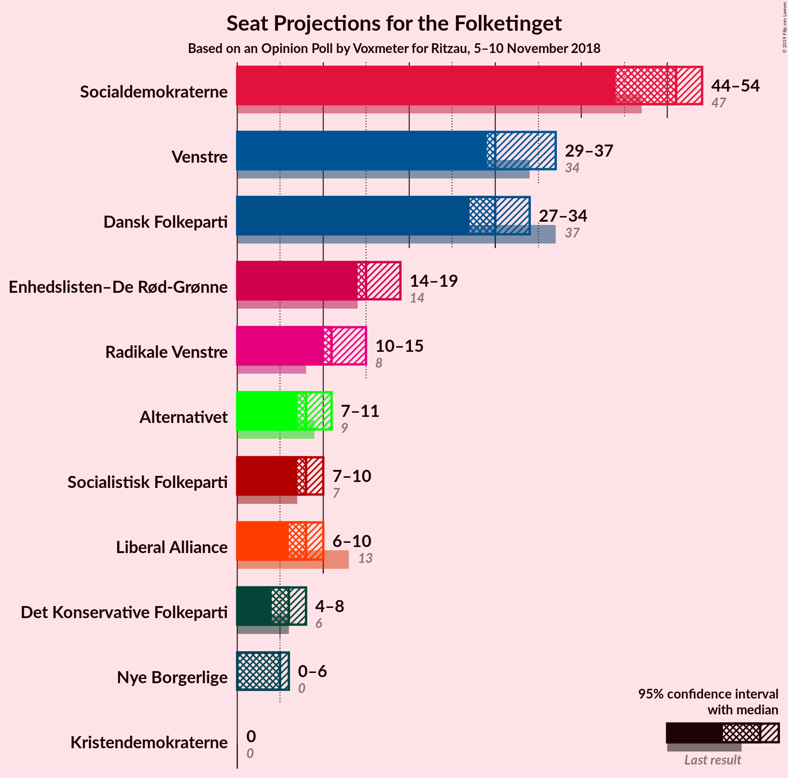
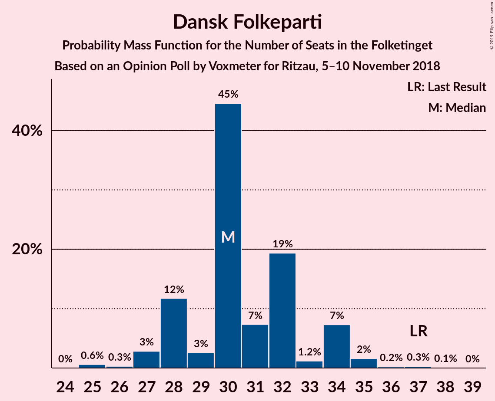
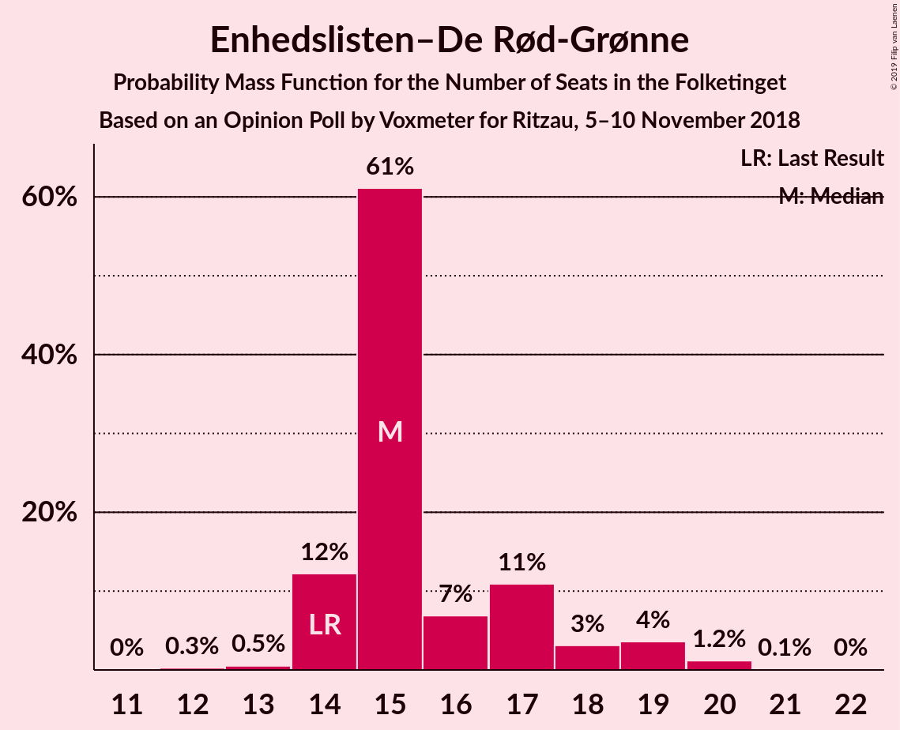
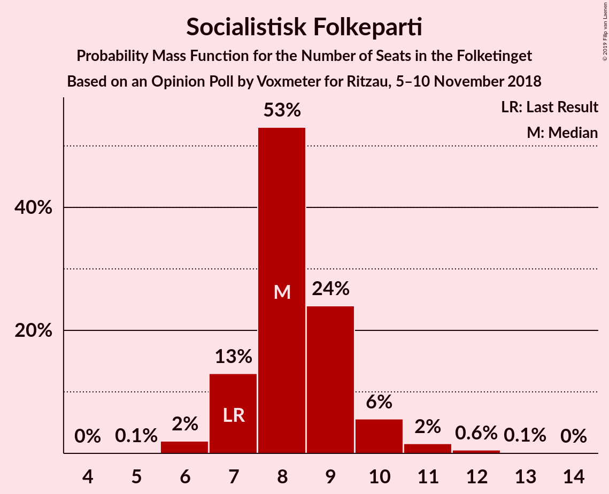
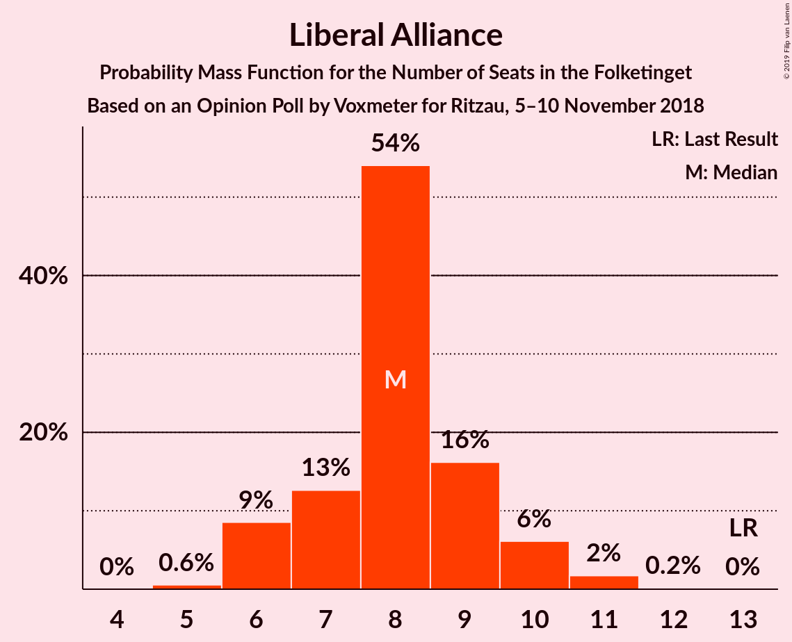
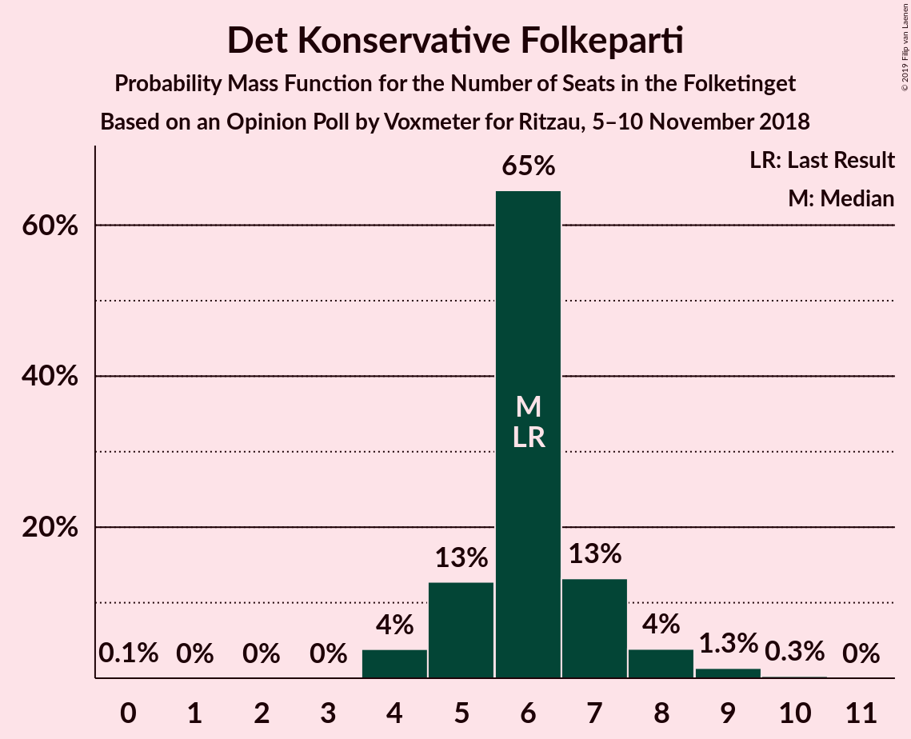
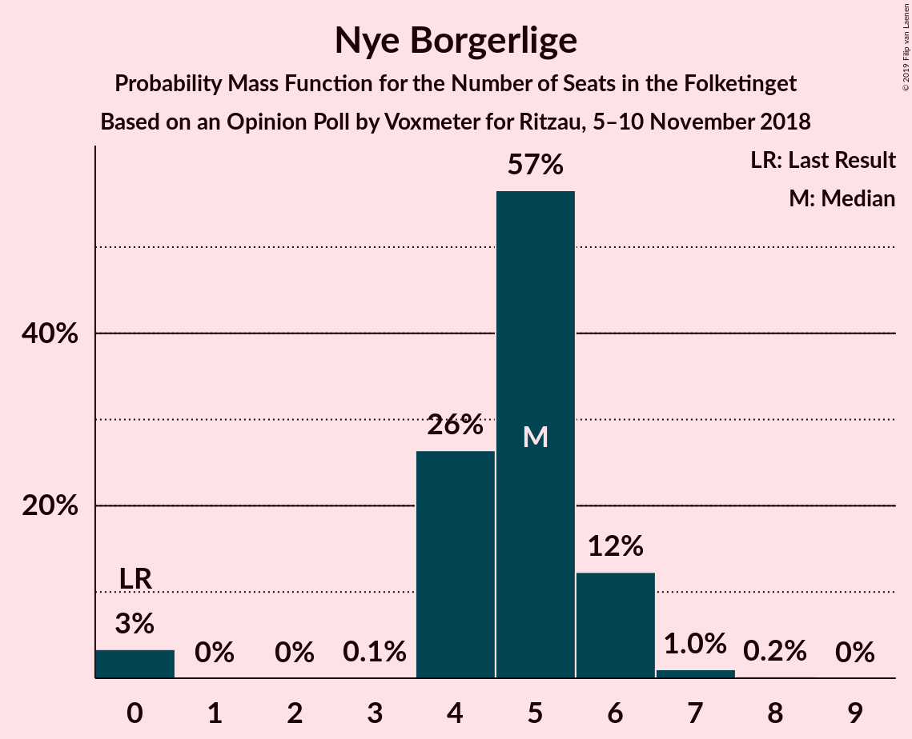

# Opinion Poll by Voxmeter for Ritzau, 5–10 November 2018

<a href="#voting-intentions">Voting Intentions</a> | <a href="#seats">Seats</a> | <a href="#coalitions">Coalitions</a> | <a href="#technical-information">Technical Information</a>

## Voting Intentions

### Confidence Intervals

| Party | Last Result | Poll Result | 80% Confidence Interval | 90% Confidence Interval | 95% Confidence Interval | 99% Confidence Interval |
|:-----:|:-----------:|:-----------:|:-----------------------:|:-----------------------:|:-----------------------:|:-----------------------:|
| Socialdemokraterne | 26.3% | 27.3% | 25.6–29.1% |25.1–29.7% |24.7–30.1% |23.9–31.0% |
| Venstre | 19.5% | 18.1% | 16.6–19.7% |16.2–20.1% |15.9–20.5% |15.2–21.3% |
| Dansk Folkeparti | 21.1% | 17.4% | 16.0–19.0% |15.6–19.4% |15.2–19.8% |14.6–20.6% |
| Enhedslisten–De Rød-Grønne | 7.8% | 9.1% | 8.1–10.4% |7.8–10.7% |7.5–11.1% |7.0–11.7% |
| Radikale Venstre | 4.6% | 6.6% | 5.7–7.7% |5.5–8.0% |5.3–8.3% |4.9–8.9% |
| Alternativet | 4.8% | 4.8% | 4.1–5.8% |3.8–6.1% |3.7–6.3% |3.3–6.8% |
| Socialistisk Folkeparti | 4.2% | 4.8% | 4.1–5.8% |3.8–6.1% |3.7–6.3% |3.3–6.8% |
| Liberal Alliance | 7.5% | 4.5% | 3.8–5.5% |3.6–5.7% |3.4–6.0% |3.1–6.4% |
| Det Konservative Folkeparti | 3.4% | 3.5% | 2.8–4.3% |2.7–4.5% |2.5–4.8% |2.2–5.2% |
| Nye Borgerlige | 0.0% | 2.6% | 2.1–3.4% |1.9–3.6% |1.8–3.8% |1.6–4.1% |
| Kristendemokraterne | 0.8% | 0.9% | 0.6–1.4% |0.5–1.5% |0.5–1.6% |0.4–1.9% |

*Note:* The poll result column reflects the actual value used in the calculations. Published results may vary slightly, and in addition be rounded to fewer digits.

## Seats

### Confidence Intervals

| Party | Last Result | Median | 80% Confidence Interval | 90% Confidence Interval | 95% Confidence Interval | 99% Confidence Interval |
|:-----:|:-----------:|:------:|:-----------------------:|:-----------------------:|:-----------------------:|:-----------------------:|
| <a href="#socialdemokraterne">Socialdemokraterne</a> | 47 | 51 | 45–54 |45–54 |44–54 |42–54 |
| <a href="#venstre">Venstre</a> | 34 | 30 | 30–36 |29–36 |29–37 |27–38 |
| <a href="#dansk-folkeparti">Dansk Folkeparti</a> | 37 | 30 | 28–33 |28–34 |27–34 |25–36 |
| <a href="#enhedslisten–de-rød-grønne">Enhedslisten–De Rød-Grønne</a> | 14 | 15 | 14–17 |14–18 |14–19 |13–20 |
| <a href="#radikale-venstre">Radikale Venstre</a> | 8 | 11 | 11–14 |10–15 |10–15 |9–15 |
| <a href="#alternativet">Alternativet</a> | 9 | 8 | 7–10 |7–11 |7–11 |6–12 |
| <a href="#socialistisk-folkeparti">Socialistisk Folkeparti</a> | 7 | 8 | 7–9 |7–10 |7–10 |6–12 |
| <a href="#liberal-alliance">Liberal Alliance</a> | 13 | 8 | 7–9 |6–10 |6–10 |5–11 |
| <a href="#det-konservative-folkeparti">Det Konservative Folkeparti</a> | 6 | 6 | 5–7 |5–8 |4–8 |4–9 |
| <a href="#nye-borgerlige">Nye Borgerlige</a> | 0 | 5 | 4–6 |4–6 |0–6 |0–7 |
| <a href="#kristendemokraterne">Kristendemokraterne</a> | 0 | 0 | 0 |0 |0 |0 |

### Socialdemokraterne

*For a full overview of the results for this party, see the [Socialdemokraterne](party-socialdemokraterne.html) page.*

| Number of Seats | Probability | Accumulated | Special Marks |
|:---------------:|:-----------:|:-----------:|:-------------:|
| 41 | 0.2% | 100% |  |
| 42 | 0.3% | 99.7% |  |
| 43 | 2% | 99.5% |  |
| 44 | 3% | 98% |  |
| 45 | 6% | 95% |  |
| 46 | 8% | 89% |  |
| 47 | 7% | 81% | Last Result |
| 48 | 12% | 74% |  |
| 49 | 6% | 62% |  |
| 50 | 5% | 56% |  |
| 51 | 10% | 51% | Median |
| 52 | 2% | 41% |  |
| 53 | 4% | 39% |  |
| 54 | 35% | 35% |  |
| 55 | 0.2% | 0.4% |  |
| 56 | 0.2% | 0.2% |  |
| 57 | 0% | 0% |  |

### Venstre

*For a full overview of the results for this party, see the [Venstre](party-venstre.html) page.*

| Number of Seats | Probability | Accumulated | Special Marks |
|:---------------:|:-----------:|:-----------:|:-------------:|
| 25 | 0% | 100% |  |
| 26 | 0.2% | 99.9% |  |
| 27 | 0.6% | 99.7% |  |
| 28 | 0.9% | 99.2% |  |
| 29 | 8% | 98% |  |
| 30 | 44% | 90% | Median |
| 31 | 9% | 46% |  |
| 32 | 8% | 38% |  |
| 33 | 12% | 30% |  |
| 34 | 3% | 18% | Last Result |
| 35 | 2% | 15% |  |
| 36 | 9% | 13% |  |
| 37 | 3% | 4% |  |
| 38 | 1.4% | 1.5% |  |
| 39 | 0% | 0.1% |  |
| 40 | 0.1% | 0.1% |  |
| 41 | 0% | 0% |  |

### Dansk Folkeparti

*For a full overview of the results for this party, see the [Dansk Folkeparti](party-danskfolkeparti.html) page.*

| Number of Seats | Probability | Accumulated | Special Marks |
|:---------------:|:-----------:|:-----------:|:-------------:|
| 25 | 0.6% | 100% |  |
| 26 | 0.3% | 99.4% |  |
| 27 | 3% | 99.1% |  |
| 28 | 12% | 96% |  |
| 29 | 3% | 85% |  |
| 30 | 45% | 82% | Median |
| 31 | 7% | 37% |  |
| 32 | 19% | 30% |  |
| 33 | 1.2% | 11% |  |
| 34 | 7% | 10% |  |
| 35 | 2% | 2% |  |
| 36 | 0.2% | 0.6% |  |
| 37 | 0.3% | 0.4% | Last Result |
| 38 | 0.1% | 0.1% |  |
| 39 | 0% | 0% |  |

### Enhedslisten–De Rød-Grønne

*For a full overview of the results for this party, see the [Enhedslisten–De Rød-Grønne](party-enhedslisten–derød-grønne.html) page.*

| Number of Seats | Probability | Accumulated | Special Marks |
|:---------------:|:-----------:|:-----------:|:-------------:|
| 12 | 0.3% | 100% |  |
| 13 | 0.5% | 99.7% |  |
| 14 | 12% | 99.2% | Last Result |
| 15 | 61% | 87% | Median |
| 16 | 7% | 26% |  |
| 17 | 11% | 19% |  |
| 18 | 3% | 8% |  |
| 19 | 4% | 5% |  |
| 20 | 1.2% | 1.3% |  |
| 21 | 0.1% | 0.1% |  |
| 22 | 0% | 0% |  |

### Radikale Venstre

*For a full overview of the results for this party, see the [Radikale Venstre](party-radikalevenstre.html) page.*

| Number of Seats | Probability | Accumulated | Special Marks |
|:---------------:|:-----------:|:-----------:|:-------------:|
| 8 | 0.2% | 100% | Last Result |
| 9 | 2% | 99.8% |  |
| 10 | 7% | 98% |  |
| 11 | 49% | 91% | Median |
| 12 | 12% | 41% |  |
| 13 | 17% | 29% |  |
| 14 | 5% | 12% |  |
| 15 | 7% | 7% |  |
| 16 | 0.3% | 0.4% |  |
| 17 | 0.1% | 0.1% |  |
| 18 | 0% | 0% |  |

### Alternativet

*For a full overview of the results for this party, see the [Alternativet](party-alternativet.html) page.*

| Number of Seats | Probability | Accumulated | Special Marks |
|:---------------:|:-----------:|:-----------:|:-------------:|
| 5 | 0.5% | 100% |  |
| 6 | 1.0% | 99.5% |  |
| 7 | 16% | 98.6% |  |
| 8 | 48% | 82% | Median |
| 9 | 16% | 34% | Last Result |
| 10 | 9% | 18% |  |
| 11 | 8% | 9% |  |
| 12 | 0.8% | 1.1% |  |
| 13 | 0.3% | 0.3% |  |
| 14 | 0% | 0% |  |

### Socialistisk Folkeparti

*For a full overview of the results for this party, see the [Socialistisk Folkeparti](party-socialistiskfolkeparti.html) page.*

| Number of Seats | Probability | Accumulated | Special Marks |
|:---------------:|:-----------:|:-----------:|:-------------:|
| 5 | 0.1% | 100% |  |
| 6 | 2% | 99.9% |  |
| 7 | 13% | 98% | Last Result |
| 8 | 53% | 85% | Median |
| 9 | 24% | 32% |  |
| 10 | 6% | 8% |  |
| 11 | 2% | 2% |  |
| 12 | 0.6% | 0.7% |  |
| 13 | 0.1% | 0.2% |  |
| 14 | 0% | 0% |  |

### Liberal Alliance

*For a full overview of the results for this party, see the [Liberal Alliance](party-liberalalliance.html) page.*

| Number of Seats | Probability | Accumulated | Special Marks |
|:---------------:|:-----------:|:-----------:|:-------------:|
| 5 | 0.6% | 100% |  |
| 6 | 9% | 99.4% |  |
| 7 | 13% | 91% |  |
| 8 | 54% | 78% | Median |
| 9 | 16% | 24% |  |
| 10 | 6% | 8% |  |
| 11 | 2% | 2% |  |
| 12 | 0.2% | 0.2% |  |
| 13 | 0% | 0% | Last Result |

### Det Konservative Folkeparti

*For a full overview of the results for this party, see the [Det Konservative Folkeparti](party-detkonservativefolkeparti.html) page.*

| Number of Seats | Probability | Accumulated | Special Marks |
|:---------------:|:-----------:|:-----------:|:-------------:|
| 0 | 0.1% | 100% |  |
| 1 | 0% | 99.9% |  |
| 2 | 0% | 99.9% |  |
| 3 | 0% | 99.9% |  |
| 4 | 4% | 99.9% |  |
| 5 | 13% | 96% |  |
| 6 | 65% | 83% | Last Result, Median |
| 7 | 13% | 19% |  |
| 8 | 4% | 5% |  |
| 9 | 1.3% | 2% |  |
| 10 | 0.3% | 0.3% |  |
| 11 | 0% | 0% |  |

### Nye Borgerlige

*For a full overview of the results for this party, see the [Nye Borgerlige](party-nyeborgerlige.html) page.*

| Number of Seats | Probability | Accumulated | Special Marks |
|:---------------:|:-----------:|:-----------:|:-------------:|
| 0 | 3% | 100% | Last Result |
| 1 | 0% | 97% |  |
| 2 | 0% | 97% |  |
| 3 | 0.1% | 97% |  |
| 4 | 26% | 97% |  |
| 5 | 57% | 70% | Median |
| 6 | 12% | 14% |  |
| 7 | 1.0% | 1.2% |  |
| 8 | 0.2% | 0.2% |  |
| 9 | 0% | 0% |  |

### Kristendemokraterne

*For a full overview of the results for this party, see the [Kristendemokraterne](party-kristendemokraterne.html) page.*

| Number of Seats | Probability | Accumulated | Special Marks |
|:---------------:|:-----------:|:-----------:|:-------------:|
| 0 | 99.7% | 100% | Last Result, Median |
| 1 | 0% | 0.3% |  |
| 2 | 0% | 0.3% |  |
| 3 | 0% | 0.3% |  |
| 4 | 0.3% | 0.3% |  |
| 5 | 0% | 0% |  |

## Coalitions

### Confidence Intervals

| Coalition | Last Result | Median | Majority? | 80% Confidence Interval | 90% Confidence Interval | 95% Confidence Interval | 99% Confidence Interval |
|:---------:|:-----------:|:------:|:---------:|:-----------------------:|:-----------------------:|:-----------------------:|:-----------------------:|
| Socialdemokraterne – Enhedslisten–De Rød-Grønne – Radikale Venstre – Alternativet – Socialistisk Folkeparti | 85 | 96 | 93% | 90–96 | 89–97 | 86–98 | 86–100 |
| Socialdemokraterne – Enhedslisten–De Rød-Grønne – Radikale Venstre – Socialistisk Folkeparti | 76 | 87 | 2% | 81–88 | 80–89 | 79–89 | 77–91 |
| Venstre – Dansk Folkeparti – Liberal Alliance – Det Konservative Folkeparti – Nye Borgerlige – Kristendemokraterne | 90 | 79 | 0.4% | 79–85 | 78–86 | 77–89 | 75–89 |
| Venstre – Dansk Folkeparti – Liberal Alliance – Det Konservative Folkeparti – Nye Borgerlige | 90 | 79 | 0.4% | 78–85 | 78–86 | 77–89 | 75–89 |
| Socialdemokraterne – Enhedslisten–De Rød-Grønne – Alternativet – Socialistisk Folkeparti | 77 | 83 | 0.2% | 79–85 | 76–86 | 75–86 | 75–89 |
| Venstre – Dansk Folkeparti – Liberal Alliance – Det Konservative Folkeparti – Kristendemokraterne | 90 | 75 | 0% | 74–80 | 72–82 | 72–85 | 70–85 |
| Venstre – Dansk Folkeparti – Liberal Alliance – Det Konservative Folkeparti | 90 | 75 | 0% | 74–80 | 72–82 | 72–85 | 70–85 |
| Socialdemokraterne – Enhedslisten–De Rød-Grønne – Socialistisk Folkeparti | 68 | 74 | 0% | 70–77 | 68–77 | 68–77 | 66–81 |
| Socialdemokraterne – Radikale Venstre – Socialistisk Folkeparti | 62 | 71 | 0% | 65–73 | 64–73 | 63–73 | 62–75 |
| Socialdemokraterne – Radikale Venstre | 55 | 63 | 0% | 57–65 | 56–65 | 55–65 | 53–66 |
| Venstre – Liberal Alliance – Det Konservative Folkeparti | 53 | 44 | 0% | 43–49 | 42–51 | 42–53 | 40–53 |
| Venstre – Det Konservative Folkeparti | 40 | 36 | 0% | 35–42 | 35–42 | 35–44 | 33–44 |
| Venstre | 34 | 30 | 0% | 30–36 | 29–36 | 29–37 | 27–38 |

### Socialdemokraterne – Enhedslisten–De Rød-Grønne – Radikale Venstre – Alternativet – Socialistisk Folkeparti

| Number of Seats | Probability | Accumulated | Special Marks |
|:---------------:|:-----------:|:-----------:|:-------------:|
| 85 | 0.4% | 100% | Last Result |
| 86 | 3% | 99.6% |  |
| 87 | 1.3% | 97% |  |
| 88 | 0.5% | 96% |  |
| 89 | 2% | 95% |  |
| 90 | 5% | 93% | Majority |
| 91 | 11% | 88% |  |
| 92 | 2% | 76% |  |
| 93 | 3% | 75% | Median |
| 94 | 17% | 72% |  |
| 95 | 5% | 55% |  |
| 96 | 40% | 50% |  |
| 97 | 6% | 10% |  |
| 98 | 1.4% | 4% |  |
| 99 | 0.7% | 2% |  |
| 100 | 1.4% | 2% |  |
| 101 | 0.2% | 0.4% |  |
| 102 | 0% | 0.2% |  |
| 103 | 0.1% | 0.2% |  |
| 104 | 0% | 0% |  |

### Socialdemokraterne – Enhedslisten–De Rød-Grønne – Radikale Venstre – Socialistisk Folkeparti

| Number of Seats | Probability | Accumulated | Special Marks |
|:---------------:|:-----------:|:-----------:|:-------------:|
| 76 | 0% | 100% | Last Result |
| 77 | 2% | 99.9% |  |
| 78 | 0.3% | 98% |  |
| 79 | 3% | 98% |  |
| 80 | 2% | 95% |  |
| 81 | 5% | 93% |  |
| 82 | 9% | 89% |  |
| 83 | 3% | 79% |  |
| 84 | 5% | 77% |  |
| 85 | 6% | 71% | Median |
| 86 | 13% | 66% |  |
| 87 | 10% | 52% |  |
| 88 | 36% | 42% |  |
| 89 | 4% | 6% |  |
| 90 | 1.4% | 2% | Majority |
| 91 | 0.6% | 1.0% |  |
| 92 | 0.2% | 0.4% |  |
| 93 | 0.1% | 0.3% |  |
| 94 | 0% | 0.2% |  |
| 95 | 0.1% | 0.1% |  |
| 96 | 0% | 0% |  |

### Venstre – Dansk Folkeparti – Liberal Alliance – Det Konservative Folkeparti – Nye Borgerlige – Kristendemokraterne

| Number of Seats | Probability | Accumulated | Special Marks |
|:---------------:|:-----------:|:-----------:|:-------------:|
| 72 | 0.1% | 100% |  |
| 73 | 0% | 99.8% |  |
| 74 | 0.2% | 99.8% |  |
| 75 | 1.4% | 99.6% |  |
| 76 | 0.7% | 98% |  |
| 77 | 1.4% | 98% |  |
| 78 | 6% | 96% |  |
| 79 | 40% | 90% | Median |
| 80 | 5% | 50% |  |
| 81 | 17% | 45% |  |
| 82 | 3% | 28% |  |
| 83 | 2% | 25% |  |
| 84 | 11% | 24% |  |
| 85 | 5% | 12% |  |
| 86 | 2% | 7% |  |
| 87 | 0.5% | 5% |  |
| 88 | 1.3% | 4% |  |
| 89 | 3% | 3% |  |
| 90 | 0.4% | 0.4% | Last Result, Majority |
| 91 | 0% | 0% |  |

### Venstre – Dansk Folkeparti – Liberal Alliance – Det Konservative Folkeparti – Nye Borgerlige

| Number of Seats | Probability | Accumulated | Special Marks |
|:---------------:|:-----------:|:-----------:|:-------------:|
| 72 | 0.1% | 100% |  |
| 73 | 0% | 99.8% |  |
| 74 | 0.2% | 99.8% |  |
| 75 | 1.4% | 99.6% |  |
| 76 | 0.7% | 98% |  |
| 77 | 1.4% | 98% |  |
| 78 | 6% | 96% |  |
| 79 | 40% | 90% | Median |
| 80 | 5% | 50% |  |
| 81 | 17% | 45% |  |
| 82 | 3% | 28% |  |
| 83 | 2% | 25% |  |
| 84 | 11% | 23% |  |
| 85 | 5% | 12% |  |
| 86 | 2% | 7% |  |
| 87 | 0.5% | 5% |  |
| 88 | 1.3% | 4% |  |
| 89 | 3% | 3% |  |
| 90 | 0.4% | 0.4% | Last Result, Majority |
| 91 | 0% | 0% |  |

### Socialdemokraterne – Enhedslisten–De Rød-Grønne – Alternativet – Socialistisk Folkeparti

| Number of Seats | Probability | Accumulated | Special Marks |
|:---------------:|:-----------:|:-----------:|:-------------:|
| 73 | 0.2% | 100% |  |
| 74 | 0.1% | 99.8% |  |
| 75 | 3% | 99.7% |  |
| 76 | 3% | 97% |  |
| 77 | 1.5% | 94% | Last Result |
| 78 | 2% | 92% |  |
| 79 | 14% | 90% |  |
| 80 | 6% | 77% |  |
| 81 | 13% | 70% |  |
| 82 | 4% | 58% | Median |
| 83 | 5% | 53% |  |
| 84 | 3% | 49% |  |
| 85 | 39% | 45% |  |
| 86 | 4% | 7% |  |
| 87 | 0.7% | 2% |  |
| 88 | 1.2% | 2% |  |
| 89 | 0.5% | 0.7% |  |
| 90 | 0.2% | 0.2% | Majority |
| 91 | 0% | 0% |  |

### Venstre – Dansk Folkeparti – Liberal Alliance – Det Konservative Folkeparti – Kristendemokraterne

| Number of Seats | Probability | Accumulated | Special Marks |
|:---------------:|:-----------:|:-----------:|:-------------:|
| 68 | 0% | 100% |  |
| 69 | 0.2% | 99.9% |  |
| 70 | 0.4% | 99.7% |  |
| 71 | 0.3% | 99.4% |  |
| 72 | 4% | 99.0% |  |
| 73 | 1.3% | 95% |  |
| 74 | 42% | 93% | Median |
| 75 | 5% | 52% |  |
| 76 | 10% | 47% |  |
| 77 | 10% | 37% |  |
| 78 | 3% | 27% |  |
| 79 | 6% | 24% |  |
| 80 | 11% | 18% |  |
| 81 | 2% | 7% |  |
| 82 | 0.8% | 6% |  |
| 83 | 1.5% | 5% |  |
| 84 | 0.4% | 3% |  |
| 85 | 3% | 3% |  |
| 86 | 0% | 0.1% |  |
| 87 | 0% | 0% |  |
| 88 | 0% | 0% |  |
| 89 | 0% | 0% |  |
| 90 | 0% | 0% | Last Result, Majority |

### Venstre – Dansk Folkeparti – Liberal Alliance – Det Konservative Folkeparti

| Number of Seats | Probability | Accumulated | Special Marks |
|:---------------:|:-----------:|:-----------:|:-------------:|
| 68 | 0% | 100% |  |
| 69 | 0.2% | 99.9% |  |
| 70 | 0.4% | 99.7% |  |
| 71 | 0.3% | 99.3% |  |
| 72 | 4% | 99.0% |  |
| 73 | 1.3% | 95% |  |
| 74 | 42% | 93% | Median |
| 75 | 5% | 52% |  |
| 76 | 10% | 46% |  |
| 77 | 10% | 37% |  |
| 78 | 3% | 27% |  |
| 79 | 6% | 24% |  |
| 80 | 11% | 18% |  |
| 81 | 2% | 7% |  |
| 82 | 0.8% | 6% |  |
| 83 | 1.5% | 5% |  |
| 84 | 0.3% | 3% |  |
| 85 | 3% | 3% |  |
| 86 | 0% | 0% |  |
| 87 | 0% | 0% |  |
| 88 | 0% | 0% |  |
| 89 | 0% | 0% |  |
| 90 | 0% | 0% | Last Result, Majority |

### Socialdemokraterne – Enhedslisten–De Rød-Grønne – Socialistisk Folkeparti

| Number of Seats | Probability | Accumulated | Special Marks |
|:---------------:|:-----------:|:-----------:|:-------------:|
| 65 | 0.1% | 100% |  |
| 66 | 1.5% | 99.8% |  |
| 67 | 0.8% | 98% |  |
| 68 | 4% | 98% | Last Result |
| 69 | 4% | 94% |  |
| 70 | 8% | 90% |  |
| 71 | 11% | 82% |  |
| 72 | 6% | 71% |  |
| 73 | 3% | 65% |  |
| 74 | 13% | 62% | Median |
| 75 | 8% | 49% |  |
| 76 | 2% | 41% |  |
| 77 | 37% | 38% |  |
| 78 | 0.6% | 2% |  |
| 79 | 0.4% | 1.2% |  |
| 80 | 0.3% | 0.8% |  |
| 81 | 0.3% | 0.5% |  |
| 82 | 0.2% | 0.2% |  |
| 83 | 0% | 0% |  |

### Socialdemokraterne – Radikale Venstre – Socialistisk Folkeparti

| Number of Seats | Probability | Accumulated | Special Marks |
|:---------------:|:-----------:|:-----------:|:-------------:|
| 61 | 0.1% | 100% |  |
| 62 | 2% | 99.9% | Last Result |
| 63 | 0.8% | 98% |  |
| 64 | 6% | 97% |  |
| 65 | 2% | 91% |  |
| 66 | 3% | 89% |  |
| 67 | 10% | 86% |  |
| 68 | 8% | 76% |  |
| 69 | 5% | 68% |  |
| 70 | 3% | 63% | Median |
| 71 | 12% | 60% |  |
| 72 | 2% | 48% |  |
| 73 | 45% | 46% |  |
| 74 | 0.5% | 1.4% |  |
| 75 | 0.7% | 1.0% |  |
| 76 | 0.1% | 0.3% |  |
| 77 | 0% | 0.2% |  |
| 78 | 0% | 0.1% |  |
| 79 | 0.1% | 0.1% |  |
| 80 | 0% | 0% |  |

### Socialdemokraterne – Radikale Venstre

| Number of Seats | Probability | Accumulated | Special Marks |
|:---------------:|:-----------:|:-----------:|:-------------:|
| 52 | 0.1% | 100% |  |
| 53 | 0.5% | 99.9% |  |
| 54 | 0.5% | 99.4% |  |
| 55 | 3% | 98.9% | Last Result |
| 56 | 4% | 96% |  |
| 57 | 4% | 92% |  |
| 58 | 11% | 88% |  |
| 59 | 3% | 77% |  |
| 60 | 5% | 73% |  |
| 61 | 6% | 68% |  |
| 62 | 2% | 62% | Median |
| 63 | 11% | 60% |  |
| 64 | 13% | 49% |  |
| 65 | 35% | 36% |  |
| 66 | 0.6% | 1.0% |  |
| 67 | 0.1% | 0.4% |  |
| 68 | 0.1% | 0.3% |  |
| 69 | 0.2% | 0.2% |  |
| 70 | 0% | 0% |  |

### Venstre – Liberal Alliance – Det Konservative Folkeparti

| Number of Seats | Probability | Accumulated | Special Marks |
|:---------------:|:-----------:|:-----------:|:-------------:|
| 38 | 0.1% | 100% |  |
| 39 | 0.2% | 99.9% |  |
| 40 | 0.2% | 99.7% |  |
| 41 | 0.9% | 99.5% |  |
| 42 | 4% | 98.5% |  |
| 43 | 9% | 95% |  |
| 44 | 38% | 85% | Median |
| 45 | 6% | 47% |  |
| 46 | 7% | 42% |  |
| 47 | 5% | 35% |  |
| 48 | 19% | 30% |  |
| 49 | 3% | 10% |  |
| 50 | 2% | 7% |  |
| 51 | 2% | 6% |  |
| 52 | 0.4% | 3% |  |
| 53 | 3% | 3% | Last Result |
| 54 | 0.1% | 0.1% |  |
| 55 | 0% | 0% |  |

### Venstre – Det Konservative Folkeparti

| Number of Seats | Probability | Accumulated | Special Marks |
|:---------------:|:-----------:|:-----------:|:-------------:|
| 31 | 0.2% | 100% |  |
| 32 | 0.2% | 99.8% |  |
| 33 | 0.5% | 99.6% |  |
| 34 | 1.0% | 99.1% |  |
| 35 | 13% | 98% |  |
| 36 | 38% | 85% | Median |
| 37 | 9% | 47% |  |
| 38 | 6% | 38% |  |
| 39 | 12% | 32% |  |
| 40 | 5% | 20% | Last Result |
| 41 | 2% | 15% |  |
| 42 | 8% | 13% |  |
| 43 | 0.6% | 5% |  |
| 44 | 4% | 4% |  |
| 45 | 0.1% | 0.2% |  |
| 46 | 0% | 0.1% |  |
| 47 | 0.1% | 0.1% |  |
| 48 | 0% | 0% |  |

### Venstre

| Number of Seats | Probability | Accumulated | Special Marks |
|:---------------:|:-----------:|:-----------:|:-------------:|
| 25 | 0% | 100% |  |
| 26 | 0.2% | 99.9% |  |
| 27 | 0.6% | 99.7% |  |
| 28 | 0.9% | 99.2% |  |
| 29 | 8% | 98% |  |
| 30 | 44% | 90% | Median |
| 31 | 9% | 46% |  |
| 32 | 8% | 38% |  |
| 33 | 12% | 30% |  |
| 34 | 3% | 18% | Last Result |
| 35 | 2% | 15% |  |
| 36 | 9% | 13% |  |
| 37 | 3% | 4% |  |
| 38 | 1.4% | 1.5% |  |
| 39 | 0% | 0.1% |  |
| 40 | 0.1% | 0.1% |  |
| 41 | 0% | 0% |  |

## Technical Information

### Opinion Poll

+ **Polling firm:** Voxmeter
+ **Commissioner(s):** Ritzau
+ **Fieldwork period:** 5–10 November 2018

### Calculations

+ **Sample size:** 1040
+ **Simulations done:** 1,048,576
+ **Error estimate:** 4.40%

