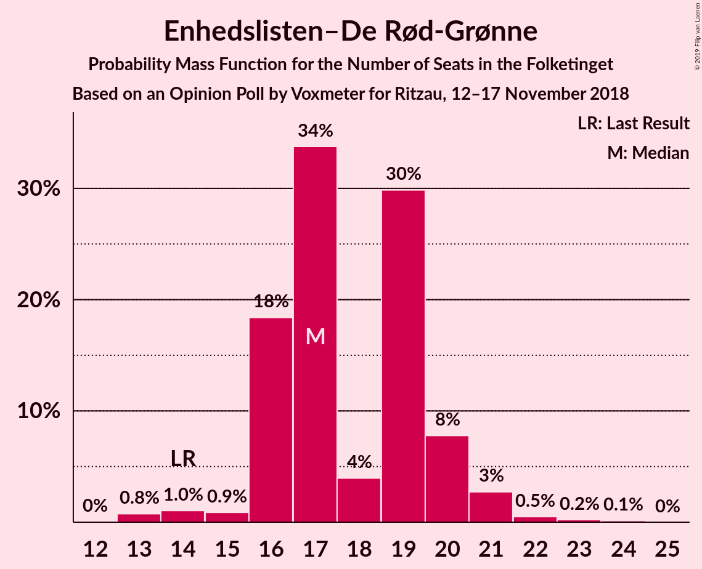
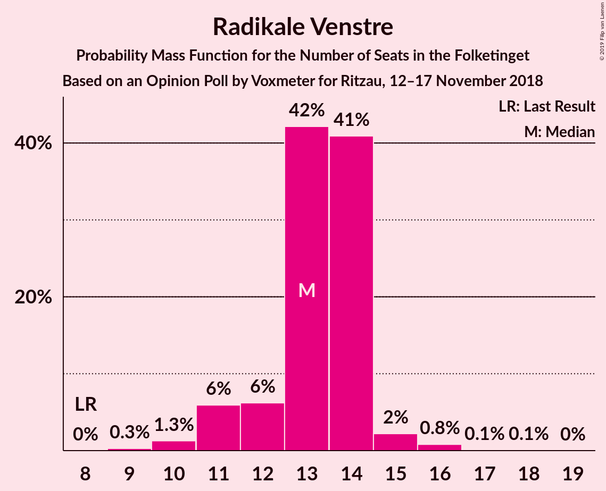
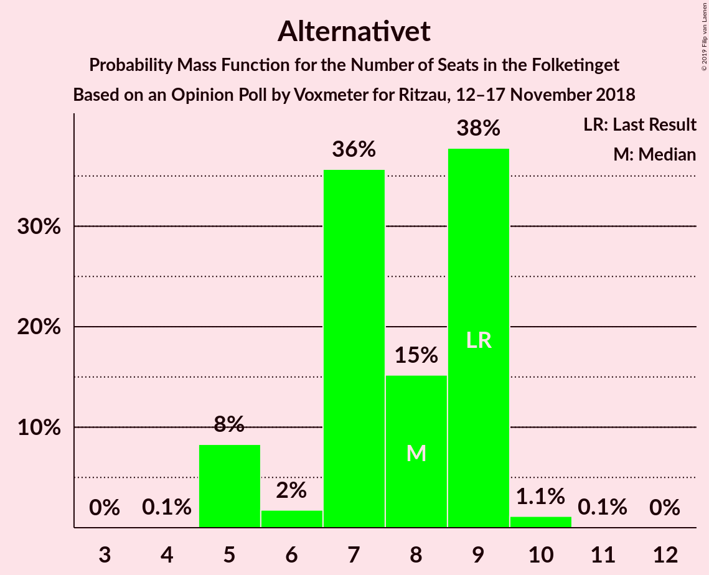

# Opinion Poll by Voxmeter for Ritzau, 12–17 November 2018

<a href="#voting-intentions">Voting Intentions</a> | <a href="#seats">Seats</a> | <a href="#coalitions">Coalitions</a> | <a href="#technical-information">Technical Information</a>

## Voting Intentions

### Confidence Intervals

| Party | Last Result | Poll Result | 80% Confidence Interval | 90% Confidence Interval | 95% Confidence Interval | 99% Confidence Interval |
|:-----:|:-----------:|:-----------:|:-----------------------:|:-----------------------:|:-----------------------:|:-----------------------:|
| Socialdemokraterne | 26.3% | 26.5% | 24.8–28.3% |24.3–28.8% |23.9–29.2% |23.1–30.1% |
| Dansk Folkeparti | 21.1% | 17.9% | 16.5–19.5% |16.1–20.0% |15.7–20.4% |15.0–21.2% |
| Venstre | 19.5% | 17.3% | 15.8–18.8% |15.4–19.3% |15.1–19.7% |14.4–20.5% |
| Enhedslisten–De Rød-Grønne | 7.8% | 9.9% | 8.8–11.2% |8.5–11.5% |8.2–11.8% |7.7–12.5% |
| Radikale Venstre | 4.6% | 7.1% | 6.2–8.2% |5.9–8.5% |5.7–8.8% |5.3–9.4% |
| Liberal Alliance | 7.5% | 5.7% | 4.8–6.7% |4.6–7.0% |4.4–7.2% |4.0–7.8% |
| Socialistisk Folkeparti | 4.2% | 5.4% | 4.6–6.4% |4.3–6.7% |4.2–6.9% |3.8–7.4% |
| Alternativet | 4.8% | 4.0% | 3.3–4.9% |3.2–5.2% |3.0–5.4% |2.7–5.9% |
| Det Konservative Folkeparti | 3.4% | 3.2% | 2.6–4.0% |2.4–4.2% |2.3–4.4% |2.0–4.8% |
| Nye Borgerlige | 0.0% | 2.2% | 1.7–2.9% |1.6–3.1% |1.5–3.3% |1.3–3.7% |
| Kristendemokraterne | 0.8% | 0.6% | 0.4–1.0% |0.3–1.1% |0.3–1.2% |0.2–1.5% |

*Note:* The poll result column reflects the actual value used in the calculations. Published results may vary slightly, and in addition be rounded to fewer digits.

## Seats

### Confidence Intervals

| Party | Last Result | Median | 80% Confidence Interval | 90% Confidence Interval | 95% Confidence Interval | 99% Confidence Interval |
|:-----:|:-----------:|:------:|:-----------------------:|:-----------------------:|:-----------------------:|:-----------------------:|
| <a href="#socialdemokraterne">Socialdemokraterne</a> | 47 | 47 | 45–49 |44–51 |43–51 |41–52 |
| <a href="#dansk-folkeparti">Dansk Folkeparti</a> | 37 | 33 | 30–34 |29–34 |28–35 |27–38 |
| <a href="#venstre">Venstre</a> | 34 | 30 | 28–34 |28–34 |27–34 |26–35 |
| <a href="#enhedslisten–de-rød-grønne">Enhedslisten–De Rød-Grønne</a> | 14 | 17 | 16–20 |16–20 |15–21 |13–22 |
| <a href="#radikale-venstre">Radikale Venstre</a> | 8 | 13 | 12–14 |11–14 |11–15 |10–16 |
| <a href="#liberal-alliance">Liberal Alliance</a> | 13 | 10 | 9–11 |9–12 |8–12 |7–14 |
| <a href="#socialistisk-folkeparti">Socialistisk Folkeparti</a> | 7 | 9 | 8–10 |8–10 |8–12 |7–13 |
| <a href="#alternativet">Alternativet</a> | 9 | 8 | 6–9 |5–9 |5–9 |5–10 |
| <a href="#det-konservative-folkeparti">Det Konservative Folkeparti</a> | 6 | 5 | 5–6 |4–7 |4–8 |4–9 |
| <a href="#nye-borgerlige">Nye Borgerlige</a> | 0 | 4 | 0–5 |0–5 |0–5 |0–6 |
| <a href="#kristendemokraterne">Kristendemokraterne</a> | 0 | 0 | 0 |0 |0 |0 |

### Socialdemokraterne

*For a full overview of the results for this party, see the [Socialdemokraterne](party-socialdemokraterne.html) page.*

| Number of Seats | Probability | Accumulated | Special Marks |
|:---------------:|:-----------:|:-----------:|:-------------:|
| 39 | 0% | 100% |  |
| 40 | 0.1% | 99.9% |  |
| 41 | 0.6% | 99.8% |  |
| 42 | 1.1% | 99.3% |  |
| 43 | 3% | 98% |  |
| 44 | 1.4% | 95% |  |
| 45 | 41% | 94% |  |
| 46 | 2% | 53% |  |
| 47 | 4% | 51% | Last Result, Median |
| 48 | 37% | 47% |  |
| 49 | 2% | 11% |  |
| 50 | 3% | 8% |  |
| 51 | 5% | 6% |  |
| 52 | 0.6% | 1.0% |  |
| 53 | 0.2% | 0.4% |  |
| 54 | 0.1% | 0.2% |  |
| 55 | 0.1% | 0.1% |  |
| 56 | 0% | 0% |  |

### Dansk Folkeparti

*For a full overview of the results for this party, see the [Dansk Folkeparti](party-danskfolkeparti.html) page.*

| Number of Seats | Probability | Accumulated | Special Marks |
|:---------------:|:-----------:|:-----------:|:-------------:|
| 26 | 0.1% | 100% |  |
| 27 | 1.5% | 99.9% |  |
| 28 | 1.3% | 98% |  |
| 29 | 4% | 97% |  |
| 30 | 10% | 94% |  |
| 31 | 3% | 84% |  |
| 32 | 3% | 81% |  |
| 33 | 46% | 77% | Median |
| 34 | 28% | 31% |  |
| 35 | 1.1% | 4% |  |
| 36 | 0.5% | 2% |  |
| 37 | 0.5% | 2% | Last Result |
| 38 | 1.0% | 1.4% |  |
| 39 | 0.1% | 0.4% |  |
| 40 | 0.3% | 0.3% |  |
| 41 | 0% | 0% |  |

### Venstre

*For a full overview of the results for this party, see the [Venstre](party-venstre.html) page.*

| Number of Seats | Probability | Accumulated | Special Marks |
|:---------------:|:-----------:|:-----------:|:-------------:|
| 25 | 0.1% | 100% |  |
| 26 | 1.5% | 99.8% |  |
| 27 | 1.3% | 98% |  |
| 28 | 39% | 97% |  |
| 29 | 6% | 58% |  |
| 30 | 34% | 52% | Median |
| 31 | 3% | 18% |  |
| 32 | 1.3% | 15% |  |
| 33 | 0.9% | 14% |  |
| 34 | 12% | 13% | Last Result |
| 35 | 0.6% | 1.1% |  |
| 36 | 0.2% | 0.5% |  |
| 37 | 0.1% | 0.3% |  |
| 38 | 0.1% | 0.1% |  |
| 39 | 0% | 0% |  |

### Enhedslisten–De Rød-Grønne

*For a full overview of the results for this party, see the [Enhedslisten–De Rød-Grønne](party-enhedslisten–derød-grønne.html) page.*

| Number of Seats | Probability | Accumulated | Special Marks |
|:---------------:|:-----------:|:-----------:|:-------------:|
| 13 | 0.8% | 100% |  |
| 14 | 1.0% | 99.2% | Last Result |
| 15 | 0.9% | 98% |  |
| 16 | 18% | 97% |  |
| 17 | 34% | 79% | Median |
| 18 | 4% | 45% |  |
| 19 | 30% | 41% |  |
| 20 | 8% | 11% |  |
| 21 | 3% | 4% |  |
| 22 | 0.5% | 0.8% |  |
| 23 | 0.2% | 0.4% |  |
| 24 | 0.1% | 0.1% |  |
| 25 | 0% | 0% |  |

### Radikale Venstre

*For a full overview of the results for this party, see the [Radikale Venstre](party-radikalevenstre.html) page.*

| Number of Seats | Probability | Accumulated | Special Marks |
|:---------------:|:-----------:|:-----------:|:-------------:|
| 8 | 0% | 100% | Last Result |
| 9 | 0.3% | 100% |  |
| 10 | 1.3% | 99.7% |  |
| 11 | 6% | 98% |  |
| 12 | 6% | 92% |  |
| 13 | 42% | 86% | Median |
| 14 | 41% | 44% |  |
| 15 | 2% | 3% |  |
| 16 | 0.8% | 1.0% |  |
| 17 | 0.1% | 0.2% |  |
| 18 | 0.1% | 0.1% |  |
| 19 | 0% | 0% |  |

### Liberal Alliance

*For a full overview of the results for this party, see the [Liberal Alliance](party-liberalalliance.html) page.*

| Number of Seats | Probability | Accumulated | Special Marks |
|:---------------:|:-----------:|:-----------:|:-------------:|
| 7 | 0.9% | 100% |  |
| 8 | 2% | 99.0% |  |
| 9 | 8% | 97% |  |
| 10 | 47% | 89% | Median |
| 11 | 34% | 42% |  |
| 12 | 6% | 8% |  |
| 13 | 1.4% | 2% | Last Result |
| 14 | 0.6% | 0.6% |  |
| 15 | 0% | 0% |  |

### Socialistisk Folkeparti

*For a full overview of the results for this party, see the [Socialistisk Folkeparti](party-socialistiskfolkeparti.html) page.*

| Number of Seats | Probability | Accumulated | Special Marks |
|:---------------:|:-----------:|:-----------:|:-------------:|
| 6 | 0.1% | 100% |  |
| 7 | 2% | 99.9% | Last Result |
| 8 | 35% | 98% |  |
| 9 | 42% | 63% | Median |
| 10 | 16% | 21% |  |
| 11 | 2% | 5% |  |
| 12 | 2% | 3% |  |
| 13 | 0.7% | 0.8% |  |
| 14 | 0.1% | 0.1% |  |
| 15 | 0% | 0% |  |

### Alternativet

*For a full overview of the results for this party, see the [Alternativet](party-alternativet.html) page.*

| Number of Seats | Probability | Accumulated | Special Marks |
|:---------------:|:-----------:|:-----------:|:-------------:|
| 4 | 0.1% | 100% |  |
| 5 | 8% | 99.9% |  |
| 6 | 2% | 92% |  |
| 7 | 36% | 90% |  |
| 8 | 15% | 54% | Median |
| 9 | 38% | 39% | Last Result |
| 10 | 1.1% | 1.2% |  |
| 11 | 0.1% | 0.1% |  |
| 12 | 0% | 0% |  |

### Det Konservative Folkeparti

*For a full overview of the results for this party, see the [Det Konservative Folkeparti](party-detkonservativefolkeparti.html) page.*

| Number of Seats | Probability | Accumulated | Special Marks |
|:---------------:|:-----------:|:-----------:|:-------------:|
| 0 | 0.4% | 100% |  |
| 1 | 0% | 99.6% |  |
| 2 | 0% | 99.6% |  |
| 3 | 0% | 99.6% |  |
| 4 | 8% | 99.6% |  |
| 5 | 48% | 92% | Median |
| 6 | 36% | 44% | Last Result |
| 7 | 5% | 8% |  |
| 8 | 2% | 3% |  |
| 9 | 2% | 2% |  |
| 10 | 0% | 0% |  |

### Nye Borgerlige

*For a full overview of the results for this party, see the [Nye Borgerlige](party-nyeborgerlige.html) page.*

| Number of Seats | Probability | Accumulated | Special Marks |
|:---------------:|:-----------:|:-----------:|:-------------:|
| 0 | 44% | 100% | Last Result |
| 1 | 0% | 56% |  |
| 2 | 0% | 56% |  |
| 3 | 0.5% | 56% |  |
| 4 | 41% | 56% | Median |
| 5 | 13% | 14% |  |
| 6 | 0.6% | 0.9% |  |
| 7 | 0.2% | 0.2% |  |
| 8 | 0% | 0% |  |

### Kristendemokraterne

*For a full overview of the results for this party, see the [Kristendemokraterne](party-kristendemokraterne.html) page.*

| Number of Seats | Probability | Accumulated | Special Marks |
|:---------------:|:-----------:|:-----------:|:-------------:|
| 0 | 100% | 100% | Last Result, Median |

## Coalitions

### Confidence Intervals

| Coalition | Last Result | Median | Majority? | 80% Confidence Interval | 90% Confidence Interval | 95% Confidence Interval | 99% Confidence Interval |
|:---------:|:-----------:|:------:|:---------:|:-----------------------:|:-----------------------:|:-----------------------:|:-----------------------:|
| Socialdemokraterne – Enhedslisten–De Rød-Grønne – Radikale Venstre – Socialistisk Folkeparti – Alternativet | 85 | 94 | 91% | 90–99 | 88–100 | 88–100 | 88–101 |
| Socialdemokraterne – Enhedslisten–De Rød-Grønne – Radikale Venstre – Socialistisk Folkeparti | 76 | 86 | 40% | 83–91 | 83–92 | 82–92 | 80–94 |
| Dansk Folkeparti – Venstre – Liberal Alliance – Det Konservative Folkeparti – Nye Borgerlige – Kristendemokraterne | 90 | 81 | 0.1% | 76–85 | 75–87 | 75–87 | 74–87 |
| Dansk Folkeparti – Venstre – Liberal Alliance – Det Konservative Folkeparti – Nye Borgerlige | 90 | 81 | 0.1% | 76–85 | 75–87 | 75–87 | 74–87 |
| Socialdemokraterne – Enhedslisten–De Rød-Grønne – Socialistisk Folkeparti – Alternativet | 77 | 81 | 0.1% | 77–85 | 75–86 | 75–86 | 75–88 |
| Dansk Folkeparti – Venstre – Liberal Alliance – Det Konservative Folkeparti – Kristendemokraterne | 90 | 79 | 0% | 75–82 | 72–82 | 72–82 | 72–84 |
| Dansk Folkeparti – Venstre – Liberal Alliance – Det Konservative Folkeparti | 90 | 79 | 0% | 75–82 | 72–82 | 72–82 | 72–84 |
| Socialdemokraterne – Enhedslisten–De Rød-Grønne – Socialistisk Folkeparti | 68 | 73 | 0% | 70–78 | 70–78 | 69–78 | 68–80 |
| Socialdemokraterne – Radikale Venstre – Socialistisk Folkeparti | 62 | 68 | 0% | 66–72 | 66–75 | 65–75 | 62–76 |
| Socialdemokraterne – Radikale Venstre | 55 | 59 | 0% | 58–62 | 57–65 | 55–65 | 54–65 |
| Venstre – Liberal Alliance – Det Konservative Folkeparti | 53 | 46 | 0% | 42–49 | 42–51 | 42–52 | 40–52 |
| Venstre – Det Konservative Folkeparti | 40 | 35 | 0% | 33–39 | 32–40 | 32–40 | 31–41 |
| Venstre | 34 | 30 | 0% | 28–34 | 28–34 | 27–34 | 26–35 |

### Socialdemokraterne – Enhedslisten–De Rød-Grønne – Radikale Venstre – Socialistisk Folkeparti – Alternativet

| Number of Seats | Probability | Accumulated | Special Marks |
|:---------------:|:-----------:|:-----------:|:-------------:|
| 85 | 0% | 100% | Last Result |
| 86 | 0.2% | 99.9% |  |
| 87 | 0.2% | 99.8% |  |
| 88 | 8% | 99.6% |  |
| 89 | 1.5% | 92% |  |
| 90 | 1.1% | 91% | Majority |
| 91 | 2% | 89% |  |
| 92 | 31% | 87% |  |
| 93 | 6% | 56% |  |
| 94 | 3% | 50% | Median |
| 95 | 3% | 47% |  |
| 96 | 3% | 44% |  |
| 97 | 26% | 41% |  |
| 98 | 2% | 15% |  |
| 99 | 5% | 13% |  |
| 100 | 7% | 8% |  |
| 101 | 0.6% | 1.1% |  |
| 102 | 0.2% | 0.5% |  |
| 103 | 0.1% | 0.2% |  |
| 104 | 0.1% | 0.1% |  |
| 105 | 0% | 0% |  |

### Socialdemokraterne – Enhedslisten–De Rød-Grønne – Radikale Venstre – Socialistisk Folkeparti

| Number of Seats | Probability | Accumulated | Special Marks |
|:---------------:|:-----------:|:-----------:|:-------------:|
| 76 | 0% | 100% | Last Result |
| 77 | 0% | 100% |  |
| 78 | 0% | 100% |  |
| 79 | 0.1% | 99.9% |  |
| 80 | 1.2% | 99.8% |  |
| 81 | 0.9% | 98.6% |  |
| 82 | 0.7% | 98% |  |
| 83 | 37% | 97% |  |
| 84 | 6% | 60% |  |
| 85 | 2% | 54% |  |
| 86 | 3% | 51% | Median |
| 87 | 3% | 48% |  |
| 88 | 4% | 45% |  |
| 89 | 1.1% | 41% |  |
| 90 | 26% | 40% | Majority |
| 91 | 7% | 14% |  |
| 92 | 7% | 8% |  |
| 93 | 0.2% | 1.3% |  |
| 94 | 0.6% | 1.0% |  |
| 95 | 0.2% | 0.4% |  |
| 96 | 0.1% | 0.2% |  |
| 97 | 0.1% | 0.1% |  |
| 98 | 0% | 0% |  |

### Dansk Folkeparti – Venstre – Liberal Alliance – Det Konservative Folkeparti – Nye Borgerlige – Kristendemokraterne

| Number of Seats | Probability | Accumulated | Special Marks |
|:---------------:|:-----------:|:-----------:|:-------------:|
| 71 | 0.1% | 100% |  |
| 72 | 0.1% | 99.9% |  |
| 73 | 0.2% | 99.8% |  |
| 74 | 0.6% | 99.5% |  |
| 75 | 7% | 98.9% |  |
| 76 | 5% | 92% |  |
| 77 | 2% | 87% |  |
| 78 | 26% | 85% |  |
| 79 | 3% | 59% |  |
| 80 | 3% | 56% |  |
| 81 | 3% | 53% |  |
| 82 | 6% | 50% | Median |
| 83 | 31% | 44% |  |
| 84 | 2% | 13% |  |
| 85 | 1.1% | 11% |  |
| 86 | 1.5% | 9% |  |
| 87 | 8% | 8% |  |
| 88 | 0.2% | 0.4% |  |
| 89 | 0.2% | 0.2% |  |
| 90 | 0% | 0.1% | Last Result, Majority |
| 91 | 0% | 0% |  |

### Dansk Folkeparti – Venstre – Liberal Alliance – Det Konservative Folkeparti – Nye Borgerlige

| Number of Seats | Probability | Accumulated | Special Marks |
|:---------------:|:-----------:|:-----------:|:-------------:|
| 71 | 0.1% | 100% |  |
| 72 | 0.1% | 99.9% |  |
| 73 | 0.2% | 99.8% |  |
| 74 | 0.6% | 99.5% |  |
| 75 | 7% | 98.9% |  |
| 76 | 5% | 92% |  |
| 77 | 2% | 87% |  |
| 78 | 26% | 85% |  |
| 79 | 3% | 59% |  |
| 80 | 3% | 56% |  |
| 81 | 3% | 53% |  |
| 82 | 6% | 50% | Median |
| 83 | 31% | 44% |  |
| 84 | 2% | 13% |  |
| 85 | 1.1% | 11% |  |
| 86 | 1.5% | 9% |  |
| 87 | 8% | 8% |  |
| 88 | 0.2% | 0.4% |  |
| 89 | 0.2% | 0.2% |  |
| 90 | 0% | 0.1% | Last Result, Majority |
| 91 | 0% | 0% |  |

### Socialdemokraterne – Enhedslisten–De Rød-Grønne – Socialistisk Folkeparti – Alternativet

| Number of Seats | Probability | Accumulated | Special Marks |
|:---------------:|:-----------:|:-----------:|:-------------:|
| 73 | 0.1% | 100% |  |
| 74 | 0.1% | 99.9% |  |
| 75 | 7% | 99.8% |  |
| 76 | 1.0% | 92% |  |
| 77 | 2% | 91% | Last Result |
| 78 | 1.3% | 89% |  |
| 79 | 32% | 88% |  |
| 80 | 3% | 56% |  |
| 81 | 3% | 53% | Median |
| 82 | 5% | 50% |  |
| 83 | 26% | 44% |  |
| 84 | 3% | 18% |  |
| 85 | 6% | 15% |  |
| 86 | 8% | 9% |  |
| 87 | 0.3% | 0.8% |  |
| 88 | 0.2% | 0.5% |  |
| 89 | 0.2% | 0.3% |  |
| 90 | 0.1% | 0.1% | Majority |
| 91 | 0% | 0% |  |

### Dansk Folkeparti – Venstre – Liberal Alliance – Det Konservative Folkeparti – Kristendemokraterne

| Number of Seats | Probability | Accumulated | Special Marks |
|:---------------:|:-----------:|:-----------:|:-------------:|
| 70 | 0.1% | 100% |  |
| 71 | 0.3% | 99.9% |  |
| 72 | 5% | 99.6% |  |
| 73 | 1.5% | 95% |  |
| 74 | 1.2% | 93% |  |
| 75 | 8% | 92% |  |
| 76 | 4% | 84% |  |
| 77 | 3% | 80% |  |
| 78 | 25% | 77% | Median |
| 79 | 33% | 52% |  |
| 80 | 3% | 19% |  |
| 81 | 1.4% | 16% |  |
| 82 | 13% | 15% |  |
| 83 | 0.8% | 2% |  |
| 84 | 0.4% | 0.8% |  |
| 85 | 0.3% | 0.5% |  |
| 86 | 0.1% | 0.2% |  |
| 87 | 0% | 0.1% |  |
| 88 | 0% | 0% |  |
| 89 | 0% | 0% |  |
| 90 | 0% | 0% | Last Result, Majority |

### Dansk Folkeparti – Venstre – Liberal Alliance – Det Konservative Folkeparti

| Number of Seats | Probability | Accumulated | Special Marks |
|:---------------:|:-----------:|:-----------:|:-------------:|
| 70 | 0.1% | 100% |  |
| 71 | 0.3% | 99.9% |  |
| 72 | 5% | 99.6% |  |
| 73 | 2% | 95% |  |
| 74 | 1.2% | 93% |  |
| 75 | 8% | 92% |  |
| 76 | 4% | 84% |  |
| 77 | 3% | 80% |  |
| 78 | 25% | 77% | Median |
| 79 | 33% | 52% |  |
| 80 | 3% | 19% |  |
| 81 | 1.4% | 16% |  |
| 82 | 13% | 15% |  |
| 83 | 0.8% | 2% |  |
| 84 | 0.4% | 0.8% |  |
| 85 | 0.3% | 0.5% |  |
| 86 | 0.1% | 0.2% |  |
| 87 | 0% | 0.1% |  |
| 88 | 0% | 0% |  |
| 89 | 0% | 0% |  |
| 90 | 0% | 0% | Last Result, Majority |

### Socialdemokraterne – Enhedslisten–De Rød-Grønne – Socialistisk Folkeparti

| Number of Seats | Probability | Accumulated | Special Marks |
|:---------------:|:-----------:|:-----------:|:-------------:|
| 66 | 0.1% | 100% |  |
| 67 | 0.1% | 99.9% |  |
| 68 | 2% | 99.7% | Last Result |
| 69 | 1.1% | 98% |  |
| 70 | 38% | 97% |  |
| 71 | 2% | 59% |  |
| 72 | 2% | 58% |  |
| 73 | 8% | 55% | Median |
| 74 | 2% | 47% |  |
| 75 | 2% | 45% |  |
| 76 | 27% | 43% |  |
| 77 | 6% | 16% |  |
| 78 | 8% | 10% |  |
| 79 | 1.1% | 2% |  |
| 80 | 0.3% | 0.7% |  |
| 81 | 0.3% | 0.4% |  |
| 82 | 0.1% | 0.2% |  |
| 83 | 0.1% | 0.1% |  |
| 84 | 0% | 0% |  |

### Socialdemokraterne – Radikale Venstre – Socialistisk Folkeparti

| Number of Seats | Probability | Accumulated | Special Marks |
|:---------------:|:-----------:|:-----------:|:-------------:|
| 60 | 0% | 100% |  |
| 61 | 0.1% | 99.9% |  |
| 62 | 0.4% | 99.8% | Last Result |
| 63 | 0.2% | 99.4% |  |
| 64 | 1.5% | 99.2% |  |
| 65 | 2% | 98% |  |
| 66 | 31% | 96% |  |
| 67 | 11% | 65% |  |
| 68 | 7% | 54% |  |
| 69 | 2% | 47% | Median |
| 70 | 2% | 45% |  |
| 71 | 27% | 43% |  |
| 72 | 9% | 16% |  |
| 73 | 1.1% | 7% |  |
| 74 | 0.4% | 6% |  |
| 75 | 5% | 5% |  |
| 76 | 0.1% | 0.6% |  |
| 77 | 0.3% | 0.5% |  |
| 78 | 0.1% | 0.2% |  |
| 79 | 0.1% | 0.1% |  |
| 80 | 0% | 0% |  |

### Socialdemokraterne – Radikale Venstre

| Number of Seats | Probability | Accumulated | Special Marks |
|:---------------:|:-----------:|:-----------:|:-------------:|
| 51 | 0% | 100% |  |
| 52 | 0.1% | 99.9% |  |
| 53 | 0.3% | 99.8% |  |
| 54 | 0.9% | 99.6% |  |
| 55 | 2% | 98.7% | Last Result |
| 56 | 1.0% | 97% |  |
| 57 | 2% | 96% |  |
| 58 | 40% | 94% |  |
| 59 | 8% | 54% |  |
| 60 | 2% | 46% | Median |
| 61 | 3% | 44% |  |
| 62 | 34% | 41% |  |
| 63 | 0.6% | 7% |  |
| 64 | 0.8% | 7% |  |
| 65 | 6% | 6% |  |
| 66 | 0.1% | 0.4% |  |
| 67 | 0.1% | 0.2% |  |
| 68 | 0.1% | 0.2% |  |
| 69 | 0.1% | 0.1% |  |
| 70 | 0% | 0% |  |

### Venstre – Liberal Alliance – Det Konservative Folkeparti

| Number of Seats | Probability | Accumulated | Special Marks |
|:---------------:|:-----------:|:-----------:|:-------------:|
| 39 | 0.2% | 100% |  |
| 40 | 0.3% | 99.7% |  |
| 41 | 0.8% | 99.5% |  |
| 42 | 12% | 98.7% |  |
| 43 | 2% | 86% |  |
| 44 | 27% | 85% |  |
| 45 | 3% | 57% | Median |
| 46 | 33% | 54% |  |
| 47 | 2% | 21% |  |
| 48 | 3% | 19% |  |
| 49 | 10% | 16% |  |
| 50 | 0.8% | 6% |  |
| 51 | 0.9% | 5% |  |
| 52 | 4% | 4% |  |
| 53 | 0.2% | 0.3% | Last Result |
| 54 | 0.1% | 0.1% |  |
| 55 | 0% | 0.1% |  |
| 56 | 0% | 0% |  |

### Venstre – Det Konservative Folkeparti

| Number of Seats | Probability | Accumulated | Special Marks |
|:---------------:|:-----------:|:-----------:|:-------------:|
| 29 | 0.1% | 100% |  |
| 30 | 0.2% | 99.9% |  |
| 31 | 0.6% | 99.6% |  |
| 32 | 8% | 99.0% |  |
| 33 | 5% | 91% |  |
| 34 | 29% | 85% |  |
| 35 | 32% | 56% | Median |
| 36 | 4% | 24% |  |
| 37 | 2% | 20% |  |
| 38 | 4% | 19% |  |
| 39 | 10% | 15% |  |
| 40 | 5% | 5% | Last Result |
| 41 | 0.2% | 0.5% |  |
| 42 | 0.2% | 0.4% |  |
| 43 | 0% | 0.2% |  |
| 44 | 0.1% | 0.1% |  |
| 45 | 0% | 0.1% |  |
| 46 | 0% | 0% |  |

### Venstre

| Number of Seats | Probability | Accumulated | Special Marks |
|:---------------:|:-----------:|:-----------:|:-------------:|
| 25 | 0.1% | 100% |  |
| 26 | 1.5% | 99.8% |  |
| 27 | 1.3% | 98% |  |
| 28 | 39% | 97% |  |
| 29 | 6% | 58% |  |
| 30 | 34% | 52% | Median |
| 31 | 3% | 18% |  |
| 32 | 1.3% | 15% |  |
| 33 | 0.9% | 14% |  |
| 34 | 12% | 13% | Last Result |
| 35 | 0.6% | 1.1% |  |
| 36 | 0.2% | 0.5% |  |
| 37 | 0.1% | 0.3% |  |
| 38 | 0.1% | 0.1% |  |
| 39 | 0% | 0% |  |

## Technical Information

### Opinion Poll

+ **Polling firm:** Voxmeter
+ **Commissioner(s):** Ritzau
+ **Fieldwork period:** 12–17 November 2018

### Calculations

+ **Sample size:** 1043
+ **Simulations done:** 1,048,576
+ **Error estimate:** 2.16%

