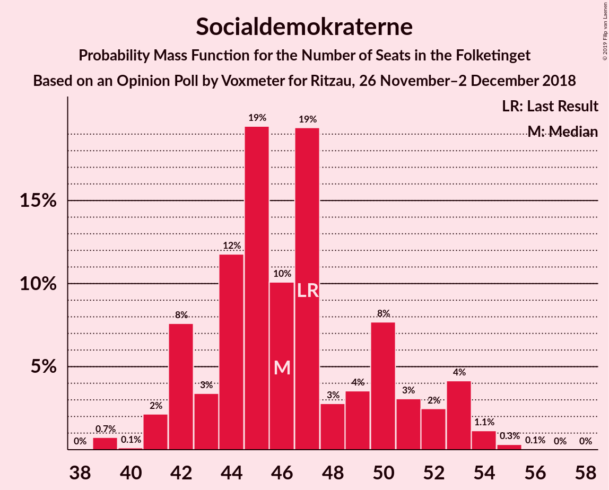
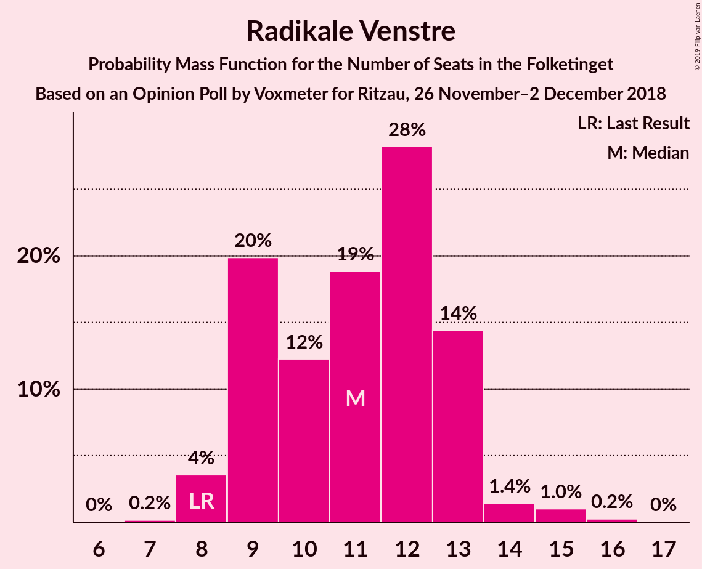
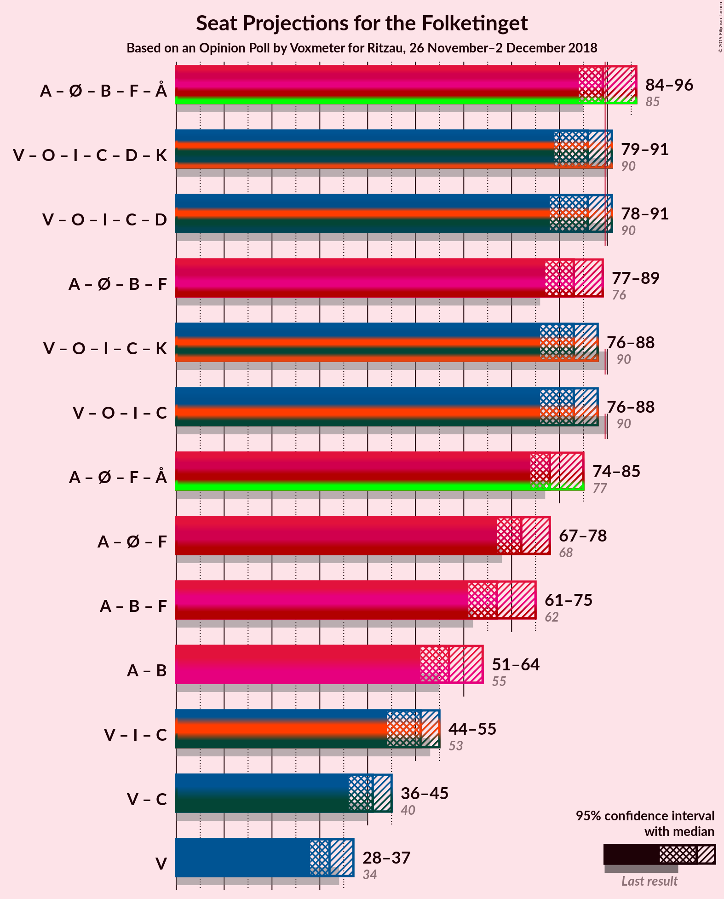

# Opinion Poll by Voxmeter for Ritzau, 26 November–2 December 2018

<a href="#voting-intentions">Voting Intentions</a> | <a href="#seats">Seats</a> | <a href="#coalitions">Coalitions</a> | <a href="#technical-information">Technical Information</a>

## Voting Intentions

### Confidence Intervals

| Party | Last Result | Poll Result | 80% Confidence Interval | 90% Confidence Interval | 95% Confidence Interval | 99% Confidence Interval |
|:-----:|:-----------:|:-----------:|:-----------------------:|:-----------------------:|:-----------------------:|:-----------------------:|
| Socialdemokraterne | 26.3% | 26.5% | 24.8–28.3% |24.3–28.8% |23.9–29.2% |23.1–30.1% |
| Venstre | 19.5% | 18.3% | 16.9–19.9% |16.5–20.4% |16.1–20.8% |15.4–21.6% |
| Dansk Folkeparti | 21.1% | 18.2% | 16.8–19.8% |16.4–20.3% |16.0–20.7% |15.3–21.5% |
| Enhedslisten–De Rød-Grønne | 7.8% | 8.5% | 7.5–9.8% |7.2–10.1% |7.0–10.4% |6.5–11.0% |
| Radikale Venstre | 4.6% | 6.2% | 5.3–7.2% |5.1–7.5% |4.9–7.8% |4.5–8.3% |
| Socialistisk Folkeparti | 4.2% | 5.8% | 5.0–6.8% |4.7–7.1% |4.5–7.4% |4.2–7.9% |
| Liberal Alliance | 7.5% | 5.1% | 4.3–6.1% |4.1–6.4% |3.9–6.6% |3.6–7.1% |
| Det Konservative Folkeparti | 3.4% | 4.5% | 3.7–5.4% |3.5–5.7% |3.4–5.9% |3.0–6.4% |
| Alternativet | 4.8% | 3.5% | 2.9–4.4% |2.7–4.6% |2.6–4.8% |2.3–5.2% |
| Nye Borgerlige | 0.0% | 2.1% | 1.6–2.8% |1.5–3.0% |1.4–3.2% |1.2–3.5% |
| Kristendemokraterne | 0.8% | 1.1% | 0.8–1.7% |0.7–1.8% |0.7–2.0% |0.5–2.3% |

*Note:* The poll result column reflects the actual value used in the calculations. Published results may vary slightly, and in addition be rounded to fewer digits.

## Seats

### Confidence Intervals

| Party | Last Result | Median | 80% Confidence Interval | 90% Confidence Interval | 95% Confidence Interval | 99% Confidence Interval |
|:-----:|:-----------:|:------:|:-----------------------:|:-----------------------:|:-----------------------:|:-----------------------:|
| <a href="#socialdemokraterne">Socialdemokraterne</a> | 47 | 46 | 42–51 |42–53 |41–53 |39–54 |
| <a href="#venstre">Venstre</a> | 34 | 32 | 29–35 |29–37 |28–37 |27–40 |
| <a href="#dansk-folkeparti">Dansk Folkeparti</a> | 37 | 33 | 29–36 |29–37 |28–39 |27–40 |
| <a href="#enhedslisten–de-rød-grønne">Enhedslisten–De Rød-Grønne</a> | 14 | 15 | 13–18 |12–18 |12–19 |11–20 |
| <a href="#radikale-venstre">Radikale Venstre</a> | 8 | 11 | 9–13 |9–13 |8–14 |8–15 |
| <a href="#socialistisk-folkeparti">Socialistisk Folkeparti</a> | 7 | 10 | 8–12 |8–12 |8–13 |8–14 |
| <a href="#liberal-alliance">Liberal Alliance</a> | 13 | 9 | 8–11 |7–11 |7–12 |6–13 |
| <a href="#det-konservative-folkeparti">Det Konservative Folkeparti</a> | 6 | 8 | 7–10 |6–11 |6–11 |5–12 |
| <a href="#alternativet">Alternativet</a> | 9 | 6 | 5–8 |5–8 |4–9 |4–9 |
| <a href="#nye-borgerlige">Nye Borgerlige</a> | 0 | 4 | 0–5 |0–6 |0–6 |0–6 |
| <a href="#kristendemokraterne">Kristendemokraterne</a> | 0 | 0 | 0 |0 |0 |0–4 |

### Socialdemokraterne

*For a full overview of the results for this party, see the [Socialdemokraterne](party-socialdemokraterne.html) page.*

| Number of Seats | Probability | Accumulated | Special Marks |
|:---------------:|:-----------:|:-----------:|:-------------:|
| 38 | 0% | 100% |  |
| 39 | 0.7% | 99.9% |  |
| 40 | 0.1% | 99.2% |  |
| 41 | 2% | 99.1% |  |
| 42 | 8% | 97% |  |
| 43 | 3% | 89% |  |
| 44 | 12% | 86% |  |
| 45 | 19% | 74% |  |
| 46 | 10% | 55% | Median |
| 47 | 19% | 45% | Last Result |
| 48 | 3% | 25% |  |
| 49 | 4% | 22% |  |
| 50 | 8% | 19% |  |
| 51 | 3% | 11% |  |
| 52 | 2% | 8% |  |
| 53 | 4% | 6% |  |
| 54 | 1.1% | 2% |  |
| 55 | 0.3% | 0.4% |  |
| 56 | 0.1% | 0.1% |  |
| 57 | 0% | 0% |  |

### Venstre

*For a full overview of the results for this party, see the [Venstre](party-venstre.html) page.*

| Number of Seats | Probability | Accumulated | Special Marks |
|:---------------:|:-----------:|:-----------:|:-------------:|
| 26 | 0.4% | 100% |  |
| 27 | 1.1% | 99.6% |  |
| 28 | 1.2% | 98.5% |  |
| 29 | 10% | 97% |  |
| 30 | 10% | 87% |  |
| 31 | 8% | 77% |  |
| 32 | 21% | 69% | Median |
| 33 | 14% | 48% |  |
| 34 | 12% | 34% | Last Result |
| 35 | 12% | 22% |  |
| 36 | 3% | 10% |  |
| 37 | 6% | 7% |  |
| 38 | 0.6% | 1.1% |  |
| 39 | 0.1% | 0.6% |  |
| 40 | 0.1% | 0.5% |  |
| 41 | 0.4% | 0.4% |  |
| 42 | 0% | 0% |  |

### Dansk Folkeparti

*For a full overview of the results for this party, see the [Dansk Folkeparti](party-danskfolkeparti.html) page.*

| Number of Seats | Probability | Accumulated | Special Marks |
|:---------------:|:-----------:|:-----------:|:-------------:|
| 26 | 0.4% | 100% |  |
| 27 | 0.6% | 99.6% |  |
| 28 | 2% | 98.9% |  |
| 29 | 12% | 97% |  |
| 30 | 7% | 85% |  |
| 31 | 8% | 78% |  |
| 32 | 10% | 70% |  |
| 33 | 26% | 60% | Median |
| 34 | 18% | 34% |  |
| 35 | 3% | 17% |  |
| 36 | 4% | 13% |  |
| 37 | 5% | 9% | Last Result |
| 38 | 0.8% | 4% |  |
| 39 | 3% | 3% |  |
| 40 | 0.7% | 0.7% |  |
| 41 | 0% | 0% |  |

### Enhedslisten–De Rød-Grønne

*For a full overview of the results for this party, see the [Enhedslisten–De Rød-Grønne](party-enhedslisten–derød-grønne.html) page.*

| Number of Seats | Probability | Accumulated | Special Marks |
|:---------------:|:-----------:|:-----------:|:-------------:|
| 11 | 0.5% | 100% |  |
| 12 | 8% | 99.4% |  |
| 13 | 12% | 92% |  |
| 14 | 4% | 80% | Last Result |
| 15 | 32% | 75% | Median |
| 16 | 20% | 44% |  |
| 17 | 9% | 24% |  |
| 18 | 12% | 15% |  |
| 19 | 2% | 3% |  |
| 20 | 1.0% | 1.2% |  |
| 21 | 0.1% | 0.2% |  |
| 22 | 0% | 0% |  |

### Radikale Venstre

*For a full overview of the results for this party, see the [Radikale Venstre](party-radikalevenstre.html) page.*

| Number of Seats | Probability | Accumulated | Special Marks |
|:---------------:|:-----------:|:-----------:|:-------------:|
| 7 | 0.2% | 100% |  |
| 8 | 4% | 99.8% | Last Result |
| 9 | 20% | 96% |  |
| 10 | 12% | 76% |  |
| 11 | 19% | 64% | Median |
| 12 | 28% | 45% |  |
| 13 | 14% | 17% |  |
| 14 | 1.4% | 3% |  |
| 15 | 1.0% | 1.3% |  |
| 16 | 0.2% | 0.3% |  |
| 17 | 0% | 0% |  |

### Socialistisk Folkeparti

*For a full overview of the results for this party, see the [Socialistisk Folkeparti](party-socialistiskfolkeparti.html) page.*

| Number of Seats | Probability | Accumulated | Special Marks |
|:---------------:|:-----------:|:-----------:|:-------------:|
| 7 | 0.4% | 100% | Last Result |
| 8 | 13% | 99.6% |  |
| 9 | 17% | 87% |  |
| 10 | 35% | 70% | Median |
| 11 | 21% | 35% |  |
| 12 | 11% | 14% |  |
| 13 | 2% | 3% |  |
| 14 | 0.7% | 1.0% |  |
| 15 | 0.3% | 0.3% |  |
| 16 | 0% | 0% |  |

### Liberal Alliance

*For a full overview of the results for this party, see the [Liberal Alliance](party-liberalalliance.html) page.*

| Number of Seats | Probability | Accumulated | Special Marks |
|:---------------:|:-----------:|:-----------:|:-------------:|
| 5 | 0.3% | 100% |  |
| 6 | 0.6% | 99.7% |  |
| 7 | 8% | 99.2% |  |
| 8 | 22% | 91% |  |
| 9 | 22% | 69% | Median |
| 10 | 30% | 46% |  |
| 11 | 13% | 16% |  |
| 12 | 2% | 3% |  |
| 13 | 0.8% | 0.9% | Last Result |
| 14 | 0.1% | 0.1% |  |
| 15 | 0% | 0% |  |

### Det Konservative Folkeparti

*For a full overview of the results for this party, see the [Det Konservative Folkeparti](party-detkonservativefolkeparti.html) page.*

| Number of Seats | Probability | Accumulated | Special Marks |
|:---------------:|:-----------:|:-----------:|:-------------:|
| 5 | 2% | 100% |  |
| 6 | 8% | 98% | Last Result |
| 7 | 26% | 90% |  |
| 8 | 20% | 65% | Median |
| 9 | 24% | 45% |  |
| 10 | 15% | 21% |  |
| 11 | 4% | 6% |  |
| 12 | 2% | 2% |  |
| 13 | 0% | 0% |  |

### Alternativet

*For a full overview of the results for this party, see the [Alternativet](party-alternativet.html) page.*

| Number of Seats | Probability | Accumulated | Special Marks |
|:---------------:|:-----------:|:-----------:|:-------------:|
| 0 | 0.1% | 100% |  |
| 1 | 0% | 99.9% |  |
| 2 | 0% | 99.9% |  |
| 3 | 0% | 99.9% |  |
| 4 | 4% | 99.9% |  |
| 5 | 22% | 96% |  |
| 6 | 39% | 74% | Median |
| 7 | 20% | 35% |  |
| 8 | 12% | 15% |  |
| 9 | 2% | 3% | Last Result |
| 10 | 0.4% | 0.4% |  |
| 11 | 0% | 0% |  |

### Nye Borgerlige

*For a full overview of the results for this party, see the [Nye Borgerlige](party-nyeborgerlige.html) page.*

| Number of Seats | Probability | Accumulated | Special Marks |
|:---------------:|:-----------:|:-----------:|:-------------:|
| 0 | 29% | 100% | Last Result |
| 1 | 0% | 71% |  |
| 2 | 0% | 71% |  |
| 3 | 0.1% | 71% |  |
| 4 | 49% | 71% | Median |
| 5 | 16% | 22% |  |
| 6 | 6% | 6% |  |
| 7 | 0.2% | 0.2% |  |
| 8 | 0.1% | 0.1% |  |
| 9 | 0% | 0% |  |

### Kristendemokraterne

*For a full overview of the results for this party, see the [Kristendemokraterne](party-kristendemokraterne.html) page.*

| Number of Seats | Probability | Accumulated | Special Marks |
|:---------------:|:-----------:|:-----------:|:-------------:|
| 0 | 98% | 100% | Last Result, Median |
| 1 | 0% | 2% |  |
| 2 | 0% | 2% |  |
| 3 | 0% | 2% |  |
| 4 | 1.5% | 2% |  |
| 5 | 0% | 0% |  |

## Coalitions

### Confidence Intervals

| Coalition | Last Result | Median | Majority? | 80% Confidence Interval | 90% Confidence Interval | 95% Confidence Interval | 99% Confidence Interval |
|:---------:|:-----------:|:------:|:---------:|:-----------------------:|:-----------------------:|:-----------------------:|:-----------------------:|
| Socialdemokraterne – Enhedslisten–De Rød-Grønne – Radikale Venstre – Socialistisk Folkeparti – Alternativet | 85 | 89 | 41% | 86–94 | 85–95 | 84–96 | 82–98 |
| Venstre – Dansk Folkeparti – Liberal Alliance – Det Konservative Folkeparti – Nye Borgerlige – Kristendemokraterne | 90 | 86 | 10% | 81–89 | 80–90 | 79–91 | 77–93 |
| Venstre – Dansk Folkeparti – Liberal Alliance – Det Konservative Folkeparti – Nye Borgerlige | 90 | 86 | 9% | 81–89 | 80–90 | 78–91 | 77–92 |
| Socialdemokraterne – Enhedslisten–De Rød-Grønne – Radikale Venstre – Socialistisk Folkeparti | 76 | 83 | 2% | 79–87 | 78–88 | 77–89 | 76–92 |
| Venstre – Dansk Folkeparti – Liberal Alliance – Det Konservative Folkeparti – Kristendemokraterne | 90 | 83 | 0.8% | 78–85 | 78–87 | 76–88 | 74–90 |
| Venstre – Dansk Folkeparti – Liberal Alliance – Det Konservative Folkeparti | 90 | 83 | 0.6% | 78–85 | 78–87 | 76–88 | 74–90 |
| Socialdemokraterne – Enhedslisten–De Rød-Grønne – Socialistisk Folkeparti – Alternativet | 77 | 78 | 0% | 74–82 | 74–83 | 74–85 | 72–87 |
| Socialdemokraterne – Enhedslisten–De Rød-Grønne – Socialistisk Folkeparti | 68 | 72 | 0% | 68–75 | 67–77 | 67–78 | 65–80 |
| Socialdemokraterne – Radikale Venstre – Socialistisk Folkeparti | 62 | 67 | 0% | 63–72 | 63–74 | 61–75 | 60–77 |
| Socialdemokraterne – Radikale Venstre | 55 | 57 | 0% | 53–63 | 51–64 | 51–64 | 50–66 |
| Venstre – Liberal Alliance – Det Konservative Folkeparti | 53 | 51 | 0% | 46–53 | 44–55 | 44–55 | 42–58 |
| Venstre – Det Konservative Folkeparti | 40 | 41 | 0% | 37–44 | 36–44 | 36–45 | 33–48 |
| Venstre | 34 | 32 | 0% | 29–35 | 29–37 | 28–37 | 27–40 |

### Socialdemokraterne – Enhedslisten–De Rød-Grønne – Radikale Venstre – Socialistisk Folkeparti – Alternativet

| Number of Seats | Probability | Accumulated | Special Marks |
|:---------------:|:-----------:|:-----------:|:-------------:|
| 81 | 0.3% | 100% |  |
| 82 | 0.3% | 99.7% |  |
| 83 | 1.1% | 99.5% |  |
| 84 | 1.1% | 98% |  |
| 85 | 7% | 97% | Last Result |
| 86 | 17% | 90% |  |
| 87 | 13% | 73% |  |
| 88 | 7% | 60% | Median |
| 89 | 12% | 53% |  |
| 90 | 9% | 41% | Majority |
| 91 | 8% | 32% |  |
| 92 | 10% | 24% |  |
| 93 | 3% | 14% |  |
| 94 | 3% | 11% |  |
| 95 | 5% | 7% |  |
| 96 | 0.4% | 3% |  |
| 97 | 2% | 2% |  |
| 98 | 0.5% | 0.8% |  |
| 99 | 0.2% | 0.2% |  |
| 100 | 0.1% | 0.1% |  |
| 101 | 0% | 0% |  |

### Venstre – Dansk Folkeparti – Liberal Alliance – Det Konservative Folkeparti – Nye Borgerlige – Kristendemokraterne

| Number of Seats | Probability | Accumulated | Special Marks |
|:---------------:|:-----------:|:-----------:|:-------------:|
| 75 | 0.1% | 100% |  |
| 76 | 0.2% | 99.9% |  |
| 77 | 0.5% | 99.8% |  |
| 78 | 2% | 99.2% |  |
| 79 | 0.4% | 98% |  |
| 80 | 5% | 97% |  |
| 81 | 3% | 93% |  |
| 82 | 3% | 89% |  |
| 83 | 10% | 86% |  |
| 84 | 8% | 76% |  |
| 85 | 9% | 68% |  |
| 86 | 12% | 59% | Median |
| 87 | 7% | 47% |  |
| 88 | 13% | 40% |  |
| 89 | 17% | 27% |  |
| 90 | 7% | 10% | Last Result, Majority |
| 91 | 1.1% | 3% |  |
| 92 | 1.1% | 2% |  |
| 93 | 0.3% | 0.5% |  |
| 94 | 0.3% | 0.3% |  |
| 95 | 0% | 0% |  |

### Venstre – Dansk Folkeparti – Liberal Alliance – Det Konservative Folkeparti – Nye Borgerlige

| Number of Seats | Probability | Accumulated | Special Marks |
|:---------------:|:-----------:|:-----------:|:-------------:|
| 75 | 0.1% | 100% |  |
| 76 | 0.2% | 99.9% |  |
| 77 | 0.6% | 99.8% |  |
| 78 | 2% | 99.2% |  |
| 79 | 0.4% | 97% |  |
| 80 | 5% | 97% |  |
| 81 | 3% | 92% |  |
| 82 | 3% | 89% |  |
| 83 | 10% | 86% |  |
| 84 | 9% | 76% |  |
| 85 | 9% | 67% |  |
| 86 | 12% | 58% | Median |
| 87 | 7% | 46% |  |
| 88 | 12% | 39% |  |
| 89 | 17% | 27% |  |
| 90 | 7% | 9% | Last Result, Majority |
| 91 | 1.1% | 3% |  |
| 92 | 1.0% | 1.5% |  |
| 93 | 0.2% | 0.5% |  |
| 94 | 0.3% | 0.3% |  |
| 95 | 0% | 0% |  |

### Socialdemokraterne – Enhedslisten–De Rød-Grønne – Radikale Venstre – Socialistisk Folkeparti

| Number of Seats | Probability | Accumulated | Special Marks |
|:---------------:|:-----------:|:-----------:|:-------------:|
| 74 | 0.1% | 100% |  |
| 75 | 0.4% | 99.9% |  |
| 76 | 0.8% | 99.6% | Last Result |
| 77 | 2% | 98.8% |  |
| 78 | 4% | 97% |  |
| 79 | 4% | 93% |  |
| 80 | 20% | 90% |  |
| 81 | 9% | 69% |  |
| 82 | 8% | 60% | Median |
| 83 | 7% | 51% |  |
| 84 | 15% | 44% |  |
| 85 | 7% | 29% |  |
| 86 | 10% | 22% |  |
| 87 | 2% | 11% |  |
| 88 | 4% | 9% |  |
| 89 | 3% | 5% |  |
| 90 | 0.8% | 2% | Majority |
| 91 | 0.3% | 1.1% |  |
| 92 | 0.3% | 0.8% |  |
| 93 | 0.5% | 0.5% |  |
| 94 | 0% | 0% |  |

### Venstre – Dansk Folkeparti – Liberal Alliance – Det Konservative Folkeparti – Kristendemokraterne

| Number of Seats | Probability | Accumulated | Special Marks |
|:---------------:|:-----------:|:-----------:|:-------------:|
| 72 | 0.1% | 100% |  |
| 73 | 0.3% | 99.8% |  |
| 74 | 0.7% | 99.5% |  |
| 75 | 0.3% | 98.9% |  |
| 76 | 1.1% | 98.6% |  |
| 77 | 0.9% | 97% |  |
| 78 | 7% | 97% |  |
| 79 | 1.4% | 89% |  |
| 80 | 9% | 88% |  |
| 81 | 8% | 78% |  |
| 82 | 15% | 70% | Median |
| 83 | 6% | 55% |  |
| 84 | 13% | 50% |  |
| 85 | 27% | 37% |  |
| 86 | 4% | 10% |  |
| 87 | 1.0% | 6% |  |
| 88 | 4% | 5% |  |
| 89 | 0.3% | 1.1% |  |
| 90 | 0.3% | 0.8% | Last Result, Majority |
| 91 | 0.4% | 0.5% |  |
| 92 | 0% | 0.1% |  |
| 93 | 0% | 0.1% |  |
| 94 | 0% | 0% |  |

### Venstre – Dansk Folkeparti – Liberal Alliance – Det Konservative Folkeparti

| Number of Seats | Probability | Accumulated | Special Marks |
|:---------------:|:-----------:|:-----------:|:-------------:|
| 72 | 0.1% | 100% |  |
| 73 | 0.3% | 99.8% |  |
| 74 | 0.8% | 99.5% |  |
| 75 | 0.5% | 98.8% |  |
| 76 | 1.1% | 98% |  |
| 77 | 0.9% | 97% |  |
| 78 | 8% | 96% |  |
| 79 | 1.3% | 89% |  |
| 80 | 9% | 87% |  |
| 81 | 9% | 78% |  |
| 82 | 15% | 70% | Median |
| 83 | 6% | 55% |  |
| 84 | 13% | 49% |  |
| 85 | 27% | 36% |  |
| 86 | 4% | 9% |  |
| 87 | 1.0% | 5% |  |
| 88 | 3% | 4% |  |
| 89 | 0.2% | 0.8% |  |
| 90 | 0.1% | 0.6% | Last Result, Majority |
| 91 | 0.4% | 0.5% |  |
| 92 | 0% | 0.1% |  |
| 93 | 0% | 0.1% |  |
| 94 | 0% | 0% |  |

### Socialdemokraterne – Enhedslisten–De Rød-Grønne – Socialistisk Folkeparti – Alternativet

| Number of Seats | Probability | Accumulated | Special Marks |
|:---------------:|:-----------:|:-----------:|:-------------:|
| 69 | 0.1% | 100% |  |
| 70 | 0% | 99.9% |  |
| 71 | 0.4% | 99.9% |  |
| 72 | 1.0% | 99.5% |  |
| 73 | 0.8% | 98.5% |  |
| 74 | 8% | 98% |  |
| 75 | 8% | 90% |  |
| 76 | 11% | 81% |  |
| 77 | 16% | 70% | Last Result, Median |
| 78 | 17% | 54% |  |
| 79 | 11% | 37% |  |
| 80 | 8% | 26% |  |
| 81 | 5% | 18% |  |
| 82 | 5% | 13% |  |
| 83 | 3% | 8% |  |
| 84 | 2% | 5% |  |
| 85 | 1.3% | 3% |  |
| 86 | 0.3% | 2% |  |
| 87 | 1.1% | 1.3% |  |
| 88 | 0% | 0.2% |  |
| 89 | 0.1% | 0.2% |  |
| 90 | 0% | 0% | Majority |

### Socialdemokraterne – Enhedslisten–De Rød-Grønne – Socialistisk Folkeparti

| Number of Seats | Probability | Accumulated | Special Marks |
|:---------------:|:-----------:|:-----------:|:-------------:|
| 62 | 0% | 100% |  |
| 63 | 0% | 99.9% |  |
| 64 | 0.1% | 99.9% |  |
| 65 | 1.0% | 99.8% |  |
| 66 | 0.6% | 98.8% |  |
| 67 | 4% | 98% |  |
| 68 | 6% | 94% | Last Result |
| 69 | 11% | 88% |  |
| 70 | 10% | 78% |  |
| 71 | 15% | 68% | Median |
| 72 | 17% | 53% |  |
| 73 | 11% | 36% |  |
| 74 | 7% | 25% |  |
| 75 | 9% | 18% |  |
| 76 | 3% | 9% |  |
| 77 | 3% | 6% |  |
| 78 | 1.1% | 3% |  |
| 79 | 1.3% | 2% |  |
| 80 | 0.4% | 0.8% |  |
| 81 | 0.2% | 0.4% |  |
| 82 | 0.1% | 0.3% |  |
| 83 | 0.2% | 0.2% |  |
| 84 | 0% | 0% |  |

### Socialdemokraterne – Radikale Venstre – Socialistisk Folkeparti

| Number of Seats | Probability | Accumulated | Special Marks |
|:---------------:|:-----------:|:-----------:|:-------------:|
| 59 | 0% | 100% |  |
| 60 | 0.6% | 99.9% |  |
| 61 | 2% | 99.3% |  |
| 62 | 1.0% | 97% | Last Result |
| 63 | 9% | 96% |  |
| 64 | 6% | 87% |  |
| 65 | 13% | 81% |  |
| 66 | 7% | 68% |  |
| 67 | 13% | 61% | Median |
| 68 | 10% | 48% |  |
| 69 | 17% | 38% |  |
| 70 | 3% | 21% |  |
| 71 | 4% | 18% |  |
| 72 | 6% | 14% |  |
| 73 | 0.9% | 8% |  |
| 74 | 4% | 7% |  |
| 75 | 0.8% | 3% |  |
| 76 | 2% | 2% |  |
| 77 | 0.4% | 0.6% |  |
| 78 | 0.1% | 0.2% |  |
| 79 | 0% | 0% |  |

### Socialdemokraterne – Radikale Venstre

| Number of Seats | Probability | Accumulated | Special Marks |
|:---------------:|:-----------:|:-----------:|:-------------:|
| 49 | 0.1% | 100% |  |
| 50 | 0.6% | 99.9% |  |
| 51 | 7% | 99.4% |  |
| 52 | 3% | 93% |  |
| 53 | 4% | 90% |  |
| 54 | 5% | 86% |  |
| 55 | 8% | 81% | Last Result |
| 56 | 13% | 73% |  |
| 57 | 19% | 60% | Median |
| 58 | 3% | 42% |  |
| 59 | 17% | 38% |  |
| 60 | 3% | 22% |  |
| 61 | 4% | 19% |  |
| 62 | 4% | 15% |  |
| 63 | 5% | 11% |  |
| 64 | 4% | 7% |  |
| 65 | 0.8% | 2% |  |
| 66 | 1.3% | 1.4% |  |
| 67 | 0% | 0.1% |  |
| 68 | 0.1% | 0.1% |  |
| 69 | 0% | 0% |  |

### Venstre – Liberal Alliance – Det Konservative Folkeparti

| Number of Seats | Probability | Accumulated | Special Marks |
|:---------------:|:-----------:|:-----------:|:-------------:|
| 41 | 0.2% | 100% |  |
| 42 | 0.3% | 99.8% |  |
| 43 | 1.1% | 99.5% |  |
| 44 | 5% | 98% |  |
| 45 | 1.2% | 93% |  |
| 46 | 5% | 92% |  |
| 47 | 7% | 87% |  |
| 48 | 11% | 80% |  |
| 49 | 5% | 69% | Median |
| 50 | 15% | 65% |  |
| 51 | 14% | 50% |  |
| 52 | 19% | 36% |  |
| 53 | 10% | 17% | Last Result |
| 54 | 0.8% | 7% |  |
| 55 | 5% | 6% |  |
| 56 | 0.7% | 1.5% |  |
| 57 | 0.2% | 0.8% |  |
| 58 | 0.2% | 0.6% |  |
| 59 | 0.4% | 0.4% |  |
| 60 | 0% | 0% |  |

### Venstre – Det Konservative Folkeparti

| Number of Seats | Probability | Accumulated | Special Marks |
|:---------------:|:-----------:|:-----------:|:-------------:|
| 33 | 1.0% | 100% |  |
| 34 | 0.3% | 99.0% |  |
| 35 | 0.6% | 98.7% |  |
| 36 | 8% | 98% |  |
| 37 | 2% | 90% |  |
| 38 | 8% | 88% |  |
| 39 | 6% | 80% |  |
| 40 | 23% | 74% | Last Result, Median |
| 41 | 10% | 51% |  |
| 42 | 8% | 41% |  |
| 43 | 16% | 33% |  |
| 44 | 13% | 17% |  |
| 45 | 2% | 4% |  |
| 46 | 0.5% | 2% |  |
| 47 | 0.7% | 1.3% |  |
| 48 | 0.2% | 0.6% |  |
| 49 | 0% | 0.4% |  |
| 50 | 0.4% | 0.4% |  |
| 51 | 0% | 0% |  |

### Venstre

| Number of Seats | Probability | Accumulated | Special Marks |
|:---------------:|:-----------:|:-----------:|:-------------:|
| 26 | 0.4% | 100% |  |
| 27 | 1.1% | 99.6% |  |
| 28 | 1.2% | 98.5% |  |
| 29 | 10% | 97% |  |
| 30 | 10% | 87% |  |
| 31 | 8% | 77% |  |
| 32 | 21% | 69% | Median |
| 33 | 14% | 48% |  |
| 34 | 12% | 34% | Last Result |
| 35 | 12% | 22% |  |
| 36 | 3% | 10% |  |
| 37 | 6% | 7% |  |
| 38 | 0.6% | 1.1% |  |
| 39 | 0.1% | 0.6% |  |
| 40 | 0.1% | 0.5% |  |
| 41 | 0.4% | 0.4% |  |
| 42 | 0% | 0% |  |

## Technical Information

### Opinion Poll

+ **Polling firm:** Voxmeter
+ **Commissioner(s):** Ritzau
+ **Fieldwork period:** 26 November–2 December 2018

### Calculations

+ **Sample size:** 1053
+ **Simulations done:** 1,048,576
+ **Error estimate:** 2.64%

