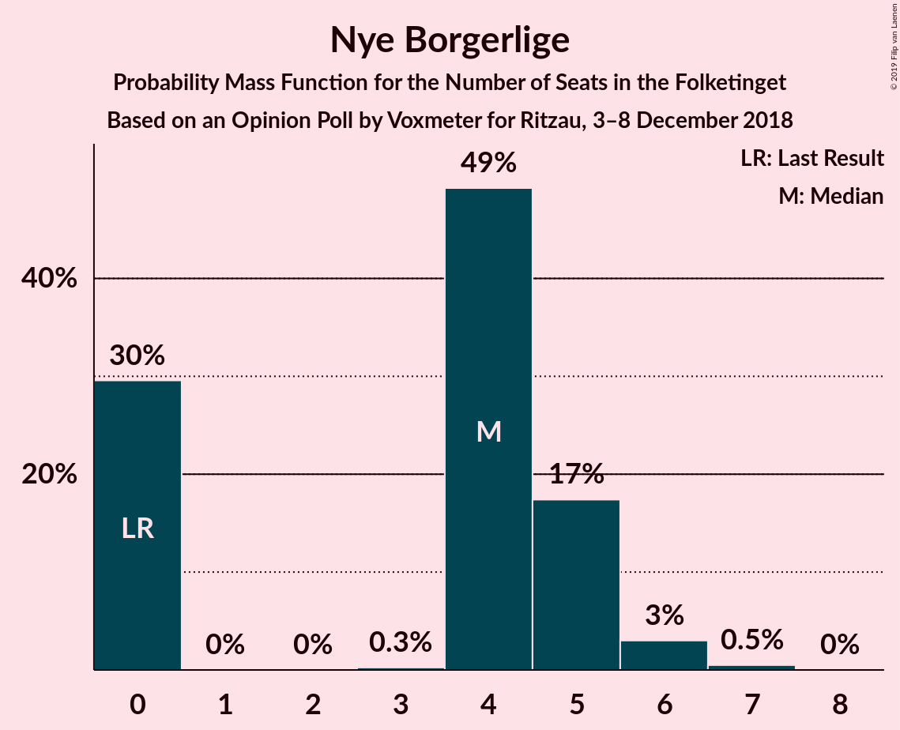

# Opinion Poll by Voxmeter for Ritzau, 3–8 December 2018

<a href="#voting-intentions">Voting Intentions</a> | <a href="#seats">Seats</a> | <a href="#coalitions">Coalitions</a> | <a href="#technical-information">Technical Information</a>

## Voting Intentions

### Confidence Intervals

| Party | Last Result | Poll Result | 80% Confidence Interval | 90% Confidence Interval | 95% Confidence Interval | 99% Confidence Interval |
|:-----:|:-----------:|:-----------:|:-----------------------:|:-----------------------:|:-----------------------:|:-----------------------:|
| Socialdemokraterne | 26.3% | 25.8% | 24.1–27.6% |23.6–28.1% |23.2–28.5% |22.4–29.4% |
| Dansk Folkeparti | 21.1% | 18.8% | 17.3–20.4% |16.9–20.9% |16.5–21.3% |15.8–22.1% |
| Venstre | 19.5% | 17.7% | 16.3–19.3% |15.9–19.8% |15.5–20.2% |14.8–20.9% |
| Enhedslisten–De Rød-Grønne | 7.8% | 9.3% | 8.2–10.5% |7.9–10.9% |7.7–11.2% |7.2–11.8% |
| Radikale Venstre | 4.6% | 6.6% | 5.7–7.7% |5.5–8.0% |5.3–8.3% |4.8–8.8% |
| Socialistisk Folkeparti | 4.2% | 5.7% | 4.9–6.8% |4.7–7.1% |4.5–7.3% |4.1–7.9% |
| Liberal Alliance | 7.5% | 4.6% | 3.9–5.5% |3.7–5.8% |3.5–6.1% |3.2–6.5% |
| Det Konservative Folkeparti | 3.4% | 4.2% | 3.5–5.1% |3.3–5.4% |3.2–5.6% |2.9–6.1% |
| Alternativet | 4.8% | 3.8% | 3.2–4.7% |3.0–5.0% |2.8–5.2% |2.5–5.6% |
| Nye Borgerlige | 0.0% | 2.2% | 1.7–2.9% |1.6–3.1% |1.5–3.3% |1.3–3.7% |
| Kristendemokraterne | 0.8% | 1.0% | 0.7–1.5% |0.6–1.6% |0.5–1.8% |0.4–2.0% |

*Note:* The poll result column reflects the actual value used in the calculations. Published results may vary slightly, and in addition be rounded to fewer digits.

## Seats

### Confidence Intervals

| Party | Last Result | Median | 80% Confidence Interval | 90% Confidence Interval | 95% Confidence Interval | 99% Confidence Interval |
|:-----:|:-----------:|:------:|:-----------------------:|:-----------------------:|:-----------------------:|:-----------------------:|
| <a href="#socialdemokraterne">Socialdemokraterne</a> | 47 | 45 | 43–49 |42–49 |41–51 |40–51 |
| <a href="#dansk-folkeparti">Dansk Folkeparti</a> | 37 | 33 | 30–37 |30–37 |30–38 |27–40 |
| <a href="#venstre">Venstre</a> | 34 | 32 | 29–34 |29–35 |27–35 |26–37 |
| <a href="#enhedslisten–de-rød-grønne">Enhedslisten–De Rød-Grønne</a> | 14 | 16 | 14–18 |14–19 |14–19 |13–21 |
| <a href="#radikale-venstre">Radikale Venstre</a> | 8 | 12 | 10–13 |9–14 |9–15 |8–17 |
| <a href="#socialistisk-folkeparti">Socialistisk Folkeparti</a> | 7 | 10 | 8–11 |8–13 |8–13 |7–13 |
| <a href="#liberal-alliance">Liberal Alliance</a> | 13 | 8 | 7–10 |7–11 |6–11 |6–11 |
| <a href="#det-konservative-folkeparti">Det Konservative Folkeparti</a> | 6 | 8 | 7–9 |6–9 |6–10 |5–11 |
| <a href="#alternativet">Alternativet</a> | 9 | 7 | 6–8 |5–9 |5–9 |5–10 |
| <a href="#nye-borgerlige">Nye Borgerlige</a> | 0 | 4 | 0–5 |0–5 |0–6 |0–7 |
| <a href="#kristendemokraterne">Kristendemokraterne</a> | 0 | 0 | 0 |0 |0 |0–4 |

### Socialdemokraterne

*For a full overview of the results for this party, see the [Socialdemokraterne](party-socialdemokraterne.html) page.*

| Number of Seats | Probability | Accumulated | Special Marks |
|:---------------:|:-----------:|:-----------:|:-------------:|
| 38 | 0.2% | 100% |  |
| 39 | 0.2% | 99.8% |  |
| 40 | 1.4% | 99.5% |  |
| 41 | 3% | 98% |  |
| 42 | 2% | 95% |  |
| 43 | 11% | 93% |  |
| 44 | 10% | 82% |  |
| 45 | 26% | 73% | Median |
| 46 | 8% | 47% |  |
| 47 | 11% | 38% | Last Result |
| 48 | 17% | 27% |  |
| 49 | 6% | 10% |  |
| 50 | 0.7% | 4% |  |
| 51 | 3% | 3% |  |
| 52 | 0.2% | 0.4% |  |
| 53 | 0.2% | 0.2% |  |
| 54 | 0% | 0% |  |

### Dansk Folkeparti

*For a full overview of the results for this party, see the [Dansk Folkeparti](party-danskfolkeparti.html) page.*

| Number of Seats | Probability | Accumulated | Special Marks |
|:---------------:|:-----------:|:-----------:|:-------------:|
| 27 | 0.5% | 100% |  |
| 28 | 0.3% | 99.5% |  |
| 29 | 1.4% | 99.1% |  |
| 30 | 9% | 98% |  |
| 31 | 13% | 89% |  |
| 32 | 6% | 75% |  |
| 33 | 27% | 69% | Median |
| 34 | 14% | 43% |  |
| 35 | 10% | 29% |  |
| 36 | 3% | 19% |  |
| 37 | 14% | 16% | Last Result |
| 38 | 1.5% | 3% |  |
| 39 | 0.2% | 1.0% |  |
| 40 | 0.8% | 0.8% |  |
| 41 | 0% | 0% |  |

### Venstre

*For a full overview of the results for this party, see the [Venstre](party-venstre.html) page.*

| Number of Seats | Probability | Accumulated | Special Marks |
|:---------------:|:-----------:|:-----------:|:-------------:|
| 25 | 0.1% | 100% |  |
| 26 | 0.8% | 99.9% |  |
| 27 | 2% | 99.1% |  |
| 28 | 2% | 97% |  |
| 29 | 7% | 95% |  |
| 30 | 8% | 88% |  |
| 31 | 16% | 80% |  |
| 32 | 39% | 64% | Median |
| 33 | 14% | 25% |  |
| 34 | 3% | 11% | Last Result |
| 35 | 7% | 8% |  |
| 36 | 0.5% | 2% |  |
| 37 | 0.8% | 1.1% |  |
| 38 | 0.2% | 0.2% |  |
| 39 | 0.1% | 0.1% |  |
| 40 | 0% | 0% |  |

### Enhedslisten–De Rød-Grønne

*For a full overview of the results for this party, see the [Enhedslisten–De Rød-Grønne](party-enhedslisten–derød-grønne.html) page.*

| Number of Seats | Probability | Accumulated | Special Marks |
|:---------------:|:-----------:|:-----------:|:-------------:|
| 12 | 0.2% | 100% |  |
| 13 | 2% | 99.8% |  |
| 14 | 20% | 98% | Last Result |
| 15 | 23% | 78% |  |
| 16 | 28% | 55% | Median |
| 17 | 8% | 27% |  |
| 18 | 13% | 20% |  |
| 19 | 4% | 6% |  |
| 20 | 0.4% | 2% |  |
| 21 | 2% | 2% |  |
| 22 | 0.2% | 0.2% |  |
| 23 | 0% | 0% |  |

### Radikale Venstre

*For a full overview of the results for this party, see the [Radikale Venstre](party-radikalevenstre.html) page.*

| Number of Seats | Probability | Accumulated | Special Marks |
|:---------------:|:-----------:|:-----------:|:-------------:|
| 8 | 1.0% | 100% | Last Result |
| 9 | 5% | 99.0% |  |
| 10 | 9% | 94% |  |
| 11 | 28% | 85% |  |
| 12 | 20% | 58% | Median |
| 13 | 30% | 38% |  |
| 14 | 4% | 7% |  |
| 15 | 1.2% | 3% |  |
| 16 | 0.8% | 2% |  |
| 17 | 1.1% | 1.1% |  |
| 18 | 0% | 0% |  |

### Socialistisk Folkeparti

*For a full overview of the results for this party, see the [Socialistisk Folkeparti](party-socialistiskfolkeparti.html) page.*

| Number of Seats | Probability | Accumulated | Special Marks |
|:---------------:|:-----------:|:-----------:|:-------------:|
| 7 | 0.7% | 100% | Last Result |
| 8 | 26% | 99.3% |  |
| 9 | 23% | 73% |  |
| 10 | 8% | 50% | Median |
| 11 | 32% | 42% |  |
| 12 | 4% | 10% |  |
| 13 | 6% | 6% |  |
| 14 | 0.2% | 0.5% |  |
| 15 | 0.2% | 0.3% |  |
| 16 | 0% | 0% |  |

### Liberal Alliance

*For a full overview of the results for this party, see the [Liberal Alliance](party-liberalalliance.html) page.*

| Number of Seats | Probability | Accumulated | Special Marks |
|:---------------:|:-----------:|:-----------:|:-------------:|
| 5 | 0.3% | 100% |  |
| 6 | 4% | 99.7% |  |
| 7 | 17% | 96% |  |
| 8 | 40% | 79% | Median |
| 9 | 29% | 39% |  |
| 10 | 5% | 10% |  |
| 11 | 5% | 5% |  |
| 12 | 0.4% | 0.5% |  |
| 13 | 0.1% | 0.1% | Last Result |
| 14 | 0% | 0% |  |

### Det Konservative Folkeparti

*For a full overview of the results for this party, see the [Det Konservative Folkeparti](party-detkonservativefolkeparti.html) page.*

| Number of Seats | Probability | Accumulated | Special Marks |
|:---------------:|:-----------:|:-----------:|:-------------:|
| 4 | 0.1% | 100% |  |
| 5 | 1.4% | 99.9% |  |
| 6 | 5% | 98% | Last Result |
| 7 | 8% | 94% |  |
| 8 | 56% | 85% | Median |
| 9 | 25% | 30% |  |
| 10 | 4% | 5% |  |
| 11 | 0.5% | 0.6% |  |
| 12 | 0.1% | 0.1% |  |
| 13 | 0% | 0% |  |

### Alternativet

*For a full overview of the results for this party, see the [Alternativet](party-alternativet.html) page.*

| Number of Seats | Probability | Accumulated | Special Marks |
|:---------------:|:-----------:|:-----------:|:-------------:|
| 4 | 0.4% | 100% |  |
| 5 | 7% | 99.6% |  |
| 6 | 21% | 93% |  |
| 7 | 38% | 72% | Median |
| 8 | 26% | 34% |  |
| 9 | 5% | 8% | Last Result |
| 10 | 2% | 2% |  |
| 11 | 0.1% | 0.1% |  |
| 12 | 0% | 0% |  |

### Nye Borgerlige

*For a full overview of the results for this party, see the [Nye Borgerlige](party-nyeborgerlige.html) page.*

| Number of Seats | Probability | Accumulated | Special Marks |
|:---------------:|:-----------:|:-----------:|:-------------:|
| 0 | 30% | 100% | Last Result |
| 1 | 0% | 70% |  |
| 2 | 0% | 70% |  |
| 3 | 0.3% | 70% |  |
| 4 | 49% | 70% | Median |
| 5 | 17% | 21% |  |
| 6 | 3% | 4% |  |
| 7 | 0.5% | 0.5% |  |
| 8 | 0% | 0% |  |

### Kristendemokraterne

*For a full overview of the results for this party, see the [Kristendemokraterne](party-kristendemokraterne.html) page.*

| Number of Seats | Probability | Accumulated | Special Marks |
|:---------------:|:-----------:|:-----------:|:-------------:|
| 0 | 99.4% | 100% | Last Result, Median |
| 1 | 0% | 0.6% |  |
| 2 | 0% | 0.6% |  |
| 3 | 0% | 0.6% |  |
| 4 | 0.6% | 0.6% |  |
| 5 | 0% | 0% |  |

## Coalitions

### Confidence Intervals

| Coalition | Last Result | Median | Majority? | 80% Confidence Interval | 90% Confidence Interval | 95% Confidence Interval | 99% Confidence Interval |
|:---------:|:-----------:|:------:|:---------:|:-----------------------:|:-----------------------:|:-----------------------:|:-----------------------:|
| Socialdemokraterne – Enhedslisten–De Rød-Grønne – Radikale Venstre – Socialistisk Folkeparti – Alternativet | 85 | 90 | 54% | 88–94 | 87–96 | 85–97 | 82–99 |
| Dansk Folkeparti – Venstre – Liberal Alliance – Det Konservative Folkeparti – Nye Borgerlige – Kristendemokraterne | 90 | 85 | 3% | 81–87 | 79–88 | 78–90 | 76–93 |
| Dansk Folkeparti – Venstre – Liberal Alliance – Det Konservative Folkeparti – Nye Borgerlige | 90 | 85 | 3% | 81–87 | 79–87 | 78–90 | 76–93 |
| Socialdemokraterne – Enhedslisten–De Rød-Grønne – Radikale Venstre – Socialistisk Folkeparti | 76 | 83 | 2% | 81–88 | 80–89 | 78–89 | 76–93 |
| Dansk Folkeparti – Venstre – Liberal Alliance – Det Konservative Folkeparti – Kristendemokraterne | 90 | 82 | 0.1% | 77–84 | 77–85 | 76–86 | 75–89 |
| Dansk Folkeparti – Venstre – Liberal Alliance – Det Konservative Folkeparti | 90 | 82 | 0.1% | 77–84 | 77–85 | 76–86 | 74–89 |
| Socialdemokraterne – Enhedslisten–De Rød-Grønne – Socialistisk Folkeparti – Alternativet | 77 | 79 | 0% | 76–82 | 75–84 | 74–85 | 71–86 |
| Socialdemokraterne – Enhedslisten–De Rød-Grønne – Socialistisk Folkeparti | 68 | 72 | 0% | 68–75 | 68–76 | 67–78 | 65–80 |
| Socialdemokraterne – Radikale Venstre – Socialistisk Folkeparti | 62 | 67 | 0% | 63–71 | 63–73 | 62–73 | 59–75 |
| Socialdemokraterne – Radikale Venstre | 55 | 58 | 0% | 54–61 | 54–62 | 52–62 | 49–64 |
| Venstre – Liberal Alliance – Det Konservative Folkeparti | 53 | 49 | 0% | 45–50 | 44–52 | 43–52 | 41–54 |
| Venstre – Det Konservative Folkeparti | 40 | 40 | 0% | 38–42 | 36–44 | 35–44 | 34–45 |
| Venstre | 34 | 32 | 0% | 29–34 | 29–35 | 27–35 | 26–37 |

### Socialdemokraterne – Enhedslisten–De Rød-Grønne – Radikale Venstre – Socialistisk Folkeparti – Alternativet

| Number of Seats | Probability | Accumulated | Special Marks |
|:---------------:|:-----------:|:-----------:|:-------------:|
| 82 | 0.9% | 100% |  |
| 83 | 0.1% | 99.1% |  |
| 84 | 1.4% | 99.0% |  |
| 85 | 0.9% | 98% | Last Result |
| 86 | 1.2% | 97% |  |
| 87 | 0.5% | 95% |  |
| 88 | 10% | 95% |  |
| 89 | 32% | 85% |  |
| 90 | 9% | 54% | Median, Majority |
| 91 | 23% | 44% |  |
| 92 | 3% | 21% |  |
| 93 | 3% | 18% |  |
| 94 | 8% | 15% |  |
| 95 | 2% | 7% |  |
| 96 | 2% | 5% |  |
| 97 | 2% | 3% |  |
| 98 | 0.3% | 1.0% |  |
| 99 | 0.7% | 0.7% |  |
| 100 | 0.1% | 0.1% |  |
| 101 | 0% | 0% |  |

### Dansk Folkeparti – Venstre – Liberal Alliance – Det Konservative Folkeparti – Nye Borgerlige – Kristendemokraterne

| Number of Seats | Probability | Accumulated | Special Marks |
|:---------------:|:-----------:|:-----------:|:-------------:|
| 75 | 0.1% | 100% |  |
| 76 | 0.7% | 99.9% |  |
| 77 | 0.3% | 99.3% |  |
| 78 | 2% | 99.0% |  |
| 79 | 2% | 97% |  |
| 80 | 2% | 95% |  |
| 81 | 8% | 93% |  |
| 82 | 3% | 85% |  |
| 83 | 3% | 82% |  |
| 84 | 23% | 79% |  |
| 85 | 9% | 56% | Median |
| 86 | 32% | 46% |  |
| 87 | 10% | 15% |  |
| 88 | 0.5% | 5% |  |
| 89 | 1.2% | 5% |  |
| 90 | 0.9% | 3% | Last Result, Majority |
| 91 | 1.4% | 2% |  |
| 92 | 0.1% | 1.0% |  |
| 93 | 0.9% | 0.9% |  |
| 94 | 0% | 0% |  |

### Dansk Folkeparti – Venstre – Liberal Alliance – Det Konservative Folkeparti – Nye Borgerlige

| Number of Seats | Probability | Accumulated | Special Marks |
|:---------------:|:-----------:|:-----------:|:-------------:|
| 75 | 0.1% | 100% |  |
| 76 | 0.7% | 99.9% |  |
| 77 | 0.3% | 99.2% |  |
| 78 | 2% | 98.9% |  |
| 79 | 2% | 97% |  |
| 80 | 2% | 95% |  |
| 81 | 8% | 93% |  |
| 82 | 3% | 85% |  |
| 83 | 3% | 82% |  |
| 84 | 23% | 79% |  |
| 85 | 10% | 56% | Median |
| 86 | 32% | 46% |  |
| 87 | 10% | 14% |  |
| 88 | 0.5% | 5% |  |
| 89 | 1.0% | 4% |  |
| 90 | 0.9% | 3% | Last Result, Majority |
| 91 | 1.4% | 2% |  |
| 92 | 0.1% | 1.0% |  |
| 93 | 0.9% | 0.9% |  |
| 94 | 0% | 0% |  |

### Socialdemokraterne – Enhedslisten–De Rød-Grønne – Radikale Venstre – Socialistisk Folkeparti

| Number of Seats | Probability | Accumulated | Special Marks |
|:---------------:|:-----------:|:-----------:|:-------------:|
| 76 | 2% | 100% | Last Result |
| 77 | 0.3% | 98% |  |
| 78 | 0.6% | 98% |  |
| 79 | 1.2% | 97% |  |
| 80 | 1.2% | 96% |  |
| 81 | 30% | 95% |  |
| 82 | 5% | 65% |  |
| 83 | 15% | 60% | Median |
| 84 | 25% | 45% |  |
| 85 | 3% | 20% |  |
| 86 | 2% | 17% |  |
| 87 | 3% | 15% |  |
| 88 | 5% | 12% |  |
| 89 | 5% | 7% |  |
| 90 | 0.4% | 2% | Majority |
| 91 | 0.3% | 1.1% |  |
| 92 | 0.2% | 0.8% |  |
| 93 | 0.6% | 0.6% |  |
| 94 | 0% | 0% |  |

### Dansk Folkeparti – Venstre – Liberal Alliance – Det Konservative Folkeparti – Kristendemokraterne

| Number of Seats | Probability | Accumulated | Special Marks |
|:---------------:|:-----------:|:-----------:|:-------------:|
| 72 | 0.1% | 100% |  |
| 73 | 0.2% | 99.8% |  |
| 74 | 0.1% | 99.6% |  |
| 75 | 2% | 99.5% |  |
| 76 | 2% | 98% |  |
| 77 | 6% | 96% |  |
| 78 | 5% | 89% |  |
| 79 | 5% | 85% |  |
| 80 | 6% | 80% |  |
| 81 | 6% | 73% | Median |
| 82 | 40% | 67% |  |
| 83 | 1.0% | 28% |  |
| 84 | 21% | 27% |  |
| 85 | 1.3% | 6% |  |
| 86 | 2% | 4% |  |
| 87 | 1.0% | 2% |  |
| 88 | 0.1% | 1.0% |  |
| 89 | 0.8% | 0.9% |  |
| 90 | 0% | 0.1% | Last Result, Majority |
| 91 | 0% | 0% |  |

### Dansk Folkeparti – Venstre – Liberal Alliance – Det Konservative Folkeparti

| Number of Seats | Probability | Accumulated | Special Marks |
|:---------------:|:-----------:|:-----------:|:-------------:|
| 72 | 0.1% | 100% |  |
| 73 | 0.2% | 99.8% |  |
| 74 | 0.1% | 99.6% |  |
| 75 | 2% | 99.4% |  |
| 76 | 2% | 98% |  |
| 77 | 6% | 96% |  |
| 78 | 5% | 89% |  |
| 79 | 5% | 85% |  |
| 80 | 6% | 79% |  |
| 81 | 6% | 73% | Median |
| 82 | 39% | 67% |  |
| 83 | 1.0% | 28% |  |
| 84 | 21% | 27% |  |
| 85 | 1.0% | 5% |  |
| 86 | 2% | 4% |  |
| 87 | 1.0% | 2% |  |
| 88 | 0.1% | 0.9% |  |
| 89 | 0.8% | 0.9% |  |
| 90 | 0% | 0.1% | Last Result, Majority |
| 91 | 0% | 0% |  |

### Socialdemokraterne – Enhedslisten–De Rød-Grønne – Socialistisk Folkeparti – Alternativet

| Number of Seats | Probability | Accumulated | Special Marks |
|:---------------:|:-----------:|:-----------:|:-------------:|
| 70 | 0% | 100% |  |
| 71 | 0.8% | 99.9% |  |
| 72 | 0.5% | 99.2% |  |
| 73 | 1.0% | 98.7% |  |
| 74 | 0.6% | 98% |  |
| 75 | 3% | 97% |  |
| 76 | 23% | 94% |  |
| 77 | 16% | 71% | Last Result |
| 78 | 5% | 56% | Median |
| 79 | 13% | 50% |  |
| 80 | 18% | 38% |  |
| 81 | 10% | 20% |  |
| 82 | 1.4% | 10% |  |
| 83 | 3% | 9% |  |
| 84 | 2% | 5% |  |
| 85 | 2% | 3% |  |
| 86 | 0.6% | 1.0% |  |
| 87 | 0.2% | 0.4% |  |
| 88 | 0.1% | 0.2% |  |
| 89 | 0% | 0.1% |  |
| 90 | 0% | 0% | Majority |

### Socialdemokraterne – Enhedslisten–De Rød-Grønne – Socialistisk Folkeparti

| Number of Seats | Probability | Accumulated | Special Marks |
|:---------------:|:-----------:|:-----------:|:-------------:|
| 64 | 0.1% | 100% |  |
| 65 | 0.8% | 99.8% |  |
| 66 | 0.5% | 99.1% |  |
| 67 | 2% | 98.6% |  |
| 68 | 23% | 97% | Last Result |
| 69 | 2% | 74% |  |
| 70 | 11% | 72% |  |
| 71 | 9% | 61% | Median |
| 72 | 13% | 52% |  |
| 73 | 21% | 39% |  |
| 74 | 5% | 18% |  |
| 75 | 4% | 13% |  |
| 76 | 5% | 9% |  |
| 77 | 1.0% | 4% |  |
| 78 | 0.7% | 3% |  |
| 79 | 1.3% | 2% |  |
| 80 | 0.5% | 0.8% |  |
| 81 | 0.3% | 0.3% |  |
| 82 | 0% | 0% |  |

### Socialdemokraterne – Radikale Venstre – Socialistisk Folkeparti

| Number of Seats | Probability | Accumulated | Special Marks |
|:---------------:|:-----------:|:-----------:|:-------------:|
| 58 | 0.1% | 100% |  |
| 59 | 1.0% | 99.9% |  |
| 60 | 0.3% | 99.0% |  |
| 61 | 1.0% | 98.7% |  |
| 62 | 1.2% | 98% | Last Result |
| 63 | 9% | 96% |  |
| 64 | 1.4% | 87% |  |
| 65 | 4% | 86% |  |
| 66 | 26% | 82% |  |
| 67 | 12% | 57% | Median |
| 68 | 11% | 44% |  |
| 69 | 4% | 33% |  |
| 70 | 18% | 29% |  |
| 71 | 3% | 11% |  |
| 72 | 1.2% | 8% |  |
| 73 | 5% | 7% |  |
| 74 | 2% | 2% |  |
| 75 | 0.5% | 0.7% |  |
| 76 | 0.1% | 0.2% |  |
| 77 | 0% | 0% |  |

### Socialdemokraterne – Radikale Venstre

| Number of Seats | Probability | Accumulated | Special Marks |
|:---------------:|:-----------:|:-----------:|:-------------:|
| 49 | 1.0% | 100% |  |
| 50 | 0.1% | 99.0% |  |
| 51 | 0.7% | 98.9% |  |
| 52 | 2% | 98% |  |
| 53 | 1.3% | 96% |  |
| 54 | 11% | 95% |  |
| 55 | 3% | 84% | Last Result |
| 56 | 12% | 81% |  |
| 57 | 6% | 69% | Median |
| 58 | 26% | 63% |  |
| 59 | 22% | 37% |  |
| 60 | 4% | 15% |  |
| 61 | 2% | 11% |  |
| 62 | 6% | 9% |  |
| 63 | 0.4% | 2% |  |
| 64 | 2% | 2% |  |
| 65 | 0.1% | 0.1% |  |
| 66 | 0% | 0.1% |  |
| 67 | 0% | 0% |  |

### Venstre – Liberal Alliance – Det Konservative Folkeparti

| Number of Seats | Probability | Accumulated | Special Marks |
|:---------------:|:-----------:|:-----------:|:-------------:|
| 40 | 0.1% | 100% |  |
| 41 | 0.8% | 99.9% |  |
| 42 | 0.5% | 99.1% |  |
| 43 | 3% | 98.6% |  |
| 44 | 1.3% | 96% |  |
| 45 | 5% | 95% |  |
| 46 | 7% | 90% |  |
| 47 | 16% | 83% |  |
| 48 | 14% | 66% | Median |
| 49 | 37% | 52% |  |
| 50 | 6% | 15% |  |
| 51 | 1.3% | 9% |  |
| 52 | 6% | 8% |  |
| 53 | 0.7% | 1.4% | Last Result |
| 54 | 0.3% | 0.7% |  |
| 55 | 0.4% | 0.4% |  |
| 56 | 0% | 0% |  |

### Venstre – Det Konservative Folkeparti

| Number of Seats | Probability | Accumulated | Special Marks |
|:---------------:|:-----------:|:-----------:|:-------------:|
| 32 | 0.1% | 100% |  |
| 33 | 0.3% | 99.9% |  |
| 34 | 2% | 99.6% |  |
| 35 | 2% | 98% |  |
| 36 | 3% | 96% |  |
| 37 | 2% | 93% |  |
| 38 | 11% | 91% |  |
| 39 | 17% | 80% |  |
| 40 | 29% | 62% | Last Result, Median |
| 41 | 18% | 33% |  |
| 42 | 7% | 15% |  |
| 43 | 1.1% | 8% |  |
| 44 | 6% | 7% |  |
| 45 | 0.5% | 0.7% |  |
| 46 | 0.1% | 0.3% |  |
| 47 | 0% | 0.1% |  |
| 48 | 0.1% | 0.1% |  |
| 49 | 0% | 0% |  |

### Venstre

| Number of Seats | Probability | Accumulated | Special Marks |
|:---------------:|:-----------:|:-----------:|:-------------:|
| 25 | 0.1% | 100% |  |
| 26 | 0.8% | 99.9% |  |
| 27 | 2% | 99.1% |  |
| 28 | 2% | 97% |  |
| 29 | 7% | 95% |  |
| 30 | 8% | 88% |  |
| 31 | 16% | 80% |  |
| 32 | 39% | 64% | Median |
| 33 | 14% | 25% |  |
| 34 | 3% | 11% | Last Result |
| 35 | 7% | 8% |  |
| 36 | 0.5% | 2% |  |
| 37 | 0.8% | 1.1% |  |
| 38 | 0.2% | 0.2% |  |
| 39 | 0.1% | 0.1% |  |
| 40 | 0% | 0% |  |

## Technical Information

### Opinion Poll

+ **Polling firm:** Voxmeter
+ **Commissioner(s):** Ritzau
+ **Fieldwork period:** 3–8 December 2018

### Calculations

+ **Sample size:** 1044
+ **Simulations done:** 1,048,576
+ **Error estimate:** 1.54%

