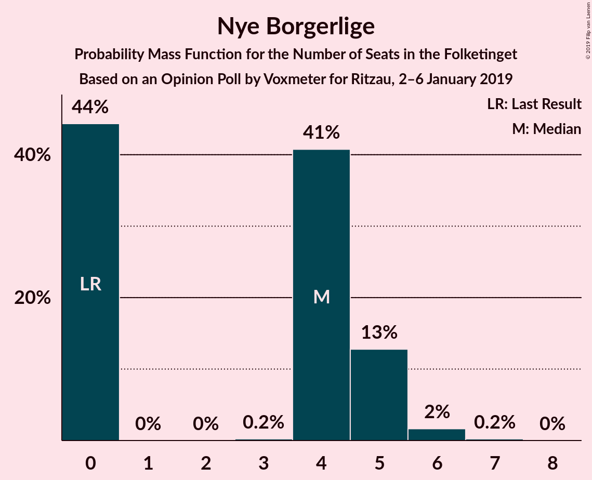

# Opinion Poll by Voxmeter for Ritzau, 2–6 January 2019

<a href="#voting-intentions">Voting Intentions</a> | <a href="#seats">Seats</a> | <a href="#coalitions">Coalitions</a> | <a href="#technical-information">Technical Information</a>

## Voting Intentions

### Confidence Intervals

| Party | Last Result | Poll Result | 80% Confidence Interval | 90% Confidence Interval | 95% Confidence Interval | 99% Confidence Interval |
|:-----:|:-----------:|:-----------:|:-----------------------:|:-----------------------:|:-----------------------:|:-----------------------:|
| Socialdemokraterne | 26.3% | 25.8% | 24.1–27.6% |23.6–28.1% |23.2–28.5% |22.4–29.4% |
| Venstre | 19.5% | 19.1% | 17.6–20.7% |17.2–21.2% |16.8–21.6% |16.1–22.4% |
| Dansk Folkeparti | 21.1% | 17.7% | 16.2–19.3% |15.8–19.7% |15.5–20.1% |14.8–20.9% |
| Enhedslisten–De Rød-Grønne | 7.8% | 9.6% | 8.6–10.9% |8.2–11.3% |8.0–11.6% |7.5–12.2% |
| Radikale Venstre | 4.6% | 6.6% | 5.7–7.7% |5.4–8.0% |5.2–8.3% |4.8–8.8% |
| Liberal Alliance | 7.5% | 5.2% | 4.4–6.1% |4.1–6.4% |4.0–6.7% |3.6–7.2% |
| Socialistisk Folkeparti | 4.2% | 5.0% | 4.2–5.9% |4.0–6.2% |3.8–6.5% |3.5–7.0% |
| Det Konservative Folkeparti | 3.4% | 4.3% | 3.6–5.2% |3.4–5.5% |3.2–5.7% |2.9–6.2% |
| Alternativet | 4.8% | 3.7% | 3.1–4.6% |2.9–4.8% |2.7–5.1% |2.5–5.5% |
| Nye Borgerlige | 0.0% | 2.1% | 1.6–2.8% |1.5–3.0% |1.4–3.2% |1.2–3.5% |
| Kristendemokraterne | 0.8% | 0.8% | 0.5–1.2% |0.4–1.4% |0.4–1.5% |0.3–1.8% |

*Note:* The poll result column reflects the actual value used in the calculations. Published results may vary slightly, and in addition be rounded to fewer digits.

## Seats

### Confidence Intervals

| Party | Last Result | Median | 80% Confidence Interval | 90% Confidence Interval | 95% Confidence Interval | 99% Confidence Interval |
|:-----:|:-----------:|:------:|:-----------------------:|:-----------------------:|:-----------------------:|:-----------------------:|
| <a href="#socialdemokraterne">Socialdemokraterne</a> | 47 | 45 | 42–48 |42–50 |41–51 |39–53 |
| <a href="#venstre">Venstre</a> | 34 | 32 | 30–38 |30–39 |30–39 |28–39 |
| <a href="#dansk-folkeparti">Dansk Folkeparti</a> | 37 | 31 | 28–34 |27–35 |26–36 |25–37 |
| <a href="#enhedslisten–de-rød-grønne">Enhedslisten–De Rød-Grønne</a> | 14 | 17 | 16–19 |14–20 |14–20 |13–22 |
| <a href="#radikale-venstre">Radikale Venstre</a> | 8 | 12 | 10–13 |10–14 |9–15 |8–15 |
| <a href="#liberal-alliance">Liberal Alliance</a> | 13 | 9 | 7–11 |7–11 |7–12 |6–13 |
| <a href="#socialistisk-folkeparti">Socialistisk Folkeparti</a> | 7 | 9 | 8–10 |7–11 |6–11 |6–12 |
| <a href="#det-konservative-folkeparti">Det Konservative Folkeparti</a> | 6 | 8 | 6–9 |6–9 |6–10 |5–11 |
| <a href="#alternativet">Alternativet</a> | 9 | 7 | 6–9 |5–9 |5–9 |4–10 |
| <a href="#nye-borgerlige">Nye Borgerlige</a> | 0 | 4 | 0–5 |0–5 |0–5 |0–6 |
| <a href="#kristendemokraterne">Kristendemokraterne</a> | 0 | 0 | 0 |0 |0 |0 |

### Socialdemokraterne

*For a full overview of the results for this party, see the [Socialdemokraterne](party-socialdemokraterne.html) page.*

| Number of Seats | Probability | Accumulated | Special Marks |
|:---------------:|:-----------:|:-----------:|:-------------:|
| 38 | 0.2% | 100% |  |
| 39 | 0.4% | 99.8% |  |
| 40 | 0.3% | 99.4% |  |
| 41 | 3% | 99.1% |  |
| 42 | 7% | 96% |  |
| 43 | 6% | 89% |  |
| 44 | 8% | 83% |  |
| 45 | 46% | 75% | Median |
| 46 | 8% | 30% |  |
| 47 | 11% | 22% | Last Result |
| 48 | 3% | 11% |  |
| 49 | 2% | 8% |  |
| 50 | 3% | 6% |  |
| 51 | 1.5% | 3% |  |
| 52 | 0.4% | 1.1% |  |
| 53 | 0.3% | 0.7% |  |
| 54 | 0.4% | 0.4% |  |
| 55 | 0% | 0% |  |

### Venstre

*For a full overview of the results for this party, see the [Venstre](party-venstre.html) page.*

| Number of Seats | Probability | Accumulated | Special Marks |
|:---------------:|:-----------:|:-----------:|:-------------:|
| 26 | 0.1% | 100% |  |
| 27 | 0% | 99.9% |  |
| 28 | 0.7% | 99.9% |  |
| 29 | 1.0% | 99.2% |  |
| 30 | 23% | 98% |  |
| 31 | 5% | 75% |  |
| 32 | 22% | 71% | Median |
| 33 | 8% | 49% |  |
| 34 | 14% | 41% | Last Result |
| 35 | 6% | 27% |  |
| 36 | 7% | 20% |  |
| 37 | 2% | 13% |  |
| 38 | 4% | 11% |  |
| 39 | 6% | 7% |  |
| 40 | 0.3% | 0.5% |  |
| 41 | 0.1% | 0.1% |  |
| 42 | 0% | 0% |  |

### Dansk Folkeparti

*For a full overview of the results for this party, see the [Dansk Folkeparti](party-danskfolkeparti.html) page.*

| Number of Seats | Probability | Accumulated | Special Marks |
|:---------------:|:-----------:|:-----------:|:-------------:|
| 25 | 0.9% | 100% |  |
| 26 | 3% | 99.1% |  |
| 27 | 3% | 97% |  |
| 28 | 4% | 94% |  |
| 29 | 5% | 90% |  |
| 30 | 14% | 85% |  |
| 31 | 22% | 70% | Median |
| 32 | 16% | 48% |  |
| 33 | 5% | 33% |  |
| 34 | 20% | 28% |  |
| 35 | 4% | 7% |  |
| 36 | 1.4% | 3% |  |
| 37 | 2% | 2% | Last Result |
| 38 | 0.1% | 0.1% |  |
| 39 | 0.1% | 0.1% |  |
| 40 | 0% | 0% |  |

### Enhedslisten–De Rød-Grønne

*For a full overview of the results for this party, see the [Enhedslisten–De Rød-Grønne](party-enhedslisten–derød-grønne.html) page.*

| Number of Seats | Probability | Accumulated | Special Marks |
|:---------------:|:-----------:|:-----------:|:-------------:|
| 12 | 0% | 100% |  |
| 13 | 0.8% | 99.9% |  |
| 14 | 6% | 99.1% | Last Result |
| 15 | 3% | 93% |  |
| 16 | 15% | 90% |  |
| 17 | 33% | 75% | Median |
| 18 | 27% | 42% |  |
| 19 | 8% | 15% |  |
| 20 | 4% | 6% |  |
| 21 | 2% | 2% |  |
| 22 | 0.5% | 0.6% |  |
| 23 | 0% | 0.1% |  |
| 24 | 0% | 0% |  |

### Radikale Venstre

*For a full overview of the results for this party, see the [Radikale Venstre](party-radikalevenstre.html) page.*

| Number of Seats | Probability | Accumulated | Special Marks |
|:---------------:|:-----------:|:-----------:|:-------------:|
| 8 | 0.5% | 100% | Last Result |
| 9 | 3% | 99.4% |  |
| 10 | 7% | 96% |  |
| 11 | 36% | 89% |  |
| 12 | 30% | 53% | Median |
| 13 | 15% | 23% |  |
| 14 | 4% | 8% |  |
| 15 | 3% | 3% |  |
| 16 | 0.1% | 0.2% |  |
| 17 | 0.1% | 0.1% |  |
| 18 | 0% | 0% |  |

### Liberal Alliance

*For a full overview of the results for this party, see the [Liberal Alliance](party-liberalalliance.html) page.*

| Number of Seats | Probability | Accumulated | Special Marks |
|:---------------:|:-----------:|:-----------:|:-------------:|
| 5 | 0.1% | 100% |  |
| 6 | 1.0% | 99.9% |  |
| 7 | 12% | 98.9% |  |
| 8 | 9% | 87% |  |
| 9 | 31% | 78% | Median |
| 10 | 19% | 47% |  |
| 11 | 24% | 28% |  |
| 12 | 3% | 5% |  |
| 13 | 1.1% | 1.2% | Last Result |
| 14 | 0.1% | 0.1% |  |
| 15 | 0% | 0% |  |

### Socialistisk Folkeparti

*For a full overview of the results for this party, see the [Socialistisk Folkeparti](party-socialistiskfolkeparti.html) page.*

| Number of Seats | Probability | Accumulated | Special Marks |
|:---------------:|:-----------:|:-----------:|:-------------:|
| 6 | 3% | 100% |  |
| 7 | 7% | 97% | Last Result |
| 8 | 16% | 90% |  |
| 9 | 31% | 74% | Median |
| 10 | 32% | 42% |  |
| 11 | 8% | 10% |  |
| 12 | 1.1% | 2% |  |
| 13 | 0.5% | 0.5% |  |
| 14 | 0% | 0% |  |

### Det Konservative Folkeparti

*For a full overview of the results for this party, see the [Det Konservative Folkeparti](party-detkonservativefolkeparti.html) page.*

| Number of Seats | Probability | Accumulated | Special Marks |
|:---------------:|:-----------:|:-----------:|:-------------:|
| 4 | 0.1% | 100% |  |
| 5 | 2% | 99.9% |  |
| 6 | 26% | 98% | Last Result |
| 7 | 9% | 72% |  |
| 8 | 16% | 63% | Median |
| 9 | 43% | 47% |  |
| 10 | 2% | 4% |  |
| 11 | 2% | 2% |  |
| 12 | 0.1% | 0.1% |  |
| 13 | 0% | 0% |  |

### Alternativet

*For a full overview of the results for this party, see the [Alternativet](party-alternativet.html) page.*

| Number of Seats | Probability | Accumulated | Special Marks |
|:---------------:|:-----------:|:-----------:|:-------------:|
| 4 | 1.5% | 100% |  |
| 5 | 6% | 98.5% |  |
| 6 | 21% | 93% |  |
| 7 | 27% | 72% | Median |
| 8 | 25% | 45% |  |
| 9 | 19% | 20% | Last Result |
| 10 | 0.4% | 0.6% |  |
| 11 | 0.2% | 0.2% |  |
| 12 | 0% | 0% |  |

### Nye Borgerlige

*For a full overview of the results for this party, see the [Nye Borgerlige](party-nyeborgerlige.html) page.*

| Number of Seats | Probability | Accumulated | Special Marks |
|:---------------:|:-----------:|:-----------:|:-------------:|
| 0 | 44% | 100% | Last Result |
| 1 | 0% | 56% |  |
| 2 | 0% | 56% |  |
| 3 | 0.2% | 56% |  |
| 4 | 41% | 55% | Median |
| 5 | 13% | 15% |  |
| 6 | 2% | 2% |  |
| 7 | 0.2% | 0.2% |  |
| 8 | 0% | 0% |  |

### Kristendemokraterne

*For a full overview of the results for this party, see the [Kristendemokraterne](party-kristendemokraterne.html) page.*

| Number of Seats | Probability | Accumulated | Special Marks |
|:---------------:|:-----------:|:-----------:|:-------------:|
| 0 | 99.9% | 100% | Last Result, Median |
| 1 | 0% | 0.1% |  |
| 2 | 0% | 0.1% |  |
| 3 | 0% | 0.1% |  |
| 4 | 0.1% | 0.1% |  |
| 5 | 0% | 0% |  |

## Coalitions

### Confidence Intervals

| Coalition | Last Result | Median | Majority? | 80% Confidence Interval | 90% Confidence Interval | 95% Confidence Interval | 99% Confidence Interval |
|:---------:|:-----------:|:------:|:---------:|:-----------------------:|:-----------------------:|:-----------------------:|:-----------------------:|
| Socialdemokraterne – Enhedslisten–De Rød-Grønne – Radikale Venstre – Socialistisk Folkeparti – Alternativet | 85 | 92 | 73% | 85–94 | 85–95 | 85–96 | 83–97 |
| Venstre – Dansk Folkeparti – Liberal Alliance – Det Konservative Folkeparti – Nye Borgerlige – Kristendemokraterne | 90 | 83 | 11% | 81–90 | 80–90 | 79–90 | 78–92 |
| Venstre – Dansk Folkeparti – Liberal Alliance – Det Konservative Folkeparti – Nye Borgerlige | 90 | 83 | 11% | 81–90 | 80–90 | 79–90 | 78–92 |
| Socialdemokraterne – Enhedslisten–De Rød-Grønne – Radikale Venstre – Socialistisk Folkeparti | 76 | 83 | 2% | 79–87 | 79–89 | 78–89 | 77–91 |
| Venstre – Dansk Folkeparti – Liberal Alliance – Det Konservative Folkeparti – Kristendemokraterne | 90 | 83 | 0.8% | 79–85 | 77–86 | 77–88 | 75–90 |
| Venstre – Dansk Folkeparti – Liberal Alliance – Det Konservative Folkeparti | 90 | 83 | 0.8% | 79–85 | 77–86 | 77–88 | 75–90 |
| Socialdemokraterne – Enhedslisten–De Rød-Grønne – Socialistisk Folkeparti – Alternativet | 77 | 80 | 0% | 74–82 | 73–83 | 73–85 | 71–86 |
| Socialdemokraterne – Enhedslisten–De Rød-Grønne – Socialistisk Folkeparti | 68 | 72 | 0% | 68–75 | 67–76 | 66–78 | 65–80 |
| Socialdemokraterne – Radikale Venstre – Socialistisk Folkeparti | 62 | 66 | 0% | 63–70 | 62–71 | 62–72 | 60–73 |
| Socialdemokraterne – Radikale Venstre | 55 | 56 | 0% | 55–60 | 54–62 | 53–63 | 51–64 |
| Venstre – Liberal Alliance – Det Konservative Folkeparti | 53 | 52 | 0% | 45–55 | 45–55 | 45–55 | 44–58 |
| Venstre – Det Konservative Folkeparti | 40 | 41 | 0% | 36–45 | 36–48 | 36–48 | 35–48 |
| Venstre | 34 | 32 | 0% | 30–38 | 30–39 | 30–39 | 28–39 |

### Socialdemokraterne – Enhedslisten–De Rød-Grønne – Radikale Venstre – Socialistisk Folkeparti – Alternativet

| Number of Seats | Probability | Accumulated | Special Marks |
|:---------------:|:-----------:|:-----------:|:-------------:|
| 81 | 0% | 100% |  |
| 82 | 0.1% | 99.9% |  |
| 83 | 0.4% | 99.8% |  |
| 84 | 0.7% | 99.4% |  |
| 85 | 9% | 98.7% | Last Result |
| 86 | 2% | 89% |  |
| 87 | 5% | 88% |  |
| 88 | 6% | 83% |  |
| 89 | 4% | 77% |  |
| 90 | 12% | 73% | Median, Majority |
| 91 | 9% | 61% |  |
| 92 | 37% | 52% |  |
| 93 | 2% | 15% |  |
| 94 | 5% | 12% |  |
| 95 | 3% | 8% |  |
| 96 | 2% | 4% |  |
| 97 | 2% | 2% |  |
| 98 | 0.2% | 0.5% |  |
| 99 | 0.2% | 0.2% |  |
| 100 | 0% | 0% |  |

### Venstre – Dansk Folkeparti – Liberal Alliance – Det Konservative Folkeparti – Nye Borgerlige – Kristendemokraterne

| Number of Seats | Probability | Accumulated | Special Marks |
|:---------------:|:-----------:|:-----------:|:-------------:|
| 76 | 0.2% | 100% |  |
| 77 | 0.2% | 99.8% |  |
| 78 | 2% | 99.5% |  |
| 79 | 2% | 98% |  |
| 80 | 3% | 96% |  |
| 81 | 5% | 92% |  |
| 82 | 2% | 88% |  |
| 83 | 37% | 85% |  |
| 84 | 9% | 48% | Median |
| 85 | 12% | 39% |  |
| 86 | 4% | 27% |  |
| 87 | 6% | 23% |  |
| 88 | 5% | 17% |  |
| 89 | 2% | 12% |  |
| 90 | 9% | 11% | Last Result, Majority |
| 91 | 0.7% | 1.3% |  |
| 92 | 0.4% | 0.6% |  |
| 93 | 0.1% | 0.2% |  |
| 94 | 0% | 0.1% |  |
| 95 | 0% | 0% |  |

### Venstre – Dansk Folkeparti – Liberal Alliance – Det Konservative Folkeparti – Nye Borgerlige

| Number of Seats | Probability | Accumulated | Special Marks |
|:---------------:|:-----------:|:-----------:|:-------------:|
| 76 | 0.2% | 100% |  |
| 77 | 0.2% | 99.8% |  |
| 78 | 2% | 99.5% |  |
| 79 | 2% | 98% |  |
| 80 | 3% | 96% |  |
| 81 | 5% | 92% |  |
| 82 | 2% | 88% |  |
| 83 | 37% | 85% |  |
| 84 | 9% | 48% | Median |
| 85 | 12% | 39% |  |
| 86 | 4% | 27% |  |
| 87 | 6% | 23% |  |
| 88 | 5% | 17% |  |
| 89 | 2% | 12% |  |
| 90 | 9% | 11% | Last Result, Majority |
| 91 | 0.7% | 1.3% |  |
| 92 | 0.4% | 0.6% |  |
| 93 | 0.1% | 0.2% |  |
| 94 | 0% | 0.1% |  |
| 95 | 0% | 0% |  |

### Socialdemokraterne – Enhedslisten–De Rød-Grønne – Radikale Venstre – Socialistisk Folkeparti

| Number of Seats | Probability | Accumulated | Special Marks |
|:---------------:|:-----------:|:-----------:|:-------------:|
| 74 | 0% | 100% |  |
| 75 | 0.1% | 99.9% |  |
| 76 | 0.2% | 99.9% | Last Result |
| 77 | 1.4% | 99.7% |  |
| 78 | 3% | 98% |  |
| 79 | 8% | 96% |  |
| 80 | 5% | 88% |  |
| 81 | 6% | 84% |  |
| 82 | 4% | 77% |  |
| 83 | 26% | 74% | Median |
| 84 | 24% | 47% |  |
| 85 | 6% | 24% |  |
| 86 | 7% | 18% |  |
| 87 | 2% | 11% |  |
| 88 | 2% | 9% |  |
| 89 | 5% | 7% |  |
| 90 | 2% | 2% | Majority |
| 91 | 0.4% | 0.7% |  |
| 92 | 0.1% | 0.3% |  |
| 93 | 0.2% | 0.2% |  |
| 94 | 0% | 0% |  |

### Venstre – Dansk Folkeparti – Liberal Alliance – Det Konservative Folkeparti – Kristendemokraterne

| Number of Seats | Probability | Accumulated | Special Marks |
|:---------------:|:-----------:|:-----------:|:-------------:|
| 72 | 0% | 100% |  |
| 73 | 0.1% | 99.9% |  |
| 74 | 0.1% | 99.9% |  |
| 75 | 0.7% | 99.8% |  |
| 76 | 2% | 99.1% |  |
| 77 | 4% | 98% |  |
| 78 | 3% | 94% |  |
| 79 | 21% | 90% |  |
| 80 | 6% | 69% | Median |
| 81 | 4% | 63% |  |
| 82 | 5% | 58% |  |
| 83 | 21% | 53% |  |
| 84 | 9% | 32% |  |
| 85 | 14% | 23% |  |
| 86 | 5% | 9% |  |
| 87 | 0.8% | 4% |  |
| 88 | 2% | 3% |  |
| 89 | 0.1% | 0.9% |  |
| 90 | 0.5% | 0.8% | Last Result, Majority |
| 91 | 0.2% | 0.3% |  |
| 92 | 0.1% | 0.1% |  |
| 93 | 0% | 0% |  |

### Venstre – Dansk Folkeparti – Liberal Alliance – Det Konservative Folkeparti

| Number of Seats | Probability | Accumulated | Special Marks |
|:---------------:|:-----------:|:-----------:|:-------------:|
| 72 | 0% | 100% |  |
| 73 | 0.1% | 99.9% |  |
| 74 | 0.1% | 99.9% |  |
| 75 | 0.7% | 99.8% |  |
| 76 | 2% | 99.1% |  |
| 77 | 4% | 98% |  |
| 78 | 3% | 94% |  |
| 79 | 21% | 90% |  |
| 80 | 6% | 69% | Median |
| 81 | 4% | 63% |  |
| 82 | 5% | 58% |  |
| 83 | 21% | 53% |  |
| 84 | 9% | 32% |  |
| 85 | 14% | 23% |  |
| 86 | 5% | 9% |  |
| 87 | 0.8% | 4% |  |
| 88 | 2% | 3% |  |
| 89 | 0.1% | 0.9% |  |
| 90 | 0.5% | 0.8% | Last Result, Majority |
| 91 | 0.2% | 0.3% |  |
| 92 | 0.1% | 0.1% |  |
| 93 | 0% | 0% |  |

### Socialdemokraterne – Enhedslisten–De Rød-Grønne – Socialistisk Folkeparti – Alternativet

| Number of Seats | Probability | Accumulated | Special Marks |
|:---------------:|:-----------:|:-----------:|:-------------:|
| 69 | 0% | 100% |  |
| 70 | 0% | 99.9% |  |
| 71 | 0.4% | 99.9% |  |
| 72 | 1.2% | 99.5% |  |
| 73 | 5% | 98% |  |
| 74 | 6% | 93% |  |
| 75 | 3% | 87% |  |
| 76 | 1.2% | 84% |  |
| 77 | 9% | 83% | Last Result |
| 78 | 7% | 73% | Median |
| 79 | 15% | 67% |  |
| 80 | 23% | 52% |  |
| 81 | 18% | 29% |  |
| 82 | 5% | 11% |  |
| 83 | 2% | 6% |  |
| 84 | 1.4% | 4% |  |
| 85 | 2% | 3% |  |
| 86 | 1.0% | 1.5% |  |
| 87 | 0.5% | 0.5% |  |
| 88 | 0% | 0% |  |

### Socialdemokraterne – Enhedslisten–De Rød-Grønne – Socialistisk Folkeparti

| Number of Seats | Probability | Accumulated | Special Marks |
|:---------------:|:-----------:|:-----------:|:-------------:|
| 63 | 0.1% | 100% |  |
| 64 | 0.1% | 99.9% |  |
| 65 | 0.4% | 99.8% |  |
| 66 | 3% | 99.4% |  |
| 67 | 4% | 96% |  |
| 68 | 7% | 92% | Last Result |
| 69 | 2% | 84% |  |
| 70 | 7% | 82% |  |
| 71 | 8% | 75% | Median |
| 72 | 46% | 67% |  |
| 73 | 4% | 21% |  |
| 74 | 6% | 17% |  |
| 75 | 2% | 11% |  |
| 76 | 4% | 9% |  |
| 77 | 2% | 4% |  |
| 78 | 0.7% | 3% |  |
| 79 | 1.4% | 2% |  |
| 80 | 0.7% | 0.7% |  |
| 81 | 0% | 0% |  |

### Socialdemokraterne – Radikale Venstre – Socialistisk Folkeparti

| Number of Seats | Probability | Accumulated | Special Marks |
|:---------------:|:-----------:|:-----------:|:-------------:|
| 57 | 0% | 100% |  |
| 58 | 0.2% | 99.9% |  |
| 59 | 0.2% | 99.8% |  |
| 60 | 0.3% | 99.5% |  |
| 61 | 0.7% | 99.2% |  |
| 62 | 6% | 98.5% | Last Result |
| 63 | 11% | 93% |  |
| 64 | 6% | 82% |  |
| 65 | 22% | 75% |  |
| 66 | 10% | 54% | Median |
| 67 | 21% | 44% |  |
| 68 | 2% | 22% |  |
| 69 | 7% | 21% |  |
| 70 | 7% | 13% |  |
| 71 | 3% | 6% |  |
| 72 | 2% | 3% |  |
| 73 | 0.9% | 1.1% |  |
| 74 | 0.1% | 0.2% |  |
| 75 | 0% | 0.1% |  |
| 76 | 0% | 0.1% |  |
| 77 | 0% | 0% |  |

### Socialdemokraterne – Radikale Venstre

| Number of Seats | Probability | Accumulated | Special Marks |
|:---------------:|:-----------:|:-----------:|:-------------:|
| 49 | 0.3% | 100% |  |
| 50 | 0.1% | 99.7% |  |
| 51 | 0.4% | 99.6% |  |
| 52 | 0.8% | 99.2% |  |
| 53 | 3% | 98% |  |
| 54 | 4% | 96% |  |
| 55 | 13% | 91% | Last Result |
| 56 | 30% | 79% |  |
| 57 | 23% | 48% | Median |
| 58 | 6% | 26% |  |
| 59 | 3% | 20% |  |
| 60 | 7% | 17% |  |
| 61 | 2% | 10% |  |
| 62 | 5% | 8% |  |
| 63 | 3% | 4% |  |
| 64 | 0.5% | 0.7% |  |
| 65 | 0.2% | 0.3% |  |
| 66 | 0.1% | 0.1% |  |
| 67 | 0% | 0% |  |

### Venstre – Liberal Alliance – Det Konservative Folkeparti

| Number of Seats | Probability | Accumulated | Special Marks |
|:---------------:|:-----------:|:-----------:|:-------------:|
| 43 | 0% | 100% |  |
| 44 | 0.5% | 99.9% |  |
| 45 | 19% | 99.4% |  |
| 46 | 2% | 81% |  |
| 47 | 5% | 79% |  |
| 48 | 4% | 74% |  |
| 49 | 5% | 69% | Median |
| 50 | 2% | 65% |  |
| 51 | 11% | 63% |  |
| 52 | 24% | 52% |  |
| 53 | 9% | 28% | Last Result |
| 54 | 8% | 19% |  |
| 55 | 9% | 11% |  |
| 56 | 1.1% | 2% |  |
| 57 | 0.4% | 1.0% |  |
| 58 | 0.3% | 0.6% |  |
| 59 | 0.1% | 0.3% |  |
| 60 | 0% | 0.1% |  |
| 61 | 0.1% | 0.1% |  |
| 62 | 0% | 0% |  |

### Venstre – Det Konservative Folkeparti

| Number of Seats | Probability | Accumulated | Special Marks |
|:---------------:|:-----------:|:-----------:|:-------------:|
| 34 | 0.4% | 100% |  |
| 35 | 0.2% | 99.6% |  |
| 36 | 18% | 99.3% |  |
| 37 | 2% | 81% |  |
| 38 | 2% | 79% |  |
| 39 | 8% | 77% |  |
| 40 | 7% | 70% | Last Result, Median |
| 41 | 20% | 63% |  |
| 42 | 11% | 42% |  |
| 43 | 10% | 31% |  |
| 44 | 9% | 21% |  |
| 45 | 3% | 11% |  |
| 46 | 0.9% | 8% |  |
| 47 | 0.7% | 7% |  |
| 48 | 6% | 7% |  |
| 49 | 0.4% | 0.4% |  |
| 50 | 0% | 0% |  |

### Venstre

| Number of Seats | Probability | Accumulated | Special Marks |
|:---------------:|:-----------:|:-----------:|:-------------:|
| 26 | 0.1% | 100% |  |
| 27 | 0% | 99.9% |  |
| 28 | 0.7% | 99.9% |  |
| 29 | 1.0% | 99.2% |  |
| 30 | 23% | 98% |  |
| 31 | 5% | 75% |  |
| 32 | 22% | 71% | Median |
| 33 | 8% | 49% |  |
| 34 | 14% | 41% | Last Result |
| 35 | 6% | 27% |  |
| 36 | 7% | 20% |  |
| 37 | 2% | 13% |  |
| 38 | 4% | 11% |  |
| 39 | 6% | 7% |  |
| 40 | 0.3% | 0.5% |  |
| 41 | 0.1% | 0.1% |  |
| 42 | 0% | 0% |  |

## Technical Information

### Opinion Poll

+ **Polling firm:** Voxmeter
+ **Commissioner(s):** Ritzau
+ **Fieldwork period:** 2–6 January 2019

### Calculations

+ **Sample size:** 1048
+ **Simulations done:** 1,048,576
+ **Error estimate:** 4.31%

