# Opinion Poll by Epinion for DR, 14–21 January 2019

<a href="#voting-intentions">Voting Intentions</a> | <a href="#seats">Seats</a> | <a href="#coalitions">Coalitions</a> | <a href="#technical-information">Technical Information</a>

## Voting Intentions

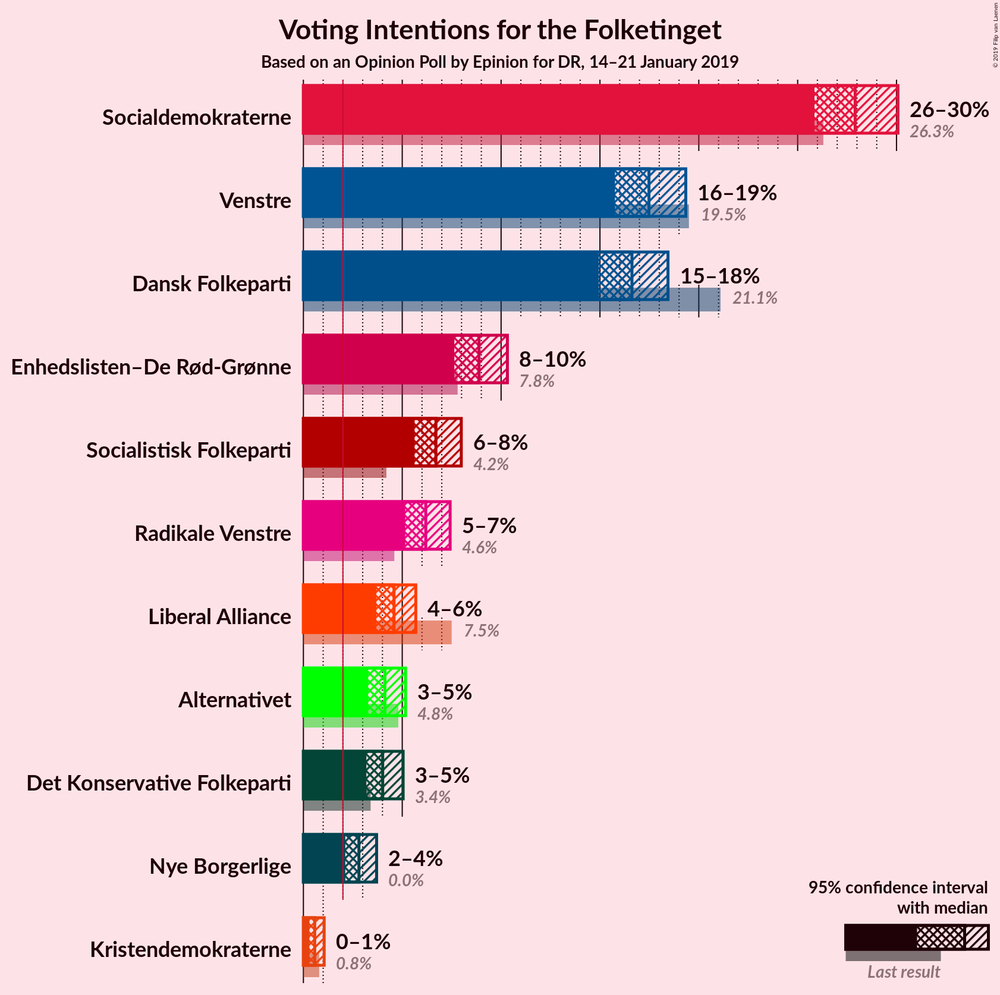

### Confidence Intervals

| Party | Last Result | Poll Result | 80% Confidence Interval | 90% Confidence Interval | 95% Confidence Interval | 99% Confidence Interval |
|:-----:|:-----------:|:-----------:|:-----------------------:|:-----------------------:|:-----------------------:|:-----------------------:|
| Socialdemokraterne | 26.3% | 27.9% | 26.6–29.3% |26.2–29.7% |25.8–30.1% |25.2–30.8% |
| Venstre | 19.5% | 17.5% | 16.4–18.7% |16.0–19.0% |15.8–19.3% |15.2–19.9% |
| Dansk Folkeparti | 21.1% | 16.6% | 15.5–17.8% |15.2–18.2% |14.9–18.4% |14.4–19.0% |
| Enhedslisten–De Rød-Grønne | 7.8% | 8.9% | 8.1–9.8% |7.8–10.1% |7.6–10.3% |7.3–10.8% |
| Socialistisk Folkeparti | 4.2% | 6.7% | 6.0–7.5% |5.8–7.8% |5.6–8.0% |5.3–8.4% |
| Radikale Venstre | 4.6% | 6.2% | 5.5–7.0% |5.3–7.2% |5.2–7.4% |4.8–7.8% |
| Liberal Alliance | 7.5% | 4.6% | 4.0–5.3% |3.8–5.5% |3.7–5.7% |3.4–6.0% |
| Alternativet | 4.8% | 4.1% | 3.6–4.8% |3.4–5.0% |3.3–5.2% |3.0–5.5% |
| Det Konservative Folkeparti | 3.4% | 4.0% | 3.5–4.7% |3.3–4.9% |3.2–5.0% |2.9–5.4% |
| Nye Borgerlige | 0.0% | 2.8% | 2.4–3.4% |2.2–3.6% |2.1–3.7% |1.9–4.0% |
| Kristendemokraterne | 0.8% | 0.6% | 0.4–0.9% |0.4–1.0% |0.3–1.1% |0.2–1.2% |

*Note:* The poll result column reflects the actual value used in the calculations. Published results may vary slightly, and in addition be rounded to fewer digits.

## Seats

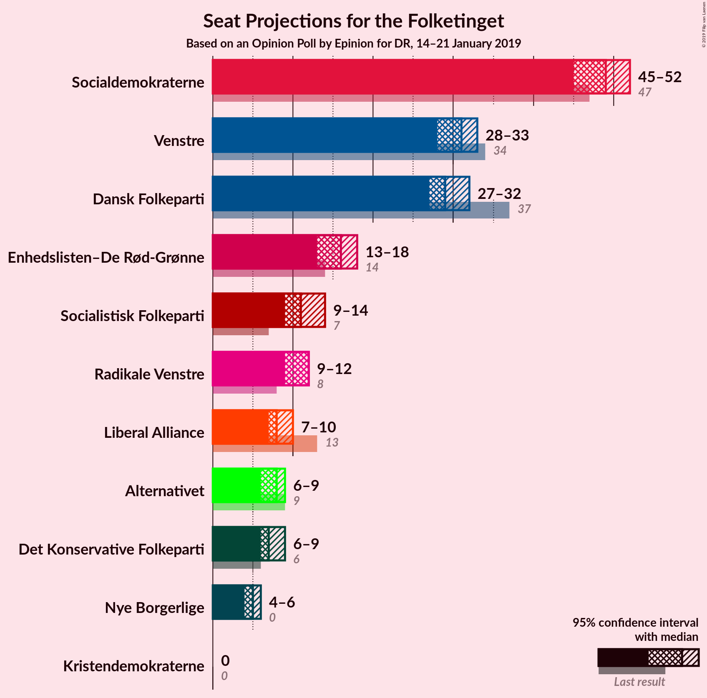

### Confidence Intervals

| Party | Last Result | Median | 80% Confidence Interval | 90% Confidence Interval | 95% Confidence Interval | 99% Confidence Interval |
|:-----:|:-----------:|:------:|:-----------------------:|:-----------------------:|:-----------------------:|:-----------------------:|
| <a href="#socialdemokraterne">Socialdemokraterne</a> | 47 | 49 | 47–51 |45–51 |45–52 |44–54 |
| <a href="#venstre">Venstre</a> | 34 | 31 | 29–33 |29–33 |28–33 |27–35 |
| <a href="#dansk-folkeparti">Dansk Folkeparti</a> | 37 | 29 | 27–32 |27–32 |27–32 |26–33 |
| <a href="#enhedslisten–de-rød-grønne">Enhedslisten–De Rød-Grønne</a> | 14 | 16 | 13–17 |13–18 |13–18 |13–19 |
| <a href="#socialistisk-folkeparti">Socialistisk Folkeparti</a> | 7 | 11 | 11–14 |10–14 |9–14 |9–15 |
| <a href="#radikale-venstre">Radikale Venstre</a> | 8 | 12 | 10–12 |10–12 |9–12 |8–13 |
| <a href="#liberal-alliance">Liberal Alliance</a> | 13 | 8 | 7–9 |7–9 |7–10 |6–10 |
| <a href="#alternativet">Alternativet</a> | 9 | 8 | 6–9 |6–9 |6–9 |5–9 |
| <a href="#det-konservative-folkeparti">Det Konservative Folkeparti</a> | 6 | 7 | 7–8 |6–9 |6–9 |5–9 |
| <a href="#nye-borgerlige">Nye Borgerlige</a> | 0 | 5 | 4–6 |4–6 |4–6 |4–7 |
| <a href="#kristendemokraterne">Kristendemokraterne</a> | 0 | 0 | 0 |0 |0 |0 |

### Socialdemokraterne

*For a full overview of the results for this party, see the [Socialdemokraterne](party-socialdemokraterne.html) page.*

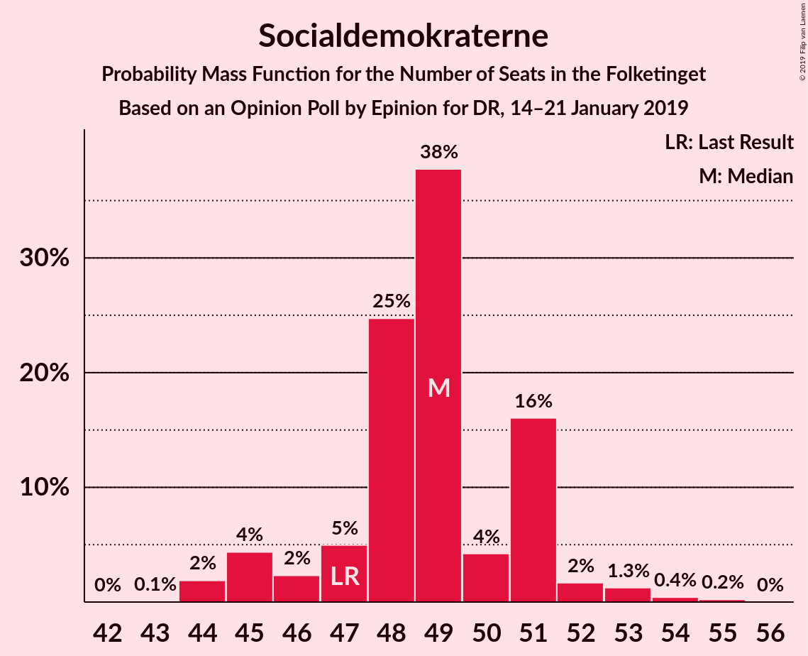

| Number of Seats | Probability | Accumulated | Special Marks |
|:---------------:|:-----------:|:-----------:|:-------------:|
| 43 | 0.1% | 100% |  |
| 44 | 2% | 99.9% |  |
| 45 | 4% | 98% |  |
| 46 | 2% | 94% |  |
| 47 | 5% | 91% | Last Result |
| 48 | 25% | 86% |  |
| 49 | 38% | 62% | Median |
| 50 | 4% | 24% |  |
| 51 | 16% | 20% |  |
| 52 | 2% | 4% |  |
| 53 | 1.3% | 2% |  |
| 54 | 0.4% | 0.7% |  |
| 55 | 0.2% | 0.3% |  |
| 56 | 0% | 0% |  |

### Venstre

*For a full overview of the results for this party, see the [Venstre](party-venstre.html) page.*

| Number of Seats | Probability | Accumulated | Special Marks |
|:---------------:|:-----------:|:-----------:|:-------------:|
| 26 | 0.2% | 100% |  |
| 27 | 1.1% | 99.8% |  |
| 28 | 2% | 98.7% |  |
| 29 | 36% | 97% |  |
| 30 | 3% | 61% |  |
| 31 | 21% | 57% | Median |
| 32 | 17% | 36% |  |
| 33 | 18% | 20% |  |
| 34 | 0.7% | 2% | Last Result |
| 35 | 1.0% | 1.3% |  |
| 36 | 0.4% | 0.4% |  |
| 37 | 0% | 0% |  |

### Dansk Folkeparti

*For a full overview of the results for this party, see the [Dansk Folkeparti](party-danskfolkeparti.html) page.*

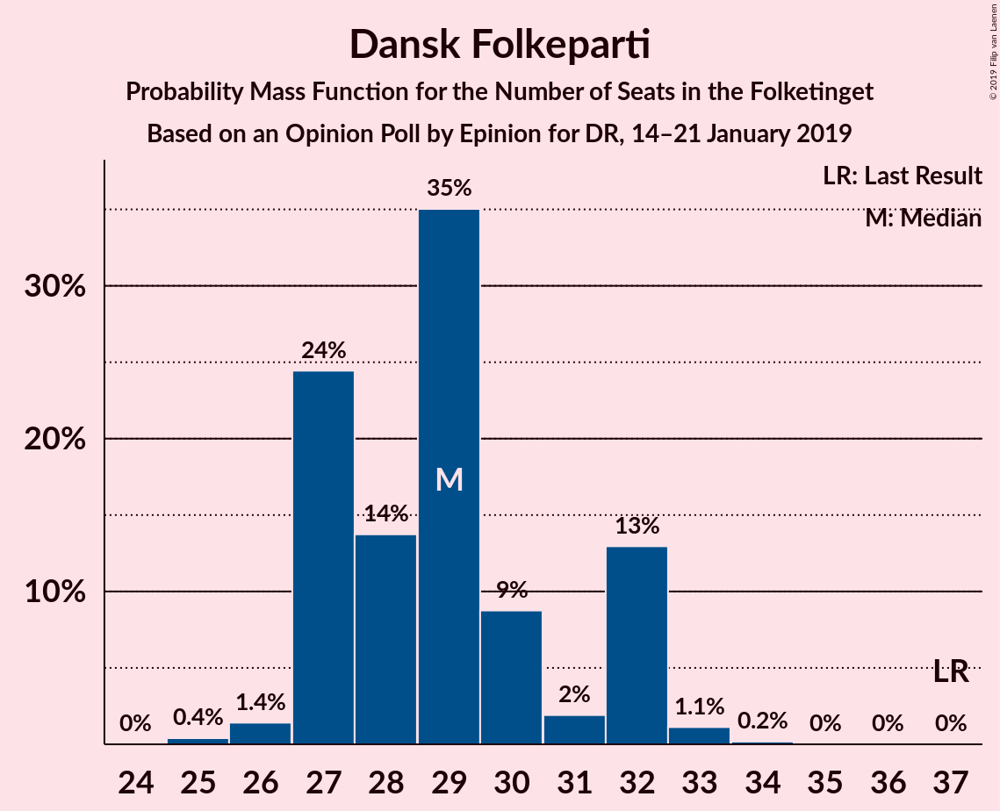

| Number of Seats | Probability | Accumulated | Special Marks |
|:---------------:|:-----------:|:-----------:|:-------------:|
| 25 | 0.4% | 100% |  |
| 26 | 1.4% | 99.6% |  |
| 27 | 24% | 98% |  |
| 28 | 14% | 74% |  |
| 29 | 35% | 60% | Median |
| 30 | 9% | 25% |  |
| 31 | 2% | 16% |  |
| 32 | 13% | 14% |  |
| 33 | 1.1% | 1.3% |  |
| 34 | 0.2% | 0.2% |  |
| 35 | 0% | 0% |  |
| 36 | 0% | 0% |  |
| 37 | 0% | 0% | Last Result |

### Enhedslisten–De Rød-Grønne

*For a full overview of the results for this party, see the [Enhedslisten–De Rød-Grønne](party-enhedslisten–derød-grønne.html) page.*

| Number of Seats | Probability | Accumulated | Special Marks |
|:---------------:|:-----------:|:-----------:|:-------------:|
| 12 | 0.2% | 100% |  |
| 13 | 12% | 99.8% |  |
| 14 | 6% | 88% | Last Result |
| 15 | 19% | 81% |  |
| 16 | 25% | 63% | Median |
| 17 | 31% | 38% |  |
| 18 | 7% | 7% |  |
| 19 | 0.5% | 0.5% |  |
| 20 | 0% | 0% |  |

### Socialistisk Folkeparti

*For a full overview of the results for this party, see the [Socialistisk Folkeparti](party-socialistiskfolkeparti.html) page.*

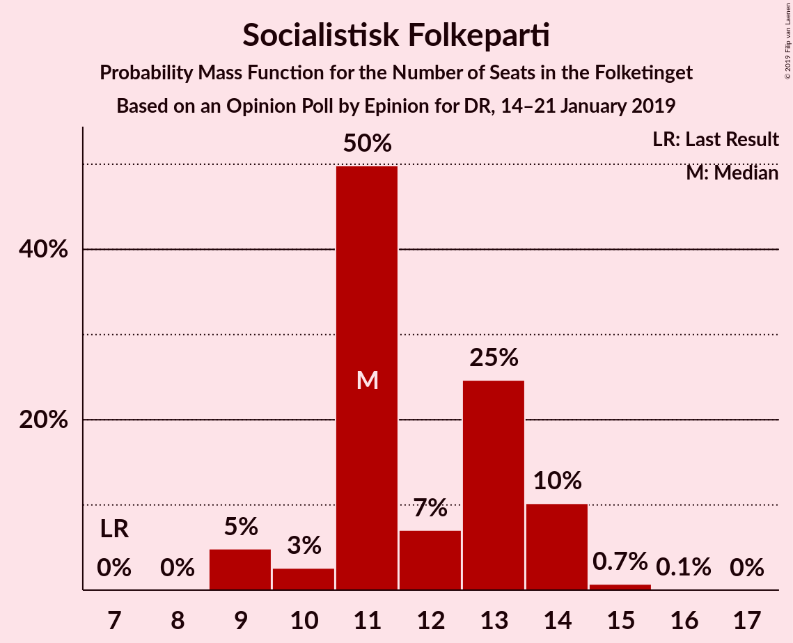

| Number of Seats | Probability | Accumulated | Special Marks |
|:---------------:|:-----------:|:-----------:|:-------------:|
| 7 | 0% | 100% | Last Result |
| 8 | 0% | 100% |  |
| 9 | 5% | 100% |  |
| 10 | 3% | 95% |  |
| 11 | 50% | 93% | Median |
| 12 | 7% | 43% |  |
| 13 | 25% | 36% |  |
| 14 | 10% | 11% |  |
| 15 | 0.7% | 0.8% |  |
| 16 | 0.1% | 0.1% |  |
| 17 | 0% | 0% |  |

### Radikale Venstre

*For a full overview of the results for this party, see the [Radikale Venstre](party-radikalevenstre.html) page.*

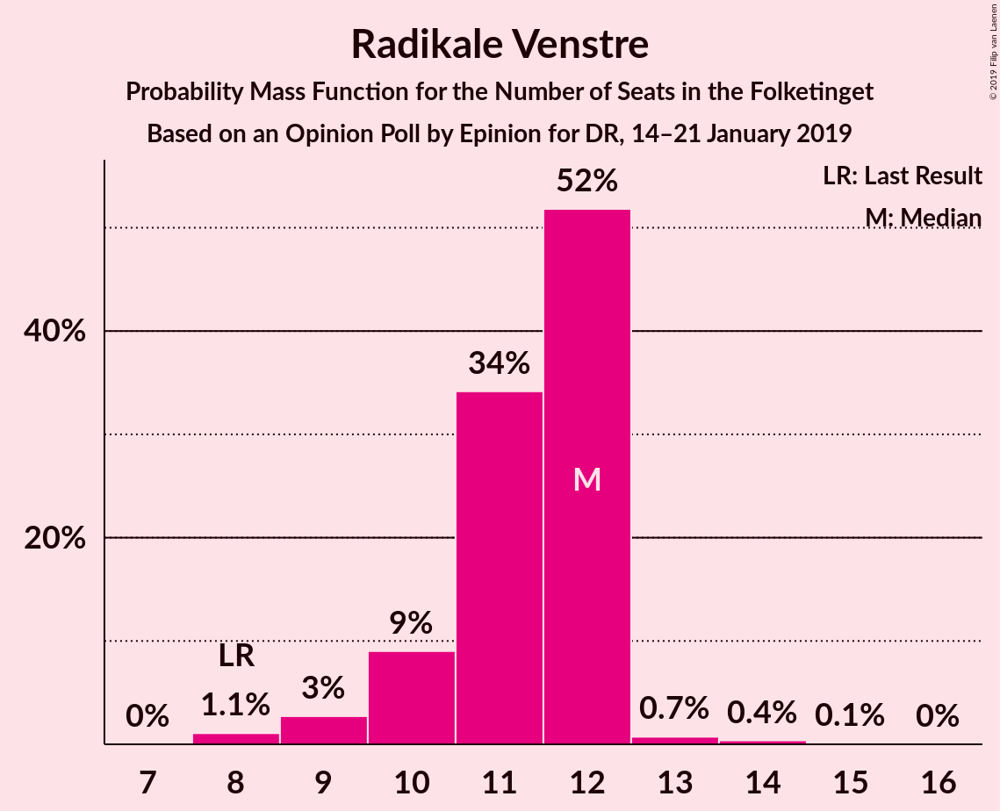

| Number of Seats | Probability | Accumulated | Special Marks |
|:---------------:|:-----------:|:-----------:|:-------------:|
| 8 | 1.1% | 100% | Last Result |
| 9 | 3% | 98.9% |  |
| 10 | 9% | 96% |  |
| 11 | 34% | 87% |  |
| 12 | 52% | 53% | Median |
| 13 | 0.7% | 1.2% |  |
| 14 | 0.4% | 0.4% |  |
| 15 | 0.1% | 0.1% |  |
| 16 | 0% | 0% |  |

### Liberal Alliance

*For a full overview of the results for this party, see the [Liberal Alliance](party-liberalalliance.html) page.*

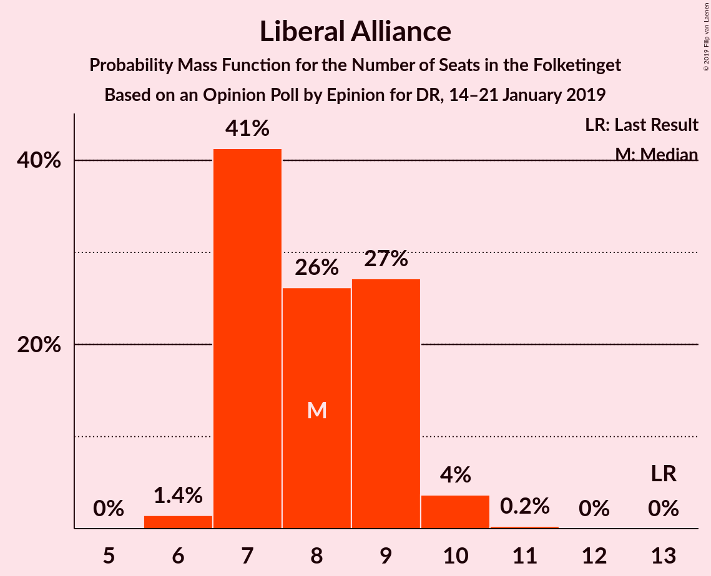

| Number of Seats | Probability | Accumulated | Special Marks |
|:---------------:|:-----------:|:-----------:|:-------------:|
| 6 | 1.4% | 100% |  |
| 7 | 41% | 98.6% |  |
| 8 | 26% | 57% | Median |
| 9 | 27% | 31% |  |
| 10 | 4% | 4% |  |
| 11 | 0.2% | 0.2% |  |
| 12 | 0% | 0% |  |
| 13 | 0% | 0% | Last Result |

### Alternativet

*For a full overview of the results for this party, see the [Alternativet](party-alternativet.html) page.*

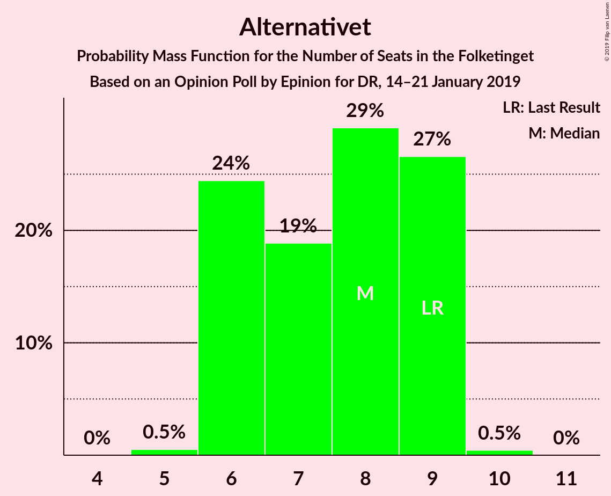

| Number of Seats | Probability | Accumulated | Special Marks |
|:---------------:|:-----------:|:-----------:|:-------------:|
| 5 | 0.5% | 100% |  |
| 6 | 24% | 99.5% |  |
| 7 | 19% | 75% |  |
| 8 | 29% | 56% | Median |
| 9 | 27% | 27% | Last Result |
| 10 | 0.5% | 0.5% |  |
| 11 | 0% | 0% |  |

### Det Konservative Folkeparti

*For a full overview of the results for this party, see the [Det Konservative Folkeparti](party-detkonservativefolkeparti.html) page.*

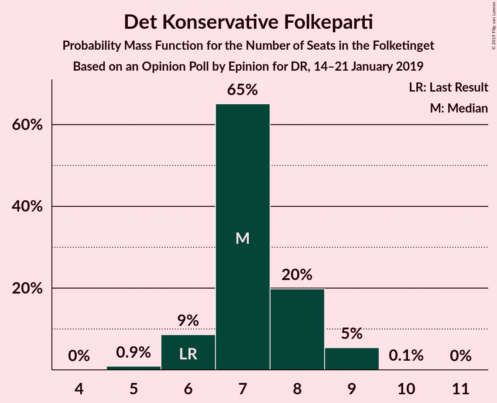

| Number of Seats | Probability | Accumulated | Special Marks |
|:---------------:|:-----------:|:-----------:|:-------------:|
| 5 | 0.9% | 100% |  |
| 6 | 9% | 99.1% | Last Result |
| 7 | 65% | 90% | Median |
| 8 | 20% | 25% |  |
| 9 | 5% | 6% |  |
| 10 | 0.1% | 0.1% |  |
| 11 | 0% | 0% |  |

### Nye Borgerlige

*For a full overview of the results for this party, see the [Nye Borgerlige](party-nyeborgerlige.html) page.*

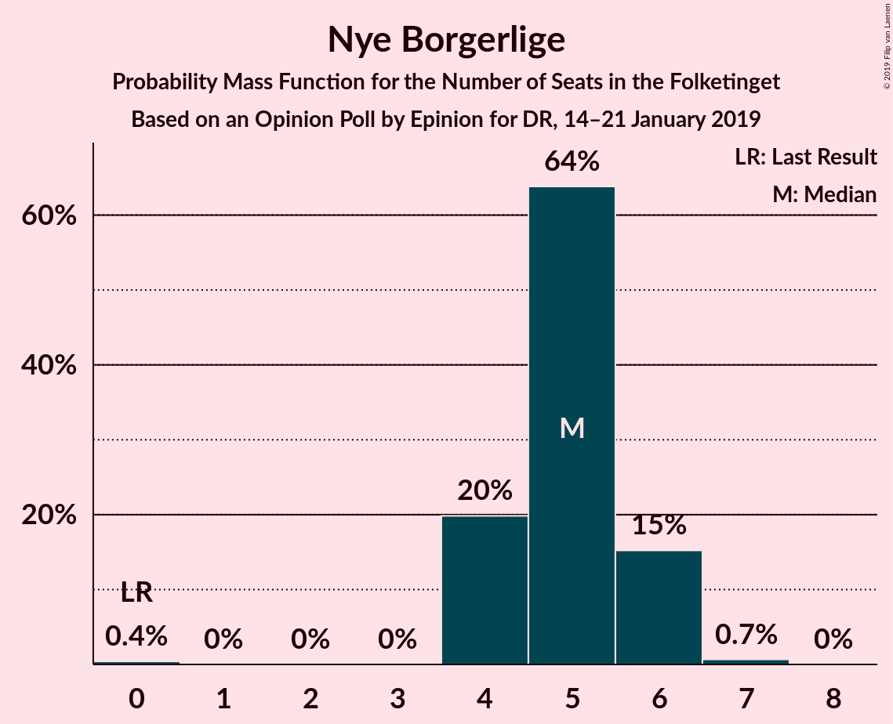

| Number of Seats | Probability | Accumulated | Special Marks |
|:---------------:|:-----------:|:-----------:|:-------------:|
| 0 | 0.4% | 100% | Last Result |
| 1 | 0% | 99.6% |  |
| 2 | 0% | 99.6% |  |
| 3 | 0% | 99.6% |  |
| 4 | 20% | 99.6% |  |
| 5 | 64% | 80% | Median |
| 6 | 15% | 16% |  |
| 7 | 0.7% | 0.7% |  |
| 8 | 0% | 0% |  |

### Kristendemokraterne

*For a full overview of the results for this party, see the [Kristendemokraterne](party-kristendemokraterne.html) page.*

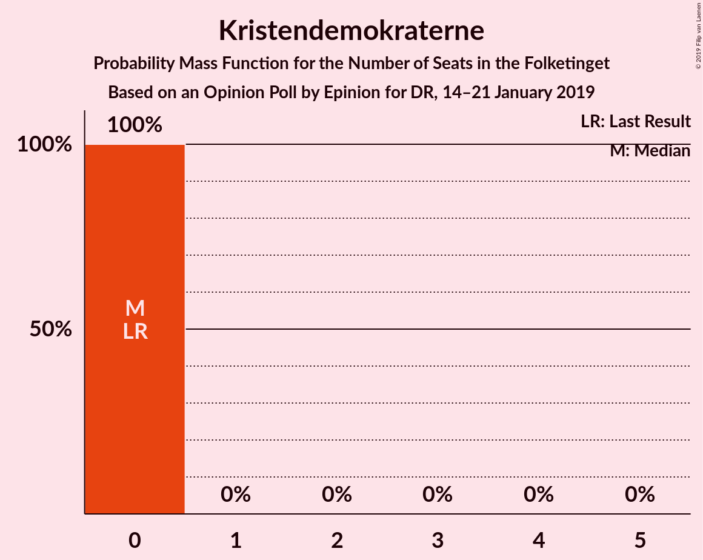

| Number of Seats | Probability | Accumulated | Special Marks |
|:---------------:|:-----------:|:-----------:|:-------------:|
| 0 | 100% | 100% | Last Result, Median |

## Coalitions

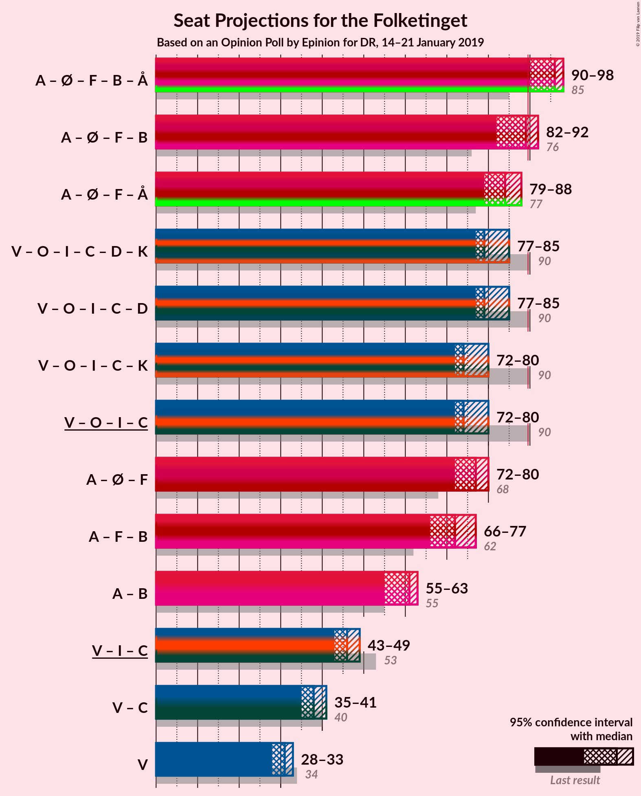

### Confidence Intervals

| Coalition | Last Result | Median | Majority? | 80% Confidence Interval | 90% Confidence Interval | 95% Confidence Interval | 99% Confidence Interval |
|:---------:|:-----------:|:------:|:---------:|:-----------------------:|:-----------------------:|:-----------------------:|:-----------------------:|
| Socialdemokraterne – Enhedslisten–De Rød-Grønne – Socialistisk Folkeparti – Radikale Venstre – Alternativet | 85 | 96 | 99.7% | 91–98 | 90–98 | 90–98 | 90–100 |
| Socialdemokraterne – Enhedslisten–De Rød-Grønne – Socialistisk Folkeparti – Radikale Venstre | 76 | 89 | 26% | 83–91 | 83–92 | 82–92 | 82–92 |
| Socialdemokraterne – Enhedslisten–De Rød-Grønne – Socialistisk Folkeparti – Alternativet | 77 | 84 | 0.2% | 80–86 | 80–86 | 79–88 | 79–89 |
| Venstre – Dansk Folkeparti – Liberal Alliance – Det Konservative Folkeparti – Nye Borgerlige – Kristendemokraterne | 90 | 79 | 0% | 77–84 | 77–85 | 77–85 | 75–85 |
| Venstre – Dansk Folkeparti – Liberal Alliance – Det Konservative Folkeparti – Nye Borgerlige | 90 | 79 | 0% | 77–84 | 77–85 | 77–85 | 75–85 |
| Venstre – Dansk Folkeparti – Liberal Alliance – Det Konservative Folkeparti – Kristendemokraterne | 90 | 74 | 0% | 72–80 | 72–80 | 72–80 | 70–81 |
| Venstre – Dansk Folkeparti – Liberal Alliance – Det Konservative Folkeparti | 90 | 74 | 0% | 72–80 | 72–80 | 72–80 | 70–81 |
| Socialdemokraterne – Enhedslisten–De Rød-Grønne – Socialistisk Folkeparti | 68 | 77 | 0% | 72–80 | 72–80 | 72–80 | 71–81 |
| Socialdemokraterne – Socialistisk Folkeparti – Radikale Venstre | 62 | 72 | 0% | 69–74 | 66–77 | 66–77 | 66–77 |
| Socialdemokraterne – Radikale Venstre | 55 | 61 | 0% | 58–63 | 55–63 | 55–63 | 55–65 |
| Venstre – Liberal Alliance – Det Konservative Folkeparti | 53 | 46 | 0% | 43–48 | 43–49 | 43–49 | 42–51 |
| Venstre – Det Konservative Folkeparti | 40 | 38 | 0% | 36–41 | 36–41 | 35–41 | 34–42 |
| Venstre | 34 | 31 | 0% | 29–33 | 29–33 | 28–33 | 27–35 |

### Socialdemokraterne – Enhedslisten–De Rød-Grønne – Socialistisk Folkeparti – Radikale Venstre – Alternativet

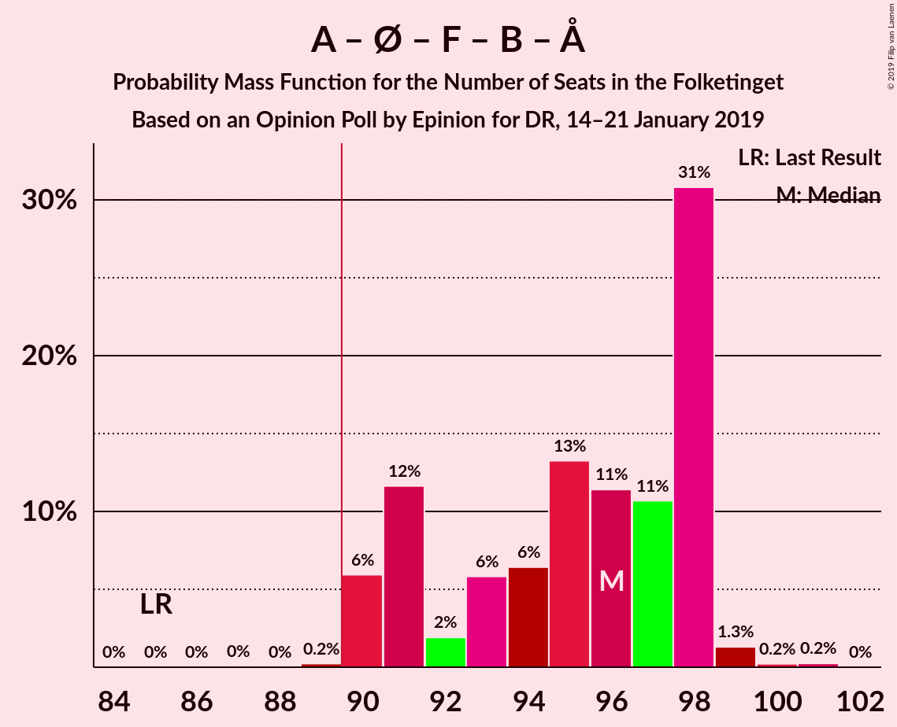

| Number of Seats | Probability | Accumulated | Special Marks |
|:---------------:|:-----------:|:-----------:|:-------------:|
| 85 | 0% | 100% | Last Result |
| 86 | 0% | 100% |  |
| 87 | 0% | 100% |  |
| 88 | 0% | 100% |  |
| 89 | 0.2% | 99.9% |  |
| 90 | 6% | 99.7% | Majority |
| 91 | 12% | 94% |  |
| 92 | 2% | 82% |  |
| 93 | 6% | 80% |  |
| 94 | 6% | 74% |  |
| 95 | 13% | 68% |  |
| 96 | 11% | 55% | Median |
| 97 | 11% | 43% |  |
| 98 | 31% | 33% |  |
| 99 | 1.3% | 2% |  |
| 100 | 0.2% | 0.5% |  |
| 101 | 0.2% | 0.3% |  |
| 102 | 0% | 0% |  |

### Socialdemokraterne – Enhedslisten–De Rød-Grønne – Socialistisk Folkeparti – Radikale Venstre

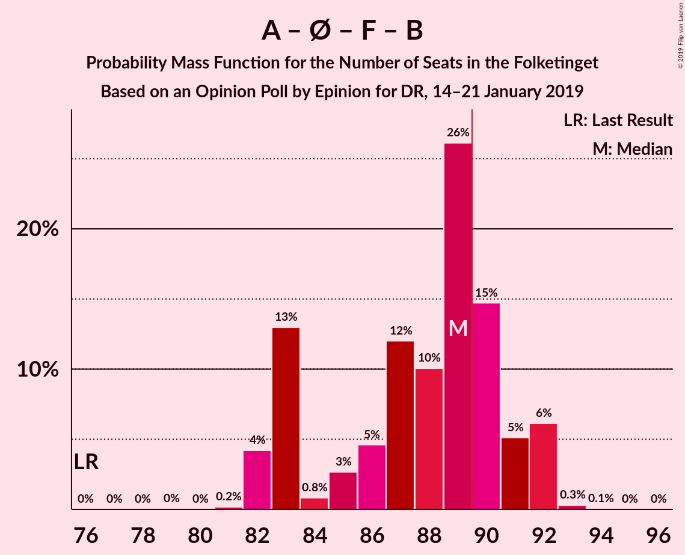

| Number of Seats | Probability | Accumulated | Special Marks |
|:---------------:|:-----------:|:-----------:|:-------------:|
| 76 | 0% | 100% | Last Result |
| 77 | 0% | 100% |  |
| 78 | 0% | 100% |  |
| 79 | 0% | 100% |  |
| 80 | 0% | 100% |  |
| 81 | 0.2% | 100% |  |
| 82 | 4% | 99.8% |  |
| 83 | 13% | 96% |  |
| 84 | 0.8% | 83% |  |
| 85 | 3% | 82% |  |
| 86 | 5% | 79% |  |
| 87 | 12% | 75% |  |
| 88 | 10% | 63% | Median |
| 89 | 26% | 52% |  |
| 90 | 15% | 26% | Majority |
| 91 | 5% | 12% |  |
| 92 | 6% | 6% |  |
| 93 | 0.3% | 0.4% |  |
| 94 | 0.1% | 0.1% |  |
| 95 | 0% | 0% |  |

### Socialdemokraterne – Enhedslisten–De Rød-Grønne – Socialistisk Folkeparti – Alternativet

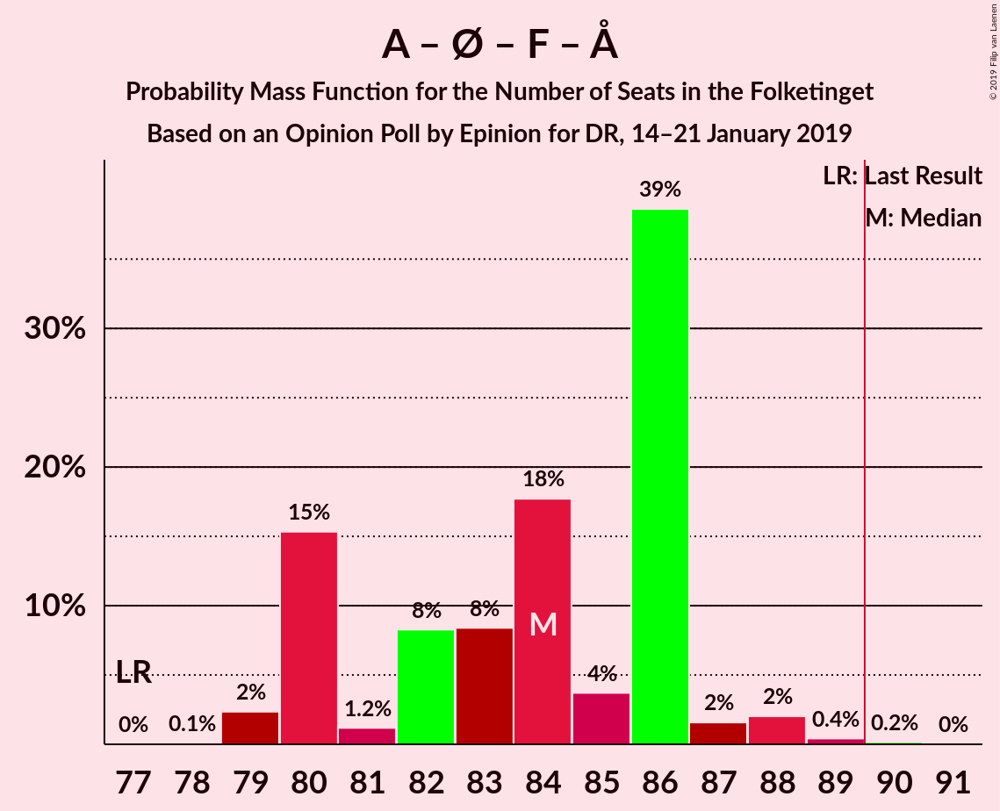

| Number of Seats | Probability | Accumulated | Special Marks |
|:---------------:|:-----------:|:-----------:|:-------------:|
| 77 | 0% | 100% | Last Result |
| 78 | 0.1% | 99.9% |  |
| 79 | 2% | 99.8% |  |
| 80 | 15% | 97% |  |
| 81 | 1.2% | 82% |  |
| 82 | 8% | 81% |  |
| 83 | 8% | 73% |  |
| 84 | 18% | 64% | Median |
| 85 | 4% | 47% |  |
| 86 | 39% | 43% |  |
| 87 | 2% | 4% |  |
| 88 | 2% | 3% |  |
| 89 | 0.4% | 0.6% |  |
| 90 | 0.2% | 0.2% | Majority |
| 91 | 0% | 0% |  |

### Venstre – Dansk Folkeparti – Liberal Alliance – Det Konservative Folkeparti – Nye Borgerlige – Kristendemokraterne

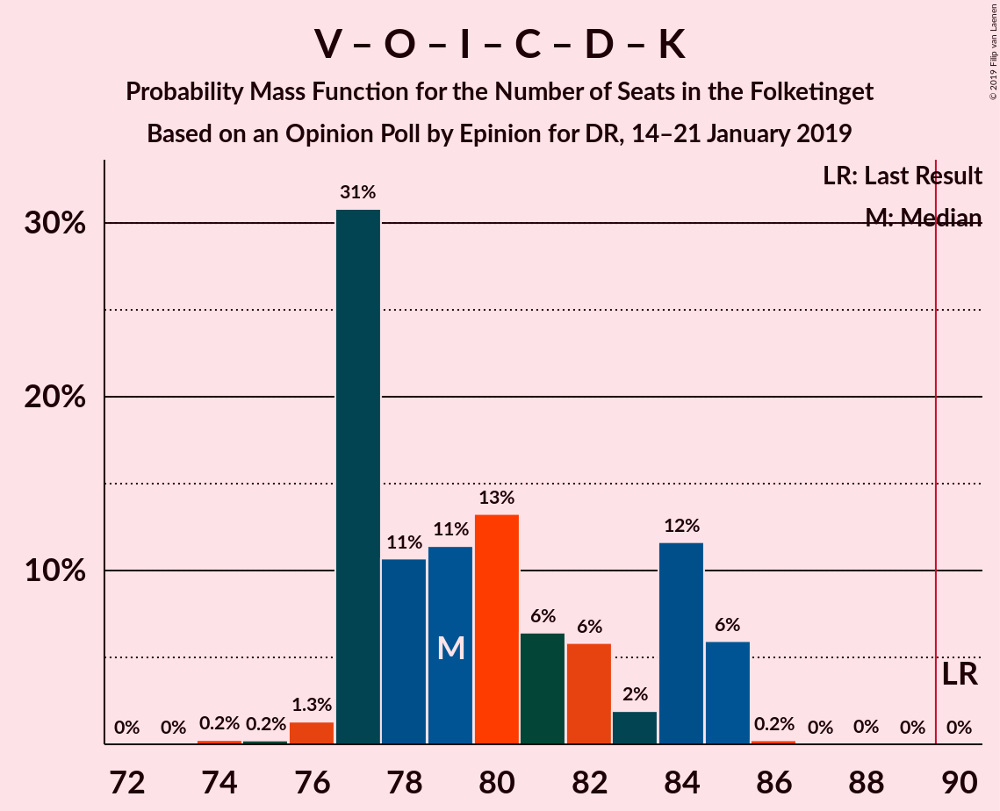

| Number of Seats | Probability | Accumulated | Special Marks |
|:---------------:|:-----------:|:-----------:|:-------------:|
| 74 | 0.2% | 100% |  |
| 75 | 0.2% | 99.7% |  |
| 76 | 1.3% | 99.5% |  |
| 77 | 31% | 98% |  |
| 78 | 11% | 67% |  |
| 79 | 11% | 57% |  |
| 80 | 13% | 45% | Median |
| 81 | 6% | 32% |  |
| 82 | 6% | 26% |  |
| 83 | 2% | 20% |  |
| 84 | 12% | 18% |  |
| 85 | 6% | 6% |  |
| 86 | 0.2% | 0.3% |  |
| 87 | 0% | 0.1% |  |
| 88 | 0% | 0% |  |
| 89 | 0% | 0% |  |
| 90 | 0% | 0% | Last Result, Majority |

### Venstre – Dansk Folkeparti – Liberal Alliance – Det Konservative Folkeparti – Nye Borgerlige

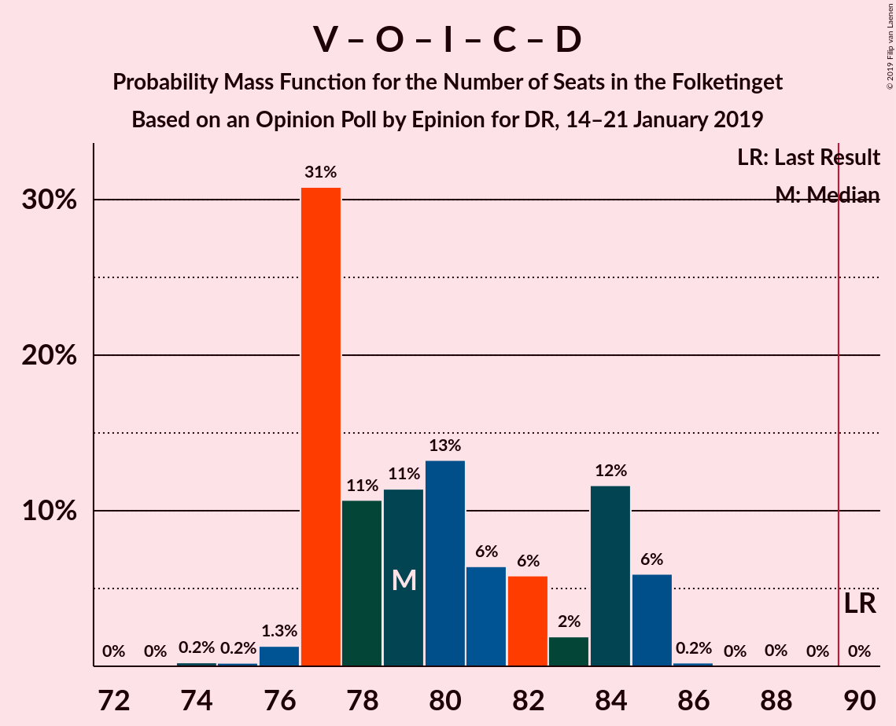

| Number of Seats | Probability | Accumulated | Special Marks |
|:---------------:|:-----------:|:-----------:|:-------------:|
| 74 | 0.2% | 100% |  |
| 75 | 0.2% | 99.7% |  |
| 76 | 1.3% | 99.5% |  |
| 77 | 31% | 98% |  |
| 78 | 11% | 67% |  |
| 79 | 11% | 57% |  |
| 80 | 13% | 45% | Median |
| 81 | 6% | 32% |  |
| 82 | 6% | 26% |  |
| 83 | 2% | 20% |  |
| 84 | 12% | 18% |  |
| 85 | 6% | 6% |  |
| 86 | 0.2% | 0.3% |  |
| 87 | 0% | 0.1% |  |
| 88 | 0% | 0% |  |
| 89 | 0% | 0% |  |
| 90 | 0% | 0% | Last Result, Majority |

### Venstre – Dansk Folkeparti – Liberal Alliance – Det Konservative Folkeparti – Kristendemokraterne

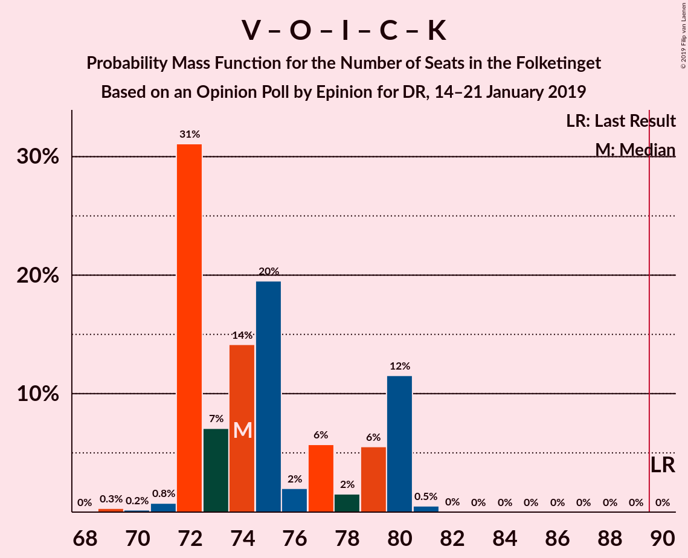

| Number of Seats | Probability | Accumulated | Special Marks |
|:---------------:|:-----------:|:-----------:|:-------------:|
| 69 | 0.3% | 100% |  |
| 70 | 0.2% | 99.7% |  |
| 71 | 0.8% | 99.5% |  |
| 72 | 31% | 98.7% |  |
| 73 | 7% | 68% |  |
| 74 | 14% | 61% |  |
| 75 | 20% | 46% | Median |
| 76 | 2% | 27% |  |
| 77 | 6% | 25% |  |
| 78 | 2% | 19% |  |
| 79 | 6% | 18% |  |
| 80 | 12% | 12% |  |
| 81 | 0.5% | 0.6% |  |
| 82 | 0% | 0.1% |  |
| 83 | 0% | 0% |  |
| 84 | 0% | 0% |  |
| 85 | 0% | 0% |  |
| 86 | 0% | 0% |  |
| 87 | 0% | 0% |  |
| 88 | 0% | 0% |  |
| 89 | 0% | 0% |  |
| 90 | 0% | 0% | Last Result, Majority |

### Venstre – Dansk Folkeparti – Liberal Alliance – Det Konservative Folkeparti

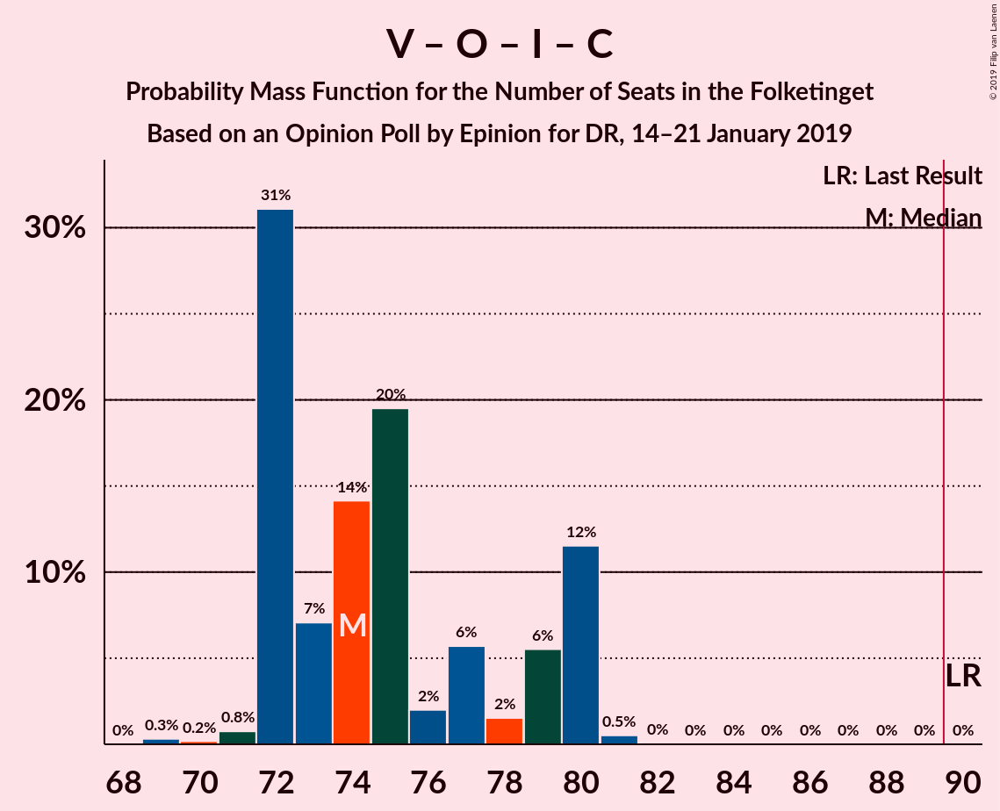

| Number of Seats | Probability | Accumulated | Special Marks |
|:---------------:|:-----------:|:-----------:|:-------------:|
| 69 | 0.3% | 100% |  |
| 70 | 0.2% | 99.7% |  |
| 71 | 0.8% | 99.5% |  |
| 72 | 31% | 98.7% |  |
| 73 | 7% | 68% |  |
| 74 | 14% | 61% |  |
| 75 | 20% | 46% | Median |
| 76 | 2% | 27% |  |
| 77 | 6% | 25% |  |
| 78 | 2% | 19% |  |
| 79 | 6% | 18% |  |
| 80 | 12% | 12% |  |
| 81 | 0.5% | 0.6% |  |
| 82 | 0% | 0.1% |  |
| 83 | 0% | 0% |  |
| 84 | 0% | 0% |  |
| 85 | 0% | 0% |  |
| 86 | 0% | 0% |  |
| 87 | 0% | 0% |  |
| 88 | 0% | 0% |  |
| 89 | 0% | 0% |  |
| 90 | 0% | 0% | Last Result, Majority |

### Socialdemokraterne – Enhedslisten–De Rød-Grønne – Socialistisk Folkeparti

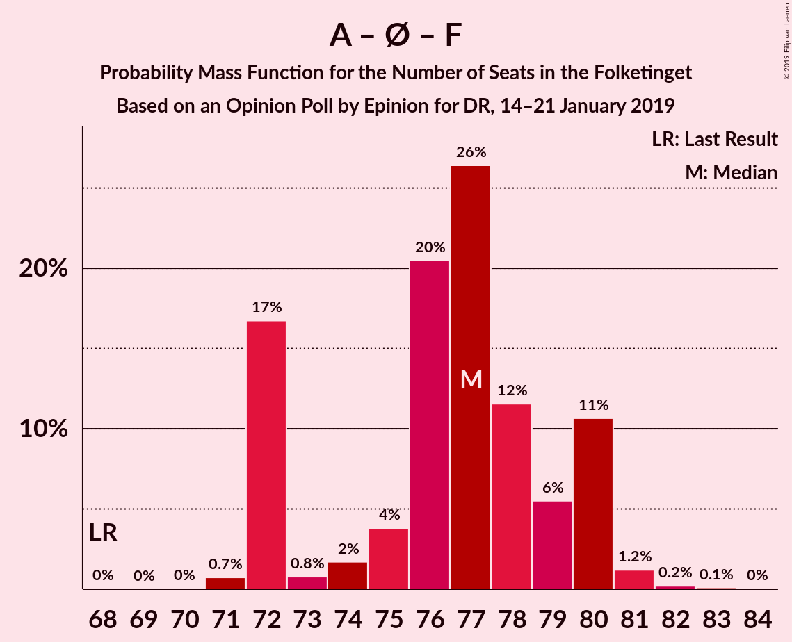

| Number of Seats | Probability | Accumulated | Special Marks |
|:---------------:|:-----------:|:-----------:|:-------------:|
| 68 | 0% | 100% | Last Result |
| 69 | 0% | 100% |  |
| 70 | 0% | 99.9% |  |
| 71 | 0.7% | 99.9% |  |
| 72 | 17% | 99.2% |  |
| 73 | 0.8% | 82% |  |
| 74 | 2% | 82% |  |
| 75 | 4% | 80% |  |
| 76 | 20% | 76% | Median |
| 77 | 26% | 56% |  |
| 78 | 12% | 29% |  |
| 79 | 6% | 18% |  |
| 80 | 11% | 12% |  |
| 81 | 1.2% | 2% |  |
| 82 | 0.2% | 0.3% |  |
| 83 | 0.1% | 0.1% |  |
| 84 | 0% | 0% |  |

### Socialdemokraterne – Socialistisk Folkeparti – Radikale Venstre

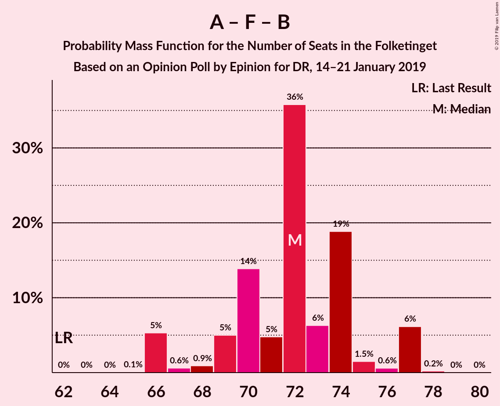

| Number of Seats | Probability | Accumulated | Special Marks |
|:---------------:|:-----------:|:-----------:|:-------------:|
| 62 | 0% | 100% | Last Result |
| 63 | 0% | 100% |  |
| 64 | 0% | 100% |  |
| 65 | 0.1% | 100% |  |
| 66 | 5% | 99.9% |  |
| 67 | 0.6% | 95% |  |
| 68 | 0.9% | 94% |  |
| 69 | 5% | 93% |  |
| 70 | 14% | 88% |  |
| 71 | 5% | 74% |  |
| 72 | 36% | 69% | Median |
| 73 | 6% | 34% |  |
| 74 | 19% | 27% |  |
| 75 | 1.5% | 8% |  |
| 76 | 0.6% | 7% |  |
| 77 | 6% | 6% |  |
| 78 | 0.2% | 0.2% |  |
| 79 | 0% | 0% |  |

### Socialdemokraterne – Radikale Venstre

| Number of Seats | Probability | Accumulated | Special Marks |
|:---------------:|:-----------:|:-----------:|:-------------:|
| 53 | 0.2% | 100% |  |
| 54 | 0.1% | 99.8% |  |
| 55 | 6% | 99.8% | Last Result |
| 56 | 1.2% | 94% |  |
| 57 | 2% | 93% |  |
| 58 | 7% | 91% |  |
| 59 | 20% | 84% |  |
| 60 | 8% | 64% |  |
| 61 | 36% | 56% | Median |
| 62 | 7% | 20% |  |
| 63 | 11% | 13% |  |
| 64 | 0.9% | 2% |  |
| 65 | 0.4% | 0.7% |  |
| 66 | 0.3% | 0.3% |  |
| 67 | 0% | 0% |  |

### Venstre – Liberal Alliance – Det Konservative Folkeparti

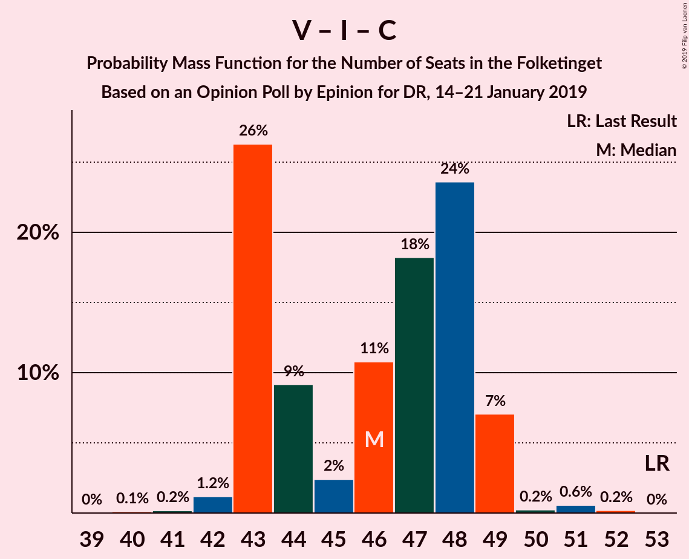

| Number of Seats | Probability | Accumulated | Special Marks |
|:---------------:|:-----------:|:-----------:|:-------------:|
| 40 | 0.1% | 100% |  |
| 41 | 0.2% | 99.9% |  |
| 42 | 1.2% | 99.7% |  |
| 43 | 26% | 98.5% |  |
| 44 | 9% | 72% |  |
| 45 | 2% | 63% |  |
| 46 | 11% | 61% | Median |
| 47 | 18% | 50% |  |
| 48 | 24% | 32% |  |
| 49 | 7% | 8% |  |
| 50 | 0.2% | 1.0% |  |
| 51 | 0.6% | 0.8% |  |
| 52 | 0.2% | 0.2% |  |
| 53 | 0% | 0% | Last Result |

### Venstre – Det Konservative Folkeparti

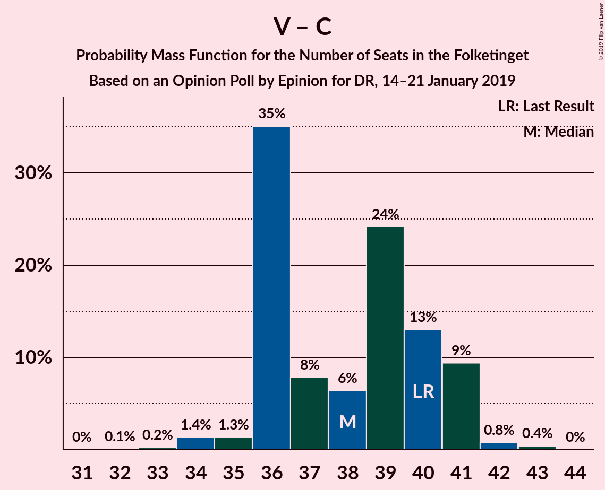

| Number of Seats | Probability | Accumulated | Special Marks |
|:---------------:|:-----------:|:-----------:|:-------------:|
| 32 | 0.1% | 100% |  |
| 33 | 0.2% | 99.9% |  |
| 34 | 1.4% | 99.7% |  |
| 35 | 1.3% | 98% |  |
| 36 | 35% | 97% |  |
| 37 | 8% | 62% |  |
| 38 | 6% | 54% | Median |
| 39 | 24% | 48% |  |
| 40 | 13% | 24% | Last Result |
| 41 | 9% | 11% |  |
| 42 | 0.8% | 1.2% |  |
| 43 | 0.4% | 0.4% |  |
| 44 | 0% | 0% |  |

### Venstre

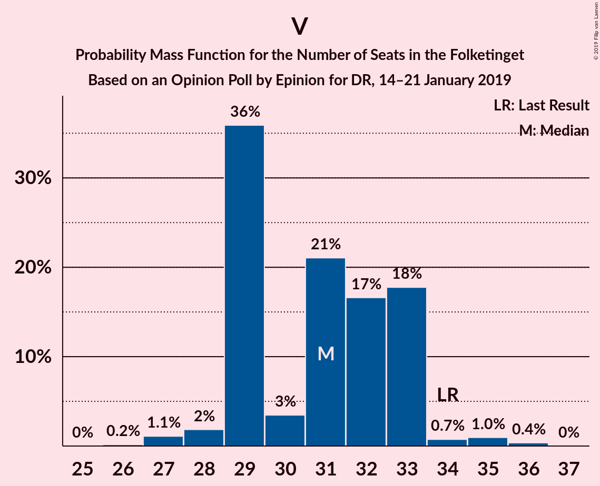

| Number of Seats | Probability | Accumulated | Special Marks |
|:---------------:|:-----------:|:-----------:|:-------------:|
| 26 | 0.2% | 100% |  |
| 27 | 1.1% | 99.8% |  |
| 28 | 2% | 98.7% |  |
| 29 | 36% | 97% |  |
| 30 | 3% | 61% |  |
| 31 | 21% | 57% | Median |
| 32 | 17% | 36% |  |
| 33 | 18% | 20% |  |
| 34 | 0.7% | 2% | Last Result |
| 35 | 1.0% | 1.3% |  |
| 36 | 0.4% | 0.4% |  |
| 37 | 0% | 0% |  |

## Technical Information

### Opinion Poll

+ **Polling firm:** Epinion
+ **Commissioner(s):** DR
+ **Fieldwork period:** 14–21 January 2019

### Calculations

+ **Sample size:** 1745
+ **Simulations done:** 1,048,576
+ **Error estimate:** 2.12%

