# Opinion Poll by Voxmeter for Ritzau, 21–27 January 2019

<a href="#voting-intentions">Voting Intentions</a> | <a href="#seats">Seats</a> | <a href="#coalitions">Coalitions</a> | <a href="#technical-information">Technical Information</a>

## Voting Intentions

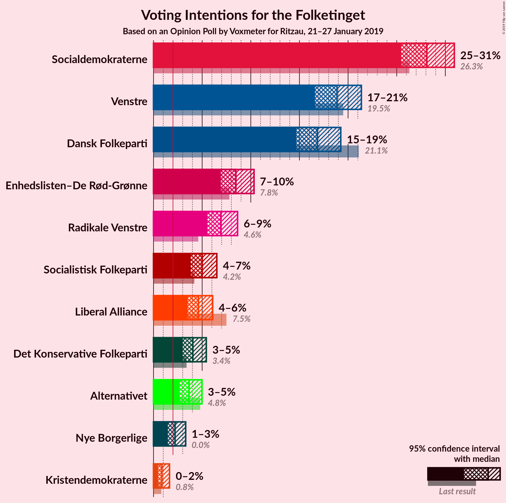

### Confidence Intervals

| Party | Last Result | Poll Result | 80% Confidence Interval | 90% Confidence Interval | 95% Confidence Interval | 99% Confidence Interval |
|:-----:|:-----------:|:-----------:|:-----------------------:|:-----------------------:|:-----------------------:|:-----------------------:|
| Socialdemokraterne | 26.3% | 28.1% | 26.4–29.9% |25.9–30.5% |25.5–30.9% |24.6–31.8% |
| Venstre | 19.5% | 18.9% | 17.4–20.5% |16.9–21.0% |16.6–21.4% |15.9–22.2% |
| Dansk Folkeparti | 21.1% | 16.8% | 15.4–18.4% |15.0–18.9% |14.7–19.3% |14.0–20.0% |
| Enhedslisten–De Rød-Grønne | 7.8% | 8.5% | 7.5–9.7% |7.2–10.0% |6.9–10.3% |6.5–10.9% |
| Radikale Venstre | 4.6% | 6.9% | 6.0–8.0% |5.7–8.4% |5.5–8.6% |5.1–9.2% |
| Socialistisk Folkeparti | 4.2% | 5.0% | 4.2–6.0% |4.0–6.3% |3.8–6.5% |3.5–7.0% |
| Liberal Alliance | 7.5% | 4.6% | 3.9–5.6% |3.7–5.8% |3.5–6.1% |3.2–6.6% |
| Det Konservative Folkeparti | 3.4% | 4.0% | 3.4–4.9% |3.2–5.2% |3.0–5.4% |2.7–5.9% |
| Alternativet | 4.8% | 3.7% | 3.0–4.5% |2.8–4.8% |2.7–5.0% |2.4–5.4% |
| Nye Borgerlige | 0.0% | 2.2% | 1.7–2.9% |1.6–3.1% |1.5–3.3% |1.3–3.7% |
| Kristendemokraterne | 0.8% | 0.9% | 0.6–1.4% |0.5–1.5% |0.5–1.6% |0.4–1.9% |

*Note:* The poll result column reflects the actual value used in the calculations. Published results may vary slightly, and in addition be rounded to fewer digits.

## Seats

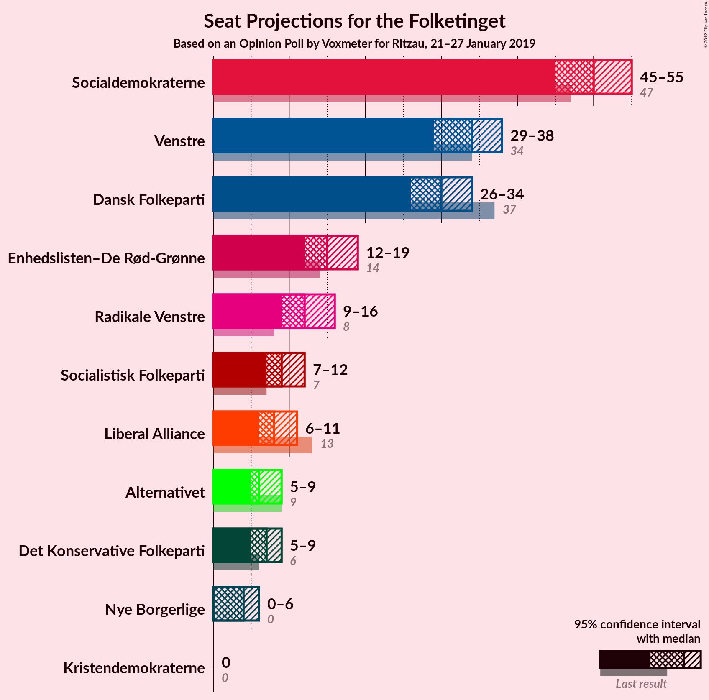

### Confidence Intervals

| Party | Last Result | Median | 80% Confidence Interval | 90% Confidence Interval | 95% Confidence Interval | 99% Confidence Interval |
|:-----:|:-----------:|:------:|:-----------------------:|:-----------------------:|:-----------------------:|:-----------------------:|
| <a href="#socialdemokraterne">Socialdemokraterne</a> | 47 | 50 | 46–53 |46–54 |45–55 |44–56 |
| <a href="#venstre">Venstre</a> | 34 | 34 | 31–38 |30–38 |29–38 |28–39 |
| <a href="#dansk-folkeparti">Dansk Folkeparti</a> | 37 | 30 | 27–32 |27–34 |26–34 |25–35 |
| <a href="#enhedslisten–de-rød-grønne">Enhedslisten–De Rød-Grønne</a> | 14 | 15 | 13–17 |13–18 |12–19 |12–20 |
| <a href="#radikale-venstre">Radikale Venstre</a> | 8 | 12 | 10–15 |10–15 |9–16 |8–17 |
| <a href="#socialistisk-folkeparti">Socialistisk Folkeparti</a> | 7 | 9 | 8–11 |7–11 |7–12 |6–13 |
| <a href="#liberal-alliance">Liberal Alliance</a> | 13 | 8 | 7–10 |7–11 |6–11 |5–11 |
| <a href="#det-konservative-folkeparti">Det Konservative Folkeparti</a> | 6 | 7 | 6–9 |5–9 |5–9 |5–10 |
| <a href="#alternativet">Alternativet</a> | 9 | 6 | 5–8 |5–9 |5–9 |4–9 |
| <a href="#nye-borgerlige">Nye Borgerlige</a> | 0 | 4 | 0–5 |0–5 |0–6 |0–7 |
| <a href="#kristendemokraterne">Kristendemokraterne</a> | 0 | 0 | 0 |0 |0 |0 |

### Socialdemokraterne

*For a full overview of the results for this party, see the [Socialdemokraterne](party-socialdemokraterne.html) page.*

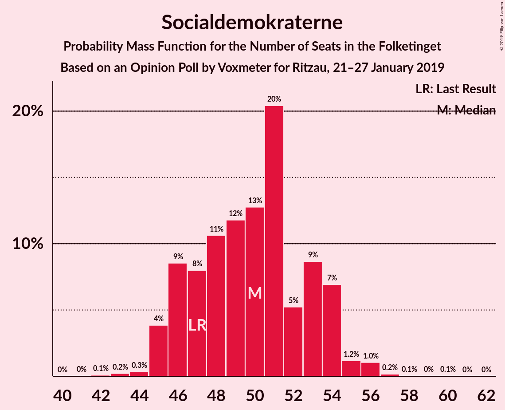

| Number of Seats | Probability | Accumulated | Special Marks |
|:---------------:|:-----------:|:-----------:|:-------------:|
| 41 | 0% | 100% |  |
| 42 | 0.1% | 99.9% |  |
| 43 | 0.2% | 99.9% |  |
| 44 | 0.3% | 99.6% |  |
| 45 | 4% | 99.3% |  |
| 46 | 9% | 95% |  |
| 47 | 8% | 87% | Last Result |
| 48 | 11% | 79% |  |
| 49 | 12% | 68% |  |
| 50 | 13% | 57% | Median |
| 51 | 20% | 44% |  |
| 52 | 5% | 23% |  |
| 53 | 9% | 18% |  |
| 54 | 7% | 9% |  |
| 55 | 1.2% | 3% |  |
| 56 | 1.0% | 1.3% |  |
| 57 | 0.2% | 0.3% |  |
| 58 | 0.1% | 0.1% |  |
| 59 | 0% | 0.1% |  |
| 60 | 0.1% | 0.1% |  |
| 61 | 0% | 0% |  |

### Venstre

*For a full overview of the results for this party, see the [Venstre](party-venstre.html) page.*

| Number of Seats | Probability | Accumulated | Special Marks |
|:---------------:|:-----------:|:-----------:|:-------------:|
| 27 | 0.3% | 100% |  |
| 28 | 2% | 99.7% |  |
| 29 | 1.0% | 98% |  |
| 30 | 7% | 97% |  |
| 31 | 13% | 90% |  |
| 32 | 10% | 77% |  |
| 33 | 4% | 67% |  |
| 34 | 18% | 63% | Last Result, Median |
| 35 | 6% | 45% |  |
| 36 | 9% | 40% |  |
| 37 | 19% | 30% |  |
| 38 | 11% | 12% |  |
| 39 | 0.3% | 0.6% |  |
| 40 | 0.2% | 0.3% |  |
| 41 | 0% | 0.1% |  |
| 42 | 0.1% | 0.1% |  |
| 43 | 0% | 0% |  |

### Dansk Folkeparti

*For a full overview of the results for this party, see the [Dansk Folkeparti](party-danskfolkeparti.html) page.*

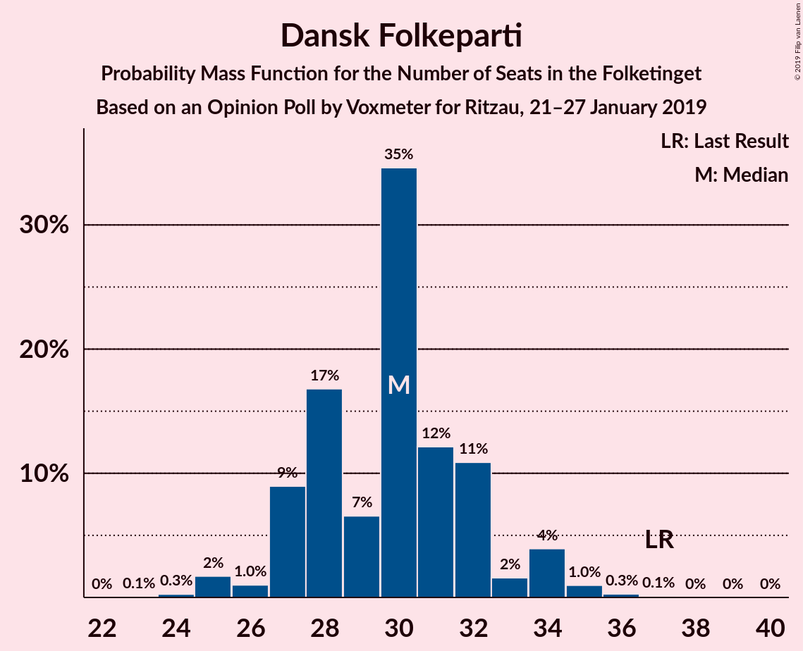

| Number of Seats | Probability | Accumulated | Special Marks |
|:---------------:|:-----------:|:-----------:|:-------------:|
| 23 | 0.1% | 100% |  |
| 24 | 0.3% | 99.9% |  |
| 25 | 2% | 99.7% |  |
| 26 | 1.0% | 98% |  |
| 27 | 9% | 97% |  |
| 28 | 17% | 88% |  |
| 29 | 7% | 71% |  |
| 30 | 35% | 65% | Median |
| 31 | 12% | 30% |  |
| 32 | 11% | 18% |  |
| 33 | 2% | 7% |  |
| 34 | 4% | 5% |  |
| 35 | 1.0% | 1.4% |  |
| 36 | 0.3% | 0.5% |  |
| 37 | 0.1% | 0.2% | Last Result |
| 38 | 0% | 0.1% |  |
| 39 | 0% | 0% |  |

### Enhedslisten–De Rød-Grønne

*For a full overview of the results for this party, see the [Enhedslisten–De Rød-Grønne](party-enhedslisten–derød-grønne.html) page.*

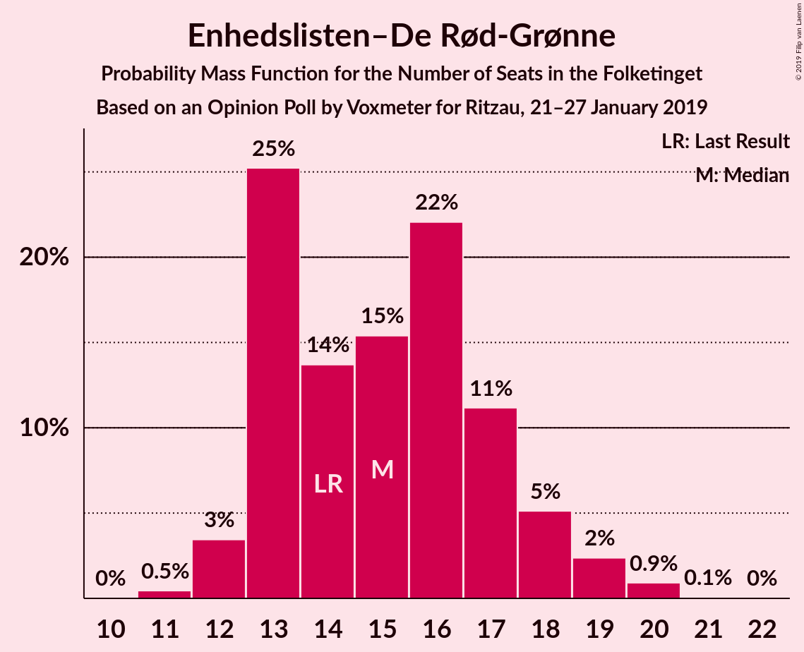

| Number of Seats | Probability | Accumulated | Special Marks |
|:---------------:|:-----------:|:-----------:|:-------------:|
| 11 | 0.5% | 100% |  |
| 12 | 3% | 99.5% |  |
| 13 | 25% | 96% |  |
| 14 | 14% | 71% | Last Result |
| 15 | 15% | 57% | Median |
| 16 | 22% | 42% |  |
| 17 | 11% | 20% |  |
| 18 | 5% | 8% |  |
| 19 | 2% | 3% |  |
| 20 | 0.9% | 1.0% |  |
| 21 | 0.1% | 0.1% |  |
| 22 | 0% | 0% |  |

### Radikale Venstre

*For a full overview of the results for this party, see the [Radikale Venstre](party-radikalevenstre.html) page.*

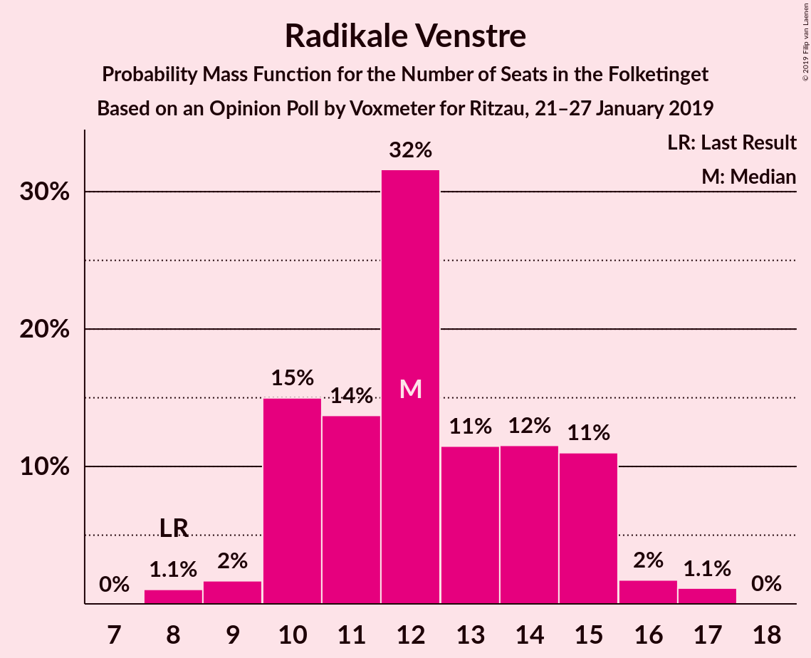

| Number of Seats | Probability | Accumulated | Special Marks |
|:---------------:|:-----------:|:-----------:|:-------------:|
| 8 | 1.1% | 100% | Last Result |
| 9 | 2% | 98.9% |  |
| 10 | 15% | 97% |  |
| 11 | 14% | 82% |  |
| 12 | 32% | 69% | Median |
| 13 | 11% | 37% |  |
| 14 | 12% | 25% |  |
| 15 | 11% | 14% |  |
| 16 | 2% | 3% |  |
| 17 | 1.1% | 1.2% |  |
| 18 | 0% | 0% |  |

### Socialistisk Folkeparti

*For a full overview of the results for this party, see the [Socialistisk Folkeparti](party-socialistiskfolkeparti.html) page.*

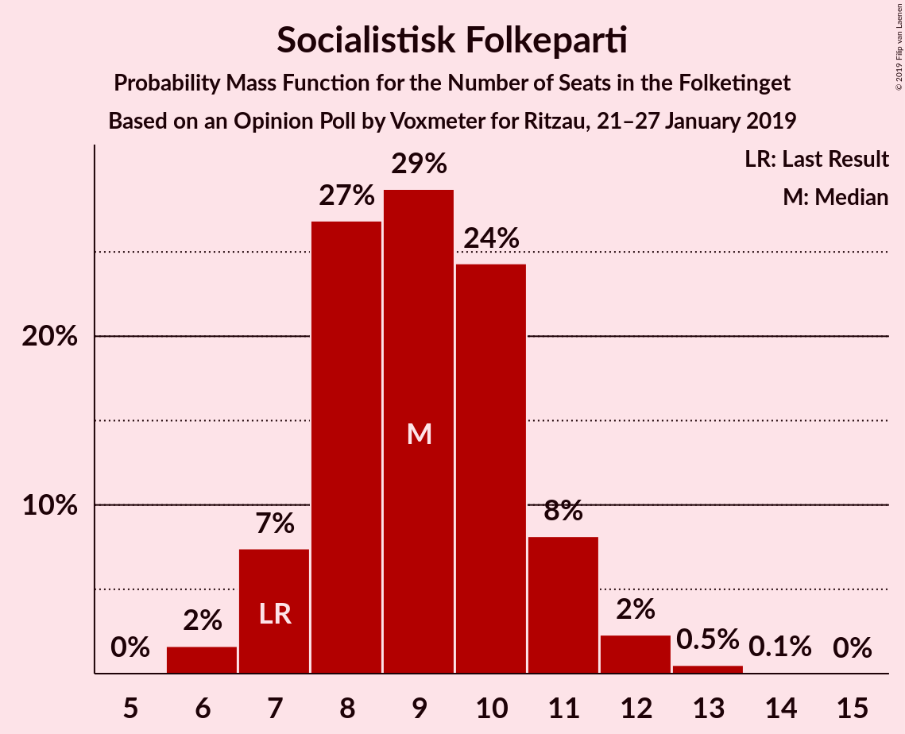

| Number of Seats | Probability | Accumulated | Special Marks |
|:---------------:|:-----------:|:-----------:|:-------------:|
| 6 | 2% | 100% |  |
| 7 | 7% | 98% | Last Result |
| 8 | 27% | 91% |  |
| 9 | 29% | 64% | Median |
| 10 | 24% | 35% |  |
| 11 | 8% | 11% |  |
| 12 | 2% | 3% |  |
| 13 | 0.5% | 0.6% |  |
| 14 | 0.1% | 0.1% |  |
| 15 | 0% | 0% |  |

### Liberal Alliance

*For a full overview of the results for this party, see the [Liberal Alliance](party-liberalalliance.html) page.*

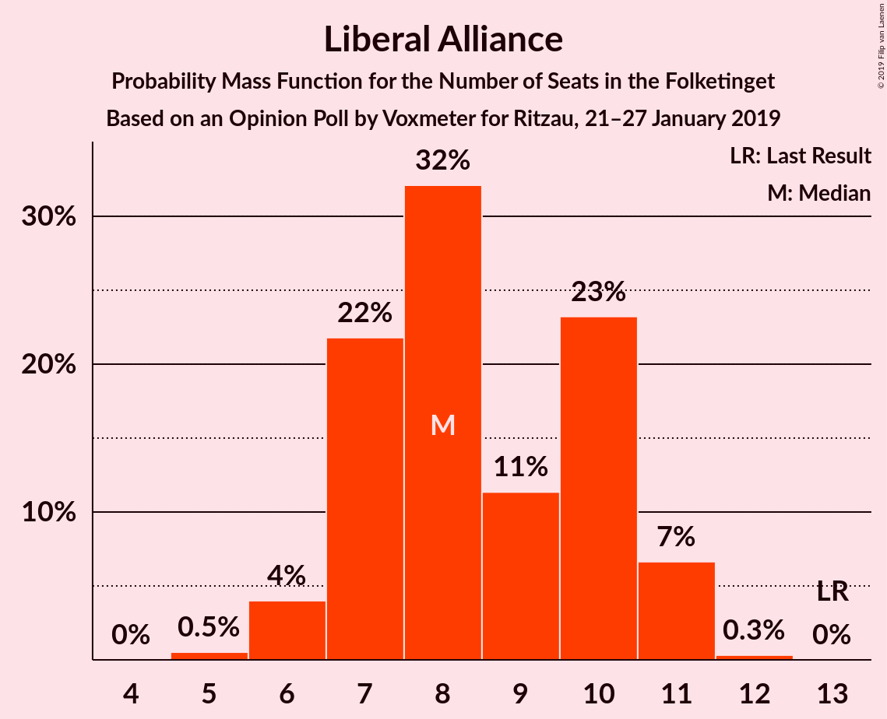

| Number of Seats | Probability | Accumulated | Special Marks |
|:---------------:|:-----------:|:-----------:|:-------------:|
| 5 | 0.5% | 100% |  |
| 6 | 4% | 99.5% |  |
| 7 | 22% | 95% |  |
| 8 | 32% | 74% | Median |
| 9 | 11% | 42% |  |
| 10 | 23% | 30% |  |
| 11 | 7% | 7% |  |
| 12 | 0.3% | 0.4% |  |
| 13 | 0% | 0% | Last Result |

### Det Konservative Folkeparti

*For a full overview of the results for this party, see the [Det Konservative Folkeparti](party-detkonservativefolkeparti.html) page.*

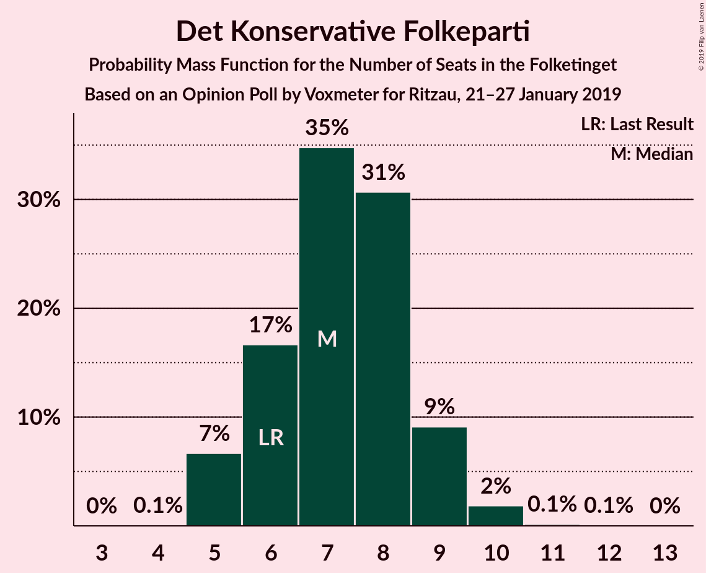

| Number of Seats | Probability | Accumulated | Special Marks |
|:---------------:|:-----------:|:-----------:|:-------------:|
| 4 | 0.1% | 100% |  |
| 5 | 7% | 99.9% |  |
| 6 | 17% | 93% | Last Result |
| 7 | 35% | 77% | Median |
| 8 | 31% | 42% |  |
| 9 | 9% | 11% |  |
| 10 | 2% | 2% |  |
| 11 | 0.1% | 0.2% |  |
| 12 | 0.1% | 0.1% |  |
| 13 | 0% | 0% |  |

### Alternativet

*For a full overview of the results for this party, see the [Alternativet](party-alternativet.html) page.*

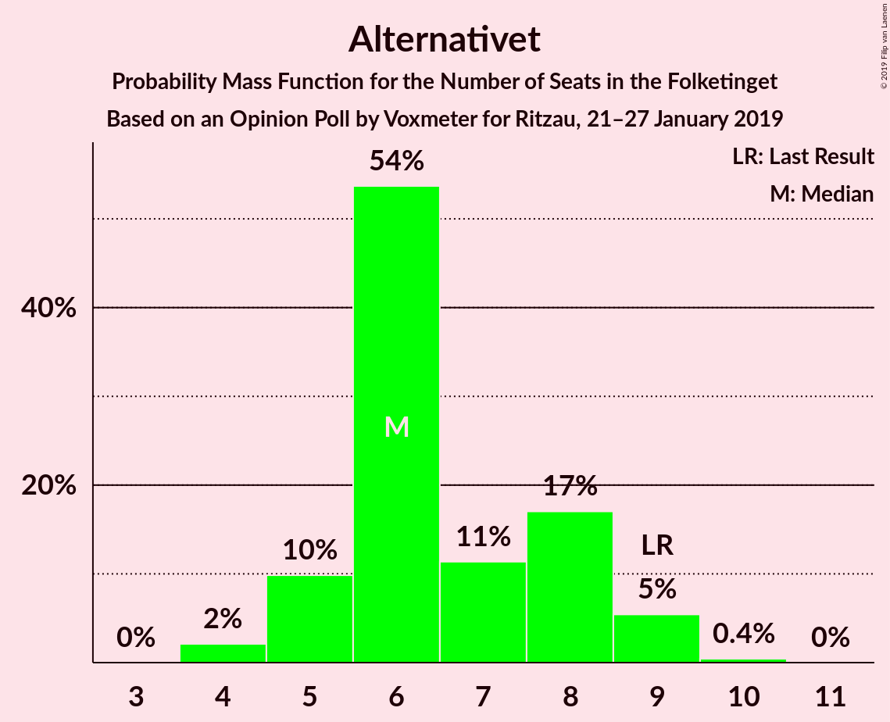

| Number of Seats | Probability | Accumulated | Special Marks |
|:---------------:|:-----------:|:-----------:|:-------------:|
| 4 | 2% | 100% |  |
| 5 | 10% | 98% |  |
| 6 | 54% | 88% | Median |
| 7 | 11% | 34% |  |
| 8 | 17% | 23% |  |
| 9 | 5% | 6% | Last Result |
| 10 | 0.4% | 0.5% |  |
| 11 | 0% | 0% |  |

### Nye Borgerlige

*For a full overview of the results for this party, see the [Nye Borgerlige](party-nyeborgerlige.html) page.*

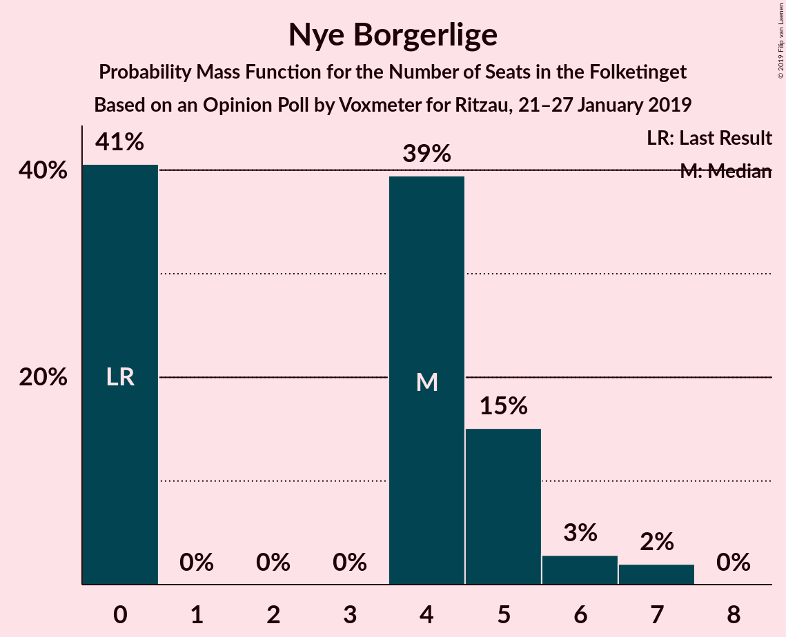

| Number of Seats | Probability | Accumulated | Special Marks |
|:---------------:|:-----------:|:-----------:|:-------------:|
| 0 | 41% | 100% | Last Result |
| 1 | 0% | 59% |  |
| 2 | 0% | 59% |  |
| 3 | 0% | 59% |  |
| 4 | 39% | 59% | Median |
| 5 | 15% | 20% |  |
| 6 | 3% | 5% |  |
| 7 | 2% | 2% |  |
| 8 | 0% | 0% |  |

### Kristendemokraterne

*For a full overview of the results for this party, see the [Kristendemokraterne](party-kristendemokraterne.html) page.*

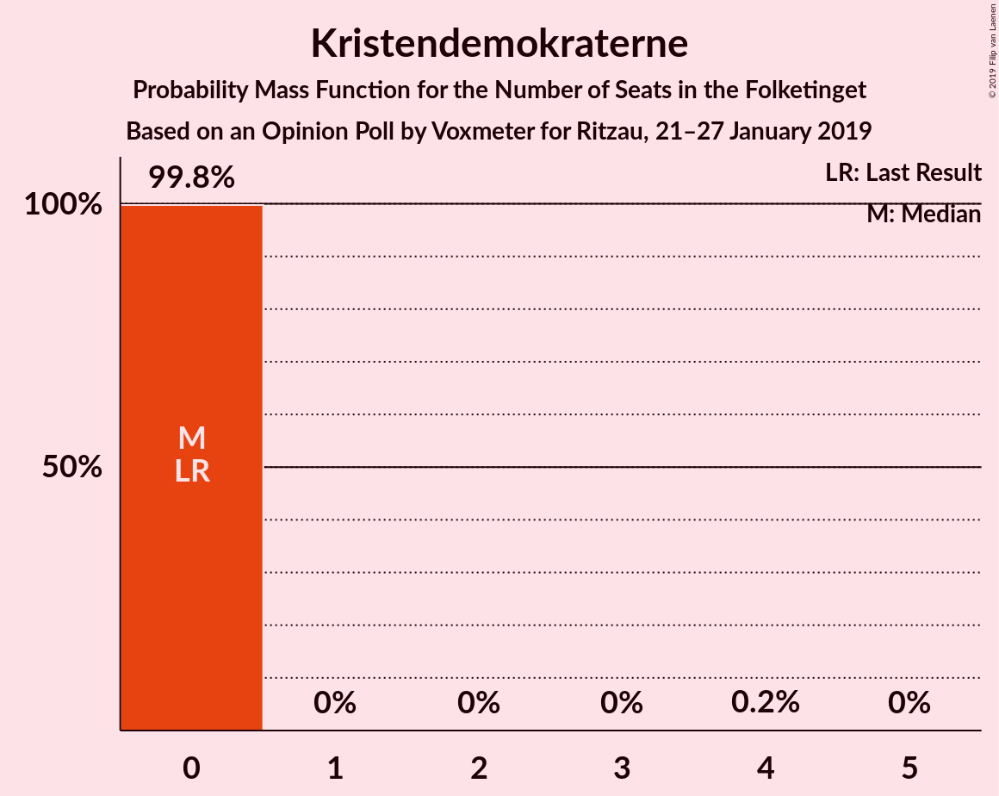

| Number of Seats | Probability | Accumulated | Special Marks |
|:---------------:|:-----------:|:-----------:|:-------------:|
| 0 | 99.8% | 100% | Last Result, Median |
| 1 | 0% | 0.2% |  |
| 2 | 0% | 0.2% |  |
| 3 | 0% | 0.2% |  |
| 4 | 0.2% | 0.2% |  |
| 5 | 0% | 0% |  |

## Coalitions

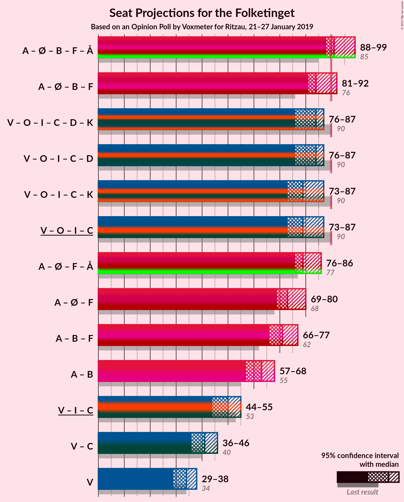

### Confidence Intervals

| Coalition | Last Result | Median | Majority? | 80% Confidence Interval | 90% Confidence Interval | 95% Confidence Interval | 99% Confidence Interval |
|:---------:|:-----------:|:------:|:---------:|:-----------------------:|:-----------------------:|:-----------------------:|:-----------------------:|
| Socialdemokraterne – Enhedslisten–De Rød-Grønne – Radikale Venstre – Socialistisk Folkeparti – Alternativet | 85 | 91 | 80% | 89–98 | 88–98 | 88–99 | 86–100 |
| Socialdemokraterne – Enhedslisten–De Rød-Grønne – Radikale Venstre – Socialistisk Folkeparti | 76 | 84 | 24% | 83–92 | 82–92 | 81–92 | 78–93 |
| Venstre – Dansk Folkeparti – Liberal Alliance – Det Konservative Folkeparti – Nye Borgerlige – Kristendemokraterne | 90 | 84 | 0.5% | 77–86 | 77–87 | 76–87 | 75–89 |
| Venstre – Dansk Folkeparti – Liberal Alliance – Det Konservative Folkeparti – Nye Borgerlige | 90 | 84 | 0.4% | 77–86 | 77–87 | 76–87 | 75–89 |
| Venstre – Dansk Folkeparti – Liberal Alliance – Det Konservative Folkeparti – Kristendemokraterne | 90 | 79 | 0% | 75–85 | 73–85 | 73–87 | 72–87 |
| Venstre – Dansk Folkeparti – Liberal Alliance – Det Konservative Folkeparti | 90 | 79 | 0% | 75–85 | 73–85 | 73–87 | 72–87 |
| Socialdemokraterne – Enhedslisten–De Rød-Grønne – Socialistisk Folkeparti – Alternativet | 77 | 79 | 0.1% | 78–85 | 77–86 | 76–86 | 74–88 |
| Socialdemokraterne – Enhedslisten–De Rød-Grønne – Socialistisk Folkeparti | 68 | 73 | 0% | 71–78 | 71–80 | 69–80 | 67–81 |
| Socialdemokraterne – Radikale Venstre – Socialistisk Folkeparti | 62 | 71 | 0% | 67–76 | 67–77 | 66–77 | 65–79 |
| Socialdemokraterne – Radikale Venstre | 55 | 63 | 0% | 58–66 | 57–68 | 57–68 | 55–70 |
| Venstre – Liberal Alliance – Det Konservative Folkeparti | 53 | 50 | 0% | 45–55 | 45–55 | 44–55 | 43–55 |
| Venstre – Det Konservative Folkeparti | 40 | 41 | 0% | 37–45 | 37–45 | 36–46 | 35–46 |
| Venstre | 34 | 34 | 0% | 31–38 | 30–38 | 29–38 | 28–39 |

### Socialdemokraterne – Enhedslisten–De Rød-Grønne – Radikale Venstre – Socialistisk Folkeparti – Alternativet

| Number of Seats | Probability | Accumulated | Special Marks |
|:---------------:|:-----------:|:-----------:|:-------------:|
| 84 | 0.1% | 100% |  |
| 85 | 0.3% | 99.8% | Last Result |
| 86 | 0.3% | 99.5% |  |
| 87 | 2% | 99.2% |  |
| 88 | 4% | 98% |  |
| 89 | 14% | 94% |  |
| 90 | 19% | 80% | Majority |
| 91 | 11% | 61% |  |
| 92 | 2% | 50% | Median |
| 93 | 8% | 48% |  |
| 94 | 8% | 40% |  |
| 95 | 6% | 31% |  |
| 96 | 7% | 25% |  |
| 97 | 4% | 18% |  |
| 98 | 12% | 15% |  |
| 99 | 2% | 3% |  |
| 100 | 0.9% | 1.2% |  |
| 101 | 0.3% | 0.4% |  |
| 102 | 0% | 0% |  |

### Socialdemokraterne – Enhedslisten–De Rød-Grønne – Radikale Venstre – Socialistisk Folkeparti

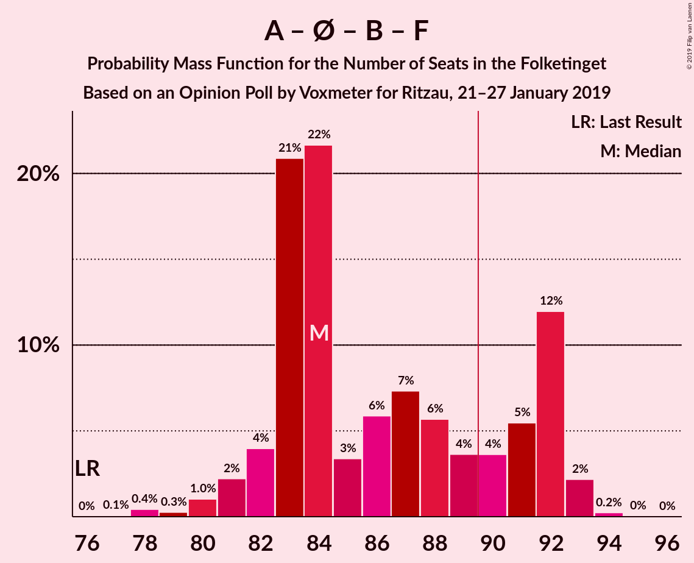

| Number of Seats | Probability | Accumulated | Special Marks |
|:---------------:|:-----------:|:-----------:|:-------------:|
| 76 | 0% | 100% | Last Result |
| 77 | 0.1% | 100% |  |
| 78 | 0.4% | 99.9% |  |
| 79 | 0.3% | 99.5% |  |
| 80 | 1.0% | 99.2% |  |
| 81 | 2% | 98% |  |
| 82 | 4% | 96% |  |
| 83 | 21% | 92% |  |
| 84 | 22% | 71% |  |
| 85 | 3% | 49% |  |
| 86 | 6% | 46% | Median |
| 87 | 7% | 40% |  |
| 88 | 6% | 33% |  |
| 89 | 4% | 27% |  |
| 90 | 4% | 24% | Majority |
| 91 | 5% | 20% |  |
| 92 | 12% | 14% |  |
| 93 | 2% | 2% |  |
| 94 | 0.2% | 0.3% |  |
| 95 | 0% | 0.1% |  |
| 96 | 0% | 0% |  |

### Venstre – Dansk Folkeparti – Liberal Alliance – Det Konservative Folkeparti – Nye Borgerlige – Kristendemokraterne

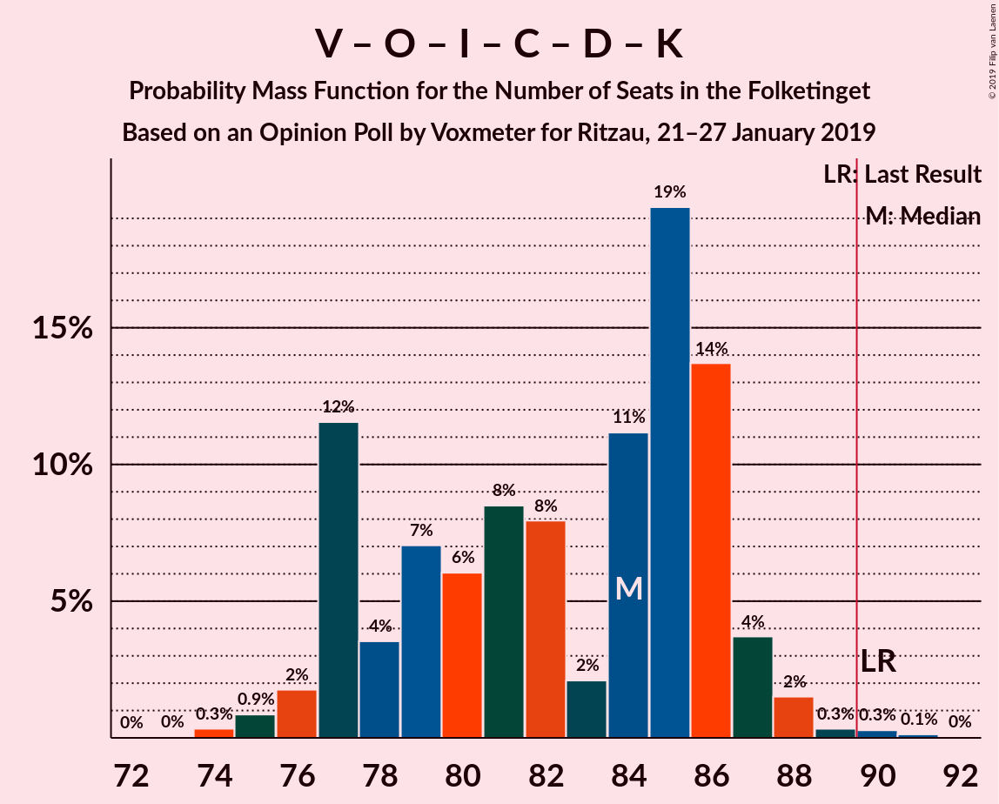

| Number of Seats | Probability | Accumulated | Special Marks |
|:---------------:|:-----------:|:-----------:|:-------------:|
| 74 | 0.3% | 100% |  |
| 75 | 0.9% | 99.6% |  |
| 76 | 2% | 98.8% |  |
| 77 | 12% | 97% |  |
| 78 | 4% | 85% |  |
| 79 | 7% | 82% |  |
| 80 | 6% | 75% |  |
| 81 | 8% | 69% |  |
| 82 | 8% | 60% |  |
| 83 | 2% | 52% | Median |
| 84 | 11% | 50% |  |
| 85 | 19% | 39% |  |
| 86 | 14% | 20% |  |
| 87 | 4% | 6% |  |
| 88 | 2% | 2% |  |
| 89 | 0.3% | 0.8% |  |
| 90 | 0.3% | 0.5% | Last Result, Majority |
| 91 | 0.1% | 0.2% |  |
| 92 | 0% | 0% |  |

### Venstre – Dansk Folkeparti – Liberal Alliance – Det Konservative Folkeparti – Nye Borgerlige

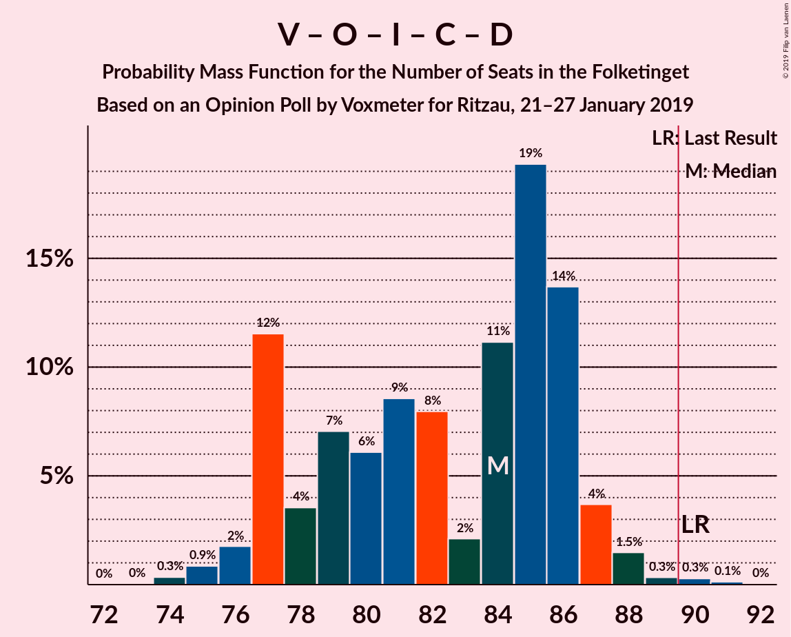

| Number of Seats | Probability | Accumulated | Special Marks |
|:---------------:|:-----------:|:-----------:|:-------------:|
| 73 | 0% | 100% |  |
| 74 | 0.3% | 99.9% |  |
| 75 | 0.9% | 99.6% |  |
| 76 | 2% | 98.7% |  |
| 77 | 12% | 97% |  |
| 78 | 4% | 85% |  |
| 79 | 7% | 82% |  |
| 80 | 6% | 75% |  |
| 81 | 9% | 69% |  |
| 82 | 8% | 60% |  |
| 83 | 2% | 52% | Median |
| 84 | 11% | 50% |  |
| 85 | 19% | 39% |  |
| 86 | 14% | 20% |  |
| 87 | 4% | 6% |  |
| 88 | 1.5% | 2% |  |
| 89 | 0.3% | 0.8% |  |
| 90 | 0.3% | 0.4% | Last Result, Majority |
| 91 | 0.1% | 0.2% |  |
| 92 | 0% | 0% |  |

### Venstre – Dansk Folkeparti – Liberal Alliance – Det Konservative Folkeparti – Kristendemokraterne

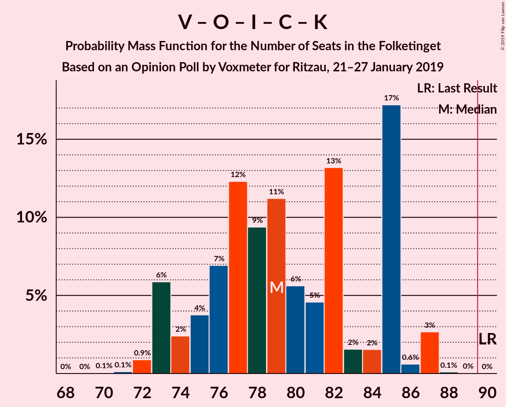

| Number of Seats | Probability | Accumulated | Special Marks |
|:---------------:|:-----------:|:-----------:|:-------------:|
| 70 | 0.1% | 100% |  |
| 71 | 0.1% | 99.9% |  |
| 72 | 0.9% | 99.8% |  |
| 73 | 6% | 98.9% |  |
| 74 | 2% | 93% |  |
| 75 | 4% | 91% |  |
| 76 | 7% | 87% |  |
| 77 | 12% | 80% |  |
| 78 | 9% | 68% |  |
| 79 | 11% | 58% | Median |
| 80 | 6% | 47% |  |
| 81 | 5% | 41% |  |
| 82 | 13% | 37% |  |
| 83 | 2% | 24% |  |
| 84 | 2% | 22% |  |
| 85 | 17% | 21% |  |
| 86 | 0.6% | 3% |  |
| 87 | 3% | 3% |  |
| 88 | 0.1% | 0.1% |  |
| 89 | 0% | 0% |  |
| 90 | 0% | 0% | Last Result, Majority |

### Venstre – Dansk Folkeparti – Liberal Alliance – Det Konservative Folkeparti

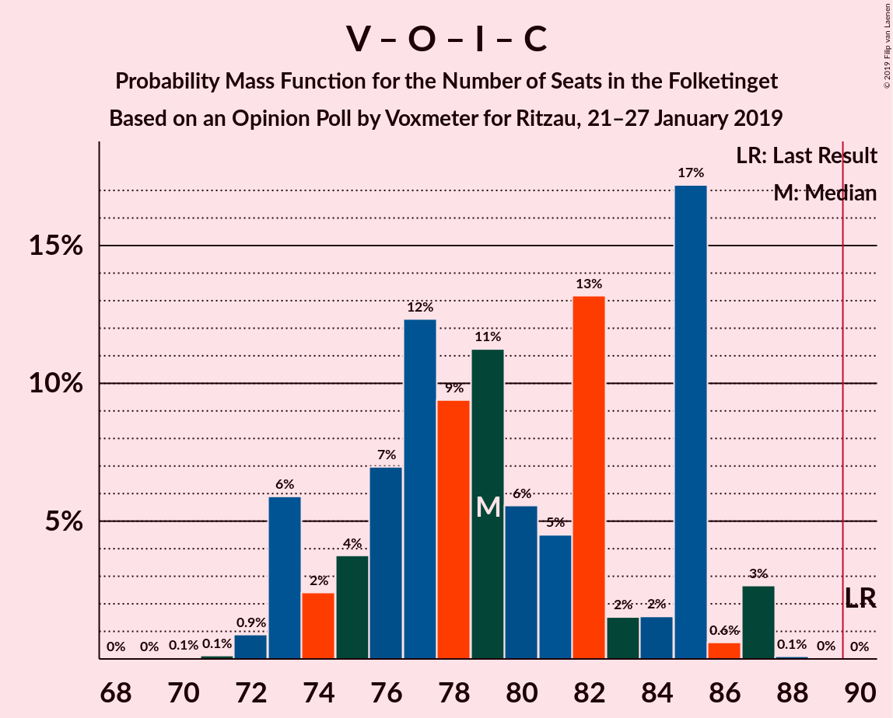

| Number of Seats | Probability | Accumulated | Special Marks |
|:---------------:|:-----------:|:-----------:|:-------------:|
| 70 | 0.1% | 100% |  |
| 71 | 0.1% | 99.9% |  |
| 72 | 0.9% | 99.8% |  |
| 73 | 6% | 98.9% |  |
| 74 | 2% | 93% |  |
| 75 | 4% | 91% |  |
| 76 | 7% | 87% |  |
| 77 | 12% | 80% |  |
| 78 | 9% | 68% |  |
| 79 | 11% | 58% | Median |
| 80 | 6% | 47% |  |
| 81 | 5% | 41% |  |
| 82 | 13% | 37% |  |
| 83 | 2% | 24% |  |
| 84 | 2% | 22% |  |
| 85 | 17% | 21% |  |
| 86 | 0.6% | 3% |  |
| 87 | 3% | 3% |  |
| 88 | 0.1% | 0.1% |  |
| 89 | 0% | 0% |  |
| 90 | 0% | 0% | Last Result, Majority |

### Socialdemokraterne – Enhedslisten–De Rød-Grønne – Socialistisk Folkeparti – Alternativet

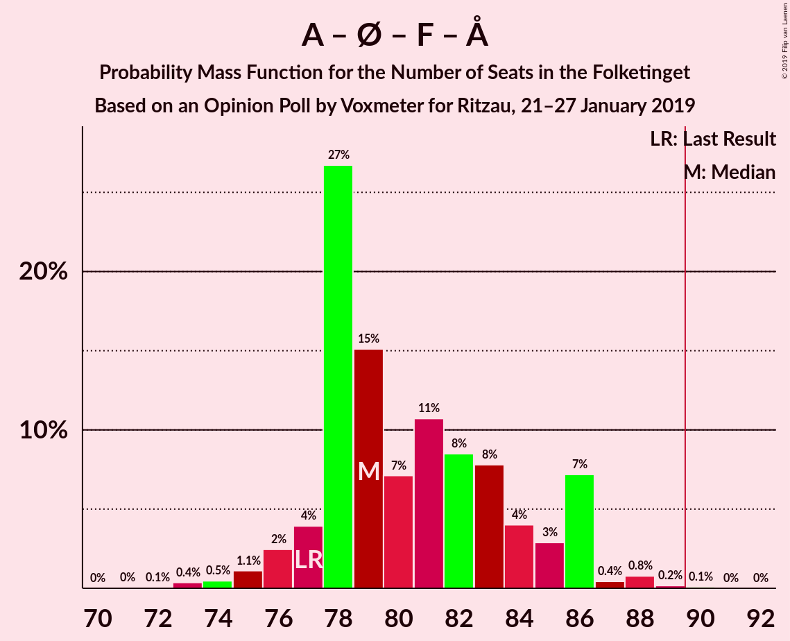

| Number of Seats | Probability | Accumulated | Special Marks |
|:---------------:|:-----------:|:-----------:|:-------------:|
| 71 | 0% | 100% |  |
| 72 | 0.1% | 99.9% |  |
| 73 | 0.4% | 99.9% |  |
| 74 | 0.5% | 99.5% |  |
| 75 | 1.1% | 99.0% |  |
| 76 | 2% | 98% |  |
| 77 | 4% | 95% | Last Result |
| 78 | 27% | 92% |  |
| 79 | 15% | 65% |  |
| 80 | 7% | 50% | Median |
| 81 | 11% | 43% |  |
| 82 | 8% | 32% |  |
| 83 | 8% | 23% |  |
| 84 | 4% | 16% |  |
| 85 | 3% | 12% |  |
| 86 | 7% | 9% |  |
| 87 | 0.4% | 1.5% |  |
| 88 | 0.8% | 1.1% |  |
| 89 | 0.2% | 0.3% |  |
| 90 | 0.1% | 0.1% | Majority |
| 91 | 0% | 0% |  |

### Socialdemokraterne – Enhedslisten–De Rød-Grønne – Socialistisk Folkeparti

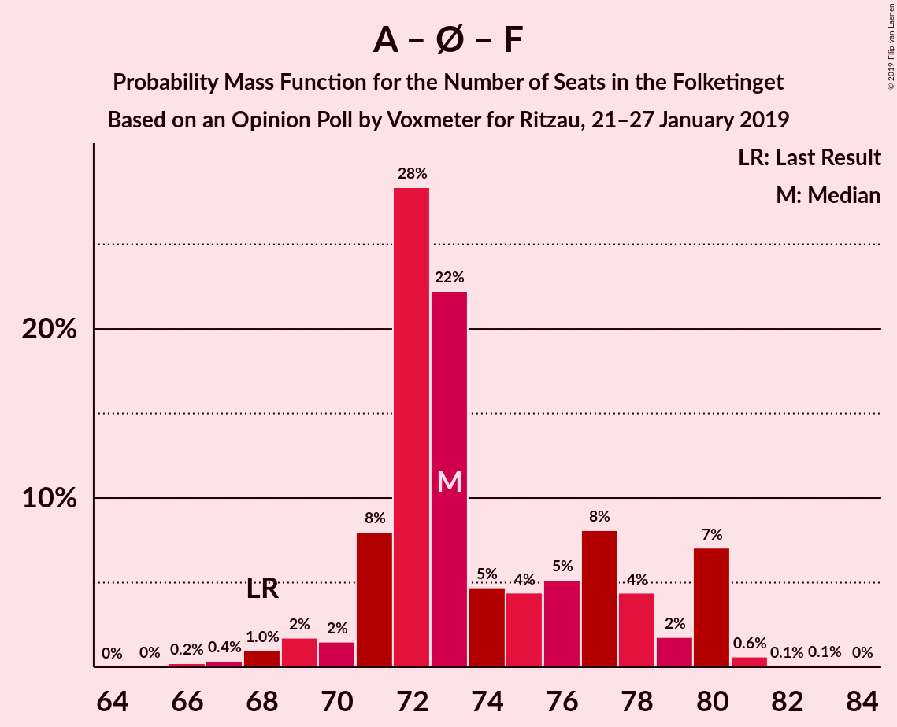

| Number of Seats | Probability | Accumulated | Special Marks |
|:---------------:|:-----------:|:-----------:|:-------------:|
| 65 | 0% | 100% |  |
| 66 | 0.2% | 99.9% |  |
| 67 | 0.4% | 99.7% |  |
| 68 | 1.0% | 99.3% | Last Result |
| 69 | 2% | 98% |  |
| 70 | 2% | 97% |  |
| 71 | 8% | 95% |  |
| 72 | 28% | 87% |  |
| 73 | 22% | 59% |  |
| 74 | 5% | 36% | Median |
| 75 | 4% | 32% |  |
| 76 | 5% | 27% |  |
| 77 | 8% | 22% |  |
| 78 | 4% | 14% |  |
| 79 | 2% | 10% |  |
| 80 | 7% | 8% |  |
| 81 | 0.6% | 0.8% |  |
| 82 | 0.1% | 0.2% |  |
| 83 | 0.1% | 0.1% |  |
| 84 | 0% | 0% |  |

### Socialdemokraterne – Radikale Venstre – Socialistisk Folkeparti

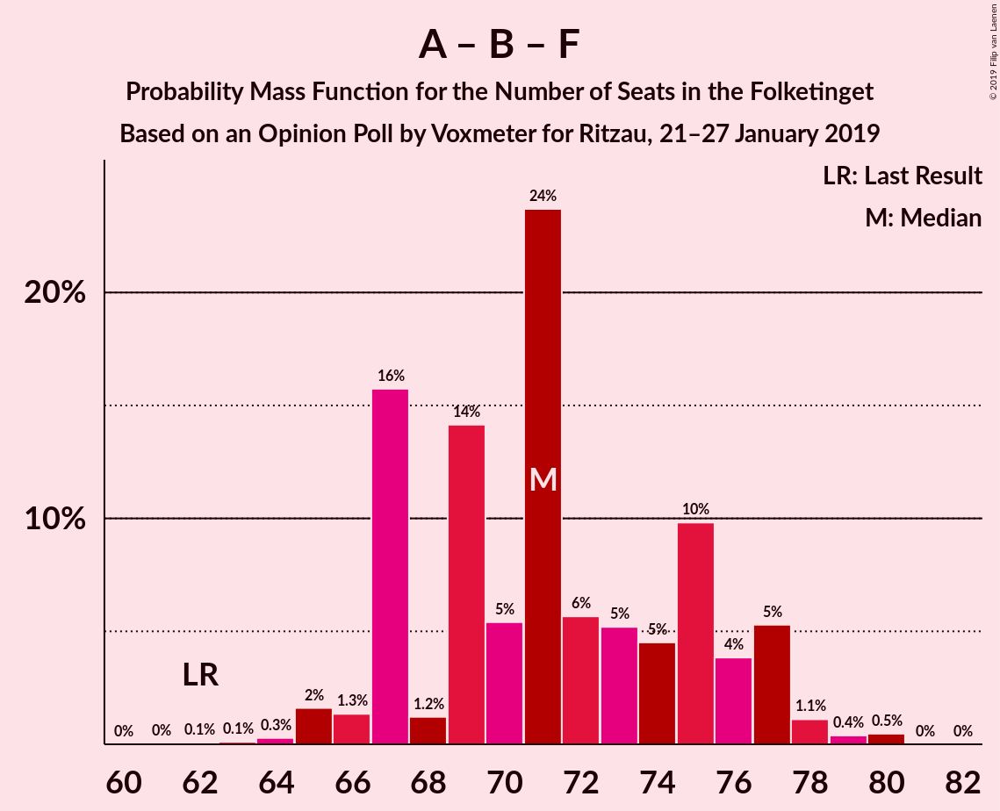

| Number of Seats | Probability | Accumulated | Special Marks |
|:---------------:|:-----------:|:-----------:|:-------------:|
| 62 | 0.1% | 100% | Last Result |
| 63 | 0.1% | 99.9% |  |
| 64 | 0.3% | 99.8% |  |
| 65 | 2% | 99.5% |  |
| 66 | 1.3% | 98% |  |
| 67 | 16% | 97% |  |
| 68 | 1.2% | 81% |  |
| 69 | 14% | 80% |  |
| 70 | 5% | 65% |  |
| 71 | 24% | 60% | Median |
| 72 | 6% | 36% |  |
| 73 | 5% | 31% |  |
| 74 | 5% | 25% |  |
| 75 | 10% | 21% |  |
| 76 | 4% | 11% |  |
| 77 | 5% | 7% |  |
| 78 | 1.1% | 2% |  |
| 79 | 0.4% | 0.9% |  |
| 80 | 0.5% | 0.5% |  |
| 81 | 0% | 0% |  |

### Socialdemokraterne – Radikale Venstre

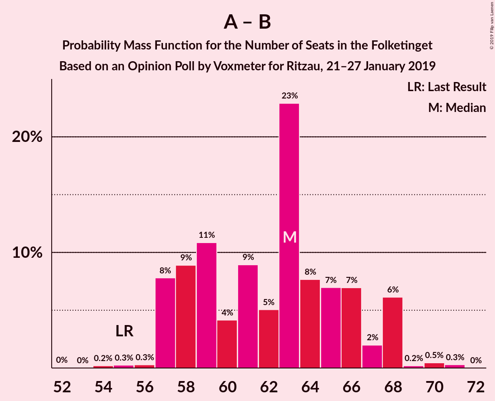

| Number of Seats | Probability | Accumulated | Special Marks |
|:---------------:|:-----------:|:-----------:|:-------------:|
| 53 | 0% | 100% |  |
| 54 | 0.2% | 99.9% |  |
| 55 | 0.3% | 99.7% | Last Result |
| 56 | 0.3% | 99.5% |  |
| 57 | 8% | 99.2% |  |
| 58 | 9% | 91% |  |
| 59 | 11% | 83% |  |
| 60 | 4% | 72% |  |
| 61 | 9% | 68% |  |
| 62 | 5% | 59% | Median |
| 63 | 23% | 54% |  |
| 64 | 8% | 31% |  |
| 65 | 7% | 23% |  |
| 66 | 7% | 16% |  |
| 67 | 2% | 9% |  |
| 68 | 6% | 7% |  |
| 69 | 0.2% | 1.0% |  |
| 70 | 0.5% | 0.8% |  |
| 71 | 0.3% | 0.3% |  |
| 72 | 0% | 0% |  |

### Venstre – Liberal Alliance – Det Konservative Folkeparti

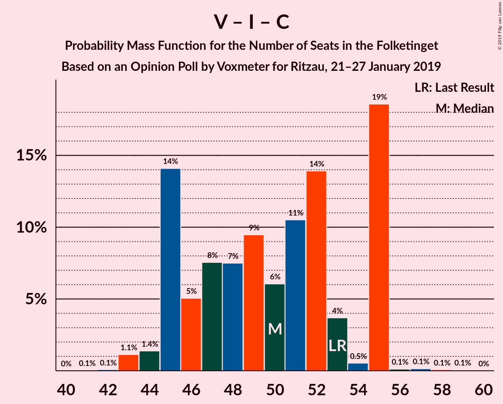

| Number of Seats | Probability | Accumulated | Special Marks |
|:---------------:|:-----------:|:-----------:|:-------------:|
| 41 | 0.1% | 100% |  |
| 42 | 0.1% | 99.9% |  |
| 43 | 1.1% | 99.9% |  |
| 44 | 1.4% | 98.7% |  |
| 45 | 14% | 97% |  |
| 46 | 5% | 83% |  |
| 47 | 8% | 78% |  |
| 48 | 7% | 71% |  |
| 49 | 9% | 63% | Median |
| 50 | 6% | 54% |  |
| 51 | 11% | 48% |  |
| 52 | 14% | 37% |  |
| 53 | 4% | 23% | Last Result |
| 54 | 0.5% | 20% |  |
| 55 | 19% | 19% |  |
| 56 | 0.1% | 0.4% |  |
| 57 | 0.1% | 0.3% |  |
| 58 | 0.1% | 0.1% |  |
| 59 | 0.1% | 0.1% |  |
| 60 | 0% | 0% |  |

### Venstre – Det Konservative Folkeparti

| Number of Seats | Probability | Accumulated | Special Marks |
|:---------------:|:-----------:|:-----------:|:-------------:|
| 33 | 0.1% | 100% |  |
| 34 | 0.1% | 99.9% |  |
| 35 | 1.0% | 99.8% |  |
| 36 | 2% | 98.8% |  |
| 37 | 13% | 97% |  |
| 38 | 4% | 83% |  |
| 39 | 10% | 79% |  |
| 40 | 6% | 70% | Last Result |
| 41 | 17% | 63% | Median |
| 42 | 5% | 46% |  |
| 43 | 10% | 41% |  |
| 44 | 1.3% | 31% |  |
| 45 | 26% | 30% |  |
| 46 | 3% | 4% |  |
| 47 | 0.2% | 0.5% |  |
| 48 | 0.2% | 0.3% |  |
| 49 | 0% | 0.1% |  |
| 50 | 0% | 0% |  |

### Venstre

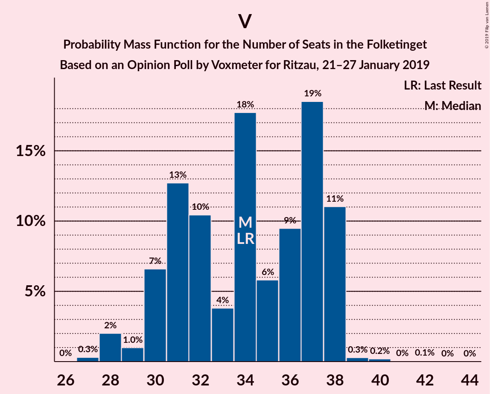

| Number of Seats | Probability | Accumulated | Special Marks |
|:---------------:|:-----------:|:-----------:|:-------------:|
| 27 | 0.3% | 100% |  |
| 28 | 2% | 99.7% |  |
| 29 | 1.0% | 98% |  |
| 30 | 7% | 97% |  |
| 31 | 13% | 90% |  |
| 32 | 10% | 77% |  |
| 33 | 4% | 67% |  |
| 34 | 18% | 63% | Last Result, Median |
| 35 | 6% | 45% |  |
| 36 | 9% | 40% |  |
| 37 | 19% | 30% |  |
| 38 | 11% | 12% |  |
| 39 | 0.3% | 0.6% |  |
| 40 | 0.2% | 0.3% |  |
| 41 | 0% | 0.1% |  |
| 42 | 0.1% | 0.1% |  |
| 43 | 0% | 0% |  |

## Technical Information

### Opinion Poll

+ **Polling firm:** Voxmeter
+ **Commissioner(s):** Ritzau
+ **Fieldwork period:** 21–27 January 2019

### Calculations

+ **Sample size:** 1039
+ **Simulations done:** 1,048,576
+ **Error estimate:** 2.03%

