# Opinion Poll by Megafon for Politiken and TV 2, 28–31 January 2019

<a href="#voting-intentions">Voting Intentions</a> | <a href="#seats">Seats</a> | <a href="#coalitions">Coalitions</a> | <a href="#technical-information">Technical Information</a>

## Voting Intentions

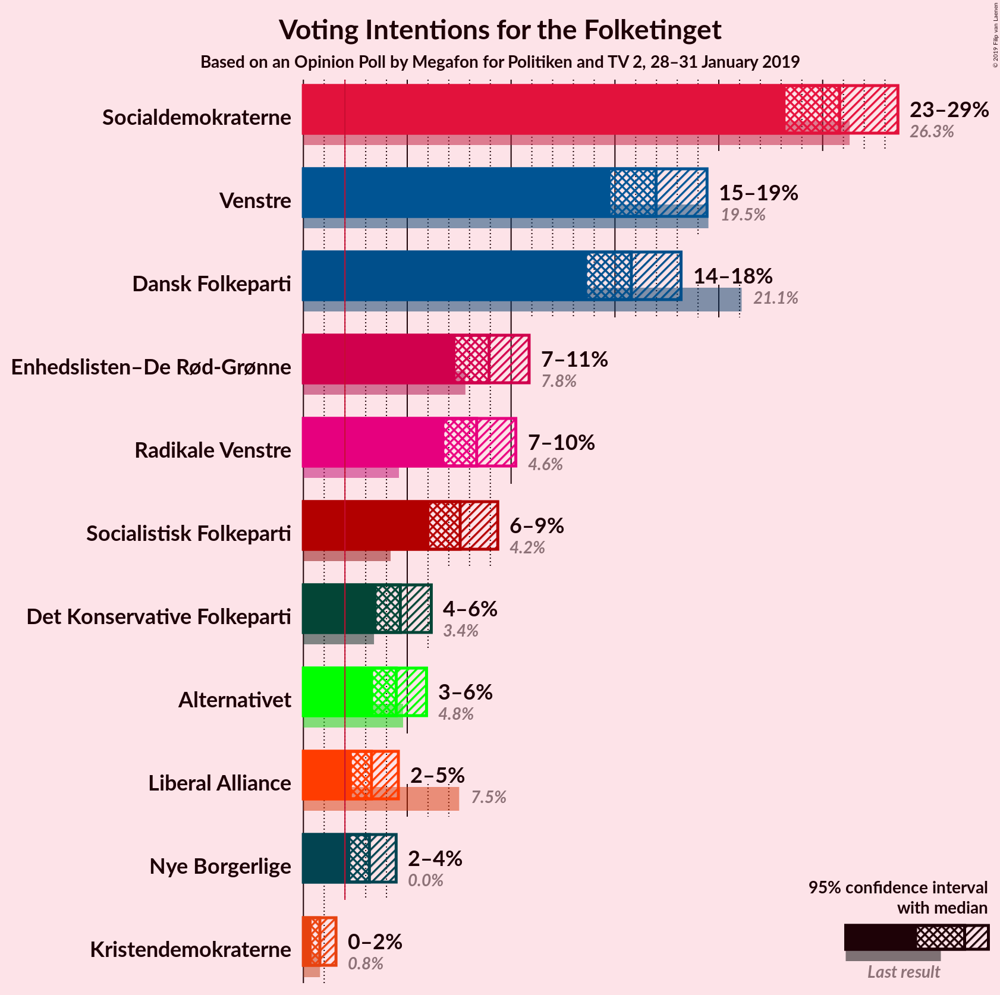

### Confidence Intervals

| Party | Last Result | Poll Result | 80% Confidence Interval | 90% Confidence Interval | 95% Confidence Interval | 99% Confidence Interval |
|:-----:|:-----------:|:-----------:|:-----------------------:|:-----------------------:|:-----------------------:|:-----------------------:|
| Socialdemokraterne | 26.3% | 25.8% | 24.1–27.6% |23.6–28.2% |23.2–28.6% |22.4–29.5% |
| Venstre | 19.5% | 17.0% | 15.5–18.6% |15.1–19.0% |14.8–19.4% |14.1–20.2% |
| Dansk Folkeparti | 21.1% | 15.8% | 14.4–17.3% |14.0–17.8% |13.7–18.2% |13.0–18.9% |
| Enhedslisten–De Rød-Grønne | 7.8% | 8.9% | 7.9–10.2% |7.6–10.5% |7.3–10.9% |6.8–11.5% |
| Radikale Venstre | 4.6% | 8.3% | 7.3–9.6% |7.0–9.9% |6.8–10.2% |6.3–10.8% |
| Socialistisk Folkeparti | 4.2% | 7.5% | 6.6–8.7% |6.3–9.1% |6.1–9.4% |5.6–10.0% |
| Det Konservative Folkeparti | 3.4% | 4.7% | 3.9–5.6% |3.7–5.9% |3.5–6.2% |3.2–6.7% |
| Alternativet | 4.8% | 4.5% | 3.7–5.4% |3.5–5.7% |3.4–5.9% |3.0–6.4% |
| Liberal Alliance | 7.5% | 3.3% | 2.7–4.1% |2.5–4.4% |2.3–4.6% |2.1–5.0% |
| Nye Borgerlige | 0.0% | 3.2% | 2.6–4.0% |2.4–4.3% |2.3–4.5% |2.0–4.9% |
| Kristendemokraterne | 0.8% | 0.8% | 0.5–1.3% |0.5–1.4% |0.4–1.6% |0.3–1.8% |

*Note:* The poll result column reflects the actual value used in the calculations. Published results may vary slightly, and in addition be rounded to fewer digits.

## Seats

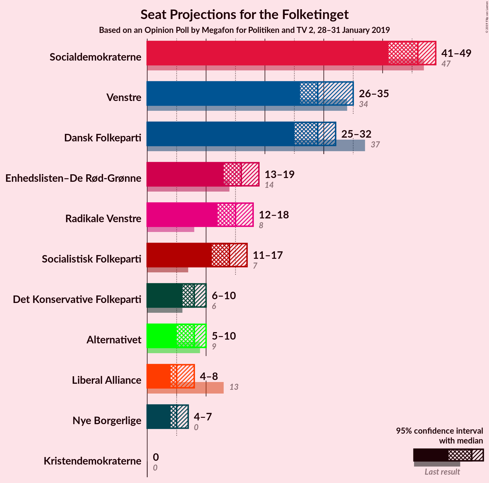

### Confidence Intervals

| Party | Last Result | Median | 80% Confidence Interval | 90% Confidence Interval | 95% Confidence Interval | 99% Confidence Interval |
|:-----:|:-----------:|:------:|:-----------------------:|:-----------------------:|:-----------------------:|:-----------------------:|
| <a href="#socialdemokraterne">Socialdemokraterne</a> | 47 | 46 | 43–47 |42–48 |41–49 |40–51 |
| <a href="#venstre">Venstre</a> | 34 | 29 | 27–32 |26–33 |26–35 |25–35 |
| <a href="#dansk-folkeparti">Dansk Folkeparti</a> | 37 | 29 | 26–30 |25–31 |25–32 |23–34 |
| <a href="#enhedslisten–de-rød-grønne">Enhedslisten–De Rød-Grønne</a> | 14 | 16 | 14–17 |13–18 |13–19 |12–20 |
| <a href="#radikale-venstre">Radikale Venstre</a> | 8 | 15 | 13–17 |13–17 |12–18 |11–19 |
| <a href="#socialistisk-folkeparti">Socialistisk Folkeparti</a> | 7 | 14 | 12–16 |11–17 |11–17 |10–17 |
| <a href="#det-konservative-folkeparti">Det Konservative Folkeparti</a> | 6 | 8 | 7–9 |7–10 |6–10 |6–11 |
| <a href="#alternativet">Alternativet</a> | 9 | 8 | 6–9 |6–9 |5–10 |5–11 |
| <a href="#liberal-alliance">Liberal Alliance</a> | 13 | 5 | 5–7 |4–8 |4–8 |0–8 |
| <a href="#nye-borgerlige">Nye Borgerlige</a> | 0 | 5 | 5–6 |5–7 |4–7 |4–8 |
| <a href="#kristendemokraterne">Kristendemokraterne</a> | 0 | 0 | 0 |0 |0 |0 |

### Socialdemokraterne

*For a full overview of the results for this party, see the [Socialdemokraterne](party-socialdemokraterne.html) page.*

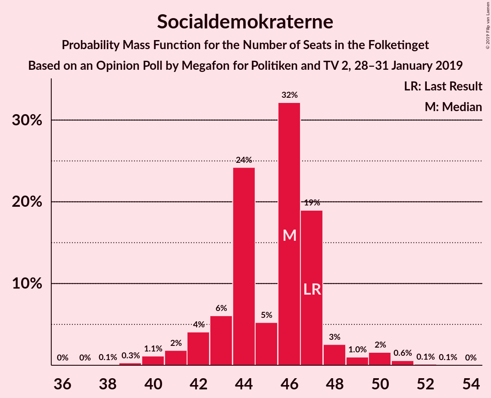

| Number of Seats | Probability | Accumulated | Special Marks |
|:---------------:|:-----------:|:-----------:|:-------------:|
| 38 | 0.1% | 100% |  |
| 39 | 0.3% | 99.9% |  |
| 40 | 1.1% | 99.6% |  |
| 41 | 2% | 98% |  |
| 42 | 4% | 97% |  |
| 43 | 6% | 93% |  |
| 44 | 24% | 86% |  |
| 45 | 5% | 62% |  |
| 46 | 32% | 57% | Median |
| 47 | 19% | 25% | Last Result |
| 48 | 3% | 6% |  |
| 49 | 1.0% | 3% |  |
| 50 | 2% | 2% |  |
| 51 | 0.6% | 0.8% |  |
| 52 | 0.1% | 0.2% |  |
| 53 | 0.1% | 0.1% |  |
| 54 | 0% | 0% |  |

### Venstre

*For a full overview of the results for this party, see the [Venstre](party-venstre.html) page.*

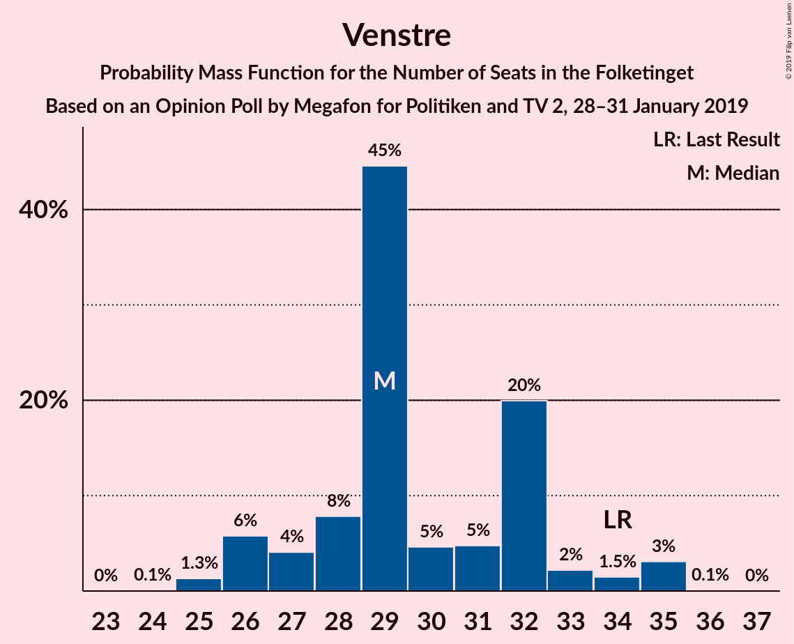

| Number of Seats | Probability | Accumulated | Special Marks |
|:---------------:|:-----------:|:-----------:|:-------------:|
| 24 | 0.1% | 100% |  |
| 25 | 1.3% | 99.9% |  |
| 26 | 6% | 98.6% |  |
| 27 | 4% | 93% |  |
| 28 | 8% | 89% |  |
| 29 | 45% | 81% | Median |
| 30 | 5% | 36% |  |
| 31 | 5% | 32% |  |
| 32 | 20% | 27% |  |
| 33 | 2% | 7% |  |
| 34 | 1.5% | 5% | Last Result |
| 35 | 3% | 3% |  |
| 36 | 0.1% | 0.1% |  |
| 37 | 0% | 0% |  |

### Dansk Folkeparti

*For a full overview of the results for this party, see the [Dansk Folkeparti](party-danskfolkeparti.html) page.*

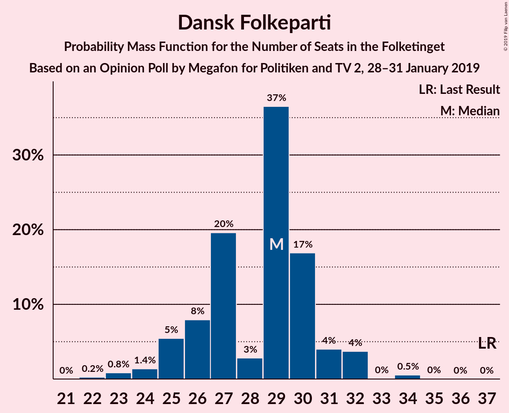

| Number of Seats | Probability | Accumulated | Special Marks |
|:---------------:|:-----------:|:-----------:|:-------------:|
| 22 | 0.2% | 100% |  |
| 23 | 0.8% | 99.7% |  |
| 24 | 1.4% | 98.9% |  |
| 25 | 5% | 98% |  |
| 26 | 8% | 92% |  |
| 27 | 20% | 84% |  |
| 28 | 3% | 65% |  |
| 29 | 37% | 62% | Median |
| 30 | 17% | 25% |  |
| 31 | 4% | 8% |  |
| 32 | 4% | 4% |  |
| 33 | 0% | 0.6% |  |
| 34 | 0.5% | 0.6% |  |
| 35 | 0% | 0% |  |
| 36 | 0% | 0% |  |
| 37 | 0% | 0% | Last Result |

### Enhedslisten–De Rød-Grønne

*For a full overview of the results for this party, see the [Enhedslisten–De Rød-Grønne](party-enhedslisten–derød-grønne.html) page.*

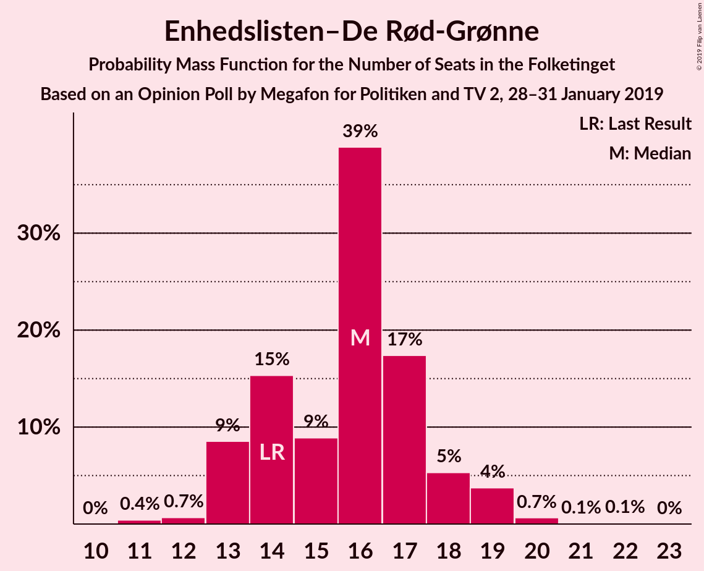

| Number of Seats | Probability | Accumulated | Special Marks |
|:---------------:|:-----------:|:-----------:|:-------------:|
| 11 | 0.4% | 100% |  |
| 12 | 0.7% | 99.6% |  |
| 13 | 9% | 98.9% |  |
| 14 | 15% | 90% | Last Result |
| 15 | 9% | 75% |  |
| 16 | 39% | 66% | Median |
| 17 | 17% | 27% |  |
| 18 | 5% | 10% |  |
| 19 | 4% | 5% |  |
| 20 | 0.7% | 0.8% |  |
| 21 | 0.1% | 0.2% |  |
| 22 | 0.1% | 0.1% |  |
| 23 | 0% | 0% |  |

### Radikale Venstre

*For a full overview of the results for this party, see the [Radikale Venstre](party-radikalevenstre.html) page.*

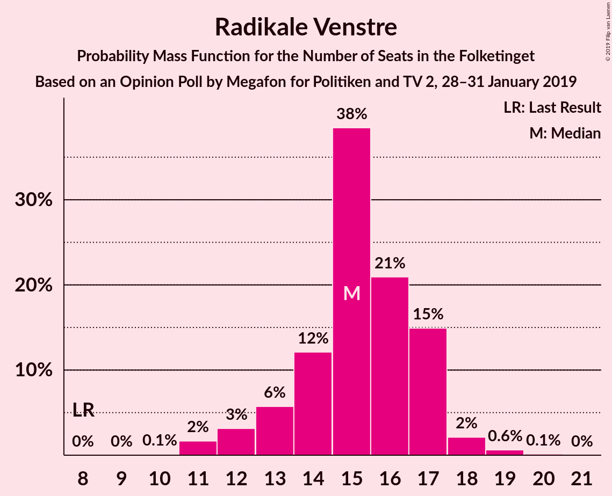

| Number of Seats | Probability | Accumulated | Special Marks |
|:---------------:|:-----------:|:-----------:|:-------------:|
| 8 | 0% | 100% | Last Result |
| 9 | 0% | 100% |  |
| 10 | 0.1% | 100% |  |
| 11 | 2% | 99.9% |  |
| 12 | 3% | 98% |  |
| 13 | 6% | 95% |  |
| 14 | 12% | 89% |  |
| 15 | 38% | 77% | Median |
| 16 | 21% | 39% |  |
| 17 | 15% | 18% |  |
| 18 | 2% | 3% |  |
| 19 | 0.6% | 0.8% |  |
| 20 | 0.1% | 0.2% |  |
| 21 | 0% | 0% |  |

### Socialistisk Folkeparti

*For a full overview of the results for this party, see the [Socialistisk Folkeparti](party-socialistiskfolkeparti.html) page.*

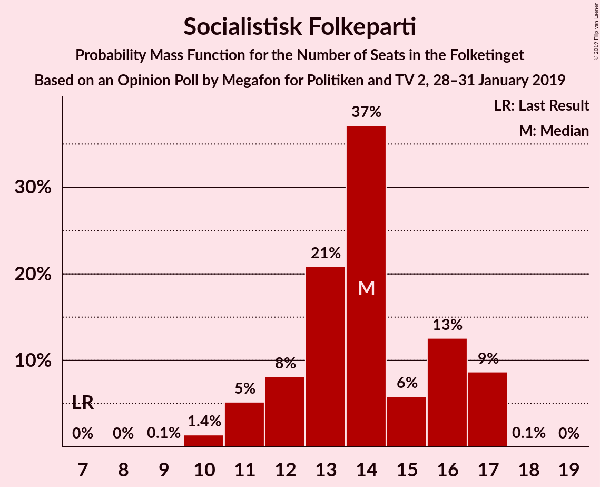

| Number of Seats | Probability | Accumulated | Special Marks |
|:---------------:|:-----------:|:-----------:|:-------------:|
| 7 | 0% | 100% | Last Result |
| 8 | 0% | 100% |  |
| 9 | 0.1% | 100% |  |
| 10 | 1.4% | 99.9% |  |
| 11 | 5% | 98.5% |  |
| 12 | 8% | 93% |  |
| 13 | 21% | 85% |  |
| 14 | 37% | 64% | Median |
| 15 | 6% | 27% |  |
| 16 | 13% | 21% |  |
| 17 | 9% | 9% |  |
| 18 | 0.1% | 0.1% |  |
| 19 | 0% | 0% |  |

### Det Konservative Folkeparti

*For a full overview of the results for this party, see the [Det Konservative Folkeparti](party-detkonservativefolkeparti.html) page.*

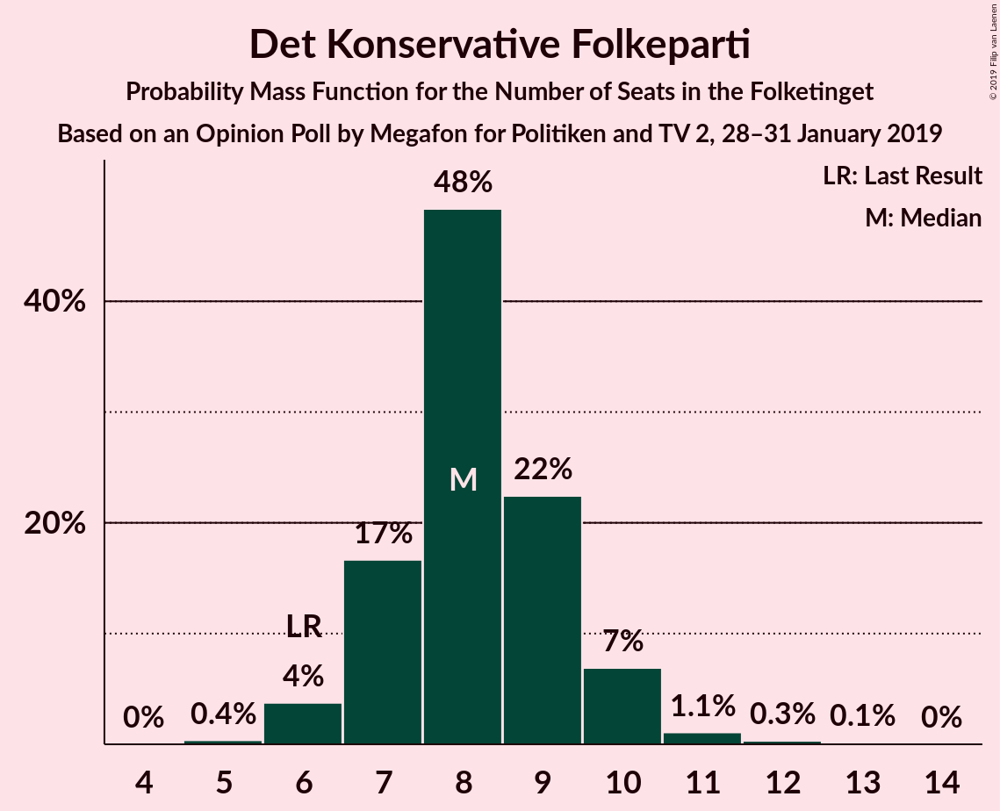

| Number of Seats | Probability | Accumulated | Special Marks |
|:---------------:|:-----------:|:-----------:|:-------------:|
| 5 | 0.4% | 100% |  |
| 6 | 4% | 99.6% | Last Result |
| 7 | 17% | 96% |  |
| 8 | 48% | 79% | Median |
| 9 | 22% | 31% |  |
| 10 | 7% | 8% |  |
| 11 | 1.1% | 2% |  |
| 12 | 0.3% | 0.5% |  |
| 13 | 0.1% | 0.2% |  |
| 14 | 0% | 0% |  |

### Alternativet

*For a full overview of the results for this party, see the [Alternativet](party-alternativet.html) page.*

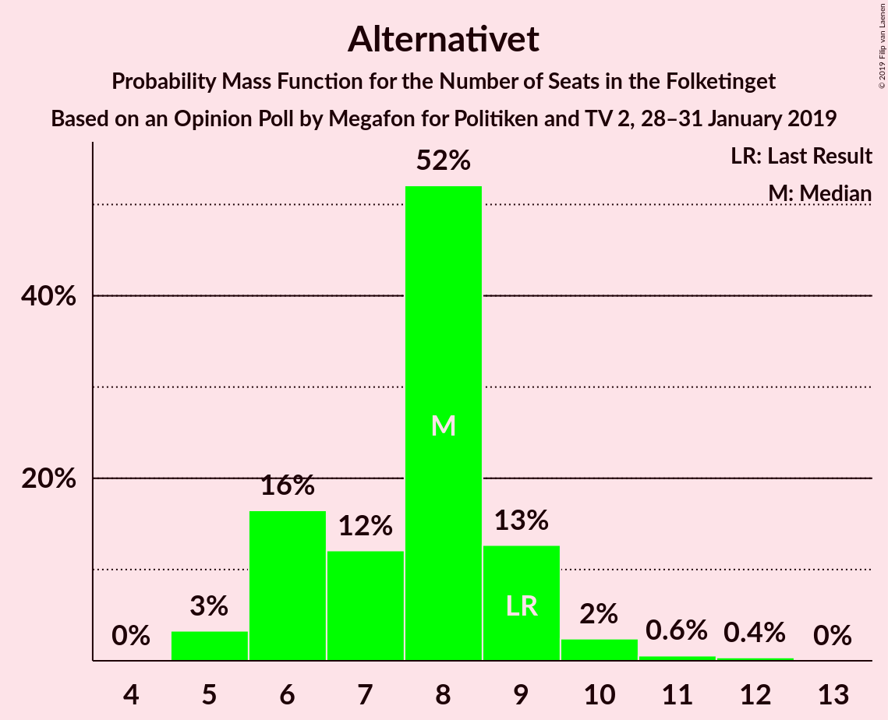

| Number of Seats | Probability | Accumulated | Special Marks |
|:---------------:|:-----------:|:-----------:|:-------------:|
| 5 | 3% | 100% |  |
| 6 | 16% | 97% |  |
| 7 | 12% | 80% |  |
| 8 | 52% | 68% | Median |
| 9 | 13% | 16% | Last Result |
| 10 | 2% | 3% |  |
| 11 | 0.6% | 0.9% |  |
| 12 | 0.4% | 0.4% |  |
| 13 | 0% | 0% |  |

### Liberal Alliance

*For a full overview of the results for this party, see the [Liberal Alliance](party-liberalalliance.html) page.*

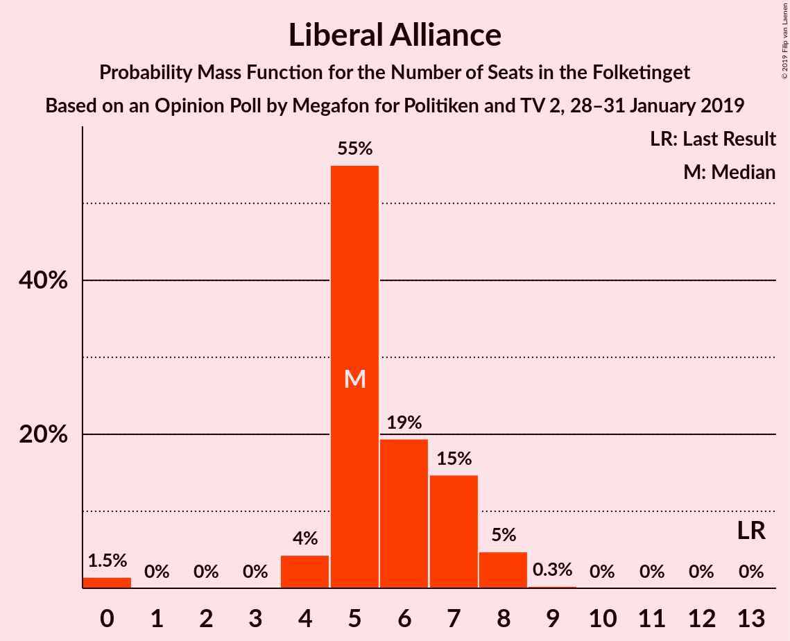

| Number of Seats | Probability | Accumulated | Special Marks |
|:---------------:|:-----------:|:-----------:|:-------------:|
| 0 | 1.5% | 100% |  |
| 1 | 0% | 98.5% |  |
| 2 | 0% | 98.5% |  |
| 3 | 0% | 98.5% |  |
| 4 | 4% | 98.5% |  |
| 5 | 55% | 94% | Median |
| 6 | 19% | 39% |  |
| 7 | 15% | 20% |  |
| 8 | 5% | 5% |  |
| 9 | 0.3% | 0.3% |  |
| 10 | 0% | 0.1% |  |
| 11 | 0% | 0% |  |
| 12 | 0% | 0% |  |
| 13 | 0% | 0% | Last Result |

### Nye Borgerlige

*For a full overview of the results for this party, see the [Nye Borgerlige](party-nyeborgerlige.html) page.*

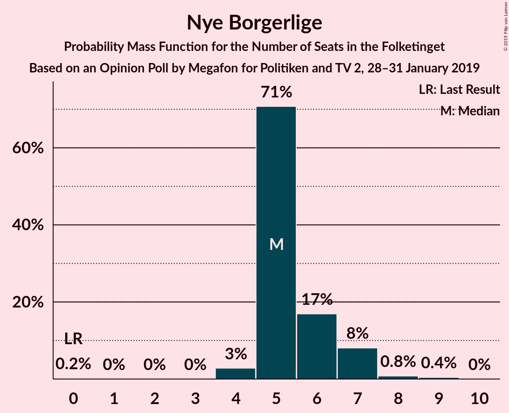

| Number of Seats | Probability | Accumulated | Special Marks |
|:---------------:|:-----------:|:-----------:|:-------------:|
| 0 | 0.2% | 100% | Last Result |
| 1 | 0% | 99.8% |  |
| 2 | 0% | 99.8% |  |
| 3 | 0% | 99.8% |  |
| 4 | 3% | 99.8% |  |
| 5 | 71% | 97% | Median |
| 6 | 17% | 26% |  |
| 7 | 8% | 9% |  |
| 8 | 0.8% | 1.3% |  |
| 9 | 0.4% | 0.5% |  |
| 10 | 0% | 0% |  |

### Kristendemokraterne

*For a full overview of the results for this party, see the [Kristendemokraterne](party-kristendemokraterne.html) page.*

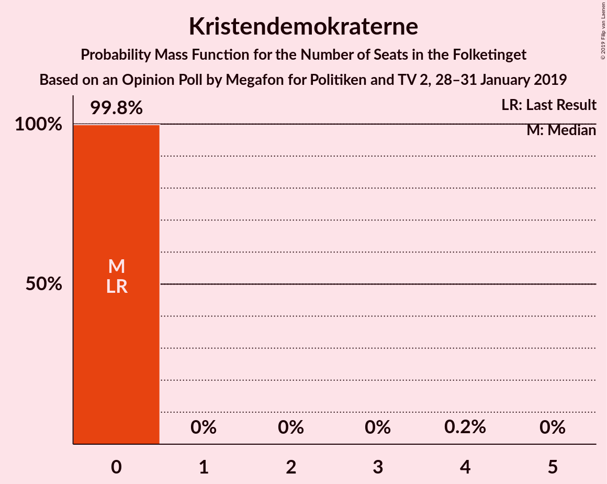

| Number of Seats | Probability | Accumulated | Special Marks |
|:---------------:|:-----------:|:-----------:|:-------------:|
| 0 | 99.8% | 100% | Last Result, Median |
| 1 | 0% | 0.2% |  |
| 2 | 0% | 0.2% |  |
| 3 | 0% | 0.2% |  |
| 4 | 0.2% | 0.2% |  |
| 5 | 0% | 0% |  |

## Coalitions

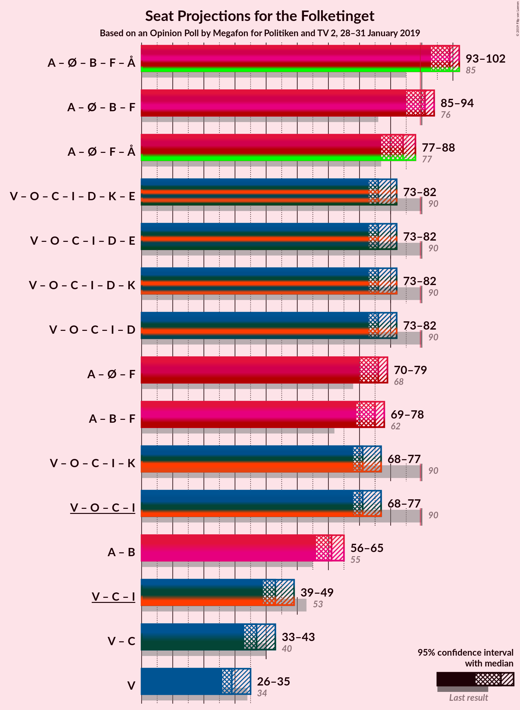

### Confidence Intervals

| Coalition | Last Result | Median | Majority? | 80% Confidence Interval | 90% Confidence Interval | 95% Confidence Interval | 99% Confidence Interval |
|:---------:|:-----------:|:------:|:---------:|:-----------------------:|:-----------------------:|:-----------------------:|:-----------------------:|
| Socialdemokraterne – Enhedslisten–De Rød-Grønne – Radikale Venstre – Socialistisk Folkeparti – Alternativet | 85 | 99 | 99.9% | 94–101 | 94–102 | 93–102 | 91–104 |
| Socialdemokraterne – Enhedslisten–De Rød-Grønne – Radikale Venstre – Socialistisk Folkeparti | 76 | 91 | 72% | 88–93 | 86–93 | 85–94 | 83–96 |
| Socialdemokraterne – Enhedslisten–De Rød-Grønne – Socialistisk Folkeparti – Alternativet | 77 | 84 | 0.4% | 79–86 | 78–87 | 77–88 | 76–89 |
| Venstre – Dansk Folkeparti – Det Konservative Folkeparti – Liberal Alliance – Nye Borgerlige – Kristendemokraterne | 90 | 76 | 0% | 74–81 | 73–81 | 73–82 | 71–84 |
| Venstre – Dansk Folkeparti – Det Konservative Folkeparti – Liberal Alliance – Nye Borgerlige | 90 | 76 | 0% | 74–81 | 73–81 | 73–82 | 71–84 |
| Socialdemokraterne – Enhedslisten–De Rød-Grønne – Socialistisk Folkeparti | 68 | 76 | 0% | 71–78 | 71–79 | 70–79 | 69–81 |
| Socialdemokraterne – Radikale Venstre – Socialistisk Folkeparti | 62 | 75 | 0% | 72–78 | 70–78 | 69–78 | 67–80 |
| Venstre – Dansk Folkeparti – Det Konservative Folkeparti – Liberal Alliance – Kristendemokraterne | 90 | 71 | 0% | 68–75 | 68–76 | 68–77 | 66–78 |
| Venstre – Dansk Folkeparti – Det Konservative Folkeparti – Liberal Alliance | 90 | 71 | 0% | 68–75 | 68–76 | 68–77 | 66–78 |
| Socialdemokraterne – Radikale Venstre | 55 | 61 | 0% | 59–62 | 58–63 | 56–65 | 53–66 |
| Venstre – Det Konservative Folkeparti – Liberal Alliance | 53 | 43 | 0% | 41–48 | 39–48 | 39–49 | 38–49 |
| Venstre – Det Konservative Folkeparti | 40 | 37 | 0% | 36–41 | 34–42 | 33–43 | 32–44 |
| Venstre | 34 | 29 | 0% | 27–32 | 26–33 | 26–35 | 25–35 |

### Socialdemokraterne – Enhedslisten–De Rød-Grønne – Radikale Venstre – Socialistisk Folkeparti – Alternativet

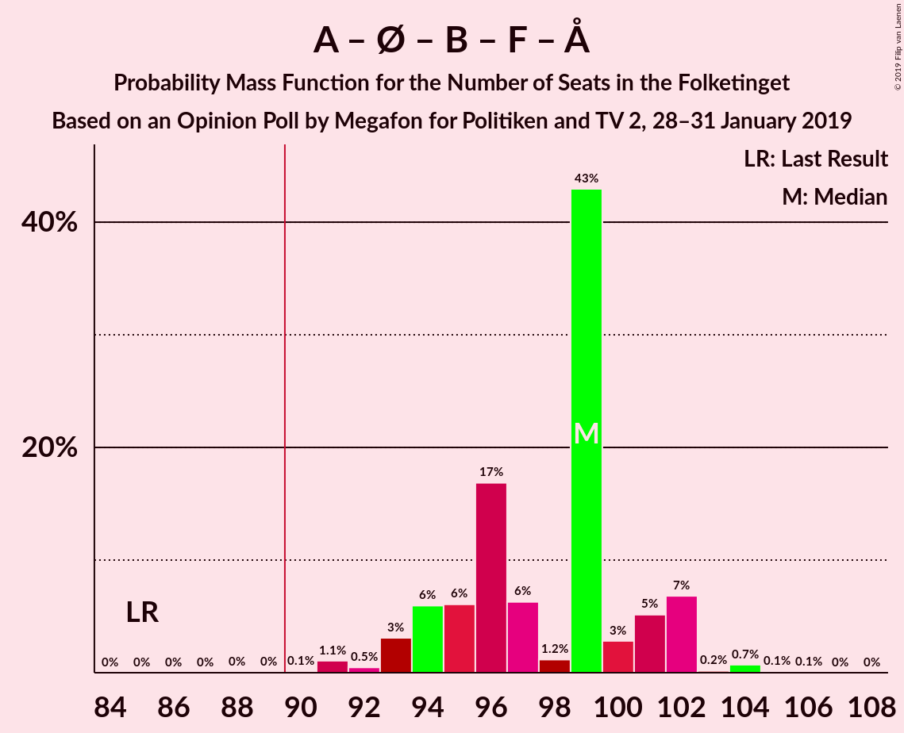

| Number of Seats | Probability | Accumulated | Special Marks |
|:---------------:|:-----------:|:-----------:|:-------------:|
| 85 | 0% | 100% | Last Result |
| 86 | 0% | 100% |  |
| 87 | 0% | 100% |  |
| 88 | 0% | 100% |  |
| 89 | 0% | 100% |  |
| 90 | 0.1% | 99.9% | Majority |
| 91 | 1.1% | 99.8% |  |
| 92 | 0.5% | 98.7% |  |
| 93 | 3% | 98% |  |
| 94 | 6% | 95% |  |
| 95 | 6% | 89% |  |
| 96 | 17% | 83% |  |
| 97 | 6% | 66% |  |
| 98 | 1.2% | 60% |  |
| 99 | 43% | 59% | Median |
| 100 | 3% | 16% |  |
| 101 | 5% | 13% |  |
| 102 | 7% | 8% |  |
| 103 | 0.2% | 1.0% |  |
| 104 | 0.7% | 0.9% |  |
| 105 | 0.1% | 0.2% |  |
| 106 | 0.1% | 0.1% |  |
| 107 | 0% | 0% |  |

### Socialdemokraterne – Enhedslisten–De Rød-Grønne – Radikale Venstre – Socialistisk Folkeparti

| Number of Seats | Probability | Accumulated | Special Marks |
|:---------------:|:-----------:|:-----------:|:-------------:|
| 76 | 0% | 100% | Last Result |
| 77 | 0% | 100% |  |
| 78 | 0% | 100% |  |
| 79 | 0% | 100% |  |
| 80 | 0% | 100% |  |
| 81 | 0.1% | 100% |  |
| 82 | 0.3% | 99.8% |  |
| 83 | 0.2% | 99.6% |  |
| 84 | 1.0% | 99.3% |  |
| 85 | 2% | 98% |  |
| 86 | 4% | 97% |  |
| 87 | 3% | 93% |  |
| 88 | 10% | 90% |  |
| 89 | 9% | 81% |  |
| 90 | 14% | 72% | Majority |
| 91 | 40% | 58% | Median |
| 92 | 6% | 17% |  |
| 93 | 7% | 11% |  |
| 94 | 3% | 4% |  |
| 95 | 0.7% | 1.4% |  |
| 96 | 0.5% | 0.7% |  |
| 97 | 0.2% | 0.2% |  |
| 98 | 0% | 0% |  |

### Socialdemokraterne – Enhedslisten–De Rød-Grønne – Socialistisk Folkeparti – Alternativet

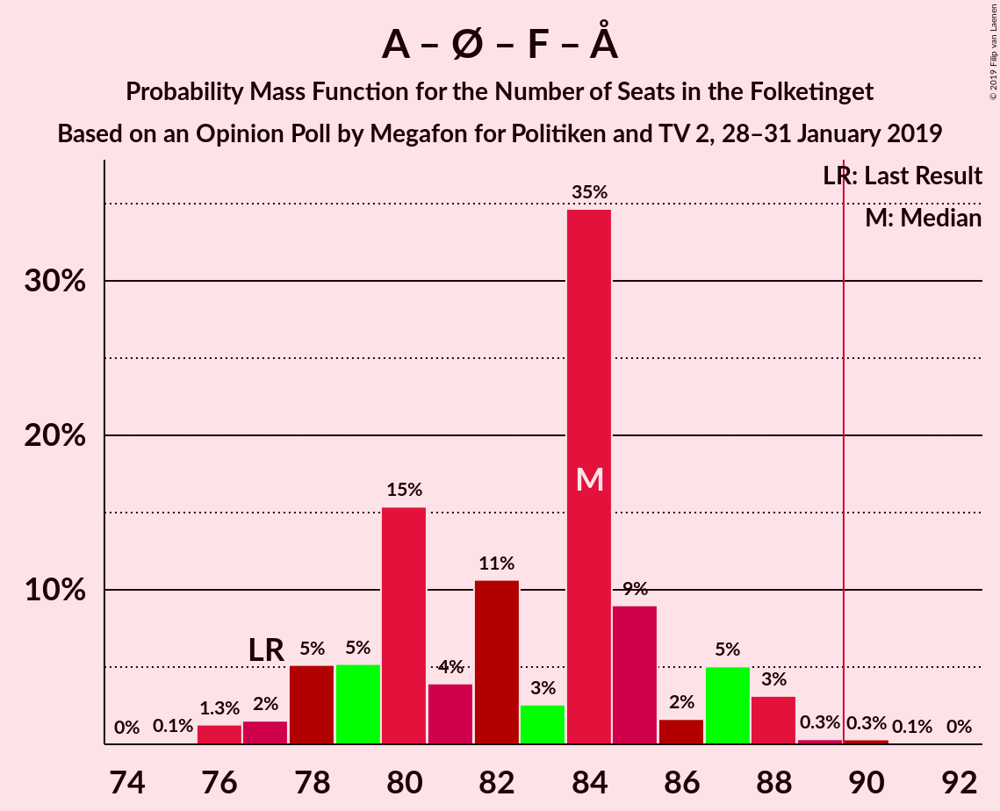

| Number of Seats | Probability | Accumulated | Special Marks |
|:---------------:|:-----------:|:-----------:|:-------------:|
| 75 | 0.1% | 100% |  |
| 76 | 1.3% | 99.9% |  |
| 77 | 2% | 98.6% | Last Result |
| 78 | 5% | 97% |  |
| 79 | 5% | 92% |  |
| 80 | 15% | 87% |  |
| 81 | 4% | 71% |  |
| 82 | 11% | 67% |  |
| 83 | 3% | 57% |  |
| 84 | 35% | 54% | Median |
| 85 | 9% | 20% |  |
| 86 | 2% | 11% |  |
| 87 | 5% | 9% |  |
| 88 | 3% | 4% |  |
| 89 | 0.3% | 0.7% |  |
| 90 | 0.3% | 0.4% | Majority |
| 91 | 0.1% | 0.1% |  |
| 92 | 0% | 0% |  |

### Venstre – Dansk Folkeparti – Det Konservative Folkeparti – Liberal Alliance – Nye Borgerlige – Kristendemokraterne

| Number of Seats | Probability | Accumulated | Special Marks |
|:---------------:|:-----------:|:-----------:|:-------------:|
| 69 | 0.1% | 100% |  |
| 70 | 0.1% | 99.9% |  |
| 71 | 0.7% | 99.8% |  |
| 72 | 0.2% | 99.1% |  |
| 73 | 7% | 99.0% |  |
| 74 | 5% | 92% |  |
| 75 | 3% | 87% |  |
| 76 | 43% | 84% | Median |
| 77 | 1.2% | 41% |  |
| 78 | 6% | 40% |  |
| 79 | 17% | 34% |  |
| 80 | 6% | 17% |  |
| 81 | 6% | 11% |  |
| 82 | 3% | 5% |  |
| 83 | 0.5% | 2% |  |
| 84 | 1.1% | 1.3% |  |
| 85 | 0.1% | 0.2% |  |
| 86 | 0% | 0.1% |  |
| 87 | 0% | 0% |  |
| 88 | 0% | 0% |  |
| 89 | 0% | 0% |  |
| 90 | 0% | 0% | Last Result, Majority |

### Venstre – Dansk Folkeparti – Det Konservative Folkeparti – Liberal Alliance – Nye Borgerlige

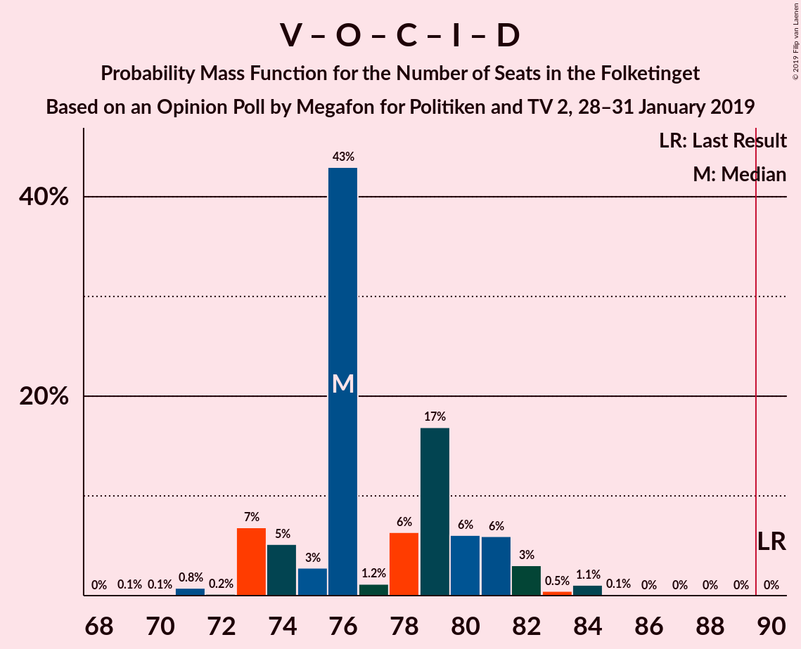

| Number of Seats | Probability | Accumulated | Special Marks |
|:---------------:|:-----------:|:-----------:|:-------------:|
| 69 | 0.1% | 100% |  |
| 70 | 0.1% | 99.9% |  |
| 71 | 0.8% | 99.8% |  |
| 72 | 0.2% | 99.1% |  |
| 73 | 7% | 98.9% |  |
| 74 | 5% | 92% |  |
| 75 | 3% | 87% |  |
| 76 | 43% | 84% | Median |
| 77 | 1.2% | 41% |  |
| 78 | 6% | 40% |  |
| 79 | 17% | 34% |  |
| 80 | 6% | 17% |  |
| 81 | 6% | 11% |  |
| 82 | 3% | 5% |  |
| 83 | 0.5% | 2% |  |
| 84 | 1.1% | 1.3% |  |
| 85 | 0.1% | 0.2% |  |
| 86 | 0% | 0.1% |  |
| 87 | 0% | 0% |  |
| 88 | 0% | 0% |  |
| 89 | 0% | 0% |  |
| 90 | 0% | 0% | Last Result, Majority |

### Socialdemokraterne – Enhedslisten–De Rød-Grønne – Socialistisk Folkeparti

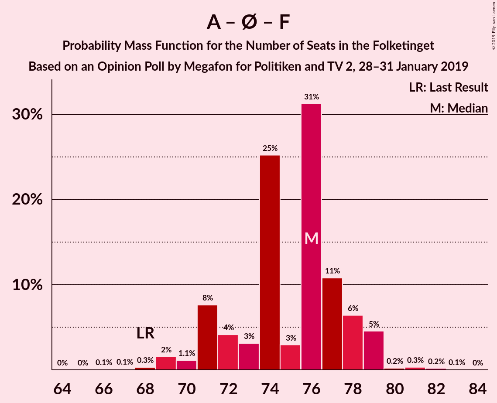

| Number of Seats | Probability | Accumulated | Special Marks |
|:---------------:|:-----------:|:-----------:|:-------------:|
| 66 | 0.1% | 100% |  |
| 67 | 0.1% | 99.9% |  |
| 68 | 0.3% | 99.8% | Last Result |
| 69 | 2% | 99.5% |  |
| 70 | 1.1% | 98% |  |
| 71 | 8% | 97% |  |
| 72 | 4% | 89% |  |
| 73 | 3% | 85% |  |
| 74 | 25% | 82% |  |
| 75 | 3% | 57% |  |
| 76 | 31% | 54% | Median |
| 77 | 11% | 23% |  |
| 78 | 6% | 12% |  |
| 79 | 5% | 5% |  |
| 80 | 0.2% | 0.8% |  |
| 81 | 0.3% | 0.6% |  |
| 82 | 0.2% | 0.3% |  |
| 83 | 0.1% | 0.1% |  |
| 84 | 0% | 0% |  |

### Socialdemokraterne – Radikale Venstre – Socialistisk Folkeparti

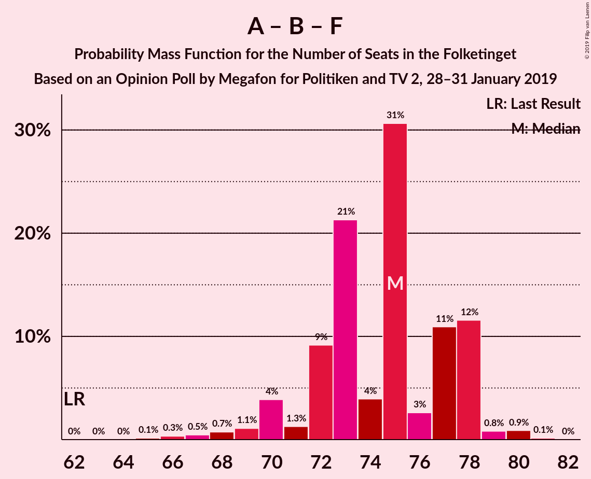

| Number of Seats | Probability | Accumulated | Special Marks |
|:---------------:|:-----------:|:-----------:|:-------------:|
| 62 | 0% | 100% | Last Result |
| 63 | 0% | 100% |  |
| 64 | 0% | 100% |  |
| 65 | 0.1% | 100% |  |
| 66 | 0.3% | 99.8% |  |
| 67 | 0.5% | 99.5% |  |
| 68 | 0.7% | 99.0% |  |
| 69 | 1.1% | 98% |  |
| 70 | 4% | 97% |  |
| 71 | 1.3% | 93% |  |
| 72 | 9% | 92% |  |
| 73 | 21% | 83% |  |
| 74 | 4% | 62% |  |
| 75 | 31% | 58% | Median |
| 76 | 3% | 27% |  |
| 77 | 11% | 24% |  |
| 78 | 12% | 13% |  |
| 79 | 0.8% | 2% |  |
| 80 | 0.9% | 1.1% |  |
| 81 | 0.1% | 0.2% |  |
| 82 | 0% | 0% |  |

### Venstre – Dansk Folkeparti – Det Konservative Folkeparti – Liberal Alliance – Kristendemokraterne

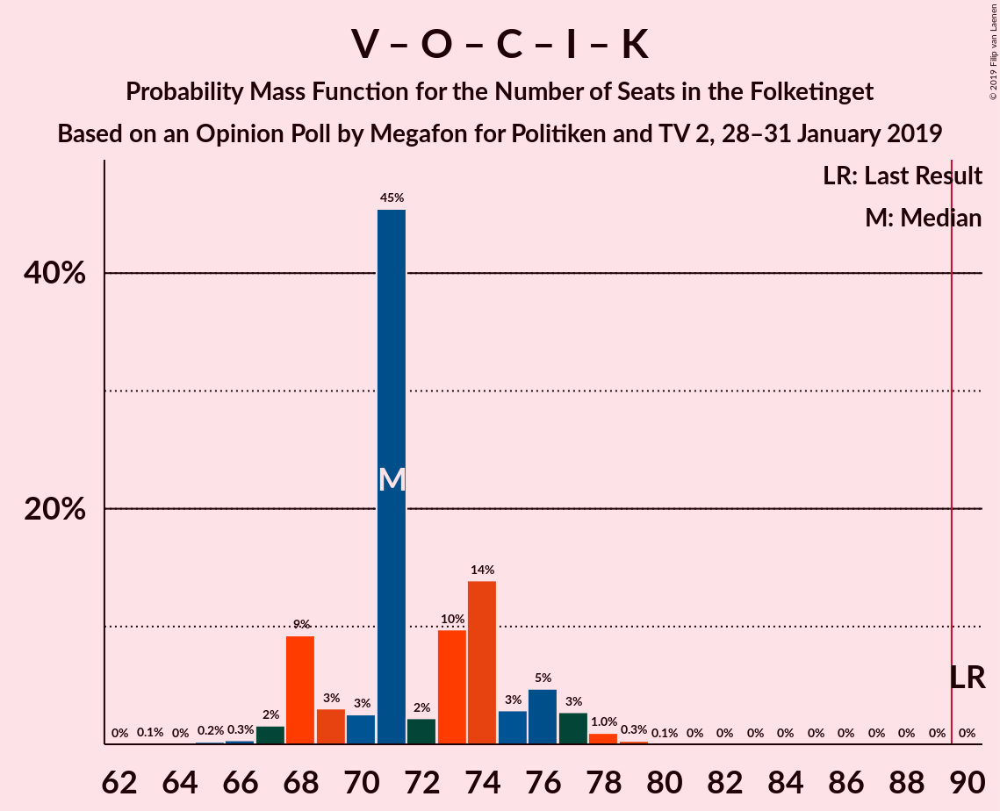

| Number of Seats | Probability | Accumulated | Special Marks |
|:---------------:|:-----------:|:-----------:|:-------------:|
| 63 | 0.1% | 100% |  |
| 64 | 0% | 99.9% |  |
| 65 | 0.2% | 99.9% |  |
| 66 | 0.3% | 99.7% |  |
| 67 | 2% | 99.3% |  |
| 68 | 9% | 98% |  |
| 69 | 3% | 89% |  |
| 70 | 3% | 85% |  |
| 71 | 45% | 83% | Median |
| 72 | 2% | 38% |  |
| 73 | 10% | 35% |  |
| 74 | 14% | 26% |  |
| 75 | 3% | 12% |  |
| 76 | 5% | 9% |  |
| 77 | 3% | 4% |  |
| 78 | 1.0% | 1.3% |  |
| 79 | 0.3% | 0.4% |  |
| 80 | 0.1% | 0.1% |  |
| 81 | 0% | 0% |  |
| 82 | 0% | 0% |  |
| 83 | 0% | 0% |  |
| 84 | 0% | 0% |  |
| 85 | 0% | 0% |  |
| 86 | 0% | 0% |  |
| 87 | 0% | 0% |  |
| 88 | 0% | 0% |  |
| 89 | 0% | 0% |  |
| 90 | 0% | 0% | Last Result, Majority |

### Venstre – Dansk Folkeparti – Det Konservative Folkeparti – Liberal Alliance

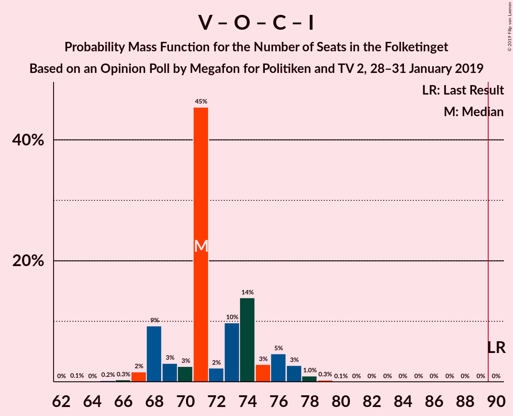

| Number of Seats | Probability | Accumulated | Special Marks |
|:---------------:|:-----------:|:-----------:|:-------------:|
| 63 | 0.1% | 100% |  |
| 64 | 0% | 99.9% |  |
| 65 | 0.2% | 99.9% |  |
| 66 | 0.3% | 99.7% |  |
| 67 | 2% | 99.3% |  |
| 68 | 9% | 98% |  |
| 69 | 3% | 88% |  |
| 70 | 3% | 85% |  |
| 71 | 45% | 83% | Median |
| 72 | 2% | 37% |  |
| 73 | 10% | 35% |  |
| 74 | 14% | 25% |  |
| 75 | 3% | 12% |  |
| 76 | 5% | 9% |  |
| 77 | 3% | 4% |  |
| 78 | 1.0% | 1.3% |  |
| 79 | 0.3% | 0.4% |  |
| 80 | 0.1% | 0.1% |  |
| 81 | 0% | 0% |  |
| 82 | 0% | 0% |  |
| 83 | 0% | 0% |  |
| 84 | 0% | 0% |  |
| 85 | 0% | 0% |  |
| 86 | 0% | 0% |  |
| 87 | 0% | 0% |  |
| 88 | 0% | 0% |  |
| 89 | 0% | 0% |  |
| 90 | 0% | 0% | Last Result, Majority |

### Socialdemokraterne – Radikale Venstre

| Number of Seats | Probability | Accumulated | Special Marks |
|:---------------:|:-----------:|:-----------:|:-------------:|
| 52 | 0.2% | 100% |  |
| 53 | 0.9% | 99.8% |  |
| 54 | 0.4% | 98.8% |  |
| 55 | 0.3% | 98% | Last Result |
| 56 | 0.8% | 98% |  |
| 57 | 2% | 97% |  |
| 58 | 5% | 96% |  |
| 59 | 7% | 91% |  |
| 60 | 26% | 84% |  |
| 61 | 44% | 58% | Median |
| 62 | 8% | 14% |  |
| 63 | 1.5% | 6% |  |
| 64 | 0.6% | 4% |  |
| 65 | 2% | 4% |  |
| 66 | 2% | 2% |  |
| 67 | 0.1% | 0.2% |  |
| 68 | 0% | 0.1% |  |
| 69 | 0.1% | 0.1% |  |
| 70 | 0% | 0% |  |

### Venstre – Det Konservative Folkeparti – Liberal Alliance

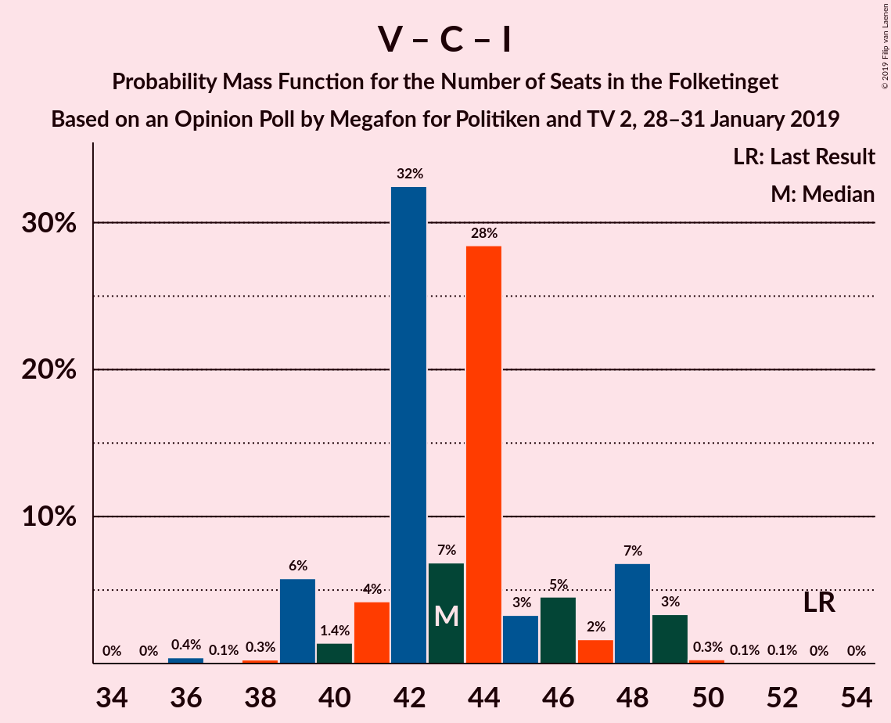

| Number of Seats | Probability | Accumulated | Special Marks |
|:---------------:|:-----------:|:-----------:|:-------------:|
| 36 | 0.4% | 100% |  |
| 37 | 0.1% | 99.6% |  |
| 38 | 0.3% | 99.5% |  |
| 39 | 6% | 99.3% |  |
| 40 | 1.4% | 93% |  |
| 41 | 4% | 92% |  |
| 42 | 32% | 88% | Median |
| 43 | 7% | 55% |  |
| 44 | 28% | 49% |  |
| 45 | 3% | 20% |  |
| 46 | 5% | 17% |  |
| 47 | 2% | 12% |  |
| 48 | 7% | 11% |  |
| 49 | 3% | 4% |  |
| 50 | 0.3% | 0.4% |  |
| 51 | 0.1% | 0.1% |  |
| 52 | 0.1% | 0.1% |  |
| 53 | 0% | 0% | Last Result |

### Venstre – Det Konservative Folkeparti

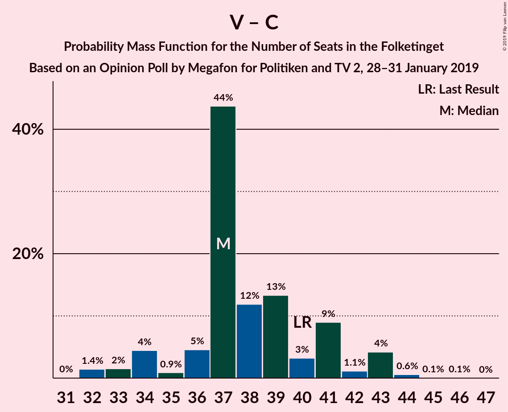

| Number of Seats | Probability | Accumulated | Special Marks |
|:---------------:|:-----------:|:-----------:|:-------------:|
| 32 | 1.4% | 100% |  |
| 33 | 2% | 98.5% |  |
| 34 | 4% | 97% |  |
| 35 | 0.9% | 93% |  |
| 36 | 5% | 92% |  |
| 37 | 44% | 87% | Median |
| 38 | 12% | 43% |  |
| 39 | 13% | 32% |  |
| 40 | 3% | 18% | Last Result |
| 41 | 9% | 15% |  |
| 42 | 1.1% | 6% |  |
| 43 | 4% | 5% |  |
| 44 | 0.6% | 0.7% |  |
| 45 | 0.1% | 0.1% |  |
| 46 | 0.1% | 0.1% |  |
| 47 | 0% | 0% |  |

### Venstre

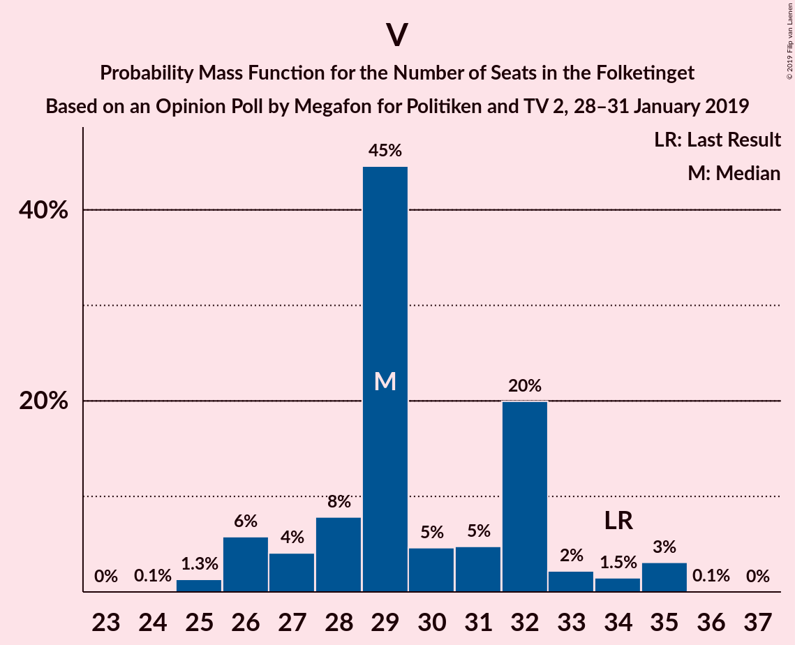

| Number of Seats | Probability | Accumulated | Special Marks |
|:---------------:|:-----------:|:-----------:|:-------------:|
| 24 | 0.1% | 100% |  |
| 25 | 1.3% | 99.9% |  |
| 26 | 6% | 98.6% |  |
| 27 | 4% | 93% |  |
| 28 | 8% | 89% |  |
| 29 | 45% | 81% | Median |
| 30 | 5% | 36% |  |
| 31 | 5% | 32% |  |
| 32 | 20% | 27% |  |
| 33 | 2% | 7% |  |
| 34 | 1.5% | 5% | Last Result |
| 35 | 3% | 3% |  |
| 36 | 0.1% | 0.1% |  |
| 37 | 0% | 0% |  |

## Technical Information

### Opinion Poll

+ **Polling firm:** Megafon
+ **Commissioner(s):** Politiken and TV 2
+ **Fieldwork period:** 28–31 January 2019

### Calculations

+ **Sample size:** 1007
+ **Simulations done:** 1,048,576
+ **Error estimate:** 1.60%

