# Opinion Poll by Voxmeter for Ritzau, 28 January–3 February 2019

<a href="#voting-intentions">Voting Intentions</a> | <a href="#seats">Seats</a> | <a href="#coalitions">Coalitions</a> | <a href="#technical-information">Technical Information</a>

## Voting Intentions

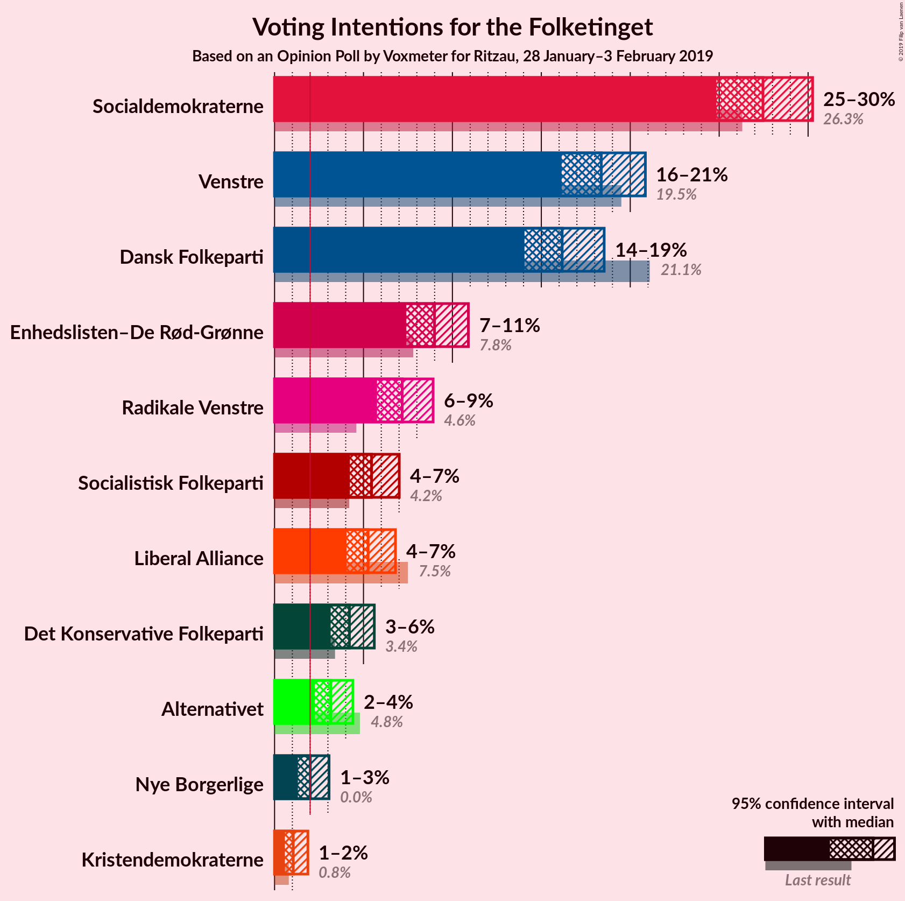

### Confidence Intervals

| Party | Last Result | Poll Result | 80% Confidence Interval | 90% Confidence Interval | 95% Confidence Interval | 99% Confidence Interval |
|:-----:|:-----------:|:-----------:|:-----------------------:|:-----------------------:|:-----------------------:|:-----------------------:|
| Socialdemokraterne | 26.3% | 27.5% | 25.7–29.3% |25.3–29.8% |24.8–30.3% |24.0–31.1% |
| Venstre | 19.5% | 18.4% | 16.9–20.0% |16.5–20.4% |16.1–20.9% |15.5–21.6% |
| Dansk Folkeparti | 21.1% | 16.2% | 14.8–17.7% |14.4–18.2% |14.1–18.5% |13.4–19.3% |
| Enhedslisten–De Rød-Grønne | 7.8% | 9.0% | 7.9–10.2% |7.7–10.6% |7.4–10.9% |6.9–11.5% |
| Radikale Venstre | 4.6% | 7.2% | 6.2–8.3% |6.0–8.6% |5.8–8.9% |5.3–9.5% |
| Socialistisk Folkeparti | 4.2% | 5.5% | 4.6–6.5% |4.4–6.8% |4.2–7.0% |3.9–7.5% |
| Liberal Alliance | 7.5% | 5.3% | 4.5–6.3% |4.3–6.5% |4.1–6.8% |3.7–7.3% |
| Det Konservative Folkeparti | 3.4% | 4.2% | 3.5–5.1% |3.3–5.4% |3.2–5.6% |2.8–6.1% |
| Alternativet | 4.8% | 3.2% | 2.6–4.0% |2.4–4.2% |2.3–4.4% |2.0–4.8% |
| Nye Borgerlige | 0.0% | 2.0% | 1.6–2.7% |1.4–2.9% |1.3–3.1% |1.1–3.4% |
| Kristendemokraterne | 0.8% | 1.1% | 0.7–1.6% |0.7–1.7% |0.6–1.9% |0.5–2.2% |

*Note:* The poll result column reflects the actual value used in the calculations. Published results may vary slightly, and in addition be rounded to fewer digits.

## Seats

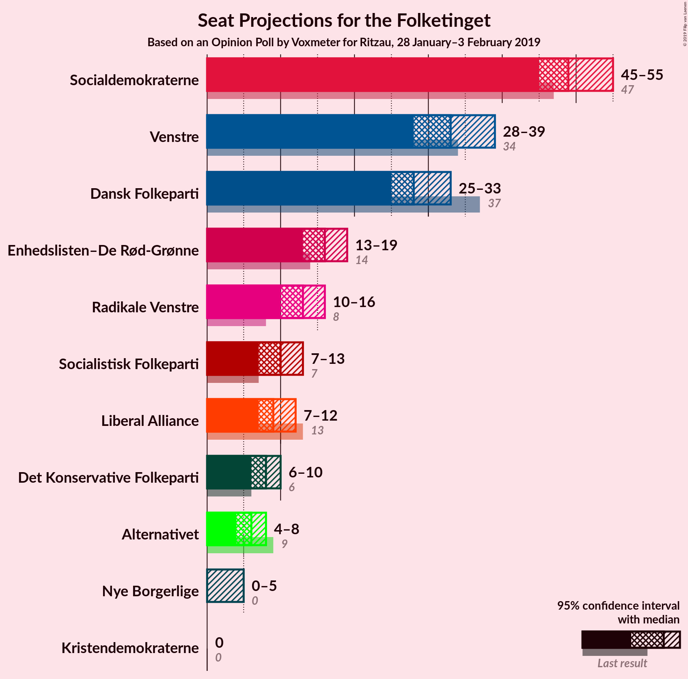

### Confidence Intervals

| Party | Last Result | Median | 80% Confidence Interval | 90% Confidence Interval | 95% Confidence Interval | 99% Confidence Interval |
|:-----:|:-----------:|:------:|:-----------------------:|:-----------------------:|:-----------------------:|:-----------------------:|
| <a href="#socialdemokraterne">Socialdemokraterne</a> | 47 | 49 | 46–53 |45–54 |45–55 |43–56 |
| <a href="#venstre">Venstre</a> | 34 | 33 | 29–36 |29–37 |28–39 |28–40 |
| <a href="#dansk-folkeparti">Dansk Folkeparti</a> | 37 | 28 | 26–31 |26–32 |25–33 |24–34 |
| <a href="#enhedslisten–de-rød-grønne">Enhedslisten–De Rød-Grønne</a> | 14 | 16 | 15–18 |14–19 |13–19 |13–21 |
| <a href="#radikale-venstre">Radikale Venstre</a> | 8 | 13 | 12–15 |11–16 |10–16 |9–18 |
| <a href="#socialistisk-folkeparti">Socialistisk Folkeparti</a> | 7 | 10 | 8–12 |8–13 |7–13 |7–14 |
| <a href="#liberal-alliance">Liberal Alliance</a> | 13 | 9 | 8–10 |8–12 |7–12 |7–14 |
| <a href="#det-konservative-folkeparti">Det Konservative Folkeparti</a> | 6 | 8 | 6–9 |6–10 |6–10 |5–11 |
| <a href="#alternativet">Alternativet</a> | 9 | 6 | 5–7 |4–7 |4–8 |0–8 |
| <a href="#nye-borgerlige">Nye Borgerlige</a> | 0 | 0 | 0–4 |0–5 |0–5 |0–6 |
| <a href="#kristendemokraterne">Kristendemokraterne</a> | 0 | 0 | 0 |0 |0 |0–4 |

### Socialdemokraterne

*For a full overview of the results for this party, see the [Socialdemokraterne](party-socialdemokraterne.html) page.*

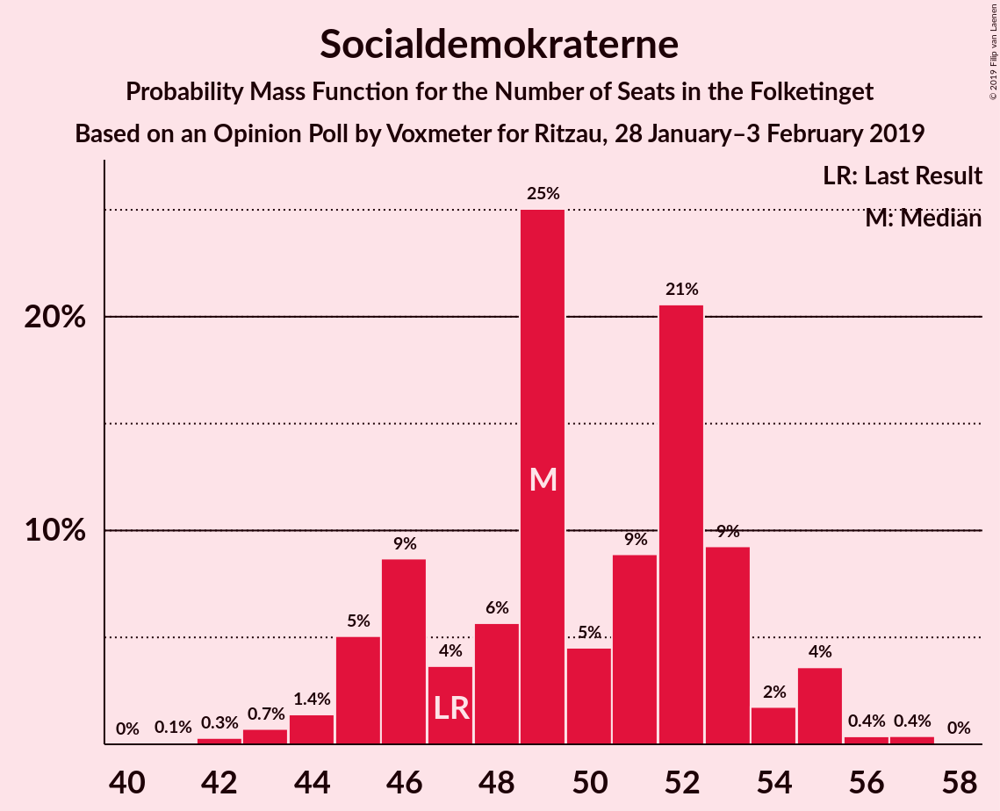

| Number of Seats | Probability | Accumulated | Special Marks |
|:---------------:|:-----------:|:-----------:|:-------------:|
| 41 | 0.1% | 100% |  |
| 42 | 0.3% | 99.9% |  |
| 43 | 0.7% | 99.6% |  |
| 44 | 1.4% | 98.9% |  |
| 45 | 5% | 98% |  |
| 46 | 9% | 92% |  |
| 47 | 4% | 84% | Last Result |
| 48 | 6% | 80% |  |
| 49 | 25% | 74% | Median |
| 50 | 5% | 49% |  |
| 51 | 9% | 45% |  |
| 52 | 21% | 36% |  |
| 53 | 9% | 15% |  |
| 54 | 2% | 6% |  |
| 55 | 4% | 4% |  |
| 56 | 0.4% | 0.8% |  |
| 57 | 0.4% | 0.4% |  |
| 58 | 0% | 0% |  |

### Venstre

*For a full overview of the results for this party, see the [Venstre](party-venstre.html) page.*

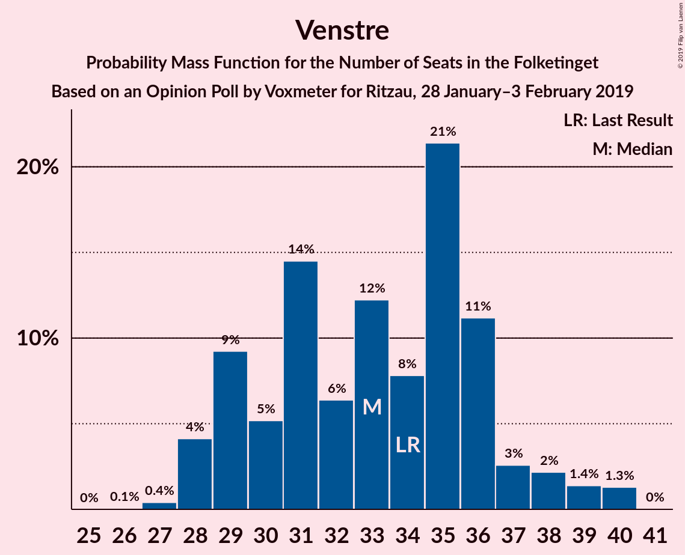

| Number of Seats | Probability | Accumulated | Special Marks |
|:---------------:|:-----------:|:-----------:|:-------------:|
| 26 | 0.1% | 100% |  |
| 27 | 0.4% | 99.9% |  |
| 28 | 4% | 99.5% |  |
| 29 | 9% | 95% |  |
| 30 | 5% | 86% |  |
| 31 | 14% | 81% |  |
| 32 | 6% | 66% |  |
| 33 | 12% | 60% | Median |
| 34 | 8% | 48% | Last Result |
| 35 | 21% | 40% |  |
| 36 | 11% | 19% |  |
| 37 | 3% | 7% |  |
| 38 | 2% | 5% |  |
| 39 | 1.4% | 3% |  |
| 40 | 1.3% | 1.3% |  |
| 41 | 0% | 0% |  |

### Dansk Folkeparti

*For a full overview of the results for this party, see the [Dansk Folkeparti](party-danskfolkeparti.html) page.*

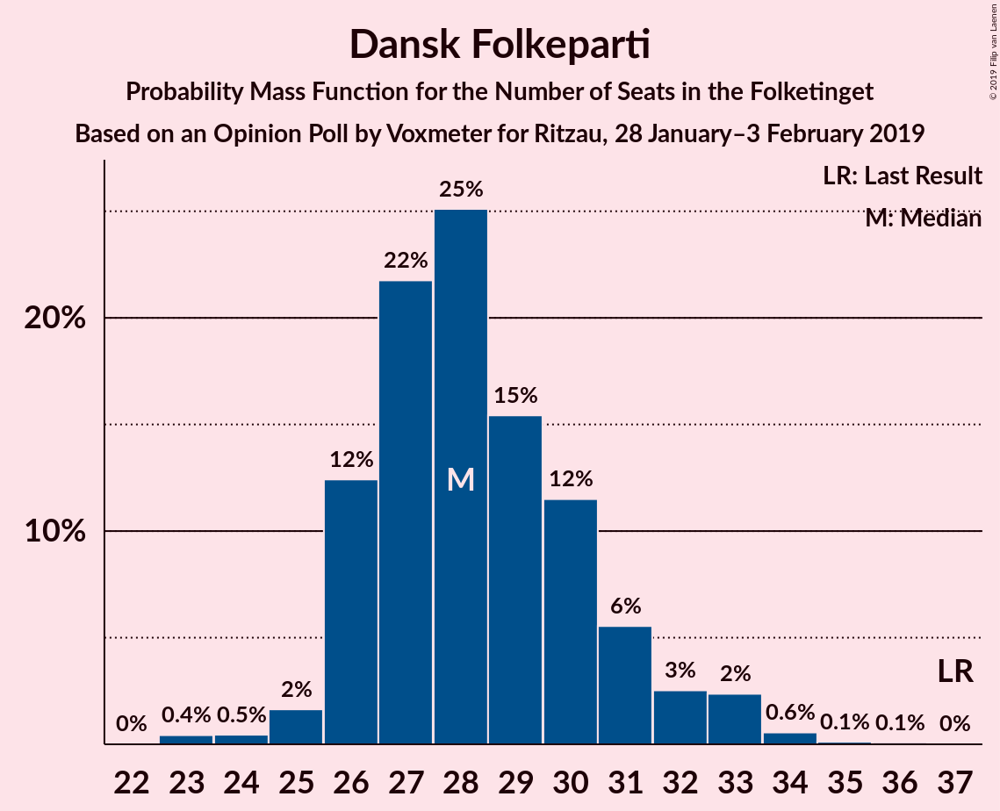

| Number of Seats | Probability | Accumulated | Special Marks |
|:---------------:|:-----------:|:-----------:|:-------------:|
| 23 | 0.4% | 100% |  |
| 24 | 0.5% | 99.5% |  |
| 25 | 2% | 99.1% |  |
| 26 | 12% | 97% |  |
| 27 | 22% | 85% |  |
| 28 | 25% | 63% | Median |
| 29 | 15% | 38% |  |
| 30 | 12% | 23% |  |
| 31 | 6% | 11% |  |
| 32 | 3% | 6% |  |
| 33 | 2% | 3% |  |
| 34 | 0.6% | 0.8% |  |
| 35 | 0.1% | 0.2% |  |
| 36 | 0.1% | 0.1% |  |
| 37 | 0% | 0% | Last Result |

### Enhedslisten–De Rød-Grønne

*For a full overview of the results for this party, see the [Enhedslisten–De Rød-Grønne](party-enhedslisten–derød-grønne.html) page.*

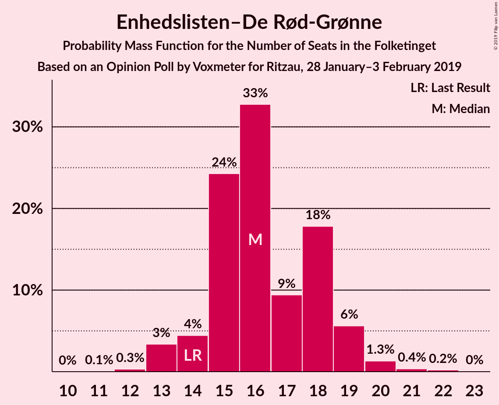

| Number of Seats | Probability | Accumulated | Special Marks |
|:---------------:|:-----------:|:-----------:|:-------------:|
| 11 | 0.1% | 100% |  |
| 12 | 0.3% | 99.9% |  |
| 13 | 3% | 99.6% |  |
| 14 | 4% | 96% | Last Result |
| 15 | 24% | 92% |  |
| 16 | 33% | 68% | Median |
| 17 | 9% | 35% |  |
| 18 | 18% | 25% |  |
| 19 | 6% | 8% |  |
| 20 | 1.3% | 2% |  |
| 21 | 0.4% | 0.6% |  |
| 22 | 0.2% | 0.2% |  |
| 23 | 0% | 0% |  |

### Radikale Venstre

*For a full overview of the results for this party, see the [Radikale Venstre](party-radikalevenstre.html) page.*

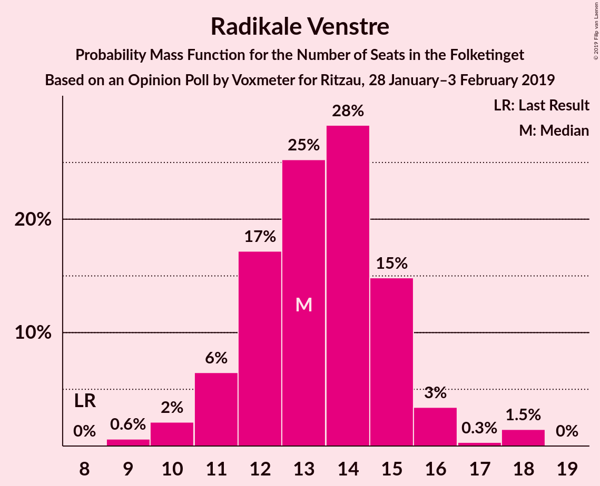

| Number of Seats | Probability | Accumulated | Special Marks |
|:---------------:|:-----------:|:-----------:|:-------------:|
| 8 | 0% | 100% | Last Result |
| 9 | 0.6% | 100% |  |
| 10 | 2% | 99.4% |  |
| 11 | 6% | 97% |  |
| 12 | 17% | 91% |  |
| 13 | 25% | 74% | Median |
| 14 | 28% | 48% |  |
| 15 | 15% | 20% |  |
| 16 | 3% | 5% |  |
| 17 | 0.3% | 2% |  |
| 18 | 1.5% | 1.5% |  |
| 19 | 0% | 0% |  |

### Socialistisk Folkeparti

*For a full overview of the results for this party, see the [Socialistisk Folkeparti](party-socialistiskfolkeparti.html) page.*

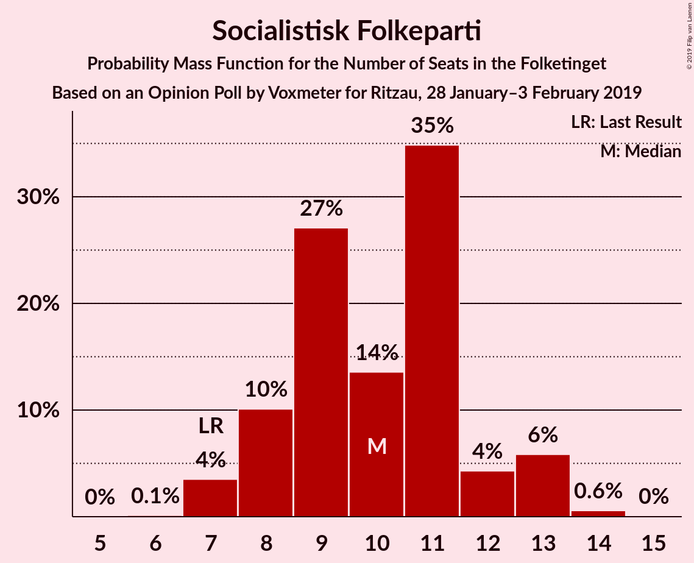

| Number of Seats | Probability | Accumulated | Special Marks |
|:---------------:|:-----------:|:-----------:|:-------------:|
| 6 | 0.1% | 100% |  |
| 7 | 4% | 99.9% | Last Result |
| 8 | 10% | 96% |  |
| 9 | 27% | 86% |  |
| 10 | 14% | 59% | Median |
| 11 | 35% | 46% |  |
| 12 | 4% | 11% |  |
| 13 | 6% | 6% |  |
| 14 | 0.6% | 0.6% |  |
| 15 | 0% | 0% |  |

### Liberal Alliance

*For a full overview of the results for this party, see the [Liberal Alliance](party-liberalalliance.html) page.*

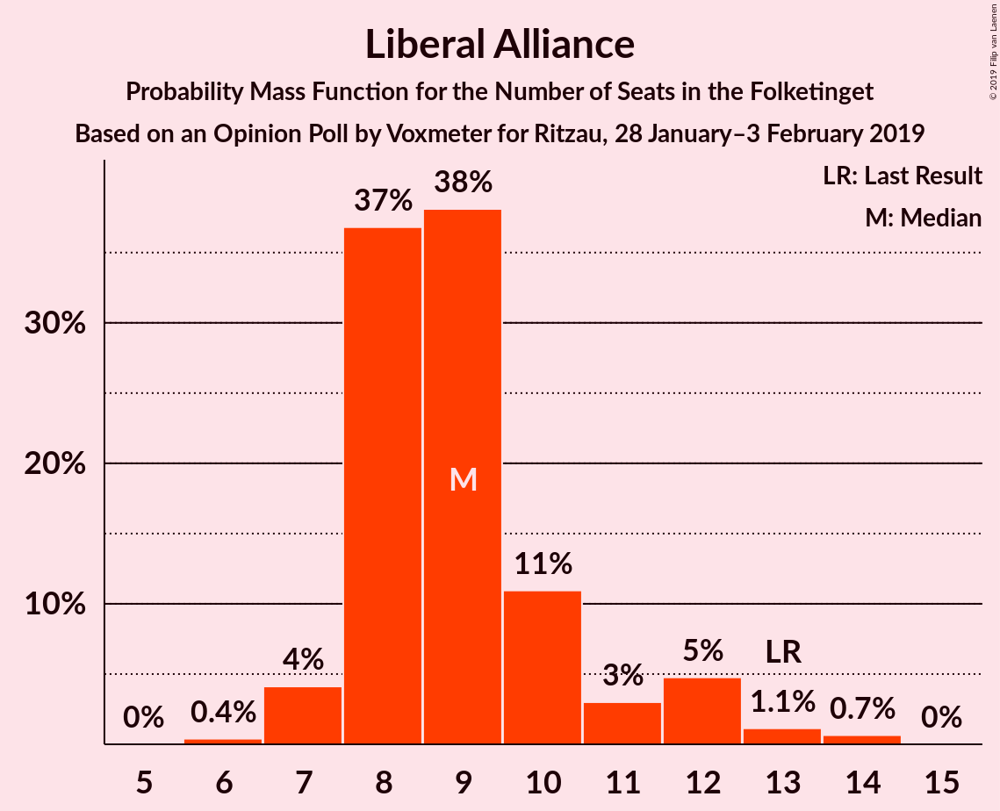

| Number of Seats | Probability | Accumulated | Special Marks |
|:---------------:|:-----------:|:-----------:|:-------------:|
| 6 | 0.4% | 100% |  |
| 7 | 4% | 99.6% |  |
| 8 | 37% | 95% |  |
| 9 | 38% | 59% | Median |
| 10 | 11% | 21% |  |
| 11 | 3% | 10% |  |
| 12 | 5% | 7% |  |
| 13 | 1.1% | 2% | Last Result |
| 14 | 0.7% | 0.7% |  |
| 15 | 0% | 0% |  |

### Det Konservative Folkeparti

*For a full overview of the results for this party, see the [Det Konservative Folkeparti](party-detkonservativefolkeparti.html) page.*

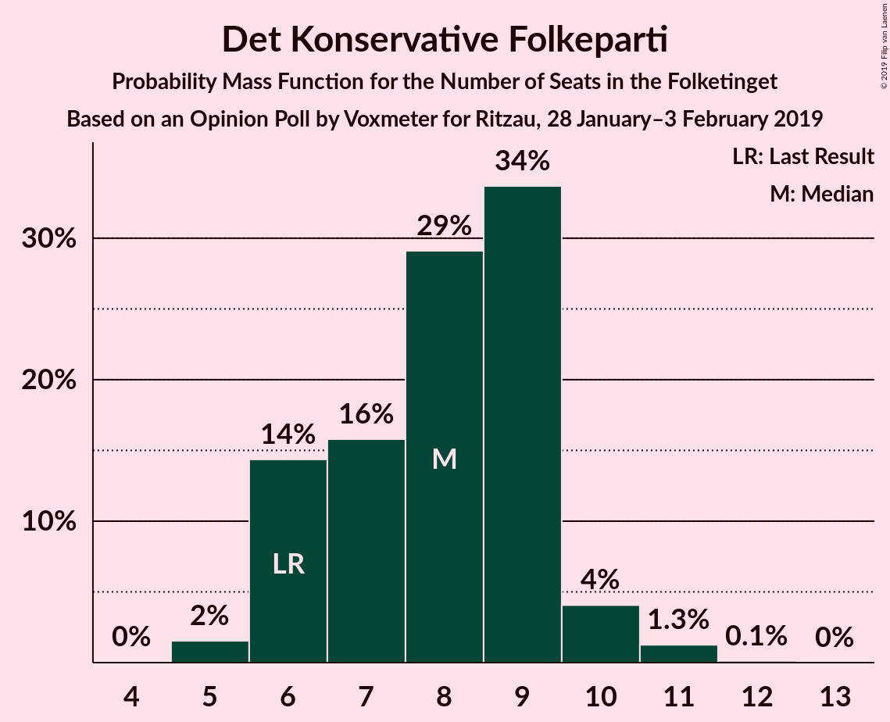

| Number of Seats | Probability | Accumulated | Special Marks |
|:---------------:|:-----------:|:-----------:|:-------------:|
| 5 | 2% | 100% |  |
| 6 | 14% | 98% | Last Result |
| 7 | 16% | 84% |  |
| 8 | 29% | 68% | Median |
| 9 | 34% | 39% |  |
| 10 | 4% | 5% |  |
| 11 | 1.3% | 1.4% |  |
| 12 | 0.1% | 0.1% |  |
| 13 | 0% | 0% |  |

### Alternativet

*For a full overview of the results for this party, see the [Alternativet](party-alternativet.html) page.*

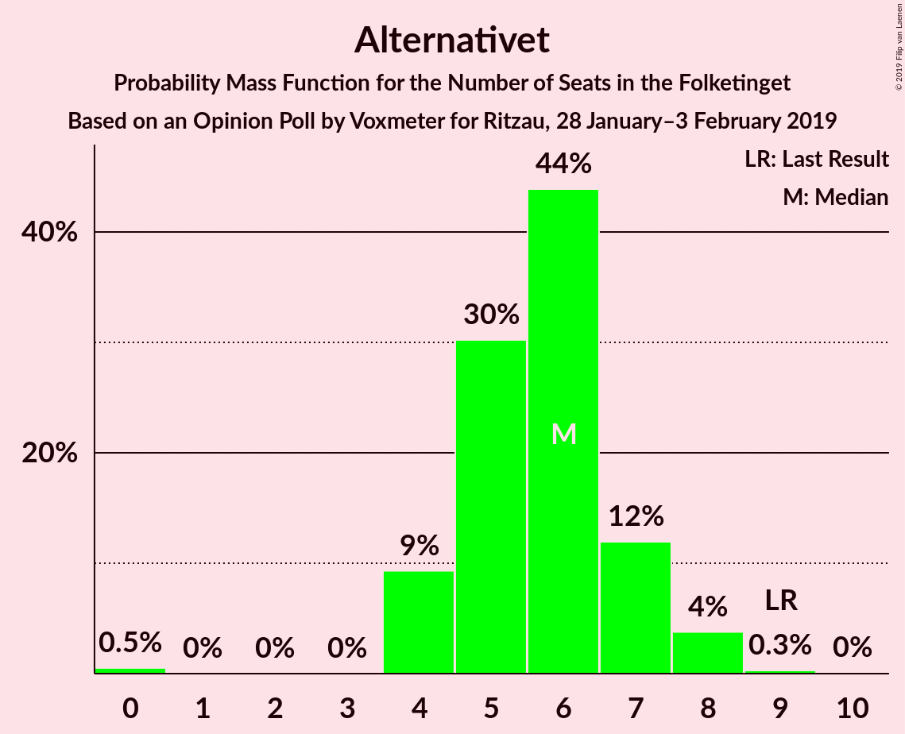

| Number of Seats | Probability | Accumulated | Special Marks |
|:---------------:|:-----------:|:-----------:|:-------------:|
| 0 | 0.5% | 100% |  |
| 1 | 0% | 99.5% |  |
| 2 | 0% | 99.5% |  |
| 3 | 0% | 99.5% |  |
| 4 | 9% | 99.5% |  |
| 5 | 30% | 90% |  |
| 6 | 44% | 60% | Median |
| 7 | 12% | 16% |  |
| 8 | 4% | 4% |  |
| 9 | 0.3% | 0.3% | Last Result |
| 10 | 0% | 0% |  |

### Nye Borgerlige

*For a full overview of the results for this party, see the [Nye Borgerlige](party-nyeborgerlige.html) page.*

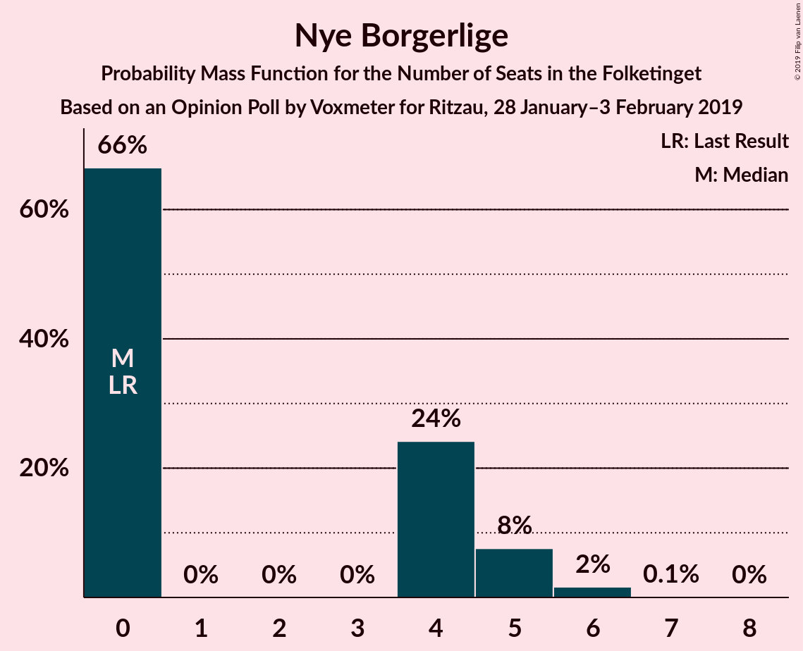

| Number of Seats | Probability | Accumulated | Special Marks |
|:---------------:|:-----------:|:-----------:|:-------------:|
| 0 | 66% | 100% | Last Result, Median |
| 1 | 0% | 34% |  |
| 2 | 0% | 34% |  |
| 3 | 0% | 34% |  |
| 4 | 24% | 33% |  |
| 5 | 8% | 9% |  |
| 6 | 2% | 2% |  |
| 7 | 0.1% | 0.1% |  |
| 8 | 0% | 0% |  |

### Kristendemokraterne

*For a full overview of the results for this party, see the [Kristendemokraterne](party-kristendemokraterne.html) page.*

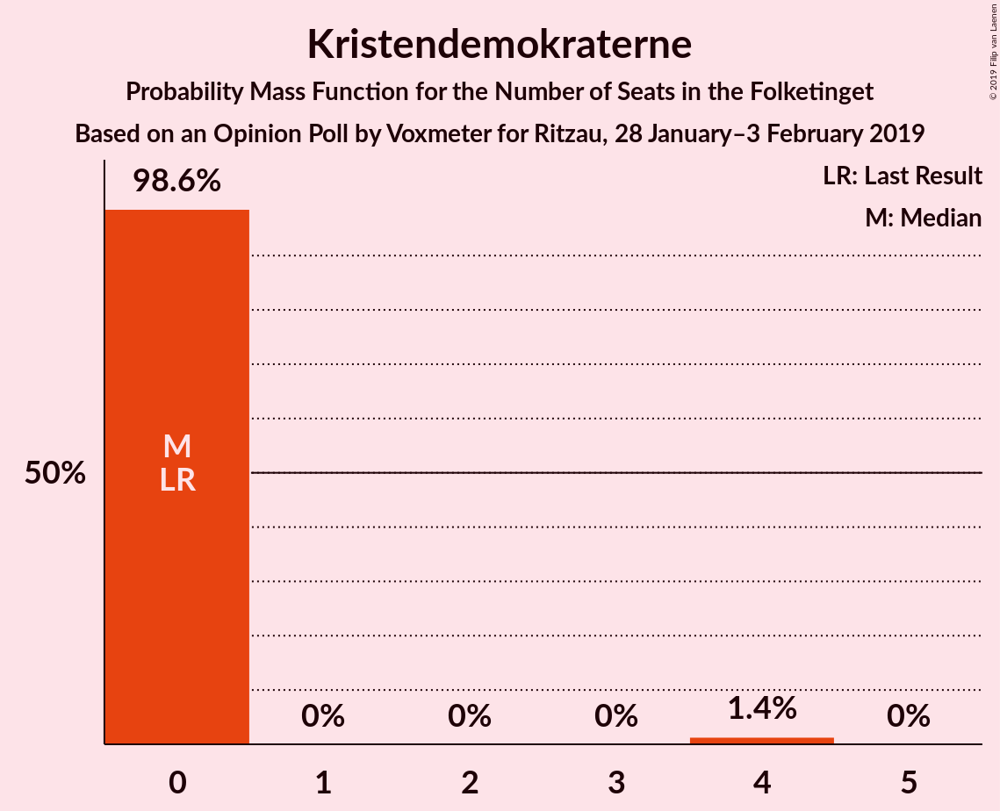

| Number of Seats | Probability | Accumulated | Special Marks |
|:---------------:|:-----------:|:-----------:|:-------------:|
| 0 | 98.6% | 100% | Last Result, Median |
| 1 | 0% | 1.4% |  |
| 2 | 0% | 1.4% |  |
| 3 | 0% | 1.4% |  |
| 4 | 1.4% | 1.4% |  |
| 5 | 0% | 0% |  |

## Coalitions

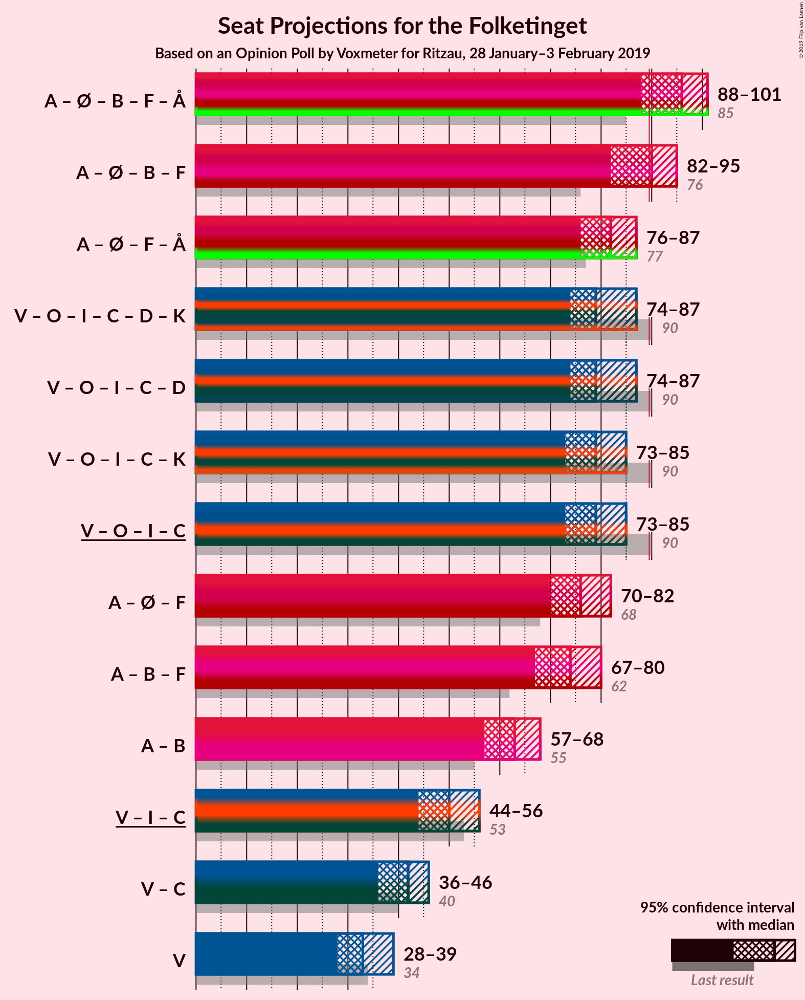

### Confidence Intervals

| Coalition | Last Result | Median | Majority? | 80% Confidence Interval | 90% Confidence Interval | 95% Confidence Interval | 99% Confidence Interval |
|:---------:|:-----------:|:------:|:---------:|:-----------------------:|:-----------------------:|:-----------------------:|:-----------------------:|
| Socialdemokraterne – Enhedslisten–De Rød-Grønne – Radikale Venstre – Socialistisk Folkeparti – Alternativet | 85 | 96 | 95% | 91–99 | 90–101 | 88–101 | 87–101 |
| Socialdemokraterne – Enhedslisten–De Rød-Grønne – Radikale Venstre – Socialistisk Folkeparti | 76 | 90 | 61% | 85–93 | 84–95 | 82–95 | 81–95 |
| Socialdemokraterne – Enhedslisten–De Rød-Grønne – Socialistisk Folkeparti – Alternativet | 77 | 82 | 0.2% | 78–86 | 77–86 | 76–87 | 74–89 |
| Venstre – Dansk Folkeparti – Liberal Alliance – Det Konservative Folkeparti – Nye Borgerlige – Kristendemokraterne | 90 | 79 | 0.2% | 76–84 | 74–85 | 74–87 | 74–88 |
| Venstre – Dansk Folkeparti – Liberal Alliance – Det Konservative Folkeparti – Nye Borgerlige | 90 | 79 | 0.2% | 76–84 | 74–85 | 74–87 | 74–88 |
| Venstre – Dansk Folkeparti – Liberal Alliance – Det Konservative Folkeparti – Kristendemokraterne | 90 | 79 | 0% | 74–82 | 74–84 | 73–85 | 72–87 |
| Venstre – Dansk Folkeparti – Liberal Alliance – Det Konservative Folkeparti | 90 | 79 | 0% | 74–82 | 74–84 | 73–85 | 72–87 |
| Socialdemokraterne – Enhedslisten–De Rød-Grønne – Socialistisk Folkeparti | 68 | 76 | 0% | 72–80 | 70–80 | 70–82 | 68–83 |
| Socialdemokraterne – Radikale Venstre – Socialistisk Folkeparti | 62 | 74 | 0% | 69–77 | 68–80 | 67–80 | 65–80 |
| Socialdemokraterne – Radikale Venstre | 55 | 63 | 0% | 59–67 | 58–67 | 57–68 | 55–69 |
| Venstre – Liberal Alliance – Det Konservative Folkeparti | 53 | 50 | 0% | 47–53 | 46–54 | 44–56 | 43–58 |
| Venstre – Det Konservative Folkeparti | 40 | 42 | 0% | 37–44 | 36–46 | 36–46 | 34–48 |
| Venstre | 34 | 33 | 0% | 29–36 | 29–37 | 28–39 | 28–40 |

### Socialdemokraterne – Enhedslisten–De Rød-Grønne – Radikale Venstre – Socialistisk Folkeparti – Alternativet

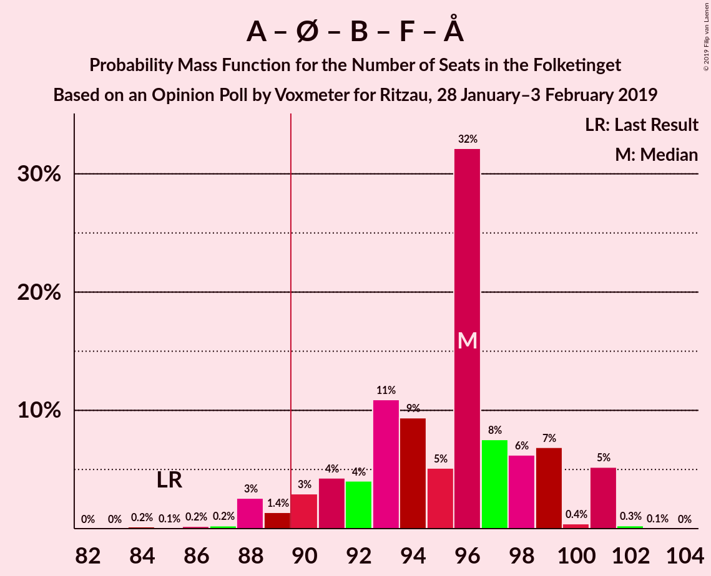

| Number of Seats | Probability | Accumulated | Special Marks |
|:---------------:|:-----------:|:-----------:|:-------------:|
| 84 | 0.2% | 100% |  |
| 85 | 0.1% | 99.8% | Last Result |
| 86 | 0.2% | 99.8% |  |
| 87 | 0.2% | 99.6% |  |
| 88 | 3% | 99.3% |  |
| 89 | 1.4% | 97% |  |
| 90 | 3% | 95% | Majority |
| 91 | 4% | 92% |  |
| 92 | 4% | 88% |  |
| 93 | 11% | 84% |  |
| 94 | 9% | 73% | Median |
| 95 | 5% | 64% |  |
| 96 | 32% | 59% |  |
| 97 | 8% | 27% |  |
| 98 | 6% | 19% |  |
| 99 | 7% | 13% |  |
| 100 | 0.4% | 6% |  |
| 101 | 5% | 6% |  |
| 102 | 0.3% | 0.3% |  |
| 103 | 0.1% | 0.1% |  |
| 104 | 0% | 0% |  |

### Socialdemokraterne – Enhedslisten–De Rød-Grønne – Radikale Venstre – Socialistisk Folkeparti

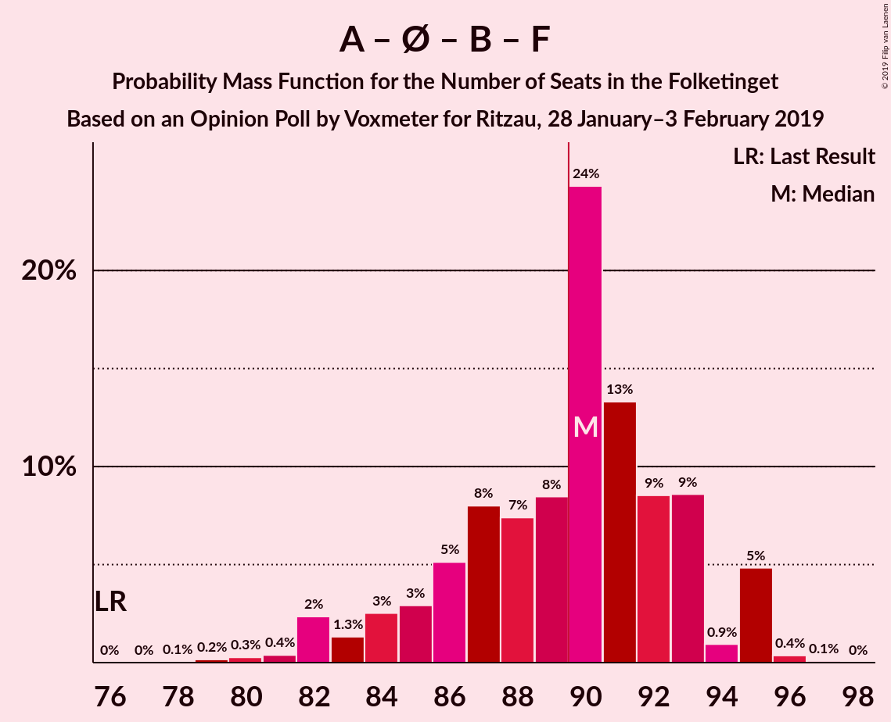

| Number of Seats | Probability | Accumulated | Special Marks |
|:---------------:|:-----------:|:-----------:|:-------------:|
| 76 | 0% | 100% | Last Result |
| 77 | 0% | 100% |  |
| 78 | 0.1% | 100% |  |
| 79 | 0.2% | 99.9% |  |
| 80 | 0.3% | 99.8% |  |
| 81 | 0.4% | 99.5% |  |
| 82 | 2% | 99.1% |  |
| 83 | 1.3% | 97% |  |
| 84 | 3% | 95% |  |
| 85 | 3% | 93% |  |
| 86 | 5% | 90% |  |
| 87 | 8% | 85% |  |
| 88 | 7% | 77% | Median |
| 89 | 8% | 69% |  |
| 90 | 24% | 61% | Majority |
| 91 | 13% | 37% |  |
| 92 | 9% | 23% |  |
| 93 | 9% | 15% |  |
| 94 | 0.9% | 6% |  |
| 95 | 5% | 5% |  |
| 96 | 0.4% | 0.5% |  |
| 97 | 0.1% | 0.1% |  |
| 98 | 0% | 0% |  |

### Socialdemokraterne – Enhedslisten–De Rød-Grønne – Socialistisk Folkeparti – Alternativet

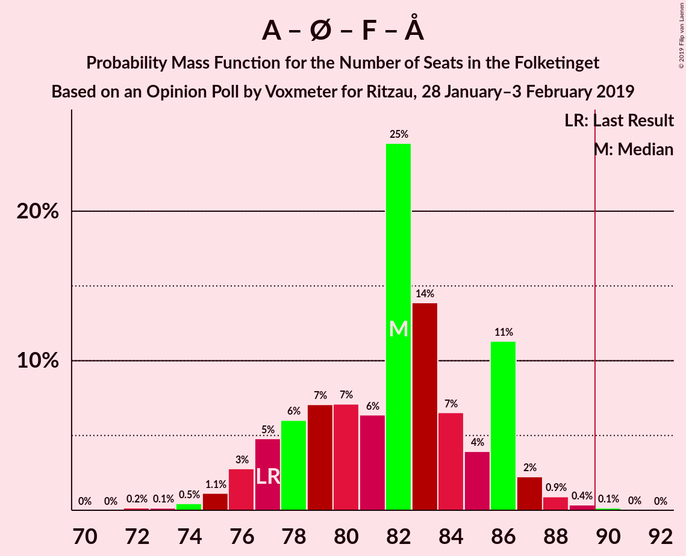

| Number of Seats | Probability | Accumulated | Special Marks |
|:---------------:|:-----------:|:-----------:|:-------------:|
| 72 | 0.2% | 100% |  |
| 73 | 0.1% | 99.8% |  |
| 74 | 0.5% | 99.7% |  |
| 75 | 1.1% | 99.2% |  |
| 76 | 3% | 98% |  |
| 77 | 5% | 95% | Last Result |
| 78 | 6% | 90% |  |
| 79 | 7% | 84% |  |
| 80 | 7% | 77% |  |
| 81 | 6% | 70% | Median |
| 82 | 25% | 64% |  |
| 83 | 14% | 39% |  |
| 84 | 7% | 25% |  |
| 85 | 4% | 19% |  |
| 86 | 11% | 15% |  |
| 87 | 2% | 4% |  |
| 88 | 0.9% | 1.5% |  |
| 89 | 0.4% | 0.6% |  |
| 90 | 0.1% | 0.2% | Majority |
| 91 | 0% | 0% |  |

### Venstre – Dansk Folkeparti – Liberal Alliance – Det Konservative Folkeparti – Nye Borgerlige – Kristendemokraterne

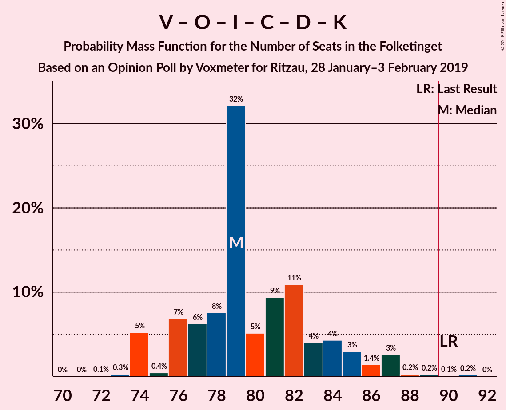

| Number of Seats | Probability | Accumulated | Special Marks |
|:---------------:|:-----------:|:-----------:|:-------------:|
| 72 | 0.1% | 100% |  |
| 73 | 0.3% | 99.9% |  |
| 74 | 5% | 99.7% |  |
| 75 | 0.4% | 94% |  |
| 76 | 7% | 94% |  |
| 77 | 6% | 87% |  |
| 78 | 8% | 81% | Median |
| 79 | 32% | 73% |  |
| 80 | 5% | 41% |  |
| 81 | 9% | 36% |  |
| 82 | 11% | 27% |  |
| 83 | 4% | 16% |  |
| 84 | 4% | 12% |  |
| 85 | 3% | 8% |  |
| 86 | 1.4% | 5% |  |
| 87 | 3% | 3% |  |
| 88 | 0.2% | 0.7% |  |
| 89 | 0.2% | 0.4% |  |
| 90 | 0.1% | 0.2% | Last Result, Majority |
| 91 | 0.2% | 0.2% |  |
| 92 | 0% | 0% |  |

### Venstre – Dansk Folkeparti – Liberal Alliance – Det Konservative Folkeparti – Nye Borgerlige

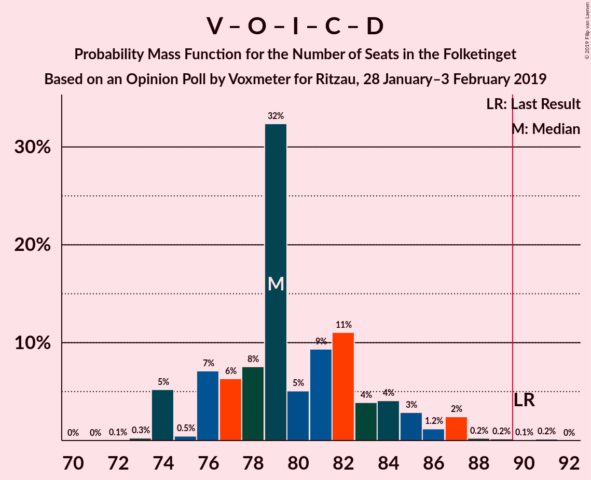

| Number of Seats | Probability | Accumulated | Special Marks |
|:---------------:|:-----------:|:-----------:|:-------------:|
| 72 | 0.1% | 100% |  |
| 73 | 0.3% | 99.9% |  |
| 74 | 5% | 99.7% |  |
| 75 | 0.5% | 94% |  |
| 76 | 7% | 94% |  |
| 77 | 6% | 87% |  |
| 78 | 8% | 81% | Median |
| 79 | 32% | 73% |  |
| 80 | 5% | 41% |  |
| 81 | 9% | 36% |  |
| 82 | 11% | 26% |  |
| 83 | 4% | 15% |  |
| 84 | 4% | 11% |  |
| 85 | 3% | 7% |  |
| 86 | 1.2% | 4% |  |
| 87 | 2% | 3% |  |
| 88 | 0.2% | 0.6% |  |
| 89 | 0.2% | 0.4% |  |
| 90 | 0.1% | 0.2% | Last Result, Majority |
| 91 | 0.2% | 0.2% |  |
| 92 | 0% | 0% |  |

### Venstre – Dansk Folkeparti – Liberal Alliance – Det Konservative Folkeparti – Kristendemokraterne

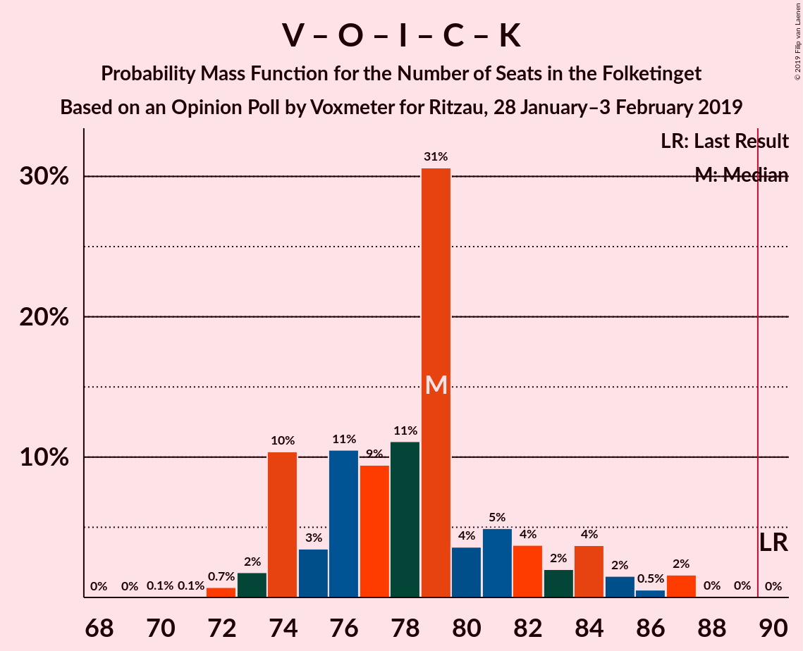

| Number of Seats | Probability | Accumulated | Special Marks |
|:---------------:|:-----------:|:-----------:|:-------------:|
| 70 | 0.1% | 100% |  |
| 71 | 0.1% | 99.9% |  |
| 72 | 0.7% | 99.8% |  |
| 73 | 2% | 99.1% |  |
| 74 | 10% | 97% |  |
| 75 | 3% | 87% |  |
| 76 | 11% | 83% |  |
| 77 | 9% | 73% |  |
| 78 | 11% | 64% | Median |
| 79 | 31% | 52% |  |
| 80 | 4% | 22% |  |
| 81 | 5% | 18% |  |
| 82 | 4% | 13% |  |
| 83 | 2% | 10% |  |
| 84 | 4% | 7% |  |
| 85 | 2% | 4% |  |
| 86 | 0.5% | 2% |  |
| 87 | 2% | 2% |  |
| 88 | 0% | 0.1% |  |
| 89 | 0% | 0.1% |  |
| 90 | 0% | 0% | Last Result, Majority |

### Venstre – Dansk Folkeparti – Liberal Alliance – Det Konservative Folkeparti

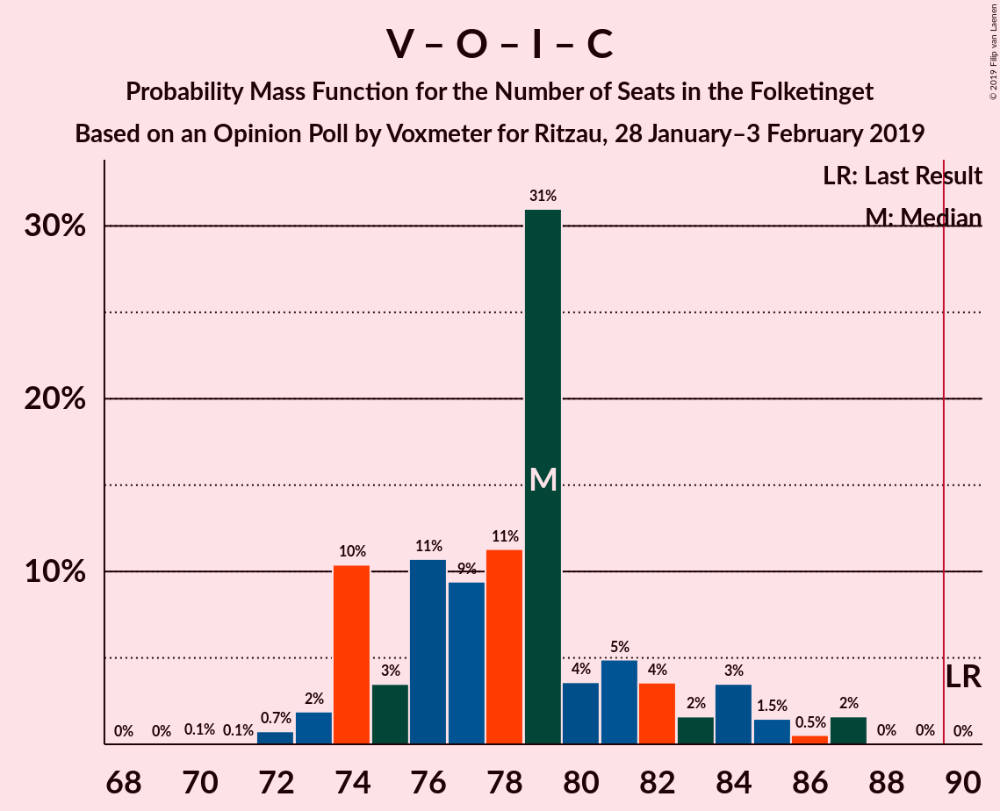

| Number of Seats | Probability | Accumulated | Special Marks |
|:---------------:|:-----------:|:-----------:|:-------------:|
| 70 | 0.1% | 100% |  |
| 71 | 0.1% | 99.9% |  |
| 72 | 0.7% | 99.8% |  |
| 73 | 2% | 99.1% |  |
| 74 | 10% | 97% |  |
| 75 | 3% | 87% |  |
| 76 | 11% | 83% |  |
| 77 | 9% | 73% |  |
| 78 | 11% | 63% | Median |
| 79 | 31% | 52% |  |
| 80 | 4% | 21% |  |
| 81 | 5% | 17% |  |
| 82 | 4% | 12% |  |
| 83 | 2% | 9% |  |
| 84 | 3% | 7% |  |
| 85 | 1.5% | 4% |  |
| 86 | 0.5% | 2% |  |
| 87 | 2% | 2% |  |
| 88 | 0% | 0.1% |  |
| 89 | 0% | 0.1% |  |
| 90 | 0% | 0% | Last Result, Majority |

### Socialdemokraterne – Enhedslisten–De Rød-Grønne – Socialistisk Folkeparti

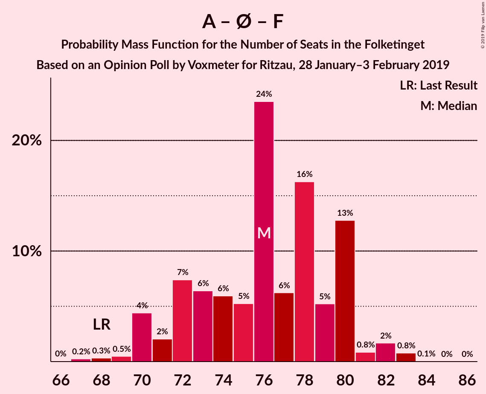

| Number of Seats | Probability | Accumulated | Special Marks |
|:---------------:|:-----------:|:-----------:|:-------------:|
| 66 | 0% | 100% |  |
| 67 | 0.2% | 99.9% |  |
| 68 | 0.3% | 99.7% | Last Result |
| 69 | 0.5% | 99.4% |  |
| 70 | 4% | 98.9% |  |
| 71 | 2% | 94% |  |
| 72 | 7% | 92% |  |
| 73 | 6% | 85% |  |
| 74 | 6% | 79% |  |
| 75 | 5% | 73% | Median |
| 76 | 24% | 67% |  |
| 77 | 6% | 44% |  |
| 78 | 16% | 38% |  |
| 79 | 5% | 21% |  |
| 80 | 13% | 16% |  |
| 81 | 0.8% | 3% |  |
| 82 | 2% | 3% |  |
| 83 | 0.8% | 0.9% |  |
| 84 | 0.1% | 0.1% |  |
| 85 | 0% | 0.1% |  |
| 86 | 0% | 0% |  |

### Socialdemokraterne – Radikale Venstre – Socialistisk Folkeparti

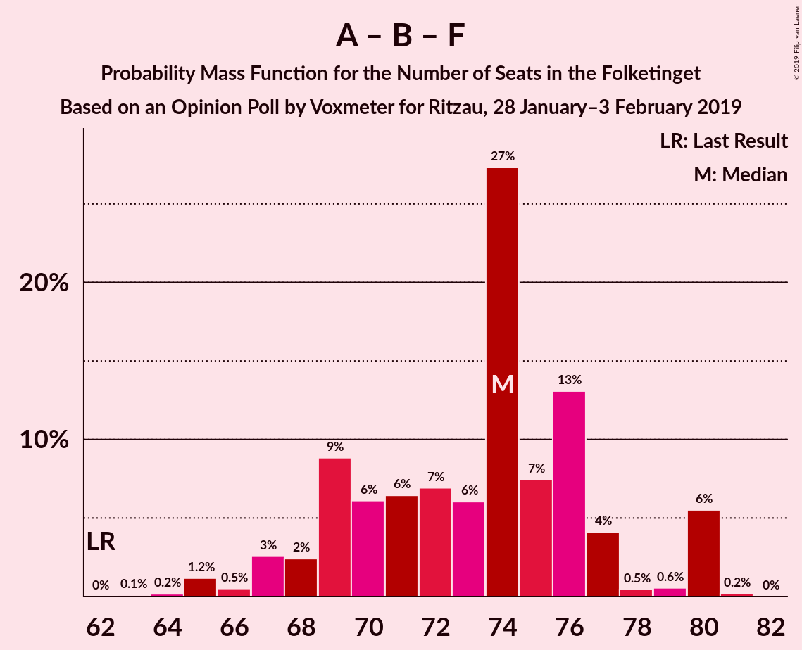

| Number of Seats | Probability | Accumulated | Special Marks |
|:---------------:|:-----------:|:-----------:|:-------------:|
| 62 | 0% | 100% | Last Result |
| 63 | 0.1% | 100% |  |
| 64 | 0.2% | 99.9% |  |
| 65 | 1.2% | 99.7% |  |
| 66 | 0.5% | 98.5% |  |
| 67 | 3% | 98% |  |
| 68 | 2% | 95% |  |
| 69 | 9% | 93% |  |
| 70 | 6% | 84% |  |
| 71 | 6% | 78% |  |
| 72 | 7% | 72% | Median |
| 73 | 6% | 65% |  |
| 74 | 27% | 59% |  |
| 75 | 7% | 31% |  |
| 76 | 13% | 24% |  |
| 77 | 4% | 11% |  |
| 78 | 0.5% | 7% |  |
| 79 | 0.6% | 6% |  |
| 80 | 6% | 6% |  |
| 81 | 0.2% | 0.2% |  |
| 82 | 0% | 0% |  |

### Socialdemokraterne – Radikale Venstre

| Number of Seats | Probability | Accumulated | Special Marks |
|:---------------:|:-----------:|:-----------:|:-------------:|
| 53 | 0% | 100% |  |
| 54 | 0.2% | 99.9% |  |
| 55 | 0.3% | 99.7% | Last Result |
| 56 | 0.9% | 99.4% |  |
| 57 | 2% | 98% |  |
| 58 | 2% | 96% |  |
| 59 | 4% | 94% |  |
| 60 | 5% | 90% |  |
| 61 | 13% | 85% |  |
| 62 | 6% | 73% | Median |
| 63 | 24% | 66% |  |
| 64 | 5% | 42% |  |
| 65 | 15% | 37% |  |
| 66 | 8% | 22% |  |
| 67 | 10% | 14% |  |
| 68 | 2% | 4% |  |
| 69 | 2% | 2% |  |
| 70 | 0.1% | 0.2% |  |
| 71 | 0% | 0.1% |  |
| 72 | 0.1% | 0.1% |  |
| 73 | 0% | 0% |  |

### Venstre – Liberal Alliance – Det Konservative Folkeparti

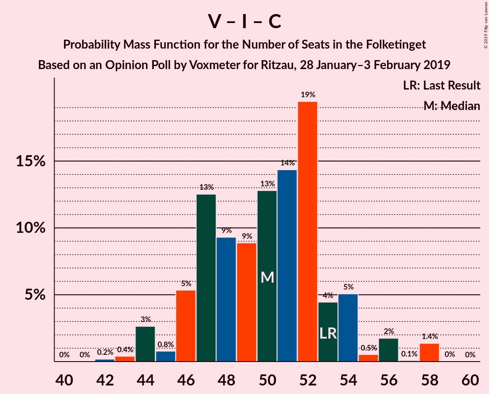

| Number of Seats | Probability | Accumulated | Special Marks |
|:---------------:|:-----------:|:-----------:|:-------------:|
| 42 | 0.2% | 100% |  |
| 43 | 0.4% | 99.8% |  |
| 44 | 3% | 99.4% |  |
| 45 | 0.8% | 97% |  |
| 46 | 5% | 96% |  |
| 47 | 13% | 91% |  |
| 48 | 9% | 78% |  |
| 49 | 9% | 69% |  |
| 50 | 13% | 60% | Median |
| 51 | 14% | 47% |  |
| 52 | 19% | 33% |  |
| 53 | 4% | 13% | Last Result |
| 54 | 5% | 9% |  |
| 55 | 0.5% | 4% |  |
| 56 | 2% | 3% |  |
| 57 | 0.1% | 2% |  |
| 58 | 1.4% | 1.4% |  |
| 59 | 0% | 0.1% |  |
| 60 | 0% | 0% |  |

### Venstre – Det Konservative Folkeparti

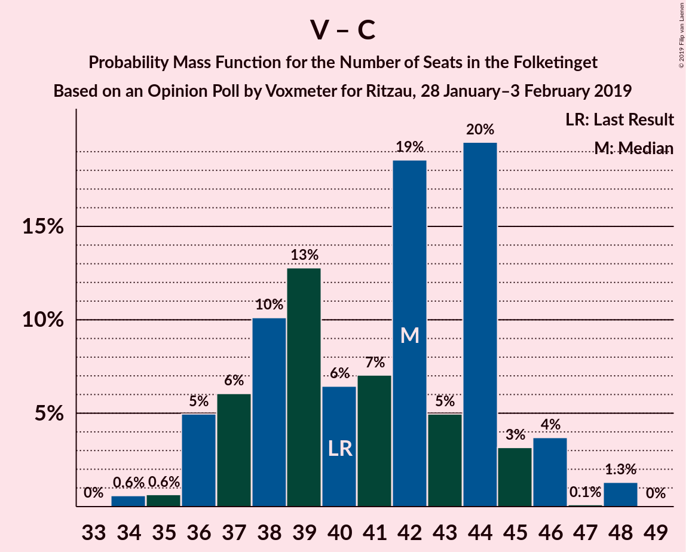

| Number of Seats | Probability | Accumulated | Special Marks |
|:---------------:|:-----------:|:-----------:|:-------------:|
| 34 | 0.6% | 100% |  |
| 35 | 0.6% | 99.4% |  |
| 36 | 5% | 98.7% |  |
| 37 | 6% | 94% |  |
| 38 | 10% | 88% |  |
| 39 | 13% | 78% |  |
| 40 | 6% | 65% | Last Result |
| 41 | 7% | 58% | Median |
| 42 | 19% | 51% |  |
| 43 | 5% | 33% |  |
| 44 | 20% | 28% |  |
| 45 | 3% | 8% |  |
| 46 | 4% | 5% |  |
| 47 | 0.1% | 1.4% |  |
| 48 | 1.3% | 1.3% |  |
| 49 | 0% | 0% |  |

### Venstre

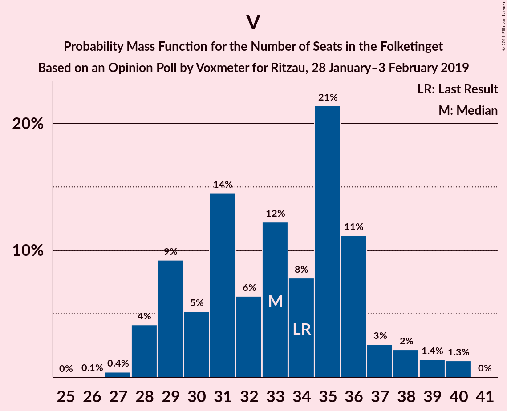

| Number of Seats | Probability | Accumulated | Special Marks |
|:---------------:|:-----------:|:-----------:|:-------------:|
| 26 | 0.1% | 100% |  |
| 27 | 0.4% | 99.9% |  |
| 28 | 4% | 99.5% |  |
| 29 | 9% | 95% |  |
| 30 | 5% | 86% |  |
| 31 | 14% | 81% |  |
| 32 | 6% | 66% |  |
| 33 | 12% | 60% | Median |
| 34 | 8% | 48% | Last Result |
| 35 | 21% | 40% |  |
| 36 | 11% | 19% |  |
| 37 | 3% | 7% |  |
| 38 | 2% | 5% |  |
| 39 | 1.4% | 3% |  |
| 40 | 1.3% | 1.3% |  |
| 41 | 0% | 0% |  |

## Technical Information

### Opinion Poll

+ **Polling firm:** Voxmeter
+ **Commissioner(s):** Ritzau
+ **Fieldwork period:** 28 January–3 February 2019

### Calculations

+ **Sample size:** 1045
+ **Simulations done:** 1,048,576
+ **Error estimate:** 1.71%

