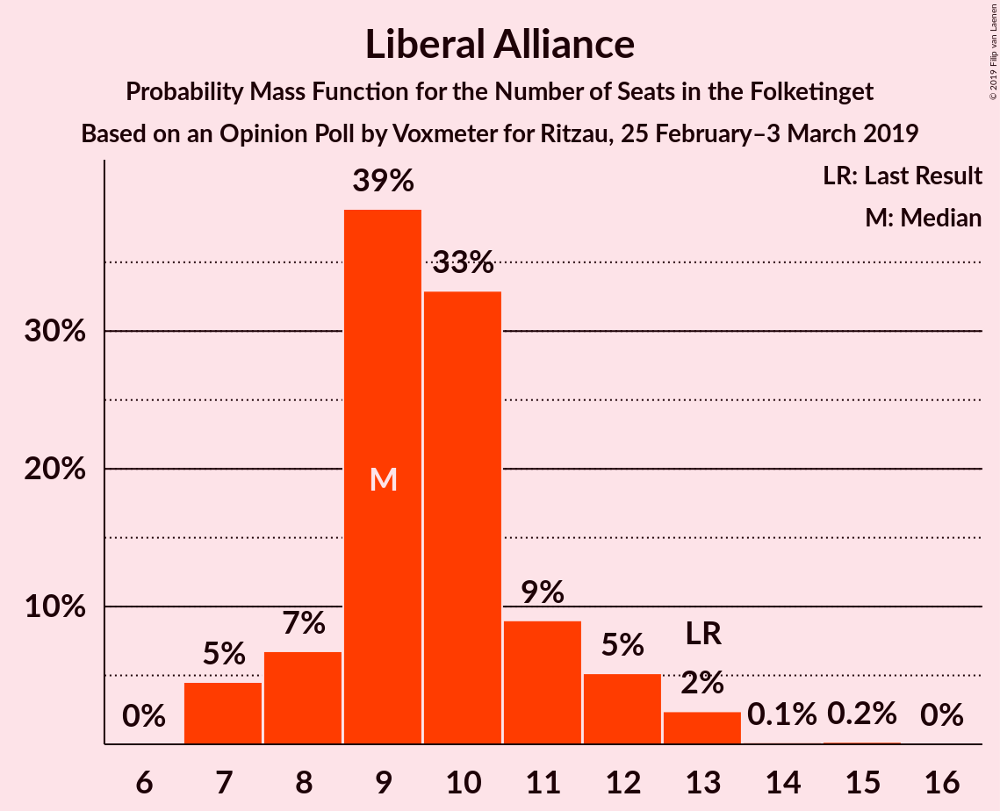
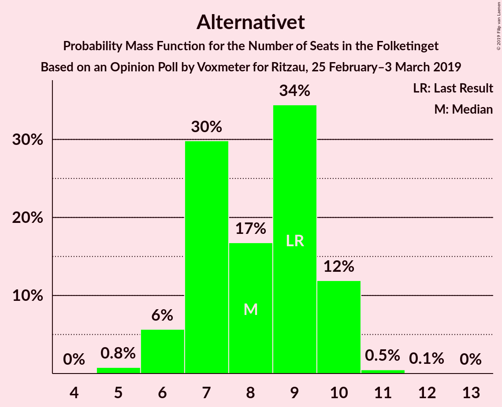
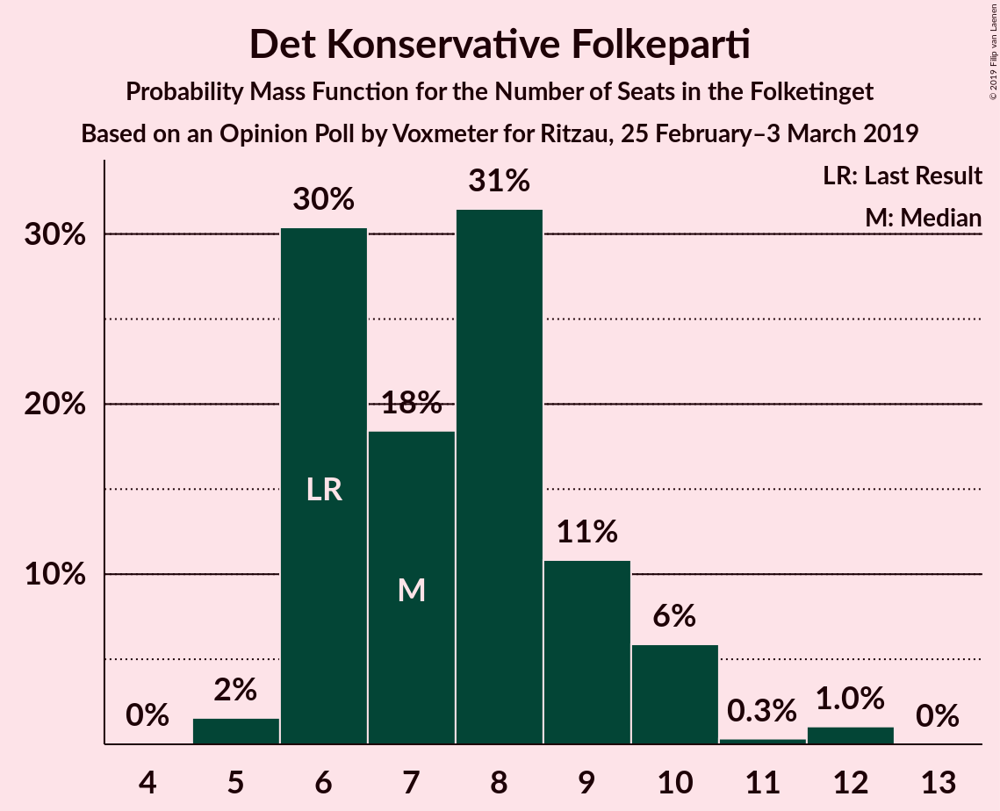
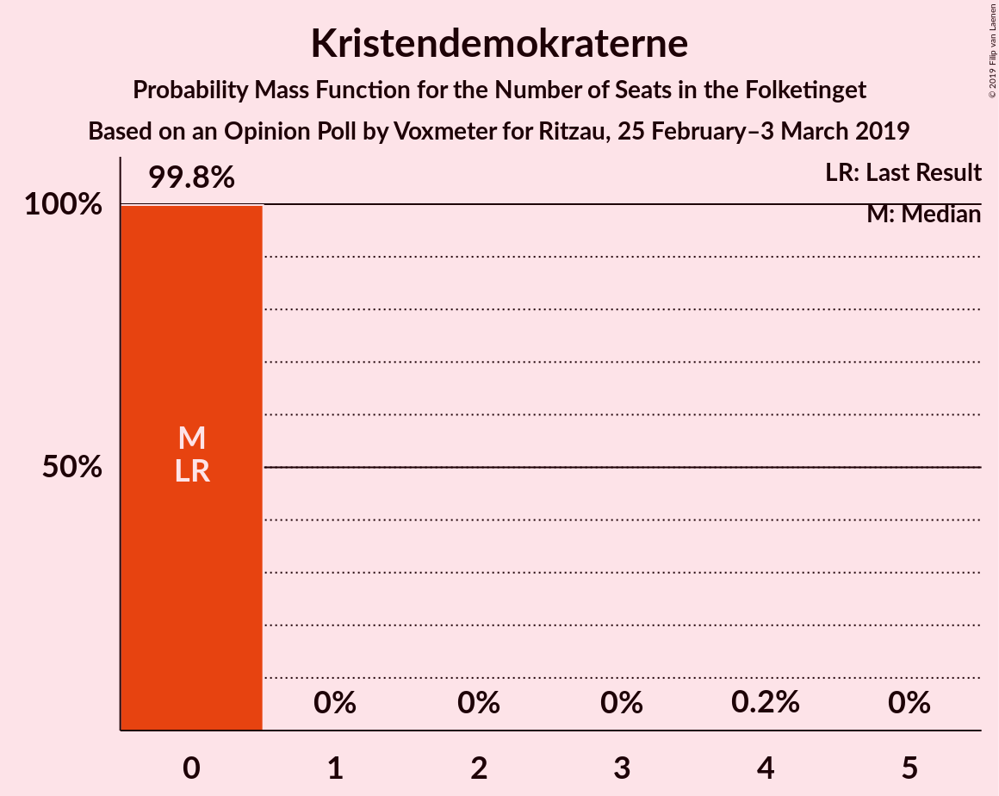
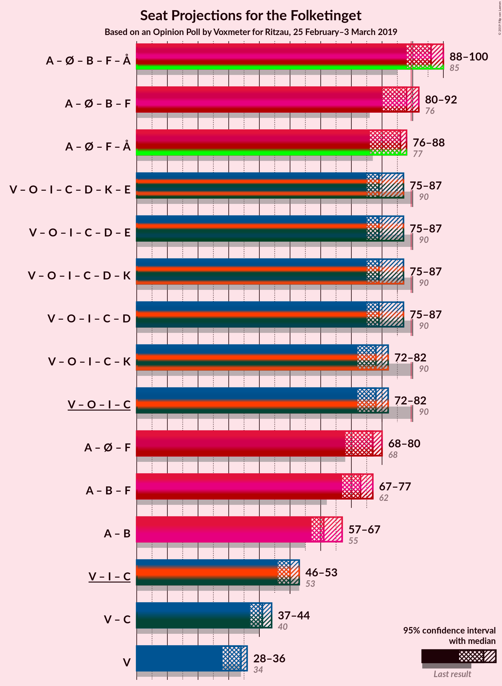
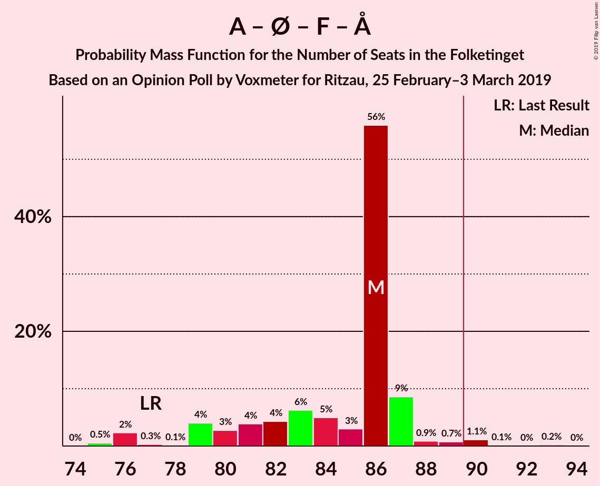
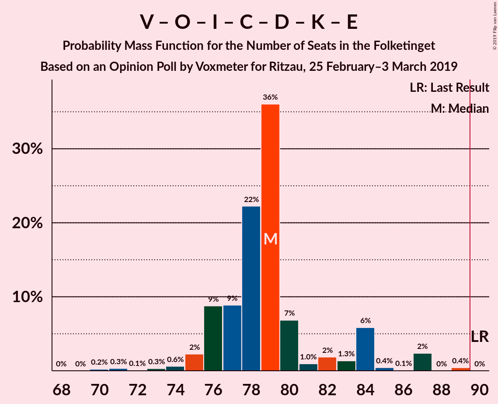
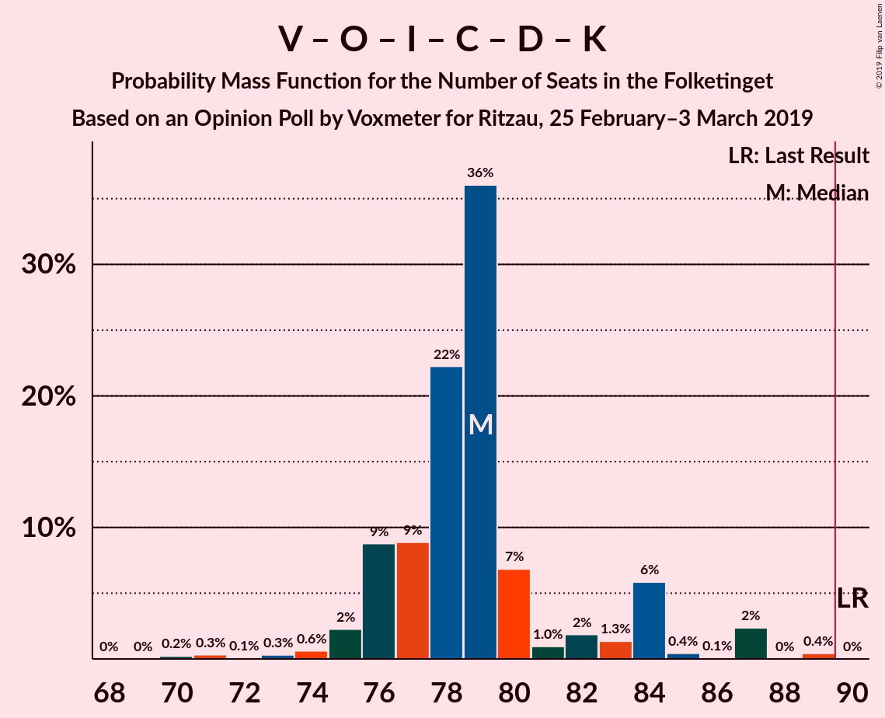
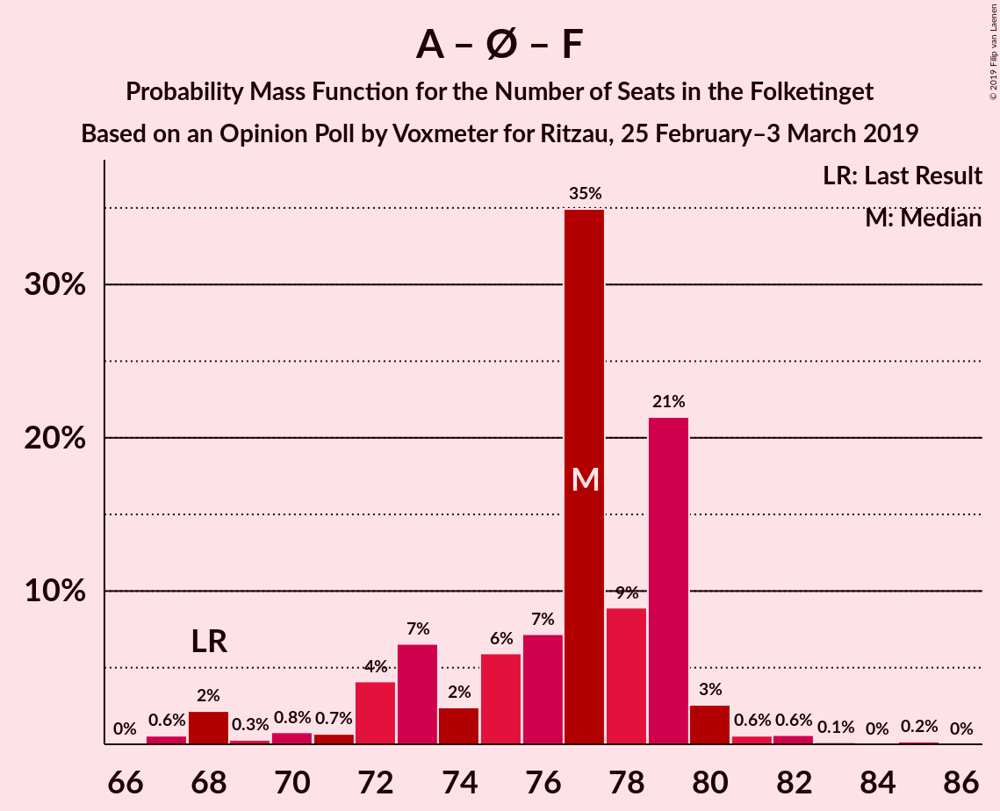
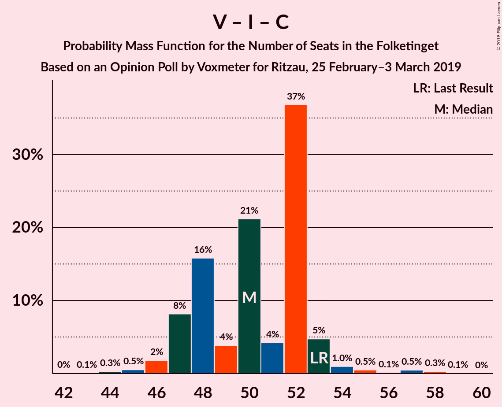

# Opinion Poll by Voxmeter for Ritzau, 25 February–3 March 2019

<a href="#voting-intentions">Voting Intentions</a> | <a href="#seats">Seats</a> | <a href="#coalitions">Coalitions</a> | <a href="#technical-information">Technical Information</a>

## Voting Intentions

### Confidence Intervals

| Party | Last Result | Poll Result | 80% Confidence Interval | 90% Confidence Interval | 95% Confidence Interval | 99% Confidence Interval |
|:-----:|:-----------:|:-----------:|:-----------------------:|:-----------------------:|:-----------------------:|:-----------------------:|
| Socialdemokraterne | 26.3% | 28.0% | 26.3–29.8% |25.8–30.4% |25.3–30.8% |24.5–31.7% |
| Venstre | 19.5% | 18.1% | 16.7–19.7% |16.2–20.2% |15.9–20.6% |15.2–21.4% |
| Dansk Folkeparti | 21.1% | 14.6% | 13.2–16.1% |12.9–16.5% |12.6–16.9% |11.9–17.6% |
| Enhedslisten–De Rød-Grønne | 7.8% | 8.6% | 7.6–9.8% |7.3–10.2% |7.1–10.5% |6.6–11.1% |
| Radikale Venstre | 4.6% | 6.7% | 5.8–7.8% |5.6–8.1% |5.3–8.4% |4.9–9.0% |
| Socialistisk Folkeparti | 4.2% | 5.9% | 5.1–7.0% |4.9–7.3% |4.7–7.6% |4.3–8.1% |
| Liberal Alliance | 7.5% | 5.7% | 4.8–6.7% |4.6–7.0% |4.4–7.2% |4.0–7.8% |
| Alternativet | 4.8% | 4.3% | 3.6–5.2% |3.4–5.5% |3.2–5.7% |2.9–6.2% |
| Det Konservative Folkeparti | 3.4% | 4.1% | 3.4–5.0% |3.2–5.3% |3.1–5.5% |2.8–6.0% |
| Nye Borgerlige | 0.0% | 2.1% | 1.6–2.8% |1.5–3.0% |1.4–3.2% |1.2–3.6% |
| Kristendemokraterne | 0.8% | 0.9% | 0.6–1.4% |0.5–1.5% |0.5–1.6% |0.4–1.9% |
| Klaus Riskær Pedersen | 0.0% | 0.6% | 0.4–1.0% |0.3–1.1% |0.3–1.2% |0.2–1.5% |

*Note:* The poll result column reflects the actual value used in the calculations. Published results may vary slightly, and in addition be rounded to fewer digits.

## Seats

### Confidence Intervals

| Party | Last Result | Median | 80% Confidence Interval | 90% Confidence Interval | 95% Confidence Interval | 99% Confidence Interval |
|:-----:|:-----------:|:------:|:-----------------------:|:-----------------------:|:-----------------------:|:-----------------------:|
| <a href="#socialdemokraterne">Socialdemokraterne</a> | 47 | 51 | 47–51 |46–52 |45–53 |44–56 |
| <a href="#venstre">Venstre</a> | 34 | 34 | 30–35 |29–35 |28–36 |27–38 |
| <a href="#dansk-folkeparti">Dansk Folkeparti</a> | 37 | 27 | 24–28 |24–29 |23–29 |22–31 |
| <a href="#enhedslisten–de-rød-grønne">Enhedslisten–De Rød-Grønne</a> | 14 | 16 | 14–19 |13–20 |13–20 |12–20 |
| <a href="#radikale-venstre">Radikale Venstre</a> | 8 | 11 | 10–13 |10–14 |10–14 |9–16 |
| <a href="#socialistisk-folkeparti">Socialistisk Folkeparti</a> | 7 | 12 | 9–12 |9–12 |8–13 |8–14 |
| <a href="#liberal-alliance">Liberal Alliance</a> | 13 | 9 | 8–11 |8–12 |7–13 |7–13 |
| <a href="#alternativet">Alternativet</a> | 9 | 8 | 7–10 |6–10 |6–10 |5–11 |
| <a href="#det-konservative-folkeparti">Det Konservative Folkeparti</a> | 6 | 7 | 6–9 |6–10 |6–10 |5–12 |
| <a href="#nye-borgerlige">Nye Borgerlige</a> | 0 | 0 | 0–5 |0–6 |0–6 |0–6 |
| <a href="#kristendemokraterne">Kristendemokraterne</a> | 0 | 0 | 0 |0 |0 |0 |
| <a href="#klaus-riskær-pedersen">Klaus Riskær Pedersen</a> | 0 | 0 | 0 |0 |0 |0 |

### Socialdemokraterne

*For a full overview of the results for this party, see the [Socialdemokraterne](party-socialdemokraterne.html) page.*

| Number of Seats | Probability | Accumulated | Special Marks |
|:---------------:|:-----------:|:-----------:|:-------------:|
| 43 | 0% | 100% |  |
| 44 | 1.3% | 99.9% |  |
| 45 | 3% | 98.6% |  |
| 46 | 5% | 95% |  |
| 47 | 9% | 90% | Last Result |
| 48 | 15% | 81% |  |
| 49 | 8% | 66% |  |
| 50 | 3% | 58% |  |
| 51 | 49% | 54% | Median |
| 52 | 2% | 6% |  |
| 53 | 1.4% | 4% |  |
| 54 | 1.2% | 2% |  |
| 55 | 0.5% | 1.2% |  |
| 56 | 0.3% | 0.7% |  |
| 57 | 0.2% | 0.5% |  |
| 58 | 0.1% | 0.3% |  |
| 59 | 0.2% | 0.2% |  |
| 60 | 0% | 0% |  |

### Venstre

*For a full overview of the results for this party, see the [Venstre](party-venstre.html) page.*

| Number of Seats | Probability | Accumulated | Special Marks |
|:---------------:|:-----------:|:-----------:|:-------------:|
| 26 | 0.1% | 100% |  |
| 27 | 0.6% | 99.9% |  |
| 28 | 2% | 99.4% |  |
| 29 | 3% | 97% |  |
| 30 | 14% | 94% |  |
| 31 | 3% | 80% |  |
| 32 | 7% | 78% |  |
| 33 | 5% | 71% |  |
| 34 | 32% | 66% | Last Result, Median |
| 35 | 29% | 34% |  |
| 36 | 3% | 5% |  |
| 37 | 1.4% | 2% |  |
| 38 | 0.4% | 0.6% |  |
| 39 | 0.2% | 0.2% |  |
| 40 | 0% | 0% |  |

### Dansk Folkeparti

*For a full overview of the results for this party, see the [Dansk Folkeparti](party-danskfolkeparti.html) page.*

| Number of Seats | Probability | Accumulated | Special Marks |
|:---------------:|:-----------:|:-----------:|:-------------:|
| 20 | 0.1% | 100% |  |
| 21 | 0.3% | 99.9% |  |
| 22 | 1.1% | 99.6% |  |
| 23 | 2% | 98.5% |  |
| 24 | 9% | 96% |  |
| 25 | 15% | 87% |  |
| 26 | 4% | 72% |  |
| 27 | 32% | 68% | Median |
| 28 | 28% | 36% |  |
| 29 | 5% | 7% |  |
| 30 | 1.5% | 2% |  |
| 31 | 0.8% | 1.0% |  |
| 32 | 0.1% | 0.2% |  |
| 33 | 0% | 0% |  |
| 34 | 0% | 0% |  |
| 35 | 0% | 0% |  |
| 36 | 0% | 0% |  |
| 37 | 0% | 0% | Last Result |

### Enhedslisten–De Rød-Grønne

*For a full overview of the results for this party, see the [Enhedslisten–De Rød-Grønne](party-enhedslisten–derød-grønne.html) page.*

| Number of Seats | Probability | Accumulated | Special Marks |
|:---------------:|:-----------:|:-----------:|:-------------:|
| 11 | 0.2% | 100% |  |
| 12 | 2% | 99.7% |  |
| 13 | 3% | 98% |  |
| 14 | 30% | 95% | Last Result |
| 15 | 4% | 64% |  |
| 16 | 34% | 61% | Median |
| 17 | 7% | 26% |  |
| 18 | 5% | 20% |  |
| 19 | 8% | 15% |  |
| 20 | 7% | 7% |  |
| 21 | 0% | 0.1% |  |
| 22 | 0% | 0% |  |

### Radikale Venstre

*For a full overview of the results for this party, see the [Radikale Venstre](party-radikalevenstre.html) page.*

| Number of Seats | Probability | Accumulated | Special Marks |
|:---------------:|:-----------:|:-----------:|:-------------:|
| 8 | 0.1% | 100% | Last Result |
| 9 | 2% | 99.9% |  |
| 10 | 30% | 98% |  |
| 11 | 25% | 68% | Median |
| 12 | 27% | 43% |  |
| 13 | 8% | 16% |  |
| 14 | 6% | 8% |  |
| 15 | 2% | 2% |  |
| 16 | 0.5% | 0.6% |  |
| 17 | 0.1% | 0.1% |  |
| 18 | 0% | 0% |  |

### Socialistisk Folkeparti

*For a full overview of the results for this party, see the [Socialistisk Folkeparti](party-socialistiskfolkeparti.html) page.*

| Number of Seats | Probability | Accumulated | Special Marks |
|:---------------:|:-----------:|:-----------:|:-------------:|
| 6 | 0.1% | 100% |  |
| 7 | 0.1% | 99.9% | Last Result |
| 8 | 3% | 99.8% |  |
| 9 | 14% | 97% |  |
| 10 | 13% | 83% |  |
| 11 | 14% | 71% |  |
| 12 | 52% | 56% | Median |
| 13 | 2% | 4% |  |
| 14 | 2% | 2% |  |
| 15 | 0.1% | 0.1% |  |
| 16 | 0% | 0% |  |

### Liberal Alliance

*For a full overview of the results for this party, see the [Liberal Alliance](party-liberalalliance.html) page.*

| Number of Seats | Probability | Accumulated | Special Marks |
|:---------------:|:-----------:|:-----------:|:-------------:|
| 7 | 5% | 100% |  |
| 8 | 7% | 95% |  |
| 9 | 39% | 89% | Median |
| 10 | 33% | 50% |  |
| 11 | 9% | 17% |  |
| 12 | 5% | 8% |  |
| 13 | 2% | 3% | Last Result |
| 14 | 0.1% | 0.4% |  |
| 15 | 0.2% | 0.2% |  |
| 16 | 0% | 0% |  |

### Alternativet

*For a full overview of the results for this party, see the [Alternativet](party-alternativet.html) page.*

| Number of Seats | Probability | Accumulated | Special Marks |
|:---------------:|:-----------:|:-----------:|:-------------:|
| 5 | 0.8% | 100% |  |
| 6 | 6% | 99.2% |  |
| 7 | 30% | 94% |  |
| 8 | 17% | 64% | Median |
| 9 | 34% | 47% | Last Result |
| 10 | 12% | 12% |  |
| 11 | 0.5% | 0.6% |  |
| 12 | 0.1% | 0.1% |  |
| 13 | 0% | 0% |  |

### Det Konservative Folkeparti

*For a full overview of the results for this party, see the [Det Konservative Folkeparti](party-detkonservativefolkeparti.html) page.*

| Number of Seats | Probability | Accumulated | Special Marks |
|:---------------:|:-----------:|:-----------:|:-------------:|
| 5 | 2% | 100% |  |
| 6 | 30% | 98% | Last Result |
| 7 | 18% | 68% | Median |
| 8 | 31% | 50% |  |
| 9 | 11% | 18% |  |
| 10 | 6% | 7% |  |
| 11 | 0.3% | 1.4% |  |
| 12 | 1.0% | 1.1% |  |
| 13 | 0% | 0% |  |

### Nye Borgerlige

*For a full overview of the results for this party, see the [Nye Borgerlige](party-nyeborgerlige.html) page.*

| Number of Seats | Probability | Accumulated | Special Marks |
|:---------------:|:-----------:|:-----------:|:-------------:|
| 0 | 60% | 100% | Last Result, Median |
| 1 | 0% | 40% |  |
| 2 | 0% | 40% |  |
| 3 | 0.7% | 40% |  |
| 4 | 16% | 39% |  |
| 5 | 15% | 23% |  |
| 6 | 8% | 8% |  |
| 7 | 0.3% | 0.3% |  |
| 8 | 0% | 0% |  |

### Kristendemokraterne

*For a full overview of the results for this party, see the [Kristendemokraterne](party-kristendemokraterne.html) page.*

| Number of Seats | Probability | Accumulated | Special Marks |
|:---------------:|:-----------:|:-----------:|:-------------:|
| 0 | 99.8% | 100% | Last Result, Median |
| 1 | 0% | 0.2% |  |
| 2 | 0% | 0.2% |  |
| 3 | 0% | 0.2% |  |
| 4 | 0.2% | 0.2% |  |
| 5 | 0% | 0% |  |

### Klaus Riskær Pedersen

*For a full overview of the results for this party, see the [Klaus Riskær Pedersen](party-klausriskærpedersen.html) page.*

| Number of Seats | Probability | Accumulated | Special Marks |
|:---------------:|:-----------:|:-----------:|:-------------:|
| 0 | 100% | 100% | Last Result, Median |

## Coalitions

### Confidence Intervals

| Coalition | Last Result | Median | Majority? | 80% Confidence Interval | 90% Confidence Interval | 95% Confidence Interval | 99% Confidence Interval |
|:---------:|:-----------:|:------:|:---------:|:-----------------------:|:-----------------------:|:-----------------------:|:-----------------------:|
| Socialdemokraterne – Enhedslisten–De Rød-Grønne – Radikale Venstre – Socialistisk Folkeparti – Alternativet | 85 | 96 | 97% | 92–99 | 91–99 | 88–100 | 88–104 |
| Socialdemokraterne – Enhedslisten–De Rød-Grønne – Radikale Venstre – Socialistisk Folkeparti | 76 | 88 | 35% | 85–90 | 84–90 | 80–92 | 78–95 |
| Socialdemokraterne – Enhedslisten–De Rød-Grønne – Socialistisk Folkeparti – Alternativet | 77 | 86 | 1.4% | 80–87 | 79–87 | 76–88 | 75–90 |
| Venstre – Dansk Folkeparti – Liberal Alliance – Det Konservative Folkeparti – Nye Borgerlige – Kristendemokraterne – Klaus Riskær Pedersen | 90 | 79 | 0% | 76–83 | 76–84 | 75–87 | 71–87 |
| Venstre – Dansk Folkeparti – Liberal Alliance – Det Konservative Folkeparti – Nye Borgerlige – Klaus Riskær Pedersen | 90 | 79 | 0% | 76–83 | 76–84 | 75–87 | 71–87 |
| Venstre – Dansk Folkeparti – Liberal Alliance – Det Konservative Folkeparti – Nye Borgerlige – Kristendemokraterne | 90 | 79 | 0% | 76–83 | 76–84 | 75–87 | 71–87 |
| Venstre – Dansk Folkeparti – Liberal Alliance – Det Konservative Folkeparti – Nye Borgerlige | 90 | 79 | 0% | 76–83 | 76–84 | 75–87 | 71–87 |
| Venstre – Dansk Folkeparti – Liberal Alliance – Det Konservative Folkeparti – Kristendemokraterne | 90 | 78 | 0% | 72–80 | 72–80 | 72–82 | 70–84 |
| Venstre – Dansk Folkeparti – Liberal Alliance – Det Konservative Folkeparti | 90 | 78 | 0% | 72–80 | 72–80 | 72–82 | 70–84 |
| Socialdemokraterne – Enhedslisten–De Rød-Grønne – Socialistisk Folkeparti | 68 | 77 | 0% | 73–79 | 72–79 | 68–80 | 67–82 |
| Socialdemokraterne – Radikale Venstre – Socialistisk Folkeparti | 62 | 73 | 0% | 69–74 | 68–75 | 67–77 | 65–81 |
| Socialdemokraterne – Radikale Venstre | 55 | 61 | 0% | 58–62 | 57–64 | 57–67 | 55–69 |
| Venstre – Liberal Alliance – Det Konservative Folkeparti | 53 | 50 | 0% | 47–52 | 47–53 | 46–53 | 45–57 |
| Venstre – Det Konservative Folkeparti | 40 | 41 | 0% | 37–43 | 37–43 | 37–44 | 35–46 |
| Venstre | 34 | 34 | 0% | 30–35 | 29–35 | 28–36 | 27–38 |

### Socialdemokraterne – Enhedslisten–De Rød-Grønne – Radikale Venstre – Socialistisk Folkeparti – Alternativet

| Number of Seats | Probability | Accumulated | Special Marks |
|:---------------:|:-----------:|:-----------:|:-------------:|
| 85 | 0% | 100% | Last Result |
| 86 | 0.4% | 100% |  |
| 87 | 0% | 99.6% |  |
| 88 | 2% | 99.5% |  |
| 89 | 0.1% | 97% |  |
| 90 | 0.4% | 97% | Majority |
| 91 | 6% | 97% |  |
| 92 | 1.3% | 91% |  |
| 93 | 2% | 89% |  |
| 94 | 1.0% | 88% |  |
| 95 | 7% | 87% |  |
| 96 | 36% | 80% |  |
| 97 | 22% | 44% |  |
| 98 | 9% | 21% | Median |
| 99 | 9% | 13% |  |
| 100 | 2% | 4% |  |
| 101 | 0.6% | 2% |  |
| 102 | 0.3% | 1.0% |  |
| 103 | 0.1% | 0.6% |  |
| 104 | 0.3% | 0.6% |  |
| 105 | 0.2% | 0.2% |  |
| 106 | 0% | 0% |  |

### Socialdemokraterne – Enhedslisten–De Rød-Grønne – Radikale Venstre – Socialistisk Folkeparti

| Number of Seats | Probability | Accumulated | Special Marks |
|:---------------:|:-----------:|:-----------:|:-------------:|
| 76 | 0% | 100% | Last Result |
| 77 | 0% | 100% |  |
| 78 | 0.6% | 100% |  |
| 79 | 0% | 99.4% |  |
| 80 | 2% | 99.4% |  |
| 81 | 0.1% | 97% |  |
| 82 | 0.5% | 97% |  |
| 83 | 1.2% | 97% |  |
| 84 | 2% | 95% |  |
| 85 | 9% | 94% |  |
| 86 | 1.2% | 85% |  |
| 87 | 33% | 84% |  |
| 88 | 3% | 50% |  |
| 89 | 13% | 48% |  |
| 90 | 30% | 35% | Median, Majority |
| 91 | 0.8% | 5% |  |
| 92 | 2% | 4% |  |
| 93 | 1.2% | 2% |  |
| 94 | 0.3% | 1.0% |  |
| 95 | 0.3% | 0.8% |  |
| 96 | 0.2% | 0.5% |  |
| 97 | 0.3% | 0.3% |  |
| 98 | 0% | 0% |  |

### Socialdemokraterne – Enhedslisten–De Rød-Grønne – Socialistisk Folkeparti – Alternativet

| Number of Seats | Probability | Accumulated | Special Marks |
|:---------------:|:-----------:|:-----------:|:-------------:|
| 75 | 0.5% | 100% |  |
| 76 | 2% | 99.5% |  |
| 77 | 0.3% | 97% | Last Result |
| 78 | 0.1% | 97% |  |
| 79 | 4% | 97% |  |
| 80 | 3% | 93% |  |
| 81 | 4% | 90% |  |
| 82 | 4% | 86% |  |
| 83 | 6% | 82% |  |
| 84 | 5% | 76% |  |
| 85 | 3% | 71% |  |
| 86 | 56% | 68% |  |
| 87 | 9% | 12% | Median |
| 88 | 0.9% | 3% |  |
| 89 | 0.7% | 2% |  |
| 90 | 1.1% | 1.4% | Majority |
| 91 | 0.1% | 0.3% |  |
| 92 | 0% | 0.3% |  |
| 93 | 0.2% | 0.2% |  |
| 94 | 0% | 0% |  |

### Venstre – Dansk Folkeparti – Liberal Alliance – Det Konservative Folkeparti – Nye Borgerlige – Kristendemokraterne – Klaus Riskær Pedersen

| Number of Seats | Probability | Accumulated | Special Marks |
|:---------------:|:-----------:|:-----------:|:-------------:|
| 70 | 0.2% | 100% |  |
| 71 | 0.3% | 99.8% |  |
| 72 | 0.1% | 99.4% |  |
| 73 | 0.3% | 99.4% |  |
| 74 | 0.6% | 99.0% |  |
| 75 | 2% | 98% |  |
| 76 | 9% | 96% |  |
| 77 | 9% | 87% | Median |
| 78 | 22% | 79% |  |
| 79 | 36% | 56% |  |
| 80 | 7% | 20% |  |
| 81 | 1.0% | 13% |  |
| 82 | 2% | 12% |  |
| 83 | 1.3% | 11% |  |
| 84 | 6% | 9% |  |
| 85 | 0.4% | 3% |  |
| 86 | 0.1% | 3% |  |
| 87 | 2% | 3% |  |
| 88 | 0% | 0.5% |  |
| 89 | 0.4% | 0.4% |  |
| 90 | 0% | 0% | Last Result, Majority |

### Venstre – Dansk Folkeparti – Liberal Alliance – Det Konservative Folkeparti – Nye Borgerlige – Klaus Riskær Pedersen

| Number of Seats | Probability | Accumulated | Special Marks |
|:---------------:|:-----------:|:-----------:|:-------------:|
| 70 | 0.2% | 100% |  |
| 71 | 0.3% | 99.8% |  |
| 72 | 0.1% | 99.4% |  |
| 73 | 0.3% | 99.3% |  |
| 74 | 0.6% | 99.0% |  |
| 75 | 2% | 98% |  |
| 76 | 9% | 96% |  |
| 77 | 9% | 87% | Median |
| 78 | 22% | 78% |  |
| 79 | 36% | 56% |  |
| 80 | 7% | 20% |  |
| 81 | 0.9% | 13% |  |
| 82 | 2% | 12% |  |
| 83 | 1.3% | 10% |  |
| 84 | 6% | 9% |  |
| 85 | 0.4% | 3% |  |
| 86 | 0.1% | 3% |  |
| 87 | 2% | 3% |  |
| 88 | 0% | 0.5% |  |
| 89 | 0.4% | 0.4% |  |
| 90 | 0% | 0% | Last Result, Majority |

### Venstre – Dansk Folkeparti – Liberal Alliance – Det Konservative Folkeparti – Nye Borgerlige – Kristendemokraterne

| Number of Seats | Probability | Accumulated | Special Marks |
|:---------------:|:-----------:|:-----------:|:-------------:|
| 70 | 0.2% | 100% |  |
| 71 | 0.3% | 99.8% |  |
| 72 | 0.1% | 99.4% |  |
| 73 | 0.3% | 99.4% |  |
| 74 | 0.6% | 99.0% |  |
| 75 | 2% | 98% |  |
| 76 | 9% | 96% |  |
| 77 | 9% | 87% | Median |
| 78 | 22% | 79% |  |
| 79 | 36% | 56% |  |
| 80 | 7% | 20% |  |
| 81 | 1.0% | 13% |  |
| 82 | 2% | 12% |  |
| 83 | 1.3% | 11% |  |
| 84 | 6% | 9% |  |
| 85 | 0.4% | 3% |  |
| 86 | 0.1% | 3% |  |
| 87 | 2% | 3% |  |
| 88 | 0% | 0.5% |  |
| 89 | 0.4% | 0.4% |  |
| 90 | 0% | 0% | Last Result, Majority |

### Venstre – Dansk Folkeparti – Liberal Alliance – Det Konservative Folkeparti – Nye Borgerlige

| Number of Seats | Probability | Accumulated | Special Marks |
|:---------------:|:-----------:|:-----------:|:-------------:|
| 70 | 0.2% | 100% |  |
| 71 | 0.3% | 99.8% |  |
| 72 | 0.1% | 99.4% |  |
| 73 | 0.3% | 99.3% |  |
| 74 | 0.6% | 99.0% |  |
| 75 | 2% | 98% |  |
| 76 | 9% | 96% |  |
| 77 | 9% | 87% | Median |
| 78 | 22% | 78% |  |
| 79 | 36% | 56% |  |
| 80 | 7% | 20% |  |
| 81 | 0.9% | 13% |  |
| 82 | 2% | 12% |  |
| 83 | 1.3% | 10% |  |
| 84 | 6% | 9% |  |
| 85 | 0.4% | 3% |  |
| 86 | 0.1% | 3% |  |
| 87 | 2% | 3% |  |
| 88 | 0% | 0.5% |  |
| 89 | 0.4% | 0.4% |  |
| 90 | 0% | 0% | Last Result, Majority |

### Venstre – Dansk Folkeparti – Liberal Alliance – Det Konservative Folkeparti – Kristendemokraterne

| Number of Seats | Probability | Accumulated | Special Marks |
|:---------------:|:-----------:|:-----------:|:-------------:|
| 66 | 0.2% | 100% |  |
| 67 | 0% | 99.8% |  |
| 68 | 0.1% | 99.8% |  |
| 69 | 0.2% | 99.7% |  |
| 70 | 0.5% | 99.5% |  |
| 71 | 0.9% | 99.0% |  |
| 72 | 13% | 98% |  |
| 73 | 8% | 85% |  |
| 74 | 3% | 78% |  |
| 75 | 4% | 75% |  |
| 76 | 3% | 70% |  |
| 77 | 2% | 67% | Median |
| 78 | 22% | 65% |  |
| 79 | 30% | 43% |  |
| 80 | 8% | 13% |  |
| 81 | 1.3% | 5% |  |
| 82 | 2% | 3% |  |
| 83 | 0.2% | 1.0% |  |
| 84 | 0.8% | 0.9% |  |
| 85 | 0% | 0.1% |  |
| 86 | 0% | 0% |  |
| 87 | 0% | 0% |  |
| 88 | 0% | 0% |  |
| 89 | 0% | 0% |  |
| 90 | 0% | 0% | Last Result, Majority |

### Venstre – Dansk Folkeparti – Liberal Alliance – Det Konservative Folkeparti

| Number of Seats | Probability | Accumulated | Special Marks |
|:---------------:|:-----------:|:-----------:|:-------------:|
| 66 | 0.2% | 100% |  |
| 67 | 0% | 99.8% |  |
| 68 | 0.1% | 99.8% |  |
| 69 | 0.2% | 99.7% |  |
| 70 | 0.5% | 99.5% |  |
| 71 | 0.9% | 99.0% |  |
| 72 | 13% | 98% |  |
| 73 | 8% | 85% |  |
| 74 | 3% | 77% |  |
| 75 | 4% | 74% |  |
| 76 | 3% | 70% |  |
| 77 | 2% | 67% | Median |
| 78 | 22% | 65% |  |
| 79 | 30% | 43% |  |
| 80 | 8% | 13% |  |
| 81 | 1.3% | 5% |  |
| 82 | 2% | 3% |  |
| 83 | 0.2% | 1.0% |  |
| 84 | 0.8% | 0.9% |  |
| 85 | 0% | 0.1% |  |
| 86 | 0% | 0% |  |
| 87 | 0% | 0% |  |
| 88 | 0% | 0% |  |
| 89 | 0% | 0% |  |
| 90 | 0% | 0% | Last Result, Majority |

### Socialdemokraterne – Enhedslisten–De Rød-Grønne – Socialistisk Folkeparti

| Number of Seats | Probability | Accumulated | Special Marks |
|:---------------:|:-----------:|:-----------:|:-------------:|
| 67 | 0.6% | 100% |  |
| 68 | 2% | 99.4% | Last Result |
| 69 | 0.3% | 97% |  |
| 70 | 0.8% | 97% |  |
| 71 | 0.7% | 96% |  |
| 72 | 4% | 95% |  |
| 73 | 7% | 91% |  |
| 74 | 2% | 85% |  |
| 75 | 6% | 82% |  |
| 76 | 7% | 77% |  |
| 77 | 35% | 69% |  |
| 78 | 9% | 34% |  |
| 79 | 21% | 25% | Median |
| 80 | 3% | 4% |  |
| 81 | 0.6% | 2% |  |
| 82 | 0.6% | 1.0% |  |
| 83 | 0.1% | 0.4% |  |
| 84 | 0% | 0.2% |  |
| 85 | 0.2% | 0.2% |  |
| 86 | 0% | 0% |  |

### Socialdemokraterne – Radikale Venstre – Socialistisk Folkeparti

| Number of Seats | Probability | Accumulated | Special Marks |
|:---------------:|:-----------:|:-----------:|:-------------:|
| 62 | 0% | 100% | Last Result |
| 63 | 0% | 100% |  |
| 64 | 0% | 100% |  |
| 65 | 0.5% | 100% |  |
| 66 | 0.9% | 99.4% |  |
| 67 | 3% | 98.6% |  |
| 68 | 1.3% | 96% |  |
| 69 | 10% | 95% |  |
| 70 | 14% | 85% |  |
| 71 | 8% | 71% |  |
| 72 | 5% | 63% |  |
| 73 | 30% | 57% |  |
| 74 | 22% | 28% | Median |
| 75 | 2% | 5% |  |
| 76 | 0.6% | 3% |  |
| 77 | 0.3% | 3% |  |
| 78 | 2% | 2% |  |
| 79 | 0.3% | 0.9% |  |
| 80 | 0.2% | 0.7% |  |
| 81 | 0.2% | 0.5% |  |
| 82 | 0% | 0.3% |  |
| 83 | 0.3% | 0.3% |  |
| 84 | 0% | 0% |  |

### Socialdemokraterne – Radikale Venstre

| Number of Seats | Probability | Accumulated | Special Marks |
|:---------------:|:-----------:|:-----------:|:-------------:|
| 54 | 0.1% | 100% |  |
| 55 | 0.6% | 99.9% | Last Result |
| 56 | 0.8% | 99.3% |  |
| 57 | 4% | 98% |  |
| 58 | 6% | 95% |  |
| 59 | 2% | 88% |  |
| 60 | 18% | 86% |  |
| 61 | 37% | 68% |  |
| 62 | 22% | 31% | Median |
| 63 | 2% | 9% |  |
| 64 | 2% | 7% |  |
| 65 | 1.1% | 5% |  |
| 66 | 0.8% | 4% |  |
| 67 | 2% | 3% |  |
| 68 | 0.4% | 1.0% |  |
| 69 | 0.3% | 0.6% |  |
| 70 | 0.3% | 0.3% |  |
| 71 | 0% | 0.1% |  |
| 72 | 0% | 0% |  |

### Venstre – Liberal Alliance – Det Konservative Folkeparti

| Number of Seats | Probability | Accumulated | Special Marks |
|:---------------:|:-----------:|:-----------:|:-------------:|
| 42 | 0% | 100% |  |
| 43 | 0.1% | 99.9% |  |
| 44 | 0.3% | 99.9% |  |
| 45 | 0.5% | 99.6% |  |
| 46 | 2% | 99.1% |  |
| 47 | 8% | 97% |  |
| 48 | 16% | 89% |  |
| 49 | 4% | 73% |  |
| 50 | 21% | 69% | Median |
| 51 | 4% | 48% |  |
| 52 | 37% | 44% |  |
| 53 | 5% | 7% | Last Result |
| 54 | 1.0% | 2% |  |
| 55 | 0.5% | 1.5% |  |
| 56 | 0.1% | 1.0% |  |
| 57 | 0.5% | 0.9% |  |
| 58 | 0.3% | 0.4% |  |
| 59 | 0.1% | 0.1% |  |
| 60 | 0% | 0% |  |

### Venstre – Det Konservative Folkeparti

| Number of Seats | Probability | Accumulated | Special Marks |
|:---------------:|:-----------:|:-----------:|:-------------:|
| 33 | 0.1% | 100% |  |
| 34 | 0.3% | 99.9% |  |
| 35 | 0.9% | 99.6% |  |
| 36 | 0.9% | 98.7% |  |
| 37 | 9% | 98% |  |
| 38 | 4% | 89% |  |
| 39 | 9% | 85% |  |
| 40 | 26% | 76% | Last Result |
| 41 | 12% | 50% | Median |
| 42 | 7% | 38% |  |
| 43 | 28% | 32% |  |
| 44 | 2% | 3% |  |
| 45 | 0.4% | 1.2% |  |
| 46 | 0.5% | 0.8% |  |
| 47 | 0.1% | 0.3% |  |
| 48 | 0.1% | 0.1% |  |
| 49 | 0% | 0% |  |

### Venstre

| Number of Seats | Probability | Accumulated | Special Marks |
|:---------------:|:-----------:|:-----------:|:-------------:|
| 26 | 0.1% | 100% |  |
| 27 | 0.6% | 99.9% |  |
| 28 | 2% | 99.4% |  |
| 29 | 3% | 97% |  |
| 30 | 14% | 94% |  |
| 31 | 3% | 80% |  |
| 32 | 7% | 78% |  |
| 33 | 5% | 71% |  |
| 34 | 32% | 66% | Last Result, Median |
| 35 | 29% | 34% |  |
| 36 | 3% | 5% |  |
| 37 | 1.4% | 2% |  |
| 38 | 0.4% | 0.6% |  |
| 39 | 0.2% | 0.2% |  |
| 40 | 0% | 0% |  |

## Technical Information

### Opinion Poll

+ **Polling firm:** Voxmeter
+ **Commissioner(s):** Ritzau
+ **Fieldwork period:** 25 February–3 March 2019

### Calculations

+ **Sample size:** 1043
+ **Simulations done:** 1,048,576
+ **Error estimate:** 3.43%

