# Opinion Poll by Kantar Gallup for Berlingske, 8–14 March 2019

<a href="#voting-intentions">Voting Intentions</a> | <a href="#seats">Seats</a> | <a href="#coalitions">Coalitions</a> | <a href="#technical-information">Technical Information</a>

## Voting Intentions

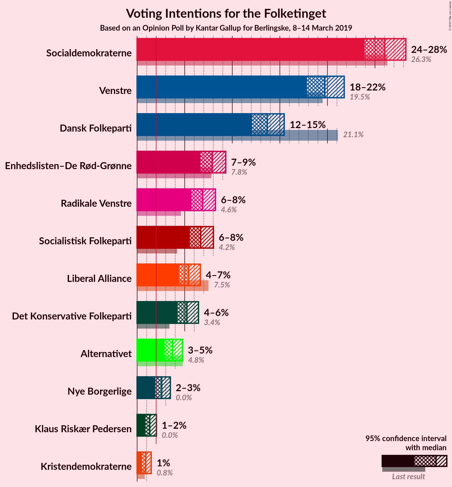

### Confidence Intervals

| Party | Last Result | Poll Result | 80% Confidence Interval | 90% Confidence Interval | 95% Confidence Interval | 99% Confidence Interval |
|:-----:|:-----------:|:-----------:|:-----------------------:|:-----------------------:|:-----------------------:|:-----------------------:|
| Socialdemokraterne | 26.3% | 26.0% | 24.6–27.5% |24.2–27.9% |23.9–28.2% |23.3–29.0% |
| Venstre | 19.5% | 19.7% | 18.5–21.0% |18.1–21.4% |17.8–21.8% |17.3–22.4% |
| Dansk Folkeparti | 21.1% | 13.7% | 12.6–14.8% |12.3–15.2% |12.1–15.5% |11.6–16.0% |
| Enhedslisten–De Rød-Grønne | 7.8% | 7.9% | 7.1–8.8% |6.8–9.1% |6.6–9.3% |6.3–9.8% |
| Radikale Venstre | 4.6% | 6.9% | 6.1–7.8% |5.9–8.0% |5.7–8.2% |5.4–8.7% |
| Socialistisk Folkeparti | 4.2% | 6.7% | 5.9–7.6% |5.7–7.8% |5.5–8.0% |5.2–8.5% |
| Liberal Alliance | 7.5% | 5.4% | 4.8–6.2% |4.6–6.4% |4.4–6.6% |4.1–7.1% |
| Det Konservative Folkeparti | 3.4% | 5.2% | 4.6–6.0% |4.4–6.2% |4.2–6.4% |3.9–6.8% |
| Alternativet | 4.8% | 3.7% | 3.2–4.4% |3.0–4.6% |2.9–4.8% |2.7–5.1% |
| Nye Borgerlige | 0.0% | 2.6% | 2.1–3.2% |2.0–3.3% |1.9–3.5% |1.7–3.8% |
| Klaus Riskær Pedersen | 0.0% | 1.3% | 1.0–1.8% |0.9–1.9% |0.9–2.0% |0.7–2.3% |
| Kristendemokraterne | 0.8% | 0.9% | 0.6–1.3% |0.6–1.4% |0.5–1.5% |0.4–1.7% |

*Note:* The poll result column reflects the actual value used in the calculations. Published results may vary slightly, and in addition be rounded to fewer digits.

## Seats

### Confidence Intervals

| Party | Last Result | Median | 80% Confidence Interval | 90% Confidence Interval | 95% Confidence Interval | 99% Confidence Interval |
|:-----:|:-----------:|:------:|:-----------------------:|:-----------------------:|:-----------------------:|:-----------------------:|
| <a href="#socialdemokraterne">Socialdemokraterne</a> | 47 | 45 | 42–49 |42–50 |42–50 |42–51 |
| <a href="#venstre">Venstre</a> | 34 | 35 | 33–37 |32–38 |32–38 |31–39 |
| <a href="#dansk-folkeparti">Dansk Folkeparti</a> | 37 | 25 | 22–27 |21–27 |21–27 |20–29 |
| <a href="#enhedslisten–de-rød-grønne">Enhedslisten–De Rød-Grønne</a> | 14 | 15 | 12–15 |11–15 |11–15 |10–17 |
| <a href="#radikale-venstre">Radikale Venstre</a> | 8 | 13 | 11–14 |10–15 |10–15 |9–15 |
| <a href="#socialistisk-folkeparti">Socialistisk Folkeparti</a> | 7 | 12 | 11–13 |11–14 |11–14 |9–16 |
| <a href="#liberal-alliance">Liberal Alliance</a> | 13 | 11 | 8–11 |8–11 |8–11 |7–12 |
| <a href="#det-konservative-folkeparti">Det Konservative Folkeparti</a> | 6 | 11 | 9–11 |8–11 |7–11 |6–12 |
| <a href="#alternativet">Alternativet</a> | 9 | 6 | 6–8 |5–8 |5–8 |4–9 |
| <a href="#nye-borgerlige">Nye Borgerlige</a> | 0 | 5 | 0–6 |0–6 |0–6 |0–7 |
| <a href="#klaus-riskær-pedersen">Klaus Riskær Pedersen</a> | 0 | 0 | 0 |0 |0 |0–4 |
| <a href="#kristendemokraterne">Kristendemokraterne</a> | 0 | 0 | 0 |0 |0 |0 |

### Socialdemokraterne

*For a full overview of the results for this party, see the [Socialdemokraterne](party-socialdemokraterne.html) page.*

| Number of Seats | Probability | Accumulated | Special Marks |
|:---------------:|:-----------:|:-----------:|:-------------:|
| 41 | 0.1% | 100% |  |
| 42 | 23% | 99.9% |  |
| 43 | 4% | 77% |  |
| 44 | 3% | 74% |  |
| 45 | 30% | 71% | Median |
| 46 | 1.2% | 41% |  |
| 47 | 15% | 40% | Last Result |
| 48 | 14% | 25% |  |
| 49 | 2% | 11% |  |
| 50 | 8% | 8% |  |
| 51 | 0.2% | 0.6% |  |
| 52 | 0.3% | 0.4% |  |
| 53 | 0% | 0.1% |  |
| 54 | 0.1% | 0.1% |  |
| 55 | 0% | 0% |  |

### Venstre

*For a full overview of the results for this party, see the [Venstre](party-venstre.html) page.*

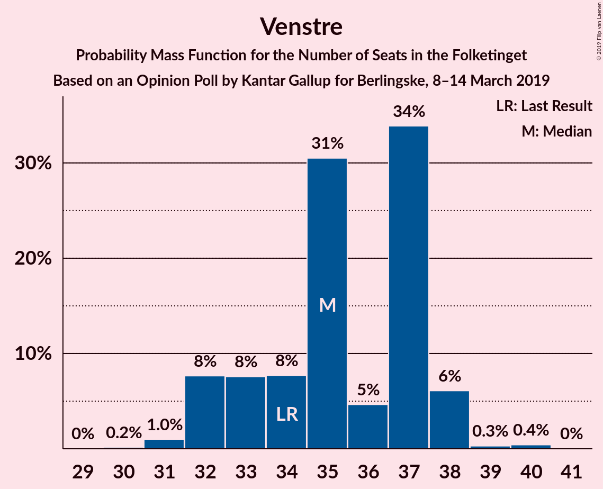

| Number of Seats | Probability | Accumulated | Special Marks |
|:---------------:|:-----------:|:-----------:|:-------------:|
| 30 | 0.2% | 100% |  |
| 31 | 1.0% | 99.8% |  |
| 32 | 8% | 98.8% |  |
| 33 | 8% | 91% |  |
| 34 | 8% | 84% | Last Result |
| 35 | 31% | 76% | Median |
| 36 | 5% | 45% |  |
| 37 | 34% | 41% |  |
| 38 | 6% | 7% |  |
| 39 | 0.3% | 0.8% |  |
| 40 | 0.4% | 0.5% |  |
| 41 | 0% | 0% |  |

### Dansk Folkeparti

*For a full overview of the results for this party, see the [Dansk Folkeparti](party-danskfolkeparti.html) page.*

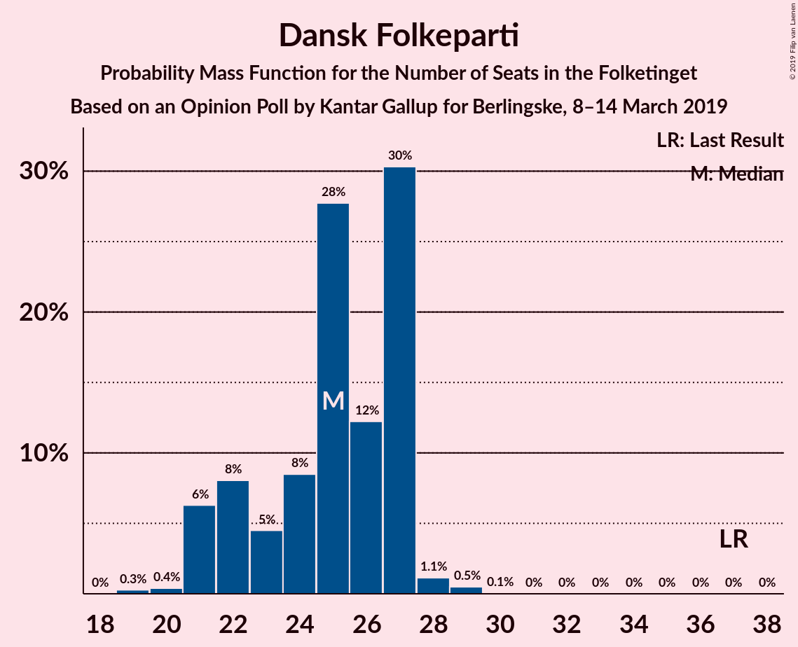

| Number of Seats | Probability | Accumulated | Special Marks |
|:---------------:|:-----------:|:-----------:|:-------------:|
| 19 | 0.3% | 100% |  |
| 20 | 0.4% | 99.7% |  |
| 21 | 6% | 99.3% |  |
| 22 | 8% | 93% |  |
| 23 | 5% | 85% |  |
| 24 | 8% | 80% |  |
| 25 | 28% | 72% | Median |
| 26 | 12% | 44% |  |
| 27 | 30% | 32% |  |
| 28 | 1.1% | 2% |  |
| 29 | 0.5% | 0.6% |  |
| 30 | 0.1% | 0.1% |  |
| 31 | 0% | 0% |  |
| 32 | 0% | 0% |  |
| 33 | 0% | 0% |  |
| 34 | 0% | 0% |  |
| 35 | 0% | 0% |  |
| 36 | 0% | 0% |  |
| 37 | 0% | 0% | Last Result |

### Enhedslisten–De Rød-Grønne

*For a full overview of the results for this party, see the [Enhedslisten–De Rød-Grønne](party-enhedslisten–derød-grønne.html) page.*

| Number of Seats | Probability | Accumulated | Special Marks |
|:---------------:|:-----------:|:-----------:|:-------------:|
| 10 | 1.2% | 100% |  |
| 11 | 6% | 98.8% |  |
| 12 | 11% | 93% |  |
| 13 | 20% | 82% |  |
| 14 | 5% | 63% | Last Result |
| 15 | 56% | 58% | Median |
| 16 | 1.1% | 2% |  |
| 17 | 0.3% | 0.7% |  |
| 18 | 0.1% | 0.3% |  |
| 19 | 0.2% | 0.2% |  |
| 20 | 0% | 0% |  |

### Radikale Venstre

*For a full overview of the results for this party, see the [Radikale Venstre](party-radikalevenstre.html) page.*

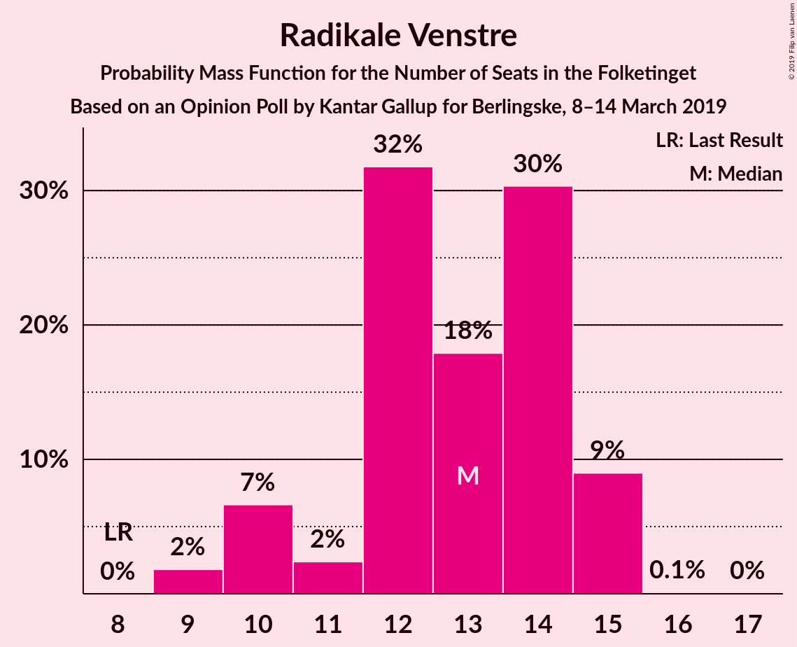

| Number of Seats | Probability | Accumulated | Special Marks |
|:---------------:|:-----------:|:-----------:|:-------------:|
| 8 | 0% | 100% | Last Result |
| 9 | 2% | 100% |  |
| 10 | 7% | 98% |  |
| 11 | 2% | 92% |  |
| 12 | 32% | 89% |  |
| 13 | 18% | 57% | Median |
| 14 | 30% | 39% |  |
| 15 | 9% | 9% |  |
| 16 | 0.1% | 0.1% |  |
| 17 | 0% | 0% |  |

### Socialistisk Folkeparti

*For a full overview of the results for this party, see the [Socialistisk Folkeparti](party-socialistiskfolkeparti.html) page.*

| Number of Seats | Probability | Accumulated | Special Marks |
|:---------------:|:-----------:|:-----------:|:-------------:|
| 7 | 0% | 100% | Last Result |
| 8 | 0% | 100% |  |
| 9 | 0.7% | 100% |  |
| 10 | 0.5% | 99.3% |  |
| 11 | 44% | 98.7% |  |
| 12 | 39% | 55% | Median |
| 13 | 8% | 16% |  |
| 14 | 6% | 8% |  |
| 15 | 0.4% | 2% |  |
| 16 | 2% | 2% |  |
| 17 | 0% | 0% |  |

### Liberal Alliance

*For a full overview of the results for this party, see the [Liberal Alliance](party-liberalalliance.html) page.*

| Number of Seats | Probability | Accumulated | Special Marks |
|:---------------:|:-----------:|:-----------:|:-------------:|
| 7 | 0.7% | 100% |  |
| 8 | 24% | 99.3% |  |
| 9 | 15% | 75% |  |
| 10 | 7% | 61% |  |
| 11 | 52% | 54% | Median |
| 12 | 2% | 2% |  |
| 13 | 0.1% | 0.2% | Last Result |
| 14 | 0.1% | 0.1% |  |
| 15 | 0% | 0% |  |

### Det Konservative Folkeparti

*For a full overview of the results for this party, see the [Det Konservative Folkeparti](party-detkonservativefolkeparti.html) page.*

| Number of Seats | Probability | Accumulated | Special Marks |
|:---------------:|:-----------:|:-----------:|:-------------:|
| 6 | 2% | 100% | Last Result |
| 7 | 2% | 98% |  |
| 8 | 6% | 96% |  |
| 9 | 20% | 91% |  |
| 10 | 18% | 70% |  |
| 11 | 50% | 52% | Median |
| 12 | 2% | 2% |  |
| 13 | 0.3% | 0.3% |  |
| 14 | 0% | 0% |  |

### Alternativet

*For a full overview of the results for this party, see the [Alternativet](party-alternativet.html) page.*

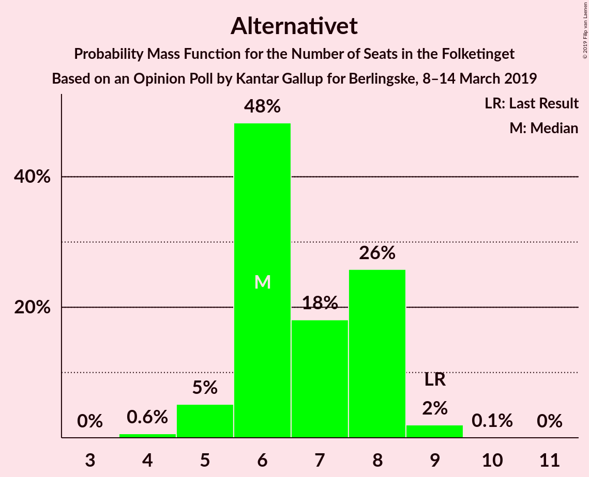

| Number of Seats | Probability | Accumulated | Special Marks |
|:---------------:|:-----------:|:-----------:|:-------------:|
| 4 | 0.6% | 100% |  |
| 5 | 5% | 99.4% |  |
| 6 | 48% | 94% | Median |
| 7 | 18% | 46% |  |
| 8 | 26% | 28% |  |
| 9 | 2% | 2% | Last Result |
| 10 | 0.1% | 0.1% |  |
| 11 | 0% | 0% |  |

### Nye Borgerlige

*For a full overview of the results for this party, see the [Nye Borgerlige](party-nyeborgerlige.html) page.*

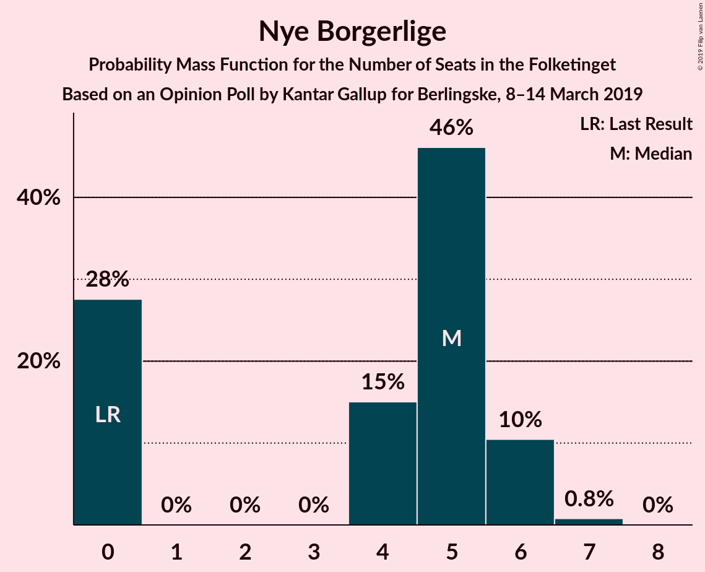

| Number of Seats | Probability | Accumulated | Special Marks |
|:---------------:|:-----------:|:-----------:|:-------------:|
| 0 | 28% | 100% | Last Result |
| 1 | 0% | 72% |  |
| 2 | 0% | 72% |  |
| 3 | 0% | 72% |  |
| 4 | 15% | 72% |  |
| 5 | 46% | 57% | Median |
| 6 | 10% | 11% |  |
| 7 | 0.8% | 0.8% |  |
| 8 | 0% | 0% |  |

### Klaus Riskær Pedersen

*For a full overview of the results for this party, see the [Klaus Riskær Pedersen](party-klausriskærpedersen.html) page.*

| Number of Seats | Probability | Accumulated | Special Marks |
|:---------------:|:-----------:|:-----------:|:-------------:|
| 0 | 98.8% | 100% | Last Result, Median |
| 1 | 0% | 1.2% |  |
| 2 | 0% | 1.2% |  |
| 3 | 0% | 1.2% |  |
| 4 | 0.9% | 1.2% |  |
| 5 | 0.3% | 0.3% |  |
| 6 | 0% | 0% |  |

### Kristendemokraterne

*For a full overview of the results for this party, see the [Kristendemokraterne](party-kristendemokraterne.html) page.*

| Number of Seats | Probability | Accumulated | Special Marks |
|:---------------:|:-----------:|:-----------:|:-------------:|
| 0 | 99.9% | 100% | Last Result, Median |
| 1 | 0% | 0.1% |  |
| 2 | 0% | 0.1% |  |
| 3 | 0% | 0.1% |  |
| 4 | 0.1% | 0.1% |  |
| 5 | 0% | 0% |  |

## Coalitions

### Confidence Intervals

| Coalition | Last Result | Median | Majority? | 80% Confidence Interval | 90% Confidence Interval | 95% Confidence Interval | 99% Confidence Interval |
|:---------:|:-----------:|:------:|:---------:|:-----------------------:|:-----------------------:|:-----------------------:|:-----------------------:|
| Socialdemokraterne – Enhedslisten–De Rød-Grønne – Radikale Venstre – Socialistisk Folkeparti – Alternativet | 85 | 91 | 67% | 89–95 | 88–96 | 87–97 | 86–98 |
| Socialdemokraterne – Enhedslisten–De Rød-Grønne – Radikale Venstre – Socialistisk Folkeparti | 76 | 85 | 5% | 81–89 | 81–90 | 80–90 | 79–90 |
| Venstre – Dansk Folkeparti – Liberal Alliance – Det Konservative Folkeparti – Nye Borgerlige – Klaus Riskær Pedersen – Kristendemokraterne | 90 | 84 | 0.2% | 80–86 | 79–87 | 78–88 | 77–89 |
| Venstre – Dansk Folkeparti – Liberal Alliance – Det Konservative Folkeparti – Nye Borgerlige – Klaus Riskær Pedersen | 90 | 84 | 0.2% | 80–86 | 79–87 | 78–88 | 77–89 |
| Venstre – Dansk Folkeparti – Liberal Alliance – Det Konservative Folkeparti – Nye Borgerlige – Kristendemokraterne | 90 | 84 | 0.2% | 80–86 | 79–87 | 78–88 | 77–89 |
| Venstre – Dansk Folkeparti – Liberal Alliance – Det Konservative Folkeparti – Nye Borgerlige | 90 | 84 | 0.2% | 80–86 | 79–87 | 78–88 | 77–89 |
| Venstre – Dansk Folkeparti – Liberal Alliance – Det Konservative Folkeparti – Kristendemokraterne | 90 | 81 | 0% | 75–84 | 75–84 | 72–84 | 72–84 |
| Venstre – Dansk Folkeparti – Liberal Alliance – Det Konservative Folkeparti | 90 | 81 | 0% | 75–84 | 75–84 | 72–84 | 72–84 |
| Socialdemokraterne – Enhedslisten–De Rød-Grønne – Socialistisk Folkeparti – Alternativet | 77 | 77 | 0% | 77–81 | 77–83 | 76–83 | 73–87 |
| Socialdemokraterne – Enhedslisten–De Rød-Grønne – Socialistisk Folkeparti | 68 | 71 | 0% | 69–75 | 69–76 | 68–76 | 66–79 |
| Socialdemokraterne – Radikale Venstre – Socialistisk Folkeparti | 62 | 70 | 0% | 66–75 | 66–76 | 66–76 | 64–78 |
| Socialdemokraterne – Radikale Venstre | 55 | 59 | 0% | 54–62 | 54–64 | 54–65 | 51–65 |
| Venstre – Liberal Alliance – Det Konservative Folkeparti | 53 | 56 | 0% | 52–57 | 51–58 | 51–58 | 49–60 |
| Venstre – Det Konservative Folkeparti | 40 | 46 | 0% | 42–48 | 41–48 | 41–48 | 39–50 |
| Venstre | 34 | 35 | 0% | 33–37 | 32–38 | 32–38 | 31–39 |

### Socialdemokraterne – Enhedslisten–De Rød-Grønne – Radikale Venstre – Socialistisk Folkeparti – Alternativet

| Number of Seats | Probability | Accumulated | Special Marks |
|:---------------:|:-----------:|:-----------:|:-------------:|
| 85 | 0.1% | 100% | Last Result |
| 86 | 1.0% | 99.8% |  |
| 87 | 2% | 98.8% |  |
| 88 | 3% | 96% |  |
| 89 | 26% | 93% |  |
| 90 | 14% | 67% | Majority |
| 91 | 34% | 54% | Median |
| 92 | 0.9% | 19% |  |
| 93 | 5% | 18% |  |
| 94 | 2% | 13% |  |
| 95 | 5% | 11% |  |
| 96 | 2% | 6% |  |
| 97 | 3% | 4% |  |
| 98 | 0.6% | 0.8% |  |
| 99 | 0.2% | 0.2% |  |
| 100 | 0% | 0% |  |

### Socialdemokraterne – Enhedslisten–De Rød-Grønne – Radikale Venstre – Socialistisk Folkeparti

| Number of Seats | Probability | Accumulated | Special Marks |
|:---------------:|:-----------:|:-----------:|:-------------:|
| 76 | 0% | 100% | Last Result |
| 77 | 0% | 100% |  |
| 78 | 0.1% | 100% |  |
| 79 | 2% | 99.8% |  |
| 80 | 2% | 98% |  |
| 81 | 22% | 96% |  |
| 82 | 6% | 74% |  |
| 83 | 8% | 68% |  |
| 84 | 6% | 60% |  |
| 85 | 36% | 54% | Median |
| 86 | 3% | 18% |  |
| 87 | 3% | 15% |  |
| 88 | 0.4% | 12% |  |
| 89 | 6% | 11% |  |
| 90 | 5% | 5% | Majority |
| 91 | 0.3% | 0.5% |  |
| 92 | 0.1% | 0.2% |  |
| 93 | 0.1% | 0.2% |  |
| 94 | 0% | 0% |  |

### Venstre – Dansk Folkeparti – Liberal Alliance – Det Konservative Folkeparti – Nye Borgerlige – Klaus Riskær Pedersen – Kristendemokraterne

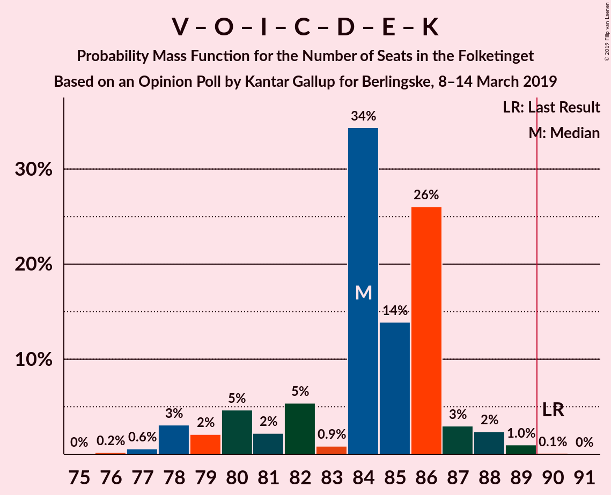

| Number of Seats | Probability | Accumulated | Special Marks |
|:---------------:|:-----------:|:-----------:|:-------------:|
| 76 | 0.2% | 100% |  |
| 77 | 0.6% | 99.8% |  |
| 78 | 3% | 99.2% |  |
| 79 | 2% | 96% |  |
| 80 | 5% | 94% |  |
| 81 | 2% | 89% |  |
| 82 | 5% | 87% |  |
| 83 | 0.9% | 82% |  |
| 84 | 34% | 81% |  |
| 85 | 14% | 46% |  |
| 86 | 26% | 33% |  |
| 87 | 3% | 7% | Median |
| 88 | 2% | 4% |  |
| 89 | 1.0% | 1.2% |  |
| 90 | 0.1% | 0.2% | Last Result, Majority |
| 91 | 0% | 0% |  |

### Venstre – Dansk Folkeparti – Liberal Alliance – Det Konservative Folkeparti – Nye Borgerlige – Klaus Riskær Pedersen

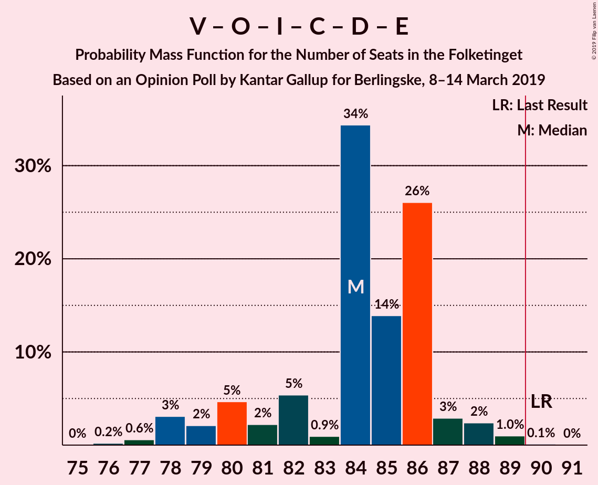

| Number of Seats | Probability | Accumulated | Special Marks |
|:---------------:|:-----------:|:-----------:|:-------------:|
| 76 | 0.2% | 100% |  |
| 77 | 0.6% | 99.8% |  |
| 78 | 3% | 99.2% |  |
| 79 | 2% | 96% |  |
| 80 | 5% | 94% |  |
| 81 | 2% | 89% |  |
| 82 | 5% | 87% |  |
| 83 | 0.9% | 82% |  |
| 84 | 34% | 81% |  |
| 85 | 14% | 46% |  |
| 86 | 26% | 33% |  |
| 87 | 3% | 6% | Median |
| 88 | 2% | 4% |  |
| 89 | 1.0% | 1.2% |  |
| 90 | 0.1% | 0.2% | Last Result, Majority |
| 91 | 0% | 0% |  |

### Venstre – Dansk Folkeparti – Liberal Alliance – Det Konservative Folkeparti – Nye Borgerlige – Kristendemokraterne

| Number of Seats | Probability | Accumulated | Special Marks |
|:---------------:|:-----------:|:-----------:|:-------------:|
| 76 | 0.2% | 100% |  |
| 77 | 0.6% | 99.7% |  |
| 78 | 3% | 99.2% |  |
| 79 | 2% | 96% |  |
| 80 | 5% | 94% |  |
| 81 | 2% | 89% |  |
| 82 | 5% | 86% |  |
| 83 | 0.6% | 81% |  |
| 84 | 35% | 80% |  |
| 85 | 14% | 46% |  |
| 86 | 26% | 32% |  |
| 87 | 3% | 6% | Median |
| 88 | 2% | 3% |  |
| 89 | 1.0% | 1.1% |  |
| 90 | 0.1% | 0.2% | Last Result, Majority |
| 91 | 0% | 0% |  |

### Venstre – Dansk Folkeparti – Liberal Alliance – Det Konservative Folkeparti – Nye Borgerlige

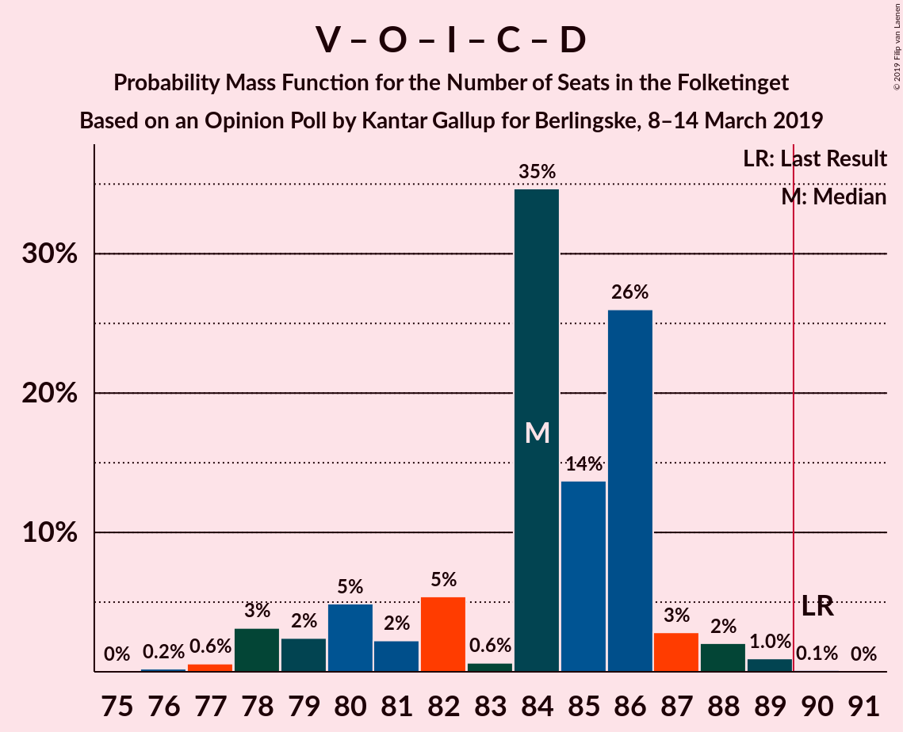

| Number of Seats | Probability | Accumulated | Special Marks |
|:---------------:|:-----------:|:-----------:|:-------------:|
| 76 | 0.2% | 100% |  |
| 77 | 0.6% | 99.7% |  |
| 78 | 3% | 99.2% |  |
| 79 | 2% | 96% |  |
| 80 | 5% | 94% |  |
| 81 | 2% | 89% |  |
| 82 | 5% | 86% |  |
| 83 | 0.6% | 81% |  |
| 84 | 35% | 80% |  |
| 85 | 14% | 46% |  |
| 86 | 26% | 32% |  |
| 87 | 3% | 6% | Median |
| 88 | 2% | 3% |  |
| 89 | 1.0% | 1.1% |  |
| 90 | 0.1% | 0.2% | Last Result, Majority |
| 91 | 0% | 0% |  |

### Venstre – Dansk Folkeparti – Liberal Alliance – Det Konservative Folkeparti – Kristendemokraterne

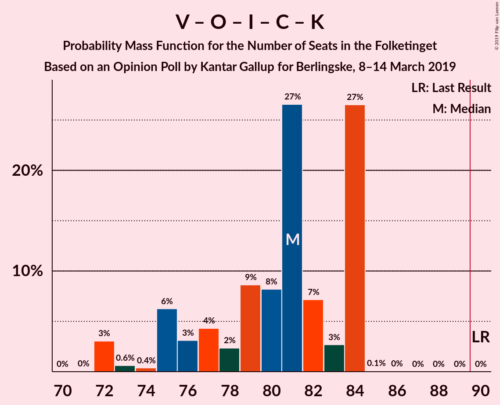

| Number of Seats | Probability | Accumulated | Special Marks |
|:---------------:|:-----------:|:-----------:|:-------------:|
| 71 | 0% | 100% |  |
| 72 | 3% | 99.9% |  |
| 73 | 0.6% | 97% |  |
| 74 | 0.4% | 96% |  |
| 75 | 6% | 96% |  |
| 76 | 3% | 90% |  |
| 77 | 4% | 87% |  |
| 78 | 2% | 82% |  |
| 79 | 9% | 80% |  |
| 80 | 8% | 71% |  |
| 81 | 27% | 63% |  |
| 82 | 7% | 37% | Median |
| 83 | 3% | 29% |  |
| 84 | 27% | 27% |  |
| 85 | 0.1% | 0.1% |  |
| 86 | 0% | 0.1% |  |
| 87 | 0% | 0% |  |
| 88 | 0% | 0% |  |
| 89 | 0% | 0% |  |
| 90 | 0% | 0% | Last Result, Majority |

### Venstre – Dansk Folkeparti – Liberal Alliance – Det Konservative Folkeparti

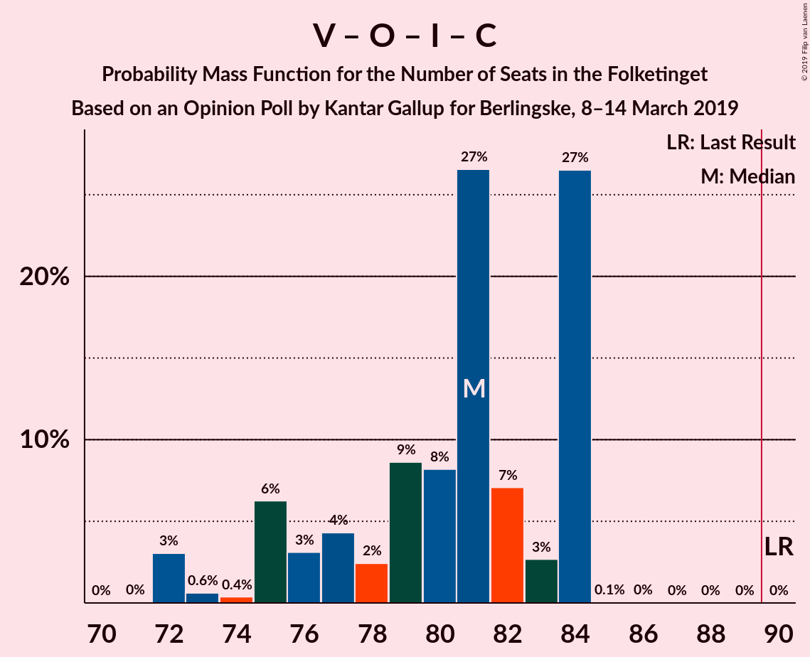

| Number of Seats | Probability | Accumulated | Special Marks |
|:---------------:|:-----------:|:-----------:|:-------------:|
| 71 | 0% | 100% |  |
| 72 | 3% | 99.9% |  |
| 73 | 0.6% | 97% |  |
| 74 | 0.4% | 96% |  |
| 75 | 6% | 96% |  |
| 76 | 3% | 90% |  |
| 77 | 4% | 87% |  |
| 78 | 2% | 82% |  |
| 79 | 9% | 80% |  |
| 80 | 8% | 71% |  |
| 81 | 27% | 63% |  |
| 82 | 7% | 36% | Median |
| 83 | 3% | 29% |  |
| 84 | 27% | 27% |  |
| 85 | 0.1% | 0.1% |  |
| 86 | 0% | 0.1% |  |
| 87 | 0% | 0% |  |
| 88 | 0% | 0% |  |
| 89 | 0% | 0% |  |
| 90 | 0% | 0% | Last Result, Majority |

### Socialdemokraterne – Enhedslisten–De Rød-Grønne – Socialistisk Folkeparti – Alternativet

| Number of Seats | Probability | Accumulated | Special Marks |
|:---------------:|:-----------:|:-----------:|:-------------:|
| 71 | 0.1% | 100% |  |
| 72 | 0.1% | 99.9% |  |
| 73 | 1.2% | 99.8% |  |
| 74 | 0.1% | 98.7% |  |
| 75 | 0.7% | 98.6% |  |
| 76 | 3% | 98% |  |
| 77 | 55% | 95% | Last Result |
| 78 | 17% | 40% | Median |
| 79 | 6% | 23% |  |
| 80 | 6% | 17% |  |
| 81 | 5% | 11% |  |
| 82 | 0.5% | 6% |  |
| 83 | 4% | 5% |  |
| 84 | 0.2% | 1.3% |  |
| 85 | 0.3% | 1.1% |  |
| 86 | 0.2% | 0.8% |  |
| 87 | 0.5% | 0.6% |  |
| 88 | 0.2% | 0.2% |  |
| 89 | 0% | 0% |  |

### Socialdemokraterne – Enhedslisten–De Rød-Grønne – Socialistisk Folkeparti

| Number of Seats | Probability | Accumulated | Special Marks |
|:---------------:|:-----------:|:-----------:|:-------------:|
| 65 | 0% | 100% |  |
| 66 | 1.2% | 99.9% |  |
| 67 | 0.1% | 98.7% |  |
| 68 | 1.3% | 98.6% | Last Result |
| 69 | 21% | 97% |  |
| 70 | 5% | 76% |  |
| 71 | 39% | 71% |  |
| 72 | 14% | 32% | Median |
| 73 | 3% | 18% |  |
| 74 | 5% | 15% |  |
| 75 | 3% | 10% |  |
| 76 | 4% | 7% |  |
| 77 | 1.1% | 2% |  |
| 78 | 0.6% | 1.2% |  |
| 79 | 0.3% | 0.6% |  |
| 80 | 0.1% | 0.3% |  |
| 81 | 0% | 0.2% |  |
| 82 | 0.1% | 0.1% |  |
| 83 | 0% | 0% |  |

### Socialdemokraterne – Radikale Venstre – Socialistisk Folkeparti

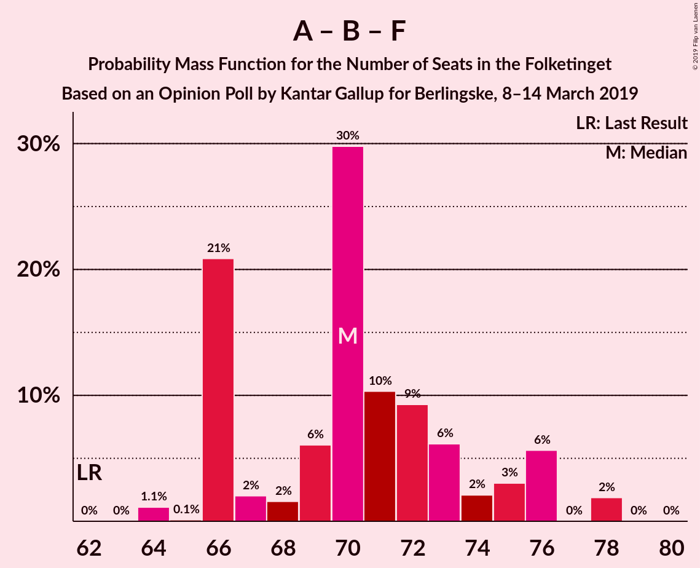

| Number of Seats | Probability | Accumulated | Special Marks |
|:---------------:|:-----------:|:-----------:|:-------------:|
| 62 | 0% | 100% | Last Result |
| 63 | 0% | 100% |  |
| 64 | 1.1% | 100% |  |
| 65 | 0.1% | 98.9% |  |
| 66 | 21% | 98.7% |  |
| 67 | 2% | 78% |  |
| 68 | 2% | 76% |  |
| 69 | 6% | 74% |  |
| 70 | 30% | 68% | Median |
| 71 | 10% | 38% |  |
| 72 | 9% | 28% |  |
| 73 | 6% | 19% |  |
| 74 | 2% | 13% |  |
| 75 | 3% | 11% |  |
| 76 | 6% | 8% |  |
| 77 | 0% | 2% |  |
| 78 | 2% | 2% |  |
| 79 | 0% | 0% |  |

### Socialdemokraterne – Radikale Venstre

| Number of Seats | Probability | Accumulated | Special Marks |
|:---------------:|:-----------:|:-----------:|:-------------:|
| 51 | 1.1% | 100% |  |
| 52 | 0.1% | 98.9% |  |
| 53 | 0.7% | 98.8% |  |
| 54 | 21% | 98% |  |
| 55 | 1.1% | 77% | Last Result |
| 56 | 3% | 76% |  |
| 57 | 6% | 73% |  |
| 58 | 5% | 67% | Median |
| 59 | 28% | 62% |  |
| 60 | 16% | 34% |  |
| 61 | 5% | 18% |  |
| 62 | 4% | 12% |  |
| 63 | 2% | 8% |  |
| 64 | 3% | 7% |  |
| 65 | 4% | 4% |  |
| 66 | 0% | 0% |  |

### Venstre – Liberal Alliance – Det Konservative Folkeparti

| Number of Seats | Probability | Accumulated | Special Marks |
|:---------------:|:-----------:|:-----------:|:-------------:|
| 47 | 0.1% | 100% |  |
| 48 | 0.2% | 99.9% |  |
| 49 | 0.8% | 99.7% |  |
| 50 | 0.7% | 98.9% |  |
| 51 | 6% | 98% |  |
| 52 | 6% | 92% |  |
| 53 | 4% | 86% | Last Result |
| 54 | 11% | 82% |  |
| 55 | 2% | 71% |  |
| 56 | 29% | 69% |  |
| 57 | 33% | 40% | Median |
| 58 | 6% | 7% |  |
| 59 | 0.4% | 1.0% |  |
| 60 | 0.5% | 0.6% |  |
| 61 | 0.1% | 0.1% |  |
| 62 | 0% | 0% |  |

### Venstre – Det Konservative Folkeparti

| Number of Seats | Probability | Accumulated | Special Marks |
|:---------------:|:-----------:|:-----------:|:-------------:|
| 38 | 0% | 100% |  |
| 39 | 0.5% | 99.9% |  |
| 40 | 0.8% | 99.5% | Last Result |
| 41 | 6% | 98.7% |  |
| 42 | 6% | 92% |  |
| 43 | 9% | 86% |  |
| 44 | 3% | 77% |  |
| 45 | 4% | 74% |  |
| 46 | 39% | 71% | Median |
| 47 | 10% | 32% |  |
| 48 | 21% | 22% |  |
| 49 | 0.2% | 1.2% |  |
| 50 | 0.9% | 1.0% |  |
| 51 | 0.1% | 0.1% |  |
| 52 | 0% | 0% |  |

### Venstre

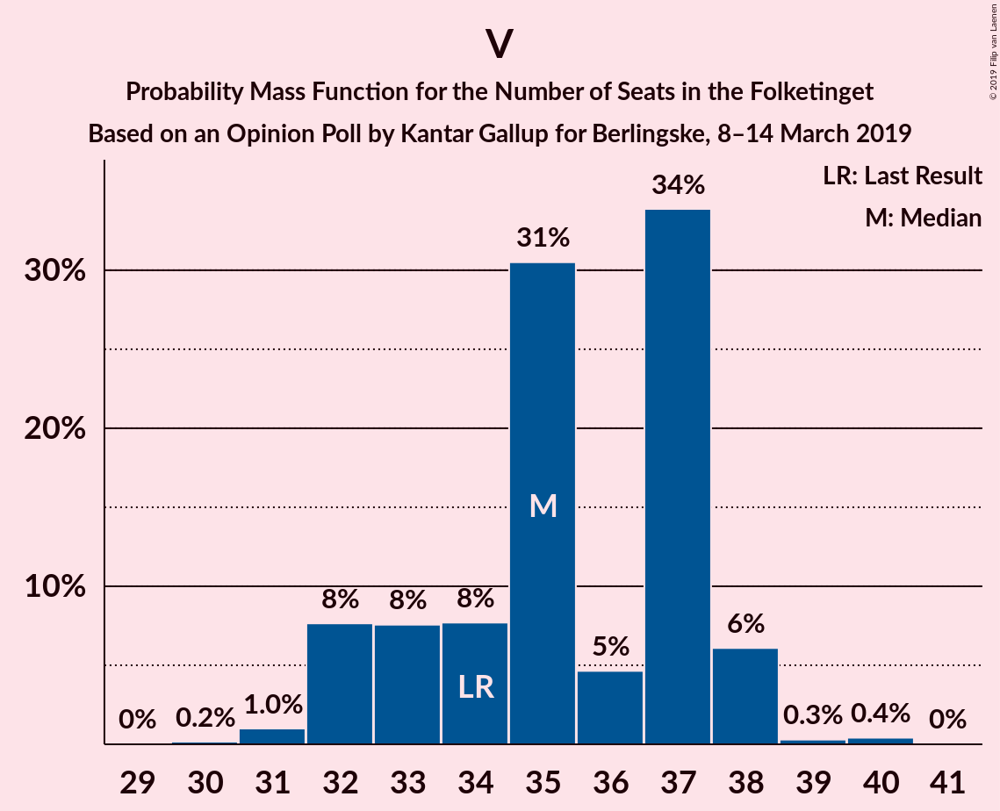

| Number of Seats | Probability | Accumulated | Special Marks |
|:---------------:|:-----------:|:-----------:|:-------------:|
| 30 | 0.2% | 100% |  |
| 31 | 1.0% | 99.8% |  |
| 32 | 8% | 98.8% |  |
| 33 | 8% | 91% |  |
| 34 | 8% | 84% | Last Result |
| 35 | 31% | 76% | Median |
| 36 | 5% | 45% |  |
| 37 | 34% | 41% |  |
| 38 | 6% | 7% |  |
| 39 | 0.3% | 0.8% |  |
| 40 | 0.4% | 0.5% |  |
| 41 | 0% | 0% |  |

## Technical Information

### Opinion Poll

+ **Polling firm:** Kantar Gallup
+ **Commissioner(s):** Berlingske
+ **Fieldwork period:** 8–14 March 2019

### Calculations

+ **Sample size:** 1587
+ **Simulations done:** 1,048,576
+ **Error estimate:** 1.59%

