# Opinion Poll by Voxmeter for Ritzau, 11–17 March 2019

<a href="#voting-intentions">Voting Intentions</a> | <a href="#seats">Seats</a> | <a href="#coalitions">Coalitions</a> | <a href="#technical-information">Technical Information</a>

## Voting Intentions

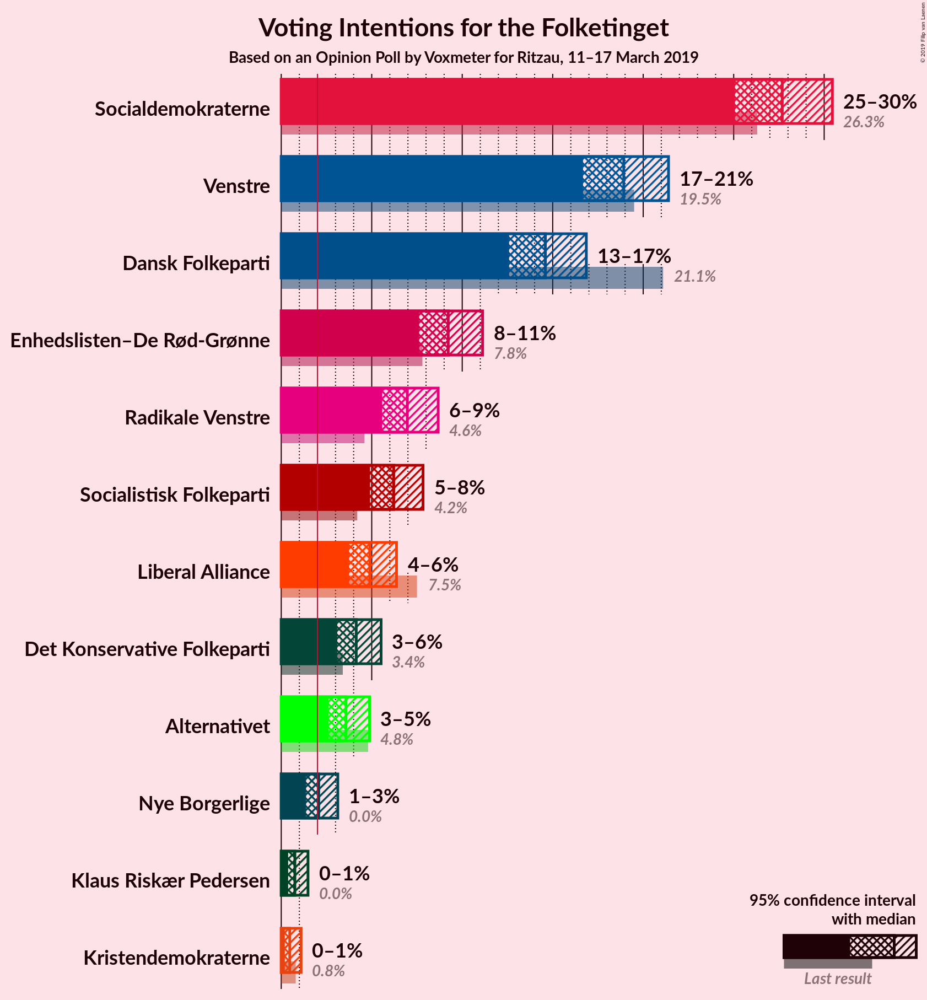

### Confidence Intervals

| Party | Last Result | Poll Result | 80% Confidence Interval | 90% Confidence Interval | 95% Confidence Interval | 99% Confidence Interval |
|:-----:|:-----------:|:-----------:|:-----------------------:|:-----------------------:|:-----------------------:|:-----------------------:|
| Socialdemokraterne | 26.3% | 27.7% | 26.0–29.5% |25.5–30.0% |25.1–30.5% |24.3–31.3% |
| Venstre | 19.5% | 18.9% | 17.5–20.5% |17.0–21.0% |16.7–21.4% |16.0–22.2% |
| Dansk Folkeparti | 21.1% | 14.6% | 13.3–16.1% |12.9–16.5% |12.6–16.9% |12.0–17.6% |
| Enhedslisten–De Rød-Grønne | 7.8% | 9.2% | 8.2–10.5% |7.9–10.8% |7.6–11.1% |7.1–11.8% |
| Radikale Venstre | 4.6% | 7.0% | 6.1–8.1% |5.8–8.4% |5.6–8.7% |5.2–9.2% |
| Socialistisk Folkeparti | 4.2% | 6.2% | 5.3–7.3% |5.1–7.6% |4.9–7.8% |4.5–8.4% |
| Liberal Alliance | 7.5% | 4.9% | 4.1–5.9% |3.9–6.1% |3.7–6.4% |3.4–6.9% |
| Det Konservative Folkeparti | 3.4% | 4.1% | 3.4–5.0% |3.3–5.3% |3.1–5.5% |2.8–6.0% |
| Alternativet | 4.8% | 3.6% | 2.9–4.4% |2.8–4.7% |2.6–4.9% |2.3–5.3% |
| Nye Borgerlige | 0.0% | 2.1% | 1.6–2.8% |1.5–3.0% |1.4–3.1% |1.2–3.5% |
| Klaus Riskær Pedersen | 0.0% | 0.8% | 0.5–1.2% |0.4–1.4% |0.4–1.5% |0.3–1.8% |
| Kristendemokraterne | 0.8% | 0.5% | 0.3–0.9% |0.2–1.0% |0.2–1.1% |0.1–1.3% |

*Note:* The poll result column reflects the actual value used in the calculations. Published results may vary slightly, and in addition be rounded to fewer digits.

## Seats

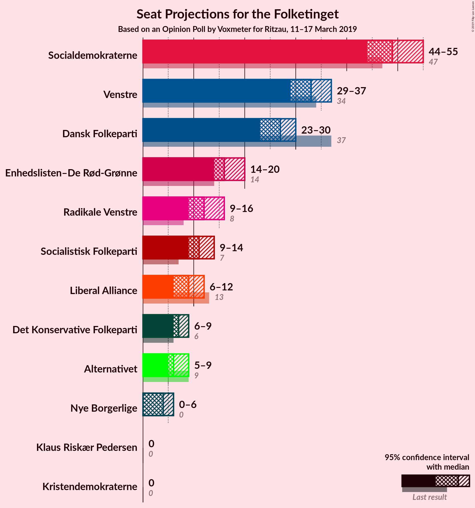

### Confidence Intervals

| Party | Last Result | Median | 80% Confidence Interval | 90% Confidence Interval | 95% Confidence Interval | 99% Confidence Interval |
|:-----:|:-----------:|:------:|:-----------------------:|:-----------------------:|:-----------------------:|:-----------------------:|
| <a href="#socialdemokraterne">Socialdemokraterne</a> | 47 | 49 | 46–55 |45–55 |44–55 |42–55 |
| <a href="#venstre">Venstre</a> | 34 | 33 | 30–36 |29–36 |29–37 |28–40 |
| <a href="#dansk-folkeparti">Dansk Folkeparti</a> | 37 | 27 | 23–29 |23–29 |23–30 |21–31 |
| <a href="#enhedslisten–de-rød-grønne">Enhedslisten–De Rød-Grønne</a> | 14 | 16 | 14–18 |14–19 |14–20 |13–21 |
| <a href="#radikale-venstre">Radikale Venstre</a> | 8 | 12 | 12–15 |10–15 |9–16 |9–16 |
| <a href="#socialistisk-folkeparti">Socialistisk Folkeparti</a> | 7 | 11 | 9–13 |9–14 |9–14 |8–15 |
| <a href="#liberal-alliance">Liberal Alliance</a> | 13 | 9 | 8–10 |7–11 |6–12 |6–13 |
| <a href="#det-konservative-folkeparti">Det Konservative Folkeparti</a> | 6 | 7 | 6–9 |6–9 |6–9 |5–11 |
| <a href="#alternativet">Alternativet</a> | 9 | 6 | 5–8 |5–9 |5–9 |4–9 |
| <a href="#nye-borgerlige">Nye Borgerlige</a> | 0 | 4 | 0–6 |0–6 |0–6 |0–6 |
| <a href="#klaus-riskær-pedersen">Klaus Riskær Pedersen</a> | 0 | 0 | 0 |0 |0 |0 |
| <a href="#kristendemokraterne">Kristendemokraterne</a> | 0 | 0 | 0 |0 |0 |0 |

### Socialdemokraterne

*For a full overview of the results for this party, see the [Socialdemokraterne](party-socialdemokraterne.html) page.*

| Number of Seats | Probability | Accumulated | Special Marks |
|:---------------:|:-----------:|:-----------:|:-------------:|
| 41 | 0.1% | 100% |  |
| 42 | 0.7% | 99.9% |  |
| 43 | 0.5% | 99.2% |  |
| 44 | 3% | 98.8% |  |
| 45 | 2% | 96% |  |
| 46 | 4% | 94% |  |
| 47 | 23% | 90% | Last Result |
| 48 | 15% | 67% |  |
| 49 | 20% | 52% | Median |
| 50 | 5% | 32% |  |
| 51 | 7% | 27% |  |
| 52 | 3% | 19% |  |
| 53 | 4% | 16% |  |
| 54 | 2% | 12% |  |
| 55 | 10% | 10% |  |
| 56 | 0% | 0.4% |  |
| 57 | 0.3% | 0.4% |  |
| 58 | 0% | 0% |  |

### Venstre

*For a full overview of the results for this party, see the [Venstre](party-venstre.html) page.*

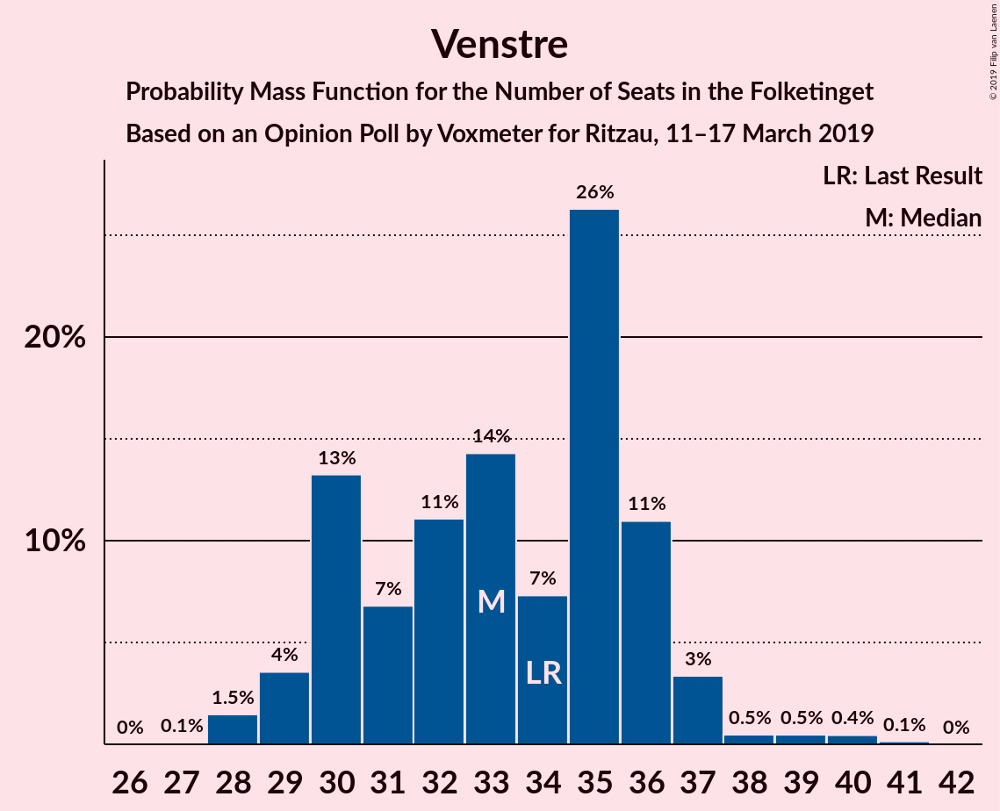

| Number of Seats | Probability | Accumulated | Special Marks |
|:---------------:|:-----------:|:-----------:|:-------------:|
| 27 | 0.1% | 100% |  |
| 28 | 1.5% | 99.9% |  |
| 29 | 4% | 98% |  |
| 30 | 13% | 95% |  |
| 31 | 7% | 82% |  |
| 32 | 11% | 75% |  |
| 33 | 14% | 64% | Median |
| 34 | 7% | 49% | Last Result |
| 35 | 26% | 42% |  |
| 36 | 11% | 16% |  |
| 37 | 3% | 5% |  |
| 38 | 0.5% | 2% |  |
| 39 | 0.5% | 1.1% |  |
| 40 | 0.4% | 0.6% |  |
| 41 | 0.1% | 0.2% |  |
| 42 | 0% | 0% |  |

### Dansk Folkeparti

*For a full overview of the results for this party, see the [Dansk Folkeparti](party-danskfolkeparti.html) page.*

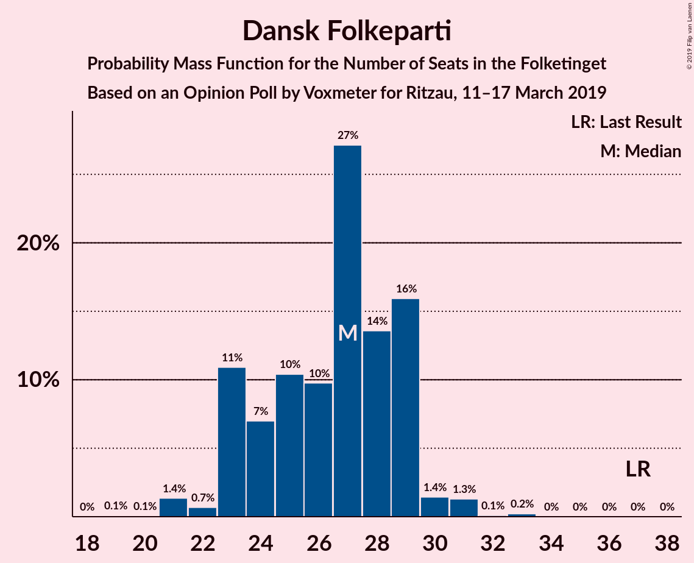

| Number of Seats | Probability | Accumulated | Special Marks |
|:---------------:|:-----------:|:-----------:|:-------------:|
| 19 | 0.1% | 100% |  |
| 20 | 0.1% | 99.9% |  |
| 21 | 1.4% | 99.9% |  |
| 22 | 0.7% | 98% |  |
| 23 | 11% | 98% |  |
| 24 | 7% | 87% |  |
| 25 | 10% | 80% |  |
| 26 | 10% | 69% |  |
| 27 | 27% | 60% | Median |
| 28 | 14% | 33% |  |
| 29 | 16% | 19% |  |
| 30 | 1.4% | 3% |  |
| 31 | 1.3% | 2% |  |
| 32 | 0.1% | 0.3% |  |
| 33 | 0.2% | 0.2% |  |
| 34 | 0% | 0% |  |
| 35 | 0% | 0% |  |
| 36 | 0% | 0% |  |
| 37 | 0% | 0% | Last Result |

### Enhedslisten–De Rød-Grønne

*For a full overview of the results for this party, see the [Enhedslisten–De Rød-Grønne](party-enhedslisten–derød-grønne.html) page.*

| Number of Seats | Probability | Accumulated | Special Marks |
|:---------------:|:-----------:|:-----------:|:-------------:|
| 12 | 0.4% | 100% |  |
| 13 | 1.1% | 99.6% |  |
| 14 | 17% | 98% | Last Result |
| 15 | 18% | 82% |  |
| 16 | 28% | 64% | Median |
| 17 | 5% | 35% |  |
| 18 | 22% | 30% |  |
| 19 | 5% | 8% |  |
| 20 | 2% | 3% |  |
| 21 | 1.1% | 1.2% |  |
| 22 | 0.1% | 0.1% |  |
| 23 | 0% | 0% |  |

### Radikale Venstre

*For a full overview of the results for this party, see the [Radikale Venstre](party-radikalevenstre.html) page.*

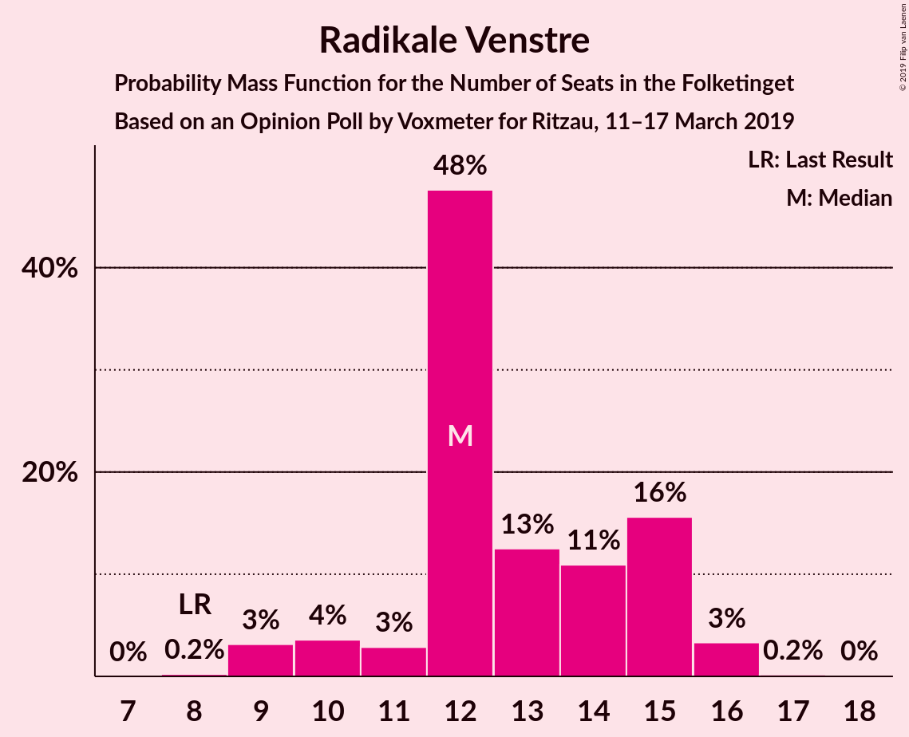

| Number of Seats | Probability | Accumulated | Special Marks |
|:---------------:|:-----------:|:-----------:|:-------------:|
| 8 | 0.2% | 100% | Last Result |
| 9 | 3% | 99.8% |  |
| 10 | 4% | 97% |  |
| 11 | 3% | 93% |  |
| 12 | 48% | 90% | Median |
| 13 | 13% | 43% |  |
| 14 | 11% | 30% |  |
| 15 | 16% | 19% |  |
| 16 | 3% | 4% |  |
| 17 | 0.2% | 0.2% |  |
| 18 | 0% | 0% |  |

### Socialistisk Folkeparti

*For a full overview of the results for this party, see the [Socialistisk Folkeparti](party-socialistiskfolkeparti.html) page.*

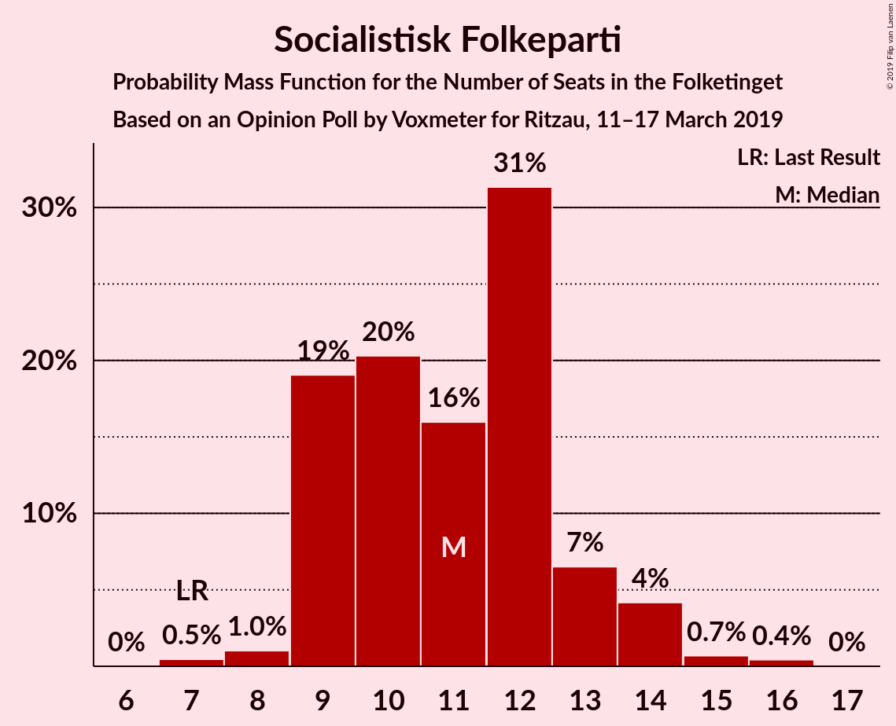

| Number of Seats | Probability | Accumulated | Special Marks |
|:---------------:|:-----------:|:-----------:|:-------------:|
| 7 | 0.5% | 100% | Last Result |
| 8 | 1.0% | 99.5% |  |
| 9 | 19% | 98.5% |  |
| 10 | 20% | 79% |  |
| 11 | 16% | 59% | Median |
| 12 | 31% | 43% |  |
| 13 | 7% | 12% |  |
| 14 | 4% | 5% |  |
| 15 | 0.7% | 1.1% |  |
| 16 | 0.4% | 0.5% |  |
| 17 | 0% | 0% |  |

### Liberal Alliance

*For a full overview of the results for this party, see the [Liberal Alliance](party-liberalalliance.html) page.*

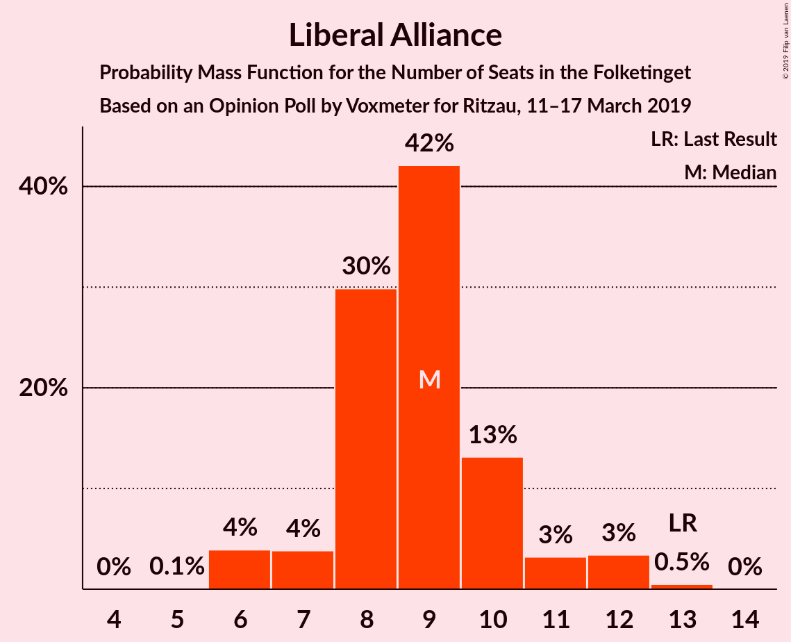

| Number of Seats | Probability | Accumulated | Special Marks |
|:---------------:|:-----------:|:-----------:|:-------------:|
| 5 | 0.1% | 100% |  |
| 6 | 4% | 99.9% |  |
| 7 | 4% | 96% |  |
| 8 | 30% | 92% |  |
| 9 | 42% | 62% | Median |
| 10 | 13% | 20% |  |
| 11 | 3% | 7% |  |
| 12 | 3% | 4% |  |
| 13 | 0.5% | 0.5% | Last Result |
| 14 | 0% | 0% |  |

### Det Konservative Folkeparti

*For a full overview of the results for this party, see the [Det Konservative Folkeparti](party-detkonservativefolkeparti.html) page.*

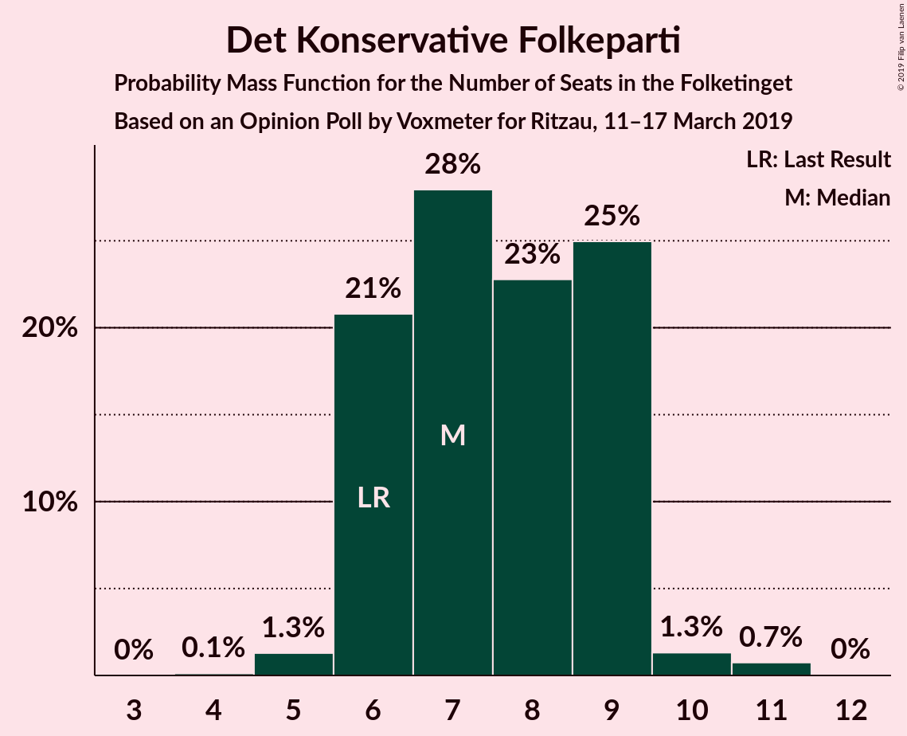

| Number of Seats | Probability | Accumulated | Special Marks |
|:---------------:|:-----------:|:-----------:|:-------------:|
| 4 | 0.1% | 100% |  |
| 5 | 1.3% | 99.9% |  |
| 6 | 21% | 98.6% | Last Result |
| 7 | 28% | 78% | Median |
| 8 | 23% | 50% |  |
| 9 | 25% | 27% |  |
| 10 | 1.3% | 2% |  |
| 11 | 0.7% | 0.8% |  |
| 12 | 0% | 0% |  |

### Alternativet

*For a full overview of the results for this party, see the [Alternativet](party-alternativet.html) page.*

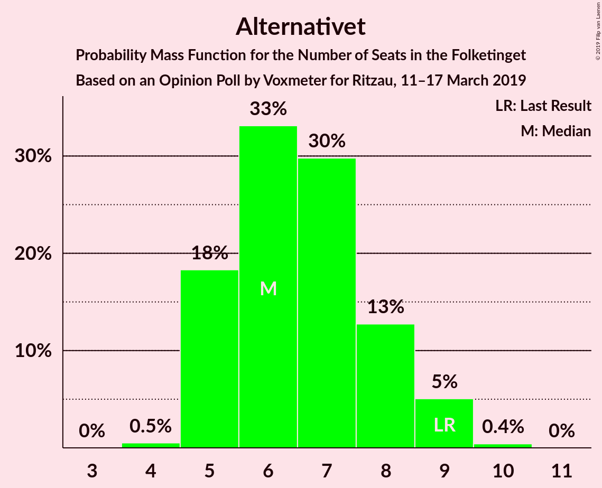

| Number of Seats | Probability | Accumulated | Special Marks |
|:---------------:|:-----------:|:-----------:|:-------------:|
| 4 | 0.5% | 100% |  |
| 5 | 18% | 99.5% |  |
| 6 | 33% | 81% | Median |
| 7 | 30% | 48% |  |
| 8 | 13% | 18% |  |
| 9 | 5% | 6% | Last Result |
| 10 | 0.4% | 0.4% |  |
| 11 | 0% | 0% |  |

### Nye Borgerlige

*For a full overview of the results for this party, see the [Nye Borgerlige](party-nyeborgerlige.html) page.*

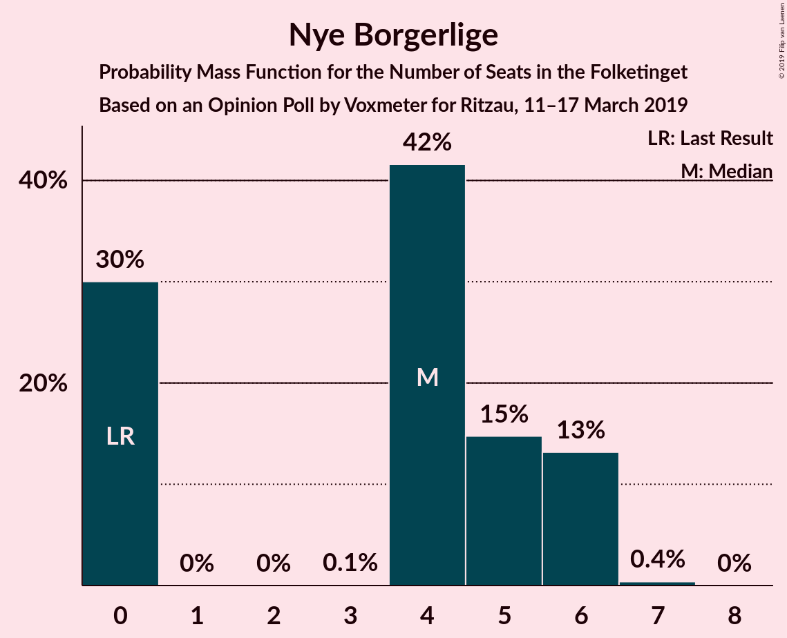

| Number of Seats | Probability | Accumulated | Special Marks |
|:---------------:|:-----------:|:-----------:|:-------------:|
| 0 | 30% | 100% | Last Result |
| 1 | 0% | 70% |  |
| 2 | 0% | 70% |  |
| 3 | 0.1% | 70% |  |
| 4 | 42% | 70% | Median |
| 5 | 15% | 28% |  |
| 6 | 13% | 14% |  |
| 7 | 0.4% | 0.4% |  |
| 8 | 0% | 0% |  |

### Klaus Riskær Pedersen

*For a full overview of the results for this party, see the [Klaus Riskær Pedersen](party-klausriskærpedersen.html) page.*

| Number of Seats | Probability | Accumulated | Special Marks |
|:---------------:|:-----------:|:-----------:|:-------------:|
| 0 | 100% | 100% | Last Result, Median |

### Kristendemokraterne

*For a full overview of the results for this party, see the [Kristendemokraterne](party-kristendemokraterne.html) page.*

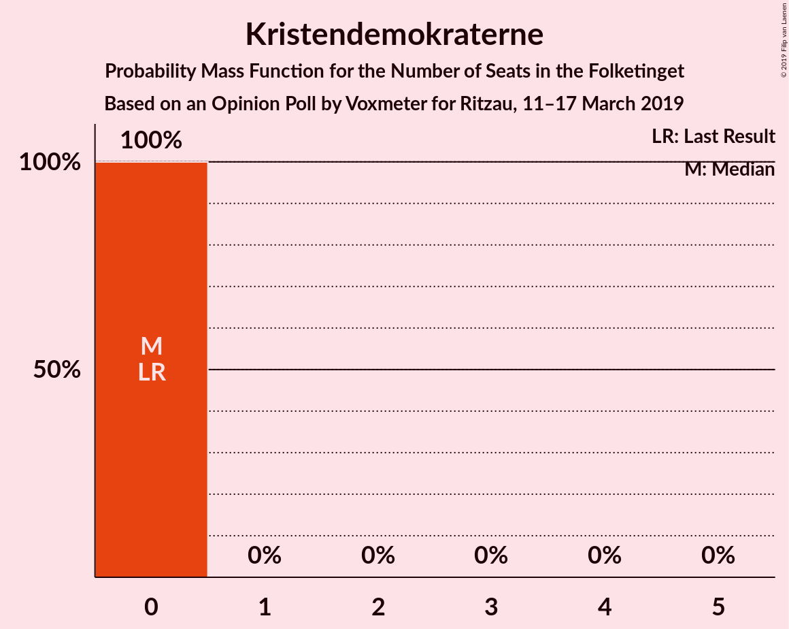

| Number of Seats | Probability | Accumulated | Special Marks |
|:---------------:|:-----------:|:-----------:|:-------------:|
| 0 | 100% | 100% | Last Result, Median |

## Coalitions

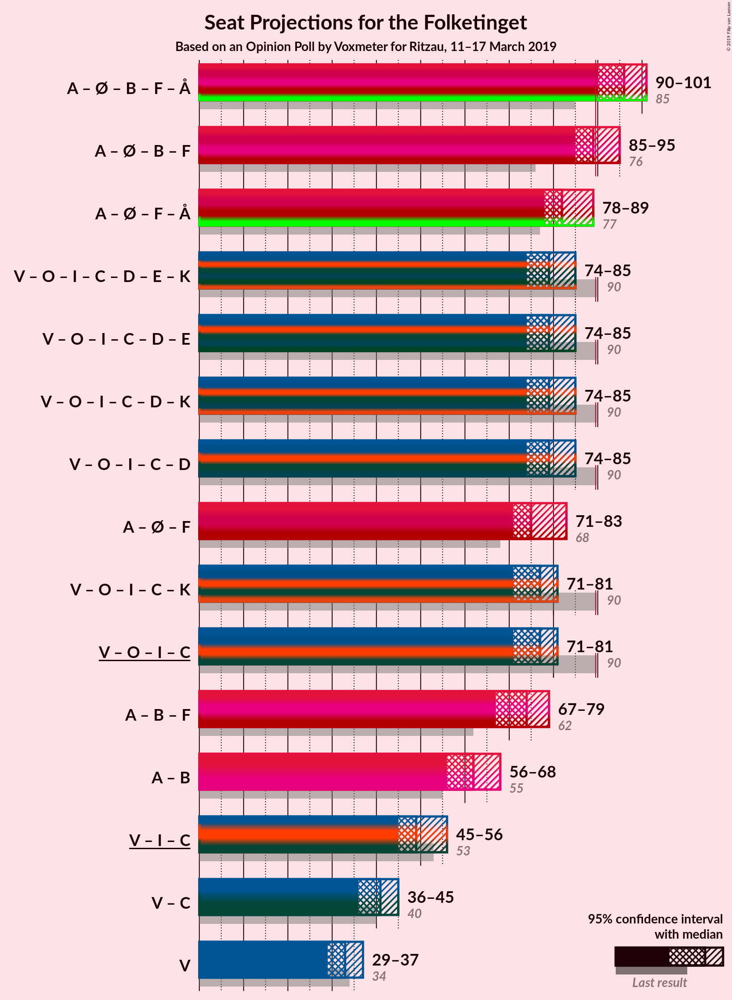

### Confidence Intervals

| Coalition | Last Result | Median | Majority? | 80% Confidence Interval | 90% Confidence Interval | 95% Confidence Interval | 99% Confidence Interval |
|:---------:|:-----------:|:------:|:---------:|:-----------------------:|:-----------------------:|:-----------------------:|:-----------------------:|
| Socialdemokraterne – Enhedslisten–De Rød-Grønne – Radikale Venstre – Socialistisk Folkeparti – Alternativet | 85 | 96 | 99.0% | 92–100 | 91–101 | 90–101 | 89–103 |
| Socialdemokraterne – Enhedslisten–De Rød-Grønne – Radikale Venstre – Socialistisk Folkeparti | 76 | 89 | 47% | 86–94 | 85–95 | 85–95 | 81–95 |
| Socialdemokraterne – Enhedslisten–De Rød-Grønne – Socialistisk Folkeparti – Alternativet | 77 | 82 | 0.8% | 80–88 | 79–88 | 78–89 | 77–90 |
| Venstre – Dansk Folkeparti – Liberal Alliance – Det Konservative Folkeparti – Nye Borgerlige – Klaus Riskær Pedersen – Kristendemokraterne | 90 | 79 | 0% | 75–83 | 74–84 | 74–85 | 72–86 |
| Venstre – Dansk Folkeparti – Liberal Alliance – Det Konservative Folkeparti – Nye Borgerlige – Klaus Riskær Pedersen | 90 | 79 | 0% | 75–83 | 74–84 | 74–85 | 72–86 |
| Venstre – Dansk Folkeparti – Liberal Alliance – Det Konservative Folkeparti – Nye Borgerlige – Kristendemokraterne | 90 | 79 | 0% | 75–83 | 74–84 | 74–85 | 72–86 |
| Venstre – Dansk Folkeparti – Liberal Alliance – Det Konservative Folkeparti – Nye Borgerlige | 90 | 79 | 0% | 75–83 | 74–84 | 74–85 | 72–86 |
| Socialdemokraterne – Enhedslisten–De Rød-Grønne – Socialistisk Folkeparti | 68 | 75 | 0% | 74–81 | 72–83 | 71–83 | 70–84 |
| Venstre – Dansk Folkeparti – Liberal Alliance – Det Konservative Folkeparti – Kristendemokraterne | 90 | 77 | 0% | 72–79 | 71–80 | 71–81 | 67–85 |
| Venstre – Dansk Folkeparti – Liberal Alliance – Det Konservative Folkeparti | 90 | 77 | 0% | 72–79 | 71–80 | 71–81 | 67–85 |
| Socialdemokraterne – Radikale Venstre – Socialistisk Folkeparti | 62 | 74 | 0% | 68–78 | 68–79 | 67–79 | 65–79 |
| Socialdemokraterne – Radikale Venstre | 55 | 62 | 0% | 58–67 | 57–67 | 56–68 | 54–69 |
| Venstre – Liberal Alliance – Det Konservative Folkeparti | 53 | 49 | 0% | 46–52 | 45–54 | 45–56 | 43–57 |
| Venstre – Det Konservative Folkeparti | 40 | 41 | 0% | 38–44 | 37–44 | 36–45 | 35–47 |
| Venstre | 34 | 33 | 0% | 30–36 | 29–36 | 29–37 | 28–40 |

### Socialdemokraterne – Enhedslisten–De Rød-Grønne – Radikale Venstre – Socialistisk Folkeparti – Alternativet

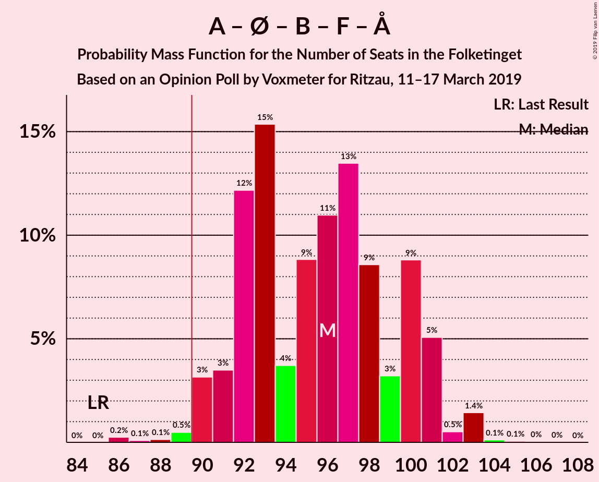

| Number of Seats | Probability | Accumulated | Special Marks |
|:---------------:|:-----------:|:-----------:|:-------------:|
| 85 | 0% | 100% | Last Result |
| 86 | 0.2% | 100% |  |
| 87 | 0.1% | 99.7% |  |
| 88 | 0.1% | 99.7% |  |
| 89 | 0.5% | 99.5% |  |
| 90 | 3% | 99.0% | Majority |
| 91 | 3% | 96% |  |
| 92 | 12% | 92% |  |
| 93 | 15% | 80% |  |
| 94 | 4% | 65% | Median |
| 95 | 9% | 61% |  |
| 96 | 11% | 52% |  |
| 97 | 13% | 41% |  |
| 98 | 9% | 28% |  |
| 99 | 3% | 19% |  |
| 100 | 9% | 16% |  |
| 101 | 5% | 7% |  |
| 102 | 0.5% | 2% |  |
| 103 | 1.4% | 2% |  |
| 104 | 0.1% | 0.2% |  |
| 105 | 0.1% | 0.1% |  |
| 106 | 0% | 0.1% |  |
| 107 | 0% | 0% |  |

### Socialdemokraterne – Enhedslisten–De Rød-Grønne – Radikale Venstre – Socialistisk Folkeparti

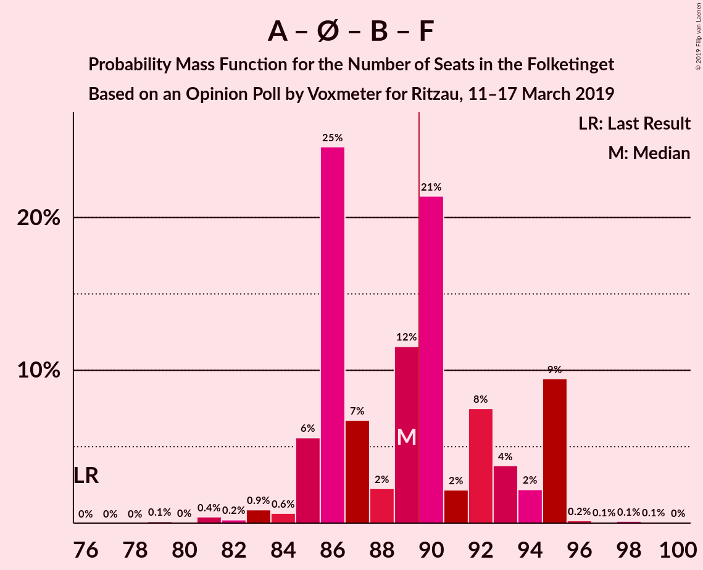

| Number of Seats | Probability | Accumulated | Special Marks |
|:---------------:|:-----------:|:-----------:|:-------------:|
| 76 | 0% | 100% | Last Result |
| 77 | 0% | 100% |  |
| 78 | 0% | 100% |  |
| 79 | 0.1% | 100% |  |
| 80 | 0% | 99.9% |  |
| 81 | 0.4% | 99.9% |  |
| 82 | 0.2% | 99.5% |  |
| 83 | 0.9% | 99.2% |  |
| 84 | 0.6% | 98% |  |
| 85 | 6% | 98% |  |
| 86 | 25% | 92% |  |
| 87 | 7% | 67% |  |
| 88 | 2% | 61% | Median |
| 89 | 12% | 58% |  |
| 90 | 21% | 47% | Majority |
| 91 | 2% | 26% |  |
| 92 | 8% | 23% |  |
| 93 | 4% | 16% |  |
| 94 | 2% | 12% |  |
| 95 | 9% | 10% |  |
| 96 | 0.2% | 0.4% |  |
| 97 | 0.1% | 0.3% |  |
| 98 | 0.1% | 0.2% |  |
| 99 | 0.1% | 0.1% |  |
| 100 | 0% | 0% |  |

### Socialdemokraterne – Enhedslisten–De Rød-Grønne – Socialistisk Folkeparti – Alternativet

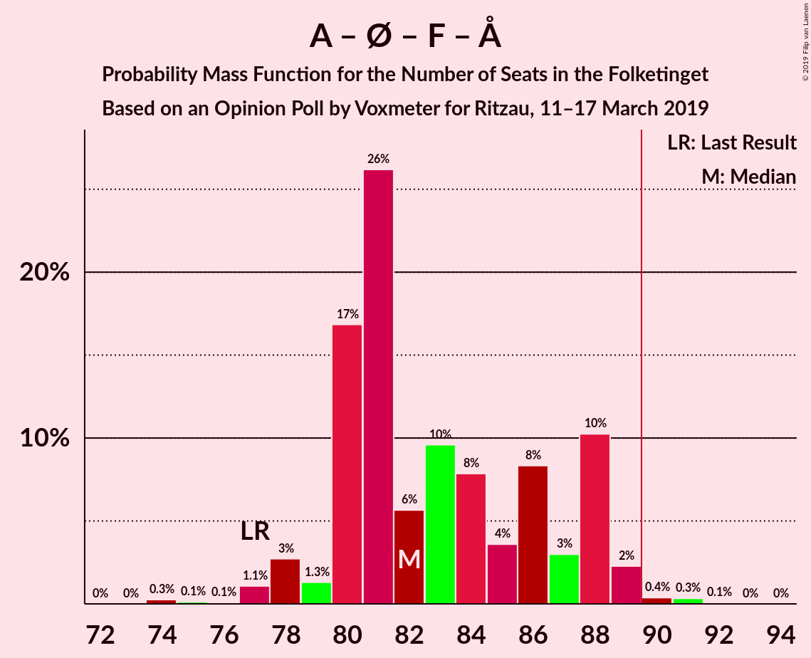

| Number of Seats | Probability | Accumulated | Special Marks |
|:---------------:|:-----------:|:-----------:|:-------------:|
| 74 | 0.3% | 100% |  |
| 75 | 0.1% | 99.7% |  |
| 76 | 0.1% | 99.6% |  |
| 77 | 1.1% | 99.5% | Last Result |
| 78 | 3% | 98% |  |
| 79 | 1.3% | 96% |  |
| 80 | 17% | 94% |  |
| 81 | 26% | 78% |  |
| 82 | 6% | 51% | Median |
| 83 | 10% | 46% |  |
| 84 | 8% | 36% |  |
| 85 | 4% | 28% |  |
| 86 | 8% | 25% |  |
| 87 | 3% | 16% |  |
| 88 | 10% | 13% |  |
| 89 | 2% | 3% |  |
| 90 | 0.4% | 0.8% | Majority |
| 91 | 0.3% | 0.4% |  |
| 92 | 0.1% | 0.1% |  |
| 93 | 0% | 0% |  |

### Venstre – Dansk Folkeparti – Liberal Alliance – Det Konservative Folkeparti – Nye Borgerlige – Klaus Riskær Pedersen – Kristendemokraterne

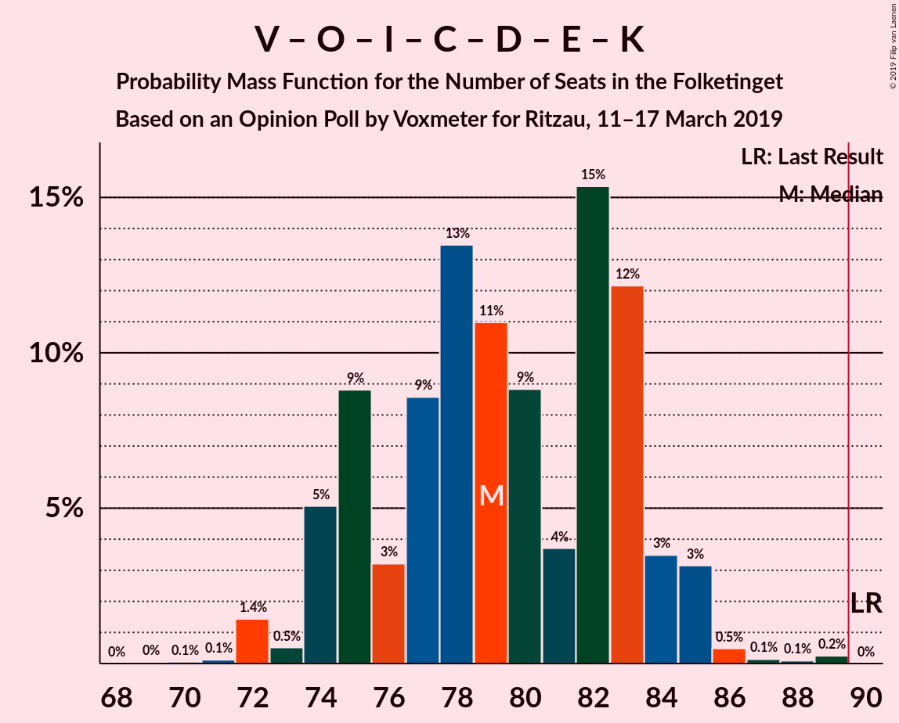

| Number of Seats | Probability | Accumulated | Special Marks |
|:---------------:|:-----------:|:-----------:|:-------------:|
| 69 | 0% | 100% |  |
| 70 | 0.1% | 99.9% |  |
| 71 | 0.1% | 99.9% |  |
| 72 | 1.4% | 99.8% |  |
| 73 | 0.5% | 98% |  |
| 74 | 5% | 98% |  |
| 75 | 9% | 93% |  |
| 76 | 3% | 84% |  |
| 77 | 9% | 81% |  |
| 78 | 13% | 72% |  |
| 79 | 11% | 59% |  |
| 80 | 9% | 48% | Median |
| 81 | 4% | 39% |  |
| 82 | 15% | 35% |  |
| 83 | 12% | 20% |  |
| 84 | 3% | 8% |  |
| 85 | 3% | 4% |  |
| 86 | 0.5% | 1.0% |  |
| 87 | 0.1% | 0.5% |  |
| 88 | 0.1% | 0.3% |  |
| 89 | 0.2% | 0.3% |  |
| 90 | 0% | 0% | Last Result, Majority |

### Venstre – Dansk Folkeparti – Liberal Alliance – Det Konservative Folkeparti – Nye Borgerlige – Klaus Riskær Pedersen

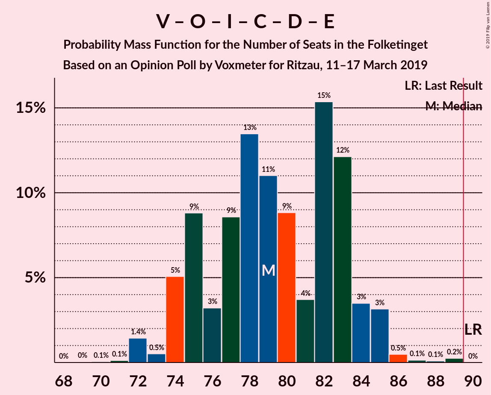

| Number of Seats | Probability | Accumulated | Special Marks |
|:---------------:|:-----------:|:-----------:|:-------------:|
| 69 | 0% | 100% |  |
| 70 | 0.1% | 99.9% |  |
| 71 | 0.1% | 99.9% |  |
| 72 | 1.4% | 99.8% |  |
| 73 | 0.5% | 98% |  |
| 74 | 5% | 98% |  |
| 75 | 9% | 93% |  |
| 76 | 3% | 84% |  |
| 77 | 9% | 81% |  |
| 78 | 13% | 72% |  |
| 79 | 11% | 59% |  |
| 80 | 9% | 48% | Median |
| 81 | 4% | 39% |  |
| 82 | 15% | 35% |  |
| 83 | 12% | 20% |  |
| 84 | 3% | 8% |  |
| 85 | 3% | 4% |  |
| 86 | 0.5% | 1.0% |  |
| 87 | 0.1% | 0.5% |  |
| 88 | 0.1% | 0.3% |  |
| 89 | 0.2% | 0.3% |  |
| 90 | 0% | 0% | Last Result, Majority |

### Venstre – Dansk Folkeparti – Liberal Alliance – Det Konservative Folkeparti – Nye Borgerlige – Kristendemokraterne

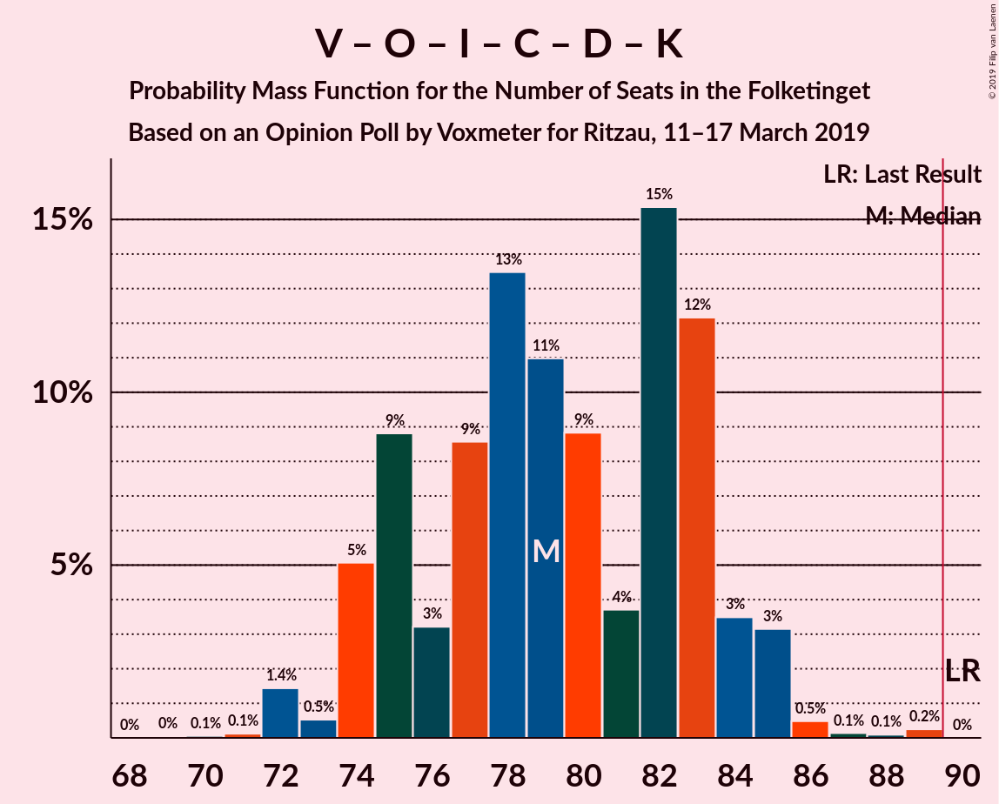

| Number of Seats | Probability | Accumulated | Special Marks |
|:---------------:|:-----------:|:-----------:|:-------------:|
| 69 | 0% | 100% |  |
| 70 | 0.1% | 99.9% |  |
| 71 | 0.1% | 99.9% |  |
| 72 | 1.4% | 99.8% |  |
| 73 | 0.5% | 98% |  |
| 74 | 5% | 98% |  |
| 75 | 9% | 93% |  |
| 76 | 3% | 84% |  |
| 77 | 9% | 81% |  |
| 78 | 13% | 72% |  |
| 79 | 11% | 59% |  |
| 80 | 9% | 48% | Median |
| 81 | 4% | 39% |  |
| 82 | 15% | 35% |  |
| 83 | 12% | 20% |  |
| 84 | 3% | 8% |  |
| 85 | 3% | 4% |  |
| 86 | 0.5% | 1.0% |  |
| 87 | 0.1% | 0.5% |  |
| 88 | 0.1% | 0.3% |  |
| 89 | 0.2% | 0.3% |  |
| 90 | 0% | 0% | Last Result, Majority |

### Venstre – Dansk Folkeparti – Liberal Alliance – Det Konservative Folkeparti – Nye Borgerlige

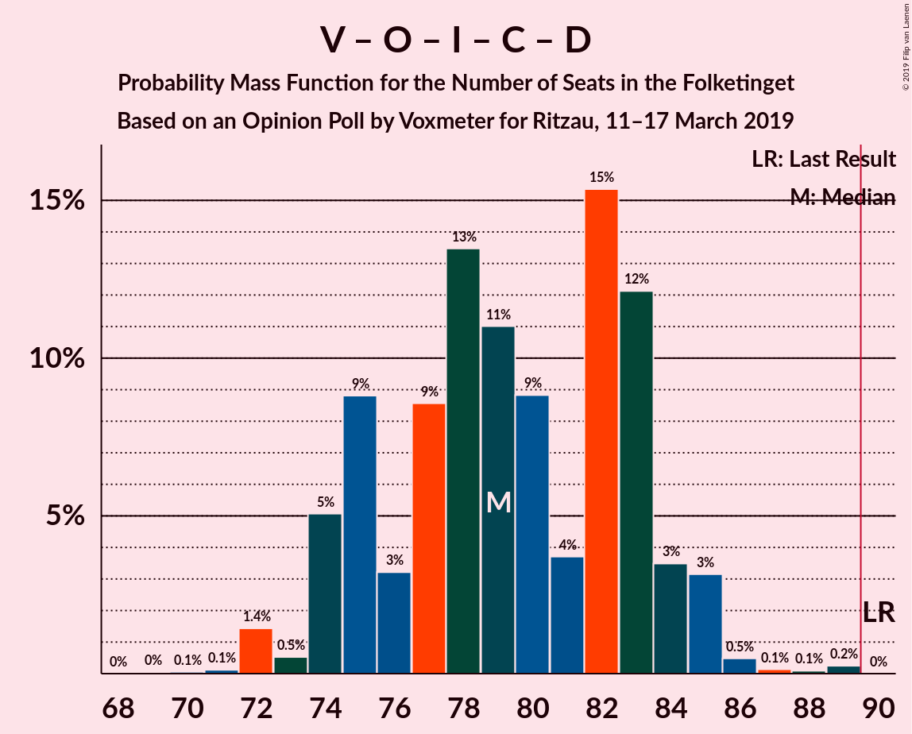

| Number of Seats | Probability | Accumulated | Special Marks |
|:---------------:|:-----------:|:-----------:|:-------------:|
| 69 | 0% | 100% |  |
| 70 | 0.1% | 99.9% |  |
| 71 | 0.1% | 99.9% |  |
| 72 | 1.4% | 99.8% |  |
| 73 | 0.5% | 98% |  |
| 74 | 5% | 98% |  |
| 75 | 9% | 93% |  |
| 76 | 3% | 84% |  |
| 77 | 9% | 81% |  |
| 78 | 13% | 72% |  |
| 79 | 11% | 59% |  |
| 80 | 9% | 48% | Median |
| 81 | 4% | 39% |  |
| 82 | 15% | 35% |  |
| 83 | 12% | 20% |  |
| 84 | 3% | 8% |  |
| 85 | 3% | 4% |  |
| 86 | 0.5% | 1.0% |  |
| 87 | 0.1% | 0.5% |  |
| 88 | 0.1% | 0.3% |  |
| 89 | 0.2% | 0.3% |  |
| 90 | 0% | 0% | Last Result, Majority |

### Socialdemokraterne – Enhedslisten–De Rød-Grønne – Socialistisk Folkeparti

| Number of Seats | Probability | Accumulated | Special Marks |
|:---------------:|:-----------:|:-----------:|:-------------:|
| 67 | 0.1% | 100% |  |
| 68 | 0.1% | 99.9% | Last Result |
| 69 | 0.2% | 99.8% |  |
| 70 | 0.3% | 99.6% |  |
| 71 | 2% | 99.3% |  |
| 72 | 3% | 97% |  |
| 73 | 2% | 95% |  |
| 74 | 25% | 93% |  |
| 75 | 23% | 68% |  |
| 76 | 5% | 45% | Median |
| 77 | 16% | 40% |  |
| 78 | 1.4% | 24% |  |
| 79 | 2% | 23% |  |
| 80 | 7% | 21% |  |
| 81 | 4% | 13% |  |
| 82 | 3% | 10% |  |
| 83 | 6% | 6% |  |
| 84 | 0.4% | 0.5% |  |
| 85 | 0.1% | 0.1% |  |
| 86 | 0% | 0.1% |  |
| 87 | 0% | 0% |  |

### Venstre – Dansk Folkeparti – Liberal Alliance – Det Konservative Folkeparti – Kristendemokraterne

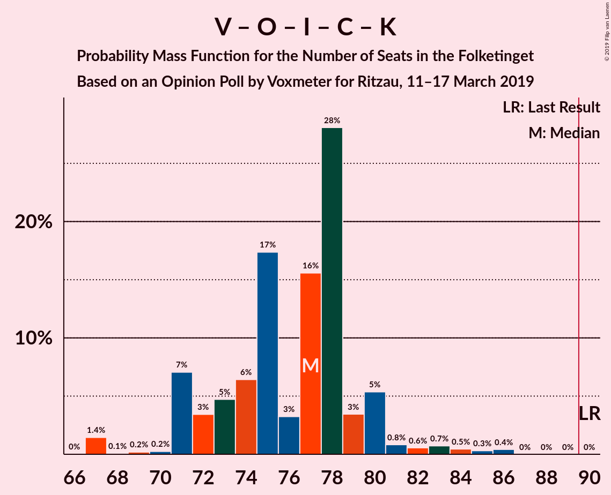

| Number of Seats | Probability | Accumulated | Special Marks |
|:---------------:|:-----------:|:-----------:|:-------------:|
| 67 | 1.4% | 100% |  |
| 68 | 0.1% | 98.5% |  |
| 69 | 0.2% | 98% |  |
| 70 | 0.2% | 98% |  |
| 71 | 7% | 98% |  |
| 72 | 3% | 91% |  |
| 73 | 5% | 88% |  |
| 74 | 6% | 83% |  |
| 75 | 17% | 76% |  |
| 76 | 3% | 59% | Median |
| 77 | 16% | 56% |  |
| 78 | 28% | 40% |  |
| 79 | 3% | 12% |  |
| 80 | 5% | 9% |  |
| 81 | 0.8% | 3% |  |
| 82 | 0.6% | 2% |  |
| 83 | 0.7% | 2% |  |
| 84 | 0.5% | 1.2% |  |
| 85 | 0.3% | 0.7% |  |
| 86 | 0.4% | 0.4% |  |
| 87 | 0% | 0% |  |
| 88 | 0% | 0% |  |
| 89 | 0% | 0% |  |
| 90 | 0% | 0% | Last Result, Majority |

### Venstre – Dansk Folkeparti – Liberal Alliance – Det Konservative Folkeparti

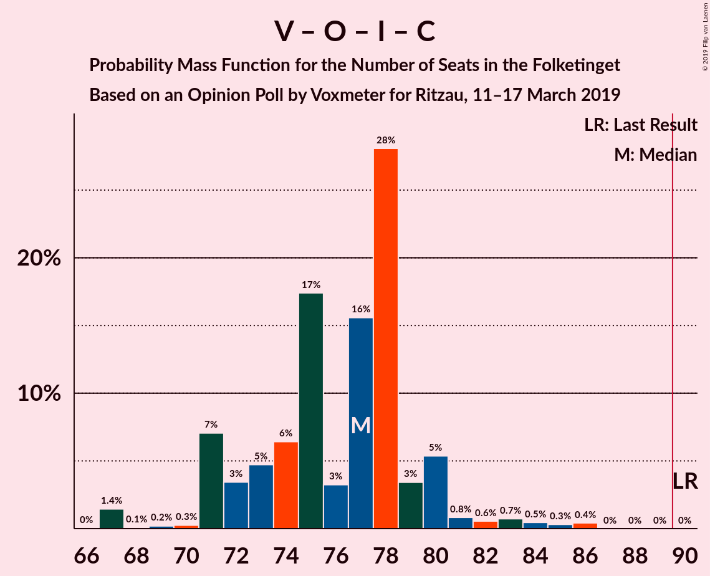

| Number of Seats | Probability | Accumulated | Special Marks |
|:---------------:|:-----------:|:-----------:|:-------------:|
| 67 | 1.4% | 100% |  |
| 68 | 0.1% | 98.5% |  |
| 69 | 0.2% | 98% |  |
| 70 | 0.3% | 98% |  |
| 71 | 7% | 98% |  |
| 72 | 3% | 91% |  |
| 73 | 5% | 88% |  |
| 74 | 6% | 83% |  |
| 75 | 17% | 76% |  |
| 76 | 3% | 59% | Median |
| 77 | 16% | 56% |  |
| 78 | 28% | 40% |  |
| 79 | 3% | 12% |  |
| 80 | 5% | 9% |  |
| 81 | 0.8% | 3% |  |
| 82 | 0.6% | 2% |  |
| 83 | 0.7% | 2% |  |
| 84 | 0.5% | 1.2% |  |
| 85 | 0.3% | 0.7% |  |
| 86 | 0.4% | 0.4% |  |
| 87 | 0% | 0% |  |
| 88 | 0% | 0% |  |
| 89 | 0% | 0% |  |
| 90 | 0% | 0% | Last Result, Majority |

### Socialdemokraterne – Radikale Venstre – Socialistisk Folkeparti

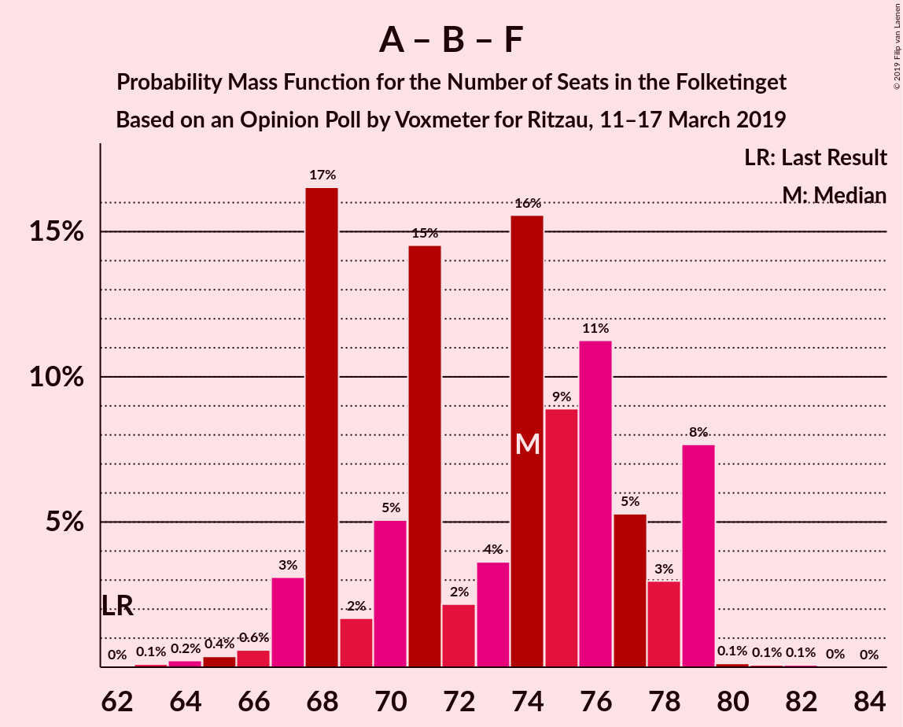

| Number of Seats | Probability | Accumulated | Special Marks |
|:---------------:|:-----------:|:-----------:|:-------------:|
| 62 | 0% | 100% | Last Result |
| 63 | 0.1% | 100% |  |
| 64 | 0.2% | 99.9% |  |
| 65 | 0.4% | 99.7% |  |
| 66 | 0.6% | 99.3% |  |
| 67 | 3% | 98.7% |  |
| 68 | 17% | 96% |  |
| 69 | 2% | 79% |  |
| 70 | 5% | 77% |  |
| 71 | 15% | 72% |  |
| 72 | 2% | 58% | Median |
| 73 | 4% | 56% |  |
| 74 | 16% | 52% |  |
| 75 | 9% | 36% |  |
| 76 | 11% | 28% |  |
| 77 | 5% | 16% |  |
| 78 | 3% | 11% |  |
| 79 | 8% | 8% |  |
| 80 | 0.1% | 0.3% |  |
| 81 | 0.1% | 0.2% |  |
| 82 | 0.1% | 0.1% |  |
| 83 | 0% | 0% |  |

### Socialdemokraterne – Radikale Venstre

| Number of Seats | Probability | Accumulated | Special Marks |
|:---------------:|:-----------:|:-----------:|:-------------:|
| 52 | 0.1% | 100% |  |
| 53 | 0% | 99.9% |  |
| 54 | 0.8% | 99.8% |  |
| 55 | 0.2% | 99.0% | Last Result |
| 56 | 2% | 98.8% |  |
| 57 | 5% | 97% |  |
| 58 | 4% | 92% |  |
| 59 | 14% | 87% |  |
| 60 | 7% | 73% |  |
| 61 | 13% | 66% | Median |
| 62 | 12% | 53% |  |
| 63 | 13% | 41% |  |
| 64 | 9% | 29% |  |
| 65 | 3% | 20% |  |
| 66 | 4% | 16% |  |
| 67 | 8% | 12% |  |
| 68 | 3% | 4% |  |
| 69 | 0.4% | 0.6% |  |
| 70 | 0.1% | 0.2% |  |
| 71 | 0% | 0% |  |

### Venstre – Liberal Alliance – Det Konservative Folkeparti

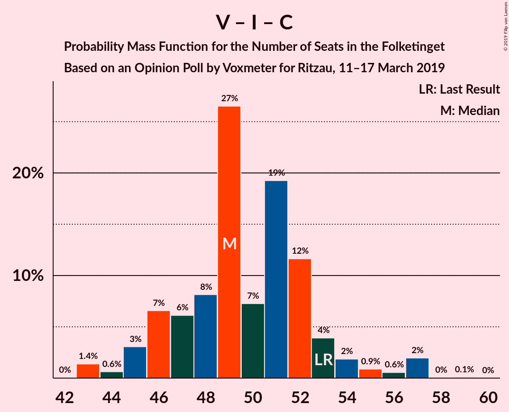

| Number of Seats | Probability | Accumulated | Special Marks |
|:---------------:|:-----------:|:-----------:|:-------------:|
| 42 | 0% | 100% |  |
| 43 | 1.4% | 99.9% |  |
| 44 | 0.6% | 98.6% |  |
| 45 | 3% | 98% |  |
| 46 | 7% | 95% |  |
| 47 | 6% | 88% |  |
| 48 | 8% | 82% |  |
| 49 | 27% | 74% | Median |
| 50 | 7% | 47% |  |
| 51 | 19% | 40% |  |
| 52 | 12% | 21% |  |
| 53 | 4% | 9% | Last Result |
| 54 | 2% | 5% |  |
| 55 | 0.9% | 4% |  |
| 56 | 0.6% | 3% |  |
| 57 | 2% | 2% |  |
| 58 | 0% | 0.2% |  |
| 59 | 0.1% | 0.1% |  |
| 60 | 0% | 0% |  |

### Venstre – Det Konservative Folkeparti

| Number of Seats | Probability | Accumulated | Special Marks |
|:---------------:|:-----------:|:-----------:|:-------------:|
| 34 | 0% | 100% |  |
| 35 | 0.7% | 99.9% |  |
| 36 | 2% | 99.2% |  |
| 37 | 7% | 97% |  |
| 38 | 8% | 91% |  |
| 39 | 10% | 83% |  |
| 40 | 13% | 73% | Last Result, Median |
| 41 | 25% | 60% |  |
| 42 | 11% | 35% |  |
| 43 | 7% | 23% |  |
| 44 | 12% | 17% |  |
| 45 | 3% | 4% |  |
| 46 | 0.9% | 2% |  |
| 47 | 0.6% | 1.0% |  |
| 48 | 0.3% | 0.4% |  |
| 49 | 0.1% | 0.1% |  |
| 50 | 0% | 0% |  |

### Venstre

| Number of Seats | Probability | Accumulated | Special Marks |
|:---------------:|:-----------:|:-----------:|:-------------:|
| 27 | 0.1% | 100% |  |
| 28 | 1.5% | 99.9% |  |
| 29 | 4% | 98% |  |
| 30 | 13% | 95% |  |
| 31 | 7% | 82% |  |
| 32 | 11% | 75% |  |
| 33 | 14% | 64% | Median |
| 34 | 7% | 49% | Last Result |
| 35 | 26% | 42% |  |
| 36 | 11% | 16% |  |
| 37 | 3% | 5% |  |
| 38 | 0.5% | 2% |  |
| 39 | 0.5% | 1.1% |  |
| 40 | 0.4% | 0.6% |  |
| 41 | 0.1% | 0.2% |  |
| 42 | 0% | 0% |  |

## Technical Information

### Opinion Poll

+ **Polling firm:** Voxmeter
+ **Commissioner(s):** Ritzau
+ **Fieldwork period:** 11–17 March 2019

### Calculations

+ **Sample size:** 1062
+ **Simulations done:** 1,048,576
+ **Error estimate:** 1.66%

