# Opinion Poll by Epinion for DR, 18–25 March 2019

<a href="#voting-intentions">Voting Intentions</a> | <a href="#seats">Seats</a> | <a href="#coalitions">Coalitions</a> | <a href="#technical-information">Technical Information</a>

## Voting Intentions

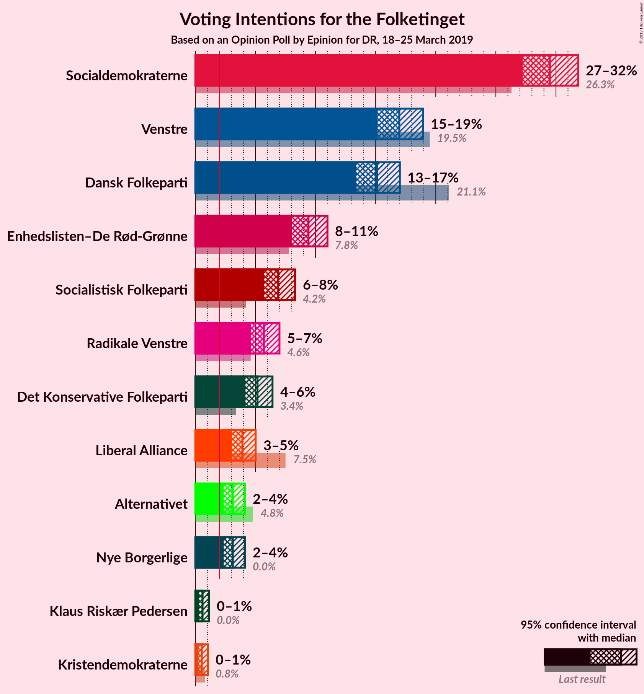

### Confidence Intervals

| Party | Last Result | Poll Result | 80% Confidence Interval | 90% Confidence Interval | 95% Confidence Interval | 99% Confidence Interval |
|:-----:|:-----------:|:-----------:|:-----------------------:|:-----------------------:|:-----------------------:|:-----------------------:|
| Socialdemokraterne | 26.3% | 29.5% | 28.0–31.0% |27.6–31.5% |27.2–31.9% |26.5–32.6% |
| Venstre | 19.5% | 17.0% | 15.8–18.3% |15.4–18.6% |15.2–18.9% |14.6–19.6% |
| Dansk Folkeparti | 21.1% | 15.1% | 14.0–16.4% |13.7–16.7% |13.4–17.0% |12.9–17.6% |
| Enhedslisten–De Rød-Grønne | 7.8% | 9.4% | 8.5–10.4% |8.2–10.7% |8.0–11.0% |7.6–11.5% |
| Socialistisk Folkeparti | 4.2% | 6.9% | 6.1–7.8% |5.9–8.1% |5.7–8.3% |5.4–8.7% |
| Radikale Venstre | 4.6% | 5.7% | 5.0–6.5% |4.8–6.8% |4.6–7.0% |4.3–7.4% |
| Det Konservative Folkeparti | 3.4% | 5.2% | 4.5–6.0% |4.3–6.2% |4.2–6.4% |3.9–6.8% |
| Liberal Alliance | 7.5% | 3.9% | 3.3–4.6% |3.2–4.8% |3.0–5.0% |2.8–5.4% |
| Alternativet | 4.8% | 3.1% | 2.6–3.8% |2.5–4.0% |2.3–4.1% |2.1–4.5% |
| Nye Borgerlige | 0.0% | 3.1% | 2.6–3.8% |2.5–4.0% |2.3–4.1% |2.1–4.5% |
| Klaus Riskær Pedersen | 0.0% | 0.6% | 0.4–0.9% |0.4–1.1% |0.3–1.1% |0.2–1.3% |
| Kristendemokraterne | 0.8% | 0.5% | 0.4–0.9% |0.3–1.0% |0.3–1.1% |0.2–1.2% |

*Note:* The poll result column reflects the actual value used in the calculations. Published results may vary slightly, and in addition be rounded to fewer digits.

## Seats

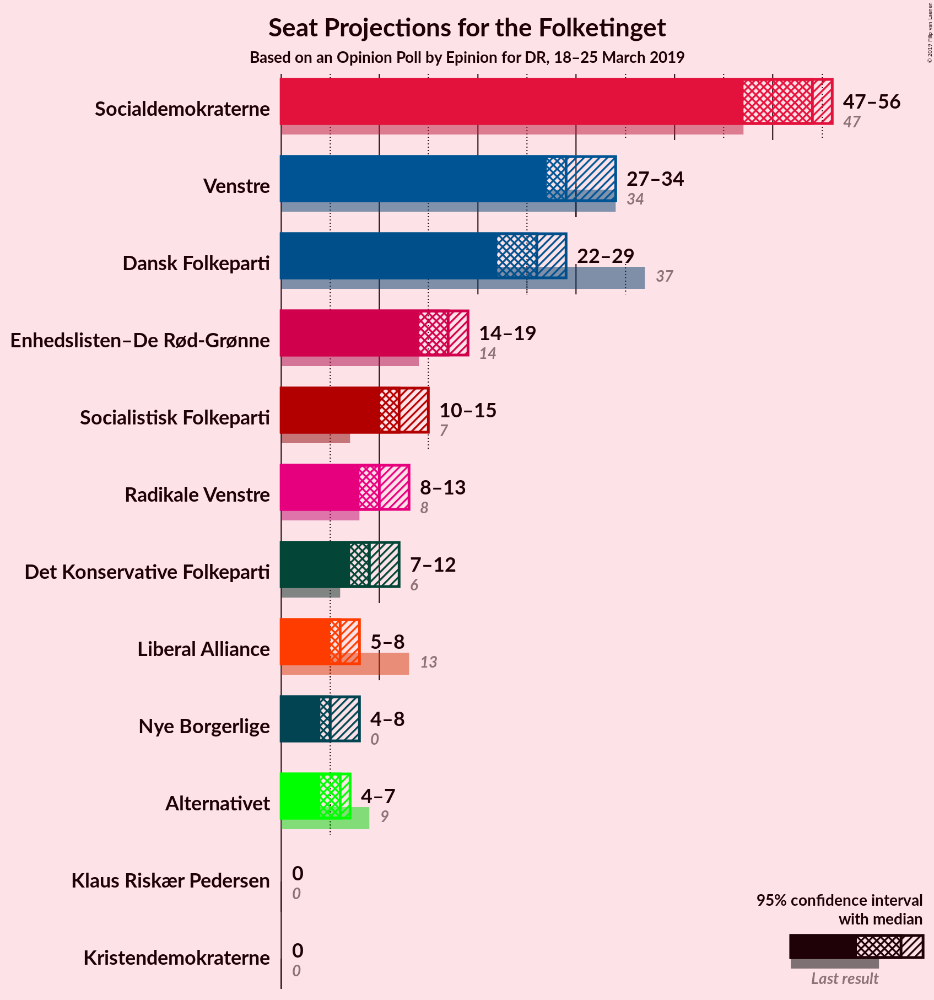

### Confidence Intervals

| Party | Last Result | Median | 80% Confidence Interval | 90% Confidence Interval | 95% Confidence Interval | 99% Confidence Interval |
|:-----:|:-----------:|:------:|:-----------------------:|:-----------------------:|:-----------------------:|:-----------------------:|
| <a href="#socialdemokraterne">Socialdemokraterne</a> | 47 | 54 | 51–56 |49–56 |47–56 |47–59 |
| <a href="#venstre">Venstre</a> | 34 | 29 | 27–32 |27–33 |27–34 |26–35 |
| <a href="#dansk-folkeparti">Dansk Folkeparti</a> | 37 | 26 | 24–28 |22–29 |22–29 |22–31 |
| <a href="#enhedslisten–de-rød-grønne">Enhedslisten–De Rød-Grønne</a> | 14 | 17 | 14–19 |14–19 |14–19 |14–19 |
| <a href="#socialistisk-folkeparti">Socialistisk Folkeparti</a> | 7 | 12 | 11–13 |10–14 |10–15 |10–15 |
| <a href="#radikale-venstre">Radikale Venstre</a> | 8 | 10 | 9–13 |9–13 |8–13 |8–13 |
| <a href="#det-konservative-folkeparti">Det Konservative Folkeparti</a> | 6 | 9 | 8–10 |8–10 |7–12 |7–13 |
| <a href="#liberal-alliance">Liberal Alliance</a> | 13 | 6 | 6–7 |5–8 |5–8 |5–8 |
| <a href="#alternativet">Alternativet</a> | 9 | 6 | 5–7 |4–7 |4–7 |4–8 |
| <a href="#nye-borgerlige">Nye Borgerlige</a> | 0 | 5 | 5–6 |4–6 |4–8 |4–8 |
| <a href="#klaus-riskær-pedersen">Klaus Riskær Pedersen</a> | 0 | 0 | 0 |0 |0 |0 |
| <a href="#kristendemokraterne">Kristendemokraterne</a> | 0 | 0 | 0 |0 |0 |0 |

### Socialdemokraterne

*For a full overview of the results for this party, see the [Socialdemokraterne](party-socialdemokraterne.html) page.*

| Number of Seats | Probability | Accumulated | Special Marks |
|:---------------:|:-----------:|:-----------:|:-------------:|
| 46 | 0.2% | 100% |  |
| 47 | 3% | 99.8% | Last Result |
| 48 | 0.6% | 97% |  |
| 49 | 3% | 97% |  |
| 50 | 3% | 94% |  |
| 51 | 2% | 91% |  |
| 52 | 22% | 89% |  |
| 53 | 11% | 67% |  |
| 54 | 20% | 56% | Median |
| 55 | 24% | 36% |  |
| 56 | 10% | 12% |  |
| 57 | 0.3% | 2% |  |
| 58 | 0.2% | 2% |  |
| 59 | 1.4% | 1.4% |  |
| 60 | 0% | 0% |  |

### Venstre

*For a full overview of the results for this party, see the [Venstre](party-venstre.html) page.*

| Number of Seats | Probability | Accumulated | Special Marks |
|:---------------:|:-----------:|:-----------:|:-------------:|
| 25 | 0.3% | 100% |  |
| 26 | 1.3% | 99.7% |  |
| 27 | 27% | 98% |  |
| 28 | 11% | 71% |  |
| 29 | 18% | 60% | Median |
| 30 | 5% | 43% |  |
| 31 | 17% | 38% |  |
| 32 | 16% | 21% |  |
| 33 | 1.0% | 5% |  |
| 34 | 2% | 4% | Last Result |
| 35 | 2% | 2% |  |
| 36 | 0% | 0% |  |

### Dansk Folkeparti

*For a full overview of the results for this party, see the [Dansk Folkeparti](party-danskfolkeparti.html) page.*

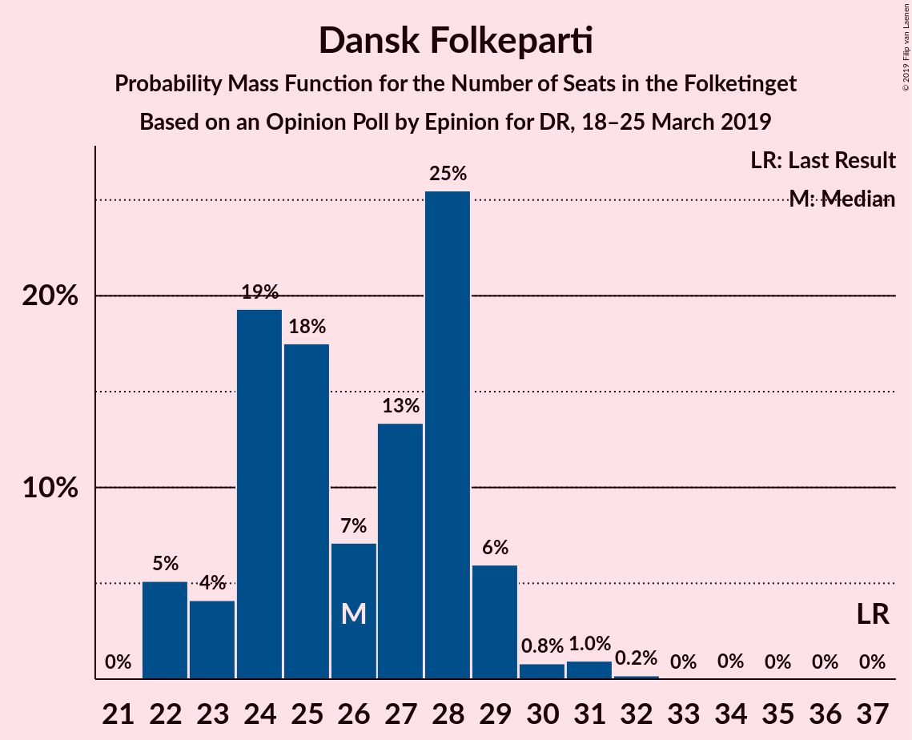

| Number of Seats | Probability | Accumulated | Special Marks |
|:---------------:|:-----------:|:-----------:|:-------------:|
| 22 | 5% | 100% |  |
| 23 | 4% | 95% |  |
| 24 | 19% | 91% |  |
| 25 | 18% | 71% |  |
| 26 | 7% | 54% | Median |
| 27 | 13% | 47% |  |
| 28 | 25% | 33% |  |
| 29 | 6% | 8% |  |
| 30 | 0.8% | 2% |  |
| 31 | 1.0% | 1.2% |  |
| 32 | 0.2% | 0.2% |  |
| 33 | 0% | 0% |  |
| 34 | 0% | 0% |  |
| 35 | 0% | 0% |  |
| 36 | 0% | 0% |  |
| 37 | 0% | 0% | Last Result |

### Enhedslisten–De Rød-Grønne

*For a full overview of the results for this party, see the [Enhedslisten–De Rød-Grønne](party-enhedslisten–derød-grønne.html) page.*

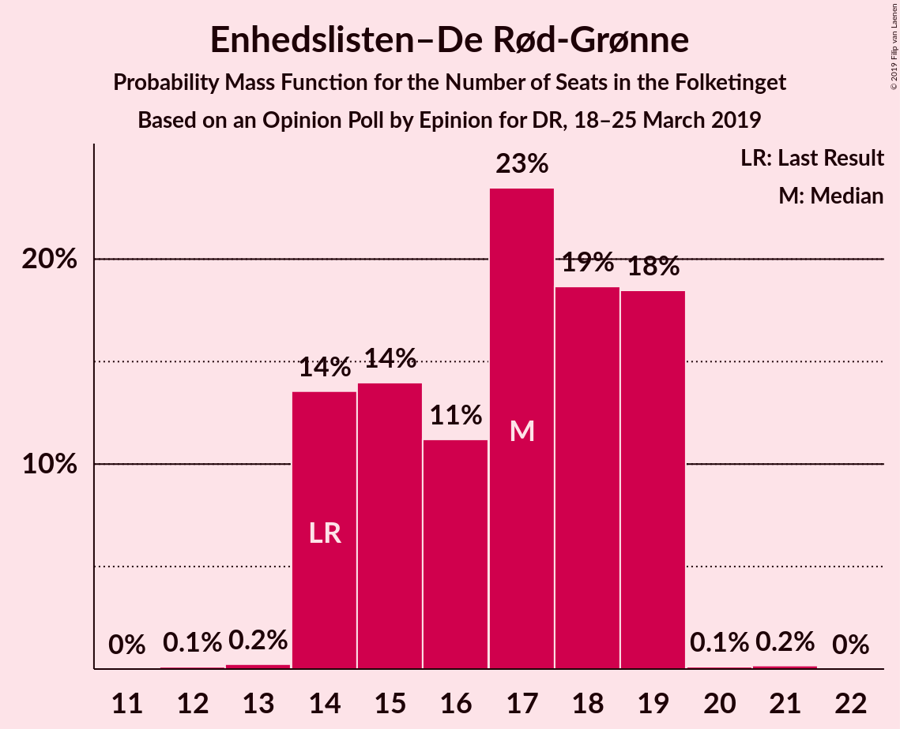

| Number of Seats | Probability | Accumulated | Special Marks |
|:---------------:|:-----------:|:-----------:|:-------------:|
| 12 | 0.1% | 100% |  |
| 13 | 0.2% | 99.9% |  |
| 14 | 14% | 99.7% | Last Result |
| 15 | 14% | 86% |  |
| 16 | 11% | 72% |  |
| 17 | 23% | 61% | Median |
| 18 | 19% | 37% |  |
| 19 | 18% | 19% |  |
| 20 | 0.1% | 0.3% |  |
| 21 | 0.2% | 0.2% |  |
| 22 | 0% | 0% |  |

### Socialistisk Folkeparti

*For a full overview of the results for this party, see the [Socialistisk Folkeparti](party-socialistiskfolkeparti.html) page.*

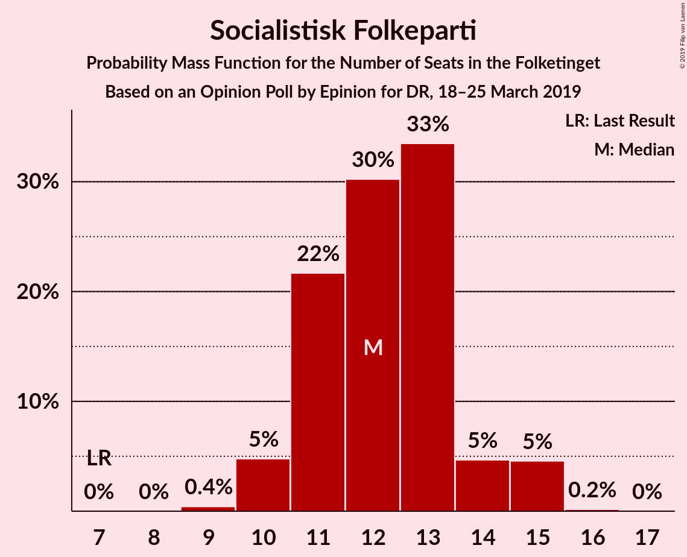

| Number of Seats | Probability | Accumulated | Special Marks |
|:---------------:|:-----------:|:-----------:|:-------------:|
| 7 | 0% | 100% | Last Result |
| 8 | 0% | 100% |  |
| 9 | 0.4% | 100% |  |
| 10 | 5% | 99.6% |  |
| 11 | 22% | 95% |  |
| 12 | 30% | 73% | Median |
| 13 | 33% | 43% |  |
| 14 | 5% | 9% |  |
| 15 | 5% | 5% |  |
| 16 | 0.2% | 0.2% |  |
| 17 | 0% | 0% |  |

### Radikale Venstre

*For a full overview of the results for this party, see the [Radikale Venstre](party-radikalevenstre.html) page.*

| Number of Seats | Probability | Accumulated | Special Marks |
|:---------------:|:-----------:|:-----------:|:-------------:|
| 7 | 0.2% | 100% |  |
| 8 | 3% | 99.8% | Last Result |
| 9 | 34% | 96% |  |
| 10 | 33% | 62% | Median |
| 11 | 8% | 29% |  |
| 12 | 6% | 21% |  |
| 13 | 15% | 15% |  |
| 14 | 0.1% | 0.1% |  |
| 15 | 0% | 0% |  |

### Det Konservative Folkeparti

*For a full overview of the results for this party, see the [Det Konservative Folkeparti](party-detkonservativefolkeparti.html) page.*

| Number of Seats | Probability | Accumulated | Special Marks |
|:---------------:|:-----------:|:-----------:|:-------------:|
| 6 | 0.1% | 100% | Last Result |
| 7 | 3% | 99.9% |  |
| 8 | 29% | 97% |  |
| 9 | 23% | 68% | Median |
| 10 | 40% | 45% |  |
| 11 | 2% | 5% |  |
| 12 | 1.1% | 3% |  |
| 13 | 2% | 2% |  |
| 14 | 0% | 0% |  |

### Liberal Alliance

*For a full overview of the results for this party, see the [Liberal Alliance](party-liberalalliance.html) page.*

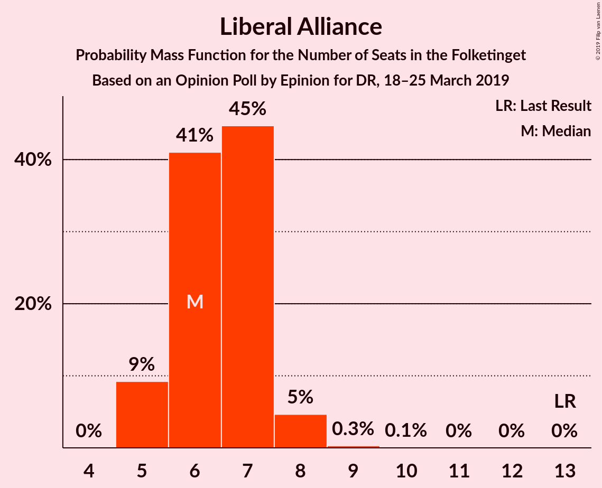

| Number of Seats | Probability | Accumulated | Special Marks |
|:---------------:|:-----------:|:-----------:|:-------------:|
| 5 | 9% | 100% |  |
| 6 | 41% | 91% | Median |
| 7 | 45% | 50% |  |
| 8 | 5% | 5% |  |
| 9 | 0.3% | 0.4% |  |
| 10 | 0.1% | 0.1% |  |
| 11 | 0% | 0% |  |
| 12 | 0% | 0% |  |
| 13 | 0% | 0% | Last Result |

### Alternativet

*For a full overview of the results for this party, see the [Alternativet](party-alternativet.html) page.*

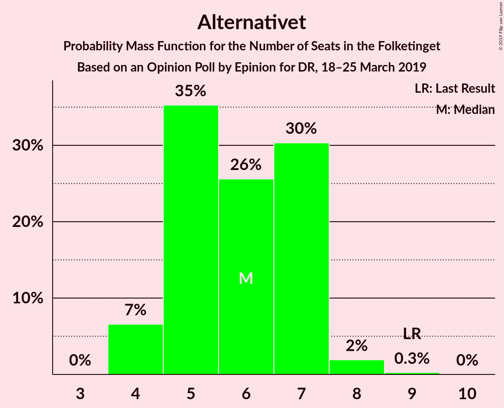

| Number of Seats | Probability | Accumulated | Special Marks |
|:---------------:|:-----------:|:-----------:|:-------------:|
| 4 | 7% | 100% |  |
| 5 | 35% | 93% |  |
| 6 | 26% | 58% | Median |
| 7 | 30% | 33% |  |
| 8 | 2% | 2% |  |
| 9 | 0.3% | 0.3% | Last Result |
| 10 | 0% | 0% |  |

### Nye Borgerlige

*For a full overview of the results for this party, see the [Nye Borgerlige](party-nyeborgerlige.html) page.*

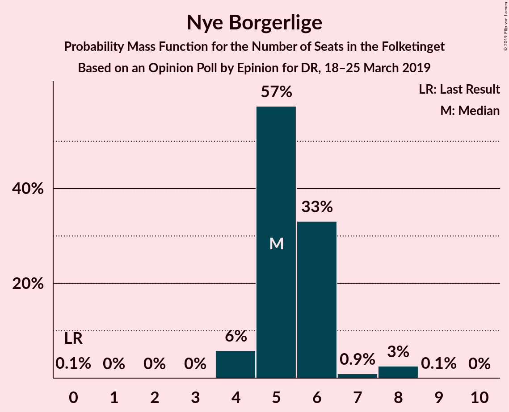

| Number of Seats | Probability | Accumulated | Special Marks |
|:---------------:|:-----------:|:-----------:|:-------------:|
| 0 | 0.1% | 100% | Last Result |
| 1 | 0% | 99.9% |  |
| 2 | 0% | 99.9% |  |
| 3 | 0% | 99.9% |  |
| 4 | 6% | 99.9% |  |
| 5 | 57% | 94% | Median |
| 6 | 33% | 37% |  |
| 7 | 0.9% | 4% |  |
| 8 | 3% | 3% |  |
| 9 | 0.1% | 0.1% |  |
| 10 | 0% | 0% |  |

### Klaus Riskær Pedersen

*For a full overview of the results for this party, see the [Klaus Riskær Pedersen](party-klausriskærpedersen.html) page.*

| Number of Seats | Probability | Accumulated | Special Marks |
|:---------------:|:-----------:|:-----------:|:-------------:|
| 0 | 100% | 100% | Last Result, Median |

### Kristendemokraterne

*For a full overview of the results for this party, see the [Kristendemokraterne](party-kristendemokraterne.html) page.*

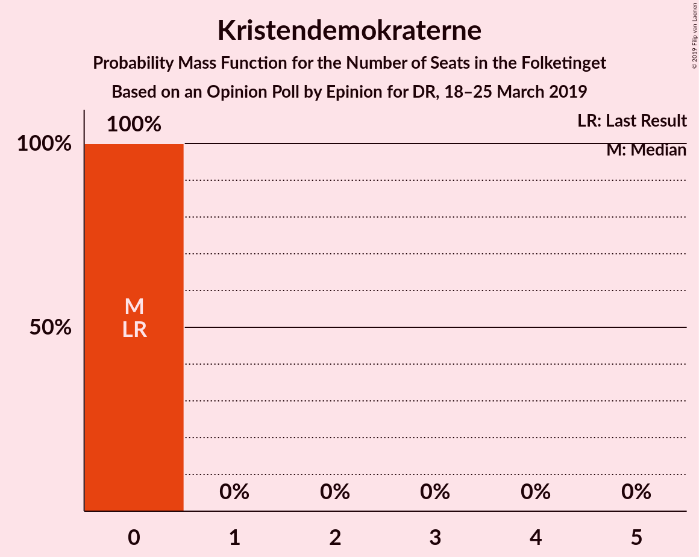

| Number of Seats | Probability | Accumulated | Special Marks |
|:---------------:|:-----------:|:-----------:|:-------------:|
| 0 | 100% | 100% | Last Result, Median |

## Coalitions

### Confidence Intervals

| Coalition | Last Result | Median | Majority? | 80% Confidence Interval | 90% Confidence Interval | 95% Confidence Interval | 99% Confidence Interval |
|:---------:|:-----------:|:------:|:---------:|:-----------------------:|:-----------------------:|:-----------------------:|:-----------------------:|
| Socialdemokraterne – Enhedslisten–De Rød-Grønne – Socialistisk Folkeparti – Radikale Venstre – Alternativet | 85 | 98 | 100% | 95–103 | 93–103 | 92–103 | 91–103 |
| Socialdemokraterne – Enhedslisten–De Rød-Grønne – Socialistisk Folkeparti – Radikale Venstre | 76 | 93 | 89% | 89–97 | 88–97 | 87–97 | 86–97 |
| Socialdemokraterne – Enhedslisten–De Rød-Grønne – Socialistisk Folkeparti – Alternativet | 77 | 89 | 40% | 85–93 | 83–93 | 82–93 | 81–93 |
| Socialdemokraterne – Enhedslisten–De Rød-Grønne – Socialistisk Folkeparti | 68 | 83 | 0.1% | 78–87 | 78–87 | 77–87 | 76–87 |
| Venstre – Dansk Folkeparti – Det Konservative Folkeparti – Liberal Alliance – Nye Borgerlige – Klaus Riskær Pedersen – Kristendemokraterne | 90 | 77 | 0% | 72–80 | 72–82 | 72–83 | 72–84 |
| Venstre – Dansk Folkeparti – Det Konservative Folkeparti – Liberal Alliance – Nye Borgerlige – Klaus Riskær Pedersen | 90 | 77 | 0% | 72–80 | 72–82 | 72–83 | 72–84 |
| Venstre – Dansk Folkeparti – Det Konservative Folkeparti – Liberal Alliance – Nye Borgerlige – Kristendemokraterne | 90 | 77 | 0% | 72–80 | 72–82 | 72–83 | 72–84 |
| Venstre – Dansk Folkeparti – Det Konservative Folkeparti – Liberal Alliance – Nye Borgerlige | 90 | 77 | 0% | 72–80 | 72–82 | 72–83 | 72–84 |
| Socialdemokraterne – Socialistisk Folkeparti – Radikale Venstre | 62 | 77 | 0% | 73–78 | 72–78 | 70–79 | 68–81 |
| Venstre – Dansk Folkeparti – Det Konservative Folkeparti – Liberal Alliance – Kristendemokraterne | 90 | 72 | 0% | 66–74 | 66–76 | 66–77 | 66–79 |
| Venstre – Dansk Folkeparti – Det Konservative Folkeparti – Liberal Alliance | 90 | 72 | 0% | 66–74 | 66–76 | 66–77 | 66–79 |
| Socialdemokraterne – Radikale Venstre | 55 | 64 | 0% | 61–65 | 59–66 | 58–66 | 56–69 |
| Venstre – Det Konservative Folkeparti – Liberal Alliance | 53 | 44 | 0% | 42–48 | 42–49 | 42–51 | 41–52 |
| Venstre – Det Konservative Folkeparti | 40 | 38 | 0% | 35–41 | 35–42 | 35–43 | 35–46 |
| Venstre | 34 | 29 | 0% | 27–32 | 27–33 | 27–34 | 26–35 |

### Socialdemokraterne – Enhedslisten–De Rød-Grønne – Socialistisk Folkeparti – Radikale Venstre – Alternativet

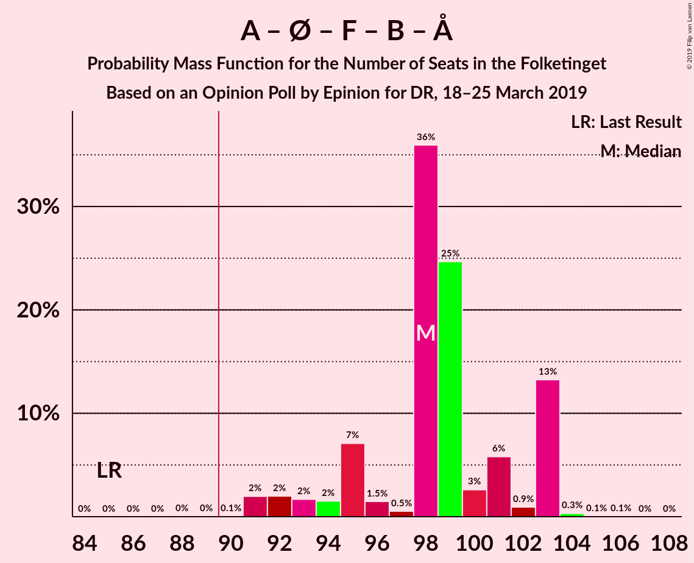

| Number of Seats | Probability | Accumulated | Special Marks |
|:---------------:|:-----------:|:-----------:|:-------------:|
| 85 | 0% | 100% | Last Result |
| 86 | 0% | 100% |  |
| 87 | 0% | 100% |  |
| 88 | 0% | 100% |  |
| 89 | 0% | 100% |  |
| 90 | 0.1% | 100% | Majority |
| 91 | 2% | 99.9% |  |
| 92 | 2% | 98% |  |
| 93 | 2% | 96% |  |
| 94 | 2% | 94% |  |
| 95 | 7% | 93% |  |
| 96 | 1.5% | 86% |  |
| 97 | 0.5% | 84% |  |
| 98 | 36% | 84% |  |
| 99 | 25% | 48% | Median |
| 100 | 3% | 23% |  |
| 101 | 6% | 20% |  |
| 102 | 0.9% | 15% |  |
| 103 | 13% | 14% |  |
| 104 | 0.3% | 0.4% |  |
| 105 | 0.1% | 0.1% |  |
| 106 | 0.1% | 0.1% |  |
| 107 | 0% | 0% |  |

### Socialdemokraterne – Enhedslisten–De Rød-Grønne – Socialistisk Folkeparti – Radikale Venstre

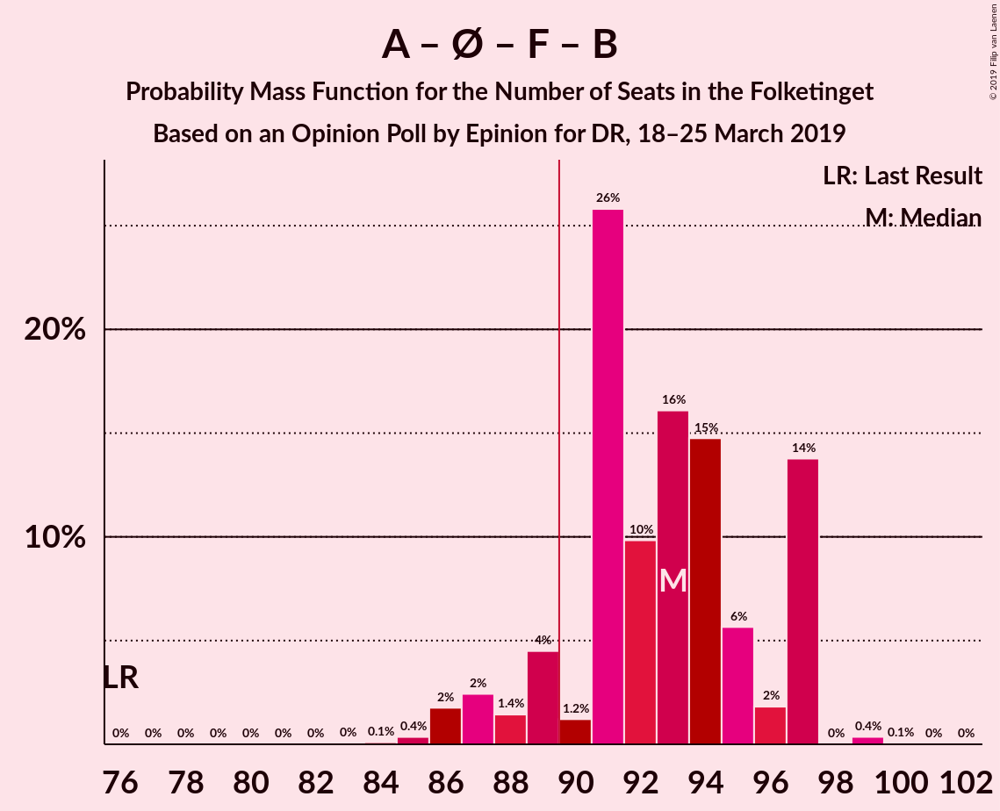

| Number of Seats | Probability | Accumulated | Special Marks |
|:---------------:|:-----------:|:-----------:|:-------------:|
| 76 | 0% | 100% | Last Result |
| 77 | 0% | 100% |  |
| 78 | 0% | 100% |  |
| 79 | 0% | 100% |  |
| 80 | 0% | 100% |  |
| 81 | 0% | 100% |  |
| 82 | 0% | 100% |  |
| 83 | 0% | 100% |  |
| 84 | 0.1% | 100% |  |
| 85 | 0.4% | 99.9% |  |
| 86 | 2% | 99.5% |  |
| 87 | 2% | 98% |  |
| 88 | 1.4% | 95% |  |
| 89 | 4% | 94% |  |
| 90 | 1.2% | 89% | Majority |
| 91 | 26% | 88% |  |
| 92 | 10% | 62% |  |
| 93 | 16% | 53% | Median |
| 94 | 15% | 36% |  |
| 95 | 6% | 22% |  |
| 96 | 2% | 16% |  |
| 97 | 14% | 14% |  |
| 98 | 0% | 0.4% |  |
| 99 | 0.4% | 0.4% |  |
| 100 | 0.1% | 0.1% |  |
| 101 | 0% | 0% |  |

### Socialdemokraterne – Enhedslisten–De Rød-Grønne – Socialistisk Folkeparti – Alternativet

| Number of Seats | Probability | Accumulated | Special Marks |
|:---------------:|:-----------:|:-----------:|:-------------:|
| 77 | 0% | 100% | Last Result |
| 78 | 0% | 100% |  |
| 79 | 0% | 100% |  |
| 80 | 0.1% | 100% |  |
| 81 | 0.4% | 99.9% |  |
| 82 | 4% | 99.4% |  |
| 83 | 0.5% | 95% |  |
| 84 | 4% | 95% |  |
| 85 | 17% | 90% |  |
| 86 | 0.6% | 73% |  |
| 87 | 4% | 72% |  |
| 88 | 18% | 69% |  |
| 89 | 11% | 51% | Median |
| 90 | 23% | 40% | Majority |
| 91 | 2% | 17% |  |
| 92 | 1.3% | 15% |  |
| 93 | 13% | 14% |  |
| 94 | 0.2% | 0.2% |  |
| 95 | 0% | 0.1% |  |
| 96 | 0% | 0.1% |  |
| 97 | 0.1% | 0.1% |  |
| 98 | 0% | 0% |  |

### Socialdemokraterne – Enhedslisten–De Rød-Grønne – Socialistisk Folkeparti

| Number of Seats | Probability | Accumulated | Special Marks |
|:---------------:|:-----------:|:-----------:|:-------------:|
| 68 | 0% | 100% | Last Result |
| 69 | 0% | 100% |  |
| 70 | 0% | 100% |  |
| 71 | 0% | 100% |  |
| 72 | 0% | 100% |  |
| 73 | 0% | 100% |  |
| 74 | 0.1% | 100% |  |
| 75 | 0.4% | 99.9% |  |
| 76 | 0.7% | 99.5% |  |
| 77 | 3% | 98.8% |  |
| 78 | 14% | 95% |  |
| 79 | 2% | 81% |  |
| 80 | 7% | 79% |  |
| 81 | 6% | 73% |  |
| 82 | 8% | 67% |  |
| 83 | 28% | 59% | Median |
| 84 | 0.9% | 31% |  |
| 85 | 14% | 30% |  |
| 86 | 1.1% | 16% |  |
| 87 | 14% | 15% |  |
| 88 | 0.2% | 0.2% |  |
| 89 | 0% | 0.1% |  |
| 90 | 0% | 0.1% | Majority |
| 91 | 0.1% | 0.1% |  |
| 92 | 0% | 0% |  |

### Venstre – Dansk Folkeparti – Det Konservative Folkeparti – Liberal Alliance – Nye Borgerlige – Klaus Riskær Pedersen – Kristendemokraterne

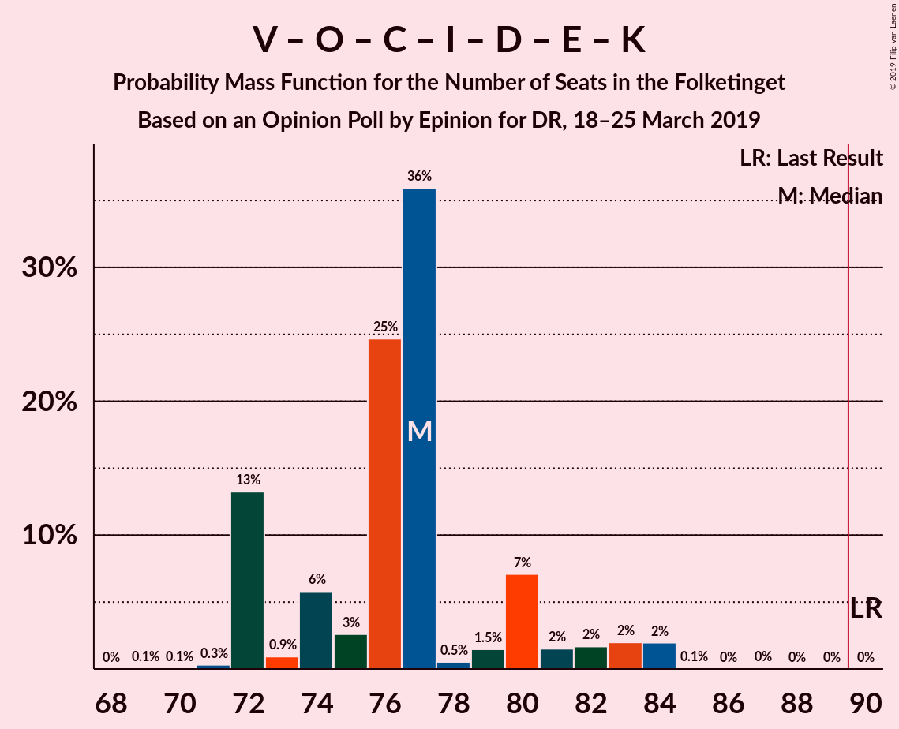

| Number of Seats | Probability | Accumulated | Special Marks |
|:---------------:|:-----------:|:-----------:|:-------------:|
| 69 | 0.1% | 100% |  |
| 70 | 0.1% | 99.9% |  |
| 71 | 0.3% | 99.9% |  |
| 72 | 13% | 99.6% |  |
| 73 | 0.9% | 86% |  |
| 74 | 6% | 85% |  |
| 75 | 3% | 80% | Median |
| 76 | 25% | 77% |  |
| 77 | 36% | 52% |  |
| 78 | 0.5% | 16% |  |
| 79 | 1.5% | 16% |  |
| 80 | 7% | 14% |  |
| 81 | 2% | 7% |  |
| 82 | 2% | 6% |  |
| 83 | 2% | 4% |  |
| 84 | 2% | 2% |  |
| 85 | 0.1% | 0.1% |  |
| 86 | 0% | 0% |  |
| 87 | 0% | 0% |  |
| 88 | 0% | 0% |  |
| 89 | 0% | 0% |  |
| 90 | 0% | 0% | Last Result, Majority |

### Venstre – Dansk Folkeparti – Det Konservative Folkeparti – Liberal Alliance – Nye Borgerlige – Klaus Riskær Pedersen

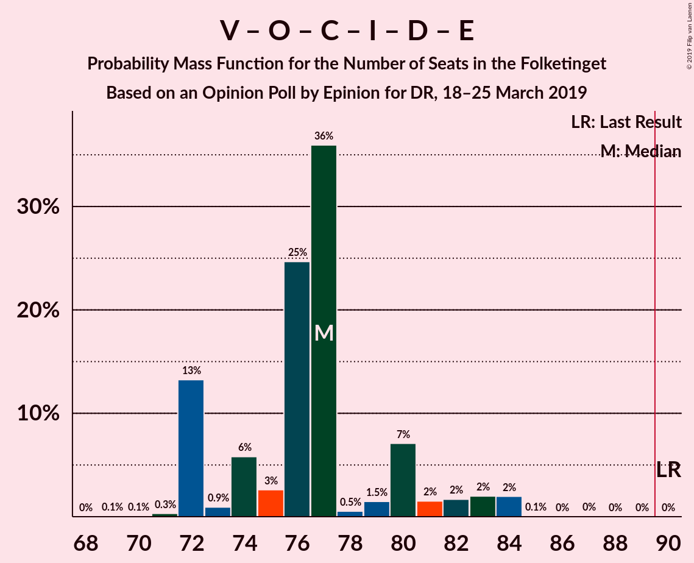

| Number of Seats | Probability | Accumulated | Special Marks |
|:---------------:|:-----------:|:-----------:|:-------------:|
| 69 | 0.1% | 100% |  |
| 70 | 0.1% | 99.9% |  |
| 71 | 0.3% | 99.9% |  |
| 72 | 13% | 99.6% |  |
| 73 | 0.9% | 86% |  |
| 74 | 6% | 85% |  |
| 75 | 3% | 80% | Median |
| 76 | 25% | 77% |  |
| 77 | 36% | 52% |  |
| 78 | 0.5% | 16% |  |
| 79 | 1.5% | 16% |  |
| 80 | 7% | 14% |  |
| 81 | 2% | 7% |  |
| 82 | 2% | 6% |  |
| 83 | 2% | 4% |  |
| 84 | 2% | 2% |  |
| 85 | 0.1% | 0.1% |  |
| 86 | 0% | 0% |  |
| 87 | 0% | 0% |  |
| 88 | 0% | 0% |  |
| 89 | 0% | 0% |  |
| 90 | 0% | 0% | Last Result, Majority |

### Venstre – Dansk Folkeparti – Det Konservative Folkeparti – Liberal Alliance – Nye Borgerlige – Kristendemokraterne

| Number of Seats | Probability | Accumulated | Special Marks |
|:---------------:|:-----------:|:-----------:|:-------------:|
| 69 | 0.1% | 100% |  |
| 70 | 0.1% | 99.9% |  |
| 71 | 0.3% | 99.9% |  |
| 72 | 13% | 99.6% |  |
| 73 | 0.9% | 86% |  |
| 74 | 6% | 85% |  |
| 75 | 3% | 80% | Median |
| 76 | 25% | 77% |  |
| 77 | 36% | 52% |  |
| 78 | 0.5% | 16% |  |
| 79 | 1.5% | 16% |  |
| 80 | 7% | 14% |  |
| 81 | 2% | 7% |  |
| 82 | 2% | 6% |  |
| 83 | 2% | 4% |  |
| 84 | 2% | 2% |  |
| 85 | 0.1% | 0.1% |  |
| 86 | 0% | 0% |  |
| 87 | 0% | 0% |  |
| 88 | 0% | 0% |  |
| 89 | 0% | 0% |  |
| 90 | 0% | 0% | Last Result, Majority |

### Venstre – Dansk Folkeparti – Det Konservative Folkeparti – Liberal Alliance – Nye Borgerlige

| Number of Seats | Probability | Accumulated | Special Marks |
|:---------------:|:-----------:|:-----------:|:-------------:|
| 69 | 0.1% | 100% |  |
| 70 | 0.1% | 99.9% |  |
| 71 | 0.3% | 99.9% |  |
| 72 | 13% | 99.6% |  |
| 73 | 0.9% | 86% |  |
| 74 | 6% | 85% |  |
| 75 | 3% | 80% | Median |
| 76 | 25% | 77% |  |
| 77 | 36% | 52% |  |
| 78 | 0.5% | 16% |  |
| 79 | 1.5% | 16% |  |
| 80 | 7% | 14% |  |
| 81 | 2% | 7% |  |
| 82 | 2% | 6% |  |
| 83 | 2% | 4% |  |
| 84 | 2% | 2% |  |
| 85 | 0.1% | 0.1% |  |
| 86 | 0% | 0% |  |
| 87 | 0% | 0% |  |
| 88 | 0% | 0% |  |
| 89 | 0% | 0% |  |
| 90 | 0% | 0% | Last Result, Majority |

### Socialdemokraterne – Socialistisk Folkeparti – Radikale Venstre

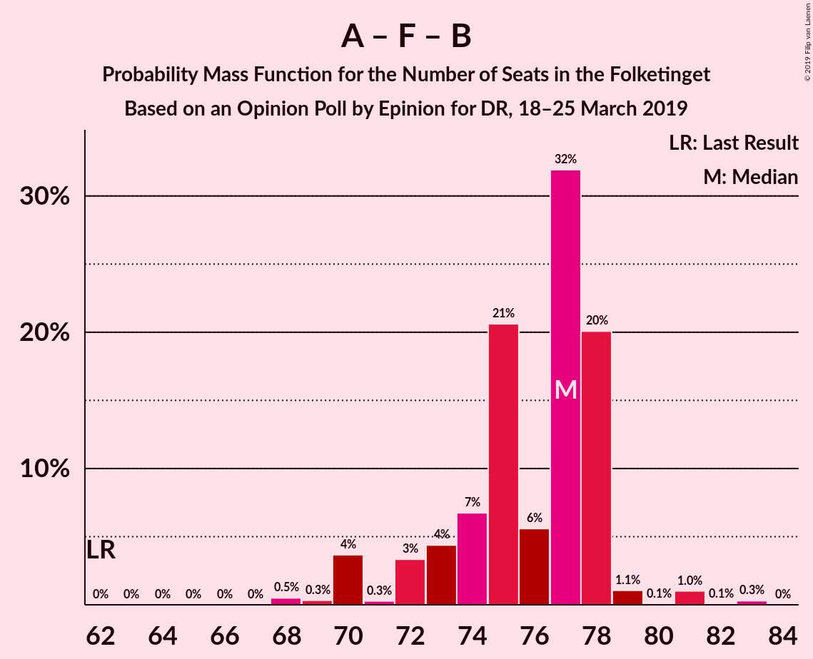

| Number of Seats | Probability | Accumulated | Special Marks |
|:---------------:|:-----------:|:-----------:|:-------------:|
| 62 | 0% | 100% | Last Result |
| 63 | 0% | 100% |  |
| 64 | 0% | 100% |  |
| 65 | 0% | 100% |  |
| 66 | 0% | 100% |  |
| 67 | 0% | 100% |  |
| 68 | 0.5% | 100% |  |
| 69 | 0.3% | 99.5% |  |
| 70 | 4% | 99.1% |  |
| 71 | 0.3% | 95% |  |
| 72 | 3% | 95% |  |
| 73 | 4% | 92% |  |
| 74 | 7% | 87% |  |
| 75 | 21% | 81% |  |
| 76 | 6% | 60% | Median |
| 77 | 32% | 55% |  |
| 78 | 20% | 23% |  |
| 79 | 1.1% | 3% |  |
| 80 | 0.1% | 1.5% |  |
| 81 | 1.0% | 1.4% |  |
| 82 | 0.1% | 0.4% |  |
| 83 | 0.3% | 0.3% |  |
| 84 | 0% | 0% |  |

### Venstre – Dansk Folkeparti – Det Konservative Folkeparti – Liberal Alliance – Kristendemokraterne

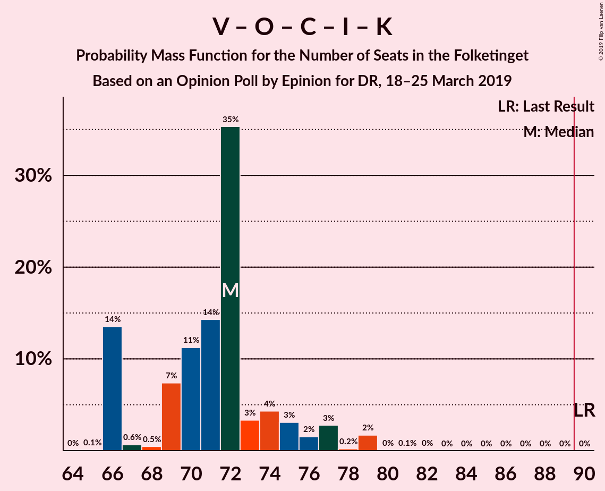

| Number of Seats | Probability | Accumulated | Special Marks |
|:---------------:|:-----------:|:-----------:|:-------------:|
| 65 | 0.1% | 100% |  |
| 66 | 14% | 99.9% |  |
| 67 | 0.6% | 86% |  |
| 68 | 0.5% | 86% |  |
| 69 | 7% | 85% |  |
| 70 | 11% | 78% | Median |
| 71 | 14% | 67% |  |
| 72 | 35% | 52% |  |
| 73 | 3% | 17% |  |
| 74 | 4% | 14% |  |
| 75 | 3% | 9% |  |
| 76 | 2% | 6% |  |
| 77 | 3% | 5% |  |
| 78 | 0.2% | 2% |  |
| 79 | 2% | 2% |  |
| 80 | 0% | 0.1% |  |
| 81 | 0.1% | 0.1% |  |
| 82 | 0% | 0% |  |
| 83 | 0% | 0% |  |
| 84 | 0% | 0% |  |
| 85 | 0% | 0% |  |
| 86 | 0% | 0% |  |
| 87 | 0% | 0% |  |
| 88 | 0% | 0% |  |
| 89 | 0% | 0% |  |
| 90 | 0% | 0% | Last Result, Majority |

### Venstre – Dansk Folkeparti – Det Konservative Folkeparti – Liberal Alliance

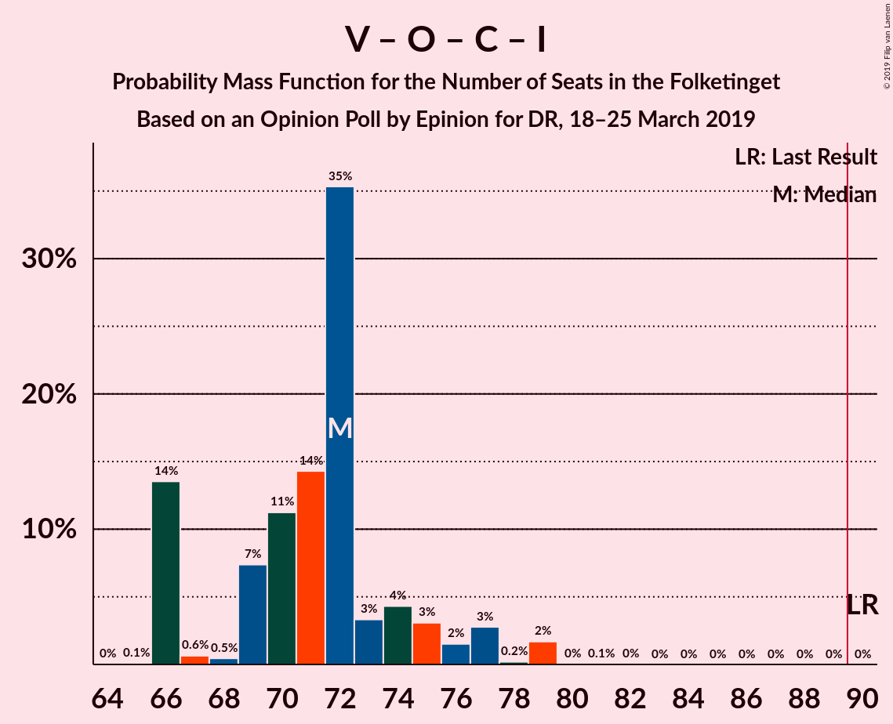

| Number of Seats | Probability | Accumulated | Special Marks |
|:---------------:|:-----------:|:-----------:|:-------------:|
| 65 | 0.1% | 100% |  |
| 66 | 14% | 99.9% |  |
| 67 | 0.6% | 86% |  |
| 68 | 0.5% | 86% |  |
| 69 | 7% | 85% |  |
| 70 | 11% | 78% | Median |
| 71 | 14% | 67% |  |
| 72 | 35% | 52% |  |
| 73 | 3% | 17% |  |
| 74 | 4% | 14% |  |
| 75 | 3% | 9% |  |
| 76 | 2% | 6% |  |
| 77 | 3% | 5% |  |
| 78 | 0.2% | 2% |  |
| 79 | 2% | 2% |  |
| 80 | 0% | 0.1% |  |
| 81 | 0.1% | 0.1% |  |
| 82 | 0% | 0% |  |
| 83 | 0% | 0% |  |
| 84 | 0% | 0% |  |
| 85 | 0% | 0% |  |
| 86 | 0% | 0% |  |
| 87 | 0% | 0% |  |
| 88 | 0% | 0% |  |
| 89 | 0% | 0% |  |
| 90 | 0% | 0% | Last Result, Majority |

### Socialdemokraterne – Radikale Venstre

| Number of Seats | Probability | Accumulated | Special Marks |
|:---------------:|:-----------:|:-----------:|:-------------:|
| 54 | 0.1% | 100% |  |
| 55 | 0% | 99.9% | Last Result |
| 56 | 0.4% | 99.9% |  |
| 57 | 0.2% | 99.5% |  |
| 58 | 3% | 99.2% |  |
| 59 | 4% | 97% |  |
| 60 | 2% | 93% |  |
| 61 | 8% | 91% |  |
| 62 | 8% | 83% |  |
| 63 | 4% | 75% |  |
| 64 | 27% | 72% | Median |
| 65 | 35% | 44% |  |
| 66 | 7% | 9% |  |
| 67 | 0.3% | 2% |  |
| 68 | 0.9% | 2% |  |
| 69 | 0.4% | 0.7% |  |
| 70 | 0% | 0.3% |  |
| 71 | 0.3% | 0.3% |  |
| 72 | 0% | 0% |  |

### Venstre – Det Konservative Folkeparti – Liberal Alliance

| Number of Seats | Probability | Accumulated | Special Marks |
|:---------------:|:-----------:|:-----------:|:-------------:|
| 40 | 0.1% | 100% |  |
| 41 | 1.0% | 99.9% |  |
| 42 | 14% | 98.9% |  |
| 43 | 24% | 85% |  |
| 44 | 15% | 62% | Median |
| 45 | 3% | 47% |  |
| 46 | 6% | 44% |  |
| 47 | 19% | 38% |  |
| 48 | 13% | 19% |  |
| 49 | 1.4% | 5% |  |
| 50 | 0.7% | 4% |  |
| 51 | 2% | 3% |  |
| 52 | 1.3% | 1.3% |  |
| 53 | 0% | 0% | Last Result |

### Venstre – Det Konservative Folkeparti

| Number of Seats | Probability | Accumulated | Special Marks |
|:---------------:|:-----------:|:-----------:|:-------------:|
| 34 | 0.4% | 100% |  |
| 35 | 15% | 99.6% |  |
| 36 | 2% | 85% |  |
| 37 | 28% | 83% |  |
| 38 | 10% | 55% | Median |
| 39 | 3% | 45% |  |
| 40 | 6% | 42% | Last Result |
| 41 | 31% | 36% |  |
| 42 | 1.2% | 6% |  |
| 43 | 3% | 4% |  |
| 44 | 0.3% | 2% |  |
| 45 | 0.2% | 1.4% |  |
| 46 | 1.2% | 1.2% |  |
| 47 | 0% | 0% |  |

### Venstre

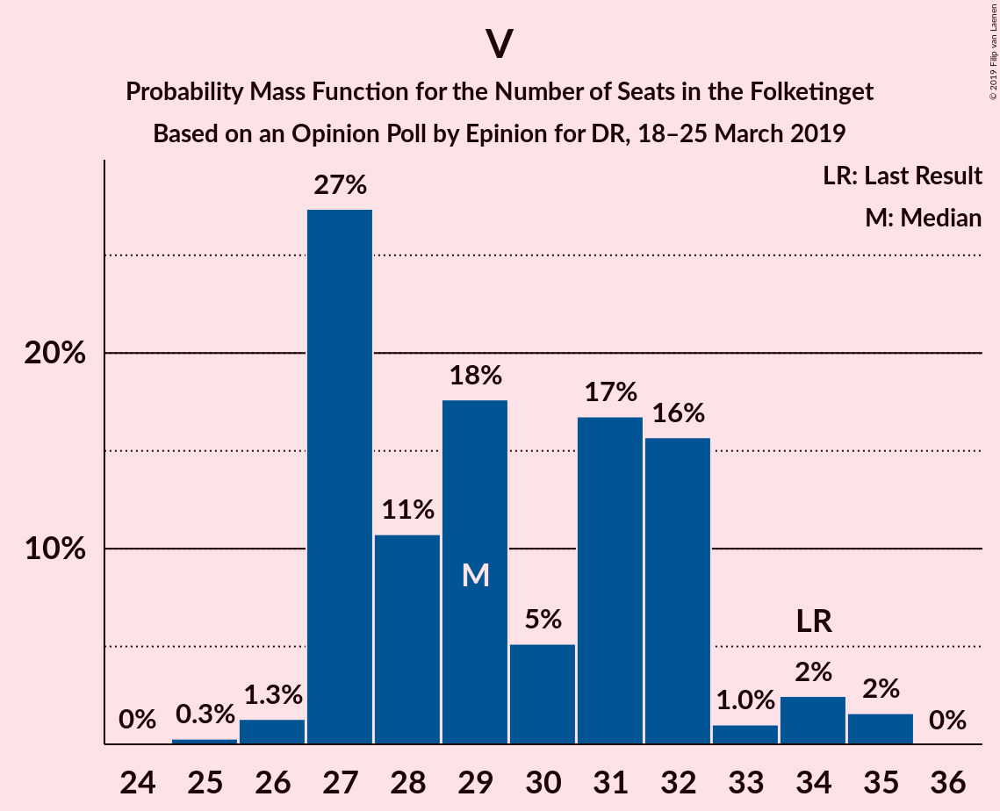

| Number of Seats | Probability | Accumulated | Special Marks |
|:---------------:|:-----------:|:-----------:|:-------------:|
| 25 | 0.3% | 100% |  |
| 26 | 1.3% | 99.7% |  |
| 27 | 27% | 98% |  |
| 28 | 11% | 71% |  |
| 29 | 18% | 60% | Median |
| 30 | 5% | 43% |  |
| 31 | 17% | 38% |  |
| 32 | 16% | 21% |  |
| 33 | 1.0% | 5% |  |
| 34 | 2% | 4% | Last Result |
| 35 | 2% | 2% |  |
| 36 | 0% | 0% |  |

## Technical Information

### Opinion Poll

+ **Polling firm:** Epinion
+ **Commissioner(s):** DR
+ **Fieldwork period:** 18–25 March 2019

### Calculations

+ **Sample size:** 1509
+ **Simulations done:** 1,048,576
+ **Error estimate:** 1.46%

