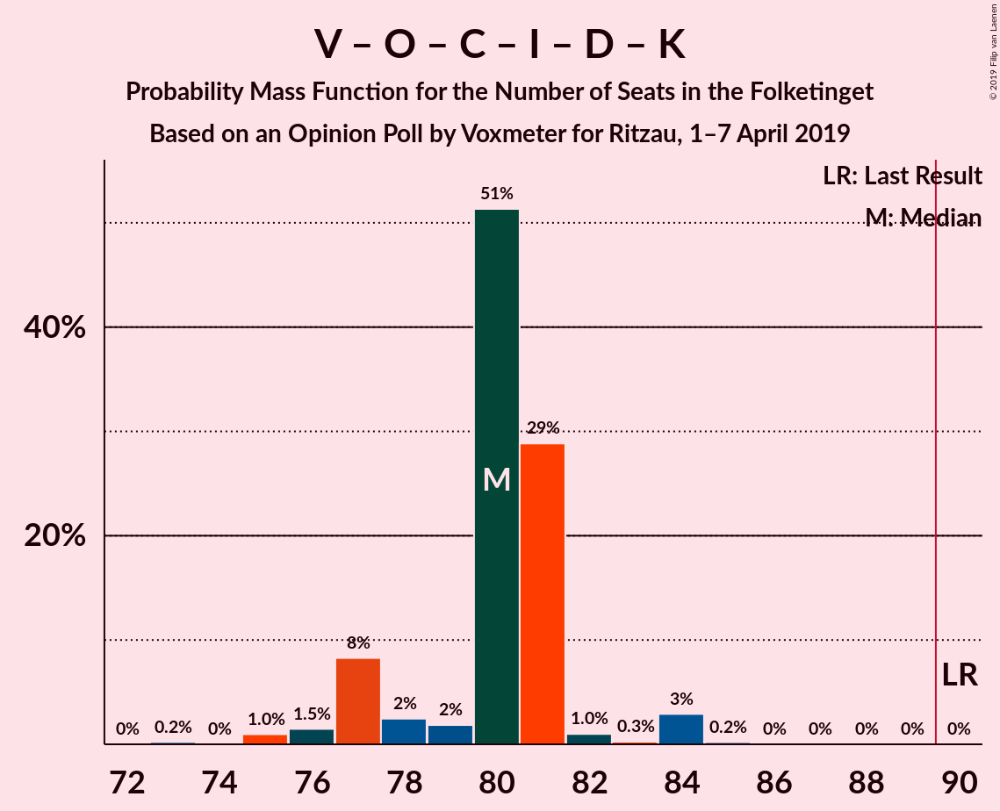

# Opinion Poll by Voxmeter for Ritzau, 1–7 April 2019

<a href="#voting-intentions">Voting Intentions</a> | <a href="#seats">Seats</a> | <a href="#coalitions">Coalitions</a> | <a href="#technical-information">Technical Information</a>

## Voting Intentions

### Confidence Intervals

| Party | Last Result | Poll Result | 80% Confidence Interval | 90% Confidence Interval | 95% Confidence Interval | 99% Confidence Interval |
|:-----:|:-----------:|:-----------:|:-----------------------:|:-----------------------:|:-----------------------:|:-----------------------:|
| Socialdemokraterne | 26.3% | 27.9% | 26.1–29.7% |25.6–30.2% |25.2–30.7% |24.4–31.6% |
| Venstre | 19.5% | 18.3% | 16.8–19.9% |16.4–20.3% |16.0–20.7% |15.3–21.5% |
| Dansk Folkeparti | 21.1% | 14.8% | 13.4–16.3% |13.0–16.7% |12.7–17.1% |12.1–17.8% |
| Enhedslisten–De Rød-Grønne | 7.8% | 8.6% | 7.6–9.9% |7.3–10.2% |7.1–10.5% |6.6–11.1% |
| Radikale Venstre | 4.6% | 7.2% | 6.2–8.3% |6.0–8.6% |5.8–8.9% |5.3–9.5% |
| Socialistisk Folkeparti | 4.2% | 6.4% | 5.5–7.5% |5.3–7.8% |5.1–8.1% |4.7–8.6% |
| Det Konservative Folkeparti | 3.4% | 4.6% | 3.8–5.5% |3.6–5.8% |3.4–6.0% |3.1–6.5% |
| Liberal Alliance | 7.5% | 4.4% | 3.6–5.3% |3.4–5.6% |3.3–5.8% |3.0–6.3% |
| Alternativet | 4.8% | 3.4% | 2.8–4.2% |2.6–4.5% |2.5–4.7% |2.2–5.1% |
| Nye Borgerlige | 0.0% | 2.8% | 2.3–3.6% |2.1–3.8% |2.0–4.0% |1.7–4.4% |
| Kristendemokraterne | 0.8% | 0.9% | 0.6–1.4% |0.5–1.5% |0.5–1.7% |0.4–1.9% |
| Klaus Riskær Pedersen | 0.0% | 0.3% | 0.2–0.7% |0.1–0.8% |0.1–0.9% |0.1–1.1% |

*Note:* The poll result column reflects the actual value used in the calculations. Published results may vary slightly, and in addition be rounded to fewer digits.

## Seats

### Confidence Intervals

| Party | Last Result | Median | 80% Confidence Interval | 90% Confidence Interval | 95% Confidence Interval | 99% Confidence Interval |
|:-----:|:-----------:|:------:|:-----------------------:|:-----------------------:|:-----------------------:|:-----------------------:|
| <a href="#socialdemokraterne">Socialdemokraterne</a> | 47 | 50 | 48–50 |48–54 |47–54 |44–54 |
| <a href="#venstre">Venstre</a> | 34 | 32 | 31–34 |31–34 |31–34 |28–36 |
| <a href="#dansk-folkeparti">Dansk Folkeparti</a> | 37 | 26 | 25–27 |25–28 |24–29 |23–29 |
| <a href="#enhedslisten–de-rød-grønne">Enhedslisten–De Rød-Grønne</a> | 14 | 16 | 14–16 |14–17 |14–18 |13–18 |
| <a href="#radikale-venstre">Radikale Venstre</a> | 8 | 13 | 12–13 |12–14 |11–15 |10–16 |
| <a href="#socialistisk-folkeparti">Socialistisk Folkeparti</a> | 7 | 11 | 11–12 |10–13 |9–13 |9–14 |
| <a href="#det-konservative-folkeparti">Det Konservative Folkeparti</a> | 6 | 9 | 8–9 |7–9 |7–10 |6–10 |
| <a href="#liberal-alliance">Liberal Alliance</a> | 13 | 7 | 7 |7–8 |6–9 |6–10 |
| <a href="#alternativet">Alternativet</a> | 9 | 5 | 5–7 |5–7 |5–7 |5–9 |
| <a href="#nye-borgerlige">Nye Borgerlige</a> | 0 | 6 | 5–6 |4–7 |4–7 |0–7 |
| <a href="#kristendemokraterne">Kristendemokraterne</a> | 0 | 0 | 0 |0 |0 |0 |
| <a href="#klaus-riskær-pedersen">Klaus Riskær Pedersen</a> | 0 | 0 | 0 |0 |0 |0 |

### Socialdemokraterne

*For a full overview of the results for this party, see the [Socialdemokraterne](party-socialdemokraterne.html) page.*

| Number of Seats | Probability | Accumulated | Special Marks |
|:---------------:|:-----------:|:-----------:|:-------------:|
| 42 | 0.1% | 100% |  |
| 43 | 0% | 99.9% |  |
| 44 | 0.6% | 99.9% |  |
| 45 | 0.1% | 99.2% |  |
| 46 | 0.3% | 99.1% |  |
| 47 | 2% | 98.8% | Last Result |
| 48 | 31% | 97% |  |
| 49 | 4% | 66% |  |
| 50 | 53% | 62% | Median |
| 51 | 3% | 9% |  |
| 52 | 0.4% | 7% |  |
| 53 | 0.6% | 6% |  |
| 54 | 5% | 6% |  |
| 55 | 0.2% | 0.2% |  |
| 56 | 0% | 0.1% |  |
| 57 | 0% | 0% |  |

### Venstre

*For a full overview of the results for this party, see the [Venstre](party-venstre.html) page.*

| Number of Seats | Probability | Accumulated | Special Marks |
|:---------------:|:-----------:|:-----------:|:-------------:|
| 27 | 0.1% | 100% |  |
| 28 | 1.4% | 99.9% |  |
| 29 | 0.5% | 98.5% |  |
| 30 | 0.4% | 98% |  |
| 31 | 9% | 98% |  |
| 32 | 53% | 88% | Median |
| 33 | 2% | 36% |  |
| 34 | 31% | 33% | Last Result |
| 35 | 0.5% | 2% |  |
| 36 | 2% | 2% |  |
| 37 | 0.1% | 0.4% |  |
| 38 | 0.2% | 0.2% |  |
| 39 | 0% | 0.1% |  |
| 40 | 0% | 0% |  |

### Dansk Folkeparti

*For a full overview of the results for this party, see the [Dansk Folkeparti](party-danskfolkeparti.html) page.*

| Number of Seats | Probability | Accumulated | Special Marks |
|:---------------:|:-----------:|:-----------:|:-------------:|
| 21 | 0.1% | 100% |  |
| 22 | 0.1% | 99.9% |  |
| 23 | 1.2% | 99.9% |  |
| 24 | 3% | 98.7% |  |
| 25 | 8% | 96% |  |
| 26 | 52% | 87% | Median |
| 27 | 29% | 35% |  |
| 28 | 3% | 6% |  |
| 29 | 3% | 3% |  |
| 30 | 0.2% | 0.4% |  |
| 31 | 0.1% | 0.2% |  |
| 32 | 0% | 0% |  |
| 33 | 0% | 0% |  |
| 34 | 0% | 0% |  |
| 35 | 0% | 0% |  |
| 36 | 0% | 0% |  |
| 37 | 0% | 0% | Last Result |

### Enhedslisten–De Rød-Grønne

*For a full overview of the results for this party, see the [Enhedslisten–De Rød-Grønne](party-enhedslisten–derød-grønne.html) page.*

| Number of Seats | Probability | Accumulated | Special Marks |
|:---------------:|:-----------:|:-----------:|:-------------:|
| 12 | 0.3% | 100% |  |
| 13 | 1.3% | 99.7% |  |
| 14 | 28% | 98% | Last Result |
| 15 | 5% | 71% |  |
| 16 | 60% | 66% | Median |
| 17 | 3% | 6% |  |
| 18 | 2% | 3% |  |
| 19 | 0.1% | 0.3% |  |
| 20 | 0% | 0.2% |  |
| 21 | 0.2% | 0.2% |  |
| 22 | 0% | 0% |  |

### Radikale Venstre

*For a full overview of the results for this party, see the [Radikale Venstre](party-radikalevenstre.html) page.*

| Number of Seats | Probability | Accumulated | Special Marks |
|:---------------:|:-----------:|:-----------:|:-------------:|
| 8 | 0% | 100% | Last Result |
| 9 | 0.1% | 100% |  |
| 10 | 2% | 99.9% |  |
| 11 | 2% | 98% |  |
| 12 | 9% | 96% |  |
| 13 | 82% | 87% | Median |
| 14 | 3% | 6% |  |
| 15 | 0.4% | 3% |  |
| 16 | 2% | 2% |  |
| 17 | 0.1% | 0.2% |  |
| 18 | 0% | 0% |  |

### Socialistisk Folkeparti

*For a full overview of the results for this party, see the [Socialistisk Folkeparti](party-socialistiskfolkeparti.html) page.*

| Number of Seats | Probability | Accumulated | Special Marks |
|:---------------:|:-----------:|:-----------:|:-------------:|
| 7 | 0% | 100% | Last Result |
| 8 | 0.1% | 100% |  |
| 9 | 3% | 99.9% |  |
| 10 | 3% | 97% |  |
| 11 | 59% | 94% | Median |
| 12 | 29% | 35% |  |
| 13 | 4% | 5% |  |
| 14 | 1.2% | 2% |  |
| 15 | 0.3% | 0.4% |  |
| 16 | 0% | 0% |  |

### Det Konservative Folkeparti

*For a full overview of the results for this party, see the [Det Konservative Folkeparti](party-detkonservativefolkeparti.html) page.*

| Number of Seats | Probability | Accumulated | Special Marks |
|:---------------:|:-----------:|:-----------:|:-------------:|
| 5 | 0.1% | 100% |  |
| 6 | 1.3% | 99.9% | Last Result |
| 7 | 6% | 98.6% |  |
| 8 | 34% | 92% |  |
| 9 | 54% | 58% | Median |
| 10 | 3% | 4% |  |
| 11 | 0.2% | 0.4% |  |
| 12 | 0.2% | 0.2% |  |
| 13 | 0% | 0% |  |

### Liberal Alliance

*For a full overview of the results for this party, see the [Liberal Alliance](party-liberalalliance.html) page.*

| Number of Seats | Probability | Accumulated | Special Marks |
|:---------------:|:-----------:|:-----------:|:-------------:|
| 5 | 0.1% | 100% |  |
| 6 | 4% | 99.9% |  |
| 7 | 88% | 96% | Median |
| 8 | 5% | 8% |  |
| 9 | 1.2% | 3% |  |
| 10 | 1.3% | 2% |  |
| 11 | 0.1% | 0.2% |  |
| 12 | 0% | 0.1% |  |
| 13 | 0% | 0% | Last Result |

### Alternativet

*For a full overview of the results for this party, see the [Alternativet](party-alternativet.html) page.*

| Number of Seats | Probability | Accumulated | Special Marks |
|:---------------:|:-----------:|:-----------:|:-------------:|
| 4 | 0.4% | 100% |  |
| 5 | 58% | 99.6% | Median |
| 6 | 6% | 42% |  |
| 7 | 33% | 36% |  |
| 8 | 1.4% | 2% |  |
| 9 | 0.8% | 1.0% | Last Result |
| 10 | 0.1% | 0.1% |  |
| 11 | 0% | 0% |  |

### Nye Borgerlige

*For a full overview of the results for this party, see the [Nye Borgerlige](party-nyeborgerlige.html) page.*

| Number of Seats | Probability | Accumulated | Special Marks |
|:---------------:|:-----------:|:-----------:|:-------------:|
| 0 | 0.9% | 100% | Last Result |
| 1 | 0% | 99.1% |  |
| 2 | 0% | 99.1% |  |
| 3 | 0% | 99.1% |  |
| 4 | 8% | 99.1% |  |
| 5 | 31% | 91% |  |
| 6 | 54% | 60% | Median |
| 7 | 6% | 7% |  |
| 8 | 0.1% | 0.1% |  |
| 9 | 0% | 0% |  |

### Kristendemokraterne

*For a full overview of the results for this party, see the [Kristendemokraterne](party-kristendemokraterne.html) page.*

| Number of Seats | Probability | Accumulated | Special Marks |
|:---------------:|:-----------:|:-----------:|:-------------:|
| 0 | 99.9% | 100% | Last Result, Median |
| 1 | 0% | 0.1% |  |
| 2 | 0% | 0.1% |  |
| 3 | 0% | 0.1% |  |
| 4 | 0.1% | 0.1% |  |
| 5 | 0% | 0% |  |

### Klaus Riskær Pedersen

*For a full overview of the results for this party, see the [Klaus Riskær Pedersen](party-klausriskærpedersen.html) page.*

| Number of Seats | Probability | Accumulated | Special Marks |
|:---------------:|:-----------:|:-----------:|:-------------:|
| 0 | 100% | 100% | Last Result, Median |

## Coalitions

### Confidence Intervals

| Coalition | Last Result | Median | Majority? | 80% Confidence Interval | 90% Confidence Interval | 95% Confidence Interval | 99% Confidence Interval |
|:---------:|:-----------:|:------:|:---------:|:-----------------------:|:-----------------------:|:-----------------------:|:-----------------------:|
| Socialdemokraterne – Enhedslisten–De Rød-Grønne – Radikale Venstre – Socialistisk Folkeparti – Alternativet | 85 | 95 | 99.9% | 94–98 | 94–98 | 91–99 | 91–100 |
| Socialdemokraterne – Enhedslisten–De Rød-Grønne – Radikale Venstre – Socialistisk Folkeparti | 76 | 90 | 65% | 87–92 | 87–93 | 84–93 | 84–94 |
| Socialdemokraterne – Enhedslisten–De Rød-Grønne – Socialistisk Folkeparti – Alternativet | 77 | 82 | 0% | 81–85 | 81–86 | 80–86 | 77–87 |
| Venstre – Dansk Folkeparti – Det Konservative Folkeparti – Liberal Alliance – Nye Borgerlige – Kristendemokraterne – Klaus Riskær Pedersen | 90 | 80 | 0% | 77–81 | 77–81 | 76–84 | 75–84 |
| Venstre – Dansk Folkeparti – Det Konservative Folkeparti – Liberal Alliance – Nye Borgerlige – Klaus Riskær Pedersen | 90 | 80 | 0% | 77–81 | 77–81 | 76–84 | 75–84 |
| Venstre – Dansk Folkeparti – Det Konservative Folkeparti – Liberal Alliance – Nye Borgerlige – Kristendemokraterne | 90 | 80 | 0% | 77–81 | 77–81 | 76–84 | 75–84 |
| Venstre – Dansk Folkeparti – Det Konservative Folkeparti – Liberal Alliance – Nye Borgerlige | 90 | 80 | 0% | 77–81 | 77–81 | 76–84 | 75–84 |
| Socialdemokraterne – Enhedslisten–De Rød-Grønne – Socialistisk Folkeparti | 68 | 77 | 0% | 74–78 | 74–81 | 73–81 | 70–81 |
| Venstre – Dansk Folkeparti – Det Konservative Folkeparti – Liberal Alliance – Kristendemokraterne | 90 | 74 | 0% | 73–76 | 70–76 | 70–78 | 70–80 |
| Venstre – Dansk Folkeparti – Det Konservative Folkeparti – Liberal Alliance | 90 | 74 | 0% | 73–76 | 70–76 | 70–78 | 70–80 |
| Socialdemokraterne – Radikale Venstre – Socialistisk Folkeparti | 62 | 74 | 0% | 73–75 | 71–77 | 69–77 | 69–77 |
| Socialdemokraterne – Radikale Venstre | 55 | 63 | 0% | 61–64 | 60–66 | 59–66 | 57–67 |
| Venstre – Det Konservative Folkeparti – Liberal Alliance | 53 | 48 | 0% | 47–49 | 45–51 | 45–51 | 44–52 |
| Venstre – Det Konservative Folkeparti | 40 | 41 | 0% | 39–42 | 38–43 | 38–44 | 36–46 |
| Venstre | 34 | 32 | 0% | 31–34 | 31–34 | 31–34 | 28–36 |

### Socialdemokraterne – Enhedslisten–De Rød-Grønne – Radikale Venstre – Socialistisk Folkeparti – Alternativet

| Number of Seats | Probability | Accumulated | Special Marks |
|:---------------:|:-----------:|:-----------:|:-------------:|
| 85 | 0% | 100% | Last Result |
| 86 | 0% | 100% |  |
| 87 | 0% | 100% |  |
| 88 | 0% | 100% |  |
| 89 | 0% | 99.9% |  |
| 90 | 0.2% | 99.9% | Majority |
| 91 | 3% | 99.7% |  |
| 92 | 0.3% | 97% |  |
| 93 | 1.0% | 97% |  |
| 94 | 29% | 96% |  |
| 95 | 51% | 67% | Median |
| 96 | 2% | 15% |  |
| 97 | 2% | 14% |  |
| 98 | 8% | 11% |  |
| 99 | 1.5% | 3% |  |
| 100 | 1.0% | 1.3% |  |
| 101 | 0% | 0.3% |  |
| 102 | 0.2% | 0.3% |  |
| 103 | 0% | 0.1% |  |
| 104 | 0% | 0% |  |

### Socialdemokraterne – Enhedslisten–De Rød-Grønne – Radikale Venstre – Socialistisk Folkeparti

| Number of Seats | Probability | Accumulated | Special Marks |
|:---------------:|:-----------:|:-----------:|:-------------:|
| 76 | 0% | 100% | Last Result |
| 77 | 0% | 100% |  |
| 78 | 0% | 100% |  |
| 79 | 0% | 100% |  |
| 80 | 0% | 100% |  |
| 81 | 0% | 100% |  |
| 82 | 0% | 100% |  |
| 83 | 0% | 99.9% |  |
| 84 | 3% | 99.9% |  |
| 85 | 0.7% | 97% |  |
| 86 | 0.4% | 96% |  |
| 87 | 28% | 96% |  |
| 88 | 3% | 68% |  |
| 89 | 1.4% | 66% |  |
| 90 | 52% | 65% | Median, Majority |
| 91 | 2% | 12% |  |
| 92 | 3% | 10% |  |
| 93 | 6% | 7% |  |
| 94 | 0.2% | 0.6% |  |
| 95 | 0.1% | 0.4% |  |
| 96 | 0.3% | 0.3% |  |
| 97 | 0% | 0.1% |  |
| 98 | 0% | 0% |  |

### Socialdemokraterne – Enhedslisten–De Rød-Grønne – Socialistisk Folkeparti – Alternativet

| Number of Seats | Probability | Accumulated | Special Marks |
|:---------------:|:-----------:|:-----------:|:-------------:|
| 75 | 0.1% | 100% |  |
| 76 | 0% | 99.9% |  |
| 77 | 0.8% | 99.9% | Last Result |
| 78 | 0.2% | 99.1% |  |
| 79 | 0.1% | 98.8% |  |
| 80 | 2% | 98.7% |  |
| 81 | 29% | 97% |  |
| 82 | 54% | 68% | Median |
| 83 | 2% | 14% |  |
| 84 | 2% | 12% |  |
| 85 | 2% | 10% |  |
| 86 | 7% | 8% |  |
| 87 | 0.2% | 0.6% |  |
| 88 | 0.1% | 0.4% |  |
| 89 | 0.3% | 0.3% |  |
| 90 | 0% | 0% | Majority |

### Venstre – Dansk Folkeparti – Det Konservative Folkeparti – Liberal Alliance – Nye Borgerlige – Kristendemokraterne – Klaus Riskær Pedersen

| Number of Seats | Probability | Accumulated | Special Marks |
|:---------------:|:-----------:|:-----------:|:-------------:|
| 72 | 0% | 100% |  |
| 73 | 0.2% | 99.9% |  |
| 74 | 0% | 99.7% |  |
| 75 | 1.0% | 99.7% |  |
| 76 | 1.5% | 98.7% |  |
| 77 | 8% | 97% |  |
| 78 | 2% | 89% |  |
| 79 | 2% | 86% |  |
| 80 | 51% | 85% | Median |
| 81 | 29% | 33% |  |
| 82 | 1.0% | 4% |  |
| 83 | 0.3% | 3% |  |
| 84 | 3% | 3% |  |
| 85 | 0.2% | 0.3% |  |
| 86 | 0% | 0.1% |  |
| 87 | 0% | 0.1% |  |
| 88 | 0% | 0% |  |
| 89 | 0% | 0% |  |
| 90 | 0% | 0% | Last Result, Majority |

### Venstre – Dansk Folkeparti – Det Konservative Folkeparti – Liberal Alliance – Nye Borgerlige – Klaus Riskær Pedersen

| Number of Seats | Probability | Accumulated | Special Marks |
|:---------------:|:-----------:|:-----------:|:-------------:|
| 72 | 0% | 100% |  |
| 73 | 0.2% | 99.9% |  |
| 74 | 0% | 99.7% |  |
| 75 | 1.0% | 99.7% |  |
| 76 | 2% | 98.7% |  |
| 77 | 8% | 97% |  |
| 78 | 2% | 89% |  |
| 79 | 2% | 86% |  |
| 80 | 51% | 85% | Median |
| 81 | 29% | 33% |  |
| 82 | 1.0% | 4% |  |
| 83 | 0.3% | 3% |  |
| 84 | 3% | 3% |  |
| 85 | 0.2% | 0.3% |  |
| 86 | 0% | 0.1% |  |
| 87 | 0% | 0.1% |  |
| 88 | 0% | 0% |  |
| 89 | 0% | 0% |  |
| 90 | 0% | 0% | Last Result, Majority |

### Venstre – Dansk Folkeparti – Det Konservative Folkeparti – Liberal Alliance – Nye Borgerlige – Kristendemokraterne

| Number of Seats | Probability | Accumulated | Special Marks |
|:---------------:|:-----------:|:-----------:|:-------------:|
| 72 | 0% | 100% |  |
| 73 | 0.2% | 99.9% |  |
| 74 | 0% | 99.7% |  |
| 75 | 1.0% | 99.7% |  |
| 76 | 1.5% | 98.7% |  |
| 77 | 8% | 97% |  |
| 78 | 2% | 89% |  |
| 79 | 2% | 86% |  |
| 80 | 51% | 85% | Median |
| 81 | 29% | 33% |  |
| 82 | 1.0% | 4% |  |
| 83 | 0.3% | 3% |  |
| 84 | 3% | 3% |  |
| 85 | 0.2% | 0.3% |  |
| 86 | 0% | 0.1% |  |
| 87 | 0% | 0.1% |  |
| 88 | 0% | 0% |  |
| 89 | 0% | 0% |  |
| 90 | 0% | 0% | Last Result, Majority |

### Venstre – Dansk Folkeparti – Det Konservative Folkeparti – Liberal Alliance – Nye Borgerlige

| Number of Seats | Probability | Accumulated | Special Marks |
|:---------------:|:-----------:|:-----------:|:-------------:|
| 72 | 0% | 100% |  |
| 73 | 0.2% | 99.9% |  |
| 74 | 0% | 99.7% |  |
| 75 | 1.0% | 99.7% |  |
| 76 | 2% | 98.7% |  |
| 77 | 8% | 97% |  |
| 78 | 2% | 89% |  |
| 79 | 2% | 86% |  |
| 80 | 51% | 85% | Median |
| 81 | 29% | 33% |  |
| 82 | 1.0% | 4% |  |
| 83 | 0.3% | 3% |  |
| 84 | 3% | 3% |  |
| 85 | 0.2% | 0.3% |  |
| 86 | 0% | 0.1% |  |
| 87 | 0% | 0.1% |  |
| 88 | 0% | 0% |  |
| 89 | 0% | 0% |  |
| 90 | 0% | 0% | Last Result, Majority |

### Socialdemokraterne – Enhedslisten–De Rød-Grønne – Socialistisk Folkeparti

| Number of Seats | Probability | Accumulated | Special Marks |
|:---------------:|:-----------:|:-----------:|:-------------:|
| 68 | 0% | 100% | Last Result |
| 69 | 0% | 100% |  |
| 70 | 0.4% | 99.9% |  |
| 71 | 0.1% | 99.5% |  |
| 72 | 0.5% | 99.3% |  |
| 73 | 2% | 98.8% |  |
| 74 | 28% | 97% |  |
| 75 | 1.5% | 69% |  |
| 76 | 3% | 67% |  |
| 77 | 53% | 64% | Median |
| 78 | 2% | 11% |  |
| 79 | 3% | 9% |  |
| 80 | 0.8% | 6% |  |
| 81 | 5% | 5% |  |
| 82 | 0% | 0.4% |  |
| 83 | 0.3% | 0.3% |  |
| 84 | 0% | 0.1% |  |
| 85 | 0% | 0% |  |

### Venstre – Dansk Folkeparti – Det Konservative Folkeparti – Liberal Alliance – Kristendemokraterne

| Number of Seats | Probability | Accumulated | Special Marks |
|:---------------:|:-----------:|:-----------:|:-------------:|
| 67 | 0% | 100% |  |
| 68 | 0.1% | 99.9% |  |
| 69 | 0.1% | 99.9% |  |
| 70 | 5% | 99.7% |  |
| 71 | 2% | 95% |  |
| 72 | 0.6% | 92% |  |
| 73 | 5% | 92% |  |
| 74 | 52% | 87% | Median |
| 75 | 2% | 35% |  |
| 76 | 28% | 32% |  |
| 77 | 2% | 5% |  |
| 78 | 0.7% | 3% |  |
| 79 | 0.3% | 2% |  |
| 80 | 2% | 2% |  |
| 81 | 0.1% | 0.2% |  |
| 82 | 0% | 0% |  |
| 83 | 0% | 0% |  |
| 84 | 0% | 0% |  |
| 85 | 0% | 0% |  |
| 86 | 0% | 0% |  |
| 87 | 0% | 0% |  |
| 88 | 0% | 0% |  |
| 89 | 0% | 0% |  |
| 90 | 0% | 0% | Last Result, Majority |

### Venstre – Dansk Folkeparti – Det Konservative Folkeparti – Liberal Alliance

| Number of Seats | Probability | Accumulated | Special Marks |
|:---------------:|:-----------:|:-----------:|:-------------:|
| 67 | 0% | 100% |  |
| 68 | 0.1% | 99.9% |  |
| 69 | 0.1% | 99.9% |  |
| 70 | 5% | 99.7% |  |
| 71 | 2% | 95% |  |
| 72 | 0.6% | 92% |  |
| 73 | 5% | 92% |  |
| 74 | 52% | 87% | Median |
| 75 | 2% | 35% |  |
| 76 | 28% | 32% |  |
| 77 | 2% | 5% |  |
| 78 | 0.7% | 3% |  |
| 79 | 0.3% | 2% |  |
| 80 | 2% | 2% |  |
| 81 | 0.1% | 0.2% |  |
| 82 | 0% | 0% |  |
| 83 | 0% | 0% |  |
| 84 | 0% | 0% |  |
| 85 | 0% | 0% |  |
| 86 | 0% | 0% |  |
| 87 | 0% | 0% |  |
| 88 | 0% | 0% |  |
| 89 | 0% | 0% |  |
| 90 | 0% | 0% | Last Result, Majority |

### Socialdemokraterne – Radikale Venstre – Socialistisk Folkeparti

| Number of Seats | Probability | Accumulated | Special Marks |
|:---------------:|:-----------:|:-----------:|:-------------:|
| 62 | 0% | 100% | Last Result |
| 63 | 0% | 100% |  |
| 64 | 0% | 100% |  |
| 65 | 0% | 100% |  |
| 66 | 0% | 100% |  |
| 67 | 0.1% | 100% |  |
| 68 | 0% | 99.8% |  |
| 69 | 3% | 99.8% |  |
| 70 | 1.2% | 97% |  |
| 71 | 2% | 96% |  |
| 72 | 0.9% | 94% |  |
| 73 | 28% | 94% |  |
| 74 | 53% | 65% | Median |
| 75 | 2% | 12% |  |
| 76 | 1.2% | 9% |  |
| 77 | 8% | 8% |  |
| 78 | 0.1% | 0.4% |  |
| 79 | 0.1% | 0.3% |  |
| 80 | 0.1% | 0.2% |  |
| 81 | 0% | 0.1% |  |
| 82 | 0% | 0% |  |

### Socialdemokraterne – Radikale Venstre

| Number of Seats | Probability | Accumulated | Special Marks |
|:---------------:|:-----------:|:-----------:|:-------------:|
| 55 | 0% | 100% | Last Result |
| 56 | 0.4% | 99.9% |  |
| 57 | 0.1% | 99.6% |  |
| 58 | 0.4% | 99.5% |  |
| 59 | 3% | 99.0% |  |
| 60 | 2% | 96% |  |
| 61 | 28% | 94% |  |
| 62 | 2% | 66% |  |
| 63 | 53% | 64% | Median |
| 64 | 3% | 10% |  |
| 65 | 2% | 8% |  |
| 66 | 5% | 6% |  |
| 67 | 0.5% | 0.7% |  |
| 68 | 0.1% | 0.2% |  |
| 69 | 0% | 0.1% |  |
| 70 | 0.1% | 0.1% |  |
| 71 | 0% | 0% |  |

### Venstre – Det Konservative Folkeparti – Liberal Alliance

| Number of Seats | Probability | Accumulated | Special Marks |
|:---------------:|:-----------:|:-----------:|:-------------:|
| 42 | 0.1% | 100% |  |
| 43 | 0.1% | 99.9% |  |
| 44 | 2% | 99.8% |  |
| 45 | 7% | 98% |  |
| 46 | 0.3% | 91% |  |
| 47 | 2% | 91% |  |
| 48 | 53% | 88% | Median |
| 49 | 28% | 35% |  |
| 50 | 2% | 7% |  |
| 51 | 3% | 5% |  |
| 52 | 2% | 2% |  |
| 53 | 0.2% | 0.5% | Last Result |
| 54 | 0.1% | 0.3% |  |
| 55 | 0% | 0.2% |  |
| 56 | 0.1% | 0.2% |  |
| 57 | 0% | 0% |  |

### Venstre – Det Konservative Folkeparti

| Number of Seats | Probability | Accumulated | Special Marks |
|:---------------:|:-----------:|:-----------:|:-------------:|
| 34 | 0.1% | 100% |  |
| 35 | 0.3% | 99.9% |  |
| 36 | 1.3% | 99.6% |  |
| 37 | 0.8% | 98% |  |
| 38 | 5% | 98% |  |
| 39 | 3% | 92% |  |
| 40 | 2% | 89% | Last Result |
| 41 | 52% | 87% | Median |
| 42 | 30% | 35% |  |
| 43 | 2% | 5% |  |
| 44 | 1.4% | 3% |  |
| 45 | 1.1% | 2% |  |
| 46 | 0.5% | 0.7% |  |
| 47 | 0% | 0.2% |  |
| 48 | 0.1% | 0.1% |  |
| 49 | 0% | 0% |  |

### Venstre

| Number of Seats | Probability | Accumulated | Special Marks |
|:---------------:|:-----------:|:-----------:|:-------------:|
| 27 | 0.1% | 100% |  |
| 28 | 1.4% | 99.9% |  |
| 29 | 0.5% | 98.5% |  |
| 30 | 0.4% | 98% |  |
| 31 | 9% | 98% |  |
| 32 | 53% | 88% | Median |
| 33 | 2% | 36% |  |
| 34 | 31% | 33% | Last Result |
| 35 | 0.5% | 2% |  |
| 36 | 2% | 2% |  |
| 37 | 0.1% | 0.4% |  |
| 38 | 0.2% | 0.2% |  |
| 39 | 0% | 0.1% |  |
| 40 | 0% | 0% |  |

## Technical Information

### Opinion Poll

+ **Polling firm:** Voxmeter
+ **Commissioner(s):** Ritzau
+ **Fieldwork period:** 1–7 April 2019

### Calculations

+ **Sample size:** 1030
+ **Simulations done:** 1,048,576
+ **Error estimate:** 1.33%

