# Opinion Poll by Megafon for Politiken and TV 2, 15–17 April 2019

<a href="#voting-intentions">Voting Intentions</a> | <a href="#seats">Seats</a> | <a href="#coalitions">Coalitions</a> | <a href="#technical-information">Technical Information</a>

## Voting Intentions

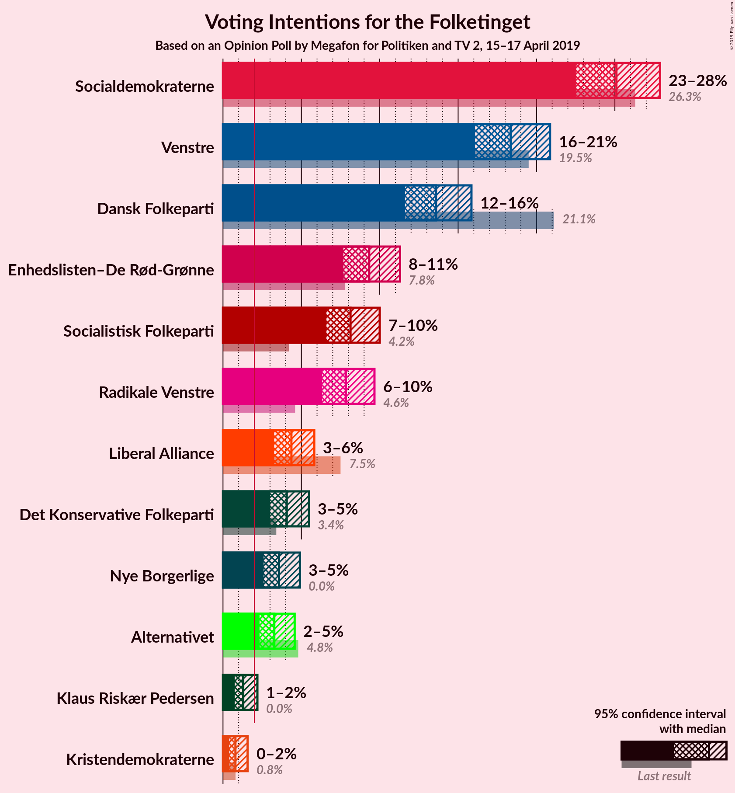

### Confidence Intervals

| Party | Last Result | Poll Result | 80% Confidence Interval | 90% Confidence Interval | 95% Confidence Interval | 99% Confidence Interval |
|:-----:|:-----------:|:-----------:|:-----------------------:|:-----------------------:|:-----------------------:|:-----------------------:|
| Socialdemokraterne | 26.3% | 25.1% | 23.4–26.9% |22.9–27.4% |22.5–27.9% |21.7–28.8% |
| Venstre | 19.5% | 18.4% | 16.9–20.0% |16.4–20.5% |16.1–20.9% |15.4–21.7% |
| Dansk Folkeparti | 21.1% | 13.6% | 12.3–15.1% |11.9–15.5% |11.6–15.9% |11.0–16.6% |
| Enhedslisten–De Rød-Grønne | 7.8% | 9.3% | 8.2–10.6% |7.9–11.0% |7.7–11.3% |7.2–11.9% |
| Socialistisk Folkeparti | 4.2% | 8.1% | 7.1–9.3% |6.8–9.7% |6.6–10.0% |6.1–10.6% |
| Radikale Venstre | 4.6% | 7.8% | 6.8–9.0% |6.6–9.4% |6.3–9.7% |5.9–10.3% |
| Liberal Alliance | 7.5% | 4.4% | 3.6–5.3% |3.4–5.6% |3.3–5.8% |2.9–6.3% |
| Det Konservative Folkeparti | 3.4% | 4.1% | 3.4–5.0% |3.2–5.2% |3.0–5.5% |2.7–5.9% |
| Nye Borgerlige | 0.0% | 3.6% | 2.9–4.5% |2.7–4.7% |2.6–4.9% |2.3–5.4% |
| Alternativet | 4.8% | 3.3% | 2.7–4.1% |2.5–4.4% |2.3–4.6% |2.1–5.0% |
| Klaus Riskær Pedersen | 0.0% | 1.3% | 0.9–1.9% |0.8–2.0% |0.7–2.2% |0.6–2.5% |
| Kristendemokraterne | 0.8% | 0.8% | 0.5–1.3% |0.5–1.4% |0.4–1.6% |0.3–1.8% |

*Note:* The poll result column reflects the actual value used in the calculations. Published results may vary slightly, and in addition be rounded to fewer digits.

## Seats

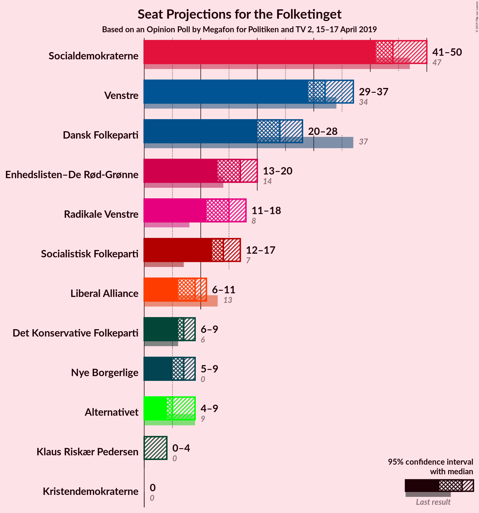

### Confidence Intervals

| Party | Last Result | Median | 80% Confidence Interval | 90% Confidence Interval | 95% Confidence Interval | 99% Confidence Interval |
|:-----:|:-----------:|:------:|:-----------------------:|:-----------------------:|:-----------------------:|:-----------------------:|
| <a href="#socialdemokraterne">Socialdemokraterne</a> | 47 | 44 | 41–47 |41–49 |41–50 |39–51 |
| <a href="#venstre">Venstre</a> | 34 | 32 | 30–37 |30–37 |29–37 |28–39 |
| <a href="#dansk-folkeparti">Dansk Folkeparti</a> | 37 | 24 | 21–28 |21–28 |20–28 |20–30 |
| <a href="#enhedslisten–de-rød-grønne">Enhedslisten–De Rød-Grønne</a> | 14 | 17 | 15–19 |14–19 |13–20 |12–21 |
| <a href="#socialistisk-folkeparti">Socialistisk Folkeparti</a> | 7 | 14 | 12–17 |12–17 |12–17 |11–18 |
| <a href="#radikale-venstre">Radikale Venstre</a> | 8 | 15 | 13–17 |11–18 |11–18 |11–18 |
| <a href="#liberal-alliance">Liberal Alliance</a> | 13 | 9 | 6–9 |6–10 |6–11 |6–11 |
| <a href="#det-konservative-folkeparti">Det Konservative Folkeparti</a> | 6 | 7 | 6–9 |6–9 |6–9 |5–10 |
| <a href="#nye-borgerlige">Nye Borgerlige</a> | 0 | 7 | 5–7 |5–9 |5–9 |5–9 |
| <a href="#alternativet">Alternativet</a> | 9 | 5 | 5–7 |5–7 |4–9 |0–9 |
| <a href="#klaus-riskær-pedersen">Klaus Riskær Pedersen</a> | 0 | 0 | 0 |0 |0–4 |0–4 |
| <a href="#kristendemokraterne">Kristendemokraterne</a> | 0 | 0 | 0 |0 |0 |0 |

### Socialdemokraterne

*For a full overview of the results for this party, see the [Socialdemokraterne](party-socialdemokraterne.html) page.*

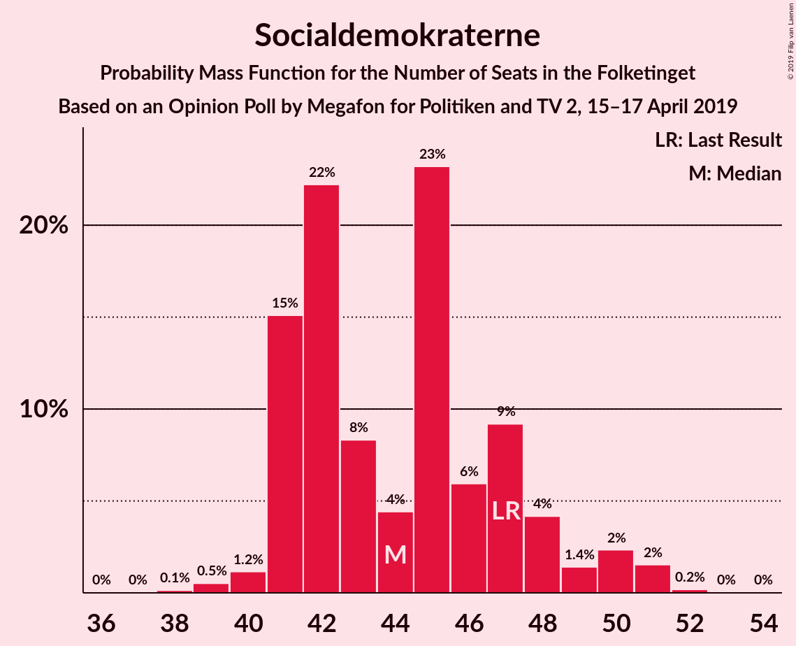

| Number of Seats | Probability | Accumulated | Special Marks |
|:---------------:|:-----------:|:-----------:|:-------------:|
| 37 | 0% | 100% |  |
| 38 | 0.1% | 99.9% |  |
| 39 | 0.5% | 99.8% |  |
| 40 | 1.2% | 99.3% |  |
| 41 | 15% | 98% |  |
| 42 | 22% | 83% |  |
| 43 | 8% | 61% |  |
| 44 | 4% | 52% | Median |
| 45 | 23% | 48% |  |
| 46 | 6% | 25% |  |
| 47 | 9% | 19% | Last Result |
| 48 | 4% | 10% |  |
| 49 | 1.4% | 6% |  |
| 50 | 2% | 4% |  |
| 51 | 2% | 2% |  |
| 52 | 0.2% | 0.3% |  |
| 53 | 0% | 0.1% |  |
| 54 | 0% | 0% |  |

### Venstre

*For a full overview of the results for this party, see the [Venstre](party-venstre.html) page.*

| Number of Seats | Probability | Accumulated | Special Marks |
|:---------------:|:-----------:|:-----------:|:-------------:|
| 26 | 0.2% | 100% |  |
| 27 | 0.2% | 99.8% |  |
| 28 | 1.4% | 99.6% |  |
| 29 | 2% | 98% |  |
| 30 | 16% | 96% |  |
| 31 | 6% | 80% |  |
| 32 | 28% | 74% | Median |
| 33 | 7% | 46% |  |
| 34 | 5% | 39% | Last Result |
| 35 | 22% | 35% |  |
| 36 | 1.1% | 13% |  |
| 37 | 11% | 12% |  |
| 38 | 0.6% | 1.2% |  |
| 39 | 0.3% | 0.6% |  |
| 40 | 0.1% | 0.3% |  |
| 41 | 0.2% | 0.2% |  |
| 42 | 0% | 0% |  |

### Dansk Folkeparti

*For a full overview of the results for this party, see the [Dansk Folkeparti](party-danskfolkeparti.html) page.*

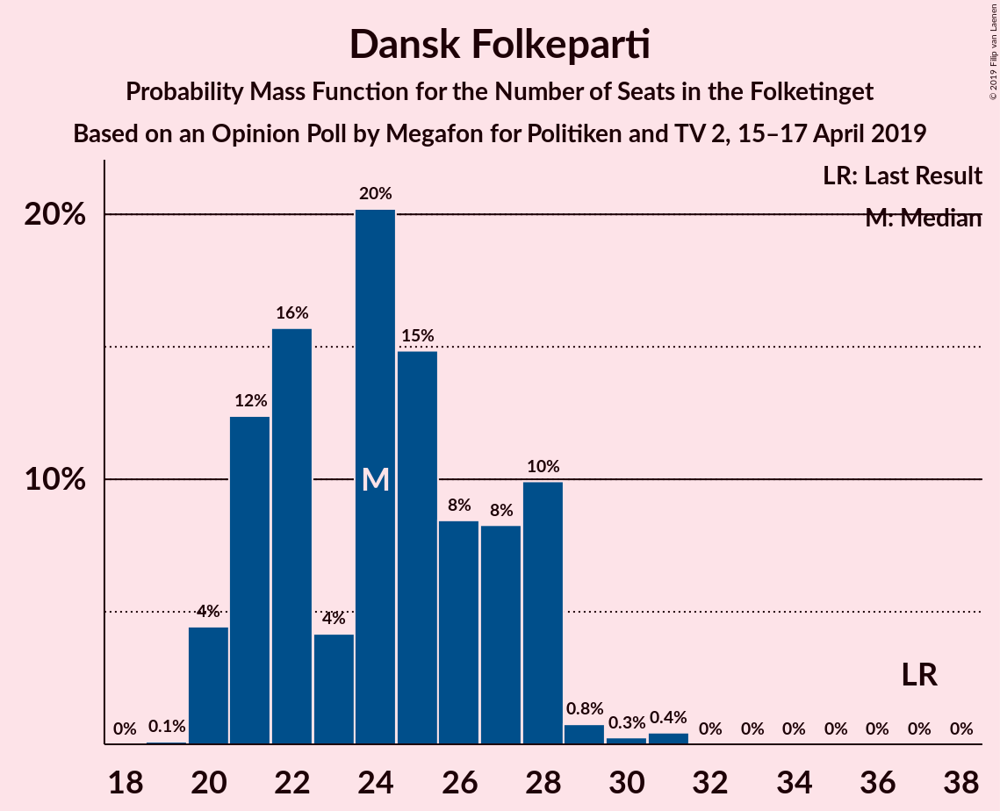

| Number of Seats | Probability | Accumulated | Special Marks |
|:---------------:|:-----------:|:-----------:|:-------------:|
| 19 | 0.1% | 100% |  |
| 20 | 4% | 99.9% |  |
| 21 | 12% | 95% |  |
| 22 | 16% | 83% |  |
| 23 | 4% | 67% |  |
| 24 | 20% | 63% | Median |
| 25 | 15% | 43% |  |
| 26 | 8% | 28% |  |
| 27 | 8% | 20% |  |
| 28 | 10% | 11% |  |
| 29 | 0.8% | 1.5% |  |
| 30 | 0.3% | 0.7% |  |
| 31 | 0.4% | 0.5% |  |
| 32 | 0% | 0% |  |
| 33 | 0% | 0% |  |
| 34 | 0% | 0% |  |
| 35 | 0% | 0% |  |
| 36 | 0% | 0% |  |
| 37 | 0% | 0% | Last Result |

### Enhedslisten–De Rød-Grønne

*For a full overview of the results for this party, see the [Enhedslisten–De Rød-Grønne](party-enhedslisten–derød-grønne.html) page.*

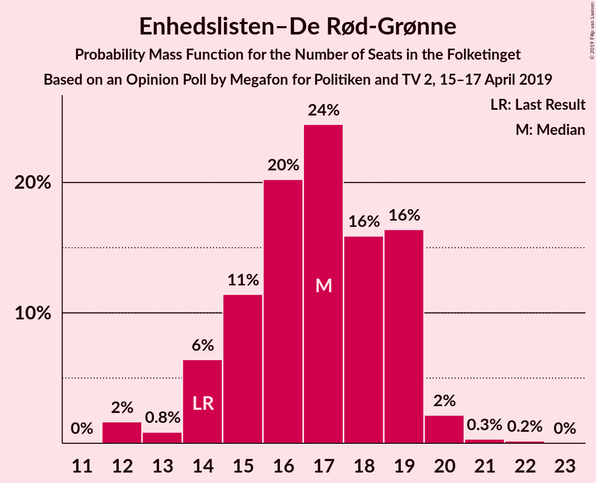

| Number of Seats | Probability | Accumulated | Special Marks |
|:---------------:|:-----------:|:-----------:|:-------------:|
| 12 | 2% | 100% |  |
| 13 | 0.8% | 98% |  |
| 14 | 6% | 97% | Last Result |
| 15 | 11% | 91% |  |
| 16 | 20% | 80% |  |
| 17 | 24% | 59% | Median |
| 18 | 16% | 35% |  |
| 19 | 16% | 19% |  |
| 20 | 2% | 3% |  |
| 21 | 0.3% | 0.5% |  |
| 22 | 0.2% | 0.2% |  |
| 23 | 0% | 0% |  |

### Socialistisk Folkeparti

*For a full overview of the results for this party, see the [Socialistisk Folkeparti](party-socialistiskfolkeparti.html) page.*

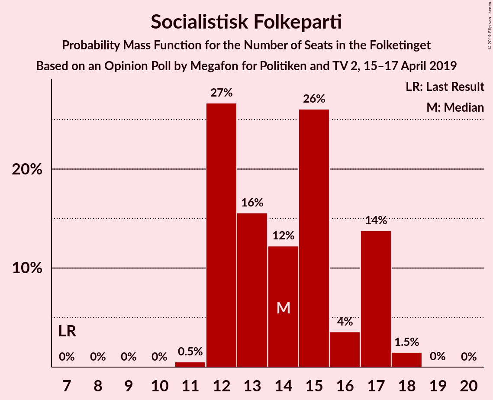

| Number of Seats | Probability | Accumulated | Special Marks |
|:---------------:|:-----------:|:-----------:|:-------------:|
| 7 | 0% | 100% | Last Result |
| 8 | 0% | 100% |  |
| 9 | 0% | 100% |  |
| 10 | 0% | 100% |  |
| 11 | 0.5% | 100% |  |
| 12 | 27% | 99.4% |  |
| 13 | 16% | 73% |  |
| 14 | 12% | 57% | Median |
| 15 | 26% | 45% |  |
| 16 | 4% | 19% |  |
| 17 | 14% | 15% |  |
| 18 | 1.5% | 2% |  |
| 19 | 0% | 0.1% |  |
| 20 | 0% | 0% |  |

### Radikale Venstre

*For a full overview of the results for this party, see the [Radikale Venstre](party-radikalevenstre.html) page.*

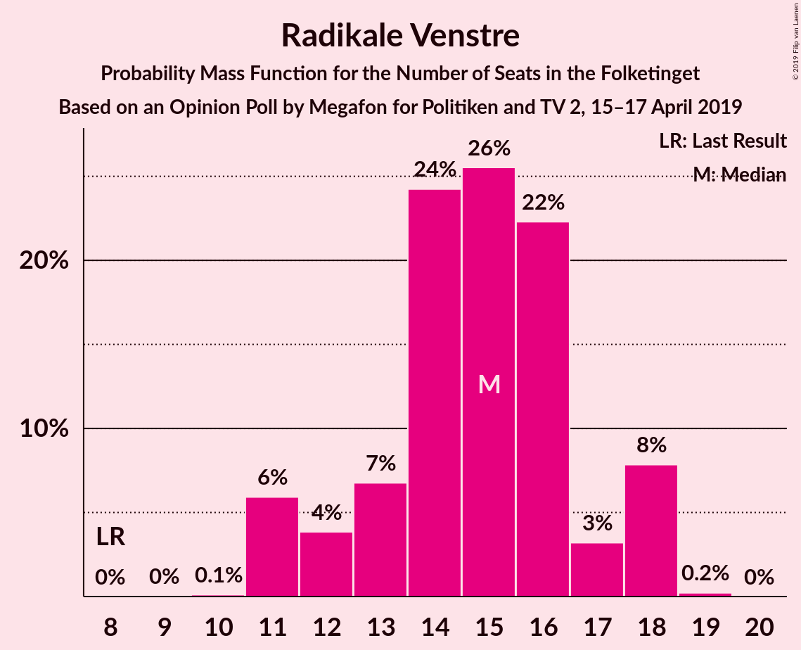

| Number of Seats | Probability | Accumulated | Special Marks |
|:---------------:|:-----------:|:-----------:|:-------------:|
| 8 | 0% | 100% | Last Result |
| 9 | 0% | 100% |  |
| 10 | 0.1% | 100% |  |
| 11 | 6% | 99.9% |  |
| 12 | 4% | 94% |  |
| 13 | 7% | 90% |  |
| 14 | 24% | 83% |  |
| 15 | 26% | 59% | Median |
| 16 | 22% | 34% |  |
| 17 | 3% | 11% |  |
| 18 | 8% | 8% |  |
| 19 | 0.2% | 0.2% |  |
| 20 | 0% | 0% |  |

### Liberal Alliance

*For a full overview of the results for this party, see the [Liberal Alliance](party-liberalalliance.html) page.*

| Number of Seats | Probability | Accumulated | Special Marks |
|:---------------:|:-----------:|:-----------:|:-------------:|
| 5 | 0.3% | 100% |  |
| 6 | 14% | 99.7% |  |
| 7 | 10% | 85% |  |
| 8 | 20% | 76% |  |
| 9 | 49% | 55% | Median |
| 10 | 2% | 6% |  |
| 11 | 4% | 4% |  |
| 12 | 0.2% | 0.2% |  |
| 13 | 0% | 0% | Last Result |

### Det Konservative Folkeparti

*For a full overview of the results for this party, see the [Det Konservative Folkeparti](party-detkonservativefolkeparti.html) page.*

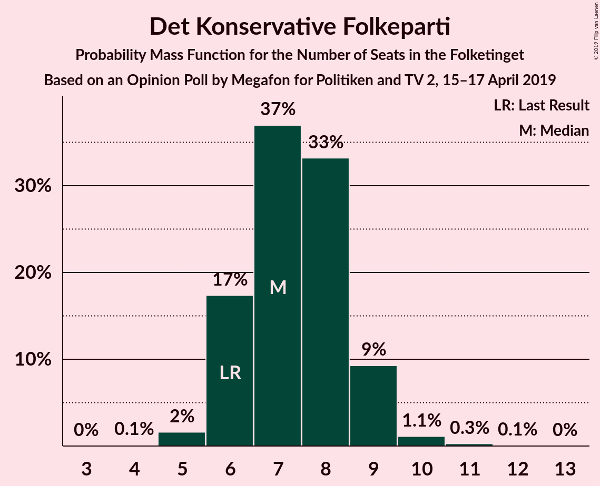

| Number of Seats | Probability | Accumulated | Special Marks |
|:---------------:|:-----------:|:-----------:|:-------------:|
| 4 | 0.1% | 100% |  |
| 5 | 2% | 99.9% |  |
| 6 | 17% | 98% | Last Result |
| 7 | 37% | 81% | Median |
| 8 | 33% | 44% |  |
| 9 | 9% | 11% |  |
| 10 | 1.1% | 1.5% |  |
| 11 | 0.3% | 0.3% |  |
| 12 | 0.1% | 0.1% |  |
| 13 | 0% | 0% |  |

### Nye Borgerlige

*For a full overview of the results for this party, see the [Nye Borgerlige](party-nyeborgerlige.html) page.*

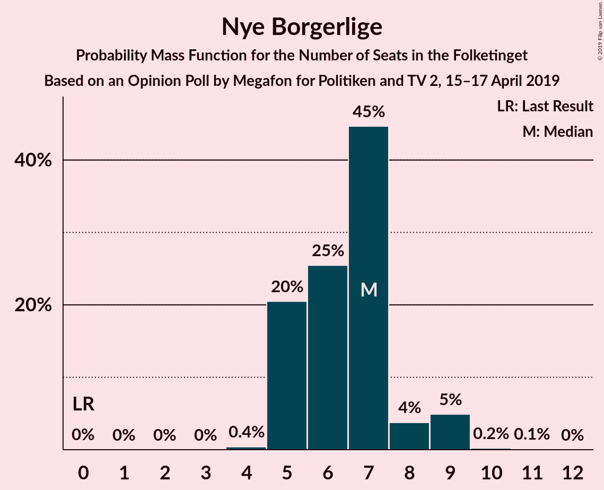

| Number of Seats | Probability | Accumulated | Special Marks |
|:---------------:|:-----------:|:-----------:|:-------------:|
| 0 | 0% | 100% | Last Result |
| 1 | 0% | 100% |  |
| 2 | 0% | 100% |  |
| 3 | 0% | 100% |  |
| 4 | 0.4% | 100% |  |
| 5 | 20% | 99.6% |  |
| 6 | 25% | 79% |  |
| 7 | 45% | 54% | Median |
| 8 | 4% | 9% |  |
| 9 | 5% | 5% |  |
| 10 | 0.2% | 0.3% |  |
| 11 | 0.1% | 0.1% |  |
| 12 | 0% | 0% |  |

### Alternativet

*For a full overview of the results for this party, see the [Alternativet](party-alternativet.html) page.*

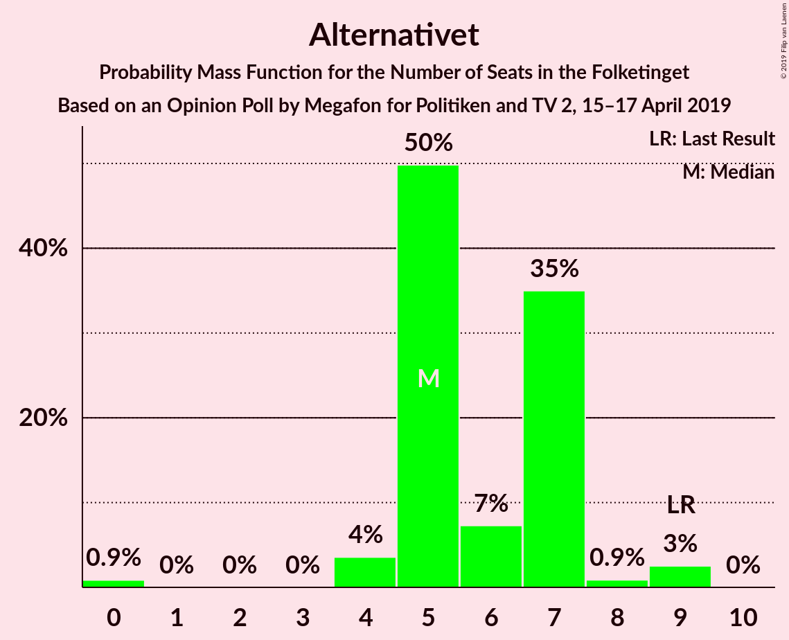

| Number of Seats | Probability | Accumulated | Special Marks |
|:---------------:|:-----------:|:-----------:|:-------------:|
| 0 | 0.9% | 100% |  |
| 1 | 0% | 99.1% |  |
| 2 | 0% | 99.1% |  |
| 3 | 0% | 99.1% |  |
| 4 | 4% | 99.1% |  |
| 5 | 50% | 96% | Median |
| 6 | 7% | 46% |  |
| 7 | 35% | 38% |  |
| 8 | 0.9% | 3% |  |
| 9 | 3% | 3% | Last Result |
| 10 | 0% | 0% |  |

### Klaus Riskær Pedersen

*For a full overview of the results for this party, see the [Klaus Riskær Pedersen](party-klausriskærpedersen.html) page.*

| Number of Seats | Probability | Accumulated | Special Marks |
|:---------------:|:-----------:|:-----------:|:-------------:|
| 0 | 95% | 100% | Last Result, Median |
| 1 | 0% | 5% |  |
| 2 | 0% | 5% |  |
| 3 | 0.3% | 5% |  |
| 4 | 4% | 4% |  |
| 5 | 0.3% | 0.3% |  |
| 6 | 0% | 0% |  |

### Kristendemokraterne

*For a full overview of the results for this party, see the [Kristendemokraterne](party-kristendemokraterne.html) page.*

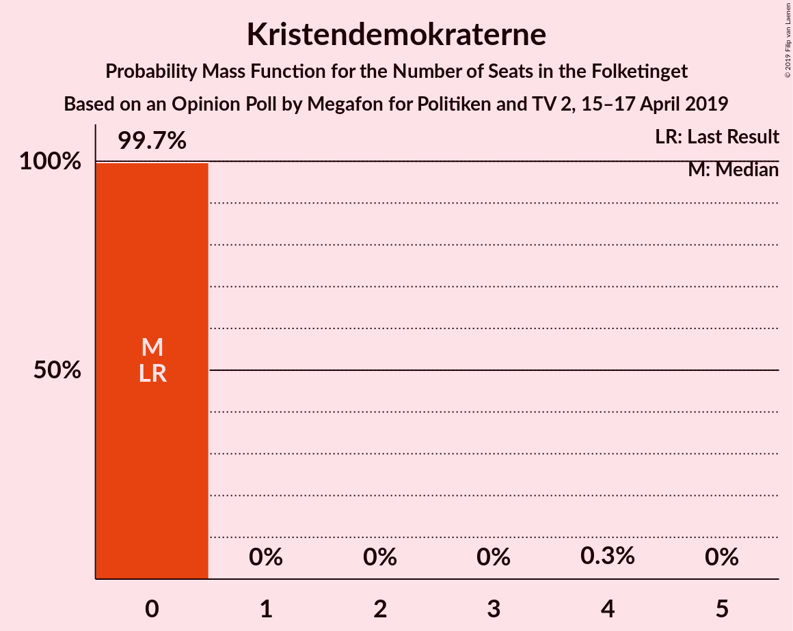

| Number of Seats | Probability | Accumulated | Special Marks |
|:---------------:|:-----------:|:-----------:|:-------------:|
| 0 | 99.7% | 100% | Last Result, Median |
| 1 | 0% | 0.3% |  |
| 2 | 0% | 0.3% |  |
| 3 | 0% | 0.3% |  |
| 4 | 0.3% | 0.3% |  |
| 5 | 0% | 0% |  |

## Coalitions

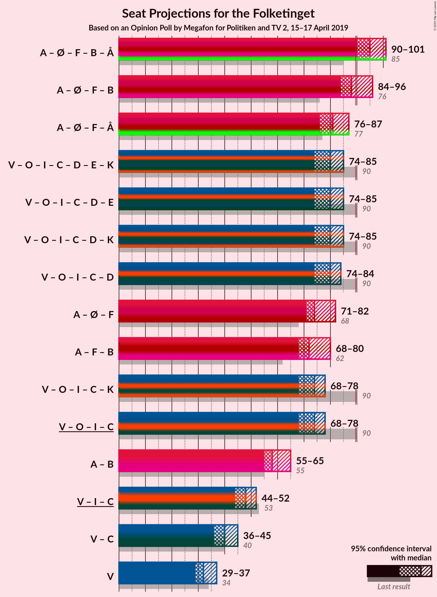

### Confidence Intervals

| Coalition | Last Result | Median | Majority? | 80% Confidence Interval | 90% Confidence Interval | 95% Confidence Interval | 99% Confidence Interval |
|:---------:|:-----------:|:------:|:---------:|:-----------------------:|:-----------------------:|:-----------------------:|:-----------------------:|
| Socialdemokraterne – Enhedslisten–De Rød-Grønne – Socialistisk Folkeparti – Radikale Venstre – Alternativet | 85 | 95 | 98% | 92–100 | 92–101 | 90–101 | 88–101 |
| Socialdemokraterne – Enhedslisten–De Rød-Grønne – Socialistisk Folkeparti – Radikale Venstre | 76 | 88 | 41% | 87–95 | 86–96 | 84–96 | 82–96 |
| Socialdemokraterne – Enhedslisten–De Rød-Grønne – Socialistisk Folkeparti – Alternativet | 77 | 81 | 0.2% | 77–84 | 77–86 | 76–87 | 74–88 |
| Venstre – Dansk Folkeparti – Liberal Alliance – Det Konservative Folkeparti – Nye Borgerlige – Klaus Riskær Pedersen – Kristendemokraterne | 90 | 80 | 0% | 75–83 | 74–83 | 74–85 | 74–87 |
| Venstre – Dansk Folkeparti – Liberal Alliance – Det Konservative Folkeparti – Nye Borgerlige – Klaus Riskær Pedersen | 90 | 80 | 0% | 75–83 | 74–83 | 74–85 | 73–87 |
| Venstre – Dansk Folkeparti – Liberal Alliance – Det Konservative Folkeparti – Nye Borgerlige – Kristendemokraterne | 90 | 80 | 0% | 75–83 | 74–83 | 74–85 | 72–87 |
| Venstre – Dansk Folkeparti – Liberal Alliance – Det Konservative Folkeparti – Nye Borgerlige | 90 | 80 | 0% | 74–83 | 74–83 | 74–84 | 72–87 |
| Socialdemokraterne – Enhedslisten–De Rød-Grønne – Socialistisk Folkeparti | 68 | 74 | 0% | 72–79 | 71–80 | 71–82 | 68–83 |
| Socialdemokraterne – Socialistisk Folkeparti – Radikale Venstre | 62 | 72 | 0% | 68–78 | 68–80 | 68–80 | 66–80 |
| Venstre – Dansk Folkeparti – Liberal Alliance – Det Konservative Folkeparti – Kristendemokraterne | 90 | 74 | 0% | 69–76 | 68–76 | 68–78 | 66–80 |
| Venstre – Dansk Folkeparti – Liberal Alliance – Det Konservative Folkeparti | 90 | 74 | 0% | 69–76 | 68–76 | 68–78 | 66–80 |
| Socialdemokraterne – Radikale Venstre | 55 | 58 | 0% | 56–62 | 56–65 | 55–65 | 52–65 |
| Venstre – Liberal Alliance – Det Konservative Folkeparti | 53 | 48 | 0% | 46–52 | 45–52 | 44–52 | 42–54 |
| Venstre – Det Konservative Folkeparti | 40 | 40 | 0% | 37–43 | 37–44 | 36–45 | 34–46 |
| Venstre | 34 | 32 | 0% | 30–37 | 30–37 | 29–37 | 28–39 |

### Socialdemokraterne – Enhedslisten–De Rød-Grønne – Socialistisk Folkeparti – Radikale Venstre – Alternativet

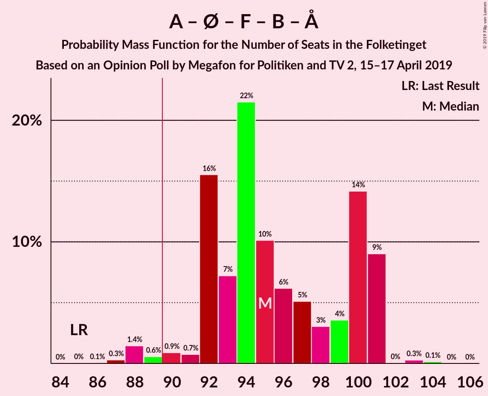

| Number of Seats | Probability | Accumulated | Special Marks |
|:---------------:|:-----------:|:-----------:|:-------------:|
| 85 | 0% | 100% | Last Result |
| 86 | 0.1% | 100% |  |
| 87 | 0.3% | 99.9% |  |
| 88 | 1.4% | 99.6% |  |
| 89 | 0.6% | 98% |  |
| 90 | 0.9% | 98% | Majority |
| 91 | 0.7% | 97% |  |
| 92 | 16% | 96% |  |
| 93 | 7% | 80% |  |
| 94 | 22% | 73% |  |
| 95 | 10% | 52% | Median |
| 96 | 6% | 42% |  |
| 97 | 5% | 35% |  |
| 98 | 3% | 30% |  |
| 99 | 4% | 27% |  |
| 100 | 14% | 24% |  |
| 101 | 9% | 10% |  |
| 102 | 0% | 0.5% |  |
| 103 | 0.3% | 0.5% |  |
| 104 | 0.1% | 0.2% |  |
| 105 | 0% | 0% |  |

### Socialdemokraterne – Enhedslisten–De Rød-Grønne – Socialistisk Folkeparti – Radikale Venstre

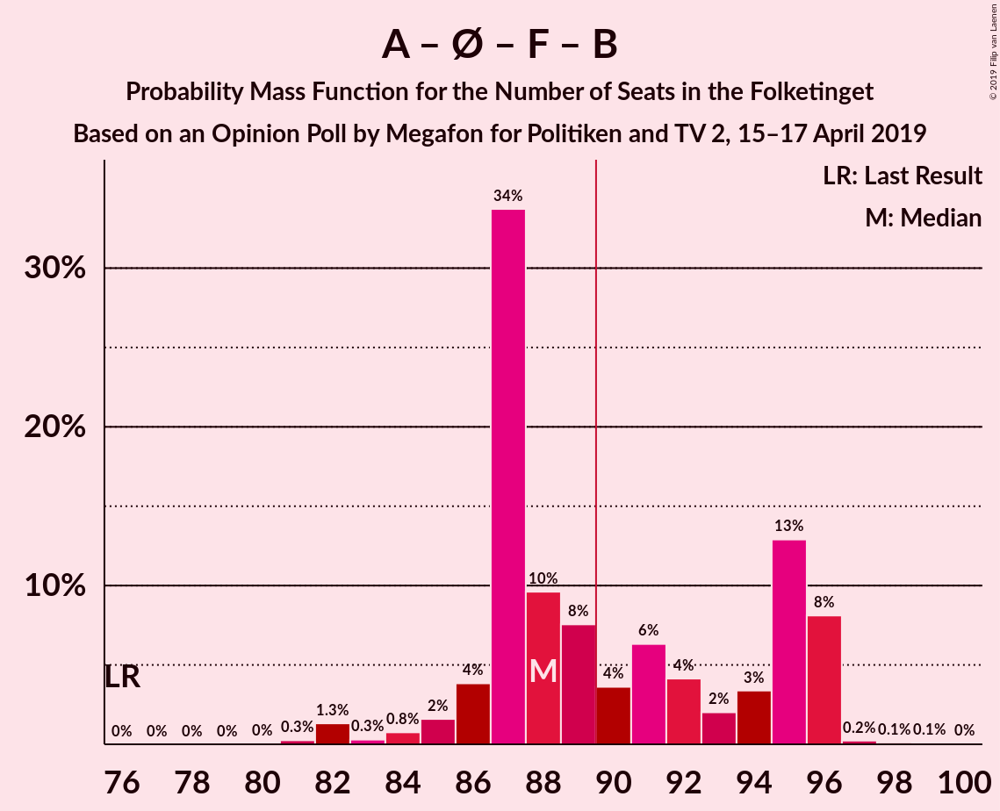

| Number of Seats | Probability | Accumulated | Special Marks |
|:---------------:|:-----------:|:-----------:|:-------------:|
| 76 | 0% | 100% | Last Result |
| 77 | 0% | 100% |  |
| 78 | 0% | 100% |  |
| 79 | 0% | 100% |  |
| 80 | 0% | 100% |  |
| 81 | 0.3% | 100% |  |
| 82 | 1.3% | 99.7% |  |
| 83 | 0.3% | 98% |  |
| 84 | 0.8% | 98% |  |
| 85 | 2% | 97% |  |
| 86 | 4% | 96% |  |
| 87 | 34% | 92% |  |
| 88 | 10% | 58% |  |
| 89 | 8% | 49% |  |
| 90 | 4% | 41% | Median, Majority |
| 91 | 6% | 37% |  |
| 92 | 4% | 31% |  |
| 93 | 2% | 27% |  |
| 94 | 3% | 25% |  |
| 95 | 13% | 21% |  |
| 96 | 8% | 9% |  |
| 97 | 0.2% | 0.5% |  |
| 98 | 0.1% | 0.2% |  |
| 99 | 0.1% | 0.1% |  |
| 100 | 0% | 0% |  |

### Socialdemokraterne – Enhedslisten–De Rød-Grønne – Socialistisk Folkeparti – Alternativet

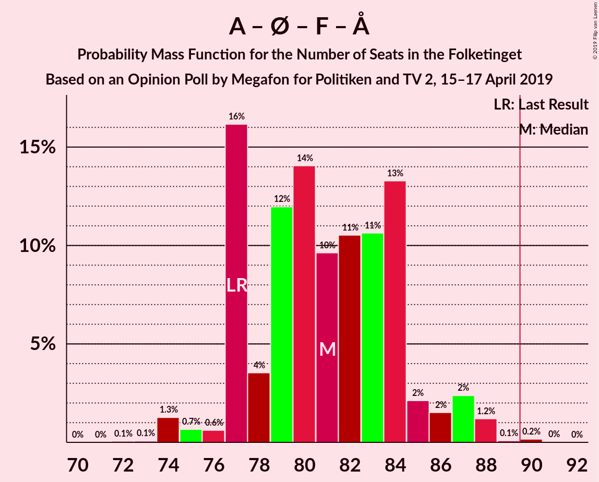

| Number of Seats | Probability | Accumulated | Special Marks |
|:---------------:|:-----------:|:-----------:|:-------------:|
| 72 | 0.1% | 100% |  |
| 73 | 0.1% | 99.9% |  |
| 74 | 1.3% | 99.9% |  |
| 75 | 0.7% | 98.6% |  |
| 76 | 0.6% | 98% |  |
| 77 | 16% | 97% | Last Result |
| 78 | 4% | 81% |  |
| 79 | 12% | 78% |  |
| 80 | 14% | 66% | Median |
| 81 | 10% | 52% |  |
| 82 | 11% | 42% |  |
| 83 | 11% | 31% |  |
| 84 | 13% | 21% |  |
| 85 | 2% | 8% |  |
| 86 | 2% | 5% |  |
| 87 | 2% | 4% |  |
| 88 | 1.2% | 2% |  |
| 89 | 0.1% | 0.3% |  |
| 90 | 0.2% | 0.2% | Majority |
| 91 | 0% | 0% |  |

### Venstre – Dansk Folkeparti – Liberal Alliance – Det Konservative Folkeparti – Nye Borgerlige – Klaus Riskær Pedersen – Kristendemokraterne

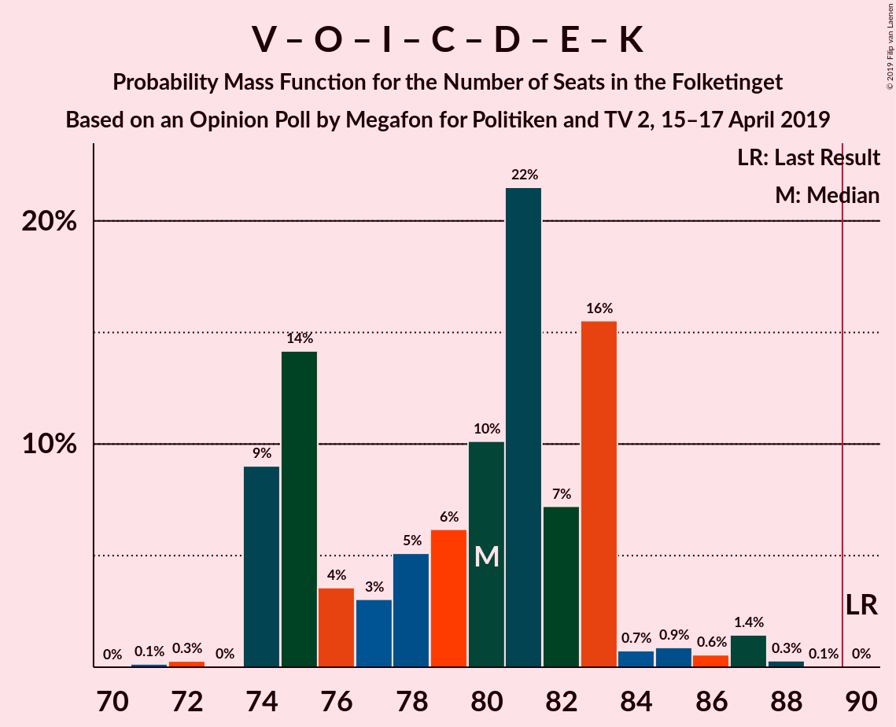

| Number of Seats | Probability | Accumulated | Special Marks |
|:---------------:|:-----------:|:-----------:|:-------------:|
| 71 | 0.1% | 100% |  |
| 72 | 0.3% | 99.8% |  |
| 73 | 0% | 99.5% |  |
| 74 | 9% | 99.5% |  |
| 75 | 14% | 90% |  |
| 76 | 4% | 76% |  |
| 77 | 3% | 73% |  |
| 78 | 5% | 70% |  |
| 79 | 6% | 65% | Median |
| 80 | 10% | 58% |  |
| 81 | 22% | 48% |  |
| 82 | 7% | 27% |  |
| 83 | 16% | 20% |  |
| 84 | 0.7% | 4% |  |
| 85 | 0.9% | 3% |  |
| 86 | 0.6% | 2% |  |
| 87 | 1.4% | 2% |  |
| 88 | 0.3% | 0.4% |  |
| 89 | 0.1% | 0.1% |  |
| 90 | 0% | 0% | Last Result, Majority |

### Venstre – Dansk Folkeparti – Liberal Alliance – Det Konservative Folkeparti – Nye Borgerlige – Klaus Riskær Pedersen

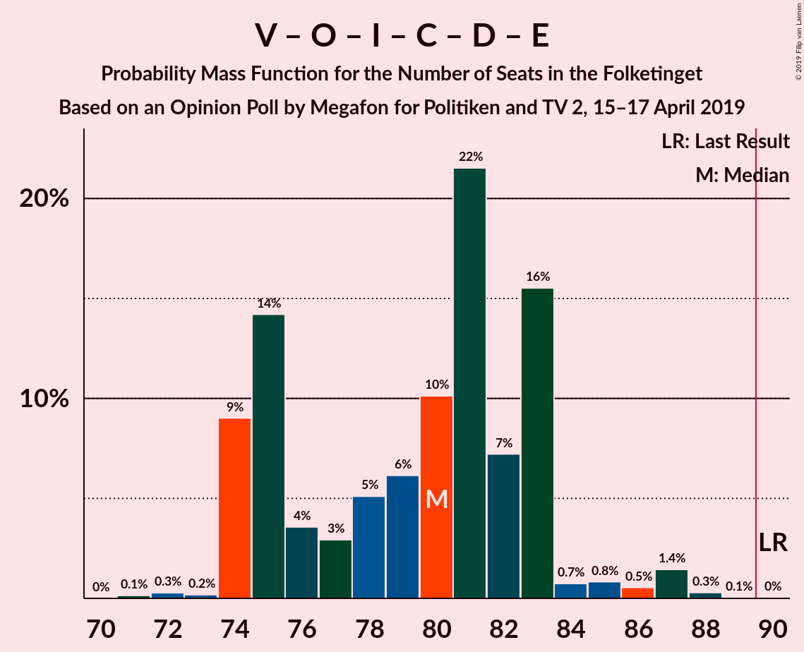

| Number of Seats | Probability | Accumulated | Special Marks |
|:---------------:|:-----------:|:-----------:|:-------------:|
| 71 | 0.1% | 100% |  |
| 72 | 0.3% | 99.8% |  |
| 73 | 0.2% | 99.5% |  |
| 74 | 9% | 99.4% |  |
| 75 | 14% | 90% |  |
| 76 | 4% | 76% |  |
| 77 | 3% | 73% |  |
| 78 | 5% | 70% |  |
| 79 | 6% | 65% | Median |
| 80 | 10% | 58% |  |
| 81 | 22% | 48% |  |
| 82 | 7% | 27% |  |
| 83 | 16% | 19% |  |
| 84 | 0.7% | 4% |  |
| 85 | 0.8% | 3% |  |
| 86 | 0.5% | 2% |  |
| 87 | 1.4% | 2% |  |
| 88 | 0.3% | 0.4% |  |
| 89 | 0.1% | 0.1% |  |
| 90 | 0% | 0% | Last Result, Majority |

### Venstre – Dansk Folkeparti – Liberal Alliance – Det Konservative Folkeparti – Nye Borgerlige – Kristendemokraterne

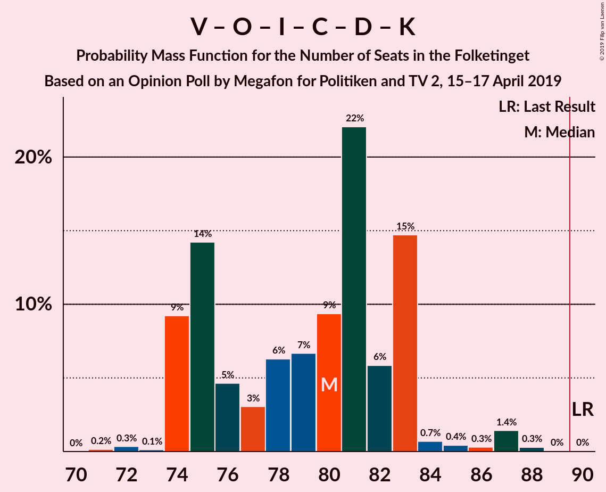

| Number of Seats | Probability | Accumulated | Special Marks |
|:---------------:|:-----------:|:-----------:|:-------------:|
| 71 | 0.2% | 100% |  |
| 72 | 0.3% | 99.8% |  |
| 73 | 0.1% | 99.5% |  |
| 74 | 9% | 99.3% |  |
| 75 | 14% | 90% |  |
| 76 | 5% | 76% |  |
| 77 | 3% | 71% |  |
| 78 | 6% | 68% |  |
| 79 | 7% | 62% | Median |
| 80 | 9% | 55% |  |
| 81 | 22% | 46% |  |
| 82 | 6% | 24% |  |
| 83 | 15% | 18% |  |
| 84 | 0.7% | 3% |  |
| 85 | 0.4% | 3% |  |
| 86 | 0.3% | 2% |  |
| 87 | 1.4% | 2% |  |
| 88 | 0.3% | 0.4% |  |
| 89 | 0% | 0.1% |  |
| 90 | 0% | 0% | Last Result, Majority |

### Venstre – Dansk Folkeparti – Liberal Alliance – Det Konservative Folkeparti – Nye Borgerlige

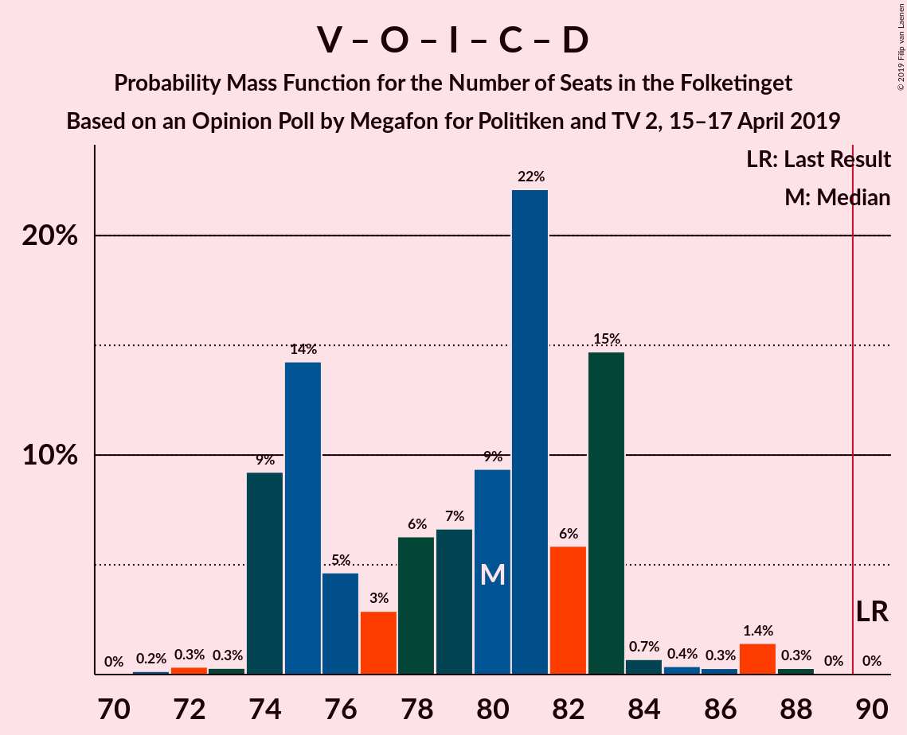

| Number of Seats | Probability | Accumulated | Special Marks |
|:---------------:|:-----------:|:-----------:|:-------------:|
| 71 | 0.2% | 100% |  |
| 72 | 0.3% | 99.8% |  |
| 73 | 0.3% | 99.5% |  |
| 74 | 9% | 99.2% |  |
| 75 | 14% | 90% |  |
| 76 | 5% | 76% |  |
| 77 | 3% | 71% |  |
| 78 | 6% | 68% |  |
| 79 | 7% | 62% | Median |
| 80 | 9% | 55% |  |
| 81 | 22% | 46% |  |
| 82 | 6% | 24% |  |
| 83 | 15% | 18% |  |
| 84 | 0.7% | 3% |  |
| 85 | 0.4% | 2% |  |
| 86 | 0.3% | 2% |  |
| 87 | 1.4% | 2% |  |
| 88 | 0.3% | 0.4% |  |
| 89 | 0% | 0.1% |  |
| 90 | 0% | 0% | Last Result, Majority |

### Socialdemokraterne – Enhedslisten–De Rød-Grønne – Socialistisk Folkeparti

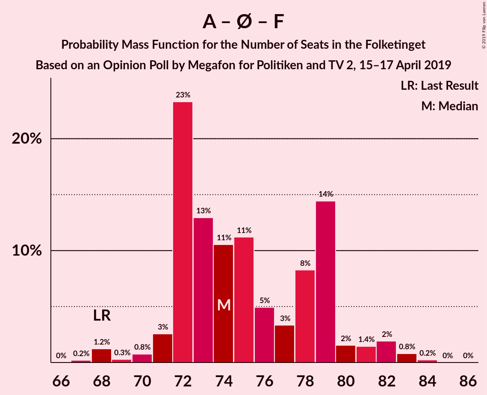

| Number of Seats | Probability | Accumulated | Special Marks |
|:---------------:|:-----------:|:-----------:|:-------------:|
| 67 | 0.2% | 100% |  |
| 68 | 1.2% | 99.8% | Last Result |
| 69 | 0.3% | 98.5% |  |
| 70 | 0.8% | 98% |  |
| 71 | 3% | 98% |  |
| 72 | 23% | 95% |  |
| 73 | 13% | 72% |  |
| 74 | 11% | 59% |  |
| 75 | 11% | 48% | Median |
| 76 | 5% | 37% |  |
| 77 | 3% | 32% |  |
| 78 | 8% | 29% |  |
| 79 | 14% | 20% |  |
| 80 | 2% | 6% |  |
| 81 | 1.4% | 4% |  |
| 82 | 2% | 3% |  |
| 83 | 0.8% | 1.1% |  |
| 84 | 0.2% | 0.3% |  |
| 85 | 0% | 0% |  |

### Socialdemokraterne – Socialistisk Folkeparti – Radikale Venstre

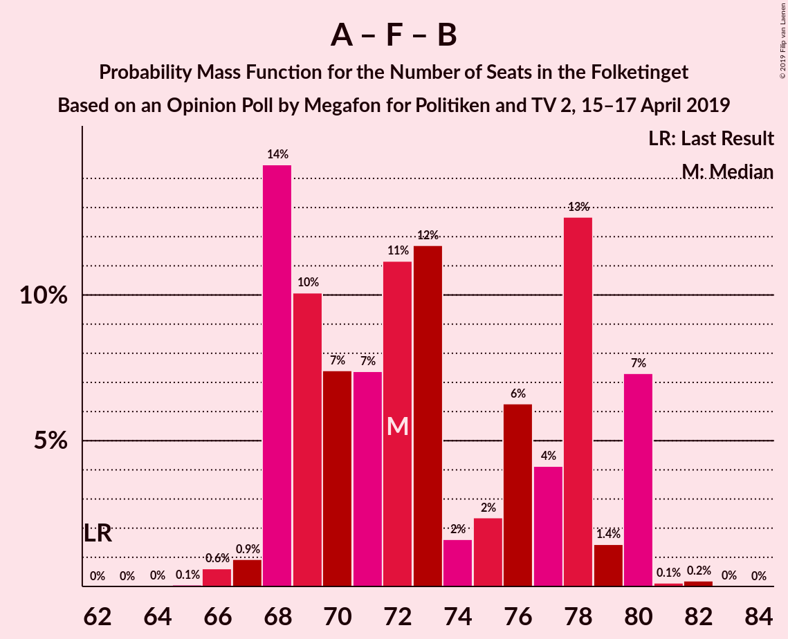

| Number of Seats | Probability | Accumulated | Special Marks |
|:---------------:|:-----------:|:-----------:|:-------------:|
| 62 | 0% | 100% | Last Result |
| 63 | 0% | 100% |  |
| 64 | 0% | 100% |  |
| 65 | 0.1% | 100% |  |
| 66 | 0.6% | 99.9% |  |
| 67 | 0.9% | 99.3% |  |
| 68 | 14% | 98% |  |
| 69 | 10% | 84% |  |
| 70 | 7% | 74% |  |
| 71 | 7% | 66% |  |
| 72 | 11% | 59% |  |
| 73 | 12% | 48% | Median |
| 74 | 2% | 36% |  |
| 75 | 2% | 35% |  |
| 76 | 6% | 32% |  |
| 77 | 4% | 26% |  |
| 78 | 13% | 22% |  |
| 79 | 1.4% | 9% |  |
| 80 | 7% | 8% |  |
| 81 | 0.1% | 0.3% |  |
| 82 | 0.2% | 0.2% |  |
| 83 | 0% | 0% |  |

### Venstre – Dansk Folkeparti – Liberal Alliance – Det Konservative Folkeparti – Kristendemokraterne

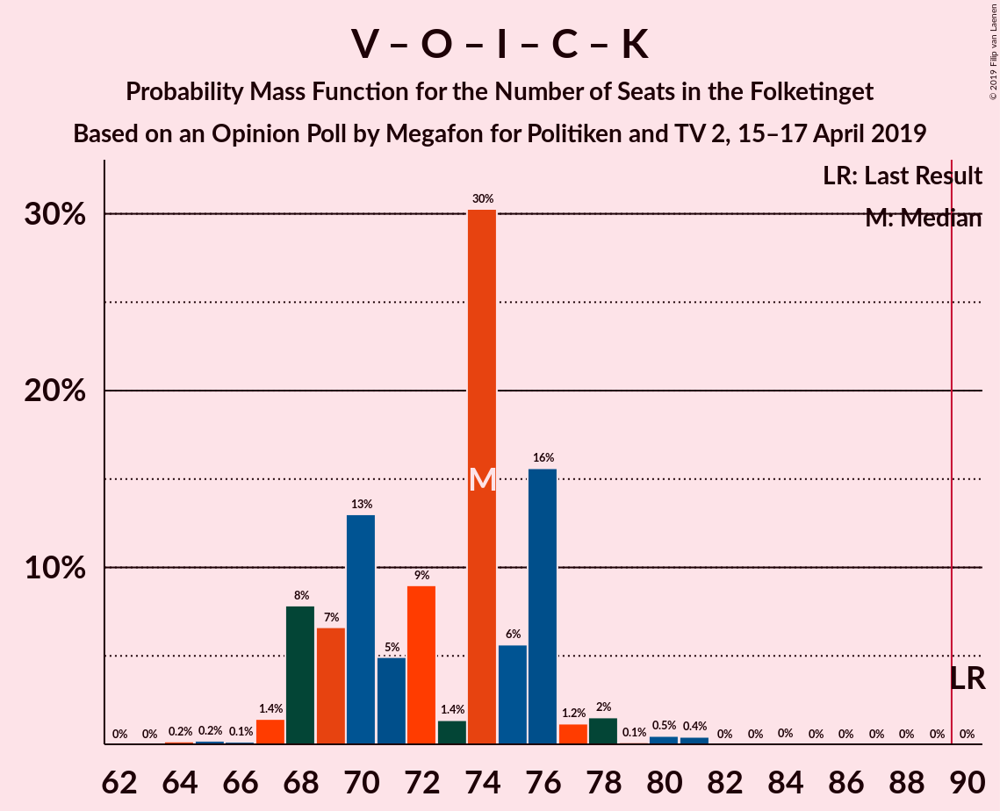

| Number of Seats | Probability | Accumulated | Special Marks |
|:---------------:|:-----------:|:-----------:|:-------------:|
| 64 | 0.2% | 100% |  |
| 65 | 0.2% | 99.8% |  |
| 66 | 0.1% | 99.6% |  |
| 67 | 1.4% | 99.5% |  |
| 68 | 8% | 98% |  |
| 69 | 7% | 90% |  |
| 70 | 13% | 84% |  |
| 71 | 5% | 71% |  |
| 72 | 9% | 66% | Median |
| 73 | 1.4% | 57% |  |
| 74 | 30% | 55% |  |
| 75 | 6% | 25% |  |
| 76 | 16% | 19% |  |
| 77 | 1.2% | 4% |  |
| 78 | 2% | 3% |  |
| 79 | 0.1% | 1.1% |  |
| 80 | 0.5% | 0.9% |  |
| 81 | 0.4% | 0.5% |  |
| 82 | 0% | 0.1% |  |
| 83 | 0% | 0% |  |
| 84 | 0% | 0% |  |
| 85 | 0% | 0% |  |
| 86 | 0% | 0% |  |
| 87 | 0% | 0% |  |
| 88 | 0% | 0% |  |
| 89 | 0% | 0% |  |
| 90 | 0% | 0% | Last Result, Majority |

### Venstre – Dansk Folkeparti – Liberal Alliance – Det Konservative Folkeparti

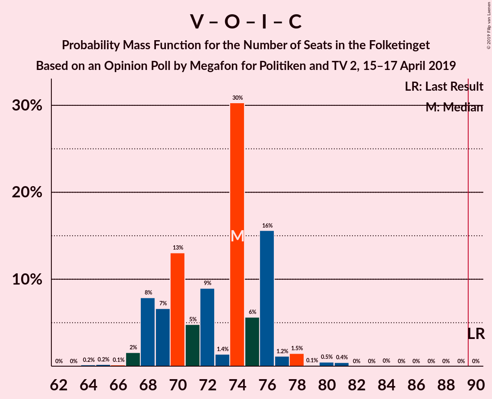

| Number of Seats | Probability | Accumulated | Special Marks |
|:---------------:|:-----------:|:-----------:|:-------------:|
| 64 | 0.2% | 100% |  |
| 65 | 0.2% | 99.8% |  |
| 66 | 0.1% | 99.6% |  |
| 67 | 2% | 99.5% |  |
| 68 | 8% | 98% |  |
| 69 | 7% | 90% |  |
| 70 | 13% | 83% |  |
| 71 | 5% | 70% |  |
| 72 | 9% | 66% | Median |
| 73 | 1.4% | 57% |  |
| 74 | 30% | 55% |  |
| 75 | 6% | 25% |  |
| 76 | 16% | 19% |  |
| 77 | 1.2% | 4% |  |
| 78 | 1.5% | 3% |  |
| 79 | 0.1% | 1.1% |  |
| 80 | 0.5% | 0.9% |  |
| 81 | 0.4% | 0.5% |  |
| 82 | 0% | 0.1% |  |
| 83 | 0% | 0% |  |
| 84 | 0% | 0% |  |
| 85 | 0% | 0% |  |
| 86 | 0% | 0% |  |
| 87 | 0% | 0% |  |
| 88 | 0% | 0% |  |
| 89 | 0% | 0% |  |
| 90 | 0% | 0% | Last Result, Majority |

### Socialdemokraterne – Radikale Venstre

| Number of Seats | Probability | Accumulated | Special Marks |
|:---------------:|:-----------:|:-----------:|:-------------:|
| 51 | 0.1% | 100% |  |
| 52 | 1.0% | 99.9% |  |
| 53 | 0.2% | 98.9% |  |
| 54 | 0.4% | 98.7% |  |
| 55 | 2% | 98% | Last Result |
| 56 | 22% | 97% |  |
| 57 | 16% | 74% |  |
| 58 | 9% | 59% |  |
| 59 | 12% | 50% | Median |
| 60 | 5% | 38% |  |
| 61 | 17% | 33% |  |
| 62 | 7% | 15% |  |
| 63 | 0.7% | 9% |  |
| 64 | 0.4% | 8% |  |
| 65 | 8% | 8% |  |
| 66 | 0.1% | 0.1% |  |
| 67 | 0% | 0% |  |

### Venstre – Liberal Alliance – Det Konservative Folkeparti

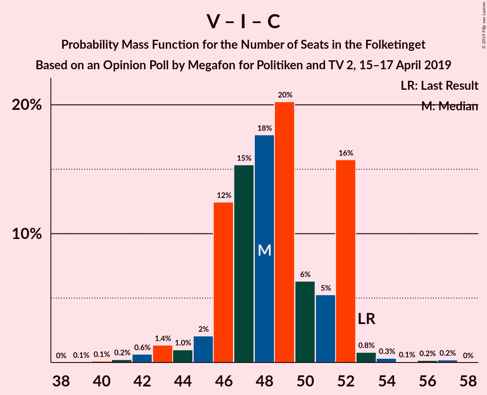

| Number of Seats | Probability | Accumulated | Special Marks |
|:---------------:|:-----------:|:-----------:|:-------------:|
| 39 | 0.1% | 100% |  |
| 40 | 0.1% | 99.9% |  |
| 41 | 0.2% | 99.8% |  |
| 42 | 0.6% | 99.6% |  |
| 43 | 1.4% | 99.0% |  |
| 44 | 1.0% | 98% |  |
| 45 | 2% | 97% |  |
| 46 | 12% | 95% |  |
| 47 | 15% | 82% |  |
| 48 | 18% | 67% | Median |
| 49 | 20% | 49% |  |
| 50 | 6% | 29% |  |
| 51 | 5% | 23% |  |
| 52 | 16% | 17% |  |
| 53 | 0.8% | 2% | Last Result |
| 54 | 0.3% | 0.8% |  |
| 55 | 0.1% | 0.4% |  |
| 56 | 0.2% | 0.4% |  |
| 57 | 0.2% | 0.2% |  |
| 58 | 0% | 0% |  |

### Venstre – Det Konservative Folkeparti

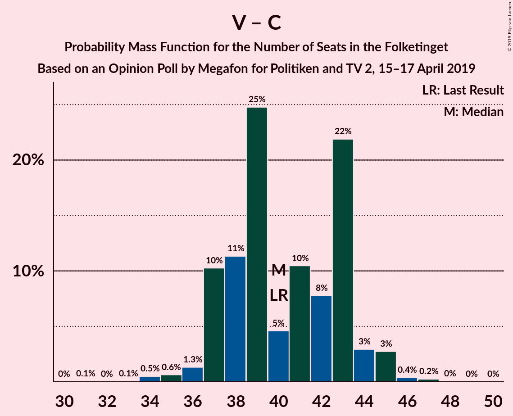

| Number of Seats | Probability | Accumulated | Special Marks |
|:---------------:|:-----------:|:-----------:|:-------------:|
| 31 | 0.1% | 100% |  |
| 32 | 0% | 99.9% |  |
| 33 | 0.1% | 99.9% |  |
| 34 | 0.5% | 99.9% |  |
| 35 | 0.6% | 99.4% |  |
| 36 | 1.3% | 98.8% |  |
| 37 | 10% | 97% |  |
| 38 | 11% | 87% |  |
| 39 | 25% | 76% | Median |
| 40 | 5% | 51% | Last Result |
| 41 | 10% | 46% |  |
| 42 | 8% | 36% |  |
| 43 | 22% | 28% |  |
| 44 | 3% | 6% |  |
| 45 | 3% | 3% |  |
| 46 | 0.4% | 0.7% |  |
| 47 | 0.2% | 0.3% |  |
| 48 | 0% | 0.1% |  |
| 49 | 0% | 0% |  |

### Venstre

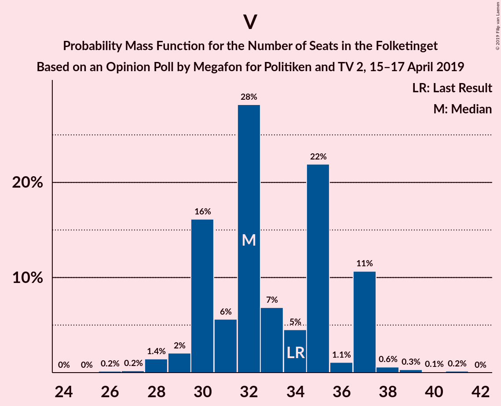

| Number of Seats | Probability | Accumulated | Special Marks |
|:---------------:|:-----------:|:-----------:|:-------------:|
| 26 | 0.2% | 100% |  |
| 27 | 0.2% | 99.8% |  |
| 28 | 1.4% | 99.6% |  |
| 29 | 2% | 98% |  |
| 30 | 16% | 96% |  |
| 31 | 6% | 80% |  |
| 32 | 28% | 74% | Median |
| 33 | 7% | 46% |  |
| 34 | 5% | 39% | Last Result |
| 35 | 22% | 35% |  |
| 36 | 1.1% | 13% |  |
| 37 | 11% | 12% |  |
| 38 | 0.6% | 1.2% |  |
| 39 | 0.3% | 0.6% |  |
| 40 | 0.1% | 0.3% |  |
| 41 | 0.2% | 0.2% |  |
| 42 | 0% | 0% |  |

## Technical Information

### Opinion Poll

+ **Polling firm:** Megafon
+ **Commissioner(s):** Politiken and TV 2
+ **Fieldwork period:** 15–17 April 2019

### Calculations

+ **Sample size:** 1008
+ **Simulations done:** 1,048,576
+ **Error estimate:** 2.88%

