# Opinion Poll by Voxmeter for Ritzau, 15–21 April 2019

<a href="#voting-intentions">Voting Intentions</a> | <a href="#seats">Seats</a> | <a href="#coalitions">Coalitions</a> | <a href="#technical-information">Technical Information</a>

## Voting Intentions

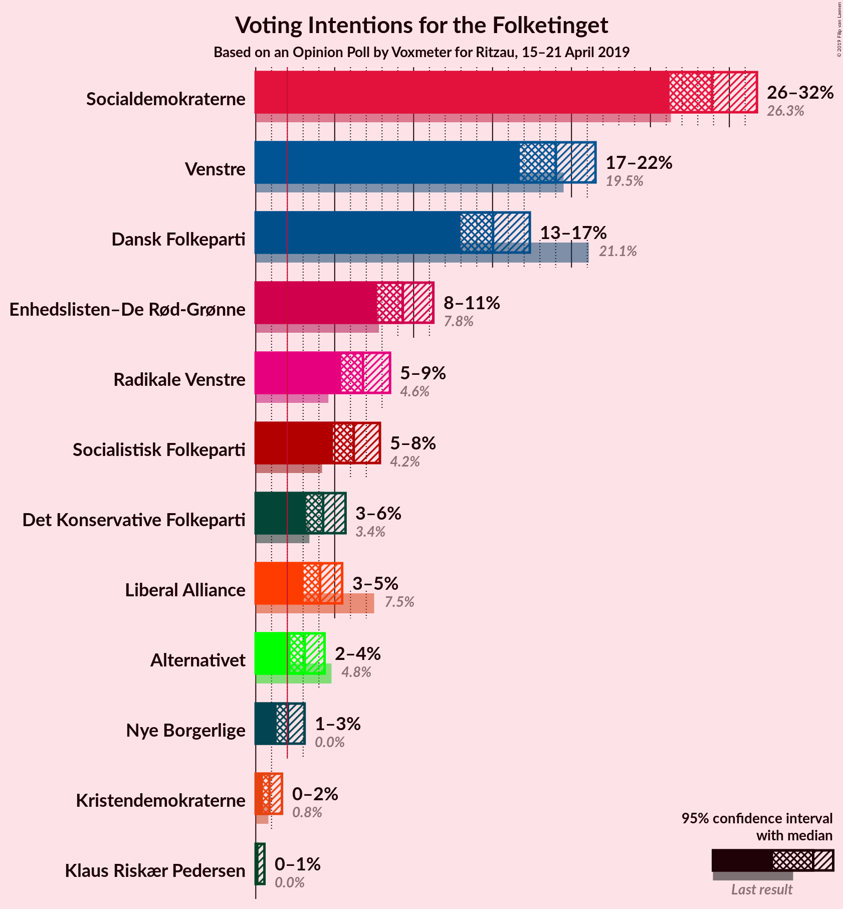

### Confidence Intervals

| Party | Last Result | Poll Result | 80% Confidence Interval | 90% Confidence Interval | 95% Confidence Interval | 99% Confidence Interval |
|:-----:|:-----------:|:-----------:|:-----------------------:|:-----------------------:|:-----------------------:|:-----------------------:|
| Socialdemokraterne | 26.3% | 28.9% | 27.1–30.8% |26.6–31.3% |26.2–31.7% |25.4–32.7% |
| Venstre | 19.5% | 19.0% | 17.5–20.7% |17.1–21.1% |16.7–21.5% |16.0–22.3% |
| Dansk Folkeparti | 21.1% | 15.0% | 13.7–16.6% |13.3–17.0% |13.0–17.4% |12.4–18.1% |
| Enhedslisten–De Rød-Grønne | 7.8% | 9.3% | 8.2–10.6% |7.9–10.9% |7.7–11.2% |7.2–11.9% |
| Radikale Venstre | 4.6% | 6.8% | 5.9–7.9% |5.6–8.2% |5.4–8.5% |5.0–9.1% |
| Socialistisk Folkeparti | 4.2% | 6.2% | 5.3–7.3% |5.1–7.6% |4.9–7.9% |4.5–8.4% |
| Det Konservative Folkeparti | 3.4% | 4.3% | 3.6–5.2% |3.4–5.5% |3.2–5.7% |2.9–6.2% |
| Liberal Alliance | 7.5% | 4.1% | 3.4–5.0% |3.2–5.2% |3.0–5.5% |2.7–5.9% |
| Alternativet | 4.8% | 3.1% | 2.5–3.9% |2.3–4.1% |2.2–4.4% |2.0–4.8% |
| Nye Borgerlige | 0.0% | 2.0% | 1.6–2.7% |1.4–2.9% |1.3–3.1% |1.1–3.5% |
| Kristendemokraterne | 0.8% | 0.9% | 0.6–1.4% |0.5–1.5% |0.5–1.7% |0.4–1.9% |
| Klaus Riskær Pedersen | 0.0% | 0.1% | 0.0–0.4% |0.0–0.5% |0.0–0.5% |0.0–0.7% |

*Note:* The poll result column reflects the actual value used in the calculations. Published results may vary slightly, and in addition be rounded to fewer digits.

## Seats

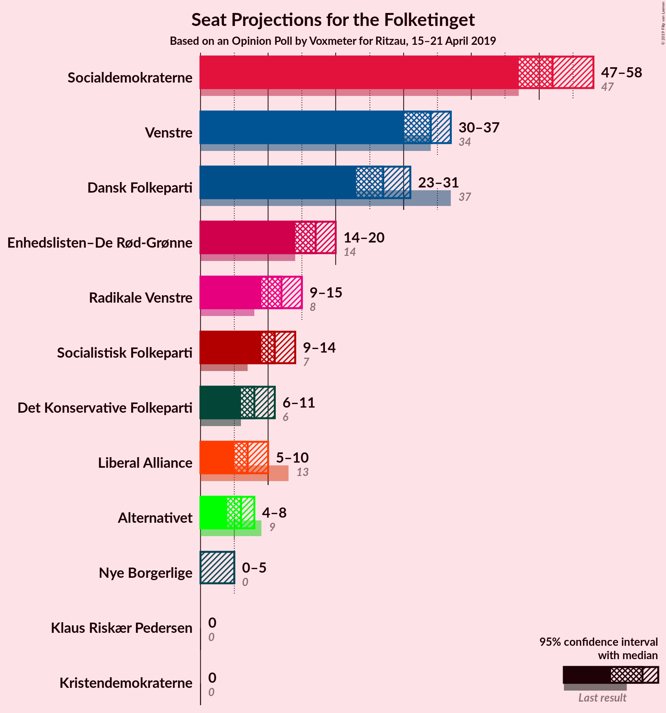

### Confidence Intervals

| Party | Last Result | Median | 80% Confidence Interval | 90% Confidence Interval | 95% Confidence Interval | 99% Confidence Interval |
|:-----:|:-----------:|:------:|:-----------------------:|:-----------------------:|:-----------------------:|:-----------------------:|
| <a href="#socialdemokraterne">Socialdemokraterne</a> | 47 | 52 | 48–55 |48–58 |47–58 |44–58 |
| <a href="#venstre">Venstre</a> | 34 | 34 | 31–36 |30–36 |30–37 |29–39 |
| <a href="#dansk-folkeparti">Dansk Folkeparti</a> | 37 | 27 | 24–29 |24–31 |23–31 |22–31 |
| <a href="#enhedslisten–de-rød-grønne">Enhedslisten–De Rød-Grønne</a> | 14 | 17 | 15–19 |15–19 |14–20 |12–21 |
| <a href="#radikale-venstre">Radikale Venstre</a> | 8 | 12 | 10–14 |9–14 |9–15 |9–16 |
| <a href="#socialistisk-folkeparti">Socialistisk Folkeparti</a> | 7 | 11 | 9–13 |9–14 |9–14 |8–15 |
| <a href="#det-konservative-folkeparti">Det Konservative Folkeparti</a> | 6 | 8 | 6–11 |6–11 |6–11 |5–11 |
| <a href="#liberal-alliance">Liberal Alliance</a> | 13 | 7 | 6–9 |6–10 |5–10 |5–11 |
| <a href="#alternativet">Alternativet</a> | 9 | 6 | 4–7 |4–7 |4–8 |0–9 |
| <a href="#nye-borgerlige">Nye Borgerlige</a> | 0 | 0 | 0–4 |0–5 |0–5 |0–6 |
| <a href="#kristendemokraterne">Kristendemokraterne</a> | 0 | 0 | 0 |0 |0 |0 |
| <a href="#klaus-riskær-pedersen">Klaus Riskær Pedersen</a> | 0 | 0 | 0 |0 |0 |0 |

### Socialdemokraterne

*For a full overview of the results for this party, see the [Socialdemokraterne](party-socialdemokraterne.html) page.*

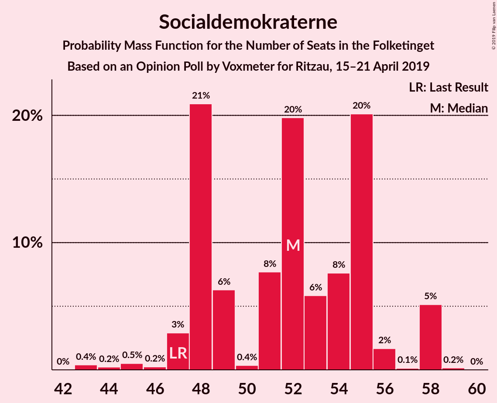

| Number of Seats | Probability | Accumulated | Special Marks |
|:---------------:|:-----------:|:-----------:|:-------------:|
| 43 | 0.4% | 100% |  |
| 44 | 0.2% | 99.6% |  |
| 45 | 0.5% | 99.4% |  |
| 46 | 0.2% | 98.9% |  |
| 47 | 3% | 98.6% | Last Result |
| 48 | 21% | 96% |  |
| 49 | 6% | 75% |  |
| 50 | 0.4% | 69% |  |
| 51 | 8% | 68% |  |
| 52 | 20% | 60% | Median |
| 53 | 6% | 41% |  |
| 54 | 8% | 35% |  |
| 55 | 20% | 27% |  |
| 56 | 2% | 7% |  |
| 57 | 0.1% | 5% |  |
| 58 | 5% | 5% |  |
| 59 | 0.2% | 0.2% |  |
| 60 | 0% | 0% |  |

### Venstre

*For a full overview of the results for this party, see the [Venstre](party-venstre.html) page.*

| Number of Seats | Probability | Accumulated | Special Marks |
|:---------------:|:-----------:|:-----------:|:-------------:|
| 27 | 0.3% | 100% |  |
| 28 | 0.1% | 99.7% |  |
| 29 | 0.5% | 99.6% |  |
| 30 | 8% | 99.1% |  |
| 31 | 27% | 91% |  |
| 32 | 4% | 64% |  |
| 33 | 5% | 60% |  |
| 34 | 31% | 55% | Last Result, Median |
| 35 | 13% | 24% |  |
| 36 | 6% | 11% |  |
| 37 | 3% | 5% |  |
| 38 | 1.0% | 2% |  |
| 39 | 0.6% | 0.9% |  |
| 40 | 0.2% | 0.3% |  |
| 41 | 0% | 0.1% |  |
| 42 | 0.1% | 0.1% |  |
| 43 | 0% | 0% |  |

### Dansk Folkeparti

*For a full overview of the results for this party, see the [Dansk Folkeparti](party-danskfolkeparti.html) page.*

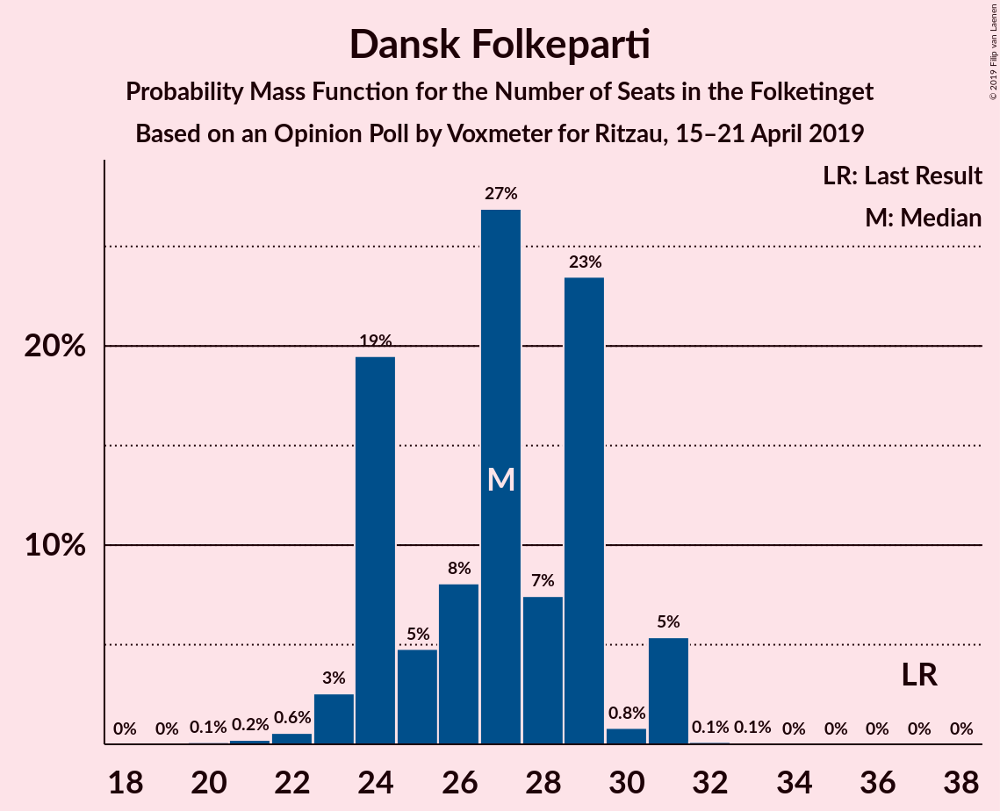

| Number of Seats | Probability | Accumulated | Special Marks |
|:---------------:|:-----------:|:-----------:|:-------------:|
| 20 | 0.1% | 100% |  |
| 21 | 0.2% | 99.9% |  |
| 22 | 0.6% | 99.7% |  |
| 23 | 3% | 99.1% |  |
| 24 | 19% | 97% |  |
| 25 | 5% | 77% |  |
| 26 | 8% | 72% |  |
| 27 | 27% | 64% | Median |
| 28 | 7% | 37% |  |
| 29 | 23% | 30% |  |
| 30 | 0.8% | 6% |  |
| 31 | 5% | 6% |  |
| 32 | 0.1% | 0.2% |  |
| 33 | 0.1% | 0.1% |  |
| 34 | 0% | 0% |  |
| 35 | 0% | 0% |  |
| 36 | 0% | 0% |  |
| 37 | 0% | 0% | Last Result |

### Enhedslisten–De Rød-Grønne

*For a full overview of the results for this party, see the [Enhedslisten–De Rød-Grønne](party-enhedslisten–derød-grønne.html) page.*

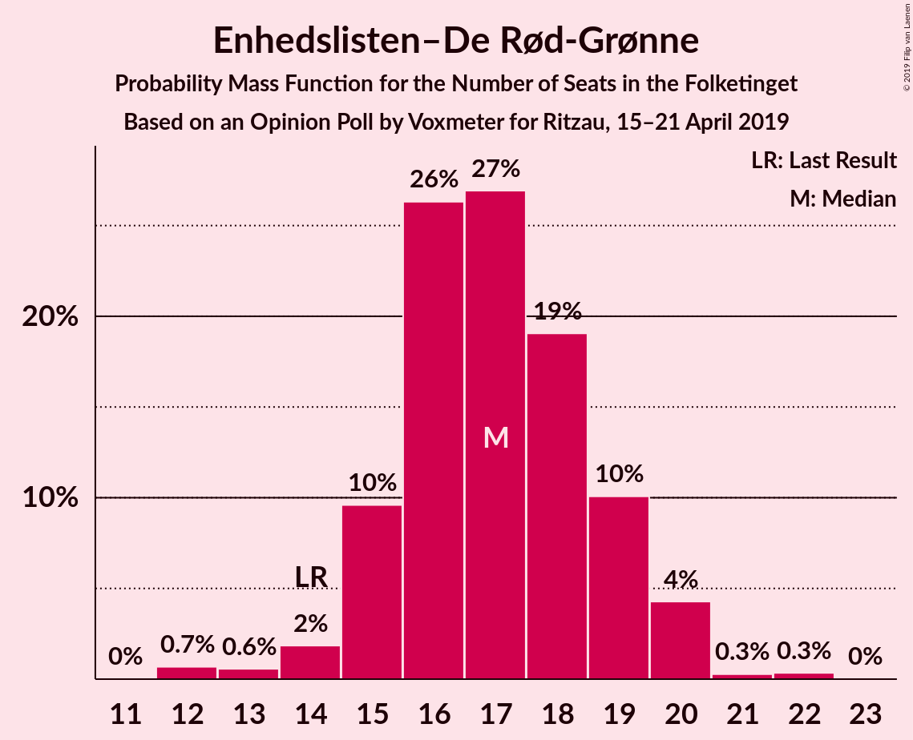

| Number of Seats | Probability | Accumulated | Special Marks |
|:---------------:|:-----------:|:-----------:|:-------------:|
| 12 | 0.7% | 100% |  |
| 13 | 0.6% | 99.3% |  |
| 14 | 2% | 98.7% | Last Result |
| 15 | 10% | 97% |  |
| 16 | 26% | 87% |  |
| 17 | 27% | 61% | Median |
| 18 | 19% | 34% |  |
| 19 | 10% | 15% |  |
| 20 | 4% | 5% |  |
| 21 | 0.3% | 0.6% |  |
| 22 | 0.3% | 0.4% |  |
| 23 | 0% | 0% |  |

### Radikale Venstre

*For a full overview of the results for this party, see the [Radikale Venstre](party-radikalevenstre.html) page.*

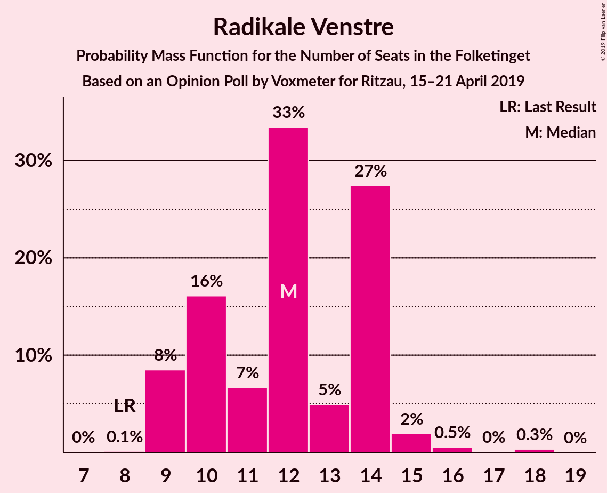

| Number of Seats | Probability | Accumulated | Special Marks |
|:---------------:|:-----------:|:-----------:|:-------------:|
| 8 | 0.1% | 100% | Last Result |
| 9 | 8% | 99.9% |  |
| 10 | 16% | 91% |  |
| 11 | 7% | 75% |  |
| 12 | 33% | 69% | Median |
| 13 | 5% | 35% |  |
| 14 | 27% | 30% |  |
| 15 | 2% | 3% |  |
| 16 | 0.5% | 0.9% |  |
| 17 | 0% | 0.4% |  |
| 18 | 0.3% | 0.3% |  |
| 19 | 0% | 0% |  |

### Socialistisk Folkeparti

*For a full overview of the results for this party, see the [Socialistisk Folkeparti](party-socialistiskfolkeparti.html) page.*

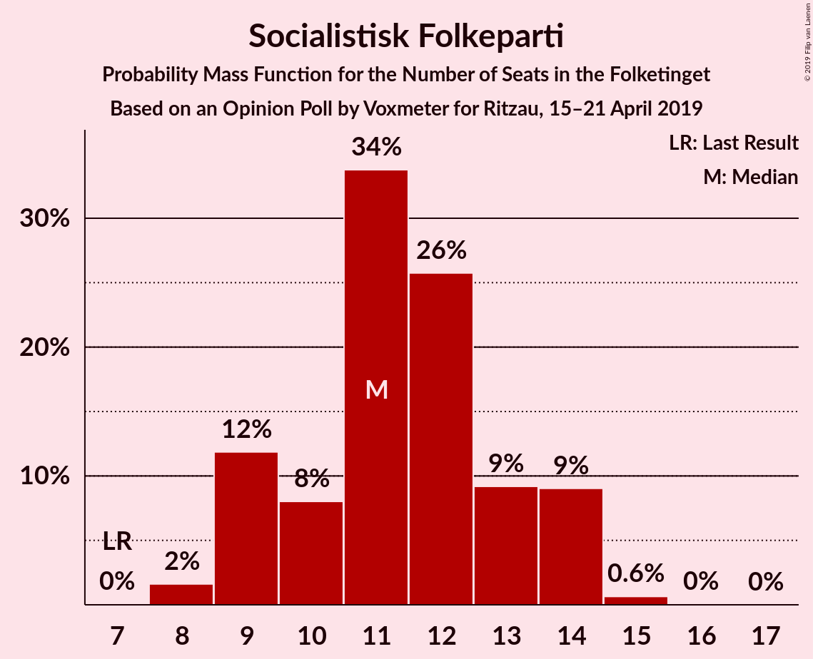

| Number of Seats | Probability | Accumulated | Special Marks |
|:---------------:|:-----------:|:-----------:|:-------------:|
| 7 | 0% | 100% | Last Result |
| 8 | 2% | 100% |  |
| 9 | 12% | 98% |  |
| 10 | 8% | 86% |  |
| 11 | 34% | 78% | Median |
| 12 | 26% | 45% |  |
| 13 | 9% | 19% |  |
| 14 | 9% | 10% |  |
| 15 | 0.6% | 0.7% |  |
| 16 | 0% | 0.1% |  |
| 17 | 0% | 0% |  |

### Det Konservative Folkeparti

*For a full overview of the results for this party, see the [Det Konservative Folkeparti](party-detkonservativefolkeparti.html) page.*

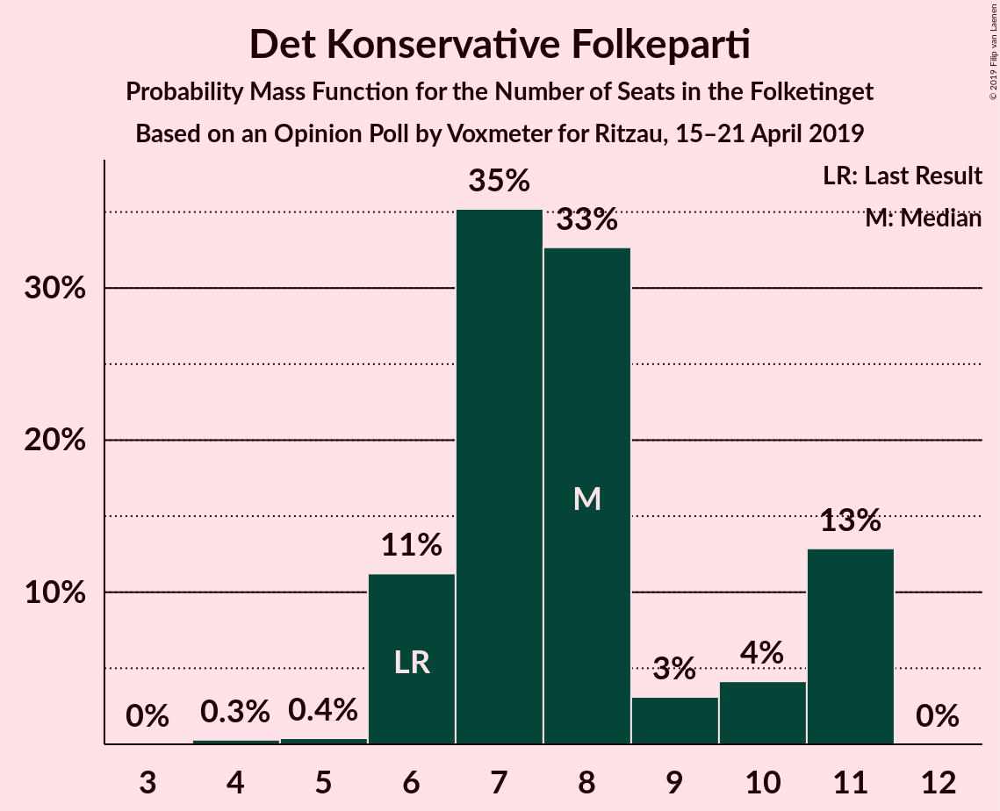

| Number of Seats | Probability | Accumulated | Special Marks |
|:---------------:|:-----------:|:-----------:|:-------------:|
| 4 | 0.3% | 100% |  |
| 5 | 0.4% | 99.7% |  |
| 6 | 11% | 99.3% | Last Result |
| 7 | 35% | 88% |  |
| 8 | 33% | 53% | Median |
| 9 | 3% | 20% |  |
| 10 | 4% | 17% |  |
| 11 | 13% | 13% |  |
| 12 | 0% | 0% |  |

### Liberal Alliance

*For a full overview of the results for this party, see the [Liberal Alliance](party-liberalalliance.html) page.*

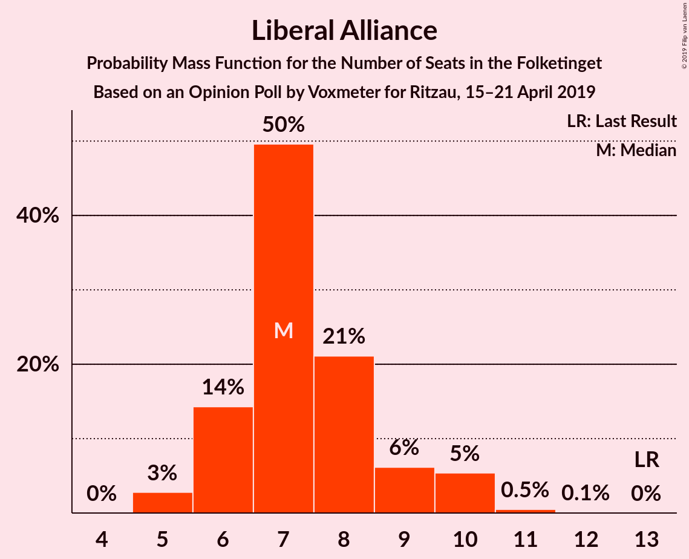

| Number of Seats | Probability | Accumulated | Special Marks |
|:---------------:|:-----------:|:-----------:|:-------------:|
| 5 | 3% | 100% |  |
| 6 | 14% | 97% |  |
| 7 | 50% | 83% | Median |
| 8 | 21% | 33% |  |
| 9 | 6% | 12% |  |
| 10 | 5% | 6% |  |
| 11 | 0.5% | 0.6% |  |
| 12 | 0.1% | 0.1% |  |
| 13 | 0% | 0% | Last Result |

### Alternativet

*For a full overview of the results for this party, see the [Alternativet](party-alternativet.html) page.*

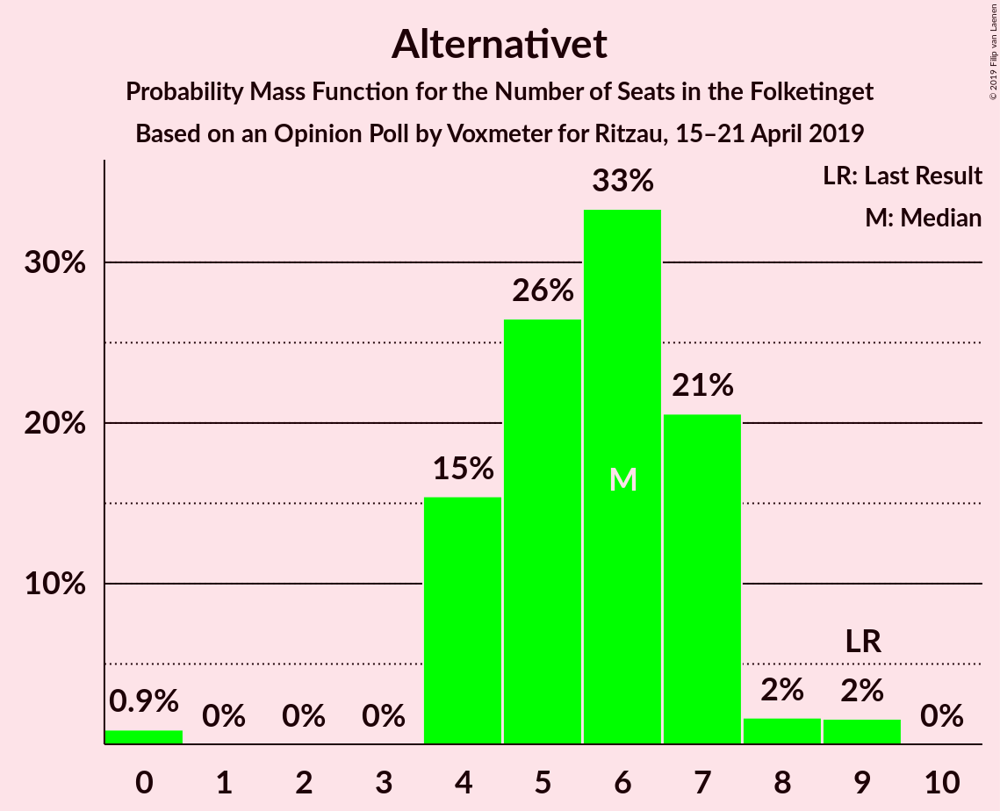

| Number of Seats | Probability | Accumulated | Special Marks |
|:---------------:|:-----------:|:-----------:|:-------------:|
| 0 | 0.9% | 100% |  |
| 1 | 0% | 99.1% |  |
| 2 | 0% | 99.1% |  |
| 3 | 0% | 99.1% |  |
| 4 | 15% | 99.1% |  |
| 5 | 26% | 84% |  |
| 6 | 33% | 57% | Median |
| 7 | 21% | 24% |  |
| 8 | 2% | 3% |  |
| 9 | 2% | 2% | Last Result |
| 10 | 0% | 0% |  |

### Nye Borgerlige

*For a full overview of the results for this party, see the [Nye Borgerlige](party-nyeborgerlige.html) page.*

| Number of Seats | Probability | Accumulated | Special Marks |
|:---------------:|:-----------:|:-----------:|:-------------:|
| 0 | 56% | 100% | Last Result, Median |
| 1 | 0% | 44% |  |
| 2 | 0% | 44% |  |
| 3 | 0.1% | 44% |  |
| 4 | 35% | 44% |  |
| 5 | 8% | 9% |  |
| 6 | 0.8% | 1.2% |  |
| 7 | 0.4% | 0.4% |  |
| 8 | 0% | 0% |  |

### Kristendemokraterne

*For a full overview of the results for this party, see the [Kristendemokraterne](party-kristendemokraterne.html) page.*

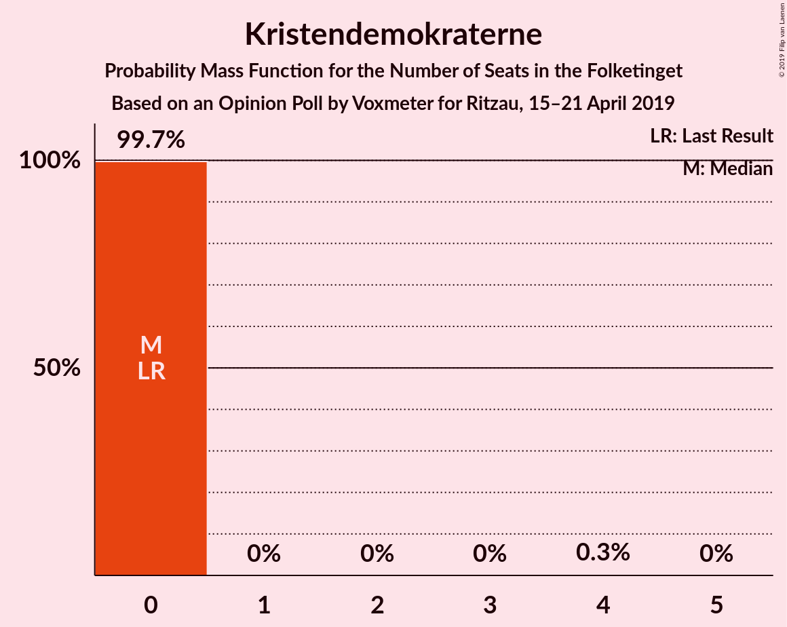

| Number of Seats | Probability | Accumulated | Special Marks |
|:---------------:|:-----------:|:-----------:|:-------------:|
| 0 | 99.7% | 100% | Last Result, Median |
| 1 | 0% | 0.3% |  |
| 2 | 0% | 0.3% |  |
| 3 | 0% | 0.3% |  |
| 4 | 0.3% | 0.3% |  |
| 5 | 0% | 0% |  |

### Klaus Riskær Pedersen

*For a full overview of the results for this party, see the [Klaus Riskær Pedersen](party-klausriskærpedersen.html) page.*

| Number of Seats | Probability | Accumulated | Special Marks |
|:---------------:|:-----------:|:-----------:|:-------------:|
| 0 | 100% | 100% | Last Result, Median |

## Coalitions

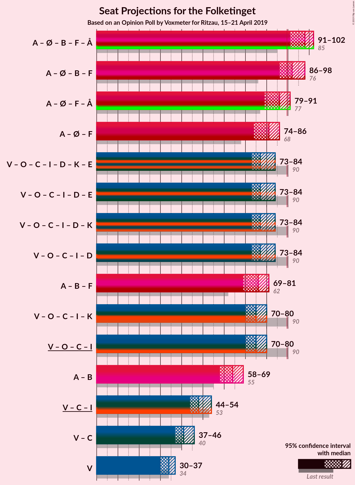

### Confidence Intervals

| Coalition | Last Result | Median | Majority? | 80% Confidence Interval | 90% Confidence Interval | 95% Confidence Interval | 99% Confidence Interval |
|:---------:|:-----------:|:------:|:---------:|:-----------------------:|:-----------------------:|:-----------------------:|:-----------------------:|
| Socialdemokraterne – Enhedslisten–De Rød-Grønne – Radikale Venstre – Socialistisk Folkeparti – Alternativet | 85 | 98 | 99.7% | 94–102 | 93–102 | 91–102 | 90–105 |
| Socialdemokraterne – Enhedslisten–De Rød-Grønne – Radikale Venstre – Socialistisk Folkeparti | 76 | 92 | 85% | 88–96 | 87–98 | 86–98 | 84–99 |
| Socialdemokraterne – Enhedslisten–De Rød-Grønne – Socialistisk Folkeparti – Alternativet | 77 | 86 | 14% | 82–90 | 81–91 | 79–91 | 77–92 |
| Socialdemokraterne – Enhedslisten–De Rød-Grønne – Socialistisk Folkeparti | 68 | 81 | 0% | 76–85 | 76–86 | 74–86 | 71–86 |
| Venstre – Dansk Folkeparti – Det Konservative Folkeparti – Liberal Alliance – Nye Borgerlige – Kristendemokraterne – Klaus Riskær Pedersen | 90 | 77 | 0% | 73–81 | 73–82 | 73–84 | 70–85 |
| Venstre – Dansk Folkeparti – Det Konservative Folkeparti – Liberal Alliance – Nye Borgerlige – Klaus Riskær Pedersen | 90 | 77 | 0% | 73–81 | 73–82 | 73–84 | 70–85 |
| Venstre – Dansk Folkeparti – Det Konservative Folkeparti – Liberal Alliance – Nye Borgerlige – Kristendemokraterne | 90 | 77 | 0% | 73–81 | 73–82 | 73–84 | 70–85 |
| Venstre – Dansk Folkeparti – Det Konservative Folkeparti – Liberal Alliance – Nye Borgerlige | 90 | 77 | 0% | 73–81 | 73–82 | 73–84 | 70–85 |
| Socialdemokraterne – Radikale Venstre – Socialistisk Folkeparti | 62 | 76 | 0% | 71–79 | 69–80 | 69–81 | 67–81 |
| Venstre – Dansk Folkeparti – Det Konservative Folkeparti – Liberal Alliance – Kristendemokraterne | 90 | 75 | 0% | 73–78 | 72–79 | 70–80 | 69–82 |
| Venstre – Dansk Folkeparti – Det Konservative Folkeparti – Liberal Alliance | 90 | 75 | 0% | 73–78 | 72–79 | 70–80 | 69–82 |
| Socialdemokraterne – Radikale Venstre | 55 | 64 | 0% | 60–68 | 59–69 | 58–69 | 56–70 |
| Venstre – Det Konservative Folkeparti – Liberal Alliance | 53 | 48 | 0% | 44–53 | 44–53 | 44–54 | 43–56 |
| Venstre – Det Konservative Folkeparti | 40 | 41 | 0% | 38–45 | 37–45 | 37–46 | 36–48 |
| Venstre | 34 | 34 | 0% | 31–36 | 30–36 | 30–37 | 29–39 |

### Socialdemokraterne – Enhedslisten–De Rød-Grønne – Radikale Venstre – Socialistisk Folkeparti – Alternativet

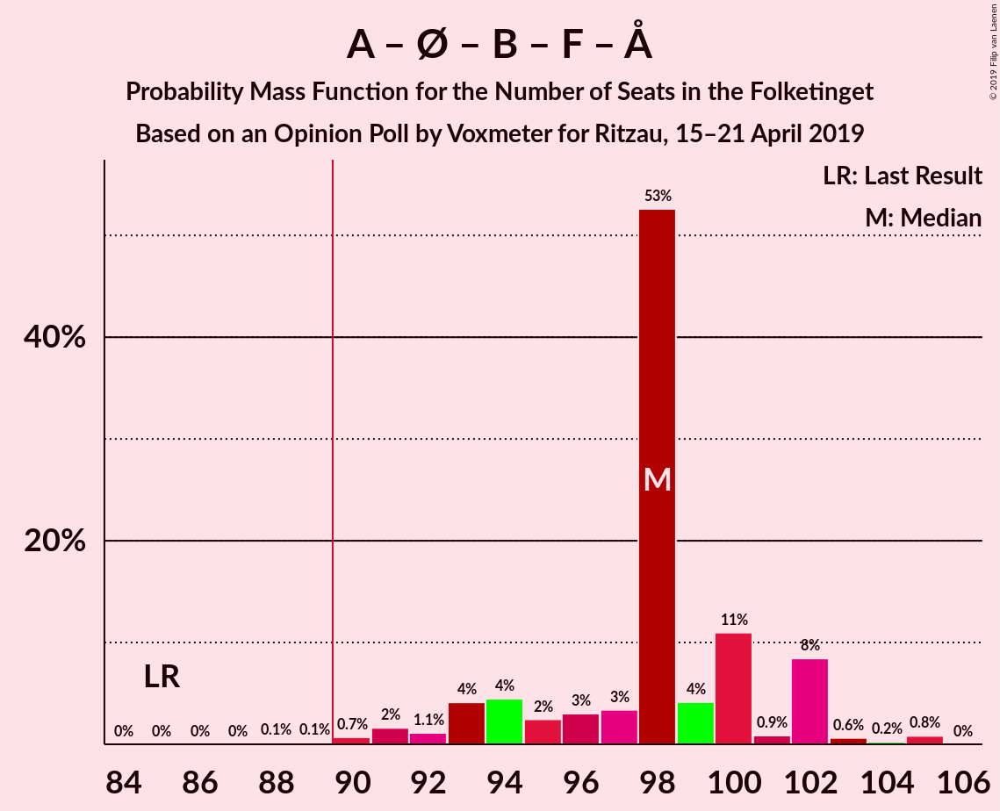

| Number of Seats | Probability | Accumulated | Special Marks |
|:---------------:|:-----------:|:-----------:|:-------------:|
| 85 | 0% | 100% | Last Result |
| 86 | 0% | 100% |  |
| 87 | 0% | 100% |  |
| 88 | 0.1% | 100% |  |
| 89 | 0.1% | 99.8% |  |
| 90 | 0.7% | 99.7% | Majority |
| 91 | 2% | 99.0% |  |
| 92 | 1.1% | 97% |  |
| 93 | 4% | 96% |  |
| 94 | 4% | 92% |  |
| 95 | 2% | 88% |  |
| 96 | 3% | 85% |  |
| 97 | 3% | 82% |  |
| 98 | 53% | 79% | Median |
| 99 | 4% | 26% |  |
| 100 | 11% | 22% |  |
| 101 | 0.9% | 11% |  |
| 102 | 8% | 10% |  |
| 103 | 0.6% | 2% |  |
| 104 | 0.2% | 1.1% |  |
| 105 | 0.8% | 0.9% |  |
| 106 | 0% | 0% |  |

### Socialdemokraterne – Enhedslisten–De Rød-Grønne – Radikale Venstre – Socialistisk Folkeparti

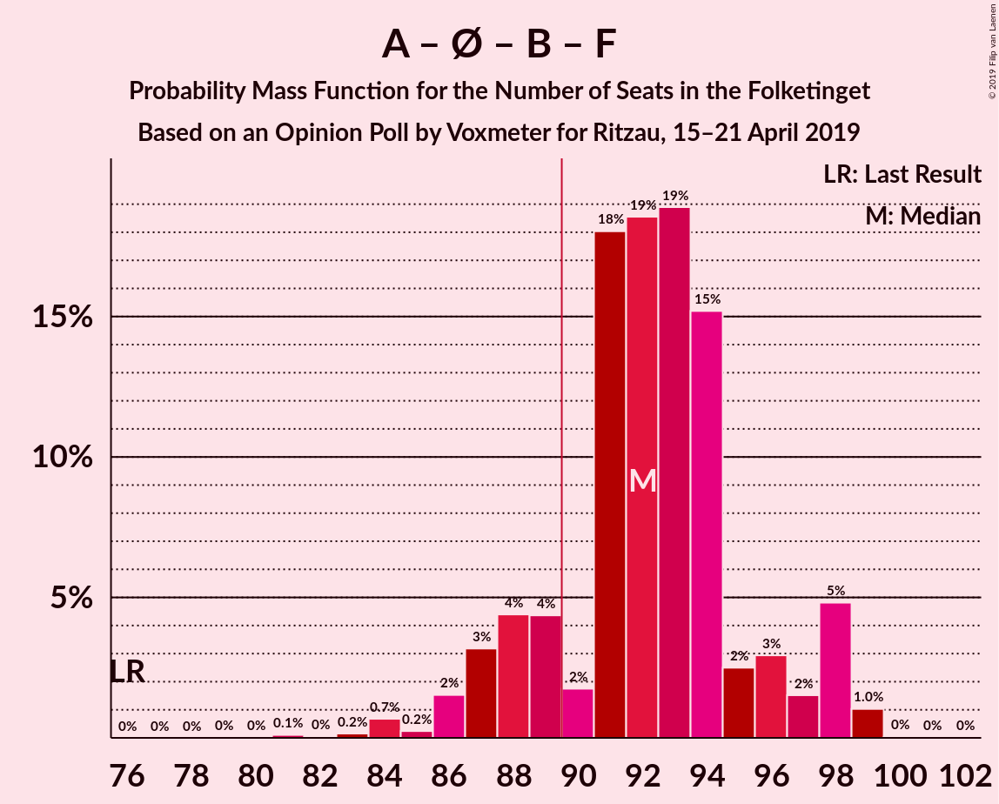

| Number of Seats | Probability | Accumulated | Special Marks |
|:---------------:|:-----------:|:-----------:|:-------------:|
| 76 | 0% | 100% | Last Result |
| 77 | 0% | 100% |  |
| 78 | 0% | 100% |  |
| 79 | 0% | 100% |  |
| 80 | 0% | 100% |  |
| 81 | 0.1% | 100% |  |
| 82 | 0% | 99.9% |  |
| 83 | 0.2% | 99.8% |  |
| 84 | 0.7% | 99.7% |  |
| 85 | 0.2% | 99.0% |  |
| 86 | 2% | 98.8% |  |
| 87 | 3% | 97% |  |
| 88 | 4% | 94% |  |
| 89 | 4% | 90% |  |
| 90 | 2% | 85% | Majority |
| 91 | 18% | 84% |  |
| 92 | 19% | 66% | Median |
| 93 | 19% | 47% |  |
| 94 | 15% | 28% |  |
| 95 | 2% | 13% |  |
| 96 | 3% | 10% |  |
| 97 | 2% | 7% |  |
| 98 | 5% | 6% |  |
| 99 | 1.0% | 1.1% |  |
| 100 | 0% | 0.1% |  |
| 101 | 0% | 0% |  |

### Socialdemokraterne – Enhedslisten–De Rød-Grønne – Socialistisk Folkeparti – Alternativet

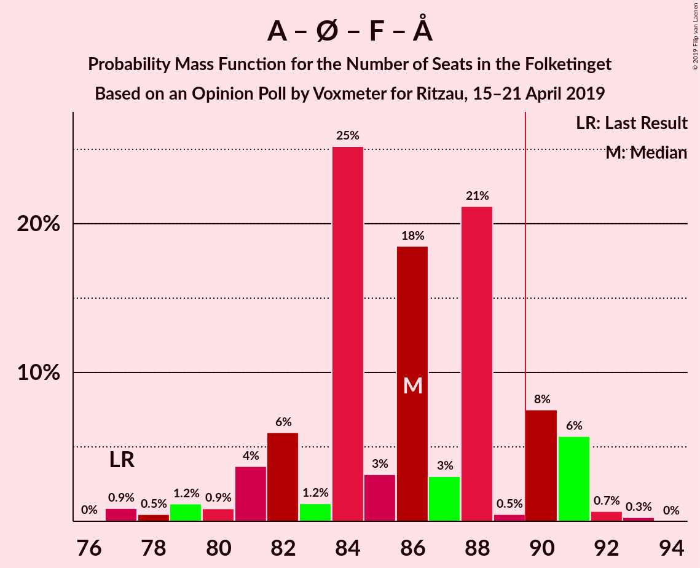

| Number of Seats | Probability | Accumulated | Special Marks |
|:---------------:|:-----------:|:-----------:|:-------------:|
| 76 | 0% | 100% |  |
| 77 | 0.9% | 99.9% | Last Result |
| 78 | 0.5% | 99.1% |  |
| 79 | 1.2% | 98.6% |  |
| 80 | 0.9% | 97% |  |
| 81 | 4% | 97% |  |
| 82 | 6% | 93% |  |
| 83 | 1.2% | 87% |  |
| 84 | 25% | 86% |  |
| 85 | 3% | 60% |  |
| 86 | 18% | 57% | Median |
| 87 | 3% | 39% |  |
| 88 | 21% | 36% |  |
| 89 | 0.5% | 15% |  |
| 90 | 8% | 14% | Majority |
| 91 | 6% | 7% |  |
| 92 | 0.7% | 1.0% |  |
| 93 | 0.3% | 0.3% |  |
| 94 | 0% | 0% |  |

### Socialdemokraterne – Enhedslisten–De Rød-Grønne – Socialistisk Folkeparti

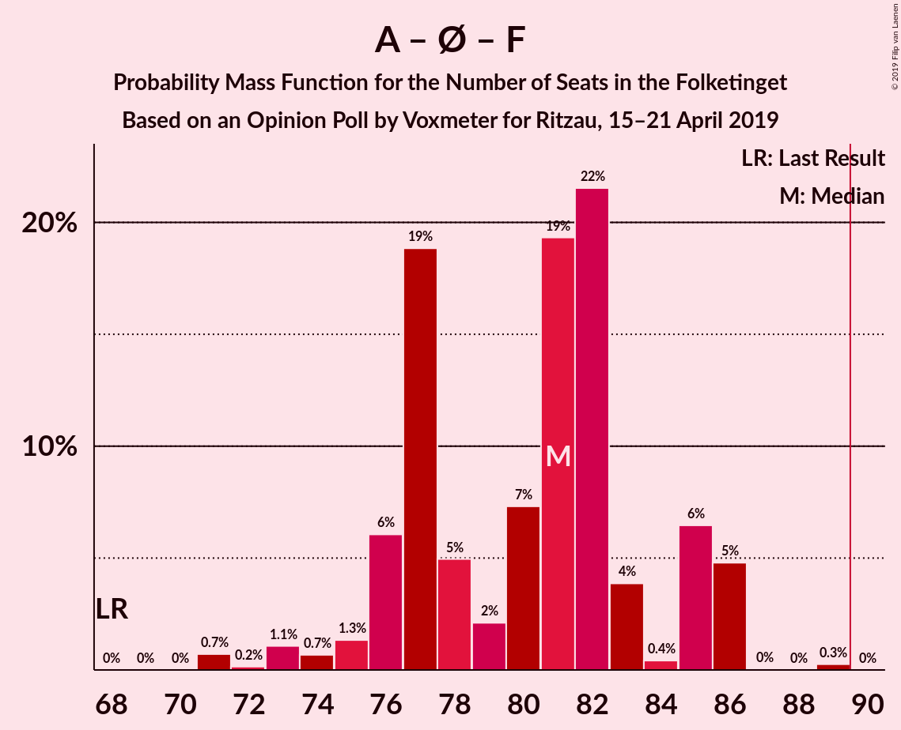

| Number of Seats | Probability | Accumulated | Special Marks |
|:---------------:|:-----------:|:-----------:|:-------------:|
| 68 | 0% | 100% | Last Result |
| 69 | 0% | 100% |  |
| 70 | 0% | 100% |  |
| 71 | 0.7% | 100% |  |
| 72 | 0.2% | 99.3% |  |
| 73 | 1.1% | 99.1% |  |
| 74 | 0.7% | 98% |  |
| 75 | 1.3% | 97% |  |
| 76 | 6% | 96% |  |
| 77 | 19% | 90% |  |
| 78 | 5% | 71% |  |
| 79 | 2% | 66% |  |
| 80 | 7% | 64% | Median |
| 81 | 19% | 57% |  |
| 82 | 22% | 37% |  |
| 83 | 4% | 16% |  |
| 84 | 0.4% | 12% |  |
| 85 | 6% | 12% |  |
| 86 | 5% | 5% |  |
| 87 | 0% | 0.3% |  |
| 88 | 0% | 0.3% |  |
| 89 | 0.3% | 0.3% |  |
| 90 | 0% | 0% | Majority |

### Venstre – Dansk Folkeparti – Det Konservative Folkeparti – Liberal Alliance – Nye Borgerlige – Kristendemokraterne – Klaus Riskær Pedersen

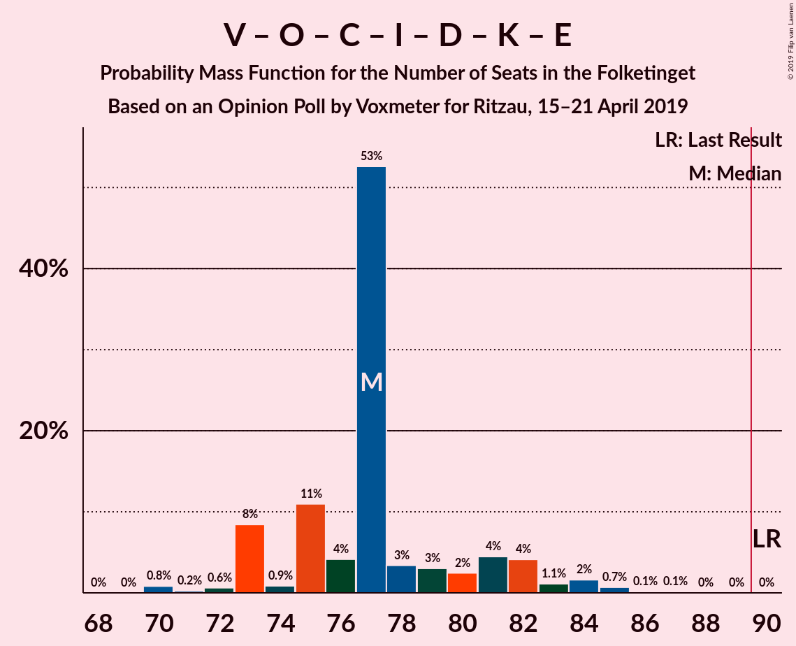

| Number of Seats | Probability | Accumulated | Special Marks |
|:---------------:|:-----------:|:-----------:|:-------------:|
| 70 | 0.8% | 100% |  |
| 71 | 0.2% | 99.1% |  |
| 72 | 0.6% | 98.9% |  |
| 73 | 8% | 98% |  |
| 74 | 0.9% | 90% |  |
| 75 | 11% | 89% |  |
| 76 | 4% | 78% | Median |
| 77 | 53% | 74% |  |
| 78 | 3% | 21% |  |
| 79 | 3% | 18% |  |
| 80 | 2% | 15% |  |
| 81 | 4% | 12% |  |
| 82 | 4% | 8% |  |
| 83 | 1.1% | 4% |  |
| 84 | 2% | 3% |  |
| 85 | 0.7% | 1.0% |  |
| 86 | 0.1% | 0.3% |  |
| 87 | 0.1% | 0.2% |  |
| 88 | 0% | 0% |  |
| 89 | 0% | 0% |  |
| 90 | 0% | 0% | Last Result, Majority |

### Venstre – Dansk Folkeparti – Det Konservative Folkeparti – Liberal Alliance – Nye Borgerlige – Klaus Riskær Pedersen

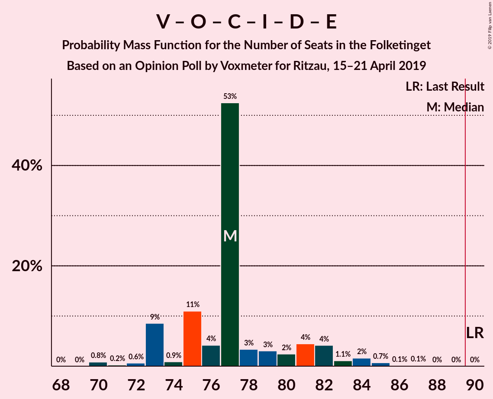

| Number of Seats | Probability | Accumulated | Special Marks |
|:---------------:|:-----------:|:-----------:|:-------------:|
| 70 | 0.8% | 100% |  |
| 71 | 0.2% | 99.1% |  |
| 72 | 0.6% | 98.9% |  |
| 73 | 9% | 98% |  |
| 74 | 0.9% | 90% |  |
| 75 | 11% | 89% |  |
| 76 | 4% | 78% | Median |
| 77 | 53% | 74% |  |
| 78 | 3% | 21% |  |
| 79 | 3% | 18% |  |
| 80 | 2% | 15% |  |
| 81 | 4% | 12% |  |
| 82 | 4% | 8% |  |
| 83 | 1.1% | 4% |  |
| 84 | 2% | 3% |  |
| 85 | 0.7% | 1.0% |  |
| 86 | 0.1% | 0.3% |  |
| 87 | 0.1% | 0.2% |  |
| 88 | 0% | 0% |  |
| 89 | 0% | 0% |  |
| 90 | 0% | 0% | Last Result, Majority |

### Venstre – Dansk Folkeparti – Det Konservative Folkeparti – Liberal Alliance – Nye Borgerlige – Kristendemokraterne

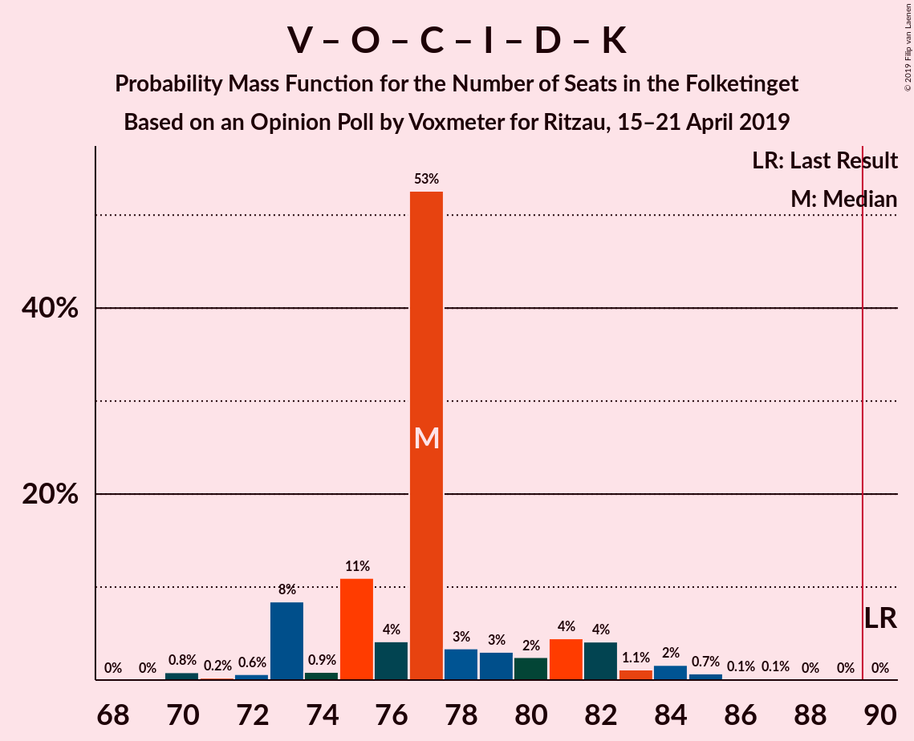

| Number of Seats | Probability | Accumulated | Special Marks |
|:---------------:|:-----------:|:-----------:|:-------------:|
| 70 | 0.8% | 100% |  |
| 71 | 0.2% | 99.1% |  |
| 72 | 0.6% | 98.9% |  |
| 73 | 8% | 98% |  |
| 74 | 0.9% | 90% |  |
| 75 | 11% | 89% |  |
| 76 | 4% | 78% | Median |
| 77 | 53% | 74% |  |
| 78 | 3% | 21% |  |
| 79 | 3% | 18% |  |
| 80 | 2% | 15% |  |
| 81 | 4% | 12% |  |
| 82 | 4% | 8% |  |
| 83 | 1.1% | 4% |  |
| 84 | 2% | 3% |  |
| 85 | 0.7% | 1.0% |  |
| 86 | 0.1% | 0.3% |  |
| 87 | 0.1% | 0.2% |  |
| 88 | 0% | 0% |  |
| 89 | 0% | 0% |  |
| 90 | 0% | 0% | Last Result, Majority |

### Venstre – Dansk Folkeparti – Det Konservative Folkeparti – Liberal Alliance – Nye Borgerlige

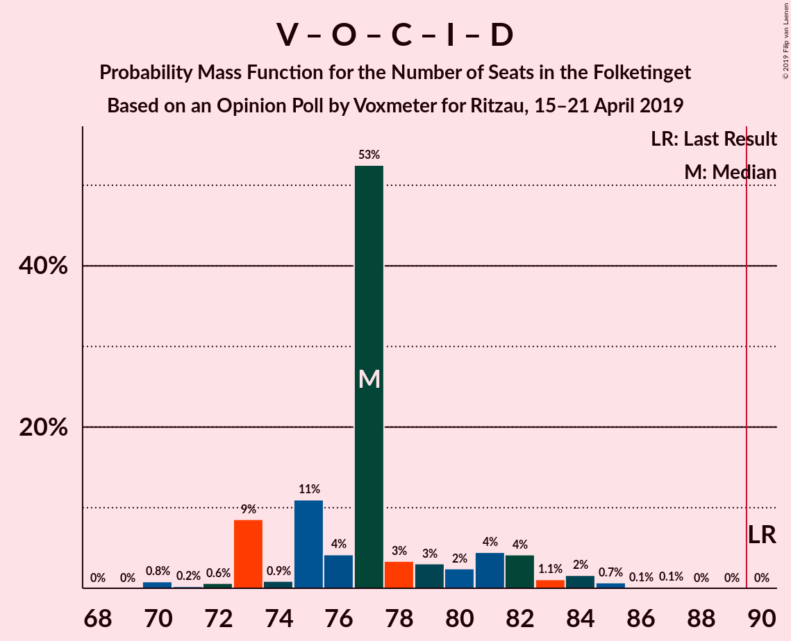

| Number of Seats | Probability | Accumulated | Special Marks |
|:---------------:|:-----------:|:-----------:|:-------------:|
| 70 | 0.8% | 100% |  |
| 71 | 0.2% | 99.1% |  |
| 72 | 0.6% | 98.9% |  |
| 73 | 9% | 98% |  |
| 74 | 0.9% | 90% |  |
| 75 | 11% | 89% |  |
| 76 | 4% | 78% | Median |
| 77 | 53% | 74% |  |
| 78 | 3% | 21% |  |
| 79 | 3% | 18% |  |
| 80 | 2% | 15% |  |
| 81 | 4% | 12% |  |
| 82 | 4% | 8% |  |
| 83 | 1.1% | 4% |  |
| 84 | 2% | 3% |  |
| 85 | 0.7% | 1.0% |  |
| 86 | 0.1% | 0.3% |  |
| 87 | 0.1% | 0.2% |  |
| 88 | 0% | 0% |  |
| 89 | 0% | 0% |  |
| 90 | 0% | 0% | Last Result, Majority |

### Socialdemokraterne – Radikale Venstre – Socialistisk Folkeparti

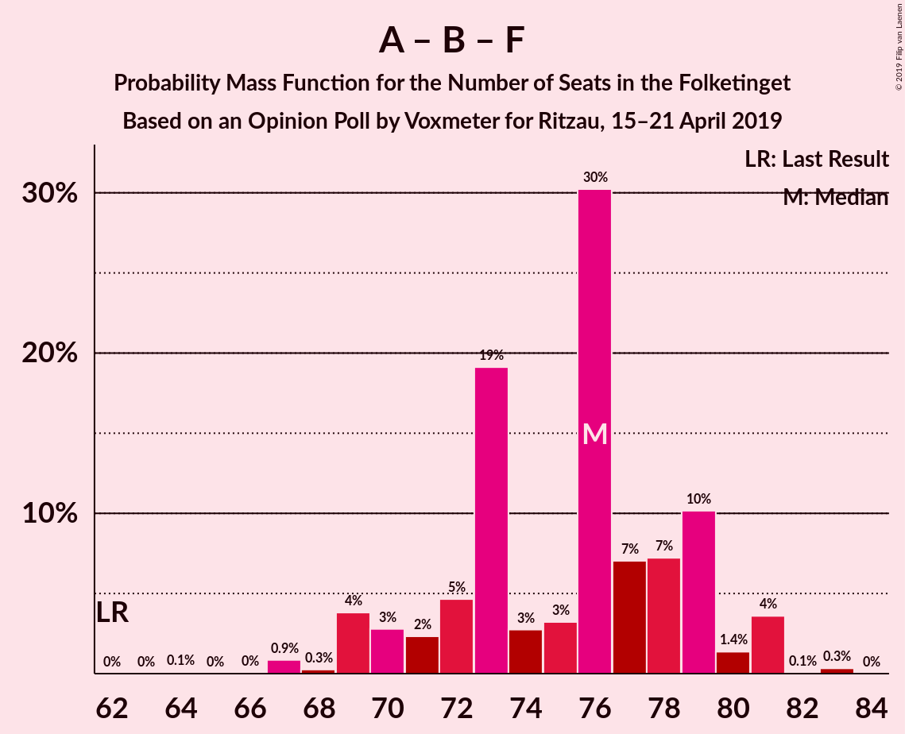

| Number of Seats | Probability | Accumulated | Special Marks |
|:---------------:|:-----------:|:-----------:|:-------------:|
| 62 | 0% | 100% | Last Result |
| 63 | 0% | 100% |  |
| 64 | 0.1% | 100% |  |
| 65 | 0% | 99.9% |  |
| 66 | 0% | 99.9% |  |
| 67 | 0.9% | 99.9% |  |
| 68 | 0.3% | 99.0% |  |
| 69 | 4% | 98.7% |  |
| 70 | 3% | 95% |  |
| 71 | 2% | 92% |  |
| 72 | 5% | 90% |  |
| 73 | 19% | 85% |  |
| 74 | 3% | 66% |  |
| 75 | 3% | 63% | Median |
| 76 | 30% | 60% |  |
| 77 | 7% | 30% |  |
| 78 | 7% | 23% |  |
| 79 | 10% | 16% |  |
| 80 | 1.4% | 5% |  |
| 81 | 4% | 4% |  |
| 82 | 0.1% | 0.4% |  |
| 83 | 0.3% | 0.4% |  |
| 84 | 0% | 0% |  |

### Venstre – Dansk Folkeparti – Det Konservative Folkeparti – Liberal Alliance – Kristendemokraterne

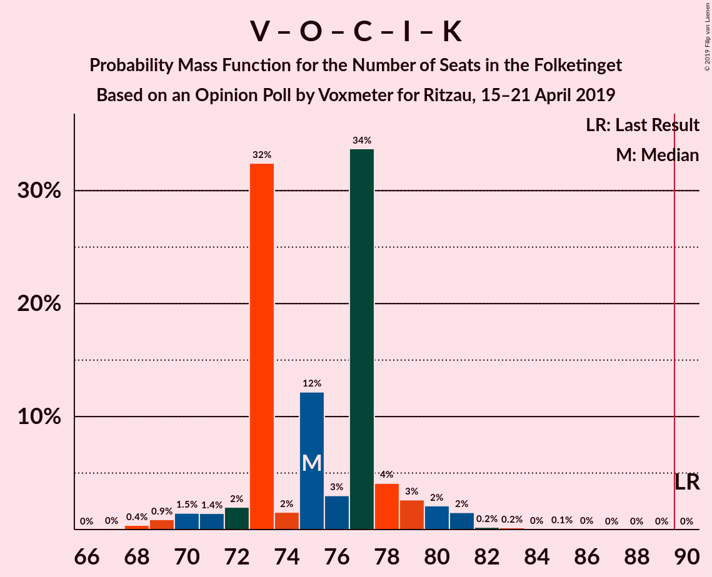

| Number of Seats | Probability | Accumulated | Special Marks |
|:---------------:|:-----------:|:-----------:|:-------------:|
| 67 | 0% | 100% |  |
| 68 | 0.4% | 99.9% |  |
| 69 | 0.9% | 99.6% |  |
| 70 | 1.5% | 98.7% |  |
| 71 | 1.4% | 97% |  |
| 72 | 2% | 96% |  |
| 73 | 32% | 94% |  |
| 74 | 2% | 61% |  |
| 75 | 12% | 60% |  |
| 76 | 3% | 48% | Median |
| 77 | 34% | 45% |  |
| 78 | 4% | 11% |  |
| 79 | 3% | 7% |  |
| 80 | 2% | 4% |  |
| 81 | 2% | 2% |  |
| 82 | 0.2% | 0.6% |  |
| 83 | 0.2% | 0.4% |  |
| 84 | 0% | 0.2% |  |
| 85 | 0.1% | 0.2% |  |
| 86 | 0% | 0.1% |  |
| 87 | 0% | 0% |  |
| 88 | 0% | 0% |  |
| 89 | 0% | 0% |  |
| 90 | 0% | 0% | Last Result, Majority |

### Venstre – Dansk Folkeparti – Det Konservative Folkeparti – Liberal Alliance

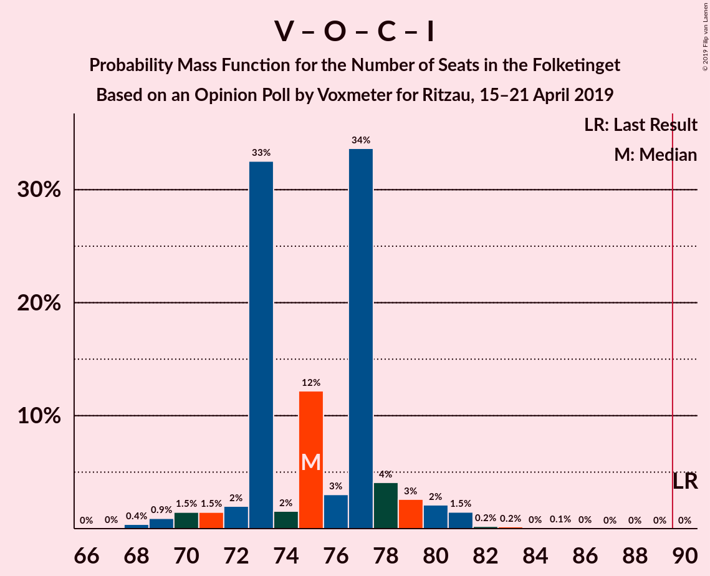

| Number of Seats | Probability | Accumulated | Special Marks |
|:---------------:|:-----------:|:-----------:|:-------------:|
| 67 | 0% | 100% |  |
| 68 | 0.4% | 99.9% |  |
| 69 | 0.9% | 99.6% |  |
| 70 | 1.5% | 98.6% |  |
| 71 | 1.5% | 97% |  |
| 72 | 2% | 96% |  |
| 73 | 33% | 94% |  |
| 74 | 2% | 61% |  |
| 75 | 12% | 60% |  |
| 76 | 3% | 47% | Median |
| 77 | 34% | 44% |  |
| 78 | 4% | 11% |  |
| 79 | 3% | 7% |  |
| 80 | 2% | 4% |  |
| 81 | 1.5% | 2% |  |
| 82 | 0.2% | 0.6% |  |
| 83 | 0.2% | 0.4% |  |
| 84 | 0% | 0.2% |  |
| 85 | 0.1% | 0.1% |  |
| 86 | 0% | 0.1% |  |
| 87 | 0% | 0% |  |
| 88 | 0% | 0% |  |
| 89 | 0% | 0% |  |
| 90 | 0% | 0% | Last Result, Majority |

### Socialdemokraterne – Radikale Venstre

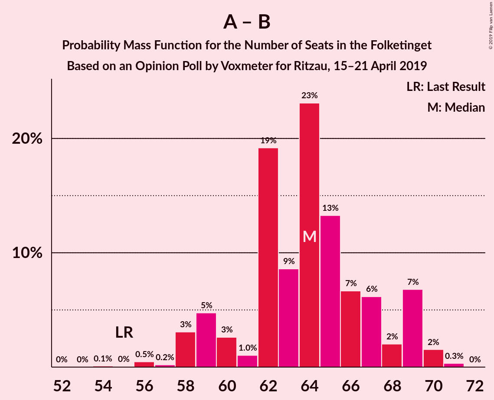

| Number of Seats | Probability | Accumulated | Special Marks |
|:---------------:|:-----------:|:-----------:|:-------------:|
| 54 | 0.1% | 100% |  |
| 55 | 0% | 99.9% | Last Result |
| 56 | 0.5% | 99.8% |  |
| 57 | 0.2% | 99.4% |  |
| 58 | 3% | 99.2% |  |
| 59 | 5% | 96% |  |
| 60 | 3% | 91% |  |
| 61 | 1.0% | 89% |  |
| 62 | 19% | 88% |  |
| 63 | 9% | 69% |  |
| 64 | 23% | 60% | Median |
| 65 | 13% | 37% |  |
| 66 | 7% | 24% |  |
| 67 | 6% | 17% |  |
| 68 | 2% | 11% |  |
| 69 | 7% | 9% |  |
| 70 | 2% | 2% |  |
| 71 | 0.3% | 0.4% |  |
| 72 | 0% | 0% |  |

### Venstre – Det Konservative Folkeparti – Liberal Alliance

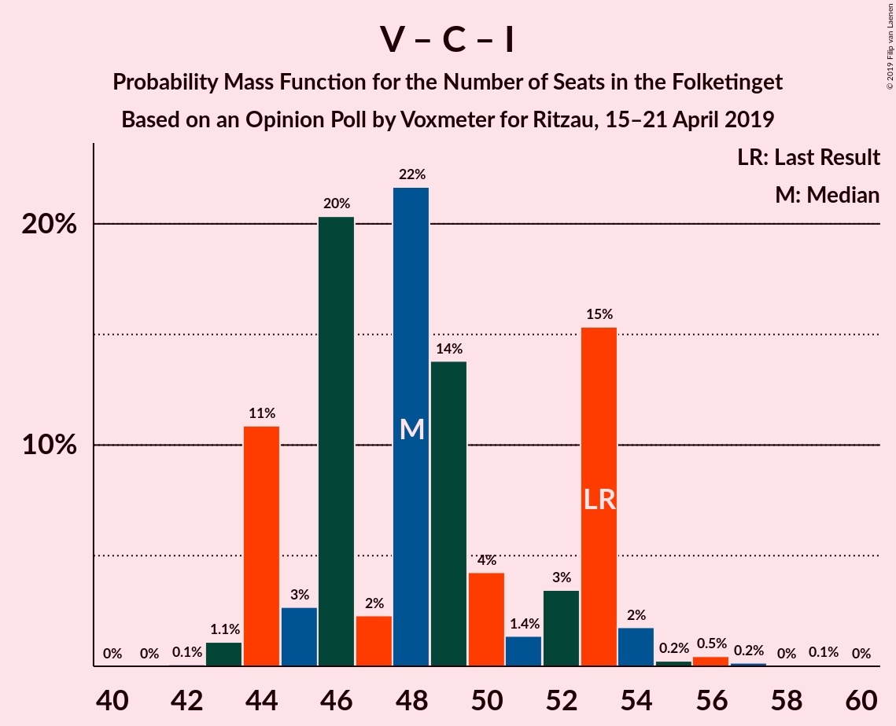

| Number of Seats | Probability | Accumulated | Special Marks |
|:---------------:|:-----------:|:-----------:|:-------------:|
| 41 | 0% | 100% |  |
| 42 | 0.1% | 99.9% |  |
| 43 | 1.1% | 99.9% |  |
| 44 | 11% | 98.8% |  |
| 45 | 3% | 88% |  |
| 46 | 20% | 85% |  |
| 47 | 2% | 65% |  |
| 48 | 22% | 63% |  |
| 49 | 14% | 41% | Median |
| 50 | 4% | 27% |  |
| 51 | 1.4% | 23% |  |
| 52 | 3% | 21% |  |
| 53 | 15% | 18% | Last Result |
| 54 | 2% | 3% |  |
| 55 | 0.2% | 0.9% |  |
| 56 | 0.5% | 0.7% |  |
| 57 | 0.2% | 0.2% |  |
| 58 | 0% | 0.1% |  |
| 59 | 0.1% | 0.1% |  |
| 60 | 0% | 0% |  |

### Venstre – Det Konservative Folkeparti

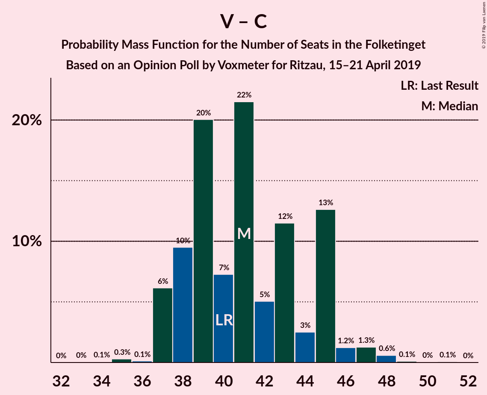

| Number of Seats | Probability | Accumulated | Special Marks |
|:---------------:|:-----------:|:-----------:|:-------------:|
| 34 | 0.1% | 100% |  |
| 35 | 0.3% | 99.9% |  |
| 36 | 0.1% | 99.6% |  |
| 37 | 6% | 99.5% |  |
| 38 | 10% | 93% |  |
| 39 | 20% | 84% |  |
| 40 | 7% | 64% | Last Result |
| 41 | 22% | 56% |  |
| 42 | 5% | 35% | Median |
| 43 | 12% | 30% |  |
| 44 | 3% | 18% |  |
| 45 | 13% | 16% |  |
| 46 | 1.2% | 3% |  |
| 47 | 1.3% | 2% |  |
| 48 | 0.6% | 0.8% |  |
| 49 | 0.1% | 0.2% |  |
| 50 | 0% | 0.1% |  |
| 51 | 0.1% | 0.1% |  |
| 52 | 0% | 0% |  |

### Venstre

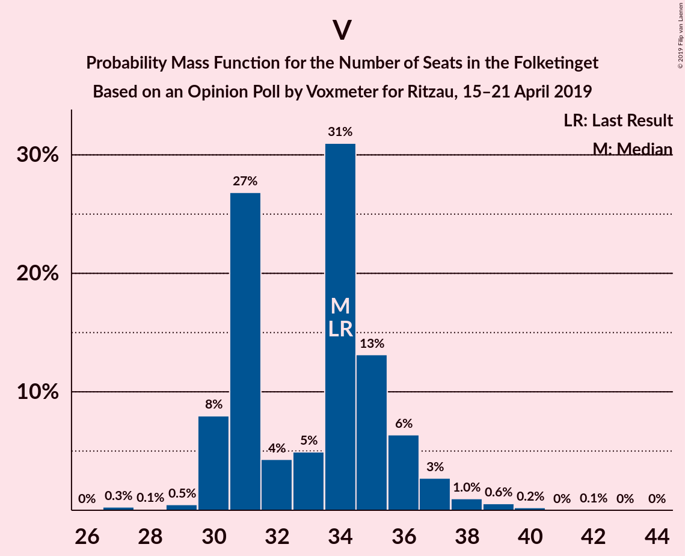

| Number of Seats | Probability | Accumulated | Special Marks |
|:---------------:|:-----------:|:-----------:|:-------------:|
| 27 | 0.3% | 100% |  |
| 28 | 0.1% | 99.7% |  |
| 29 | 0.5% | 99.6% |  |
| 30 | 8% | 99.1% |  |
| 31 | 27% | 91% |  |
| 32 | 4% | 64% |  |
| 33 | 5% | 60% |  |
| 34 | 31% | 55% | Last Result, Median |
| 35 | 13% | 24% |  |
| 36 | 6% | 11% |  |
| 37 | 3% | 5% |  |
| 38 | 1.0% | 2% |  |
| 39 | 0.6% | 0.9% |  |
| 40 | 0.2% | 0.3% |  |
| 41 | 0% | 0.1% |  |
| 42 | 0.1% | 0.1% |  |
| 43 | 0% | 0% |  |

## Technical Information

### Opinion Poll

+ **Polling firm:** Voxmeter
+ **Commissioner(s):** Ritzau
+ **Fieldwork period:** 15–21 April 2019

### Calculations

+ **Sample size:** 1031
+ **Simulations done:** 1,048,576
+ **Error estimate:** 2.85%

